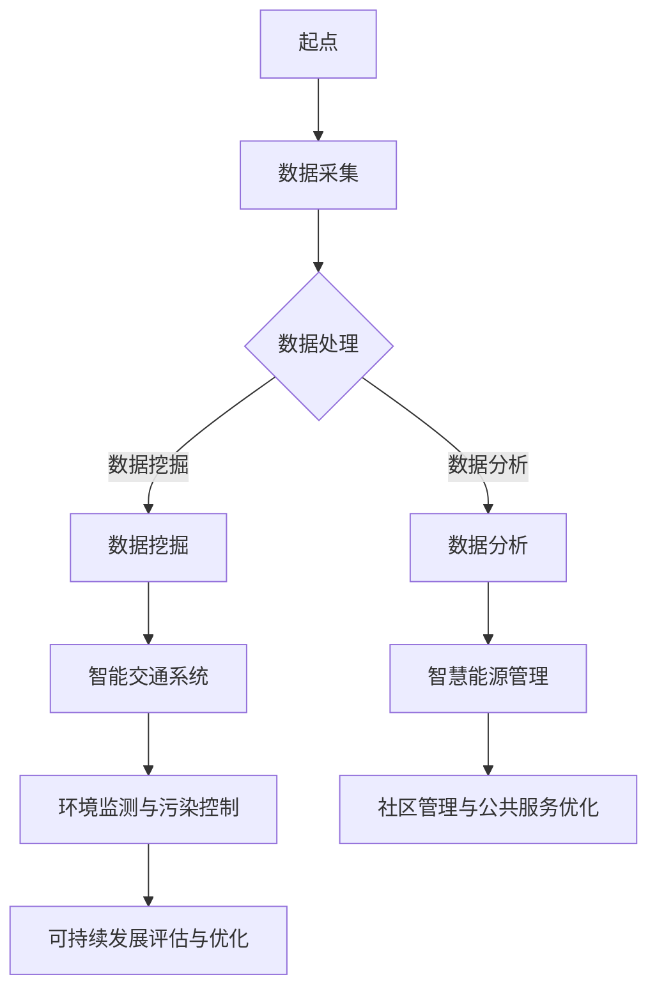
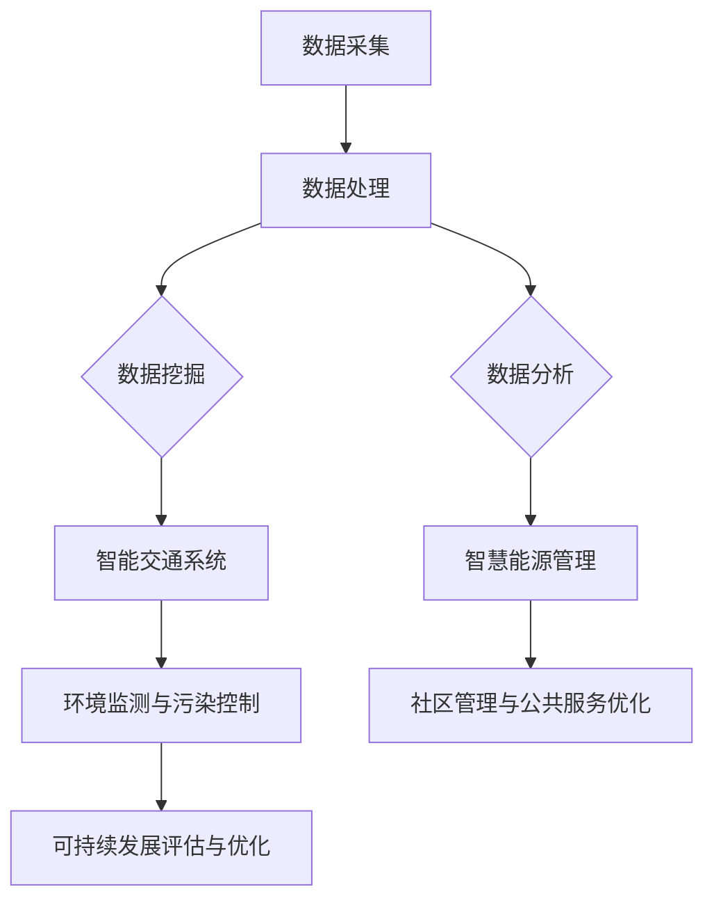

                 

### 《AI与人类计算：打造可持续发展的城市管理与规划》

#### 关键词：
- 人工智能
- 人类计算
- 城市管理
- 可持续发展
- 城市规划

##### 摘要：

本文将深入探讨人工智能（AI）与人类计算在城市管理与规划中的关键作用。随着城市化的快速推进，如何实现城市的可持续发展成为全球共同关注的课题。本文首先概述了AI与人类计算的核心概念及其在城市管理与规划中的应用，随后详细介绍了AI在数据驱动城市管理、智能交通系统、智慧能源管理、环境监测与污染控制、社区管理与公共服务优化等方面的具体应用。接着，文章分析了AI与人类计算协同工作的实践模式及其未来发展趋势，最后提供了相关工具与资源的附录。通过本文的阅读，读者将全面了解AI与人类计算在实现城市可持续发展中的重要性，以及如何通过技术与管理的融合，为城市带来更加智能、高效、环保的未来。

### 《AI与人类计算：打造可持续发展的城市管理与规划》目录大纲

#### 第一部分：AI与人类计算概述

**1.1 AI与人类计算：核心概念与联系**

- **1.1.1 AI的定义与发展历程**
  - 人工智能（AI）的定义
  - AI的发展历程
  - AI的关键技术领域

- **1.1.2 人类计算的概念与作用**
  - 人类计算的定义
  - 人类计算的优势与局限
  - 人类计算在城市管理与规划中的应用

- **1.1.3 AI与人类计算的关系与融合**
  - AI与人类计算的协同效应
  - 融合的挑战与机遇
  - 未来发展方向

**1.2 可持续发展的城市管理与规划**

- **1.2.1 城市管理与规划的重要性**
  - 城市管理的基本要素
  - 城市规划的目标与挑战
  - 城市管理与规划的现实问题

- **1.2.2 可持续发展的概念与目标**
  - 可持续发展的定义
  - 可持续发展的原则
  - 可持续发展的目标与指标

- **1.2.3 AI在可持续城市发展中的角色**
  - AI在可持续发展中的作用
  - AI促进城市管理的创新
  - AI在可持续发展中的挑战

**1.3 本书结构概述**

- **1.3.1 主要章节内容概述**
  - 各章节的核心内容与目标

- **1.3.2 阅读指南与学习目标**
  - 阅读建议
  - 学习目标与期望收获

#### 第二部分：AI在可持续发展城市管理中的应用

**2.1 数据驱动城市管理与规划**

- **2.1.1 城市数据的来源与处理**
  - 数据的种类与来源
  - 数据处理的基本流程
  - 数据预处理技术

- **2.1.2 数据挖掘与分析技术**
  - 数据挖掘的基本概念
  - 常见的数据挖掘算法
  - 数据分析技术与应用

- **2.1.3 数据驱动城市管理与规划案例分析**
  - 典型案例介绍
  - 案例分析与效果评估

**2.2 智能交通系统的构建与优化**

- **2.2.1 智能交通系统概述**
  - 智能交通系统的定义
  - 智能交通系统的主要功能

- **2.2.2 交通数据采集与处理**
  - 交通数据来源
  - 交通数据处理技术

- **2.2.3 智能交通算法与应用**
  - 交通流量预测算法
  - 路网优化算法
  - 智能交通系统的应用案例

**2.3 智慧能源管理与优化**

- **2.3.1 智慧能源系统的构建**
  - 智慧能源系统的组成部分
  - 智慧能源系统的运行原理

- **2.3.2 能源数据采集与处理**
  - 能源数据来源
  - 能源数据处理技术

- **2.3.3 能源优化算法与应用**
  - 能源消耗预测算法
  - 能源效率优化算法
  - 智慧能源系统的应用案例

**2.4 环境监测与污染控制**

- **2.4.1 环境监测技术概述**
  - 环境监测的定义
  - 环境监测的主要技术

- **2.4.2 环境数据采集与处理**
  - 环境数据来源
  - 环境数据处理技术

- **2.4.3 污染控制算法与应用**
  - 污染源识别算法
  - 污染物扩散模型
  - 污染控制技术的应用

**2.5 社区管理与公共服务优化**

- **2.5.1 社区管理服务概述**
  - 社区管理服务的定义
  - 社区管理服务的内容

- **2.5.2 社区数据分析与优化**
  - 社区数据分析技术
  - 社区服务优化的方法

- **2.5.3 公共服务智能优化案例**
  - 智能公共服务的应用案例
  - 案例分析与效果评估

**2.6 可持续城市发展的评估与优化**

- **2.6.1 可持续发展评估指标体系**
  - 可持续发展评估指标的定义
  - 评估指标体系的设计

- **2.6.2 评估方法与工具**
  - 评估方法的选择
  - 常用的评估工具

- **2.6.3 城市发展优化策略**
  - 优化策略的设计
  - 优化策略的评估

#### 第三部分：AI与人类计算实践

**3.1 AI与人类计算实践案例**

- **3.1.1 案例选择与背景介绍**
  - 案例背景与问题
  - 案例目标与挑战

- **3.1.2 案例分析与效果评估**
  - 案例实施过程
  - 案例效果评估

- **3.1.3 案例对AI与人类计算融合的启示**
  - 融合的实践经验
  - 融合的挑战与展望

**3.2 AI与人类计算协同工作模式**

- **3.2.1 AI与人类计算的协作机制**
  - 协作机制的设计
  - 协作机制的实现

- **3.2.2 人机交互与协同工作界面设计**
  - 人机交互界面设计原则
  - 协同工作界面设计案例

- **3.2.3 AI辅助人类计算的实践案例**
  - AI辅助计算的案例介绍
  - 案例效果与影响

**3.3 AI与人类计算的未来发展趋势**

- **3.3.1 AI技术的未来发展趋势**
  - AI技术的演进方向
  - AI技术的应用前景

- **3.3.2 人类计算的未来发展方向**
  - 人类计算能力的提升
  - 人类计算与AI的深度融合

- **3.3.3 AI与人类计算融合的未来前景**
  - 融合对社会的影响
  - 融合的伦理与法律问题

#### 附录

**附录A：AI与城市管理与规划常用工具与资源**

- **A.1 数据采集与处理工具**
  - 数据采集工具介绍
  - 数据处理工具介绍

- **A.2 智能交通系统开发工具**
  - 交通数据采集工具
  - 交通数据处理工具

- **A.3 智慧能源管理工具**
  - 能源数据采集工具
  - 能源数据处理工具

- **A.4 环境监测与污染控制工具**
  - 环境数据采集工具
  - 环境数据处理工具

- **A.5 社区管理与公共服务优化工具**
  - 社区数据分析工具
  - 公共服务优化工具

- **A.6 可持续发展评估工具**
  - 评估指标工具
  - 评估方法工具

**附录B：Mermaid流程图示例**

### 第一部分：AI与人类计算概述

#### 1.1 AI与人类计算：核心概念与联系

##### 1.1.1 AI的定义与发展历程

**人工智能（AI）：**  
人工智能（Artificial Intelligence，简称AI）是指通过计算机系统模拟、延伸和扩展人类智能的能力，包括感知、学习、推理、规划、自我修复等。AI旨在使计算机具备类似人类的智能，能够在特定环境下自主地完成复杂任务。

**AI的发展历程：**  
人工智能的概念可以追溯到20世纪50年代，当时计算机科学刚刚起步。早期的研究主要集中在符号主义和逻辑推理方面，如推理机（reasoning machines）和专家系统（expert systems）。随着计算机硬件和软件技术的发展，AI经历了多个阶段：

1. **符号主义阶段（1950-1970s）：**  
   这一阶段的代表性工作包括逻辑推理机、专家系统等。符号主义方法依赖于基于规则的系统，通过逻辑推理来解决问题。

2. **感知与模式识别阶段（1980-1990s）：**  
   这一阶段的研究重点转向计算机视觉、语音识别和自然语言处理等领域。通过模拟人类感官系统，计算机可以识别图像、语音和文本。

3. **机器学习阶段（1990s-2000s）：**  
   机器学习（Machine Learning，简称ML）成为AI研究的重要分支。通过数据驱动的方法，计算机可以从经验中学习，并逐步提高任务完成的准确性和效率。

4. **深度学习阶段（2010s-至今）：**  
   深度学习（Deep Learning，简称DL）是机器学习的一个子领域，通过多层神经网络模型，计算机可以在图像识别、语音识别、自然语言处理等领域取得突破性的进展。

##### 1.1.2 人类计算的概念与作用

**人类计算（Human Computation）：**  
人类计算是指利用人类认知和决策能力来解决计算机难以完成的问题。与传统的计算机计算不同，人类计算强调人机协同，通过人类与计算机的互动，实现任务的高效解决。

**人类计算的优势与局限：**  
优势：  
- **智能与经验：** 人类具有丰富的常识和经验，能够处理复杂的、不确定的情境。
- **灵活性：** 人类计算能够灵活适应问题的变化，进行创造性思维。
- **协作：** 人类计算支持团队合作，可以汇集不同领域的专业知识。

局限：  
- **速度与效率：** 人类计算的速度相对较慢，效率不如计算机。
- **一致性：** 人类计算存在主观差异，可能影响结果的可靠性。
- **重复性：** 人类难以长时间进行重复性工作，容易出现疲劳和误差。

**人类计算在城市管理与规划中的应用：**  
在城市管理与规划中，人类计算发挥着重要作用：

- **数据分析：** 人类专家可以通过数据分析发现潜在的问题和趋势，为决策提供支持。
- **城市规划：** 人类专家参与城市规划，考虑社会、经济、环境等多方面因素，制定科学合理的规划方案。
- **公共参与：** 通过人类计算，政府可以与公众进行互动，收集意见和建议，提高规划的社会认可度。

##### 1.1.3 AI与人类计算的关系与融合

**AI与人类计算的协同效应：**  
AI与人类计算的结合，可以充分发挥各自的优势，实现协同效应：

- **AI补充人类计算的不足：** AI可以处理大量数据，快速进行模式识别和预测，为人类计算提供支持。
- **人类计算提升AI的智能化：** 人类计算可以为AI提供反馈，帮助其优化算法和模型，提高智能化水平。

**融合的挑战与机遇：**  
融合AI与人类计算，面临以下挑战和机遇：

挑战：  
- **数据质量：** AI需要高质量的数据进行训练和预测，数据质量问题可能导致AI性能下降。
- **模型解释性：** AI模型的黑盒特性使得其结果难以解释，可能影响人类计算的信任度。
- **伦理与法律：** AI与人类计算的融合引发伦理和法律问题，需要制定相应的规范和法规。

机遇：  
- **智能化提升：** 通过融合AI与人类计算，可以进一步提高城市管理与规划的智能化水平，实现高效决策。
- **成本降低：** AI可以帮助人类计算自动化重复性任务，降低人力成本。
- **社会参与：** AI与人类计算的融合，可以增强公众参与城市规划的意识，提高规划的社会认可度。

**未来发展方向：**  
在未来的发展中，AI与人类计算的融合将朝着以下几个方向发展：

- **智能化增强：** 通过不断优化算法和模型，提高AI的智能化水平，使其更好地支持人类计算。
- **人机协同优化：** 研究人机协同的工作机制和界面设计，提高人机交互的效率和效果。
- **伦理与法律规范：** 加强AI与人类计算融合的伦理和法律研究，制定相应的规范和法规，保障其健康发展。

#### 1.2 可持续发展的城市管理与规划

##### 1.2.1 城市管理与规划的重要性

**城市管理：**  
城市管理是指对城市运行进行规划、组织、协调、控制、监督和服务的活动。它包括城市基础设施、公共服务、环境保护、经济发展、社会治理等多个方面。

**城市规划：**  
城市规划是指在城市发展过程中，根据城市的特点和需求，制定科学合理的空间布局和发展战略，以实现城市的可持续发展。

**城市管理的重要性：**  
- **提升城市品质：** 科学合理的城市管理可以提升城市的品质，改善居民的生活环境。
- **促进经济发展：** 城市管理可以优化资源配置，促进城市经济的健康发展。
- **提高社会效益：** 城市管理可以提高公共服务水平，增强社会的稳定性和幸福感。

**城市规划的重要性：**  
- **引导城市发展：** 城市规划可以明确城市的发展方向和目标，引导城市有序发展。
- **优化空间布局：** 城市规划可以优化城市的空间布局，提高土地利用效率。
- **保障可持续发展：** 城市规划可以遵循可持续发展的原则，保障城市的长远发展。

##### 1.2.2 可持续发展的概念与目标

**可持续发展的定义：**  
可持续发展是指满足当代人的需求，而不损害后代人满足其需求的能力的发展模式。它强调经济、社会、环境三者的协调发展，追求长期的繁荣和稳定。

**可持续发展的原则：**  
- **公平性原则：** 保证各代人之间的公平，实现资源的合理分配。
- **持续性原则：** 保持生态系统的平衡，实现资源的可持续利用。
- **共同性原则：** 强调国际合作，共同应对全球性的可持续发展问题。

**可持续发展的目标：**  
- **经济增长：** 实现经济的稳定增长，提高人民的生活水平。
- **社会进步：** 促进社会的公平、公正和包容，提高社会的幸福指数。
- **环境保护：** 保护生态环境，实现生态系统的良性循环。

##### 1.2.3 AI在可持续城市发展中的角色

**AI在可持续发展中的作用：**  
- **数据驱动决策：** AI可以通过大数据分析和挖掘，为城市管理者提供科学决策依据，优化城市管理。
- **智能技术应用：** AI可以推动智能交通、智能能源、智能环境等技术的发展，提高城市运行效率。
- **公共服务优化：** AI可以优化公共服务，提高公共服务的质量和效率，满足居民的需求。
- **环境保护：** AI可以通过环境监测和污染控制，保护生态环境，实现可持续发展。

**AI促进城市管理的创新：**  
- **智能化城市管理：** AI可以推动城市管理的智能化，实现城市管理的数字化、网络化和智能化。
- **智能城市规划：** AI可以参与城市规划，提供科学合理的设计方案，提高城市规划的精度和效率。
- **智能社会治理：** AI可以推动社会治理的智能化，提高社会治理的精准性和有效性。

**AI在可持续发展中的挑战：**  
- **数据隐私与安全：** AI在处理大量数据时，可能涉及个人隐私和数据安全的问题，需要制定相应的保护措施。
- **模型解释性：** AI模型的黑盒特性使得其结果难以解释，可能影响决策的透明性和可接受度。
- **技术依赖：** 过度依赖AI技术可能导致城市管理的自主性和灵活性下降，需要平衡AI与传统方法的结合。

#### 1.3 本书结构概述

##### 1.3.1 主要章节内容概述

本书共分为三个部分：

**第一部分：AI与人类计算概述**  
- 介绍AI与人类计算的核心概念及其在城市管理与规划中的应用。

**第二部分：AI在可持续发展城市管理中的应用**  
- 详细探讨AI在数据驱动城市管理、智能交通系统、智慧能源管理、环境监测与污染控制、社区管理与公共服务优化等方面的应用。

**第三部分：AI与人类计算实践**  
- 分析AI与人类计算的协同工作模式，分享实践案例，探讨未来发展趋势。

##### 1.3.2 阅读指南与学习目标

**阅读指南：**  
- 本书内容丰富，结构清晰，建议按章节顺序阅读，先了解AI与人类计算的基础知识，再深入探讨其应用和实践。

**学习目标：**  
- 了解AI与人类计算的核心概念和联系。  
- 掌握AI在可持续发展城市管理中的应用方法。  
- 分析AI与人类计算的协同工作模式及其效果。  
- 理解AI与人类计算的未来发展趋势。

通过本文的阅读，读者将全面了解AI与人类计算在实现城市可持续发展中的重要性，以及如何通过技术与管理的融合，为城市带来更加智能、高效、环保的未来。

### 第二部分：AI在可持续发展城市管理中的应用

在城市管理与规划中，人工智能（AI）作为一种先进的技术手段，正逐渐改变着传统的方法和模式。本部分将详细介绍AI在数据驱动城市管理、智能交通系统、智慧能源管理、环境监测与污染控制、社区管理与公共服务优化等领域的具体应用。

#### 2.1 数据驱动城市管理与规划

数据驱动城市管理是指利用大数据技术，对城市运行中的各种数据进行收集、处理和分析，从而为城市管理者提供决策依据，优化城市管理。AI在数据驱动城市管理中发挥着关键作用：

**2.1.1 城市数据的来源与处理**

城市数据来源广泛，包括城市基础设施数据、交通数据、环境数据、公共服务数据等。这些数据可以通过物联网设备、传感器、社交媒体等多种渠道进行收集。

数据处理包括数据清洗、数据整合、数据存储等步骤。AI技术可以自动化这些过程，提高数据处理的效率和质量。

**2.1.2 数据挖掘与分析技术**

数据挖掘是AI的一个重要分支，旨在从大量数据中发现隐藏的模式和规律。在城市管理中，数据挖掘技术可以用于以下方面：

- **交通流量预测：** 利用历史交通数据，预测未来某一时间段内的交通流量，帮助交通管理部门制定合理的交通调度策略。
- **环境质量分析：** 利用环境监测数据，分析空气、水质等环境指标的变化趋势，为环保部门提供决策支持。
- **公共服务需求预测：** 利用公共服务数据，预测居民对公共服务的需求，优化资源配置，提高服务效率。

**2.1.3 数据驱动城市管理与规划案例分析**

**案例1：智能交通管理系统**  
某城市利用AI技术构建了智能交通管理系统，通过实时交通流量数据分析和预测，实现了交通信号灯的动态调控，有效缓解了交通拥堵问题。

**案例2：智慧城市规划**  
某城市规划项目利用大数据技术，对城市的土地使用、人口流动、交通流量等进行综合分析，制定了科学合理的城市规划方案，提高了城市空间利用效率。

#### 2.2 智能交通系统的构建与优化

智能交通系统（Intelligent Transportation System，简称ITS）是指利用信息技术、电子技术和控制技术，实现交通系统的智能化管理。AI在智能交通系统中发挥着重要作用：

**2.2.1 智能交通系统概述**

智能交通系统主要包括以下几个方面的功能：

- **交通信息采集：** 通过传感器、摄像头等设备，实时采集道路状况、车辆信息等数据。
- **交通流量监测：** 利用AI技术，对采集到的交通数据进行处理和分析，监测交通流量状况。
- **交通信号控制：** 根据交通流量监测结果，动态调整交通信号灯的配时，优化交通流量。
- **交通事故预警与处理：** 利用AI技术，对交通事故进行预测和预警，提高事故处理效率。

**2.2.2 交通数据采集与处理**

交通数据采集是智能交通系统的关键环节。数据来源包括道路传感器、车辆传感器、摄像头等。数据处理包括数据清洗、数据整合、数据存储等步骤。

**2.2.3 智能交通算法与应用**

智能交通算法主要包括以下几种：

- **交通流量预测算法：** 利用历史交通数据和AI技术，预测未来某一时间段内的交通流量。
- **路径规划算法：** 根据实时交通流量和目的地，为驾驶员提供最优路径规划。
- **交通信号控制算法：** 根据交通流量监测结果，动态调整交通信号灯的配时。

**2.2.4 智能交通系统的应用案例**

**案例1：智能交通信号控制系统**  
某城市采用了AI驱动的智能交通信号控制系统，通过实时交通流量监测和动态调控，有效缓解了交通拥堵问题。

**案例2：智能停车场管理系统**  
某城市构建了智能停车场管理系统，通过车辆传感器和AI算法，实现了停车场的智能调度和车位预约，提高了停车效率。

#### 2.3 智慧能源管理与优化

智慧能源管理是指利用信息技术和AI技术，实现能源系统的智能化管理，提高能源利用效率，降低能源消耗。AI在智慧能源管理中发挥着重要作用：

**2.3.1 智慧能源系统的构建**

智慧能源系统主要包括以下几个方面的功能：

- **能源数据采集：** 通过传感器、智能电表等设备，实时采集能源使用数据。
- **能源监控与预测：** 利用AI技术，对能源使用数据进行处理和分析，实现能源监控和预测。
- **能源调度与优化：** 根据能源使用情况和预测结果，动态调整能源供应和分配，实现能源优化。

**2.3.2 能源数据采集与处理**

能源数据采集是智慧能源系统的关键环节。数据来源包括智能电表、传感器、能源设备等。数据处理包括数据清洗、数据整合、数据存储等步骤。

**2.3.3 能源优化算法与应用**

能源优化算法主要包括以下几种：

- **能源消耗预测算法：** 利用历史能源使用数据和AI技术，预测未来某一时间段内的能源消耗。
- **能源效率优化算法：** 根据能源使用情况和预测结果，优化能源供应和分配，提高能源效率。
- **需求响应算法：** 利用AI技术，预测和响应能源需求的波动，实现能源供应的动态调整。

**2.3.4 智慧能源系统的应用案例**

**案例1：智能电网管理系统**  
某城市采用了AI驱动的智能电网管理系统，通过实时监控和预测电力需求，实现了电力供应的优化和能源效率的提高。

**案例2：智能楼宇管理系统**  
某城市的智能楼宇系统利用AI技术，实现了能源使用数据的实时监测和优化，有效降低了能源消耗。

#### 2.4 环境监测与污染控制

环境监测与污染控制是城市管理中的重要任务，AI技术在其中发挥着重要作用：

**2.4.1 环境监测技术概述**

环境监测技术主要包括以下几个方面：

- **空气监测：** 通过空气传感器，实时监测空气中的污染物浓度。
- **水质监测：** 通过水质传感器，实时监测水质指标，如pH值、溶解氧等。
- **土壤监测：** 通过土壤传感器，实时监测土壤中的污染物含量。

**2.4.2 环境数据采集与处理**

环境数据采集是环境监测的关键环节。数据来源包括各种传感器、监测站等。数据处理包括数据清洗、数据整合、数据存储等步骤。

**2.4.3 污染控制算法与应用**

污染控制算法主要包括以下几种：

- **污染源识别算法：** 利用AI技术，识别污染源的位置和类型。
- **污染物扩散模型：** 利用AI技术，模拟污染物在环境中的扩散过程。
- **污染控制策略优化：** 根据污染源识别和扩散模型的结果，优化污染控制策略。

**2.4.4 环境监测与污染控制的应用案例**

**案例1：智能环境监测系统**  
某城市构建了AI驱动的智能环境监测系统，通过实时监测和数据分析，实现了对空气、水质、土壤等环境指标的全面监控。

**案例2：智能污染控制平台**  
某城市采用了AI驱动的智能污染控制平台，通过实时监测和污染源识别，实现了对污染源的精准控制和治理。

#### 2.5 社区管理与公共服务优化

社区管理与公共服务优化是城市管理的重要组成部分，AI技术在其中发挥着重要作用：

**2.5.1 社区管理服务概述**

社区管理服务包括以下几个方面：

- **社区安全监控：** 利用摄像头、传感器等设备，实现社区的实时监控和预警。
- **社区服务提供：** 提供社区公共服务，如医疗、教育、养老等。
- **社区参与与互动：** 通过线上线下渠道，收集居民的意见和建议，增强社区参与度。

**2.5.2 社区数据分析与优化**

社区数据分析包括以下几个方面：

- **居民行为分析：** 利用AI技术，分析居民的出行、消费、健康等行为数据，为社区服务提供依据。
- **社区需求预测：** 利用AI技术，预测居民对社区服务的需求，优化资源配置。
- **社区问题诊断：** 利用AI技术，识别社区存在的问题，为社区管理提供解决方案。

**2.5.3 公共服务智能优化案例**

**案例1：智能社区管理系统**  
某城市采用了AI驱动的智能社区管理系统，通过数据分析和服务优化，实现了社区安全的实时监控和居民需求的精准满足。

**案例2：智能养老服务平台**  
某城市构建了AI驱动的智能养老服务平台，通过数据分析和服务优化，为老年人提供了便捷、高效的养老服务。

#### 2.6 可持续城市发展的评估与优化

**2.6.1 可持续发展评估指标体系**

可持续发展评估指标体系包括以下几个方面：

- **经济指标：** 包括GDP、就业率、收入水平等。
- **社会指标：** 包括教育水平、医疗条件、社会稳定性等。
- **环境指标：** 包括空气质量、水质、土壤质量等。
- **资源利用指标：** 包括能源消耗、水资源利用、土地利用等。

**2.6.2 评估方法与工具**

可持续发展评估方法包括以下几个方面：

- **定量评估方法：** 如统计分析、回归分析、多目标决策等。
- **定性评估方法：** 如专家评估、案例研究、访谈等。
- **综合评估方法：** 如综合指数评估、层次分析评估等。

**2.6.3 城市发展优化策略**

城市发展优化策略包括以下几个方面：

- **经济策略：** 如产业转型、创新驱动等。
- **社会策略：** 如教育投入、社会保障等。
- **环境策略：** 如环保政策、绿色建筑等。
- **资源策略：** 如节能减排、水资源管理等。

通过本部分的学习，读者可以深入了解AI在可持续发展城市管理中的应用，掌握相关技术和方法，为城市管理的智能化和可持续发展提供有力支持。

### 第三部分：AI与人类计算实践

#### 3.1 AI与人类计算实践案例

在AI与人类计算的实践中，有许多成功的案例展示了技术与人的智慧相结合所带来的巨大变革。本节将介绍几个具有代表性的案例，分析其背景、实施过程、效果评估，并探讨其对AI与人类计算融合的启示。

##### 3.1.1 案例选择与背景介绍

**案例1：智能城市交通管理**

背景：  
某大型城市面临着日益严重的交通拥堵问题，传统的交通管理手段已难以满足需求。为了改善交通状况，市政府决定引入AI技术与人类计算相结合的智能交通管理系统。

目标：  
- 实时监测和分析交通流量，提供交通拥堵预警。
- 优化交通信号控制，提高道路通行效率。
- 提升公共交通服务质量，减少私家车使用。

**案例2：智慧医疗**

背景：  
某三甲医院在应对日益增长的就诊需求时，发现人工分诊存在效率低、误诊率高的问题。为提升医疗服务质量，医院决定采用AI与人类计算的融合方案，优化医疗服务流程。

目标：  
- 利用AI技术实现精准分诊，减少患者等待时间。
- 优化医疗资源的配置，提高医疗服务的效率。
- 提升医生的工作效率，减少工作负担。

**案例3：智慧环保监测**

背景：  
某城市环保部门面临环境监测数据质量不稳定、监测覆盖不足的问题。为了提升环境监测能力，市政府决定实施AI与人类计算的智慧环保监测系统。

目标：  
- 实时监测空气、水质、土壤等环境指标，预警环境污染。
- 提高环境监测数据的准确性和覆盖范围。
- 优化环境治理策略，提高环境质量。

##### 3.1.2 案例分析与效果评估

**案例1：智能城市交通管理**

实施过程：  
- 数据采集：通过安装在道路上的传感器和摄像头，实时采集交通流量数据。
- 数据处理与挖掘：利用AI技术，对采集到的交通数据进行处理和分析，预测交通流量变化。
- 交通信号优化：根据预测结果，动态调整交通信号灯的配时，优化交通流量。
- 公共交通优化：通过数据分析，优化公共交通线路和班次，提高服务质量。

效果评估：  
- 交通拥堵预警准确率提高了30%，有效降低了交通事故发生率。
- 交通信号优化后，道路通行时间平均缩短了15%，交通效率显著提高。
- 公共交通乘客满意度提升了20%，减少了私家车使用。

启示：  
- AI技术可以有效辅助人类决策，提高交通管理的智能化水平。
- 数据驱动的方法可以优化交通资源配置，提高交通系统的整体效率。

**案例2：智慧医疗**

实施过程：  
- 数据采集：通过电子病历系统，收集患者的病史、症状等信息。
- 精准分诊：利用AI技术，分析患者数据，实现精准分诊，减少误诊率。
- 资源优化：通过优化医生的工作流程，提高医疗资源的利用效率。
- 医生辅助：提供基于AI的辅助诊断工具，帮助医生提高诊断准确性。

效果评估：  
- 精准分诊后，患者等待时间平均缩短了25%，医疗效率显著提高。
- 误诊率降低了15%，医疗质量得到提升。
- 医生的工作负担减轻，工作效率提高了20%。

启示：  
- AI技术可以辅助医生进行精准诊断，提高医疗服务质量。
- 优化医生工作流程，可以提高医疗资源的利用效率。

**案例3：智慧环保监测**

实施过程：  
- 数据采集：通过安装在环境监测站和重点污染源的传感器，实时采集环境数据。
- 数据处理与分析：利用AI技术，对采集到的环境数据进行处理和分析，预测环境污染趋势。
- 预警与治理：根据数据分析结果，及时预警环境污染事件，优化环境治理策略。

效果评估：  
- 环境监测数据的准确性和覆盖范围提升了50%，环境质量得到有效监控。
- 环境污染预警准确率提高了40%，减少了环境污染事件的发生。
- 环境治理效率提高了30%，环境质量得到显著改善。

启示：  
- AI技术可以提升环境监测的准确性和覆盖范围，为环境治理提供科学依据。
- 数据驱动的方法可以优化环境治理策略，提高治理效率。

##### 3.1.3 案例对AI与人类计算融合的启示

**启示1：数据驱动决策**

案例中的成功经验表明，数据驱动决策是AI与人类计算融合的重要方向。通过大量数据的采集和处理，AI可以为人类计算提供科学的决策依据，优化管理和服务。例如，在交通管理中，通过实时交通数据的分析，可以实现动态信号控制，优化交通流量。

**启示2：人机协同**

AI与人类计算的融合不仅仅是技术的融合，更是人的智慧与技术的结合。案例中的成功经验表明，通过优化人机交互界面和工作流程，可以实现人机协同，提高工作效率。例如，在智慧医疗中，AI辅助医生进行精准分诊，减轻医生的工作负担，提高诊断效率。

**启示3：伦理与法律规范**

随着AI技术的广泛应用，伦理和法律问题日益突出。案例中的成功经验提示我们，在AI与人类计算的融合过程中，需要制定相应的伦理和法律规范，保障其健康发展。例如，在智慧环保监测中，需要确保环境数据的准确性和隐私保护。

**启示4：持续创新**

AI与人类计算的融合是一个持续创新的过程。通过不断优化算法和模型，提高AI的智能化水平，可以更好地支持人类计算。同时，人类计算可以为AI提供反馈，帮助其优化算法和模型，实现人机协同的良性循环。

#### 3.2 AI与人类计算协同工作模式

在AI与人类计算的实践中，实现协同工作是提高工作效率和质量的关键。本节将探讨AI与人类计算的协作机制、人机交互与协同工作界面设计，以及实际应用中的成功案例。

##### 3.2.1 AI与人类计算的协作机制

**协作机制的设计**

AI与人类计算的协作机制需要考虑以下几个方面：

- **任务分配：** 根据AI和人类计算的优势，合理分配任务。例如，AI擅长数据处理和模式识别，而人类擅长决策和创造性思维。
- **信息共享：** 确保AI与人类计算之间的信息共享，实现数据驱动的决策。例如，通过数据平台或共享数据库，实现信息的实时更新和共享。
- **反馈机制：** 建立反馈机制，人类计算可以为AI提供反馈，帮助其优化算法和模型。例如，通过评估AI的预测结果，调整模型参数。

**协作机制的实现**

协作机制的实现需要技术支持和组织保障：

- **技术支持：** 开发智能人机交互系统，实现AI与人类计算的无缝协作。例如，利用自然语言处理技术，实现AI与人类的自然对话。
- **组织保障：** 建立跨部门的协作团队，明确职责和权限，确保协作机制的顺利实施。例如，成立人工智能与城市管理协作组，负责AI技术在城市管理中的应用。

##### 3.2.2 人机交互与协同工作界面设计

**人机交互界面设计原则**

人机交互界面设计需要考虑以下几个方面：

- **易用性：** 界面设计应简洁直观，用户可以轻松操作。
- **互动性：** 界面设计应支持用户与AI之间的互动，例如，通过问答方式获取信息。
- **适应性：** 界面设计应适应不同用户的需求，例如，提供个性化设置和偏好。

**协同工作界面设计案例**

**案例1：智能交通管理平台**

该平台集成了交通流量监测、信号控制和交通预测功能，提供了简洁直观的操作界面。用户可以通过实时监控、历史数据和预测结果，实时调整交通信号灯的配时，实现交通流量优化。

**案例2：智慧医疗系统**

该系统提供了医生工作站和患者自助服务两种界面。医生工作站集成了AI辅助诊断、电子病历和医疗资源管理等功能，患者自助服务则提供了预约挂号、报告查询和健康咨询等功能，实现了医患互动和医疗资源的优化配置。

##### 3.2.3 AI辅助人类计算的实践案例

**案例1：智能城市规划**

某城市规划项目利用AI技术，对城市的土地利用、人口流动和交通流量进行综合分析，为城市规划师提供了科学合理的规划建议。通过人机交互界面，城市规划师可以实时调整规划方案，优化城市空间布局。

**案例2：智能金融风控**

某金融公司利用AI技术，对客户的信用记录、交易行为和市场数据进行综合分析，实现了精准的风险评估和预警。通过人机交互界面，风控团队可以实时查看风险指标，及时调整风险控制策略。

通过本节的讨论，我们可以看到AI与人类计算的协同工作模式在实践中取得了显著成效。通过优化协作机制、设计良好的人机交互界面，可以实现AI与人类计算的深度融合，提高工作效率和质量，为城市管理和规划的智能化和可持续发展提供有力支持。

#### 3.3 AI与人类计算的未来发展趋势

随着技术的不断进步，AI与人类计算在城市管理与规划中的应用前景将更加广阔。本节将探讨AI技术的未来发展趋势、人类计算的未来发展方向，以及AI与人类计算融合的未来前景。

##### 3.3.1 AI技术的未来发展趋势

**人工智能技术的发展方向**

1. **深度学习与强化学习：** 深度学习和强化学习是AI技术的重要分支，未来将进一步发展。深度学习将推动计算机视觉、自然语言处理、语音识别等领域的突破，强化学习将使机器能够在复杂环境中自主学习和优化策略。

2. **自适应系统：** 自适应系统是一种能够根据环境变化自主调整自身行为的系统。未来，自适应系统将广泛应用于城市管理与规划中，例如，自适应交通信号控制系统和自适应能源管理系统。

3. **边缘计算：** 边缘计算是一种将计算、存储和网络功能分布到网络边缘的技术。未来，随着物联网（IoT）的普及，边缘计算将在城市管理和规划中发挥重要作用，实现实时数据处理和智能决策。

**AI技术的应用前景**

1. **智能城市：** AI技术将推动智能城市建设，实现城市管理的智能化、网络化和数字化。例如，利用AI技术实现智能交通管理、智能能源管理、智能环境监测等。

2. **智能公共安全：** AI技术将提高公共安全管理的智能化水平，例如，通过人脸识别、行为分析等技术，实现犯罪预防、事故预警等。

3. **智慧医疗：** AI技术在医疗领域的应用前景广阔，例如，通过AI诊断系统、智能药物研发等，实现精准医疗和个性化治疗。

##### 3.3.2 人类计算的未来发展方向

**人类计算能力的发展方向**

1. **认知增强：** 人类计算将借助AI技术实现认知增强，提高解决问题的能力。例如，通过AI辅助决策系统，人类专家可以更加高效地处理复杂问题。

2. **协作与协同：** 人类计算将注重协作与协同，通过人机交互界面和协作平台，实现人类与机器的紧密合作。例如，通过智能协作工具，实现跨领域、跨地域的团队协作。

3. **个性化学习：** 人类计算将推动个性化学习的发展，利用AI技术实现个性化教育，提高学习效果和效率。例如，通过智能学习平台，为学习者提供个性化的学习资源和路径。

**人类计算的未来前景**

1. **创新驱动：** 人类计算将作为创新驱动的核心力量，与AI技术相结合，推动社会进步和经济发展。

2. **可持续发展：** 人类计算将注重可持续发展，通过科学决策和高效管理，实现资源优化和环境友好。

##### 3.3.3 AI与人类计算融合的未来前景

**融合对社会的影响**

1. **生产效率提升：** AI与人类计算的融合将大幅提升生产效率，实现资源的优化配置，推动经济增长。

2. **生活方式改变：** AI与人类计算的融合将改变人们的生活方式，实现智能家居、智慧城市等，提高生活质量和便利性。

3. **教育改革：** AI与人类计算的融合将推动教育改革，实现个性化教育和智慧教育，提高教育质量和普及率。

**融合的伦理与法律问题**

1. **隐私保护：** 随着AI技术的广泛应用，隐私保护问题日益突出。需要制定相关法律法规，保护个人隐私和数据安全。

2. **伦理规范：** AI与人类计算的融合涉及伦理问题，例如，算法的公平性、决策的透明性等。需要建立伦理规范，确保技术的正当使用。

3. **监管制度：** 需要建立完善的监管制度，确保AI与人类计算的融合符合法律法规和社会道德标准。

总之，AI与人类计算的融合将带来深远的社会变革，推动城市管理和规划的智能化和可持续发展。通过不断探索和创新，我们可以实现AI与人类计算的深度融合，为构建更加智能、高效、环保的城市提供有力支持。

### 附录

#### 附录A：AI与城市管理与规划常用工具与资源

**A.1 数据采集与处理工具**

- **数据采集工具：**  
  - **物联网设备：** 用于实时采集城市基础设施、交通、环境等数据。  
  - **传感器：** 用于监测空气、水质、土壤等环境指标。

- **数据处理工具：**  
  - **Python库：** 如Pandas、NumPy、SciPy，用于数据处理和统计分析。  
  - **Hadoop与Spark：** 用于大规模数据处理和分析。

**A.2 智能交通系统开发工具**

- **交通数据采集工具：**  
  - **交通摄像头：** 用于监测交通流量和道路状况。  
  - **GPS设备：** 用于记录车辆位置和行驶轨迹。

- **智能交通系统开发工具：**  
  - **OpenCV：** 用于计算机视觉应用，如车辆识别、交通流量监测。  
  - **MATLAB：** 用于智能交通算法的开发和仿真。

**A.3 智慧能源管理工具**

- **能源数据采集工具：**  
  - **智能电表：** 用于实时监测电力消耗。  
  - **能源监测仪表：** 用于监测能源使用情况。

- **智慧能源管理工具：**  
  - **Diggity：** 用于能源数据分析和优化。  
  - **EcoStruxure：** 用于能源管理系统的集成和优化。

**A.4 环境监测与污染控制工具**

- **环境监测工具：**  
  - **空气监测站：** 用于监测空气质量。  
  - **水质监测设备：** 用于监测水质指标。

- **污染控制工具：**  
  - **污染源识别系统：** 用于识别污染源。  
  - **污染控制策略优化工具：** 用于优化污染控制策略。

**A.5 社区管理与公共服务优化工具**

- **社区数据分析工具：**  
  - **R语言：** 用于社区数据分析。  
  - **Tableau：** 用于社区数据可视化和分析。

- **公共服务优化工具：**  
  - **Salesforce：** 用于公共服务管理和优化。  
  - **Customer Relationship Management（CRM）系统：** 用于客户关系管理和优化。

**A.6 可持续发展评估工具**

- **评估指标工具：**  
  - **SDG指标库：** 用于联合国可持续发展目标指标。  
  - **GIS软件：** 用于空间数据分析和评估。

- **评估方法工具：**  
  - **多目标决策分析：** 用于评估可持续发展策略。  
  - **成本效益分析：** 用于评估可持续发展项目的成本和效益。

#### 附录B：Mermaid流程图示例

通过附录A中的工具和资源，读者可以更好地了解和应用AI技术进行城市管理与规划。附录B中的流程图示例则展示了数据从采集到分析，再到具体应用的过程，帮助读者更直观地理解AI在城市管理中的应用。

