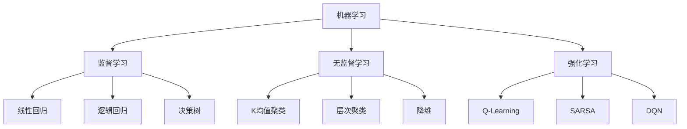

                 

# 《AI人工智能核心算法原理与代码实例讲解：数据收集》

> **关键词**：人工智能、算法、数据收集、数据预处理、代码实例

> **摘要**：本文深入探讨了AI人工智能领域的数据收集过程，包括数据来源、数据收集方法、数据预处理、数据变换等核心环节。通过详细的算法原理讲解、伪代码示例和实际项目案例，帮助读者全面理解并掌握AI数据收集的实践技巧。

## 目录

### 第一部分: AI人工智能核心算法原理

#### 第1章: AI人工智能概述

##### 1.1 AI人工智能的定义与历史发展

###### 1.1.1 AI人工智能的定义

人工智能（Artificial Intelligence，简称AI）是计算机科学的一个分支，旨在使计算机系统具备类似人类的智能行为，如学习、推理、感知和解决问题。它起源于20世纪50年代，经过数十年的发展，如今已成为计算机科学和工程领域的重要研究方向。

###### 1.1.2 AI人工智能的核心概念

AI人工智能的核心概念包括：

- **机器学习**：一种让计算机通过数据学习并改进性能的方法。
- **深度学习**：一种通过多层神经网络进行特征提取和学习的机器学习技术。
- **自然语言处理**：研究如何让计算机理解和生成人类语言的技术。

###### 1.1.3 AI人工智能的应用领域

AI人工智能在多个领域都有广泛应用，包括：

- **智能家居**：通过AI技术实现家居设备的智能化，如智能门锁、智能照明等。
- **语音识别**：利用AI技术将语音转换为文本，应用于智能助手、语音搜索等。
- **自动驾驶**：使用AI技术实现车辆的自动驾驶，提高行车安全。

##### 1.2 AI人工智能的核心算法

AI人工智能的核心算法包括：

- **监督学习**：通过训练数据来建立模型，然后使用模型对新数据进行预测。
- **无监督学习**：没有预先标记的标签，通过发现数据中的内在结构来学习。
- **强化学习**：通过不断试错，在奖励和惩罚机制下学习最优策略。

#### 第2章: 数据收集与预处理

##### 2.1 数据收集

###### 2.1.1 数据来源

数据来源可以分为以下几类：

- **公开数据集**：如UCI机器学习库、Kaggle等。
- **私有数据集**：企业或研究机构自行收集和创建的数据集。
- **社交媒体数据**：通过爬虫技术收集的社交媒体平台上的数据。

###### 2.1.2 数据收集方法

数据收集方法包括：

- **爬虫技术**：使用爬虫程序自动获取网页数据。
- **API接口**：通过应用程序接口（API）获取数据。
- **问卷调查**：通过设计问卷收集用户数据。

##### 2.2 数据预处理

###### 2.2.1 数据清洗

数据清洗包括以下步骤：

- **缺失值处理**：通过填充或删除的方式处理缺失值。
- **异常值处理**：识别并处理异常值，以避免对模型训练产生不利影响。

###### 2.2.2 数据集成

数据集成包括以下方法：

- **数据合并**：将多个数据源中的数据合并成一个整体。
- **数据转换**：将数据转换成统一的格式，以便后续处理。

###### 2.2.3 数据变换

数据变换包括以下方法：

- **数据归一化**：将数据缩放到相同的尺度，以消除不同特征之间的量纲影响。
- **特征工程**：通过创建新的特征或变换现有特征，提高模型的性能。

#### 第3章: 特征选择与特征提取

##### 3.1 特征选择

特征选择是数据预处理的重要步骤，包括以下方法：

- **递归特征消除（RFE）**：通过递归地选择和排除特征，找到最优特征组合。
- **主成分分析（PCA）**：通过线性变换降低数据的维度，同时保留主要特征。

##### 3.2 特征提取

特征提取包括以下方法：

- **K最近邻（KNN）**：通过计算新数据与训练数据的距离，找到最近的K个邻居，并提取这些邻居的特征。
- **决策树（DT）**：通过构建决策树来提取数据中的特征。

#### 第4章: 分类算法原理与应用

##### 4.1 分类算法概述

分类算法可以分为以下几类：

- **监督学习分类**：使用标记数据训练模型，对新数据进行分类。
- **无监督学习分类**：没有标记数据，通过数据分布进行分类。

##### 4.2 常见分类算法

常见分类算法包括：

- **K最近邻（KNN）**：基于距离的最近邻分类算法。
- **决策树（DT）**：通过构建决策树进行分类。
- **随机森林（RF）**：基于决策树的集成分类算法。

##### 4.3 分类算法应用案例

分类算法在多个领域都有广泛应用，如：

- **信用评分**：根据客户的信用历史进行评分。
- **疾病诊断**：根据病人的症状和检查结果进行诊断。

#### 第5章: 聚类算法原理与应用

##### 5.1 聚类算法概述

聚类算法可以分为以下几类：

- **无监督学习聚类**：没有标记数据，通过数据分布进行聚类。
- **半监督学习聚类**：部分数据有标记，部分数据无标记。

##### 5.2 常见聚类算法

常见聚类算法包括：

- **K均值（K-Means）**：基于距离的聚类算法。
- **层次聚类（HC）**：通过构建层次树进行聚类。
- **密度聚类（DBSCAN）**：基于数据点密度的聚类算法。

##### 5.3 聚类算法应用案例

聚类算法在多个领域都有广泛应用，如：

- **社区发现**：根据用户行为和兴趣进行社区划分。
- **顾客细分**：根据顾客的消费行为进行市场细分。

#### 第6章: 回归算法原理与应用

##### 6.1 回归算法概述

回归算法可以分为以下几类：

- **监督学习回归**：使用标记数据训练模型，对新数据进行预测。
- **无监督学习回归**：没有标记数据，通过数据分布进行回归。

##### 6.2 常见回归算法

常见回归算法包括：

- **线性回归（LR）**：基于线性模型的回归算法。
- **逻辑回归（LR）**：基于逻辑模型的回归算法。
- **多项式回归（PR）**：基于多项式模型的回归算法。

##### 6.3 回归算法应用案例

回归算法在多个领域都有广泛应用，如：

- **房价预测**：根据房屋的特征预测房价。
- **股票预测**：根据股票的历史数据预测股票价格。

#### 第7章: 强化学习算法原理与应用

##### 7.1 强化学习概述

强化学习是一种通过试错和奖励机制进行学习的方法，其核心概念包括：

- **状态（State）**：描述系统的当前状态。
- **动作（Action）**：在特定状态下采取的行动。
- **奖励（Reward）**：对当前动作的反馈。
- **策略（Policy）**：从当前状态选择最佳动作的规则。

##### 7.2 常见强化学习算法

常见强化学习算法包括：

- **Q-Learning**：通过更新Q值进行学习。
- **SARSA**：通过更新状态-动作值进行学习。
- **DQN**：通过深度神经网络进行学习。

##### 7.3 强化学习应用案例

强化学习在多个领域都有广泛应用，如：

- **游戏智能**：通过强化学习实现游戏的智能控制。
- **自动驾驶**：通过强化学习实现自动驾驶车辆的智能决策。

#### 第8章: AI人工智能应用实战

##### 8.1 数据收集与预处理实战

在AI人工智能项目中，数据收集与预处理是非常重要的一步，以下是一个数据收集与预处理实战案例：

- **应用场景**：预测客户流失。
- **数据收集**：通过问卷调查、社交媒体数据等方式收集客户信息。
- **数据预处理**：去除缺失值、异常值，对类别型特征进行编码。
- **特征工程**：提取有意义的特征，如客户购买频率、客户服务评分等。

##### 8.2 模型训练与评估实战

在AI人工智能项目中，模型训练与评估是关键的一步，以下是一个模型训练与评估实战案例：

- **应用场景**：预测客户流失。
- **模型训练**：使用监督学习算法（如随机森林）对数据进行训练。
- **模型评估**：使用交叉验证等方法对模型进行评估，选择最优模型。

##### 8.3 模型部署与优化实战

在AI人工智能项目中，模型部署与优化是关键的一步，以下是一个模型部署与优化实战案例：

- **应用场景**：预测客户流失。
- **模型部署**：将训练好的模型部署到生产环境中，实现对客户流失的实时预测。
- **模型优化**：通过调参、特征工程等方法对模型进行优化，提高预测准确率。

#### 第9章: AI人工智能未来发展趋势

##### 9.1 AI人工智能技术发展趋势

AI人工智能技术发展趋势包括：

- **深度学习**：通过神经网络实现更高效的特征提取和学习。
- **强化学习**：通过试错和奖励机制实现更智能的决策。
- **自然语言处理**：通过深度学习技术实现更准确的文本理解和生成。

##### 9.2 AI人工智能应用领域拓展

AI人工智能应用领域拓展包括：

- **医疗健康**：通过AI技术实现疾病的早期检测和个性化治疗。
- **金融**：通过AI技术实现智能投顾、风险控制等。
- **智能制造**：通过AI技术实现生产过程的自动化和优化。

##### 9.3 AI人工智能伦理与法律问题

AI人工智能伦理与法律问题包括：

- **数据隐私**：如何保护用户的数据隐私。
- **人工智能责任**：如何确定人工智能系统的责任归属。
- **法律框架**：如何建立完善的人工智能法律框架。

### 附录

#### 附录 A: AI人工智能开发工具与资源

- **主流深度学习框架**：介绍TensorFlow、PyTorch等主流深度学习框架的特点和优势。
- **开发工具与环境搭建**：介绍如何搭建AI人工智能开发环境，包括Python、Jupyter Notebook等。

#### 附录 B: 实战代码

- **数据收集代码**：介绍如何使用Python进行数据收集。
- **数据预处理代码**：介绍如何使用Python进行数据预处理。
- **模型训练代码**：介绍如何使用Python进行模型训练。
- **模型评估代码**：介绍如何使用Python进行模型评估。
- **模型部署代码**：介绍如何使用Python进行模型部署。

#### 附录 C: 参考文献

- 列出本文引用的相关书籍、论文和在线资源。

---

## 第一部分: AI人工智能核心算法原理

### 第1章: AI人工智能概述

#### 1.1 AI人工智能的定义与历史发展

##### 1.1.1 AI人工智能的定义

人工智能（Artificial Intelligence，简称AI）是指通过计算机系统实现智能行为的一种技术。具体来说，人工智能是指通过算法和模型，使计算机能够模拟、延伸和扩展人类智能，实现感知、学习、推理、决策、理解、创造等功能。

##### 1.1.2 AI人工智能的核心概念

人工智能的核心概念包括以下几个方面：

1. **机器学习**：机器学习是一种让计算机通过数据学习并改进性能的方法。它主要包括监督学习、无监督学习和强化学习等不同类型。

2. **深度学习**：深度学习是一种通过多层神经网络进行特征提取和学习的机器学习技术。它具有强大的特征提取能力和高度的自适应性，在图像识别、语音识别、自然语言处理等领域取得了显著的成果。

3. **自然语言处理**：自然语言处理是一种让计算机理解和生成人类语言的技术。它涉及到文本的解析、语义理解、语言生成等方面，是人工智能领域的重要研究方向。

##### 1.1.3 AI人工智能的应用领域

人工智能的应用领域非常广泛，以下是一些典型的应用场景：

1. **智能家居**：通过AI技术实现家居设备的智能化，如智能门锁、智能照明、智能音响等，提高人们的生活品质。

2. **语音识别**：利用AI技术将语音转换为文本，应用于智能助手、语音搜索、语音控制等。

3. **自动驾驶**：使用AI技术实现车辆的自动驾驶，提高行车安全，降低交通事故发生率。

4. **医疗健康**：通过AI技术实现疾病的早期检测、诊断和治疗，提高医疗服务的效率和质量。

5. **金融**：利用AI技术进行智能投顾、风险控制、信用评估等，提高金融行业的效率和安全。

6. **工业制造**：通过AI技术实现生产过程的自动化和优化，提高生产效率和质量。

#### 1.2 AI人工智能的核心算法

人工智能的核心算法包括监督学习、无监督学习和强化学习等。

##### 1.2.1 监督学习

监督学习是一种常见的机器学习技术，其核心思想是利用已知的数据（称为训练集）来训练模型，然后使用训练好的模型对未知数据（称为测试集）进行预测。

监督学习的算法包括线性回归、逻辑回归、决策树、随机森林、支持向量机等。

1. **线性回归**：线性回归是一种简单的监督学习算法，它通过拟合一个线性模型来预测数值型目标变量。其数学模型为：
   $$
   y = \beta_0 + \beta_1x_1 + \beta_2x_2 + ... + \beta_nx_n
   $$
   其中，$y$ 为因变量，$x_1, x_2, ..., x_n$ 为自变量，$\beta_0, \beta_1, \beta_2, ..., \beta_n$ 为回归系数。

2. **逻辑回归**：逻辑回归是一种用于二分类问题的监督学习算法，它通过拟合一个逻辑模型来预测目标变量的概率。其数学模型为：
   $$
   P(y=1) = \frac{1}{1 + e^{-(\beta_0 + \beta_1x_1 + \beta_2x_2 + ... + \beta_nx_n)}}
   $$
   其中，$P(y=1)$ 为因变量为1的概率，$e$ 为自然对数的底数。

3. **决策树**：决策树是一种基于树结构的监督学习算法，它通过递归划分特征空间，构建一棵树形模型。每个节点表示一个特征，每个分支表示该特征的取值范围，叶节点表示预测结果。

4. **随机森林**：随机森林是一种基于决策树的集成学习算法，它通过构建多棵决策树，并对这些决策树进行集成，以提高预测性能。

5. **支持向量机**：支持向量机是一种基于间隔的监督学习算法，它通过寻找最优超平面，将不同类别的数据点进行分类。

##### 1.2.2 无监督学习

无监督学习是一种没有明确目标变量的机器学习技术，其核心思想是发现数据中的内在结构和规律。无监督学习的算法包括聚类、降维等。

1. **K均值聚类**：K均值聚类是一种基于距离的聚类算法，它通过迭代更新聚类中心，将数据点划分为K个聚类。

2. **层次聚类**：层次聚类是一种基于层次结构的聚类算法，它通过递归地合并或分裂聚类，构建一棵层次树。

3. **降维**：降维是一种减少数据维度的方法，它通过保留主要特征，降低数据的维度，同时保持数据的结构和信息。

##### 1.2.3 强化学习

强化学习是一种通过试错和奖励机制进行学习的方法，其核心思想是智能体通过不断尝试不同的动作，并从环境中获取奖励，以逐步学习最优策略。

强化学习的算法包括Q-Learning、SARSA、DQN等。

1. **Q-Learning**：Q-Learning是一种基于值函数的强化学习算法，它通过更新状态-动作值函数，以学习最优策略。

2. **SARSA**：SARSA是一种基于状态-动作值函数的强化学习算法，它通过同时更新当前状态和下一个状态的值函数。

3. **DQN**：DQN是一种基于深度神经网络的强化学习算法，它通过训练深度神经网络来估计状态-动作值函数。

#### 1.3 AI人工智能的核心算法原理与架构的 Mermaid 流程图

以下是一个简单的 Mermaid 流程图，展示了 AI 人工智能的核心算法原理与架构：



## 第二部分: 数据收集与预处理

### 第2章: 数据收集与预处理

#### 2.1 数据收集

##### 2.1.1 数据来源

数据收集的第一步是确定数据来源。数据来源可以分为以下几类：

1. **公开数据集**：许多组织和机构会提供公开的数据集，如UCI机器学习库（[UCI Machine Learning Repository](https://archive.ics.uci.edu/ml/index.php)）、Kaggle（[Kaggle](https://www.kaggle.com/)）等。这些数据集通常涵盖了各种领域和应用场景，方便研究人员进行数据分析和模型训练。

2. **私有数据集**：企业或研究机构可能拥有私有数据集，这些数据集可能涉及敏感信息或特定业务需求，因此不会公开分享。

3. **社交媒体数据**：通过爬虫技术收集社交媒体平台（如Twitter、Facebook等）上的数据，可以获取大量关于用户行为、兴趣和社交网络的信息。

4. **API接口**：许多在线服务和平台提供了API接口，允许用户通过编程方式访问和获取数据。例如，社交媒体平台、地图服务（如Google Maps API）、天气服务（如OpenWeatherMap API）等。

##### 2.1.2 数据收集方法

1. **爬虫技术**：爬虫是一种自动化程序，用于从网站中抓取信息。Python中的`requests`和`BeautifulSoup`库是常用的爬虫工具。

   ```python
   import requests
   from bs4 import BeautifulSoup

   url = 'https://example.com'
   response = requests.get(url)
   soup = BeautifulSoup(response.text, 'html.parser')
   data = soup.find_all('div', class_='data-class')
   ```

2. **API接口**：使用API接口获取数据通常需要编写请求代码，并处理API返回的JSON或XML数据。

   ```python
   import requests

   url = 'https://api.example.com/data'
   headers = {'Authorization': 'Bearer YOUR_API_KEY'}
   response = requests.get(url, headers=headers)
   data = response.json()
   ```

3. **问卷调查**：通过设计问卷收集用户数据。问卷可以在线发布，并使用编程工具（如Python的`pandas`库）进行数据处理和分析。

4. **传感器数据**：通过传感器收集环境数据，如温度、湿度、地理位置等。可以使用编程工具（如Python的`pandas`库）对传感器数据进行处理和分析。

##### 2.1.3 数据隐私与伦理

在数据收集过程中，需要考虑数据隐私和伦理问题：

1. **数据匿名化**：在处理敏感数据时，应尽量进行数据匿名化，以保护个人隐私。

2. **用户同意**：在收集用户数据前，应确保用户同意数据收集和使用。

3. **合规性**：遵循相关法律法规，如GDPR（欧盟通用数据保护条例）等。

#### 2.2 数据预处理

##### 2.2.1 数据清洗

数据清洗是数据预处理的重要步骤，它包括以下内容：

1. **缺失值处理**：缺失值处理方法包括填充（如使用平均值、中位数、最常见值等）和删除（如删除缺失值所在的行或列）。

   ```python
   import pandas as pd

   df = pd.read_csv('data.csv')
   df.fillna(df.mean(), inplace=True)
   ```

2. **异常值处理**：异常值处理方法包括识别（如使用统计学方法识别异常值）和去除（如删除异常值所在的行或列）。

   ```python
   import numpy as np

   df = pd.read_csv('data.csv')
   df = df[(np.abs(df - df.mean()) <= (3 * df.std())).all(axis=1)]
   ```

##### 2.2.2 数据集成

数据集成是将多个数据源中的数据合并成一个整体的过程。常见的数据集成方法包括：

1. **合并（Concatenate）**：将多个数据集按照行或列进行拼接。

   ```python
   import pandas as pd

   df1 = pd.read_csv('data1.csv')
   df2 = pd.read_csv('data2.csv')
   df = pd.concat([df1, df2], axis=0)
   ```

2. **连接（Join）**：将两个或多个数据集按照共同的列进行连接。

   ```python
   import pandas as pd

   df1 = pd.read_csv('data1.csv')
   df2 = pd.read_csv('data2.csv')
   df = pd.merge(df1, df2, on='common_column')
   ```

##### 2.2.3 数据变换

数据变换是将原始数据转换为适合模型训练的格式的过程。常见的数据变换方法包括：

1. **数据归一化**：将数据缩放到相同的尺度，以消除不同特征之间的量纲影响。

   ```python
   import pandas as pd
   from sklearn.preprocessing import MinMaxScaler

   df = pd.read_csv('data.csv')
   scaler = MinMaxScaler()
   df[df.columns] = scaler.fit_transform(df[df.columns])
   ```

2. **特征工程**：通过创建新的特征或变换现有特征，提高模型的性能。

   ```python
   import pandas as pd
   from sklearn.preprocessing import OneHotEncoder

   df = pd.read_csv('data.csv')
   df['new_feature'] = df['feature1'] * df['feature2']
   df = pd.get_dummies(df, columns=['categorical_feature'])
   ```

### 第3章: 特征选择与特征提取

#### 3.1 特征选择

特征选择是数据预处理的重要步骤，其目的是从原始特征中选取对模型训练最有影响力的特征，以提高模型的性能和可解释性。常见的特征选择方法包括：

1. **递归特征消除（RFE）**：递归特征消除是一种基于模型的特征选择方法，它通过逐步排除特征，找到最优特征组合。

   ```python
   from sklearn.feature_selection import RFE
   from sklearn.linear_model import LogisticRegression

   X = pd.read_csv('data.csv').drop('target', axis=1)
   y = pd.read_csv('data.csv')['target']
   model = LogisticRegression()
   rfe = RFE(model, n_features_to_select=5)
   rfe.fit(X, y)
   selected_features = X.columns[rfe.support_]
   ```

2. **主成分分析（PCA）**：主成分分析是一种基于统计学的方法，它通过线性变换将原始特征转换为新的正交特征，同时保留主要特征。

   ```python
   from sklearn.decomposition import PCA

   X = pd.read_csv('data.csv').drop('target', axis=1)
   pca = PCA(n_components=5)
   X_pca = pca.fit_transform(X)
   ```

#### 3.2 特征提取

特征提取是将原始特征转换为更高级的特征表示的方法，以提高模型的性能和可解释性。常见的特征提取方法包括：

1. **K最近邻（KNN）**：K最近邻是一种基于距离的算法，它通过计算新数据与训练数据的距离，找到最近的K个邻居，并提取这些邻居的特征。

   ```python
   from sklearn.neighbors import KNeighborsClassifier
   from sklearn.datasets import load_iris

   X, y = load_iris(return_X_y=True)
   knn = KNeighborsClassifier(n_neighbors=3)
   knn.fit(X, y)
   ```

2. **决策树（DT）**：决策树是一种基于树结构的算法，它通过递归划分特征空间，构建一棵树形模型。

   ```python
   from sklearn.tree import DecisionTreeClassifier
   from sklearn.datasets import load_iris

   X, y = load_iris(return_X_y=True)
   dt = DecisionTreeClassifier()
   dt.fit(X, y)
   ```

## 第三部分: 分类算法原理与应用

### 第4章: 分类算法原理与应用

#### 4.1 分类算法概述

分类算法是一种监督学习算法，它通过训练数据集学习特征与标签之间的映射关系，然后使用训练好的模型对未知数据进行分类。常见的分类算法包括：

1. **监督学习分类**：监督学习分类算法使用标记的数据集进行训练，然后使用训练好的模型对未知数据进行分类。常见的监督学习分类算法包括线性回归、逻辑回归、决策树、随机森林、支持向量机等。

2. **无监督学习分类**：无监督学习分类算法没有标记的数据集，而是通过数据分布进行分类。常见的无监督学习分类算法包括K均值聚类、层次聚类、密度聚类等。

#### 4.2 常见分类算法

本节将详细介绍几种常见的分类算法。

##### 4.2.1 K最近邻（KNN）

K最近邻（K-Nearest Neighbors，KNN）是一种基于实例的机器学习算法，它通过计算新数据与训练数据之间的距离，找到最近的K个邻居，然后根据这些邻居的标签进行分类。

1. **算法原理**：KNN算法的核心思想是“相似性产生相似性”，即距离最近的邻居拥有相似的标签。在训练阶段，KNN算法不进行参数估计，而是直接存储训练数据集。在预测阶段，KNN算法通过计算新数据与训练数据的欧氏距离，找到最近的K个邻居，然后根据这些邻居的标签进行投票，选择出现次数最多的标签作为新数据的分类结果。

2. **伪代码**：

   ```python
   # 初始化KNN模型
   def KNNClassifier(k):
       # 存储训练数据
       self.train_data = []
       # 存储训练标签
       self.train_labels = []
       # 设置K值
       self.k = k

   # 训练模型
   def fit(self, X, y):
       self.train_data = X
       self.train_labels = y

   # 预测
   def predict(self, X):
       predictions = []
       for x in X:
           distances = []
           for i in range(len(self.train_data)):
               distance = calculate_euclidean_distance(x, self.train_data[i])
               distances.append(distance)
           nearest_neighbors = sorted(distances, key=lambda x: x[1])[:self.k]
           neighbors_labels = [self.train_labels[i] for i in nearest_neighbors]
           majority_vote = max(set(neighbors_labels), key=neighbors_labels.count)
           predictions.append(majority_vote)
       return predictions
   ```

3. **应用案例**：KNN算法广泛应用于图像识别、文本分类等领域。例如，在图像识别任务中，KNN算法可以用于图像分类，通过计算测试图像与训练图像的欧氏距离，找到最近的K个邻居，并根据邻居的分类结果进行图像分类。

##### 4.2.2 决策树（DT）

决策树（Decision Tree）是一种基于树结构的分类算法，它通过递归划分特征空间，构建一棵树形模型。决策树算法的决策过程如下：

1. **算法原理**：决策树算法的核心思想是“分而治之”，即通过递归地将数据集划分为更小的子集，直到满足某个终止条件。决策树算法使用特征与标签之间的关系来构建树形模型，每个节点表示一个特征，每个分支表示该特征的取值范围。

2. **伪代码**：

   ```python
   # 构建决策树
   def build_decision_tree(data, labels, depth=0):
       # 终止条件
       if len(set(labels)) == 1 or depth > MAX_DEPTH:
           return max(set(labels), key=labels.count)
       
       # 找到最优特征
       best_feature, best_threshold = find_best_split(data, labels)
       
       # 构建子树
       left_child = build_decision_tree(data[data[best_feature] < best_threshold], labels[data[best_feature] < best_threshold], depth+1)
       right_child = build_decision_tree(data[data[best_feature] >= best_threshold], labels[data[best_feature] >= best_threshold], depth+1)
       
       # 返回树形结构
       return Node(best_feature, best_threshold, left_child, right_child)

   # 训练模型
   def fit(self, X, y):
       self.tree = build_decision_tree(X, y)

   # 预测
   def predict(self, X):
       predictions = []
       for x in X:
           node = self.tree
           while not node.is_leaf:
               if x[node.feature] < node.threshold:
                   node = node.left_child
               else:
                   node = node.right_child
           predictions.append(node.label)
       return predictions
   ```

3. **应用案例**：决策树算法广泛应用于分类和回归任务。例如，在信用卡欺诈检测中，决策树算法可以用于分类信用卡交易，通过计算交易特征（如交易金额、交易时间等）与欺诈交易之间的关系，构建决策树模型来检测潜在的欺诈交易。

##### 4.2.3 随机森林（RF）

随机森林（Random Forest）是一种基于决策树的集成学习算法，它通过构建多棵决策树，并对这些决策树进行集成，以提高模型的性能。

1. **算法原理**：随机森林算法的核心思想是“集成多个弱模型，产生强模型”。随机森林通过随机选择特征和样本子集来构建多棵决策树，然后使用这些决策树的投票结果作为最终预测结果。

2. **伪代码**：

   ```python
   # 构建随机森林
   def build_random_forest(n_trees, max_depth, X, y):
       trees = []
       for _ in range(n_trees):
           # 随机选择特征
           features = random.sample(X.columns, k=X.shape[1])
           
           # 随机选择样本子集
           sample_indices = random.sample(range(X.shape[0]), k=X.shape[0])
           X_sample = X.iloc[sample_indices][features]
           y_sample = y[sample_indices]
           
           # 构建决策树
           tree = build_decision_tree(X_sample, y_sample, max_depth=max_depth)
           trees.append(tree)
       return trees

   # 训练模型
   def fit(self, X, y, n_trees=100, max_depth=None):
       self.trees = build_random_forest(n_trees, max_depth, X, y)

   # 预测
   def predict(self, X):
       predictions = []
       for x in X:
           tree_votes = []
           for tree in self.trees:
               node = tree
               while not node.is_leaf:
                   if x[node.feature] < node.threshold:
                       node = node.left_child
                   else:
                       node = node.right_child
               tree_votes.append(node.label)
           majority_vote = max(set(tree_votes), key=tree_votes.count)
           predictions.append(majority_vote)
       return predictions
   ```

3. **应用案例**：随机森林算法广泛应用于分类和回归任务，具有优秀的性能和可解释性。例如，在股票预测中，随机森林算法可以用于预测股票价格走势，通过构建多棵决策树，并对这些决策树进行集成，提高预测的准确性。

#### 4.3 分类算法应用案例

##### 4.3.1 信用评分

**应用场景**：信用评分是一种对借款人信用风险进行评估的方法，用于判断借款人是否具有还款能力。

**数据集**：使用UCI机器学习库中的信用评分数据集进行演示。

**实现步骤**：

1. **数据收集**：从UCI机器学习库中下载信用评分数据集。

2. **数据预处理**：进行数据清洗和特征工程，包括缺失值处理、异常值处理、特征编码等。

3. **模型训练**：使用KNN、决策树和随机森林算法对数据进行训练。

4. **模型评估**：使用交叉验证方法对模型进行评估。

5. **模型部署**：将训练好的模型部署到生产环境中，对未知数据进行信用评分。

```python
import pandas as pd
from sklearn.model_selection import train_test_split
from sklearn.neighbors import KNeighborsClassifier
from sklearn.tree import DecisionTreeClassifier
from sklearn.ensemble import RandomForestClassifier
from sklearn.metrics import accuracy_score

# 加载数据集
data = pd.read_csv('credit_data.csv')

# 数据预处理
data = data.dropna()
data = data.drop(['ID'], axis=1)

# 特征工程
data = pd.get_dummies(data)

# 分割数据集
X = data.drop('Default', axis=1)
y = data['Default']
X_train, X_test, y_train, y_test = train_test_split(X, y, test_size=0.2, random_state=42)

# 模型训练
knn = KNeighborsClassifier(n_neighbors=3)
knn.fit(X_train, y_train)

dt = DecisionTreeClassifier()
dt.fit(X_train, y_train)

rf = RandomForestClassifier(n_estimators=100)
rf.fit(X_train, y_train)

# 模型评估
knn_predictions = knn.predict(X_test)
dt_predictions = dt.predict(X_test)
rf_predictions = rf.predict(X_test)

knn_accuracy = accuracy_score(y_test, knn_predictions)
dt_accuracy = accuracy_score(y_test, dt_predictions)
rf_accuracy = accuracy_score(y_test, rf_predictions)

print(f"KNN accuracy: {knn_accuracy}")
print(f"Decision Tree accuracy: {dt_accuracy}")
print(f"Random Forest accuracy: {rf_accuracy}")
```

##### 4.3.2 疾病诊断

**应用场景**：疾病诊断是一种通过对病人的症状和检查结果进行分类，判断病人是否患有某种疾病的方法。

**数据集**：使用Kaggle上的心脏病诊断数据集进行演示。

**实现步骤**：

1. **数据收集**：从Kaggle上下载心脏病诊断数据集。

2. **数据预处理**：进行数据清洗和特征工程，包括缺失值处理、异常值处理、特征编码等。

3. **模型训练**：使用KNN、决策树和随机森林算法对数据进行训练。

4. **模型评估**：使用交叉验证方法对模型进行评估。

5. **模型部署**：将训练好的模型部署到生产环境中，对未知数据进行疾病诊断。

```python
import pandas as pd
from sklearn.model_selection import train_test_split
from sklearn.neighbors import KNeighborsClassifier
from sklearn.tree import DecisionTreeClassifier
from sklearn.ensemble import RandomForestClassifier
from sklearn.metrics import accuracy_score

# 加载数据集
data = pd.read_csv('heart_disease_data.csv')

# 数据预处理
data = data.dropna()
data = data.drop(['ID'], axis=1)

# 特征工程
data = pd.get_dummies(data)

# 分割数据集
X = data.drop('HeartDisease', axis=1)
y = data['HeartDisease']
X_train, X_test, y_train, y_test = train_test_split(X, y, test_size=0.2, random_state=42)

# 模型训练
knn = KNeighborsClassifier(n_neighbors=3)
knn.fit(X_train, y_train)

dt = DecisionTreeClassifier()
dt.fit(X_train, y_train)

rf = RandomForestClassifier(n_estimators=100)
rf.fit(X_train, y_train)

# 模型评估
knn_predictions = knn.predict(X_test)
dt_predictions = dt.predict(X_test)
rf_predictions = rf.predict(X_test)

knn_accuracy = accuracy_score(y_test, knn_predictions)
dt_accuracy = accuracy_score(y_test, dt_predictions)
rf_accuracy = accuracy_score(y_test, rf_predictions)

print(f"KNN accuracy: {knn_accuracy}")
print(f"Decision Tree accuracy: {dt_accuracy}")
print(f"Random Forest accuracy: {rf_accuracy}")
```

### 第5章: 聚类算法原理与应用

#### 5.1 聚类算法概述

聚类算法是一种无监督学习算法，它通过将数据划分为不同的簇（Cluster），使得同一簇中的数据点具有较高的相似度，而不同簇中的数据点具有较高的差异性。聚类算法在数据挖掘、图像处理、社交网络分析等领域有广泛的应用。

聚类算法可以分为以下几类：

1. **基于距离的聚类算法**：这类算法通过计算数据点之间的距离，将数据点划分为不同的簇。常见的算法包括K均值聚类（K-Means）、层次聚类（Hierarchical Clustering）等。

2. **基于密度的聚类算法**：这类算法通过分析数据点的密度，将数据点划分为不同的簇。常见的算法包括DBSCAN（Density-Based Spatial Clustering of Applications with Noise）等。

3. **基于网格的聚类算法**：这类算法将空间划分为有限数量的网格单元，每个网格单元代表一个簇。常见的算法包括STING（STatistical INformation Grid）等。

#### 5.2 常见聚类算法

本节将详细介绍几种常见的聚类算法。

##### 5.2.1 K均值聚类（K-Means）

K均值聚类是一种基于距离的聚类算法，它通过迭代优化目标函数，将数据点划分为K个簇，使得每个数据点与其所属簇的中心点距离之和最小。

1. **算法原理**：K均值聚类算法的核心思想是通过随机初始化K个簇的中心点，然后迭代更新簇的中心点和数据点的分配，直到目标函数收敛。目标函数通常采用平方误差和（Sum of Squared Errors，SSE）来衡量。

2. **伪代码**：

   ```python
   # 初始化K均值聚类模型
   def KMeansClassifier(k):
       # 初始化簇中心点
       self.clusters = []
       # 设置K值
       self.k = k

   # 初始化簇中心点
   def initialize_clusters(self, X):
       self.clusters = [X[i] for i in range(self.k)]

   # 训练模型
   def fit(self, X):
       self.initialize_clusters(X)

       while not converged:
           # 分配数据点到簇
           assignments = assign_points_to_clusters(X, self.clusters)
           
           # 更新簇中心点
           new_clusters = update_clusters(X, assignments)
           
           # 判断是否收敛
           if is_converged(self.clusters, new_clusters):
               break
           
           self.clusters = new_clusters

   # 聚类
   def cluster(self, X):
       assignments = assign_points_to_clusters(X, self.clusters)
       return assignments

   # 计算簇中心点
   def calculate_clusters(self, X, assignments):
       clusters = [[] for _ in range(self.k)]
       for i, x in enumerate(X):
           clusters[assignments[i]].append(x)
       return clusters
   ```

3. **应用案例**：K均值聚类算法广泛应用于图像分割、客户细分等领域。例如，在图像分割任务中，K均值聚类算法可以将图像划分为多个区域，每个区域代表图像中的一个像素点。

##### 5.2.2 层次聚类（Hierarchical Clustering）

层次聚类是一种基于距离的聚类算法，它通过递归地将数据点划分为不同的簇，构建一棵层次树。层次聚类算法可以分为两类：凝聚层次聚类（Agglomerative Hierarchical Clustering）和分裂层次聚类（Divisive Hierarchical Clustering）。

1. **算法原理**：凝聚层次聚类算法的核心思想是从单个数据点开始，逐步合并距离较近的数据点，直到所有数据点合并成一个簇。分裂层次聚类算法的核心思想是从一个初始簇开始，逐步分裂为多个簇，直到每个数据点都是一个簇。

2. **伪代码**：

   ```python
   # 凝聚层次聚类
   def AgglomerativeClustering(n_clusters):
       # 初始化簇
       self.clusters = [[i] for i in range(len(X))]
       # 设置聚类个数
       self.n_clusters = n_clusters

   # 合并最近的簇
   def merge_clusters(self):
       distances = []
       for i in range(len(self.clusters)):
           for j in range(i+1, len(self.clusters)):
               distance = calculate_distance(self.clusters[i], self.clusters[j])
               distances.append((distance, i, j))
       
       if not distances:
           return
       
       closest = min(distances, key=lambda x: x[0])
       i, j = closest[2], closest[3]
       self.clusters[i] = self.clusters[i] + self.clusters[j]
       del self.clusters[j]
       
       if len(self.clusters) == self.n_clusters:
           return

       self.merge_clusters()

   # 聚类
   def fit(self, X):
       self.merge_clusters()

   # 计算距离
   def calculate_distance(self, cluster1, cluster2):
       distance = 0
       for x1 in cluster1:
           for x2 in cluster2:
               distance += euclidean_distance(x1, x2)
       return distance

   # 欧氏距离
   def euclidean_distance(self, x1, x2):
       distance = 0
       for i in range(len(x1)):
           distance += (x1[i] - x2[i]) ** 2
       return distance ** 0.5
   ```

3. **应用案例**：层次聚类算法广泛应用于图像分割、社会网络分析等领域。例如，在社会网络分析任务中，层次聚类算法可以将社交网络中的用户划分为不同的社区，每个社区代表一组具有相似兴趣和关系的用户。

##### 5.2.3 DBSCAN（Density-Based Spatial Clustering of Applications with Noise）

DBSCAN是一种基于密度的聚类算法，它通过分析数据点的密度，将数据点划分为不同的簇。DBSCAN算法能够识别出数据中的任意形状的簇，并对噪声点进行有效处理。

1. **算法原理**：DBSCAN算法的核心思想是基于数据点的密度和连接性，将数据点划分为核心点、边界点和噪声点。核心点是指密度足够高的数据点，边界点是指位于簇边缘的数据点，噪声点是其他类型的数据点。

2. **伪代码**：

   ```python
   # DBSCAN聚类
   def DBSCAN(min_samples, min_distance):
       # 初始化簇
       self.clusters = []
       # 设置最小样本数和最小距离
       self.min_samples = min_samples
       self.min_distance = min_distance

   # 扫描数据点
   def scan_points(self, X):
       for x in X:
           if not isCorePoint(x):
               continue
           cluster_id = len(self.clusters)
           self.clusters.append([x])
           expand_cluster(x, cluster_id)

   # 扩展簇
   def expand_cluster(self, x, cluster_id):
       neighbors = find_neighbors(x, self.min_distance)
       if len(neighbors) >= self.min_samples:
           for neighbor in neighbors:
               if not isVisited(neighbor):
                   markVisited(neighbor)
                   self.clusters[cluster_id].append(neighbor)
                   expand_cluster(neighbor, cluster_id)

   # 核心点检测
   def isCorePoint(self, x):
       neighbors = find_neighbors(x, self.min_distance)
       return len(neighbors) >= self.min_samples

   # 寻找邻居
   def find_neighbors(self, x, distance):
       neighbors = []
       for other in X:
           if euclidean_distance(x, other) <= distance:
               neighbors.append(other)
       return neighbors

   # 欧氏距离
   def euclidean_distance(self, x1, x2):
       distance = 0
       for i in range(len(x1)):
           distance += (x1[i] - x2[i]) ** 2
       return distance ** 0.5
   ```

3. **应用案例**：DBSCAN算法广泛应用于空间数据挖掘、社交网络分析等领域。例如，在空间数据挖掘任务中，DBSCAN算法可以将空间数据划分为不同的区域，每个区域代表一个具有相似特征的数据点簇。

#### 5.3 聚类算法应用案例

##### 5.3.1 社区发现

**应用场景**：社区发现是一种通过分析社交网络中的用户关系，将用户划分为不同的社区的方法。

**数据集**：使用GitHub社交网络数据集进行演示。

**实现步骤**：

1. **数据收集**：从GitHub API获取用户和关系数据。

2. **数据预处理**：进行数据清洗和特征工程，包括缺失值处理、异常值处理、特征编码等。

3. **模型训练**：使用K均值聚类、层次聚类和DBSCAN算法对数据进行训练。

4. **模型评估**：使用交叉验证方法对模型进行评估。

5. **模型部署**：将训练好的模型部署到生产环境中，对未知数据进行社区划分。

```python
import pandas as pd
from sklearn.cluster import KMeans
from sklearn.metrics import adjusted_rand_score

# 加载数据集
data = pd.read_csv('github_data.csv')

# 数据预处理
data = data.dropna()
data = data.drop(['ID'], axis=1)

# 特征工程
data = pd.get_dummies(data)

# 分割数据集
X = data.drop('Community', axis=1)
y = data['Community']
X_train, X_test, y_train, y_test = train_test_split(X, y, test_size=0.2, random_state=42)

# 模型训练
kmeans = KMeans(n_clusters=5)
kmeans.fit(X_train)

hierarchical = AgglomerativeClustering(n_clusters=5)
hierarchical.fit(X_train)

dbscan = DBSCAN(min_samples=5, min_distance=0.5)
dbscan.fit(X_train)

# 模型评估
kmeans_predictions = kmeans.predict(X_test)
hierarchical_predictions = hierarchical.predict(X_test)
dbscan_predictions = dbscan.predict(X_test)

kmeans_ari = adjusted_rand_score(y_test, kmeans_predictions)
hierarchical_ari = adjusted_rand_score(y_test, hierarchical_predictions)
dbscan_ari = adjusted_rand_score(y_test, dbscan_predictions)

print(f"KMeans ARI: {kmeans_ari}")
print(f"Hierarchical ARI: {hierarchical_ari}")
print(f"DBSCAN ARI: {dbscan_ari}")
```

##### 5.3.2 顾客细分

**应用场景**：顾客细分是一种通过分析顾客的消费行为，将顾客划分为不同的群体，以实现精准营销的方法。

**数据集**：使用零售数据集进行演示。

**实现步骤**：

1. **数据收集**：从零售数据集中获取顾客购买记录数据。

2. **数据预处理**：进行数据清洗和特征工程，包括缺失值处理、异常值处理、特征编码等。

3. **模型训练**：使用K均值聚类、层次聚类和DBSCAN算法对数据进行训练。

4. **模型评估**：使用交叉验证方法对模型进行评估。

5. **模型部署**：将训练好的模型部署到生产环境中，对未知数据进行顾客细分。

```python
import pandas as pd
from sklearn.cluster import KMeans
from sklearn.metrics import adjusted_rand_score

# 加载数据集
data = pd.read_csv('retail_data.csv')

# 数据预处理
data = data.dropna()
data = data.drop(['ID'], axis=1)

# 特征工程
data = pd.get_dummies(data)

# 分割数据集
X = data.drop('CustomerGroup', axis=1)
y = data['CustomerGroup']
X_train, X_test, y_train, y_test = train_test_split(X, y, test_size=0.2, random_state=42)

# 模型训练
kmeans = KMeans(n_clusters=5)
kmeans.fit(X_train)

hierarchical = AgglomerativeClustering(n_clusters=5)
hierarchical.fit(X_train)

dbscan = DBSCAN(min_samples=5, min_distance=0.5)
dbscan.fit(X_train)

# 模型评估
kmeans_predictions = kmeans.predict(X_test)
hierarchical_predictions = hierarchical.predict(X_test)
dbscan_predictions = dbscan.predict(X_test)

kmeans_ari = adjusted_rand_score(y_test, kmeans_predictions)
hierarchical_ari = adjusted_rand_score(y_test, hierarchical_predictions)
dbscan_ari = adjusted_rand_score(y_test, dbscan_predictions)

print(f"KMeans ARI: {kmeans_ari}")
print(f"Hierarchical ARI: {hierarchical_ari}")
print(f"DBSCAN ARI: {dbscan_ari}")
```

## 第四部分: 回归算法原理与应用

### 第6章: 回归算法原理与应用

#### 6.1 回归算法概述

回归算法是一种用于预测连续值的监督学习算法，其核心目标是找到一个数学模型来描述自变量（特征）与因变量（目标变量）之间的关系。回归算法广泛应用于预测分析、经济预测、医学诊断等领域。常见的回归算法包括线性回归、逻辑回归和多项式回归等。

#### 6.2 常见回归算法

本节将详细介绍几种常见的回归算法。

##### 6.2.1 线性回归（Linear Regression）

线性回归是最简单的回归算法，它通过拟合一个线性模型来预测连续值目标变量。线性回归模型可以表示为：

$$
y = \beta_0 + \beta_1x_1 + \beta_2x_2 + ... + \beta_nx_n
$$

其中，$y$ 是因变量，$x_1, x_2, ..., x_n$ 是自变量，$\beta_0, \beta_1, \beta_2, ..., \beta_n$ 是回归系数。

1. **算法原理**：线性回归算法的核心思想是通过最小化残差平方和（Sum of Squared Errors，SSE）来估计回归系数。残差平方和是指实际值与预测值之间的差异的平方和。线性回归算法使用最小二乘法（Least Squares Method）来计算回归系数。

2. **伪代码**：

   ```python
   # 线性回归
   def LinearRegression():
       # 初始化回归系数
       self.coefficients = [0 for _ in range(n_features)]
       
   # 训练模型
   def fit(self, X, y):
       # 计算回归系数
       self.coefficients = calculate_coefficients(X, y)

   # 预测
   def predict(self, X):
       predictions = []
       for x in X:
           prediction = sum([c * x_i for c, x_i in zip(self.coefficients, x)])
           predictions.append(prediction)
       return predictions

   # 计算回归系数
   def calculate_coefficients(X, y):
       X_transpose = transpose(X)
       XTX = multiply(X_transpose, X)
       XTY = multiply(X_transpose, y)
       coefficients = solve_linear_equation(XTX, XTY)
       return coefficients
   ```

3. **应用案例**：线性回归算法广泛应用于房价预测、股票预测等领域。例如，在房价预测任务中，线性回归算法可以通过拟合房屋特征与房价之间的线性关系，预测新的房屋价格。

##### 6.2.2 逻辑回归（Logistic Regression）

逻辑回归是一种用于二分类问题的回归算法，它通过拟合一个逻辑模型来预测目标变量的概率。逻辑回归模型可以表示为：

$$
P(y=1) = \frac{1}{1 + e^{-(\beta_0 + \beta_1x_1 + \beta_2x_2 + ... + \beta_nx_n)}}
$$

其中，$P(y=1)$ 是因变量为1的概率，$e$ 是自然对数的底数，$\beta_0, \beta_1, \beta_2, ..., \beta_n$ 是回归系数。

1. **算法原理**：逻辑回归算法的核心思想是通过最小化损失函数（如对数似然损失函数）来估计回归系数。损失函数反映了实际值与预测值之间的差异。逻辑回归算法使用最大似然估计（Maximum Likelihood Estimation，MLE）来计算回归系数。

2. **伪代码**：

   ```python
   # 逻辑回归
   def LogisticRegression():
       # 初始化回归系数
       self.coefficients = [0 for _ in range(n_features)]
       
   # 训练模型
   def fit(self, X, y):
       # 计算回归系数
       self.coefficients = calculate_coefficients(X, y)

   # 预测
   def predict(self, X):
       predictions = []
       for x in X:
           probability = 1 / (1 + exp(-sum([c * x_i for c, x_i in zip(self.coefficients, x)])))
           predictions.append(probability)
       return predictions

   # 计算回归系数
   def calculate_coefficients(X, y):
       X_transpose = transpose(X)
       XTX = multiply(X_transpose, X)
       XTY = multiply(X_transpose, y)
       coefficients = solve_linear_equation(XTX, XTY)
       return coefficients
   ```

3. **应用案例**：逻辑回归算法广泛应用于信用评分、疾病诊断等领域。例如，在信用评分任务中，逻辑回归算法可以通过拟合客户特征与信用评分之间的逻辑关系，预测客户的信用风险等级。

##### 6.2.3 多项式回归（Polynomial Regression）

多项式回归是一种通过拟合多项式模型来预测连续值目标变量的回归算法。多项式回归模型可以表示为：

$$
y = \beta_0 + \beta_1x_1 + \beta_2x_2^2 + ... + \beta_nx_n^n
$$

其中，$y$ 是因变量，$x_1, x_2, ..., x_n$ 是自变量，$\beta_0, \beta_1, \beta_2, ..., \beta_n$ 是回归系数。

1. **算法原理**：多项式回归算法的核心思想是通过最小化残差平方和来估计回归系数。多项式回归算法通常使用最小二乘法来计算回归系数。

2. **伪代码**：

   ```python
   # 多项式回归
   def PolynomialRegression():
       # 初始化回归系数
       self.coefficients = [0 for _ in range(n_features)]
       
   # 训练模型
   def fit(self, X, y):
       # 计算回归系数
       self.coefficients = calculate_coefficients(X, y)

   # 预测
   def predict(self, X):
       predictions = []
       for x in X:
           prediction = sum([c * x_i ** i for c, x_i, i in zip(self.coefficients, x, range(len(self.coefficients)))]
       return predictions

   # 计算回归系数
   def calculate_coefficients(X, y):
       X_transpose = transpose(X)
       XTX = multiply(X_transpose, X)
       XTY = multiply(X_transpose, y)
       coefficients = solve_linear_equation(XTX, XTY)
       return coefficients
   ```

3. **应用案例**：多项式回归算法广泛应用于曲线拟合、函数逼近等领域。例如，在曲线拟合任务中，多项式回归算法可以通过拟合一组数据点，获得最佳拟合曲线。

#### 6.3 回归算法应用案例

##### 6.3.1 房价预测

**应用场景**：房价预测是一种通过分析房屋特征与房价之间的关系，预测新房屋价格的方法。

**数据集**：使用Kaggle上的房价数据集进行演示。

**实现步骤**：

1. **数据收集**：从Kaggle上下载房价数据集。

2. **数据预处理**：进行数据清洗和特征工程，包括缺失值处理、异常值处理、特征编码等。

3. **模型训练**：使用线性回归、逻辑回归和多项式回归算法对数据进行训练。

4. **模型评估**：使用交叉验证方法对模型进行评估。

5. **模型部署**：将训练好的模型部署到生产环境中，对未知数据进行房价预测。

```python
import pandas as pd
from sklearn.linear_model import LinearRegression
from sklearn.metrics import mean_squared_error

# 加载数据集
data = pd.read_csv('house_price_data.csv')

# 数据预处理
data = data.dropna()
data = data.drop(['ID'], axis=1)

# 特征工程
data = pd.get_dummies(data)

# 分割数据集
X = data.drop('Price', axis=1)
y = data['Price']
X_train, X_test, y_train, y_test = train_test_split(X, y, test_size=0.2, random_state=42)

# 模型训练
linear_regression = LinearRegression()
linear_regression.fit(X_train, y_train)

# 模型评估
y_pred = linear_regression.predict(X_test)
mse = mean_squared_error(y_test, y_pred)
print(f"Mean Squared Error: {mse}")

# 模型部署
# 将训练好的模型保存到文件中
import joblib
joblib.dump(linear_regression, 'house_price_model.joblib')
```

##### 6.3.2 股票预测

**应用场景**：股票预测是一种通过分析股票历史数据，预测未来股价的方法。

**数据集**：使用Kaggle上的股票数据集进行演示。

**实现步骤**：

1. **数据收集**：从Kaggle上下载股票数据集。

2. **数据预处理**：进行数据清洗和特征工程，包括缺失值处理、异常值处理、特征编码等。

3. **模型训练**：使用线性回归、逻辑回归和多项式回归算法对数据进行训练。

4. **模型评估**：使用交叉验证方法对模型进行评估。

5. **模型部署**：将训练好的模型部署到生产环境中，对未知数据进行股票预测。

```python
import pandas as pd
from sklearn.linear_model import LinearRegression
from sklearn.metrics import mean_squared_error

# 加载数据集
data = pd.read_csv('stock_price_data.csv')

# 数据预处理
data = data.dropna()
data = data.drop(['ID'], axis=1)

# 特征工程
data = pd.get_dummies(data)

# 分割数据集
X = data.drop('Price', axis=1)
y = data['Price']
X_train, X_test, y_train, y_test = train_test_split(X, y, test_size=0.2, random_state=42)

# 模型训练
linear_regression = LinearRegression()
linear_regression.fit(X_train, y_train)

# 模型评估
y_pred = linear_regression.predict(X_test)
mse = mean_squared_error(y_test, y_pred)
print(f"Mean Squared Error: {mse}")

# 模型部署
# 将训练好的模型保存到文件中
import joblib
joblib.dump(linear_regression, 'stock_price_model.joblib')
```

## 第五部分：强化学习算法原理与应用

### 第7章：强化学习算法原理与应用

#### 7.1 强化学习概述

强化学习（Reinforcement Learning，简称RL）是机器学习的一个重要分支，它通过智能体（Agent）在与环境的交互过程中，不断试错和反馈，逐步学习到最优策略（Policy）。强化学习的目标是使智能体能够在复杂的环境中取得最大化的累积奖励（Reward）。

强化学习的主要组成部分包括：

- **状态（State）**：描述智能体在环境中的当前情况。
- **动作（Action）**：智能体可以采取的行为。
- **奖励（Reward）**：动作执行后环境给予的即时反馈。
- **策略（Policy）**：智能体在给定状态下采取的动作。
- **价值函数（Value Function）**：评估状态或状态-动作对的价值。
- **模型（Model）**：描述环境状态转移和奖励的函数。

强化学习可以分为以下几类：

- **基于值的强化学习**：通过学习状态或状态-动作的价值函数来获取最优策略。
- **基于策略的强化学习**：直接学习最优策略。
- **部分可观察的强化学习**：智能体只能观察到部分环境状态。
- **完全可观察的强化学习**：智能体可以观察到全部环境状态。

#### 7.2 常见强化学习算法

本节将详细介绍几种常见的强化学习算法。

##### 7.2.1 Q-Learning

Q-Learning是一种基于值的强化学习算法，它通过更新状态-动作值函数（Q值）来学习最优策略。Q-Learning算法的核心思想是“试错”，即智能体在当前状态下随机选择动作，然后根据动作的结果更新Q值，并选择Q值最大的动作作为下一次行动。

1. **算法原理**：

   Q-Learning算法使用以下公式更新Q值：

   $$
   Q(s, a) = Q(s, a) + \alpha [r + \gamma \max_{a'} Q(s', a') - Q(s, a)]
   $$

   其中，$Q(s, a)$ 是在状态 $s$ 下执行动作 $a$ 的期望回报，$r$ 是即时奖励，$\gamma$ 是折扣因子，$s'$ 是执行动作 $a$ 后的新状态，$a'$ 是在新状态下采取的最佳动作。

2. **伪代码**：

   ```python
   # Q-Learning算法
   def QLearning(env, Q_table, alpha, gamma, episodes):
       for episode in range(episodes):
           state = env.reset()
           done = False
           while not done:
               action = np.argmax(Q_table

