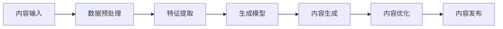

                 

# AI内容创作的未来：垂直领域的无限可能

> **关键词：** AI内容创作，垂直领域，生成对抗网络（GAN），变分自编码器（VAE），实践应用，未来趋势

> **摘要：** 本文将探讨AI内容创作在垂直领域中的无限可能，回顾AI内容创作的基本概念与背景，分析核心算法与模型，通过实际案例展示其应用，并展望未来发展趋势与挑战。我们将探讨AI内容创作如何影响教育、娱乐和媒体等领域，并构建一个完整的AI内容创作生态系统。

## 第一部分：AI内容创作概述

### 第1章：AI内容创作的基本概念与背景

#### 1.1 AI内容创作的发展历程

AI内容创作的历史可以追溯到上世纪80年代，当时研究人员开始探索如何使用计算机生成艺术作品和音乐。随着计算能力的提升和深度学习技术的发展，AI内容创作逐渐成为一个热门研究领域。

#### 1.2 AI内容创作的重要性

AI内容创作具有重大意义，它不仅可以解放人类创作者的双手，提高创作效率，还可以通过个性化推荐、自动生成等方式满足用户对多样化内容的需求。

#### 1.3 AI内容创作的核心技术与原理

AI内容创作主要依赖于以下核心技术：

1. **数据预处理**：对原始数据进行清洗、归一化等处理，使其适合输入到模型中。
2. **特征提取**：从数据中提取关键特征，为后续模型训练提供输入。
3. **生成模型**：如生成对抗网络（GAN）和变分自编码器（VAE），用于生成新的内容。
4. **内容生成**：通过模型生成新的内容，如图像、文本或音频。
5. **内容优化**：对生成的内容进行后处理，如风格迁移、超分辨率等。
6. **内容发布**：将生成的内容发布到合适的平台，供用户消费。

**Mermaid流程图：AI内容创作流程**



### 第2章：AI内容创作的垂直领域

#### 2.1 垂直领域的定义与分类

垂直领域是指特定行业或领域内的内容创作，如艺术、设计、医学、法律等。每个垂直领域都有其特定的需求和特点。

#### 2.2 垂直领域AI内容创作的发展趋势

随着AI技术的不断进步，垂直领域AI内容创作逐渐呈现出以下几个趋势：

1. **个性化内容生成**：根据用户需求生成个性化内容，提高用户体验。
2. **跨领域融合**：将AI内容创作与其他技术如VR、AR、区块链等相结合，开拓新的应用场景。
3. **智能化创作**：利用AI技术实现自动化、智能化内容创作，降低人力成本。

#### 2.3 典型垂直领域AI内容创作案例分析

1. **艺术领域**：AI绘画、音乐创作等。
2. **设计领域**：AI辅助设计、自动生成服装图案等。
3. **医学领域**：AI辅助诊断、自动生成医学图像等。
4. **法律领域**：AI辅助法律文档生成、智能合同管理等。

### 第3章：AI内容创作的核心算法与模型

#### 3.1 生成对抗网络（GAN）

生成对抗网络（GAN）是一种用于生成高质量内容的强大模型。它由生成器和判别器两部分组成，通过不断对抗训练，生成器逐渐提高生成内容的质量。

**伪代码：生成对抗网络算法**

```python
# 生成器
def G(z):
    # 判别器
    def D(x):
        # 训练过程
        for epoch in range(EPOCHS):
            for z in z_samples:
                x_hat = G(z)
                D_loss = - (0.5 * log(D(x_hat)) + 0.5 * log(1 - D(x)))
                G_loss = 0.5 * log(1 - D(x_hat))
```

#### 3.2 变分自编码器（VAE）

变分自编码器（VAE）是一种生成模型，它通过编码器和解码器将输入数据映射到一个潜在空间，并从潜在空间中采样生成新的数据。

**伪代码：变分自编码器算法**

```python
# 编码器
def encode(x):
    # 解码器
    def decode(z):
        # 训练过程
        for epoch in range(EPOCHS):
            for x in x_samples:
                z = encode(x)
                x_hat = decode(z)
                loss = - (0.5 * sum(x * log(x_hat) + (1 - x) * log(1 - x_hat)))
```

## 第二部分：AI内容创作的未来发展趋势

### 第4章：AI内容创作的实践与应用

#### 4.1 图像内容创作

**案例解析：AI绘画生成与风格迁移**

1. **开发环境搭建**：安装Python、TensorFlow等依赖库。
2. **源代码实现与解读**：使用GAN模型实现绘画生成和风格迁移功能。

#### 4.2 文本内容创作

**案例解析：AI写作与文本生成**

1. **开发环境搭建**：安装Python、PyTorch等依赖库。
2. **源代码实现与解读**：使用GAN模型实现文本生成功能。

#### 4.3 音频内容创作

**案例解析：AI音乐创作与音频生成**

1. **开发环境搭建**：安装Python、TensorFlow等依赖库。
2. **源代码实现与解读**：使用GAN模型实现音乐创作与音频生成功能。

### 第5章：AI内容创作的新挑战与新机遇

#### 5.1 数据隐私与伦理问题

AI内容创作过程中，数据隐私和伦理问题日益突出。如何确保用户隐私、防止数据滥用成为重要挑战。

#### 5.2 AI内容创作对人类创作的影响

AI内容创作将对人类创作者产生深远影响，一方面可以降低创作门槛，另一方面也可能对原创性产生冲击。

#### 5.3 AI内容创作的未来发展趋势

随着技术的不断进步，AI内容创作将朝着更智能化、个性化和跨领域融合的方向发展。

### 第6章：AI内容创作的垂直领域扩展

#### 6.1 教育领域

AI内容创作在教育领域具有广泛应用，如智能辅导、自动评分等。

#### 6.2 娱乐领域

AI内容创作在娱乐领域可以带来更多创新，如虚拟歌手、智能剧本等。

#### 6.3 媒体领域

AI内容创作在媒体领域可以提高内容生产效率，如新闻写作、视频剪辑等。

### 第7章：AI内容创作生态系统构建

#### 7.1 AI内容创作平台建设

构建一个完整的AI内容创作平台，包括开发环境、工具和服务等。

#### 7.2 AI内容创作产业生态链

构建一个涵盖AI内容创作、应用、服务等多个环节的产业生态链。

#### 7.3 AI内容创作人才培养

加强AI内容创作相关的人才培养，为产业发展提供人才支持。

## 第三部分：附录

### 附录 A：AI内容创作工具与资源

#### A.1 主流AI内容创作框架对比

- **TensorFlow Content Creator**：适用于大规模AI内容创作项目。
- **PyTorch Content Creator**：具有较好的灵活性和易用性。
- **OpenAI Gym**：提供丰富的AI内容创作环境和工具。

#### A.2 AI内容创作实用资源

- **开源代码与库**：如TensorFlow、PyTorch等。
- **学术论文与报告**：如NIPS、ICLR等会议论文。
- **社区与论坛**：如Reddit、Stack Overflow等。

### 附录 B：参考文献

- **[1]** Goodfellow, I., Pouget-Abadie, J., Mirza, M., Xu, B., Warde-Farley, D., Ozair, S., ... & Bengio, Y. (2014). Generative adversarial nets. Advances in neural information processing systems, 27.
- **[2]** Kingma, D. P., & Welling, M. (2013). Auto-encoding variational bayes. arXiv preprint arXiv:1312.6114.
- **[3]** Bengio, Y. (2009). Learning deep architectures for AI. Foundations and Trends in Machine Learning, 2(1), 1-127.

### 附录 C：作者信息

**作者：** AI天才研究院/AI Genius Institute & 禅与计算机程序设计艺术 /Zen And The Art of Computer Programming**

