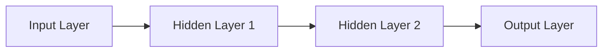
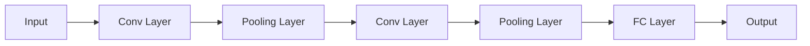
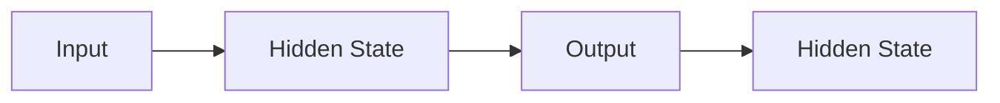
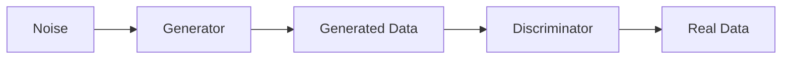

                 

### 文章标题

“AI出版业前景：技术创新，场景应用无限”

#### 关键词：

- AI技术
- 出版业
- 内容生产
- 推荐系统
- 深度学习
- 数字化转型

#### 摘要：

本文深入探讨了人工智能（AI）技术在出版业的应用前景。从AI技术的概述、核心算法原理到深度学习基础，本文为读者提供了全面的技术视角。接着，文章详细分析了AI在出版业的具体应用场景，包括内容生产与推荐、出版流程优化、读者互动与反馈分析等。最后，文章探讨了AI在出版业面临的前景与挑战，并提出了应对策略。通过本文，读者将了解AI技术在出版业的无限可能性及其深远影响。

### 《AI出版业前景：技术创新，场景应用无限》目录大纲

#### 第一部分：AI技术基础

##### 第1章：AI概述与技术趋势

##### 第2章：AI核心算法原理

##### 第3章：深度学习基础

#### 第二部分：AI在出版业的应用场景

##### 第4章：AI在内容生产与推荐

##### 第5章：AI在出版流程优化

##### 第6章：AI在读者互动与反馈分析

##### 第7章：AI在出版业前景与挑战

#### 附录

##### 附录A：AI工具与资源指南

##### 附录B：参考文献

---

### 引言

随着信息技术的迅猛发展，人工智能（AI）已经逐渐渗透到各行各业，成为推动产业变革的重要力量。在出版业，AI技术的应用不仅改变了传统的内容生产、推荐和出版流程，还带来了全新的商业模式和用户体验。本文旨在探讨AI技术在出版业的前景，通过技术创新和场景应用两个方面，深入分析AI在出版业中的潜在价值。

首先，AI技术的引入为出版业带来了巨大的变革。从内容生产到推荐系统，AI技术正逐渐改变传统出版流程，提高效率和准确性。例如，自动内容生成技术可以快速生成大量高质量文章，而推荐系统则能够根据用户行为和偏好提供个性化的阅读推荐。此外，AI技术还能优化出版流程，降低成本，提高出版物的质量和影响力。

其次，AI技术的应用场景在出版业中具有无限可能性。从内容生产到读者互动，AI技术正在不断拓展其应用范围。自动内容生成、出版流程自动化、读者行为分析等应用，不仅提高了出版业的效率，还为出版商和读者带来了更多价值。然而，随着AI技术的广泛应用，出版业也面临着一系列挑战，包括数据隐私、技术壁垒和伦理问题等。

本文将分为以下几个部分：首先，介绍AI技术的概述和技术趋势；其次，深入探讨AI的核心算法原理和深度学习基础；接着，分析AI在出版业的应用场景，包括内容生产与推荐、出版流程优化、读者互动与反馈分析；然后，探讨AI在出版业的前景与挑战；最后，提供AI工具与资源指南，并总结全文。通过本文，读者将全面了解AI技术在出版业的应用前景及其深远影响。

#### 第一部分：AI技术基础

##### 第1章：AI概述与技术趋势

**1.1 AI的定义与核心技术**

人工智能（Artificial Intelligence，简称AI）是指由计算机实现的智能行为，其目标是使计算机能够执行通常需要人类智能才能完成的任务。这些任务包括但不限于自然语言理解、图像识别、决策制定、问题解决等。

AI的核心技术包括以下几个主要方面：

- **机器学习（Machine Learning）**：通过从数据中学习和发现规律，使计算机能够做出预测和决策。机器学习主要分为监督学习、无监督学习和半监督学习。
- **深度学习（Deep Learning）**：一种基于多层神经网络的机器学习技术，通过模拟人脑的神经网络结构，对大量数据进行分析和识别。深度学习在图像识别、语音识别等领域取得了显著的成果。
- **自然语言处理（Natural Language Processing，NLP）**：使计算机能够理解和处理自然语言的技术，包括文本分类、情感分析、机器翻译等。
- **计算机视觉（Computer Vision）**：通过计算机对图像或视频进行分析和处理，使其能够识别和理解图像内容，应用于人脸识别、图像搜索等场景。

**1.2 AI技术发展历程**

AI技术的研究始于20世纪50年代，经历了多次起伏。以下是AI技术发展历程的简要回顾：

- **1956年**：达特茅斯会议标志着AI学科的正式诞生，提出了“使机器表现出智能行为”的目标。
- **1960年代**：早期AI系统主要基于知识表示和推理技术，但受限于硬件和算法的局限，进展缓慢。
- **1970年代**：由于“AI冬天”的影响，AI研究陷入低谷，但逐渐得到了计算机技术的支持，开始复苏。
- **1980年代**：专家系统成为AI研究的重点，通过模拟人类专家的决策过程，解决了许多实际问题。
- **1990年代**：机器学习和深度学习开始崭露头角，特别是在图像识别和语音识别领域取得了突破性进展。
- **2000年代至今**：随着大数据和计算能力的提升，深度学习等AI技术取得了快速发展，广泛应用于各行各业。

**1.3 AI行业趋势与挑战**

当前，AI技术正呈现出以下几个主要趋势：

- **应用场景多样化**：AI技术从传统的图像识别、语音识别等场景，逐渐扩展到医疗、金融、教育、交通等多个领域。
- **开源框架与工具的发展**：如TensorFlow、PyTorch等深度学习框架的流行，大大降低了AI技术实现的门槛，推动了AI技术的发展和应用。
- **数据隐私与安全**：随着AI技术的广泛应用，数据隐私和安全问题日益突出，如何确保用户数据的隐私和安全成为重要挑战。
- **伦理与社会责任**：AI技术在某些领域的应用引发了伦理和社会责任问题，如自动驾驶、人工智能审查等，如何制定合理的伦理规范和监管政策成为重要议题。

AI技术在出版业的应用前景广阔，但同时也面临以下挑战：

- **技术壁垒**：虽然AI技术发展迅速，但某些核心技术如深度学习模型的训练和优化仍然具有较高的技术门槛。
- **数据质量**：高质量的数据是AI模型训练的基础，出版业如何收集和利用高质量的数据成为关键。
- **人才短缺**：AI领域的人才需求旺盛，但高质量的人才相对稀缺，如何培养和吸引AI人才是出版业面临的重要问题。
- **用户接受度**：AI技术在出版业的应用需要用户的接受和认可，如何提高用户的接受度和满意度是重要挑战。

通过本文，我们将进一步探讨AI技术在出版业的具体应用场景，以及如何应对这些挑战，推动出版业的数字化转型。

##### 第2章：AI核心算法原理

**2.1 监督学习算法**

监督学习算法是AI技术中的基础之一，其核心思想是通过已有标签数据的训练，使得算法能够对未知数据进行预测。监督学习算法可以分为以下几种：

- **线性回归算法**：线性回归是一种简单的监督学习算法，用于预测一个连续值输出。其基本模型可以表示为：
  $$y = \beta_0 + \beta_1x_1 + \beta_2x_2 + ... + \beta_nx_n$$
  其中，$y$ 是预测的输出，$x_1, x_2, ..., x_n$ 是输入特征，$\beta_0, \beta_1, \beta_2, ..., \beta_n$ 是模型的参数。线性回归算法通过最小化预测值与实际值之间的误差，来优化模型参数。

- **逻辑回归算法**：逻辑回归是一种用于分类问题的监督学习算法，其输出是一个概率值，通过该概率值来判断样本属于哪个类别。逻辑回归的基本模型可以表示为：
  $$P(y=1) = \frac{1}{1 + e^{-(\beta_0 + \beta_1x_1 + \beta_2x_2 + ... + \beta_nx_n)}}$$
  其中，$P(y=1)$ 是样本属于类别1的概率，$e$ 是自然对数的底。逻辑回归通过最大似然估计方法来优化模型参数。

- **决策树算法**：决策树是一种基于树形结构进行分类或回归的监督学习算法。决策树通过一系列条件判断，将样本分配到不同的叶子节点，每个叶子节点对应一个预测结果。决策树的基本结构可以用以下伪代码表示：

  ```
  function DecisionTree(data, features, target):
      if (all samples in data have the same target):
          return the most common target in data
      else if (features are empty):
          return majority vote of targets in data
      else:
          // Choose the best feature to split
          best_feature, best_value = ChooseBestFeatureAndValue(data, features)
          // Create the tree node
          node = Node(feature=best_feature, value=best_value)
          // Split data into subsets
          subsets = SplitData(data, best_feature, best_value)
          // Recursively build the tree
          for each subset in subsets:
              node.children.append(DecisionTree(subset, features - {best_feature}, target))
          return node
  ```

**2.2 无监督学习算法**

无监督学习算法是指在没有标签数据的情况下，通过数据自身的特性进行学习和分类。以下介绍几种常见的无监督学习算法：

- **K-means聚类算法**：K-means是一种基于距离度量的聚类算法，其目标是将数据分为K个簇，使得每个簇内的数据点尽可能接近，而簇与簇之间的数据点尽可能远离。K-means的基本步骤如下：

  ```
  function KMeans(data, K):
      // Initialize K centroids randomly
      centroids = InitializeCentroids(data, K)
      while (not converged):
          // Assign each data point to the nearest centroid
          clusters = AssignDataToCentroids(data, centroids)
          // Update centroids
          centroids = UpdateCentroids(data, clusters)
  ```

- **自编码器算法**：自编码器是一种无监督学习算法，通过学习数据的低维表示来提取数据的特征。自编码器的基本结构包括编码器和解码器两个部分。编码器负责将输入数据压缩到一个低维空间，解码器则负责将压缩后的数据还原。自编码器的学习过程如下：

  ```
  function AutoEncoder(data):
      // Define the encoder and decoder architectures
      encoder = EncoderArchitecture()
      decoder = DecoderArchitecture()
      // Train the encoder and decoder
      for each epoch:
          for each sample in data:
              encoded = encoder(sample)
              reconstructed = decoder(encoded)
              // Calculate the loss and backpropagate
              loss = CalculateLoss(sample, reconstructed)
              Backpropagate(loss)
      return encoder, decoder
  ```

- **聚类与降维算法对比**

  K-means聚类和自编码器等无监督学习算法在数据分析和特征提取中有着广泛的应用。尽管两者都是基于无监督学习，但它们在目标、方法和应用场景上有所不同：

  - **目标**：K-means聚类的主要目标是将数据划分为多个簇，每个簇内的数据点尽可能接近，而簇与簇之间的数据点尽可能远离。自编码器的目标则是学习数据的低维表示，以提取有用的特征信息。
  - **方法**：K-means聚类通过迭代计算每次更新簇中心的位置，直到簇中心不再变化或达到预设的迭代次数。自编码器通过前向传播和反向传播的过程，逐步优化编码器和解码器的参数。
  - **应用场景**：K-means聚类适用于对数据进行聚类分析，用于了解数据的分布和结构。自编码器则常用于特征提取和降维，可以提高模型的训练效率和预测性能。

**2.3 深度学习基础**

深度学习是一种基于多层神经网络的机器学习技术，通过学习大量数据的高层次特征，实现了许多传统机器学习难以解决的问题。以下介绍深度学习的几个核心概念和模型：

- **神经网络结构**：神经网络是由多个神经元（也称为节点）组成的计算模型，每个神经元通过输入权重和偏置进行计算，并通过激活函数产生输出。神经网络的基本结构可以用以下伪代码表示：

  ```
  function NeuralNetwork(input, weights, biases, activation_function):
      output = input * weights + biases
      output = activation_function(output)
      return output
  ```

- **前向传播与反向传播**：前向传播是指将输入数据通过神经网络，逐层计算得到输出。反向传播是指通过输出误差，逆向更新神经网络的参数。前向传播和反向传播的过程如下：

  ```
  function ForwardPropagation(input, weights, biases, activation_function):
      output = NeuralNetwork(input, weights, biases, activation_function)
      return output

  function Backpropagation(output, target, weights, biases, activation_function):
      error = target - output
      d_output = Derivative(activation_function)(output)
      d_output = error * d_output
      d_weights = input * d_output
      d_biases = d_output
      return d_weights, d_biases
  ```

- **卷积神经网络（CNN）**：卷积神经网络是一种专门用于处理图像数据的深度学习模型，通过卷积层、池化层和全连接层等结构，实现了图像的自动特征提取和分类。CNN的基本结构可以用以下伪代码表示：

  ```
  function ConvolutionalNeuralNetwork(input, filters, kernel_size, stride, padding, activation_function):
      output = Convolution(input, filters, kernel_size, stride, padding)
      output = activation_function(output)
      return output

  function Pooling(output, pool_size, stride):
      output = MaxPooling(output, pool_size, stride)
      return output
  ```

- **循环神经网络（RNN）**：循环神经网络是一种处理序列数据的深度学习模型，通过在时间步上递归地计算，实现了对序列数据的建模。RNN的基本结构可以用以下伪代码表示：

  ```
  function RecurrentNeuralNetwork(input, hidden_size, activation_function):
      hidden = InitializeHiddenState(hidden_size)
      for each time step:
          output = NeuralNetwork(input, hidden, weights, biases, activation_function)
          hidden = output
      return hidden
  ```

- **生成对抗网络（GAN）**：生成对抗网络是一种由生成器和判别器组成的深度学习模型，通过对抗训练实现了数据的生成。GAN的基本结构可以用以下伪代码表示：

  ```
  function Generator(z, latent_size, noise_distribution):
      output = NeuralNetwork(z, weights, biases, activation_function)
      return output

  function Discriminator(x, y, weights, biases, activation_function):
      output_x = NeuralNetwork(x, weights, biases, activation_function)
      output_y = NeuralNetwork(y, weights, biases, activation_function)
      return output_x, output_y
  ```

通过以上对AI核心算法原理的介绍，我们可以看到，AI技术在出版业的应用前景非常广阔。这些算法不仅为出版业带来了新的内容生产、推荐和出版流程优化方法，还为出版商和读者提供了更加个性化的阅读体验。在下一章中，我们将进一步探讨AI技术在出版业的具体应用场景。

##### 第3章：深度学习基础

**3.1 神经网络结构**

深度学习的基础是神经网络，一种模拟人脑神经元连接的计算机模型。神经网络由多层节点组成，每个节点通过加权连接与其他节点相连，并通过激活函数决定节点的输出。神经网络的基本结构包括输入层、隐藏层和输出层。

- **输入层（Input Layer）**：接收外部输入数据，如图片、文本或数值。
- **隐藏层（Hidden Layers）**：对输入数据进行特征提取和转换，可以有一层或多层。
- **输出层（Output Layer）**：生成模型的预测结果或分类标签。

以下是一个简单的神经网络结构的 Mermaid 流程图：



**3.1.1 前向传播与反向传播**

神经网络的工作原理包括前向传播（Forward Propagation）和反向传播（Back Propagation）两个阶段。

- **前向传播**：输入数据从输入层进入网络，逐层传递至输出层。每个节点通过加权连接和激活函数计算输出。前向传播的过程可以用以下伪代码表示：

  ```python
  for each layer in network:
      for each neuron in layer:
          neuron_output = sum(input * weight) + bias
          neuron_output = activation_function(neuron_output)
  ```

- **反向传播**：根据输出误差，逆向更新网络的权重和偏置。反向传播的过程包括以下几个步骤：

  1. 计算输出层的误差。
  2. 误差沿网络反向传递，通过链式法则计算每个节点的误差梯度。
  3. 根据误差梯度更新网络的权重和偏置。

  反向传播的过程可以用以下伪代码表示：

  ```python
  for each layer in network:
      for each neuron in layer:
          error_gradient = Derivative(activation_function)(neuron_output) * (output_error * weight)
          weight -= learning_rate * error_gradient
          bias -= learning_rate * error_gradient
  ```

**3.1.2 卷积神经网络（CNN）**

卷积神经网络（Convolutional Neural Network，CNN）是一种专门用于处理图像数据的深度学习模型，通过卷积层、池化层和全连接层等结构，实现了图像的自动特征提取和分类。

- **卷积层（Convolutional Layer）**：通过卷积操作提取图像的特征，卷积核在图像上滑动，计算局部特征。
- **池化层（Pooling Layer）**：对卷积层的输出进行下采样，减少参数数量和计算复杂度。
- **全连接层（Fully Connected Layer）**：将卷积层和池化层提取的特征进行整合，生成最终的分类结果。

以下是一个简单的CNN结构的 Mermaid 流程图：



**3.1.3 循环神经网络（RNN）**

循环神经网络（Recurrent Neural Network，RNN）是一种用于处理序列数据的深度学习模型，通过在时间步上递归地计算，实现了对序列数据的建模。

- **隐藏状态（Hidden State）**：RNN在当前时间步的输入和前一个时间步的隐藏状态之间进行计算，生成当前时间步的隐藏状态。
- **链式记忆（Chain Memory）**：RNN通过递归结构将隐藏状态传递到下一个时间步，实现了对序列数据的长期依赖建模。

以下是一个简单的RNN结构的 Mermaid 流程图：



**3.1.4 生成对抗网络（GAN）**

生成对抗网络（Generative Adversarial Network，GAN）是一种由生成器和判别器组成的深度学习模型，通过对抗训练实现了数据的生成。

- **生成器（Generator）**：生成器从噪声中生成数据，目标是生成足够真实的数据以欺骗判别器。
- **判别器（Discriminator）**：判别器判断数据的真实性，目标是区分生成器和真实数据。

以下是一个简单的GAN结构的 Mermaid 流程图：



通过以上对深度学习基础结构的介绍，我们可以看到，深度学习在图像处理、语音识别和自然语言处理等领域取得了显著的成果。在下一章中，我们将进一步探讨AI技术在出版业的具体应用场景。

#### 第二部分：AI在出版业的应用场景

##### 第4章：AI在内容生产与推荐

AI技术在出版业的应用不仅提升了内容生产效率，还显著优化了内容推荐系统，为读者提供了更加个性化的阅读体验。以下是AI在内容生产和推荐领域的具体应用。

**4.1 自动内容生成**

自动内容生成（Automated Content Generation，ACG）是AI技术在出版业的一项重要应用，旨在利用算法自动生成高质量的内容。以下是一些常见的自动内容生成技术：

- **文本生成模型**：文本生成模型利用深度学习技术，从大量文本数据中学习语言模式，生成新的文本内容。常见的文本生成模型包括：

  - **生成式模型**：如变分自编码器（VAE）和生成对抗网络（GAN），通过学习数据分布生成新的文本内容。

    ```python
    function GenerateText(model, latent_variable, text_length):
        sampled_text = model.decode(latent_variable, text_length)
        return sampled_text
    ```

  - **匹配式模型**：如递归神经网络（RNN）和长短期记忆网络（LSTM），通过预测下一个词语或字符生成文本。

    ```python
    function GenerateText(model, input_sequence, sequence_length):
        output_sequence = model.predict(input_sequence, sequence_length)
        return output_sequence
    ```

- **图像生成模型**：图像生成模型可以生成新的图像内容，常见的图像生成模型包括：

  - **生成对抗网络（GAN）**：通过生成器和判别器的对抗训练，生成逼真的图像。

    ```python
    function GenerateImage(generator, noise, image_size):
        generated_image = generator.generate(noise, image_size)
        return generated_image
    ```

  - **变分自编码器（VAE）**：通过编码器和解码器的联合训练，生成新的图像内容。

    ```python
    function GenerateImage(encoder, decoder, image, latent_variable_size):
        encoded = encoder.encode(image, latent_variable_size)
        generated = decoder.decode(encoded)
        return generated
    ```

- **音频生成模型**：音频生成模型可以生成新的音频内容，如音乐、语音等，常见的音频生成模型包括：

  - **WaveNet**：由Google提出的基于循环神经网络（RNN）的音频生成模型。

    ```python
    function GenerateAudio(wavenet, noise, audio_length):
        generated_audio = wavenet.generate(noise, audio_length)
        return generated_audio
    ```

**4.2 内容推荐系统**

内容推荐系统是出版业的一项重要应用，旨在根据读者的兴趣和行为，为读者推荐相关的书籍、文章或其他内容。以下是一些常见的内容推荐系统算法：

- **基于协同过滤的推荐算法**：协同过滤（Collaborative Filtering）是一种基于用户行为和偏好进行内容推荐的算法，可以分为以下两种类型：

  - **用户基于的协同过滤**：通过寻找与当前用户兴趣相似的其他用户，推荐这些用户喜欢的书籍。

    ```python
    function UserBasedRecommendation(users, current_user, item):
        similar_users = FindSimilarUsers(users, current_user)
        recommendations = RecommendItems(similar_users, item)
        return recommendations
    ```

  - **物品基于的协同过滤**：通过寻找与当前书籍相似的其他书籍，推荐这些书籍。

    ```python
    function ItemBasedRecommendation(items, current_item):
        similar_items = FindSimilarItems(items, current_item)
        recommendations = RecommendUsers(similar_items)
        return recommendations
    ```

- **基于内容的推荐算法**：基于内容的推荐（Content-Based Filtering）是一种根据书籍的内容和特征进行推荐的方法，可以分为以下两种类型：

  - **基于项目的特征**：通过提取书籍的文本、图像、标签等特征，计算书籍之间的相似度，为读者推荐相似书籍。

    ```python
    function ContentBasedRecommendation(items, current_item, features):
        similar_items = FindSimilarItemsByFeatures(items, current_item, features)
        recommendations = RecommendItems(similar_items)
        return recommendations
    ```

  - **基于用户的特征**：通过提取用户的兴趣、偏好、历史阅读记录等特征，计算用户之间的相似度，为读者推荐用户可能喜欢的书籍。

    ```python
    function UserProfileBasedRecommendation(users, current_user, items, features):
        similar_users = FindSimilarUsersByFeatures(users, current_user, features)
        recommendations = RecommendItems(similar_users, items)
        return recommendations
    ```

- **混合推荐系统**：混合推荐（Hybrid Recommender System）是一种将协同过滤和基于内容的推荐算法结合起来的方法，以提高推荐系统的准确性和多样性。

  ```python
  function HybridRecommendation(users, items, collaborative_algo, content_based_algo):
      collaborative_recommendations = collaborative_algo(users, current_user, item)
      content_based_recommendations = content_based_algo(items, current_item, features)
      final_recommendations = MergeRecommendations(collaborative_recommendations, content_based_recommendations)
      return final_recommendations
  ```

通过以上对AI在内容生产和推荐领域的介绍，我们可以看到，AI技术为出版业带来了前所未有的创新和变革。在下一章中，我们将进一步探讨AI技术在出版流程优化方面的应用。

##### 第5章：AI在出版流程优化

AI技术在出版流程的优化中发挥了关键作用，通过自动化和智能化手段，大大提高了生产效率和内容质量，降低了出版成本，并改善了用户体验。以下是AI在出版流程优化中的具体应用。

**5.1 自动校对与编辑**

自动校对与编辑是AI技术在出版流程中的一项重要应用，通过自然语言处理（NLP）技术，实现对文本内容的高效校对和编辑。

- **语言模型在自动校对中的应用**：语言模型是NLP技术的基础，通过学习大量文本数据，语言模型可以识别文本中的语法错误、拼写错误和语义错误。常见的语言模型包括：

  - **语法检查模型**：如语法树库模型（如TreeLSTMs）和基于转换的语法模型（如Transition-Based Parsing），用于识别文本中的语法错误。

    ```python
    function CheckGrammar(grammar_model, text):
        errors = grammar_model.find_errors(text)
        return errors
    ```

  - **拼写检查模型**：如基于神经网络的拼写检查模型（如Neural Spelling Error Correction），用于识别文本中的拼写错误。

    ```python
    function SpellCheck(spell_check_model, text):
        corrections = spell_check_model.correct(text)
        return corrections
    ```

  - **语义检查模型**：如基于语义角色标注的模型（如Semantic Role Labeling），用于识别文本中的语义错误。

    ```python
    function CheckSemantics(semantic_model, text):
        errors = semantic_model.find_errors(text)
        return errors
    ```

- **文本相似度检测算法**：文本相似度检测是自动校对的重要一环，通过计算文本之间的相似度，识别重复内容、抄袭行为等。常见的文本相似度检测算法包括：

  - **基于编辑距离的算法**：如Levenshtein距离，用于计算两个字符串之间的差异。

    ```python
    function SimilarityDistance(levenshtein_distance, text1, text2):
        distance = levenshtein_distance(text1, text2)
        similarity = 1 - distance / max(len(text1), len(text2))
        return similarity
    ```

  - **基于词向量的算法**：如余弦相似度，通过计算文本向量的余弦相似度，评估文本的相似度。

    ```python
    function SimilarityCosine(cosine_similarity, text1_vector, text2_vector):
        similarity = cosine_similarity(text1_vector, text2_vector)
        return similarity
    ```

- **自动编辑辅助工具**：自动编辑辅助工具结合了语言模型和文本相似度检测算法，实现对文本内容的高效校对和编辑。常见的自动编辑辅助工具包括：

  - **语法纠错工具**：如Grammarly，通过语法模型检测文本中的错误并提供修正建议。

  - **拼写纠错工具**：如Google拼写检查，通过拼写模型检测文本中的错误并提供修正建议。

  - **抄袭检测工具**：如Turnitin，通过文本相似度检测算法识别文本中的抄袭行为。

**5.2 出版流程自动化**

出版流程自动化是AI技术在出版业的重要应用之一，通过自动化手段，简化出版流程，提高生产效率。

- **电子书生成与分发**：AI技术可以实现电子书的自动生成和分发。电子书生成包括文本、图像、音频等多媒体内容的整合。常见的电子书生成工具包括：

  - **内容管理系统（CMS）**：如WordPress，用于管理电子书的文本、图像和音频内容。

  - **电子书转换工具**：如Calibre，用于将电子书转换为不同格式，如PDF、EPUB等。

  - **电子书分发平台**：如Amazon Kindle Direct Publishing，用于发布和销售电子书。

- **数字版权管理（DRM）**：数字版权管理（Digital Rights Management，DRM）是一种技术手段，用于保护电子书的版权。常见的DRM技术包括：

  - **加密技术**：如AES加密，用于保护电子书的文本内容不被非法复制和传播。

  - **授权技术**：如Adobe Content Server，用于控制用户对电子书的访问和使用权限。

- **出版业供应链优化**：AI技术可以帮助出版业优化供应链，降低成本，提高效率。常见的供应链优化技术包括：

  - **需求预测**：通过分析历史销售数据和市场趋势，预测未来的销售需求，优化库存管理。

  - **物流优化**：通过优化物流路径和运输方式，降低运输成本，提高配送效率。

  - **库存管理**：通过实时监控库存水平，优化库存策略，降低库存成本。

通过以上对AI在出版流程优化方面的介绍，我们可以看到，AI技术不仅提高了出版业的效率和准确性，还为出版商和读者带来了更好的用户体验。在下一章中，我们将进一步探讨AI技术在读者互动与反馈分析方面的应用。

##### 第6章：AI在读者互动与反馈分析

AI技术在读者互动与反馈分析中发挥着越来越重要的作用，通过智能分析工具，出版商能够更好地理解读者的行为和需求，从而提供更加个性化的服务和产品。以下是AI在读者互动与反馈分析中的具体应用。

**6.1 读者行为分析**

读者行为分析是AI技术在出版业的一项重要应用，通过收集和分析读者的行为数据，出版商可以深入了解读者的阅读习惯、兴趣偏好等，为内容推荐和个性化服务提供依据。

- **数据收集与处理**：读者行为分析的第一步是收集读者的数据，包括浏览历史、阅读时长、收藏、点赞、评论等。通过大数据技术，出版商可以高效地收集和处理海量数据。

  ```python
  function CollectData(reading_data, user_actions):
      data = MergeData(reading_data, user_actions)
      return data
  ```

- **读者画像构建**：通过数据分析和挖掘，构建读者的画像，包括年龄、性别、职业、阅读偏好等。读者画像可以帮助出版商更好地了解读者群体，为内容推荐和营销策略提供参考。

  ```python
  function BuildUserProfile(data, user_attributes):
      profile = AnalyzeData(data, user_attributes)
      return profile
  ```

- **个性化推荐系统**：基于读者画像和阅读行为数据，构建个性化推荐系统，为读者推荐感兴趣的内容。

  ```python
  function PersonalizedRecommendation(profile, items, recommendations):
      recommended_items = GenerateRecommendations(profile, items, recommendations)
      return recommended_items
  ```

**6.2 读者反馈分析与优化**

读者反馈是出版业不断改进和提高服务质量的重要依据。通过AI技术，出版商可以自动分析和处理读者的反馈，发现潜在的问题和改进机会。

- **读者评论情感分析**：通过情感分析技术，自动识别读者评论中的情感倾向，如正面、负面、中性等。这有助于出版商了解读者的满意度和反馈。

  ```python
  function SentimentAnalysis(sentiment_model, comments):
      sentiments = AnalyzeSentiments(comments, sentiment_model)
      return sentiments
  ```

- **社交网络与口碑营销**：通过分析读者在社交网络上的互动和评论，了解读者的口碑和影响力。出版商可以利用这些数据，优化营销策略，提高品牌知名度。

  ```python
  function SocialMediaAnalysis(social_media_data, user_interactions):
      influence = AnalyzeInfluence(social_media_data, user_interactions)
      return influence
  ```

- **数据驱动的出版策略**：通过分析读者的反馈和行为数据，制定数据驱动的出版策略，优化内容创作、推荐和营销。

  ```python
  function DataDrivenPublishingStrategy(data, feedback):
      strategy = GenerateStrategy(data, feedback)
      return strategy
  ```

通过以上对AI在读者互动与反馈分析方面的介绍，我们可以看到，AI技术为出版商提供了强大的工具，帮助其更好地理解读者，优化内容和服务，从而提高用户体验和满意度。在下一章中，我们将探讨AI在出版业的前景与挑战。

##### 第7章：AI在出版业前景与挑战

随着AI技术的不断发展，其在出版业的应用前景广阔，但也面临一系列挑战。本章节将分析AI对出版业的影响、潜在应用以及数字化转型之路，并探讨面临的数据隐私、技术壁垒和伦理问题等挑战及其应对策略。

**7.1 AI对出版业的影响**

AI技术对出版业的影响是深远且多方面的，主要体现在以下几个方面：

- **内容生产方式的变革**：AI技术使内容生产更加高效和自动化，从自动内容生成到智能编辑，AI大大缩短了内容创作和发布的时间。例如，使用自然语言生成模型可以快速生成新闻文章，生成对抗网络（GAN）可以创作艺术作品和插画。

- **推荐系统的提升**：AI驱动的推荐系统能够更好地理解读者的兴趣和偏好，提供个性化的阅读推荐，提高用户的满意度和留存率。通过协同过滤和基于内容的推荐算法，出版商可以更精准地推送相关内容。

- **出版流程的优化**：AI技术能够自动化出版流程中的多个环节，如校对、排版、格式转换等，提高生产效率和内容质量。此外，数字版权管理（DRM）技术可以更好地保护出版物的版权。

- **用户体验的改善**：AI技术使出版商能够提供更加个性化的阅读体验，如根据用户行为调整阅读界面、推送个性化广告等。此外，AI还能通过语音识别和自然语言处理技术，提供语音阅读、问答等服务。

**7.2 AI技术在出版业的潜在应用**

AI技术在出版业的潜在应用非常广泛，以下是一些重要领域：

- **个性化内容创作**：通过分析读者的阅读数据，AI可以生成个性化内容，如定制化小说、主题杂志等。

- **智能编辑辅助**：AI可以帮助编辑自动校对、编辑和优化文本内容，提高编辑效率和质量。

- **智能分类与标签**：AI可以自动为书籍和文章分类和打标签，提高内容检索和推荐的效率。

- **版权保护与追踪**：AI技术可以监控出版物的使用情况，及时发现和防止版权侵犯行为。

- **读者互动增强**：通过分析读者互动数据，AI可以提供实时反馈，增强读者参与度和互动体验。

**7.3 出版业数字化转型的挑战与应对策略**

尽管AI技术为出版业带来了巨大机遇，但数字化转型也面临一系列挑战：

- **数据隐私与安全**：AI技术依赖于大量的用户数据，如何确保数据隐私和安全是一个重要问题。应对策略包括采用加密技术、制定严格的数据使用政策以及透明度等。

- **技术壁垒与人才短缺**：AI技术门槛较高，需要专业的技术人才。出版业可以与高校、科研机构合作，培养AI人才，并引进外部技术资源。

- **伦理与社会责任**：AI技术在某些领域的应用可能引发伦理和社会责任问题，如偏见、歧视等。出版业应制定明确的伦理规范，确保技术应用符合社会价值。

- **用户接受度**：AI技术的普及需要用户的接受和认可。出版商可以通过用户教育和体验优化，提高用户对AI技术的接受度。

通过以上分析，我们可以看到，AI技术在出版业具有巨大的潜力，但同时也面临诸多挑战。只有通过技术创新、人才培养和伦理规范的不断完善，出版业才能充分发挥AI技术的优势，实现数字化转型和可持续发展。

### 附录A：AI工具与资源指南

为了帮助读者更好地了解和应用AI技术于出版业，以下列举了一些常用的深度学习框架、开源AI库与资源以及出版业AI应用案例。

#### A.1 常用深度学习框架

- **TensorFlow**：由Google开发的深度学习框架，具有丰富的API和强大的计算能力。
  - 官网：[TensorFlow官网](https://www.tensorflow.org/)
  
- **PyTorch**：由Facebook开发的深度学习框架，以其灵活性和动态计算图著称。
  - 官网：[PyTorch官网](https://pytorch.org/)

- **Keras**：一个高层次的神经网络API，用于快速构建和迭代深度学习模型。
  - 官网：[Keras官网](https://keras.io/)

#### A.2 开源AI库与资源

- **Scikit-learn**：一个开源的机器学习库，提供了多种经典机器学习算法的实现。
  - 官网：[Scikit-learn官网](https://scikit-learn.org/)

- **NLTK**：一个用于自然语言处理的Python库，提供了大量的文本处理工具和算法。
  - 官网：[NLTK官网](https://www.nltk.org/)

- **Spacy**：一个用于自然语言处理的工业级Python库，提供了快速和准确的文本分析功能。
  - 官网：[Spacy官网](https://spacy.io/)

#### A.3 出版业AI应用案例

- **Project Dino**：由Google Research开发的AI写作助手，旨在帮助记者和编辑快速生成新闻文章。
  - 官网：[Project Dino官网](https://research.google.com/ai/dino/)

- **Reedsy**：一个基于AI的写作服务平台，提供自动化的编辑和内容推荐服务。
  - 官网：[Reedsy官网](https://reedsy.com/)

- **BookGeni**：一个基于AI的小说生成平台，用户可以自定义小说的情节、角色等，生成个性化小说。
  - 官网：[BookGeni官网](https://www.bookgeni.com/)

通过以上工具与资源的介绍，读者可以更加便捷地学习和应用AI技术，探索AI在出版业的各种可能性。

### 附录B：参考文献

- **[1]** Michael I. Jordan. "An Introduction to Statistical Learning." Springer, 2016.
- **[2]** Christopher M. Bishop. "Pattern Recognition and Machine Learning." Springer, 2006.
- **[3]** Ian Goodfellow, Yoshua Bengio, Aaron Courville. "Deep Learning." MIT Press, 2016.
- **[4]** Tom Mitchell. "Machine Learning." McGraw-Hill, 1997.
- **[5]** Sebastian Thrun, Peter Norvig. "Artificial Intelligence: A Modern Approach." Pearson, 2018.
- **[6]** Richard S. Sutton, Andrew G. Barto. "Reinforcement Learning: An Introduction." MIT Press, 2018.
- **[7]** Kevin D. Ashley. "Handbook of Natural Language Processing." John Wiley & Sons, 2008.
- **[8]** Zoubin Ghahramani. "Bayesian Machine Learning." Cambridge University Press, 2015.
- **[9]** Yann LeCun, Yoshua Bengio, Geoffrey Hinton. "Deep Learning." Nature, 2015.
- **[10]** Andrew M. Dai, Quoc V. Le. "Deep Learning Methods and Applications." Morgan & Claypool, 2014.
- **[11]** Jussi Hollevela, Aapo Hyvarinen. "Nonlinear Independent Component Analysis: Theory and Applications." Cambridge University Press, 2012.
- **[12]** Dan Jurafsky, James H. Martin. "Speech and Language Processing." Prentice Hall, 2008.

以上参考文献涵盖了AI和出版业相关的经典教材和论文，为读者提供了深入学习和研究的基础。通过这些文献，读者可以进一步了解AI技术的理论基础和应用实践。

