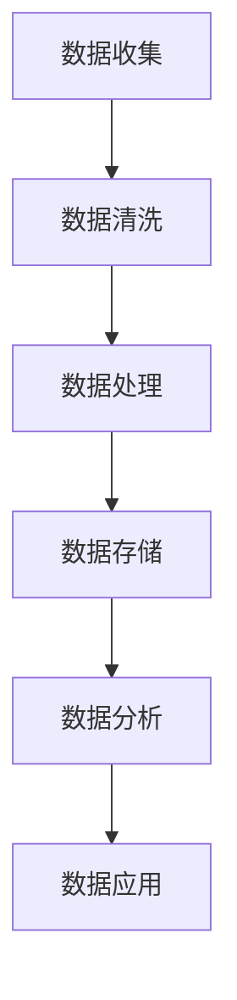

                 

# 《AI创业中的数据积累与应用》

## 关键词
人工智能（AI）、创业、数据积累、数据分析、应用场景

## 摘要
本文将深入探讨AI创业领域中的数据积累与应用。首先，我们将定义数据积累的基本概念，并分析其在创业中的重要性。接着，我们会详细介绍数据收集的方法，包括离线、在线和社交媒体数据收集。随后，文章将探讨数据处理、数据存储与处理技术，以及数据分析的方法和工具。数据隐私与安全也是本文的重要内容，我们将探讨数据隐私保护、安全措施和法律法规。最后，文章将通过实际案例展示数据积累在金融、零售、医疗、物流和教育等行业中的应用，并对数据积累的未来趋势和挑战进行展望。

### 第一部分：数据积累

#### 第1章：数据积累的基本概念

##### 1.1.1 数据积累的定义
数据积累是指通过系统化和结构化的方式收集、存储和处理数据，以便为后续分析、决策和应用提供基础。

##### 1.1.2 数据积累的重要性
数据积累对AI创业至关重要，因为它能够为模型训练提供丰富的数据资源，有助于提升算法的准确性和可靠性。

##### 1.1.3 数据积累的目标
数据积累的目标是确保数据的质量、完整性和可访问性，以支持高效的决策和业务增长。

#### 第2章：数据收集方法

##### 2.1.1 离线数据收集方法
离线数据收集方法包括数据库导入、数据爬取和传感器数据收集等。

##### 2.1.2 在线数据收集方法
在线数据收集方法包括用户行为数据收集、网页爬取和API调用等。

##### 2.1.3 社交媒体数据收集方法
社交媒体数据收集方法包括数据爬取、API调用和社交媒体数据分析等。

#### 第3章：数据处理

##### 3.1.1 数据清洗
数据清洗是数据处理的第一步，包括去除重复数据、填补缺失值和异常值处理等。

##### 3.1.2 数据转换
数据转换包括数据格式的转换、特征工程和数据标准化等。

##### 3.1.3 数据存储
数据存储涉及选择合适的数据存储方案，如关系型数据库、非关系型数据库和大数据存储技术。

#### 第4章：数据存储与处理技术

##### 4.1.1 关系型数据库
关系型数据库提供结构化数据存储和管理，适用于复杂查询和高并发场景。

##### 4.1.2 非关系型数据库
非关系型数据库提供灵活的数据存储和管理，适用于大数据和实时数据场景。

##### 4.1.3 大数据存储技术
大数据存储技术包括分布式文件系统、分布式数据库和云存储等，能够处理海量数据。

#### 第5章：数据分析

##### 5.1.1 数据分析方法
数据分析方法包括统计分析、机器学习和深度学习等。

##### 5.1.2 数据可视化
数据可视化是数据分析的重要手段，能够帮助理解数据模式和趋势。

##### 5.1.3 数据挖掘
数据挖掘是从大量数据中提取有价值信息的过程，用于发现数据中的隐藏模式和关联。

#### 第6章：数据隐私与安全

##### 6.1.1 数据隐私保护
数据隐私保护涉及数据加密、匿名化和访问控制等。

##### 6.1.2 数据安全措施
数据安全措施包括网络安全、数据备份和恢复等。

##### 6.1.3 法律法规与伦理问题
法律法规与伦理问题是数据积累和应用中不可忽视的方面，包括数据保护法规和道德伦理标准。

#### 第7章：数据积累的实际应用

##### 7.1.1 数据驱动的决策
数据驱动的决策利用数据分析结果指导业务决策，提升决策的准确性和效率。

##### 7.1.2 数据在市场营销中的应用
数据在市场营销中的应用包括客户细分、个性化推荐和市场预测等。

##### 7.1.3 数据在产品开发中的应用
数据在产品开发中的应用包括用户行为分析、需求预测和产品迭代等。

##### 7.1.4 数据在客户服务中的应用
数据在客户服务中的应用包括客户反馈分析、服务质量监控和客户关系管理等。

### 第二部分：应用场景

#### 第8章：金融行业的应用

##### 8.1.1 金融风控
金融风控利用数据积累和数据分析技术，识别和防范金融风险。

##### 8.1.2 信贷评估
信贷评估通过数据分析预测客户信用风险，支持信贷决策。

##### 8.1.3 投资决策
投资决策利用数据分析技术，分析市场趋势和投资组合风险。

#### 第9章：零售业的应用

##### 9.1.1 客户细分
客户细分通过数据分析，将客户划分为不同群体，制定个性化营销策略。

##### 9.1.2 个性化推荐
个性化推荐利用数据分析，为用户提供个性化的商品推荐。

##### 9.1.3 库存管理
库存管理通过数据分析，优化库存水平，降低库存成本。

#### 第10章：医疗健康的应用

##### 10.1.1 疾病预测
疾病预测利用数据分析技术，预测疾病的发生和发展趋势。

##### 10.1.2 医疗数据分析
医疗数据分析利用数据积累，挖掘医疗数据中的有价值信息，支持医疗决策。

##### 10.1.3 患者管理
患者管理通过数据分析，优化患者服务流程，提升患者满意度。

#### 第11章：物流行业的应用

##### 11.1.1 货物跟踪
货物跟踪利用数据分析技术，实时监控货物的运输状态。

##### 11.1.2 运输路线优化
运输路线优化通过数据分析，优化运输路线，降低运输成本。

##### 11.1.3 库存优化
库存优化通过数据分析，优化库存水平，减少库存积压。

#### 第12章：教育行业的应用

##### 12.1.1 学生行为分析
学生行为分析通过数据分析，了解学生的学习行为和习惯。

##### 12.1.2 教学评估
教学评估通过数据分析，评估教学效果，指导教学改进。

##### 12.1.3 课程推荐
课程推荐通过数据分析，为不同学习需求的学生推荐合适的课程。

#### 第13章：基础设施与公共服务

##### 13.1.1 城市规划
城市规划利用数据分析，优化城市布局和基础设施建设。

##### 13.1.2 公共安全
公共安全利用数据分析，预防犯罪，提升公共安全水平。

##### 13.1.3 环境监测
环境监测利用数据分析，监测环境污染，保护生态环境。

#### 第14章：总结与展望

##### 14.1.1 数据积累与应用的未来趋势
数据积累与应用的未来趋势包括数据隐私保护、智能决策支持和物联网数据积累等。

##### 14.1.2 面临的挑战与解决方案
面临的挑战包括数据质量、数据安全和数据隐私保护等，解决方案包括数据治理、数据加密和隐私保护算法等。

### 附录

#### 附录A：核心概念与联系

##### 附录A.1 数据积累流程 Mermaid 流程图



##### 附录A.2 核心算法原理讲解

##### 附录A.3 数学模型和公式

##### 附录A.4 项目实战

##### 附录A.5 开发环境搭建

##### 附录A.6 源代码详细实现

##### 附录A.7 代码解读与分析

#### 附录B：核心算法原理讲解

##### 附录B.1 数据清洗算法伪代码

```python
def data_cleaning(data):
    # 删除空值
    data = remove_null_values(data)
    # 数据类型转换
    data = convert_data_type(data)
    # 数据标准化
    data = standardize_data(data)
    return data
```

##### 附录B.2 数据分析算法伪代码

```python
def data_analysis(data):
    # 数据预处理
    data = data_preprocessing(data)
    # 提取特征
    features = extract_features(data)
    # 建立模型
    model = build_model(features)
    # 模型训练
    model = train_model(model, data)
    # 模型评估
    evaluation = evaluate_model(model, data)
    return evaluation
```

##### 附录B.3 数学模型和数学公式

$$
\text{平均数} = \frac{\sum_{i=1}^{n} x_i}{n}
$$

$$
\text{方差} = \frac{\sum_{i=1}^{n} (x_i - \bar{x})^2}{n-1}
$$

$$
\text{标准差} = \sqrt{\text{方差}}
$$

#### 附录C：项目实战

##### 附录C.1 数据积累与处理实际案例

##### 附录C.2 数据分析在市场营销中的应用

##### 附录C.3 数据积累在金融风控中的应用

#### 附录D：开发环境搭建

##### 附录D.1 环境配置

##### 附录D.2 数据处理工具安装

##### 附录D.3 数据分析库安装

##### 附录D.4 开发环境测试

#### 附录E：源代码详细实现

##### 附录E.1 数据收集代码实现

##### 附录E.2 数据清洗代码实现

##### 附录E.3 数据存储代码实现

##### 附录E.4 数据分析代码实现

#### 附录F：代码解读与分析

##### 附录F.1 数据收集代码解读

##### 附录F.2 数据清洗代码解读

##### 附录F.3 数据存储代码解读

##### 附录F.4 数据分析代码解读

#### 附录G：相关资源链接

##### 附录G.1 数据集链接

##### 附录G.2 数据处理工具链接

##### 附录G.3 数据分析库链接

##### 附录G.4 学术论文与书籍链接

---

**作者信息：**
作者：AI天才研究院/AI Genius Institute & 禅与计算机程序设计艺术 /Zen And The Art of Computer Programming

[返回目录](#《AI创业中的数据积累与应用》)

---

**请注意，以上内容为文章的概述和目录大纲，实际撰写时每个章节需要进一步详细展开和深入探讨。**

