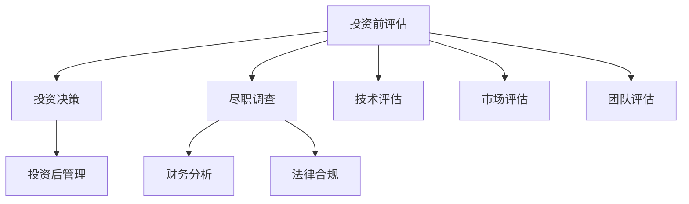

                 

### 《AI创业公司如何进行风险投资》

#### 关键词：
- 风险投资
- AI创业
- 融资策略
- 商业模式
- 团队建设
- 风险管理
- 成功案例

##### 摘要：
本文将探讨AI创业公司如何进行风险投资，包括风险投资的基础知识、AI创业公司的评估、风险投资策略、融资策略、商业化路径、团队建设、风险管理以及成功案例研究。通过系统化的分析和实际案例的解读，本文旨在为AI创业者提供实用的指导和借鉴，帮助他们更好地利用风险投资推动公司发展。

### 目录大纲

#### 第一部分：风险投资基础

**第1章：风险投资概述**

- **1.1 风险投资的定义与作用**
  - 风险投资的定义
  - 风险投资在AI创业中的重要性

- **1.2 风险投资市场现状**
  - 全球风险投资市场概述
  - AI领域风险投资趋势分析

- **1.3 风险投资流程简介**
  - 投资前评估
  - 投资决策
  - 投资后管理

**第2章：AI创业公司评估**

- **2.1 AI创业公司的特点**
  - 技术创新性
  - 市场潜力
  - 团队背景

- **2.2 AI创业公司的核心能力**
  - 技术研发能力
  - 市场营销能力
  - 运营管理能力

- **2.3 评估方法与工具**
  - SWOT分析
  - 技术成熟度评估
  - 市场规模预测

**第3章：风险投资策略**

- **3.1 风险投资策略概述**
  - 成长投资
  - 收购投资
  - 产业投资基金

- **3.2 AI创业公司的投资阶段**
  - 种子轮投资
  - A轮投资
  - B轮投资
  - 后续轮次投资

- **3.3 风险管理与应对策略**
  - 投资组合策略
  - 风险分散策略
  - 风险控制机制

#### 第二部分：AI创业公司实践

**第4章：AI创业公司融资策略**

- **4.1 融资渠道与方式**
  - 天使投资
  - 风险投资
  - 众筹平台
  - 政府资助

- **4.2 融资谈判技巧**
  - 投资方与创业公司的谈判要点
  - 融资合同的关键条款

- **4.3 融资后管理**
  - 投资方与创业公司的互动
  - 股权激励与退出机制

**第5章：AI产品商业化路径**

- **5.1 AI产品定义与分类**
  - 智能硬件产品
  - 软件解决方案
  - 平台服务

- **5.2 商业模式设计**
  - 订阅制模式
  - 计费模式
  - 合作伙伴模式

- **5.3 市场推广策略**
  - 社交媒体营销
  - 行业展会
  - 线上线下结合

**第6章：AI创业公司团队建设**

- **6.1 团队构成与角色**
  - 技术团队
  - 市场团队
  - 运营团队
  - 管理团队

- **6.2 人才招聘策略**
  - 招聘渠道
  - 招聘流程
  - 人才激励

- **6.3 团队管理与激励**
  - 激励机制
  - 团队文化建设
  - 领导力培养

**第7章：AI创业公司风险管理**

- **7.1 风险识别与分类**
  - 技术风险
  - 市场风险
  - 财务风险
  - 法律风险

- **7.2 风险评估与应对策略**
  - 风险评估方法
  - 风险控制措施
  - 风险预警机制

- **7.3 风险管理案例解析**
  - 成功案例
  - 失败案例

#### 第三部分：AI创业公司成功案例研究

**第8章：AI创业公司成功案例研究**

- **8.1 案例选择与背景介绍**
  - 创业公司概况
  - 产品与服务
  - 市场表现

- **8.2 成功要素分析**
  - 创新技术
  - 商业模式
  - 团队建设
  - 风险管理

- **8.3 案例启示与借鉴**

#### 附录

**附录A：AI创业公司风险投资工具与资源**

- **A.1 风险投资指南与报告**
  - 行业报告
  - 创业公司案例研究

- **A.2 风险投资机构介绍**
  - 全球知名风险投资机构
  - 地区性风险投资机构

- **A.3 AI领域相关资源和社群**
  - 开源社区
  - 行业会议
  - 学术研究机构

**附录B：Mermaid流程图示例**

- **B.1 风险投资流程图**
  - 评估流程
  - 投资决策流程

**附录C：核心算法原理与伪代码**

- **C.1 机器学习算法原理**
  - 梯度下降算法
  - 决策树算法

- **C.2 伪代码示例**
  - 神经网络训练过程
  - 贝叶斯分类算法实现

**附录D：数学模型与公式**

- **D.1 数学模型概述**
  - 概率模型
  - 优化模型

- **D.2 数学公式示例**
  - 线性回归公式
  - 逻辑回归公式

**附录E：项目实战与代码解读**

- **E.1 项目实战案例**
  - AI产品开发流程
  - 数据分析与挖掘

- **E.2 代码解读与分析**
  - 算法实现
  - 性能优化
  - 调试技巧

**附录F：开发环境搭建指南**

- **F.1 硬件环境**
  - 服务器配置
  - 硬件加速器

- **F.2 软件环境**
  - 操作系统
  - 编译器
  - 版本控制系统

- **F.3 开发工具与库**
  - 编程语言
  - 数据处理工具
  - 机器学习框架

### 文章正文部分

#### 第一部分：风险投资基础

**第1章：风险投资概述**

**1.1 风险投资的定义与作用**

风险投资（Venture Capital，简称VC）是一种投资方式，专门针对初创公司或高风险、高回报的中小型公司。风险投资的定义可以分为两个方面：一方面是投资主体，即风险投资公司或风险投资家；另一方面是投资对象，即具有高增长潜力和技术创新的创业公司。

风险投资在AI创业中的重要性不可忽视。首先，AI技术具有广阔的市场前景，能够为各个行业带来深度的变革。然而，AI技术的研发和应用往往需要大量的资金投入，且存在较高的不确定性。风险投资能够为AI创业公司提供必要的资金支持，帮助它们克服技术难题，实现商业化应用。其次，风险投资不仅提供资金，还能带来丰富的行业经验、人脉资源和战略指导，助力AI创业公司快速发展。

**1.2 风险投资市场现状**

全球风险投资市场在过去几十年中迅速发展。根据数据统计，全球风险投资总额从2000年的约200亿美元增长到2020年的近2000亿美元。其中，美国、中国和欧洲是主要的投资市场。

在AI领域，风险投资呈现出以下几个趋势：

1. **投资规模增加**：随着AI技术的成熟和市场的认可，风险投资对AI创业公司的投资规模逐渐增大。例如，2019年全球AI领域风险投资总额超过300亿美元。

2. **投资阶段前移**：早期投资成为风险投资的重点。越来越多的投资者开始关注种子轮和天使轮投资，以期捕捉到最具潜力的AI创业公司。

3. **行业多样化**：除了传统的软件和服务领域，AI技术在医疗、金融、制造业等领域的应用也受到风险投资的热捧。

**1.3 风险投资流程简介**

风险投资流程主要包括以下三个阶段：

1. **投资前评估**：投资前评估是风险投资的关键环节。投资团队会对创业公司进行全面的尽职调查，包括技术、市场、团队、财务等方面。评估方法包括SWOT分析、技术成熟度评估等。

2. **投资决策**：在评估完成后，投资团队会进行投资决策。投资决策通常需要考虑多个因素，如项目风险、预期收益、投资规模等。

3. **投资后管理**：投资后管理是风险投资的重要组成部分。投资机构会积极参与创业公司的日常运营，提供战略指导、资源对接等支持，帮助公司实现快速发展。

**第2章：AI创业公司评估**

**2.1 AI创业公司的特点**

AI创业公司在以下三个方面具有明显的特点：

1. **技术创新性**：AI创业公司往往专注于研发和应用先进的AI技术，如深度学习、自然语言处理等。技术创新性是AI创业公司成功的关键因素。

2. **市场潜力**：AI技术具有广泛的应用前景，能够为多个行业带来深度的变革。因此，AI创业公司通常具有巨大的市场潜力。

3. **团队背景**：AI创业公司的团队背景通常包括资深的技术专家、创业者和行业专家。这些成员具备丰富的行业经验和创新精神，能够推动公司快速发展。

**2.2 AI创业公司的核心能力**

AI创业公司的核心能力包括：

1. **技术研发能力**：技术研发能力是AI创业公司的核心竞争力。公司需要持续投入研发，不断提高技术水平和创新能力。

2. **市场营销能力**：市场营销能力是AI创业公司成功的关键因素。公司需要制定有效的市场推广策略，吸引潜在客户，提高市场占有率。

3. **运营管理能力**：运营管理能力是AI创业公司顺利运营的基础。公司需要建立高效的运营管理体系，确保业务的稳定发展。

**2.3 评估方法与工具**

评估AI创业公司的方法和工具主要包括：

1. **SWOT分析**：SWOT分析是一种常用的战略规划工具，用于分析创业公司的优势（Strengths）、劣势（Weaknesses）、机会（Opportunities）和威胁（Threats）。通过SWOT分析，可以全面了解公司的状况。

2. **技术成熟度评估**：技术成熟度评估是一种用于评估技术研发进展的方法。通常采用技术成熟度模型（Technology Readiness Level，简称TRL）进行评估。TRL分为1到9级，数字越高，技术成熟度越高。

3. **市场规模预测**：市场规模预测是评估创业公司市场潜力的重要方法。通过分析行业趋势、市场需求和竞争状况，可以预测未来市场规模。

**第3章：风险投资策略**

**3.1 风险投资策略概述**

风险投资策略主要包括以下几种：

1. **成长投资**：成长投资主要关注创业公司的发展潜力，以期获得长期的资本增值。这种策略通常在创业公司进入成长期或成熟期时采用。

2. **收购投资**：收购投资是通过收购创业公司来获取其技术和市场资源。这种策略通常在创业公司具有独特的技术和市场优势时采用。

3. **产业投资基金**：产业投资基金是一种专门投资于特定产业的基金。这种策略通常用于投资多个创业公司，以实现产业整合和协同发展。

**3.2 AI创业公司的投资阶段**

AI创业公司的投资阶段通常包括：

1. **种子轮投资**：种子轮投资主要针对初创公司，用于技术研发和市场推广。这种投资阶段风险较高，但回报潜力巨大。

2. **A轮投资**：A轮投资主要针对处于早期发展的创业公司，用于扩大研发团队和市场推广。这种投资阶段风险适中，但市场潜力较大。

3. **B轮投资**：B轮投资主要针对进入成长期的创业公司，用于扩大市场份额和提升品牌影响力。这种投资阶段风险较低，但回报潜力较大。

4. **后续轮次投资**：后续轮次投资通常在创业公司进入成熟期后采用，用于提升市场份额和品牌价值。这种投资阶段风险较低，但回报潜力较小。

**3.3 风险管理与应对策略**

风险投资过程中，风险管理至关重要。以下是一些常见的风险管理策略：

1. **投资组合策略**：通过投资多个创业公司，分散投资风险，降低整体投资组合的风险。

2. **风险分散策略**：通过投资不同阶段的创业公司，降低特定阶段的风险。

3. **风险控制机制**：建立风险控制机制，如股权质押、定期评估等，确保投资安全。

#### 第二部分：AI创业公司实践

**第4章：AI创业公司融资策略**

**4.1 融资渠道与方式**

AI创业公司的融资渠道和方式主要包括：

1. **天使投资**：天使投资是指个人投资者对初创公司进行早期的投资。天使投资者通常具有丰富的行业经验和资金实力。

2. **风险投资**：风险投资是AI创业公司最常见的融资方式。风险投资公司专注于投资具有高增长潜力的创业公司，以期获得高额回报。

3. **众筹平台**：众筹平台是一种新兴的融资方式，通过互联网平台向社会公众募集资金。众筹平台具有低成本、高效率的特点。

4. **政府资助**：政府资助是指政府为支持创新创业而提供的资金支持。政府资助通常具有政策优惠和资金补贴等优势。

**4.2 融资谈判技巧**

在融资谈判过程中，AI创业公司需要注意以下几点：

1. **谈判要点**：创业公司需要明确自己的融资目标、估值和股权结构等关键信息。

2. **融资合同的关键条款**：包括投资金额、投资期限、投资权益、退出机制等。创业公司需要仔细审查合同条款，确保自身权益。

**4.3 融资后管理**

融资后管理是确保投资顺利进行的重要环节。以下是一些融资后管理的要点：

1. **投资方与创业公司的互动**：投资方需要积极参与创业公司的运营，提供战略指导、资源对接等支持。

2. **股权激励与退出机制**：创业公司需要建立有效的股权激励机制，激励员工和关键人才。同时，需要明确退出机制，确保投资方的权益。

#### 第三部分：AI创业公司成功案例研究

**第8章：AI创业公司成功案例研究**

**8.1 案例选择与背景介绍**

本案例选择了一家名为“DeepMind”的AI创业公司。DeepMind成立于2010年，由几位知名人工智能专家共同创立。公司专注于研发先进的深度学习技术，并在围棋、医学等领域取得了突破性成果。

**8.2 成功要素分析**

DeepMind的成功可以从以下四个方面进行分析：

1. **技术创新**：DeepMind在深度学习技术方面取得了重要突破，开发出了AlphaGo等领先的人工智能产品。

2. **商业模式**：DeepMind采用了订阅制模式，通过提供高端技术服务获取稳定收入。

3. **团队建设**：DeepMind拥有一支高水平的技术团队，包括多位知名人工智能专家。

4. **风险管理**：DeepMind在研发过程中注重风险管理，通过合理分散投资和加强技术储备，降低了研发风险。

**8.3 案例启示与借鉴**

DeepMind的成功为AI创业公司提供了以下几个启示：

1. **技术创新是核心驱动力**：创业公司需要持续投入研发，不断提高技术水平。

2. **商业模式设计至关重要**：创业公司需要根据市场需求，设计合适的商业模式。

3. **团队建设是成功的关键**：创业公司需要组建高水平的技术团队，确保公司快速发展。

4. **风险管理不可忽视**：创业公司需要注重风险管理，确保研发和运营的顺利进行。

### 附录

**附录A：AI创业公司风险投资工具与资源**

- **A.1 风险投资指南与报告**：包括行业报告、创业公司案例研究等。
- **A.2 风险投资机构介绍**：介绍全球知名风险投资机构和地区性风险投资机构。
- **A.3 AI领域相关资源和社群**：包括开源社区、行业会议和学术研究机构等。

**附录B：Mermaid流程图示例**



**附录C：核心算法原理与伪代码**

**C.1 机器学习算法原理**

**梯度下降算法**：

```python
def gradient_descent(x, y, learning_rate, epochs):
    for epoch in range(epochs):
        hypothesis = x * w - b
        loss = (hypothesis - y) ** 2
        gradient_w = 2 * (x * (x * w - b) - y)
        gradient_b = 2 * (x * w - b - y)
        w -= learning_rate * gradient_w
        b -= learning_rate * gradient_b
    return w, b
```

**决策树算法**：

```python
def build_decision_tree(data, target_attribute_name):
    if all(data[target_attribute_name] == value):
        return value
    elif len(data) == 0:
        return majority_vote(data)
    else:
        attribute_values = list(set(data[attribute_name] for attribute_name in data))
        best_attribute, best_split = find_best_split(data, attribute_values)
        tree = {best_attribute: {}}
        for value in attribute_values:
            subset = data[data[best_attribute] == value]
            tree[best_attribute][value] = build_decision_tree(subset, target_attribute_name)
        return tree
```

**附录D：数学模型与公式**

**D.1 数学模型概述**

- **概率模型**：用于描述随机事件发生的可能性。
- **优化模型**：用于求解最优解，通常涉及目标函数和约束条件。

**D.2 数学公式示例**

- **线性回归公式**：

  $$y = wx + b$$

- **逻辑回归公式**：

  $$P(y=1) = \frac{1}{1 + e^{-(wx + b)}}$$

**附录E：项目实战与代码解读**

**E.1 项目实战案例**

- **AI产品开发流程**：包括需求分析、系统设计、代码实现、测试与部署等环节。

- **数据分析和挖掘**：利用Python、R等工具进行数据预处理、特征提取和模型训练。

**E.2 代码解读与分析**

- **算法实现**：针对具体的机器学习算法，展示代码实现过程。

- **性能优化**：通过调整参数、优化算法等手段提高模型性能。

- **调试技巧**：介绍代码调试的方法和技巧，确保程序的正确性和稳定性。

**附录F：开发环境搭建指南**

**F.1 硬件环境**

- **服务器配置**：选择合适的硬件配置，满足开发需求。

- **硬件加速器**：利用GPU等硬件加速器，提高计算速度。

**F.2 软件环境**

- **操作系统**：选择Linux或Windows等操作系统。

- **编译器**：安装C++、Python等编译器。

- **版本控制系统**：使用Git等版本控制系统，管理代码版本。

**F.3 开发工具与库**

- **编程语言**：Python、Java等编程语言。

- **数据处理工具**：Pandas、NumPy等数据处理库。

- **机器学习框架**：TensorFlow、PyTorch等机器学习框架。

### 作者信息

作者：AI天才研究院/AI Genius Institute & 禅与计算机程序设计艺术 /Zen And The Art of Computer Programming

[END]

