                 

# 《AI创业公司的产品内容运营：内容策划、生产与分发》

> 关键词：AI创业公司、内容运营、策划、生产、分发、目标用户分析、内容质量评估、内容分发策略、内容运营团队建设、数据监控与绩效评估、内容运营趋势

> 摘要：本文将深入探讨AI创业公司在产品内容运营方面的策略与实践。从内容运营的基本概念、目标用户分析、内容策划、生产与分发，到内容运营团队建设、数据监控与绩效评估，再到未来内容运营趋势，全面解析AI创业公司的内容运营之道。

## 目录大纲

1. 内容运营概述
    1.1 内容运营的基本概念
    1.2 内容运营的重要性
    1.3 内容运营的流程
2. 目标用户分析与需求挖掘
    2.1 目标用户分析
    2.2 需求挖掘方法
    2.3 用户需求与产品内容的关系
3. 内容策划
    3.1 内容策划原则与方法
    3.2 创意思维与内容创作
    3.3 内容调性定位与品牌形象
4. 内容生产
    4.1 内容生产工具与平台
    4.2 内容质量评估与优化
5. 内容分发
    5.1 内容分发策略
    5.2 内容推广与传播
6. 内容运营案例分析与实战
    6.1 案例分析
    6.2 实战技巧
    6.3 问题与解决方案
7. 内容运营综合管理
    7.1 内容运营团队建设
    7.2 内容运营数据监控与绩效评估
    7.3 内容运营策略调整与优化
8. 未来内容运营趋势
    8.1 人工智能与内容运营
    8.2 新媒体与内容分发
    8.3 未来内容运营的发展方向
9. 附录
    9.1 内容运营工具与资源推荐
    9.2 常见问题解答

## 第一部分：内容运营概述

### 第1章：内容运营概述

#### 1.1 内容运营的基本概念

内容运营是指通过策划、创作、优化和分发优质内容，以达到提升品牌知名度、增加用户粘性、促进产品销售等目标的一系列运营活动。在AI创业公司中，内容运营尤为重要，因为它不仅能够帮助公司树立品牌形象，还能直接影响到用户的购买决策。

**核心概念与联系**

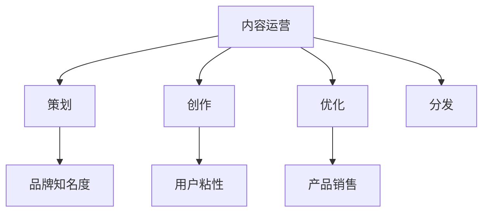

#### 1.2 内容运营的重要性

内容运营在AI创业公司中具有以下几个重要作用：

- **提升品牌知名度**：通过持续、有针对性的内容创作，可以在用户心中树立品牌形象，增加品牌曝光度。
- **增加用户粘性**：优质的内容可以吸引用户持续关注，提升用户对品牌的忠诚度。
- **促进产品销售**：内容运营可以通过案例分享、用户评价等手段，直接推动产品的销售。

**核心算法原理讲解**

内容运营的算法原理可以概括为以下几点：

1. **数据分析**：通过对用户行为、市场趋势的数据分析，挖掘用户需求和偏好。
2. **内容创作**：根据数据分析结果，创作符合用户需求的内容。
3. **内容优化**：通过数据分析，不断调整和优化内容，提高用户体验。
4. **内容分发**：将优质内容通过多种渠道分发，提高内容覆盖面。

**数学模型和公式**

$$
\text{品牌知名度} = f(\text{内容质量}, \text{内容覆盖率}, \text{用户粘性})
$$

其中，内容质量、内容覆盖率和用户粘性分别表示内容的质量、内容的覆盖范围和用户对品牌的忠诚度。

**举例说明**

假设某AI创业公司通过内容运营提高了用户粘性，具体表现为用户在产品上的活跃度提高了20%，那么根据公式，品牌知名度也将相应提高。

#### 1.3 内容运营的流程

内容运营的流程主要包括以下几个步骤：

1. **需求分析**：分析用户需求和市场趋势，明确内容方向。
2. **内容策划**：根据需求分析结果，制定内容策划方案。
3. **内容创作**：按照策划方案，进行内容创作。
4. **内容优化**：对创作出的内容进行优化，提高用户体验。
5. **内容分发**：通过多种渠道分发内容，提高内容覆盖面。

**核心概念与联系**

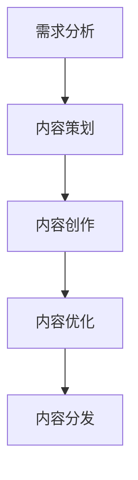

**核心算法原理讲解**

内容运营的流程算法原理可以概括为以下几点：

1. **需求分析**：通过数据分析，挖掘用户需求。
2. **内容策划**：根据用户需求，制定内容策划方案。
3. **内容创作**：按照策划方案，进行内容创作。
4. **内容优化**：通过用户反馈和数据分析，优化内容。
5. **内容分发**：将优化后的内容通过多种渠道分发。

**数学模型和公式**

$$
\text{内容运营效果} = f(\text{需求分析准确度}, \text{内容策划质量}, \text{内容创作能力}, \text{内容优化效果}, \text{内容分发效率})
$$`

其中，需求分析准确度、内容策划质量、内容创作能力、内容优化效果和内容分发效率分别表示各个环节的效率和质量。

**举例说明**

假设某AI创业公司通过内容运营提升了用户满意度，具体表现为用户满意度提高了30%，那么根据公式，内容运营效果也将相应提高。

### 第2章：目标用户分析与需求挖掘

#### 2.1 目标用户分析

目标用户分析是内容运营的第一步，也是至关重要的一步。只有明确了目标用户，才能有针对性地进行内容策划和创作。

**核心概念与联系**

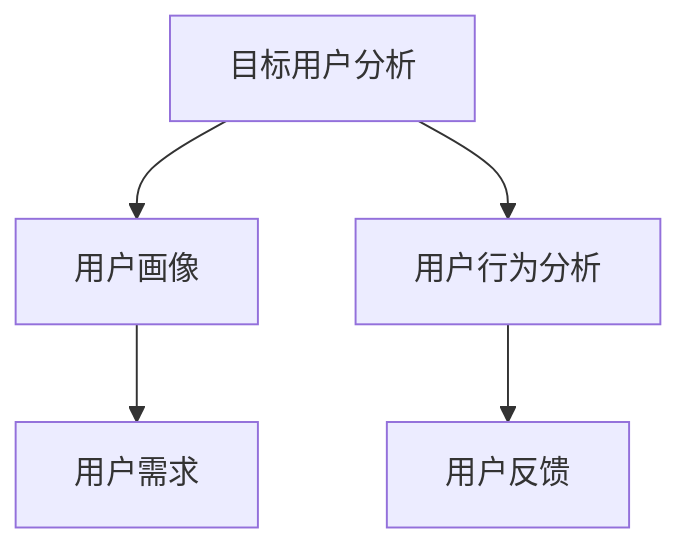

**核心算法原理讲解**

目标用户分析的算法原理可以概括为以下几点：

1. **用户画像**：通过用户的基本信息、兴趣爱好、行为习惯等，构建用户画像。
2. **用户需求**：通过用户画像，分析用户需求，明确内容方向。
3. **用户行为分析**：通过用户在产品上的行为数据，了解用户行为模式。
4. **用户反馈**：通过用户反馈，了解用户对内容的接受程度和满意度。

**数学模型和公式**

$$
\text{用户需求} = f(\text{用户画像}, \text{用户行为分析}, \text{用户反馈})
$$

**举例说明**

假设某AI创业公司的目标用户是程序员，通过用户画像和用户行为分析，发现程序员对技术分享类内容感兴趣，那么可以针对性地创作技术分享类内容。

#### 2.2 需求挖掘方法

需求挖掘是目标用户分析的核心环节，通过需求挖掘，可以更加深入地了解用户需求，为内容策划提供依据。

**核心概念与联系**

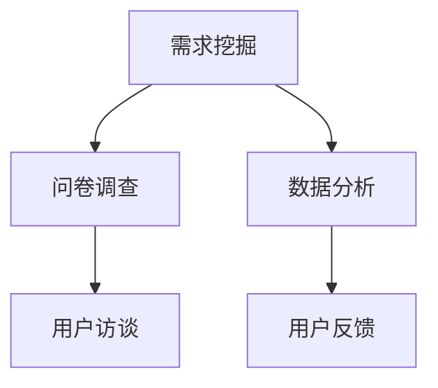

**核心算法原理讲解**

需求挖掘的算法原理可以概括为以下几点：

1. **问卷调查**：通过设计问卷，收集用户反馈。
2. **用户访谈**：通过一对一访谈，深入了解用户需求。
3. **数据分析**：通过数据分析，挖掘用户行为和需求。
4. **用户反馈**：通过用户反馈，验证需求挖掘结果。

**数学模型和公式**

$$
\text{用户需求} = f(\text{问卷调查结果}, \text{用户访谈结果}, \text{数据分析结果}, \text{用户反馈})
$$

**举例说明**

假设某AI创业公司通过问卷调查和用户访谈，发现用户对AI技术在医疗领域的应用感兴趣，那么可以针对性地创作关于AI在医疗领域应用的内容。

#### 2.3 用户需求与产品内容的关系

用户需求与产品内容的关系是内容运营的核心。只有将用户需求与产品内容紧密结合，才能实现内容运营的目标。

**核心概念与联系**

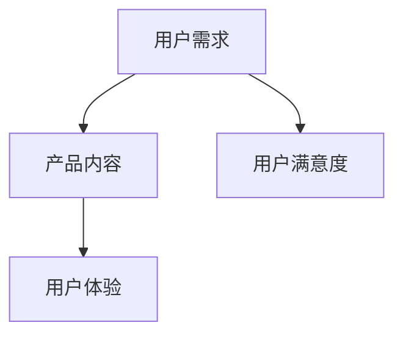

**核心算法原理讲解**

用户需求与产品内容的关系的算法原理可以概括为以下几点：

1. **用户需求**：通过目标用户分析和需求挖掘，明确用户需求。
2. **产品内容**：根据用户需求，创作符合用户需求的产品内容。
3. **用户体验**：通过优化内容，提升用户体验。
4. **用户满意度**：通过用户满意度，评估内容运营效果。

**数学模型和公式**

$$
\text{用户满意度} = f(\text{用户需求满足度}, \text{用户体验})
$$

**举例说明**

假设某AI创业公司的产品内容满足了用户对AI技术在医疗领域的需求，同时用户对产品的体验也非常好，那么可以判断用户满意度较高。

### 第二部分：内容策划

#### 第3章：内容策划原则与方法

**3.1 内容策划原则**

内容策划是内容运营的关键环节，其核心目的是为了满足用户需求，提升用户体验。以下是一些内容策划的基本原则：

1. **用户导向**：始终以用户为中心，了解用户需求，创作符合用户需求的内容。
2. **差异化**：在内容策划过程中，要突出差异化，避免与竞争对手的内容同质化。
3. **可操作性**：策划的内容要具有可操作性，便于用户理解和实施。
4. **持续更新**：内容策划要注重持续更新，保持内容的时效性和新鲜感。

**核心概念与联系**

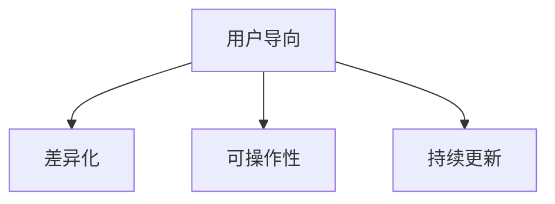

**核心算法原理讲解**

内容策划的算法原理可以概括为以下几点：

1. **用户需求分析**：通过用户画像和行为分析，了解用户需求。
2. **内容差异化分析**：分析竞争对手的内容，找出差异化点。
3. **内容可操作性评估**：评估内容是否具有可操作性。
4. **内容更新策略**：制定内容更新策略，保持内容的新鲜度。

**数学模型和公式**

$$
\text{内容策划效果} = f(\text{用户需求满足度}, \text{内容差异化度}, \text{内容可操作性}, \text{内容更新频率})
$$

**举例说明**

假设某AI创业公司通过用户需求分析，发现用户对AI技术在金融领域的应用感兴趣，同时分析竞争对手的内容，发现该领域的内容较为同质化，那么可以策划一系列金融领域的AI应用内容，以突出差异化。

**3.2 内容策划方法**

内容策划的方法多种多样，以下是一些常用的内容策划方法：

1. **头脑风暴**：通过集体讨论，激发创意，制定初步内容策划方案。
2. **用户访谈**：通过与用户直接交流，了解用户需求，为内容策划提供依据。
3. **数据分析**：通过数据分析，挖掘用户行为和需求，为内容策划提供数据支持。
4. **内容矩阵**：通过内容矩阵，明确内容方向和策略，确保内容策划的系统性和完整性。

**核心概念与联系**

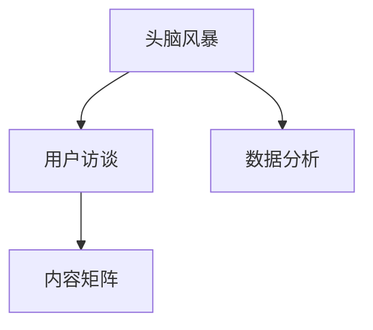

**核心算法原理讲解**

内容策划方法的算法原理可以概括为以下几点：

1. **头脑风暴**：通过集体智慧，激发创意。
2. **用户访谈**：通过与用户交流，了解用户需求。
3. **数据分析**：通过数据分析，支持决策。
4. **内容矩阵**：通过内容矩阵，明确内容方向和策略。

**数学模型和公式**

$$
\text{内容策划效果} = f(\text{头脑风暴效果}, \text{用户访谈效果}, \text{数据分析效果}, \text{内容矩阵效果})
$$

**举例说明**

假设某AI创业公司通过头脑风暴和用户访谈，确定了AI技术在金融领域的应用作为内容策划方向，并通过数据分析验证了用户对此领域的兴趣，那么可以制定详细的内容策划方案。

**3.3 内容类型选择与内容规划**

内容类型选择和内容规划是内容策划的重要环节，直接影响到内容的传播效果和用户满意度。

**核心概念与联系**

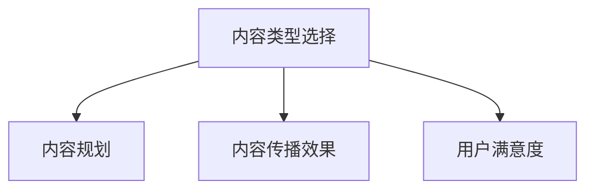

**核心算法原理讲解**

内容类型选择和内容规划的算法原理可以概括为以下几点：

1. **内容类型选择**：根据用户需求和内容策划目标，选择合适的内容类型。
2. **内容规划**：制定内容发布计划，确保内容的有序传播。
3. **内容传播效果评估**：通过数据分析，评估内容传播效果。
4. **用户满意度评估**：通过用户反馈，评估用户满意度。

**数学模型和公式**

$$
\text{内容传播效果} = f(\text{内容类型选择}, \text{内容规划}, \text{内容传播渠道})
$$

$$
\text{用户满意度} = f(\text{内容传播效果}, \text{内容质量}, \text{用户体验})
$$

**举例说明**

假设某AI创业公司选择技术文章和案例分享作为内容类型，通过数据分析，发现用户对技术文章的传播效果较好，同时用户满意度也较高，那么可以加大技术文章的发布频率。

### 第4章：创意思维与内容创作

**4.1 创意思维工具**

创意思维是内容创作的关键，以下是一些常用的创意思维工具：

1. **头脑风暴**：通过集体讨论，激发创意。
2. **思维导图**：通过绘制思维导图，梳理创意思路。
3. **联想思维**：通过联想，拓展创意思维。
4. **逆向思维**：通过反向思考，发现新的创意点。

**核心概念与联系**

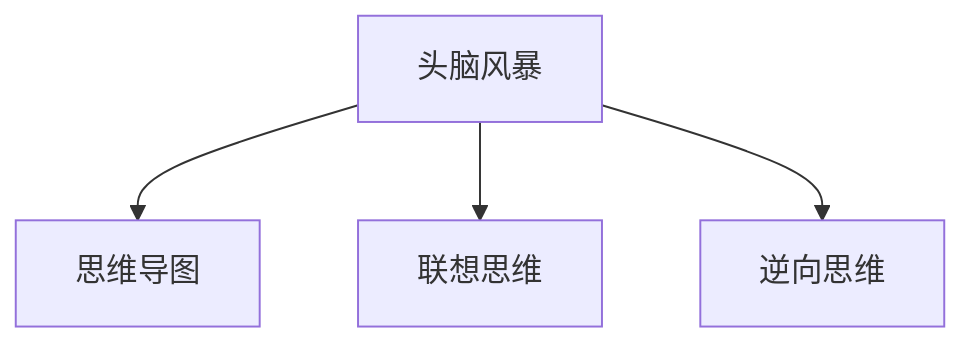

**核心算法原理讲解**

创意思维的算法原理可以概括为以下几点：

1. **头脑风暴**：通过集体智慧，激发创意。
2. **思维导图**：通过图形化表达，梳理创意思路。
3. **联想思维**：通过联想，拓展创意思维。
4. **逆向思维**：通过反向思考，发现新的创意点。

**数学模型和公式**

$$
\text{创意思维效果} = f(\text{头脑风暴效果}, \text{思维导图效果}, \text{联想思维效果}, \text{逆向思维效果})
$$

**举例说明**

假设某AI创业公司通过头脑风暴和思维导图，确定了一个关于AI在医疗领域应用的新创意，那么可以进一步展开内容创作。

**4.2 内容创作流程**

内容创作是一个系统化的过程，以下是一个典型的内容创作流程：

1. **需求分析**：了解用户需求，确定内容主题。
2. **创意构思**：运用创意思维工具，构思内容创意。
3. **内容撰写**：根据创意构思，撰写内容初稿。
4. **内容修改**：对初稿进行修改，优化内容结构。
5. **内容审阅**：对修改后的内容进行审阅，确保内容质量。
6. **内容发布**：将内容发布到相应平台，进行传播。

**核心概念与联系**

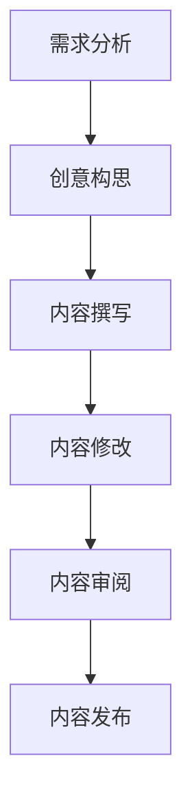

**核心算法原理讲解**

内容创作流程的算法原理可以概括为以下几点：

1. **需求分析**：通过用户需求，确定内容主题。
2. **创意构思**：通过创意思维工具，构思内容创意。
3. **内容撰写**：根据创意构思，撰写内容初稿。
4. **内容修改**：对初稿进行修改，优化内容结构。
5. **内容审阅**：对修改后的内容进行审阅，确保内容质量。
6. **内容发布**：将内容发布到相应平台，进行传播。

**数学模型和公式**

$$
\text{内容创作效果} = f(\text{需求分析准确度}, \text{创意构思质量}, \text{内容撰写能力}, \text{内容修改效果}, \text{内容发布效率})
$$

**举例说明**

假设某AI创业公司通过用户需求分析，确定了用户对AI技术在教育领域的应用感兴趣，然后通过创意构思，创作了一篇关于AI教育应用的文章，经过修改和审阅，最终发布到公众号上，取得了良好的传播效果。

**4.3 文案写作技巧**

文案写作是内容创作的重要环节，以下是一些文案写作的技巧：

1. **标题写作**：标题要简洁明了，能够吸引读者的注意力。
2. **结构布局**：结构要清晰，逻辑要严密，便于读者阅读。
3. **语言风格**：语言要生动有趣，避免过于专业或过于简单。
4. **修辞手法**：适当运用修辞手法，提升文案的艺术性。

**核心概念与联系**

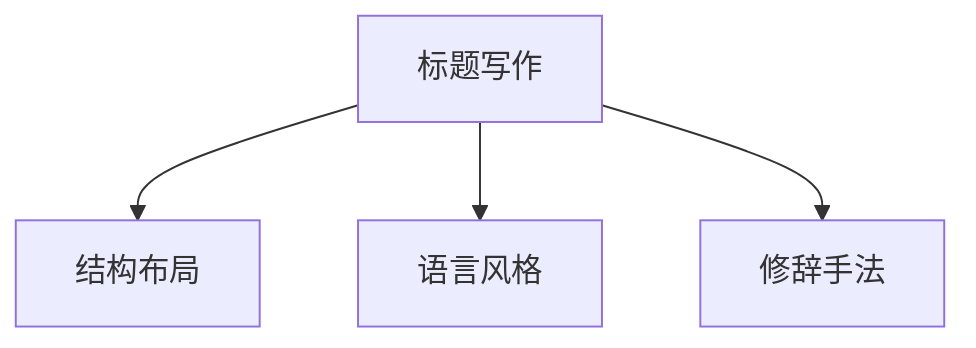

**核心算法原理讲解**

文案写作的算法原理可以概括为以下几点：

1. **标题写作**：通过数据分析，选择有吸引力的标题。
2. **结构布局**：通过逻辑思维，设计清晰的结构。
3. **语言风格**：通过用户画像，选择合适的语言风格。
4. **修辞手法**：通过创意思维，运用适当的修辞手法。

**数学模型和公式**

$$
\text{文案写作效果} = f(\text{标题吸引力}, \text{结构清晰度}, \text{语言风格适应性}, \text{修辞手法运用度})
$$

**举例说明**

假设某AI创业公司要撰写一篇关于AI在教育领域的应用文章，标题为“AI如何改变教育”，通过数据分析，发现用户对AI在教育中的应用感兴趣，然后通过逻辑思维设计结构，选择生动有趣的语言风格，并适当运用修辞手法，最终创作出了一篇吸引人的文案。

### 第5章：内容调性定位与品牌形象

**5.1 内容调性定位**

内容调性定位是内容运营的重要环节，它关系到品牌形象和用户体验。以下是一些内容调性定位的原则：

1. **符合品牌定位**：内容调性要符合品牌定位，体现品牌特色。
2. **贴近用户**：内容调性要贴近用户，符合用户需求和喜好。
3. **保持一致性**：内容调性要保持一致性，避免内容风格过于多变。
4. **积极向上**：内容调性要积极向上，传递正能量。

**核心概念与联系**

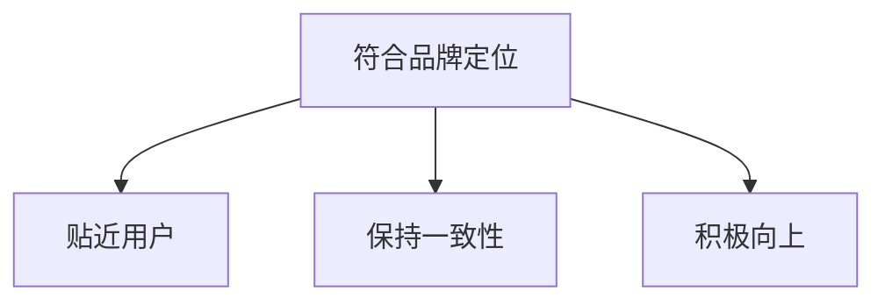

**核心算法原理讲解**

内容调性定位的算法原理可以概括为以下几点：

1. **品牌定位分析**：通过品牌定位，确定内容调性方向。
2. **用户画像分析**：通过用户画像，确定用户喜好和需求。
3. **内容风格分析**：通过内容风格分析，确保内容调性的一致性。
4. **正能量传递**：通过积极向上的内容，传递正能量。

**数学模型和公式**

$$
\text{内容调性定位效果} = f(\text{品牌定位符合度}, \text{用户画像贴近度}, \text{内容风格一致性}, \text{正能量传递度})
$$

**举例说明**

假设某AI创业公司的品牌定位是“创新、科技、实用”，通过用户画像分析，发现用户喜欢有趣、实用、具有启发性的内容，那么可以确定内容调性为“有趣、实用、启发式”，确保内容符合品牌定位和用户需求。

**5.2 品牌形象设计**

品牌形象设计是内容运营的重要组成部分，它关系到品牌在用户心中的形象和认知。以下是一些品牌形象设计的原则：

1. **独特性**：品牌形象设计要独特，能够区别于竞争对手。
2. **一致性**：品牌形象设计要保持一致性，确保品牌形象的连贯性。
3. **可识别性**：品牌形象设计要具有可识别性，让用户能够快速识别品牌。
4. **友好性**：品牌形象设计要友好，便于用户接受和认同。

**核心概念与联系**

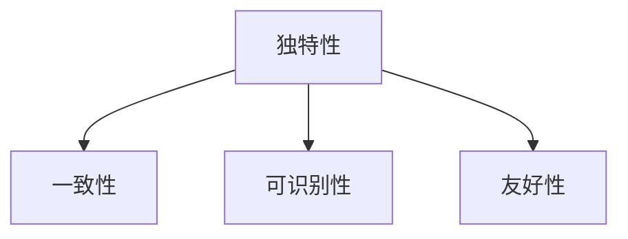

**核心算法原理讲解**

品牌形象设计的算法原理可以概括为以下几点：

1. **市场分析**：通过市场分析，确定品牌形象设计的基本方向。
2. **用户画像分析**：通过用户画像，确定用户对品牌形象的需求和喜好。
3. **品牌元素设计**：通过品牌元素设计，确保品牌形象的独特性和一致性。
4. **用户反馈**：通过用户反馈，不断优化品牌形象设计。

**数学模型和公式**

$$
\text{品牌形象设计效果} = f(\text{独特性}, \text{一致性}, \text{可识别性}, \text{友好性}, \text{用户反馈})
$$

**举例说明**

假设某AI创业公司的品牌形象设计目标是“科技、创新、简洁”，通过市场分析和用户画像分析，发现用户喜欢简洁、易于识别的品牌形象，那么可以设计一个简洁、现代、易于识别的Logo和视觉元素，确保品牌形象独特、一致、可识别和友好。

**5.3 跨平台内容运营策略**

跨平台内容运营策略是内容运营的重要组成部分，它涉及到在不同平台上的内容策划、创作和分发。以下是一些跨平台内容运营策略：

1. **平台定位**：明确不同平台的特点和优势，制定相应的运营策略。
2. **内容差异化**：根据不同平台的特点，创作符合平台调性的内容。
3. **渠道整合**：将不同平台的内容整合，形成统一的品牌形象。
4. **用户互动**：通过用户互动，提升用户粘性和品牌认知。

**核心概念与联系**

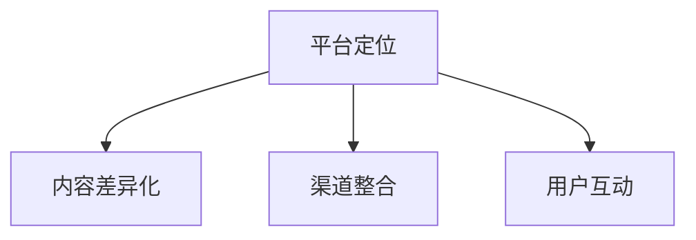

**核心算法原理讲解**

跨平台内容运营策略的算法原理可以概括为以下几点：

1. **平台分析**：通过平台分析，了解不同平台的特点和用户需求。
2. **内容策划**：根据平台分析结果，制定符合平台调性的内容策划。
3. **内容创作**：根据内容策划，创作符合平台特点的内容。
4. **渠道整合**：通过渠道整合，形成统一的品牌传播效果。
5. **用户互动**：通过用户互动，提升用户粘性和品牌认知。

**数学模型和公式**

$$
\text{跨平台内容运营效果} = f(\text{平台定位准确度}, \text{内容差异化度}, \text{渠道整合度}, \text{用户互动度})
$$

**举例说明**

假设某AI创业公司要在不同平台（如微信公众号、微博、抖音）上进行内容运营，通过平台分析，发现微信公众号的用户更倾向于阅读长文，微博的用户更倾向于阅读短文，抖音的用户更倾向于观看视频。那么可以制定以下运营策略：

- 在微信公众号上发布长文，介绍AI技术的最新进展和应用案例。
- 在微博上发布短文，分享AI技术的趣味知识和行业动态。
- 在抖音上发布视频，展示AI技术的应用场景和操作步骤。

通过以上策略，可以确保内容在不同平台上的传播效果，提升用户粘性和品牌认知。

### 第三部分：内容生产

#### 第6章：内容生产工具与平台

**6.1 内容生产工具**

内容生产工具是内容运营的重要支撑，以下是一些常用的内容生产工具：

1. **文字编辑工具**：如Microsoft Word、Google Docs等。
2. **图像处理工具**：如Adobe Photoshop、Canva等。
3. **视频制作工具**：如Adobe Premiere Pro、Final Cut Pro等。
4. **音频处理工具**：如Audacity、Adobe Audition等。
5. **编程工具**：如Visual Studio、PyCharm等。

**核心概念与联系**

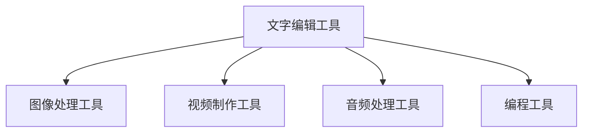

**核心算法原理讲解**

内容生产工具的算法原理可以概括为以下几点：

1. **文字编辑**：通过文本处理算法，实现文字的编辑和排版。
2. **图像处理**：通过图像处理算法，实现图像的编辑和优化。
3. **视频制作**：通过视频处理算法，实现视频的剪辑和特效。
4. **音频处理**：通过音频处理算法，实现音频的编辑和优化。
5. **编程**：通过编程语言和算法，实现软件的开发和功能实现。

**数学模型和公式**

$$
\text{内容生产效率} = f(\text{文字编辑效率}, \text{图像处理效率}, \text{视频制作效率}, \text{音频处理效率}, \text{编程效率})
$$

**举例说明**

假设某AI创业公司使用以下工具进行内容生产：

- 文字编辑：Microsoft Word
- 图像处理：Adobe Photoshop
- 视频制作：Adobe Premiere Pro
- 音频处理：Audacity
- 编程：Visual Studio

通过这些工具，可以高效地完成内容生产任务。

**6.2 内容平台介绍**

内容平台是内容运营的重要渠道，以下是一些常用的内容平台：

1. **微信公众号**：适用于发布长篇文章和图文内容。
2. **微博**：适用于发布短文和新闻动态。
3. **抖音**：适用于发布短视频和直播。
4. **Bilibili**：适用于发布动画、游戏和科技类视频。
5. **知乎**：适用于发布专业知识和问答内容。

**核心概念与联系**

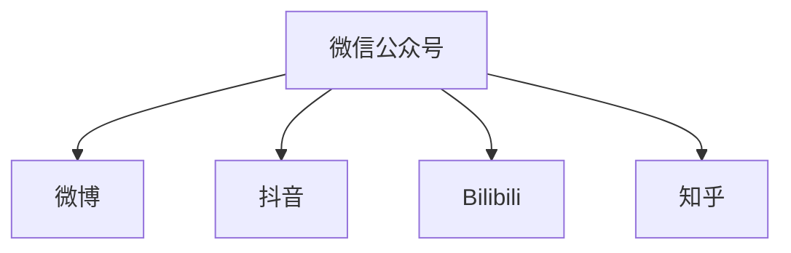

**核心算法原理讲解**

内容平台的算法原理可以概括为以下几点：

1. **内容推荐**：通过算法，推荐用户可能感兴趣的内容。
2. **用户互动**：通过算法，促进用户之间的互动和评论。
3. **内容审核**：通过算法，过滤违规内容和垃圾信息。
4. **数据分析**：通过算法，分析用户行为和内容效果。

**数学模型和公式**

$$
\text{内容平台效果} = f(\text{内容推荐效果}, \text{用户互动效果}, \text{内容审核效果}, \text{数据分析效果})
$$

**举例说明**

假设某AI创业公司选择在微信公众号和抖音上发布内容，通过内容推荐算法，可以确保用户看到感兴趣的内容，通过用户互动和数据分析，可以了解用户反馈和内容效果，从而不断优化内容策略。

**6.3 平台选择与运营策略**

选择合适的平台和制定有效的运营策略是内容运营成功的关键。以下是一些平台选择和运营策略的建议：

1. **目标用户分析**：了解目标用户的兴趣和习惯，选择适合的平台。
2. **内容类型分析**：根据内容类型，选择适合的平台。
3. **平台特点分析**：了解各个平台的特点，制定相应的运营策略。
4. **数据监控**：通过数据监控，了解内容效果，及时调整运营策略。

**核心概念与联系**

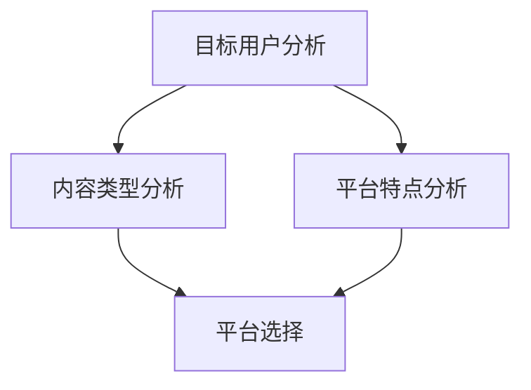

**核心算法原理讲解**

平台选择和运营策略的算法原理可以概括为以下几点：

1. **目标用户分析**：通过用户画像和行为分析，确定目标用户。
2. **内容类型分析**：根据内容类型，选择适合的平台。
3. **平台特点分析**：了解各个平台的特点，制定相应的运营策略。
4. **数据监控**：通过数据监控，了解内容效果，及时调整运营策略。

**数学模型和公式**

$$
\text{平台选择与运营策略效果} = f(\text{目标用户匹配度}, \text{内容类型匹配度}, \text{平台特点匹配度}, \text{数据监控效率})
$$

**举例说明**

假设某AI创业公司目标用户是科技爱好者，根据内容类型分析，决定在微信公众号和抖音上发布内容。通过对微信公众号和抖音的特点分析，确定在微信公众号上发布技术文章，在抖音上发布短视频。通过数据监控，发现用户对短视频的反馈更好，于是调整策略，增加短视频的发布频率。

### 第7章：内容质量评估与优化

**7.1 内容质量评估标准**

内容质量评估是内容运营的重要环节，它关系到内容的价值和用户体验。以下是一些常见的内容质量评估标准：

1. **内容准确性**：内容是否准确、可靠，有无误导用户。
2. **内容完整性**：内容是否完整，有无缺失关键信息。
3. **内容原创性**：内容是否原创，有无抄袭或搬运他人作品。
4. **内容价值**：内容是否对用户有价值，能否解决用户的问题或需求。
5. **内容易读性**：内容是否易于阅读，有无语言障碍或结构混乱。

**核心概念与联系**

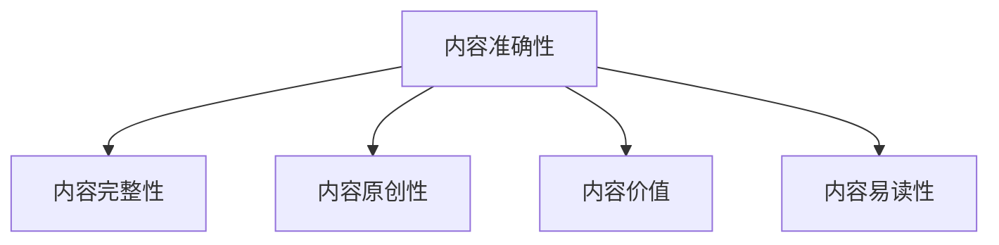

**核心算法原理讲解**

内容质量评估的算法原理可以概括为以下几点：

1. **内容准确性评估**：通过事实检查和专家评审，评估内容的准确性。
2. **内容完整性评估**：通过信息比对和内容分析，评估内容的完整性。
3. **内容原创性评估**：通过文本相似度分析和原创性检测，评估内容的原创性。
4. **内容价值评估**：通过用户反馈和数据分析，评估内容的价值。
5. **内容易读性评估**：通过文本分析和技术手段，评估内容的易读性。

**数学模型和公式**

$$
\text{内容质量评估得分} = f(\text{内容准确性得分}, \text{内容完整性得分}, \text{内容原创性得分}, \text{内容价值得分}, \text{内容易读性得分})
$$

**举例说明**

假设某AI创业公司的内容评估得分为90分，其中内容准确性得分90分，内容完整性得分85分，内容原创性得分80分，内容价值得分85分，内容易读性得分80分。通过分析评估得分，可以找出需要优化的方面，如内容完整性和原创性。

**7.2 内容优化方法**

内容优化是提升内容质量的重要手段，以下是一些常见的内容优化方法：

1. **内容修正**：对内容中的错误和不足进行修正。
2. **内容扩充**：对内容进行扩展，增加相关知识点和案例。
3. **内容重构**：对内容进行重新组织和结构优化。
4. **内容丰富**：通过图片、视频、图表等多种形式，丰富内容形式。
5. **内容互动**：增加用户互动环节，提升用户参与度。

**核心概念与联系**

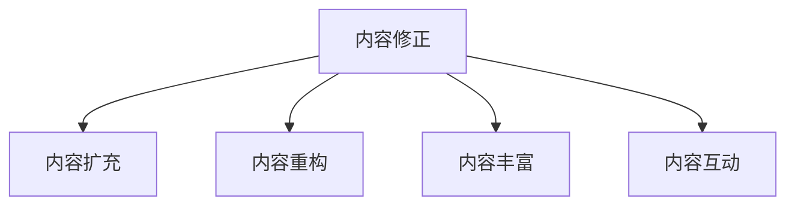

**核心算法原理讲解**

内容优化的算法原理可以概括为以下几点：

1. **内容修正**：通过错误检测和修正算法，自动修正内容中的错误。
2. **内容扩充**：通过文本生成和内容分析算法，自动扩充内容。
3. **内容重构**：通过文本分析和技术手段，自动重构内容结构。
4. **内容丰富**：通过多媒体内容生成和融合算法，丰富内容形式。
5. **内容互动**：通过用户行为分析和互动算法，提升用户互动体验。

**数学模型和公式**

$$
\text{内容优化效果} = f(\text{内容修正效果}, \text{内容扩充效果}, \text{内容重构效果}, \text{内容丰富效果}, \text{内容互动效果})
$$

**举例说明**

假设某AI创业公司通过内容优化，将一篇内容修正错误率降低了20%，内容扩充了30%，内容重构效果提高了25%，内容丰富度提升了15%，用户互动度提升了10%，那么可以判断内容优化效果显著。

**7.3 数据分析与内容迭代**

数据分析是内容运营的核心环节，通过数据分析，可以了解内容的表现，为内容迭代提供依据。以下是一些常见的数据分析方法和内容迭代策略：

1. **内容数据分析**：通过点击率、阅读时长、分享次数等指标，分析内容的表现。
2. **用户行为分析**：通过用户访问路径、搜索关键词等数据，分析用户行为。
3. **竞品分析**：通过竞品内容分析，了解竞品的优势和不足。
4. **内容迭代策略**：根据数据分析结果，制定内容迭代策略，优化内容质量。

**核心概念与联系**

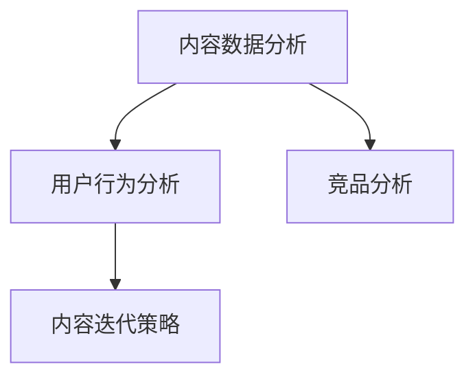

**核心算法原理讲解**

数据分析与内容迭代的算法原理可以概括为以下几点：

1. **内容数据分析**：通过数据分析算法，评估内容的表现。
2. **用户行为分析**：通过用户行为分析算法，了解用户需求和行为。
3. **竞品分析**：通过竞品分析算法，了解竞品的优势和不足。
4. **内容迭代策略**：通过数据驱动，制定内容迭代策略。

**数学模型和公式**

$$
\text{内容迭代效果} = f(\text{内容数据分析结果}, \text{用户行为分析结果}, \text{竞品分析结果}, \text{内容迭代策略效果})
$$

**举例说明**

假设某AI创业公司通过数据分析，发现用户对技术文章的阅读时长较短，竞品技术文章的阅读时长较长，于是决定优化技术文章的结构和内容，增加相关案例和图表，提升用户阅读体验。通过迭代后，用户阅读时长显著提升，内容迭代效果明显。

### 第四部分：内容分发

#### 第8章：内容分发策略

**8.1 内容分发渠道**

内容分发渠道是内容运营的重要环节，选择合适的分发渠道可以提升内容的曝光度和传播效果。以下是一些常见的内容分发渠道：

1. **社交媒体**：如微信公众号、微博、抖音等。
2. **搜索引擎**：如百度、谷歌等。
3. **行业平台**：如知乎、简书等。
4. **社区论坛**：如Reddit、Quora等。
5. **邮件营销**：通过邮件向用户发送内容。

**核心概念与联系**

```mermaid
graph TB
    A[社交媒体] --> B[搜索引擎]
    A --> C[行业平台]
    A --> D[社区论坛]
    A --> E[邮件营销]
```

**核心算法原理讲解**

内容分发渠道的算法原理可以概括为以下几点：

1. **用户画像分析**：通过用户画像，确定目标用户所在的渠道。
2. **渠道效果评估**：通过数据分析，评估不同渠道的传播效果。
3. **内容匹配度分析**：根据内容类型和特点，选择适合的渠道。
4. **渠道优化**：通过用户反馈和数据监控，不断优化渠道策略。

**数学模型和公式**

$$
\text{内容分发效果} = f(\text{用户画像匹配度}, \text{渠道效果评估度}, \text{内容匹配度度}, \text{渠道优化效果})
$$

**举例说明**

假设某AI创业公司目标用户是程序员，根据用户画像分析，确定目标用户主要活跃在GitHub、Stack Overflow和微信公众号等渠道。通过数据分析，发现GitHub和微信公众号的传播效果较好，于是决定加大在这两个渠道的内容分发力度。

**8.2 分发时机与频率**

内容分发时机与频率是影响内容传播效果的重要因素。以下是一些分发时机与频率的建议：

1. **用户活跃时间**：根据用户活跃时间，选择合适的分发时机。
2. **节假日**：在节假日和特殊时间点，增加内容分发频率。
3. **行业热点**：在行业热点事件发生时，及时发布相关内容。
4. **长期规划**：制定长期内容分发计划，保持内容输出的连续性和稳定性。

**核心概念与联系**

```mermaid
graph TB
    A[用户活跃时间] --> B[节假日]
    A --> C[行业热点]
    A --> D[长期规划]
```

**核心算法原理讲解**

分发时机与频率的算法原理可以概括为以下几点：

1. **用户活跃时间分析**：通过用户行为数据分析，确定用户活跃时间。
2. **节假日分析**：通过节假日数据分析，确定节假日和特殊时间点的分发策略。
3. **行业热点分析**：通过行业热点事件分析，确定热点事件的相关内容发布策略。
4. **长期规划**：通过内容规划，确保内容分发的连续性和稳定性。

**数学模型和公式**

$$
\text{内容分发效果} = f(\text{用户活跃时间匹配度}, \text{节假日效果度}, \text{行业热点效果度}, \text{长期规划效果度})
$$

**举例说明**

假设某AI创业公司通过数据分析，发现用户在晚上8点到10点之间活跃度较高，于是决定在这个时间段发布内容。同时，在节假日和行业热点事件发生时，增加内容分发频率，确保内容能够及时传播。

**8.3 社交媒体内容分发技巧**

社交媒体内容分发技巧是提升内容传播效果的关键，以下是一些社交媒体内容分发技巧：

1. **标题优化**：通过数据分析和用户反馈，优化标题，提高点击率。
2. **图片和视频**：使用高质量的图片和视频，吸引用户关注。
3. **互动引导**：通过互动引导，促进用户参与和分享。
4. **标签使用**：合理使用标签，提高内容在社交媒体上的曝光度。
5. **用户互动**：积极回复用户评论和私信，提升用户满意度。

**核心概念与联系**

```mermaid
graph TB
    A[标题优化] --> B[图片和视频]
    A --> C[互动引导]
    A --> D[标签使用]
    A --> E[用户互动]
```

**核心算法原理讲解**

社交媒体内容分发技巧的算法原理可以概括为以下几点：

1. **标题优化**：通过数据分析，选择有吸引力的标题。
2. **图片和视频**：通过图像处理和视频制作技术，提升内容质量。
3. **互动引导**：通过用户行为分析，设计互动引导策略。
4. **标签使用**：通过标签分析，选择合适的标签。
5. **用户互动**：通过用户反馈和数据分析，提升用户互动体验。

**数学模型和公式**

$$
\text{社交媒体内容分发效果} = f(\text{标题优化效果}, \text{图片和视频效果}, \text{互动引导效果}, \text{标签使用效果}, \text{用户互动效果})
$$

**举例说明**

假设某AI创业公司通过数据分析，发现用户更喜欢标题简短、直接的内容，于是优化了标题风格。同时，使用高质量的图片和视频，提升内容质量。通过互动引导，促进用户参与和分享。通过合理使用标签，提高内容在社交媒体上的曝光度。通过积极回复用户评论和私信，提升用户满意度。这些策略使得公司的内容分发效果显著提升。

### 第9章：内容推广与传播

**9.1 推广策略选择**

内容推广策略是提升内容传播效果的重要手段，选择合适的推广策略可以事半功倍。以下是一些常见的推广策略：

1. **免费推广**：通过社交媒体、博客、论坛等渠道，进行免费推广。
2. **付费推广**：通过广告投放、赞助等方式，进行付费推广。
3. **合作推广**：与相关行业或品牌合作，进行联合推广。
4. **病毒式营销**：通过用户口碑传播，实现病毒式营销。
5. **内容营销**：通过提供有价值的内容，吸引目标用户关注。

**核心概念与联系**

```mermaid
graph TB
    A[免费推广] --> B[付费推广]
    A --> C[合作推广]
    A --> D[病毒式营销]
    A --> E[内容营销]
```

**核心算法原理讲解**

推广策略选择的算法原理可以概括为以下几点：

1. **用户画像分析**：通过用户画像，确定目标用户群体。
2. **推广效果评估**：通过数据分析，评估不同推广策略的效果。
3. **成本效益分析**：通过成本效益分析，选择性价比最高的推广策略。
4. **推广策略优化**：通过用户反馈和数据监控，不断优化推广策略。

**数学模型和公式**

$$
\text{推广策略效果} = f(\text{用户画像匹配度}, \text{推广效果评估度}, \text{成本效益度}, \text{推广策略优化度})
$$

**举例说明**

假设某AI创业公司通过用户画像分析，确定目标用户是程序员，根据推广效果评估和成本效益分析，决定采取免费推广策略，如发布技术博客、参与技术论坛等。通过不断优化推广策略，提升内容传播效果。

**9.2 内容传播渠道**

内容传播渠道是内容推广的重要组成部分，选择合适的传播渠道可以提升内容的覆盖面和影响力。以下是一些常见的内容传播渠道：

1. **社交媒体**：如微信公众号、微博、抖音等。
2. **搜索引擎**：如百度、谷歌等。
3. **行业平台**：如知乎、简书等。
4. **社区论坛**：如Reddit、Quora等。
5. **邮件营销**：通过邮件向用户发送内容。

**核心概念与联系**

```mermaid
graph TB
    A[社交媒体] --> B[搜索引擎]
    A --> C[行业平台]
    A --> D[社区论坛]
    A --> E[邮件营销]
```

**核心算法原理讲解**

内容传播渠道的算法原理可以概括为以下几点：

1. **用户画像分析**：通过用户画像，确定目标用户所在的渠道。
2. **渠道效果评估**：通过数据分析，评估不同渠道的传播效果。
3. **内容匹配度分析**：根据内容类型和特点，选择适合的渠道。
4. **渠道优化**：通过用户反馈和数据监控，不断优化渠道策略。

**数学模型和公式**

$$
\text{内容传播效果} = f(\text{用户画像匹配度}, \text{渠道效果评估度}, \text{内容匹配度度}, \text{渠道优化效果})
$$

**举例说明**

假设某AI创业公司目标用户是程序员，根据用户画像分析，确定目标用户主要活跃在GitHub、Stack Overflow和微信公众号等渠道。通过数据分析，发现GitHub和微信公众号的传播效果较好，于是决定加大在这两个渠道的内容传播力度。

**9.3 精准营销与用户互动**

精准营销和用户互动是提升内容传播效果和用户满意度的重要手段。以下是一些精准营销和用户互动的方法：

1. **用户画像**：通过用户画像，了解用户需求和喜好。
2. **精准推送**：根据用户画像，推送个性化的内容和广告。
3. **用户互动**：通过评论、私信、问答等方式，与用户互动。
4. **社群运营**：建立社群，促进用户之间的互动和交流。
5. **用户反馈**：积极收集用户反馈，改进内容和服务。

**核心概念与联系**

```mermaid
graph TB
    A[用户画像] --> B[精准推送]
    A --> C[用户互动]
    A --> D[社群运营]
    A --> E[用户反馈]
```

**核心算法原理讲解**

精准营销和用户互动的算法原理可以概括为以下几点：

1. **用户画像分析**：通过用户行为和数据分析，构建用户画像。
2. **精准推送**：通过用户画像，选择合适的推送内容和广告。
3. **用户互动**：通过用户行为分析，设计互动环节和活动。
4. **社群运营**：通过数据分析，优化社群运营策略。
5. **用户反馈**：通过用户反馈分析，改进产品和服务。

**数学模型和公式**

$$
\text{精准营销效果} = f(\text{用户画像准确性}, \text{精准推送效果}, \text{用户互动效果}, \text{用户反馈效果})
$$

$$
\text{用户满意度} = f(\text{精准营销效果}, \text{用户互动效果}, \text{社群运营效果}, \text{用户反馈效果})
$$

**举例说明**

假设某AI创业公司通过用户画像分析，确定目标用户是程序员，根据用户喜好，推送技术文章和教程。通过用户互动，设计在线问答和讨论活动，促进用户参与和交流。通过社群运营，建立技术交流群，提供技术支持和资源分享。通过用户反馈，不断优化产品和服务，提升用户满意度。

### 第10章：内容运营案例分析与实战

**10.1 案例分析**

案例分析是内容运营的重要方法，通过分析成功案例，可以学习到内容运营的实战技巧。以下是一个内容运营案例：

**案例背景**：某AI创业公司致力于推广AI技术在医疗领域的应用，通过内容运营提升品牌知名度和用户粘性。

**案例过程**：

1. **需求分析**：通过用户调研和数据分析，发现用户对AI技术在医疗领域的应用感兴趣，尤其是疾病预测和治疗方案优化。
2. **内容策划**：制定内容策划方案，包括技术文章、案例分析、用户访谈等。
3. **内容创作**：根据策划方案，创作一系列关于AI技术在医疗领域应用的内容。
4. **内容优化**：通过用户反馈和数据分析，不断优化内容质量。
5. **内容分发**：通过社交媒体、行业平台、邮件营销等多种渠道分发内容。
6. **用户互动**：通过评论、私信、问答等方式，与用户互动，提升用户满意度。

**案例效果**：通过内容运营，公司在短时间内提升了品牌知名度，吸引了大量关注医疗AI技术的用户，用户粘性显著提高。

**核心概念与联系**

```mermaid
graph TB
    A[需求分析] --> B[内容策划]
    B --> C[内容创作]
    C --> D[内容优化]
    D --> E[内容分发]
    E --> F[用户互动]
```

**核心算法原理讲解**

案例分析的算法原理可以概括为以下几点：

1. **需求分析**：通过用户画像和行为分析，确定用户需求。
2. **内容策划**：根据需求分析结果，制定内容策划方案。
3. **内容创作**：按照策划方案，进行内容创作。
4. **内容优化**：通过用户反馈和数据分析，优化内容质量。
5. **内容分发**：通过多种渠道，分发内容。
6. **用户互动**：通过用户互动，提升用户满意度。

**数学模型和公式**

$$
\text{内容运营效果} = f(\text{需求分析准确度}, \text{内容策划质量}, \text{内容创作能力}, \text{内容优化效果}, \text{内容分发效率}, \text{用户互动效果})
$$

**举例说明**

假设某AI创业公司通过用户画像和行为分析，发现用户对AI技术在医疗领域的应用感兴趣，然后制定内容策划方案，创作了一系列关于AI技术在医疗领域应用的内容，通过不断优化内容质量和分发策略，成功提升了品牌知名度和用户粘性。

**10.2 实战技巧**

内容运营实战技巧是内容运营成功的关键，以下是一些实用的实战技巧：

1. **内容定位**：明确内容定位，确保内容与用户需求紧密相关。
2. **内容形式**：丰富内容形式，如文章、视频、图片、音频等，提升用户体验。
3. **数据分析**：通过数据分析，了解用户行为和内容效果，及时调整内容策略。
4. **用户互动**：通过评论、私信、问答等方式，与用户互动，提升用户满意度。
5. **跨平台运营**：在多个平台进行内容运营，扩大内容覆盖面。

**核心概念与联系**

```mermaid
graph TB
    A[内容定位] --> B[内容形式]
    A --> C[数据分析]
    A --> D[用户互动]
    A --> E[跨平台运营]
```

**核心算法原理讲解**

内容运营实战技巧的算法原理可以概括为以下几点：

1. **内容定位**：通过用户画像和行为分析，确定内容定位。
2. **内容形式**：根据用户需求和喜好，选择合适的

