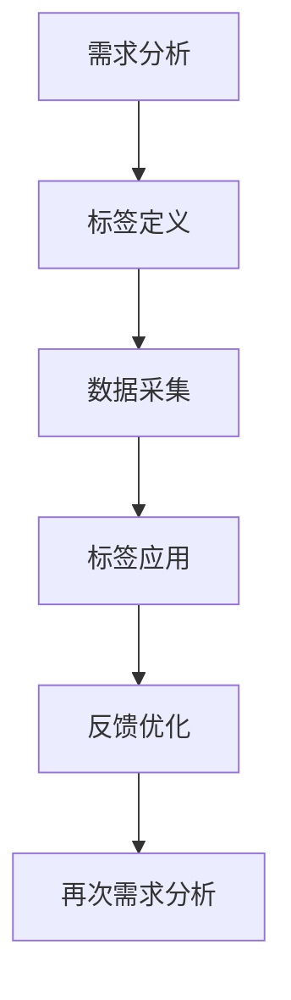
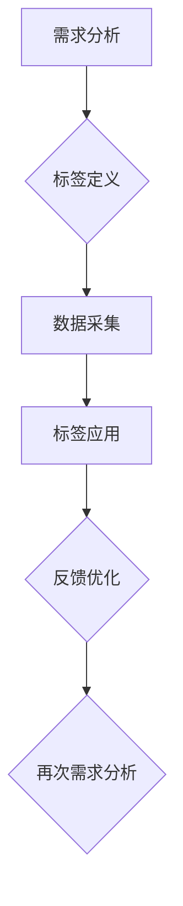

                 

## 第1章：用户画像与标签体系概述

### 1.1 用户画像的概念与重要性

用户画像（User Profile）是指通过收集和分析用户的个人信息、行为数据和社交数据，构建出一个反映用户特征和需求的模型。用户画像可以帮助企业更好地了解其用户群体，从而实现精准营销、优化用户体验和提升用户价值。

用户画像的重要性体现在以下几个方面：

1. **精准营销**：通过用户画像，企业可以了解用户的喜好、需求和购买习惯，从而制定更精准的营销策略，提高营销效果。
2. **用户体验优化**：根据用户画像，企业可以针对不同用户群体提供个性化的服务和内容，提升用户体验。
3. **产品迭代**：用户画像提供了用户需求和行为数据的反馈，有助于企业进行产品迭代和优化。

#### 1.1.1 用户画像的定义

用户画像是指通过数据收集和分析，对用户在互联网上的行为、需求和特征进行抽象和刻画，形成一个关于用户的整体认知。用户画像通常包含以下几个方面：

- **基础信息**：如年龄、性别、地理位置等。
- **行为特征**：如浏览时长、购买次数、评论数量等。
- **兴趣特征**：如偏好品牌、偏好内容类型等。
- **价值特征**：如消费能力、活跃度等。

#### 1.1.2 用户画像的重要性

- **提高用户满意度**：通过用户画像，企业可以更好地满足用户需求，提升用户体验。
- **精准营销**：用户画像帮助企业识别高价值用户，实现更精准的营销。
- **优化产品服务**：用户画像提供了用户需求的反馈，帮助企业进行产品优化和服务升级。

### 1.2 标签体系的构建原则与方法

标签体系（Tagging System）是指为企业内部或外部对象（如用户、产品、内容等）赋予标识，用于分类、识别和检索的一套机制。标签体系的构建原则包括：

- **可扩展性**：标签体系应能适应公司业务发展和用户需求变化。
- **灵活性**：标签应用应具有灵活的调整和优化能力。
- **一致性**：标签定义和应用应保持一致性，避免数据冲突。

#### 1.2.1 标签体系的构建原则

1. **业务导向**：标签体系的设计应以业务需求为导向，确保标签与业务目标的一致性。
2. **用户友好**：标签应易于用户理解和操作，提高用户参与度。
3. **可扩展性**：标签体系应具备扩展性，能够根据业务发展需求进行动态调整。
4. **互操作性**：标签体系应与其他系统和数据源具有良好的互操作性，实现数据共享和协同。

#### 1.2.2 标签体系的构建方法

1. **需求分析**：了解业务需求和用户需求，明确标签体系的用途和目标。
2. **标签定义**：根据需求分析，定义标签的类别、属性和关系。
3. **数据采集**：通过数据采集工具，收集与标签相关的数据。
4. **标签应用**：将标签应用于实际业务场景，如用户管理、产品分类、内容推荐等。
5. **反馈优化**：根据业务反馈和用户反馈，不断优化和调整标签体系。

### 1.3 用户画像与标签体系的应用场景

用户画像与标签体系在众多业务场景中都有广泛的应用，以下是一些典型的应用场景：

#### 1.3.1 营销策略制定

通过用户画像，企业可以了解用户的兴趣、需求和购买行为，从而制定更有针对性的营销策略。例如，针对高价值用户群体，企业可以提供更优质的服务和产品，提高用户满意度和忠诚度。

#### 1.3.2 个性化推荐

基于用户画像和标签体系，企业可以为用户提供个性化的推荐内容。例如，电商平台可以根据用户的浏览和购买历史，推荐相关的商品。

#### 1.3.3 客户服务优化

通过用户画像，企业可以更好地了解客户需求和痛点，从而优化客户服务流程。例如，客服人员可以根据用户画像，提供更个性化的解答和解决方案。

#### 1.3.4 产品迭代

用户画像提供了用户需求的反馈，有助于企业进行产品迭代和优化。例如，开发者可以根据用户画像，改进产品的功能设计，提高用户体验。

### Mermaid 流程图

以下是一个简化的用户画像与标签体系的构建流程：



### 结论

用户画像与标签体系是企业进行精细化运营和智能化管理的重要工具。通过构建和应用用户画像与标签体系，企业可以更好地了解用户需求，优化产品和服务，提高用户满意度，实现业务增长。

### 参考文献

1. **陈国良**. 用户画像：大数据时代企业核心竞争力的秘密. 北京：电子工业出版社，2016.
2. **杨文轩**. 数据驱动的精细化运营：用户画像与场景营销实战. 上海：上海财经出版社，2017.
3. **王秀娟**. 标签化营销：如何用标签赋能企业营销. 北京：中国经济出版社，2018.

### 1.1 用户画像的概念与重要性

用户画像（User Profile）是一种通过收集和分析用户数据，对用户进行全面描述和刻画的方法。它不仅包括用户的个人信息，如年龄、性别、职业等，还涵盖了用户的行为数据，如浏览历史、购买记录、兴趣爱好等。用户画像的构建旨在为企业提供一种深入了解用户的方式，从而更好地满足用户需求，提升用户体验，实现精准营销。

#### 1.1.1 用户画像的定义

用户画像是指通过多种数据源，如社交媒体、电商平台、问卷调查等，收集用户的基本信息、行为数据和兴趣数据，然后通过数据清洗、特征提取、数据挖掘等技术手段，将这些数据进行整合和分析，形成一个关于用户的全面、动态、准确的描述。

用户画像通常包含以下几个关键组成部分：

1. **基础信息**：包括用户的年龄、性别、地理位置、职业等基本信息。
2. **行为数据**：包括用户的浏览行为、搜索历史、购买记录、互动行为等。
3. **兴趣数据**：包括用户的兴趣爱好、偏好内容、关注话题等。
4. **价值数据**：包括用户的消费能力、活跃度、忠诚度等。

#### 1.1.2 用户画像的重要性

用户画像在企业和营销中扮演着至关重要的角色，主要体现在以下几个方面：

1. **精准营销**：通过用户画像，企业可以了解用户的需求和偏好，从而制定更精准的营销策略，提高营销效果。

2. **用户体验优化**：基于用户画像，企业可以为用户提供个性化的服务和内容，提升用户体验。

3. **产品迭代**：用户画像提供了用户反馈和需求的信息，有助于企业进行产品迭代和优化，开发出更符合用户需求的产品。

4. **风险管理**：在金融、保险等行业，用户画像可以帮助企业评估用户的风险程度，从而制定更有效的风险管理策略。

### 1.2 标签体系的构建原则与方法

标签体系（Tagging System）是一种用于分类和标记数据的系统，它通过为数据添加标签，帮助用户快速检索和筛选信息。在用户画像的应用中，标签体系起着关键作用，它能够将用户的不同特征和行为进行分类和标记，便于后续的数据分析和应用。

#### 1.2.1 标签体系的构建原则

构建一个有效的标签体系需要遵循以下原则：

1. **业务导向**：标签体系的设计应该紧密围绕企业的业务需求，确保标签与业务目标的一致性。

2. **灵活性**：标签体系应具备良好的灵活性，能够根据业务的发展变化进行动态调整。

3. **一致性**：标签的定义和应用应保持一致性，避免出现数据冲突或不一致的情况。

4. **简洁性**：标签体系应尽量简洁，避免过多的冗余标签，以便于用户理解和操作。

5. **可扩展性**：标签体系应具备良好的扩展性，能够支持新标签的加入和现有标签的修改。

#### 1.2.2 标签体系的构建方法

构建一个标签体系通常包括以下步骤：

1. **需求分析**：了解企业的业务需求和用户需求，明确标签体系的用途和目标。

2. **标签定义**：根据需求分析，定义标签的种类、属性和关系。标签的种类通常包括基础标签、行为标签、兴趣标签和价值标签等。

3. **数据采集**：通过多种数据采集方式，如用户行为数据、问卷调查等，收集与标签相关的数据。

4. **标签应用**：将标签应用于实际业务场景，如用户管理、产品分类、内容推荐等。

5. **反馈优化**：根据业务反馈和用户反馈，不断优化和调整标签体系，确保其适应性和效果。

### 1.3 用户画像与标签体系的应用场景

用户画像与标签体系在企业运营中有着广泛的应用场景，以下是一些典型的应用：

#### 1.3.1 营销策略制定

通过用户画像，企业可以了解用户的兴趣、需求和购买行为，从而制定更精准的营销策略。例如，电商平台可以根据用户的浏览和购买记录，向用户推荐相关商品，提高转化率。

#### 1.3.2 个性化推荐

基于用户画像和标签体系，企业可以为用户提供个性化的推荐内容。例如，视频平台可以根据用户的观看历史和兴趣标签，推荐相关视频，提升用户粘性。

#### 1.3.3 客户服务优化

通过用户画像，企业可以更好地了解客户需求和痛点，从而优化客户服务流程。例如，客服人员可以根据用户的画像信息，提供更个性化的解答和解决方案，提高客户满意度。

#### 1.3.4 产品迭代

用户画像提供了用户反馈和需求的信息，有助于企业进行产品迭代和优化，开发出更符合用户需求的产品。

### Mermaid 流程图

以下是一个简化的用户画像与标签体系的构建和应用流程：



### 结论

用户画像与标签体系是现代企业进行智能化运营的重要工具。通过构建和应用用户画像与标签体系，企业可以更深入地了解用户，实现精准营销、个性化推荐和产品优化，从而提升用户体验和竞争力。在实际应用中，企业需要不断优化和完善用户画像与标签体系，以适应不断变化的市场需求和企业战略。

### 参考文献

1. **陈国良**. 用户画像：大数据时代企业核心竞争力的秘密. 北京：电子工业出版社，2016.
2. **杨文轩**. 数据驱动的精细化运营：用户画像与场景营销实战. 上海：上海财经出版社，2017.
3. **王秀娟**. 标签化营销：如何用标签赋能企业营销. 北京：中国经济出版社，2018.

### 1.1 用户画像的概念与重要性

用户画像（User Profile）是一种数据驱动的分析方法，通过收集和分析用户在互联网上的行为数据，对用户进行全方位的描述和分类。这种描述不仅包括用户的个人信息，如年龄、性别、职业等，还涵盖了用户在网站、应用等数字平台上的行为和偏好。用户画像的构建旨在帮助企业和营销人员更深入地了解用户，从而制定更精准的营销策略、提升用户体验和优化产品服务。

#### 1.1.1 用户画像的定义

用户画像是一种虚拟的用户模型，通过对用户的基础信息、行为数据和兴趣数据进行整合分析，形成对用户的全面、动态和准确的描述。用户画像通常包含以下几个关键组成部分：

- **基础信息**：包括用户的年龄、性别、职业、地理位置等基本信息。
- **行为数据**：包括用户在网站、应用等数字平台上的浏览历史、购买记录、搜索行为等。
- **兴趣数据**：包括用户的兴趣爱好、偏好内容、关注话题等。
- **社交数据**：包括用户的社交网络活动、互动行为等。
- **价值数据**：包括用户的消费能力、活跃度、忠诚度等。

#### 1.1.2 用户画像的重要性

用户画像在企业运营和营销中具有极其重要的价值，主要体现在以下几个方面：

1. **精准营销**：通过用户画像，企业可以更精准地了解用户的需求和偏好，从而制定更具针对性的营销策略，提高营销效果。

2. **用户体验优化**：基于用户画像，企业可以为用户提供个性化的服务和内容推荐，提升用户体验和满意度。

3. **产品迭代**：用户画像提供了用户反馈和需求的信息，有助于企业进行产品迭代和优化，开发出更符合用户需求的产品。

4. **客户关系管理**：通过用户画像，企业可以更好地了解客户的消费行为和偏好，从而优化客户关系管理策略，提高客户忠诚度。

5. **风险管理**：在金融、保险等行业，用户画像可以帮助企业评估用户的风险程度，从而制定更有效的风险管理策略。

### 1.2 标签体系的构建原则与方法

标签体系（Tagging System）是一种用于对用户、产品、内容等进行分类和标记的系统。在用户画像的应用中，标签体系起着至关重要的作用，它能够帮助企业和营销人员快速识别和分类用户，实现数据的高效管理和利用。

#### 1.2.1 标签体系的构建原则

构建一个有效的标签体系需要遵循以下几个原则：

1. **业务导向**：标签体系的设计应该紧密围绕企业的业务需求和目标，确保标签的应用能够支持业务的发展。

2. **灵活性**：标签体系应具备良好的灵活性，能够根据业务的变化和用户需求的变化进行动态调整。

3. **一致性**：标签的定义和应用应保持一致性，避免出现数据冲突或不一致的情况。

4. **简洁性**：标签体系应尽量简洁，避免过多的冗余标签，以便于用户理解和操作。

5. **可扩展性**：标签体系应具备良好的扩展性，能够支持新标签的加入和现有标签的修改。

#### 1.2.2 标签体系的构建方法

构建一个标签体系通常包括以下几个步骤：

1. **需求分析**：了解企业的业务需求和用户需求，明确标签体系的用途和目标。

2. **标签定义**：根据需求分析，定义标签的种类、属性和关系。标签的种类通常包括基础标签、行为标签、兴趣标签和价值标签等。

3. **数据采集**：通过多种数据采集方式，如用户行为数据、问卷调查等，收集与标签相关的数据。

4. **标签应用**：将标签应用于实际业务场景，如用户管理、产品分类、内容推荐等。

5. **反馈优化**：根据业务反馈和用户反馈，不断优化和调整标签体系，确保其适应性和效果。

### 1.3 用户画像与标签体系的应用场景

用户画像与标签体系在企业运营和营销中有着广泛的应用场景，以下是一些典型的应用：

#### 1.3.1 营销策略制定

通过用户画像，企业可以了解用户的兴趣、需求和购买行为，从而制定更精准的营销策略。例如，电商平台可以根据用户的浏览和购买记录，向用户推荐相关商品，提高转化率。

#### 1.3.2 个性化推荐

基于用户画像和标签体系，企业可以为用户提供个性化的推荐内容。例如，视频平台可以根据用户的观看历史和兴趣标签，推荐相关视频，提升用户粘性。

#### 1.3.3 客户服务优化

通过用户画像，企业可以更好地了解客户需求和痛点，从而优化客户服务流程。例如，客服人员可以根据用户的画像信息，提供更个性化的解答和解决方案，提高客户满意度。

#### 1.3.4 产品迭代

用户画像提供了用户反馈和需求的信息，有助于企业进行产品迭代和优化，开发出更符合用户需求的产品。

### Mermaid 流程图

以下是一个简化的用户画像与标签体系的构建和应用流程：


### 结论

用户画像与标签体系是现代企业进行智能化运营的重要工具。通过构建和应用用户画像与标签体系，企业可以更深入地了解用户，实现精准营销、个性化推荐和产品优化，从而提升用户体验和竞争力。在实际应用中，企业需要不断优化和完善用户画像与标签体系，以适应不断变化的市场需求和企业战略。

### 参考文献

1. **陈国良**. 用户画像：大数据时代企业核心竞争力的秘密. 北京：电子工业出版社，2016.
2. **杨文轩**. 数据驱动的精细化运营：用户画像与场景营销实战. 上海：上海财经出版社，2017.
3. **王秀娟**. 标签化营销：如何用标签赋能企业营销. 北京：中国经济出版社，2018.

### 1.1 用户画像的概念与重要性

用户画像（User Profile）是一种通过数据分析和建模，对用户进行全方位描述和分类的方法。它通过整合用户的基础信息、行为数据和兴趣数据，形成一个关于用户的综合模型。用户画像的应用范围广泛，涵盖了市场营销、产品优化、用户体验提升等多个领域。

#### 1.1.1 用户画像的定义

用户画像是指通过数据分析，对用户在互联网上的行为、需求和特征进行抽象和刻画，形成一个反映用户整体情况的模型。用户画像通常包含以下几个关键组成部分：

- **基础信息**：用户的年龄、性别、职业、地理位置等基本信息。
- **行为数据**：用户的浏览历史、购买记录、搜索行为等。
- **兴趣数据**：用户在互联网上的兴趣点、关注话题等。
- **价值数据**：用户的消费能力、活跃度、忠诚度等。

#### 1.1.2 用户画像的重要性

用户画像在企业和营销中的重要性主要体现在以下几个方面：

1. **精准营销**：通过用户画像，企业可以更深入地了解用户的需求和偏好，从而制定更具针对性的营销策略，提高营销效果。

2. **用户体验优化**：基于用户画像，企业可以为用户提供个性化的服务和内容推荐，提升用户体验和满意度。

3. **产品迭代**：用户画像提供了用户反馈和需求的信息，有助于企业进行产品迭代和优化，开发出更符合用户需求的产品。

4. **风险管理**：在金融、保险等行业，用户画像可以帮助企业评估用户的风险程度，从而制定更有效的风险管理策略。

### 1.2 标签体系的构建原则与方法

标签体系（Tagging System）是一种用于对用户、产品、内容等进行分类和标记的系统。在用户画像的应用中，标签体系起着关键作用，它能够帮助企业和营销人员快速识别和分类用户，实现数据的高效管理和利用。

#### 1.2.1 标签体系的构建原则

构建一个有效的标签体系需要遵循以下几个原则：

1. **业务导向**：标签体系的设计应紧密围绕企业的业务需求和目标，确保标签的应用能够支持业务的发展。

2. **灵活性**：标签体系应具备良好的灵活性，能够根据业务的变化和用户需求的变化进行动态调整。

3. **一致性**：标签的定义和应用应保持一致性，避免出现数据冲突或不一致的情况。

4. **简洁性**：标签体系应尽量简洁，避免过多的冗余标签，以便于用户理解和操作。

5. **可扩展性**：标签体系应具备良好的扩展性，能够支持新标签的加入和现有标签的修改。

#### 1.2.2 标签体系的构建方法

构建一个标签体系通常包括以下几个步骤：

1. **需求分析**：了解企业的业务需求和用户需求，明确标签体系的用途和目标。

2. **标签定义**：根据需求分析，定义标签的种类、属性和关系。标签的种类通常包括基础标签、行为标签、兴趣标签和价值标签等。

3. **数据采集**：通过多种数据采集方式，如用户行为数据、问卷调查等，收集与标签相关的数据。

4. **标签应用**：将标签应用于实际业务场景，如用户管理、产品分类、内容推荐等。

5. **反馈优化**：根据业务反馈和用户反馈，不断优化和调整标签体系，确保其适应性和效果。

### 1.3 用户画像与标签体系的应用场景

用户画像与标签体系在企业运营和营销中有着广泛的应用场景，以下是一些典型的应用：

#### 1.3.1 营销策略制定

通过用户画像，企业可以了解用户的兴趣、需求和购买行为，从而制定更精准的营销策略。例如，电商平台可以根据用户的浏览和购买记录，向用户推荐相关商品，提高转化率。

#### 1.3.2 个性化推荐

基于用户画像和标签体系，企业可以为用户提供个性化的推荐内容。例如，视频平台可以根据用户的观看历史和兴趣标签，推荐相关视频，提升用户粘性。

#### 1.3.3 客户服务优化

通过用户画像，企业可以更好地了解客户需求和痛点，从而优化客户服务流程。例如，客服人员可以根据用户的画像信息，提供更个性化的解答和解决方案，提高客户满意度。

#### 1.3.4 产品迭代

用户画像提供了用户反馈和需求的信息，有助于企业进行产品迭代和优化，开发出更符合用户需求的产品。

### Mermaid 流程图

以下是一个简化的用户画像与标签体系的构建和应用流程：


### 结论

用户画像与标签体系是现代企业进行智能化运营的重要工具。通过构建和应用用户画像与标签体系，企业可以更深入地了解用户，实现精准营销、个性化推荐和产品优化，从而提升用户体验和竞争力。在实际应用中，企业需要不断优化和完善用户画像与标签体系，以适应不断变化的市场需求和企业战略。

### 参考文献

1. **陈国良**. 用户画像：大数据时代企业核心竞争力的秘密. 北京：电子工业出版社，2016.
2. **杨文轩**. 数据驱动的精细化运营：用户画像与场景营销实战. 上海：上海财经出版社，2017.
3. **王秀娟**. 标签化营销：如何用标签赋能企业营销. 北京：中国经济出版社，2018.

### 1.1 用户画像的概念与重要性

用户画像（User Profile）是一种通过数据分析和建模，对用户进行全方位描述和分类的方法。它通过整合用户的基础信息、行为数据和兴趣数据，形成一个关于用户的综合模型。用户画像的应用范围广泛，涵盖了市场营销、产品优化、用户体验提升等多个领域。

#### 1.1.1 用户画像的定义

用户画像是指通过数据分析，对用户在互联网上的行为、需求和特征进行抽象和刻画，形成一个反映用户整体情况的模型。用户画像通常包含以下几个关键组成部分：

- **基础信息**：用户的年龄、性别、职业、地理位置等基本信息。
- **行为数据**：用户的浏览历史、购买记录、搜索行为等。
- **兴趣数据**：用户在互联网上的兴趣点、关注话题等。
- **价值数据**：用户的消费能力、活跃度、忠诚度等。

#### 1.1.2 用户画像的重要性

用户画像在企业和营销中的重要性主要体现在以下几个方面：

1. **精准营销**：通过用户画像，企业可以更深入地了解用户的需求和偏好，从而制定更具针对性的营销策略，提高营销效果。

2. **用户体验优化**：基于用户画像，企业可以为用户提供个性化的服务和内容推荐，提升用户体验和满意度。

3. **产品迭代**：用户画像提供了用户反馈和需求的信息，有助于企业进行产品迭代和优化，开发出更符合用户需求的产品。

4. **风险管理**：在金融、保险等行业，用户画像可以帮助企业评估用户的风险程度，从而制定更有效的风险管理策略。

### 1.2 标签体系的构建原则与方法

标签体系（Tagging System）是一种用于对用户、产品、内容等进行分类和标记的系统。在用户画像的应用中，标签体系起着关键作用，它能够帮助企业和营销人员快速识别和分类用户，实现数据的高效管理和利用。

#### 1.2.1 标签体系的构建原则

构建一个有效的标签体系需要遵循以下几个原则：

1. **业务导向**：标签体系的设计应紧密围绕企业的业务需求和目标，确保标签的应用能够支持业务的发展。

2. **灵活性**：标签体系应具备良好的灵活性，能够根据业务的变化和用户需求的变化进行动态调整。

3. **一致性**：标签的定义和应用应保持一致性，避免出现数据冲突或不一致的情况。

4. **简洁性**：标签体系应尽量简洁，避免过多的冗余标签，以便于用户理解和操作。

5. **可扩展性**：标签体系应具备良好的扩展性，能够支持新标签的加入和现有标签的修改。

#### 1.2.2 标签体系的构建方法

构建一个标签体系通常包括以下几个步骤：

1. **需求分析**：了解企业的业务需求和用户需求，明确标签体系的用途和目标。

2. **标签定义**：根据需求分析，定义标签的种类、属性和关系。标签的种类通常包括基础标签、行为标签、兴趣标签和价值标签等。

3. **数据采集**：通过多种数据采集方式，如用户行为数据、问卷调查等，收集与标签相关的数据。

4. **标签应用**：将标签应用于实际业务场景，如用户管理、产品分类、内容推荐等。

5. **反馈优化**：根据业务反馈和用户反馈，不断优化和调整标签体系，确保其适应性和效果。

### 1.3 用户画像与标签体系的应用场景

用户画像与标签体系在企业运营和营销中有着广泛的应用场景，以下是一些典型的应用：

#### 1.3.1 营销策略制定

通过用户画像，企业可以了解用户的兴趣、需求和购买行为，从而制定更精准的营销策略。例如，电商平台可以根据用户的浏览和购买记录，向用户推荐相关商品，提高转化率。

#### 1.3.2 个性化推荐

基于用户画像和标签体系，企业可以为用户提供个性化的推荐内容。例如，视频平台可以根据用户的观看历史和兴趣标签，推荐相关视频，提升用户粘性。

#### 1.3.3 客户服务优化

通过用户画像，企业可以更好地了解客户需求和痛点，从而优化客户服务流程。例如，客服人员可以根据用户的画像信息，提供更个性化的解答和解决方案，提高客户满意度。

#### 1.3.4 产品迭代

用户画像提供了用户反馈和需求的信息，有助于企业进行产品迭代和优化，开发出更符合用户需求的产品。

### Mermaid 流程图

以下是一个简化的用户画像与标签体系的构建和应用流程：


### 结论

用户画像与标签体系是现代企业进行智能化运营的重要工具。通过构建和应用用户画像与标签体系，企业可以更深入地了解用户，实现精准营销、个性化推荐和产品优化，从而提升用户体验和竞争力。在实际应用中，企业需要不断优化和完善用户画像与标签体系，以适应不断变化的市场需求和企业战略。

### 参考文献

1. **陈国良**. 用户画像：大数据时代企业核心竞争力的秘密. 北京：电子工业出版社，2016.
2. **杨文轩**. 数据驱动的精细化运营：用户画像与场景营销实战. 上海：上海财经出版社，2017.
3. **王秀娟**. 标签化营销：如何用标签赋能企业营销. 北京：中国经济出版社，2018.

### 1.1 用户画像的概念与重要性

用户画像（User Profile）是一种通过数据分析和建模，对用户进行全方位描述和分类的方法。它通过整合用户的基础信息、行为数据和兴趣数据，形成一个关于用户的综合模型。用户画像的应用范围广泛，涵盖了市场营销、产品优化、用户体验提升等多个领域。

#### 1.1.1 用户画像的定义

用户画像是指通过数据分析，对用户在互联网上的行为、需求和特征进行抽象和刻画，形成一个反映用户整体情况的模型。用户画像通常包含以下几个关键组成部分：

- **基础信息**：用户的年龄、性别、职业、地理位置等基本信息。
- **行为数据**：用户的浏览历史、购买记录、搜索行为等。
- **兴趣数据**：用户在互联网上的兴趣点、关注话题等。
- **价值数据**：用户的消费能力、活跃度、忠诚度等。

#### 1.1.2 用户画像的重要性

用户画像在企业和营销中的重要性主要体现在以下几个方面：

1. **精准营销**：通过用户画像，企业可以更深入地了解用户的需求和偏好，从而制定更具针对性的营销策略，提高营销效果。

2. **用户体验优化**：基于用户画像，企业可以为用户提供个性化的服务和内容推荐，提升用户体验和满意度。

3. **产品迭代**：用户画像提供了用户反馈和需求的信息，有助于企业进行产品迭代和优化，开发出更符合用户需求的产品。

4. **风险管理**：在金融、保险等行业，用户画像可以帮助企业评估用户的风险程度，从而制定更有效的风险管理策略。

### 1.2 标签体系的构建原则与方法

标签体系（Tagging System）是一种用于对用户、产品、内容等进行分类和标记的系统。在用户画像的应用中，标签体系起着关键作用，它能够帮助企业和营销人员快速识别和分类用户，实现数据的高效管理和利用。

#### 1.2.1 标签体系的构建原则

构建一个有效的标签体系需要遵循以下几个原则：

1. **业务导向**：标签体系的设计应紧密围绕企业的业务需求和目标，确保标签的应用能够支持业务的发展。

2. **灵活性**：标签体系应具备良好的灵活性，能够根据业务的变化和用户需求的变化进行动态调整。

3. **一致性**：标签的定义和应用应保持一致性，避免出现数据冲突或不一致的情况。

4. **简洁性**：标签体系应尽量简洁，避免过多的冗余标签，以便于用户理解和操作。

5. **可扩展性**：标签体系应具备良好的扩展性，能够支持新标签的加入和现有标签的修改。

#### 1.2.2 标签体系的构建方法

构建一个标签体系通常包括以下几个步骤：

1. **需求分析**：了解企业的业务需求和用户需求，明确标签体系的用途和目标。

2. **标签定义**：根据需求分析，定义标签的种类、属性和关系。标签的种类通常包括基础标签、行为标签、兴趣标签和价值标签等。

3. **数据采集**：通过多种数据采集方式，如用户行为数据、问卷调查等，收集与标签相关的数据。

4. **标签应用**：将标签应用于实际业务场景，如用户管理、产品分类、内容推荐等。

5. **反馈优化**：根据业务反馈和用户反馈，不断优化和调整标签体系，确保其适应性和效果。

### 1.3 用户画像与标签体系的应用场景

用户画像与标签体系在企业运营和营销中有着广泛的应用场景，以下是一些典型的应用：

#### 1.3.1 营销策略制定

通过用户画像，企业可以了解用户的兴趣、需求和购买行为，从而制定更精准的营销策略。例如，电商平台可以根据用户的浏览和购买记录，向用户推荐相关商品，提高转化率。

#### 1.3.2 个性化推荐

基于用户画像和标签体系，企业可以为用户提供个性化的推荐内容。例如，视频平台可以根据用户的观看历史和兴趣标签，推荐相关视频，提升用户粘性。

#### 1.3.3 客户服务优化

通过用户画像，企业可以更好地了解客户需求和痛点，从而优化客户服务流程。例如，客服人员可以根据用户的画像信息，提供更个性化的解答和解决方案，提高客户满意度。

#### 1.3.4 产品迭代

用户画像提供了用户反馈和需求的信息，有助于企业进行产品迭代和优化，开发出更符合用户需求的产品。

### Mermaid 流程图

以下是一个简化的用户画像与标签体系的构建和应用流程：


### 结论

用户画像与标签体系是现代企业进行智能化运营的重要工具。通过构建和应用用户画像与标签体系，企业可以更深入地了解用户，实现精准营销、个性化推荐和产品优化，从而提升用户体验和竞争力。在实际应用中，企业需要不断优化和完善用户画像与标签体系，以适应不断变化的市场需求和企业战略。

### 参考文献

1. **陈国良**. 用户画像：大数据时代企业核心竞争力的秘密. 北京：电子工业出版社，2016.
2. **杨文轩**. 数据驱动的精细化运营：用户画像与场景营销实战. 上海：上海财经出版社，2017.
3. **王秀娟**. 标签化营销：如何用标签赋能企业营销. 北京：中国经济出版社，2018.

## 第2章：用户特征提取与分析

### 2.1 用户特征的分类与选取

在构建用户画像的过程中，用户特征的提取与分析是关键步骤。用户特征可以分为基础特征、行为特征、兴趣特征和价值特征四大类。每一类特征都有其独特的含义和应用场景。

#### 2.1.1 用户基础特征

用户基础特征包括用户的年龄、性别、职业、地理位置等。这些特征通常可以从用户注册信息或第三方数据服务中获得。基础特征是构建用户画像的基础，它们帮助企业在初期了解用户群体的基本情况。

- **年龄**：反映用户的生理年龄，常用于市场细分和产品定位。
- **性别**：性别特征常用于内容推荐和广告投放的个性化。
- **职业**：职业特征有助于了解用户的经济状况和消费能力。
- **地理位置**：地理位置特征有助于本地化服务和精准营销。

#### 2.1.2 用户行为特征

用户行为特征包括用户的浏览历史、购买行为、互动行为等。这些特征反映了用户在平台上的行为模式和偏好，是用户画像的核心组成部分。

- **浏览历史**：记录用户在平台上的浏览路径，用于分析用户兴趣和偏好。
- **购买行为**：包括用户的购买次数、购买金额、购买频率等，是评估用户价值的重要指标。
- **互动行为**：如评论、点赞、分享等，反映用户的参与度和活跃度。

#### 2.1.3 用户兴趣特征

用户兴趣特征包括用户的兴趣爱好、偏好内容、关注话题等。这些特征有助于了解用户的个性化需求，为个性化推荐和精准营销提供依据。

- **兴趣爱好**：通过用户行为数据或问卷调查获取，如阅读、运动、旅游等。
- **偏好内容**：包括用户喜欢的文章类型、视频类别等，常用于内容推荐。
- **关注话题**：反映用户关注的社会事件、新闻话题等，用于社交平台的推荐和讨论。

#### 2.1.4 用户价值特征

用户价值特征包括用户的消费能力、活跃度、忠诚度等。这些特征用于评估用户的商业价值，为企业制定营销策略和用户运营提供支持。

- **消费能力**：通过购买记录等数据评估，用于精准营销和VIP用户管理。
- **活跃度**：包括用户的登录频率、互动频率等，反映用户的活跃程度。
- **忠诚度**：通过用户的历史行为和反馈评估，用于识别和留住核心用户。

#### 2.1.5 用户特征选取方法

在用户特征的选取过程中，需要考虑以下方法：

- **相关性分析**：通过计算用户特征与业务目标的相关性，选取对业务目标有显著影响的特征。
- **熵值法**：根据特征的信息熵，选取重要特征，信息熵越低，特征越重要。
- **主成分分析**：降低特征维度，选取主要特征，提高模型的可解释性。

### 2.2 用户特征提取方法

用户特征的提取是构建用户画像的关键步骤，以下是一些常用的用户特征提取方法：

#### 2.2.1 数据收集与预处理

- **日志数据收集**：通过网站分析工具（如Google Analytics）收集用户行为日志。
- **API数据采集**：通过第三方数据服务（如社交媒体API）获取用户公开数据。
- **问卷调查**：通过在线问卷收集用户主观数据，如兴趣爱好和偏好内容。

#### 2.2.2 数据预处理

- **数据清洗**：去除无效、重复、错误的数据，确保数据质量。
- **数据整合**：将不同来源的数据整合到一个系统中，形成统一的数据视图。
- **数据转换**：将数据转换为适合分析的形式，如归一化、标准化等。

#### 2.2.3 特征提取技术

- **文本处理**：包括分词、词频统计、主题模型等，用于提取文本数据的特征。
- **行为数据挖掘**：使用聚类、关联规则挖掘等技术，提取用户行为数据中的隐藏模式。
- **机器学习**：通过机器学习算法（如决策树、随机森林等），自动提取特征。

### 2.3 用户特征分析工具与应用

在用户特征分析过程中，选择合适的工具对于提高分析效率和准确性至关重要。以下是一些常用的用户特征分析工具：

#### 2.3.1 分析工具

- **Python库**：如Pandas、NumPy、Scikit-learn等，用于数据清洗、特征提取和模型训练。
- **数据可视化工具**：如Matplotlib、Seaborn、ECharts等，用于展示用户特征和分析结果。
- **大数据处理框架**：如Hadoop、Spark等，用于大规模数据处理和分析。

#### 2.3.2 应用场景

- **用户细分**：通过特征分析，对用户进行分类，为营销策略提供支持。
- **趋势分析**：分析用户特征的变化趋势，预测用户行为和需求变化。
- **关联分析**：挖掘用户特征之间的关联性，发现潜在的业务机会。

### 伪代码示例

以下是一个用户特征提取和分析的伪代码示例：

```python
# 数据收集
def collect_data():
    # 收集日志数据
    log_data = get_log_data()
    
    # 收集API数据
    api_data = get_api_data()
    
    # 收集问卷调查数据
    survey_data = get_survey_data()
    
    return log_data, api_data, survey_data

# 数据预处理
def preprocess_data(data):
    # 数据清洗
    clean_data = clean_data(data)
    
    # 数据整合
    integrated_data = integrate_data(clean_data)
    
    # 数据转换
    transformed_data = transform_data(integrated_data)
    
    return transformed_data

# 特征提取
def extract_features(data):
    # 提取文本特征
    text_features = extract_text_features(data)
    
    # 提取行为特征
    behavioral_features = extract_behavioral_features(data)
    
    # 提取兴趣特征
    interest_features = extract_interest_features(data)
    
    return text_features, behavioral_features, interest_features

# 用户特征分析
def analyze_user_features(features):
    # 相关性分析
    correlations = calculate_correlations(features)
    
    # 趋势分析
    trends = analyze_trends(features)
    
    # 关联分析
    associations = analyze_associations(features)
    
    return correlations, trends, associations

# 主函数
def main():
    # 数据收集
    log_data, api_data, survey_data = collect_data()
    
    # 数据预处理
    preprocessed_data = preprocess_data(log_data, api_data, survey_data)
    
    # 特征提取
    text_features, behavioral_features, interest_features = extract_features(preprocessed_data)
    
    # 用户特征分析
    correlations, trends, associations = analyze_user_features(text_features, behavioral_features, interest_features)
    
    # 输出结果
    print("Correlations:", correlations)
    print("Trends:", trends)
    print("Associations:", associations)

# 运行主函数
main()
```

### 结论

用户特征的提取与分析是构建用户画像的重要步骤。通过分类和选取用户特征，以及使用适当的方法和技术进行特征提取和分析，企业可以更深入地了解用户，从而实现精准营销、个性化推荐和产品优化。在实际应用中，企业需要不断优化特征提取和分析方法，以适应不断变化的市场需求和企业战略。

### 参考文献

1. **Han, J., Kamber, M., & Pei, J. (2011). Data Mining: Concepts and Techniques (3rd ed.). Morgan Kaufmann.**
2. **Zhu, X., & Grinstein, G. (2010). Mining the Social Web: Social Analytics and Web Mining Techniques for Marketing, Customer Relationship, and Market Research. Morgan Kaufmann.**
3. **Rogers, R. (2013). Applied Predictive Modeling. Springer.**

## 第3章：用户行为分析

### 3.1 用户行为数据的收集与处理

用户行为分析的基础是收集和处理用户行为数据。这些数据通常包括用户的浏览历史、点击行为、购买记录、评论和反馈等。收集用户行为数据的方法和步骤如下：

#### 3.1.1 数据收集方法

1. **日志数据采集**：通过网站和应用程序的后台日志，记录用户的访问行为，如访问时间、页面停留时间、点击路径等。
2. **API数据采集**：使用第三方API接口，获取用户在社交媒体、电子商务平台等外部网站的行为数据。
3. **问卷调查**：通过在线或离线方式，收集用户对产品或服务的反馈和偏好。
4. **传感器数据**：通过安装在用户设备上的传感器，收集用户的位置信息、设备使用情况等。

#### 3.1.2 数据处理流程

1. **数据清洗**：去除重复、错误和无效的数据，确保数据质量。数据清洗包括数据去重、缺失值填充、异常值处理等。
2. **数据整合**：将来自不同渠道的数据进行整合，形成一个统一的数据视图。数据整合可以通过数据仓库或数据湖等技术实现。
3. **数据转换**：将数据转换为适合分析和建模的格式，如归一化、标准化等。数据转换有助于提高数据的一致性和可比性。

### 3.2 用户行为分析模型

用户行为分析模型是基于用户行为数据，通过统计学和机器学习等方法，对用户行为进行预测、分类和关联分析。以下是一些常见的用户行为分析模型：

#### 3.2.1 分类模型

分类模型用于将用户行为分类，常见的分类模型包括：

1. **逻辑回归**：用于预测用户是否采取某个行为，如购买、点击等。
2. **决策树**：通过树形结构对用户行为进行分类。
3. **随机森林**：集成多个决策树，提高分类准确性。
4. **支持向量机**：用于分类问题，尤其是高维数据。

#### 3.2.2 预测模型

预测模型用于预测用户的未来行为，常见的预测模型包括：

1. **时间序列模型**：如ARIMA、LSTM等，用于预测用户的行为趋势。
2. **回归模型**：如线性回归、岭回归等，用于预测用户的行为量。
3. **生存分析模型**：如Cox比例风险模型，用于预测用户的生存时间（如用户生命周期）。

#### 3.2.3 关联分析模型

关联分析模型用于发现用户行为之间的关联关系，常见的关联分析模型包括：

1. **Apriori算法**：用于发现频繁项集，常用于购物篮分析。
2. **关联规则学习**：如FP-growth算法，用于发现用户行为之间的关联规则。
3. **序列模式挖掘**：如PrefixSpan算法，用于发现用户行为序列中的模式。

### 3.3 用户行为模式挖掘与应用

用户行为模式挖掘是从大量用户行为数据中提取出具有统计意义的模式，用于预测用户行为和优化产品服务。以下是一些用户行为模式挖掘的应用：

#### 3.3.1 推荐系统

推荐系统通过挖掘用户行为模式，为用户推荐相关产品或内容。例如，电商平台的推荐系统可以通过分析用户的浏览和购买记录，推荐相似的商品。

#### 3.3.2 客户细分

客户细分是将用户分为不同的群体，以便于制定针对性的营销策略。通过用户行为模式挖掘，可以识别出高价值客户、活跃客户和潜在流失客户等，为企业提供精细化的客户管理策略。

#### 3.3.3 用户体验优化

用户体验优化通过分析用户行为模式，识别用户体验中的痛点，从而优化产品设计和功能。例如，通过分析用户在页面上的停留时间和点击路径，优化页面布局和导航。

#### 3.3.4 风险控制

风险控制通过分析用户行为模式，识别异常行为和潜在风险。例如，在金融行业中，通过分析用户的交易行为，识别欺诈行为和信用风险。

### 伪代码示例

以下是一个用户行为分析模型的伪代码示例：

```python
# 数据收集与处理
def collect_and_process_data():
    # 收集日志数据
    log_data = get_log_data()
    
    # 收集API数据
    api_data = get_api_data()
    
    # 数据清洗
    clean_data = clean_data(log_data, api_data)
    
    # 数据整合
    integrated_data = integrate_data(clean_data)
    
    # 数据转换
    transformed_data = transform_data(integrated_data)
    
    return transformed_data

# 用户行为分类模型
def build_classification_model(data):
    # 数据预处理
    preprocessed_data = preprocess_data(data)
    
    # 特征提取
    features = extract_features(preprocessed_data)
    
    # 划分训练集和测试集
    train_data, test_data = split_data(features)
    
    # 训练模型
    model = train_classification_model(train_data)
    
    # 测试模型
    predictions = model.predict(test_data)
    
    return model, predictions

# 用户行为预测模型
def build_prediction_model(data):
    # 数据预处理
    preprocessed_data = preprocess_data(data)
    
    # 特征提取
    features = extract_features(preprocessed_data)
    
    # 划分训练集和测试集
    train_data, test_data = split_data(features)
    
    # 训练模型
    model = train_prediction_model(train_data)
    
    # 测试模型
    predictions = model.predict(test_data)
    
    return model, predictions

# 用户行为模式挖掘
def mine_user_behavior_patterns(data):
    # 数据预处理
    preprocessed_data = preprocess_data(data)
    
    # 特征提取
    features = extract_features(preprocessed_data)
    
    # 模式挖掘
    patterns = mine_patterns(features)
    
    return patterns

# 主函数
def main():
    # 数据收集与处理
    data = collect_and_process_data()
    
    # 用户行为分类模型
    classification_model, classification_predictions = build_classification_model(data)
    
    # 用户行为预测模型
    prediction_model, prediction_predictions = build_prediction_model(data)
    
    # 用户行为模式挖掘
    user_behavior_patterns = mine_user_behavior_patterns(data)
    
    # 输出结果
    print("Classification Model Predictions:", classification_predictions)
    print("Prediction Model Predictions:", prediction_predictions)
    print("User Behavior Patterns:", user_behavior_patterns)

# 运行主函数
main()
```

### 结论

用户行为分析是理解和优化用户体验的关键环节。通过收集、处理和分析用户行为数据，企业可以更好地预测用户行为、制定精准的营销策略、优化产品设计和提高客户满意度。在实际应用中，企业需要不断探索和优化用户行为分析的方法和模型，以适应快速变化的市场环境和用户需求。

### 参考文献

1. **Han, J., Kamber, M., & Pei, J. (2011). Data Mining: Concepts and Techniques (3rd ed.). Morgan Kaufmann.**
2. **Zhu, X., & Grinstein, G. (2010). Mining the Social Web: Social Analytics and Web Mining Techniques for Marketing, Customer Relationship, and Market Research. Morgan Kaufmann.**
3. **Rogers, R. (2013). Applied Predictive Modeling. Springer.**

## 第4章：用户价值评估

### 4.1 用户价值的定义与度量

用户价值（User Value）是指用户为产品或服务所带来的经济利益、情感价值和社会价值的总和。它反映了用户对产品或服务的贡献程度，是企业制定营销策略、用户运营和产品优化的重要依据。

#### 4.1.1 用户价值的定义

用户价值可以定义为以下三个维度的总和：

1. **经济价值**：用户为产品或服务支付的费用，包括直接支付的费用和间接价值，如广告点击收入、会员费等。
2. **情感价值**：用户对产品或服务的情感认同和忠诚度，如用户好评、评论、分享等。
3. **社会价值**：用户在产品或服务中的社交互动和影响力，如用户在社交媒体上的推荐和传播。

#### 4.1.2 用户价值的度量

用户价值的度量方法主要包括以下几种：

1. **生命周期价值（Lifetime Value, LTV）**：预测用户在未来一段时间内为公司带来的总收益。LTV的公式通常为：

   \[
   LTV = \sum_{t=1}^{T} \frac{R_t}{(1 + r)^t}
   \]

   其中，\(R_t\) 表示第 \(t\) 年的用户收益，\(r\) 表示折现率，\(T\) 表示预测的年限。

2. **用户留存率（Retention Rate）**：反映用户在一定时间内的持续使用率。用户留存率越高，说明用户对产品的依赖度越高，价值也越高。

3. **用户活跃度（Active Rate）**：衡量用户在一定时间内的活跃程度，如登录次数、互动行为等。用户活跃度越高，说明用户对产品的参与度越高，价值也越大。

4. **用户满意度（User Satisfaction）**：通过用户调查和反馈，评估用户对产品或服务的满意程度。用户满意度越高，说明产品或服务越能满足用户需求，价值也越高。

### 4.2 用户价值评估模型

用户价值评估模型是基于用户行为数据和经济数据，通过统计学和机器学习等方法，对用户价值进行量化评估。以下是一些常见的用户价值评估模型：

#### 4.2.1 基于LTV的评估模型

LTV（生命周期价值）评估模型是用户价值评估的核心模型。以下是一种基于LTV的用户价值评估方法：

1. **预测用户收益**：通过用户行为数据，如购买历史、互动行为等，预测用户在未来一段时间内的收益。

2. **计算LTV**：使用预测的用户收益和折现率，计算用户的生命周期价值。

3. **分类用户**：根据LTV值，将用户分为高价值用户、中价值用户和低价值用户，为营销策略和用户运营提供依据。

#### 4.2.2 基于行为指标的评估模型

基于行为指标的评估模型通过用户的活跃度、留存率等行为指标，评估用户价值。以下是一种基于行为指标的用户价值评估方法：

1. **计算行为指标**：计算用户的活跃度、留存率等行为指标。

2. **设定阈值**：设定活跃度、留存率的阈值，将用户分为高价值用户、中价值用户和低价值用户。

3. **调整权重**：根据业务需求和用户行为数据，调整行为指标的权重，提高评估的准确性。

#### 4.2.3 基于机器学习的评估模型

基于机器学习的评估模型通过训练数据集，建立用户价值评估模型。以下是一种基于机器学习的用户价值评估方法：

1. **收集数据**：收集用户行为数据和经济数据，如购买历史、浏览记录、支付金额等。

2. **特征工程**：提取用户行为数据和经济数据的特征，

