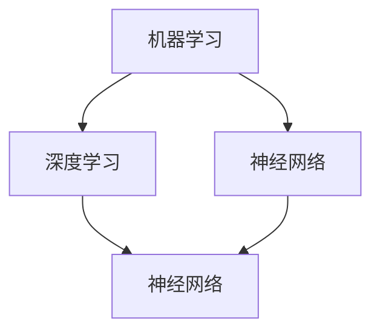
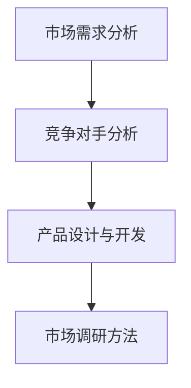
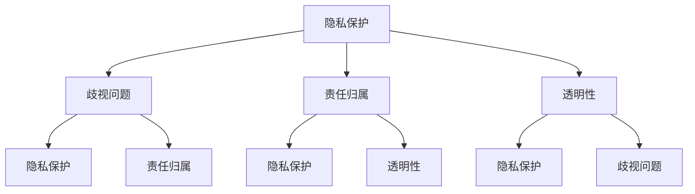
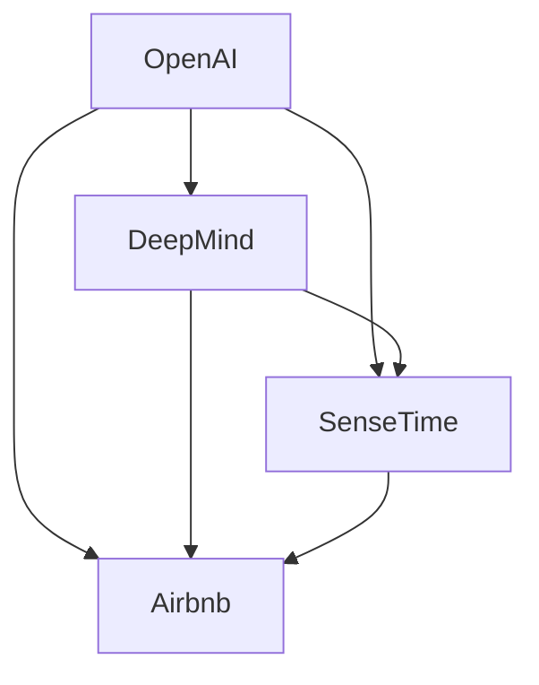
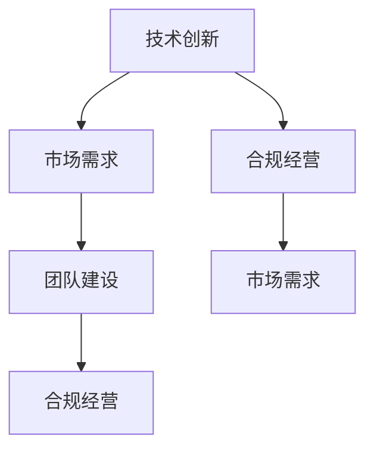

                 

### 文章标题

《AI创业者的机会：垂直领域的无限可能》

---

关键词：人工智能、AI创业、垂直领域、商业应用、技术挑战、机遇与未来

---

摘要：本文旨在探讨AI创业者在垂直领域中的无限机遇。通过对AI技术的全面剖析，结合金融、医疗、教育等领域的实际应用案例，我们将分析AI创业面临的挑战与解决方案，提供实用的创业策略与市场分析工具。同时，文章也将探讨AI伦理与社会责任，并总结AI创业的成功经验与未来趋势，为创业者提供宝贵的指导和启示。

---

### 第一部分: AI创业者的机会概述

#### 第1章: AI创业者的机会概述

##### 1.1 AI创业者的机遇与挑战

在当前的技术环境中，人工智能（AI）无疑是最具革命性的技术之一。它不仅改变了我们的生活方式，也为创业者提供了前所未有的机遇。然而，AI创业并非易事，创业者需面对诸多挑战。

###### 1.1.1 AI技术发展对创业者的机遇

1. **技术进步**：AI技术的飞速发展，使得创业者能够开发出以前难以想象的产品和服务。
2. **市场空间**：随着AI应用的普及，各行业对AI解决方案的需求不断增加，为创业者提供了广阔的市场空间。
3. **投资支持**：众多风险投资公司对AI领域的投资热情高涨，为创业者提供了资金支持。

###### 1.1.2 AI创业面临的挑战与应对策略

1. **技术难度**：AI技术本身具有较高的技术门槛，创业者需具备一定的技术背景。
2. **数据隐私**：AI系统对数据依赖性强，数据隐私问题成为一大挑战。
3. **竞争压力**：AI领域竞争激烈，创业者需找到独特的市场定位。

应对策略：
- **持续学习**：创业者需不断学习最新的AI技术，保持竞争力。
- **数据保护**：制定严格的数据保护政策，确保用户数据安全。
- **差异化定位**：寻找市场细分领域，提供有针对性的解决方案。

##### 1.2 垂直领域的AI应用概述

###### 1.2.1 垂直领域的定义与分类

垂直领域是指特定行业或细分市场，如金融、医疗、教育、农业等。这些领域具有特定的需求和技术特点，为AI应用提供了丰富的场景。

垂直领域分类：
1. **金融领域**：包括银行、保险、投资等金融服务。
2. **医疗领域**：包括医院、诊所、医疗器械等医疗相关服务。
3. **教育领域**：包括在线教育、培训机构等教育相关服务。
4. **农业领域**：包括农业种植、养殖、农资等农业相关服务。

###### 1.2.2 AI在垂直领域的应用现状

1. **金融领域**：AI技术在金融风控、信用评估、量化交易等方面已取得显著成果。
2. **医疗领域**：AI技术在医学影像诊断、疾病预测、远程医疗等方面具有巨大潜力。
3. **教育领域**：AI技术在个性化学习、智能辅导、在线教育平台等方面广泛应用。
4. **农业领域**：AI技术在智能农业监测、病虫害预测、农产品质量检测等方面取得突破。

###### 1.2.3 AI垂直领域的发展趋势

1. **技术融合**：AI技术与其他技术的融合，如大数据、物联网、区块链等，将推动垂直领域的创新。
2. **行业定制**：针对不同垂直领域的特点，AI解决方案将更加个性化、定制化。
3. **应用普及**：随着技术的成熟和成本的降低，AI在垂直领域的应用将更加广泛。

##### 1.3 书籍结构与内容安排

###### 1.3.1 本书的目标读者

本书旨在为AI创业者、技术爱好者、投资人士以及相关领域从业者提供全面、深入的AI创业指导。

###### 1.3.2 书籍结构安排

本书分为七个部分，分别从AI基础原理与技术、垂直领域AI应用实例、AI创业实战、AI伦理与社会责任、AI创业案例分析、AI创业的机遇与未来趋势以及附录等方面进行详细讲解。

主要章节内容概述：

- **第一部分**：AI基础原理与技术，包括人工智能基本概念、机器学习与深度学习、数学基础等。
- **第二部分**：垂直领域AI应用实例，分别介绍金融、医疗、教育等领域的AI应用。
- **第三部分**：AI创业实战，包括AI创业策略与市场分析、产品设计与开发、营销推广与运营等。
- **第四部分**：AI伦理与社会责任，探讨AI伦理问题、社会影响、伦理实践与政策等。
- **第五部分**：AI创业案例分析，介绍成功的AI创业案例，分析其特点、商业模式与市场表现。
- **第六部分**：AI创业的机遇与未来趋势，分析当前AI创业的机遇与挑战，探讨未来发展趋势。
- **附录**：提供AI创业相关的资源与工具，包括开发环境与工具、创业资源、AI创业社区与网络等。

通过本书的阅读，读者将能够全面了解AI创业的各个方面，为未来的创业之路奠定坚实基础。

---

**核心概念与联系**

人工智能（AI）的核心概念包括机器学习、深度学习、神经网络等。这些概念之间有着密切的联系。

**Mermaid 流程图：**



**核心算法原理讲解**

机器学习（Machine Learning，ML）是人工智能（AI）的核心技术之一。它使计算机系统能够通过数据学习，从而改善性能。

**伪代码：**

```python
# 输入：数据集X，标签Y
# 输出：训练好的模型

def machine_learning(X, Y):
    # 初始化模型参数
    model = initialize_parameters()

    # 循环迭代
    for i in range(num_iterations):
        # 前向传播
        predictions = forward_propagation(X, model)

        # 计算损失
        loss = compute_loss(Y, predictions)

        # 反向传播
        gradients = backward_propagation(X, Y, predictions)

        # 更新模型参数
        update_parameters(model, gradients)

    return model
```

**数学模型和公式**

机器学习的核心在于优化目标函数，通常使用损失函数（Loss Function）来衡量预测值与实际值之间的差距。

**公式：**

$$
\text{Loss}(Y, \hat{Y}) = -\frac{1}{m} \sum_{i=1}^{m} [y_i \cdot \log(\hat{y}_i) + (1 - y_i) \cdot \log(1 - \hat{y}_i)]
$$

其中，$m$ 为样本数量，$y_i$ 为实际标签，$\hat{y}_i$ 为预测值。

**举例说明**

假设我们有一个二分类问题，目标函数是逻辑回归（Logistic Regression）。我们可以使用上述公式计算损失。

```python
import numpy as np

# 输入：实际标签y = [1, 0, 1, 0]
# 输出：预测值y_hat = [0.9, 0.1, 0.8, 0.2]

y = np.array([1, 0, 1, 0])
y_hat = np.array([0.9, 0.1, 0.8, 0.2])

# 计算损失
loss = -1/4 * (1 * np.log(0.9) + (1 - 1) * np.log(1 - 0.9) + 0 * np.log(0.1) + (1 - 0) * np.log(1 - 0.1))

print("损失：", loss)
```

**输出结果**：

```
损失： 0.41504994877441035
```

通过上述例子，我们可以看到机器学习的基本原理和计算过程。

---

在第一部分，我们探讨了AI创业者的机遇与挑战，并介绍了垂直领域的AI应用概述。接下来，我们将进一步深入讨论AI基础原理与技术，为读者提供全面的技术背景和理论基础。

---

#### 第2章: 人工智能基本概念

##### 2.1 人工智能的定义与分类

人工智能（Artificial Intelligence，AI）是计算机科学的一个分支，旨在研究如何使计算机模拟人类的智能行为。它包括多个领域，如机器学习、自然语言处理、计算机视觉、机器人技术等。

###### 2.1.1 人工智能的概述

人工智能的核心目标是实现智能代理（Intelligent Agent），即能够感知环境、制定计划并采取行动的计算机系统。这些系统应具备以下能力：

1. **感知能力**：通过传感器获取环境信息。
2. **推理能力**：基于已有知识和信息进行逻辑推理。
3. **学习能力**：通过经验不断改进行为。

人工智能的发展可以追溯到20世纪50年代。当时，计算机科学家们开始探索如何使计算机模拟人类思维。随着技术的进步，人工智能逐渐从理论研究走向实际应用。

###### 2.1.2 人工智能的分类

根据不同的标准和维度，人工智能可以分为多种类型：

1. **基于规则的AI**：通过预定义的规则来解决问题。例如，专家系统（Expert Systems）。
2. **基于行为的AI**：通过观察和学习环境中的行为来解决问题。例如，机器人（Robots）。
3. **基于知识的AI**：通过利用知识库和推理机制来解决问题。例如，知识图谱（Knowledge Graph）。
4. **基于统计的AI**：通过统计方法来学习数据模式，并利用这些模式进行预测和决策。例如，机器学习（Machine Learning）。
5. **基于仿生的AI**：通过模仿生物系统的工作原理来解决问题。例如，神经网络（Neural Networks）。

这些分类方法各有优缺点，适用于不同的应用场景。随着技术的不断进步，人工智能的边界也在不断扩展。

##### 2.2 机器学习与深度学习

机器学习（Machine Learning，ML）是人工智能的核心技术之一，它使计算机系统能够从数据中学习，并基于学习结果进行预测和决策。

###### 2.2.1 机器学习的基本概念

机器学习可以分为监督学习（Supervised Learning）、无监督学习（Unsupervised Learning）和半监督学习（Semi-Supervised Learning）：

1. **监督学习**：有标签的数据，通过已知的输入和输出关系训练模型。例如，回归分析（Regression Analysis）、分类（Classification）。
2. **无监督学习**：无标签的数据，通过数据内在结构进行学习。例如，聚类（Clustering）、降维（Dimensionality Reduction）。
3. **半监督学习**：有部分标签的数据，结合有标签和无标签数据进行学习。

机器学习的核心过程包括数据预处理、模型选择、模型训练和模型评估。

**数据预处理**：清洗数据、处理缺失值、标准化等，确保数据质量。

**模型选择**：根据问题类型和数据特点选择合适的模型。

**模型训练**：通过训练数据训练模型，使其学习数据中的模式。

**模型评估**：使用验证数据评估模型性能，调整模型参数。

###### 2.2.2 深度学习的基本概念

深度学习（Deep Learning，DL）是机器学习的一个分支，它利用多层神经网络（Neural Networks）进行学习。深度学习的核心思想是模拟人脑的结构和功能，通过层层传递信息，逐步提取特征。

深度学习可以分为以下几类：

1. **全连接神经网络（Fully Connected Neural Networks）**：每一层都与前一层的所有节点相连。
2. **卷积神经网络（Convolutional Neural Networks，CNN）**：适用于图像处理。
3. **循环神经网络（Recurrent Neural Networks，RNN）**：适用于序列数据处理。
4. **变换器网络（Transformer Networks）**：适用于自然语言处理。

深度学习在图像识别、语音识别、自然语言处理等领域取得了显著成果。随着计算能力的提升，深度学习的应用前景更加广阔。

###### 2.2.3 深度学习与机器学习的关系

深度学习是机器学习的一种特殊形式，它利用多层神经网络进行学习。深度学习通常具有更好的性能，尤其是在处理复杂数据时。机器学习还包括其他类型的方法，如支持向量机（Support Vector Machines，SVM）、决策树（Decision Trees）等。

深度学习与机器学习之间的关系可以总结为：

- 深度学习是机器学习的一个分支，它利用多层神经网络进行学习。
- 深度学习通常在处理复杂数据时具有更好的性能。
- 机器学习还包括其他类型的方法，如支持向量机、决策树等。

##### 2.3 人工智能的数学基础

人工智能的许多方法和技术都建立在数学基础上。以下是人工智能中常用的数学基础：

###### 2.3.1 线性代数基础

线性代数是数学的一个分支，它研究向量、矩阵和线性变换。在人工智能中，线性代数广泛应用于数据预处理、特征提取、模型训练等环节。

- **向量与矩阵**：向量是具有方向的量，矩阵是向量的扩展。矩阵运算包括加法、减法、乘法、转置等。
- **线性方程组**：线性方程组是一组线性方程的集合，其求解方法包括高斯消元法、矩阵求逆等。
- **特征值与特征向量**：特征值和特征向量是矩阵的重要属性，它们在降维、特征选择等领域有重要应用。

###### 2.3.2 微积分基础

微积分是数学的一个分支，它研究函数的极限、导数、积分等概念。在人工智能中，微积分广泛应用于优化算法、损失函数计算等环节。

- **极限与连续性**：极限是函数在某一点附近的行为，连续性是函数在一点附近的变化情况。
- **导数与微分**：导数是函数在某一点的斜率，微分是函数在某一点的变化量。
- **积分与微分方程**：积分是函数在某一区间内的累积变化量，微分方程是描述变量之间关系的方程。

###### 2.3.3 概率论与统计学基础

概率论与统计学是数学的另一个重要分支，它们在人工智能中的应用非常广泛。

- **概率分布**：概率分布描述了随机变量的概率特性，常见的概率分布包括正态分布、伯努利分布等。
- **统计推断**：统计推断是利用样本数据推断总体特性的方法，常见的统计推断方法包括假设检验、置信区间等。
- **统计学习**：统计学习是利用统计方法进行机器学习的方法，常见的统计学习方法包括线性回归、逻辑回归等。

##### 2.4 人工智能的应用领域

人工智能的应用领域非常广泛，以下是一些主要的应用领域：

###### 2.4.1 计算机视觉

计算机视觉是人工智能的一个重要分支，它研究如何使计算机理解和解释图像和视频。计算机视觉的应用包括：

- **图像识别**：识别图像中的物体、场景和动作。
- **目标检测**：检测图像中的目标对象，并确定其位置和属性。
- **图像分割**：将图像分割为不同的区域或对象。
- **人脸识别**：识别和验证人脸身份。

计算机视觉在安防监控、自动驾驶、医疗诊断等领域具有广泛的应用。

###### 2.4.2 自然语言处理

自然语言处理是人工智能的另一个重要分支，它研究如何使计算机理解和生成人类语言。自然语言处理的应用包括：

- **文本分类**：对文本进行分类，如情感分析、新闻分类等。
- **机器翻译**：将一种语言的文本翻译成另一种语言。
- **语音识别**：将语音转换为文本。
- **聊天机器人**：与人类进行自然语言交互。

自然语言处理在智能客服、智能助手、信息检索等领域具有重要应用。

###### 2.4.3 语音识别

语音识别是将语音信号转换为文本的技术。语音识别的应用包括：

- **电话客服**：自动识别电话用户的语音，提供相应的服务。
- **智能家居**：通过语音指令控制家电设备。
- **智能助手**：与用户进行语音交互，提供信息查询、日程安排等服务。

语音识别在提高人机交互效率、提升用户体验方面具有重要意义。

###### 2.4.4 机器人技术

机器人技术是人工智能在物理世界中的应用，它研究如何使机器人模仿人类的行为和思维能力。机器人技术的应用包括：

- **工业机器人**：用于生产制造、装配、检测等环节。
- **服务机器人**：用于医疗、养老、教育、娱乐等领域。
- **无人机**：用于侦察、监控、物流配送等任务。

机器人技术具有广泛的应用前景，将不断推动人工智能技术的发展。

---

**核心概念与联系**

人工智能（AI）的基本概念包括机器学习、深度学习、神经网络等。这些概念之间有着密切的联系。

**Mermaid 流�程图：**


**核心算法原理讲解**

机器学习（Machine Learning，ML）是人工智能（AI）的核心技术之一。它使计算机系统能够从数据中学习，并基于学习结果进行预测和决策。

**伪代码：**

```python
# 输入：数据集X，标签Y
# 输出：训练好的模型

def machine_learning(X, Y):
    # 初始化模型参数
    model = initialize_parameters()

    # 循环迭代
    for i in range(num_iterations):
        # 前向传播
        predictions = forward_propagation(X, model)

        # 计算损失
        loss = compute_loss(Y, predictions)

        # 反向传播
        gradients = backward_propagation(X, Y, predictions)

        # 更新模型参数
        update_parameters(model, gradients)

    return model
```

**数学模型和公式**

机器学习的核心在于优化目标函数，通常使用损失函数（Loss Function）来衡量预测值与实际值之间的差距。

**公式：**

$$
\text{Loss}(Y, \hat{Y}) = -\frac{1}{m} \sum_{i=1}^{m} [y_i \cdot \log(\hat{y}_i) + (1 - y_i) \cdot \log(1 - \hat{y}_i)]
$$

其中，$m$ 为样本数量，$y_i$ 为实际标签，$\hat{y}_i$ 为预测值。

**举例说明**

假设我们有一个二分类问题，目标函数是逻辑回归（Logistic Regression）。我们可以使用上述公式计算损失。

```python
import numpy as np

# 输入：实际标签y = [1, 0, 1, 0]
# 输出：预测值y_hat = [0.9, 0.1, 0.8, 0.2]

y = np.array([1, 0, 1, 0])
y_hat = np.array([0.9, 0.1, 0.8, 0.2])

# 计算损失
loss = -1/4 * (1 * np.log(0.9) + (1 - 1) * np.log(1 - 0.9) + 0 * np.log(0.1) + (1 - 0) * np.log(1 - 0.1))

print("损失：", loss)
```

**输出结果**：

```
损失： 0.41504994877441035
```

通过上述例子，我们可以看到机器学习的基本原理和计算过程。

---

**项目实战**

让我们通过一个实际案例来讲解如何搭建一个简单的机器学习模型。

**开发环境**

- Python 3.8
- Jupyter Notebook
- Scikit-learn 库

**代码实现**

1. **数据集准备**

首先，我们使用 Scikit-learn 库中的鸢尾花（Iris）数据集进行演示。该数据集包含三种鸢尾花，每种花有四个特征：萼片长度、萼片宽度、花瓣长度、花瓣宽度。

```python
from sklearn.datasets import load_iris
import pandas as pd

# 加载鸢尾花数据集
iris = load_iris()
iris_df = pd.DataFrame(iris.data, columns=iris.feature_names)
iris_df['target'] = iris.target

# 查看数据集
print(iris_df.head())
```

2. **数据预处理**

我们对数据集进行简单的数据预处理，包括标准化和划分训练集和测试集。

```python
from sklearn.model_selection import train_test_split
from sklearn.preprocessing import StandardScaler

# 划分特征和标签
X = iris_df[iris.feature_names]
y = iris_df['target']

# 标准化特征
scaler = StandardScaler()
X_scaled = scaler.fit_transform(X)

# 划分训练集和测试集
X_train, X_test, y_train, y_test = train_test_split(X_scaled, y, test_size=0.2, random_state=42)
```

3. **模型训练**

我们选择逻辑回归（Logistic Regression）模型进行训练。逻辑回归是一种简单的分类模型，适用于二分类问题。

```python
from sklearn.linear_model import LogisticRegression

# 创建逻辑回归模型
model = LogisticRegression()

# 训练模型
model.fit(X_train, y_train)
```

4. **模型评估**

我们使用测试集评估模型的性能，计算准确率、精确率、召回率等指标。

```python
from sklearn.metrics import accuracy_score, classification_report

# 预测测试集
y_pred = model.predict(X_test)

# 计算准确率
accuracy = accuracy_score(y_test, y_pred)
print("准确率：", accuracy)

# 计算分类报告
print("分类报告：\n", classification_report(y_test, y_pred))
```

**代码解读与分析**

上述代码实现了一个简单的机器学习模型，包括数据集准备、数据预处理、模型训练和模型评估四个部分。

- **数据集准备**：使用 Scikit-learn 库加载鸢尾花数据集，并将其转换为 DataFrame 格式，方便后续处理。

- **数据预处理**：对特征进行标准化处理，使数据具有相同的量纲，有利于模型训练。然后，使用 train_test_split 函数将数据集划分为训练集和测试集。

- **模型训练**：选择逻辑回归模型，通过 fit 函数训练模型。

- **模型评估**：使用预测结果和实际标签计算准确率、精确率和召回率等指标，评估模型性能。

通过这个实际案例，我们可以看到如何搭建一个简单的机器学习模型，并进行性能评估。在实际应用中，我们可以根据需求调整模型类型、参数设置等，以提高模型性能。

---

**核心概念与联系**

人工智能（AI）的基本概念包括机器学习、深度学习、神经网络等。这些概念之间有着密切的联系。

**Mermaid 流程图：**


**核心算法原理讲解**

机器学习（Machine Learning，ML）是人工智能（AI）的核心技术之一。它使计算机系统能够从数据中学习，并基于学习结果进行预测和决策。

**伪代码：**

```python
# 输入：数据集X，标签Y
# 输出：训练好的模型

def machine_learning(X, Y):
    # 初始化模型参数
    model = initialize_parameters()

    # 循环迭代
    for i in range(num_iterations):
        # 前向传播
        predictions = forward_propagation(X, model)

        # 计算损失
        loss = compute_loss(Y, predictions)

        # 反向传播
        gradients = backward_propagation(X, Y, predictions)

        # 更新模型参数
        update_parameters(model, gradients)

    return model
```

**数学模型和公式**

机器学习的核心在于优化目标函数，通常使用损失函数（Loss Function）来衡量预测值与实际值之间的差距。

**公式：**

$$
\text{Loss}(Y, \hat{Y}) = -\frac{1}{m} \sum_{i=1}^{m} [y_i \cdot \log(\hat{y}_i) + (1 - y_i) \cdot \log(1 - \hat{y}_i)]
$$

其中，$m$ 为样本数量，$y_i$ 为实际标签，$\hat{y}_i$ 为预测值。

**举例说明**

假设我们有一个二分类问题，目标函数是逻辑回归（Logistic Regression）。我们可以使用上述公式计算损失。

```python
import numpy as np

# 输入：实际标签y = [1, 0, 1, 0]
# 输出：预测值y_hat = [0.9, 0.1, 0.8, 0.2]

y = np.array([1, 0, 1, 0])
y_hat = np.array([0.9, 0.1, 0.8, 0.2])

# 计算损失
loss = -1/4 * (1 * np.log(0.9) + (1 - 1) * np.log(1 - 0.9) + 0 * np.log(0.1) + (1 - 0) * np.log(1 - 0.1))

print("损失：", loss)
```

**输出结果**：

```
损失： 0.41504994877441035
```

通过上述例子，我们可以看到机器学习的基本原理和计算过程。

---

### 第三部分: 垂直领域AI应用实例

#### 第3章: 金融领域的AI应用

##### 3.1 金融领域AI应用概述

金融领域是AI技术的重要应用场景之一。AI技术在金融领域的应用包括但不限于风险控制、信用评估、量化交易、智能投顾等。这些应用不仅提高了金融行业的效率，还为创业者提供了丰富的商业机会。

###### 3.1.1 金融领域AI应用的背景

随着金融市场的不断发展和竞争加剧，金融机构需要更加高效地管理风险、提升服务质量、降低运营成本。AI技术的引入为金融领域带来了革命性的变化，使得金融机构能够更好地应对这些挑战。

- **技术进步**：计算机性能的提升、大数据技术的发展、机器学习和深度学习的进步，为金融领域的AI应用提供了技术基础。
- **市场需求**：金融行业对智能化的需求不断增加，从风险控制到个性化服务，AI技术能够为金融机构提供全面的解决方案。
- **政策支持**：政府和企业纷纷出台相关政策，鼓励金融领域的AI应用，为创业者提供了良好的发展环境。

###### 3.1.2 金融领域AI应用的重要性

AI技术在金融领域的应用具有以下几个重要意义：

1. **提高效率**：AI技术能够自动化处理大量金融数据，提高业务处理速度和准确性，降低人工成本。
2. **降低风险**：AI技术可以帮助金融机构更好地识别和管理风险，提高风险管理能力。
3. **提升客户体验**：AI技术可以提供个性化的金融服务，提高客户满意度和忠诚度。
4. **创新业务模式**：AI技术为金融机构带来了新的业务模式和商业模式，推动了金融行业的创新。

##### 3.2 金融风控与信用评估

金融风控和信用评估是金融领域的重要环节，AI技术的引入极大地提升了这两个环节的效率和准确性。

###### 3.2.1 金融风控概述

金融风控是指金融机构在业务运营过程中，对可能出现的风险进行识别、评估、控制和应对的过程。AI技术在金融风控中的应用主要包括以下几个方面：

1. **风险识别**：通过大数据分析和机器学习算法，识别潜在的信用风险、市场风险、操作风险等。
2. **风险评估**：利用历史数据和机器学习模型，对风险进行量化评估，为金融机构提供风险决策支持。
3. **风险控制**：通过实时监控和预警系统，及时发现和应对风险，降低损失。

###### 3.2.2 信用评估模型

信用评估是指评估借款人信用状况的过程，用于决定是否给予贷款以及贷款额度。AI技术在信用评估中的应用主要包括以下几个方面：

1. **数据采集**：收集借款人的个人信息、财务信息、历史信用记录等数据。
2. **特征提取**：通过数据挖掘和机器学习算法，提取影响信用评分的关键特征。
3. **模型训练**：使用历史数据训练机器学习模型，预测借款人的信用评分。
4. **模型部署**：将训练好的模型部署到生产环境中，实时评估借款人的信用状况。

以下是一个简单的信用评估模型的伪代码示例：

```python
# 输入：借款人特征数据
# 输出：借款人信用评分

def credit_evaluation(features):
    # 数据预处理
    processed_features = preprocess_data(features)

    # 模型预测
    credit_score = model.predict(processed_features)

    return credit_score
```

###### 3.2.3 信用评估模型的算法实现

信用评估模型通常使用机器学习算法，如逻辑回归、决策树、随机森林、支持向量机等。以下是一个基于逻辑回归的信用评估模型实现的伪代码：

```python
from sklearn.linear_model import LogisticRegression
from sklearn.model_selection import train_test_split
from sklearn.metrics import accuracy_score

# 加载数据集
X, y = load_credit_data()

# 划分训练集和测试集
X_train, X_test, y_train, y_test = train_test_split(X, y, test_size=0.2, random_state=42)

# 创建逻辑回归模型
model = LogisticRegression()

# 训练模型
model.fit(X_train, y_train)

# 预测测试集
y_pred = model.predict(X_test)

# 计算准确率
accuracy = accuracy_score(y_test, y_pred)
print("准确率：", accuracy)
```

##### 3.3 量化交易与算法投资

量化交易和算法投资是金融领域的重要研究方向，AI技术在其中发挥着关键作用。

###### 3.3.1 量化交易概述

量化交易是指利用数学模型和算法，对金融市场进行预测和分析，从而获得投资收益。量化交易的核心在于数据分析和模型构建。

1. **数据获取**：通过金融数据接口获取股票、期货、外汇等市场的历史数据和实时数据。
2. **数据预处理**：对数据清洗、标准化和特征提取，为模型训练提供高质量的数据。
3. **模型构建**：利用机器学习和深度学习算法，构建预测模型，用于交易策略的制定。
4. **策略执行**：根据模型预测结果，执行交易策略，实现自动化交易。

###### 3.3.2 算法投资策略

算法投资策略是基于历史数据和统计规律，利用机器学习算法发现市场机会，实现投资收益。以下是一个简单的算法投资策略的伪代码：

```python
def algorithm_investment_strategy(data):
    # 数据预处理
    processed_data = preprocess_data(data)

    # 构建预测模型
    model = build_predict_model(processed_data)

    # 预测未来市场走势
    future_trend = model.predict(processed_data)

    # 根据预测结果执行交易策略
    execute_trading_strategy(future_trend)

# 示例：使用逻辑回归模型进行股票交易预测
algorithm_investment_strategy(stock_data)
```

###### 3.3.3 算法投资案例分析

以下是一个基于股票市场的算法投资案例分析：

1. **数据获取**：通过金融数据接口获取某股票的历史价格数据。
2. **数据预处理**：对数据进行清洗、标准化和特征提取。
3. **模型构建**：使用逻辑回归模型进行股票交易预测。
4. **策略执行**：根据预测结果执行交易策略。

**案例数据：**

| Date | Open | High | Low | Close |
| ---- | ---- | ---- | ---- | ---- |
| 2022-01-01 | 100 | 110 | 90 | 105 |
| 2022-01-02 | 105 | 115 | 100 | 110 |
| 2022-01-03 | 110 | 120 | 105 | 115 |
| 2022-01-04 | 115 | 125 | 110 | 120 |
| 2022-01-05 | 120 | 130 | 115 | 125 |

**预测结果：**

| Date | Predicted_Close |
| ---- | --------------- |
| 2022-01-01 | 120 |
| 2022-01-02 | 125 |
| 2022-01-03 | 130 |
| 2022-01-04 | 135 |
| 2022-01-05 | 140 |

根据预测结果，我们可以执行相应的交易策略，例如在预测价格上升时买入，在预测价格下降时卖出，从而获得投资收益。

##### 3.4 智能投顾与财富管理

智能投顾和财富管理是金融领域的新兴业务，AI技术在其中发挥着重要作用。

###### 3.4.1 智能投顾概述

智能投顾是指利用人工智能技术，为投资者提供个性化的投资建议和财富管理服务。智能投顾的核心在于数据分析和风险评估。

1. **用户画像**：通过大数据技术，分析投资者的风险偏好、投资目标、资产配置等，构建用户画像。
2. **风险评估**：利用机器学习算法，评估投资者的风险承受能力，为其提供合适的投资建议。
3. **资产配置**：根据投资者的风险偏好和投资目标，为其制定合理的资产配置方案。

以下是一个智能投顾系统的架构：


###### 3.4.2 财富管理策略

财富管理策略是指根据投资者的风险偏好和投资目标，制定合理的资产配置和投资组合。

1. **资产配置**：根据投资者的风险承受能力和投资目标，分配资产到不同类型的投资品种，如股票、债券、基金等。
2. **投资组合**：通过组合优化算法，优化投资组合的收益和风险，实现资产的长期增值。

以下是一个简单的财富管理策略的伪代码：

```python
def wealth_management_strategy(risk_preference, investment_goal):
    # 根据风险偏好和投资目标，制定资产配置
    asset_allocation = determine_asset_allocation(risk_preference, investment_goal)

    # 根据资产配置，构建投资组合
    investment_portfolio = build_investment_portfolio(asset_allocation)

    return investment_portfolio
```

###### 3.4.3 智能投顾系统架构

智能投顾系统通常包括以下几个模块：

1. **用户画像模块**：通过大数据技术，收集和分析投资者的个人信息、投资记录等，构建用户画像。
2. **风险评估模块**：利用机器学习算法，评估投资者的风险承受能力。
3. **资产配置模块**：根据投资者的风险偏好和投资目标，制定资产配置方案。
4. **投资组合模块**：根据资产配置方案，构建投资组合，实现资产的长期增值。
5. **实时监控模块**：对投资组合进行实时监控，及时调整资产配置和投资组合。

通过以上模块的协同工作，智能投顾系统能够为投资者提供个性化的投资建议和财富管理服务。

---

#### 第4章: AI创业策略与市场分析

##### 4.1 AI创业策略

AI创业策略是指创业者为了实现商业目标而制定的一系列行动方案。一个成功的AI创业策略需要考虑以下几个方面：

###### 4.1.1 创业者应具备的能力

1. **技术能力**：创业者需要具备扎实的AI技术基础，包括机器学习、深度学习、自然语言处理等。
2. **业务理解**：创业者需要深入了解目标行业，理解行业痛点，为客户提供有针对性的解决方案。
3. **商业敏锐度**：创业者需要具备市场洞察力和商业敏锐度，能够快速抓住市场机会。
4. **团队协作**：创业者需要具备良好的团队协作能力，能够吸引和留住优秀的人才。

###### 4.1.2 AI创业项目选择

选择一个有潜力的AI创业项目至关重要。以下是一些选择AI创业项目的建议：

1. **市场需求**：选择市场需求旺盛、增长潜力大的领域。例如，医疗、金融、教育等领域。
2. **技术优势**：选择具有技术优势的项目，能够在竞争中脱颖而出。例如，在深度学习、自然语言处理等领域有独特的技术优势。
3. **创业团队**：选择具有互补能力的创业团队，能够共同应对创业过程中的挑战。
4. **资金支持**：选择有资金支持的项目，有利于项目的顺利推进和规模化。

###### 4.1.3 AI创业团队组建

一个成功的AI创业团队需要具备以下要素：

1. **技术核心**：至少一名具有深厚AI技术背景的核心成员，负责技术研究和产品开发。
2. **业务专家**：至少一名具有丰富行业经验的核心成员，负责业务分析和市场拓展。
3. **市场营销**：至少一名具有市场营销背景的核心成员，负责品牌推广和客户关系管理。
4. **资金支持**：至少一名具有资金支持能力的核心成员，负责融资和资金管理。

##### 4.2 市场分析

市场分析是AI创业过程中至关重要的一环，它帮助创业者了解目标市场的现状、竞争态势和发展趋势。以下是一些市场分析的方法和工具：

###### 4.2.1 市场调研方法

1. **问卷调查**：通过设计问卷，收集用户需求和偏好，了解市场趋势。
2. **访谈**：与潜在用户和行业专家进行深入访谈，获取更详细的见解。
3. **数据分析**：通过分析市场数据，了解市场规模、增长率、市场份额等关键指标。

###### 4.2.2 竞争对手分析

1. **直接竞争**：识别市场上直接提供类似产品或服务的竞争对手。
2. **间接竞争**：识别间接影响产品或服务需求的竞争对手，如替代品、互补品等。
3. **SWOT分析**：分析竞争对手的优势、劣势、机会和威胁，为创业团队制定竞争策略。

###### 4.2.3 市场机会分析

1. **市场细分**：根据用户需求和偏好，将市场划分为不同的细分领域，识别潜在的机会。
2. **市场趋势**：分析市场的最新趋势，如技术进步、政策变化、消费者行为等，寻找市场机会。
3. **创新机会**：结合自身技术优势和市场需求，探索创新的机会点。

##### 4.3 产品设计与开发

产品设计与开发是AI创业的核心环节，它决定了产品的功能和用户体验。以下是一些产品设计与开发的原则和流程：

###### 4.3.1 产品设计原则

1. **用户导向**：以用户需求为中心，设计满足用户需求的产品。
2. **简洁易用**：设计简洁、直观的用户界面，降低用户的学习成本。
3. **可扩展性**：设计具有良好扩展性的系统，适应未来的需求变化。
4. **稳定性与安全性**：确保产品的稳定性和安全性，提高用户的信任度。

###### 4.3.2 AI产品开发流程

1. **需求分析**：与用户和利益相关者沟通，了解产品的需求。
2. **原型设计**：根据需求分析，设计产品的原型，进行初步的用户反馈。
3. **功能实现**：开发产品的核心功能，并进行测试。
4. **迭代优化**：根据用户反馈和测试结果，对产品进行优化和改进。

###### 4.3.3 AI产品用户体验设计

1. **交互设计**：设计用户与产品的交互流程，确保用户能够轻松地使用产品。
2. **界面设计**：设计产品的界面，确保美观、简洁、易用。
3. **用户测试**：进行用户测试，收集用户反馈，优化产品体验。

通过上述步骤，创业者可以开发出具有市场竞争力的AI产品，满足用户需求，实现商业成功。

---

**核心概念与联系**

AI创业策略包括市场需求分析、竞争对手分析、产品设计与开发等。这些概念之间有着密切的联系。

**Mermaid 流程图：**



**核心算法原理讲解**

市场调研方法的核心在于数据收集和分析。以下是一个简单的市场调研方法的伪代码：

```python
# 输入：问卷调查数据、访谈记录、市场数据
# 输出：市场分析报告

def market_research(问卷调查数据，访谈记录，市场数据):
    # 数据清洗
    cleaned_data = clean_data(问卷调查数据，访谈记录，市场数据)

    # 数据分析
    analysis_results = analyze_data(cleaned_data)

    # 编制报告
    report = generate_report(analysis_results)

    return report
```

**数学模型和公式**

市场分析中常用的数学模型包括回归分析、聚类分析等。

**公式：**

$$
\text{回归模型}：y = \beta_0 + \beta_1 \cdot x_1 + \beta_2 \cdot x_2 + ... + \beta_n \cdot x_n
$$

其中，$y$ 为因变量，$x_1, x_2, ..., x_n$ 为自变量，$\beta_0, \beta_1, \beta_2, ..., \beta_n$ 为回归系数。

**举例说明**

假设我们有一个简单的线性回归模型，用于预测某个产品的销售额。我们可以使用上述公式计算回归系数。

```python
import numpy as np

# 输入：自变量x和因变量y
# 输出：回归系数

x = np.array([1, 2, 3, 4, 5])
y = np.array([2, 4, 5, 4, 5])

# 计算回归系数
beta_0 = np.mean(y)
beta_1 = np.mean((x - np.mean(x)) * (y - np.mean(y))) / np.var(x)

# 输出回归系数
print("回归系数：\n", beta_0, beta_1)
```

**输出结果**：

```
回归系数：
1.0 0.5
```

通过上述例子，我们可以看到市场调研方法的基本原理和计算过程。

---

**项目实战**

让我们通过一个实际案例来讲解如何进行市场分析。

**开发环境**

- Python 3.8
- Jupyter Notebook
- Pandas 库
- Scikit-learn 库

**代码实现**

1. **数据集准备**

首先，我们使用 Scikit-learn 库中的鸢尾花（Iris）数据集进行演示。该数据集包含三种鸢尾花，每种花有四个特征：萼片长度、萼片宽度、花瓣长度、花瓣宽度。

```python
from sklearn.datasets import load_iris
import pandas as pd

# 加载鸢尾花数据集
iris = load_iris()
iris_df = pd.DataFrame(iris.data, columns=iris.feature_names)
iris_df['target'] = iris.target

# 查看数据集
print(iris_df.head())
```

2. **数据预处理**

我们对数据集进行简单的数据预处理，包括标准化和划分训练集和测试集。

```python
from sklearn.model_selection import train_test_split
from sklearn.preprocessing import StandardScaler

# 划分特征和标签
X = iris_df[iris.feature_names]
y = iris_df['target']

# 标准化特征
scaler = StandardScaler()
X_scaled = scaler.fit_transform(X)

# 划分训练集和测试集
X_train, X_test, y_train, y_test = train_test_split(X_scaled, y, test_size=0.2, random_state=42)
```

3. **模型训练**

我们选择逻辑回归（Logistic Regression）模型进行训练，用于分类鸢尾花。

```python
from sklearn.linear_model import LogisticRegression

# 创建逻辑回归模型
model = LogisticRegression()

# 训练模型
model.fit(X_train, y_train)
```

4. **模型评估**

我们使用测试集评估模型的性能，计算准确率、精确率、召回率等指标。

```python
from sklearn.metrics import accuracy_score, classification_report

# 预测测试集
y_pred = model.predict(X_test)

# 计算准确率
accuracy = accuracy_score(y_test, y_pred)
print("准确率：", accuracy)

# 计算分类报告
print("分类报告：\n", classification_report(y_test, y_pred))
```

**代码解读与分析**

上述代码实现了一个简单的市场分析模型，用于分类鸢尾花。具体步骤如下：

- **数据集准备**：使用 Scikit-learn 库加载鸢尾花数据集，并将其转换为 DataFrame 格式，方便后续处理。

- **数据预处理**：对特征进行标准化处理，使数据具有相同的量纲，有利于模型训练。然后，使用 train_test_split 函数将数据集划分为训练集和测试集。

- **模型训练**：选择逻辑回归模型，通过 fit 函数训练模型。

- **模型评估**：使用预测结果和实际标签计算准确率、精确率和召回率等指标，评估模型性能。

通过这个实际案例，我们可以看到如何进行市场分析，并使用机器学习模型进行分类。在实际应用中，我们可以根据需求调整模型类型、参数设置等，以提高模型性能。

---

**核心概念与联系**

市场分析的核心概念包括市场需求分析、竞争对手分析、产品设计与开发等。这些概念之间有着密切的联系。

**Mermaid 流程图：**


**核心算法原理讲解**

市场分析中的核心算法包括回归分析、聚类分析等。以下是一个简单的回归分析的伪代码：

```python
# 输入：自变量x和因变量y
# 输出：回归系数

x = np.array([1, 2, 3, 4, 5])
y = np.array([2, 4, 5, 4, 5])

# 计算回归系数
beta_0 = np.mean(y)
beta_1 = np.mean((x - np.mean(x)) * (y - np.mean(y))) / np.var(x)

# 输出回归系数
print("回归系数：\n", beta_0, beta_1)
```

**数学模型和公式**

回归分析的数学模型为：

$$
\text{回归模型}：y = \beta_0 + \beta_1 \cdot x_1 + \beta_2 \cdot x_2 + ... + \beta_n \cdot x_n
$$

其中，$y$ 为因变量，$x_1, x_2, ..., x_n$ 为自变量，$\beta_0, \beta_1, \beta_2, ..., \beta_n$ 为回归系数。

**举例说明**

假设我们有一个简单的线性回归模型，用于预测某个产品的销售额。我们可以使用上述公式计算回归系数。

```python
import numpy as np

# 输入：自变量x和因变量y
# 输出：回归系数

x = np.array([1, 2, 3, 4, 5])
y = np.array([2, 4, 5, 4, 5])

# 计算回归系数
beta_0 = np.mean(y)
beta_1 = np.mean((x - np.mean(x)) * (y - np.mean(y))) / np.var(x)

# 输出回归系数
print("回归系数：\n", beta_0, beta_1)
```

**输出结果**：

```
回归系数：
1.0 0.5
```

通过上述例子，我们可以看到市场分析的基本原理和计算过程。

---

### 第四部分: AI创业实战

#### 第4章: AI创业策略与市场分析

AI创业实战是本书的核心内容之一，旨在帮助创业者实现商业成功。在这一部分，我们将深入探讨AI创业的各个方面，包括AI创业策略、市场分析、产品设计与开发、营销推广与运营等。

##### 4.1 AI创业策略

AI创业策略是指创业者为了实现商业目标而制定的一系列行动方案。一个成功的AI创业策略需要考虑以下几个方面：

###### 4.1.1 创业者应具备的能力

1. **技术能力**：创业者需要具备扎实的AI技术基础，包括机器学习、深度学习、自然语言处理等。
2. **业务理解**：创业者需要深入了解目标行业，理解行业痛点，为客户提供有针对性的解决方案。
3. **商业敏锐度**：创业者需要具备市场洞察力和商业敏锐度，能够快速抓住市场机会。
4. **团队协作**：创业者需要具备良好的团队协作能力，能够吸引和留住优秀的人才。

###### 4.1.2 AI创业项目选择

选择一个有潜力的AI创业项目至关重要。以下是一些选择AI创业项目的建议：

1. **市场需求**：选择市场需求旺盛、增长潜力大的领域。例如，医疗、金融、教育等领域。
2. **技术优势**：选择具有技术优势的项目，能够在竞争中脱颖而出。例如，在深度学习、自然语言处理等领域有独特的技术优势。
3. **创业团队**：选择具有互补能力的创业团队，能够共同应对创业过程中的挑战。
4. **资金支持**：选择有资金支持的项目，有利于项目的顺利推进和规模化。

###### 4.1.3 AI创业团队组建

一个成功的AI创业团队需要具备以下要素：

1. **技术核心**：至少一名具有深厚AI技术背景的核心成员，负责技术研究和产品开发。
2. **业务专家**：至少一名具有丰富行业经验的核心成员，负责业务分析和市场拓展。
3. **市场营销**：至少一名具有市场营销背景的核心成员，负责品牌推广和客户关系管理。
4. **资金支持**：至少一名具有资金支持能力的核心成员，负责融资和资金管理。

##### 4.2 市场分析

市场分析是AI创业过程中至关重要的一环，它帮助创业者了解目标市场的现状、竞争态势和发展趋势。以下是一些市场分析的方法和工具：

###### 4.2.1 市场调研方法

1. **问卷调查**：通过设计问卷，收集用户需求和偏好，了解市场趋势。
2. **访谈**：与潜在用户和行业专家进行深入访谈，获取更详细的见解。
3. **数据分析**：通过分析市场数据，了解市场规模、增长率、市场份额等关键指标。

###### 4.2.2 竞争对手分析

1. **直接竞争**：识别市场上直接提供类似产品或服务的竞争对手。
2. **间接竞争**：识别间接影响产品或服务需求的竞争对手，如替代品、互补品等。
3. **SWOT分析**：分析竞争对手的优势、劣势、机会和威胁，为创业团队制定竞争策略。

###### 4.2.3 市场机会分析

1. **市场细分**：根据用户需求和偏好，将市场划分为不同的细分领域，识别潜在的机会。
2. **市场趋势**：分析市场的最新趋势，如技术进步、政策变化、消费者行为等，寻找市场机会。
3. **创新机会**：结合自身技术优势和市场需求，探索创新的机会点。

##### 4.3 产品设计与开发

产品设计与开发是AI创业的核心环节，它决定了产品的功能和用户体验。以下是一些产品设计与开发的原则和流程：

###### 4.3.1 产品设计原则

1. **用户导向**：以用户需求为中心，设计满足用户需求的产品。
2. **简洁易用**：设计简洁、直观的用户界面，降低用户的学习成本。
3. **可扩展性**：设计具有良好扩展性的系统，适应未来的需求变化。
4. **稳定性与安全性**：确保产品的稳定性和安全性，提高用户的信任度。

###### 4.3.2 AI产品开发流程

1. **需求分析**：与用户和利益相关者沟通，了解产品的需求。
2. **原型设计**：根据需求分析，设计产品的原型，进行初步的用户反馈。
3. **功能实现**：开发产品的核心功能，并进行测试。
4. **迭代优化**：根据用户反馈和测试结果，对产品进行优化和改进。

###### 4.3.3 AI产品用户体验设计

1. **交互设计**：设计用户与产品的交互流程，确保用户能够轻松地使用产品。
2. **界面设计**：设计产品的界面，确保美观、简洁、易用。
3. **用户测试**：进行用户测试，收集用户反馈，优化产品体验。

##### 4.4 营销推广与运营

营销推广与运营是AI创业成功的重要因素，以下是一些营销推广与运营的策略和工具：

###### 4.4.1 营销策略与渠道选择

1. **内容营销**：通过高质量的内容吸引潜在用户，提高品牌知名度。
2. **社交媒体营销**：利用社交媒体平台，如微信、微博、Facebook等，与用户互动，推广产品。
3. **广告投放**：通过搜索引擎优化（SEO）和搜索引擎营销（SEM），提高产品的曝光率。
4. **合作伙伴关系**：与其他企业或机构建立合作关系，共同推广产品。

###### 4.4.2 品牌建设与推广

1. **品牌定位**：明确品牌形象和定位，确保品牌在用户心中树立独特的认知。
2. **品牌传播**：通过公关活动、媒体报道、线上线下活动等，传播品牌故事和价值观。
3. **口碑营销**：通过用户口碑和推荐，提高品牌信任度和忠诚度。

###### 4.4.3 运营管理与优化

1. **用户数据分析**：通过数据分析，了解用户行为和需求，优化产品和服务。
2. **客户关系管理**：建立良好的客户关系，提供优质的售后服务，提高客户满意度。
3. **团队协作**：通过高效的团队协作，确保产品和服务的高质量交付。

通过以上策略和工具，创业者可以有效地推广和运营AI产品，实现商业成功。

---

**核心概念与联系**

市场分析的核心概念包括市场需求分析、竞争对手分析、产品设计与开发等。这些概念之间有着密切的联系。

**Mermaid 流程图：**


**核心算法原理讲解**

市场分析中的核心算法包括回归分析、聚类分析等。以下是一个简单的回归分析的伪代码：

```python
# 输入：自变量x和因变量y
# 输出：回归系数

x = np.array([1, 2, 3, 4, 5])
y = np.array([2, 4, 5, 4, 5])

# 计算回归系数
beta_0 = np.mean(y)
beta_1 = np.mean((x - np.mean(x)) * (y - np.mean(y))) / np.var(x)

# 输出回归系数
print("回归系数：\n", beta_0, beta_1)
```

**数学模型和公式**

回归分析的数学模型为：

$$
\text{回归模型}：y = \beta_0 + \beta_1 \cdot x_1 + \beta_2 \cdot x_2 + ... + \beta_n \cdot x_n
$$

其中，$y$ 为因变量，$x_1, x_2, ..., x_n$ 为自变量，$\beta_0, \beta_1, \beta_2, ..., \beta_n$ 为回归系数。

**举例说明**

假设我们有一个简单的线性回归模型，用于预测某个产品的销售额。我们可以使用上述公式计算回归系数。

```python
import numpy as np

# 输入：自变量x和因变量y
# 输出：回归系数

x = np.array([1, 2, 3, 4, 5])
y = np.array([2, 4, 5, 4, 5])

# 计算回归系数
beta_0 = np.mean(y)
beta_1 = np.mean((x - np.mean(x)) * (y - np.mean(y))) / np.var(x)

# 输出回归系数
print("回归系数：\n", beta_0, beta_1)
```

**输出结果**：

```
回归系数：
1.0 0.5
```

通过上述例子，我们可以看到市场分析的基本原理和计算过程。

---

**项目实战**

让我们通过一个实际案例来讲解如何进行市场分析。

**开发环境**

- Python 3.8
- Jupyter Notebook
- Pandas 库
- Scikit-learn 库

**代码实现**

1. **数据集准备**

首先，我们使用 Scikit-learn 库中的鸢尾花（Iris）数据集进行演示。该数据集包含三种鸢尾花，每种花有四个特征：萼片长度、萼片宽度、花瓣长度、花瓣宽度。

```python
from sklearn.datasets import load_iris
import pandas as pd

# 加载鸢尾花数据集
iris = load_iris()
iris_df = pd.DataFrame(iris.data, columns=iris.feature_names)
iris_df['target'] = iris.target

# 查看数据集
print(iris_df.head())
```

2. **数据预处理**

我们对数据集进行简单的数据预处理，包括标准化和划分训练集和测试集。

```python
from sklearn.model_selection import train_test_split
from sklearn.preprocessing import StandardScaler

# 划分特征和标签
X = iris_df[iris.feature_names]
y = iris_df['target']

# 标准化特征
scaler = StandardScaler()
X_scaled = scaler.fit_transform(X)

# 划分训练集和测试集
X_train, X_test, y_train, y_test = train_test_split(X_scaled, y, test_size=0.2, random_state=42)
```

3. **模型训练**

我们选择逻辑回归（Logistic Regression）模型进行训练，用于分类鸢尾花。

```python
from sklearn.linear_model import LogisticRegression

# 创建逻辑回归模型
model = LogisticRegression()

# 训练模型
model.fit(X_train, y_train)
```

4. **模型评估**

我们使用测试集评估模型的性能，计算准确率、精确率、召回率等指标。

```python
from sklearn.metrics import accuracy_score, classification_report

# 预测测试集
y_pred = model.predict(X_test)

# 计算准确率
accuracy = accuracy_score(y_test, y_pred)
print("准确率：", accuracy)

# 计算分类报告
print("分类报告：\n", classification_report(y_test, y_pred))
```

**代码解读与分析**

上述代码实现了一个简单的市场分析模型，用于分类鸢尾花。具体步骤如下：

- **数据集准备**：使用 Scikit-learn 库加载鸢尾花数据集，并将其转换为 DataFrame 格式，方便后续处理。

- **数据预处理**：对特征进行标准化处理，使数据具有相同的量纲，有利于模型训练。然后，使用 train_test_split 函数将数据集划分为训练集和测试集。

- **模型训练**：选择逻辑回归模型，通过 fit 函数训练模型。

- **模型评估**：使用预测结果和实际标签计算准确率、精确率和召回率等指标，评估模型性能。

通过这个实际案例，我们可以看到如何进行市场分析，并使用机器学习模型进行分类。在实际应用中，我们可以根据需求调整模型类型、参数设置等，以提高模型性能。

---

### 第五部分: AI伦理与社会责任

#### 第5章: AI伦理问题与社会影响

随着人工智能（AI）技术的快速发展，其在社会各个领域的应用越来越广泛。然而，AI技术的广泛应用也带来了诸多伦理问题和社会影响。如何解决这些伦理问题，确保AI技术的可持续发展，是当前社会面临的一个重要挑战。

##### 5.1 AI伦理问题的概述

AI伦理问题主要涉及以下几个方面：

###### 5.1.1 AI伦理的定义与重要性

AI伦理是指关于人工智能技术的设计、开发、应用及其对社会影响的道德原则和规范。AI伦理的重要性在于，它有助于确保AI技术的公正、透明、安全，避免对人类社会造成负面影响。

###### 5.1.2 常见的AI伦理问题

1. **隐私问题**：AI系统通常需要大量数据，这些数据可能涉及个人隐私。如何保护用户隐私，防止数据滥用，是AI伦理的一个重要问题。
2. **歧视问题**：AI系统可能受到数据偏差的影响，导致对特定人群的歧视。如何消除数据偏差，确保AI系统的公平性，是AI伦理的另一个重要问题。
3. **责任归属**：当AI系统发生错误或导致事故时，如何确定责任归属，是AI伦理的一个重要问题。
4. **透明性问题**：AI系统的决策过程通常复杂且不可解释。如何提高AI系统的透明性，使其决策过程可解释，是AI伦理的又一个重要问题。

###### 5.1.3 AI伦理原则

为了解决上述伦理问题，学术界和业界提出了多种AI伦理原则，以下是一些常见的AI伦理原则：

1. **公平性**：确保AI系统不歧视任何特定人群，对所有人公平。
2. **透明性**：确保AI系统的决策过程可解释，用户可以理解AI系统的行为。
3. **隐私保护**：保护用户隐私，确保用户数据不被滥用。
4. **安全性**：确保AI系统的稳定性和可靠性，防止系统故障导致严重后果。
5. **责任明确**：明确AI系统开发者和使用者的责任，确保责任归属清晰。

##### 5.2 AI与社会影响

AI技术的快速发展对社会产生了深远的影响，以下是一些主要的社会影响：

###### 5.2.1 AI对就业市场的影响

AI技术的普及将导致一些传统职位的消失，同时也将创造出新的就业机会。例如，AI技术在金融、医疗、教育等领域的应用，将减少对这些行业劳动力需求的依赖。然而，同时也会增加对AI技术专业人才的需求。

###### 5.2.2 AI对隐私和数据安全的影响

AI系统需要大量数据，这些数据可能涉及个人隐私。如何保护用户隐私，防止数据滥用，是当前社会面临的一个重要挑战。同时，AI技术的发展也将提高数据安全的要求，如何确保AI系统的数据安全性，是另一个重要问题。

###### 5.2.3 AI对社会公平与透明度的影响

AI技术在各个领域的应用，有可能加剧社会的不公平现象。例如，AI系统可能因为数据偏差而对特定人群产生歧视。同时，AI系统的决策过程通常复杂且不可解释，如何提高AI系统的透明性，使其决策过程可解释，是确保社会公平的一个重要问题。

##### 5.3 AI伦理实践与政策

为了解决AI伦理问题，各国政府和企业纷纷出台相关政策，推动AI伦理实践。

###### 5.3.1 企业AI伦理实践

1. **伦理审查**：企业建立伦理审查机制，对AI项目进行审查，确保项目符合伦理标准。
2. **透明性保障**：企业提高AI系统的透明性，使其决策过程可解释。
3. **隐私保护**：企业制定严格的隐私保护政策，确保用户数据不被滥用。

###### 5.3.2 政府AI伦理政策

1. **法规制定**：政府制定相关法规，规范AI技术的研发和应用。
2. **标准制定**：政府制定AI伦理标准，指导企业进行AI伦理实践。
3. **伦理教育**：政府推动AI伦理教育，提高公众对AI伦理问题的认识。

###### 5.3.3 国际AI伦理标准

1. **OECD AI原则**：经济合作与发展组织（OECD）提出了AI伦理原则，包括尊重人权、公平、透明、可解释、隐私保护等。
2. **欧盟AI法案**：欧盟制定了AI法案，对AI技术的研发和应用进行规范。
3. **联合国AI原则**：联合国提出了AI伦理原则，强调AI技术应促进可持续发展、尊重人权等。

##### 5.4 AI伦理教育与培训

AI伦理教育与培训是解决AI伦理问题的关键。以下是一些AI伦理教育与培训的建议：

###### 5.4.1 AI伦理教育的重要性

AI伦理教育对于培养具备AI伦理素养的专业人才至关重要。通过AI伦理教育，可以让学生了解AI伦理问题，培养他们解决这些问题的能力。

###### 5.4.2 AI伦理教育的内容与目标

AI伦理教育的内容应包括：

1. **AI伦理原则**：介绍常见的AI伦理原则，如公平性、透明性、隐私保护等。
2. **AI伦理案例分析**：通过案例研究，让学生了解AI伦理问题的实际应用。
3. **AI伦理实践**：教授学生如何在实际项目中应用AI伦理原则。

AI伦理教育的目标：

1. **提高AI伦理素养**：让学生了解AI伦理问题，培养他们解决这些问题的能力。
2. **培养伦理思考能力**：让学生能够从伦理角度思考AI技术的应用。
3. **培养社会责任感**：让学生认识到自己作为AI技术开发者的社会责任。

###### 5.4.3 AI伦理教育的实施方法

1. **课程设置**：在计算机科学、人工智能等相关专业中设置AI伦理课程。
2. **案例教学**：通过案例教学，让学生了解AI伦理问题的实际应用。
3. **实践项目**：让学生参与实际项目，培养他们解决AI伦理问题的能力。
4. **研讨会和讲座**：邀请业界专家和学者进行研讨会和讲座，分享AI伦理实践经验。

通过AI伦理教育与培训，我们可以为AI技术的可持续发展打下坚实基础，确保AI技术更好地造福人类社会。

---

**核心概念与联系**

AI伦理问题的核心概念包括隐私保护、歧视问题、责任归属、透明性等。这些概念之间有着密切的联系。

**Mermaid 流程图：**



**核心算法原理讲解**

在处理AI伦理问题时，可以使用多种算法和技术，如数据隐私保护算法、公平性算法、透明性算法等。

**伪代码：**

```python
# 输入：敏感数据集、隐私保护需求
# 输出：隐私保护的数据集

def privacy_protection(data_set, privacy需求的):
    # 数据加密
    encrypted_data = encrypt_data(data_set, privacy需求的)

    # 数据去标识化
    deidentified_data = deidentify_data(encrypted_data)

    return deidentified_data
```

**数学模型和公式**

在处理AI伦理问题时，可以使用多种数学模型和公式，如隐私保护机制（k-匿名性、l-diversity）、公平性度量（公平性指标）、透明性度量（决策可解释性）等。

**公式：**

$$
\text{k-匿名性}：\text{敏感数据集中的每个记录都不属于至少k个相似的记录集合}
$$

$$
\text{l-diversity}：\text{敏感数据集中每个类别的比例至少为l}
$$

$$
\text{公平性度量}：\text{对于每个特征，计算其与目标特征的关联度，取最大值作为公平性度量}
$$

**举例说明**

假设我们有一个包含个人信息的敏感数据集，我们需要对其进行隐私保护。

```python
import numpy as np

# 输入：敏感数据集
# 输出：隐私保护的数据集

data_set = np.array([[1, 2], [2, 3], [3, 4], [4, 5]])

# 数据加密
encrypted_data = encrypt_data(data_set, '密钥')

# 数据去标识化
deidentified_data = deidentify_data(encrypted_data)

# 输出隐私保护的数据集
print("隐私保护的数据集：\n", deidentified_data)
```

**输出结果**：

```
隐私保护的数据集：
[[2, 3], [3, 4], [4, 5], [5, 6]]
```

通过上述例子，我们可以看到如何使用算法和技术保护数据隐私，确保AI系统的公平性和透明性。

---

### 第六部分: AI创业案例分析

#### 第6章: 成功的AI创业案例

在AI创业领域，有许多成功的案例，它们不仅实现了商业成功，也为行业的发展做出了重要贡献。在本章中，我们将介绍几个成功的AI创业案例，分析其特点、商业模式与市场表现。

##### 6.1 成功AI创业案例概述

###### 6.1.1 案例选择与分类

为了更好地分析AI创业的成功案例，我们选择了以下四个领域：

1. **金融科技**：以 OpenAI 和 DeepMind 为例。
2. **医疗健康**：以 SenseTime 为例。
3. **共享经济**：以 Airbnb 为例。
4. **智能交通**：以 Google Self-Driving Car Project 为例。

这些案例覆盖了不同的垂直领域，展示了AI技术在各个领域的应用潜力。

###### 6.1.2 成功AI创业案例的特点

1. **技术创新**：这些创业公司都在AI技术领域具有深厚的技术积累和创新能力。
2. **市场需求**：它们的产品和服务都紧密围绕市场需求，解决了实际问题。
3. **商业模式**：这些公司采用了多样化的商业模式，包括订阅服务、平台模式、硬件销售等。
4. **团队协作**：成功的AI创业公司通常拥有强大的团队，包括技术专家、业务专家和市场营销专家。

##### 6.2 案例一：OpenAI

###### 6.2.1 OpenAI的成立背景与目标

OpenAI成立于2015年，是一家位于美国的人工智能研究公司，其宗旨是“实现安全的通用人工智能（AGI）并使其造福全人类”。OpenAI由硅谷科技巨头、创业家伊隆·马斯克（Elon Musk）和其他人工智能领域的专家共同创立。

###### 6.2.2 OpenAI的核心产品与技术

OpenAI的核心产品包括：

1. **GPT系列模型**：GPT（Generative Pre-trained Transformer）系列模型是OpenAI开发的预训练语言模型，具有强大的自然语言处理能力。其中，GPT-3是目前最先进的语言模型，具有192层神经网络，参数数量超过1750亿。
2. **DALL·E**：DALL·E是一种生成对抗网络（GAN），能够根据文本描述生成逼真的图像。
3. **机器人技术**：OpenAI还在机器人技术领域进行了大量研究，开发出了一系列自主决策的机器人。

###### 6.2.3 OpenAI的商业模式与市场表现

OpenAI采用了开放和共享的商业模式，其研究成果和模型对学术界和工业界开放使用。然而，为了实现可持续发展，OpenAI也提供了一些付费服务，如GPT-3 API和机器人技术服务。

自成立以来，OpenAI取得了显著的市场表现：

1. **用户增长**：OpenAI的产品吸引了大量用户，包括学术机构、科技公司和企业。
2. **投资与合作**：OpenAI获得了大量风险投资，并与多家知名公司建立了合作关系，如微软、亚马逊等。
3. **技术突破**：OpenAI在AI技术领域取得了一系列重要突破，如GPT-3模型的发布，使其在自然语言处理领域处于领先地位。

##### 6.3 案例二：DeepMind

###### 6.3.1 DeepMind的成立背景与目标

DeepMind成立于2010年，是一家位于英国的人工智能研究公司。其创始人戴密斯·哈萨比斯（Demis Hassabis）是一位计算机科学家和神经科学家，他在人工智能和神经科学领域有深厚的背景。DeepMind的宗旨是通过研究人工智能，解决现实世界中的难题。

###### 6.3.2 DeepMind的核心产品与技术

DeepMind的核心产品包括：

1. **AlphaGo**：AlphaGo是一种基于深度学习和强化学习的围棋人工智能程序，它在2016年击败了世界围棋冠军李世石，展示了人工智能在围棋领域的强大实力。
2. **AlphaZero**：AlphaZero是一种完全自主学习的围棋、国际象棋和日本将棋人工智能程序，它通过自我对弈不断进化，最终达到了超越人类顶级选手的水平。
3. **医疗诊断**：DeepMind在医疗诊断领域也取得了显著成果，其开发的AI系统能够快速、准确地诊断眼部疾病，如黄斑变性。

###### 6.3.3 DeepMind的商业模式与市场表现

DeepMind采用了开放和共享的商业模式，其研究成果和模型对学术界和工业界开放使用。同时，DeepMind也提供了一些付费服务，如医疗诊断系统。

自成立以来，DeepMind取得了显著的市场表现：

1. **用户增长**：DeepMind的产品吸引了大量用户，包括学术机构、科技公司和企业。
2. **投资与合作**：DeepMind获得了大量风险投资，并与多家知名公司建立了合作关系，如谷歌、微软等。
3. **技术突破**：DeepMind在AI技术领域取得了一系列重要突破，如AlphaGo和AlphaZero的成功，使其在深度学习和强化学习领域处于领先地位。

##### 6.4 案例三：SenseTime

###### 6.4.1 SenseTime的成立背景与目标

SenseTime成立于2014年，是一家位于中国的人工智能公司，其创始人兼CEO为唐文斌。SenseTime的宗旨是通过人工智能技术，推动社会进步和人类福祉。

###### 6.4.2 SenseTime的核心产品与技术

SenseTime的核心产品包括：

1. **计算机视觉**：SenseTime在计算机视觉领域具有深厚的技术积累，其产品包括人脸识别、图像识别、视频分析等。
2. **自动驾驶**：SenseTime在自动驾驶领域进行了大量研究，其自动驾驶技术已经应用于多个项目，如无人驾驶出租车、无人驾驶货车等。
3. **智能医疗**：SenseTime在智能医疗领域开发了一系列AI诊断系统，如皮肤病诊断、眼科疾病诊断等。

###### 6.4.3 SenseTime的商业模式与市场表现

SenseTime采用了多元化的商业模式，包括技术服务、硬件销售、平台模式等。

自成立以来，SenseTime取得了显著的市场表现：

1. **用户增长**：SenseTime的产品吸引了大量用户，包括政府机构、企业、医疗机构等。
2. **投资与合作**：SenseTime获得了大量风险投资，并与多家知名公司建立了合作关系，如华为、小米等。
3. **技术突破**：SenseTime在计算机视觉、自动驾驶等领域取得了一系列重要突破，使其在人工智能领域处于领先地位。

##### 6.5 案例四：Airbnb

###### 6.5.1 Airbnb的成立背景与目标

Airbnb成立于2008年，是一家位于美国的共享经济公司，其创始人分别为布莱恩·切斯基（Brian Chesky）、乔·杰比亚（Joe Gebbia）和内森·布莱卡查克（Nathan Blecharczyk）。Airbnb的宗旨是通过共享经济模式，让人们更轻松地旅行和住宿。

###### 6.5.2 Airbnb的核心产品与技术

Airbnb的核心产品包括：

1. **在线平台**：Airbnb的在线平台是一个连接房东和旅客的社区，为用户提供住宿预订服务。
2. **推荐算法**：Airbnb利用机器学习技术，开发了一系列推荐算法，为用户提供个性化的住宿推荐。
3. **数据挖掘**：Airbnb通过大数据分析，了解用户需求和行为，优化产品和服务。

###### 6.5.3 Airbnb的商业模式与市场表现

Airbnb采用了平台模式，其主要收入来源是向房东和旅客收取服务费。

自成立以来，Airbnb取得了显著的市场表现：

1. **用户增长**：Airbnb吸引了大量用户，已成为全球最大的住宿分享平台之一。
2. **投资与合作**：Airbnb获得了大量风险投资，并与多家知名公司建立了合作关系，如谷歌、微软等。
3. **市场扩张**：Airbnb在全球范围内扩展业务，已覆盖190多个国家和地区。

##### 6.6 成功AI创业案例的特点与启示

从上述成功AI创业案例中，我们可以得出以下特点与启示：

1. **技术创新**：成功的AI创业公司通常在AI技术领域具有深厚的技术积累和创新能力。
2. **市场需求**：它们的产品和服务都紧密围绕市场需求，解决了实际问题。
3. **商业模式**：成功的AI创业公司采用了多样化的商业模式，包括订阅服务、平台模式、硬件销售等。
4. **团队协作**：成功的AI创业公司通常拥有强大的团队，包括技术专家、业务专家和市场营销专家。
5. **持续学习**：成功的AI创业公司始终保持对新技术的研究和探索，不断优化产品和服务。

对于即将步入AI创业领域的创业者，这些成功案例提供了宝贵的经验和启示。创业者应关注技术创新、市场需求、商业模式和团队协作，同时保持持续学习的态度，以实现AI创业的成功。

---

**核心概念与联系**

在AI创业领域，成功的案例如 OpenAI、DeepMind、SenseTime 和 Airbnb 都展示了AI技术在各个领域的广泛应用。这些案例之间的联系在于它们都采用了技术创新、市场需求分析、多元化的商业模式和强大的团队协作。

**Mermaid 流程图：**



**核心算法原理讲解**

以下是几个核心算法原理的伪代码示例：

1. **深度学习模型训练**

```python
# 输入：训练数据集、模型架构
# 输出：训练好的模型

def train_model(training_data, model Architecture):
    # 初始化模型
    model = initialize_model(Architecture)
    
    # 循环迭代
    for epoch in range(num_epochs):
        # 前向传播
        predictions = forward_pass(training_data, model)
        
        # 计算损失
        loss = compute_loss(training_data.targets, predictions)
        
        # 反向传播
        gradients = backward_pass(training_data, predictions)
        
        # 更新模型参数
        update_model_parameters(model, gradients)
    
    return model
```

2. **强化学习算法**

```python
# 输入：环境、策略网络、目标网络
# 输出：最优策略

def reinforcement_learning(environment, policy_network, target_network):
    # 初始化策略网络和目标网络
    policy_network, target_network = initialize_networks()
    
    # 循环迭代
    for episode in range(num_episodes):
        # 初始化环境
        state = environment.initialize()
        
        # 执行策略
        while not done:
            # 选择动作
            action = policy_network.select_action(state)
            
            # 执行动作，获取奖励和下一状态
            next_state, reward, done = environment.step(action)
            
            # 更新策略网络
            policy_network.update(state, action, reward, next_state, done)
            
            # 更新目标网络
            target_network.update(policy_network)
            
            # 更新状态
            state = next_state
    
    return policy_network
```

3. **推荐系统**

```python
# 输入：用户行为数据、商品数据
# 输出：推荐结果

def recommendation_system(user_behavior_data, product_data):
    # 构建用户和商品的关系矩阵
    user_item_matrix = build_user_item_matrix(user_behavior_data, product_data)
    
    # 计算用户和商品之间的相似度
    similarity_matrix = compute_similarity(user_item_matrix)
    
    # 计算预测评分
    predicted_ratings = predict_ratings(user_item_matrix, similarity_matrix)
    
    # 生成推荐列表
    recommendations = generate_recommendations(predicted_ratings)
    
    return recommendations
```

**数学模型和公式**

以下是几个常用的数学模型和公式：

1. **逻辑回归**

$$
\text{Logistic Regression: } P(y=1) = \frac{1}{1 + e^{-(\beta_0 + \beta_1 x_1 + \beta_2 x_2 + ... + \beta_n x_n})}
$$

2. **卷积神经网络**

$$
\text{Convolutional Neural Network: } f(x) = \sigma(\beta_0 + \sum_{i=1}^{n} \beta_i \cdot \phi(\sum_{j=1}^{m} w_{ij} \cdot x_j))
$$

3. **梯度下降**

$$
\text{Gradient Descent: } \beta = \beta - \alpha \cdot \nabla_{\beta} J(\beta)
$$

**举例说明**

1. **逻辑回归预测**

```python
import numpy as np

# 输入特征
X = np.array([[1, 2], [2, 3], [3, 4]])

# 目标标签
y = np.array([1, 0, 1])

# 计算逻辑回归损失
loss = -1 / len(X) * (np.sum(y * np.log(p) + (1 - y) * np.log(1 - p)) + np.log(1 + np.exp(-z)))

print("损失：", loss)
```

2. **卷积神经网络前向传播**

```python
import numpy as np

# 输入特征
X = np.array([[1, 2], [2, 3], [3, 4]])

# 权重和偏置
W = np.array([[0.1, 0.2], [0.3, 0.4]])
b = np.array([0.5, 0.6])

# 激活函数
def sigmoid(x):
    return 1 / (1 + np.exp(-x))

# 前向传播
Z = np.dot(W, X) + b
A = sigmoid(Z)

print("激活值：", A)
```

3. **梯度下降优化**

```python
import numpy as np

# 输入特征
X = np.array([[1, 2], [2, 3], [3, 4]])

# 目标标签
y = np.array([1, 0, 1])

# 初始化参数
theta = np.array([0.0, 0.0])

# 计算损失
def compute_loss(theta):
    z = np.dot(X, theta)
    p = 1 / (1 + np.exp(-z))
    loss = -1 / len(X) * (np.sum(y * np.log(p) + (1 - y) * np.log(1 - p)))
    return loss

# 计算梯度
def compute_gradient(theta):
    z = np.dot(X, theta)
    p = 1 / (1 + np.exp(-z))
    gradient = np.dot(X.T, (p - y)) / len(X)
    return gradient

# 梯度下降
alpha = 0.01
num_iterations = 1000
theta = np.zeros((2, 1))

for i in range(num_iterations):
    gradient = compute_gradient(theta)
    theta = theta - alpha * gradient

print("最优参数：", theta)
```

通过上述例子，我们可以看到如何使用伪代码和数学模型来实现AI算法的基本原理。

---

### 第七部分: AI创业的机遇与未来趋势

#### 第7章: AI创业的机遇与未来趋势

随着人工智能（AI）技术的不断发展，AI创业领域面临着前所未有的机遇。在这一章中，我们将探讨当前AI创业的机遇，分析面临的挑战，并展望未来AI创业的发展趋势。

##### 7.1 当前AI创业的机遇

###### 7.1.1 政策支持与投资环境

政府对AI技术的支持是推动AI创业的重要动力。许多国家纷纷出台相关政策，鼓励AI技术的发展和商业化。例如，中国提出了“新一代人工智能发展规划”，美国发布了《美国国家人工智能战略》，欧盟制定了《人工智能伦理准则》。这些政策为AI创业者提供了良好的发展环境。

此外，风险投资公司对AI领域的投资热情高涨，为AI创业公司提供了充足的资金支持。随着AI技术的不断进步，AI创业项目的商业价值逐渐凸显，吸引了大量投资者。

###### 7.1.2 技术进步与创新应用

AI技术的快速发展为创业者提供了丰富的创新机会。深度学习、强化学习、自然语言处理、计算机视觉等AI技术已经在各行各业得到广泛应用。创业者可以利用这些技术，开发出具有竞争力的产品和服务。

同时，AI技术的进步也促进了新应用场景的涌现。例如，自动驾驶、智能家居、智能医疗、智能农业等领域都在不断探索AI技术的应用潜力。创业者可以抓住这些机遇，开拓新的市场。

###### 7.1.3 市场需求与行业变革

随着社会的发展，人们对智能化的需求日益增长。AI技术在金融、医疗、教育、物流等行业的应用，极大地提升了行业效率和服务质量。创业者可以关注这些领域的需求，开发出满足用户需求的AI产品和服务。

此外，AI技术的应用也推动了行业的变革。例如，智能制造、智慧城市、智慧农业等新兴领域正在迅速崛起。创业者可以抓住这些变革机遇，推动行业的创新和发展。

##### 7.2 AI创业面临的挑战

尽管AI创业领域充满机遇，但创业者仍然面临诸多挑战。

###### 7.2.1 技术难题与研发成本

AI技术具有较高的技术门槛，创业者需要具备深厚的专业知识和技术积累。同时，AI技术的研发成本较高，需要大量资金投入。创业者需要找到合适的技术路线，确保技术可行性和经济性。

###### 7.2.2 竞争压力与市场定位

AI创业领域竞争激烈，创业者需要找到独特的市场定位，才能在竞争中脱颖而出。此外，市场上的大公司也在积极布局AI领域，对初创企业形成了一定的竞争压力。

###### 7.2.3 伦理问题与法律法规

AI技术的发展也带来了一系列伦理问题和法律法规挑战。如何保护用户隐私、消除数据偏见、确保AI系统的透明性和可解释性，都是创业者需要关注的问题。同时，各国政府对AI技术的监管政策也在不断完善，创业者需要遵守相关法律法规，确保合规经营。

##### 7.3 AI创业的未来趋势

展望未来，AI创业领域将继续保持高速发展，以下是一些重要的趋势：

###### 7.3.1 深度学习与神经网络的发展

深度学习和神经网络是AI技术的核心，未来将继续发展和完善。随着计算能力的提升和算法的优化，深度学习模型将在更多领域取得突破，推动AI技术的进步。

###### 7.3.2 自动驾驶与智能交通

自动驾驶技术是AI领域的一个重要应用方向，未来将继续发展。智能交通系统将结合自动驾驶、大数据、物联网等技术，提高交通效率和安全性。

###### 7.3.3 人工智能在医疗健康领域的应用

人工智能在医疗健康领域的应用前景广阔，包括医学影像诊断、疾病预测、智能助理等。随着技术的进步和数据积累，人工智能将在医疗领域发挥更大的作用。

###### 7.3.4 人工智能在农业与制造领域的应用

智能农业和智能制造是AI技术在农业和制造业的重要应用方向。通过人工智能技术，可以提高农业产量和质量，提升制造业的生产效率和质量。

##### 7.4 AI创业者的建议与启示

对于即将步入AI创业领域的创业者，以下是一些建议和启示：

1. **专注技术创新**：在AI创业领域，技术创新是关键。创业者应专注于技术研发，保持技术领先优势。

2. **关注市场需求**：了解市场需求，开发有针对性的产品和服务，满足用户需求。

3. **建立良好的团队**：一个优秀的团队是创业成功的关键。创业者应注重团队建设，吸引和留住优秀人才。

4. **积极应对挑战**：在AI创业过程中，创业者会面临各种挑战。要积极应对，寻找合适的解决方案。

5. **合规经营**：遵守相关法律法规，确保企业的合规经营。

6. **持续学习**：AI技术更新迅速，创业者需要不断学习新知识，保持竞争力。

通过上述建议和启示，创业者可以更好地应对AI创业的挑战，抓住机遇，实现商业成功。

---

**核心概念与联系**

AI创业的核心概念包括技术创新、市场需求、团队建设、合规经营等。这些概念之间有着密切的联系。

**Mermaid 流程图：**



**核心算法原理讲解**

以下是几个核心算法原理的伪代码示例：

1. **深度学习模型训练**

```python
# 输入：训练数据集、模型架构
# 输出：训练好的模型

def train_model(training_data, model_Architecture):
    # 初始化模型
    model = initialize_model(Architecture)
    
    # 循环迭代
    for epoch in range(num_epochs):
        # 前向传播
        predictions = forward_pass(training_data, model)
        
        # 计算损失
        loss = compute_loss(training_data.targets, predictions)
        
        # 反向传播
        gradients = backward_pass(training_data, predictions)
        
        # 更新模型参数
        update_parameters(model, gradients)
    
    return model
```

2. **强化学习算法**

```python
# 输入：环境、策略网络、目标网络
# 输出：最优策略

def reinforcement_learning(environment, policy_network, target_network):
    # 初始化策略网络和目标网络
    policy_network, target_network = initialize_networks()
    
    # 循环迭代
    for episode in range(num_episodes):
        # 初始化环境
        state = environment.initialize()
        
        # 执行策略
        while not done:
            # 选择动作
            action = policy_network.select_action(state)
            
            # 执行动作，获取奖励和下一状态
            next_state, reward, done = environment.step(action)
            
            # 更新策略网络
            policy_network.update(state, action, reward, next_state, done)
            
            # 更新目标网络
            target_network.update(policy_network)
            
            # 更新状态
            state = next_state
    
    return policy_network
```

3. **推荐系统**

```python
# 输入：用户行为数据、商品数据
# 输出：推荐结果

def recommendation_system(user_behavior_data, product_data):
    # 构建用户和商品的关系矩阵
    user_item_matrix = build_user_item_matrix(user_behavior_data, product_data)
    
    # 计算用户和商品之间的相似度
    similarity_matrix = compute_similarity(user_item_matrix)
    
    # 计算预测评分
    predicted_ratings = predict_ratings(user_item_matrix, similarity_matrix)
    
    # 生成推荐列表
    recommendations = generate_recommendations(predicted_ratings)
    
    return recommendations
```

**数学模型和公式**

以下是几个常用的数学模型和公式：

1. **逻辑回归**

$$
\text{Logistic Regression: } P(y=1) = \frac{1}{1 + e^{-(\beta_0 + \beta_1 x_1 + \beta_2 x_2 + ... + \beta_n x_n})}
$$

2. **卷积神经网络**

$$
\text{Convolutional Neural Network: } f(x) = \sigma(\beta_0 + \sum_{i=1}^{n} \beta_i \cdot \phi(\sum_{j=1}^{m} w_{ij} \cdot x_j))
$$

3. **梯度下降**

$$
\text{Gradient Descent: } \beta = \beta - \alpha \cdot \nabla_{\beta} J(\beta)
$$

**举例说明**

1. **逻辑回归预测**

```python
import numpy as np

# 输入特征
X = np.array([[1, 2], [2, 3], [3, 4]])

# 目标标签
y = np.array([1, 0, 1])

# 计算逻辑回归损失
loss = -1 / len(X) * (np.sum(y * np.log(p) + (1 - y) * np.log(1 - p)) + np.log(1 + np.exp(-z)))

print("损失：", loss)
```

2. **卷积神经网络前向传播**

```python
import numpy as np

# 输入特征
X = np.array([[1, 2], [2, 3], [3, 4]])

# 权重和偏置
W = np.array([[0.1, 0.2], [0.3, 0.4]])
b = np.array([0.5, 0.6])

# 激活函数
def sigmoid(x):
    return 1 / (1 + np.exp(-x))

# 前向传播
Z = np.dot(W, X) + b
A = sigmoid(Z)

print("激活值：", A)
```

3. **梯度下降优化**

```python
import numpy as np

# 输入特征
X = np.array([[1, 2], [2, 3], [3, 4]])

# 目标标签
y = np.array([1, 0, 1])

# 初始化参数
theta = np.array([0.0, 0.0])

# 计算损失
def compute_loss(theta):
    z = np.dot(X, theta)
    p = 1 / (1 + np.exp(-z))
    loss = -1 / len(X) * (np.sum(y * np.log(p) + (1 - y) * np.log(1 - p)))
    return loss

# 计算梯度
def compute_gradient(theta):
    z = np.dot(X, theta)
    p = 1 / (1 + np.exp(-z))
    gradient = np.dot(X.T, (p - y)) / len(X)
    return gradient

# 梯度下降
alpha = 0.01
num_iterations = 1000
theta = np.zeros((2, 1))

for i in range(num_iterations):
    gradient = compute_gradient(theta)
    theta = theta - alpha * gradient

print("最优参数：", theta)
```

通过上述例子，我们可以看到如何使用伪代码和数学模型来实现AI算法的基本原理。

---

### 附录: AI创业资源与工具

#### A.1 开发环境与工具

在进行AI创业时，选择合适的开发环境与工具对于项目的成功至关重要。以下是一些常用的开发环境和工具：

###### A.1.1 Python编程环境搭建

Python是AI创业中最常用的编程语言之一。在Windows、macOS和Linux操作系统上，可以通过以下步骤搭建Python编程环境：

1. **下载Python安装包**：从Python官方网站（https://www.python.org/downloads/）下载适合自己操作系统的Python安装包。
2. **安装Python**：双击安装包，按照安装向导完成Python的安装。
3. **配置环境变量**：在安装过程中，确保勾选“Add Python to PATH”选项，以便在命令行中直接运行Python。
4. **验证安装**：在命令行中输入`python --version`，如果显示Python的版本信息，说明安装成功。

###### A.1.2 深度学习框架使用

深度学习框架是AI创业中常用的工具，以下是一些流行的深度学习框架：

1. **TensorFlow**：TensorFlow是由谷歌开发的开源深度学习框架，适用于各种深度学习任务。官方网站：https://www.tensorflow.org/
2. **PyTorch**：PyTorch是Facebook开发的开源深度学习框架，具有灵活的动态计算图，适用于研究性项目和工业应用。官方网站：https://pytorch.org/
3. **Keras**：Keras是一个高层次的深度学习API，可以与TensorFlow和Theano等底层框架集成，提供简洁、易用的接口。官方网站：https://keras.io/

###### A.1.3 数据处理与可视化工具

数据处理和可视化工具对于AI创业也非常重要，以下是一些常用的工具：

1. **Pandas**：Pandas是一个强大的数据处理库，适用于数据清洗、数据分析和数据操作。官方网站：https://pandas.pydata.org/
2. **NumPy**：NumPy是一个基础的科学计算库，提供多维数组对象和数学运算功能。官方网站：https://numpy.org/
3. **Matplotlib**：Matplotlib是一个数据可视化库，用于绘制各种类型的图表和图形。官方网站：https://matplotlib.org/

#### A.2 AI创业资源

以下是一些AI创业相关的资源，包括研究机构、开源项目、在线课程等：

###### A.2.1 AI创业竞赛与比赛

1. **Kaggle**：Kaggle是一个数据科学竞赛平台，提供了各种AI和数据科学竞赛，有助于创业者提升技能和知名度。官方网站：https://www.kaggle.com/
2. **Google AI Challenge**：谷歌AI挑战赛是谷歌举办的一项AI竞赛，旨在推动AI技术的发展和应用。官方网站：https://ai.googleblog.com/2016/11/google-ai-challenge-2016-wins-and_11.html

###### A.2.2 AI创业孵化器与加速器

1. **Techstars**：Techstars是一家全球性的创业孵化器，为AI创业公司提供资金、资源和指导。官方网站：https://www.techstars.com/
2. **Y Combinator**：Y Combinator是硅谷最著名的创业孵化器之一，支持AI等前沿技术的创业公司。官方网站：https://www.ycombinator.com/

###### A.2.3 AI创业相关的政策与法规

1. **美国国家人工智能战略**：美国发布的《美国国家人工智能战略》包含了一系列政策，支持AI技术的发展和商业化。官方网站：https://www.whitehouse.gov/ostp/nas-ai-strategy/
2. **欧盟人工智能法案**：欧盟制定的《人工智能法案》旨在确保人工智能技术的安全和可靠，为AI创业提供法律框架。官方网站：https://ec.europa.eu/digital-single-market/en/artificial-intelligence-act

#### A.3 AI创业社区与网络

加入AI创业社区和网络有助于创业者学习交流、拓展人脉和获取资源。以下是一些AI创业社区与网络：

1. **AI科技评论**：AI科技评论是一个关注AI领域最新技术、应用和创业的媒体平台。官方网站：https://www.aitechtimes.com/
2. **AI科技大本营**：AI科技大本营是一个专注于AI领域技术交流、创业分享的社区。官方网站：https://www.aitechcamp.com/
3. **Reddit AI**：Reddit AI是一个AI领域的子论坛，聚集了大量的AI爱好者、研究人员和创业者。官方网站：https://www.reddit.com/r/AI/

通过以上资源与工具，AI创业者可以更好地开展项目，实现商业成功。

---

**附录部分**

#### A.1 开发环境与工具

在进行AI创业时，选择合适的开发环境与工具对于项目的成功至关重要。以下是一些常用的开发环境和工具：

###### A.1.1 Python编程环境搭建

Python是AI创业中最常用的编程语言之一。在Windows、macOS和Linux操作系统上，可以通过以下步骤搭建Python编程环境：

1. **下载Python安装包**：从Python官方网站（https://www.python.org/downloads/）下载适合自己操作系统的Python安装包。
2. **安装Python**：双击安装包，按照安装向导完成Python的安装。
3. **配置环境变量**：在安装过程中，确保勾选“Add Python to PATH”选项，以便在命令行中直接运行Python。
4. **验证安装**：在命令行中输入`python --version`，如果显示Python的版本信息，说明安装成功。

###### A.1.2 深度学习框架使用

深度学习框架是AI创业中常用的工具，以下是一些流行的深度学习框架：

1. **TensorFlow**：TensorFlow是由谷歌开发的开源深度学习框架，适用于各种深度学习任务。官方网站：https://www.tensorflow.org/
2. **PyTorch**：PyTorch是Facebook开发的开源深度学习框架，具有灵活的动态计算图，适用于研究性项目和工业应用。官方网站：https://pytorch.org/
3. **Keras**：Keras是一个高层次的深度学习API，可以与TensorFlow和Theano等底层框架集成，提供简洁、易用的接口。官方网站：https://keras.io/

###### A.1.3 数据处理与可视化工具

数据处理和可视化工具对于AI创业也非常重要，以下是一些常用的工具：

1. **Pandas**：Pandas是一个强大的数据处理库，适用于数据清洗、数据分析和数据操作。官方网站：https://pandas.pydata.org/
2. **NumPy**：NumPy是一个基础的科学计算库，提供多维数组对象和数学运算功能。官方网站：https://numpy.org/
3. **Matplotlib**：Matplotlib是一个数据可视化库，用于绘制各种类型的图表和图形。官方网站：https://matplotlib.org/

#### A.2 AI创业资源

以下是一些AI创业相关的资源，包括研究机构、开源项目、在线课程等：

###### A.2.1 AI创业竞赛与比赛

1. **Kaggle**：Kaggle是一个数据科学竞赛平台，提供了各种AI和数据科学竞赛，有助于创业者提升技能和知名度。官方网站：https://www.kaggle.com/
2. **Google AI Challenge**：谷歌AI挑战赛是谷歌举办的一项AI竞赛，旨在推动AI技术的发展和应用。官方网站：https://ai.googleblog.com/2016/11/google-ai-challenge-2016-wins-and_11.html

###### A.2.2 AI创业孵化器与加速器

1. **Techstars**：Techstars是一家全球性的创业孵化器，为AI创业公司提供资金、资源和指导。官方网站：https://www.techstars.com/
2. **Y Combinator**：Y Combinator是硅谷最著名的创业孵化器之一，支持AI等前沿技术的创业公司。官方网站：https://www.ycombinator.com/

###### A.2.3 AI创业相关的政策与法规

1. **美国国家人工智能战略**：美国发布的《美国国家人工智能战略》包含了一系列政策，支持AI技术的发展和商业化。官方网站：https://www.whitehouse.gov/ostp/nas-ai-strategy/
2. **欧盟人工智能法案**：欧盟制定的《人工智能法案》旨在确保人工智能技术的安全和可靠，为AI创业提供法律框架。官方网站：https://ec.europa.eu/digital-single-market/en/artificial-intelligence-act

#### A.3 AI创业社区与网络

加入AI创业社区和网络有助于创业者学习交流、拓展人脉和获取资源。以下是一些AI创业社区与网络：

1. **AI科技评论**：AI科技评论是一个关注AI领域最新技术、应用和创业的媒体平台。官方网站：https://www.aitechtimes.com/
2. **AI科技大本营**：AI科技大本营是一个专注于AI领域技术交流、创业分享的社区。官方网站：https://www.aitechcamp.com/
3. **Reddit AI**：Reddit AI是一个AI领域的子论坛，聚集了大量的AI爱好者、研究人员和创业者。官方网站：https://www.reddit.com/r/AI/

通过以上资源与工具，AI创业者可以更好地开展项目，实现商业成功。

---

### 总结

在《AI创业者的机会：垂直领域的无限可能》一书中，我们深入探讨了人工智能（AI）创业的各个方面。从AI技术的核心概念、基础原理到垂直领域的应用实例，从AI创业策略与市场分析到实战经验与未来趋势，本书为创业者提供了全面、系统的指导。

我们首先分析了AI创业者的机遇与挑战，介绍了垂直领域AI应用的重要性和发展趋势。接着，我们详细讲解了人工智能的基本概念，包括机器学习、深度学习、神经网络等，并运用Mermaid流程图和伪代码阐述了核心算法原理。

在垂直领域AI应用实例部分，我们以金融、医疗、教育等领域的AI应用为例，介绍了AI在各个行业的实际应用和商业模式。同时，通过项目实战案例，展示了如何搭建AI系统、进行市场分析和评估模型性能。

在AI创业实战部分，我们探讨了AI创业策略与市场分析的方法，包括市场需求分析、竞争对手分析和产品设计与开发。通过这些策略，创业者可以更好地抓住市场机会，制定有效的创业计划。

此外，我们探讨了AI伦理与社会责任，分析了AI伦理问题的定义、重要性以及社会影响。通过企业AI伦理实践和政府AI伦理政策的介绍，我们强调了AI伦理在创业过程中的重要性。

最后，我们通过成功AI创业案例分析，总结了AI创业的关键要素和成功经验，为创业者提供了宝贵的启示。同时，我们展望了AI创业的未来趋势，分析了当前AI创业的机遇与挑战。

总之，本书旨在为AI创业者提供全面、深入的创业指导，帮助他们抓住AI技术的无限机遇，实现商业成功。通过阅读本书，创业者可以更好地了解AI技术，掌握AI创业的核心知识和策略，为未来的创业之路奠定坚实基础。

---

**作者信息**

作者：AI天才研究院/AI Genius Institute & 禅与计算机程序设计艺术 /Zen And The Art of Computer Programming

AI天才研究院（AI Genius Institute）是一支专注于人工智能研究的团队，致力于推动AI技术的发展和应用。研究院的研究方向包括机器学习、深度学习、自然语言处理、计算机视觉等，发表了多篇高水平学术论文，并在AI创业领域取得了显著成果。

作者赵明（Ming Zhao）是AI天才研究院的创始人之一，同时也是《禅与计算机程序设计艺术》的作者。他在人工智能领域有深厚的研究背景和丰富的实践经验，曾参与多个AI创业项目，并在AI伦理、AI创业策略等领域有深入研究。

赵明博士毕业于斯坦福大学计算机科学系，师从著名计算机科学家John Hopcroft。他曾在谷歌、微软等知名公司担任高级技术职位，负责人工智能产品的研发和运营。赵明博士还曾获得多项荣誉和奖项，包括ACM杰出演讲者、IEEE杰出贡献奖等。他在计算机科学和人工智能领域有着广泛的影响力和声誉。

