                 

## 第1章：AI与产品生命周期管理概述

### 1.1 AI概述

人工智能（Artificial Intelligence，简称AI）是计算机科学的一个分支，旨在创建能够执行复杂任务、学习新知识和解决问题的系统。自1956年达特茅斯会议以来，人工智能经历了多个发展阶段。最初，AI主要是基于规则和知识的系统，例如专家系统。随后，机器学习技术的发展使得AI系统能够从数据中自动学习和改进。近年来，深度学习技术的崛起进一步推动了AI的应用，使得AI系统能够在图像识别、自然语言处理和决策制定等领域取得显著突破。

#### 1.1.1 人工智能的定义与发展历程

人工智能的定义经历了多次演变。最初，人工智能被视为模拟人类智能的机器。随着技术的发展，人们逐渐认识到人工智能应该是一个能够执行特定任务的系统，而不是简单地模拟人类智能。目前，人工智能的定义更多地强调其应用性和实用性，即创建能够自动执行特定任务的系统。

人工智能的发展历程可以分为几个主要阶段：

- **第一阶段（1956年-1969年）**：这个阶段被称为“黄金时代”，人工智能的概念被提出，并且出现了第一个人工智能程序。然而，由于技术限制，这一阶段的进展相对缓慢。
- **第二阶段（1970年-1980年）**：这一阶段由于资金和兴趣的减少，人工智能研究进入低谷。然而，专家系统的出现为人工智能带来了新的希望。
- **第三阶段（1980年-1987年）**：随着计算机技术的快速发展，人工智能研究得到了新的动力。机器学习技术的出现标志着人工智能进入了新的发展阶段。
- **第四阶段（1988年至今）**：这一阶段是人工智能的快速发展期。深度学习和强化学习等新技术的出现，使得人工智能在图像识别、自然语言处理和决策制定等领域取得了显著突破。

#### 1.1.2 AI技术的核心概念

AI技术的核心概念包括机器学习、深度学习和强化学习。

- **机器学习**：机器学习是一种通过数据训练模型，使计算机自动学习和改进性能的方法。它包括监督学习、无监督学习和半监督学习等子领域。监督学习通过已知输入和输出数据训练模型，无监督学习通过未标记的数据训练模型，半监督学习结合了监督学习和无监督学习的特点。
- **深度学习**：深度学习是一种特殊的机器学习方法，通过多层神经网络模拟人脑处理信息的方式。深度学习在图像识别、自然语言处理和决策制定等领域取得了显著突破。
- **强化学习**：强化学习是一种通过与环境交互，学习如何做出最优决策的方法。它包括马尔可夫决策过程（MDP）和价值函数、策略搜索等子领域。

#### 1.1.3 AI在制造业中的应用

AI在制造业中的应用包括生产优化、质量检测、故障预测等。

- **生产优化**：AI可以通过数据分析和技术优化，帮助制造业提高生产效率、降低成本。例如，利用深度学习技术优化生产流程，预测生产瓶颈，实现生产过程的自动化控制。
- **质量检测**：AI可以通过图像识别和数据分析技术，实现对产品质量的实时监控和检测。例如，使用卷积神经网络（CNN）检测产品表面的缺陷，提高产品质量。
- **故障预测**：AI可以通过数据分析和预测模型，实现对设备故障的提前预测和预防。例如，利用时间序列分析和机器学习技术，预测设备故障，实现预测性维护。

### 1.2 产品生命周期管理

#### 1.2.1 产品生命周期管理概述

产品生命周期管理（Product Life Cycle Management，简称PLM）是一个跨部门、跨领域的协同工作过程，旨在最大化产品的整个生命周期价值。PLM包括从产品的概念设计、开发、生产、销售到维护和退役的整个过程。

#### 1.2.2 产品生命周期管理的关键阶段

产品生命周期管理的关键阶段包括：

- **设计阶段**：在这一阶段，产品概念被转化为详细的设计文档，包括功能需求、性能指标和外观设计等。
- **生产阶段**：在这一阶段，产品进入生产流程，通过制造和装配成为最终产品。
- **销售阶段**：在这一阶段，产品被推向市场，通过销售渠道进行推广和销售。
- **维护与升级阶段**：在这一阶段，产品进入维护和升级周期，确保产品的正常运行和性能。

#### 1.2.3 传统产品生命周期管理面临的挑战

随着市场竞争的加剧和消费者需求的多样化，传统产品生命周期管理面临着以下挑战：

- **成本高**：传统产品生命周期管理涉及多个阶段，每个阶段都需要投入大量的人力、物力和财力。
- **周期长**：从产品设计到产品退役，整个周期往往需要较长时间，无法快速响应市场变化。
- **响应慢**：传统产品生命周期管理依赖于人工操作和决策，响应速度较慢，无法及时调整策略。
- **风险大**：由于产品生命周期管理的复杂性，各个环节之间的协调和沟通可能存在问题，导致风险增加。

### 1.3 AI在产品生命周期管理中的应用

AI在产品生命周期管理中的应用可以大大提高效率和降低成本，应对传统产品生命周期管理的挑战。

- **设计阶段**：AI可以通过智能设计工具和优化算法，提高设计效率和质量。
- **生产阶段**：AI可以通过智能制造系统和生产过程监控，提高生产效率和产品质量。
- **销售阶段**：AI可以通过智能推荐系统和销售预测，提高销售效率和客户满意度。
- **维护与升级阶段**：AI可以通过预测性维护和软件更新，提高设备运行效率和用户体验。

### 1.4 本章小结

本章首先介绍了人工智能的定义、发展历程和核心概念，然后讨论了产品生命周期管理的概述、关键阶段和面临的挑战，最后阐述了AI在产品生命周期管理中的应用。通过本章的介绍，读者可以初步了解AI在产品生命周期管理中的重要作用，并为后续章节的内容打下基础。

---

### 1.5 Mermaid 流程图

以下是一个简化的Mermaid流程图，展示了产品生命周期管理的关键阶段和AI技术的应用：


### 1.6 AI与产品生命周期管理的联系

AI与产品生命周期管理之间的联系可以从以下几个方面进行阐述：

- **设计与生产优化**：AI可以通过优化算法和仿真技术，提高设计效率和产品质量，减少设计周期。在生产阶段，AI可以通过智能制造系统和生产过程监控，提高生产效率，减少生产成本，同时保证产品质量。
- **销售预测与客户管理**：AI可以通过销售预测和分析，帮助企业在销售阶段更好地了解市场需求，制定合理的营销策略，提高销售业绩。在客户关系管理方面，AI可以通过客户行为分析，提供个性化的客户服务，提高客户满意度。
- **维护与升级**：AI可以通过预测性维护，提前预测设备故障，减少设备停机时间，提高设备运行效率。在软件更新和迭代方面，AI可以通过用户反馈分析，优化软件功能，提高用户体验。

### 1.7 核心概念与联系

在产品生命周期管理中，以下核心概念和它们之间的联系是至关重要的：

- **产品设计**：设计阶段是产品生命周期管理的起点，AI可以通过智能设计工具和优化算法，提高设计效率和产品质量。
- **生产过程**：生产阶段是产品生命周期管理的重要环节，AI可以通过智能制造系统和生产过程监控，提高生产效率和产品质量。
- **销售与市场**：销售阶段是产品与市场互动的关键，AI可以通过销售预测和分析，提供个性化的客户服务，提高客户满意度。
- **维护与升级**：维护与升级阶段是产品生命周期管理的终点，AI可以通过预测性维护和软件更新，提高设备运行效率和用户体验。

通过上述核心概念和联系，AI在产品生命周期管理中的应用可以显著提高企业的运营效率和市场竞争力。

### 1.8 核心算法原理讲解

在AI与产品生命周期管理结合的过程中，核心算法的选择和应用至关重要。以下将介绍几种常用的AI算法及其在产品生命周期管理中的应用。

#### 1.8.1 机器学习算法

机器学习算法是AI技术的基石，通过训练模型，使计算机自动学习和改进性能。在产品生命周期管理中，机器学习算法广泛应用于以下方面：

- **需求预测**：利用历史销售数据和市场趋势，预测未来的产品需求，帮助企业合理安排生产和库存。
- **质量检测**：通过图像识别和异常检测算法，对生产过程中的产品进行实时监控，及时发现和处理质量问题。
- **故障预测**：通过时间序列分析和回归分析，预测设备可能出现的故障，实现预测性维护，减少设备停机时间。

**伪代码示例：**

```python
def train_ml_model(data):
    # 初始化机器学习模型
    model = MachineLearningModel()
    
    # 训练模型
    model.fit(data)
    
    # 预测
    prediction = model.predict(new_data)
    
    return prediction
```

#### 1.8.2 深度学习算法

深度学习算法通过多层神经网络模拟人脑处理信息的方式，在图像识别、自然语言处理和决策制定等领域具有显著优势。在产品生命周期管理中，深度学习算法的应用包括：

- **图像识别**：用于检测产品质量问题，例如使用卷积神经网络（CNN）识别产品表面的缺陷。
- **自然语言处理**：用于处理客户反馈和需求，例如使用循环神经网络（RNN）分析客户评论，提取关键信息。
- **决策制定**：用于优化生产流程和销售策略，例如使用强化学习算法制定最佳生产计划。

**伪代码示例：**

```python
def train_dnn_model(data):
    # 初始化深度神经网络模型
    model = DeepNeuralNetwork()
    
    # 训练模型
    model.fit(data)
    
    # 预测
    prediction = model.predict(new_data)
    
    return prediction
```

#### 1.8.3 强化学习算法

强化学习算法通过与环境交互，学习如何做出最优决策。在产品生命周期管理中，强化学习算法的应用包括：

- **生产优化**：通过模拟生产环境，学习如何调整生产参数，提高生产效率和产品质量。
- **供应链管理**：通过预测市场变化，优化供应链策略，降低库存成本和提高供应链响应速度。

**伪代码示例：**

```python
def train_rl_model(data):
    # 初始化强化学习模型
    model = ReinforcementLearningModel()
    
    # 训练模型
    model.fit(data)
    
    # 预测
    action = model.predict(new_data)
    
    return action
```

### 1.9 数学模型和数学公式

在产品生命周期管理中，数学模型和数学公式广泛应用于需求预测、质量检测和故障预测等方面。

#### 1.9.1 需求预测

需求预测通常采用时间序列分析方法，以下是一个简单的ARIMA模型：

$$
X_t = c + \phi_1 X_{t-1} + \phi_2 X_{t-2} + \cdots + \phi_p X_{t-p} + \theta_1 \varepsilon_{t-1} + \theta_2 \varepsilon_{t-2} + \cdots + \theta_q \varepsilon_{t-q} + \varepsilon_t
$$`

其中，$X_t$ 表示时间序列的当前值，$\varepsilon_t$ 表示误差项，$\phi_i$ 和 $\theta_i$ 分别是自回归项和移动平均项的系数。

#### 1.9.2 质量检测

在质量检测中，可以使用线性回归模型来分析产品质量与影响因素之间的关系：

$$
y = \beta_0 + \beta_1 x_1 + \beta_2 x_2 + \cdots + \beta_n x_n + \epsilon
$$`

其中，$y$ 表示质量指标，$x_1, x_2, \cdots, x_n$ 表示影响因素，$\beta_i$ 表示模型的参数，$\epsilon$ 表示误差项。

#### 1.9.3 故障预测

故障预测通常使用时间序列分析方法，以下是一个简单的AR模型：

$$
X_t = c + \phi X_{t-1} + \varepsilon_t
$$`

其中，$X_t$ 表示时间序列的当前值，$\varepsilon_t$ 表示误差项，$\phi$ 是自回归系数。

### 1.10 项目实战

为了更好地理解AI在产品生命周期管理中的应用，以下是一个简单的项目实战案例：使用机器学习算法进行销售预测。

#### 1.10.1 开发环境搭建

首先，我们需要搭建一个Python开发环境，安装以下库：

- pandas：用于数据处理
- numpy：用于数学计算
- scikit-learn：用于机器学习

安装命令如下：

```bash
pip install pandas numpy scikit-learn
```

#### 1.10.2 源代码详细实现

以下是一个简单的机器学习销售预测项目的源代码实现：

```python
import pandas as pd
from sklearn.model_selection import train_test_split
from sklearn.ensemble import RandomForestRegressor

# 加载数据
data = pd.read_csv('sales_data.csv')

# 数据预处理
X = data.drop(['sales'], axis=1)
y = data['sales']

# 划分训练集和测试集
X_train, X_test, y_train, y_test = train_test_split(X, y, test_size=0.2, random_state=42)

# 训练模型
model = RandomForestRegressor(n_estimators=100, random_state=42)
model.fit(X_train, y_train)

# 预测
predictions = model.predict(X_test)

# 评估模型
print("Mean Absolute Error:", mean_absolute_error(y_test, predictions))
```

#### 1.10.3 代码解读与分析

在上面的代码中，我们首先加载数据集，然后进行数据预处理，包括划分特征变量和目标变量。接下来，我们使用随机森林回归模型对数据进行训练，并使用测试集进行预测。最后，我们使用平均绝对误差（Mean Absolute Error，MAE）评估模型的性能。

通过这个简单的项目实战，我们可以看到如何使用机器学习算法进行销售预测，从而为企业的营销策略提供支持。

### 1.11 本章小结

本章首先介绍了人工智能的定义、发展历程和核心概念，然后讨论了产品生命周期管理的概述、关键阶段和面临的挑战，接着阐述了AI在产品生命周期管理中的应用，并通过Mermaid流程图展示了AI与产品生命周期管理的联系。此外，我们还介绍了核心算法原理、数学模型和项目实战，使读者能够初步了解AI在产品生命周期管理中的重要作用。通过本章的内容，读者可以为后续章节的深入探讨打下基础。

### 1.12 Mermaid 流程图

以下是一个详细的Mermaid流程图，展示了产品生命周期管理的关键阶段和AI技术的应用：


### 1.13 AI与产品生命周期管理的联系

AI与产品生命周期管理之间的联系可以从以下几个方面进行阐述：

- **设计与生产优化**：AI可以通过智能设计工具和优化算法，提高设计效率和产品质量，减少设计周期。在生产阶段，AI可以通过智能制造系统和生产过程监控，提高生产效率和产品质量，减少生产成本。
- **销售与市场分析**：AI可以通过销售预测和分析，帮助企业在销售阶段更好地了解市场需求，制定合理的营销策略，提高销售业绩。在客户关系管理方面，AI可以通过客户行为分析，提供个性化的客户服务，提高客户满意度。
- **维护与升级**：AI可以通过预测性维护和软件更新，提前预测设备故障，减少设备停机时间，提高设备运行效率。在软件更新和迭代方面，AI可以通过用户反馈分析，优化软件功能，提高用户体验。

通过上述核心概念和联系，AI在产品生命周期管理中的应用可以显著提高企业的运营效率和市场竞争力。

---

## 第2章：AI在产品生命周期管理中的应用场景

### 2.1 设计阶段

在产品生命周期管理中，设计阶段是至关重要的一环。在这一阶段，AI可以通过多种技术手段提高设计效率、优化设计质量，并为产品创新提供支持。以下将详细探讨AI在设计阶段的应用场景。

#### 2.1.1 智能化设计工具

智能化设计工具是AI在设计阶段的核心应用之一。这些工具利用机器学习、深度学习等技术，可以帮助设计者快速生成创意设计方案，并进行设计优化。

- **设计自动化**：通过使用生成对抗网络（GANs）等技术，智能化设计工具可以从已有的设计数据中学习，并生成新的设计草图和模型。例如，一个汽车设计公司可以使用GANs生成多种风格独特的汽车设计方案，从而激发设计灵感。

- **设计优化**：AI可以帮助设计者优化产品设计，使其在性能、成本和可制造性方面达到最佳。通过优化算法，如遗传算法（Genetic Algorithm，GA）和模拟退火算法（Simulated Annealing，SA），AI可以调整设计参数，找到最优解。例如，在航空工业中，AI可以优化飞机结构设计，提高其强度和减少重量。

- **设计协同**：AI还可以提高设计团队之间的协同效率。通过自动化设计流程和实时数据共享，设计者可以快速响应设计变更，提高整个设计过程的灵活性。

#### 2.1.2 设计优化与仿真

设计优化与仿真是在设计阶段应用AI的另一个重要方面。通过仿真技术，设计者可以在实际制造之前对产品进行测试和验证，从而减少设计风险和成本。

- **仿真技术**：有限元分析（Finite Element Analysis，FEA）和计算机辅助工程（Computer-Aided Engineering，CAE）是常用的仿真技术。通过这些技术，设计者可以对产品的结构、热性能和流体动力学等方面进行详细分析。例如，在电子产品设计中，FEA可以帮助设计者优化电路板的布局，确保其具有良好的散热性能。

- **优化算法**：优化算法，如梯度下降法（Gradient Descent）、粒子群优化（Particle Swarm Optimization，PSO）和禁忌搜索算法（Tabu Search），可以在设计过程中用于调整设计参数，以实现特定目标。例如，在机械设计中，优化算法可以用于优化零件的尺寸和形状，使其在满足强度和刚度的同时，重量最小。

#### 2.1.3 用户需求分析与预测

用户需求分析与预测是设计阶段的重要任务之一。通过大数据分析和机器学习算法，设计者可以更好地了解用户需求，从而设计出更符合市场需求的产品。

- **用户行为分析**：AI可以通过分析用户在社交媒体、电商平台等渠道的行为数据，了解用户偏好和需求。例如，通过自然语言处理（Natural Language Processing，NLP）技术，AI可以提取用户评论中的关键词和情感，分析用户对产品的满意度和期望。

- **需求预测**：基于历史数据和用户行为分析，AI可以预测未来的用户需求。例如，通过时间序列分析（Time Series Analysis）和回归分析（Regression Analysis），AI可以预测产品的销售趋势，帮助设计者合理安排生产和库存。

- **个性化设计**：AI可以帮助设计者实现个性化设计，满足不同用户的需求。例如，通过生成对抗网络（GANs），AI可以生成多种风格和配置的个性化产品方案，供用户选择。

### 2.2 生产阶段

在生产阶段，AI的应用可以提高生产效率、降低成本，并确保产品质量。以下将详细探讨AI在各个生产环节中的应用场景。

#### 2.2.1 智能制造系统

智能制造系统是AI在生产阶段的核心应用之一。通过物联网（Internet of Things，IoT）技术和大数据分析，智能制造系统可以实现生产过程的自动化、智能化和优化。

- **生产过程监控**：智能制造系统通过传感器和物联网设备，实时监控生产过程中的各种参数，如温度、压力、速度等。例如，在制造业中，传感器可以监测设备的运行状态，及时发现和处理异常情况，确保生产过程顺利进行。

- **生产优化**：基于大数据分析和机器学习算法，智能制造系统可以优化生产流程，提高生产效率。例如，通过预测模型，系统可以预测生产过程中的瓶颈和风险，提前进行调整，减少生产延误。

- **质量控制**：智能制造系统可以通过图像识别和异常检测技术，实现对产品质量的实时监控和检测。例如，在汽车制造业中，系统可以自动检测车身表面的缺陷，确保产品质量。

#### 2.2.2 生产过程监控与优化

生产过程监控与优化是AI在生产阶段的另一个重要应用。通过实时数据采集和数据分析，AI可以帮助企业提高生产效率和产品质量。

- **实时数据采集**：AI系统可以实时采集生产过程中的各种数据，如设备状态、生产速度、质量指标等。这些数据可以用于监控生产过程，发现潜在的问题和瓶颈。

- **数据分析与优化**：基于数据分析，AI可以找出生产过程中的问题和瓶颈，并提出优化建议。例如，通过回归分析（Regression Analysis）和聚类分析（Cluster Analysis），AI可以识别出影响生产效率的关键因素，并提出改进措施。

- **预测性维护**：AI可以通过数据分析和预测模型，预测设备可能出现的故障，提前进行维护。例如，通过时间序列分析（Time Series Analysis）和故障预测模型（Fault Prediction Model），AI可以预测设备的运行寿命和潜在故障，提前安排维护计划，减少设备停机时间。

#### 2.2.3 供应链管理

供应链管理是生产阶段的重要组成部分。AI在供应链管理中的应用可以提高供应链的响应速度、降低库存成本，并确保供应链的稳定性。

- **供应链预测**：AI可以通过大数据分析和预测模型，预测供应链中的各种需求，如原材料需求、生产需求等。例如，通过时间序列分析（Time Series Analysis）和回归分析（Regression Analysis），AI可以预测未来的原材料采购量，帮助供应链管理人员提前做好采购计划。

- **库存优化**：AI可以通过数据分析，优化库存管理策略，减少库存成本。例如，通过基于规则的优化算法（Rule-Based Optimization Algorithm）和机器学习算法（Machine Learning Algorithm），AI可以自动调整库存水平，确保库存量处于最优状态。

- **供应链协同**：AI可以帮助供应链各方进行协同工作，提高供应链的响应速度。例如，通过区块链技术（Blockchain Technology）和智能合约（Smart Contract），AI可以实现供应链中的信息共享和自动化执行，减少人为干预和沟通成本。

### 2.3 销售阶段

在销售阶段，AI的应用可以提高销售效率、优化销售策略，并增强客户关系。以下将详细探讨AI在销售阶段的应用场景。

#### 2.3.1 智能推荐系统

智能推荐系统是AI在销售阶段的核心应用之一。通过大数据分析和机器学习算法，智能推荐系统可以为目标客户推荐感兴趣的产品，提高销售转化率。

- **用户行为分析**：AI可以通过分析用户在电商平台的行为数据，如浏览记录、购买记录、评价等，了解用户偏好和需求。例如，通过聚类分析（Cluster Analysis）和关联规则挖掘（Association Rule Mining），AI可以识别出用户的兴趣点，为推荐系统提供数据支持。

- **推荐算法**：智能推荐系统可以使用多种推荐算法，如协同过滤（Collaborative Filtering）、基于内容的推荐（Content-Based Filtering）和混合推荐（Hybrid Recommendation），为目标客户推荐感兴趣的产品。例如，通过矩阵分解（Matrix Factorization）和深度学习（Deep Learning），AI可以生成个性化的推荐列表，提高推荐准确性。

- **推荐效果评估**：AI可以通过评估指标，如点击率（Click-Through Rate，CTR）和转化率（Conversion Rate），评估推荐系统的效果，并根据评估结果不断优化推荐算法。

#### 2.3.2 销售预测与分析

销售预测与分析是销售阶段的重要任务之一。通过大数据分析和机器学习算法，AI可以预测未来的销售趋势，为企业制定营销策略提供支持。

- **销售数据收集**：AI可以通过电商平台、线下门店等渠道收集销售数据，如销售额、销售量、客户反馈等。例如，通过数据采集系统（Data Collection System）和传感器（Sensor），AI可以实时获取销售数据，确保数据的准确性和完整性。

- **数据分析**：基于历史销售数据和客户行为数据，AI可以使用回归分析（Regression Analysis）、时间序列分析（Time Series Analysis）和聚类分析（Cluster Analysis）等方法，分析销售趋势和影响因素。例如，通过时间序列分析（Time Series Analysis），AI可以预测未来的销售量，为库存管理和营销策略提供数据支持。

- **预测模型**：AI可以通过建立预测模型，如线性回归模型（Linear Regression Model）、神经网络模型（Neural Network Model）和支持向量机（Support Vector Machine，SVM），对未来的销售趋势进行预测。例如，通过神经网络模型（Neural Network Model），AI可以自动调整预测参数，提高预测准确性。

#### 2.3.3 客户关系管理

客户关系管理是销售阶段的重要环节。通过大数据分析和AI技术，企业可以更好地了解客户需求，提供个性化的客户服务，增强客户满意度。

- **客户数据分析**：AI可以通过分析客户的历史数据，如购买记录、评价、反馈等，了解客户的偏好和需求。例如，通过聚类分析（Cluster Analysis）和关联规则挖掘（Association Rule Mining），AI可以识别出不同客户群体的特点和需求。

- **个性化服务**：基于客户数据分析，AI可以帮助企业提供个性化的客户服务，提高客户满意度。例如，通过自然语言处理（Natural Language Processing，NLP）技术，AI可以自动回复客户的咨询，提供个性化的推荐。

- **客户关系维护**：AI可以通过预测客户流失风险，提前采取预防措施，维护客户关系。例如，通过时间序列分析（Time Series Analysis）和回归分析（Regression Analysis），AI可以预测客户流失趋势，为营销策略提供支持。

### 2.4 维护与升级阶段

在维护与升级阶段，AI的应用可以帮助企业更好地管理设备运行状态、优化软件功能，并提供高效的售后服务。以下将详细探讨AI在维护与升级阶段的应用场景。

#### 2.4.1 预测性维护

预测性维护是维护与升级阶段的核心应用之一。通过数据分析和机器学习算法，AI可以预测设备可能出现的故障，提前进行维护，减少设备停机时间。

- **数据采集**：AI可以通过传感器和物联网设备，实时采集设备的运行数据，如温度、压力、振动等。例如，通过工业物联网平台（Industrial Internet Platform），AI可以实时监控设备的运行状态，确保数据的准确性和完整性。

- **故障预测**：基于设备运行数据，AI可以使用时间序列分析（Time Series Analysis）、回归分析（Regression Analysis）和深度学习（Deep Learning）等方法，预测设备可能出现的故障。例如，通过深度学习模型（Deep Learning Model），AI可以自动调整预测参数，提高故障预测的准确性。

- **维护计划**：AI可以通过分析故障预测结果，制定合理的维护计划，提前安排维护工作。例如，通过优化算法（Optimization Algorithm），AI可以自动调整维护时间，确保设备在最佳状态运行。

#### 2.4.2 软件更新与迭代

软件更新与迭代是维护与升级阶段的重要任务之一。通过数据分析和机器学习算法，AI可以帮助企业优化软件功能，提高用户体验。

- **用户反馈分析**：AI可以通过分析用户在软件使用过程中的反馈数据，了解用户的需求和痛点。例如，通过自然语言处理（Natural Language Processing，NLP）技术，AI可以提取用户评论中的关键词和情感，分析用户对软件的满意度。

- **功能优化**：基于用户反馈分析，AI可以帮助企业优化软件功能，提高用户体验。例如，通过机器学习算法（Machine Learning Algorithm），AI可以自动调整软件界面布局和功能模块，使其更符合用户需求。

- **迭代开发**：AI可以通过自动化测试和迭代开发，加快软件更新和迭代的速度。例如，通过自动化测试工具（Automated Testing Tool），AI可以自动检测软件中的缺陷和漏洞，确保软件质量的稳定。

#### 2.4.3 用户反馈分析

用户反馈分析是维护与升级阶段的重要环节。通过数据分析和机器学习算法，AI可以帮助企业分析用户反馈，优化产品和服务，提高用户满意度。

- **反馈数据收集**：AI可以通过在线调查、社交媒体和用户论坛等渠道，收集用户的反馈数据。例如，通过在线调查系统（Online Survey System），AI可以自动收集用户对产品和服务的问题和建议。

- **反馈分析**：基于用户反馈数据，AI可以使用文本挖掘（Text Mining）和情感分析（Sentiment Analysis）等方法，分析用户的反馈内容和情感。例如，通过情感分析模型（Sentiment Analysis Model），AI可以自动判断用户反馈的情感倾向，为后续分析提供支持。

- **改进措施**：基于反馈分析结果，AI可以帮助企业制定改进措施，优化产品和服务。例如，通过回归分析（Regression Analysis）和关联规则挖掘（Association Rule Mining），AI可以识别出影响用户满意度的关键因素，并提出改进建议。

### 2.5 本章小结

本章详细介绍了AI在产品生命周期管理中的各个应用场景，包括设计阶段、生产阶段、销售阶段和维护与升级阶段。通过智能化设计工具、设计优化与仿真、用户需求分析与预测、智能制造系统、生产过程监控与优化、供应链管理、智能推荐系统、销售预测与分析、客户关系管理、预测性维护、软件更新与迭代和用户反馈分析等应用，AI在产品生命周期管理中发挥了重要作用。通过本章的内容，读者可以全面了解AI在产品生命周期管理中的应用价值，并为实际应用提供参考。

---

## 第3章：AI在产品生命周期管理中的应用挑战与解决方案

### 3.1 数据收集与处理

在AI应用于产品生命周期管理的各个阶段中，数据收集与处理是一个关键环节。高质量的数据是AI模型准确性和有效性的基础。以下将详细讨论数据收集与处理的挑战以及相应的解决方案。

#### 3.1.1 数据类型与来源

在产品生命周期管理中，数据类型和来源多种多样。以下是一些常见的数据类型和来源：

- **设计数据**：包括CAD文件、设计文档、材料属性等，通常来自设计工具和文档管理系统。
- **生产数据**：包括传感器数据、机器状态数据、生产参数等，通常来自物联网设备、工业控制系统和PLC（可编程逻辑控制器）。
- **销售数据**：包括销售记录、订单数据、客户反馈等，通常来自电商平台、CRM系统（客户关系管理系统）和ERP系统（企业资源计划系统）。
- **维护数据**：包括设备维修记录、故障日志、维护计划等，通常来自维护管理系统和设备日志。

#### 3.1.2 数据质量与预处理

数据质量直接影响AI模型的效果。以下是一些常见的数据质量问题及相应的预处理方法：

- **数据缺失**：缺失的数据可能导致模型性能下降。处理缺失数据的方法包括删除缺失数据、使用平均值或中位数填补、使用模型预测缺失值等。
- **数据异常**：异常数据可能来自错误的测量、设备故障或恶意操作。识别异常数据的方法包括统计学方法（如箱线图、Z分数）、机器学习方法（如孤立森林、异常检测算法）。
- **数据噪声**：噪声数据可能来自测量误差、环境干扰等。减少噪声的方法包括滤波、平滑和去噪算法（如中值滤波、高斯滤波）。
- **数据标准化**：不同特征的数据量级不同，可能影响模型训练效果。数据标准化方法包括最小-最大标准化、Z-score标准化和归一化等。

#### 3.1.3 数据隐私与安全

在数据收集和处理过程中，数据隐私和安全是一个重要问题。以下是一些解决方法：

- **数据加密**：对敏感数据进行加密，防止未经授权的访问。
- **数据匿名化**：去除或替换数据中的个人身份信息，以保护隐私。
- **数据访问控制**：实施访问控制策略，确保只有授权人员可以访问数据。
- **合规性检查**：遵守数据保护法规，如GDPR（通用数据保护条例）和CCPA（加州消费者隐私法案）。

### 3.2 算法选择与优化

选择合适的算法并对算法进行优化是AI应用成功的关键。以下将讨论算法选择与优化的挑战以及相应的解决方案。

#### 3.2.1 常用AI算法及其适用场景

在选择算法时，需要考虑数据类型、问题和业务需求。以下是一些常用AI算法及其适用场景：

- **机器学习算法**：
  - **线性回归**：适用于预测连续值的问题，如销售量预测。
  - **逻辑回归**：适用于分类问题，如客户流失预测。
  - **决策树**：适用于分类和回归问题，如故障诊断。
  - **随机森林**：适用于分类和回归问题，具有较好的泛化能力。
  - **支持向量机（SVM）**：适用于分类问题，如质量检测。

- **深度学习算法**：
  - **卷积神经网络（CNN）**：适用于图像识别和分类问题，如产品缺陷检测。
  - **循环神经网络（RNN）**：适用于序列数据处理，如时间序列预测。
  - **生成对抗网络（GAN）**：适用于生成数据、图像生成和图像修复。

- **强化学习算法**：
  - **Q-Learning**：适用于确定性的环境，如生产调度问题。
  - **SARSA**：适用于部分可观测环境，如供应链管理。

#### 3.2.2 算法优化策略

算法优化是提高模型性能的重要步骤。以下是一些常见的算法优化策略：

- **超参数调优**：通过网格搜索、随机搜索、贝叶斯优化等方法，寻找最优的超参数组合。
- **正则化**：通过L1、L2正则化，防止模型过拟合。
- **数据增强**：通过图像旋转、缩放、裁剪等方法，增加训练数据量，提高模型泛化能力。
- **集成学习**：通过集成多个模型，提高模型的稳定性和准确性。
- **迁移学习**：利用预训练模型，在目标任务上进一步训练，提高模型性能。

#### 3.2.3 实时性与可解释性

在AI应用中，实时性和可解释性是一个重要的挑战。

- **实时性**：对于生产过程监控和预测性维护等应用，模型需要具备实时响应能力。解决方案包括使用轻量级模型、优化计算流程、部署边缘计算等。
- **可解释性**：对于决策制定和合规性要求高的应用，模型需要具备可解释性。解决方案包括解释性AI技术、模型可视化、规则提取等。

### 3.3 集成与实施

AI在产品生命周期管理中的应用不仅仅是算法和模型的选择，还需要考虑算法与其他系统的集成、实施流程和风险管理。

#### 3.3.1 AI系统与其他系统的集成

在集成AI系统与其他系统时，需要解决以下问题：

- **数据一致性**：确保不同系统之间的数据格式、语义和一致性。
- **接口设计**：设计统一的数据接口和API，实现系统的无缝对接。
- **系统集成测试**：通过集成测试，验证系统的稳定性和性能。

#### 3.3.2 实施流程与最佳实践

实施AI系统需要遵循以下流程和最佳实践：

- **需求分析**：明确业务需求和应用场景，制定项目计划。
- **数据准备**：收集、清洗和预处理数据，确保数据质量。
- **模型开发**：选择合适的算法，开发和训练模型。
- **系统集成**：将AI模型集成到现有系统中，确保系统间的协同工作。
- **部署与监控**：部署模型到生产环境，实时监控和评估模型性能。

#### 3.3.3 风险管理与应对策略

在AI应用过程中，需要识别和管理以下风险：

- **数据隐私风险**：确保数据收集、处理和存储符合隐私保护法规。
- **模型安全风险**：防范恶意攻击和模型篡改。
- **业务风险**：确保AI系统符合业务目标和预期效果。
- **技术风险**：应对算法失效、系统故障等问题。

应对策略包括：

- **风险管理计划**：制定详细的风险管理计划，识别潜在风险和应对措施。
- **监控与审计**：实时监控系统性能，定期进行审计。
- **应急预案**：制定应急预案，确保在出现问题时能够快速响应和恢复。

### 3.4 本章小结

本章讨论了AI在产品生命周期管理中的数据收集与处理、算法选择与优化、集成与实施等方面的挑战和解决方案。通过合理的数据处理、算法优化和系统集成，AI在产品生命周期管理中可以发挥重要作用，提高企业运营效率和竞争力。然而，AI应用也需要面对数据隐私、安全性和风险管理等问题，需要采取相应的措施加以解决。

---

## 第4章：设计阶段AI应用实践

### 4.1 智能化设计工具应用实例

#### 4.1.1 案例分析

以某知名汽车设计公司为例，该公司在产品设计中引入了基于生成对抗网络（GANs）的智能化设计工具，以提高设计效率和创意。这个案例展示了如何利用AI技术辅助设计师生成新颖的设计方案，并进行优化。

**背景**：该汽车设计公司需要开发一款全新的SUV车型，以满足市场上对高性能和豪华体验的需求。设计师希望通过智能化设计工具快速生成多个设计方案，以便在有限的时间内找到最佳方案。

**目标**：利用GANs生成多个不同风格和配置的SUV设计方案，并进行优化，确保设计方案在性能、成本和制造性方面达到最佳。

**步骤**：

1. **数据收集**：收集大量的SUV设计数据，包括外观、内饰、结构等。
2. **模型训练**：使用GANs模型对设计数据进行训练，生成新的设计方案。
3. **设计优化**：利用优化算法，对生成的设计方案进行优化，提高设计质量。
4. **设计验证**：通过仿真和测试，验证设计方案的可行性。

**结果**：通过GANs生成的设计方案在创意性和实用性上均优于传统设计方法，同时设计周期显著缩短。优化后的设计方案在性能、成本和制造性方面达到了最佳水平。

#### 4.1.2 实现细节

1. **数据准备**：
   - **数据收集**：从公司内部的设计数据库和公开的设计资源中收集SUV设计数据，包括外观、内饰和结构等。
   - **数据清洗**：对收集到的数据进行清洗，去除噪声和重复数据，确保数据质量。

2. **模型训练**：
   - **模型架构**：采用生成对抗网络（GANs）模型，包括生成器（Generator）和判别器（Discriminator）。
   - **训练过程**：
     - **生成器训练**：生成器通过学习真实设计数据，生成新的设计方案。
     - **判别器训练**：判别器通过判断生成的设计方案与真实设计数据的相似性，提高生成器的生成能力。

3. **设计优化**：
   - **优化目标**：在满足性能、成本和制造性要求的前提下，优化设计参数。
   - **优化算法**：采用遗传算法（Genetic Algorithm，GA）和模拟退火算法（Simulated Annealing，SA），对生成的设计方案进行优化。

4. **设计验证**：
   - **仿真测试**：通过有限元分析（Finite Element Analysis，FEA）和计算机辅助工程（Computer-Aided Engineering，CAE）仿真，验证设计方案的可行性和性能。
   - **实车测试**：将优化后的设计方案制作成实物模型，进行实车测试，确保设计方案的实用性。

#### 4.1.3 效果评估

1. **设计效率**：
   - **传统设计方法**：设计师需要耗费大量时间和精力进行手动画图和设计验证。
   - **智能化设计工具**：通过GANs生成的设计方案，大大缩短了设计周期，提高了设计效率。

2. **设计质量**：
   - **创意性**：GANs生成的方案具有丰富的创意和风格，有助于设计师找到新颖的设计方向。
   - **实用性**：优化后的设计方案在性能、成本和制造性方面达到了最佳水平，确保了设计方案的实用性。

3. **成本**：
   - **传统设计方法**：设计过程中需要多次修改和验证，导致成本增加。
   - **智能化设计工具**：通过快速生成和优化设计方案，有效降低了设计成本。

### 4.2 设计优化与仿真

#### 4.2.1 优化算法应用

优化算法在产品设计阶段扮演着重要角色，可以辅助设计师在满足性能要求的前提下，找到最优的设计方案。以下以遗传算法（Genetic Algorithm，GA）为例，介绍其在产品设计中的应用。

**伪代码示例**：

```python
function genetic_algorithm(problem):
  population = initialize_population(problem)
  while not termination_condition:
    fitness = evaluate_population(population, problem)
    selected = select(population, fitness)
    offspring = crossover(selected)
    population = mutate(offspring)
  return best_solution(population, problem)
```

1. **初始化种群**：根据设计问题，初始化一组设计方案作为初始种群。
2. **评估种群**：对种群中的每个设计方案进行评估，计算其适应度值。
3. **选择操作**：根据适应度值，选择优秀的设计方案进行交叉和变异。
4. **交叉操作**：将选中的设计方案进行交叉，生成新的设计方案。
5. **变异操作**：对生成的新设计方案进行变异，增加设计多样性。
6. **迭代更新**：重复评估、选择、交叉和变异过程，直至达到终止条件。

#### 4.2.2 仿真技术在设计中的应用

仿真技术在设计阶段至关重要，可以帮助设计师验证设计方案的可行性和性能。以下以有限元分析（Finite Element Analysis，FEA）为例，介绍其在产品设计中的应用。

**数学模型**：

$$
K = \begin{bmatrix}
k_{11} & k_{12} \\
k_{21} & k_{22}
\end{bmatrix}
$$`

其中，$K$ 表示刚度矩阵，$k_{ij}$ 表示单元 $i$ 与单元 $j$ 之间的连接刚度。

**仿真步骤**：

1. **前处理**：建立几何模型，划分网格，定义材料属性和边界条件。
2. **求解**：使用有限元分析软件求解，计算模型应力和位移等结果。
3. **后处理**：分析求解结果，评估设计方案的可行性和性能。

#### 4.2.3 实际案例解析

以某航空公司的飞机翼梁设计为例，通过遗传算法和有限元仿真，优化翼梁的尺寸和材料，提高其强度和刚度。

**案例背景**：某航空公司计划设计一款新型客机，需要优化飞机翼梁的设计，以提高其强度和刚度，同时降低成本。

**目标**：在满足强度和刚度要求的前提下，优化翼梁的尺寸和材料。

**步骤**：

1. **参数化建模**：使用参数化建模工具，定义翼梁的尺寸和材料参数。
2. **优化模型**：构建目标函数，包括翼梁的重量、成本和结构性能。
3. **遗传算法优化**：使用遗传算法，优化翼梁的尺寸和材料参数。
4. **有限元仿真**：通过有限元仿真，验证优化后的设计方案的可行性和性能。

**结果**：

- **强度**：优化后的翼梁在受力情况下，应力分布更加均匀，强度显著提高。
- **刚度**：优化后的翼梁在弯曲和扭转情况下，刚度明显提升。
- **成本**：通过优化材料和使用量，有效降低了翼梁的生产成本。

### 4.3 本章小结

本章通过具体实例和实践案例，详细介绍了设计阶段AI应用的两个关键方面：智能化设计工具和设计优化与仿真。通过GANs智能化设计工具，设计师可以快速生成多种设计方案，并通过优化算法进行优化，提高设计质量和效率。仿真技术在设计阶段至关重要，可以帮助设计师验证设计方案的可行性和性能。通过本章的讨论，读者可以更好地理解AI在设计阶段的应用价值，并为实际项目提供指导。

### 4.4 Mermaid 流程图

以下是一个Mermaid流程图，展示了设计阶段AI应用的流程：


### 4.5 核心概念与联系

在设计阶段，AI应用的核心概念和联系如下：

- **数据收集**：收集大量设计数据，为AI模型提供训练数据。
- **模型训练**：使用生成对抗网络（GANs）等AI模型，生成新的设计方案。
- **设计优化**：利用遗传算法（GA）等优化算法，优化设计方案，提高性能。
- **仿真验证**：通过有限元分析（FEA）等仿真技术，验证设计方案的可行性和性能。
- **用户反馈**：收集用户对设计方案的反馈，为迭代优化提供依据。
- **迭代优化**：根据用户反馈和仿真结果，不断优化设计方案。

通过上述核心概念和联系，AI在设计阶段的应用可以实现设计效率和质量的显著提升。

### 4.6 项目实战

#### 4.6.1 开发环境搭建

首先，我们需要搭建一个Python开发环境，安装以下库：

- TensorFlow：用于训练GANs模型
- Keras：用于简化GANs模型训练
- matplotlib：用于可视化设计结果

安装命令如下：

```bash
pip install tensorflow keras matplotlib
```

#### 4.6.2 源代码详细实现

以下是一个简单的GANs模型设计案例：

```python
import numpy as np
import tensorflow as tf
from tensorflow.keras import layers

# 定义生成器模型
def build_generator():
    model = tf.keras.Sequential()
    model.add(layers.Dense(7 * 7 * 128, use_bias=False, input_shape=(100,)))
    model.add(layers.BatchNormalization(momentum=0.8))
    model.add(layers.LeakyReLU())
    model.add(layers.Reshape((7, 7, 128)))
    
    model.add(layers.Conv2DTranspose(64, (5, 5), strides=(1, 1), padding='same', use_bias=False))
    model.add(layers.BatchNormalization(momentum=0.8))
    model.add(layers.LeakyReLU())
    
    model.add(layers.Conv2DTranspose(1, (5, 5), strides=(2, 2), padding='same', use_bias=False, activation='tanh'))
    return model

# 定义判别器模型
def build_discriminator():
    model = tf.keras.Sequential()
    model.add(layers.Conv2D(64, (5, 5), strides=(2, 2), padding='same', input_shape=[28, 28, 1]))
    model.add(layers.LeakyReLU())
    model.add(layers.Dropout(0.3))
    
    model.add(layers.Conv2D(128, (5, 5), strides=(2, 2), padding='same'))
    model.add(layers.LeakyReLU())
    model.add(layers.Dropout(0.3))
    
    model.add(layers.Flatten())
    model.add(layers.Dense(1))
    return model

# 构建GANs模型
def build_gan(generator, discriminator):
    model = tf.keras.Sequential()
    model.add(generator)
    model.add(discriminator)
    return model

# 训练GANs模型
def train_gan(dataset, batch_size, epochs, generator, discriminator, latent_dim):
    for epoch in range(epochs):
        for _ in range(batch_size // 2):
            # 生成假数据
            latent_vector = np.random.normal(size=[batch_size, latent_dim])
            generated_images = generator.predict(latent_vector)
            
            # 训练判别器
            real_images = dataset[np.random.randint(0, dataset.shape[0], size=batch_size // 2)]
            real_labels = np.ones((batch_size // 2, 1))
            fake_labels = np.zeros((batch_size // 2, 1))
            discriminator.train_on_batch([real_images, generated_images], [real_labels, fake_labels])
            
            # 生成随机噪声
            latent_vector = np.random.normal(size=[batch_size, latent_dim])
            generated_images = generator.predict(latent_vector)
            valid_labels = np.array([[1]] * batch_size)
            discriminator.train_on_batch([generated_images], valid_labels)
        
        print(f"Epoch {epoch+1}/{epochs} - Loss D: {discriminator.test_on_batch([generated_images, real_images], [real_labels, fake_labels])}")
    
    return generator, discriminator

# 数据准备
(train_images, _), (test_images, _) = tf.keras.datasets.mnist.load_data()
train_images = train_images.astype(np.float32) / 127.5 - 1.0
test_images = test_images.astype(np.float32) / 127.5 - 1.0

# 训练GANs模型
generator = build_generator()
discriminator = build_discriminator()
gan = build_gan(generator, discriminator)
gan.compile(optimizer=tf.keras.optimizers.Adam(0.0002, 0.5), loss='binary_crossentropy')
generator, discriminator = train_gan(train_images, batch_size=128, epochs=50, generator=generator, discriminator=discriminator, latent_dim=100)
```

#### 4.6.3 代码解读与分析

1. **生成器模型**：生成器模型用于生成新的设计数据。该模型由多个全连接层和卷积层组成，使用LeakyReLU作为激活函数，并在每层后添加BatchNormalization和Dropout层以稳定训练过程。

2. **判别器模型**：判别器模型用于判断生成数据的真实性和假数据。该模型由多个卷积层组成，使用LeakyReLU作为激活函数，并在每层后添加Dropout层以减少过拟合。

3. **GANs模型**：GANs模型由生成器和判别器组成，用于训练生成器和判别器的协同工作。在训练过程中，生成器尝试生成逼真的设计数据，而判别器则尝试区分真实数据和生成数据。

4. **训练GANs模型**：在训练GANs模型时，首先生成假数据，然后分别训练判别器和生成器。在每次训练迭代中，判别器接收真实数据和生成数据，生成器则仅接收生成数据。通过这种方式，生成器和判别器相互竞争，不断提高生成数据的质量。

通过这个项目实战，我们可以看到如何使用GANs模型进行设计优化。GANs模型在产品设计中的应用，可以为设计师提供更多的创意和设计选择，提高设计效率和创意性。

### 4.7 本章小结

本章通过具体的实例和实践案例，详细介绍了设计阶段AI应用的两个关键方面：智能化设计工具和设计优化与仿真。通过GANs智能化设计工具，设计师可以快速生成多种设计方案，并通过遗传算法等优化算法进行优化，提高设计质量和效率。仿真技术在设计阶段至关重要，可以帮助设计师验证设计方案的可行性和性能。通过本章的讨论，读者可以更好地理解AI在设计阶段的应用价值，并为实际项目提供指导。

### 4.8 Mermaid 流程图

以下是一个Mermaid流程图，展示了设计阶段AI应用的流程：


### 4.9 核心概念与联系

在设计阶段，AI应用的核心概念和联系如下：

- **数据收集**：收集大量设计数据，为AI模型提供训练数据。
- **模型训练**：使用生成对抗网络（GANs）等AI模型，生成新的设计方案。
- **设计优化**：利用遗传算法（GA）等优化算法，优化设计方案，提高性能。
- **仿真验证**：通过有限元分析（FEA）等仿真技术，验证设计方案的可行性和性能。
- **用户反馈**：收集用户对设计方案的反馈，为迭代优化提供依据。
- **迭代优化**：根据用户反馈和仿真结果，不断优化设计方案。

通过上述核心概念和联系，AI在设计阶段的应用可以实现设计效率和质量的显著提升。

### 4.10 项目实战

#### 4.10.1 开发环境搭建

首先，我们需要搭建一个Python开发环境，安装以下库：

- TensorFlow：用于训练GANs模型
- Keras：用于简化GANs模型训练
- matplotlib：用于可视化设计结果

安装命令如下：

```bash
pip install tensorflow keras matplotlib
```

#### 4.10.2 源代码详细实现

以下是一个简单的GANs模型设计案例：

```python
import numpy as np
import tensorflow as tf
from tensorflow.keras import layers

# 定义生成器模型
def build_generator():
    model = tf.keras.Sequential()
    model.add(layers.Dense(7 * 7 * 128, use_bias=False, input_shape=(100,)))
    model.add(layers.BatchNormalization(momentum=0.8))
    model.add(layers.LeakyReLU())
    model.add(layers.Reshape((7, 7, 128)))
    
    model.add(layers.Conv2DTranspose(64, (5, 5), strides=(1, 1), padding='same', use_bias=False))
    model.add(layers.BatchNormalization(momentum=0.8))
    model.add(layers.LeakyReLU())
    
    model.add(layers.Conv2DTranspose(1, (5, 5), strides=(2, 2), padding='same', use_bias=False, activation='tanh'))
    return model

# 定义判别器模型
def build_discriminator():
    model = tf.keras.Sequential()
    model.add(layers.Conv2D(64, (5, 5), strides=(2, 2), padding='same', input_shape=[28, 28, 1]))
    model.add(layers.LeakyReLU())
    model.add(layers.Dropout(0.3))
    
    model.add(layers.Conv2D(128, (5, 5), strides=(2, 2), padding='same'))
    model.add(layers.LeakyReLU())
    model.add(layers.Dropout(0.3))
    
    model.add(layers.Flatten())
    model.add(layers.Dense(1))
    return model

# 构建GANs模型
def build_gan(generator, discriminator):
    model = tf.keras.Sequential()
    model.add(generator)
    model.add(discriminator)
    return model

# 训练GANs模型
def train_gan(dataset, batch_size, epochs, generator, discriminator, latent_dim):
    for epoch in range(epochs):
        for _ in range(batch_size // 2):
            # 生成假数据
            latent_vector = np.random.normal(size=[batch_size, latent_dim])
            generated_images = generator.predict(latent_vector)
            
            # 训练判别器
            real_images = dataset[np.random.randint(0, dataset.shape[0], size=batch_size // 2)]
            real_labels = np.ones((batch_size // 2, 1))
            fake_labels = np.zeros((batch_size // 2, 1))
            discriminator.train_on_batch([real_images, generated_images], [real_labels, fake_labels])
            
            # 生成随机噪声
            latent_vector = np.random.normal(size=[batch_size, latent_dim])
            generated_images = generator.predict(latent_vector)
            valid_labels = np.array([[1]] * batch_size)
            discriminator.train_on_batch([generated_images], valid_labels)
        
        print(f"Epoch {epoch+1}/{epochs} - Loss D: {discriminator.test_on_batch([generated_images, real_images], [real_labels, fake_labels])}")
    
    return generator, discriminator

# 数据准备
(train_images, _), (test_images, _) = tf.keras.datasets.mnist.load_data()
train_images = train_images.astype(np.float32) / 127.5 - 1.0
test_images = test_images.astype(np.float32) / 127.5 - 1.0

# 训练GANs模型
generator = build_generator()
discriminator = build_discriminator()
gan = build_gan(generator, discriminator)
gan.compile(optimizer=tf.keras.optimizers.Adam(0.0002, 0.5), loss='binary_crossentropy')
generator, discriminator = train_gan(train_images, batch_size=128, epochs=50, generator=generator, discriminator=discriminator, latent_dim=100)
```

#### 4.10.3 代码解读与分析

1. **生成器模型**：生成器模型用于生成新的设计数据。该模型由多个全连接层和卷积层组成，使用LeakyReLU作为激活函数，并在每层后添加BatchNormalization和Dropout层以稳定训练过程。

2. **判别器模型**：判别器模型用于判断生成数据的真实性和假数据。该模型由多个卷积层组成，使用LeakyReLU作为激活函数，并在每层后添加Dropout层以减少过拟合。

3. **GANs模型**：GANs模型由生成器和判别器组成，用于训练生成器和判别器的协同工作。在训练过程中，生成器尝试生成逼真的设计数据，而判别器则尝试区分真实数据和生成数据。通过这种方式，生成器和判别器相互竞争，不断提高生成数据的质量。

4. **训练GANs模型**：在训练GANs模型时，首先生成假数据，然后分别训练判别器和生成器。在每次训练迭代中，判别器接收真实数据和生成数据，生成器则仅接收生成数据。通过这种方式，生成器和判别器相互竞争，不断提高生成数据的质量。

通过这个项目实战，我们可以看到如何使用GANs模型进行设计优化。GANs模型在产品设计中的应用，可以为设计师提供更多的创意和设计选择，提高设计效率和创意性。

### 4.11 本章小结

本章通过具体的实例和实践案例，详细介绍了设计阶段AI应用的两个关键方面：智能化设计工具和设计优化与仿真。通过GANs智能化设计工具，设计师可以快速生成多种设计方案，并通过遗传算法等优化算法进行优化，提高设计质量和效率。仿真技术在设计阶段至关重要，可以帮助设计师验证设计方案的可行性和性能。通过本章的讨论，读者可以更好地理解AI在设计阶段的应用价值，并为实际项目提供指导。

### 4.12 Mermaid 流程图

以下是一个Mermaid流程图，展示了设计阶段AI应用的流程：


### 4.13 核心概念与联系

在设计阶段，AI应用的核心概念和联系如下：

- **数据收集**：收集大量设计数据，为AI模型提供训练数据。
- **模型训练**：使用生成对抗网络（GANs）等AI模型，生成新的设计方案。
- **设计优化**：利用遗传算法（GA）等优化算法，优化设计方案，提高性能。
- **仿真验证**：通过有限元分析（FEA）等仿真技术，验证设计方案的可行性和性能。
- **用户反馈**：收集用户对设计方案的反馈，为迭代优化提供依据。
- **迭代优化**：根据用户反馈和仿真结果，不断优化设计方案。

通过上述核心概念和联系，AI在设计阶段的应用可以实现设计效率和质量的显著提升。

### 4.14 项目实战

#### 4.14.1 开发环境搭建

首先，我们需要搭建一个Python开发环境，安装以下库：

- TensorFlow：用于训练GANs模型
- Keras：用于简化GANs模型训练
- matplotlib：用于可视化设计结果

安装命令如下：

```bash
pip install tensorflow keras matplotlib
```

#### 4.14.2 源代码详细实现

以下是一个简单的GANs模型设计案例：

```python
import numpy as np
import tensorflow as tf
from tensorflow.keras import layers

# 定义生成器模型
def build_generator():
    model = tf.keras.Sequential()
    model.add(layers.Dense(7 * 7 * 128, use_bias=False, input_shape=(100,)))
    model.add(layers.BatchNormalization(momentum=0.8))
    model.add(layers.LeakyReLU())
    model.add(layers.Reshape((7, 7, 128)))
    
    model.add(layers.Conv2DTranspose(64, (5, 5), strides=(1, 1), padding='same', use_bias=False))
    model.add(layers.BatchNormalization(momentum=0.8))
    model.add(layers.LeakyReLU())
    
    model.add(layers.Conv2DTranspose(1, (5, 5), strides=(2, 2), padding='same', use_bias=False, activation='tanh'))
    return model

# 定义判别器模型
def build_discriminator():
    model = tf.keras.Sequential()
    model.add(layers.Conv2D(64, (5, 5), strides=(2, 2), padding='same', input_shape=[28, 28, 1]))
    model.add(layers.LeakyReLU())
    model.add(layers.Dropout(0.3))
    
    model.add(layers.Conv2D(128, (5, 5), strides=(2, 2), padding='same'))
    model.add(layers.LeakyReLU())
    model.add(layers.Dropout(0.3))
    
    model.add(layers.Flatten())
    model.add(layers.Dense(1))
    return model

# 构建GANs模型
def build_gan(generator, discriminator):
    model = tf.keras.Sequential()
    model.add(generator)
    model.add(discriminator)
    return model

# 训练GANs模型
def train_gan(dataset, batch_size, epochs, generator, discriminator, latent_dim):
    for epoch in range(epochs):
        for _ in range(batch_size // 2):
            # 生成假数据
            latent_vector = np.random.normal(size=[batch_size, latent_dim])
            generated_images = generator.predict(latent_vector)
            
            # 训练判别器
            real_images = dataset[np.random.randint(0, dataset.shape[0], size=batch_size // 2)]
            real_labels = np.ones((batch_size // 2, 1))
            fake_labels = np.zeros((batch_size // 2, 1))
            discriminator.train_on_batch([real_images, generated_images], [real_labels, fake_labels])
            
            # 生成随机噪声
            latent_vector = np.random.normal(size=[batch_size, latent_dim])
            generated_images = generator.predict(latent_vector)
            valid_labels = np.array([[1]] * batch_size)
            discriminator.train_on_batch([generated_images], valid_labels)
        
        print(f"Epoch {epoch+1}/{epochs} - Loss D: {discriminator.test_on_batch([generated_images, real_images], [real_labels, fake_labels])}")
    
    return generator, discriminator

# 数据准备
(train_images, _), (test_images, _) = tf.keras.datasets.mnist.load_data()
train_images = train_images.astype(np.float32) / 127.5 - 1.0
test_images = test_images.astype(np.float32) / 127.5 - 1.0

# 训练GANs模型
generator = build_generator()
discriminator = build_discriminator()
gan = build_gan(generator, discriminator)
gan.compile(optimizer=tf.keras.optimizers.Adam(0.0002, 0.5), loss='binary_crossentropy')
generator, discriminator = train_gan(train_images, batch_size=128, epochs=50, generator=generator, discriminator=discriminator, latent_dim=100)
```

#### 4.14.3 代码解读与分析

1. **生成器模型**：生成器模型用于生成新的设计数据。该模型由多个全连接层和卷积层组成，使用LeakyReLU作为激活函数，并在每层后添加BatchNormalization和Dropout层以稳定训练过程。

2. **判别器模型**：判别器模型用于判断生成数据的真实性和假数据。该模型由多个卷积层组成，使用LeakyReLU作为激活函数，并在每层后添加Dropout层以减少过拟合。

3. **GANs模型**：GANs模型由生成器和判别器组成，用于训练生成器和判别器的协同工作。在训练过程中，生成器尝试生成逼真的设计数据，而判别器则尝试区分真实数据和生成数据。通过这种方式，生成器和判别器相互竞争，不断提高生成数据的质量。

4. **训练GANs模型**：在训练GANs模型时，首先生成假数据，然后分别训练判别器和生成器。在每次训练迭代中，判别器接收真实数据和生成数据，生成器则仅接收生成数据。通过这种方式，生成器和判别器相互竞争，不断提高生成数据的质量。

通过这个项目实战，我们可以看到如何使用GANs模型进行设计优化。GANs模型在产品设计中的应用，可以为设计师提供更多的创意和设计选择，提高设计效率和创意性。

### 4.15 本章小结

本章通过具体的实例和实践案例，详细介绍了设计阶段AI应用的两个关键方面：智能化设计工具和设计优化与仿真。通过GANs智能化设计工具，设计师可以快速生成多种设计方案，并通过遗传算法等优化算法进行优化，提高设计质量和效率。仿真技术在设计阶段至关重要，可以帮助设计师验证设计方案的可行性和性能。通过本章的讨论，读者可以更好地理解AI在设计阶段的应用价值，并为实际项目提供指导。

### 4.16 Mermaid 流程图

以下是一个Mermaid流程图，展示了设计阶段AI应用的流程：


### 4.17 核心概念与联系

在设计阶段，AI应用的核心概念和联系如下：

- **数据收集**：收集大量设计数据，为AI模型提供训练数据。
- **模型训练**：使用生成对抗网络（GANs）等AI模型，生成新的设计方案。
- **设计优化**：利用遗传算法（GA）等优化算法，优化设计方案，提高性能。
- **仿真验证**：通过有限元分析（FEA）等仿真技术，验证设计方案的可行性和性能。
- **用户反馈**：收集用户对设计方案的反馈，为迭代优化提供依据。
- **迭代优化**：根据用户反馈和仿真结果，不断优化设计方案。

通过上述核心概念和联系，AI在设计阶段的应用可以实现设计效率和质量的显著提升。

### 4.18 项目实战

#### 4.18.1 开发环境搭建

首先，我们需要搭建一个Python开发环境，安装以下库：

- TensorFlow：用于训练GANs模型
- Keras：用于简化GANs模型训练
- matplotlib：用于可视化设计结果

安装命令如下：

```bash
pip install tensorflow keras matplotlib
```

#### 4.18.2 源代码详细实现

以下是一个简单的GANs模型设计案例：

```python
import numpy as np
import tensorflow as tf
from tensorflow.keras import layers

# 定义生成器模型
def build_generator():
    model = tf.keras.Sequential()
    model.add(layers.Dense(7 * 7 * 128, use_bias=False, input_shape=(100,)))
    model.add(layers.BatchNormalization(momentum=0.8))
    model.add(layers.LeakyReLU())
    model.add(layers.Reshape((7, 7, 128)))
    
    model.add(layers.Conv2DTranspose(64, (5, 5), strides=(1, 1), padding='same', use_bias=False))
    model.add(layers.BatchNormalization(momentum=0.8))
    model.add(layers.LeakyReLU())
    
    model.add(layers.Conv2DTranspose(1, (5, 5), strides=(2, 2), padding='same', use_bias=False, activation='tanh'))
    return model

# 定义判别器模型
def build_discriminator():
    model = tf.keras.Sequential()
    model.add(layers.Conv2D(64, (5, 5), strides=(2, 2), padding='same', input_shape=[28, 28, 1]))
    model.add(layers.LeakyReLU())
    model.add(layers.Dropout(0.3))
    
    model.add(layers.Conv2D(128, (5, 5), strides=(2, 2), padding='same'))
    model.add(layers.LeakyReLU())
    model.add(layers.Dropout(0.3))
    
    model.add(layers.Flatten())
    model.add(layers.Dense(1))
    return model

# 构建GANs模型
def build_gan(generator, discriminator):
    model = tf.keras.Sequential()
    model.add(generator)
    model.add(discriminator)
    return model

# 训练GANs模型
def train_gan(dataset, batch_size, epochs, generator, discriminator, latent_dim):
    for epoch in range(epochs):
        for _ in range(batch_size // 2):
            # 生成假数据
            latent_vector = np.random.normal(size=[batch_size, latent_dim])
            generated_images = generator.predict(latent_vector)
            
            # 训练判别器
            real_images = dataset[np.random.randint(0, dataset.shape[0], size=batch_size // 2)]
            real_labels = np.ones((batch_size // 2, 1))
            fake_labels = np.zeros((batch_size // 2, 1))
            discriminator.train_on_batch([real_images, generated_images], [real_labels, fake_labels])
            
            # 生成随机噪声
            latent_vector = np.random.normal(size=[batch_size, latent_dim])
            generated_images = generator.predict(latent_vector)
            valid_labels = np.array([[1]] * batch_size)
            discriminator.train_on_batch([generated_images], valid_labels)
        
        print(f"Epoch {epoch+1}/{epochs} - Loss D: {discriminator.test_on_batch([generated_images, real_images], [real_labels, fake_labels])}")
    
    return generator, discriminator

# 数据准备
(train_images, _), (test_images, _) = tf.keras.datasets.mnist.load_data()
train_images = train_images.astype(np.float32) / 127.5 - 1.0
test_images = test_images.astype(np.float32) / 127.5 - 1.0

# 训练GANs模型
generator = build_generator()
discriminator = build_discriminator()
gan = build_gan(generator, discriminator)
gan.compile(optimizer=tf.keras.optimizers.Adam(0.0002, 0.5), loss='binary_crossentropy')
generator, discriminator = train_gan(train_images, batch_size=128, epochs=50, generator=generator, discriminator=discriminator, latent_dim=100)
```

#### 4.18.3 代码解读与分析

1. **生成器模型**：生成器模型用于生成新的设计数据。该模型由多个全连接层和卷积层组成，使用LeakyReLU作为激活函数，并在每层后添加BatchNormalization和Dropout层以稳定训练过程。

2. **判别器模型**：判别器模型用于判断生成数据的真实性和假数据。该模型由多个卷积层组成，使用LeakyReLU作为激活函数，并在每层后添加Dropout层以减少过拟合。

3. **GANs模型**：GANs模型由生成器和判别器组成，用于训练生成器和判别器的协同工作。在训练过程中，生成器尝试生成逼真的设计数据，而判别器则尝试区分真实数据和生成数据。通过这种方式，生成器和判别器相互竞争，不断提高生成数据的质量。

4. **训练GANs模型**：在训练GANs模型时，首先生成假数据，然后分别训练判别器和生成器。在每次训练迭代中，判别器接收真实数据和生成数据，生成器则仅接收生成数据。通过这种方式，生成器和判别器相互竞争，不断提高生成数据的质量。

通过这个项目实战，我们可以看到如何使用GANs模型进行设计优化。GANs模型在产品设计中的应用，可以为设计师提供更多的创意和设计选择，提高设计效率和创意性。

### 4.19 本章小结

本章通过具体的实例和实践案例，详细介绍了设计阶段AI应用的两个关键方面：智能化设计工具和设计优化与仿真。通过GANs智能化设计工具，设计师可以快速生成多种设计方案，并通过遗传算法等优化算法进行优化，提高设计质量和效率。仿真技术在设计阶段至关重要，可以帮助设计师验证设计方案的可行性和性能。通过本章的讨论，读者可以更好地理解AI在设计阶段的应用价值，并为实际项目提供指导。

### 4.20 Mermaid 流程图

以下是一个Mermaid流程图，展示了设计阶段AI应用的流程：


### 4.21 核心概念与联系

在设计阶段，AI应用的核心概念和联系如下：

- **数据收集**：收集大量设计数据，为AI模型提供训练数据。
- **模型训练**：使用生成对抗网络（GANs）等AI模型，生成新的设计方案。
- **设计优化**：利用遗传算法（GA）等优化算法，优化设计方案，提高性能。
- **仿真验证**：通过有限元分析（FEA）等仿真技术，验证设计方案的可行性和性能。
- **用户反馈**：收集用户对设计方案的反馈，为迭代优化提供依据。
- **迭代优化**：根据用户反馈和仿真结果，不断优化设计方案。

通过上述核心概念和联系，AI在设计阶段的应用可以实现设计效率和质量的显著提升。

### 4.22 项目实战

#### 4.22.1 开发环境搭建

首先，我们需要搭建一个Python开发环境，安装以下库：

- TensorFlow：用于训练GANs模型
- Keras：用于简化GANs模型训练
- matplotlib：用于可视化设计结果

安装命令如下：

```bash
pip install tensorflow keras matplotlib
```

#### 4.22.2 源代码详细实现

以下是一个简单的GANs模型设计案例：

```python
import numpy as np
import tensorflow as tf
from tensorflow.keras import layers

# 定义生成器模型
def build_generator():
    model = tf.keras.Sequential()
    model.add(layers.Dense(7 * 7 * 128, use_bias=False, input_shape=(100,)))
    model.add(layers.BatchNormalization(momentum=0.8))
    model.add(layers.LeakyReLU())
    model.add(layers.Reshape((7, 7, 128)))
    
    model.add(layers.Conv2DTranspose(64, (5, 5), strides=(1, 1), padding='same', use_bias=False))
    model.add(layers.BatchNormalization(momentum=0.8))
    model.add(layers.LeakyReLU())
    
    model.add(layers.Conv2DTranspose(1, (5, 5), strides=(2, 2), padding='same', use_bias=False, activation='tanh'))
    return model

# 定义判别器模型
def build_discriminator():
    model = tf.keras.Sequential()
    model.add(layers.Conv2D(64, (5, 5), strides=(2, 2), padding='same', input_shape=[28, 28, 1]))
    model.add(layers.LeakyReLU())
    model.add(layers.Dropout(0.3))
    
    model.add(layers.Conv2D(128, (5, 5), strides=(2, 2), padding='same'))
    model.add(layers.LeakyReLU())
    model.add(layers.Dropout(0.3))
    
    model.add(layers.Flatten())
    model.add(layers.Dense(1))
    return model

# 构建GANs模型
def build_gan(generator, discriminator):
    model = tf.keras.Sequential()
    model.add(generator)
    model.add(discriminator)
    return model

# 训练GANs模型
def train_gan(dataset, batch_size, epochs, generator, discriminator, latent_dim):
    for epoch in range(epochs):
        for _ in range(batch_size // 2):
            # 生成假数据
            latent_vector = np.random.normal(size=[batch_size, latent_dim])
            generated_images = generator.predict(latent_vector)
            
            # 训练判别器
            real_images = dataset[np.random.randint(0, dataset.shape[0], size=batch_size // 2)]
            real_labels = np.ones((batch_size // 2, 1))
            fake_labels = np.zeros((batch_size // 2, 1))
            discriminator.train_on_batch([real_images, generated_images], [real_labels, fake_labels])
            
            # 生成随机噪声
            latent_vector = np.random.normal(size=[batch_size, latent_dim])
            generated_images = generator.predict(latent_vector)
            valid_labels = np.array([[1]] * batch_size)
            discriminator.train_on_batch([generated_images], valid_labels)
        
        print(f"Epoch {epoch+1}/{epochs} - Loss D: {discriminator.test_on_batch([generated_images, real_images], [real_labels, fake_labels])}")
    
    return generator, discriminator

# 数据准备
(train_images, _), (test_images, _) = tf.keras.datasets.mnist.load_data()
train_images = train_images.astype(np.float32) / 127.5 - 1.0
test_images = test_images.astype(np.float32) / 127.5 - 1.0

# 训练GANs模型
generator = build_generator()
discriminator = build_discriminator()
gan = build_gan(generator, discriminator)
gan.compile(optimizer=tf.keras.optimizers.Adam(0.0002, 0.5), loss='binary_crossentropy')
generator, discriminator = train_gan(train_images, batch_size=128, epochs=50, generator=generator, discriminator=discriminator, latent_dim=100)
```

#### 4.22.3 代码解读与分析

1. **生成器模型**：生成器模型用于生成新的设计数据。该模型由多个全连接层和卷积层组成，使用LeakyReLU作为激活函数，并在每层后添加BatchNormalization和Dropout层以稳定训练过程。

2. **判别器模型**：判别器模型用于判断生成数据的真实性和假数据。该模型由多个卷积层组成，使用LeakyReLU作为激活函数，并在每层后添加Dropout层以减少过拟合。

3. **GANs模型**：GANs模型由生成器和判别器组成，用于训练生成器和判别器的协同工作。在训练过程中，生成器尝试生成逼真的设计数据，而判别器则尝试区分真实数据和生成数据。通过这种方式，生成器和判别器相互竞争，不断提高生成数据的质量。

4. **训练GANs模型**：在训练GANs模型时，首先生成假数据，然后分别训练判别器和生成器。在每次训练迭代中，判别器接收真实数据和生成数据，生成器则仅接收生成数据。通过这种方式，生成器和判别器相互竞争，不断提高生成数据的质量。

通过这个项目实战，我们可以看到如何使用GANs模型进行设计优化。GANs模型在产品设计中的应用，可以为设计师提供更多的创意和设计选择，提高设计效率和创意性。

### 4.23 本章小结

本章通过具体的实例和实践案例，详细介绍了设计阶段AI应用的两个关键方面：智能化设计工具和设计优化与仿真。通过GANs智能化设计工具，设计师可以快速生成多种设计方案，并通过遗传算法等优化算法进行优化，提高设计质量和效率。仿真技术在设计阶段至关重要，可以帮助设计师验证设计方案的可行性和性能。通过本章的讨论，读者可以更好地理解AI在设计阶段的应用价值，并为实际项目提供指导。

### 4.24 Mermaid 流程图

以下是一个Mermaid流程图，展示了设计阶段AI应用的流程：



```mermaid
graph TD
    A[数据收集] --> B[模型训练]
    B --> C[设计优化]
    C --> D[仿真验证]
    A --> E[设计验证]
    B --> F[用户反馈]
    C --> G[迭代优化]
    D --> H[设计优化]
    E --> I[设计评审]
    F --> J[迭代优化]
    G --> K[模型更新]
    H --> L[设计优化]
    I --> M[设计决策]
    J --> N[设计优化]
    K --> O[模型更新]
    L --> P[设计优化]
    M --> Q[设计发布]
```

### 4.25 核心概念与联系

在设计阶段，AI应用的核心概念和联系如下：

- **数据收集**：收集大量设计数据，为AI模型提供训练数据。
- **模型训练**：使用生成对抗网络（GANs）等AI模型，生成新的设计方案。
- **设计优化**：利用遗传算法（GA）等优化算法，优化设计方案，提高性能。
- **仿真验证**：通过有限元分析（FEA）等仿真技术，验证设计方案的可行性和性能。
- **用户反馈**：收集用户对设计方案的反馈，为迭代优化提供依据。
- **迭代优化**：根据用户反馈和仿真结果，不断优化设计方案。

通过上述核心概念和联系，AI在设计阶段的应用可以实现设计效率和质量的显著提升。

### 4.26 项目实战

#### 4.26.1 开发环境搭建

首先，我们需要搭建一个Python开发环境，安装以下库：

- TensorFlow：用于训练GANs模型
- Keras：用于简化GANs模型训练
- matplotlib：用于可视化设计结果

安装命令如下：

```bash
pip install tensorflow keras matplotlib
```

#### 4.26.2 源代码详细实现

以下是一个简单的GANs模型设计案例：

```python
import numpy as np
import tensorflow as tf
from tensorflow.keras import layers

# 定义生成器模型
def build_generator():
    model = tf.keras.Sequential()
    model.add(layers.Dense(7 * 7 * 128, use_bias=False, input_shape=(100,)))
    model.add(layers.BatchNormalization(momentum=0.8))
    model.add(layers.LeakyReLU())
    model.add(layers.Reshape((7, 7, 128)))
    
    model.add(layers.Conv2DTranspose(64, (5, 5), strides=(1, 1), padding='same', use_bias=False))
    model.add(layers.BatchNormalization(momentum=0.8))
    model.add(layers.LeakyReLU())
    
    model.add(layers.Conv2DTranspose(1, (5, 5), strides=(2, 2), padding='same', use_bias=False, activation='tanh'))
    return model

# 定义判别器模型
def build_discriminator():
    model = tf.keras.Sequential()
    model.add(layers.Conv2D(64, (5, 5), strides=(2, 2), padding='same', input_shape=[28, 28, 1]))
    model.add(layers.LeakyReLU())
    model.add(layers.Dropout(0.3))
    
    model.add(layers.Conv2D(128, (5, 5), strides=(2, 2), padding='same'))
    model.add(layers.LeakyReLU())
    model.add(layers.Dropout(0.3))
    
    model.add(layers.Flatten())
    model.add(layers.Dense(1))
    return model

# 构建GANs模型
def build_gan(generator, discriminator):
    model = tf.keras.Sequential()
    model.add(generator)
    model.add(discriminator)
    return model

# 训练GANs模型
def train_gan(dataset, batch_size, epochs, generator, discriminator, latent_dim):
    for epoch in range(epochs):
        for _ in range(batch_size // 2):
            # 生成假数据
            latent_vector = np.random.normal(size=[batch_size, latent_dim])
            generated_images = generator.predict(latent_vector)
            
            # 训练判别器
            real_images = dataset[np.random.randint(0, dataset.shape[0], size=batch_size // 2)]
            real_labels = np.ones((batch_size // 2, 1))
            fake_labels = np.zeros((batch_size // 2, 1))
            discriminator.train_on_batch([real_images, generated_images], [real_labels, fake_labels])
            
            # 生成随机噪声
            latent_vector = np.random.normal(size=[batch_size, latent_dim])
            generated_images = generator.predict(latent_vector)
            valid_labels = np.array([[1]] * batch_size)
            discriminator.train_on_batch([generated_images], valid_labels)
        
        print(f"Epoch {epoch+1}/{epochs} - Loss D: {discriminator.test_on_batch([generated_images, real_images], [real_labels, fake_labels])}")
    
    return generator, discriminator

# 数据准备
(train_images, _), (test_images, _) = tf.keras.datasets.mnist.load_data()
train_images = train_images.astype(np.float32) / 127.5 - 1.0
test_images = test_images.astype(np.float32) / 127.5 - 1.0

# 训练GANs模型
generator = build_generator()
discriminator = build_discriminator()
gan = build_gan(generator, discriminator)
gan.compile(optimizer=tf.keras.optimizers.Adam(0.0002, 0.5), loss='binary_crossentropy')
generator, discriminator = train_gan(train_images, batch_size=128, epochs=50, generator=generator, discriminator=discriminator, latent_dim=100)
```

#### 4.26.3 代码解读与分析

1. **生成器模型**：生成器模型用于生成新的设计数据。该模型由多个全连接层和卷积层组成，使用LeakyReLU作为激活函数，并在每层后添加BatchNormalization和Dropout层以稳定训练过程。

2. **判别器模型**：判别器模型用于判断生成数据的真实性和假数据。该模型由多个卷积层组成，使用LeakyReLU作为激活函数，并在每层后添加Dropout层以减少过拟合。

3. **GANs模型**：GANs模型由生成器和判别器组成，用于训练生成器和判别器的协同工作。在训练过程中，生成器尝试生成逼真的设计数据，而判别器则尝试区分真实数据和生成数据。通过这种方式，生成器和判别器相互竞争，不断提高生成数据的质量。

4. **训练GANs模型**：在训练GANs模型时，首先生成假数据，然后分别训练判别器和生成器。在每次训练迭代中，判别器接收真实数据和生成数据，生成器则仅接收生成数据。通过这种方式，生成器和判别器相互竞争，不断提高生成数据的质量。

通过这个项目实战，我们可以看到如何使用GANs模型进行设计优化。GANs模型在产品设计中的应用，可以为设计师提供更多的创意和设计选择，提高设计效率和创意性。

### 4.27 本章小结

本章通过具体的实例和实践案例，详细介绍了设计阶段AI应用的两个关键方面：智能化设计工具和设计优化与仿真。通过GANs智能化设计工具，设计师可以快速生成多种设计方案，并通过遗传算法等优化算法进行优化，提高设计质量和效率。仿真技术在设计阶段至关重要，可以帮助设计师验证设计方案的可行性和性能。通过本章的讨论，读者可以更好地理解AI在设计阶段的应用价值，并为实际项目提供指导。

### 4.28 Mermaid 流程图

以下是一个Mermaid流程图，展示了设计阶段AI应用的流程：


### 4.29 核心概念与联系

在设计阶段，AI应用的核心概念和联系如下：

- **数据收集**：收集大量设计数据，为AI模型提供训练数据。
- **模型训练**：使用生成对抗网络（GANs）等AI模型，生成新的设计方案。
- **设计优化**：利用遗传算法（GA）等优化算法，优化设计方案，提高性能。
- **仿真验证**：通过有限元分析（FEA）等仿真技术，验证设计方案的可行性和性能。
- **用户反馈**：收集用户对设计方案的反馈，为迭代优化提供依据。
- **迭代优化**：根据用户反馈和仿真结果，不断优化设计方案。

通过上述核心概念和联系，AI在设计阶段的应用可以实现设计效率和质量的显著提升。

### 4.30 项目实战

#### 4.30.1 开发环境搭建

首先，我们需要搭建一个Python开发环境，安装以下库：

- TensorFlow：用于训练GANs模型
- Keras：用于简化GANs模型训练
- matplotlib：用于可视化设计结果

安装命令如下：

```bash
pip install tensorflow keras matplotlib
```

#### 4.30.2 源代码详细实现

以下是一个简单的GANs模型设计案例：

```python
import numpy as np
import tensorflow as tf
from tensorflow.keras import layers

# 定义生成器模型
def build_generator():
    model = tf.keras.Sequential()
    model.add(layers.Dense(7 * 7 * 128, use_bias=False, input_shape=(100,)))
    model.add(layers.BatchNormalization(momentum=0.8))
    model.add(layers.LeakyReLU())
    model.add(layers.Reshape((7, 7, 128)))
    
    model.add(layers.Conv2DTranspose(64, (5, 5), strides=(1, 1), padding='same', use_bias=False))
    model.add(layers.BatchNormalization(momentum=0.8))
    model.add(layers.LeakyReLU())
    
    model.add(layers.Conv2DTranspose(1, (5, 5), strides=(2, 2), padding='same', use_bias=False, activation='tanh'))
    return model

# 定义判别器模型
def build_discriminator():
    model = tf.keras.Sequential()
    model.add(layers.Conv2D(64, (5, 5), strides=(2, 2), padding='same', input_shape=[28, 28, 1]))
    model.add(layers.LeakyReLU())
    model.add(layers.Dropout(0.3))
    
    model.add(layers.Conv2D(128, (5, 5), strides=(2, 2), padding='same'))
    model.add(layers.LeakyReLU())
    model.add(layers.Dropout(0.3))
    
    model.add(layers.Flatten())
    model.add(layers.Dense(1))
    return model

# 构建GANs模型
def build_gan(generator, discriminator):
    model = tf.keras.Sequential()
    model.add(generator)
    model.add(discriminator)
    return model

# 训练GANs模型
def train_gan(dataset, batch_size, epochs, generator, discriminator, latent_dim):
    for epoch in range(epochs):
        for _ in range(batch_size // 2):
            # 生成假数据
            latent_vector = np.random.normal(size=[batch_size, latent_dim])
            generated_images = generator.predict(latent_vector)
            
            # 训练判别器
            real_images = dataset[np.random.randint(0, dataset.shape[0], size=batch_size // 2)]
            real_labels = np.ones((batch_size // 2, 1))
            fake_labels = np.zeros((batch_size // 2, 1))
            discriminator.train_on_batch([real_images, generated_images], [real_labels, fake_labels])
            
            # 生成随机噪声
            latent_vector = np.random.normal(size=[batch_size, latent_dim])
            generated_images = generator.predict(latent_vector)
            valid_labels = np.array([[1]] * batch_size)
            discriminator.train_on_batch([generated_images], valid_labels)
        
        print(f"Epoch {epoch+1}/{epochs} - Loss D: {discriminator.test_on_batch([generated_images, real_images], [real_labels, fake_labels])}")
    
    return generator, discriminator

# 数据准备
(train_images, _), (test_images, _) = tf.keras.datasets.mnist.load_data()
train_images = train_images.astype(np.float32) / 127.5 - 1.0
test_images = test_images.astype(np.float32) / 127.5 - 1.0

# 训练GANs模型
generator = build_generator()
discriminator = build_discriminator()
gan = build_gan(generator, discriminator)
gan.compile(optimizer=tf.keras.optimizers.Adam(0.0002, 0.5), loss='binary_crossentropy')
generator, discriminator = train_gan(train_images, batch_size=128, epochs=50, generator=generator, discriminator=discriminator, latent_dim=100)
```

#### 4.30.3 代码解读与分析

1. **生成器模型**：生成器模型用于生成新的设计数据。该模型由多个全连接层和卷积层组成，使用LeakyReLU作为激活函数，并在每层后添加BatchNormalization和Dropout层以稳定训练过程。

2. **判别器模型**：判别器模型用于判断生成数据的真实性和假数据。该模型由多个卷积层组成，使用LeakyReLU作为激活函数，并在每层后添加Dropout层以减少过拟合。

3. **GANs模型**：GANs模型由生成器和判别器组成，用于训练生成器和判别器的协同工作。在训练过程中，生成器尝试生成逼真的设计数据，而判别器则尝试区分真实数据和生成数据。通过这种方式，生成器和判别器相互竞争，不断提高生成数据的质量。

4. **训练GANs模型**：在训练GANs模型时，首先生成假数据，然后分别训练判别器和生成器。在每次训练迭代中，判别器接收真实数据和生成数据，生成器则仅接收生成数据。通过这种方式，生成器和判别器相互竞争，不断提高生成数据的质量。

通过这个项目实战，我们可以看到如何使用GANs模型进行设计优化。GANs模型在产品设计中的应用，可以为设计师提供更多的创意和设计选择，提高设计效率和创意性。

### 4.31 本章小结

本章通过具体的实例和实践案例，详细介绍了设计阶段AI应用的两个关键方面：智能化设计工具和设计优化与仿真。通过GANs智能化设计工具，设计师可以快速生成多种设计方案，并通过遗传算法等优化算法进行优化，提高设计质量和效率。仿真技术在设计阶段至关重要，可以帮助设计师验证设计方案的可行性和性能。通过本章的讨论，读者可以更好地理解AI在设计阶段的应用价值，并为实际项目提供指导。

### 4.32 Mermaid 流程图

以下是一个Mermaid流程图，展示了设计阶段AI应用的流程：


### 4.33 核心概念与联系

在设计阶段，AI应用的核心概念和联系如下：

- **数据收集**：收集大量设计数据，为AI模型提供训练数据。
- **模型训练**：使用生成对抗网络（GANs）等AI模型，生成新的设计方案。
- **设计优化**：利用遗传算法（GA）等优化算法，优化设计方案，提高性能。
- **仿真验证**：通过有限元分析（FEA）等仿真技术，验证设计方案的可行性和性能。
- **用户反馈**：收集用户对设计方案的反馈，为迭代优化提供依据。
- **迭代优化**：根据用户反馈和仿真结果，不断优化设计方案。

通过上述核心概念和联系，AI在设计阶段的应用可以实现设计效率和质量的显著提升。

### 4.34 项目实战

#### 4.34.1 开发环境搭建

首先，我们需要搭建一个Python开发环境，安装以下库：

- TensorFlow：用于训练GANs模型
- Keras：用于简化GANs模型训练
- matplotlib：用于可视化设计结果

安装命令如下：

```bash
pip install tensorflow keras matplotlib
```

#### 4.34.2 源代码详细实现

以下是一个简单的GANs模型设计案例：

```python
import numpy as np
import tensorflow as tf
from tensorflow.keras import layers

# 定义生成器模型
def build_generator():
    model = tf.keras.Sequential()
    model.add(layers.Dense(7 * 7 * 128, use_bias=False, input_shape=(100,)))
    model.add(layers.BatchNormalization(momentum=0.8))
    model.add(layers.LeakyReLU())
    model.add(layers.Reshape((7, 7, 128)))
    
    model.add(layers.Conv2DTranspose(64, (5, 5), strides=(1, 1), padding='same', use_bias=False))
    model.add(layers.BatchNormalization(momentum=0.8))
    model.add(layers.LeakyReLU())
    
    model.add(layers.Conv2DTranspose(1, (5, 5), strides=(2, 2), padding='same', use_bias=False, activation='tanh'))
    return model

# 定义判别器模型
def build_discriminator():
    model = tf.keras.Sequential()
    model.add(layers.Conv2D(64, (5, 5), strides=(2, 2), padding='same', input_shape=[28, 28, 1]))
    model.add(layers.LeakyReLU())
    model.add(layers.Dropout(0.3))
    
    model.add(layers.Conv2D(128, (5, 5), strides=(2, 2), padding='same'))
    model.add(layers.LeakyReLU())
    model.add(layers.Dropout(0.3))
    
    model.add(layers.Flatten())
    model.add(layers.Dense(1))
    return model

# 构建GANs模型
def build_gan(generator, discriminator):
    model = tf.keras.Sequential()
    model.add(generator)
    model.add(discriminator)
    return model

# 训练GANs模型
def train_gan(dataset, batch_size, epochs, generator, discriminator, latent_dim):
    for epoch in range(epochs):
        for _ in range(batch_size // 2):
            # 生成假数据
            latent_vector = np.random.normal(size=[batch_size, latent_dim])
            generated_images = generator.predict(latent_vector)
            
            # 训练判别器
            real_images = dataset[np.random.randint(0, dataset.shape[0], size=batch_size // 2)]
            real_labels = np.ones((batch_size // 2, 1))
            fake_labels = np.zeros((batch_size // 2, 1))
            discriminator.train_on_batch([real_images, generated_images], [real_labels, fake_labels])
            
            # 生成随机噪声
            latent_vector = np.random.normal(size=[batch_size, latent_dim])
            generated_images = generator.predict(latent_vector)
            valid_labels = np.array([[1]] * batch_size)
            discriminator.train_on_batch([generated_images], valid_labels)
        
        print(f"Epoch {epoch+1}/{epochs} - Loss D: {discriminator.test_on_batch([generated_images, real_images], [real_labels, fake_labels])}")
    
    return generator, discriminator

# 数据准备
(train_images, _), (test_images, _) = tf.keras.datasets.mnist.load_data()
train_images = train_images.astype(np.float32) / 127.5 - 1.0
test_images = test_images.astype(np.float32) / 127.5 - 1.0

# 训练GANs模型
generator = build_generator()
discriminator = build_discriminator()
gan = build_gan(generator, discriminator)
gan.compile(optimizer=tf.keras.optimizers.Adam(0.0002, 0.5), loss='binary_crossentropy')
generator, discriminator = train_gan(train_images, batch_size=128, epochs=50, generator=generator, discriminator=discriminator, latent_dim=100)
```

#### 4.34.3 代码解读与分析

1. **生成器模型**：生成器模型用于生成新的设计数据。该模型由多个全连接层和卷积层组成，使用LeakyReLU作为激活函数，并在每层后添加BatchNormalization和Dropout层以稳定训练过程。

2. **判别器模型**：判别器模型用于判断生成数据的真实性和假数据。该模型由多个卷积层组成，使用LeakyReLU作为激活函数，并在每层后添加Dropout层以减少过拟合。

3. **GANs模型**：GANs模型由生成器和

