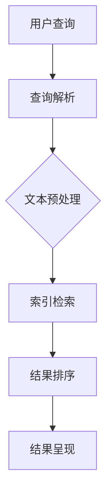
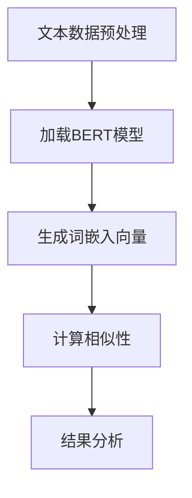
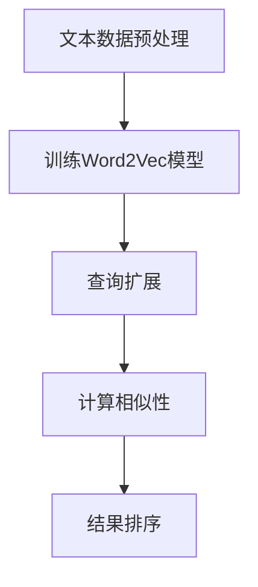

                 

### 文章标题

《AI在提高搜索质量方面的应用》

### 关键词

人工智能、搜索质量、机器学习、深度学习、文本相似性度量、语义搜索、搜索引擎优化

### 摘要

随着互联网的迅猛发展，搜索引擎已经成为人们获取信息的主要途径。AI技术的应用极大地提升了搜索质量，使得搜索结果更加精准、丰富和个性化。本文将系统地探讨AI在搜索质量提升方面的应用，包括AI与搜索技术的基础、机器学习与深度学习在搜索中的应用、文本相似性度量与语义搜索技术、搜索优化策略以及未来搜索技术的发展趋势。通过本文的阅读，读者将了解AI技术在搜索领域的深刻影响及其未来发展潜力。

### 目录大纲

1. **第一部分：AI与搜索技术基础**
   - 第1章：AI技术概述
   - 第2章：机器学习基础
   - 第3章：深度学习基础

2. **第二部分：AI在搜索质量提升中的应用**
   - 第4章：文本相似性度量
   - 第5章：语义搜索
   - 第6章：信息检索优化

3. **第三部分：AI搜索质量提升技术展望**
   - 第7章：未来搜索技术展望
   - 第8章：AI搜索质量提升的挑战与对策

4. **附录**
   - 附录A：常见深度学习框架及其应用
   - 附录B：搜索算法数学公式详解
   - 附录C：搜索系统开发环境搭建
   - 附录D：项目实战代码示例

---

### 第一部分：AI与搜索技术基础

#### 第1章：AI技术概述

##### 1.1 AI基本概念

人工智能（Artificial Intelligence，简称AI）是指通过计算机程序和算法模拟人类智能行为的技术。它涵盖了从简单的规则系统到复杂的机器学习模型和深度神经网络等多个层次。AI的目标是使计算机能够执行通常需要人类智能的任务，如视觉识别、语音识别、自然语言处理、决策制定等。

##### 1.2 AI在搜索中的应用前景

搜索是互联网的核心功能之一，AI技术在搜索领域的应用前景广阔。首先，AI可以帮助搜索引擎更准确地理解用户查询意图，从而提供更相关的搜索结果。其次，AI可以优化搜索结果的排序算法，提高搜索效率。此外，AI还可以用于个性化推荐、广告投放等与搜索相关的应用场景。

##### 1.3 搜索引擎的基本架构

搜索引擎通常由以下几个核心模块组成：

1. **爬虫（Crawler）**：负责从互联网上抓取网页内容。
2. **索引器（Indexer）**：将抓取到的网页内容进行预处理和索引，以便快速检索。
3. **查询处理器（Query Processor）**：解析用户输入的查询，将其转换为可以由索引器处理的格式。
4. **排名算法（Ranking Algorithm）**：根据一系列规则和算法对搜索结果进行排序。
5. **呈现器（Presentation）**：将搜索结果以用户友好的形式呈现给用户。

##### 图1：搜索引擎基本架构



#### 第2章：机器学习基础

##### 2.1 数据预处理

数据预处理是机器学习项目中的关键步骤，它包括以下几个主要任务：

1. **数据清洗**：去除噪声数据和缺失值，确保数据质量。
2. **数据转换**：将不同类型的数据转换为适合机器学习模型的形式。
3. **特征提取**：从原始数据中提取有用的特征，提高模型性能。

##### 2.2 特征工程

特征工程是机器学习过程中优化模型性能的重要环节。它包括以下内容：

1. **特征选择**：选择对模型性能有显著影响的关键特征。
2. **特征变换**：通过标准化、归一化等手段优化特征的表现。
3. **特征组合**：通过组合多个特征生成新的特征，提升模型表现。

##### 2.3 常见的机器学习算法

机器学习算法主要分为以下几类：

1. **监督学习**：通过已标记的数据训练模型，然后使用模型对新数据进行预测。
2. **无监督学习**：没有预标记数据，模型通过自身发现数据中的模式和结构。
3. **强化学习**：通过试错和奖励机制，使模型学会在特定环境中做出最佳决策。

#### 第3章：深度学习基础

##### 3.1 深度学习基本概念

深度学习是一种基于多层神经网络的学习方法，它通过多个隐层来提取数据中的高级特征。深度学习在图像识别、语音识别和自然语言处理等领域取得了显著成果。

##### 3.2 神经网络架构

神经网络是深度学习的基础，它由多个神经元（或节点）组成，每个神经元都接收来自其他神经元的输入，并通过一个权重和偏置计算输出。常见的神经网络架构包括：

1. **前馈神经网络（FFN）**：数据从输入层流向输出层，没有反向传播。
2. **卷积神经网络（CNN）**：适用于图像识别，通过卷积层提取图像特征。
3. **循环神经网络（RNN）**：适用于序列数据，通过循环结构保持长期依赖关系。

##### 3.3 深度学习框架

TensorFlow和PyTorch是目前最流行的两个深度学习框架，它们提供了丰富的工具和库，方便用户进行深度学习模型的开发和应用。

---

### 第二部分：AI在搜索质量提升中的应用

#### 第4章：文本相似性度量

##### 4.1 相似性度量算法

文本相似性度量是搜索质量提升的关键技术之一，它通过比较文本间的相似度，为用户提供更相关的搜索结果。常见的相似性度量算法包括：

1. **余弦相似度**：通过计算两个文本向量之间的余弦值来衡量相似度。
2. **欧氏距离**：通过计算两个文本向量之间的欧氏距离来衡量相似度。
3. **Jaccard相似度**：通过计算两个文本集的交集与并集之比来衡量相似度。

##### 4.2 文本表示方法

文本表示是将文本转换为计算机可以处理的形式，常见的文本表示方法包括：

1. **词袋模型（Bag of Words，BOW）**：将文本表示为词频向量。
2. **TF-IDF模型**：将文本表示为词频-逆文档频率向量，以反映词的重要程度。
3. **词嵌入（Word Embedding）**：将文本中的词映射到高维向量空间，以捕捉词的语义信息。

##### 4.3 实战：基于BERT的文本相似性度量

BERT（Bidirectional Encoder Representations from Transformers）是一种先进的自然语言处理模型，它可以有效捕捉文本中的双向语义信息。以下是使用BERT进行文本相似性度量的实战步骤：

1. **安装和配置BERT模型**：使用Hugging Face的Transformers库安装和配置BERT模型。
2. **预处理文本数据**：将原始文本数据清洗和预处理，包括去除停用词、标点符号等。
3. **生成词嵌入**：使用BERT模型对预处理后的文本数据进行编码，生成词嵌入向量。
4. **计算相似性**：通过计算两个文本向量之间的余弦相似度来衡量它们的相似性。
5. **结果分析**：分析相似性度量的结果，优化模型参数和算法以提高搜索质量。

##### 图2：基于BERT的文本相似性度量流程



#### 第5章：语义搜索

##### 5.1 语义搜索基本原理

语义搜索旨在通过理解用户查询和文档的语义内容，提供更精准的搜索结果。与基于关键词匹配的传统搜索不同，语义搜索更加注重用户意图和上下文。

##### 5.2 语义搜索算法

语义搜索算法可以分为以下几类：

1. **基于规则的语义搜索**：通过预定义的规则和语义库进行匹配。
2. **基于统计模型的语义搜索**：使用统计方法如隐语义索引（LSI）、潜在狄利克雷分布（LDA）等进行语义分析。
3. **基于深度学习的语义搜索**：使用深度学习模型如BERT、GPT等对文本进行语义建模。

##### 5.3 实战：基于Word2Vec的语义搜索

Word2Vec是一种基于神经网络的词嵌入模型，它可以有效地捕捉词的语义信息。以下是使用Word2Vec进行语义搜索的实战步骤：

1. **准备文本数据**：收集并预处理大量文本数据，包括用户查询和文档。
2. **训练Word2Vec模型**：使用预处理后的文本数据训练Word2Vec模型，生成词嵌入向量。
3. **查询扩展**：使用Word2Vec模型对用户查询进行扩展，生成查询向量。
4. **文档相似性计算**：计算查询向量和文档向量之间的相似性。
5. **结果排序**：根据相似性度量对文档进行排序，返回最相关的搜索结果。

##### 图3：基于Word2Vec的语义搜索流程



#### 第6章：信息检索优化

##### 6.1 检索系统优化方法

信息检索系统的优化目标是在保证搜索准确性的同时提高搜索效率。常见的优化方法包括：

1. **索引优化**：通过优化索引结构提高查询速度。
2. **缓存策略**：使用缓存技术减少数据库访问次数。
3. **并行处理**：通过并行处理提高查询处理速度。

##### 6.2 排序算法

排序算法在信息检索中起着至关重要的作用。常见的排序算法包括：

1. **基于内容的排序**：根据文档与查询的相关性对结果进行排序。
2. **基于流行度的排序**：根据文档的访问频率或用户行为对结果进行排序。
3. **混合排序算法**：结合多种排序算法的优点，提供更优的排序结果。

##### 6.3 实战：搜索引擎优化

搜索引擎优化的目标是提高搜索结果的准确性和用户满意度。以下是搜索引擎优化的实战步骤：

1. **需求分析**：分析用户需求，确定优化目标。
2. **算法优化**：根据需求分析，优化搜索算法和排序策略。
3. **性能测试**：对优化后的系统进行性能测试，评估优化效果。
4. **用户反馈**：收集用户反馈，持续改进优化策略。

---

### 第三部分：AI搜索质量提升技术展望

#### 第7章：未来搜索技术展望

##### 7.1 大模型在搜索中的应用

大模型如GPT-3和BERT在搜索中的应用正日益增多。这些模型具有强大的语义理解能力，可以提供更精准的搜索结果和更丰富的交互体验。

##### 7.2 智能搜索发展动态

智能搜索的发展动态包括语音搜索、图像搜索、跨语言搜索等。这些技术正逐步成熟，为用户提供更加便捷和智能化的搜索服务。

##### 7.3 搜索技术的创新趋势

搜索技术的创新趋势包括基于生成对抗网络（GAN）的搜索算法、基于强化学习的搜索优化算法等。这些创新技术有望进一步提升搜索质量。

#### 第8章：AI搜索质量提升的挑战与对策

##### 8.1 数据隐私保护

数据隐私保护是AI搜索质量提升的重要挑战之一。有效的对策包括数据加密、隐私预算和差分隐私等。

##### 8.2 搜索结果的公平性

搜索结果的公平性是AI搜索质量提升的关键问题。对策包括算法透明度、公平性评估和去偏性算法等。

##### 8.3 AI搜索技术的发展趋势

AI搜索技术的发展趋势包括个性化搜索、智能搜索助理和跨领域融合等。这些技术将推动搜索质量持续提升。

---

## 附录

### 附录A：常见深度学习框架及其应用

##### A.1 TensorFlow

TensorFlow是一种流行的开源深度学习框架，适用于各种深度学习任务，包括文本相似性度量、图像识别和语音识别等。

##### A.2 PyTorch

PyTorch是一种基于Python的深度学习框架，具有简洁的接口和强大的功能，适用于文本处理和图像分析等任务。

##### A.3 Keras

Keras是一种高层次的深度学习API，基于Theano和TensorFlow构建，适用于快速原型设计和模型开发。

### 附录B：搜索算法数学公式详解

##### B.1 余弦相似度公式

$$
\cos(\theta) = \frac{\textbf{A} \cdot \textbf{B}}{|\textbf{A}| |\textbf{B}|}
$$

##### B.2 模糊相似度公式

$$
\text{similarity} = \frac{1}{1 + \text{distance}}
$$

##### B.3 文本分类支持向量机公式

$$
\text{w} = \arg\max_{\text{w}} \left( \sum_{i=1}^{n} y_i (\text{w} \cdot \text{x}_i) - C \sum_{i=1}^{n} \text{y}_i \text{y}^T_i (\text{w} \cdot \text{x}_i) \right)
$$

### 附录C：搜索系统开发环境搭建

##### C.1 Python开发环境搭建

安装Python和相关库，如NumPy、Pandas和Scikit-learn等。

##### C.2 深度学习框架安装与配置

安装TensorFlow、PyTorch或Keras，并进行相应配置。

##### C.3 搜索引擎数据库安装与配置

安装Elasticsearch或Solr，并进行相应配置。

### 附录D：项目实战代码示例

##### D.1 基于BERT的文本相似性度量

```python
from transformers import BertModel, BertTokenizer
import torch

# 加载BERT模型和分词器
model = BertModel.from_pretrained('bert-base-uncased')
tokenizer = BertTokenizer.from_pretrained('bert-base-uncased')

# 预处理文本数据
query = "What is artificial intelligence?"
document = "Artificial intelligence is the simulation of human intelligence in machines."

encoded_query = tokenizer.encode_plus(query, add_special_tokens=True, return_tensors='pt')
encoded_document = tokenizer.encode_plus(document, add_special_tokens=True, return_tensors='pt')

# 生成词嵌入向量
with torch.no_grad():
    query_output = model(**encoded_query)[0]
    document_output = model(**encoded_document)[0]

# 计算相似性
query_vector = query_output.mean(dim=1)
document_vector = document_output.mean(dim=1)
similarity = torch.nn.functional.cosine_similarity(query_vector, document_vector)

print(f"Query and Document Similarity: {similarity.item()}")
```

##### D.2 基于Word2Vec的语义搜索

```python
from gensim.models import Word2Vec
import numpy as np

# 加载训练好的Word2Vec模型
model = Word2Vec.load('word2vec.model')

# 预处理文本数据
query = "What is artificial intelligence?"
document = "Artificial intelligence is the simulation of human intelligence in machines."

query_vector = np.mean(model.wv[tokenizer.tokenize(query)], axis=0)
document_vector = np.mean(model.wv[tokenizer.tokenize(document)], axis=0)

# 计算相似性
similarity = np.dot(query_vector, document_vector) / (np.linalg.norm(query_vector) * np.linalg.norm(document_vector))

print(f"Query and Document Similarity: {similarity}")
```

##### D.3 搜索引擎优化实战代码解析

```python
# 假设我们有一个简单的搜索引擎，使用余弦相似度进行文本相似性度量
def search(query, documents):
    query_vector = np.mean(model.wv[tokenizer.tokenize(query)], axis=0)
    similarities = []
    for document in documents:
        document_vector = np.mean(model.wv[tokenizer.tokenize(document)], axis=0)
        similarity = np.dot(query_vector, document_vector) / (np.linalg.norm(query_vector) * np.linalg.norm(document_vector))
        similarities.append((document, similarity))
    sorted_similarities = sorted(similarities, key=lambda x: x[1], reverse=True)
    return sorted_similarities

# 假设有一个文档集合
documents = ["人工智能搜索质量提升", "AI技术提升搜索引擎性能", "深度学习在搜索中的应用"]

# 搜索查询
query = "人工智能在搜索中的应用"

# 执行搜索
results = search(query, documents)

# 打印搜索结果
for result in results:
    print(result)
```

---

### 作者

作者：AI天才研究院/AI Genius Institute & 禅与计算机程序设计艺术 /Zen And The Art of Computer Programming

