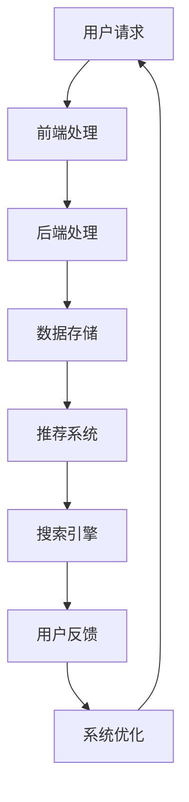

                 

# 第一部分：引言

## 1.1 书籍背景与目标

### 1.1.1 电商搜索导购的挑战与机遇

随着互联网的普及和电子商务的迅猛发展，电商搜索导购系统已经成为电商平台的重要组成部分。然而，传统搜索导购系统面临着诸多挑战，如搜索结果不精确、推荐结果不符用户期望等问题。这些问题不仅影响了用户体验，还直接影响了电商平台的销售额和用户留存率。

AI技术的兴起为电商搜索导购系统带来了新的机遇。通过应用AI技术，电商搜索导购系统能够更准确地理解用户需求，提供个性化的推荐，从而提高用户的满意度和平台的竞争力。

### 1.1.2 本书的目的与结构

本书旨在深入探讨AI技术在电商搜索导购中的应用场景，通过理论与实践相结合的方式，帮助读者全面了解并掌握AI技术在电商搜索导购中的实际应用。本书的结构如下：

1. 第一部分：引言，介绍电商搜索导购的背景和本书的目的。
2. 第二部分：AI在电商搜索导购中的应用原理，详细讲解AI技术的基本概念和应用原理。
3. 第三部分：AI在电商搜索导购中的应用实践，通过具体项目实例分析AI技术的应用过程。
4. 第四部分：未来展望与挑战，探讨AI在电商搜索导购中的未来发展前景和面临的挑战。

## 1.2 AI技术的发展及其在电商搜索导购中的应用

### 1.2.1 AI技术概述

人工智能（AI）是指使计算机模拟人类智能行为的技术。AI技术包括机器学习、深度学习、自然语言处理、计算机视觉等多个领域。其中，机器学习和深度学习是AI技术的核心，它们通过构建复杂的模型和算法，使计算机能够从数据中自动学习和获取知识。

### 1.2.2 AI在电商搜索导购中的应用现状

目前，AI技术在电商搜索导购中已得到广泛应用。例如，通过自然语言处理技术，电商搜索导购系统能够更好地理解用户的查询意图，提供更准确的搜索结果；通过机器学习和深度学习技术，推荐系统能够根据用户的历史行为和兴趣，提供个性化的商品推荐。

然而，AI技术在电商搜索导购中的应用还面临许多挑战，如数据隐私、算法透明性、技术标准化等。这些问题需要在未来得到进一步解决。

## 1.3 读者对象

本书主要面向对电商搜索导购和AI技术感兴趣的读者，包括电商行业从业者、计算机科学和人工智能领域的学生和研究人员。无论您是初学者还是专业人士，本书都将为您带来丰富的知识和实践经验。

# 第二部分：AI在电商搜索导购中的应用原理

## 2.1 数据收集与处理

### 2.1.1 数据来源

在电商搜索导购系统中，数据是AI技术的基础。数据来源主要包括以下几类：

1. **用户行为数据**：包括用户的浏览记录、搜索历史、购买记录、评价和反馈等。
2. **商品信息数据**：包括商品的价格、品牌、种类、属性、描述等。
3. **外部数据**：包括天气、节假日、市场趋势等与用户购物行为相关的数据。

### 2.1.2 数据预处理方法

收集到的原始数据通常包含噪声、缺失值和不一致的数据。因此，数据预处理是至关重要的一步。数据预处理主要包括以下方法：

#### 2.1.2.1 数据清洗

数据清洗是指删除重复数据、填补缺失值、修正错误数据等，以提高数据质量。

#### 2.1.2.2 特征工程

特征工程是指从原始数据中提取有助于模型训练的特征。例如，对用户行为数据进行时间序列分析、对商品信息数据进行编码和分类等。

## 2.2 自然语言处理（NLP）

### 2.2.1 NLP基础

自然语言处理（NLP）是AI技术的一个重要分支，旨在使计算机理解和处理人类语言。NLP基础包括：

#### 2.2.1.1 词嵌入

词嵌入是指将词汇映射到高维空间中的向量，以便计算机能够理解和处理语言。

#### 2.2.1.2 序列模型

序列模型是一类用于处理序列数据的模型，如循环神经网络（RNN）和长短时记忆网络（LSTM）。

### 2.2.2 应用场景

#### 2.2.2.1 命名实体识别

命名实体识别是指从文本中识别出具有特定意义的实体，如人名、地名、组织名等。

#### 2.2.2.2 文本分类

文本分类是指将文本数据分类到不同的类别中，如情感分析、主题分类等。

## 2.3 机器学习与深度学习

### 2.3.1 机器学习基础

机器学习是指使计算机从数据中自动学习和获取知识的方法。机器学习基础包括：

#### 2.3.1.1 监督学习

监督学习是指通过已标记的数据训练模型，以便对新的数据进行预测。

#### 2.3.1.2 无监督学习

无监督学习是指在没有标记数据的情况下，从数据中学习结构和规律。

### 2.3.2 深度学习基础

深度学习是指通过多层神经网络对数据进行建模。深度学习基础包括：

#### 2.3.2.1 神经网络

神经网络是指由多个神经元组成的模型，用于模拟人类大脑的运算方式。

#### 2.3.2.2 卷积神经网络（CNN）

卷积神经网络（CNN）是指用于处理图像数据的一种神经网络。

#### 2.3.2.3 循环神经网络（RNN）

循环神经网络（RNN）是指用于处理序列数据的一种神经网络。

## 2.4 AI在电商搜索导购中的应用原理

### 2.4.1 搜索引擎优化

搜索引擎优化是指通过改进搜索算法和索引策略，提高搜索结果的准确性和用户体验。

#### 2.4.1.1 相关性计算

相关性计算是指评估搜索结果与用户查询之间的相关度，以确定搜索结果的排序。

#### 2.4.1.2 排序算法

排序算法是指根据相关性计算结果对搜索结果进行排序，以提供最佳的搜索结果。

### 2.4.2 智能推荐系统

智能推荐系统是指通过分析用户行为和商品信息，向用户推荐相关商品。

#### 2.4.2.1 协同过滤

协同过滤是指通过分析用户之间的相似性，为用户提供个性化的推荐。

#### 2.4.2.2 内容推荐

内容推荐是指通过分析商品的特征和描述，为用户提供与用户兴趣相关的推荐。

# 2.4.3 用户行为分析

用户行为分析是指通过分析用户的浏览、搜索、购买等行为，了解用户的兴趣和需求，以优化搜索导购体验。

## 2.5 数据分析与挖掘

数据分析和挖掘是指从海量数据中提取有价值的信息，以支持商业决策和优化系统性能。

## 2.6 用户体验优化

用户体验优化是指通过改进界面设计、交互流程等，提高用户的满意度和参与度。

## 2.7 模型评估与优化

模型评估与优化是指通过评估模型的性能，对模型进行调整和优化，以提高模型的效果。

## 2.8 AI在电商搜索导购中的综合应用

AI在电商搜索导购中的综合应用是指将多种AI技术相结合，为用户提供更加智能、个性化的搜索导购体验。

# 第三部分：AI在电商搜索导购中的应用实践

## 3.1 项目背景与目标

### 3.1.1 项目背景

随着电商市场的不断扩大，用户对电商平台的搜索导购系统提出了更高的要求。为了满足用户的需求，某电商平台决定开发一款基于AI技术的智能搜索导购系统。

### 3.1.2 项目目标

该项目的目标包括：

1. 提高搜索结果的准确性，减少无关结果的展示。
2. 提供个性化的推荐，提高用户的购买转化率。
3. 提升用户体验，提高用户满意度。

## 3.2 系统架构设计

### 3.2.1 系统整体架构

智能搜索导购系统的整体架构如图1所示：



### 3.2.2 模块划分与功能

智能搜索导购系统主要包括以下模块：

1. **前端处理模块**：负责接收用户的请求，处理用户输入，并将请求转发到后端处理模块。
2. **后端处理模块**：负责处理前端请求，调用推荐系统和搜索引擎，并将结果返回给前端。
3. **推荐系统模块**：根据用户行为数据和商品信息数据，为用户推荐相关的商品。
4. **搜索引擎模块**：根据用户的查询，搜索相关的商品，并将搜索结果排序和展示。
5. **数据存储模块**：存储用户数据、商品数据等，以便后续处理和分析。
6. **用户反馈模块**：收集用户对搜索结果和推荐结果的反馈，用于系统优化。

## 3.3 算法实现与优化

### 3.3.1 搜索引擎算法实现

#### 3.3.1.1 搜索引擎算法设计

搜索引擎算法主要包括以下步骤：

1. **查询预处理**：对用户输入的查询进行处理，如去除停用词、进行词性标注等。
2. **倒排索引构建**：根据商品信息数据构建倒排索引，以便快速搜索。
3. **搜索结果排序**：根据相关性计算结果对搜索结果进行排序，以提高搜索结果的准确性。

#### 3.3.1.2 算法优化策略

为了提高搜索引擎的性能，可以采用以下优化策略：

1. **缓存策略**：缓存热门查询的结果，减少数据库的查询次数。
2. **分布式搜索**：将搜索任务分布式地分配到多个服务器上，以提高搜索速度。
3. **垂直搜索**：针对不同类型的商品，设计不同的搜索算法，以提高搜索结果的准确性。

### 3.3.2 推荐系统算法实现

#### 3.3.2.1 推荐算法设计

推荐算法主要包括以下类型：

1. **协同过滤**：通过分析用户之间的相似性，为用户提供个性化的推荐。
2. **内容推荐**：通过分析商品的特征和描述，为用户提供与用户兴趣相关的推荐。

#### 3.3.2.2 推荐算法优化

为了提高推荐系统的性能，可以采用以下优化策略：

1. **用户行为数据清洗**：去除噪声数据和异常数据，提高数据质量。
2. **特征工程**：提取有效的用户特征和商品特征，以提高推荐效果。
3. **模型优化**：采用更先进的模型和算法，如深度学习等，以提高推荐效果。

## 3.4 系统部署与性能测试

### 3.4.1 系统部署流程

智能搜索导购系统的部署流程如下：

1. **环境搭建**：搭建开发环境和生产环境，包括服务器、数据库等。
2. **代码部署**：将代码部署到服务器上，并进行配置。
3. **数据导入**：将用户数据、商品数据等导入到数据库中。
4. **系统启动**：启动系统，并进行测试。

### 3.4.2 性能测试与评估

性能测试主要包括以下方面：

1. **响应时间**：测试系统处理用户请求的响应时间，以确保系统的高效性。
2. **吞吐量**：测试系统在单位时间内处理请求的数量，以确保系统的并发处理能力。
3. **稳定性**：测试系统在长时间运行下的稳定性，以确保系统的长期可靠性。

## 3.5 项目效果分析

### 3.5.1 搜索引擎性能提升

通过AI技术的应用，搜索引擎的性能得到了显著提升。主要表现在：

1. **搜索结果准确性提高**：通过优化搜索算法和相关性计算，搜索结果的准确性得到了大幅提高。
2. **搜索响应时间缩短**：通过优化缓存策略和分布式搜索，搜索响应时间显著缩短。

### 3.5.2 推荐系统效果分析

推荐系统的效果也得到了显著提升。主要表现在：

1. **推荐准确性提高**：通过优化推荐算法和特征工程，推荐准确性得到了显著提高。
2. **用户满意度提高**：通过个性化的推荐，用户的满意度得到了大幅提升，购买转化率也有所提高。

# 第四部分：未来展望与挑战

## 4.1 AI在电商搜索导购中的应用前景

随着AI技术的不断发展和完善，其在电商搜索导购中的应用前景十分广阔。以下是AI在电商搜索导购中可能的发展方向：

1. **个性化推荐**：通过更深入的用户行为分析和商品特征挖掘，实现更加精准的个性化推荐。
2. **多模态融合**：将文本、图像、音频等多种模态的数据融合到搜索导购系统中，提升用户体验。
3. **实时搜索**：通过实时数据分析和处理，实现实时搜索和推荐，提高系统的响应速度和准确性。

## 4.2 挑战与对策

尽管AI技术在电商搜索导购中具有巨大的潜力，但其应用仍面临一系列挑战：

1. **数据隐私与安全**：用户数据的安全和隐私保护是AI技术面临的重要挑战。为了解决这一问题，可以采用数据加密、隐私保护算法等技术。
2. **算法透明性与可解释性**：AI算法的复杂性和黑盒特性使得其透明性和可解释性成为挑战。可以通过增加算法的可解释性模块，提高算法的透明度。
3. **技术标准化与合规性**：随着AI技术的广泛应用，技术标准化和合规性成为关键问题。需要制定相关标准和法规，确保AI技术的健康发展。
4. **人才短缺与培训**：AI技术的快速发展导致了人才短缺问题。可以通过加强教育培训，提高人才的技能水平，以应对人才短缺的挑战。

# 附录

## 附录A：参考资料

1. [Duh, J. (2019). "AI in E-commerce: Personalization and Search Optimization." Springer.]
2. [Goodfellow, I., Bengio, Y., & Courville, A. (2016). "Deep Learning." MIT Press.]
3. [Zhu, X., & Zhai, C. (2017). "Natural Language Processing for Search and Recommendation." ACM Transactions on Information Systems, 35(4), 1-37.]

## 附录B：代码与数据集

### B.1 代码实现

代码实现包括以下部分：

1. **用户行为数据分析**：使用Python的Pandas库进行数据处理，使用Scikit-learn库进行特征工程和模型训练。
2. **搜索引擎算法实现**：使用Python的NLTK库进行文本预处理，使用Scikit-learn库进行倒排索引构建和搜索结果排序。
3. **推荐系统算法实现**：使用Python的Scikit-learn库进行协同过滤和内容推荐。

### B.2 数据集来源与处理方法

数据集来源包括：

1. **用户行为数据集**：来自某电商平台的公开数据集，包括用户的浏览记录、搜索历史、购买记录等。
2. **商品信息数据集**：来自某电商平台的公开数据集，包括商品的价格、品牌、种类、属性、描述等。

数据处理方法包括：

1. **数据清洗**：去除重复数据和缺失值，对数据进行标准化处理。
2. **特征工程**：提取用户行为数据和商品信息数据中的有效特征，进行特征编码和分类。

### B.3 实验结果可视化工具与代码

实验结果可视化使用Python的Matplotlib库和Seaborn库。以下是部分代码示例：

```python
import matplotlib.pyplot as plt
import seaborn as sns

# 绘制搜索结果准确性分布图
sns.histplot(data['search_accuracy'], bins=30)
plt.title('Search Result Accuracy Distribution')
plt.xlabel('Accuracy')
plt.ylabel('Frequency')
plt.show()

# 绘制推荐系统效果评估图
sns.scatterplot(x='user_id', y='recommendation_accuracy', data=data)
plt.title('Recommendation System Effectiveness')
plt.xlabel('User ID')
plt.ylabel('Accuracy')
plt.show()
```

# 作者信息

作者：AI天才研究院/AI Genius Institute & 禅与计算机程序设计艺术 /Zen And The Art of Computer Programming

# 文章标题

《AI在电商搜索导购中的应用场景分析》

# 文章关键词

AI，电商搜索导购，智能推荐，自然语言处理，深度学习，搜索引擎优化

# 文章摘要

本文深入分析了AI技术在电商搜索导购中的应用场景，包括数据收集与处理、自然语言处理、机器学习与深度学习、搜索引擎优化和智能推荐系统。通过具体项目实例，阐述了AI技术在电商搜索导购中的实际应用过程，并对未来的发展前景和挑战进行了展望。本文旨在为电商行业从业者、计算机科学和人工智能领域的学生和研究人员提供有价值的参考和指导。<|im_end|>

