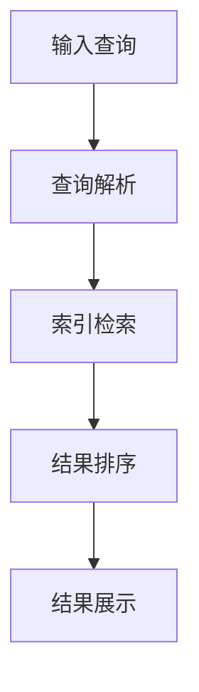
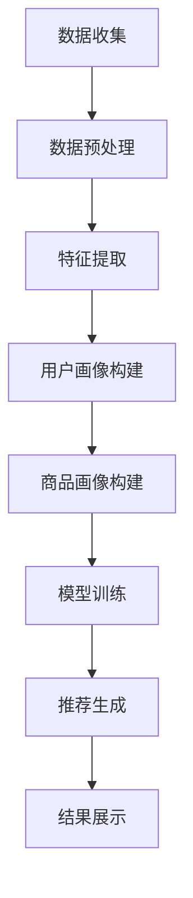
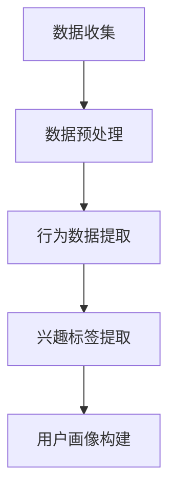
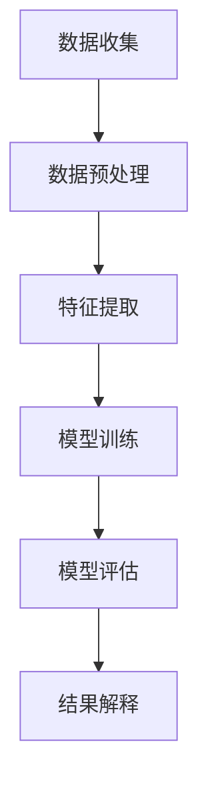

                 

### 《AI在电商搜索导购中的应用：从智能搜索到个性化推荐》

#### 关键词：
- 人工智能
- 电商搜索导购
- 智能搜索
- 个性化推荐
- 用户画像
- 数据挖掘

#### 摘要：
随着电子商务的蓬勃发展，AI技术在电商搜索导购中的应用变得越来越重要。本文将深入探讨AI在电商搜索导购中的应用，从智能搜索到个性化推荐，再到用户画像与数据挖掘。我们将详细分析这些技术的核心概念、原理、实现方法及实际应用案例，探讨AI技术如何推动电商搜索导购的革新，并为未来的发展提供洞见。

### 第一部分：AI在电商搜索导购中的应用概述

#### 1.1 AI在电商行业中的应用背景

##### 1.1.1 电商行业的发展与挑战

电商行业近年来经历了迅猛发展，随着互联网技术的普及和消费升级，越来越多的消费者倾向于在线购物。然而，伴随着市场的扩大和竞争的加剧，电商企业面临着一系列挑战。如何提升用户体验，提高搜索效率和推荐质量，成为电商企业关注的焦点。

##### 1.1.2 AI技术对电商搜索导购的影响

AI技术的快速发展为电商搜索导购带来了新的机遇。通过智能搜索和个性化推荐，AI技术能够提高用户的购物体验，帮助用户快速找到所需商品，提升转化率和用户满意度。

##### 1.1.3 AI在电商搜索导购中的应用前景

随着AI技术的不断成熟，其在电商搜索导购中的应用前景十分广阔。未来，AI技术将更加深入地融入电商业务，实现更智能、更高效的搜索和推荐，进一步提升用户体验和商业价值。

#### 1.2 AI在电商搜索导购中的核心概念

##### 1.2.1 智能搜索

智能搜索是AI技术在电商搜索导购中的基础应用，通过自然语言处理和机器学习技术，实现更精准、更快速的搜索结果。

##### 1.2.2 个性化推荐

个性化推荐是基于用户行为和兴趣，为用户提供定制化的商品推荐服务。通过深度学习算法和用户画像技术，实现更精准的推荐。

##### 1.2.3 用户画像

用户画像是对用户行为和兴趣的数据化描述，通过数据挖掘和分析技术，构建用户的全面画像，为智能搜索和个性化推荐提供基础。

#### 1.3 主流AI技术在电商搜索导购中的应用

##### 1.3.1 自然语言处理

自然语言处理（NLP）是AI技术在电商搜索导购中的重要应用。通过NLP技术，可以实现对用户查询语句的理解和解析，提供更准确的搜索结果。

##### 1.3.2 机器学习与深度学习

机器学习和深度学习技术是AI技术的核心，广泛应用于电商搜索导购中的智能搜索和个性化推荐。通过训练大规模的模型，实现更高效、更精准的搜索和推荐。

##### 1.3.3 数据挖掘

数据挖掘是AI技术在电商搜索导购中的基础，通过对海量用户数据的分析，提取有价值的信息，为智能搜索和个性化推荐提供支持。

### 第二部分：智能搜索技术

#### 2.1 智能搜索的基本原理

##### 2.1.1 搜索引擎工作原理

搜索引擎是智能搜索的核心，其工作原理主要包括网页抓取、索引构建和搜索排名。

1. 网页抓取：通过爬虫技术获取互联网上的网页信息。
2. 索引构建：将抓取到的网页信息进行结构化处理，构建索引数据库。
3. 搜索排名：根据用户的查询，从索引数据库中检索相关网页，并按相关性进行排序。

##### 2.1.2 智能搜索的关键技术

智能搜索的关键技术主要包括自然语言处理和机器学习。

1. 自然语言处理：实现对用户查询语句的理解和解析，提取关键信息。
2. 机器学习：通过训练大规模的模型，提高搜索结果的准确性和相关性。

##### 2.1.3 智能搜索算法案例分析

以百度搜索引擎为例，其智能搜索算法主要包括以下几个步骤：

1. 查询解析：将用户的查询语句转化为索引数据库可以理解的形式。
2. 相关性计算：计算查询与索引中每个网页的相关性，并按相关性排序。
3. 结果展示：将排序后的网页结果展示给用户。

#### 2.2 智能搜索的实现

##### 2.2.1 智能搜索系统的设计与开发

智能搜索系统的设计与开发主要包括以下几个环节：

1. 需求分析：明确智能搜索系统的功能需求和性能指标。
2. 技术选型：选择合适的自然语言处理和机器学习技术。
3. 系统架构设计：设计智能搜索系统的总体架构，包括爬虫、索引、查询处理等模块。
4. 系统实现：根据系统架构设计，实现各个模块的功能。
5. 系统优化：通过调参和优化算法，提高搜索结果的准确性和相关性。

##### 2.2.2 智能搜索系统的优化与调参

智能搜索系统的优化与调参主要包括以下几个方面：

1. 查询解析优化：通过改进查询解析算法，提高对用户查询的理解能力。
2. 相关性计算优化：通过调整相关性计算公式，提高搜索结果的准确性。
3. 索引优化：通过改进索引构建算法，提高索引的检索速度和准确性。
4. 模型调参：通过调整机器学习模型的参数，提高模型的性能。

##### 2.2.3 实际案例分析

以某电商平台的智能搜索系统为例，其实现过程主要包括以下几个步骤：

1. 需求分析：明确智能搜索系统的功能需求，包括精准搜索、智能纠错、同义替换等。
2. 技术选型：选择NLP和深度学习技术，构建智能搜索系统。
3. 系统架构设计：设计智能搜索系统的整体架构，包括爬虫、索引、查询处理、模型训练等模块。
4. 系统实现：根据系统架构设计，实现各个模块的功能，并进行集成测试。
5. 系统优化：通过调参和优化算法，提高搜索结果的准确性和相关性。

#### 2.3 智能搜索的挑战与未来发展

##### 2.3.1 智能搜索的挑战

智能搜索在电商搜索导购中面临着一系列挑战，主要包括：

1. 数据质量：搜索引擎需要处理海量、多样化的数据，数据质量直接影响搜索结果的质量。
2. 查询理解：用户查询语句的多样性和复杂性，给查询理解带来了挑战。
3. 算法优化：如何通过算法优化，提高搜索结果的准确性和相关性，是智能搜索的重要研究方向。

##### 2.3.2 未来的发展趋势

未来，智能搜索在电商搜索导购中将继续发展，主要趋势包括：

1. 智能化：通过更先进的算法和模型，实现更智能的查询理解和分析。
2. 个性化：结合用户画像和个性化推荐技术，为用户提供更个性化的搜索结果。
3. 模式融合：将多种搜索模式融合，提供更灵活、更高效的搜索服务。

### 第三部分：个性化推荐技术

#### 3.1 个性化推荐的基本原理

##### 3.1.1 推荐系统的工作原理

推荐系统是电商搜索导购中的重要组成部分，其工作原理主要包括：

1. 数据收集：收集用户行为数据，如浏览记录、购买记录、评价等。
2. 数据处理：对收集到的数据进行预处理，包括去重、清洗、编码等。
3. 特征提取：从用户行为数据中提取特征，用于构建用户画像和商品画像。
4. 模型训练：使用机器学习算法，训练用户画像和商品画像，构建推荐模型。
5. 推荐生成：根据用户画像和商品画像，生成个性化的推荐列表。

##### 3.1.2 个性化推荐的关键技术

个性化推荐的关键技术主要包括：

1. 协同过滤：通过分析用户之间的相似度，为用户提供相似用户喜欢的商品推荐。
2. 内容推荐：根据商品的属性和标签，为用户提供相关的商品推荐。
3. 深度学习：使用深度学习算法，构建复杂的推荐模型，提高推荐质量。

##### 3.1.3 个性化推荐算法案例分析

以淘宝的个性化推荐算法为例，其主要包括以下几个步骤：

1. 用户画像构建：通过用户的浏览记录、购买记录等数据，构建用户画像。
2. 商品画像构建：通过商品的属性、标签等数据，构建商品画像。
3. 模型训练：使用深度学习算法，训练用户画像和商品画像，构建推荐模型。
4. 推荐生成：根据用户画像和商品画像，生成个性化的推荐列表。

#### 3.2 个性化推荐系统的实现

##### 3.2.1 个性化推荐系统的设计与开发

个性化推荐系统的设计与开发主要包括以下几个环节：

1. 需求分析：明确个性化推荐系统的功能需求，包括推荐准确度、响应速度等。
2. 技术选型：选择合适的协同过滤、内容推荐和深度学习技术。
3. 系统架构设计：设计个性化推荐系统的整体架构，包括数据收集、数据处理、特征提取、模型训练、推荐生成等模块。
4. 系统实现：根据系统架构设计，实现各个模块的功能，并进行集成测试。
5. 系统优化：通过调参和优化算法，提高推荐准确度和响应速度。

##### 3.2.2 个性化推荐系统的优化与调参

个性化推荐系统的优化与调参主要包括以下几个方面：

1. 模型调参：通过调整机器学习模型的参数，提高模型的性能。
2. 数据预处理：通过改进数据预处理算法，提高数据质量。
3. 特征提取：通过改进特征提取算法，提高用户画像和商品画像的准确性。

##### 3.2.3 实际案例分析

以某电商平台的个性化推荐系统为例，其实现过程主要包括以下几个步骤：

1. 需求分析：明确个性化推荐系统的功能需求，包括推荐准确度、响应速度等。
2. 技术选型：选择协同过滤和深度学习技术，构建个性化推荐系统。
3. 系统架构设计：设计个性化推荐系统的整体架构，包括数据收集、数据处理、特征提取、模型训练、推荐生成等模块。
4. 系统实现：根据系统架构设计，实现各个模块的功能，并进行集成测试。
5. 系统优化：通过调参和优化算法，提高推荐准确度和响应速度。

#### 3.3 个性化推荐的挑战与未来发展

##### 3.3.1 个性化推荐的挑战

个性化推荐在电商搜索导购中面临着一系列挑战，主要包括：

1. 数据隐私：如何保护用户隐私，防止数据泄露，是个性化推荐需要关注的重要问题。
2. 推荐多样性：如何提高推荐列表的多样性，防止用户陷入信息茧房，是个性化推荐需要解决的问题。
3. 推荐准确性：如何提高推荐准确性，满足用户的需求，是个性化推荐需要持续优化的方向。

##### 3.3.2 未来的发展趋势

未来，个性化推荐在电商搜索导购中将继续发展，主要趋势包括：

1. 深度学习：通过更先进的深度学习算法，构建更复杂的推荐模型。
2. 多模态推荐：结合文本、图像、音频等多模态数据，提供更精准的推荐。
3. 智能交互：通过智能对话和交互，提高推荐系统的用户体验。

### 第四部分：用户画像与数据挖掘

#### 4.1 用户画像的基本概念

##### 4.1.1 用户画像的定义与作用

用户画像是对用户行为和兴趣的数据化描述，通过数据挖掘和分析技术，构建用户的全面画像。用户画像的作用主要包括：

1. 挖掘用户需求：通过分析用户画像，了解用户的需求和行为模式，为产品设计和优化提供依据。
2. 提高推荐质量：基于用户画像，实现更精准的个性化推荐，提高用户的购物体验。
3. 优化运营策略：通过用户画像，分析用户行为数据，为营销活动和运营策略提供支持。

##### 4.1.2 用户画像的构建方法

用户画像的构建主要包括以下几个步骤：

1. 数据收集：收集用户的浏览记录、购买记录、评价等数据。
2. 数据预处理：对收集到的数据进行清洗、去重、编码等预处理。
3. 特征提取：从用户行为数据中提取特征，如兴趣标签、行为序列等。
4. 数据分析：使用统计分析、机器学习等方法，对用户特征进行分析，构建用户画像。

##### 4.1.3 用户画像案例分析

以某电商平台的用户画像为例，其构建过程主要包括以下几个步骤：

1. 数据收集：收集用户的浏览记录、购买记录、评价等数据。
2. 数据预处理：对收集到的数据进行清洗、去重、编码等预处理。
3. 特征提取：从用户行为数据中提取特征，如兴趣标签、行为序列等。
4. 数据分析：使用机器学习算法，对用户特征进行分析，构建用户画像。

#### 4.2 数据挖掘技术

##### 4.2.1 数据挖掘的基本概念

数据挖掘是从大量数据中发现有用信息和知识的过程，其主要包括以下几个步骤：

1. 数据预处理：对原始数据进行清洗、去重、编码等预处理，为数据挖掘提供高质量的输入数据。
2. 特征提取：从预处理后的数据中提取特征，用于构建模型和进行数据分析。
3. 模型构建：使用机器学习算法，构建预测模型或分类模型。
4. 模型评估：对构建的模型进行评估，选择最优模型。
5. 结果解释：对模型结果进行解释，提取有价值的信息。

##### 4.2.2 数据挖掘的方法与算法

数据挖掘的方法与算法主要包括：

1. 聚类分析：将数据划分为不同的聚类，用于分析用户群体的特征和差异。
2. 关联规则挖掘：发现数据之间的关联关系，用于分析用户行为和兴趣。
3. 预测分析：根据历史数据，预测未来的趋势和用户行为。
4. 社区发现：发现数据中的社区结构，用于分析用户关系和网络结构。

##### 4.2.3 数据挖掘案例分析

以某电商平台的用户画像为例，其数据挖掘过程主要包括以下几个步骤：

1. 数据预处理：对用户的浏览记录、购买记录、评价等数据进行清洗、去重、编码等预处理。
2. 特征提取：从用户行为数据中提取特征，如兴趣标签、行为序列等。
3. 模型构建：使用聚类分析、关联规则挖掘等方法，构建用户画像模型。
4. 模型评估：对构建的模型进行评估，选择最优模型。
5. 结果解释：对模型结果进行解释，提取有价值的信息。

#### 4.3 用户画像与数据挖掘在电商搜索导购中的应用

##### 4.3.1 用户画像与数据挖掘在搜索中的应用

用户画像与数据挖掘技术在电商搜索导购中的应用主要包括：

1. 智能搜索：通过用户画像，实现对用户查询的理解和解析，提供更精准的搜索结果。
2. 搜索优化：通过数据挖掘，分析用户行为和兴趣，为搜索算法提供优化依据。

##### 4.3.2 用户画像与数据挖掘在推荐中的应用

用户画像与数据挖掘技术在电商搜索导购中的应用还包括：

1. 个性化推荐：基于用户画像，为用户提供个性化的商品推荐。
2. 推荐优化：通过数据挖掘，分析用户行为和兴趣，优化推荐算法。

##### 4.3.3 实际案例分析

以某电商平台的用户画像与数据挖掘应用为例，其实际过程主要包括以下几个步骤：

1. 数据收集：收集用户的浏览记录、购买记录、评价等数据。
2. 数据预处理：对用户的浏览记录、购买记录、评价等数据进行清洗、去重、编码等预处理。
3. 特征提取：从用户行为数据中提取特征，如兴趣标签、行为序列等。
4. 用户画像构建：使用聚类分析、关联规则挖掘等方法，构建用户画像。
5. 搜索与推荐优化：基于用户画像，优化搜索和推荐算法，提高用户体验。

### 第五部分：AI在电商搜索导购中的实践应用

#### 5.1 AI在电商搜索导购中的应用案例

##### 5.1.1 案例一：某电商平台的智能搜索系统

某电商平台通过引入智能搜索技术，实现了更精准、更快速的搜索结果。其具体应用过程如下：

1. 数据收集：收集用户的浏览记录、购买记录、评价等数据。
2. 数据预处理：对用户的浏览记录、购买记录、评价等数据进行清洗、去重、编码等预处理。
3. 特征提取：从用户行为数据中提取特征，如兴趣标签、行为序列等。
4. 用户画像构建：使用聚类分析、关联规则挖掘等方法，构建用户画像。
5. 搜索优化：基于用户画像，优化搜索算法，提高搜索结果的准确性和相关性。

通过引入智能搜索技术，该电商平台的用户搜索体验得到显著提升，搜索结果的相关性和准确性大大提高，用户满意度显著提升。

##### 5.1.2 案例二：某电商平台的个性化推荐系统

某电商平台通过引入个性化推荐技术，实现了更精准、更个性化的商品推荐。其具体应用过程如下：

1. 数据收集：收集用户的浏览记录、购买记录、评价等数据。
2. 数据预处理：对用户的浏览记录、购买记录、评价等数据进行清洗、去重、编码等预处理。
3. 特征提取：从用户行为数据中提取特征，如兴趣标签、行为序列等。
4. 用户画像构建：使用聚类分析、关联规则挖掘等方法，构建用户画像。
5. 模型训练：使用深度学习算法，训练用户画像和商品画像，构建推荐模型。
6. 推荐优化：基于用户画像和商品画像，优化推荐算法，提高推荐质量。

通过引入个性化推荐技术，该电商平台的用户推荐体验得到显著提升，用户对推荐商品的满意度显著提高，转化率显著提升。

##### 5.1.3 案例三：某电商平台的用户画像系统

某电商平台通过构建用户画像系统，实现了对用户行为和兴趣的全面分析。其具体应用过程如下：

1. 数据收集：收集用户的浏览记录、购买记录、评价等数据。
2. 数据预处理：对用户的浏览记录、购买记录、评价等数据进行清洗、去重、编码等预处理。
3. 特征提取：从用户行为数据中提取特征，如兴趣标签、行为序列等。
4. 用户画像构建：使用聚类分析、关联规则挖掘等方法，构建用户画像。
5. 应用优化：基于用户画像，优化产品设计和运营策略，提高用户体验。

通过构建用户画像系统，该电商平台能够更好地了解用户需求和行为模式，为产品优化和运营决策提供有力支持。

#### 5.2 AI在电商搜索导购中的应用前景

随着AI技术的不断成熟，其在电商搜索导购中的应用前景十分广阔。未来，AI技术将更加深入地融入电商业务，实现更智能、更高效的搜索和推荐，进一步提升用户体验和商业价值。以下是一些可能的应用前景：

1. 智能化搜索：通过更先进的算法和模型，实现更智能的查询理解和分析，提供更精准的搜索结果。
2. 个性化推荐：结合用户画像和深度学习算法，实现更精准的个性化推荐，满足用户的个性化需求。
3. 智能客服：通过自然语言处理和机器学习技术，实现更智能的客服服务，提高用户满意度。
4. 智能营销：基于用户画像和数据分析，实现更精准的营销策略，提高营销效果。

#### 5.3 AI在电商搜索导购中的应用挑战

尽管AI技术在电商搜索导购中具有巨大潜力，但其应用也面临着一系列挑战：

1. 数据隐私：如何保护用户隐私，防止数据泄露，是AI技术应用需要关注的重要问题。
2. 数据质量：数据质量直接影响搜索和推荐的准确性，如何提高数据质量是应用需要解决的问题。
3. 算法优化：如何通过算法优化，提高搜索和推荐的准确性和效率，是应用需要持续研究的方向。
4. 用户接受度：如何提高用户对AI技术的接受度，使其真正融入用户生活，是应用需要考虑的问题。

### 附录

#### 附录A：AI在电商搜索导购中的应用工具与资源

##### A.1 常用AI工具与框架介绍

1. TensorFlow：一款开源的深度学习框架，广泛应用于电商搜索导购中的智能搜索和个性化推荐。
2. PyTorch：一款开源的深度学习框架，具有良好的灵活性和易用性，适用于构建各种复杂的推荐模型。
3. Elasticsearch：一款开源的搜索引擎，用于构建高效、可扩展的智能搜索系统。
4. Redis：一款开源的内存数据库，用于缓存用户画像和推荐结果，提高搜索和推荐的速度。

##### A.2 数据集与开源项目推荐

1. ML-100K Movie Review Dataset：一个包含用户评价的电影数据集，用于训练和评估推荐模型。
2. Amazon Product Reviews Dataset：一个包含用户评价的电商产品数据集，用于训练和评估推荐模型。
3. ALiEMU：一个开源的电商用户画像和推荐系统项目，适用于构建实际应用的推荐系统。

##### A.3 学习资源与参考书籍

1. 《深度学习》（Goodfellow, Bengio, Courville）：一本经典的深度学习教材，适合初学者和专业人士。
2. 《Python机器学习》（Saeed A. Mohammed Ali）：一本通俗易懂的Python机器学习教程，适合入门。
3. 《推荐系统实践》（Jerry Zhang）：一本关于推荐系统的实战指南，涵盖推荐系统的基本原理和应用。

#### 附录B：相关算法与技术的Mermaid流程图

##### B.1 智能搜索算法流程图

##### B.2 个性化推荐算法流程图

##### B.3 用户画像构建流程图

##### B.4 数据挖掘算法流程图

### 作者

- 作者：AI天才研究院/AI Genius Institute & 禅与计算机程序设计艺术 /Zen And The Art of Computer Programming

本文内容涵盖了AI在电商搜索导购中的应用，从智能搜索到个性化推荐，再到用户画像与数据挖掘，全面解析了AI技术在电商行业中的实际应用和未来发展趋势。通过详细的分析和案例介绍，读者可以深入了解AI技术在电商搜索导购中的应用原理和方法，为实际业务提供有益的参考和启示。希望本文能为AI技术在电商搜索导购领域的应用和发展提供一些思路和借鉴。

