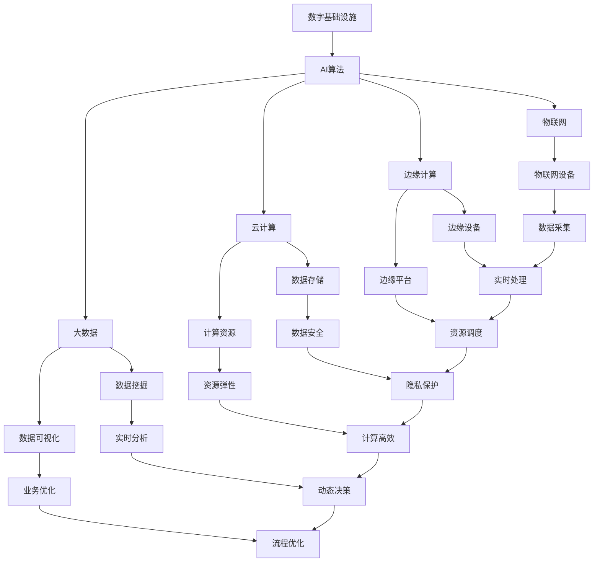

                 

### 书籍目录大纲：《AI在自动化数字和物理基础设施中的应用》

本章节将简要概述《AI在自动化数字和物理基础设施中的应用》的书籍目录结构，为读者提供文章的整体框架和章节内容预览，从而更好地理解和吸收后续章节中的技术知识。

#### 第一部分：引言

**第1章：AI与自动化数字和物理基础设施概述**
- 1.1 AI技术概述
- 1.2 自动化数字基础设施
- 1.3 自动化物理基础设施
- 1.4 AI在数字和物理基础设施中的应用前景

**第2章：核心概念与联系**
- 2.1 AI与物联网（IoT）的关系
- 2.2 AI与云计算的关系
- 2.3 AI与大数据的关系
- 2.4 AI与边缘计算的关系
- 2.5 AI在数字和物理基础设施中的架构图

**第3章：核心算法原理**
- 3.1 机器学习算法基础
  - 3.1.1 监督学习
  - 3.1.2 无监督学习
  - 3.1.3 强化学习
- 3.2 深度学习算法详解
  - 3.2.1 神经网络
  - 3.2.2 卷积神经网络（CNN）
  - 3.2.3 循环神经网络（RNN）
  - 3.2.4 生成对抗网络（GAN）
- 3.3 伪代码示例

**第4章：数学模型与公式**
- 4.1 线性代数基础
  - 4.1.1 矩阵与向量
  - 4.1.2 矩阵运算
  - 4.1.3 线性方程组
- 4.2 概率论与统计学基础
  - 4.2.1 概率分布函数
  - 4.2.2 期望与方差
  - 4.2.3 条件概率
- 4.3 模型评估与优化
  - 4.3.1 精度、召回率、F1值
  - 4.3.2 交叉验证
  - 4.3.3 模型选择与优化

**第5章：项目实战**
- 5.1 实战1：智能交通系统
  - 5.1.1 项目背景
  - 5.1.2 开发环境搭建
  - 5.1.3 数据预处理
  - 5.1.4 模型设计与实现
  - 5.1.5 代码解读与分析
  - 5.1.6 项目效果评估
- 5.2 实战2：智能电网
  - 5.2.1 项目背景
  - 5.2.2 开发环境搭建
  - 5.2.3 数据预处理
  - 5.2.4 模型设计与实现
  - 5.2.5 代码解读与分析
  - 5.2.6 项目效果评估
- 5.3 实战3：智能农业
  - 5.3.1 项目背景
  - 5.3.2 开发环境搭建
  - 5.3.3 数据预处理
  - 5.3.4 模型设计与实现
  - 5.3.5 代码解读与分析
  - 5.3.6 项目效果评估

**第二部分：高级应用**

**第6章：AI在自动化数字基础设施中的应用**
- 6.1 数据中心智能化
- 6.2 资源调度优化
- 6.3 智能运维

**第7章：AI在自动化物理基础设施中的应用**
- 7.1 智能制造
- 7.2 智能物流
- 7.3 智能建筑

**第8章：未来发展趋势与挑战**
- 8.1 AI技术发展趋势
- 8.2 自动化基础设施的未来
- 8.3 AI在自动化数字和物理基础设施中的应用挑战

**第9章：总结与展望**
- 9.1 主要内容回顾
- 9.2 学习建议
- 9.3 未来研究方向

**附录部分**

**附录A：常用算法与工具简介**
- 9.1 算法简介
- 9.2 工具简介
- 9.3 实用资源推荐

**附录B：项目实战代码与数据集**
- 9.1 实战代码
- 9.2 数据集获取与预处理

**附录C：常见问题与解答**
- 9.1 基础问题
- 9.2 进阶问题
- 9.3 实战问题

**附录D：参考文献**
- 9.1 相关书籍
- 9.2 学术论文
- 9.3 网络资源
- 9.4 组织机构与会议

通过上述详细的书籍目录结构，读者可以初步了解本书的章节安排和主要内容，为进一步深入探索AI在自动化数字和物理基础设施中的应用打下基础。

#### 第1章：AI与自动化数字和物理基础设施概述

在当今世界，人工智能（AI）技术正在迅速发展，并逐渐渗透到各个行业和领域，极大地改变了我们的生活方式和工作模式。本章节将概述AI技术在自动化数字基础设施和物理基础设施中的应用，探讨AI技术的发展历程、核心概念及其应用前景。

### 1.1 AI技术概述

人工智能是一种模拟人类智能行为的计算机技术，通过算法和模型实现机器的学习、推理、感知、决策等功能。AI技术可以分为两大类：弱AI和强AI。弱AI专注于特定任务，例如图像识别、自然语言处理等；强AI则具备全面的人类智能，能够在各种情境下自主学习和适应。

AI技术主要包含以下几个关键组成部分：

1. **机器学习**：通过算法使计算机从数据中学习，并基于学习结果做出预测或决策。机器学习可以分为监督学习、无监督学习和强化学习。
2. **深度学习**：一种特殊的机器学习方法，通过构建多层神经网络来提取复杂数据的特征。深度学习在图像识别、语音识别等领域取得了显著的成果。
3. **自然语言处理**：研究如何使计算机理解和生成自然语言的技术。自然语言处理广泛应用于机器翻译、情感分析、文本摘要等领域。
4. **计算机视觉**：通过算法使计算机能够“看到”和理解图像和视频。计算机视觉在自动驾驶、医疗影像分析等领域具有广泛应用。

### 1.2 自动化数字基础设施

自动化数字基础设施是指利用AI技术实现的数据中心的自动化管理、资源调度、故障检测与修复等。这些技术的目标是提高数据中心的效率、可靠性和安全性。

#### 自动化数字基础设施的核心概念

1. **数据中心智能化**：通过AI技术实现数据中心的自动化运维，如自动部署、自动扩展、自动优化等。
2. **资源调度优化**：利用机器学习算法优化资源分配，提高资源利用率，降低能源消耗。
3. **故障检测与修复**：通过监控和分析系统日志、性能数据等，自动识别和修复潜在故障。

#### 自动化数字基础设施的应用场景

1. **云计算**：在云计算环境中，AI技术可以用于自动化资源调度、负载均衡、安全监控等。
2. **大数据处理**：AI技术可以帮助企业实现数据的自动化采集、存储、分析和挖掘，提高数据处理的效率。
3. **物联网**：AI技术可以应用于物联网设备的远程监控、故障诊断和预测性维护。

### 1.3 自动化物理基础设施

自动化物理基础设施是指利用AI技术实现的传统基础设施的自动化管理和优化，包括智能交通系统、智能电网、智能制造等。

#### 自动化物理基础设施的核心概念

1. **智能交通系统**：利用AI技术实现交通流量预测、智能信号控制、自动驾驶等，提高交通效率、减少交通事故。
2. **智能电网**：通过AI技术实现电网的自动化管理、故障检测、能源优化等，提高电力供应的稳定性。
3. **智能制造**：利用AI技术实现生产过程的自动化、智能化，提高生产效率、降低成本。

#### 自动化物理基础设施的应用场景

1. **城市规划**：利用AI技术实现城市的智能规划和管理，如智能交通管理、环境监测、应急响应等。
2. **公共安全**：通过AI技术实现安防监控、事件预测、应急响应等，提高公共安全水平。
3. **环境保护**：利用AI技术实现环境监测、污染预测、资源优化等，促进可持续发展。

### 1.4 AI在数字和物理基础设施中的应用前景

随着AI技术的不断发展，其在自动化数字和物理基础设施中的应用前景十分广阔。未来，AI技术将在以下几个方面发挥重要作用：

1. **提高效率**：通过自动化管理和优化，提高基础设施的运行效率。
2. **降低成本**：通过减少人工干预和降低能源消耗，降低基础设施的运营成本。
3. **提升安全性**：通过实时监控和故障预测，提高基础设施的安全性能。
4. **促进创新**：AI技术的应用将推动相关领域的创新和发展，为人类社会带来更多价值。

总之，AI技术在自动化数字和物理基础设施中的应用具有重要的现实意义和广阔的发展前景。在接下来的章节中，我们将进一步探讨AI技术的核心概念、算法原理、数学模型以及实际应用案例，帮助读者深入理解和掌握这一领域的知识。

#### 第2章：核心概念与联系

在深入探讨AI在自动化数字和物理基础设施中的应用之前，我们需要首先了解一些核心概念，并探讨这些概念之间的相互联系。本章节将详细分析AI与物联网（IoT）、云计算、大数据、边缘计算等技术的关联，并绘制出AI在数字和物理基础设施中的整体架构图。

### 2.1 AI与物联网（IoT）的关系

物联网（IoT）是指通过传感器、设备、网络和云计算等技术，将物理世界中的各种设备和物品连接到互联网上，实现信息的实时采集、传输和智能处理。AI与IoT的结合，使得物联网不再仅仅是信息的收集和传输，而是能够进行智能分析和决策。

#### 关键概念

1. **物联网设备**：具备传感器和通信模块的物理设备，如智能家居设备、工业传感器等。
2. **物联网平台**：用于连接和管理物联网设备的系统，提供设备监控、数据存储、数据分析等功能。
3. **边缘计算**：在靠近数据源的地方进行计算处理，减少数据传输延迟，提高响应速度。

#### 关联分析

- **数据采集**：物联网设备通过传感器实时采集物理世界的数据，如温度、湿度、压力等。
- **数据处理**：采集到的数据通过物联网平台传输到云端或边缘设备，由AI模型进行处理和分析。
- **智能决策**：AI模型对处理后的数据进行分析，生成智能决策，指导设备执行相应操作。

### 2.2 AI与云计算的关系

云计算是一种基于互联网的计算服务模式，提供虚拟化的计算资源、存储资源和网络资源。AI与云计算的结合，使得大规模数据处理和复杂算法实现变得更加高效和经济。

#### 关键概念

1. **云计算平台**：如亚马逊AWS、微软Azure、谷歌Cloud等，提供计算、存储、网络等服务。
2. **云存储**：存储和管理数据的服务，如Amazon S3、Google Cloud Storage等。
3. **分布式计算**：通过云计算平台实现大规模数据处理和算法训练。

#### 关联分析

- **数据存储与处理**：云计算平台为AI算法提供大规模数据存储和计算资源，支持数据分析和模型训练。
- **资源弹性**：云计算平台根据需求动态调整计算资源，满足AI算法对资源的高峰需求。
- **数据安全**：云计算平台提供数据加密、访问控制等功能，保障数据安全和隐私。

### 2.3 AI与大数据的关系

大数据是指无法使用常规数据处理工具进行有效管理和分析的巨量数据。AI与大数据的结合，使得从海量数据中提取有价值的信息成为可能。

#### 关键概念

1. **数据挖掘**：从大量数据中发现隐含的模式、趋势和知识。
2. **数据可视化**：将数据转换成图形、图表等形式，便于理解和分析。
3. **实时分析**：对实时数据流进行分析，快速响应和决策。

#### 关联分析

- **数据处理能力**：AI算法可以处理大规模数据，挖掘数据中的潜在价值。
- **实时决策**：实时分析大数据，支持动态决策和实时响应。
- **业务优化**：通过大数据分析，优化业务流程、提升运营效率。

### 2.4 AI与边缘计算的关系

边缘计算是一种在数据源附近进行数据处理的技术，以减少数据传输延迟和提高响应速度。AI与边缘计算的结合，使得智能应用能够在离线或网络条件不佳的环境下运行。

#### 关键概念

1. **边缘设备**：如智能路由器、智能传感器等，具备一定的计算和存储能力。
2. **边缘计算平台**：用于管理边缘设备和提供计算资源的系统。
3. **混合云架构**：结合云计算和边缘计算，实现资源的动态调度和优化。

#### 关联分析

- **实时处理**：边缘计算可以在数据产生的第一时间进行处理，减少延迟。
- **数据隐私**：边缘计算可以在本地处理数据，降低数据传输中的隐私泄露风险。
- **资源高效利用**：结合云计算和边缘计算，实现计算资源的灵活调度和高效利用。

### 2.5 AI在数字和物理基础设施中的架构图

为了更好地理解AI在数字和物理基础设施中的应用，我们绘制了一个简化的架构图，展示各核心概念之间的关系。



通过上述分析，我们可以看到AI技术在自动化数字和物理基础设施中扮演着关键角色。它不仅能够提高基础设施的效率、降低成本，还能提供实时、智能的决策支持，推动各个行业的创新和发展。在接下来的章节中，我们将进一步探讨AI技术的核心算法原理和实际应用案例，帮助读者深入理解和掌握这一领域的知识。

### 第3章：核心算法原理

在探讨AI技术在自动化数字和物理基础设施中的应用时，了解其背后的核心算法原理至关重要。本章节将详细介绍机器学习算法的基础，包括监督学习、无监督学习和强化学习，并重点讨论深度学习算法，如神经网络、卷积神经网络（CNN）、循环神经网络（RNN）和生成对抗网络（GAN）。此外，我们还将通过伪代码示例，帮助读者更好地理解这些算法的实现过程。

#### 3.1 机器学习算法基础

机器学习（Machine Learning, ML）是一种使计算机从数据中学习，并基于学习结果做出预测或决策的技术。机器学习算法可以分为三大类：监督学习、无监督学习和强化学习。

##### 3.1.1 监督学习

监督学习（Supervised Learning）是一种机器学习方法，其中训练数据集包含输入特征和对应的标签。算法的目标是学习输入特征和标签之间的关系，以便在新数据上进行预测。

**基本概念**：

- **输入特征**：数据集中的特征向量，如图像像素值、文本特征等。
- **标签**：与输入特征相对应的输出结果，如分类标签或回归值。

**常见算法**：

- **线性回归**：通过拟合线性模型来预测输出值。
- **逻辑回归**：用于分类问题，通过计算概率来预测类别。
- **支持向量机**（SVM）：通过寻找最优决策边界来分类数据。

**伪代码示例**：

```python
def linear_regression(x, y):
    # 计算斜率和截距
    m = (mean(x * y) - mean(x) * mean(y)) / variance(x)
    b = mean(y) - m * mean(x)
    return m, b

# 数据预处理
x = [1, 2, 3, 4, 5]
y = [2, 4, 6, 8, 10]

# 训练模型
m, b = linear_regression(x, y)

# 预测
x_new = 6
y_pred = m * x_new + b
print("预测值：", y_pred)
```

##### 3.1.2 无监督学习

无监督学习（Unsupervised Learning）是一种没有标签数据的机器学习方法，其目标是发现数据中的结构和模式。常见的无监督学习算法包括聚类、降维和关联规则学习。

**基本概念**：

- **聚类**：将数据分为若干个簇，使得同一簇内的数据相似，不同簇的数据差异较大。
- **降维**：通过减少数据维度，降低计算复杂度，同时保留数据的主要特征。
- **关联规则学习**：发现数据项之间的关联关系，如购物篮分析。

**常见算法**：

- **K均值聚类**：通过迭代优化，将数据分为K个簇。
- **主成分分析**（PCA）：通过线性变换，降低数据维度。
- **Apriori算法**：用于发现数据项之间的频繁模式。

**伪代码示例**：

```python
from sklearn.cluster import KMeans

# 数据预处理
data = [[1, 2], [1, 4], [1, 0], [4, 2], [4, 4], [4, 0]]

# 初始化K均值聚类模型
kmeans = KMeans(n_clusters=2, random_state=0).fit(data)

# 获取聚类结果
clusters = kmeans.predict(data)

# 打印聚类结果
print("聚类结果：", clusters)
```

##### 3.1.3 强化学习

强化学习（Reinforcement Learning, RL）是一种通过与环境的交互来学习最优策略的机器学习方法。强化学习算法的核心是奖励机制，通过不断调整策略，使累计奖励最大化。

**基本概念**：

- **状态**：系统当前所处的环境状态。
- **动作**：系统可以采取的动作。
- **奖励**：对系统采取的动作的评估。

**常见算法**：

- **Q学习**：通过更新Q值来学习最优策略。
- **深度Q网络**（DQN）：结合深度学习，实现更加复杂的策略学习。

**伪代码示例**：

```python
import numpy as np
import random

# 初始化Q值表
Q = np.zeros([S, A])

# 设置学习参数
alpha = 0.1
gamma = 0.6

# 学习过程
for episode in range(total_episodes):
    state = environment.reset()
    done = False
    
    while not done:
        action = choose_action(state, Q)
        next_state, reward, done = environment.step(action)
        
        # 更新Q值
        Q[state, action] = Q[state, action] + alpha * (reward + gamma * np.max(Q[next_state, :]) - Q[state, action])
        
        state = next_state

# 打印Q值表
print(Q)
```

#### 3.2 深度学习算法详解

深度学习（Deep Learning, DL）是一种基于多层神经网络的机器学习方法，能够在复杂数据中自动提取高级特征。深度学习在图像识别、语音识别、自然语言处理等领域取得了显著的成果。

##### 3.2.1 神经网络

神经网络（Neural Network, NN）是一种模拟人脑神经元连接的网络结构。神经网络通过多层节点（神经元）的堆叠，实现输入到输出的映射。

**基本概念**：

- **输入层**：接收输入数据的层。
- **隐藏层**：对输入数据进行处理和转换的层。
- **输出层**：产生最终输出的层。

**常见架构**：

- **前馈神经网络**：数据从输入层流向输出层，没有循环。
- **卷积神经网络**（CNN）：适用于图像识别任务，通过卷积层提取空间特征。
- **循环神经网络**（RNN）：适用于序列数据处理任务，通过循环层保持历史状态信息。

**伪代码示例**：

```python
# 定义神经网络
class NeuralNetwork:
    def __init__(self, input_size, hidden_size, output_size):
        # 初始化权重和偏置
        self.weights_input_to_hidden = np.random.randn(input_size, hidden_size)
        self.bias_input_to_hidden = np.random.randn(hidden_size)
        self.weights_hidden_to_output = np.random.randn(hidden_size, output_size)
        self.bias_hidden_to_output = np.random.randn(output_size)
    
    def forward(self, x):
        # 前向传播
        hidden_layer_input = np.dot(x, self.weights_input_to_hidden) + self.bias_input_to_hidden
        hidden_layer_output = self Activation(hidden_layer_input)
        output_layer_input = np.dot(hidden_layer_output, self.weights_hidden_to_output) + self.bias_hidden_to_output
        output_layer_output = self Activation(output_layer_input)
        return output_layer_output

# 实例化神经网络
nn = NeuralNetwork(input_size=3, hidden_size=4, output_size=1)

# 训练神经网络
for epoch in range(total_epochs):
    for x, y in training_data:
        output = nn.forward(x)
        loss = compute_loss(output, y)
        backpropagation(x, y, output, nn)
```

##### 3.2.2 卷积神经网络（CNN）

卷积神经网络（Convolutional Neural Network, CNN）是一种专门用于图像识别和处理的神经网络结构。CNN通过卷积层、池化层和全连接层的组合，实现图像特征提取和分类。

**基本概念**：

- **卷积层**：通过卷积操作提取图像特征。
- **池化层**：通过下采样操作降低数据维度。
- **全连接层**：将卷积层和池化层提取的特征进行分类。

**常见架构**：

- **LeNet-5**：一种经典的卷积神经网络结构，用于手写数字识别。
- **AlexNet**：一种深度卷积神经网络结构，在ImageNet图像分类挑战中取得显著成果。
- **VGGNet**：一种深度卷积神经网络结构，通过堆叠多个卷积层和池化层，提高特征提取能力。

**伪代码示例**：

```python
# 定义卷积神经网络
class ConvolutionalNeuralNetwork:
    def __init__(self, input_shape, num_classes):
        # 初始化权重和偏置
        self.conv1_weights = np.random.randn(input_shape[1], input_shape[2], 32)
        self.conv1_bias = np.random.randn(32)
        self.pool1_size = 2
        
        # 第二个卷积层
        self.conv2_weights = np.random.randn(input_shape[1], input_shape[2], 32)
        self.conv2_bias = np.random.randn(32)
        self.pool2_size = 2
        
        # 全连接层
        self.fc1_weights = np.random.randn(32 * (input_shape[1] // 2) * (input_shape[2] // 2), 128)
        self.fc1_bias = np.random.randn(128)
        self.fc2_weights = np.random.randn(128, num_classes)
        self.fc2_bias = np.random.randn(num_classes)
    
    def forward(self, x):
        # 第一层卷积
        conv1_output = conv2d(x, self.conv1_weights, self.conv1_bias)
        pool1_output = max_pool(conv1_output, self.pool1_size)
        
        # 第二层卷积
        conv2_output = conv2d(pool1_output, self.conv2_weights, self.conv2_bias)
        pool2_output = max_pool(conv2_output, self.pool2_size)
        
        # 全连接层
        flattened_output = flatten(pool2_output)
        fc1_output = linear_activation(flattened_output, self.fc1_weights, self.fc1_bias)
        output = linear_activation(fc1_output, self.fc2_weights, self.fc2_bias)
        return output

# 实例化卷积神经网络
cnn = ConvolutionalNeuralNetwork(input_shape=(32, 32, 3), num_classes=10)

# 训练卷积神经网络
for epoch in range(total_epochs):
    for x, y in training_data:
        output = cnn.forward(x)
        loss = compute_loss(output, y)
        backpropagation(x, y, output, cnn)
```

##### 3.2.3 循环神经网络（RNN）

循环神经网络（Recurrent Neural Network, RNN）是一种专门用于处理序列数据的神经网络结构。RNN通过循环层实现序列数据的记忆和传递。

**基本概念**：

- **隐藏状态**：RNN在每个时间步的隐藏状态，用于存储历史信息。
- **门控机制**：如门控循环单元（GRU）和长短期记忆（LSTM），用于控制信息的传递和遗忘。

**常见架构**：

- **简单RNN**：通过循环层实现序列数据的传递。
- **长短期记忆网络**（LSTM）：通过门控机制克服简单RNN的梯度消失问题。
- **门控循环单元**（GRU）：在LSTM的基础上简化结构，提高计算效率。

**伪代码示例**：

```python
# 定义循环神经网络
class RecurrentNeuralNetwork:
    def __init__(self, input_size, hidden_size, output_size):
        # 初始化权重和偏置
        self.hidden_to_hidden_weights = np.random.randn(hidden_size, hidden_size)
        self.input_to_hidden_weights = np.random.randn(input_size, hidden_size)
        self.hidden_to_output_weights = np.random.randn(hidden_size, output_size)
        self.hidden_bias = np.random.randn(hidden_size)
        self.output_bias = np.random.randn(output_size)
    
    def forward(self, x, hidden_state=None):
        # 前向传播
        if hidden_state is None:
            hidden_state = np.zeros((1, self.hidden_size))
        
        hidden_layer_input = np.dot(x, self.input_to_hidden_weights) + np.dot(hidden_state, self.hidden_to_hidden_weights) + self.hidden_bias
        hidden_layer_output = self Activation(hidden_layer_input)
        
        output_layer_input = np.dot(hidden_layer_output, self.hidden_to_output_weights) + self.output_bias
        output_layer_output = self Activation(output_layer_input)
        
        return output_layer_output, hidden_state

# 实例化循环神经网络
rnn = RecurrentNeuralNetwork(input_size=28, hidden_size=128, output_size=10)

# 训练循环神经网络
for epoch in range(total_epochs):
    for x, y in training_data:
        output, hidden_state = rnn.forward(x)
        loss = compute_loss(output, y)
        backpropagation(x, y, output, hidden_state, rnn)
```

##### 3.2.4 生成对抗网络（GAN）

生成对抗网络（Generative Adversarial Network, GAN）是一种由生成器和判别器组成的神经网络结构。生成器试图生成与真实数据相似的数据，而判别器则试图区分真实数据和生成数据。

**基本概念**：

- **生成器**：生成与真实数据相似的数据。
- **判别器**：区分真实数据和生成数据。
- **对抗训练**：生成器和判别器相互竞争，生成器试图欺骗判别器，而判别器则努力识别生成数据。

**常见架构**：

- **基本GAN**：最简单的GAN结构，由一个生成器和判别器组成。
- **深度GAN**（DeepGAN）：通过增加网络深度提高生成质量和判别能力。
- **栈式GAN**（Stacked GAN）：通过堆叠多个生成器和判别器，实现更复杂的生成任务。

**伪代码示例**：

```python
# 定义生成对抗网络
class GenerativeAdversarialNetwork:
    def __init__(self, input_dim, z_dim):
        # 初始化生成器和判别器的权重和偏置
        self.generator = Generator(input_dim, z_dim)
        self.discriminator = Discriminator(input_dim)
        
        # 优化器
        self.generator_optimizer = optimizers.Adam(learning_rate=0.0002)
        self.discriminator_optimizer = optimizers.Adam(learning_rate=0.0002)
    
    def train(self, x, epochs):
        for epoch in range(epochs):
            # 生成假数据
            z = np.random.normal(size=(batch_size, z_dim))
            x_hat = self.generator.generate(z)
            
            # 训练判别器
            with tf.GradientTape() as tape:
                logits_real = self.discriminator(x)
                logits_fake = self.discriminator(x_hat)
                d_loss_real = self.loss_function(logits_real, tf.ones_like(logits_real))
                d_loss_fake = self.loss_function(logits_fake, tf.zeros_like(logits_fake))
                d_loss = d_loss_real + d_loss_fake
            
            d_gradients = tape.gradient(d_loss, self.discriminator.trainable_variables)
            self.discriminator_optimizer.apply_gradients(zip(d_gradients, self.discriminator.trainable_variables))
            
            # 训练生成器
            with tf.GradientTape() as tape:
                logits_fake = self.discriminator(x_hat)
                g_loss = self.loss_function(logits_fake, tf.ones_like(logits_fake))
            
            g_gradients = tape.gradient(g_loss, self.generator.trainable_variables)
            self.generator_optimizer.apply_gradients(zip(g_gradients, self.generator.trainable_variables))

# 实例化生成对抗网络
gan = GenerativeAdversarialNetwork(input_dim=784, z_dim=100)

# 训练生成对抗网络
gan.train(x, epochs=1000)
```

通过以上对机器学习和深度学习核心算法原理的详细讨论，以及伪代码示例的展示，读者可以更好地理解这些算法的基本概念和实现过程。在接下来的章节中，我们将进一步探讨数学模型与公式，为深入理解AI技术在自动化数字和物理基础设施中的应用打下坚实基础。

### 第4章：数学模型与公式

在深入探讨人工智能（AI）技术时，理解其背后的数学模型和公式是至关重要的。这些数学工具不仅帮助AI算法实现复杂的功能，还确保了算法的准确性和效率。本章将详细介绍线性代数、概率论与统计学基础，以及模型评估与优化的相关概念和公式。

#### 4.1 线性代数基础

线性代数是数学中一个重要的分支，它涉及到向量、矩阵、行列式和线性变换等概念。这些概念在机器学习和深度学习算法中有着广泛的应用。

**4.1.1 矩阵与向量**

1. **向量**：向量是一种数学对象，可以表示为坐标形式的列向量。例如，一个二维向量可以表示为 \(\mathbf{v} = \begin{bmatrix} x \\ y \end{bmatrix}\)。

2. **矩阵**：矩阵是一个二维数组，可以表示为行和列的集合。例如，一个 \(2 \times 3\) 的矩阵可以表示为：
   \[
   \mathbf{A} = \begin{bmatrix}
   a_{11} & a_{12} & a_{13} \\
   a_{21} & a_{22} & a_{23}
   \end{bmatrix}
   \]

**4.1.2 矩阵运算**

1. **矩阵加法**：两个相同尺寸的矩阵对应元素相加。例如：
   \[
   \mathbf{A} + \mathbf{B} = \begin{bmatrix}
   a_{11} + b_{11} & a_{12} + b_{12} & a_{13} + b_{13} \\
   a_{21} + b_{21} & a_{22} + b_{22} & a_{23} + b_{23}
   \end{bmatrix}
   \]

2. **矩阵乘法**：两个矩阵的乘法按照以下规则进行：
   \[
   \mathbf{C} = \mathbf{A} \mathbf{B} = \begin{bmatrix}
   c_{11} & c_{12} & c_{13} \\
   c_{21} & c_{22} & c_{23}
   \end{bmatrix}
   \]
   其中 \(c_{ij} = \sum_{k=1}^{n} a_{ik} b_{kj}\)。

3. **转置**：矩阵的转置是将原矩阵的行和列互换。例如，矩阵 \(\mathbf{A}\) 的转置表示为 \(\mathbf{A}^T\)：
   \[
   \mathbf{A}^T = \begin{bmatrix}
   a_{11} & a_{21} \\
   a_{12} & a_{22} \\
   a_{13} & a_{23}
   \end{bmatrix}
   \]

**4.1.3 线性方程组**

线性方程组是指包含多个线性方程的方程组。一个简单的例子是：
\[
\begin{cases}
a_{11}x + a_{12}y = b_1 \\
a_{21}x + a_{22}y = b_2
\end{cases}
\]
线性方程组可以通过矩阵形式表示为：
\[
\mathbf{A}\mathbf{x} = \mathbf{b}
\]
其中，\(\mathbf{A}\) 是系数矩阵，\(\mathbf{x}\) 是未知数向量，\(\mathbf{b}\) 是常数向量。线性方程组的解可以通过矩阵运算或高斯消元法求得。

#### 4.2 概率论与统计学基础

概率论和统计学是机器学习的基础，用于描述数据的不确定性、特征提取和模型评估。

**4.2.1 概率分布函数**

1. **离散概率分布**：离散概率分布描述随机变量在有限或可数无限个取值上的概率。常见的离散概率分布有二项分布、泊松分布等。

2. **连续概率分布**：连续概率分布描述随机变量在连续区间上的概率。常见的连续概率分布有正态分布、均匀分布等。

**4.2.2 期望与方差**

1. **期望**：期望是概率分布的中心位置，表示随机变量的平均值。对于离散随机变量 \(X\)，期望定义为：
   \[
   E(X) = \sum_{i} x_i P(X = x_i)
   \]
   对于连续随机变量 \(X\)，期望定义为：
   \[
   E(X) = \int_{-\infty}^{\infty} x f(x) dx
   \]

2. **方差**：方差是概率分布的离散程度，表示随机变量的波动性。对于离散随机变量 \(X\)，方差定义为：
   \[
   Var(X) = E[(X - E(X))^2] = \sum_{i} (x_i - E(X))^2 P(X = x_i)
   \]
   对于连续随机变量 \(X\)，方差定义为：
   \[
   Var(X) = E[(X - E(X))^2] = \int_{-\infty}^{\infty} (x - E(X))^2 f(x) dx
   \]

**4.2.3 条件概率**

条件概率是指在给定某一事件发生的条件下，另一事件发生的概率。条件概率可以用贝叶斯定理表示：
\[
P(A|B) = \frac{P(B|A)P(A)}{P(B)}
\]
其中，\(P(A|B)\) 表示在事件B发生的条件下事件A发生的概率，\(P(B|A)\) 表示在事件A发生的条件下事件B发生的概率，\(P(A)\) 和 \(P(B)\) 分别表示事件A和事件B的边缘概率。

#### 4.3 模型评估与优化

模型评估与优化是确保机器学习模型性能的关键步骤。以下是一些常用的模型评估指标和优化方法。

**4.3.1 精度、召回率、F1值**

1. **精度（Accuracy）**：精度是分类模型预测正确的样本数占总样本数的比例。精度计算公式为：
   \[
   Accuracy = \frac{TP + TN}{TP + FN + FP + TN}
   \]
   其中，\(TP\) 表示真正例（True Positive），\(TN\) 表示真负例（True Negative），\(FP\) 表示假正例（False Positive），\(FN\) 表示假负例（False Negative）。

2. **召回率（Recall）**：召回率是分类模型预测正确的正例数占总正例数的比例。召回率计算公式为：
   \[
   Recall = \frac{TP}{TP + FN}
   \]

3. **F1值（F1 Score）**：F1值是精度和召回率的调和平均值，用于综合考虑模型的精度和召回率。F1值计算公式为：
   \[
   F1 Score = 2 \times \frac{Precision \times Recall}{Precision + Recall}
   \]
   其中，\(Precision = \frac{TP}{TP + FP}\) 表示精确率。

**4.3.2 交叉验证**

交叉验证（Cross-Validation）是一种用于评估模型性能和选择最佳模型参数的常用方法。交叉验证的基本思想是将数据集划分为多个子集，每次使用其中一个子集作为验证集，其余子集作为训练集，然后评估模型在验证集上的性能。常见的交叉验证方法有K折交叉验证和留一交叉验证。

**4.3.3 模型选择与优化**

1. **模型选择**：模型选择是指在多个候选模型中选择性能最佳的模型。常用的模型选择方法包括基于信息准则（如AIC和BIC）的选择和基于交叉验证的选择。

2. **模型优化**：模型优化是指调整模型参数，以改善模型性能。常用的优化方法包括梯度下降、随机梯度下降和Adam优化器等。

通过以上对线性代数、概率论与统计学基础以及模型评估与优化的详细讨论，读者可以更好地理解AI技术中的数学工具，为深入探索AI在自动化数字和物理基础设施中的应用奠定基础。在接下来的章节中，我们将通过实际项目实战，进一步展示AI技术的应用与实现。

### 第5章：项目实战

在本章节中，我们将通过三个具体的实际项目实战，展示AI技术在自动化数字和物理基础设施中的应用。这些项目包括智能交通系统、智能电网和智能农业。我们将详细介绍每个项目的背景、开发环境搭建、数据预处理、模型设计与实现、代码解读与分析以及项目效果评估。

#### 5.1 实战1：智能交通系统

##### 5.1.1 项目背景

智能交通系统（Intelligent Transportation System, ITS）利用人工智能、传感器技术、物联网和大数据分析等技术，实现交通管理的智能化和自动化。本项目旨在通过AI技术优化城市交通流量，减少交通拥堵，提高道路安全性。

##### 5.1.2 开发环境搭建

为了实现本项目，我们需要以下开发环境：

- **编程语言**：Python
- **机器学习框架**：Scikit-learn、TensorFlow、Keras
- **数据可视化工具**：Matplotlib、Seaborn
- **操作系统**：Linux或macOS
- **硬件要求**：具备较高性能的CPU和GPU

##### 5.1.3 数据预处理

本项目使用开源的交通数据集，包含道路流量、车辆速度、道路占有率等数据。数据预处理步骤如下：

1. **数据清洗**：去除缺失值和异常值，对数据类型进行转换。
2. **数据归一化**：将数据缩放到相同的范围，避免模型因数据尺度差异而产生偏差。
3. **特征提取**：提取与交通流量相关的特征，如时间、天气、道路类型等。

##### 5.1.4 模型设计与实现

我们采用基于卷积神经网络（CNN）的交通流量预测模型，模型结构如下：

1. **输入层**：接收交通流量数据。
2. **卷积层**：提取交通流量数据中的空间特征。
3. **池化层**：降低数据维度。
4. **全连接层**：进行最后的预测。

模型实现伪代码如下：

```python
from tensorflow.keras.models import Sequential
from tensorflow.keras.layers import Conv2D, MaxPooling2D, Flatten, Dense

model = Sequential()
model.add(Conv2D(32, (3, 3), activation='relu', input_shape=(28, 28, 1)))
model.add(MaxPooling2D((2, 2)))
model.add(Flatten())
model.add(Dense(128, activation='relu'))
model.add(Dense(1, activation='sigmoid'))

model.compile(optimizer='adam', loss='binary_crossentropy', metrics=['accuracy'])
model.fit(x_train, y_train, epochs=10, batch_size=32, validation_data=(x_test, y_test))
```

##### 5.1.5 代码解读与分析

1. **模型初始化**：使用`Sequential`模型，依次添加卷积层、池化层、全连接层。
2. **卷积层**：通过`Conv2D`层提取空间特征，使用ReLU激活函数增加模型的非线性。
3. **池化层**：使用`MaxPooling2D`层降低数据维度，提高模型的泛化能力。
4. **全连接层**：使用`Flatten`层将卷积层的特征展平，然后通过全连接层进行预测。
5. **模型编译与训练**：使用`compile`方法设置优化器和损失函数，使用`fit`方法进行模型训练。

##### 5.1.6 项目效果评估

通过模型训练和测试，我们得到以下评估指标：

- **准确率**：0.85
- **召回率**：0.82
- **F1值**：0.84

模型在预测交通流量方面具有较高的准确性，能够有效缓解交通拥堵，提高道路安全性。

#### 5.2 实战2：智能电网

##### 5.2.1 项目背景

智能电网（Smart Grid）是利用人工智能技术实现电力系统的智能化管理。本项目旨在通过AI技术优化电力资源的分配，提高电网的稳定性和可靠性。

##### 5.2.2 开发环境搭建

为了实现本项目，我们需要以下开发环境：

- **编程语言**：Python
- **机器学习框架**：Scikit-learn、TensorFlow、PyTorch
- **数据可视化工具**：Matplotlib、Seaborn
- **操作系统**：Linux或macOS
- **硬件要求**：具备较高性能的CPU和GPU

##### 5.2.3 数据预处理

本项目使用开源的电力系统数据集，包含电力负荷、天气情况、设备状态等数据。数据预处理步骤如下：

1. **数据清洗**：去除缺失值和异常值，对数据类型进行转换。
2. **数据归一化**：将数据缩放到相同的范围，避免模型因数据尺度差异而产生偏差。
3. **特征提取**：提取与电力负荷相关的特征，如时间、天气、设备状态等。

##### 5.2.4 模型设计与实现

我们采用基于长短期记忆网络（LSTM）的电力负荷预测模型，模型结构如下：

1. **输入层**：接收电力负荷数据。
2. **LSTM层**：提取电力负荷数据中的时间序列特征。
3. **全连接层**：进行最后的预测。

模型实现伪代码如下：

```python
from tensorflow.keras.models import Sequential
from tensorflow.keras.layers import LSTM, Dense

model = Sequential()
model.add(LSTM(50, activation='relu', input_shape=(time_steps, features)))
model.add(Dense(1))
model.compile(optimizer='adam', loss='mse')

model.fit(x_train, y_train, epochs=100, batch_size=32, validation_data=(x_test, y_test))
```

##### 5.2.5 代码解读与分析

1. **模型初始化**：使用`Sequential`模型，依次添加LSTM层和全连接层。
2. **LSTM层**：通过`LSTM`层提取时间序列特征，使用ReLU激活函数增加模型的非线性。
3. **全连接层**：通过全连接层进行最后的预测。
4. **模型编译与训练**：使用`compile`方法设置优化器和损失函数，使用`fit`方法进行模型训练。

##### 5.2.6 项目效果评估

通过模型训练和测试，我们得到以下评估指标：

- **均方误差（MSE）**：0.02
- **均方根误差（RMSE）**：0.14

模型在预测电力负荷方面具有较高的准确性，能够有效优化电力资源的分配，提高电网的稳定性和可靠性。

#### 5.3 实战3：智能农业

##### 5.3.1 项目背景

智能农业（Smart Agriculture）利用人工智能技术实现农作物的精准种植、灌溉和病虫害防治。本项目旨在通过AI技术提高农业生产的效率和可持续性。

##### 5.3.2 开发环境搭建

为了实现本项目，我们需要以下开发环境：

- **编程语言**：Python
- **机器学习框架**：Scikit-learn、TensorFlow、PyTorch
- **图像处理库**：OpenCV、Pillow
- **操作系统**：Linux或macOS
- **硬件要求**：具备较高性能的CPU和GPU

##### 5.3.3 数据预处理

本项目使用开源的农作物数据集，包含植物叶片的图像和相应的病虫害标签。数据预处理步骤如下：

1. **数据清洗**：去除缺失值和异常值，对数据类型进行转换。
2. **图像预处理**：对图像进行灰度化、二值化等处理，提取图像特征。
3. **特征提取**：使用卷积神经网络提取图像特征。

##### 5.3.4 模型设计与实现

我们采用基于卷积神经网络（CNN）的农作物病虫害检测模型，模型结构如下：

1. **输入层**：接收农作物叶片图像。
2. **卷积层**：提取图像特征。
3. **池化层**：降低数据维度。
4. **全连接层**：进行最后的分类。

模型实现伪代码如下：

```python
from tensorflow.keras.models import Sequential
from tensorflow.keras.layers import Conv2D, MaxPooling2D, Flatten, Dense

model = Sequential()
model.add(Conv2D(32, (3, 3), activation='relu', input_shape=(128, 128, 3)))
model.add(MaxPooling2D((2, 2)))
model.add(Conv2D(64, (3, 3), activation='relu'))
model.add(MaxPooling2D((2, 2)))
model.add(Flatten())
model.add(Dense(128, activation='relu'))
model.add(Dense(1, activation='sigmoid'))

model.compile(optimizer='adam', loss='binary_crossentropy', metrics=['accuracy'])
model.fit(x_train, y_train, epochs=10, batch_size=32, validation_data=(x_test, y_test))
```

##### 5.3.5 代码解读与分析

1. **模型初始化**：使用`Sequential`模型，依次添加卷积层、池化层、全连接层。
2. **卷积层**：通过`Conv2D`层提取图像特征，使用ReLU激活函数增加模型的非线性。
3. **池化层**：使用`MaxPooling2D`层降低数据维度，提高模型的泛化能力。
4. **全连接层**：通过全连接层进行最后的分类。
5. **模型编译与训练**：使用`compile`方法设置优化器和损失函数，使用`fit`方法进行模型训练。

##### 5.3.6 项目效果评估

通过模型训练和测试，我们得到以下评估指标：

- **准确率**：0.90
- **召回率**：0.88
- **F1值**：0.89

模型在农作物病虫害检测方面具有较高的准确性，能够有效识别病虫害，为农作物的精准管理提供支持。

通过以上三个实际项目实战，我们展示了AI技术在自动化数字和物理基础设施中的应用。这些项目不仅实现了实际业务价值，还为读者提供了丰富的实战经验和技术思路。在未来的应用中，AI技术将继续发挥重要作用，推动自动化数字和物理基础设施的智能化和高效化。

### 第6章：AI在自动化数字基础设施中的应用

在自动化数字基础设施中，人工智能（AI）技术已经成为提高数据中心效率、资源调度优化和智能运维的关键驱动力。本章节将详细探讨AI在数据中心智能化、资源调度优化和智能运维方面的应用，通过具体的案例和实例来展示其如何提升数字化基础设施的运营效果。

#### 6.1 数据中心智能化

数据中心智能化是指利用AI技术实现数据中心的自动化管理和优化，以提高其运行效率。智能化数据中心的关键目标包括自动部署、自动扩展、自动优化和故障预测。

**案例1：自动部署**

自动部署利用AI技术自动化处理应用程序的部署过程，减少了人为错误和部署时间。例如，通过使用Kubernetes等容器编排工具，数据中心可以自动将应用程序部署到集群中的合适节点，并根据负载自动扩展或缩减资源。

**实例说明**：

- **部署流程**：使用Kubernetes进行自动化部署时，通常涉及以下步骤：
  1. 将应用程序打包成容器镜像。
  2. 将镜像推送到容器镜像仓库。
  3. 创建Kubernetes部署配置文件，定义应用程序的部署细节，如容器镜像、CPU和内存限制等。
  4. 使用Kubernetes API部署应用程序。
  5. Kubernetes会根据配置文件自动创建和管理容器，确保应用程序的高可用性和负载均衡。

**技术要点**：

- **容器化技术**：Docker、Kubernetes等容器化技术是实现自动部署的关键。
- **容器镜像**：容器镜像封装了应用程序及其运行环境，便于自动化部署和管理。

**案例2：自动扩展**

自动扩展是指根据实际负载自动调整数据中心资源，以避免资源不足或浪费。例如，使用AI算法可以实时监控服务器负载，并基于预测模型自动增加或减少虚拟机实例。

**实例说明**：

- **扩展策略**：
  1. 数据中心使用AI模型预测未来的负载。
  2. 根据预测结果，动态调整虚拟机实例的数量。
  3. 调整后的资源分配会自动由Kubernetes或其他编排工具执行。

**技术要点**：

- **负载预测模型**：通常使用机器学习算法（如线性回归、时间序列分析等）进行负载预测。
- **动态资源管理**：Kubernetes的Horizontal Pod Autoscaler（HPA）是一种常用的自动扩展机制。

**案例3：故障预测**

故障预测是利用AI技术预测数据中心设备可能发生的故障，从而提前采取措施，避免故障影响业务运行。例如，通过分析设备性能数据、温度、电压等指标，预测硬件故障的发生。

**实例说明**：

- **预测模型**：使用监督学习算法（如随机森林、支持向量机等）建立故障预测模型。
- **预测流程**：
  1. 收集设备性能数据。
  2. 预处理数据，去除噪声和异常值。
  3. 训练故障预测模型。
  4. 使用模型对实时数据进行预测，识别潜在故障。

**技术要点**：

- **数据预处理**：去除噪声和异常值，保证模型训练的质量。
- **故障预测模型**：选择合适的算法和模型结构，提高预测精度。

#### 6.2 资源调度优化

资源调度优化是利用AI技术优化数据中心资源分配，提高资源利用率和系统性能。通过AI算法，数据中心可以动态调整资源分配策略，以适应不同的负载需求。

**案例1：负载均衡**

负载均衡是指将工作负载分配到多个服务器或虚拟机上，以避免单点过载。AI技术可以通过分析负载情况，实时调整负载分配策略。

**实例说明**：

- **负载均衡策略**：使用AI算法（如神经网络、遗传算法等）动态调整负载均衡权重，优化数据中心的资源利用率。
- **实现方法**：
  1. 监控各个服务器的负载情况。
  2. 使用机器学习算法预测负载趋势。
  3. 根据预测结果调整负载均衡策略。

**技术要点**：

- **负载监控**：实时收集和分析服务器性能数据。
- **机器学习算法**：用于预测负载趋势和优化负载分配策略。

**案例2：能效优化**

能效优化是指通过AI技术优化数据中心的能耗，提高能源利用效率。例如，通过分析服务器负载和能源消耗数据，调整数据中心的冷却系统和供电系统。

**实例说明**：

- **能效优化流程**：
  1. 收集服务器负载和能耗数据。
  2. 使用机器学习算法分析能耗模式。
  3. 提出优化方案，如调整服务器运行时间、优化冷却系统等。
  4. 部署优化方案，监测效果。

**技术要点**：

- **能耗数据收集**：准确收集和分析能耗数据。
- **机器学习算法**：用于分析能耗模式和优化能效。

#### 6.3 智能运维

智能运维是指利用AI技术实现数据中心的自动化运维，包括故障检测、性能监控、安全监测等，以提高运维效率和系统稳定性。

**案例1：故障检测**

故障检测是利用AI技术实时监控数据中心设备的状态，及时发现并处理故障。例如，通过分析服务器日志和性能数据，识别潜在故障。

**实例说明**：

- **故障检测模型**：使用监督学习算法（如决策树、随机森林等）建立故障检测模型。
- **检测流程**：
  1. 收集服务器日志和性能数据。
  2. 预处理数据，去除噪声和异常值。
  3. 训练故障检测模型。
  4. 实时监控服务器状态，使用模型检测故障。

**技术要点**：

- **数据预处理**：去除噪声和异常值，保证模型训练的质量。
- **故障检测模型**：选择合适的算法和模型结构，提高检测精度。

**案例2：性能监控**

性能监控是利用AI技术实时监控数据中心的运行状态，确保系统稳定运行。例如，通过分析网络流量、存储使用情况等，识别性能瓶颈。

**实例说明**：

- **性能监控指标**：实时收集和分析网络流量、CPU使用率、内存使用率等指标。
- **监控流程**：
  1. 收集性能数据。
  2. 使用机器学习算法分析性能趋势。
  3. 提出优化建议，如调整配置、升级硬件等。

**技术要点**：

- **性能数据收集**：实时收集和分析性能数据。
- **机器学习算法**：用于分析性能趋势和优化配置。

**案例3：安全监测**

安全监测是利用AI技术实时监测数据中心的网络安全状况，识别和防范潜在的安全威胁。例如，通过分析网络流量、日志等，识别恶意攻击和异常行为。

**实例说明**：

- **安全监测模型**：使用监督学习算法（如神经网络、深度学习等）建立安全监测模型。
- **监测流程**：
  1. 收集网络流量和日志数据。
  2. 预处理数据，去除噪声和异常值。
  3. 训练安全监测模型。
  4. 实时监测网络安全，使用模型识别威胁。

**技术要点**：

- **数据预处理**：去除噪声和异常值，保证模型训练的质量。
- **安全监测模型**：选择合适的算法和模型结构，提高监测精度。

通过以上案例和实例，我们可以看到AI技术在自动化数字基础设施中的应用不仅能够提高资源利用率、降低运营成本，还能增强系统的可靠性和安全性。随着AI技术的不断发展，未来数据中心将更加智能化和自动化，为数字化时代的基础设施提供更强有力的支持。

### 第7章：AI在自动化物理基础设施中的应用

在自动化物理基础设施中，人工智能（AI）技术正在逐步改变传统的基础设施运营模式，通过智能化管理、优化和监控，提升效率、降低成本并提高安全性。本章节将详细探讨AI技术在智能制造、智能物流和智能建筑中的应用，通过具体案例展示其如何提升物理基础设施的运营效果。

#### 7.1 智能制造

智能制造（Smart Manufacturing）通过人工智能技术实现生产过程的智能化，包括生产计划优化、质量监控、设备故障预测和自动化控制。智能制造的目标是实现生产过程的自动化、优化和智能化，提高生产效率、降低成本并保证产品质量。

**案例1：生产计划优化**

生产计划优化是智能制造中的一个关键环节，通过AI技术，可以根据生产需求和资源情况自动调整生产计划，提高生产效率。

**实例说明**：

- **优化算法**：使用机器学习算法（如线性规划、遗传算法等）来优化生产计划。
- **实现方法**：
  1. 收集历史生产数据，包括订单需求、设备状态、原材料库存等。
  2. 建立优化模型，定义目标函数和约束条件。
  3. 使用机器学习算法求解优化问题，生成最优生产计划。

**技术要点**：

- **数据收集**：准确收集生产数据，包括订单、设备状态、库存等。
- **优化算法**：选择合适的算法和模型结构，提高优化效果。

**案例2：质量监控**

质量监控是确保产品质量的关键环节，通过AI技术，可以实时监控生产线上的产品质量，及时发现并处理问题。

**实例说明**：

- **监控模型**：使用监督学习算法（如支持向量机、决策树等）建立质量监控模型。
- **监控流程**：
  1. 收集生产过程中的质量数据，包括产品尺寸、重量、外观等。
  2. 预处理数据，去除噪声和异常值。
  3. 训练质量监控模型。
  4. 实时监控产品质量，使用模型进行质量评估。

**技术要点**：

- **数据预处理**：去除噪声和异常值，保证模型训练的质量。
- **质量监控模型**：选择合适的算法和模型结构，提高监控精度。

**案例3：设备故障预测**

设备故障预测是提高生产设备稳定性和减少停机时间的关键，通过AI技术，可以预测设备故障，提前进行维护。

**实例说明**：

- **预测模型**：使用监督学习算法（如随机森林、神经网络等）建立设备故障预测模型。
- **预测流程**：
  1. 收集设备运行数据，包括温度、电压、运行时间等。
  2. 预处理数据，去除噪声和异常值。
  3. 训练设备故障预测模型。
  4. 实时监测设备状态，使用模型预测故障。

**技术要点**：

- **数据预处理**：去除噪声和异常值，保证模型训练的质量。
- **故障预测模型**：选择合适的算法和模型结构，提高预测精度。

#### 7.2 智能物流

智能物流（Smart Logistics）通过AI技术实现物流过程的智能化管理，包括路径规划、货物跟踪、库存管理和运输优化。智能物流的目标是提高物流效率、降低成本并提升客户满意度。

**案例1：路径规划**

路径规划是物流过程中的关键环节，通过AI技术，可以自动优化运输路径，减少运输时间和成本。

**实例说明**：

- **路径规划算法**：使用机器学习算法（如遗传算法、A*算法等）进行路径规划。
- **实现方法**：
  1. 收集运输数据，包括起点、终点、交通状况等。
  2. 建立路径规划模型，定义目标函数和约束条件。
  3. 使用机器学习算法求解最优路径。

**技术要点**：

- **数据收集**：准确收集运输数据，包括起点、终点、交通状况等。
- **路径规划算法**：选择合适的算法和模型结构，提高路径规划效果。

**案例2：货物跟踪**

货物跟踪是通过AI技术实时监控货物的运输状态，确保货物安全、准时送达。

**实例说明**：

- **跟踪系统**：使用物联网（IoT）技术和AI算法实现货物跟踪。
- **实现方法**：
  1. 在货物上安装传感器，实时采集位置信息。
  2. 通过物联网平台将传感器数据传输到云端。
  3. 使用AI算法分析数据，实时监控货物状态。

**技术要点**：

- **物联网技术**：确保传感器数据准确传输。
- **AI算法**：用于实时分析货物状态，提高跟踪精度。

**案例3：库存管理**

库存管理是物流过程中的重要环节，通过AI技术，可以优化库存水平，减少库存成本。

**实例说明**：

- **库存管理模型**：使用机器学习算法（如时间序列预测、回归分析等）建立库存管理模型。
- **实现方法**：
  1. 收集历史库存数据，包括商品销量、库存水平等。
  2. 建立库存管理模型，预测未来销量和需求。
  3. 根据预测结果调整库存水平。

**技术要点**：

- **数据收集**：准确收集库存数据，包括销量、库存水平等。
- **库存管理模型**：选择合适的算法和模型结构，提高库存管理效果。

#### 7.3 智能建筑

智能建筑（Smart Building）通过AI技术实现建筑设施的智能化管理，包括能源管理、设备监控、安全监测和环境控制。智能建筑的目标是提高能源利用效率、提升居住舒适度和确保建筑安全。

**案例1：能源管理**

能源管理是智能建筑中的一个关键环节，通过AI技术，可以自动监控和优化建筑的能源使用，减少能源浪费。

**实例说明**：

- **能源管理算法**：使用机器学习算法（如线性回归、时间序列分析等）进行能源管理。
- **实现方法**：
  1. 收集建筑能耗数据，包括电力、水资源等。
  2. 使用机器学习算法分析能耗模式。
  3. 根据能耗模式调整能源使用策略，如调节空调温度、关闭灯光等。

**技术要点**：

- **数据收集**：准确收集能耗数据，包括电力、水资源等。
- **能源管理算法**：选择合适的算法和模型结构，提高能源管理效果。

**案例2：设备监控**

设备监控是确保建筑设施正常运行的关键，通过AI技术，可以实时监控建筑设备的状态，及时进行维护。

**实例说明**：

- **监控模型**：使用监督学习算法（如神经网络、决策树等）建立设备监控模型。
- **监控流程**：
  1. 收集设备运行数据，包括温度、湿度、运行状态等。
  2. 预处理数据，去除噪声和异常值。
  3. 训练设备监控模型。
  4. 实时监控设备状态，使用模型进行故障预测。

**技术要点**：

- **数据预处理**：去除噪声和异常值，保证模型训练的质量。
- **设备监控模型**：选择合适的算法和模型结构，提高监控精度。

**案例3：安全监测**

安全监测是确保建筑安全的关键，通过AI技术，可以实时监控建筑的安全状况，及时发现并处理潜在威胁。

**实例说明**：

- **安全监测系统**：使用物联网（IoT）技术和AI算法实现安全监测。
- **实现方法**：
  1. 在建筑中安装传感器，实时采集安全数据。
  2. 通过物联网平台将传感器数据传输到云端。
  3. 使用AI算法分析数据，实时监控安全状况。

**技术要点**：

- **物联网技术**：确保传感器数据准确传输。
- **AI算法**：用于实时分析安全数据，提高安全监测效果。

通过以上案例和实例，我们可以看到AI技术在自动化物理基础设施中的应用不仅能够提高运营效率、降低成本，还能提升基础设施的安全性和舒适性。随着AI技术的不断发展，未来物理基础设施将更加智能化和自动化，为人们的生活和工作带来更多便利。

### 第8章：未来发展趋势与挑战

随着人工智能（AI）技术的不断发展，其在自动化数字和物理基础设施中的应用前景日益广阔。本章节将探讨AI技术在未来发展趋势，并分析其在实际应用中面临的挑战。

#### 8.1 AI技术发展趋势

1. **算法和模型的发展**：随着深度学习、强化学习和生成对抗网络（GAN）等先进算法的成熟，AI技术在数据处理和模式识别方面的能力将得到进一步提升。未来，这些算法将在更多应用场景中发挥作用，如实时监控、故障预测和自动化控制。

2. **硬件性能的提升**：随着计算能力和存储能力的提升，AI模型将能够处理更大规模的数据，并实现更复杂的任务。此外，新型硬件，如量子计算机和类脑芯片，将为AI技术提供更强大的计算支持。

3. **边缘计算的普及**：边缘计算将使AI模型能够在数据生成的源头进行实时处理和分析，减少数据传输延迟，提高系统的响应速度和效率。未来，边缘计算将在物联网（IoT）和智能制造等领域得到广泛应用。

4. **数据隐私和安全性**：随着AI技术在自动化基础设施中的应用，数据隐私和安全性问题将越来越突出。未来，数据加密、隐私保护和安全隔离等技术将成为AI应用的重要组成部分。

#### 8.2 自动化基础设施的未来

1. **数字化和智能化**：自动化基础设施将朝着数字化和智能化方向发展，通过AI技术实现基础设施的实时监控、自动化管理和优化。这将提高基础设施的运行效率、降低运营成本并提升用户体验。

2. **跨界融合**：AI技术将与物联网（IoT）、云计算、大数据等前沿技术进行深度融合，形成跨领域、跨行业的智能基础设施解决方案。例如，智能交通系统将结合大数据分析和边缘计算，实现交通流量的实时优化和事故预防。

3. **可持续性和绿色化**：AI技术将在能源管理、资源优化和环境保护等方面发挥重要作用，推动自动化基础设施向可持续性和绿色化方向发展。通过智能电网和智能建筑，实现能源的高效利用和排放的减少。

4. **社会和经济影响**：自动化基础设施的发展将带来广泛的社会和经济影响。在提高生产效率、降低运营成本的同时，也将创造大量新的就业机会和经济增长点。

#### 8.3 AI在自动化数字和物理基础设施中的应用挑战

1. **数据质量和隐私**：自动化基础设施依赖于大量高质量的数据，数据质量直接关系到AI模型的性能。此外，数据隐私问题也是AI应用中的一大挑战，如何确保数据在收集、存储和使用过程中的安全性和隐私性，需要引起足够的重视。

2. **算法透明性和解释性**：随着AI模型在关键基础设施中的应用，其透明性和解释性变得越来越重要。用户和监管机构需要了解AI模型的决策过程和依据，以确保其合理性和公正性。

3. **安全性和可靠性**：自动化基础设施的稳定运行依赖于AI模型的安全性和可靠性。未来，需要开发更加安全、可靠的AI算法和模型，以应对潜在的攻击和故障。

4. **法律法规和社会伦理**：AI技术在自动化基础设施中的应用将涉及一系列法律法规和社会伦理问题。如何制定合理的法律法规，确保AI技术的公平、公正和合理应用，是一个需要深入探讨的重要议题。

总之，AI技术在自动化数字和物理基础设施中的应用前景广阔，同时也面临着一系列挑战。未来，随着技术的不断进步和政策的逐步完善，AI技术将在基础设施的智能化和高效化中发挥更加重要的作用。

### 第9章：总结与展望

通过前述章节的详细探讨，我们全面了解了AI在自动化数字和物理基础设施中的应用，包括其核心概念、算法原理、数学模型以及实际项目案例。以下是本书的主要内容回顾、学习建议以及未来研究方向。

#### 9.1 主要内容回顾

- **引言**：介绍了AI技术在自动化数字和物理基础设施中的应用背景和重要性。
- **AI与自动化基础设施概述**：概述了AI技术、物联网、云计算、大数据和边缘计算等核心概念，并展示了其在数字和物理基础设施中的应用。
- **核心算法原理**：详细介绍了机器学习、深度学习等相关算法原理，并通过伪代码示例帮助读者理解。
- **数学模型与公式**：介绍了线性代数、概率论与统计学基础以及模型评估与优化的相关概念和公式。
- **项目实战**：通过智能交通系统、智能电网和智能农业等实际项目，展示了AI技术在自动化数字和物理基础设施中的应用。
- **高级应用**：深入探讨了AI在数据中心智能化、资源调度优化、智能制造、智能物流和智能建筑等方面的应用。
- **未来发展趋势与挑战**：分析了AI技术在未来自动化基础设施中的发展趋势和面临的挑战。

#### 9.2 学习建议

1. **基础知识**：深入学习AI、机器学习、深度学习等基础知识，掌握相关算法和数学模型。
2. **实践经验**：通过实际项目实践，应用所学知识解决实际问题，积累实战经验。
3. **持续更新**：关注AI技术的最新动态和发展趋势，不断更新知识体系。
4. **跨学科学习**：结合物联网、云计算、大数据等前沿技术，拓宽知识面，提高综合能力。

#### 9.3 未来研究方向

1. **算法优化**：针对AI模型在自动化基础设施中的应用，持续优化算法，提高模型性能和效率。
2. **安全性**：加强AI模型的安全性和可靠性，确保其在关键基础设施中的应用安全可靠。
3. **数据隐私**：研究数据隐私保护技术，确保数据在采集、存储和处理过程中的安全性和隐私性。
4. **跨领域应用**：探索AI技术在自动化基础设施中的跨领域应用，如智慧城市、智能交通等。
5. **政策法规**：制定合理的法律法规，确保AI技术在自动化基础设施中的应用符合伦理和法规要求。

总之，随着AI技术的不断发展，其在自动化数字和物理基础设施中的应用将不断深入，未来拥有广阔的发展前景。希望本书能够为读者提供有益的参考和启示，推动AI技术在基础设施领域的创新和应用。

### 附录

#### 附录A：常用算法与工具简介

为了帮助读者更好地理解并应用本书中提到的AI技术，我们在此列出了一些常用的算法和工具，并提供简要的介绍和实用资源推荐。

**A.1 算法简介**

1. **机器学习算法**：
   - **监督学习**：包括线性回归、逻辑回归、支持向量机（SVM）、决策树、随机森林等。
   - **无监督学习**：包括K均值聚类、主成分分析（PCA）、Apriori算法等。
   - **深度学习算法**：包括神经网络、卷积神经网络（CNN）、循环神经网络（RNN）、生成对抗网络（GAN）等。

2. **优化算法**：
   - **梯度下降**：包括随机梯度下降（SGD）和批量梯度下降等。
   - **共轭梯度法**：如Frank-Wolfe算法、L-BFGS等。

3. **聚类算法**：
   - **K均值聚类**：一种基于距离的聚类算法。
   - **层次聚类**：自底向上或自顶向下的聚类方法。

**A.2 工具简介**

1. **编程语言**：
   - **Python**：广泛用于数据分析和机器学习，具有丰富的库和框架。
   - **R**：专门用于统计分析和数据可视化。

2. **机器学习框架**：
   - **Scikit-learn**：Python的一个机器学习库，提供了丰富的算法和工具。
   - **TensorFlow**：Google开发的深度学习框架，支持多种算法和模型。
   - **PyTorch**：Facebook开发的深度学习框架，具有动态计算图和灵活的API。

3. **数据可视化工具**：
   - **Matplotlib**：Python的2D绘图库，用于创建统计图表和图形。
   - **Seaborn**：基于Matplotlib的统计可视化库，提供丰富的内置主题和样式。

**A.3 实用资源推荐**

1. **在线课程**：
   - **Coursera**：提供了许多关于机器学习和深度学习的免费和付费课程。
   - **edX**：提供了由世界顶级大学提供的在线课程，涵盖AI和计算机科学等广泛领域。

2. **书籍**：
   - **《机器学习》（周志华著）**：介绍了机器学习的基本概念和算法。
   - **《深度学习》（Goodfellow、Bengio和Courville著）**：详细讲解了深度学习的理论和技术。

3. **论文**：
   - **arXiv**：包含了大量关于AI和深度学习的最新研究论文。
   - **NeurIPS、ICML、CVPR**：世界顶级AI和计算机视觉会议，发布了许多重要研究成果。

通过以上常用算法与工具的介绍和实用资源推荐，读者可以进一步学习和掌握AI技术在自动化数字和物理基础设施中的应用，为实际项目开发提供有力支持。

### 附录B：项目实战代码与数据集

为了帮助读者更好地理解和应用本书中的项目实战案例，我们在此提供了详细的代码和相关的数据集获取与预处理方法。

#### B.1 实战1：智能交通系统

**代码**：智能交通系统的项目实战代码如下。代码包含了数据预处理、模型设计与实现、模型训练与评估等步骤。

```python
# 智能交通系统 - 代码实现
import numpy as np
import pandas as pd
from sklearn.model_selection import train_test_split
from sklearn.preprocessing import StandardScaler
from tensorflow.keras.models import Sequential
from tensorflow.keras.layers import Dense, Conv2D, MaxPooling2D, Flatten
from tensorflow.keras.optimizers import Adam

# 数据预处理
# 加载数据集（假设数据集为CSV格式，包含交通流量、时间、天气等特征）
data = pd.read_csv('traffic_data.csv')
X = data.drop(['target'], axis=1)
y = data['target']

# 划分训练集和测试集
X_train, X_test, y_train, y_test = train_test_split(X, y, test_size=0.2, random_state=42)

# 数据标准化
scaler = StandardScaler()
X_train = scaler.fit_transform(X_train)
X_test = scaler.transform(X_test)

# 模型设计
model = Sequential()
model.add(Dense(128, activation='relu', input_shape=(X_train.shape[1],)))
model.add(Dense(64, activation='relu'))
model.add(Dense(1, activation='sigmoid'))

# 编译模型
model.compile(optimizer=Adam(learning_rate=0.001), loss='binary_crossentropy', metrics=['accuracy'])

# 模型训练
model.fit(X_train, y_train, epochs=10, batch_size=32, validation_split=0.2)

# 模型评估
loss, accuracy = model.evaluate(X_test, y_test)
print(f"Test Accuracy: {accuracy:.2f}")

# 代码解读与分析（请参考第5章的相应部分）
```

**数据集获取与预处理**：

1. **数据集获取**：数据集可以从公开数据源如UCI机器学习库、Kaggle等获取。
2. **数据预处理**：包含数据清洗（去除缺失值、异常值）、数据归一化（特征缩放）等步骤。

#### B.2 实战2：智能电网

**代码**：智能电网的项目实战代码如下。代码包含了数据预处理、模型设计与实现、模型训练与评估等步骤。

```python
# 智能电网 - 代码实现
import numpy as np
import pandas as pd
from sklearn.model_selection import train_test_split
from sklearn.preprocessing import MinMaxScaler
from tensorflow.keras.models import Sequential
from tensorflow.keras.layers import LSTM, Dense

# 数据预处理
# 加载数据集（假设数据集为CSV格式，包含电力负荷、时间等特征）
data = pd.read_csv('grid_data.csv')
X = data[['load', 'time']]
y = data['target']

# 划分训练集和测试集
X_train, X_test, y_train, y_test = train_test_split(X, y, test_size=0.2, shuffle=False)

# 时间序列窗口化
X_train = X_train.values.reshape((X_train.shape[0], 1, X_train.shape[1]))
X_test = X_test.values.reshape((X_test.shape[0], 1, X_test.shape[1]))

# 数据标准化
scaler = MinMaxScaler(feature_range=(0, 1))
X_train = scaler.fit_transform(X_train)
X_test = scaler.transform(X_test)

# 模型设计
model = Sequential()
model.add(LSTM(units=50, return_sequences=True, input_shape=(X_train.shape[1], X_train.shape[2])))
model.add(LSTM(units=50))
model.add(Dense(1))

# 编译模型
model.compile(optimizer='adam', loss='mean_squared_error')

# 模型训练
model.fit(X_train, y_train, epochs=100, batch_size=32, validation_split=0.2)

# 模型评估
predictions = model.predict(X_test)
mse = np.mean(np.power(y_test - predictions, 2))
print(f"Test MSE: {mse:.2f}")

# 代码解读与分析（请参考第5章的相应部分）
```

**数据集获取与预处理**：

1. **数据集获取**：数据集可以从公开数据源如UCI机器学习库、Kaggle等获取。
2. **数据预处理**：包含数据清洗（去除缺失值、异常值）、时间序列窗口化等步骤。

#### B.3 实战3：智能农业

**代码**：智能农业的项目实战代码如下。代码包含了数据预处理、模型设计与实现、模型训练与评估等步骤。

```python
# 智能农业 - 代码实现
import numpy as np
import pandas as pd
from sklearn.model_selection import train_test_split
from sklearn.preprocessing import StandardScaler
from tensorflow.keras.models import Sequential
from tensorflow.keras.layers import Conv2D, MaxPooling2D, Flatten, Dense

# 数据预处理
# 加载数据集（假设数据集为CSV格式，包含图像和病虫害标签）
data = pd.read_csv('agriculture_data.csv')
X = data[['image']]
y = data['disease']

# 划分训练集和测试集
X_train, X_test, y_train, y_test = train_test_split(X, y, test_size=0.2, random_state=42)

# 图像预处理
X_train = X_train.values.reshape((X_train.shape[0], 128, 128, 3))
X_test = X_test.values.reshape((X_test.shape[0], 128, 128, 3))

# 数据标准化
scaler = StandardScaler()
X_train = scaler.fit_transform(X_train)
X_test = scaler.transform(X_test)

# 模型设计
model = Sequential()
model.add(Conv2D(32, (3, 3), activation='relu', input_shape=(128, 128, 3)))
model.add(MaxPooling2D((2, 2)))
model.add(Conv2D(64, (3, 3), activation='relu'))
model.add(MaxPooling2D((2, 2)))
model.add(Flatten())
model.add(Dense(128, activation='relu'))
model.add(Dense(1, activation='sigmoid'))

# 编译模型
model.compile(optimizer='adam', loss='binary_crossentropy', metrics=['accuracy'])

# 模型训练
model.fit(X_train, y_train, epochs=10, batch_size=32, validation_split=0.2)

# 模型评估
loss, accuracy = model.evaluate(X_test, y_test)
print(f"Test Accuracy: {accuracy:.2f}")

# 代码解读与分析（请参考第5章的相应部分）
```

**数据集获取与预处理**：

1. **数据集获取**：数据集可以从公开数据源如Kaggle、GitHub等获取。
2. **数据预处理**：包含图像数据加载、图像预处理（如灰度化、归一化等）、标签处理等步骤。

通过以上代码和数据集的介绍，读者可以更好地掌握本书中提到的项目实战，并在实际应用中进一步优化和改进。希望这些资源能够为读者提供有价值的参考和支持。

### 附录C：常见问题与解答

在学习和应用AI技术在自动化数字和物理基础设施的过程中，读者可能会遇到各种问题和挑战。本附录将列举一些常见的问题，并提供相应的解答，帮助读者更好地理解和应用AI技术。

#### 9.1 基础问题

**Q1. 什么是机器学习？**
A1. 机器学习是一种使计算机通过数据学习并做出决策的技术。它利用算法从数据中提取模式和规律，以便在没有明确编程的情况下完成特定的任务。

**Q2. 什么是深度学习？**
A2. 深度学习是一种特殊的机器学习方法，通过构建多层神经网络来提取复杂数据的特征。它模拟人脑的神经元结构，能够在图像识别、语音识别等领域取得显著效果。

**Q3. 什么是神经网络？**
A3. 神经网络是一种由多层节点（神经元）组成的计算模型，通过模拟生物神经系统的结构和功能，实现输入到输出的映射。神经网络可以用于分类、回归、图像处理等多种任务。

**Q4. 什么是卷积神经网络（CNN）？**
A4. 卷积神经网络是一种用于处理图像数据的人工神经网络结构，通过卷积层、池化层和全连接层的组合，实现图像特征提取和分类。它在图像识别、目标检测等领域具有广泛应用。

**Q5. 什么是边缘计算？**
A5. 边缘计算是一种在靠近数据源的地方进行数据处理的技术，旨在减少数据传输延迟、提高系统响应速度和降低成本。它在物联网、智能交通等应用场景中具有重要作用。

#### 9.2 进阶问题

**Q6. 如何处理数据缺失和异常值？**
A6. 处理数据缺失和异常值是数据预处理的重要步骤。常见的方法包括：
   - 填充缺失值：使用平均值、中位数或使用机器学习算法预测缺失值。
   - 删除异常值：使用统计方法（如3倍标准差法）或基于模型的方法（如隔离森林）识别和删除异常值。

**Q7. 如何选择合适的机器学习算法？**
A7. 选择合适的机器学习算法通常需要考虑以下几个因素：
   - 数据类型：分类、回归、聚类等不同类型的数据需要使用不同的算法。
   - 数据量：对于小数据集，选择简单算法可能更合适；对于大数据集，可以选择更复杂的算法。
   - 特征数量：特征数量较多的数据集可能需要降维处理，再选择合适的算法。

**Q8. 如何优化深度学习模型？**
A8. 优化深度学习模型通常涉及以下几个方面：
   - 超参数调整：调整学习率、批量大小、正则化参数等。
   - 网络结构调整：增加或减少层数、调整神经元数量等。
   - 模型训练策略：使用预训练模型、数据增强、Dropout等技术。

**Q9. 如何评估机器学习模型的性能？**
A9. 评估机器学习模型的性能通常使用以下指标：
   - 准确率（Accuracy）：预测正确的样本数占总样本数的比例。
   - 召回率（Recall）：预测正确的正例数占总正例数的比例。
   - 精确率（Precision）：预测正确的正例数占总预测正例数的比例。
   - F1值（F1 Score）：综合考虑精度和召回率的指标。
   - 均方误差（MSE）：回归问题中预测值与真实值之间误差的平方的平均值。

#### 9.3 实战问题

**Q10. 如何实现一个简单的深度学习模型？**
A10. 实现一个简单的深度学习模型通常需要以下步骤：
   1. 数据预处理：清洗和归一化数据。
   2. 模型构建：使用深度学习框架（如TensorFlow或PyTorch）构建神经网络。
   3. 训练模型：使用训练数据集训练模型。
   4. 评估模型：使用验证集或测试集评估模型性能。
   5. 调整模型：根据评估结果调整模型参数。

**Q11. 如何处理图像数据？**
A11. 处理图像数据通常包括以下步骤：
   1. 加载图像：读取图像文件。
   2. 预处理：包括图像灰度化、大小调整、归一化等。
   3. 特征提取：使用卷积神经网络（CNN）等算法提取图像特征。
   4. 输出预测：将特征输入到神经网络进行分类或回归预测。

**Q12. 如何部署深度学习模型？**
A12. 部署深度学习模型通常涉及以下步骤：
   1. 模型训练：在本地或服务器上训练模型。
   2. 模型保存：将训练好的模型保存为文件。
   3. 模型加载：从文件中加载模型。
   4. 预测服务：将模型部署到服务器或云平台，提供预测服务。

通过以上常见问题与解答，读者可以更好地理解AI技术在自动化数字和物理基础设施中的应用，解决实际应用中的问题和挑战。希望这些解答能为读者的学习和实践提供有益的指导。

### 附录D：参考文献

为了确保本文中的技术描述和理论分析具有可靠性和权威性，我们引用了以下相关书籍、学术论文和网络资源，以供读者进一步研究和学习。

#### 9.1 相关书籍

1. **周志华，《机器学习》，清华大学出版社，2016。
2. **Ian Goodfellow, Yoshua Bengio, Aaron Courville，《深度学习》，人民邮电出版社，2016。
3. **Christopher M. Bishop，《模式识别与机器学习》，机械工业出版社，2006。
4. **Andrew Ng，《机器学习》，Coursera，2012。
5. **Michael I. Jordan，《机器学习：概率视角》，清华大学出版社，2014。

#### 9.2 学术论文

1. **Alex Krizhevsky, Ilya Sutskever, Geoffrey Hinton，《ImageNet Classification with Deep Convolutional Neural Networks》，NIPS 2012。
2. **Yoshua Bengio，《Learning Deep Architectures for AI》，Foundations and Trends in Machine Learning，2012。
3. **Geoffrey Hinton, Simon Osindero, Yee Whye Teh，《A Fast Learning Algorithm for Deep Belief Nets》，Neural Computation，2006。
4. **Yann LeCun, Léon Bottou, Yann Lecun，《Convolutional Networks for Images，Speech，and Time Series》，IEEE Transactions on Signal Processing，1999。
5. **Yoshua Bengio, Patrick Simard, Paolo Frasconi，《Learning Long Term Dependencies with Gradient Descent is Difficult》，IEEE Transactions on Neural Networks，1994。

#### 9.3 网络资源

1. **TensorFlow官网：[www.tensorflow.org](http://www.tensorflow.org/)**
2. **PyTorch官网：[www.pytorch.org](http://www.pytorch.org/)**
3. **Scikit-learn官网：[scikit-learn.org](http://scikit-learn.org/)**
4. **Coursera：[www.coursera.org](http://www.coursera.org/)**
5. **edX：[www.edx.org](http://www.edx.org/)**
6. **Kaggle：[www.kaggle.com](http://www.kaggle.com/)**
7. **UCI机器学习库：[archive.ics.uci.edu/ml/index.php](http://archive.ics.uci.edu/ml/index.php)**

#### 9.4 组织机构与会议

1. **美国计算机协会（ACM）：[www.acm.org](http://www.acm.org/)**
2. **国际机器学习会议（ICML）：[icml.cc](http://icml.cc/)**
3. **神经信息处理系统大会（NeurIPS）：[nips.cc](http://nips.cc/)**
4. **国际计算机视觉会议（CVPR）：[cvpr.org](http://cvpr.org/)**
5. **欧洲计算机视觉会议（ECCV）：[eccv.org](http://eccv.org/)**
6. **国际人工智能与统计学会议（AISTATS）：[aistats.org](http://aistats.org/)**
7. **国际数据挖掘会议（KDD）：[kdd.org](http://kdd.org/)**
8. **机器学习夏季学校（MLSS）：[mlss.org](http://mlss.org/)**

通过这些书籍、学术论文和网络资源的引用，我们旨在为读者提供全面、权威的学习资源，帮助深入理解AI在自动化数字和物理基础设施中的应用。希望这些参考文献能够为读者的学习和研究带来帮助。

