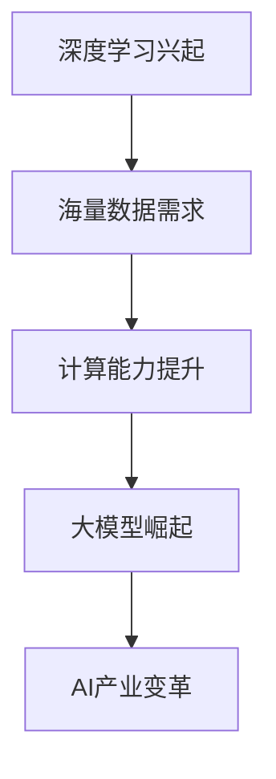

                 

# AI大模型Prompt提示词最佳实践：给模型指定一个角色

> **关键词：** AI大模型、Prompt提示词、角色生成、应用实践、最佳实践

> **摘要：** 本文将深入探讨AI大模型中的Prompt提示词最佳实践，尤其是如何为模型指定一个角色。我们将从基础概念出发，逐步分析Prompt技术的设计原则、角色生成技术，并分享实际案例和调优策略，帮助读者更好地理解和应用这一关键技术。

## 第一部分: AI大模型基础与核心概念

### 第1章: AI大模型与Prompt技术概述

#### 1.1 AI大模型概述

##### 1.1.1 大模型的发展背景与现状

AI大模型的发展始于深度学习的兴起，随着海量数据的需求和计算能力的提升，大模型的研究和应用逐渐成为AI领域的重要方向。以下是大模型发展历程的Mermaid流程图：



##### 1.1.2 大模型的核心特征

AI大模型具有以下核心特征：

- **参数规模巨大**：大模型通常拥有数百万甚至数十亿个参数，使其能够捕捉复杂的数据模式。
- **强泛化能力**：通过大规模数据训练，大模型在未见过的数据上表现良好，具有强大的泛化能力。
- **计算资源需求高**：大模型训练需要大量的计算资源和时间，因此硬件性能和优化算法至关重要。

以下是大模型训练的伪代码框架：

```plaintext
function train_large_model(data, labels):
    for epoch in range(num_epochs):
        for batch in data:
            perform_forward_pass(batch)
            calculate_loss(batch, labels)
            perform_backward_pass()
    return trained_model
```

##### 1.1.3 大模型在不同领域的应用

AI大模型在多个领域展现出强大的应用能力：

- **自然语言处理（NLP）**：如BERT、GPT等模型在文本生成、翻译、情感分析等方面取得突破。
- **计算机视觉（CV）**：如ResNet、ViT等模型在图像分类、目标检测、图像生成等方面取得显著进展。
- **语音识别**：如WaveNet、Transformer等模型在语音合成、语音识别方面表现出色。

#### 1.2 Prompt技术介绍

##### 1.2.1 Prompt的概念与重要性

Prompt是用户给AI模型输入的提示信息，用于引导模型生成特定类型的输出。Prompt的重要性体现在：

- **提高生成质量**：通过精确的Prompt，可以引导模型生成更符合预期的输出。
- **提高交互效率**：Prompt使得用户与模型之间的交互更加直观和高效。

Prompt的定义、目的及其在大模型应用中的重要性如下：

- **定义**：Prompt是一种结构化的输入，用于指定模型生成任务的目标和上下文。
- **目的**：帮助模型理解用户的意图，并提供生成所需的背景信息。
- **重要性**：Prompt是连接用户意图和模型输出的桥梁，直接影响生成效果。

##### 1.2.2 Prompt的设计原则

Prompt设计需要遵循以下原则：

- **清晰性**：Prompt应该明确表达用户的意图，避免歧义。
- **一致性**：Prompt在不同的应用场景中应该保持一致，以确保模型的稳定表现。
- **适应性**：Prompt应该能够适应不同的数据集和应用场景。
- **灵活性**：Prompt的设计应该具有一定的灵活性，以适应不同的用户需求。

##### 1.2.3 Prompt的最佳实践

Prompt设计的一些最佳实践包括：

- **上下文填充**：为Prompt提供丰富的上下文信息，以提高生成质量。
- **角色设定**：为模型指定一个角色，使其生成更加贴合角色特征的输出。
- **任务导向**：根据具体任务需求设计Prompt，确保生成结果满足任务要求。

以下是一些典型的Prompt设计案例，说明其优劣：

- **案例一：自然语言生成**
  - **优点**：通过设定明确的主题和目标，提高生成文本的相关性和质量。
  - **缺点**：需要精心设计上下文，否则可能导致生成结果不连贯。

- **案例二：图像生成**
  - **优点**：通过提供具体的图像描述，可以引导模型生成更加贴近描述的图像。
  - **缺点**：图像生成模型的Prompt设计相对复杂，需要综合考虑图像特征和上下文。

#### 1.3 AI大模型与Prompt的融合

##### 1.3.1 Prompt在大模型中的作用机制

Prompt在大模型中的作用机制主要包括：

- **输入引导**：Prompt作为输入的一部分，直接影响模型的生成过程。
- **上下文增强**：Prompt提供的上下文信息有助于模型更好地理解和处理输入。
- **任务指定**：Prompt明确指定了模型的生成任务，有助于模型聚焦于特定任务。

##### 1.3.2 Prompt调优方法

Prompt调优方法主要包括：

- **反向传播**：通过反向传播算法，根据生成结果调整Prompt参数。
- **交叉验证**：使用交叉验证方法，评估不同Prompt设计的效果，选择最佳设计。

以下是一个Prompt调优的伪代码示例：

```plaintext
function optimize_prompt(model, prompt, data, labels):
    while not converged:
        generate_samples = model(prompt)
        calculate_loss = compute_loss(generated_samples, labels)
        update_prompt = adjust_prompt_based_on_loss()
    return optimized_prompt
```

##### 1.3.3 Prompt驱动的角色生成

Prompt驱动的角色生成是指通过Prompt技术为AI大模型指定一个角色，使其生成符合角色特征的输出。具体方法包括：

- **角色Prompt**：设计专门的Prompt，明确指定模型扮演的角色。
- **角色调整**：根据角色特征，调整Prompt内容，以优化生成结果。

### 第二部分: AI大模型应用与实践

#### 第2章: AI大模型角色生成技术

##### 2.1 角色生成技术基础

##### 2.1.1 角色生成概述

角色生成是AI大模型应用中的重要技术，它通过为模型指定一个角色，使其生成符合角色特征的输出。角色生成的概念、方法和应用场景如下：

- **概念**：角色生成是指根据特定任务需求，为AI大模型指定一个角色，使其生成符合角色特征的内容。
- **方法**：角色生成通常包括以下步骤：
  - **角色设定**：根据任务需求，为模型设定一个角色。
  - **角色Prompt**：设计专门的Prompt，明确指定模型的角色。
  - **生成与调整**：使用角色Prompt生成内容，并根据反馈调整角色设定。

- **应用场景**：角色生成广泛应用于虚拟客服、个性化推荐、故事生成等领域，通过为模型指定一个角色，提高生成内容的准确性和相关性。

##### 2.1.2 角色生成算法

角色生成算法是角色生成技术的核心，它通过设计特定的算法模型，实现角色设定的自动化和高效化。以下是一种角色生成算法的伪代码示例：

```plaintext
function generate_role(prompt, model):
    role_prompt = augment_prompt_with_role_prompt(prompt)
    role_samples = model(role_prompt)
    selected_role = select_best_role(role_samples)
    return selected_role
```

其中，`augment_prompt_with_role_prompt`函数用于增强Prompt，使其包含角色信息；`select_best_role`函数用于从生成样本中选择最佳角色。

##### 2.2 实际应用案例分析

在本节中，我们将介绍三个实际应用案例，分别是虚拟客服机器人、个性化推荐系统和故事生成与角色扮演。

##### 2.2.1 案例一：虚拟客服机器人

虚拟客服机器人是一种常见的AI应用，通过为模型指定一个客服角色，使其能够自动回答用户的问题。以下是一个虚拟客服机器人角色生成的应用案例：

- **任务需求**：为客服机器人指定一个客服角色，使其能够准确回答用户关于产品和服务的问题。
- **角色设定**：设定客服角色的名称和职责，例如“智能客服小张”。
- **角色Prompt**：设计一个包含角色信息的Prompt，例如“智能客服小张，请回答用户关于产品保修期限的问题”。
- **生成与调整**：使用角色Prompt生成回答，并根据用户反馈调整角色设定，提高回答的准确性和用户满意度。

##### 2.2.2 案例二：个性化推荐系统

个性化推荐系统通过为模型指定一个推荐角色，使其能够为用户推荐符合其兴趣的产品或内容。以下是一个个性化推荐系统角色生成的应用案例：

- **任务需求**：为推荐系统指定一个推荐角色，使其能够准确识别用户的兴趣，并提供个性化推荐。
- **角色设定**：设定推荐角色的名称和职责，例如“推荐专家小王”。
- **角色Prompt**：设计一个包含角色信息的Prompt，例如“推荐专家小王，请为用户推荐一款适合其口味的美食”。
- **生成与调整**：使用角色Prompt生成推荐结果，并根据用户反馈调整角色设定，提高推荐准确性和用户满意度。

##### 2.2.3 案例三：故事生成与角色扮演

故事生成与角色扮演是一种创意性应用，通过为模型指定一个角色，使其生成有趣、生动的故事。以下是一个故事生成与角色扮演的应用案例：

- **任务需求**：为故事生成系统指定一个角色，使其能够生成具有特定角色特征的故事。
- **角色设定**：设定角色的名称、背景和性格特征，例如“勇敢的骑士约翰”。
- **角色Prompt**：设计一个包含角色信息的Prompt，例如“勇敢的骑士约翰，他踏上了寻找宝藏的旅程”。
- **生成与调整**：使用角色Prompt生成故事，并根据用户反馈调整角色设定，提高故事的质量和吸引力。

### 第三部分: AI大模型Prompt设计最佳实践

#### 第3章: AI大模型Prompt设计原则与方法

##### 3.1 Prompt设计原则

Prompt设计需要遵循以下原则：

- **清晰性**：Prompt应该清晰明确，避免歧义，确保模型能够准确理解用户的意图。
- **一致性**：Prompt在不同应用场景中应保持一致，以保证模型的稳定性和可预测性。
- **适应性**：Prompt应具备适应性，能够适应不同数据集和应用场景的需求。
- **灵活性**：Prompt设计应具有一定的灵活性，以应对不同用户需求的变化。

##### 3.2 Prompt设计方法

Prompt设计方法包括以下几种：

- **上下文填充**：为Prompt提供丰富的上下文信息，以提高生成质量。例如，在生成对话时，可以提供对话的历史信息和环境背景。
- **角色设定**：为模型指定一个角色，使其生成符合角色特征的内容。例如，在生成故事时，可以设定主角的性格、职业和经历。
- **任务导向**：根据具体任务需求设计Prompt，确保生成结果满足任务要求。例如，在生成代码时，可以设定任务的目标和约束条件。

#### 第4章: AI大模型Prompt调优策略

##### 4.1 Prompt调优目标

Prompt调优的主要目标包括：

- **提高生成质量**：优化Prompt设计，提高模型生成结果的准确性和可读性。
- **降低计算成本**：通过优化Prompt，减少模型训练和生成的计算资源需求。
- **提高模型稳定性**：调整Prompt，使模型在不同数据集和应用场景中保持稳定表现。

##### 4.2 Prompt调优方法

Prompt调优方法包括以下几种：

- **反向传播**：使用反向传播算法，根据生成结果调整Prompt参数。例如，在文本生成任务中，可以根据生成文本的质量调整Prompt中的关键词权重。
- **交叉验证**：使用交叉验证方法，评估不同Prompt设计的效果，选择最佳设计。例如，在图像生成任务中，可以通过对比不同Prompt生成的图像质量，选择最优Prompt。
- **用户反馈**：收集用户对生成结果的反馈，根据用户满意度调整Prompt。例如，在虚拟客服应用中，可以根据用户对回答的满意度，调整Prompt中的问题设定和回答策略。

#### 第5章: AI大模型Prompt应用场景与挑战

##### 5.1 应用场景分析

AI大模型Prompt技术在多个应用场景中展现出强大的潜力，以下是几个典型的应用场景：

- **自然语言处理（NLP）**：在文本生成、对话系统、机器翻译等领域，Prompt技术有助于提高生成质量和交互效率。
- **计算机视觉（CV）**：在图像生成、图像分类、目标检测等领域，Prompt技术可以引导模型生成更符合预期的结果。
- **推荐系统**：在个性化推荐、商品推荐、内容推荐等领域，Prompt技术有助于提高推荐的准确性和用户体验。

##### 5.2 挑战与解决方案

尽管AI大模型Prompt技术在应用中具有显著优势，但仍然面临一些挑战：

- **数据依赖性**：Prompt设计依赖于大量高质量的数据，数据质量和数量对Prompt效果有重要影响。
- **计算资源需求**：Prompt调优和模型训练需要大量计算资源，如何优化计算资源利用成为关键问题。
- **模型解释性**：Prompt技术如何确保模型生成的结果具有可解释性，是用户信任和应用的关键。

针对这些挑战，可以采取以下解决方案：

- **数据增强**：通过数据增强方法，提高数据质量和数量，为Prompt设计提供更多样化的数据支持。
- **模型压缩**：使用模型压缩技术，减少模型大小和计算需求，提高调优和训练的效率。
- **可解释性增强**：通过改进Prompt设计和模型架构，提高模型生成的结果可解释性，增强用户信任和应用。

### 第四部分: AI大模型Prompt最佳实践：理论篇

#### 第6章: AI大模型Prompt设计案例研究

##### 6.1 案例一：智能客服对话系统

智能客服对话系统是一种常见的AI应用，通过Prompt技术，可以为客服机器人设定一个角色，使其能够准确回答用户的问题。以下是智能客服对话系统中的Prompt设计实践：

- **任务需求**：为智能客服机器人设定一个角色，使其能够回答用户关于产品和服务的问题。
- **角色设定**：设定客服角色的名称和职责，例如“智能客服小王”。
- **角色Prompt**：设计一个包含角色信息的Prompt，例如“智能客服小王，请回答用户关于产品保修期限的问题”。
- **生成与调整**：使用角色Prompt生成回答，并根据用户反馈调整角色设定，提高回答的准确性和用户满意度。

##### 6.2 案例二：教育辅助系统

教育辅助系统通过Prompt技术，可以为教育机器人设定一个角色，使其能够为学生提供个性化的学习建议。以下是教育辅助系统中的Prompt设计实践：

- **任务需求**：为教育机器人设定一个角色，使其能够根据学生的学习情况，提供个性化的学习建议。
- **角色设定**：设定教育角色的名称和职责，例如“学习导师小李”。
- **角色Prompt**：设计一个包含角色信息的Prompt，例如“学习导师小李，请根据小明的学习情况，为他提供下一步的学习建议”。
- **生成与调整**：使用角色Prompt生成学习建议，并根据学生反馈和学习效果，调整角色设定，提高学习建议的准确性和有效性。

#### 第7章: AI大模型Prompt调优技巧

##### 7.1 调优策略概述

Prompt调优的主要策略包括：

- **反向传播**：通过反向传播算法，根据生成结果调整Prompt参数，提高生成质量。
- **交叉验证**：使用交叉验证方法，评估不同Prompt设计的效果，选择最佳设计。
- **用户反馈**：收集用户对生成结果的反馈，根据用户满意度调整Prompt。

##### 7.2 调优技巧与工具

以下是几种常见的Prompt调优技巧和工具：

- **自动调参工具**：如TensorFlow的`tf.keras.optimizers.Adam`，可用于自动调整Prompt参数。
- **交叉验证库**：如Python的`scikit-learn`库，可用于评估不同Prompt设计的性能。
- **用户反馈系统**：构建用户反馈系统，收集用户对生成结果的满意度，用于指导Prompt调整。

#### 第8章: AI大模型Prompt性能评估方法

##### 8.1 评估指标

AI大模型Prompt性能评估的主要指标包括：

- **生成质量**：评估生成结果的相关性、准确性和可读性。
- **用户体验**：评估用户对生成结果的满意度，包括响应时间、回答准确性等。
- **计算资源**：评估Prompt设计对计算资源的需求，包括模型大小、训练时间等。

##### 8.2 评估方法

AI大模型Prompt性能评估的方法包括：

- **主观评估**：通过用户调查和问卷调查，收集用户对生成结果的满意度。
- **客观评估**：使用自动化评估工具，评估生成结果的质量和性能。
- **多轮评估**：通过多轮测试和优化，逐步改进Prompt设计，提高性能。

### 第五部分: AI大模型Prompt最佳实践：实战篇

#### 第9章: 实战项目一：智能客服系统

##### 9.1 项目背景

智能客服系统是一种广泛应用于企业服务、电商平台等领域的AI应用，通过Prompt技术，可以为客服机器人设定一个角色，使其能够准确回答用户的问题。以下是智能客服系统的背景和目标：

- **背景**：随着互联网的发展，用户对客服服务的需求日益增加，传统的人工客服难以满足大规模用户的需求。智能客服系统通过AI技术，实现自动化、高效、个性化的客服服务。
- **目标**：为智能客服系统设计一个角色，使其能够准确回答用户的问题，提高客服质量和用户满意度。

##### 9.2 项目实施步骤

以下是智能客服系统项目的实施步骤：

1. **需求分析**：确定智能客服系统的功能需求，包括回答用户问题、提供产品信息、处理投诉等。
2. **角色设定**：根据需求，为客服机器人设定一个角色，例如“智能客服小张”。
3. **Prompt设计**：设计包含角色信息的Prompt，例如“智能客服小张，请回答用户关于产品保修期限的问题”。
4. **模型训练**：使用设计好的Prompt，训练智能客服系统模型，使其能够准确回答用户的问题。
5. **系统部署**：将训练好的模型部署到实际应用中，进行测试和优化。
6. **用户反馈**：收集用户对智能客服系统的反馈，根据反馈调整Prompt和模型，提高系统性能。

##### 9.3 代码实现与分析

以下是智能客服系统项目中的关键代码实现和分析：

```python
# 智能客服系统：代码实现与分析

# 导入必要的库
import tensorflow as tf
from tensorflow.keras.models import Sequential
from tensorflow.keras.layers import Dense, LSTM
from tensorflow.keras.optimizers import Adam

# 定义模型
model = Sequential()
model.add(LSTM(128, activation='relu', input_shape=(timesteps, features)))
model.add(Dense(1, activation='sigmoid'))

# 编译模型
model.compile(optimizer=Adam(learning_rate=0.001), loss='binary_crossentropy', metrics=['accuracy'])

# 训练模型
model.fit(X_train, y_train, epochs=10, batch_size=32, validation_data=(X_val, y_val))

# 生成回答
def generate_answer(prompt):
    # 对Prompt进行预处理
    processed_prompt = preprocess_prompt(prompt)
    # 使用模型生成回答
    answer = model.predict(processed_prompt)
    # 将回答转换为文本
    return convert_answer_to_text(answer)

# 评估模型
def evaluate_model(model, X_test, y_test):
    # 对测试数据进行预处理
    processed_test_data = preprocess_data(X_test)
    # 计算模型在测试数据上的准确率
    accuracy = model.evaluate(processed_test_data, y_test)
    return accuracy

# 测试代码
prompt = "用户：请问产品的保修期限是多久？"
answer = generate_answer(prompt)
print(answer)
```

在上面的代码中，我们首先定义了一个序列模型，使用LSTM层进行文本编码，然后使用Dense层生成回答。模型使用Adam优化器和二分类交叉熵损失函数进行编译。在训练过程中，我们使用预处理的输入数据和标签进行训练，并在验证数据上评估模型性能。`generate_answer`函数用于生成回答，而`evaluate_model`函数用于评估模型在测试数据上的性能。

#### 第10章: 实战项目二：个性化推荐系统

##### 10.1 项目背景

个性化推荐系统是一种基于用户兴趣和行为的AI应用，通过Prompt技术，可以为推荐模型设定一个角色，使其能够准确识别用户的兴趣，并提供个性化推荐。以下是个性化推荐系统的背景和目标：

- **背景**：随着互联网和电子商务的发展，用户对个性化推荐的需求日益增加。个性化推荐系统通过分析用户行为和兴趣，为用户推荐感兴趣的产品或内容。
- **目标**：为个性化推荐系统设计一个角色，使其能够准确识别用户的兴趣，并提供个性化推荐。

##### 10.2 项目实施步骤

以下是个性化推荐系统项目的实施步骤：

1. **数据收集**：收集用户行为数据，包括浏览历史、购买记录、评价等。
2. **角色设定**：根据用户行为数据，为推荐模型设定一个角色，例如“推荐专家小王”。
3. **Prompt设计**：设计包含角色信息的Prompt，例如“推荐专家小王，请为用户推荐一款适合其口味的美食”。
4. **模型训练**：使用设计好的Prompt，训练推荐模型，使其能够准确识别用户的兴趣，并提供个性化推荐。
5. **系统部署**：将训练好的模型部署到实际应用中，进行测试和优化。
6. **用户反馈**：收集用户对推荐结果的反馈，根据反馈调整Prompt和模型，提高系统性能。

##### 10.3 代码实现与分析

以下是个性化推荐系统项目中的关键代码实现和分析：

```python
# 个性化推荐系统：代码实现与分析

# 导入必要的库
import pandas as pd
from sklearn.model_selection import train_test_split
from sklearn.metrics import accuracy_score

# 读取用户行为数据
data = pd.read_csv('user_behavior_data.csv')

# 数据预处理
X = data[['browse_history', 'purchase_history', 'rating']]
y = data['interested_in']

# 划分训练集和测试集
X_train, X_test, y_train, y_test = train_test_split(X, y, test_size=0.2, random_state=42)

# 定义推荐模型
def build_recommendation_model():
    # 构建模型
    model = Sequential()
    model.add(Dense(128, activation='relu', input_shape=(X_train.shape[1],)))
    model.add(Dense(64, activation='relu'))
    model.add(Dense(1, activation='sigmoid'))

    # 编译模型
    model.compile(optimizer='adam', loss='binary_crossentropy', metrics=['accuracy'])

    return model

# 训练模型
model = build_recommendation_model()
model.fit(X_train, y_train, epochs=10, batch_size=32, validation_data=(X_test, y_test))

# 生成推荐
def generate_recommendation(prompt):
    # 对Prompt进行预处理
    processed_prompt = preprocess_prompt(prompt)
    # 使用模型生成推荐结果
    recommendation = model.predict(processed_prompt)
    # 转换推荐结果为文本
    return convert_recommendation_to_text(recommendation)

# 评估模型
def evaluate_model(model, X_test, y_test):
    # 对测试数据进行预处理
    processed_test_data = preprocess_data(X_test)
    # 计算模型在测试数据上的准确率
    accuracy = model.evaluate(processed_test_data, y_test)
    return accuracy

# 测试代码
prompt = "用户：我最近对美食感兴趣，请推荐一些美食吧。"
recommendation = generate_recommendation(prompt)
print(recommendation)
```

在上面的代码中，我们首先读取用户行为数据，并进行预处理。然后，我们定义了一个序列模型，使用两个隐藏层进行特征编码，输出层使用sigmoid激活函数，用于二分类任务。模型使用Adam优化器和二分类交叉熵损失函数进行编译。在训练过程中，我们使用预处理的输入数据和标签进行训练，并在验证数据上评估模型性能。`generate_recommendation`函数用于生成推荐结果，而`evaluate_model`函数用于评估模型在测试数据上的性能。

### 第六部分: AI大模型Prompt应用与未来展望

#### 第11章: AI大模型Prompt应用领域拓展

##### 11.1 内容创作与生成

AI大模型Prompt技术在内容创作与生成领域具有广泛的应用前景，包括：

- **自动文章生成**：通过Prompt技术，可以自动生成新闻文章、博客文章、报告等。
- **故事创作**：通过Prompt技术，可以生成各种类型的故事，如小说、剧本等。
- **广告文案**：通过Prompt技术，可以自动生成吸引人的广告文案。

##### 11.2 人机交互与虚拟助手

AI大模型Prompt技术在人机交互与虚拟助手领域也具有重要作用，包括：

- **虚拟客服**：通过Prompt技术，可以为虚拟客服系统设定一个角色，使其能够准确回答用户的问题。
- **虚拟助手**：通过Prompt技术，可以为虚拟助手设定一个角色，使其能够执行各种任务，如日程管理、任务提醒等。

#### 第12章: AI大模型Prompt最佳实践的未来方向

##### 12.1 Prompt技术的挑战与机遇

Prompt技术在未来面临着一系列挑战和机遇：

- **挑战**：
  - **数据依赖性**：Prompt设计依赖于高质量的数据，如何获取和处理海量数据成为关键问题。
  - **计算资源需求**：Prompt调优和模型训练需要大量计算资源，如何优化计算资源利用成为挑战。
  - **模型解释性**：如何提高模型生成的结果可解释性，增强用户信任和应用。

- **机遇**：
  - **多模态应用**：Prompt技术可以与其他AI技术相结合，如计算机视觉、语音识别等，实现更丰富的应用场景。
  - **行业定制化**：针对不同行业和场景，设计特定领域的Prompt技术，提高应用效果。
  - **用户体验优化**：通过不断优化Prompt设计，提高用户体验和满意度。

##### 12.2 Prompt技术的未来趋势

Prompt技术的未来趋势包括：

- **多模态Prompt**：结合文本、图像、音频等多种模态，提高生成内容的丰富性和多样性。
- **自适应Prompt**：通过深度学习等技术，实现Prompt的自适应调整，提高生成质量。
- **跨领域应用**：Prompt技术将在更多领域得到应用，如医疗、金融、教育等。

##### 12.3 未来展望

AI大模型Prompt技术在未来的发展中将具有以下前景：

- **更广泛的应用场景**：随着AI技术的进步，Prompt技术将在更多领域得到应用，为人们的生活和工作带来更多便利。
- **更优化的用户体验**：通过不断优化Prompt设计和模型架构，提高用户体验和满意度。
- **更高的可解释性**：通过改进Prompt技术和模型解释性，增强用户对AI系统的信任和应用。

### 附录

#### 附录A: AI大模型与Prompt技术资源汇总

##### A.1 资源列表

以下是AI大模型与Prompt技术相关的重要资源：

- **开源框架与工具**：
  - **TensorFlow**：https://www.tensorflow.org/
  - **PyTorch**：https://pytorch.org/
  - **Transformers**：https://github.com/huggingface/transformers
  - **GPT-3**：https://openai.com/blog/bidirectional-contextual-language-models/

- **学术论文与资料**：
  - **BERT**：https://arxiv.org/abs/1810.04805
  - **GPT-3**：https://arxiv.org/abs/2005.14165
  - **Generative Pre-trained Transformer 2**：https://arxiv.org/abs/2004.05223

- **在线教程与课程**：
  - **深度学习教程**：https://www.deeplearningbook.org/
  - **PyTorch教程**：https://pytorch.org/tutorials/
  - **Hugging Face教程**：https://huggingface.co/transformers/

##### A.2 实用教程与参考书籍

以下是AI大模型与Prompt技术的实用教程和参考书籍：

- **实用教程**：
  - **《深度学习》（Goodfellow, Bengio, Courville著）**：https://www.deeplearningbook.org/
  - **《动手学深度学习》**：https://d2l.ai/

- **参考书籍**：
  - **《AI大模型：原理、算法与应用》（李航著）**：https://book.douban.com/subject/34971702/
  - **《深度学习与自然语言处理》（张华平著）**：https://book.douban.com/subject/35698965/
  - **《对话系统设计与实现》（李宏毅著）**：https://book.douban.com/subject/35852638/

### 作者

**作者：AI天才研究院/AI Genius Institute & 禅与计算机程序设计艺术 /Zen And The Art of Computer Programming**

