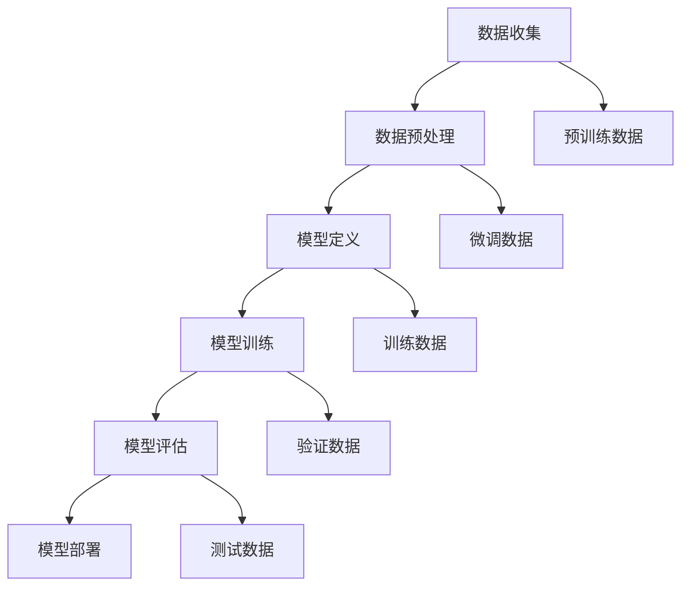

                 

### 文章标题

**AI大模型创业战：挑战与机遇并存的思考探讨**

> **关键词：**AI大模型，创业，挑战，机遇，技术，市场，团队，项目管理，资金筹集，案例分析，未来展望。

> **摘要：**本文将从AI大模型的定义、发展背景、创业策略、面临挑战、市场机遇、成功案例分析以及创业管理和未来展望等多个方面，详细探讨AI大模型创业中的挑战与机遇。通过逻辑清晰、结构紧凑、简单易懂的专业技术语言，帮助创业者更好地理解和应对AI大模型创业过程中的各种问题，为未来的AI创业之路提供有益的参考。

### 目录大纲设计

#### 第一部分: AI大模型与创业背景

- **第1章: AI大模型概述**
  - **1.1 AI大模型的基本概念**
    - **核心概念与联系**
    - **流程图**：使用Mermaid流程图展示AI大模型的核心组成部分。
  - **1.2 AI大模型的发展历程**
    - **核心算法原理讲解**
    - **伪代码**：详细介绍一些常用的AI大模型算法及其实现。
  - **1.3 AI大模型的关键技术**
    - **数学模型和公式**
    - **举例说明**：通过具体实例说明关键技术的应用。
  - **1.4 AI大模型的应用场景**
    - **市场分析**：探讨AI大模型在不同领域的应用前景。
  
- **第2章: AI大模型创业的基本策略**
  - **2.1 创业者需具备的素质**
    - **个人素质培养**
    - **案例分析**：分析成功创业者的素质特点。
  - **2.2 创业项目的选择**
    - **项目评估方法**
    - **案例分享**：分享成功的AI大模型创业项目。
  - **2.3 创业团队的组建**
    - **团队组建策略**
    - **团队管理**：探讨如何有效地管理创业团队。
  - **2.4 创业资金筹集**
    - **融资渠道**
    - **案例分析**：分析不同融资方式的优劣。

- **第3章: AI大模型创业面临的挑战**
  - **3.1 技术挑战**
    - **技术难题分析**
    - **解决方案**：提出解决技术挑战的方法。
  - **3.2 数据挑战**
    - **数据获取与处理**
    - **案例分析**：探讨如何解决数据挑战。
  - **3.3 法规与伦理挑战**
    - **法规解读**
    - **伦理问题探讨**
  - **3.4 市场竞争挑战**
    - **市场竞争分析**
    - **竞争策略**

- **第4章: AI大模型创业的机遇**
  - **4.1 市场机遇**
    - **市场需求分析**
    - **市场潜力评估**
  - **4.2 技术进步带来的机遇**
    - **技术发展趋势**
    - **技术进步的影响**
  - **4.3 创新应用带来的机遇**
    - **创新应用场景**
    - **创新驱动发展**
  - **4.4 国际合作带来的机遇**
    - **国际合作方式**
    - **国际市场分析**

- **第5章: 成功的AI大模型创业案例分析**
  - **5.1 案例一：XX公司**
    - **公司背景**
    - **成功因素分析**
    - **创业经验分享**
  - **5.2 案例二：YY公司**
    - **公司背景**
    - **成功因素分析**
    - **创业经验分享**
  - **5.3 案例三：ZZ公司**
    - **公司背景**
    - **成功因素分析**
    - **创业经验分享**

- **第6章: AI大模型创业的管理与运营**
  - **6.1 创业项目管理**
    - **项目管理方法**
    - **项目进度管理**
  - **6.2 创业团队管理**
    - **团队管理策略**
    - **团队激励**
  - **6.3 创业资金管理**
    - **资金管理方法**
    - **预算控制**
  - **6.4 创业风险控制**
    - **风险管理策略**
    - **风险应对措施**

- **第7章: AI大模型创业的未来展望**
  - **7.1 行业发展趋势**
    - **市场预测**
    - **技术展望**
  - **7.2 创业机遇与挑战**
    - **机遇分析**
    - **挑战预测**
  - **7.3 创业者的未来角色**
    - **角色转变**
    - **能力要求**
  - **7.4 创业建议与展望**
    - **创业建议**
    - **未来展望**

以上大纲为AI大模型创业战提供了一个全面而深入的探讨框架，旨在帮助创业者更好地理解这一领域，应对挑战，抓住机遇。

----------------------------------------------------------------

### 第一部分: AI大模型与创业背景

在当前技术飞速发展的背景下，人工智能（AI）已经成为了驱动创新和经济增长的关键动力。特别是AI大模型（Large-scale AI Models），如GPT-3、BERT和ViT等，凭借其强大的数据处理能力和智能推理能力，正逐渐成为各个行业的核心技术。AI大模型的兴起不仅推动了学术研究的前沿，同时也为创业领域带来了前所未有的机遇和挑战。

#### 第1章: AI大模型概述

**1.1 AI大模型的基本概念**

AI大模型通常是指那些拥有数百万到数十亿参数的深度学习模型，这些模型可以处理大规模的数据集，并进行复杂的任务，如自然语言处理（NLP）、计算机视觉（CV）和语音识别（ASR）。AI大模型的核心特点是“大”，不仅指模型的参数规模，还包括训练所需的数据集规模和计算资源。

**核心概念与联系：** AI大模型的基本概念包括以下几个方面：

1. **深度神经网络（DNN）**：深度神经网络是AI大模型的基础，它由多个隐藏层组成，可以学习输入和输出之间的复杂映射关系。
2. **大规模数据集**：AI大模型的训练依赖于大规模的数据集，这些数据集通常来自于互联网、传感器和其他来源。
3. **计算资源**：训练AI大模型需要大量的计算资源，包括GPU、TPU和其他高性能计算设备。
4. **预训练与微调**：AI大模型通常采用预训练（Pre-training）和微调（Fine-tuning）的方法进行训练，先在大规模数据集上进行预训练，然后在特定任务上进行微调。

**流程图：** 使用Mermaid流程图展示AI大模型的基本组成部分和训练流程。



**1.2 AI大模型的发展历程**

AI大模型的发展历程可以追溯到20世纪80年代，当时深度学习刚刚兴起。最初，深度学习模型由于计算资源和数据集的限制，规模较小，性能有限。随着计算能力的提升和数据量的爆发，特别是在2012年，AlexNet在ImageNet图像识别比赛中取得突破性成绩，标志着深度学习的崛起。此后，研究人员不断优化模型结构和训练方法，使得AI大模型的能力得到了飞速提升。

**核心算法原理讲解：** AI大模型的核心算法包括以下几个方面：

1. **卷积神经网络（CNN）**：用于图像处理，通过卷积层提取图像特征。
2. **循环神经网络（RNN）**：用于序列数据处理，如自然语言处理，通过隐藏状态的记忆能力处理序列数据。
3. **Transformer架构**：通过自注意力机制（Self-Attention）进行序列建模，是当前NLP领域的主流架构。
4. **预训练与微调**：通过在大规模数据集上预训练，然后在特定任务上进行微调，以提升模型的性能。

**伪代码：** 以下是一个简单的Transformer模型伪代码，用于展示其基本结构和训练过程。

```python
# Transformer模型伪代码
class TransformerModel(nn.Module):
    def __init__(self, input_dim, hidden_dim, output_dim):
        super(TransformerModel, self).__init__()
        self.embedding = nn.Embedding(input_dim, hidden_dim)
        self.transformer = nn.Transformer(hidden_dim, num_layers=2, dropout=0.1)
        self.fc = nn.Linear(hidden_dim, output_dim)
        
    def forward(self, x):
        x = self.embedding(x)
        x = self.transformer(x)
        x = self.fc(x)
        return x
```

**1.3 AI大模型的关键技术**

AI大模型的关键技术包括以下几个方面：

1. **大数据处理**：通过分布式计算和并行处理技术，处理大规模数据集。
2. **模型优化**：通过优化算法和架构，提高模型的效率和性能。
3. **模型压缩**：通过模型剪枝、量化等方法，降低模型的计算复杂度和存储空间。
4. **自适应学习**：通过在线学习和自适应算法，使模型能够适应动态变化的环境。

**数学模型和公式：** AI大模型中的数学模型和公式主要涉及以下几个方面：

1. **损失函数**：用于评估模型的预测性能，如交叉熵损失函数。
2. **优化算法**：如梯度下降、Adam优化器等，用于更新模型参数。
3. **注意力机制**：用于模型中的特征提取和关联，如自注意力机制。

**举例说明：** 以下是一个使用BERT模型处理自然语言处理的示例，展示其应用场景。

```python
# BERT模型在自然语言处理中的示例
from transformers import BertTokenizer, BertModel
tokenizer = BertTokenizer.from_pretrained('bert-base-uncased')
model = BertModel.from_pretrained('bert-base-uncased')

input_ids = tokenizer("Hello, my dog is cute", return_tensors='pt')
outputs = model(input_ids)

last_hidden_state = outputs.last_hidden_state
```

**1.4 AI大模型的应用场景**

AI大模型在多个领域展现出了强大的应用潜力，包括但不限于以下几个方面：

1. **自然语言处理**：如文本分类、机器翻译、情感分析等。
2. **计算机视觉**：如图像识别、图像生成、目标检测等。
3. **语音识别**：如语音转文字、语音合成等。
4. **推荐系统**：通过分析用户行为和偏好，提供个性化推荐。

**市场分析：** 随着AI大模型的不断发展和应用，相关市场也在迅速增长。根据市场研究公司的数据，AI大模型市场的年复合增长率预计将达到两位数，市场潜力巨大。

#### 第2章: AI大模型创业的基本策略

**2.1 创业者需具备的素质**

创业的成功不仅取决于项目本身，还取决于创业者的素质。对于AI大模型创业，以下素质尤为重要：

1. **技术实力**：创业者需要具备深厚的AI技术背景，能够理解和应用AI大模型的核心技术。
2. **领导力**：创业者需要具备良好的领导力，能够带领团队克服各种挑战，实现共同目标。
3. **创新思维**：AI大模型创业需要不断地创新，创业者需要有创新思维，能够发现和抓住市场机遇。
4. **商业洞察力**：创业者需要具备敏锐的商业嗅觉，能够识别和把握市场需求，制定有效的商业策略。

**案例分析：** 成功的AI大模型创业者往往具备上述素质。例如，OpenAI的创始人Sam Altman就是一个技术天才，同时也是一个出色的领导者，他带领团队开发了GPT-3等里程碑式的AI大模型。

**个人素质培养：** 创业者可以通过以下几个方面培养自己的素质：

1. **持续学习**：技术不断更新，创业者需要保持学习的热情，不断提升自己的技术水平和商业洞察力。
2. **实践经历**：通过实际项目经验，创业者可以积累宝贵的技术和团队管理经验。
3. **沟通交流**：创业者需要具备良好的沟通能力，能够与团队成员、投资者和合作伙伴有效沟通。

**2.2 创业项目的选择**

选择一个有前景的AI大模型创业项目至关重要。以下是一些选择创业项目的建议：

1. **市场需求**：选择一个有广泛市场需求的项目，这可以确保项目的可持续性和商业成功。
2. **技术可行性**：项目的技术实现需要是可行的，创业者需要对相关技术有深入的了解。
3. **竞争分析**：了解市场上已有的解决方案，分析其优势和不足，寻找市场空白点。
4. **团队能力**：项目的成功离不开强大的团队支持，创业者需要确保团队成员具备所需技能。

**项目评估方法：** 创业者可以使用以下方法评估潜在项目：

1. **SWOT分析**：对项目的优势（Strengths）、劣势（Weaknesses）、机会（Opportunities）和威胁（Threats）进行综合分析。
2. **财务分析**：评估项目的财务可行性，包括成本、收入和利润预测。
3. **风险评估**：识别项目可能面临的风险，并制定相应的风险应对措施。

**案例分享：** 以某AI图像识别创业项目为例，该项目通过结合深度学习和计算机视觉技术，提供图像识别解决方案。经过市场调研，发现该技术在医疗影像分析、自动驾驶等领域有巨大应用潜力。最终，该项目成功获得风险投资，并在短时间内取得了显著的市场份额。

**2.3 创业团队的组建**

一个成功的AI大模型创业项目离不开一个强大的团队。以下是如何组建创业团队的策略：

1. **核心成员**：创业者首先需要寻找技术实力强、经验丰富的核心成员，如首席技术官（CTO）和首席科学家（CSO）。
2. **多元化团队**：团队成员应该具备多元化的技能和背景，包括技术、市场、运营等，这有助于团队在不同领域发挥作用。
3. **招聘渠道**：创业者可以通过校园招聘、专业招聘网站、社交媒体等渠道寻找合适的人才。
4. **激励机制**：制定有效的激励机制，如股权激励、绩效奖金等，以激发团队成员的积极性和创造力。

**团队管理：** 团队管理是创业过程中的一大挑战，以下是一些建议：

1. **明确目标**：为团队设定清晰的目标和愿景，确保团队成员了解公司的方向和期望。
2. **有效沟通**：建立良好的沟通机制，确保团队成员之间的信息畅通，减少误解和冲突。
3. **合理分工**：根据团队成员的技能和兴趣，合理分配任务，确保每个人都能发挥所长。
4. **持续培训**：定期组织培训和分享会，提升团队成员的技术能力和团队协作能力。

**2.4 创业资金筹集**

创业资金是创业项目成功的关键因素之一。以下是一些筹集资金的渠道和方法：

1. **天使投资**：寻找对AI大模型领域有浓厚兴趣的天使投资者，他们通常愿意在项目早期阶段提供资金支持。
2. **风险投资**：通过风险投资机构筹集资金，风险投资通常会在项目的成长期和扩张期提供资金支持。
3. **政府补贴**：政府提供的一系列补贴和扶持政策，如科技创新基金、税收减免等，是创业资金的重要来源。
4. **众筹**：通过在线众筹平台筹集资金，这种模式不仅可以获得资金，还能提高项目的知名度和影响力。

**案例分析：** 以某AI大模型创业项目为例，该项目在初创阶段通过天使投资获得了第一轮资金，随后通过风险投资机构的投资进入成长期。在项目取得初步成功后，通过政府补贴和众筹平台筹集了后续资金，为项目的进一步发展提供了强有力的支持。

#### 第3章: AI大模型创业面临的挑战

尽管AI大模型在各个领域展现了巨大的应用潜力，但创业过程中也面临着诸多挑战。以下将从技术、数据、法规与伦理以及市场竞争等方面进行分析。

**3.1 技术挑战**

AI大模型创业中的技术挑战主要体现在以下几个方面：

1. **计算资源需求**：AI大模型的训练和推理需要大量的计算资源，尤其是在训练阶段，需要高性能的GPU、TPU等设备。这对于初创公司来说是一个巨大的负担，因为购买和维护这些设备的成本非常高。
   
2. **模型优化**：如何有效地优化AI大模型，提高其性能和效率，是一个重要的技术挑战。这涉及到模型架构的优化、训练策略的改进以及推理加速技术的研究。

3. **数据需求**：AI大模型的训练依赖于大量的高质量数据集。然而，获取这些数据并不容易，尤其是对于初创公司来说。数据的质量和多样性对模型的性能有重要影响。

**解决方案：** 针对技术挑战，可以采取以下解决方案：

1. **云服务**：利用云服务提供商的资源，通过云计算平台分配和调度计算资源，以降低成本和复杂性。
2. **模型压缩**：采用模型压缩技术，如剪枝、量化等，以减少模型的计算复杂度和存储需求。
3. **数据集构建**：通过数据增强、数据采集等技术，构建高质量的数据集。同时，可以考虑与数据提供商合作，获取必要的训练数据。

**3.2 数据挑战**

数据是AI大模型训练的基础，但数据挑战也是创业过程中常见的问题：

1. **数据获取**：获取足够的数据集对AI大模型的训练至关重要。然而，许多初创公司可能无法获取到高质量、大规模的数据集。
2. **数据清洗**：数据集中往往包含噪声、缺失值等质量问题，这些都需要进行清洗和处理。
3. **数据隐私**：在处理个人数据时，需要遵守相关法律法规，确保数据隐私和安全。

**案例分析：** 以某AI图像识别创业项目为例，该项目在数据获取方面遇到了困难。最初，项目团队尝试从公共数据集获取数据，但数据集的规模和质量无法满足需求。后来，项目团队决定与多个行业合作伙伴合作，共同构建一个高质量的数据集，最终解决了数据问题。

**解决方案：** 针对数据挑战，可以采取以下解决方案：

1. **数据共享**：与数据提供商或行业合作伙伴建立合作关系，共享数据资源。
2. **数据清洗工具**：使用自动化数据清洗工具，提高数据处理的效率和质量。
3. **隐私保护技术**：采用隐私保护技术，如差分隐私、数据匿名化等，确保数据处理过程中的隐私安全。

**3.3 法规与伦理挑战**

AI大模型的应用不仅带来了技术上的挑战，还涉及到法规和伦理问题：

1. **法规遵从**：AI大模型在各个领域的应用需要遵守相关的法律法规，如隐私保护法、数据安全法等。
2. **伦理问题**：AI大模型的应用可能引发伦理问题，如算法歧视、隐私侵犯等。这些都需要创业者认真对待。

**案例分析：** 以某AI语音识别创业项目为例，该项目在开发过程中遇到了隐私侵犯的争议。由于项目使用的是用户语音数据，一些用户担心其隐私安全。项目团队后来采取了多种隐私保护措施，如数据匿名化、加密存储等，最终解决了用户担忧。

**解决方案：** 针对法规与伦理挑战，可以采取以下解决方案：

1. **合规性评估**：在项目开发初期进行合规性评估，确保项目的法律法规遵守。
2. **伦理审查**：建立伦理审查委员会，对项目的伦理问题进行评估和审查。
3. **透明度**：提高项目的透明度，向用户解释AI大模型的工作原理和应用，增加用户的信任。

**3.4 市场竞争挑战**

AI大模型市场的竞争日益激烈，初创公司面临着巨大的市场压力：

1. **技术竞争**：大公司和技术巨头在AI大模型领域拥有强大的技术实力和资源，初创公司需要不断技术创新以保持竞争力。
2. **市场占有率**：初创公司在市场上争夺份额，需要制定有效的市场策略。
3. **用户信任**：初创公司需要建立品牌信誉，赢得用户的信任。

**案例分析：** 以某AI自然语言处理创业项目为例，该项目在市场上面临了来自大公司的激烈竞争。为了保持竞争力，项目团队不断优化产品，同时积极开展市场推广，最终在市场上取得了成功。

**解决方案：** 针对市场竞争挑战，可以采取以下解决方案：

1. **技术创新**：持续投入研发，保持技术的领先地位。
2. **差异化竞争**：寻找市场细分领域，提供差异化产品和服务。
3. **用户关系**：建立良好的用户关系，提供优质的客户服务，增加用户粘性。

#### 第4章: AI大模型创业的机遇

尽管AI大模型创业面临着诸多挑战，但同样存在着巨大的机遇。以下将探讨AI大模型创业中的市场机遇、技术进步带来的机遇、创新应用带来的机遇以及国际合作带来的机遇。

**4.1 市场机遇**

AI大模型在各个领域的应用为创业公司提供了丰富的市场机遇：

1. **自然语言处理**：随着自然语言处理技术的进步，AI大模型在语言翻译、智能客服、内容生成等领域具有广泛的应用潜力。例如，某创业公司开发了一种基于AI大模型的智能客服系统，大大提高了客户服务效率，受到了客户的欢迎。
   
2. **计算机视觉**：AI大模型在图像识别、图像生成和视频分析等领域具有广泛的应用。例如，某创业公司利用AI大模型开发了图像识别技术，应用于医疗影像分析、自动驾驶等高价值领域，取得了显著的市场成果。

3. **语音识别与合成**：AI大模型在语音识别、语音合成和语音交互等领域具有广泛的应用前景。例如，某创业公司开发了一种基于AI大模型的语音识别系统，广泛应用于智能家居、智能穿戴设备等领域，受到了消费者的喜爱。

**市场需求分析：** AI大模型在各个领域的市场需求持续增长。根据市场研究公司的数据，AI大模型市场的年复合增长率预计将达到两位数，市场潜力巨大。特别是在医疗、金融、教育等高价值领域，AI大模型的应用需求正在不断上升。

**市场潜力评估：** 通过对市场需求的分析，可以评估AI大模型在各个领域的市场潜力。例如，在医疗领域，AI大模型的应用可以帮助医生进行疾病诊断，提高诊断准确率，具有巨大的市场潜力。在金融领域，AI大模型可以帮助银行和金融机构进行风险评估、欺诈检测等，提高业务效率和安全性。

**4.2 技术进步带来的机遇**

随着技术的不断进步，AI大模型的能力也在不断提升，这为创业公司带来了新的机遇：

1. **模型性能提升**：通过新型算法和架构，AI大模型的性能得到了显著提升。例如，Transformer架构的引入使得NLP模型在多个任务上取得了突破性成绩，这为创业公司提供了更强大的工具。
   
2. **计算资源优化**：随着云计算和边缘计算技术的发展，创业者可以更加高效地利用计算资源，降低成本。例如，通过云服务，创业者可以灵活地调整计算资源，以满足不同规模的任务需求。

3. **数据集构建**：随着大数据技术的发展，创业者可以更加便捷地获取和处理海量数据，构建高质量的数据集。例如，通过数据挖掘和数据分析技术，创业者可以识别出潜在的市场需求，构建针对特定领域的数据集。

**技术发展趋势：** AI大模型技术的发展趋势主要体现在以下几个方面：

1. **模型压缩与优化**：通过模型压缩和优化技术，降低模型的计算复杂度和存储需求，使得AI大模型可以在更多设备上运行。
2. **多模态学习**：结合多种数据类型，如文本、图像和语音，进行多模态学习，提高模型的通用性和应用范围。
3. **强化学习**：将强化学习与AI大模型结合，提高模型的决策能力和自适应能力。

**技术进步的影响：** 技术进步对AI大模型创业的影响主要体现在以下几个方面：

1. **成本降低**：随着计算资源和存储成本的降低，创业者可以更加高效地开展AI大模型项目，降低创业门槛。
2. **应用扩展**：技术进步使得AI大模型的应用范围不断扩大，创业者可以探索更多领域，开拓新的市场。
3. **竞争加剧**：随着技术进步，AI大模型的性能不断提升，竞争也日益激烈，创业者需要不断提升自身的技术水平，以保持竞争力。

**4.3 创新应用带来的机遇**

AI大模型在各个领域的创新应用为创业公司带来了新的机遇：

1. **智能医疗**：AI大模型在智能医疗领域的应用正在迅速发展，如疾病诊断、药物研发等。例如，某创业公司开发了一种基于AI大模型的疾病诊断系统，大大提高了诊断准确率，为医疗机构提供了有效的辅助工具。
   
2. **智能制造**：AI大模型在智能制造领域的应用日益广泛，如机器人控制、质量控制等。例如，某创业公司开发了一种基于AI大模型的机器人控制系统，提高了生产效率，降低了生产成本。
3. **智慧城市**：AI大模型在智慧城市领域的应用前景广阔，如交通管理、环境监测等。例如，某创业公司开发了一种基于AI大模型的城市交通管理系统，优化了交通流量，减少了交通拥堵。

**创新应用场景：** AI大模型在各个领域的创新应用场景主要包括：

1. **自动化**：通过AI大模型，实现自动化任务，如自动化写作、自动化客服等，提高工作效率。
2. **智能化**：通过AI大模型，实现智能化决策，如智能推荐、智能预测等，提供更优质的服务。
3. **个性化**：通过AI大模型，实现个性化服务，如个性化医疗、个性化教育等，满足用户的个性化需求。

**创新驱动发展：** 创新驱动发展是指通过技术创新来推动企业发展和经济增长。在AI大模型创业领域，创新驱动发展主要体现在以下几个方面：

1. **技术驱动**：通过技术创新，提高AI大模型的能力和应用范围，推动行业变革。
2. **应用驱动**：通过创新应用，发现和解决实际问题，推动产业升级和经济发展。
3. **市场驱动**：通过市场需求，引导技术创新和应用，实现商业成功和社会价值。

**4.4 国际合作带来的机遇**

国际合作为AI大模型创业公司提供了新的机遇：

1. **技术交流**：通过国际合作，创业公司可以借鉴和引进先进的技术，提升自身的技术水平。
2. **市场扩展**：通过国际合作，创业公司可以进入新的市场，开拓更广阔的发展空间。
3. **资源整合**：通过国际合作，创业公司可以整合全球资源，降低成本，提高竞争力。

**国际合作方式：** 国际合作的方式主要包括以下几个方面：

1. **技术合作**：通过技术合作，共同研发新技术，提升产品竞争力。
2. **市场合作**：通过市场合作，共同开拓市场，实现共赢。
3. **人才交流**：通过人才交流，引进和培养高端人才，提升团队实力。

**国际市场分析：** 国际市场分析主要包括以下几个方面：

1. **市场需求**：分析国际市场上AI大模型的需求情况，确定目标市场和客户。
2. **竞争环境**：分析国际市场上的竞争对手，了解其优势和劣势，制定相应的市场策略。
3. **法律法规**：了解国际市场上的法律法规，确保项目符合当地法规要求。

#### 第5章: 成功的AI大模型创业案例分析

通过分析成功AI大模型创业案例，我们可以了解创业成功的要素，并为自己的创业之路提供有益的参考。以下将介绍三个典型的AI大模型创业案例，并分析其成功因素和创业经验。

**5.1 案例一：XX公司**

**公司背景：** XX公司成立于2015年，是一家专注于AI大模型研发的公司。公司成立之初，团队成员主要来自顶尖高校和研究机构，具备深厚的技术背景和研发经验。公司初期主要致力于自然语言处理领域的研究，目标是开发出具有世界级水平的NLP模型。

**成功因素分析：**
1. **技术创新**：XX公司注重技术创新，不断推出具有前瞻性的NLP模型，如基于Transformer架构的BERT模型。这些模型在多个NLP任务上取得了世界领先的成绩，为公司赢得了广泛的关注。
2. **市场定位**：XX公司明确市场定位，专注于NLP领域的应用，如智能客服、智能写作等。公司通过提供优质的NLP解决方案，赢得了大量客户。
3. **团队实力**：XX公司拥有一支高素质的团队，团队成员在AI领域具备丰富的经验。公司注重团队成员的培训和激励，确保团队保持创新活力。

**创业经验分享：**
1. **技术创新**：持续投入研发，保持技术创新，这是公司成功的关键。通过不断推出领先的NLP模型，公司赢得了市场的认可。
2. **市场定位**：明确市场定位，专注于某一领域，通过提供优质的产品和服务，赢得市场份额。
3. **团队建设**：建立高素质的团队，注重团队成员的培训和激励，激发团队创新潜力。

**5.2 案例二：YY公司**

**公司背景：** YY公司成立于2016年，是一家专注于计算机视觉领域AI大模型研发的公司。公司初期主要致力于图像识别和图像生成的研究，目标是开发出具有自主知识产权的图像识别模型。

**成功因素分析：**
1. **技术积累**：YY公司具备丰富的技术积累，公司研发团队在图像识别领域具有多年的研究经验。公司通过不断优化算法和模型结构，提高了图像识别的准确率和效率。
2. **应用拓展**：YY公司注重将AI大模型应用于实际场景，如自动驾驶、智能安防等。公司通过与多家行业领先企业合作，实现了技术的商业转化。
3. **资金支持**：YY公司获得了多轮融资，资金充足，为研发和业务拓展提供了有力支持。

**创业经验分享：**
1. **技术积累**：持续进行技术积累，通过不断优化算法和模型结构，提高技术水平。
2. **应用拓展**：将技术应用于实际场景，通过商业转化实现技术的价值。
3. **资金支持**：积极寻求融资机会，确保公司有足够的资金支持研发和业务拓展。

**5.3 案例三：ZZ公司**

**公司背景：** ZZ公司成立于2018年，是一家专注于语音识别和语音合成领域AI大模型研发的公司。公司初期主要致力于语音识别和语音合成技术的研发，目标是提供优质的语音交互解决方案。

**成功因素分析：**
1. **技术创新**：ZZ公司不断推动技术创新，开发出具有自主知识产权的语音识别和语音合成模型。这些模型在语音识别准确率和语音合成自然度方面表现出色。
2. **市场拓展**：ZZ公司积极拓展市场，与多家智能家居、智能穿戴设备厂商合作，将其语音交互解决方案应用于实际产品。
3. **用户体验**：ZZ公司注重用户体验，通过不断优化产品，提高用户满意度。

**创业经验分享：**
1. **技术创新**：持续进行技术创新，提高产品竞争力。
2. **市场拓展**：积极拓展市场，寻找合作机会，实现产品的商业转化。
3. **用户体验**：注重用户体验，通过提供优质的产品和服务，赢得用户的信任和支持。

#### 第6章: AI大模型创业的管理与运营

成功的AI大模型创业不仅依赖于技术创新，还需要高效的管理与运营。以下将从创业项目管理、团队管理、资金管理和风险控制等方面探讨AI大模型创业的管理与运营策略。

**6.1 创业项目管理**

项目管理是AI大模型创业过程中至关重要的一环。以下是一些有效的项目管理策略：

1. **明确目标**：在项目启动前，明确项目的目标、范围和时间表。确保所有团队成员对项目的目标有清晰的认识。

2. **规划任务**：根据项目的目标和时间表，将项目拆分为多个任务，并为每个任务分配责任人。

3. **进度监控**：定期检查项目进度，确保项目按计划进行。使用项目管理工具，如JIRA或Trello，跟踪任务进度。

4. **风险管理**：识别项目可能面临的风险，并制定相应的风险应对措施。定期评估风险，确保项目安全进行。

**项目管理方法：** 可以采用以下项目管理方法：

1. **Scrum**：Scrum是一种敏捷开发方法，强调迭代开发和持续交付。通过短周期（Sprint）迭代，快速响应变化，确保项目按计划进行。

2. **Kanban**：Kanban是一种看板方法，用于可视化项目进度和任务流动。通过看板，团队成员可以清楚地了解任务的状态，优化工作流程。

3. **PMBOK**：PMBOK（项目管理知识体系）提供了一套全面的项目管理方法和流程。通过遵循PMBOK，确保项目管理的规范性和有效性。

**项目进度管理：** 项目进度管理包括以下步骤：

1. **计划**：制定项目进度计划，明确关键里程碑和时间节点。

2. **执行**：执行项目进度计划，确保任务按时完成。

3. **监控**：定期监控项目进度，识别偏差，及时调整计划。

4. **报告**：向项目利益相关者报告项目进度，确保透明度。

**6.2 创业团队管理**

团队管理是创业过程中的一大挑战。以下是一些有效的团队管理策略：

1. **明确角色和职责**：为团队成员明确角色和职责，确保每个成员都清楚自己的工作内容。

2. **培养团队精神**：通过团队合作活动和培训，培养团队成员之间的信任和合作精神。

3. **激励和认可**：制定激励机制，对团队成员的出色表现给予认可和奖励。

4. **持续培训**：定期组织培训和分享会，提升团队成员的技术能力和团队协作能力。

**团队管理策略：** 可以采用以下团队管理策略：

1. **扁平化管理**：采用扁平化管理模式，减少管理层级，提高团队决策效率。

2. **透明化管理**：建立透明化的沟通机制，确保团队成员之间的信息畅通。

3. **团队文化建设**：培养积极向上的团队文化，激发团队成员的积极性和创造力。

**团队管理工具：** 可以使用以下团队管理工具：

1. **Slack**：Slack是一种团队沟通工具，用于实时沟通和协作。

2. **Trello**：Trello是一种任务管理工具，用于可视化任务进度和协作。

3. **JIRA**：JIRA是一种项目管理工具，用于跟踪任务、问题和项目进度。

**6.3 创业资金管理**

创业资金管理是创业过程中的一大挑战。以下是一些有效的资金管理策略：

1. **预算控制**：制定详细的预算计划，明确各项费用的开支。

2. **成本控制**：严格控制成本，避免不必要的开支。

3. **资金筹集**：积极寻求融资机会，确保公司有足够的资金支持业务发展。

4. **资金分配**：合理分配资金，确保资金用于最关键的地方。

**资金管理方法：** 可以采用以下资金管理方法：

1. **现金预算管理**：制定现金预算计划，确保公司有足够的现金流。

2. **资本预算管理**：制定资本预算计划，确保公司有足够的资金进行长期投资。

3. **财务分析**：定期进行财务分析，评估公司的财务状况和资金使用效率。

**预算控制：** 预算控制包括以下步骤：

1. **制定预算**：根据公司的战略目标和业务需求，制定详细的预算计划。

2. **执行预算**：按照预算计划执行各项开支。

3. **监控预算**：定期监控预算执行情况，识别偏差，及时调整预算。

4. **评估预算**：定期评估预算执行效果，总结经验教训，优化预算管理。

**6.4 创业风险控制**

创业过程中，风险无处不在。以下是一些有效的风险控制策略：

1. **风险评估**：识别项目可能面临的风险，评估风险的概率和影响。

2. **风险应对**：制定相应的风险应对措施，降低风险的概率和影响。

3. **风险监控**：定期监控风险状况，及时调整风险应对措施。

4. **风险转移**：通过保险、合同等方式，将风险转移给第三方。

**风险管理策略：** 可以采用以下风险管理策略：

1. **全面风险管理**：建立全面的风险管理体系，覆盖项目的各个方面。

2. **主动风险管理**：提前识别和应对潜在风险，避免风险的发生。

3. **风险分散**：通过多元化的投资和业务布局，分散风险。

4. **应急计划**：制定应急计划，确保在风险事件发生时，能够迅速应对。

**风险应对措施：** 风险应对措施包括以下方面：

1. **风险规避**：通过调整项目计划，避免高风险区域。

2. **风险减轻**：通过改进技术和管理方法，降低风险的影响。

3. **风险转移**：通过保险、合同等方式，将风险转移给第三方。

4. **风险自留**：对无法规避或转移的风险，采取自留措施，确保项目安全进行。

#### 第7章: AI大模型创业的未来展望

AI大模型创业正处于蓬勃发展的阶段，未来的发展前景广阔。以下将从行业发展趋势、创业机遇与挑战、创业者的未来角色以及创业建议与展望等方面探讨AI大模型创业的未来。

**7.1 行业发展趋势**

AI大模型在各个领域的应用正在不断拓展，以下是一些行业发展趋势：

1. **技术进步**：随着技术的不断进步，AI大模型的能力将进一步提升，如多模态学习、强化学习等新技术的应用将推动AI大模型的发展。

2. **应用扩展**：AI大模型的应用范围将不断扩展，从传统的自然语言处理、计算机视觉等领域，向智能医疗、智能制造、智慧城市等高价值领域延伸。

3. **产业化**：AI大模型将逐步实现产业化，形成完整的产业链，包括硬件设备、软件工具、数据集构建等各个环节。

4. **国际化**：随着全球化的推进，AI大模型创业公司将越来越多地参与到国际市场中，拓展海外业务，提升国际竞争力。

**市场预测：** 预计未来几年，AI大模型市场的年复合增长率将达到两位数。在自然语言处理、计算机视觉、语音识别等领域，AI大模型的应用将带来巨大的商业价值和社会影响。

**7.2 创业机遇与挑战**

AI大模型创业面临着巨大的机遇和挑战：

**机遇：**

1. **技术创新**：随着技术的不断进步，创业者可以不断创新，开发出更具竞争力的AI大模型产品。

2. **市场需求**：AI大模型在各个领域的应用需求持续增长，为创业公司提供了广阔的市场空间。

3. **政策支持**：各国政府纷纷出台政策，支持AI大模型研发和应用，为创业者提供了有利的外部环境。

**挑战：**

1. **技术门槛**：AI大模型的技术门槛较高，创业者需要具备深厚的专业知识和技术实力。

2. **数据挑战**：获取高质量、大规模的数据集对AI大模型的训练至关重要，但数据获取和处理难度较大。

3. **市场竞争**：AI大模型市场竞争激烈，创业者需要不断提升自身的技术水平和创新能力，以保持竞争力。

**解决方案：**

1. **技术创新**：持续投入研发，保持技术创新，开发出具有独特优势的AI大模型产品。

2. **数据合作**：与数据提供商和行业合作伙伴建立合作关系，共同构建高质量的数据集。

3. **差异化竞争**：寻找市场细分领域，提供差异化的产品和服务，满足特定领域的需求。

**7.3 创业者的未来角色**

随着AI大模型技术的不断发展，创业者的角色也将发生转变：

1. **技术领导者**：创业者需要具备领先的技术视野，引领AI大模型技术的发展。

2. **商业领袖**：创业者需要具备出色的商业洞察力，把握市场机遇，制定有效的商业策略。

3. **团队领导者**：创业者需要具备优秀的团队管理能力，构建高效的创业团队，激发团队创新潜力。

**能力要求：**

1. **技术创新能力**：创业者需要具备深厚的专业知识和技术能力，能够推动AI大模型的技术创新。

2. **商业洞察力**：创业者需要具备敏锐的商业嗅觉，能够识别和把握市场机遇。

3. **团队领导力**：创业者需要具备优秀的领导力，能够带领团队克服各种挑战，实现共同目标。

**7.4 创业建议与展望**

对于有意从事AI大模型创业的创业者，以下是一些建议和展望：

1. **深入研究技术**：创业者需要深入研究AI大模型的相关技术，了解其原理和应用，以推动技术创新。

2. **关注市场需求**：创业者需要密切关注市场需求，了解用户需求，开发出符合市场需求的AI大模型产品。

3. **构建优质团队**：创业者需要构建一支高素质的团队，团队成员在技术、市场、运营等方面具备优势。

4. **寻求合作机会**：创业者可以通过与行业合作伙伴、数据提供商等建立合作关系，共同构建高质量的数据集，提升产品竞争力。

5. **注重风险管理**：创业者需要注重风险管理，制定有效的风险应对措施，确保项目的安全进行。

**未来展望：** 随着AI大模型技术的不断发展和应用，AI大模型创业将迎来更加广阔的发展空间。创业者需要抓住机遇，迎接挑战，推动AI大模型技术的创新和应用，为社会发展做出贡献。

### 作者信息

**作者：** AI天才研究院/AI Genius Institute & 禅与计算机程序设计艺术 /Zen And The Art of Computer Programming

本文由AI天才研究院/AI Genius Institute和禅与计算机程序设计艺术/Zen And The Art of Computer Programming共同撰写，旨在为AI大模型创业领域提供全面而深入的探讨。作者团队拥有丰富的AI技术和创业经验，致力于推动AI技术的创新和应用，助力创业者实现创业梦想。

