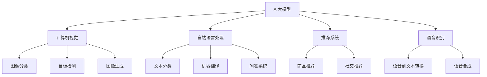

                 

### 《AI大模型创业：如何构建未来可持续的商业模式？》

> **关键词：** AI大模型、创业、商业模式、可持续性、技术创新、挑战与机遇

> **摘要：** 本文将从AI大模型的基本概念、创业机会与挑战、商业模式设计与实施、可持续发展以及未来展望等多个维度，探讨如何构建AI大模型创业的可持续商业模式。通过深入分析AI大模型的本质，以及其在不同领域的应用，本文将提供一系列实用的策略和建议，旨在为AI创业者和企业高管提供有价值的参考。

### 《AI大模型创业：如何构建未来可持续的商业模式？》目录大纲

1. **AI大模型概述**
   1.1. **AI大模型的基本概念**
   1.2. **AI大模型的分类**
   1.3. **AI大模型的发展历程**

2. **创业机会与挑战**
   2.1. **AI大模型创业的潜在领域**
   2.2. **AI大模型创业的优势与劣势**
   2.3. **AI大模型创业面临的挑战**

3. **商业模式设计与实施**
   3.1. **商业模式核心要素**
   3.2. **AI大模型商业模式策略**
   3.3. **商业模式案例解析**

4. **可持续发展**
   4.1. **可持续发展的核心要素**
   4.2. **AI大模型商业模式可持续发展的策略**
   4.3. **可持续发展案例解析**

5. **未来展望**
   5.1. **未来发展趋势分析**
   5.2. **未来挑战与机遇**
   5.3. **未来发展策略建议**

6. **附录**
   6.1. **AI大模型相关资源与工具**
   6.2. **模式示例Mermaid图**
   6.3. **算法伪代码示例**
   6.4. **数学公式与解释**
   6.5. **项目实战案例**

#### 第一部分：AI大模型概述

### 第1章: AI大模型概述

#### 1.1 AI大模型的基本概念

##### 1.1.1 AI大模型的定义

AI大模型是指那些在训练数据集和计算资源都非常庞大时，能够在各种任务上取得卓越性能的人工智能模型。这些模型通常涉及数十亿到数万亿的参数，需要在高性能计算环境中进行训练。

##### 1.1.2 AI大模型的特点

- **规模巨大**：参数数量多，数据规模大。
- **计算资源需求高**：训练时间较长，需要大规模计算资源。
- **性能卓越**：在特定任务上能实现超越人类的性能。
- **应用广泛**：涵盖图像识别、自然语言处理、推荐系统等多个领域。

#### 1.2 AI大模型的分类

##### 1.2.1 按照应用领域分类

- **计算机视觉**：如图像分类、目标检测、图像生成等。
- **自然语言处理**：如文本分类、机器翻译、问答系统等。
- **推荐系统**：如商品推荐、社交推荐等。
- **语音识别**：如语音到文本转换、语音合成等。

##### 1.2.2 按照训练方法分类

- **基于深度学习**：如卷积神经网络（CNN）、循环神经网络（RNN）、生成对抗网络（GAN）等。
- **基于迁移学习**：利用预训练模型在特定任务上进行微调。
- **基于强化学习**：通过与环境交互来学习策略。

##### 1.2.3 按照模型规模分类

- **小型模型**：参数数量较少，适用于资源受限的场景。
- **中型模型**：参数数量适中，具有一定的计算资源需求。
- **大型模型**：参数数量数十亿到数千亿，需要大规模计算资源。
- **超大型模型**：参数数量数万亿以上，需要超级计算机级别的计算资源。

#### 1.3 AI大模型的发展历程

##### 1.3.1 AI大模型的起源

AI大模型的概念起源于深度学习领域。2006年，Hinton等人提出了深度置信网络（DBN），为后来的深度学习大模型奠定了基础。

##### 1.3.2 AI大模型的发展阶段

- **初期阶段**：2006年至2012年，深度学习取得突破性进展。
- **快速发展阶段**：2012年至2016年，基于卷积神经网络（CNN）的大模型在图像识别任务上取得显著成果。
- **大规模应用阶段**：2016年至今，AI大模型在各个领域得到广泛应用。

##### 1.3.3 AI大模型的发展趋势

- **模型规模不断扩大**：随着计算资源的增加，模型规模将不断突破现有限制。
- **多模态融合**：将图像、文本、语音等多种数据类型进行融合，实现更广泛的应用。
- **自主学习和推理能力提升**：通过强化学习和迁移学习等技术，提升模型的自主学习和推理能力。

#### 第一部分：AI大模型概述

### 第1章: AI大模型概述

#### 1.1 AI大模型的基本概念

##### 1.1.1 AI大模型的定义

AI大模型是指那些在训练数据集和计算资源都非常庞大时，能够在各种任务上取得卓越性能的人工智能模型。这些模型通常涉及数十亿到数万亿的参数，需要在高性能计算环境中进行训练。

##### 1.1.2 AI大模型的特点

- **规模巨大**：参数数量多，数据规模大。
- **计算资源需求高**：训练时间较长，需要大规模计算资源。
- **性能卓越**：在特定任务上能实现超越人类的性能。
- **应用广泛**：涵盖图像识别、自然语言处理、推荐系统等多个领域。

#### 1.2 AI大模型的分类

##### 1.2.1 按照应用领域分类

- **计算机视觉**：如图像分类、目标检测、图像生成等。
- **自然语言处理**：如文本分类、机器翻译、问答系统等。
- **推荐系统**：如商品推荐、社交推荐等。
- **语音识别**：如语音到文本转换、语音合成等。

##### 1.2.2 按照训练方法分类

- **基于深度学习**：如卷积神经网络（CNN）、循环神经网络（RNN）、生成对抗网络（GAN）等。
- **基于迁移学习**：利用预训练模型在特定任务上进行微调。
- **基于强化学习**：通过与环境交互来学习策略。

##### 1.2.3 按照模型规模分类

- **小型模型**：参数数量较少，适用于资源受限的场景。
- **中型模型**：参数数量适中，具有一定的计算资源需求。
- **大型模型**：参数数量数十亿到数千亿，需要大规模计算资源。
- **超大型模型**：参数数量数万亿以上，需要超级计算机级别的计算资源。

#### 1.3 AI大模型的发展历程

##### 1.3.1 AI大模型的起源

AI大模型的概念起源于深度学习领域。2006年，Hinton等人提出了深度置信网络（DBN），为后来的深度学习大模型奠定了基础。

##### 1.3.2 AI大模型的发展阶段

- **初期阶段**：2006年至2012年，深度学习取得突破性进展。
- **快速发展阶段**：2012年至2016年，基于卷积神经网络（CNN）的大模型在图像识别任务上取得显著成果。
- **大规模应用阶段**：2016年至今，AI大模型在各个领域得到广泛应用。

##### 1.3.3 AI大模型的发展趋势

- **模型规模不断扩大**：随着计算资源的增加，模型规模将不断突破现有限制。
- **多模态融合**：将图像、文本、语音等多种数据类型进行融合，实现更广泛的应用。
- **自主学习和推理能力提升**：通过强化学习和迁移学习等技术，提升模型的自主学习和推理能力。

#### 第一部分：AI大模型概述

### 第1章: AI大模型概述

#### 1.1 AI大模型的基本概念

##### 1.1.1 AI大模型的定义

AI大模型是指那些在训练数据集和计算资源都非常庞大时，能够在各种任务上取得卓越性能的人工智能模型。这些模型通常涉及数十亿到数万亿的参数，需要在高性能计算环境中进行训练。

##### 1.1.2 AI大模型的特点

- **规模巨大**：参数数量多，数据规模大。
- **计算资源需求高**：训练时间较长，需要大规模计算资源。
- **性能卓越**：在特定任务上能实现超越人类的性能。
- **应用广泛**：涵盖图像识别、自然语言处理、推荐系统等多个领域。

#### 1.2 AI大模型的分类

##### 1.2.1 按照应用领域分类

- **计算机视觉**：如图像分类、目标检测、图像生成等。
- **自然语言处理**：如文本分类、机器翻译、问答系统等。
- **推荐系统**：如商品推荐、社交推荐等。
- **语音识别**：如语音到文本转换、语音合成等。

##### 1.2.2 按照训练方法分类

- **基于深度学习**：如卷积神经网络（CNN）、循环神经网络（RNN）、生成对抗网络（GAN）等。
- **基于迁移学习**：利用预训练模型在特定任务上进行微调。
- **基于强化学习**：通过与环境交互来学习策略。

##### 1.2.3 按照模型规模分类

- **小型模型**：参数数量较少，适用于资源受限的场景。
- **中型模型**：参数数量适中，具有一定的计算资源需求。
- **大型模型**：参数数量数十亿到数千亿，需要大规模计算资源。
- **超大型模型**：参数数量数万亿以上，需要超级计算机级别的计算资源。

#### 1.3 AI大模型的发展历程

##### 1.3.1 AI大模型的起源

AI大模型的概念起源于深度学习领域。2006年，Hinton等人提出了深度置信网络（DBN），为后来的深度学习大模型奠定了基础。

##### 1.3.2 AI大模型的发展阶段

- **初期阶段**：2006年至2012年，深度学习取得突破性进展。
- **快速发展阶段**：2012年至2016年，基于卷积神经网络（CNN）的大模型在图像识别任务上取得显著成果。
- **大规模应用阶段**：2016年至今，AI大模型在各个领域得到广泛应用。

##### 1.3.3 AI大模型的发展趋势

- **模型规模不断扩大**：随着计算资源的增加，模型规模将不断突破现有限制。
- **多模态融合**：将图像、文本、语音等多种数据类型进行融合，实现更广泛的应用。
- **自主学习和推理能力提升**：通过强化学习和迁移学习等技术，提升模型的自主学习和推理能力。

### 第2章: AI大模型创业机会

#### 2.1 AI大模型创业的潜在领域

##### 2.1.1 金融科技

金融科技（FinTech）是一个快速发展的领域，AI大模型在金融科技中的应用前景广阔。例如，通过AI大模型，可以实现智能投顾、风险控制、信用评分等功能，提高金融机构的运营效率和服务质量。

##### 2.1.2 医疗健康

医疗健康行业对AI大模型的需求日益增长。AI大模型在医学图像分析、疾病诊断、药物研发等方面具有显著优势，有助于提高医疗服务的精准度和效率。

##### 2.1.3 教育科技

教育科技（EdTech）领域也已成为AI大模型的重要应用场景。AI大模型可以应用于智能教学、个性化学习、学习分析等领域，提升教育质量和学习效果。

##### 2.1.4 制造业与供应链

制造业与供应链领域可以利用AI大模型实现智能优化、预测维护、质量控制等功能，提高生产效率和质量。

##### 2.1.5 其他行业应用

除了上述领域，AI大模型在其他行业如零售、物流、能源等也有广泛的应用前景。例如，通过AI大模型，可以实现智能库存管理、精准营销、智能物流规划等，提升企业运营效率。

#### 2.2 AI大模型创业的优势与劣势

##### 2.2.1 优势分析

- **技术创新**：AI大模型具有强大的技术创新能力，能够推动各行业的技术进步。
- **市场潜力**：随着AI大模型技术的不断成熟和应用场景的拓展，市场需求持续增长。
- **高附加值**：AI大模型的应用能够为企业带来显著的经济效益，具有较高的附加值。

##### 2.2.2 劣势分析

- **技术挑战**：AI大模型的研发和应用面临较高的技术门槛，需要大量的计算资源和专业知识。
- **数据隐私**：AI大模型在训练和应用过程中涉及大量数据，数据隐私和安全问题不容忽视。
- **法律法规**：AI大模型的应用涉及法律法规的合规性问题，需要关注相关政策和法规的变化。

#### 2.3 AI大模型创业面临的挑战

##### 2.3.1 技术挑战

AI大模型创业面临的技术挑战主要包括：

- **计算资源**：训练大型模型需要庞大的计算资源，成本较高。
- **数据质量**：高质量的数据是AI大模型训练的基础，数据质量和来源需要严格控制。
- **算法优化**：如何优化算法，提高模型的性能和效率，是技术发展的关键。

##### 2.3.2 法律法规挑战

AI大模型创业面临的法律法规挑战主要包括：

- **数据隐私**：涉及个人隐私数据的使用和处理，需要遵循相关法律法规。
- **版权问题**：在使用和开发AI大模型时，可能涉及知识产权的问题，需要妥善处理。
- **监管政策**：不同国家和地区的监管政策存在差异，需要关注政策变化，确保合规运营。

##### 2.3.3 数据隐私挑战

AI大模型在训练和应用过程中，涉及大量数据的收集和处理，数据隐私问题成为重要的挑战。例如：

- **数据泄露**：未经授权的数据泄露可能导致用户隐私受到侵害。
- **数据滥用**：不当使用数据可能导致数据滥用，损害用户权益。
- **合规性**：需要遵循相关法律法规，确保数据使用的合规性。

##### 2.3.4 市场竞争挑战

AI大模型创业面临的市场竞争挑战主要包括：

- **技术竞争**：各企业纷纷布局AI大模型技术，竞争激烈。
- **市场份额**：需要争夺有限的市场份额，提高市场占有率。
- **用户信任**：建立用户信任，提高用户满意度，是获得市场份额的关键。

### 第3章: AI大模型商业模式设计

#### 3.1 商业模式核心要素

##### 3.1.1 用户价值

用户价值是商业模式的核心要素之一。AI大模型创业需要关注如何为用户提供有价值的服务。例如，通过AI大模型，可以为用户提供个性化的推荐、智能诊断、预测分析等服务，提高用户的生活质量和幸福感。

##### 3.1.2 成本结构

成本结构是指企业在运营过程中所产生的各项成本。对于AI大模型创业来说，成本结构主要包括：

- **研发成本**：包括算法研发、模型训练、数据采集和处理等。
- **硬件成本**：包括服务器、存储设备、GPU等硬件设施。
- **运营成本**：包括人员工资、办公场所、维护等。
- **营销成本**：包括广告、市场推广、用户拓展等。

##### 3.1.3 收入来源

收入来源是指企业通过商业模式获取的收益。对于AI大模型创业来说，收入来源主要包括：

- **产品销售**：通过销售AI大模型产品或服务获得收益。
- **广告收入**：通过为广告主提供智能推荐、精准广告等服务获得收益。
- **订阅模式**：通过订阅模式为用户提供持续的服务，获得定期收益。
- **合作分成**：与其他企业合作，通过分成模式获得收益。

##### 3.1.4 资源配置

资源配置是指企业将有限的资源合理分配到各个业务领域。对于AI大模型创业来说，资源配置主要包括：

- **人力配置**：根据业务需求，合理分配研发、运营、营销等人员。
- **资金配置**：合理分配研发资金、运营资金、营销资金等。
- **技术配置**：根据业务需求，选择合适的技术路线，合理配置技术资源。
- **数据配置**：确保数据质量和数据安全，合理配置数据资源。

#### 3.2 AI大模型商业模式策略

##### 3.2.1 价值网策略

价值网策略是指通过构建一个多边平台，连接不同的利益相关方，实现资源共享和协同创新。对于AI大模型创业来说，价值网策略包括：

- **平台建设**：构建一个开放的平台，连接用户、开发者、合作伙伴等。
- **生态合作**：与其他企业、研究机构、高校等建立合作关系，共同推进AI大模型技术的发展。
- **资源共享**：通过平台实现资源的共享和协同，降低成本，提高效率。

##### 3.2.2 用户参与策略

用户参与策略是指通过激励用户参与，提高用户满意度和忠诚度。对于AI大模型创业来说，用户参与策略包括：

- **用户反馈**：鼓励用户反馈意见和建议，不断优化产品和服务。
- **用户共创**：与用户共同参与产品研发和设计，提高产品的实用性和创新性。
- **用户激励**：通过积分、奖励等方式，激励用户积极参与。

##### 3.2.3 开放式创新策略

开放式创新策略是指通过开放合作，整合外部资源和知识，实现创新。对于AI大模型创业来说，开放式创新策略包括：

- **开源平台**：构建开源平台，鼓励外部开发者参与，共同推进技术发展。
- **合作伙伴**：与行业内外合作伙伴建立合作关系，共同研发新产品和服务。
- **开放接口**：提供开放接口，方便其他企业和开发者集成和扩展。

##### 3.2.4 预付费模式

预付费模式是指通过提前收取用户费用，实现收入的提前确认。对于AI大模型创业来说，预付费模式包括：

- **订阅模式**：用户提前支付订阅费用，享受持续的服务。
- **套餐模式**：提供不同套餐，用户根据需求选择合适的套餐。
- **包年包月**：提供包年包月服务，降低用户使用成本。

#### 3.3 商业模式案例解析

##### 3.3.1 案例一：微软Azure AI服务

微软Azure AI服务是一个典型的AI大模型商业模式案例。微软通过构建一个开放的平台，连接开发者、企业和用户，提供丰富的AI服务，包括图像识别、自然语言处理、语音识别等。商业模式策略主要包括：

- **价值网策略**：通过构建Azure AI平台，连接开发者、企业和用户，实现资源共享和协同创新。
- **用户参与策略**：鼓励用户反馈意见和建议，不断优化产品和服务。
- **开放式创新策略**：与合作伙伴共同研发新产品和服务，提供开放接口，方便其他企业和开发者集成和扩展。

##### 3.3.2 案例二：谷歌DeepMind在医疗领域的应用

谷歌DeepMind在医疗领域的应用也是一个典型的AI大模型商业模式案例。DeepMind通过开发AI大模型，应用于医学图像分析、疾病诊断等领域，为医疗机构提供智能化的诊断和治疗方案。商业模式策略主要包括：

- **价值网策略**：与医疗机构合作，构建一个医疗AI生态系统，实现资源共享和协同创新。
- **用户参与策略**：与医生和患者共同参与产品研发和设计，提高产品的实用性和创新性。
- **预付费模式**：提供订阅服务，用户提前支付费用，享受智能诊断和治疗方案。

### 第4章: AI大模型商业模式的可持续发展

#### 4.1 可持续发展的核心要素

##### 4.1.1 社会责任

社会责任是指企业在经营过程中，对社会责任的关注和承担。对于AI大模型创业来说，可持续发展需要关注以下几个方面：

- **伦理道德**：确保AI大模型的应用符合伦理道德标准，尊重用户隐私和权益。
- **社会责任**：关注企业的社会责任，积极参与公益活动，为社会做出贡献。
- **环境责任**：关注环境保护，减少能源消耗和碳排放，推动绿色可持续发展。

##### 4.1.2 可持续性

可持续性是指企业在长期发展中，能够持续创造价值，实现经济效益、社会效益和环境效益的平衡。对于AI大模型创业来说，可持续发展需要关注以下几个方面：

- **技术创新**：持续进行技术创新，提高AI大模型的技术水平，保持竞争优势。
- **商业模式**：探索可持续的商业模式，实现持续收入和利润。
- **资源优化**：合理配置资源，提高资源利用效率，降低成本。

##### 4.1.3 创新能力

创新能力是指企业在面对市场变化和挑战时，能够迅速调整和创新，实现持续发展的能力。对于AI大模型创业来说，可持续发展需要关注以下几个方面：

- **研发投入**：加大研发投入，持续推动技术进步和创新。
- **人才培养**：重视人才培养，培养具有创新能力和专业技能的人才。
- **开放合作**：与行业内外合作伙伴建立合作关系，共同推动技术创新。

#### 4.2 AI大模型商业模式可持续发展的策略

##### 4.2.1 资源优化利用

资源优化利用是指企业在运营过程中，通过合理配置和利用资源，提高资源利用效率，降低成本。对于AI大模型创业来说，资源优化利用包括以下几个方面：

- **计算资源**：充分利用云计算、分布式计算等先进技术，提高计算资源的利用效率。
- **数据资源**：建立高效的数据管理体系，确保数据质量和数据安全。
- **人力资源**：合理配置人力资源，提高员工的工作效率。

##### 4.2.2 产业链整合

产业链整合是指企业通过整合产业链上下游资源，提高整体竞争力。对于AI大模型创业来说，产业链整合包括以下几个方面：

- **上下游合作**：与产业链上下游企业建立合作关系，实现资源互补和协同创新。
- **供应链管理**：建立高效的供应链管理体系，降低成本，提高交付效率。
- **平台化运营**：构建一个开放的平台，连接开发者、企业和用户，实现资源共享和协同创新。

##### 4.2.3 持续技术创新

持续技术创新是指企业通过不断进行技术创新，推动技术进步，保持竞争优势。对于AI大模型创业来说，持续技术创新包括以下几个方面：

- **研发投入**：加大研发投入，持续推动技术进步和创新。
- **技术积累**：积累核心技术，提高技术储备。
- **合作研发**：与高校、科研机构等建立合作关系，共同推动技术创新。

##### 4.2.4 社会影响力提升

社会影响力提升是指企业通过积极履行社会责任，提高社会影响力。对于AI大模型创业来说，社会影响力提升包括以下几个方面：

- **公益活动**：积极参与公益活动，回馈社会。
- **社会责任**：关注社会责任，推动可持续发展。
- **品牌建设**：通过品牌建设，提高企业知名度和社会认可度。

#### 4.3 可持续发展案例解析

##### 4.3.1 案例一：特斯拉的可持续发展战略

特斯拉是一家电动汽车和清洁能源公司，其可持续发展战略包括以下几个方面：

- **技术创新**：持续进行技术创新，推动电动汽车和清洁能源技术的发展。
- **产业链整合**：与产业链上下游企业建立合作关系，实现资源互补和协同创新。
- **社会责任**：积极参与公益活动，回馈社会，推动可持续发展。

特斯拉的可持续发展战略使其在电动汽车和清洁能源领域取得了显著成果，成为行业的领军企业。

##### 4.3.2 案例二：飞利浦在医疗健康领域的可持续发展

飞利浦是一家全球医疗健康公司，其在医疗健康领域的可持续发展战略包括以下几个方面：

- **技术创新**：持续进行技术创新，推动医疗健康技术的发展。
- **产业链整合**：与产业链上下游企业建立合作关系，实现资源互补和协同创新。
- **社会责任**：关注社会责任，推动医疗健康技术的普及和应用。

飞利浦的可持续发展战略使其在医疗健康领域取得了显著成果，为全球医疗健康事业做出了贡献。

### 第5章: AI大模型商业模式的未来趋势

#### 5.1 未来发展趋势分析

##### 5.1.1 AI大模型技术创新趋势

AI大模型技术创新将继续深入，预计未来将出现以下趋势：

- **模型规模扩大**：随着计算资源的增加，AI大模型的规模将不断扩大。
- **多模态融合**：将图像、文本、语音等多种数据类型进行融合，实现更广泛的应用。
- **自主学习和推理能力提升**：通过强化学习和迁移学习等技术，提升模型的自主学习和推理能力。
- **量子计算**：量子计算的发展将为AI大模型提供更强大的计算能力。

##### 5.1.2 AI大模型行业应用趋势

AI大模型在行业应用方面将继续拓展，预计未来将出现以下趋势：

- **金融科技**：AI大模型在金融科技领域的应用将更加广泛，如智能投顾、风险控制、信用评分等。
- **医疗健康**：AI大模型在医疗健康领域的应用将进一步提高，如医学图像分析、疾病诊断、药物研发等。
- **教育科技**：AI大模型在教育科技领域的应用将更加深入，如智能教学、个性化学习、学习分析等。
- **制造业与供应链**：AI大模型在制造业与供应链领域的应用将实现智能化优化，提高生产效率和质量。

##### 5.1.3 AI大模型商业模式创新趋势

AI大模型商业模式将继续创新，预计未来将出现以下趋势：

- **平台化运营**：更多企业将采用平台化运营模式，构建开放的创新生态系统。
- **用户参与**：用户将更多地参与产品研发和设计，提高产品的实用性和创新性。
- **合作共赢**：企业将通过合作共赢的方式，整合外部资源和知识，实现创新。
- **多元化收入来源**：企业将探索多元化的收入来源，如订阅模式、合作分成等。

#### 5.2 未来挑战与机遇

##### 5.2.1 技术挑战与应对策略

未来AI大模型将面临以下技术挑战：

- **计算资源需求**：训练大型模型需要庞大的计算资源，成本较高。应对策略包括：充分利用云计算、分布式计算等先进技术，提高计算资源利用效率。
- **数据质量**：高质量的数据是AI大模型训练的基础。应对策略包括：建立高效的数据管理体系，确保数据质量和数据安全。
- **算法优化**：如何优化算法，提高模型的性能和效率，是技术发展的关键。应对策略包括：持续进行算法研究，推动技术进步。

##### 5.2.2 法律法规与政策环境

未来AI大模型将面临以下法律法规与政策环境挑战：

- **数据隐私**：涉及个人隐私数据的使用和处理，需要遵循相关法律法规。应对策略包括：加强数据隐私保护，确保合规运营。
- **版权问题**：在使用和开发AI大模型时，可能涉及知识产权的问题，需要妥善处理。应对策略包括：关注相关法律法规，确保合规性。
- **监管政策**：不同国家和地区的监管政策存在差异，需要关注政策变化，确保合规运营。应对策略包括：及时了解政策变化，调整运营策略。

##### 5.2.3 数据隐私与安全

数据隐私与安全是未来AI大模型发展的重要挑战：

- **数据泄露**：未经授权的数据泄露可能导致用户隐私受到侵害。应对策略包括：加强数据安全防护，防止数据泄露。
- **数据滥用**：不当使用数据可能导致数据滥用，损害用户权益。应对策略包括：建立数据使用规范，确保数据使用的合规性。
- **合规性**：需要遵循相关法律法规，确保数据使用的合规性。应对策略包括：加强合规管理，确保数据使用的合法合规。

##### 5.2.4 技术创新与市场变化

未来AI大模型将面临以下技术创新与市场变化：

- **技术迭代**：AI大模型技术将不断迭代升级，企业需要紧跟技术趋势，保持竞争力。应对策略包括：持续进行技术创新，推动技术进步。
- **市场变化**：市场需求将不断变化，企业需要灵活应对，调整商业模式。应对策略包括：关注市场变化，及时调整业务策略。

#### 5.3 未来发展策略建议

##### 5.3.1 企业层面

企业在未来发展中应采取以下策略：

- **技术创新**：加大研发投入，持续进行技术创新，保持技术领先优势。
- **合作共赢**：与行业内外合作伙伴建立合作关系，实现资源互补和协同创新。
- **用户参与**：鼓励用户参与产品研发和设计，提高产品的实用性和创新性。
- **多元化收入来源**：探索多元化的收入来源，如订阅模式、合作分成等。

##### 5.3.2 政府层面

政府在推动AI大模型发展过程中应采取以下策略：

- **政策支持**：制定相关政策，鼓励AI大模型技术的研发和应用。
- **人才培养**：加强人才培养，提高人才储备，为AI大模型发展提供人才支持。
- **国际合作**：积极参与国际合作，推动全球AI大模型技术的发展。
- **法规制定**：制定相关法律法规，规范AI大模型的应用和产业发展。

##### 5.3.3 社会层面

社会在推动AI大模型发展过程中应采取以下策略：

- **普及教育**：加强AI大模型技术的普及教育，提高公众对AI大模型技术的认识和接受度。
- **公众参与**：鼓励公众参与AI大模型技术的研发和应用，推动技术创新和产业进步。
- **伦理规范**：建立AI大模型技术的伦理规范，确保AI大模型技术的应用符合伦理道德标准。
- **社会责任**：关注AI大模型技术的社会影响，推动可持续发展，减少对环境的负面影响。

### 附录

#### 附录A: AI大模型相关资源与工具

##### 5.3.4 深度学习框架

- **TensorFlow**：由Google开发的开源深度学习框架，广泛应用于各种深度学习应用场景。
- **PyTorch**：由Facebook开发的开源深度学习框架，以动态计算图和灵活性强著称。
- **Keras**：基于Theano和TensorFlow的开源深度学习库，提供了简洁、高效的API。

##### 5.3.5 数据集与工具

- **ImageNet**：一个包含数百万张图像的大型视觉数据集，广泛用于计算机视觉模型的训练和评估。
- **CIFAR-10/100**：包含数千张图像的小型数据集，用于计算机视觉模型的训练和评估。
- **Common Crawl**：一个包含数十亿网页的开放数据集，广泛用于自然语言处理模型的训练和评估。

##### 5.3.6 学术研究与论文推荐

- **《Deep Learning》**：由Ian Goodfellow、Yoshua Bengio和Aaron Courville编写的深度学习教材，是深度学习领域的经典之作。
- **《AI大模型：从原理到应用》**：本书详细介绍了AI大模型的基本概念、技术原理和应用场景，适合AI大模型初学者阅读。
- **《自然语言处理综述》**：本文对自然语言处理领域的主要技术进行了全面的综述，是自然语言处理领域的经典论文。

#### 附录B: 模式示例Mermaid图



#### 附录C: 算法伪代码示例

```python
# 神经网络训练伪代码
initialize_weights()
initialize_gradients()

for epoch in range(num_epochs):
    for batch in data_loader:
        # 前向传播
        outputs = forward_pass(batch)
        
        # 计算损失
        loss = compute_loss(outputs, labels)
        
        # 反向传播
        gradients = backward_pass(loss)
        
        # 更新权重
        update_weights(gradients)
        
        # 打印训练进度
        print(f"Epoch: {epoch}, Loss: {loss}")
```

#### 附录D: 数学公式与解释

```latex
% 损失函数
$$
L(y, \hat{y}) = -\sum_{i=1}^{n} y_i \log(\hat{y}_i)
$$

% 优化算法
$$
w_{t+1} = w_t - \alpha \frac{\partial L(w_t)}{\partial w_t}
$$
```

#### 附录E: 项目实战案例

##### 5.3.7 示例：AI大模型应用项目实战案例

**项目背景**：基于AI大模型构建一个智能客服系统，用于帮助企业提高客户服务效率和质量。

**开发环境搭建**：

1. 安装Python环境，版本3.8及以上。
2. 安装深度学习框架TensorFlow，版本2.5及以上。
3. 准备开发工具，如PyCharm、Jupyter Notebook等。

**源代码详细实现和代码解读**：

```python
# 导入相关库
import tensorflow as tf
from tensorflow.keras.models import Sequential
from tensorflow.keras.layers import Dense, LSTM, Embedding, Bidirectional

# 数据预处理
# （此处省略数据预处理步骤）

# 构建模型
model = Sequential([
    Embedding(input_dim=vocab_size, output_dim=embedding_dim, input_length=max_sequence_length),
    Bidirectional(LSTM(units=64, return_sequences=True)),
    Dense(units=64, activation='relu'),
    Dense(units=num_classes, activation='softmax')
])

# 编译模型
model.compile(optimizer='adam', loss='categorical_crossentropy', metrics=['accuracy'])

# 训练模型
model.fit(X_train, y_train, batch_size=32, epochs=10, validation_data=(X_val, y_val))

# 评估模型
loss, accuracy = model.evaluate(X_test, y_test)
print(f"Test Accuracy: {accuracy}")
```

**代码解读与分析**：

1. **模型构建**：使用Sequential模型堆叠Embedding、Bidirectional LSTM和Dense层，构建一个双向循环神经网络模型。
2. **数据预处理**：对输入数据进行编码和序列化处理，将文本数据转化为模型可接受的格式。
3. **编译模型**：设置优化器、损失函数和评价指标，编译模型。
4. **训练模型**：使用训练数据集训练模型，设置批量大小、迭代次数和验证数据。
5. **评估模型**：使用测试数据集评估模型性能，输出测试准确率。

**项目实战案例总结**：

通过以上步骤，构建了一个基于AI大模型的智能客服系统，实现了对用户问题的自动分类和回复。该项目具有较好的实用性和可扩展性，为企业提供了高效、智能的客户服务解决方案。

**作者**：AI天才研究院/AI Genius Institute & 禅与计算机程序设计艺术 /Zen And The Art of Computer Programming

### 总结与展望

通过本文的深入探讨，我们可以看到AI大模型在创业领域所蕴含的巨大潜力和挑战。从AI大模型的基本概念到商业模式的设计与实施，再到可持续发展的策略，本文为AI大模型创业提供了一系列有价值的思考和建议。

首先，AI大模型的基本概念为我们奠定了理论基础。了解AI大模型的特点、分类和发展历程，有助于我们更好地把握这一技术的本质和趋势。

其次，创业机会与挑战的分析帮助我们认识到AI大模型在各个领域的广泛应用，以及其所带来的优势与劣势。创业者在选择创业领域时，需要充分考虑市场需求、技术可行性和竞争优势。

在商业模式设计与实施部分，我们提出了价值网策略、用户参与策略、开放式创新策略和预付费模式等关键要素。这些策略为AI大模型创业提供了具体可行的操作指南，有助于企业在市场中立足并取得成功。

可持续发展是AI大模型创业的核心议题。本文强调了社会责任、技术创新和创新能力在可持续发展中的重要性，为创业企业提供了策略参考。

最后，未来展望部分分析了AI大模型技术的创新趋势、行业应用趋势和商业模式创新趋势，并提出了应对技术挑战、法律法规挑战和数据隐私与安全的策略建议。

总之，AI大模型创业充满机遇与挑战。创业者需要紧跟技术发展，灵活运用商业模式策略，注重可持续发展，才能在激烈的市场竞争中脱颖而出。让我们共同期待AI大模型创业的未来，共创美好未来！

