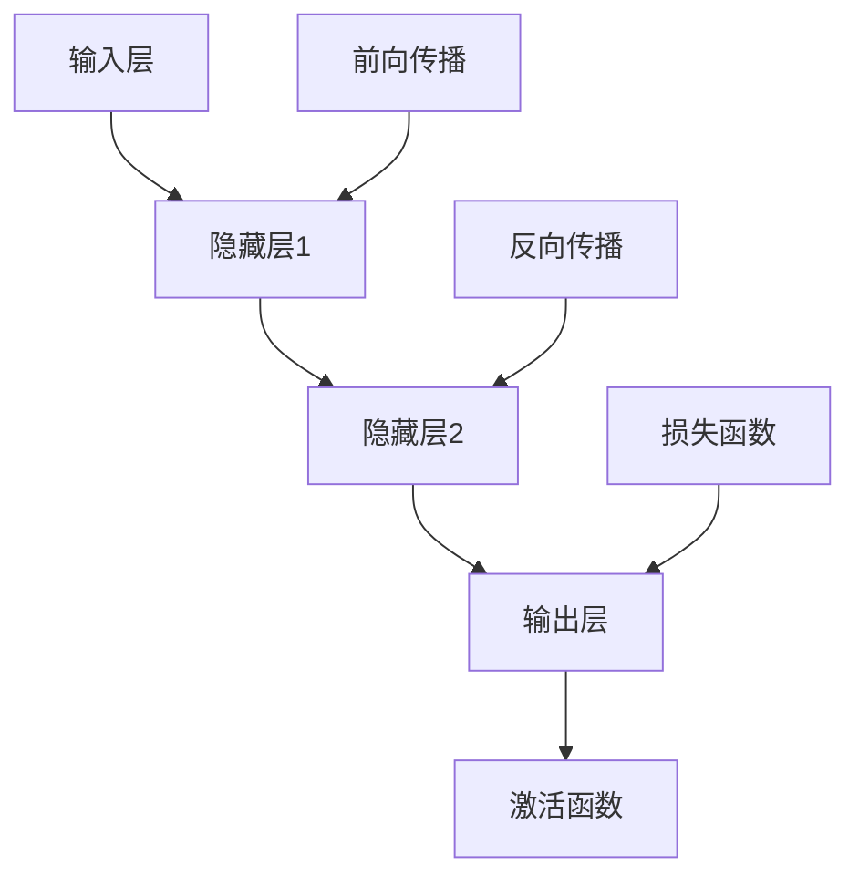

                 

### 文章标题

### AI大模型创业：泡沫还是金矿？现状分析

### 关键词：
- AI大模型
- 创业
- 泡沫
- 金矿
- 现状分析

### 摘要：
本文将从多个维度深入探讨AI大模型的创业现状。首先，我们将回顾AI大模型的发展历程，阐述其核心概念和技术基础。接着，通过分析AI大模型在不同领域的实际应用，评估其在当前市场中的价值和潜力。然后，我们将探讨AI大模型创业中可能面临的风险和挑战，并提出相应的解决策略。最后，结合实际案例，探讨AI大模型创业的成功经验和教训，为创业者提供有价值的参考。

---

### 第一部分：AI大模型基础概述

#### 第1章：AI大模型概述

##### 1.1 AI大模型的核心概念

AI大模型（Large-scale AI Models）是指具有数十亿甚至数千亿参数的深度神经网络模型。这些模型能够通过大量的数据训练，捕捉到复杂的数据模式，并在多种任务中表现出强大的性能。

- **定义**：AI大模型是指参数量达到数十亿或更高的深度神经网络模型。
- **特点**：具有极强的学习能力、广泛的应用场景和高效的计算效率。

##### 1.2 AI大模型的架构与原理

AI大模型的架构通常包括以下几个关键部分：

- **输入层**：接收外部输入数据，如文本、图像或声音。
- **隐藏层**：由多个神经层组成，每个层包含大量的神经元，用于特征提取和变换。
- **输出层**：生成预测结果或分类标签。

AI大模型的工作原理主要基于以下步骤：

- **前向传播**：输入数据通过神经网络层，逐层计算得到输出。
- **反向传播**：利用输出误差，反向调整权重，优化模型。

##### 1.3 AI大模型的分类与应用场景

AI大模型可以根据用途和应用领域进行分类，以下是一些常见的分类和应用场景：

- **自然语言处理（NLP）**：如语言模型、文本分类、命名实体识别等。
- **计算机视觉（CV）**：如图像分类、目标检测、图像分割等。
- **推荐系统**：通过分析用户行为和物品属性，进行个性化推荐。
- **医疗健康**：如疾病预测、医疗图像分析等。
- **金融**：如信用评分、股票市场预测等。
- **工业制造**：如质量检测、生产计划优化等。

#### 第2章：AI大模型技术基础

##### 2.1 深度学习基础

深度学习是构建AI大模型的核心技术，以下是深度学习的一些基础知识：

- **神经网络**：神经网络是深度学习的基础，包括输入层、隐藏层和输出层。
- **激活函数**：激活函数用于引入非线性因素，常见的激活函数有Sigmoid、ReLU和Tanh等。
- **优化算法**：优化算法用于调整模型参数，以最小化损失函数，常见的优化算法有SGD、Adam等。

##### 2.2 自然语言处理技术

自然语言处理（NLP）是AI大模型的重要应用领域，以下是NLP的一些关键技术：

- **词向量表示**：词向量是NLP的基础，常用的词向量模型有Word2Vec和GloVe。
- **序列模型**：序列模型如RNN、LSTM和GRU，能够处理序列数据，如文本和语音。
- **注意力机制**：注意力机制用于提高模型对关键信息的捕捉能力。

##### 2.3 大规模预训练模型

大规模预训练模型是当前AI大模型研究的热点，以下是预训练的一些关键技术：

- **预训练技术**：预训练模型在大规模语料库上进行预训练，以捕捉通用语言特征。
- **迁移学习**：迁移学习将预训练模型应用于特定任务，通过微调提高任务性能。
- **模型微调**：模型微调是在特定任务上对预训练模型进行进一步训练。

### Mermaid 流程图：



### 伪代码：

```python
# 前向传播
def forward_pass(input_data):
    layer_1_output = activation_function(np.dot(input_data, weights1) + biases1)
    layer_2_output = activation_function(np.dot(layer_1_output, weights2) + biases2)
    output = activation_function(np.dot(layer_2_output, weights3) + biases3)
    return output

# 反向传播
def backward_pass(output, expected_output):
    error = output - expected_output
    d_output = derivative_of_activation_function(output)
    d_layer_2_output = np.dot(error, d_output)
    d_layer_1_output = np.dot(error, weights2.T)
    d_input = np.dot(d_layer_1_output, weights1.T)
    return d_input, d_layer_1_output, d_layer_2_output
```

### 数学模型和数学公式：

$$
\sigma(x) = \frac{1}{1 + e^{-x}}
$$

$$
\frac{d}{dx} \sigma(x) = \sigma(x) (1 - \sigma(x))
$$

### 举例说明：

假设我们有一个简单的神经网络，包括输入层、隐藏层和输出层，每个层的权重和偏置如下：

- 输入层到隐藏层1的权重：`weights1`
- 输入层到隐藏层1的偏置：`biases1`
- 隐藏层1到隐藏层2的权重：`weights2`
- 隐藏层1到隐藏层2的偏置：`biases2`
- 隐藏层2到输出层的权重：`weights3`
- 隐藏层2到输出层的偏置：`biases3`

**前向传播过程**：

1. 输入数据通过输入层，计算隐藏层1的输出。
2. 隐藏层1的输出通过激活函数处理后，作为隐藏层2的输入。
3. 隐藏层2的输出通过激活函数处理后，作为输出层的输入。

**伪代码**：

```python
def forward_pass(input_data):
    layer_1_output = activation_function(np.dot(input_data, weights1) + biases1)
    layer_2_output = activation_function(np.dot(layer_1_output, weights2) + biases2)
    output = activation_function(np.dot(layer_2_output, weights3) + biases3)
    return output
```

**反向传播过程**：

1. 计算输出层的误差。
2. 利用误差计算隐藏层2和隐藏层1的梯度。
3. 更新权重和偏置。

**伪代码**：

```python
def backward_pass(output, expected_output):
    error = output - expected_output
    d_output = derivative_of_activation_function(output)
    d_layer_2_output = np.dot(error, d_output)
    d_layer_1_output = np.dot(error, weights2.T)
    d_input = np.dot(d_layer_1_output, weights1.T)
    return d_input, d_layer_1_output, d_layer_2_output
```

通过以上步骤，我们可以完成一个简单的神经网络的前向传播和反向传播过程。当然，实际应用中，神经网络的结构和参数会复杂得多，但基本原理相同。

### 第一部分总结

在本章中，我们详细介绍了AI大模型的核心概念、架构与原理，以及在不同领域的应用。通过流程图、伪代码、数学模型和举例说明，我们深入理解了AI大模型的工作机制。这一部分为基础部分，为后续的深入分析和应用提供了必要的理论基础。

---

### 第一部分总结

在本章中，我们详细介绍了AI大模型的核心概念、架构与原理，以及在不同领域的应用。通过流程图、伪代码、数学模型和举例说明，我们深入理解了AI大模型的工作机制。这一部分为基础部分，为后续的深入分析和应用提供了必要的理论基础。

### 下一步计划

在接下来的部分中，我们将从以下几个方面展开讨论：

1. **AI大模型在不同领域的实际应用**：我们将深入探讨AI大模型在自然语言处理、计算机视觉、推荐系统、医疗健康、金融和工业制造等领域的应用案例，分析其在实际工作中的表现和贡献。
2. **AI大模型创业中的风险和挑战**：我们将探讨AI大模型创业过程中可能面临的技术、市场、政策和法律等方面的风险和挑战，并提出相应的解决方案。
3. **AI大模型创业的成功案例**：我们将分析一些成功的AI大模型创业案例，总结其成功经验和关键因素，为创业者提供有价值的借鉴。

接下来，我们将继续深入探讨AI大模型在实际中的应用，为读者提供更加全面和深入的理解。

---

### 第二部分：AI大模型在不同领域的实际应用

#### 第3章：AI大模型在自然语言处理中的应用

##### 3.1 语言模型

语言模型是自然语言处理（NLP）中最基础的部分，它用于预测下一个词或者下一组词的可能性。AI大模型在语言模型方面有着显著的优势，能够处理大规模的数据，生成高质量的预测结果。

- **基本概念**：语言模型是一种统计模型，用于预测文本中下一个词或下一组词的概率。
- **模型构建**：常见的语言模型包括N元语法模型和基于神经网络的模型，如BERT、GPT等。

##### 3.2 文本分类

文本分类是将文本数据按照一定的标准进行分类的过程。AI大模型在文本分类任务中表现出色，能够处理复杂的文本数据，提高分类的准确性。

- **基本原理**：文本分类通常使用特征提取和分类算法，如朴素贝叶斯、支持向量机等。
- **模型应用**：深度学习模型，如CNN、RNN和Transformer，在文本分类任务中得到了广泛应用。

##### 3.3 命名实体识别

命名实体识别（NER）是NLP中一个重要的任务，旨在识别文本中的特定实体，如人名、地名、组织名等。

- **基本概念**：NER用于识别文本中的命名实体，是信息提取的重要步骤。
- **模型构建**：NER模型通常基于规则、统计方法和深度学习模型，如BiLSTM-CRF等。

#### 第4章：AI大模型在计算机视觉中的应用

##### 4.1 图像分类

图像分类是将图像数据分配到预定义的类别中的过程。AI大模型在图像分类任务中取得了显著的成果，能够处理大规模的图像数据，提高分类的准确性。

- **基本原理**：图像分类通常使用卷积神经网络（CNN），如VGG、ResNet等。
- **模型应用**：深度学习模型在图像分类任务中得到了广泛应用，如ImageNet挑战。

##### 4.2 目标检测

目标检测是计算机视觉中的另一个重要任务，旨在识别图像中的多个对象并定位它们的位置。

- **基本概念**：目标检测通常使用区域提议网络（RPN）和深度学习模型，如Faster R-CNN、SSD、YOLO等。
- **模型应用**：目标检测在自动驾驶、视频监控等应用中发挥了重要作用。

##### 4.3 图像分割

图像分割是将图像划分为不同的区域或对象的过程。AI大模型在图像分割任务中也取得了显著的进展，能够处理复杂的图像数据。

- **基本原理**：图像分割通常使用深度学习模型，如U-Net、SegNet等。
- **模型应用**：图像分割在医学图像分析、自动驾驶等领域得到了广泛应用。

#### 第5章：AI大模型在推荐系统中的应用

##### 5.1 协同过滤

协同过滤是推荐系统中最常用的技术之一，它通过分析用户的历史行为和物品的特征，预测用户对未评

