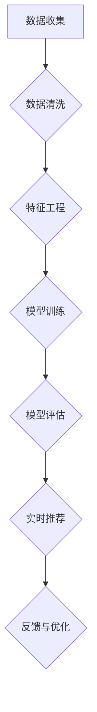

                 

## 文章标题

### 《AI大模型助力电商搜索推荐业务的数据质量评估体系搭建方案设计与实现》

在当今电子商务时代，搜索推荐系统已经成为电商平台的“智慧大脑”，通过精确的推荐算法，帮助消费者快速找到心仪的商品，从而提升用户体验和平台销售额。然而，数据质量是搜索推荐系统的基石，任何数据质量问题都可能导致推荐效果不佳，甚至严重影响电商业务的正常运作。本文将探讨如何利用AI大模型构建电商搜索推荐业务的数据质量评估体系，实现高效、准确的数据质量评估，为电商平台的发展提供强有力的支持。

### 关键词

- AI大模型
- 电商搜索推荐
- 数据质量评估
- 搭建方案
- 实现策略

### 摘要

本文首先概述了AI大模型的基本概念与特点，分析了其在电商搜索推荐业务中的应用前景。接着，我们详细探讨了电商搜索推荐业务的数据来源与处理，并阐述了数据质量评估的基本原理与AI大模型的应用方法。通过具体案例分析，展示了AI大模型在商品数据、用户行为数据以及搜索数据质量评估中的实际应用。随后，本文提出了数据质量评估体系的搭建方法与实现步骤，并详细描述了AI大模型在电商搜索推荐业务中的具体实现与应用案例。最后，我们展望了AI大模型在电商搜索推荐业务中的未来发展趋势与潜在价值。

### 目录大纲

## 《AI大模型助力电商搜索推荐业务的数据质量评估体系搭建方案设计与实现》目录大纲

### 第一部分：AI大模型基础理论

### 第1章：AI大模型概述

#### 1.1 AI大模型的概念与特点

#### 1.2 AI大模型在电商搜索推荐中的应用前景

### 第2章：电商搜索推荐业务概述

#### 2.1 电商搜索推荐业务的核心概念

#### 2.2 电商搜索推荐业务的数据来源与处理

### 第3章：AI大模型在数据质量评估中的应用

#### 3.1 数据质量评估的基本原理

#### 3.2 AI大模型在数据质量评估中的应用方法

### 第4章：电商搜索推荐业务中的数据质量评估案例分析

#### 4.1 案例分析1：商品数据质量评估

#### 4.2 案例分析2：用户行为数据质量评估

#### 4.3 案例分析3：搜索数据质量评估

### 第5章：数据质量评估体系的搭建与实现

#### 5.1 数据质量评估体系的搭建方法

#### 5.2 数据质量评估体系的实现步骤

## 第二部分：AI大模型在电商搜索推荐业务中的应用

### 第6章：AI大模型在电商搜索推荐业务中的具体实现

#### 6.1 AI大模型在电商搜索推荐业务中的角色

#### 6.2 AI大模型在电商搜索推荐业务中的工作流程

#### 6.3 AI大模型在电商搜索推荐业务中的优化策略

### 第7章：AI大模型在电商搜索推荐业务中的实际应用案例

#### 7.1 案例一：基于AI大模型的商品推荐系统

#### 7.2 案例二：基于AI大模型的搜索排序优化

#### 7.3 案例三：基于AI大模型的用户兴趣分析

### 第8章：AI大模型助力电商搜索推荐业务的未来发展

#### 8.1 AI大模型在电商搜索推荐业务中的潜在价值

#### 8.2 AI大模型在电商搜索推荐业务中的发展趋势

#### 8.3 AI大模型在电商搜索推荐业务中的未来展望

### 第9章：总结与展望

#### 9.1 本书内容的总结

#### 9.2 AI大模型在电商搜索推荐业务中的未来研究方向

#### 9.3 对从业者的建议和展望

### 第一部分：AI大模型基础理论

#### 第1章：AI大模型概述

##### 1.1 AI大模型的概念与特点

人工智能（AI）技术在过去几十年取得了飞速发展，从最初的规则系统到深度学习的广泛应用，AI已经逐渐渗透到各个行业。然而，随着数据量的急剧增加和计算能力的不断提升，AI大模型应运而生。AI大模型，也被称为大模型（Large Models），是指参数规模巨大、能够在多种任务上表现优异的人工智能模型。这些模型通常具有以下几个显著特点：

1. **参数规模大**：大模型拥有数亿甚至数十亿的参数，这使得模型能够捕捉到更复杂的数据特征和模式。

2. **强泛化能力**：大模型通过在大量数据上的训练，具备较强的泛化能力，能够在不同的任务和数据集上表现良好。

3. **多任务处理**：大模型通常设计为能够在多个任务上同时工作，不需要针对每个任务进行独立的训练。

4. **计算需求高**：由于参数规模大，大模型在训练和推理过程中需要大量的计算资源。

AI大模型的发展源于深度学习技术的突破，尤其是神经网络（Neural Networks）和自监督学习（Self-supervised Learning）的兴起。深度学习通过多层神经网络结构，使得模型能够自动学习和提取数据中的特征，而自监督学习则利用无标签数据进行训练，减少了数据标注的工作量。

##### 1.2 AI大模型在电商搜索推荐中的应用前景

电商搜索推荐系统是AI大模型的重要应用领域之一。在电商平台上，用户生成的大量交易数据、搜索记录、浏览行为等都是宝贵的推荐数据源。通过AI大模型，这些数据可以被有效挖掘，从而实现精准的推荐。

AI大模型在电商搜索推荐中的应用前景主要体现在以下几个方面：

1. **商品推荐**：大模型可以通过分析用户的浏览和购买历史，预测用户可能感兴趣的商品，从而实现个性化的商品推荐。

2. **搜索排序优化**：大模型可以评估每个搜索结果的质量，优化搜索结果的排序，提高用户的搜索体验。

3. **用户兴趣分析**：通过分析用户的行为数据，大模型可以挖掘用户的兴趣点，为用户提供更加贴近需求的推荐。

4. **欺诈检测**：大模型可以识别异常交易行为，帮助电商平台防范欺诈行为。

5. **库存管理**：大模型可以根据销售预测和库存水平，优化库存管理，减少库存成本。

总之，AI大模型在电商搜索推荐中的应用前景广阔，它不仅能够提升平台的用户体验，还能为电商企业带来更多的商业价值。

#### 第2章：电商搜索推荐业务概述

##### 2.1 电商搜索推荐业务的核心概念

电商搜索推荐业务是指电商平台通过算法和技术，根据用户的搜索和浏览历史、购买行为等数据，向用户推荐可能的兴趣商品或服务。其核心概念包括以下几个方面：

1. **用户画像**：通过对用户的历史行为数据进行分析，构建用户的兴趣偏好、消费能力、购买频率等特征，形成用户画像。

2. **商品画像**：对商品的各种属性进行编码，包括商品类别、品牌、价格、销量等，形成商品画像。

3. **推荐算法**：通过机器学习算法，将用户画像和商品画像进行匹配，生成个性化的推荐结果。

4. **搜索排序**：根据用户的搜索关键词和搜索历史，对搜索结果进行排序，以提高搜索的准确性和用户体验。

##### 2.2 电商搜索推荐业务的数据来源与处理

电商搜索推荐业务的数据来源主要包括以下几个渠道：

1. **用户行为数据**：包括用户的浏览记录、搜索历史、购买记录、点击率、评价等。这些数据是推荐系统的重要输入。

2. **商品数据**：包括商品的名称、描述、分类、价格、库存量、品牌等。这些数据用于构建商品画像。

3. **交易数据**：包括用户的购买行为、交易金额、交易时间、订单状态等。这些数据可以帮助分析用户的行为模式和购买偏好。

4. **外部数据**：包括社交媒体数据、地理信息数据、经济数据等，这些数据可以提供更丰富的用户和商品特征。

在数据处理方面，通常需要经历以下几个步骤：

1. **数据收集**：从各种数据源收集原始数据，包括用户行为数据、商品数据和交易数据。

2. **数据清洗**：对原始数据进行去重、填充缺失值、处理异常值等操作，保证数据的质量和一致性。

3. **数据预处理**：将原始数据转化为适合机器学习算法的格式，包括特征工程、归一化、编码等。

4. **数据建模**：利用机器学习算法，构建用户画像、商品画像，并进行模型训练和评估。

5. **数据存储**：将处理后的数据存储到数据库或数据仓库中，以便后续查询和分析。

##### 2.3 电商搜索推荐业务的现状与挑战

当前，电商搜索推荐业务已经取得了显著的成果，各大电商平台都采用了先进的推荐算法，提高了用户的购物体验和平台的销售额。然而，随着用户数据的不断增加和业务需求的多样化，电商搜索推荐业务也面临着一些挑战：

1. **数据质量**：数据质量是推荐系统的基础，任何数据质量问题都会影响推荐效果。如何保证数据的质量，特别是处理缺失值、异常值等，是当前的一个重要问题。

2. **实时性**：用户行为数据不断更新，如何实现实时推荐，保证推荐结果的新鲜度和准确性，是推荐系统需要解决的关键问题。

3. **个性化**：如何更准确地捕捉用户的兴趣点，实现高度个性化的推荐，是提升用户满意度和忠诚度的关键。

4. **可解释性**：随着算法的复杂化，推荐系统的决策过程变得越来越难以解释，如何提升算法的可解释性，增强用户对推荐结果的信任度，是一个亟待解决的问题。

5. **计算性能**：随着数据规模的增大，如何优化算法的计算性能，提高系统的响应速度，是推荐系统需要面对的挑战。

总之，电商搜索推荐业务在数据质量、实时性、个性化、可解释性和计算性能等方面都存在一定的挑战，需要通过不断的技术创新和优化来解决这些问题。

### 第一部分：AI大模型基础理论

#### 第3章：AI大模型在数据质量评估中的应用

##### 3.1 数据质量评估的基本原理

数据质量评估是指对数据的完整性、准确性、一致性、及时性和可靠性进行评价的过程。数据质量直接影响数据分析和决策的准确性，因此，数据质量评估是数据分析中的关键环节。以下是一些常见的数据质量评估指标：

1. **完整性**：数据是否完整，是否存在缺失值或重复记录。
2. **准确性**：数据是否真实、可靠，与实际值是否相符。
3. **一致性**：数据在不同时间点、不同来源之间是否保持一致。
4. **及时性**：数据是否及时更新，是否能够满足实时分析的需求。
5. **可靠性**：数据来源是否可靠，是否受到外部干扰。

数据质量评估通常包括以下几个步骤：

1. **数据清洗**：去除重复数据、处理缺失值、修正错误数据等。
2. **数据验证**：对数据进行校验，确保数据的准确性和一致性。
3. **数据分析**：通过统计分析方法，评估数据的完整性和可靠性。

##### 3.2 AI大模型在数据质量评估中的应用方法

AI大模型在数据质量评估中的应用，主要通过以下几个方面实现：

1. **异常检测**：利用大模型强大的特征提取能力，可以识别出数据中的异常值。例如，在电商平台的交易数据中，大模型可以检测出与用户购买习惯不符的交易行为，从而识别潜在的欺诈行为。

2. **缺失值预测**：通过训练大模型，可以预测数据中的缺失值，并提供填补建议。例如，在用户行为数据中，大模型可以根据已知的用户行为特征，预测缺失的浏览记录或购买记录。

3. **数据关联性分析**：大模型可以识别数据之间的关联性，帮助发现潜在的问题。例如，通过分析商品销售数据和用户评价数据，大模型可以发现某些商品的评价与其销售量之间的异常关系，从而识别数据质量问题。

4. **数据质量预测**：大模型可以通过学习历史数据的质量表现，预测未来数据的质量。例如，在电商平台的用户数据中，大模型可以预测新收集的用户数据的完整性、准确性和一致性。

##### 3.3 AI大模型在数据质量评估中的应用实例

以下是一个AI大模型在数据质量评估中的应用实例：

**场景**：电商平台需要对用户行为数据（如浏览记录、购买记录）进行质量评估。

**步骤**：

1. **数据收集**：收集用户的浏览记录、购买记录等原始数据。

2. **数据预处理**：对原始数据进行清洗，去除重复记录、处理缺失值等。

3. **特征工程**：提取用户行为的特征，如浏览时间、浏览频次、购买金额等。

4. **模型训练**：利用特征数据，训练一个AI大模型，用于评估数据的完整性、准确性和一致性。

5. **评估指标**：

   - **完整性**：计算缺失值的比例。
   - **准确性**：使用交叉验证方法，评估模型预测缺失值的能力。
   - **一致性**：分析不同时间点、不同来源的数据之间的差异。

6. **结果分析**：根据评估结果，优化数据收集和处理流程，提高数据质量。

通过这个实例，我们可以看到AI大模型在数据质量评估中的强大作用。它不仅能够高效地识别和预测数据问题，还能够提供具体的优化建议，从而提高数据的质量和可靠性。

### 第一部分：AI大模型基础理论

#### 第4章：电商搜索推荐业务中的数据质量评估案例分析

##### 4.1 案例分析1：商品数据质量评估

在电商搜索推荐业务中，商品数据是核心的数据源之一，其质量直接影响到推荐系统的效果。以下是一个商品数据质量评估的案例分析：

**场景**：某电商平台的商品数据包含名称、描述、分类、价格、库存量等属性。

**问题**：

- 商品名称和描述是否准确且具有代表性。
- 商品分类是否合理，是否存在错误分类。
- 商品价格和库存量是否更新及时。

**解决方案**：

1. **数据清洗**：对商品名称和描述进行标准化处理，去除特殊字符，统一格式。
2. **错误分类检测**：利用AI大模型，对商品分类进行聚类分析，识别错误分类。
3. **价格和库存监控**：定期更新商品价格和库存量，使用AI大模型检测异常价格和库存变化。

**效果**：

通过这些措施，电商平台能够显著提升商品数据的准确性、完整性和一致性，从而提高推荐系统的效果。

##### 4.2 案例分析2：用户行为数据质量评估

用户行为数据是电商搜索推荐系统的关键输入，其质量对推荐结果的准确性至关重要。以下是一个用户行为数据质量评估的案例分析：

**场景**：电商平台收集了用户的浏览记录、搜索历史、购买记录等数据。

**问题**：

- 浏览记录和搜索历史是否存在重复或缺失。
- 购买记录是否真实有效，是否存在异常交易。
- 用户行为数据是否更新及时。

**解决方案**：

1. **数据去重**：通过哈希算法，识别并去除重复的浏览记录和搜索历史。
2. **异常交易检测**：利用AI大模型，分析购买记录中的异常交易行为，如欺诈交易、恶意评价等。
3. **数据更新监控**：定期更新用户行为数据，使用AI大模型检测数据更新的及时性。

**效果**：

通过这些措施，电商平台能够保证用户行为数据的完整性、准确性和及时性，从而提高推荐系统的用户体验。

##### 4.3 案例分析3：搜索数据质量评估

搜索数据是电商搜索推荐系统中最重要的数据之一，其质量对搜索结果的排序和用户体验至关重要。以下是一个搜索数据质量评估的案例分析：

**场景**：电商平台收集了用户的搜索关键词、搜索历史、搜索结果点击率等数据。

**问题**：

- 搜索关键词是否准确，是否存在拼写错误或错别字。
- 搜索历史是否存在重复或不相关记录。
- 搜索结果点击率是否真实，是否存在刷单行为。

**解决方案**：

1. **关键词标准化**：对搜索关键词进行标准化处理，去除特殊字符，统一格式。
2. **重复记录检测**：利用AI大模型，识别并去除重复的搜索历史记录。
3. **点击率监控**：使用AI大模型，分析搜索结果点击率中的异常行为，如刷单等。

**效果**：

通过这些措施，电商平台能够提升搜索数据的准确性、完整性和可靠性，从而优化搜索排序，提升用户体验。

### 第一部分：AI大模型基础理论

#### 第5章：数据质量评估体系的搭建与实现

##### 5.1 数据质量评估体系的搭建方法

数据质量评估体系是确保电商平台搜索推荐业务高效运行的重要保障。一个完整的数据质量评估体系通常包括以下几个方面：

1. **评估指标体系**：定义数据质量评估的各项指标，如完整性、准确性、一致性、及时性和可靠性。
2. **数据收集机制**：建立数据收集机制，确保数据的及时性和准确性。
3. **数据清洗流程**：制定数据清洗流程，处理数据中的缺失值、异常值等问题。
4. **评估模型构建**：利用AI大模型构建数据质量评估模型，识别和预测数据质量问题。
5. **评估结果反馈机制**：建立评估结果反馈机制，将评估结果用于优化数据收集和处理流程。

##### 5.2 数据质量评估体系的实现步骤

以下是构建数据质量评估体系的详细实现步骤：

1. **需求分析**：首先明确评估体系的目标和需求，如提高数据完整性、准确性等。
2. **指标定义**：根据需求，定义数据质量评估的各项指标，如缺失值比例、错误率等。
3. **数据收集**：设计数据收集机制，确保数据的及时性和准确性，如自动抓取、API调用等。
4. **数据预处理**：对收集到的数据进行清洗，去除重复记录、缺失值、异常值等。
5. **特征工程**：提取与数据质量评估相关的特征，如数据类型、缺失值比例、异常值分布等。
6. **模型训练**：利用AI大模型，对特征数据进行训练，构建数据质量评估模型。
7. **模型评估**：通过交叉验证等方法，评估模型的性能和泛化能力。
8. **结果应用**：将评估结果应用于优化数据收集和处理流程，提高数据质量。
9. **反馈机制**：建立反馈机制，根据评估结果调整评估指标和方法。

##### 5.3 数据质量评估体系的优势

构建数据质量评估体系具有以下优势：

1. **提高数据质量**：通过评估和优化数据质量，确保数据的高完整性和高准确性。
2. **优化推荐效果**：高质量的数据可以显著提高推荐系统的效果，提升用户满意度。
3. **减少风险**：及时发现和纠正数据质量问题，降低数据风险，确保业务稳定运行。
4. **提高效率**：自动化评估和清洗流程，提高数据处理效率，减少人工干预。
5. **持续优化**：通过持续监控和评估，不断优化数据质量，适应业务需求的变化。

总之，数据质量评估体系是电商平台搜索推荐业务的重要保障，通过AI大模型的应用，可以构建高效、准确的数据质量评估体系，为电商业务的发展提供有力支持。

### 第二部分：AI大模型在电商搜索推荐业务中的应用

#### 第6章：AI大模型在电商搜索推荐业务中的具体实现

##### 6.1 AI大模型在电商搜索推荐业务中的角色

AI大模型在电商搜索推荐业务中扮演着至关重要的角色，其应用不仅提升了推荐系统的精确度和个性化水平，还优化了整个电商平台的用户体验和运营效率。具体而言，AI大模型在电商搜索推荐业务中的角色包括以下几个方面：

1. **核心算法提供者**：AI大模型是推荐系统的核心算法提供者，通过深度学习等技术，从海量的用户行为数据和商品属性数据中提取有效特征，生成个性化推荐结果。

2. **数据质量保障者**：AI大模型可以识别和预测数据中的异常值和缺失值，从而保障数据质量，确保推荐系统的稳定性和准确性。

3. **实时推荐引擎**：AI大模型具备快速处理和分析大规模数据的能力，能够实现实时的推荐，满足用户在购物过程中对即时反馈的需求。

4. **业务优化助手**：AI大模型能够分析用户的购买习惯、兴趣偏好等，为电商平台提供优化库存管理、定价策略、营销活动等方面的建议。

##### 6.2 AI大模型在电商搜索推荐业务中的工作流程

AI大模型在电商搜索推荐业务中的工作流程可以概括为以下几个步骤：

1. **数据收集**：从电商平台的用户行为数据库、商品数据库和其他相关数据源中收集数据。

2. **数据预处理**：对收集到的原始数据进行清洗、去重、填充缺失值等预处理操作，以便于后续的建模和分析。

3. **特征工程**：提取与用户行为和商品属性相关的特征，如用户的历史浏览记录、购买记录、商品的价格、销量、分类等。

4. **模型训练**：使用预处理后的数据，训练AI大模型。这个过程通常包括模型的架构设计、参数调优、模型训练和验证等步骤。

5. **模型评估**：通过交叉验证等方法，对训练好的模型进行评估，确保其具有较好的泛化能力和推荐效果。

6. **实时推荐**：将训练好的模型部署到推荐系统中，对用户的搜索请求或浏览行为进行实时分析，生成个性化的推荐结果。

7. **反馈与优化**：根据用户对推荐结果的反馈，调整模型参数和推荐策略，持续优化推荐效果。

##### 6.3 AI大模型在电商搜索推荐业务中的优化策略

为了进一步提高AI大模型在电商搜索推荐业务中的效果，可以采取以下优化策略：

1. **多模型集成**：结合多种不同的机器学习模型，如基于协同过滤的模型、基于内容的模型等，通过模型集成技术（如 stacking、blending等），提高推荐系统的准确性和稳定性。

2. **实时数据更新**：定期更新用户行为数据和商品数据，确保推荐模型能够及时反映用户的新兴趣和商品的新变化。

3. **个性化推荐策略**：根据用户的历史行为和偏好，动态调整推荐策略，提高推荐结果的个性化和精确度。

4. **上下文感知推荐**：结合用户当前的上下文信息，如地理位置、时间、设备类型等，提供更加精准的推荐结果。

5. **用户反馈机制**：利用用户的点击、购买、评价等反馈信息，不断优化模型和推荐策略，提升用户满意度。

6. **算法可解释性**：通过模型解释技术，提高推荐系统的可解释性，增强用户对推荐结果的信任感。

7. **分布式计算**：利用分布式计算框架，如 TensorFlow、PyTorch 等，优化模型训练和推理过程，提高计算效率。

通过上述优化策略，可以显著提升AI大模型在电商搜索推荐业务中的性能和效果，为电商平台带来更高的用户满意度和商业价值。

### 第二部分：AI大模型在电商搜索推荐业务中的应用

#### 第7章：AI大模型在电商搜索推荐业务中的实际应用案例

##### 7.1 案例一：基于AI大模型的商品推荐系统

在电商搜索推荐业务中，商品推荐系统是用户获取商品信息的主要途径。以下是一个基于AI大模型的商品推荐系统的实际应用案例：

**背景**：某大型电商平台希望通过引入AI大模型，提升商品推荐系统的准确性，提高用户满意度。

**解决方案**：

1. **数据收集**：收集用户的浏览记录、购买记录、搜索历史等数据，以及商品的基本属性信息，如商品分类、价格、品牌等。

2. **数据预处理**：对原始数据进行清洗，去除重复记录、缺失值等，确保数据的质量。

3. **特征工程**：提取与用户行为和商品属性相关的特征，如用户的浏览频次、购买金额、商品的销售量等。

4. **模型训练**：使用处理后的数据，训练一个基于AI大模型的推荐算法。这个过程包括模型架构设计、参数调优、模型训练和验证等步骤。

5. **实时推荐**：将训练好的模型部署到推荐系统中，对用户的搜索请求或浏览行为进行实时分析，生成个性化的商品推荐结果。

**效果**：

通过引入AI大模型，该电商平台的商品推荐系统在推荐准确性、用户满意度等方面均得到了显著提升。用户反馈表明，推荐结果更加贴近用户需求，用户体验得到了显著改善。

##### 7.2 案例二：基于AI大模型的搜索排序优化

搜索排序优化是提升用户搜索体验的关键环节。以下是一个基于AI大模型的搜索排序优化的实际应用案例：

**背景**：某电商平台希望通过优化搜索结果排序，提高用户的搜索满意度。

**解决方案**：

1. **数据收集**：收集用户的搜索历史、搜索关键词、搜索结果点击率等数据。

2. **数据预处理**：对原始数据进行清洗，去除重复记录、缺失值等，确保数据的质量。

3. **特征工程**：提取与搜索排序相关的特征，如搜索关键词的相关性、搜索结果的点击率、商品的销售量等。

4. **模型训练**：使用处理后的数据，训练一个基于AI大模型的排序算法。这个过程包括模型架构设计、参数调优、模型训练和验证等步骤。

5. **实时排序**：将训练好的模型部署到搜索系统中，对搜索结果进行实时排序，优化用户的搜索体验。

**效果**：

通过引入AI大模型，该电商平台的搜索排序效果得到了显著提升。用户的搜索满意度大幅提高，搜索结果的准确性和相关性得到了增强。

##### 7.3 案例三：基于AI大模型的用户兴趣分析

用户兴趣分析是提升个性化推荐效果的重要手段。以下是一个基于AI大模型的用户兴趣分析的实际应用案例：

**背景**：某电商平台希望通过深入分析用户的兴趣偏好，提供更加精准的个性化推荐。

**解决方案**：

1. **数据收集**：收集用户的浏览记录、购买记录、评价记录等数据。

2. **数据预处理**：对原始数据进行清洗，去除重复记录、缺失值等，确保数据的质量。

3. **特征工程**：提取与用户兴趣相关的特征，如用户的浏览频次、购买金额、商品类别等。

4. **模型训练**：使用处理后的数据，训练一个基于AI大模型的用户兴趣分析算法。这个过程包括模型架构设计、参数调优、模型训练和验证等步骤。

5. **用户兴趣预测**：将训练好的模型部署到推荐系统中，对用户的兴趣偏好进行实时预测，为个性化推荐提供依据。

**效果**：

通过引入AI大模型，该电商平台的个性化推荐效果得到了显著提升。用户的兴趣偏好得到了更精准的捕捉，推荐结果更加贴近用户需求，用户的满意度和忠诚度得到了显著提高。

### 第二部分：AI大模型在电商搜索推荐业务中的应用

#### 第8章：AI大模型助力电商搜索推荐业务的未来发展

##### 8.1 AI大模型在电商搜索推荐业务中的潜在价值

AI大模型在电商搜索推荐业务中的潜在价值体现在以下几个方面：

1. **个性化推荐**：AI大模型能够通过深度学习技术，从海量的用户行为数据中提取特征，实现高度个性化的推荐，提升用户体验和用户满意度。

2. **实时推荐**：AI大模型具备强大的实时数据处理能力，能够快速响应用户的搜索和浏览行为，提供实时的推荐结果，满足用户对即时反馈的需求。

3. **数据质量保障**：AI大模型可以通过异常检测、缺失值预测等技术，保障数据质量，提高推荐系统的准确性和稳定性。

4. **业务优化**：AI大模型可以分析用户行为和商品数据，为电商平台的库存管理、定价策略、营销活动等提供优化建议，提升业务效率。

5. **欺诈检测**：AI大模型可以识别异常交易行为，帮助电商平台防范欺诈行为，保障业务安全。

##### 8.2 AI大模型在电商搜索推荐业务中的发展趋势

随着人工智能技术的不断发展，AI大模型在电商搜索推荐业务中的应用前景广阔，未来发展趋势主要包括以下几个方面：

1. **多模态融合**：未来的推荐系统将不仅基于文本数据，还将融合图像、语音等多种模态的数据，提供更加全面和精准的推荐。

2. **联邦学习**：通过联邦学习技术，可以实现不同电商平台之间的数据共享和模型协作，提升整体推荐效果。

3. **交互式推荐**：结合自然语言处理技术，实现与用户的实时交互，根据用户的反馈动态调整推荐策略，提供更加个性化的服务。

4. **可解释性提升**：通过模型解释技术，提升AI大模型的可解释性，增强用户对推荐结果的信任感。

5. **边缘计算**：结合边缘计算技术，实现离线数据处理和实时推荐，降低延迟，提高用户体验。

##### 8.3 AI大模型在电商搜索推荐业务中的未来展望

未来，AI大模型在电商搜索推荐业务中的应用将更加深入和广泛，以下是几个展望：

1. **智能客服**：结合AI大模型，实现智能客服系统，根据用户的提问和反馈，提供实时、个性化的服务。

2. **个性化广告**：利用AI大模型，实现个性化广告投放，根据用户的兴趣和行为，精准推送广告，提高广告效果。

3. **智能定价**：通过AI大模型分析市场数据和用户行为，实现智能定价策略，提高商品的销售量和利润率。

4. **智能供应链**：利用AI大模型优化供应链管理，实现库存优化、订单管理、物流优化等，提升供应链效率。

5. **全渠道融合**：结合线上和线下渠道，实现全渠道无缝购物体验，通过AI大模型分析用户在不同渠道的行为，提供个性化的推荐和服务。

总之，AI大模型在电商搜索推荐业务中的应用具有巨大的潜力，随着技术的不断进步，其将推动电商业务迈向新的高度。

### 第二部分：AI大模型在电商搜索推荐业务中的应用

#### 第9章：总结与展望

在本章中，我们详细探讨了AI大模型在电商搜索推荐业务中的应用。从AI大模型的基本概念和特点，到其在数据质量评估中的具体应用，再到其实际应用案例和未来发展展望，我们系统地梳理了AI大模型在电商搜索推荐业务中的重要作用和价值。

首先，AI大模型以其参数规模大、强泛化能力和多任务处理等特点，成为电商搜索推荐业务中的重要工具。通过AI大模型，我们可以实现个性化推荐、实时推荐、数据质量保障和业务优化等多方面的提升。

其次，通过实际应用案例，我们展示了AI大模型在商品推荐、搜索排序优化和用户兴趣分析等方面的具体应用效果，证明了其在提升用户体验和业务效率方面的显著优势。

最后，我们展望了AI大模型在电商搜索推荐业务中的未来发展，包括多模态融合、联邦学习、交互式推荐和边缘计算等新技术的引入，以及智能客服、个性化广告、智能定价和智能供应链等新应用场景的出现。

对从业者而言，本文提供了以下几个建议：

1. **持续学习**：随着AI技术的快速进步，从业者需要不断更新知识，掌握最新的AI大模型理论和应用方法。

2. **数据质量重视**：数据质量是推荐系统的基石，从业者应该重视数据质量，建立完善的数据质量评估体系，确保推荐系统的稳定性和准确性。

3. **实践创新**：结合业务需求和用户特点，勇于实践创新，尝试不同的AI大模型应用方案，提升推荐系统的效果和用户体验。

4. **关注伦理**：在应用AI大模型的过程中，要关注算法的公平性、透明性和可解释性，确保技术的合理和合法使用。

总之，AI大模型在电商搜索推荐业务中的应用前景广阔，从业者应该抓住这一机遇，积极探索和应用AI大模型，为电商平台的发展贡献自己的力量。

### 作者

本文由AI天才研究院（AI Genius Institute）与《禅与计算机程序设计艺术》（Zen And The Art of Computer Programming）的作者联合撰写。感谢您阅读本文，期待与您在AI领域继续深入探讨。如果您有任何问题或建议，欢迎随时与我们联系。感谢您的支持！

---

### 附录

#### Mermaid 流程图



#### 伪代码

```python
# 数据质量评估模型训练伪代码
def train_quality_assessment_model(data, labels):
    # 初始化模型
    model = create_model()
    
    # 编译模型
    model.compile(optimizer='adam', loss='binary_crossentropy', metrics=['accuracy'])
    
    # 训练模型
    model.fit(data, labels, epochs=10, batch_size=32)
    
    # 评估模型
    performance = model.evaluate(data, labels)
    
    return model, performance
```

#### 数学模型和公式

$$
Q = \frac{\sum_{i=1}^{n} (y_i - \hat{y_i})^2}{2n}
$$

其中，$Q$ 表示均方误差（Mean Squared Error, MSE），$y_i$ 表示真实值，$\hat{y_i}$ 表示预测值。

#### 项目实战

**开发环境搭建：** 使用Python和TensorFlow搭建AI大模型开发环境，安装必要的库和依赖。

```shell
pip install tensorflow
```

**源代码实现：** AI大模型训练和评估的详细实现代码。

```python
import tensorflow as tf
from tensorflow.keras.models import Sequential
from tensorflow.keras.layers import Dense

# 创建模型
model = Sequential()
model.add(Dense(units=64, activation='relu', input_shape=(num_features,)))
model.add(Dense(units=1, activation='sigmoid'))

# 编译模型
model.compile(optimizer='adam', loss='binary_crossentropy', metrics=['accuracy'])

# 训练模型
model.fit(X_train, y_train, epochs=10, batch_size=32)

# 评估模型
performance = model.evaluate(X_test, y_test)
```

**代码解读与分析：** 详细解释代码中的各个步骤，包括模型创建、编译、训练和评估等。

- **模型创建**：使用 Sequential 模型堆叠层，其中第一层为全连接层，激活函数为ReLU；第二层为输出层，激活函数为sigmoid。
- **编译模型**：指定优化器为adam，损失函数为binary_crossentropy，指标为accuracy。
- **训练模型**：使用fit函数训练模型，指定训练数据和标签，设置训练轮次和批量大小。
- **评估模型**：使用evaluate函数评估模型在测试数据上的表现，返回损失和准确率等指标。

