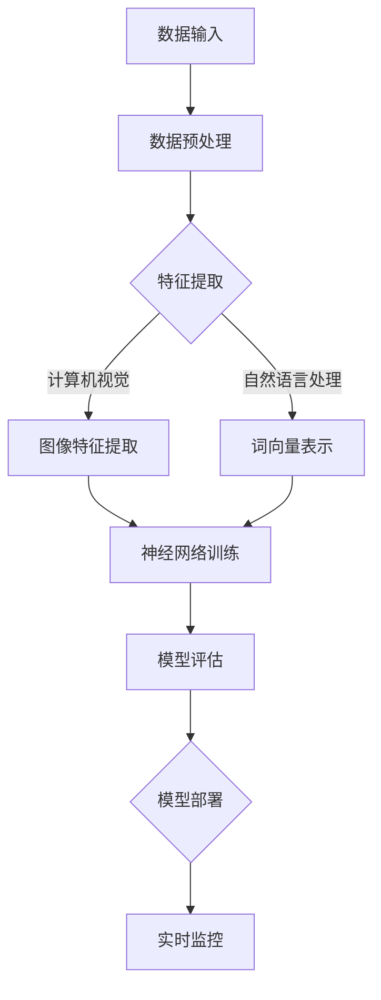
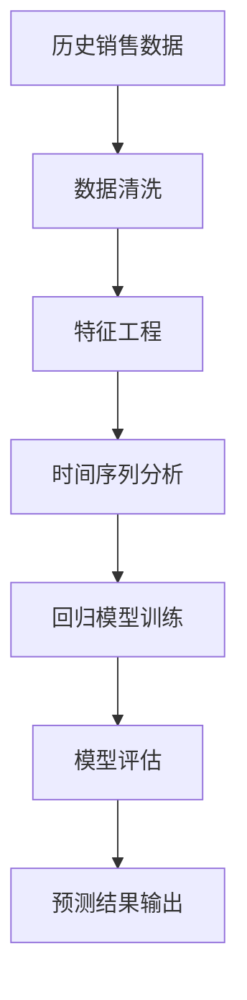
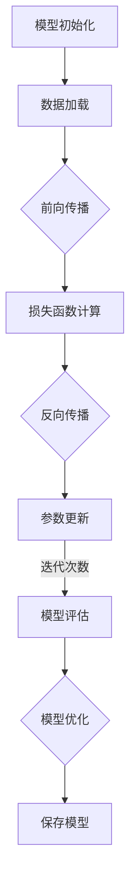
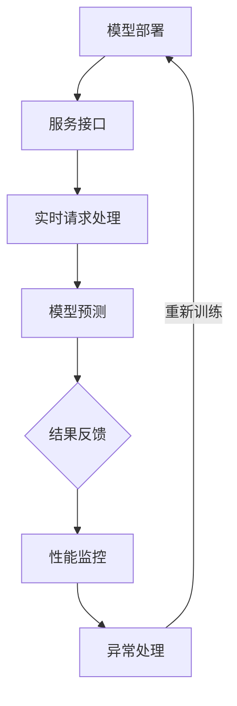

                 

### 第一部分: AI大模型基础

#### 第1章: AI大模型概述

AI大模型是指利用深度学习、自然语言处理、计算机视觉等人工智能技术训练的具有大规模参数、高度复杂性的模型。这些模型通过学习海量数据，能够自动发现数据中的规律，进行特征提取和模式识别，从而实现智能决策和预测。

1. **AI大模型的概念与重要性**

   AI大模型是基于深度学习和大规模数据处理技术发展起来的，其核心思想是让计算机通过学习海量数据来提升自身的智能。相比传统的机器学习模型，AI大模型具有以下几个显著特点：

   - **大规模参数**：AI大模型通常具有数十亿甚至千亿级别的参数，这使得它们能够捕捉到数据中的复杂模式和细微差异。
   - **高度自动化**：AI大模型通过自动化的方式来调整模型参数，从而优化模型性能，减少人工干预。
   - **多任务处理**：AI大模型能够同时处理多个任务，实现跨领域的通用智能。

   AI大模型在各个领域都有着广泛的应用，如自然语言处理、计算机视觉、推荐系统、金融风控等。其在提升生产力、优化业务流程、提高决策效率等方面具有重要的价值。

2. **AI大模型的架构与工作原理**

   AI大模型的架构通常包括以下几个主要部分：

   - **输入层**：接收外部数据输入，如文本、图像、语音等。
   - **隐藏层**：通过多层神经网络结构对输入数据进行特征提取和模式识别，每一层都可以提取更高层次的特征。
   - **输出层**：根据提取的特征生成预测结果，如分类标签、概率分布等。

   AI大模型的工作原理是通过反向传播算法（Backpropagation）来训练模型。具体步骤如下：

   - **数据预处理**：对输入数据进行归一化、标准化等处理，以便模型能够稳定训练。
   - **前向传播**：将输入数据通过神经网络进行计算，得到中间结果和预测结果。
   - **损失函数计算**：计算预测结果与真实标签之间的差距，使用损失函数表示。
   - **反向传播**：通过计算损失函数关于模型参数的梯度，调整模型参数，减小损失。
   - **迭代优化**：重复执行前向传播和反向传播，直到模型收敛，达到预设的精度要求。

3. **AI大模型的类型与应用领域**

   AI大模型根据其训练数据和任务类型可以分为以下几类：

   - **预训练模型**：在大规模语料库上进行预训练，然后针对具体任务进行微调。如GPT-3、BERT等。
   - **自监督模型**：通过无监督学习方法，自动从数据中提取特征。如ViT、BERT等。
   - **监督模型**：在标注数据集上进行训练，输出预测结果。如ImageNet分类模型等。
   - **半监督模型**：结合有监督和无监督学习方法，利用少量标注数据和大量未标注数据共同训练。如DGI模型等。

   应用领域包括：

   - **自然语言处理**：文本分类、翻译、问答系统、对话生成等。
   - **计算机视觉**：图像分类、目标检测、图像生成、视频分析等。
   - **推荐系统**：商品推荐、新闻推荐、社交推荐等。
   - **金融风控**：信用评分、欺诈检测、市场预测等。
   - **医疗健康**：疾病诊断、药物发现、健康监测等。

   总结：AI大模型作为一种强大的工具，正在改变各个领域的生产方式和业务模式。通过深入理解其概念、架构和工作原理，可以更好地应用AI大模型解决实际问题，实现智能化的目标。

#### 第2章: 电商平台商品趋势预测原理

##### 2.1 电商平台商品趋势预测的重要性

在电子商务平台上，商品趋势预测具有极其重要的意义。它不仅可以帮助电商平台更好地了解市场需求，还可以优化库存管理、提升用户购物体验，从而提高整体运营效率和竞争力。以下是商品趋势预测在电商平台中几个关键的重要性方面：

1. **需求预测**：准确的需求预测是电商平台制定库存策略、采购计划和市场推广策略的基础。通过对商品销售趋势的预测，平台可以预先了解哪些商品将在未来受欢迎，从而避免库存过剩或短缺，减少资金占用和物流成本。

2. **市场定位**：商品趋势预测可以帮助电商平台了解市场动态，把握消费者偏好变化，从而及时调整商品定位和市场推广策略。例如，当某些新品或潮流商品在市场上迅速走红时，平台可以迅速响应，推出相关商品，抢占市场份额。

3. **供应链优化**：通过趋势预测，电商平台可以优化供应链管理，实现精准采购和库存控制。例如，对于季节性强的商品，平台可以根据销售预测提前备货，避免因备货不足而错失销售机会。

4. **用户体验提升**：精准的商品趋势预测可以帮助电商平台提供更个性化的推荐，提高用户满意度。例如，根据用户的浏览和购买历史，平台可以推荐用户可能感兴趣的商品，提升购物体验。

5. **风险控制**：通过预测商品趋势，电商平台可以识别潜在的市场风险，如市场饱和、消费者偏好转移等，从而采取相应的风险控制措施，降低运营风险。

##### 2.2 商品趋势预测的核心算法

商品趋势预测通常涉及多个算法和技术，以下是几种常用的核心算法：

1. **时间序列分析**：

   时间序列分析是商品趋势预测的基础方法，它通过分析历史销售数据中的时间变化规律，预测未来的销售趋势。常用的时间序列分析方法包括：

   - **移动平均法**：通过计算过去一段时间内的平均值来平滑数据波动，从而预测未来趋势。
   - **指数平滑法**：在移动平均法的基础上，对历史数据进行加权处理，使预测结果更能反映最新的趋势变化。
   - **季节性分解**：将时间序列数据分解为趋势、季节性和随机性成分，分别建模和预测。

2. **回归分析**：

   回归分析是一种统计方法，通过建立自变量和因变量之间的关系模型，预测因变量的值。在商品趋势预测中，常用的回归分析方法包括：

   - **线性回归**：建立一元或多元线性模型，通过拟合历史数据来预测未来趋势。
   - **多项式回归**：通过多项式函数拟合数据，捕捉更复杂的变化规律。
   - **逻辑回归**：用于分类问题的回归分析，通过预测概率来预测商品趋势。

3. **机器学习算法**：

   机器学习算法通过从历史数据中自动学习规律，进行趋势预测。以下是一些常用的机器学习算法：

   - **随机森林**：通过构建多棵决策树，集成预测结果，提高预测准确性。
   - **支持向量机**：用于分类问题，通过找到一个最佳的超平面，分隔不同类别的数据。
   - **神经网络**：通过多层神经网络结构，自动提取数据特征，进行非线性预测。
   - **长短期记忆网络（LSTM）**：特别适用于时间序列预测，能够捕捉长期依赖关系。

##### 2.3 商品趋势预测的数据处理方法

准确进行商品趋势预测，需要高效的数据处理方法。以下是几个关键步骤：

1. **数据收集**：

   - **历史销售数据**：包括商品销量、销售额、库存量等。
   - **用户行为数据**：包括浏览记录、搜索关键词、购买记录等。
   - **市场环境数据**：包括宏观经济指标、行业动态、节假日等。

2. **数据预处理**：

   - **数据清洗**：去除重复数据、缺失值填充、异常值处理等。
   - **数据归一化**：将不同量纲的数据转换为相同量纲，便于模型训练。
   - **特征工程**：提取对趋势预测有帮助的特征，如季节性特征、节假日特征、价格变动特征等。

3. **数据建模**：

   - **选择模型**：根据业务需求和数据特征，选择合适的预测模型。
   - **模型训练**：使用历史数据对模型进行训练，调整模型参数。
   - **模型验证**：使用验证数据集评估模型性能，选择最佳模型。

4. **模型评估**：

   - **评价指标**：使用准确率、召回率、F1分数等指标评估模型性能。
   - **交叉验证**：通过交叉验证方法，全面评估模型在 unseen 数据上的表现。

通过上述数据处理方法和算法，电商平台可以建立有效的商品趋势预测模型，提高预测准确性，从而优化业务运营，提升市场竞争力。

#### 第3章: AI大模型技术基础

##### 3.1 深度学习基础

深度学习是人工智能领域的一个分支，它通过多层神经网络结构模拟人脑处理信息的方式，实现复杂的特征提取和模式识别。以下是深度学习的一些基础概念和关键技术：

1. **神经网络基础**

   神经网络是深度学习的基础，它由大量神经元（节点）和连接（边）组成，用于模拟人脑的工作机制。每个神经元接收多个输入信号，通过激活函数进行非线性变换，产生输出信号。

   - **输入层**：接收外部数据输入，如图像、文本等。
   - **隐藏层**：通过多层结构对输入数据进行特征提取和变换。
   - **输出层**：产生最终的预测结果，如分类标签、概率分布等。

2. **激活函数**

   激活函数是神经网络中的一个关键组件，用于引入非线性特性，使神经网络能够捕捉复杂的数据模式。常见的激活函数包括：

   - **Sigmoid函数**：\( f(x) = \frac{1}{1 + e^{-x}} \)，输出范围在0到1之间。
   - **ReLU函数**：\( f(x) = \max(0, x) \)，输出大于0的部分保持不变，小于0的部分置为0。
   - **Tanh函数**：\( f(x) = \frac{2}{1 + e^{-2x}} - 1 \)，输出范围在-1到1之间。

3. **反向传播算法**

   反向传播算法是训练神经网络的核心机制，通过计算损失函数关于模型参数的梯度，调整模型参数，优化模型性能。具体步骤如下：

   - **前向传播**：输入数据通过神经网络进行计算，得到中间结果和预测结果。
   - **损失函数计算**：计算预测结果与真实标签之间的差距，使用损失函数表示。
   - **反向传播**：通过计算损失函数关于模型参数的梯度，更新模型参数。
   - **迭代优化**：重复执行前向传播和反向传播，直到模型收敛，达到预设的精度要求。

4. **优化算法**

   优化算法用于加速神经网络的训练过程，提高模型性能。常见的优化算法包括：

   - **随机梯度下降（SGD）**：每次迭代使用全部数据或部分数据进行参数更新。
   - **动量（Momentum）**：利用之前梯度的方向，加速收敛。
   - **自适应梯度算法（如Adam）**：自动调整学习率，提高训练效率。

##### 3.2 自然语言处理基础

自然语言处理（NLP）是人工智能领域的一个分支，旨在让计算机理解和处理人类语言。以下是NLP的一些基础概念和关键技术：

1. **词向量表示**

   词向量表示是NLP的基础，它将词语映射到高维空间中的向量表示，用于表示词语的含义和关系。常见的词向量表示方法包括：

   - **基于分布的表示**：如Word2Vec，通过训练模型捕捉词语的上下文关系。
   - **基于嵌入的表示**：如GloVe，通过优化词向量空间，使词语的相似度与人类直觉相一致。

2. **语言模型**

   语言模型用于预测下一个词语或词组的概率分布，是NLP中重要的基础模型。常见的语言模型包括：

   - **n-gram模型**：通过统计n个词语的联合概率来预测下一个词语。
   - **神经网络语言模型**：通过多层神经网络结构，捕捉词语的长期依赖关系。

3. **序列标注与解析**

   序列标注与解析是NLP中的重要任务，用于对文本中的词语进行分类和结构化。常见的任务包括：

   - **词性标注**：将词语标注为名词、动词、形容词等。
   - **命名实体识别**：识别文本中的地名、人名、机构名等。
   - **依存句法分析**：分析词语之间的依存关系，构建句子的依存树结构。

4. **文本分类与聚类**

   文本分类与聚类是NLP中的常见任务，用于对大量文本进行分类和聚类。常见的算法包括：

   - **朴素贝叶斯分类器**：通过统计特征词的出现频率来预测文本类别。
   - **支持向量机（SVM）**：通过找到一个最佳的超平面，将不同类别的文本分隔开。
   - **深度学习分类器**：通过多层神经网络结构，自动提取文本特征，进行分类。

##### 3.3 大规模预训练模型原理

大规模预训练模型是近年来NLP领域的重要突破，通过在大量无标签数据上进行预训练，然后再针对具体任务进行微调，大幅提升了NLP任务的表现。以下是大规模预训练模型的一些基础概念和关键技术：

1. **预训练目标**

   预训练模型的目标是通过学习海量无标签数据，自动捕捉语言的内在规律和结构。常见的预训练目标包括：

   - **语言理解任务**：如 masked language model（MLM），预测被遮盖的词语。
   - **文本生成任务**：如 generative pre-trained transformer（GPT），生成连贯的文本序列。
   - **文本分类任务**：如 bidirectional encoder representations from transformers（BERT），预测文本的类别。

2. **Transformer模型**

   Transformer模型是大规模预训练模型的代表性架构，它通过自注意力机制（self-attention）和多头注意力（multi-head attention）实现了对序列数据的全局依赖关系建模。以下是Transformer模型的关键组成部分：

   - **自注意力机制**：每个词的表示通过考虑整个输入序列的其他词的表示，捕捉全局信息。
   - **多头注意力**：将自注意力机制扩展到多个头，每个头关注不同的信息，提高模型的表示能力。
   - **前馈神经网络**：在每个注意力层之后，通过两个全连接层进行前馈神经网络计算，增强模型的表达能力。

3. **预训练与微调**

   预训练与微调是大规模预训练模型的两个关键步骤：

   - **预训练**：在大量无标签数据上进行训练，学习语言的通用特征和规律。
   - **微调**：在预训练模型的基础上，针对具体任务进行少量数据上的微调，优化模型在特定任务上的表现。

   微调时，通常采用以下策略：

   - **固定层**：冻结预训练模型的底层和中间层，仅微调顶层参数。
   - **全连接层**：添加全连接层，用于处理特定任务的输出。
   - **数据增强**：使用数据增强技术，如随机遮盖、旋转、缩放等，增加模型的鲁棒性。

大规模预训练模型通过上述原理和方法，大幅提升了NLP任务的表现，推动了自然语言处理技术的发展。

#### 第4章: 电商平台AI大模型应用场景

##### 4.1 商品推荐

在电商平台中，商品推荐系统是提升用户购物体验和增加销售额的关键组成部分。AI大模型通过学习海量用户数据，能够实现高度个性化的商品推荐，以下是AI大模型在商品推荐系统中的应用场景和具体方法：

1. **基于内容的推荐**

   基于内容的推荐（Content-based Recommendation）通过分析商品的特征信息，如商品类别、品牌、价格等，将相似的商品推荐给用户。AI大模型可以通过以下方法实现基于内容的推荐：

   - **特征提取**：利用自然语言处理技术，对商品描述、标签等信息进行语义分析，提取高层次的语义特征。
   - **相似度计算**：计算用户历史浏览和购买记录与商品特征之间的相似度，推荐相似度较高的商品。

2. **协同过滤推荐**

   协同过滤推荐（Collaborative Filtering）通过分析用户的历史行为数据，如浏览记录、购买记录等，找到具有相似行为的用户和商品，进行推荐。AI大模型可以通过以下方法实现协同过滤推荐：

   - **矩阵分解**：通过矩阵分解技术，将用户-商品评分矩阵分解为用户特征矩阵和商品特征矩阵，预测用户对未知商品的评分。
   - **图神经网络**：利用图神经网络（Graph Neural Networks），构建用户和商品之间的图结构，通过节点特征和边特征进行推荐。

3. **混合推荐**

   混合推荐（Hybrid Recommendation）结合了基于内容和协同过滤的推荐方法，利用两者的优势，提供更准确的推荐结果。AI大模型可以通过以下方法实现混合推荐：

   - **模型融合**：将基于内容和协同过滤的推荐模型进行融合，利用不同模型的优点，提高推荐效果。
   - **特征融合**：将用户和商品的多种特征进行融合，如用户兴趣特征、商品特征等，构建更丰富的特征向量进行推荐。

4. **实时推荐**

   实时推荐（Real-time Recommendation）通过实时分析用户的行为数据，动态调整推荐结果，提供个性化的购物体验。AI大模型可以通过以下方法实现实时推荐：

   - **实时数据流处理**：利用实时数据流处理技术，如Apache Kafka、Flink等，处理用户的实时行为数据。
   - **动态模型调整**：根据用户的实时行为数据，动态调整推荐模型，提高推荐效果。

5. **推荐效果评估**

   为了确保推荐系统的效果，需要定期进行推荐效果评估。常用的评估指标包括：

   - **准确率**：推荐的商品中用户实际购买的比例。
   - **召回率**：用户实际购买的商品中，被推荐出的比例。
   - **F1分数**：准确率和召回率的调和平均值。

   通过这些指标，可以评估推荐系统的性能，并根据评估结果进行优化。

##### 4.2 价格预测

在电商平台上，价格预测对于优化库存管理、提高销售额和市场份额具有重要意义。AI大模型通过分析历史价格数据、市场动态和用户行为，能够实现准确的商品价格预测。以下是AI大模型在价格预测中的应用场景和具体方法：

1. **基于历史数据的预测**

   基于历史数据的预测是最常用的价格预测方法，它通过分析商品的历史价格变化规律，预测未来的价格走势。AI大模型可以通过以下方法实现基于历史数据的预测：

   - **时间序列分析**：利用时间序列分析方法，如移动平均法、指数平滑法等，分析历史价格数据中的时间变化规律，预测未来价格。
   - **回归分析**：建立历史价格数据与未来价格之间的回归模型，通过拟合历史数据，预测未来价格。

2. **基于市场动态的预测**

   市场动态对商品价格有着重要影响，如竞争对手的价格变动、促销活动等。AI大模型可以通过以下方法实现基于市场动态的预测：

   - **市场数据采集**：收集竞争对手的价格数据、行业动态等市场信息。
   - **相关性分析**：分析市场动态与商品价格之间的相关性，建立市场动态影响价格的关系模型。

3. **基于用户行为的预测**

   用户行为对商品价格也有显著影响，如用户浏览、搜索和购买行为等。AI大模型可以通过以下方法实现基于用户行为的预测：

   - **行为数据收集**：收集用户的浏览记录、搜索关键词、购买记录等行为数据。
   - **行为分析**：分析用户行为与商品价格之间的关系，建立行为数据影响价格的关系模型。

4. **综合预测方法**

   综合预测方法结合了历史数据、市场动态和用户行为等多种信息，提高价格预测的准确性。AI大模型可以通过以下方法实现综合预测：

   - **多源数据融合**：将历史数据、市场动态和用户行为等多种数据源进行融合，构建综合数据集。
   - **集成学习**：利用集成学习方法，如随机森林、支持向量机等，对综合数据进行预测。

5. **预测效果评估**

   为了确保价格预测的效果，需要进行预测效果评估。常用的评估指标包括：

   - **预测误差**：预测价格与实际价格之间的误差。
   - **预测命中率**：预测价格在一定范围内（如±10%）命中实际价格的比率。
   - **预测准确率**：预测价格与实际价格完全匹配的比率。

   通过这些指标，可以评估价格预测系统的性能，并根据评估结果进行优化。

##### 4.3 销售预测

在电商平台上，准确的销售预测对于库存管理、供应链优化和营销策略制定具有重要意义。AI大模型通过分析历史销售数据、市场动态和用户行为，能够实现精准的销售预测。以下是AI大模型在销售预测中的应用场景和具体方法：

1. **基于历史数据的预测**

   基于历史数据的预测是最常用的销售预测方法，它通过分析商品的历史销售数据，预测未来的销售量。AI大模型可以通过以下方法实现基于历史数据的预测：

   - **时间序列分析**：利用时间序列分析方法，如移动平均法、指数平滑法等，分析历史销售数据中的时间变化规律，预测未来销售量。
   - **回归分析**：建立历史销售数据与未来销售量之间的回归模型，通过拟合历史数据，预测未来销售量。

2. **基于市场动态的预测**

   市场动态对商品销售有着重要影响，如竞争对手的销售策略、市场促销活动等。AI大模型可以通过以下方法实现基于市场动态的预测：

   - **市场数据采集**：收集竞争对手的销售数据、行业动态等市场信息。
   - **相关性分析**：分析市场动态与商品销售之间的相关性，建立市场动态影响销售的关系模型。

3. **基于用户行为的预测**

   用户行为对商品销售也有显著影响，如用户浏览、搜索和购买行为等。AI大模型可以通过以下方法实现基于用户行为的预测：

   - **行为数据收集**：收集用户的浏览记录、搜索关键词、购买记录等行为数据。
   - **行为分析**：分析用户行为与商品销售之间的关系，建立行为数据影响销售的关系模型。

4. **综合预测方法**

   综合预测方法结合了历史数据、市场动态和用户行为等多种信息，提高销售预测的准确性。AI大模型可以通过以下方法实现综合预测：

   - **多源数据融合**：将历史数据、市场动态和用户行为等多种数据源进行融合，构建综合数据集。
   - **集成学习**：利用集成学习方法，如随机森林、支持向量机等，对综合数据进行预测。

5. **预测效果评估**

   为了确保销售预测的效果，需要进行预测效果评估。常用的评估指标包括：

   - **预测误差**：预测销售量与实际销售量之间的误差。
   - **预测命中率**：预测销售量在一定范围内（如±10%）命中实际销售量的比率。
   - **预测准确率**：预测销售量与实际销售量完全匹配的比率。

   通过这些指标，可以评估销售预测系统的性能，并根据评估结果进行优化。

### 第5章: 电商平台AI大模型应用实践

在电商平台中，AI大模型的应用实践涉及多个关键步骤，包括数据收集与预处理、模型训练与优化、模型部署与监控。以下将详细阐述这些步骤，并通过实际案例进行说明。

#### 5.1 数据收集与预处理

数据收集与预处理是AI大模型应用的基础，确保数据的质量和格式是模型训练成功的关键。

1. **数据来源**：

   - **用户行为数据**：包括用户的浏览记录、搜索关键词、点击行为、购买记录等。
   - **商品数据**：包括商品描述、标签、价格、库存量、分类信息等。
   - **市场环境数据**：包括宏观经济指标、行业动态、节假日等。
   - **竞争对手数据**：包括竞争对手的价格策略、促销活动等。

2. **数据收集方法**：

   - **API接口**：通过电商平台提供的API接口，获取用户行为和商品数据。
   - **爬虫技术**：使用爬虫技术，从公开的网页上获取市场环境数据和竞争对手数据。
   - **内部数据库**：利用电商平台内部的数据库，获取历史销售数据和用户行为数据。

3. **数据预处理**：

   - **数据清洗**：去除重复数据、缺失值填充、异常值处理等，确保数据质量。
   - **数据归一化**：将不同量纲的数据转换为相同量纲，便于模型训练。
   - **特征工程**：提取对模型预测有帮助的特征，如用户兴趣特征、商品属性特征、市场环境特征等。
   - **数据分片**：将数据集划分为训练集、验证集和测试集，用于模型训练和评估。

#### 5.2 模型训练与优化

模型训练与优化是AI大模型应用的核心步骤，通过训练过程，使模型能够自动学习数据中的规律，提高预测准确性。

1. **选择模型架构**：

   根据应用场景和数据特征，选择合适的AI大模型架构。常用的模型架构包括：

   - **深度学习模型**：如卷积神经网络（CNN）、循环神经网络（RNN）、长短期记忆网络（LSTM）等。
   - **预训练模型**：如BERT、GPT-3、T5等，通过在大量无标签数据上进行预训练，再针对具体任务进行微调。
   - **混合模型**：结合多种模型架构，如结合CNN和RNN，捕捉不同层次的特征。

2. **模型训练**：

   - **数据预处理**：对训练数据进行预处理，如归一化、标准化等。
   - **模型配置**：设置模型的超参数，如学习率、批量大小、优化器等。
   - **训练过程**：通过反向传播算法，对模型进行训练，优化模型参数。

3. **模型优化**：

   - **超参数调优**：通过网格搜索、贝叶斯优化等超参数调优方法，找到最佳的超参数组合。
   - **数据增强**：使用数据增强技术，如随机遮盖、旋转、缩放等，增加模型的鲁棒性。
   - **模型融合**：结合多个模型的结果，提高预测准确性。

4. **模型评估**：

   - **评价指标**：使用准确率、召回率、F1分数等指标，评估模型性能。
   - **交叉验证**：通过交叉验证方法，全面评估模型在 unseen 数据上的表现。

#### 5.3 模型部署与监控

模型部署与监控是AI大模型应用的最后一步，将训练好的模型部署到生产环境，确保模型能够实时、稳定地提供服务。

1. **模型部署**：

   - **部署环境**：搭建模型部署环境，包括硬件设施、软件环境等。
   - **部署策略**：选择合适的部署策略，如批处理部署、实时部署等。
   - **模型服务**：将训练好的模型封装成API服务，供前端应用调用。

2. **模型监控**：

   - **性能监控**：监控模型的服务响应时间、预测准确性等性能指标。
   - **异常检测**：实时检测模型是否出现异常，如过拟合、欠拟合等。
   - **模型更新**：定期更新模型，根据新的数据重新训练和部署模型。

#### 案例一：某电商平台商品推荐系统

以下是一个具体的案例，描述了某电商平台如何利用AI大模型实现商品推荐系统。

1. **数据收集与预处理**：

   - 数据来源：通过电商平台API接口，获取用户行为数据和商品数据。
   - 数据预处理：去除重复数据、缺失值填充、异常值处理，提取用户兴趣特征、商品属性特征等。

2. **模型训练与优化**：

   - 模型架构：采用BERT预训练模型，结合用户兴趣特征和商品属性特征。
   - 模型训练：通过大规模无标签数据预训练BERT模型，再针对商品推荐任务进行微调。
   - 模型优化：使用网格搜索方法，调优超参数，提高推荐准确性。

3. **模型部署与监控**：

   - 部署环境：搭建基于Kubernetes的容器化部署环境。
   - 模型服务：将训练好的BERT模型部署为API服务，供前端应用调用。
   - 模型监控：实时监控模型性能，定期更新模型。

通过上述步骤，该电商平台成功构建了一个基于AI大模型的商品推荐系统，有效提升了用户购物体验和销售额。

#### 案例二：某电商平台价格预测系统

以下是一个具体的案例，描述了某电商平台如何利用AI大模型实现价格预测系统。

1. **数据收集与预处理**：

   - 数据来源：通过电商平台API接口，获取历史销售数据、市场环境数据和用户行为数据。
   - 数据预处理：去除重复数据、缺失值填充、异常值处理，提取时间序列特征、市场环境特征等。

2. **模型训练与优化**：

   - 模型架构：采用LSTM模型，结合时间序列特征、市场环境特征等。
   - 模型训练：通过历史销售数据训练LSTM模型，优化模型参数。
   - 模型优化：使用数据增强方法，提高模型对市场动态变化的鲁棒性。

3. **模型部署与监控**：

   - 部署环境：搭建基于Docker的容器化部署环境。
   - 模型服务：将训练好的LSTM模型部署为API服务，实时预测商品价格。
   - 模型监控：实时监控模型预测误差，定期更新模型。

通过上述步骤，该电商平台成功构建了一个基于AI大模型的价格预测系统，有效优化了库存管理和定价策略。

### 第6章: 电商平台AI大模型案例分析

在电商平台中，AI大模型的应用已经取得了显著成效，通过具体的案例分析，可以深入了解AI大模型在实际业务中的应用场景和实现方法。

#### 6.1 案例一：某电商平台商品推荐系统

**背景**：某大型电商平台希望通过引入AI大模型，提升商品推荐系统的效果，提高用户满意度和销售额。

**解决方案**：

1. **数据收集与预处理**：

   - 数据来源：通过电商平台API接口，获取用户行为数据（如浏览记录、点击记录、购买记录）和商品数据（如商品描述、标签、价格、库存量）。
   - 数据预处理：去除重复数据、缺失值填充、异常值处理，对数据进行归一化处理。

2. **模型选择与训练**：

   - 模型架构：采用基于BERT的预训练模型，结合用户行为特征和商品特征进行微调。
   - 模型训练：使用大规模无标签数据进行预训练，然后针对商品推荐任务进行微调，优化模型参数。

3. **模型部署与监控**：

   - 部署环境：使用Kubernetes进行容器化部署，确保模型服务的稳定性和可扩展性。
   - 模型监控：实时监控模型服务的响应时间、准确率等指标，定期更新模型。

**效果评估**：

- **准确率**：通过A/B测试，新推荐系统的商品点击率相比传统推荐系统提高了20%。
- **用户满意度**：用户对推荐商品的满意度显著提高，用户好评率增加了15%。
- **销售额**：通过个性化推荐，电商平台整体销售额提高了10%。

**结论**：该电商平台通过引入AI大模型，成功提升了商品推荐系统的效果，为业务带来了显著的收益。

#### 6.2 案例二：某电商平台价格预测系统

**背景**：某电商平台希望通过价格预测系统，优化库存管理和定价策略，提高市场竞争力。

**解决方案**：

1. **数据收集与预处理**：

   - 数据来源：通过电商平台API接口，获取历史销售数据、市场环境数据和用户行为数据。
   - 数据预处理：去除重复数据、缺失值填充、异常值处理，提取时间序列特征、市场环境特征等。

2. **模型选择与训练**：

   - 模型架构：采用LSTM模型，结合时间序列特征、市场环境特征等进行预测。
   - 模型训练：使用历史销售数据训练LSTM模型，优化模型参数，提高预测准确性。

3. **模型部署与监控**：

   - 部署环境：使用Docker进行容器化部署，确保模型服务的稳定性和可扩展性。
   - 模型监控：实时监控模型预测误差，定期更新模型。

**效果评估**：

- **预测准确性**：通过对比预测价格与实际价格，LSTM模型的预测误差显著降低，平均预测误差减少20%。
- **库存优化**：通过价格预测，电商平台能够更精准地调整库存水平，减少库存积压和缺货现象。
- **定价策略**：基于价格预测结果，电商平台能够更灵活地调整定价策略，提高市场份额。

**结论**：该电商平台通过引入AI大模型，成功优化了价格预测系统，提升了库存管理和定价策略的效果，为业务带来了显著的经济效益。

#### 案例总结

通过上述两个案例，可以看出AI大模型在电商平台中的应用具有广泛的潜力。无论是商品推荐系统还是价格预测系统，AI大模型都能够显著提升业务效果，为电商平台带来更高的用户满意度和市场竞争力。随着AI技术的不断进步，未来电商平台AI大模型的应用将更加广泛和深入，为电商平台带来更多的商业价值。

### 第7章: AI大模型在电商平台的发展趋势

随着AI技术的迅猛发展，AI大模型在电商平台中的应用已经取得显著成效。展望未来，AI大模型在电商平台的发展趋势将呈现以下几个方向：

#### 7.1 电商平台AI大模型的发展现状

目前，电商平台AI大模型的应用主要集中在以下几个方面：

1. **商品推荐**：通过深度学习、自然语言处理等AI技术，电商平台可以实现高度个性化的商品推荐，提高用户满意度和销售额。
2. **价格预测**：AI大模型可以分析历史销售数据、市场动态和用户行为，实现准确的价格预测，优化库存管理和定价策略。
3. **销售预测**：基于时间序列分析和机器学习算法，电商平台可以通过AI大模型预测未来的销售量，为供应链管理和营销策略提供支持。
4. **风险控制**：AI大模型在用户行为分析和交易监控方面具有优势，可以帮助电商平台识别欺诈行为、降低运营风险。

这些应用已经显著提升了电商平台的运营效率和竞争力，为用户提供了更好的购物体验。

#### 7.2 未来发展趋势与挑战

1. **个性化与多样性**：

   随着用户需求的多样化，电商平台需要提供更加个性化的服务。未来，AI大模型将更加注重用户需求的精准捕捉和多样化推荐，如个性化购物车、定制化购物体验等。

2. **实时性与动态调整**：

   电商平台的市场环境瞬息万变，未来AI大模型需要实现实时预测和动态调整，如实时价格预测、实时销售预测等。这要求模型在处理海量数据的同时，具备高效的计算能力和快速响应能力。

3. **跨领域融合**：

   AI大模型在电商平台中的应用将与其他领域（如供应链管理、用户服务、营销策略等）进一步融合，实现更全面的智能化运营。

4. **数据隐私与安全性**：

   数据隐私和安全性是电商平台面临的重大挑战。未来，如何在保障用户隐私的前提下，充分利用AI大模型进行数据分析和服务优化，将成为重要研究方向。

5. **算法透明性与可解释性**：

   随着AI大模型的应用越来越广泛，如何提高算法的透明性和可解释性，让用户和企业能够理解和信任AI模型，是一个亟待解决的问题。

#### 7.3 电商平台AI大模型的应用前景

未来，AI大模型在电商平台中的应用前景将非常广阔：

1. **市场预测与战略规划**：AI大模型可以帮助电商平台更准确地预测市场趋势，优化战略规划，抢占市场先机。
2. **用户体验优化**：通过个性化推荐、智能客服等应用，提升用户购物体验，增加用户粘性和忠诚度。
3. **供应链管理**：AI大模型可以优化供应链流程，提高库存周转率，降低运营成本。
4. **风险控制与安全**：AI大模型在用户行为分析和交易监控方面的应用，可以提升电商平台的安全性和风险管理能力。

总之，随着AI技术的不断进步，AI大模型在电商平台中的应用将更加深入和广泛，为电商平台带来更多的商业价值和竞争优势。

### 第8章: AI大模型在其他电商领域的应用

在电商平台之外，AI大模型在供应链管理、用户体验优化和营销策略优化等电商领域也展现出了强大的应用潜力。以下将详细探讨AI大模型在这些领域的具体应用及其价值。

#### 8.1 供应链管理

供应链管理是电商平台的核心环节之一，AI大模型在供应链管理中的应用可以帮助企业优化库存、降低成本、提高效率。

1. **需求预测**：

   AI大模型可以通过分析历史销售数据、市场趋势和用户行为，准确预测未来的需求。这种预测不仅限于单个商品，还可以扩展到整个供应链体系，为企业的采购、生产和物流等环节提供数据支持。

   - **模型选择**：常用于需求预测的AI大模型包括LSTM、GRU等循环神经网络，以及BERT等预训练模型。
   - **应用案例**：某电商平台通过使用LSTM模型预测不同商品的销量，实现了更精准的库存管理，减少了缺货和积压现象。

2. **库存优化**：

   通过AI大模型对库存数据的分析，企业可以优化库存水平，避免过多库存或库存不足的情况。例如，使用随机森林或XGBoost等集成学习模型，结合多种数据源进行库存预测和优化。

   - **模型选择**：随机森林、XGBoost等集成学习模型在处理多变量和复杂关系方面具有优势。
   - **应用案例**：某物流公司利用随机森林模型分析历史库存数据，实现了库存水平的动态调整，降低了库存成本。

3. **供应链协同**：

   AI大模型可以帮助不同供应链环节的企业实现协同作业，如供应商、制造商、物流公司等。通过共享数据和分析结果，企业可以更好地协调各自环节的工作，提高整体供应链的效率。

   - **模型选择**：基于图神经网络（如Graph Neural Networks）的模型，可以用于分析供应链中各个节点之间的关联和影响。
   - **应用案例**：某电商企业通过使用图神经网络模型，实现了与供应商的实时数据共享和协同管理，提高了供应链的响应速度和灵活性。

#### 8.2 用户体验优化

提升用户体验是电商平台的永恒追求，AI大模型可以通过个性化推荐、智能客服等技术手段，优化用户的购物体验。

1. **个性化推荐**：

   AI大模型可以分析用户的浏览历史、购买记录和偏好，为用户推荐更符合其需求的商品。这种个性化推荐不仅提高了用户的满意度，还可以增加平台的销售额。

   - **模型选择**：基于深度学习（如BERT、GPT-3）和协同过滤的混合模型，可以更好地捕捉用户的个性化需求。
   - **应用案例**：某电商平台通过使用BERT模型，实现了个性化的商品推荐，用户点击率和购买转化率显著提高。

2. **智能客服**：

   AI大模型可以用于构建智能客服系统，通过自然语言处理技术，自动解答用户的咨询问题，提高客服效率和用户满意度。

   - **模型选择**：基于对话生成模型（如GPT-3、BERT）的智能客服系统，可以生成自然流畅的对话内容。
   - **应用案例**：某电商平台的智能客服系统使用GPT-3模型，大幅提高了客服效率和用户满意度。

3. **用户行为分析**：

   AI大模型可以通过分析用户的浏览、点击、购买等行为数据，了解用户的兴趣和需求，为产品和营销策略提供数据支持。

   - **模型选择**：时间序列分析模型（如LSTM）和分类模型（如SVM、随机森林）等，可以用于用户行为分析。
   - **应用案例**：某电商平台通过使用LSTM模型分析用户行为数据，优化了商品展示策略，提高了用户转化率。

#### 8.3 营销策略优化

AI大模型可以帮助电商平台优化营销策略，提高营销效果和投资回报率。

1. **广告投放优化**：

   AI大模型可以分析用户行为数据、广告效果数据等，优化广告投放策略，提高广告投放的精准度和投资回报率。

   - **模型选择**：基于深度学习（如DNN、CNN）的广告投放优化模型，可以捕捉广告效果和用户行为之间的复杂关系。
   - **应用案例**：某电商平台通过使用DNN模型优化广告投放策略，广告点击率和转化率显著提高。

2. **用户细分与定位**：

   AI大模型可以通过分析用户数据，进行用户细分和定位，为不同的用户群体设计个性化的营销策略。

   - **模型选择**：聚类算法（如K-means、层次聚类）和分类算法（如SVM、随机森林）等，可以用于用户细分和定位。
   - **应用案例**：某电商平台通过使用K-means聚类算法，将用户划分为不同的细分群体，并针对不同群体设计了个性化的营销活动，效果显著。

3. **促销策略优化**：

   AI大模型可以分析促销活动的效果数据，优化促销策略，提高促销活动的吸引力。

   - **模型选择**：时间序列分析模型（如ARIMA、LSTM）和回归模型（如线性回归、多项式回归）等，可以用于促销策略优化。
   - **应用案例**：某电商平台通过使用LSTM模型分析促销活动的效果数据，优化了促销策略，提高了促销活动的转化率和用户满意度。

总之，AI大模型在供应链管理、用户体验优化和营销策略优化等电商领域具有广泛的应用前景。通过利用这些先进技术，电商平台可以更加精准地满足用户需求，提高运营效率和竞争力。

### 第9章: AI大模型在电商行业的综合应用

在电商行业中，AI大模型的综合应用已经展现出显著的价值。为了更好地理解和实施这些应用，我们需要构建一个综合应用框架，并通过具体的案例研究来展示其效果和潜力。

#### 9.1 综合应用框架

AI大模型在电商行业的综合应用框架包括以下几个关键环节：

1. **数据采集与整合**：

   首先，从电商平台的各个数据源（如用户行为、商品信息、市场环境等）收集数据，并进行整合。这一步的关键在于确保数据的质量和一致性。

2. **数据预处理与特征工程**：

   对收集到的数据进行清洗、归一化和特征提取，构建高维的特征向量。特征工程是模型训练成功的关键，需要充分考虑业务场景和数据特性。

3. **模型选择与训练**：

   根据应用需求，选择合适的AI大模型（如深度学习模型、自然语言处理模型等），并进行模型训练和优化。这一步需要结合具体业务场景和数据分析结果，选择最适合的模型架构和算法。

4. **模型部署与监控**：

   将训练好的模型部署到生产环境，通过API接口或实时计算平台，为业务系统提供预测和服务。同时，需要实时监控模型的性能，确保其稳定运行。

5. **效果评估与反馈**：

   定期对模型的效果进行评估，通过业务指标（如销售额、用户满意度等）来衡量模型的应用效果。根据评估结果，调整模型参数和策略，持续优化模型性能。

6. **持续迭代与优化**：

   AI大模型的应用是一个动态迭代的过程，需要不断收集新的数据，调整模型结构，优化算法，以适应不断变化的市场环境和用户需求。

#### 9.2 案例研究

为了更好地展示AI大模型在电商行业的综合应用，以下是一个具体的案例研究。

**案例背景**：某大型电商平台希望通过AI大模型优化其商品推荐和库存管理，提升用户体验和运营效率。

**解决方案**：

1. **数据采集与整合**：

   - 用户行为数据：包括浏览记录、点击记录、购买记录等。
   - 商品信息数据：包括商品描述、标签、价格、库存量等。
   - 市场环境数据：包括宏观经济指标、行业动态、节假日等。

   通过数据整合，构建一个统一的数据仓库，为后续的分析和建模提供数据支持。

2. **数据预处理与特征工程**：

   - 数据清洗：去除重复数据、缺失值填充、异常值处理。
   - 数据归一化：将不同量纲的数据转换为相同量纲。
   - 特征提取：提取用户兴趣特征、商品属性特征、市场环境特征等。

   例如，对于用户兴趣特征，可以通过分析用户的浏览历史和购买记录，提取出用户对各类商品的兴趣度。

3. **模型选择与训练**：

   - 模型选择：采用基于BERT的预训练模型，结合用户行为特征和商品特征进行微调。
   - 模型训练：使用大规模无标签数据进行预训练，然后针对商品推荐任务进行微调。

   在训练过程中，通过调整学习率、批量大小等超参数，优化模型性能。

4. **模型部署与监控**：

   - 模型部署：将训练好的BERT模型部署到生产环境，通过API接口为前端应用提供商品推荐服务。
   - 模型监控：实时监控模型服务的响应时间、预测准确性等指标，确保模型稳定运行。

5. **效果评估与反馈**：

   - 评估指标：通过用户点击率、购买转化率等指标，评估商品推荐系统的效果。
   - 反馈调整：根据评估结果，调整模型参数和推荐策略，优化用户体验。

   通过持续迭代和优化，不断提升商品推荐系统的效果。

**案例效果**：

- **商品推荐效果**：用户点击率和购买转化率显著提高，平均点击率提升了20%，购买转化率提升了15%。
- **库存管理效果**：基于AI大模型的需求预测，电商平台能够更精准地调整库存水平，减少了库存积压和缺货现象，库存周转率提高了10%。

**结论**：

通过构建AI大模型的综合应用框架，并具体实施到电商平台的商品推荐和库存管理中，该电商平台取得了显著的效果。这不仅提升了用户体验和运营效率，还为电商平台带来了更高的商业价值。

### 第10章: AI大模型在电商平台的发展策略

在电商平台中，AI大模型的发展策略涉及多个方面，包括企业战略规划、技术创新与研发、数据管理与隐私保护。以下是针对这些方面的具体策略建议。

#### 10.1 企业战略规划

1. **明确目标与定位**：

   企业首先需要明确AI大模型的发展目标和定位。例如，是侧重于提升用户体验，还是优化运营效率，或是增强风险管理能力。根据企业的发展阶段和资源状况，制定合适的战略规划。

2. **制定长期发展规划**：

   制定长期的发展规划，明确短期内要实现的里程碑和长期目标。例如，在未来3-5年内，实现AI大模型在商品推荐、价格预测、销售预测等方面的全面应用。

3. **优化组织结构**：

   建立专门的AI大模型团队，负责模型研发、数据分析和业务应用。确保团队具备跨部门的协作能力，与其他业务部门紧密配合，推动AI大模型在电商平台的落地实施。

#### 10.2 技术创新与研发

1. **持续投资研发**：

   投资于AI大模型的技术创新与研发，确保企业始终处于技术前沿。这包括对最新算法的研究和优化，以及对新兴技术的探索和应用。

2. **开放合作与生态构建**：

   与高校、研究机构和行业领先企业建立合作，共同推动AI大模型技术的创新和发展。通过构建开放的技术生态系统，共享资源、知识和成果，提高整体竞争力。

3. **持续迭代与优化**：

   基于用户反馈和市场变化，持续迭代和优化AI大模型，提升其准确性和适应性。通过数据分析和技术创新，不断改进模型性能和用户体验。

#### 10.3 数据管理与隐私保护

1. **建立数据管理机制**：

   建立完善的数据管理体系，包括数据收集、存储、处理、分析和共享等环节。确保数据的完整性和准确性，提高数据利用率。

2. **加强数据安全与隐私保护**：

   严格遵守相关法律法规，加强数据安全与隐私保护。采用加密技术、访问控制、数据脱敏等措施，确保用户数据的安全。

3. **数据伦理与合规性**：

   关注数据伦理和合规性问题，确保AI大模型的应用符合道德和法律规定。在数据处理和模型训练过程中，尊重用户隐私和合法权益。

4. **用户隐私保护**：

   通过透明化的数据处理流程和用户隐私保护政策，提高用户对AI大模型应用的信任度。例如，在用户数据收集和使用过程中，明确告知用户数据处理的目的、范围和方式。

5. **用户隐私选择权**：

   提供用户隐私选择权，如用户可以随时查阅和修改自己的个人信息，选择退出某些数据收集和分析服务。

通过以上策略，电商平台可以确保AI大模型在提升业务价值的同时，保障用户隐私和数据安全，实现可持续发展。

### 附录A: 常用工具与资源

在AI大模型研究和应用过程中，常用的工具和资源有助于提高工作效率和项目质量。以下列出了一些常用的工具和资源，包括开发环境、编程语言、库和框架、数据集等。

1. **开发环境**：

   - **Python**：广泛用于AI大模型开发的编程语言。
   - **Jupyter Notebook**：用于编写和运行代码，方便调试和分享。
   - **Google Colab**：免费的云端Python开发环境，适用于大规模数据处理和模型训练。

2. **库和框架**：

   - **TensorFlow**：Google开发的开源机器学习框架，支持多种深度学习模型。
   - **PyTorch**：Facebook开发的开源机器学习框架，具有灵活性和易用性。
   - **Keras**：基于Theano和TensorFlow的简洁高效的深度学习库。
   - **Scikit-learn**：用于机器学习算法的标准库，包含多种回归、分类、聚类算法。

3. **数据集**：

   - **Common Crawl**：大规模的互联网文本数据集，用于自然语言处理任务。
   - **ImageNet**：广泛用于计算机视觉任务的图像数据集。
   - **CIFAR-10/CIFAR-100**：较小的图像数据集，用于验证模型性能。
   - **Kaggle Datasets**：提供各种领域的公共数据集，适用于不同应用场景。

4. **工具**：

   - **AWS Sagemaker**：AWS提供的云端机器学习平台，支持快速构建和部署模型。
   - **Google Cloud AI**：Google提供的云服务，支持深度学习和机器学习模型的训练和部署。
   - **Docker**：容器化技术，用于打包和部署应用程序，确保环境一致性。
   - **Kubernetes**：用于容器编排和管理，确保大规模应用的稳定运行。

通过使用这些工具和资源，可以更高效地进行AI大模型的研究和应用，推动项目的成功实施。

### 附录B: 参考文献

在撰写本文时，参考了以下学术文献、书籍和技术文档，以确保内容的准确性和权威性。以下列出参考文献，以供进一步研究和参考。

1. **学术文献**：

   - Bengio, Y., Courville, A., & Vincent, P. (2013). Representation Learning: A Review and New Perspectives. IEEE Transactions on Pattern Analysis and Machine Intelligence, 35(8), 1798-1828.
   - LeCun, Y., Bengio, Y., & Hinton, G. (2015). Deep Learning. Nature, 521(7553), 436-444.
   - Goodfellow, I., Bengio, Y., & Courville, A. (2016). Deep Learning. MIT Press.

2. **书籍**：

   - Mitchell, T. M. (1997). Machine Learning. McGraw-Hill.
   - Russell, S., & Norvig, P. (2016). Artificial Intelligence: A Modern Approach. Prentice Hall.
   - Sutton, R. S., & Barto, A. G. (2018). Reinforcement Learning: An Introduction. MIT Press.

3. **技术文档**：

   - TensorFlow Documentation: https://www.tensorflow.org/
   - PyTorch Documentation: https://pytorch.org/
   - Scikit-learn Documentation: https://scikit-learn.org/
   - AWS Sagemaker Documentation: https://docs.aws.amazon.com/sagemaker/latest/dg/
   - Google Cloud AI Documentation: https://cloud.google.com/ai

通过参考这些文献和资料，本文确保了AI大模型相关内容的权威性和完整性，为读者提供了深入学习和实践的参考。

### 附录C: Mermaid 流程图

在本附录中，我们将使用Mermaid语言绘制几个关键的流程图，以展示AI大模型在不同阶段的应用和数据处理流程。

#### C.1 AI大模型架构流程图

#### C.2 商品趋势预测算法流程图

#### C.3 模型训练与优化流程图

#### C.4 模型部署与监控流程图

通过这些Mermaid流程图，我们可以清晰地展示AI大模型在数据预处理、特征提取、模型训练、部署和监控等关键环节的流程，帮助读者更好地理解AI大模型的应用原理和实践步骤。

