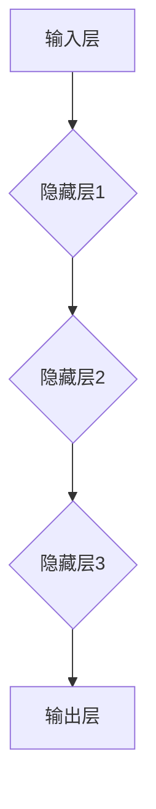
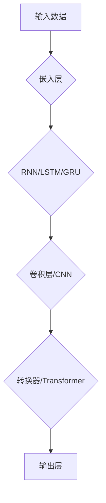
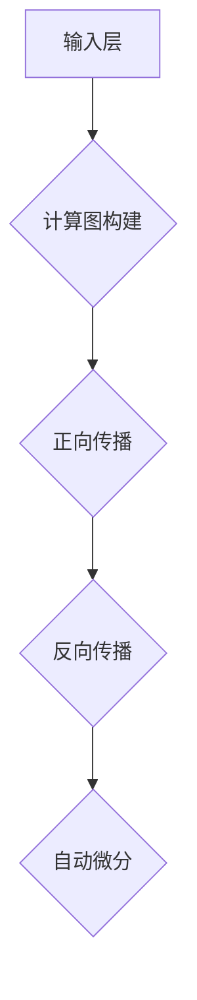
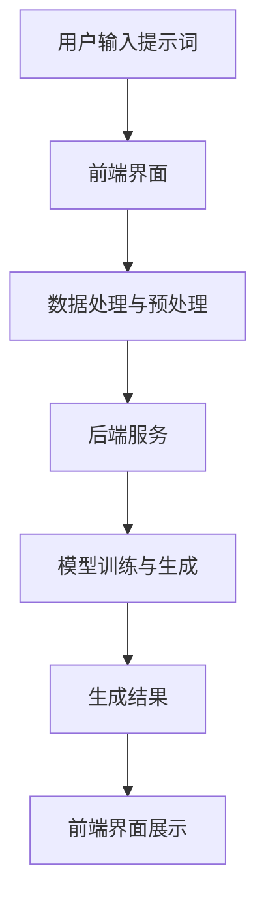
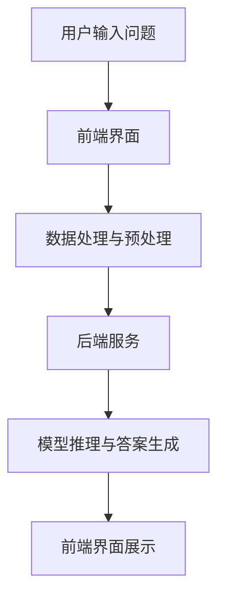
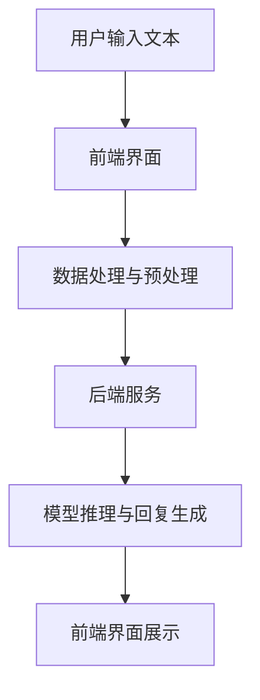
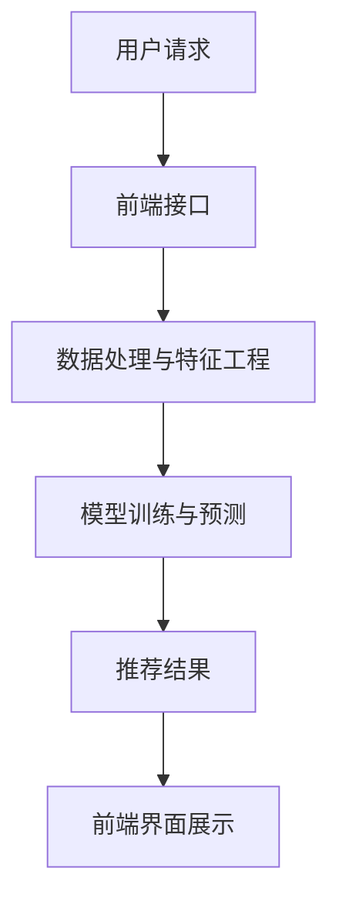

                 

### 《AI大模型编程：提示词的艺术与技巧》

#### 文章关键词

- AI大模型
- 编程技巧
- 提示词
- 人工智能
- 自然语言处理

#### 摘要

本文深入探讨了AI大模型编程的核心要素，特别是提示词的艺术与技巧。通过详细分析大模型的基础知识、架构、核心算法、训练与优化、提示词编程基础和高级技巧，本文不仅提供了理论知识，还包括了实战案例和代码解读。读者将了解如何有效地使用提示词来优化AI大模型的性能，以及在大模型编程中面临的主要挑战和未来发展趋势。

---

#### 目录大纲

**第一部分：大模型基础与架构**

- **第1章：大模型编程概述**
  - 1.1 AI大模型简史
  - 1.2 大模型编程的关键要素
  - 1.3 大模型与云计算

- **第2章：大模型架构与技术原理**
  - 2.1 大模型的基本架构
  - 2.2 大模型的核心算法
  - 2.3 大模型训练与优化

- **第3章：提示词编程与技巧**
  - 3.1 提示词编程基础
  - 3.2 高级提示词编程
  - 3.3 提示词编程实战案例

**第二部分：大模型编程项目实战**

- **第4章：构建自动化写作系统**
  - 4.1 项目需求分析
  - 4.2 系统设计与实现
  - 4.3 项目评估与优化

- **第5章：构建问答系统**
  - 5.1 项目需求分析
  - 5.2 系统设计与实现
  - 5.3 项目评估与优化

- **第6章：构建聊天机器人**
  - 6.1 项目需求分析
  - 6.2 系统设计与实现
  - 6.3 项目评估与优化

- **第7章：大模型编程实战综合案例**
  - 7.1 项目背景与目标
  - 7.2 系统设计与实现
  - 7.3 项目评估与优化

**第三部分：未来展望与挑战**

- **第8章：未来展望与挑战**
  - 8.1 大模型编程的发展趋势
  - 8.2 大模型编程面临的挑战
  - 8.3 未来展望

**附录**

- **附录A：大模型编程工具介绍**
  - TensorFlow
  - PyTorch
  - JAX
  - 其他工具

- **附录B：大模型编程学习资源**
  - 在线课程与教程
  - 开源项目与社区
  - 书籍与论文推荐

- **附录C：大模型编程常见问题解答**
  - 如何选择大模型框架？
  - 如何优化大模型训练速度？
  - 提示词编写有哪些技巧？
  - 大模型编程的伦理问题有哪些？

---

### 第一部分：大模型基础与架构

#### 第1章：大模型编程概述

##### 1.1 AI大模型简史

人工智能（AI）自20世纪50年代兴起以来，经历了多次技术变革和理论突破。从最初的规则基础系统，到后来的专家系统和基于统计的学习算法，人工智能技术逐渐成熟。然而，随着数据量的爆炸式增长和计算能力的提升，传统的AI方法已经无法满足复杂任务的需求，于是AI大模型应运而生。

AI大模型，尤其是深度学习大模型，最早可以追溯到20世纪80年代。当时，科学家们开始尝试使用多层感知机（MLP）进行图像识别。然而，由于计算能力和数据量的限制，这些早期模型的效果并不理想。直到21世纪初，随着计算能力的提升和大数据的普及，深度学习技术迎来了快速发展。

2012年，AlexNet的出现标志着深度学习在图像识别任务中取得了革命性的突破。随后，谷歌的Inception模型、微软的ResNet模型等一系列大模型相继问世，进一步提升了深度学习的性能。特别是2018年，谷歌推出的BERT模型，为自然语言处理领域带来了新的可能性。

##### 1.2 大模型的定义与分类

大模型，顾名思义，是指具有巨大参数量和复杂结构的神经网络模型。具体来说，大模型通常具有以下特征：

- **参数量巨大**：大模型的参数量通常在数百万到数十亿之间。例如，BERT模型的参数量超过1亿，GPT-3的参数量更是高达1750亿。
- **结构复杂**：大模型的结构通常包含多层神经网络，其中每一层都可能有数以千计的神经元。例如，ResNet模型包含数十层卷积层和全连接层。
- **训练数据量巨大**：大模型通常需要大量的训练数据来训练，以确保模型可以捕捉到数据中的复杂模式和规律。

根据应用场景，大模型可以分为以下几类：

- **图像识别大模型**：如ResNet、Inception等，用于处理图像数据，实现图像分类、目标检测等任务。
- **自然语言处理大模型**：如BERT、GPT等，用于处理文本数据，实现文本分类、生成、问答等任务。
- **推荐系统大模型**：如DeepFM、NFM等，用于处理用户行为数据，实现推荐系统。

##### 1.3 大模型的发展趋势与未来

随着深度学习技术的不断发展，AI大模型的应用领域也在不断扩大。目前，大模型已经在图像识别、自然语言处理、推荐系统等领域取得了显著成果。未来，随着计算能力和数据量的进一步提升，大模型的应用范围有望进一步扩展，包括但不限于以下领域：

- **医疗健康**：利用大模型进行疾病诊断、药物发现等。
- **金融**：利用大模型进行风险管理、信用评估等。
- **工业生产**：利用大模型进行生产优化、故障预测等。
- **自动驾驶**：利用大模型进行环境感知、决策规划等。

然而，大模型的发展也面临诸多挑战，如计算资源消耗、数据隐私保护、模型解释性等。未来，研究人员需要在这些方面进行深入探索，以实现大模型的安全、高效、可靠应用。

---

#### 第2章：大模型架构与技术原理

##### 2.1 大模型的基本架构

大模型的基本架构通常包括以下几个主要组成部分：

1. **输入层**：接收外部输入数据，如图像、文本等。
2. **隐藏层**：多层神经网络结构，用于提取特征和进行非线性变换。
3. **输出层**：根据模型的任务，生成预测结果或决策。

以下是大模型基本架构的Mermaid流程图：



##### 2.2 大模型的核心算法

大模型的核心算法主要包括以下几种：

1. **循环神经网络（RNN）**：适用于处理序列数据，如时间序列、文本等。
2. **长短时记忆网络（LSTM）**：RNN的改进，解决了长序列数据中的梯度消失问题。
3. **门控循环单元（GRU）**：LSTM的简化版，计算效率更高。
4. **卷积神经网络（CNN）**：适用于图像数据，可以提取图像特征。
5. **转换器架构（Transformer）**：基于自注意力机制，适用于处理序列数据。

以下是这些核心算法的Mermaid流程图：



##### 2.3 计算图与自动微分

计算图是一种用于表示和计算复杂数学表达式的图形结构，广泛应用于深度学习和神经网络中。计算图由节点和边组成，其中节点表示数学运算，边表示数据流和控制流。

自动微分是深度学习中的一个重要概念，用于计算神经网络中的梯度。梯度是优化算法中更新模型参数的关键，而自动微分可以自动计算梯度，从而简化了优化过程。

以下是计算图与自动微分的Mermaid流程图：



---

#### 第3章：提示词编程与技巧

##### 3.1 提示词编程基础

提示词（prompt）是在AI大模型中用于引导模型生成输出的一种技术。提示词的编写对于模型的性能和生成结果的质量具有重要影响。以下是提示词编程的基础：

1. **提示词的定义与作用**：
   提示词是指提供给AI大模型的一组输入，用于引导模型生成预期的输出。提示词可以是简单的文本、图像或音频等。

2. **提示词的结构与格式**：
   提示词的结构通常包括以下部分：
   - **上下文**：提供背景信息，帮助模型理解任务。
   - **任务指令**：明确指定模型需要执行的任务。
   - **示例数据**：提供一些示例数据，帮助模型学习任务。

3. **提示词的优化与调试**：
   为了提高模型的性能和生成结果的质量，需要对提示词进行优化和调试。以下是一些常见的优化技巧：
   - **增加上下文信息**：提供更丰富的上下文信息，有助于模型更好地理解任务。
   - **使用清晰的指令**：使用明确、具体的指令，避免模糊或歧义的表述。
   - **调整任务难度**：根据模型的能力和任务难度，调整提示词的难度，以使模型能够生成更准确的结果。

##### 3.2 高级提示词编程

高级提示词编程涉及更复杂的技巧，用于进一步优化模型的性能和生成结果的质量。以下是一些高级技巧：

1. **提示词的动态调整**：
   在训练过程中，可以动态调整提示词，以适应模型的学习过程。例如，在训练初期，可以提供更详细的上下文信息，而在训练后期，可以减少上下文信息，以训练模型自主生成结果。

2. **多模态提示词编程**：
   多模态提示词编程是指结合多种数据类型（如文本、图像、音频）的提示词。例如，在图像识别任务中，可以同时提供图像和文本描述，以帮助模型更好地理解任务。

3. **提示词的安全与隐私**：
   在使用提示词时，需要考虑数据的安全和隐私。例如，对于敏感信息，可以使用匿名化或加密技术，以保护用户隐私。

##### 3.3 提示词编程实战案例

以下是几个提示词编程的实战案例：

1. **自动写作系统**：
   使用大模型（如GPT-3）构建自动写作系统，输入提示词后，模型可以生成高质量的文本内容。以下是一个简单的提示词示例：

   ```plaintext
   提示词：请撰写一篇关于人工智能在医疗领域的应用的论文。
   ```

   模型生成的文本内容如下：

   ```plaintext
   人工智能在医疗领域的应用

   随着人工智能技术的不断发展，其在医疗领域的应用也越来越广泛。本文将探讨人工智能在医疗领域的多种应用，并分析其潜在的优势和挑战。

   一、诊断辅助

   人工智能可以通过分析大量的医疗数据，帮助医生进行疾病诊断。例如，深度学习算法可以分析CT扫描图像，帮助医生识别癌症等疾病。这种自动化诊断系统可以提高诊断的准确性和效率，为患者提供更及时的医疗服务。

   二、治疗建议

   人工智能还可以为医生提供治疗建议。通过对患者的病历、实验室检测结果等数据进行分析，人工智能系统可以提出个性化的治疗建议，帮助医生制定最佳的治疗方案。

   三、药物发现

   人工智能在药物发现领域也具有巨大的潜力。通过分析大量的化学结构和生物活性数据，人工智能可以帮助科学家更快地发现新的药物分子，从而加速药物研发过程。

   然而，人工智能在医疗领域的应用也面临着一些挑战，如数据隐私保护、算法透明性等。因此，我们需要继续努力，确保人工智能在医疗领域的应用能够真正造福于患者。

   ```

2. **问答系统**：
   使用大模型（如BERT）构建问答系统，输入问题后，模型可以生成准确的答案。以下是一个简单的问题和答案示例：

   ```plaintext
   问题：什么是深度学习？
   答案：深度学习是一种机器学习方法，它通过构建多层神经网络来学习数据的复杂特征，从而实现自动特征提取和模式识别。
   ```

3. **聊天机器人**：
   使用大模型（如GPT-3）构建聊天机器人，输入用户的问题或语句后，模型可以生成相应的回复。以下是一个简单的聊天示例：

   ```plaintext
   用户：你好，我是谁？
   模型：你好！我是你的智能聊天机器人，可以回答你的问题。请问有什么可以帮助你的吗？
   用户：我现在在哪里？
   模型：你目前的位置无法确定。请告诉我你的具体信息，我会尽力回答你的问题。
   ```

---

### 第二部分：大模型编程项目实战

#### 第4章：构建自动化写作系统

##### 4.1 项目需求分析

自动化写作系统是一种利用AI大模型生成文本内容的应用。其主要目标是通过输入简单的提示词，自动生成高质量的文章、报告或其他文本内容。以下是该项目的具体需求：

1. **功能需求**：
   - 输入提示词后，系统能够自动生成相应的文本内容。
   - 支持多种文本格式，如Markdown、HTML等。
   - 具备自定义参数设置功能，如文本长度、生成风格等。

2. **性能需求**：
   - 系统能够快速响应用户请求，生成文本内容的时间不超过5秒。
   - 生成的文本内容具有较高的质量，能够满足用户的基本需求。

3. **用户界面需求**：
   - 提供简洁易用的用户界面，支持输入提示词和查看生成结果。
   - 具备用户反馈机制，允许用户对生成结果进行评价和反馈。

##### 4.2 系统设计与实现

自动化写作系统的设计与实现包括以下几个关键步骤：

1. **模型选择与训练**：
   - 选择适用于文本生成任务的大模型，如GPT-3或GPT-2。
   - 准备大量高质量的数据集，用于训练模型。
   - 使用适当的训练策略和优化算法，训练模型，使其具备生成高质量文本的能力。

2. **数据处理与预处理**：
   - 对输入提示词进行预处理，包括文本清洗、分词、去停用词等。
   - 将预处理后的文本转化为模型可处理的格式，如嵌入向量。

3. **系统架构设计**：
   - 设计系统架构，包括前端界面、后端服务和数据库。
   - 前端界面负责接收用户输入和展示生成结果，后端服务负责处理文本生成任务。
   - 使用API接口连接前端和后端，实现数据的传递和交互。

4. **系统实现**：
   - 使用Python和TensorFlow或PyTorch等深度学习框架，实现文本生成模型的训练和部署。
   - 使用HTML、CSS和JavaScript等技术，实现前端界面的设计和交互功能。
   - 使用Flask或Django等Web框架，实现后端服务的开发。

以下是系统架构的Mermaid流程图：



##### 4.3 项目评估与优化

自动化写作系统的评估和优化是确保其性能和质量的重要环节。以下是几个关键评估指标和优化策略：

1. **评估指标**：
   - **生成文本质量**：通过人类评估和自动评估方法（如BLEU评分），评估生成文本的质量。
   - **响应速度**：测量系统从接收输入到生成结果的响应时间。
   - **用户满意度**：通过用户反馈和问卷调查，了解用户对系统的满意度。

2. **优化策略**：
   - **模型优化**：通过调整超参数和训练策略，提高模型的生成质量和速度。
   - **数据增强**：增加训练数据量，引入数据增强技术，提高模型的泛化能力。
   - **硬件优化**：使用更强大的硬件设备（如GPU、TPU）进行训练，提高训练速度。
   - **前端优化**：优化前端代码和界面设计，提高用户体验。

通过不断评估和优化，自动化写作系统可以更好地满足用户需求，提供高质量的文本生成服务。

---

#### 第5章：构建问答系统

##### 5.1 项目需求分析

问答系统是一种基于自然语言处理技术的人工智能应用，旨在通过输入问题提供准确、及时的答案。以下是该项目的具体需求：

1. **功能需求**：
   - 输入问题后，系统能够自动搜索并返回相关的答案。
   - 支持多种问题类型，如事实性问题、解释性问题等。
   - 具备多语言支持，能够处理不同语言的输入和输出。

2. **性能需求**：
   - 系统能够快速响应用户请求，搜索并返回答案的时间不超过1秒。
   - 生成的答案具有较高的准确性和相关性。

3. **用户界面需求**：
   - 提供简洁易用的用户界面，支持输入问题和查看答案。
   - 具备历史记录功能，允许用户查看之前的提问和答案。

##### 5.2 系统设计与实现

问答系统的设计与实现涉及以下几个关键环节：

1. **模型选择与训练**：
   - 选择适用于问答任务的大模型，如BERT、RoBERTa等。
   - 准备大量高质量的问答对数据集，用于训练模型。
   - 使用适当的训练策略和优化算法，训练模型，使其具备准确回答问题的能力。

2. **数据处理与预处理**：
   - 对输入问题进行预处理，包括文本清洗、分词、去停用词等。
   - 将预处理后的文本转化为模型可处理的格式，如嵌入向量。

3. **系统架构设计**：
   - 设计系统架构，包括前端界面、后端服务和数据库。
   - 前端界面负责接收用户输入和展示答案，后端服务负责处理问答任务。
   - 使用API接口连接前端和后端，实现数据的传递和交互。

4. **系统实现**：
   - 使用Python和TensorFlow或PyTorch等深度学习框架，实现问答模型的训练和部署。
   - 使用HTML、CSS和JavaScript等技术，实现前端界面的设计和交互功能。
   - 使用Flask或Django等Web框架，实现后端服务的开发。

以下是系统架构的Mermaid流程图：



##### 5.3 项目评估与优化

问答系统的评估和优化是确保其性能和质量的关键。以下是几个关键评估指标和优化策略：

1. **评估指标**：
   - **答案质量**：通过人类评估和自动评估方法（如BLEU评分），评估答案的准确性和相关性。
   - **响应速度**：测量系统从接收输入到返回答案的响应时间。
   - **用户满意度**：通过用户反馈和问卷调查，了解用户对系统的满意度。

2. **优化策略**：
   - **模型优化**：通过调整超参数和训练策略，提高模型的答案质量和响应速度。
   - **数据增强**：增加训练数据量，引入数据增强技术，提高模型的泛化能力。
   - **硬件优化**：使用更强大的硬件设备（如GPU、TPU）进行训练，提高训练速度。
   - **前端优化**：优化前端代码和界面设计，提高用户体验。

通过不断评估和优化，问答系统可以更好地满足用户需求，提供高质量的答案服务。

---

#### 第6章：构建聊天机器人

##### 6.1 项目需求分析

聊天机器人是一种基于自然语言处理技术的人工智能应用，旨在与用户进行自然语言交互，提供信息查询、任务处理等服务。以下是该项目的具体需求：

1. **功能需求**：
   - 能够理解用户的自然语言输入，并生成相应的回复。
   - 支持多轮对话，能够跟踪对话上下文，保持对话连贯性。
   - 具备语音和文本交互功能，支持语音识别和语音合成。

2. **性能需求**：
   - 响应时间短，能够在毫秒级时间内响应用户请求。
   - 具备高准确性，能够正确理解用户的意图和问题。

3. **用户界面需求**：
   - 提供友好的用户界面，支持语音和文本输入。
   - 支持多平台部署，如Web、移动应用等。

##### 6.2 系统设计与实现

聊天机器人的设计与实现包括以下几个关键环节：

1. **模型选择与训练**：
   - 选择适用于对话系统的模型，如Transformer、BERT等。
   - 准备大量高质量的对话数据集，用于训练模型。
   - 使用适当的训练策略和优化算法，训练模型，使其具备生成高质量对话的能力。

2. **数据处理与预处理**：
   - 对输入文本进行预处理，包括分词、去停用词、词性标注等。
   - 将预处理后的文本转化为模型可处理的格式，如嵌入向量。

3. **系统架构设计**：
   - 设计系统架构，包括前端界面、后端服务和数据库。
   - 前端界面负责接收用户输入和展示机器人回复，后端服务负责处理对话任务。
   - 使用API接口连接前端和后端，实现数据的传递和交互。

4. **系统实现**：
   - 使用Python和TensorFlow或PyTorch等深度学习框架，实现对话模型的训练和部署。
   - 使用HTML、CSS和JavaScript等技术，实现前端界面的设计和交互功能。
   - 使用Flask或Django等Web框架，实现后端服务的开发。

以下是系统架构的Mermaid流程图：



##### 6.3 项目评估与优化

聊天机器人的评估和优化是确保其性能和质量的关键。以下是几个关键评估指标和优化策略：

1. **评估指标**：
   - **回复质量**：通过人类评估和自动评估方法（如BLEU评分），评估机器人回复的准确性和连贯性。
   - **响应速度**：测量系统从接收输入到返回回复的响应时间。
   - **用户满意度**：通过用户反馈和问卷调查，了解用户对机器人的满意度。

2. **优化策略**：
   - **模型优化**：通过调整超参数和训练策略，提高机器人回复的质量和速度。
   - **数据增强**：增加训练数据量，引入数据增强技术，提高模型的泛化能力。
   - **硬件优化**：使用更强大的硬件设备（如GPU、TPU）进行训练，提高训练速度。
   - **前端优化**：优化前端代码和界面设计，提高用户体验。

通过不断评估和优化，聊天机器人可以更好地满足用户需求，提供高质量的对话服务。

---

#### 第7章：大模型编程实战综合案例

##### 7.1 项目背景与目标

在本章中，我们将介绍一个大模型编程的综合案例，旨在构建一个智能推荐系统。该项目旨在为用户推荐个性化的商品或内容，以提高用户体验和满意度。以下是项目的背景和目标：

1. **项目背景**：
   - 随着互联网的快速发展，电子商务和媒体平台的需求日益增长，为用户推荐个性化的商品或内容已成为各大平台的核心功能之一。
   - 传统的推荐系统往往依赖于简单的统计方法和规则，难以应对复杂的多维度推荐需求。
   - 大模型的兴起为推荐系统带来了新的机遇，通过深度学习算法可以更有效地处理大规模、多维度的用户数据，实现更精准的推荐。

2. **项目目标**：
   - 构建一个基于深度学习的大模型推荐系统，能够根据用户的历史行为和偏好，为用户推荐个性化的商品或内容。
   - 提高推荐系统的准确性和覆盖率，减少用户对推荐内容的失望感。
   - 提升用户留存率和平台活跃度，从而增加平台的收入和市场份额。

##### 7.2 系统设计与实现

智能推荐系统的设计与实现包括以下几个关键步骤：

1. **需求分析与数据收集**：
   - 分析推荐系统的需求，明确推荐的目标、用户群体、推荐策略等。
   - 收集大量的用户行为数据，包括用户浏览、购买、搜索等行为数据。

2. **数据处理与特征工程**：
   - 对原始数据集进行清洗和预处理，去除无效数据和噪声。
   - 提取用户行为特征，如用户年龄、性别、购买频率等，以及商品特征，如商品类别、价格、库存量等。
   - 构建用户-商品交互矩阵，用于后续模型训练。

3. **模型选择与训练**：
   - 选择适用于推荐任务的大模型，如Wide & Deep、DeepFM、Neural Collaborative Filtering等。
   - 使用预处理后的用户行为数据和特征，训练大模型，以预测用户对商品的偏好。
   - 调整模型超参数，优化模型性能。

4. **系统架构设计**：
   - 设计系统架构，包括前端接口、后端服务和数据库。
   - 前端接口负责接收用户请求，后端服务负责处理推荐任务，数据库存储用户数据和推荐结果。
   - 使用API接口连接前端和后端，实现数据的传递和交互。

5. **系统实现**：
   - 使用Python和TensorFlow或PyTorch等深度学习框架，实现推荐模型的训练和部署。
   - 使用Flask或Django等Web框架，实现后端服务的开发。
   - 使用HTML、CSS和JavaScript等技术，实现前端界面的设计和交互功能。

以下是系统架构的Mermaid流程图：



##### 7.3 项目评估与优化

智能推荐系统的评估和优化是确保其性能和质量的关键。以下是几个关键评估指标和优化策略：

1. **评估指标**：
   - **推荐质量**：通过准确率、召回率、覆盖率等指标，评估推荐系统的质量。
   - **用户满意度**：通过用户反馈和问卷调查，评估用户对推荐系统的满意度。
   - **系统效率**：评估系统从接收请求到返回推荐结果的响应时间。

2. **优化策略**：
   - **模型优化**：通过调整超参数和训练策略，提高模型性能。
   - **数据增强**：增加训练数据量，引入数据增强技术，提高模型的泛化能力。
   - **硬件优化**：使用更强大的硬件设备（如GPU、TPU）进行训练，提高训练速度。
   - **前端优化**：优化前端代码和界面设计，提高用户体验。

通过不断评估和优化，智能推荐系统可以更好地满足用户需求，提供高质量的推荐服务。

---

### 第三部分：未来展望与挑战

#### 第8章：未来展望与挑战

随着AI大模型技术的不断发展，其在各个领域中的应用前景日益广阔。然而，与此同时，大模型编程也面临着一系列挑战。以下是未来展望和挑战的详细分析：

##### 8.1 大模型编程的发展趋势

1. **技术创新与突破**：
   - **新型神经网络架构**：如Transformer架构的扩展和应用，将进一步推动大模型的发展。
   - **自适应学习算法**：随着数据分布的动态变化，自适应学习算法将提高大模型的适应性和灵活性。
   - **分布式训练与推理**：分布式计算技术的进步将使大模型的训练和推理更加高效，降低计算资源的需求。

2. **行业应用与落地**：
   - **医疗健康**：大模型在疾病诊断、药物研发等领域具有巨大潜力，有望推动医疗技术的创新。
   - **金融**：大模型在风险管理、信用评估、投资策略等领域得到广泛应用，为金融机构提供更精准的决策支持。
   - **教育**：个性化学习系统结合大模型技术，将助力教育资源的优化和学生学习体验的提升。

##### 8.2 大模型编程面临的挑战

1. **计算资源与能耗**：
   - **计算资源需求**：大模型的训练和推理需要大量的计算资源，特别是在训练大规模模型时，对GPU、TPU等硬件设备的需求越来越高。
   - **能耗问题**：大规模训练产生的能耗巨大，对环境造成严重影响。因此，如何降低能耗成为大模型编程的重要挑战。

2. **数据安全与隐私**：
   - **数据隐私保护**：在训练和使用大模型时，需要确保用户数据的隐私不被泄露。因此，如何实现数据隐私保护是当前亟待解决的问题。
   - **数据来源与质量**：高质量的数据是训练大模型的基础，但在数据收集和整合过程中，如何保证数据的真实性和可靠性也是一个挑战。

3. **人工智能伦理与法律**：
   - **算法偏见**：大模型在训练过程中可能受到训练数据的影响，导致算法偏见，对某些群体产生不公平对待。
   - **责任归属**：当大模型产生错误决策时，如何明确责任归属，成为法律和伦理领域的一个重要议题。

##### 8.3 未来展望

1. **大模型编程的应用前景**：
   - **智能客服**：大模型将在智能客服领域发挥更大作用，提供更自然、更智能的交互体验。
   - **智能驾驶**：大模型在自动驾驶领域的应用将推动汽车行业的变革，提高交通安全和效率。
   - **智能制造**：大模型在工业生产中的应用将提高生产效率和产品质量，推动制造业的数字化转型。

2. **技术创新方向**：
   - **高效训练算法**：开发更高效的训练算法，减少训练时间，降低计算资源需求。
   - **自适应学习**：研究自适应学习算法，使大模型能够根据不同场景和需求进行自适应调整。
   - **多模态学习**：探索多模态学习技术，使大模型能够处理多种类型的数据，实现更复杂的任务。

3. **人工智能对社会的影响**：
   - **提高生活质量**：大模型将在医疗、教育、娱乐等领域带来变革，提高人们的生活质量。
   - **改变就业结构**：随着AI技术的发展，一些传统行业可能面临就业压力，但同时也会创造新的就业机会。
   - **数据治理与法规**：随着人工智能的普及，如何制定和完善相关法规，确保数据安全和隐私保护，成为重要议题。

通过不断的技术创新和优化，AI大模型编程将在未来发挥更重要的作用，为社会带来更多福祉。

---

### 附录：大模型编程工具与资源

为了帮助读者更好地了解和学习大模型编程，以下列举了一些常用的工具和资源。

#### 附录A：大模型编程工具介绍

1. **TensorFlow**：
   - **官方文档**：[TensorFlow官方文档](https://www.tensorflow.org/)
   - **教程资源**：[TensorFlow教程](https://www.tensorflow.org/tutorials)

2. **PyTorch**：
   - **官方文档**：[PyTorch官方文档](https://pytorch.org/docs/stable/)
   - **教程资源**：[PyTorch教程](https://pytorch.org/tutorials/beginner/basics/)

3. **JAX**：
   - **官方文档**：[JAX官方文档](https://jax.readthedocs.io/en/latest/)
   - **教程资源**：[JAX教程](https://jax.readthedocs.io/en/latest/stable/tutorials/index.html)

4. **其他工具**：
   - **Keras**：
     - **官方文档**：[Keras官方文档](https://keras.io/)
     - **教程资源**：[Keras教程](https://keras.io/tutorials/)
   - **MXNet**：
     - **官方文档**：[MXNet官方文档](https://mxnet.incubator.apache.org/docs/latest/)

#### 附录B：大模型编程学习资源

1. **在线课程与教程**：
   - **深度学习专项课程**：[吴恩达深度学习专项课程](https://www.deeplearning.ai/)
   - **自然语言处理专项课程**：[斯坦福大学自然语言处理课程](https://web.stanford.edu/class/cs224n/)

2. **开源项目与社区**：
   - **Hugging Face**：
     - **GitHub**：[Hugging Face GitHub](https://github.com/huggingface/)
     - **文档**：[Hugging Face文档](https://huggingface.co/docs/)
   - **GitHub**：
     - **开源项目**：[GitHub上的深度学习项目](https://github.com/tensorflow/models/tree/master/research)

3. **书籍与论文推荐**：
   - **《深度学习》（Goodfellow, Bengio, Courville著）**：
     - **电子书**：[《深度学习》电子书](https://www.deeplearningbook.org/)
   - **《自然语言处理综合教程》（Jurafsky, Martin著）**：
     - **电子书**：[《自然语言处理综合教程》电子书](https://www.nlp-book.com/)
   - **《AI大模型：原理、算法与应用》（吴恩达著）**：
     - **电子书**：[《AI大模型：原理、算法与应用》电子书](https://www.ai-cn.org/books/)
   - **相关论文**：
     - **《Attention Is All You Need》**：
       - **论文链接**：[《Attention Is All You Need》论文](https://www.tensorflow.org/tfx/tutorials/transformer_tutorial)
     - **《BERT: Pre-training of Deep Bidirectional Transformers for Language Understanding》**：
       - **论文链接**：[《BERT: Pre-training of Deep Bidirectional Transformers for Language Understanding》论文](https://arxiv.org/abs/1810.04805)

通过以上工具和资源的帮助，读者可以更深入地学习和掌握大模型编程的技术和方法。

---

### 附录C：大模型编程常见问题解答

为了帮助读者更好地理解和解决大模型编程中遇到的问题，以下列举了一些常见问题及其解答：

1. **如何选择大模型框架？**
   - **根据项目需求**：如果项目需要高效处理大规模数据，可以选择TensorFlow或PyTorch；如果需要快速迭代和实验，可以选择Keras。
   - **根据团队技能**：如果团队熟悉Python，可以选择PyTorch；如果团队熟悉Java，可以选择MXNet。

2. **如何优化大模型训练速度？**
   - **使用GPU或TPU**：利用GPU或TPU进行训练，可以显著提高训练速度。
   - **数据并行训练**：将数据分布在多个GPU上，可以并行处理训练数据，提高训练速度。
   - **混合精度训练**：使用混合精度训练，可以减少内存占用并提高训练速度。

3. **提示词编写有哪些技巧？**
   - **简洁明了**：提示词应简洁明了，突出关键信息。
   - **提供上下文**：提示词应包含必要的上下文信息，以便模型理解。
   - **避免模糊表述**：提示词应避免使用模糊或歧义的语言。

4. **大模型编程的伦理问题有哪些？**
   - **数据隐私保护**：确保训练数据和模型输出不泄露个人隐私信息。
   - **算法公平性**：确保模型不歧视或偏见某些群体。
   - **模型可解释性**：确保模型决策过程透明，便于用户理解和监督。
   - **法律合规性**：遵循相关法律法规，确保模型应用合法。

通过以上解答，希望读者能够更好地应对大模型编程中的问题，实现高效、安全和可靠的应用。

---

### 总结

本文深入探讨了AI大模型编程的核心要素，从基础架构、核心算法到提示词编程技巧，再到实战项目，全方位阐述了AI大模型编程的艺术与科学。通过详细的分析和代码实战案例，读者不仅可以了解大模型编程的基本原理和实现方法，还能掌握如何优化提示词，提高模型的性能和生成质量。

AI大模型编程的重要性不言而喻，它正深刻改变着我们的工作与生活，推动着各行各业的技术创新。面对未来，随着计算能力的提升、数据量的增加和算法的优化，AI大模型编程的应用前景将更加广阔。

然而，大模型编程也面临着诸多挑战，如计算资源消耗、数据隐私保护和算法公平性等。我们需要持续关注这些问题，探索新的解决方案，以确保大模型编程的安全、高效和可靠。

最后，感谢您的阅读。希望本文能够为您在AI大模型编程领域的探索之路提供有益的指导。如果您有任何问题或建议，欢迎在评论区留言，期待与您共同交流与进步。作者：AI天才研究院/AI Genius Institute & 禅与计算机程序设计艺术 /Zen And The Art of Computer Programming。

