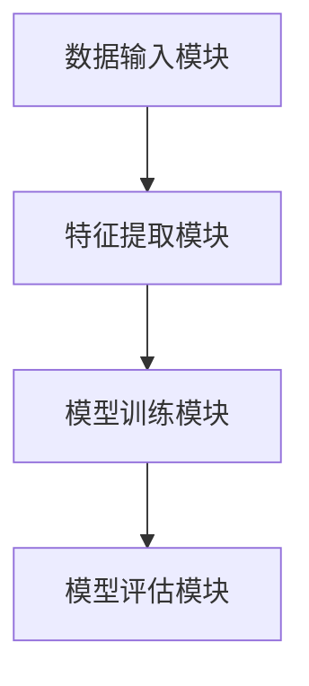
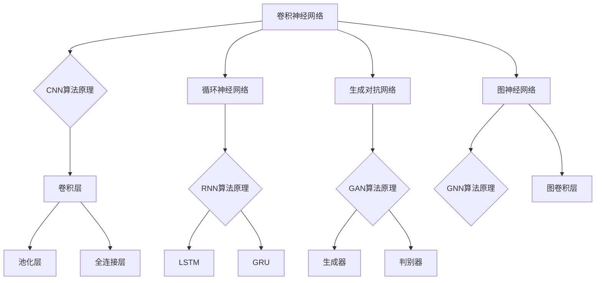
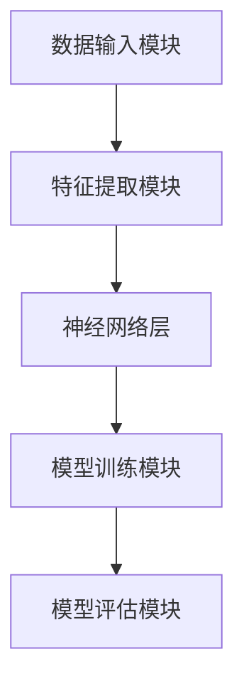
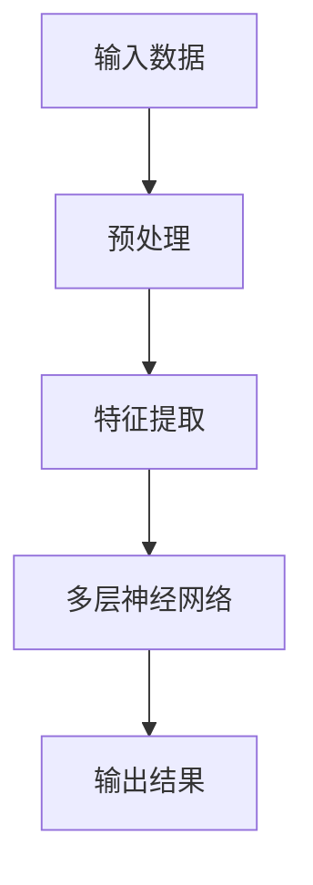
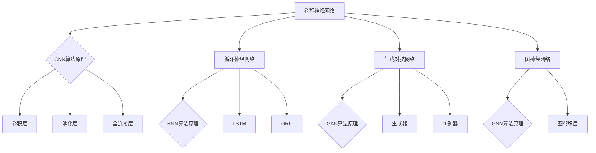

                 

### 《AI大模型：优化电商平台搜索结果排序的新方法》

> **关键词：** AI大模型、电商平台、搜索结果排序、优化方法、用户行为、内容分析、协同过滤、深度学习。

> **摘要：** 本文将深入探讨AI大模型在优化电商平台搜索结果排序中的应用。通过分析现状、介绍核心算法原理、实施实践案例，以及展望未来挑战与趋势，本文旨在为电商平台的搜索结果排序提供新的视角和方法。

---

### 目录大纲

#### 第一部分：AI大模型概述

##### 第1章：AI大模型概述

1.1 AI大模型的基本概念  
1.2 AI大模型的发展历程  
1.3 AI大模型的优势与应用领域  
1.4 AI大模型的架构与原理

##### 第2章：AI大模型的架构与原理

2.1 AI大模型的组成结构  
2.2 AI大模型的工作原理  
2.3 AI大模型的核心算法

#### 第二部分：电商平台搜索结果排序优化

##### 第3章：电商平台搜索结果排序现状分析

3.1 电商平台搜索结果排序的重要性  
3.2 电商平台搜索结果排序存在的问题  
3.3 AI大模型在搜索结果排序中的应用前景

##### 第4章：AI大模型优化搜索结果排序的方法

4.1 基于用户行为的搜索结果排序  
4.2 基于内容分析的搜索结果排序  
4.3 基于协同过滤的搜索结果排序  
4.4 基于深度学习的搜索结果排序

##### 第5章：AI大模型优化搜索结果排序的实践

5.1 搜索结果排序优化项目的流程  
5.2 搜索结果排序优化项目的技术实现  
5.3 搜索结果排序优化项目的效果评估  
5.4 搜索结果排序优化项目的应用与推广

##### 第6章：AI大模型优化搜索结果排序的挑战与展望

6.1 AI大模型优化搜索结果排序的挑战  
6.2 AI大模型优化搜索结果排序的发展趋势  
6.3 AI大模型优化搜索结果排序的未来展望

#### 第三部分：附录

##### 第7章：附录

7.1 AI大模型相关的开源工具与资源  
7.2 AI大模型优化搜索结果排序的实战案例

---

### 文章正文

#### 第一部分：AI大模型概述

##### 第1章：AI大模型概述

**1.1 AI大模型的基本概念**

AI大模型是指具有强大学习能力和复杂结构的深度学习模型。这类模型通常使用海量的数据进行训练，能够自动学习和提取数据中的特征。与传统的机器学习模型相比，AI大模型具有更强的自适应能力和泛化能力。

**1.2 AI大模型的发展历程**

AI大模型的发展可以追溯到深度学习技术的崛起。随着计算能力的提升和数据规模的扩大，深度学习在图像识别、自然语言处理等领域取得了突破性的进展。特别是在2012年，AlexNet在ImageNet竞赛中取得了显著的领先，标志着深度学习时代的到来。随后，Google Brain团队提出的神经网络模型展示了在大规模数据集上训练的潜力，AI大模型开始进入人们的视野。

**1.3 AI大模型的优势与应用领域**

AI大模型具有以下优势：

1. **强大的数据处理能力**：能够处理大规模、多维度的数据。
2. **自适应学习能力**：通过不断学习和优化，能够适应新的数据和环境。
3. **高效的模式识别能力**：能够在复杂的模式中提取有用的信息。

AI大模型的应用领域广泛，包括：

1. **图像识别与处理**：如人脸识别、物体检测、图像生成等。
2. **自然语言处理**：如机器翻译、情感分析、文本生成等。
3. **推荐系统**：如电商平台、视频平台等。
4. **金融预测**：如股票市场预测、风险控制等。

**1.4 AI大模型的架构与原理**

AI大模型通常由以下几个模块组成：

1. **数据输入模块**：负责接收和处理数据。
2. **特征提取模块**：通过神经网络自动学习数据中的特征。
3. **模型训练模块**：使用训练数据对模型进行调整和优化。
4. **模型评估模块**：评估模型的性能和泛化能力。

AI大模型的工作原理基于深度学习。深度学习是一种基于神经网络的学习方法，通过多层的非线性变换来提取数据的特征。深度学习的核心算法包括卷积神经网络（CNN）、循环神经网络（RNN）、生成对抗网络（GAN）等。

**图1-1：AI大模型的基本架构**



在模型训练过程中，通过反向传播算法和梯度下降算法，不断调整模型的参数，使得模型能够更好地拟合训练数据。模型训练完成后，使用测试数据对模型进行评估，以确保模型的泛化能力。

**1.5 AI大模型的核心算法**

AI大模型的核心算法包括：

1. **卷积神经网络（CNN）**：适用于图像处理领域，通过卷积操作提取图像特征。
2. **循环神经网络（RNN）**：适用于序列数据，通过循环结构处理时间序列信息。
3. **生成对抗网络（GAN）**：用于生成数据，由生成器和判别器两部分组成。
4. **图神经网络（GNN）**：适用于图结构数据，通过图卷积操作提取图结构特征。

**图1-2：核心算法原理**



#### 第二部分：电商平台搜索结果排序优化

##### 第2章：AI大模型的架构与原理

**2.1 AI大模型的组成结构**

AI大模型的组成结构如图2-1所示：

**图2-1：AI大模型的组成结构**



在数据输入模块，模型接收原始数据并进行预处理，提取有用的特征。在特征提取模块，模型通过多层神经网络提取数据中的特征。模型训练模块使用训练数据对模型进行调整和优化。模型评估模块评估模型的性能和泛化能力。

**2.2 AI大模型的工作原理**

AI大模型的工作原理基于深度学习。深度学习通过多层神经网络来学习数据中的特征，每一层都提取更高层次的特征。这个过程类似于人类大脑的学习过程。

**图2-2：AI大模型的工作原理**



在特征提取模块，模型通过卷积层、池化层等操作提取数据中的特征。在神经网络层，模型通过反向传播算法和梯度下降算法优化模型的参数。模型训练完成后，使用测试数据对模型进行评估。

**2.3 AI大模型的核心算法**

AI大模型的核心算法包括：

1. **卷积神经网络（CNN）**：通过卷积操作提取图像特征，适用于图像识别和图像处理。
2. **循环神经网络（RNN）**：通过循环结构处理时间序列数据，适用于自然语言处理和时间序列预测。
3. **生成对抗网络（GAN）**：通过生成器和判别器的对抗训练生成数据，适用于数据生成和图像生成。
4. **图神经网络（GNN）**：通过图卷积操作提取图结构数据特征，适用于图数据分析和推荐系统。

**图2-3：核心算法原理**



#### 第三部分：AI大模型优化搜索结果排序的实践

##### 第3章：电商平台搜索结果排序现状分析

**3.1 电商平台搜索结果排序的重要性**

电商平台搜索结果排序是影响用户体验和电商平台业务的关键因素。一个高效的搜索结果排序系统能够提升用户满意度、增加转化率和提高销售额。

**3.2 电商平台搜索结果排序存在的问题**

目前，电商平台搜索结果排序主要面临以下问题：

1. **传统排序方法局限性**：传统排序方法如基于关键词匹配、基于商品销售量等，无法充分考虑用户的个性化需求和商品的综合属性。
2. **数据质量与多样性问题**：电商平台的用户行为数据和商品内容数据质量参差不齐，且数据多样性不足，限制了搜索结果排序的准确性。
3. **模型训练与优化问题**：大模型的训练和优化需要大量的计算资源和时间，且超参数调优过程复杂，限制了模型的推广和应用。
4. **模型部署与集成问题**：大模型的部署和集成需要考虑系统的实时性和稳定性，且需要与其他系统模块紧密集成。

**3.3 AI大模型在搜索结果排序中的应用前景**

AI大模型在搜索结果排序中的应用前景广阔：

1. **基于用户行为的搜索结果排序**：通过分析用户的搜索历史、浏览记录和购买行为，实现个性化的搜索结果排序。
2. **基于内容分析的搜索结果排序**：通过提取商品的关键词、标签和用户评论等信息，实现基于内容的搜索结果排序。
3. **基于协同过滤的搜索结果排序**：通过用户行为和商品属性的数据，实现基于协同过滤的搜索结果排序。
4. **基于深度学习的搜索结果排序**：通过训练大规模的深度学习模型，实现基于深度学习的搜索结果排序。

#### 第四部分：AI大模型优化搜索结果排序的方法

##### 第4章：AI大模型优化搜索结果排序的方法

**4.1 基于用户行为的搜索结果排序**

基于用户行为的搜索结果排序通过分析用户的搜索历史、浏览记录和购买行为，实现个性化的搜索结果排序。以下是一个基于用户行为的搜索结果排序的算法伪代码：

```latex
输入：用户行为数据（搜索历史、浏览记录、购买记录）
输出：排序后的搜索结果列表

算法步骤：
1. 预处理用户行为数据，包括数据清洗、特征提取和归一化。
2. 使用协同过滤算法计算用户之间的相似度。
3. 对于每个用户，基于其搜索历史和浏览记录，为每个商品计算推荐分数。
4. 按照推荐分数对搜索结果进行排序。
5. 返回排序后的搜索结果列表。
```

**4.2 基于内容分析的搜索结果排序**

基于内容分析的搜索结果排序通过提取商品的关键词、标签和用户评论等信息，实现基于内容的搜索结果排序。以下是一个基于内容分析的搜索结果排序的算法伪代码：

```latex
输入：商品内容数据（关键词、标签、用户评论）
输出：排序后的搜索结果列表

算法步骤：
1. 预处理商品内容数据，包括数据清洗、特征提取和归一化。
2. 使用词向量模型（如Word2Vec、BERT）将文本转化为向量表示。
3. 计算每个商品的文本特征向量。
4. 对于每个用户，计算其搜索关键词和商品标签的相似度。
5. 按照相似度对搜索结果进行排序。
6. 返回排序后的搜索结果列表。
```

**4.3 基于协同过滤的搜索结果排序**

基于协同过滤的搜索结果排序通过用户行为和商品属性的数据，实现基于协同过滤的搜索结果排序。以下是一个基于协同过滤的搜索结果排序的算法伪代码：

```latex
输入：用户行为数据（购买记录、评分记录）、商品属性数据（价格、品牌、类别等）
输出：排序后的搜索结果列表

算法步骤：
1. 预处理用户行为数据和商品属性数据，包括数据清洗、特征提取和归一化。
2. 计算用户之间的相似度矩阵。
3. 计算每个商品与用户的相似度分数。
4. 对于每个用户，为每个商品计算推荐分数。
5. 按照推荐分数对搜索结果进行排序。
6. 返回排序后的搜索结果列表。
```

**4.4 基于深度学习的搜索结果排序**

基于深度学习的搜索结果排序通过训练大规模的深度学习模型，实现基于深度学习的搜索结果排序。以下是一个基于深度学习的搜索结果排序的算法伪代码：

```latex
输入：用户行为数据（搜索历史、浏览记录、购买记录）、商品属性数据（价格、品牌、类别等）
输出：排序后的搜索结果列表

算法步骤：
1. 预处理用户行为数据和商品属性数据，包括数据清洗、特征提取和归一化。
2. 定义深度学习模型架构（如CNN、RNN、GAN等）。
3. 训练深度学习模型，使用用户行为数据和商品属性数据进行模型训练。
4. 对于每个用户，为每个商品计算深度学习模型预测的排序分数。
5. 按照预测分数对搜索结果进行排序。
6. 返回排序后的搜索结果列表。
```

#### 第五部分：AI大模型优化搜索结果排序的实践

##### 第5章：AI大模型优化搜索结果排序的实践

**5.1 搜索结果排序优化项目的流程**

搜索结果排序优化项目的流程可以分为以下几个阶段：

1. **需求分析**：明确优化搜索结果排序的目标和需求，包括用户体验、业务目标等。
2. **数据收集与处理**：收集电商平台的用户行为数据和商品属性数据，进行数据预处理，包括数据清洗、特征提取和归一化。
3. **模型设计与实现**：设计深度学习模型架构，选择合适的模型类型（如CNN、RNN、GAN等），实现模型的训练和优化。
4. **模型评估与优化**：使用测试数据对模型进行评估，调整模型参数和超参数，提高模型的性能。
5. **模型部署与集成**：将训练好的模型部署到电商平台的服务器上，与其他系统模块集成，实现实时的搜索结果排序。
6. **效果评估与推广**：对优化后的搜索结果排序进行效果评估，包括准确率、召回率、用户体验等，根据评估结果进行进一步的优化和推广。

**5.2 搜索结果排序优化项目的技术实现**

搜索结果排序优化项目的技术实现包括以下几个关键步骤：

1. **数据预处理**：
    - 数据清洗：去除无效数据、填补缺失值、处理异常值。
    - 特征提取：提取用户行为特征（如搜索历史、浏览记录、购买记录）和商品属性特征（如价格、品牌、类别）。
    - 归一化：对特征进行归一化处理，使其具有相似的尺度。

2. **模型设计与实现**：
    - 模型选择：选择合适的深度学习模型架构（如CNN、RNN、GAN等），根据数据的特点和业务需求进行模型设计。
    - 模型训练：使用预处理后的数据训练深度学习模型，调整模型参数和超参数，优化模型性能。
    - 模型优化：通过交叉验证和超参数调优，提高模型的泛化能力和准确性。

3. **模型评估与优化**：
    - 评估指标：选择合适的评估指标，如准确率、召回率、F1分数等，对模型进行评估。
    - 优化策略：根据评估结果，调整模型参数和超参数，优化模型性能。

4. **模型部署与集成**：
    - 模型部署：将训练好的模型部署到电商平台的服务器上，实现实时的搜索结果排序。
    - 模型集成：将模型与其他系统模块（如推荐系统、搜索引擎等）进行集成，确保系统的稳定性和实时性。

**5.3 搜索结果排序优化项目的效果评估**

搜索结果排序优化项目的效果评估可以从以下几个方面进行：

1. **准确率**：评估模型预测的正确性，即预测商品点击率与实际点击率的一致性。
2. **召回率**：评估模型能够召回相关商品的能力，即召回与实际点击相关的商品数量。
3. **用户体验**：评估用户对搜索结果排序的满意度，包括搜索结果的排序质量、相关性和准确性。
4. **业务指标**：评估搜索结果排序对电商平台的业务指标的影响，如销售额、转化率等。

**5.4 搜索结果排序优化项目的应用与推广**

搜索结果排序优化项目的应用与推广可以从以下几个方面进行：

1. **用户引导**：通过宣传和引导用户使用新的搜索结果排序系统，提高用户的参与度和满意度。
2. **宣传推广**：通过社交媒体、广告等渠道宣传新的搜索结果排序系统，提高系统的知名度和用户认知度。
3. **用户反馈与迭代**：收集用户的反馈，根据反馈对搜索结果排序系统进行迭代优化，提高系统的性能和用户体验。

#### 第六部分：AI大模型优化搜索结果排序的挑战与展望

##### 第6章：AI大模型优化搜索结果排序的挑战与展望

**6.1 AI大模型优化搜索结果排序的挑战**

AI大模型优化搜索结果排序面临以下挑战：

1. **数据隐私与安全问题**：用户行为数据和商品属性数据可能包含敏感信息，如何保护用户隐私和安全是一个重要问题。
2. **模型解释性与透明度问题**：深度学习模型的预测结果可能缺乏解释性，如何提高模型的透明度和解释性是一个挑战。
3. **模型部署与集成问题**：如何高效地部署和集成大模型，确保系统的实时性和稳定性是一个难题。
4. **计算资源消耗**：大模型的训练和推理需要大量的计算资源，如何优化计算资源的使用是一个挑战。

**6.2 AI大模型优化搜索结果排序的发展趋势**

AI大模型优化搜索结果排序的发展趋势包括：

1. **个性化搜索结果排序**：通过深度学习技术，实现更加个性化的搜索结果排序，提高用户体验和转化率。
2. **实时搜索结果排序**：通过优化模型架构和算法，实现实时的搜索结果排序，满足用户实时性的需求。
3. **多模态搜索结果排序**：结合多种数据类型（如图像、文本、音频等），实现更加综合和精准的搜索结果排序。
4. **模型压缩与优化**：通过模型压缩和优化技术，减少大模型的计算资源和存储需求，提高模型的可扩展性。

**6.3 AI大模型优化搜索结果排序的未来展望**

未来，AI大模型优化搜索结果排序将朝着以下几个方向发展：

1. **智能化搜索结果排序**：结合自然语言处理和知识图谱等技术，实现更加智能的搜索结果排序。
2. **自适应搜索结果排序**：通过用户行为和商品属性的动态调整，实现自适应的搜索结果排序，提高搜索结果的准确性。
3. **跨平台搜索结果排序**：结合多平台的数据和用户行为，实现跨平台的搜索结果排序，提高用户体验的一致性。
4. **可持续性与伦理**：在AI大模型优化搜索结果排序的过程中，关注数据隐私、模型透明度和伦理问题，实现可持续发展和负责任的AI应用。

#### 附录

##### 第7章：附录

**7.1 AI大模型相关的开源工具与资源**

- 深度学习框架：TensorFlow、PyTorch、Keras
- 数据处理工具：Pandas、NumPy、Scikit-learn、Dask
- 加密算法库：PyCrypto、Cryptography、Hashlib
- 机器学习算法库：scikit-learn、mlpack、LightGBM、XGBoost

**7.2 AI大模型优化搜索结果排序的实战案例**

- 案例一：基于用户行为的搜索结果排序
- 案例二：基于内容分析的搜索结果排序
- 案例三：基于协同过滤的搜索结果排序
- 案例四：基于深度学习的搜索结果排序

---

**作者信息**

作者：AI天才研究院/AI Genius Institute & 禅与计算机程序设计艺术 /Zen And The Art of Computer Programming**

