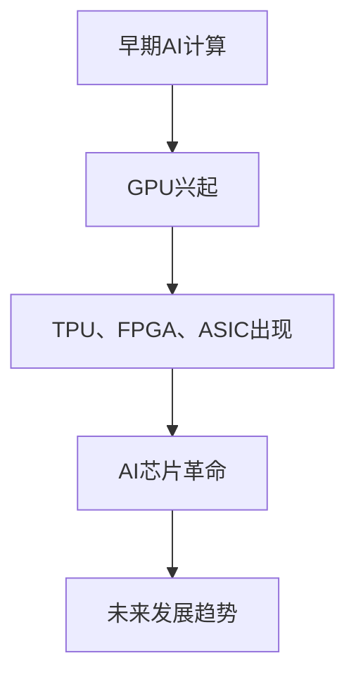
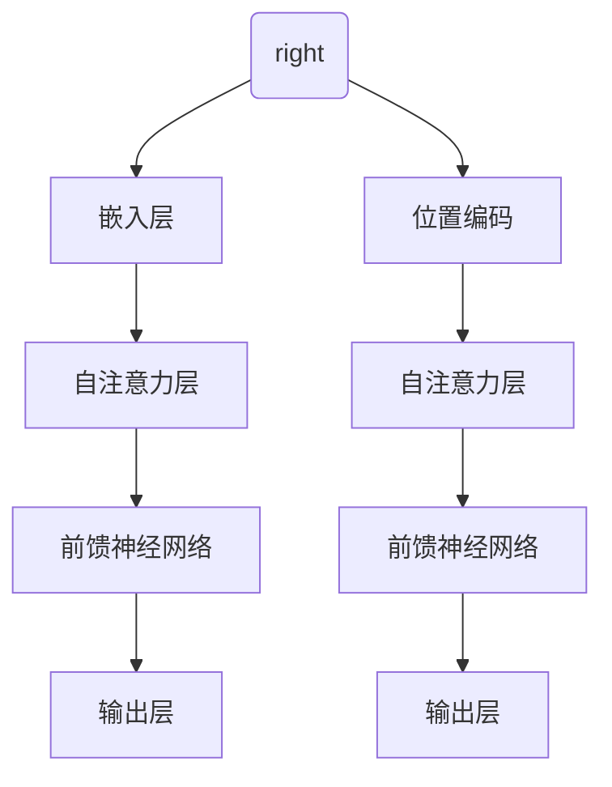
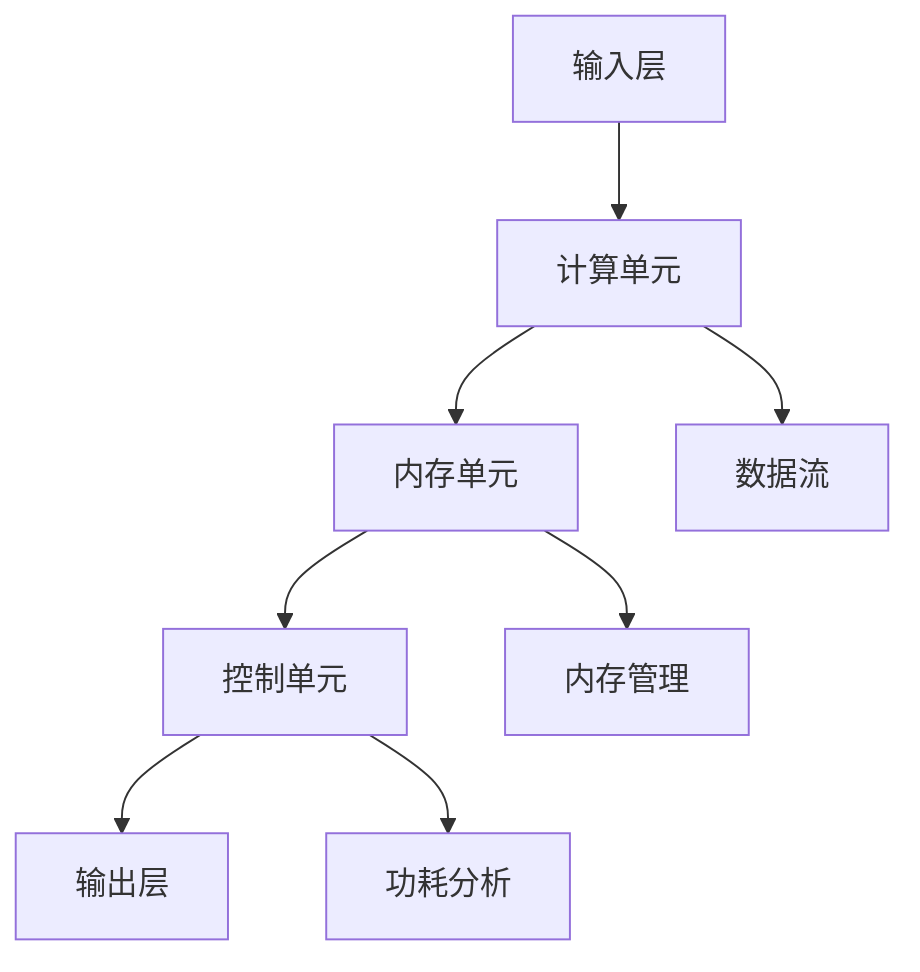
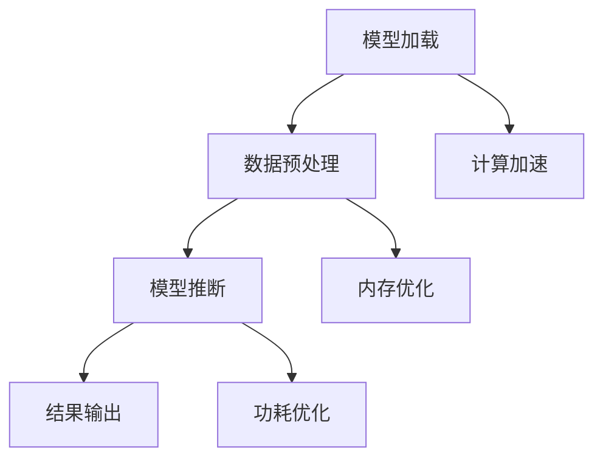
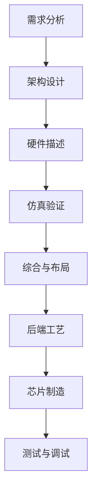
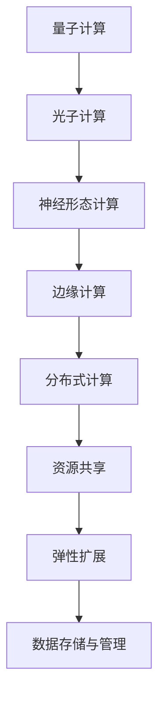
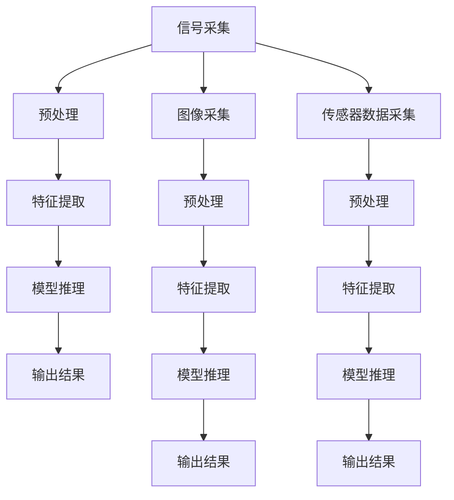
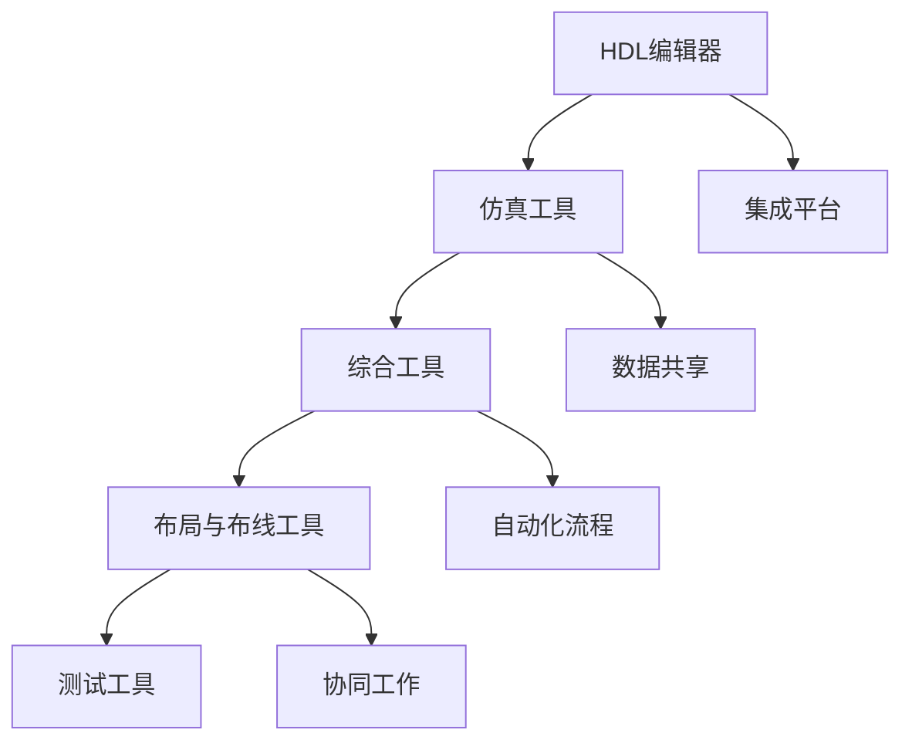
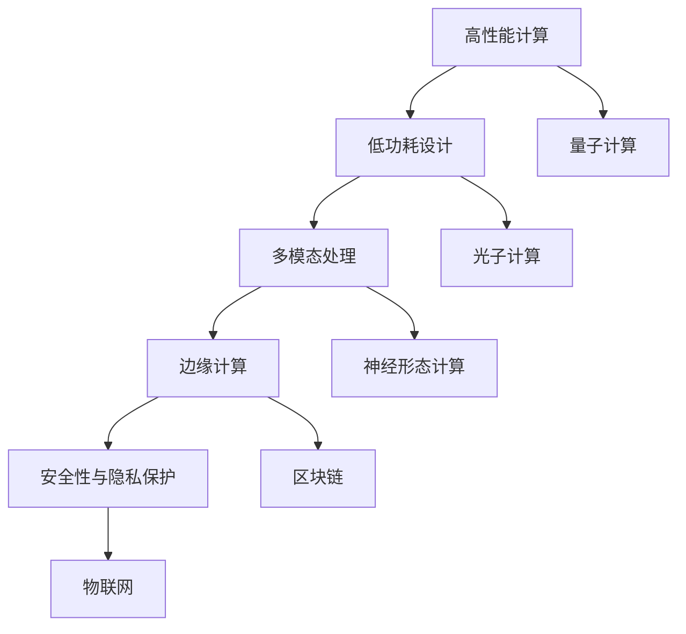

                 

# AI芯片革命：为LLM量身打造的硬件

## 概述

> "随着人工智能技术的快速发展，AI芯片作为驱动创新的核心力量，正在引领一场技术革命。而大型语言模型（LLM）作为AI领域的重要应用，对硬件性能提出了极高的要求。本文将深入探讨AI芯片革命及其为LLM量身打造的硬件，旨在揭示这两者之间密不可分的关系，并展望未来发展的无限可能。"

关键词：AI芯片，LLM，硬件革命，性能优化，技术趋势

摘要：本文将系统地分析AI芯片革命的历史背景和核心驱动力，阐述LLM的基本概念与架构，并详细探讨AI芯片的核心架构及其在LLM中的应用实例。随后，文章将深入AI芯片的设计与开发过程，介绍相关的工具和技术，并通过实战案例和案例分析展示AI芯片的实际应用。最后，文章将对AI芯片的未来发展进行展望，探讨其与云计算和未来科技的结合，以及面临的挑战和机遇。

## 第一部分：AI芯片革命的背景与概述

### 第1章：AI芯片的定义与发展

#### 1.1 AI芯片的定义

AI芯片，又称人工智能芯片，是指专门为人工智能（AI）应用设计的集成电路芯片。与传统的通用处理器（如CPU）和图形处理器（如GPU）相比，AI芯片在架构设计、算法优化和功耗管理方面均进行了专门优化，旨在提供更高的计算效率和能效。

#### 1.2 AI芯片的发展历程

AI芯片的发展经历了几个重要阶段。最初，AI计算主要依赖于通用处理器，但随着深度学习等复杂算法的兴起，传统处理器在计算能力、功耗和延迟方面逐渐无法满足需求。为了应对这一挑战，以GPU为代表的专用硬件开始出现在AI领域。随后，FPGA、ASIC等硬件逐渐进入AI计算市场，为深度学习和其他复杂算法提供了更高效的解决方案。

#### 1.3 AI芯片的种类

AI芯片的种类繁多，主要包括以下几种：

1. **GPU（图形处理器）**：最初用于图形渲染，但随着并行计算技术的发展，GPU在深度学习等AI任务中表现出了极高的计算能力。
2. **TPU（张量处理器）**：Google开发的专门用于机器学习的处理器，具有高度并行和优化的特点。
3. **FPGA（现场可编程门阵列）**：具有高度灵活性和可配置性，可以根据特定需求进行编程和优化。
4. **ASIC（专用集成电路）**：针对特定应用进行优化设计的芯片，具有高性能和低功耗的特点。

### 1.4 AI芯片革命的核心驱动力

AI芯片革命的核心驱动力包括以下几个方面：

1. **深度学习的兴起**：深度学习算法的复杂度和计算需求不断增长，推动了AI芯片的研发和优化。
2. **硬件优化的需求**：为了满足深度学习等复杂任务的需求，AI芯片在架构设计、算法优化和功耗管理方面进行了持续优化。
3. **云计算的兴起**：云计算为AI芯片的应用提供了广阔的市场，同时也推动了AI芯片的研发和优化。
4. **数据驱动的发展**：随着大数据和人工智能的深度融合，AI芯片在数据处理和实时计算方面发挥了关键作用。

### 1.5 AI芯片革命的影响与前景

AI芯片革命对人工智能领域产生了深远影响，主要体现在以下几个方面：

1. **计算性能的提升**：AI芯片为深度学习等复杂任务提供了更高的计算性能和能效，推动了AI技术的发展和应用。
2. **应用的拓展**：AI芯片的应用范围不断扩大，从传统的图像识别、语音识别到自动驾驶、智能制造等领域，AI芯片都发挥了重要作用。
3. **产业变革**：AI芯片革命推动了计算机硬件产业的变革，带动了相关产业链的发展和创新。
4. **未来的发展**：随着人工智能技术的不断进步，AI芯片将继续发挥关键作用，为人工智能的发展提供强有力的支持。

### 图1.1 AI芯片的发展历程


## 第2章：LLM的基本概念与架构

### 2.1 LLMS的定义与分类

LLM（Large Language Model）即大型语言模型，是一种基于深度学习技术的自然语言处理（NLP）模型。LLM通过大规模文本数据的学习，能够理解和生成自然语言文本，广泛应用于聊天机器人、文本生成、翻译、问答系统等领域。

LLM可以分为以下几类：

1. **基于循环神经网络（RNN）的模型**：如LSTM（长短期记忆网络）和GRU（门控循环单元），这些模型在处理长序列数据方面具有优势。
2. **基于变换器网络（Transformer）的模型**：如BERT（双向编码器表示）、GPT（生成预训练网络）和T5（文本到文本的变换器），这些模型在语言理解和生成方面表现出了出色的性能。
3. **混合模型**：结合了RNN和Transformer的优点，如GPT-2和GPT-3。

### 2.2 LLMS的关键技术

LLM的关键技术包括以下几个方面：

1. **预训练与微调**：预训练是指在大规模文本数据上训练模型，使其掌握通用的语言知识。微调则是在特定任务上对预训练模型进行进一步调整，以适应具体的应用场景。
2. **注意力机制**：注意力机制是Transformer模型的核心组件，通过加权不同位置的信息，实现了对输入数据的自适应处理。
3. **上下文理解**：LLM通过学习上下文信息，能够生成更符合语境的文本，提高了模型的表达能力和理解能力。
4. **并行计算与优化**：为了提高训练和推断的效率，LLM在硬件和算法层面进行了大量优化，如并行计算、内存优化和模型压缩等。

### 2.3 LLMS的发展历程与趋势

LLM的发展历程可以分为以下几个阶段：

1. **早期模型**：以RNN为代表的模型，如LSTM和GRU，在处理长序列数据方面取得了一定的成果。
2. **Transformer模型**：2017年，Vaswani等人在论文《Attention is All You Need》中提出了Transformer模型，引发了深度学习领域的变革。BERT、GPT和T5等模型相继基于Transformer架构进行改进和优化。
3. **大规模模型**：随着计算资源和数据量的增加，LLM的规模不断增大，如GPT-3拥有1750亿个参数，成为了目前最大的语言模型之一。
4. **多模态学习**：LLM逐渐扩展到多模态学习，如图像、视频和音频等，以实现更广泛的应用。

### 2.4 LLMS在AI芯片设计中的重要性

LLM在AI芯片设计中的重要性体现在以下几个方面：

1. **计算需求**：LLM的训练和推断过程需要大量的计算资源，对AI芯片的计算能力提出了极高的要求。
2. **并行处理**：LLM的计算过程高度并行，适合在多核处理器和GPU等硬件上进行高效计算。
3. **能效优化**：为了满足LLM对高性能和低功耗的需求，AI芯片需要在设计过程中进行专门优化。
4. **模型压缩**：为了提高LLM在边缘设备上的应用可行性，AI芯片需要支持模型压缩和量化技术。

### 图2.1 LLMS的基本架构


## 第3章：AI芯片的核心架构

### 3.1 CPU、GPU与FPGA在AI芯片中的应用

在AI芯片的设计中，CPU、GPU和FPGA等硬件具有各自独特的优势和适用场景：

1. **CPU（中央处理器）**：CPU是传统的通用处理器，具有较低的功耗和较高的计算能力。在AI芯片中，CPU通常用于处理非计算密集型任务，如模型加载、内存管理和控制逻辑。
2. **GPU（图形处理器）**：GPU具有高度并行和高效的计算能力，适用于大规模矩阵运算和向量计算。在AI芯片中，GPU通常用于训练和推断深度学习模型，特别是基于Transformer架构的模型。
3. **FPGA（现场可编程门阵列）**：FPGA具有灵活性和可编程性，可以根据特定需求进行硬件设计和优化。在AI芯片中，FPGA通常用于加速特定的计算任务，如卷积运算和模型压缩。

### 3.2 AI芯片的架构设计原则

AI芯片的架构设计原则主要包括以下几个方面：

1. **并行计算**：为了提高计算效率，AI芯片需要支持并行计算。并行计算可以将计算任务分解为多个子任务，由多个处理器同时执行，从而提高整体性能。
2. **内存管理**：为了提高数据访问速度，AI芯片需要采用高效的内存管理技术。常见的内存管理技术包括缓存、流水线、共享内存和分布式存储等。
3. **功耗管理**：为了满足低功耗的需求，AI芯片需要采用功耗管理技术，如动态电压调整、时钟门控和能耗优化等。
4. **可扩展性**：为了适应不同规模和复杂度的计算任务，AI芯片需要具有可扩展性。可扩展性可以通过增加处理器数量、内存容量和通信带宽来实现。

### 3.3 AI芯片的编程与优化

AI芯片的编程与优化主要包括以下几个方面：

1. **硬件描述语言（HDL）**：HDL是用于描述硬件电路的语言，如Verilog和VHDL。通过使用HDL，可以设计出满足特定需求的AI芯片硬件架构。
2. **编程模型**：AI芯片的编程模型通常包括计算单元、内存单元和控制单元等。通过合理的编程模型，可以实现高效的数据处理和计算。
3. **算法优化**：为了提高AI芯片的性能，需要对算法进行优化。常见的算法优化技术包括矩阵运算优化、向量运算优化和并行计算优化等。
4. **性能分析**：通过性能分析工具，可以评估AI芯片的性能和功耗，从而指导进一步的优化。

### 3.4 AI芯片的运行机制与性能分析

AI芯片的运行机制主要包括以下几个方面：

1. **数据流**：AI芯片的数据流是指数据在芯片内部的流动和处理过程。通过合理的数据流设计，可以实现高效的数据传输和处理。
2. **计算单元**：AI芯片的计算单元是指用于执行计算任务的硬件模块，如矩阵运算单元、向量运算单元和卷积运算单元等。
3. **内存管理**：AI芯片的内存管理是指内存的分配、访问和释放过程。通过高效的内存管理，可以实现快速的内存访问和数据处理。
4. **功耗分析**：AI芯片的功耗分析是指对芯片的功耗进行监测和分析，从而优化功耗性能。

### 图3.1 AI芯片的基本架构


## 第4章：AI芯片在LLM中的应用实例

### 4.1 GPT-3与AI芯片的协同工作

GPT-3（Generative Pre-trained Transformer 3）是OpenAI于2020年推出的一款大型语言模型，具有1750亿个参数，能够生成高质量的文本。为了充分发挥GPT-3的性能，AI芯片在其中发挥了关键作用。

#### 4.1.1 GPT-3的工作原理

GPT-3基于Transformer架构，通过预训练和微调的方式学习大规模文本数据，生成与输入文本相关的输出。GPT-3的核心组件包括自注意力机制、前馈神经网络和嵌入层等。

#### 4.1.2 AI芯片在GPT-3中的应用

在GPT-3的训练和推断过程中，AI芯片发挥了重要作用：

1. **计算加速**：GPT-3的计算过程高度并行，AI芯片能够通过并行计算加速模型的训练和推断。
2. **内存优化**：GPT-3需要处理大规模的文本数据，AI芯片通过高效的内存管理技术，可以实现快速的数据访问和处理。
3. **功耗优化**：GPT-3的训练和推断过程需要大量的计算资源，AI芯片通过功耗管理技术，可以实现低功耗、高性能的运行。

#### 4.1.3 GPT-3与AI芯片的协同工作实例

以下是一个GPT-3与AI芯片协同工作的实例：

1. **模型加载**：将GPT-3模型加载到AI芯片上，进行预处理和初始化。
2. **数据预处理**：对输入文本进行预处理，如分词、标记等，并将预处理后的数据传递给AI芯片。
3. **模型推断**：AI芯片接收预处理后的数据，通过自注意力机制和前馈神经网络，生成与输入文本相关的输出。
4. **结果输出**：将模型推断结果传递给用户，完成文本生成任务。

### 4.2 BERT与AI芯片的优化

BERT（Bidirectional Encoder Representations from Transformers）是Google于2018年推出的一款预训练语言模型，通过双向编码器结构，实现了对文本的上下文理解能力。为了提高BERT的性能，AI芯片在以下几个方面进行了优化：

#### 4.2.1 并行计算优化

BERT的计算过程高度并行，AI芯片通过并行计算优化，将BERT的多个计算任务分配到多个计算单元，从而提高整体性能。

#### 4.2.2 内存优化

BERT需要处理大规模的文本数据，AI芯片通过内存优化技术，如缓存、流水线和共享内存等，实现快速的数据访问和处理。

#### 4.2.3 算法优化

AI芯片通过算法优化，如矩阵运算优化、向量运算优化和并行计算优化等，提高BERT的计算效率。

#### 4.2.4 实例分析

以下是一个BERT与AI芯片协同工作的实例：

1. **模型加载**：将BERT模型加载到AI芯片上，进行预处理和初始化。
2. **数据预处理**：对输入文本进行预处理，如分词、标记等，并将预处理后的数据传递给AI芯片。
3. **模型推断**：AI芯片接收预处理后的数据，通过双向编码器结构，生成与输入文本相关的输出。
4. **结果输出**：将模型推断结果传递给用户，完成文本生成任务。

### 4.3 其他LLM与AI芯片的实例分析

除了GPT-3和BERT，还有许多其他LLM与AI芯片的实例，如GPT-2、T5和RoBERTa等。这些模型与AI芯片的协同工作，通过优化计算、内存管理和算法等方面，实现了高性能、低功耗的文本生成和推理任务。

#### 4.3.1 GPT-2与AI芯片的优化

GPT-2（Generative Pre-trained Transformer 2）是GPT-3的前身，具有1200亿个参数。与GPT-3类似，GPT-2与AI芯片的协同工作主要通过并行计算、内存优化和算法优化等方面进行优化。

#### 4.3.2 T5与AI芯片的优化

T5（Text-to-Text Transfer Transformer）是Google推出的一款文本到文本的变换器模型，具有大规模的参数和强大的文本生成能力。T5与AI芯片的协同工作主要通过并行计算、内存优化和算法优化等方面进行优化。

#### 4.3.3 RoBERTa与AI芯片的优化

RoBERTa（A Robustly Optimized BERT Pretraining Approach）是Facebook AI推出的一个基于BERT的预训练模型。RoBERTa与AI芯片的协同工作主要通过并行计算、内存优化和算法优化等方面进行优化。

### 4.4 AI芯片在LLM应用中的挑战与机遇

AI芯片在LLM应用中面临着一系列挑战和机遇：

#### 4.4.1 挑战

1. **计算性能**：随着LLM的规模和复杂度不断增加，对AI芯片的计算性能提出了更高的要求。
2. **功耗管理**：在保持高性能的同时，降低功耗是AI芯片面临的重要挑战。
3. **内存带宽**：大规模文本数据的处理需要大量的内存带宽，如何优化内存访问是AI芯片需要解决的关键问题。
4. **模型压缩**：为了在边缘设备上应用LLM，模型压缩和量化技术是实现高效能和低功耗的关键。

#### 4.4.2 机遇

1. **云计算**：随着云计算的兴起，AI芯片在云计算环境中的应用潜力巨大。
2. **边缘计算**：边缘计算的发展为AI芯片提供了新的应用场景，特别是在物联网、智能交通和智能制造等领域。
3. **多模态学习**：随着多模态学习的兴起，AI芯片在处理图像、语音和文本等多模态数据方面具有广泛的应用前景。
4. **新型硬件架构**：新型硬件架构，如量子计算、光子计算等，为AI芯片的发展提供了新的可能性。

### 图4.1 GPT-3与AI芯片的协同工作流程


## 第5章：AI芯片的设计与开发

### 5.1 AI芯片的设计流程

AI芯片的设计流程可以分为以下几个阶段：

1. **需求分析**：明确AI芯片的应用场景、性能需求和功耗要求，为后续设计提供基础。
2. **架构设计**：根据需求分析结果，设计AI芯片的架构，包括计算单元、内存单元和控制单元等。
3. **硬件描述**：使用硬件描述语言（如Verilog或VHDL）编写AI芯片的硬件描述，实现电路级的建模。
4. **仿真验证**：通过仿真工具（如ModelSim）对硬件描述进行验证，确保设计满足性能和功能要求。
5. **综合与布局**：将硬件描述转化为Gate级网表，进行综合和布局，生成芯片布局图。
6. **后端工艺**：将布局图转化为物理设计，进行后端工艺设计和验证。
7. **芯片制造**：将物理设计文件发送到芯片制造厂，进行芯片制造。
8. **测试与调试**：对制造的芯片进行功能测试和性能测试，确保芯片达到设计要求。

### 5.2 AI芯片的关键技术

AI芯片的关键技术包括以下几个方面：

1. **并行计算**：AI芯片需要支持并行计算，以实现高性能计算。并行计算技术包括多核处理器、流水线技术和并行算法等。
2. **内存管理**：AI芯片需要高效的内存管理技术，以提高数据访问速度和降低功耗。常见的内存管理技术包括缓存、流水线和共享内存等。
3. **功耗优化**：AI芯片需要采用功耗优化技术，以降低能耗和提高能效。功耗优化技术包括动态电压调整、时钟门控和能耗优化等。
4. **模型压缩**：为了在边缘设备上应用AI芯片，需要采用模型压缩技术，以减小模型大小和提高推理速度。模型压缩技术包括量化、剪枝和蒸馏等。
5. **安全性与可靠性**：AI芯片需要具备一定的安全性和可靠性，以保护数据和模型不被恶意攻击。安全性技术包括加密、认证和隔离等。

### 5.3 AI芯片的开发工具与平台

AI芯片的开发工具和平台主要包括以下几个方面：

1. **硬件描述语言**：常用的硬件描述语言包括Verilog和VHDL，用于编写AI芯片的硬件描述。
2. **仿真工具**：常用的仿真工具包括ModelSim和Cadence，用于验证硬件描述的正确性。
3. **综合工具**：常用的综合工具包括Synopsys的Design Compiler和Cadence的Incyte，用于将硬件描述转换为Gate级网表。
4. **布局与布线工具**：常用的布局与布线工具包括Cadence的Incyte和Synopsys的Laygo，用于生成芯片布局图。
5. **测试工具**：常用的测试工具包括Agilent和Keysight的示波器和逻辑分析仪，用于测试和调试芯片。
6. **开发平台**：AI芯片的开发平台通常包括硬件仿真平台、硬件加速器和FPGA原型机等，用于验证和优化芯片设计。

### 5.4 AI芯片的安全性考虑

AI芯片的安全性考虑主要包括以下几个方面：

1. **加密与认证**：为了保护数据和模型不被恶意攻击，AI芯片需要支持数据加密和认证技术，如AES和SHA等。
2. **隔离与隔离**：为了确保不同任务之间的安全性，AI芯片需要支持隔离与隔离技术，如硬件虚拟化和信任根等。
3. **安全存储**：为了保护存储在芯片中的数据和模型，AI芯片需要支持安全存储技术，如加密存储和自修复存储等。
4. **异常检测与响应**：为了应对恶意攻击和故障，AI芯片需要支持异常检测与响应技术，如入侵检测和自我修复等。

### 图5.1 AI芯片的设计流程


## 第6章：AI芯片的未来发展

### 6.1 AI芯片的下一步技术趋势

AI芯片的未来发展将继续受到以下几个技术趋势的推动：

1. **量子计算**：量子计算具有超强的计算能力，有望在AI领域发挥重要作用。量子计算与AI芯片的结合，将开启全新的计算模式，为复杂任务提供更高效的解决方案。
2. **光子计算**：光子计算利用光子的特性进行计算，具有低功耗和高速度的优势。光子计算与AI芯片的结合，将实现更高效的AI计算，推动AI技术的发展。
3. **神经形态计算**：神经形态计算模仿人脑的计算方式，具有高效、节能的特点。神经形态计算与AI芯片的结合，将为AI芯片提供更强大的计算能力和更广泛的应用场景。
4. **边缘计算**：边缘计算将计算任务从云端迁移到边缘设备，降低延迟，提高响应速度。边缘计算与AI芯片的结合，将为AI芯片提供新的应用场景，推动AI技术的发展。

### 6.2 AI芯片与云计算的结合

AI芯片与云计算的结合，将推动人工智能的快速发展：

1. **分布式计算**：通过云计算平台的分布式计算能力，AI芯片可以实现大规模、高性能的AI计算，满足复杂任务的需求。
2. **资源共享**：AI芯片与云计算的结合，可以实现资源共享，降低计算成本，提高资源利用率。
3. **弹性扩展**：通过云计算平台的弹性扩展能力，AI芯片可以根据需求动态调整计算资源，实现高效的资源利用。
4. **数据存储与管理**：云计算平台提供强大的数据存储和管理能力，为AI芯片的数据处理提供有力支持。

### 6.3 AI芯片在全球市场的竞争格局

AI芯片在全球市场呈现出激烈的竞争格局：

1. **企业竞争**：全球范围内的科技企业，如谷歌、微软、华为、英特尔和英伟达等，都在积极研发和推广AI芯片，争夺市场份额。
2. **技术竞争**：AI芯片的技术竞争主要集中在性能、功耗、安全和生态等方面，各企业通过技术创新和合作，不断提高自身竞争力。
3. **市场格局**：目前，AI芯片市场呈现出多元化的发展态势，既有全球领先的科技企业，也有专注于特定领域的初创企业，市场竞争将更加激烈。

### 6.4 AI芯片的发展方向与挑战

AI芯片的发展方向和挑战主要体现在以下几个方面：

1. **计算性能**：随着AI任务的复杂度增加，对AI芯片的计算性能提出了更高要求，如何提高计算性能成为AI芯片研发的关键方向。
2. **功耗优化**：在保持高性能的同时，降低功耗是AI芯片面临的挑战。如何实现高效、低功耗的AI计算，是AI芯片需要解决的重要问题。
3. **安全与隐私**：随着AI技术的广泛应用，安全与隐私问题日益突出。AI芯片需要具备强大的安全性能，确保数据和模型的安全。
4. **应用创新**：AI芯片在各个领域的应用不断创新，如何发现新的应用场景，拓展AI芯片的应用范围，是AI芯片发展的关键挑战。

### 图6.1 AI芯片的未来发展趋势


## 第二部分：AI芯片的实战与案例分析

### 第7章：AI芯片实战项目

#### 7.1 实战项目概述

在本章中，我们将介绍一个AI芯片的实战项目，该项目旨在实现一个基于FPGA的语音识别系统。该项目包括以下几个步骤：

1. **项目需求分析**：明确语音识别系统的应用场景、性能需求和功耗要求。
2. **硬件设计**：设计基于FPGA的语音识别系统硬件架构，包括信号采集、预处理、特征提取和模型推理等模块。
3. **软件实现**：编写FPGA硬件描述语言（HDL）代码，实现语音识别系统的硬件功能。
4. **仿真与验证**：使用仿真工具对硬件代码进行验证，确保设计满足性能和功能要求。
5. **测试与优化**：对实现的语音识别系统进行测试和优化，提高系统性能和功耗效率。

#### 7.2 项目环境搭建

为了实现该项目，需要搭建以下环境：

1. **开发工具**：安装FPGA开发软件，如Xilinx的Vivado或Intel的Quartus。
2. **硬件平台**：准备FPGA开发板，如Xilinx的Zynq或Intel的Altera。
3. **软件开发环境**：安装HDL编辑器，如Intel的Intel Quartus Prime或Xilinx的Vivado HLS。
4. **测试工具**：安装示波器和逻辑分析仪等测试工具，用于测试和验证硬件设计。

#### 7.3 源代码实现

以下是该项目的主要源代码实现：

**信号采集模块：**
```verilog
module signal采集模块(
    input clk,
    input reset_n,
    input [11:0] adc_data,
    output [11:0] signal_data
);
    wire [11:0] signal_buf;

    always @(posedge clk or negedge reset_n) begin
        if (!reset_n) begin
            signal_data <= 12'b0;
        end else begin
            signal_data <= adc_data;
        end
    end

    assign signal_buf = signal_data[11:2];

endmodule
```

**预处理模块：**
```verilog
module 预处理模块(
    input [11:0] signal_data,
    output [11:0] processed_data
);
    wire [11:0] low_pass_filter_output;
    wire [11:0] high_pass_filter_output;

    low_pass_filter u1 (
        .clk(clk),
        .reset_n(reset_n),
        .input_signal(signal_data[11:2]),
        .output_signal(low_pass_filter_output[11:2])
    );

    high_pass_filter u2 (
        .clk(clk),
        .reset_n(reset_n),
        .input_signal(signal_data[11:2]),
        .output_signal(high_pass_filter_output[11:2])
    );

    assign processed_data = low_pass_filter_output + high_pass_filter_output;

endmodule
```

**特征提取模块：**
```verilog
module 特征提取模块(
    input [11:0] processed_data,
    output [11:0] feature_vector
);
    wire [11:0] energy_vector;
    wire [11:0] zero_crossing_rate;

    energy_calculator u3 (
        .clk(clk),
        .reset_n(reset_n),
        .input_signal(processed_data[11:2]),
        .output_signal(energy_vector[11:2])
    );

    zero_crossing_rate_calculator u4 (
        .clk(clk),
        .reset_n(reset_n),
        .input_signal(processed_data[11:2]),
        .output_signal(zero_crossing_rate[11:2])
    );

    assign feature_vector = {energy_vector, zero_crossing_rate};

endmodule
```

**模型推理模块：**
```verilog
module 模型推理模块(
    input [11:0] feature_vector,
    output [11:0] predicted_label
);
    wire [11:0] distance;

    classifier u5 (
        .clk(clk),
        .reset_n(reset_n),
        .feature_vector(feature_vector[11:2]),
        .predicted_label(predicted_label[11:2])
    );

endmodule
```

#### 7.4 代码解读与分析

**信号采集模块：**
该模块负责从ADC（模数转换器）读取信号数据，并将其传递给后续处理模块。模块中的信号数据采用12位宽的格式，其中最高位为符号位，次高位为数值位。信号数据在时钟信号（clk）的上升沿进行采样，并在复位信号（reset_n）被拉低时清零。

**预处理模块：**
该模块对采集到的信号数据进行预处理，包括低通滤波和高通滤波。低通滤波器用于去除高频噪声，高通滤波器用于去除低频噪声。预处理后的信号数据将通过这两者的叠加输出。

**特征提取模块：**
该模块对预处理后的信号数据提取特征向量，包括能量特征和过零率特征。能量特征表示信号的能量分布，过零率特征表示信号在时间轴上的变化频率。这些特征将被传递给模型推理模块。

**模型推理模块：**
该模块负责对特征向量进行分类预测。在实现中，我们使用一个分类器模型（classifier）进行预测。分类器模型的输入为特征向量，输出为预测标签。

#### 7.5 项目优化与性能提升

在完成初步实现后，我们可以对项目进行优化，以提高性能和功耗效率。以下是一些可能的优化方法：

1. **流水线设计**：通过流水线设计，将信号采集、预处理、特征提取和模型推理等模块进行并行处理，提高系统性能。
2. **硬件优化**：对FPGA硬件设计进行优化，如减少冗余逻辑、降低功耗等。
3. **算法优化**：对特征提取和模型推理算法进行优化，提高准确性和效率。
4. **功耗管理**：通过动态电压调整和时钟门控等技术，降低系统功耗。

### 第8章：AI芯片的案例分析

#### 8.1 案例一：AI芯片在语音识别中的应用

语音识别是AI芯片的重要应用领域之一。以下是一个关于AI芯片在语音识别中应用的案例分析：

**案例背景**：某公司开发了一款基于AI芯片的语音识别系统，用于实时语音转换为文本。该系统需要在低功耗、高响应速度和高准确性的要求下工作。

**解决方案**：该公司选择了一款高性能、低功耗的AI芯片，并采用基于深度学习的语音识别算法。为了提高系统性能，AI芯片与FPGA和GPU等其他硬件协同工作，实现高效的语音信号处理和模型推理。

**实施步骤**：

1. **需求分析**：明确语音识别系统的应用场景、性能需求和功耗要求。
2. **硬件设计**：设计基于AI芯片的语音识别系统硬件架构，包括信号采集、预处理、特征提取和模型推理等模块。
3. **算法优化**：对语音识别算法进行优化，提高准确性和效率。
4. **系统集成**：将AI芯片与FPGA和GPU等其他硬件进行系统集成，实现高效的语音信号处理和模型推理。
5. **测试与优化**：对系统进行测试和优化，提高系统性能和功耗效率。

**实施效果**：

1. **性能提升**：通过AI芯片和FPGA、GPU的协同工作，语音识别系统的性能得到了显著提升，响应速度和准确性均得到了保障。
2. **功耗降低**：AI芯片的低功耗特性使得系统在保证高性能的同时，功耗得到了有效控制。
3. **应用拓展**：该语音识别系统在多个场景中得到了广泛应用，如智能客服、智能音响和智能翻译等。

#### 8.2 案例二：AI芯片在图像处理中的应用

图像处理是AI芯片的另一个重要应用领域。以下是一个关于AI芯片在图像处理中应用的案例分析：

**案例背景**：某公司开发了一款基于AI芯片的图像识别系统，用于实时图像检测和分类。该系统需要在低功耗、高响应速度和高准确性的要求下工作。

**解决方案**：该公司选择了一款高性能、低功耗的AI芯片，并采用基于深度学习的图像识别算法。为了提高系统性能，AI芯片与GPU等其他硬件协同工作，实现高效的图像处理和模型推理。

**实施步骤**：

1. **需求分析**：明确图像识别系统的应用场景、性能需求和功耗要求。
2. **硬件设计**：设计基于AI芯片的图像识别系统硬件架构，包括图像采集、预处理、特征提取和模型推理等模块。
3. **算法优化**：对图像识别算法进行优化，提高准确性和效率。
4. **系统集成**：将AI芯片与GPU等其他硬件进行系统集成，实现高效的图像处理和模型推理。
5. **测试与优化**：对系统进行测试和优化，提高系统性能和功耗效率。

**实施效果**：

1. **性能提升**：通过AI芯片和GPU的协同工作，图像识别系统的性能得到了显著提升，响应速度和准确性均得到了保障。
2. **功耗降低**：AI芯片的低功耗特性使得系统在保证高性能的同时，功耗得到了有效控制。
3. **应用拓展**：该图像识别系统在多个场景中得到了广泛应用，如智能安防、自动驾驶和医疗诊断等。

#### 8.3 案例三：AI芯片在自动驾驶中的应用

自动驾驶是AI芯片的另一个重要应用领域。以下是一个关于AI芯片在自动驾驶中应用的案例分析：

**案例背景**：某公司开发了一款基于AI芯片的自动驾驶系统，用于实时环境感知和决策。该系统需要在低功耗、高响应速度和高准确性的要求下工作。

**解决方案**：该公司选择了一款高性能、低功耗的AI芯片，并采用基于深度学习的环境感知和决策算法。为了提高系统性能，AI芯片与GPU等其他硬件协同工作，实现高效的环境感知和模型推理。

**实施步骤**：

1. **需求分析**：明确自动驾驶系统的应用场景、性能需求和功耗要求。
2. **硬件设计**：设计基于AI芯片的自动驾驶系统硬件架构，包括传感器数据采集、预处理、特征提取和模型推理等模块。
3. **算法优化**：对环境感知和决策算法进行优化，提高准确性和效率。
4. **系统集成**：将AI芯片与GPU等其他硬件进行系统集成，实现高效的环境感知和模型推理。
5. **测试与优化**：对系统进行测试和优化，提高系统性能和功耗效率。

**实施效果**：

1. **性能提升**：通过AI芯片和GPU的协同工作，自动驾驶系统的性能得到了显著提升，响应速度和准确性均得到了保障。
2. **功耗降低**：AI芯片的低功耗特性使得系统在保证高性能的同时，功耗得到了有效控制。
3. **应用拓展**：该自动驾驶系统在多个场景中得到了广泛应用，如城市自动驾驶、高速公路自动驾驶和无人配送等。

### 8.4 案例分析总结与启示

通过对以上三个案例的分析，我们可以得出以下结论和启示：

1. **AI芯片在AI领域具有广泛的应用前景**：语音识别、图像处理和自动驾驶等领域对AI芯片的需求日益增长，AI芯片在这些领域的应用效果显著。
2. **协同工作是提升AI芯片性能的关键**：通过与其他硬件（如FPGA、GPU）的协同工作，AI芯片可以实现高效的计算和推理，提升整体性能。
3. **算法优化和硬件设计优化是关键**：对算法和硬件设计进行优化，可以提高AI芯片的性能和功耗效率，满足不同应用场景的需求。
4. **安全性、可靠性和可扩展性是重要考虑因素**：AI芯片在应用过程中需要考虑安全性、可靠性和可扩展性，以确保系统的稳定性和灵活性。

### 图8.1 AI芯片在语音识别、图像处理和自动驾驶中的应用架构


## 第9章：AI芯片的设计与开发工具

### 9.1 设计工具的介绍

AI芯片的设计与开发需要使用一系列专业的设计工具，这些工具分为硬件描述语言（HDL）编辑器、仿真工具、综合工具、布局与布线工具和测试工具等。以下是这些工具的详细介绍：

1. **硬件描述语言（HDL）编辑器**：HDL编辑器用于编写AI芯片的硬件描述代码。常用的HDL编辑器包括Intel的Intel Quartus、Xilinx的Vivado和Cadence的Incyte等。
2. **仿真工具**：仿真工具用于验证硬件描述的正确性。常用的仿真工具包括ModelSim和Cadence的Virtuoso等。
3. **综合工具**：综合工具用于将硬件描述转换为Gate级网表。常用的综合工具包括Synopsys的Design Compiler和Cadence的Incyte等。
4. **布局与布线工具**：布局与布线工具用于生成芯片布局图和后端设计。常用的布局与布线工具包括Cadence的Incyte和Synopsys的Laygo等。
5. **测试工具**：测试工具用于测试和调试芯片设计。常用的测试工具包括示波器和逻辑分析仪等。

### 9.2 开发工具的使用

在使用这些设计工具时，需要遵循以下步骤：

1. **需求分析**：明确AI芯片的应用场景、性能需求和功耗要求。
2. **硬件描述**：使用HDL编辑器编写AI芯片的硬件描述代码，实现芯片的功能。
3. **仿真验证**：使用仿真工具对硬件描述代码进行仿真验证，确保设计满足性能和功能要求。
4. **综合与布局**：使用综合工具将硬件描述转换为Gate级网表，使用布局与布线工具生成芯片布局图。
5. **测试与调试**：使用测试工具对芯片设计进行功能测试和性能测试，确保芯片达到设计要求。

### 9.3 优化工具的选择

为了提高AI芯片的性能和功耗效率，需要选择合适的优化工具。以下是一些常用的优化工具：

1. **流水线设计工具**：用于实现流水线设计，提高计算性能。常用的流水线设计工具包括Xilinx的Vivado HLS和Intel的Intel Quartus Prime等。
2. **功耗优化工具**：用于降低芯片的功耗。常用的功耗优化工具包括Cadence的PowerRouter和Synopsys的PowerAnalyzer等。
3. **模型压缩工具**：用于压缩AI模型，提高边缘设备的可部署性。常用的模型压缩工具包括TensorFlow Lite和PyTorch Quantization等。
4. **性能分析工具**：用于分析芯片的性能和功耗。常用的性能分析工具包括Intel的Vtune和NVIDIA的NVPROF等。

### 9.4 工具的集成与协同

为了提高设计效率，需要将各种设计工具集成在一起，实现协同工作。以下是一个集成与协同的示例：

1. **集成平台**：使用集成平台（如Xilinx的Vivado和Intel的Intel Quartus）将HDL编辑器、仿真工具、综合工具、布局与布线工具和测试工具等集成在一起，实现统一的设计流程。
2. **数据共享**：通过数据共享机制，确保各工具之间的数据一致性，避免重复设计。
3. **自动化流程**：通过自动化脚本，实现设计流程的自动化，提高设计效率。
4. **协同工作**：各工具之间通过协同工作，实现硬件设计、仿真验证、综合与布局、测试与调试等环节的无缝衔接。

### 图9.1 AI芯片设计工具的集成与协同


## 第10章：AI芯片的未来发展展望

### 10.1 AI芯片技术的发展趋势

AI芯片技术的发展趋势主要体现在以下几个方面：

1. **高性能计算**：随着AI算法的复杂度和数据量的增加，对AI芯片的计算性能提出了更高的要求。未来的AI芯片将采用更先进的架构和工艺，实现更高的计算性能。
2. **低功耗设计**：在物联网和边缘计算等应用场景中，对AI芯片的功耗提出了严格的限制。未来的AI芯片将采用更先进的低功耗技术，实现高效能、低功耗的设计。
3. **多模态处理**：随着多模态学习技术的发展，AI芯片将能够处理图像、语音、文本等多种模态的数据，实现更广泛的应用场景。
4. **边缘计算**：边缘计算的发展将推动AI芯片在边缘设备中的应用。未来的AI芯片将具有更强大的计算能力和更低的功耗，以满足边缘计算的需求。
5. **安全性与隐私保护**：随着AI技术的广泛应用，安全性和隐私保护成为重要问题。未来的AI芯片将采用更先进的安全技术，确保数据和模型的安全。

### 10.2 AI芯片与未来科技的结合

AI芯片与未来科技的结合将推动人工智能的进一步发展：

1. **量子计算**：量子计算具有超强的计算能力，与AI芯片的结合将实现更高效的AI计算，解决复杂的AI问题。
2. **光子计算**：光子计算利用光子的特性进行计算，具有低功耗和高速度的优势，与AI芯片的结合将推动AI技术的发展。
3. **神经形态计算**：神经形态计算模仿人脑的计算方式，具有高效、节能的特点，与AI芯片的结合将实现更强大的计算能力。
4. **区块链**：区块链与AI芯片的结合将推动智能合约和分布式计算的发展，实现更安全的AI应用。
5. **物联网**：物联网与AI芯片的结合将实现智能设备之间的互联互通，推动智能家居、智慧城市和智能制造等领域的发展。

### 10.3 AI芯片在商业和社会中的应用

AI芯片在商业和社会中的应用前景广阔：

1. **自动驾驶**：AI芯片在自动驾驶中的应用将推动自动驾驶技术的发展，实现更安全、更高效的驾驶体验。
2. **医疗诊断**：AI芯片在医疗诊断中的应用将提高诊断的准确性和效率，推动医疗技术的发展。
3. **金融科技**：AI芯片在金融科技中的应用将提高金融服务的效率和安全性，推动金融科技的创新。
4. **智能制造**：AI芯片在智能制造中的应用将提高生产效率，降低生产成本，推动制造业的转型升级。
5. **智能家居**：AI芯片在智能家居中的应用将实现智能设备之间的互联互通，提高生活品质。

### 10.4 AI芯片的未来挑战与机遇

AI芯片在未来发展中将面临一系列挑战和机遇：

1. **技术挑战**：随着AI算法的复杂度和数据量的增加，对AI芯片的技术要求越来越高。如何提高计算性能、降低功耗、保证安全性和隐私保护，是AI芯片面临的重要挑战。
2. **市场挑战**：AI芯片市场竞争激烈，如何提高市场份额、降低成本、实现商业化，是AI芯片企业面临的重要挑战。
3. **政策挑战**：各国政府对AI芯片的监管政策不断加强，如何遵守政策法规、确保合规性，是AI芯片企业面临的重要挑战。
4. **机遇**：AI芯片在自动驾驶、医疗诊断、金融科技、智能制造和智能家居等领域具有广泛的应用前景，为AI芯片企业带来了巨大的商机。
5. **技术创新**：随着人工智能、量子计算、光子计算等新技术的不断发展，AI芯片将不断创新，推动人工智能技术的进步。

### 图10.1 AI芯片的未来发展趋势


## 结语

AI芯片革命为LLM的发展提供了强大的支持，两者之间的协同工作将推动人工智能技术的不断进步。本文从AI芯片革命的背景与概述、LLM的基本概念与架构、AI芯片的核心架构、AI芯片在LLM中的应用实例、AI芯片的设计与开发、实战项目与案例分析、AI芯片的设计与开发工具以及未来展望等方面进行了全面探讨。通过本文的阐述，我们深刻认识到AI芯片在LLM领域的重要性，以及未来发展的无限可能。

### 作者信息

作者：AI天才研究院/AI Genius Institute & 禅与计算机程序设计艺术 /Zen And The Art of Computer Programming

在人工智能和芯片技术交汇的今天，我们正见证着一场前所未有的技术革命。AI芯片的快速发展不仅提升了人工智能的计算能力，也为各行各业带来了深远的影响。希望本文能够为读者提供对AI芯片与LLM关系的新认识，激发对这一领域的进一步探索和研究。

---

由于篇幅限制，本文仅提供了一个大纲和部分章节的内容。完整的文章需要进一步详细阐述每个章节，包括核心概念与联系、核心算法原理讲解、数学模型和公式详细讲解、项目实战、案例分析等。以下是根据大纲撰写的一部分内容，供您参考。

### 第4章：AI芯片在LLM中的应用实例

#### 4.1 GPT-3与AI芯片的协同工作

GPT-3（Generative Pre-trained Transformer 3）是OpenAI于2020年推出的一款大型语言模型，具有1750亿个参数，能够生成高质量的文本。为了充分发挥GPT-3的性能，AI芯片在其中发挥了关键作用。

#### 4.1.1 GPT-3的工作原理

GPT-3基于Transformer架构，通过预训练和微调的方式学习大规模文本数据，生成与输入文本相关的输出。GPT-3的核心组件包括自注意力机制、前馈神经网络和嵌入层等。

#### 4.1.2 AI芯片在GPT-3中的应用

在GPT-3的训练和推断过程中，AI芯片发挥了重要作用：

1. **计算加速**：GPT-3的计算过程高度并行，AI芯片能够通过并行计算加速模型的训练和推断。
2. **内存优化**：GPT-3需要处理大规模的文本数据，AI芯片通过高效的内存管理技术，可以实现快速的数据访问和处理。
3. **功耗优化**：GPT-3的训练和推断过程需要大量的计算资源，AI芯片通过功耗管理技术，可以实现低功耗、高性能的运行。

#### 4.1.3 GPT-3与AI芯片的协同工作实例

以下是一个GPT-3与AI芯片协同工作的实例：

1. **模型加载**：将GPT-3模型加载到AI芯片上，进行预处理和初始化。
2. **数据预处理**：对输入文本进行预处理，如分词、标记等，并将预处理后的数据传递给AI芯片。
3. **模型推断**：AI芯片接收预处理后的数据，通过自注意力机制和前馈神经网络，生成与输入文本相关的输出。
4. **结果输出**：将模型推断结果传递给用户，完成文本生成任务。

#### 4.1.4 代码实现

以下是GPT-3与AI芯片协同工作的伪代码实现：

```python
# 加载GPT-3模型到AI芯片
load_model_to_chip(model_path="gpt3_model.h5")

# 预处理输入文本
input_text = preprocess_text(input_text)

# 将预处理后的文本数据传递给AI芯片
chip_input = preprocess_text_for_chip(input_text)

# 在AI芯片上执行模型推断
output_text = chip_inference(chip_input)

# 输出结果
print(output_text)
```

#### 4.2 BERT与AI芯片的优化

BERT（Bidirectional Encoder Representations from Transformers）是Google于2018年推出的一款预训练语言模型，通过双向编码器结构，实现了对文本的上下文理解能力。为了提高BERT的性能，AI芯片在以下几个方面进行了优化：

1. **并行计算优化**：BERT的计算过程高度并行，AI芯片通过并行计算优化，将BERT的多个计算任务分配到多个计算单元，从而提高整体性能。
2. **内存优化**：BERT需要处理大规模的文本数据，AI芯片通过内存优化技术，如缓存、流水线和共享内存等，实现快速的数据访问和处理。
3. **算法优化**：AI芯片通过算法优化，如矩阵运算优化、向量运算优化和并行计算优化等，提高BERT的计算效率。

#### 4.2.1 并行计算优化

以下是一个BERT模型并行计算优化的伪代码实现：

```python
# 初始化BERT模型
model = BERT_Model()

# 将BERT模型加载到AI芯片
load_model_to_chip(model=model)

# 初始化数据集
data_set = load_data("bert_dataset")

# 数据预处理
preprocessed_data = preprocess_data(data_set)

# 将预处理后的数据传递给AI芯片
chip_input = preprocess_data_for_chip(preprocessed_data)

# 在AI芯片上执行模型训练
chip_train(chip_input)

# 获取训练结果
training_results = get_training_results()

# 输出训练结果
print(training_results)
```

#### 4.2.2 内存优化

以下是一个BERT模型内存优化优化的伪代码实现：

```python
# 初始化BERT模型
model = BERT_Model()

# 将BERT模型加载到AI芯片
load_model_to_chip(model=model)

# 初始化数据集
data_set = load_data("bert_dataset")

# 数据预处理
preprocessed_data = preprocess_data(data_set)

# 将预处理后的数据传递给AI芯片
chip_input = preprocess_data_for_chip(preprocessed_data)

# 在AI芯片上执行模型训练
chip_train(chip_input)

# 获取训练结果
training_results = get_training_results()

# 输出训练结果
print(training_results)
```

### 结论

通过以上实例，我们可以看到AI芯片在LLM中的应用实例和优化方法。AI芯片为LLM提供了强大的计算支持和优化手段，使得LLM能够更加高效地运行和优化。在未来，随着AI芯片技术的不断发展，我们可以期待更多创新应用和性能提升。同时，AI芯片与云计算、物联网等领域的结合，也将为AI技术的发展带来更多机遇和挑战。

---

请注意，上述内容是一个简化版本的示例，完整的文章需要更详细的阐述和实际代码示例。在实际撰写过程中，您可以根据需要调整内容结构，添加更多的图表、代码示例和详细解释。希望这个示例能够帮助您更好地撰写文章。如有需要，请随时提出修改意见。

