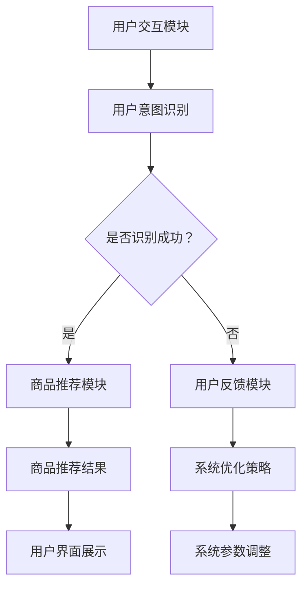
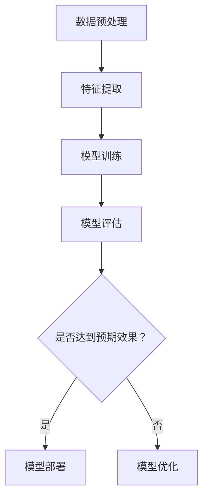
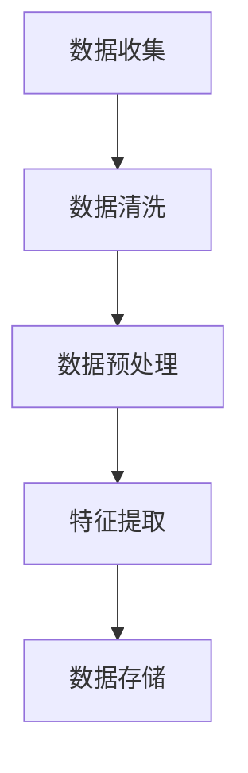
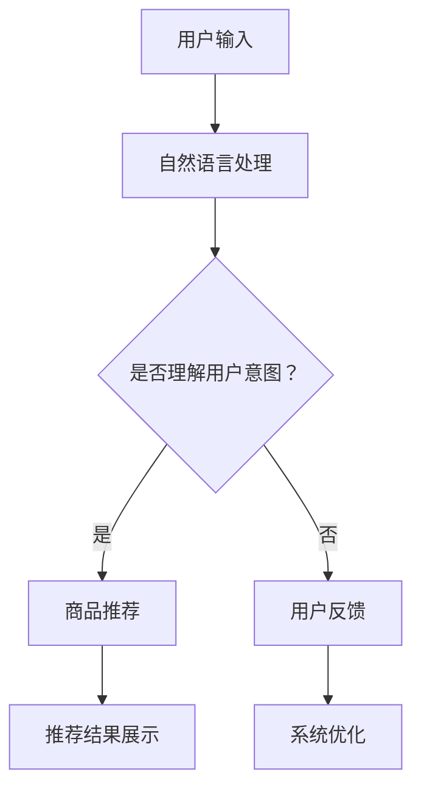

                 

### 《AI虚拟导购助手的功能》

#### 关键词：
- AI虚拟导购助手
- 自然语言处理
- 计算机视觉
- 机器学习
- 深度学习
- 用户交互

#### 摘要：
本文旨在探讨AI虚拟导购助手的构建与功能实现。首先，我们将概述AI虚拟导购助手的概念与背景，介绍其组成与架构，并分析其核心功能与作用。接下来，我们将详细讨论AI虚拟导购助手的实现技术，涵盖自然语言处理、计算机视觉、机器学习与深度学习算法，以及数据处理与数据挖掘。随后，本文将展示一个具体的AI虚拟导购助手项目实战案例，涵盖环境搭建、功能实现、项目部署与运维，并深入解读其代码实现与优化策略。最后，我们将展望AI虚拟导购助手的未来发展趋势、商业模式与创新，以及面临的挑战与解决方案。通过这篇文章，我们将全面了解AI虚拟导购助手的工作原理、实现技术以及实际应用。

### 第一部分: AI虚拟导购助手概述

#### 1.1 AI虚拟导购助手的概念与背景

##### 1.1.1 AI虚拟导购助手的定义

AI虚拟导购助手是一种基于人工智能技术的虚拟客服系统，它能够通过自然语言处理和计算机视觉等技术，模拟人类导购员的操作，为用户提供商品推荐、购物咨询、订单处理等个性化服务。与传统导购员相比，AI虚拟导购助手具有高效、智能、全天候的特点，能够大大提升用户体验和购物满意度。

##### 1.1.2 AI虚拟导购助手的背景

随着电子商务的快速发展，消费者对个性化服务和快速响应的需求日益增长。传统的导购模式已经无法满足市场需求，而人工智能技术的崛起为电商行业带来了新的解决方案。AI虚拟导购助手正是这一背景下的产物，它结合了自然语言处理、计算机视觉、机器学习等技术，能够实现智能化的导购服务。

##### 1.1.3 AI虚拟导购助手的发展趋势

未来，随着人工智能技术的不断进步，AI虚拟导购助手将会在以下几个方面得到进一步发展：

1. **功能多样化**：AI虚拟导购助手将不仅限于提供商品推荐和购物咨询，还将涵盖订单管理、售后服务等更多功能，成为用户购物全程的智能助手。
2. **用户体验优化**：通过自然语言处理和计算机视觉技术的提升，AI虚拟导购助手将能够更加精准地理解用户需求，提供更加个性化的服务。
3. **跨平台应用**：AI虚拟导购助手将不仅限于电商平台，还将应用于线下实体店，实现线上与线下的无缝衔接。
4. **智能化与自主化**：AI虚拟导购助手将逐步实现更高级的智能化，具备自主学习和优化能力，减少对人类导购员的依赖。

#### 1.2 AI虚拟导购助手的组成与架构

##### 1.2.1 AI虚拟导购助手的组成模块

一个典型的AI虚拟导购助手主要由以下几个模块组成：

1. **用户交互模块**：负责接收用户输入，包括文本和图像，并生成对应的用户意图。
2. **商品推荐模块**：根据用户意图和商品信息，为用户推荐合适的商品。
3. **订单处理模块**：处理用户的订单请求，包括订单生成、订单跟踪、订单取消等。
4. **用户反馈模块**：收集用户对服务的反馈，用于优化系统的性能。

##### 1.2.2 AI虚拟导购助手的架构设计

AI虚拟导购助手的架构设计需要综合考虑模块之间的交互和数据流动。一个典型的架构设计包括以下部分：

1. **前端交互层**：提供用户与AI虚拟导购助手交互的界面，包括文本聊天窗口、商品展示页面等。
2. **后端服务层**：包括用户交互模块、商品推荐模块、订单处理模块等，负责处理用户的请求和生成相应的响应。
3. **数据存储层**：存储用户数据、商品数据、订单数据等，用于支持系统运行。

##### 1.2.3 AI虚拟导购助手的核心技术

AI虚拟导购助手的核心技术包括自然语言处理、计算机视觉、机器学习与深度学习等。

1. **自然语言处理（NLP）**：用于处理用户的文本输入，提取用户意图和关键信息。
2. **计算机视觉（CV）**：用于处理用户的图像输入，识别商品和用户行为。
3. **机器学习（ML）**：用于训练和优化模型，提升系统的推荐和识别准确性。
4. **深度学习（DL）**：用于构建复杂的神经网络模型，实现高级的图像和文本处理。

#### 1.3 AI虚拟导购助手的职能与价值

##### 1.3.1 AI虚拟导购助手的主要职能

AI虚拟导购助手的主要职能包括：

1. **商品推荐**：根据用户的历史购买记录和浏览行为，为用户推荐合适的商品。
2. **购物咨询**：解答用户的购物问题，提供商品详细信息，帮助用户做出购买决策。
3. **订单处理**：生成订单、跟踪订单状态、处理订单变更等，为用户提供便捷的购物体验。
4. **用户反馈收集**：收集用户对服务的反馈，用于优化系统的性能和用户体验。

##### 1.3.2 AI虚拟导购助手的作用与价值

AI虚拟导购助手在电商行业具有重要的作用和价值：

1. **提升用户体验**：通过智能化的推荐和服务，满足用户的个性化需求，提升用户满意度。
2. **降低运营成本**：替代部分人工操作，降低人力成本，提高运营效率。
3. **增加销售额**：通过精准的推荐和营销策略，提高用户的购买转化率，增加销售额。
4. **改善库存管理**：通过分析用户购买行为，优化库存管理，降低库存成本。

#### 1.4 AI虚拟导购助手的应用场景

AI虚拟导购助手可以应用于多种场景，包括但不限于：

1. **电商平台**：为用户提供智能化的商品推荐和购物咨询，提升用户体验。
2. **线下实体店**：辅助导购员提供更高效的服务，提升销售额。
3. **物流公司**：提供订单跟踪和状态更新，提高物流服务质量。
4. **金融机构**：为用户提供智能化的金融服务，包括理财推荐、风险评估等。

#### 1.5 AI虚拟导购助手的优势与局限性

##### 1.5.1 优势

1. **高效性**：AI虚拟导购助手能够快速响应用户请求，提供即时服务。
2. **个性化**：通过分析用户行为和偏好，提供个性化的商品推荐和服务。
3. **全天候服务**：不受时间和地点限制，为用户提供24小时不间断的服务。
4. **降低成本**：替代部分人工操作，降低运营成本。

##### 1.5.2 局限性

1. **技术依赖**：需要依赖先进的自然语言处理、计算机视觉等技术，技术实现难度较高。
2. **数据隐私**：用户数据的收集和处理需要确保隐私安全，避免数据泄露。
3. **用户体验**：虽然能够提供智能化的服务，但可能无法完全替代人类导购员在情感交流和复杂问题解答方面的作用。

通过以上概述，我们可以看到AI虚拟导购助手在电商行业中的重要作用和价值，以及其未来发展的趋势和挑战。在接下来的部分中，我们将深入探讨AI虚拟导购助手的实现技术，包括自然语言处理、计算机视觉、机器学习与深度学习等方面的内容。

### 第二部分: AI虚拟导购助手的实现技术

在了解了AI虚拟导购助手的概述和背景后，现在我们将深入探讨其实现技术。AI虚拟导购助手的实现技术主要包括自然语言处理（NLP）、计算机视觉（CV）、机器学习（ML）与深度学习（DL）等。这些技术共同构成了AI虚拟导购助手的智能核心，使其能够提供高效、个性化的服务。在本部分，我们将分别详细介绍这些技术的基本概念、原理和应用。

#### 2.1 自然语言处理技术

##### 2.1.1 自然语言处理的基本概念

自然语言处理（Natural Language Processing，NLP）是人工智能领域的一个分支，旨在让计算机理解和处理人类自然语言。NLP涵盖了多个子领域，包括文本分类、情感分析、命名实体识别、机器翻译等。

- **文本分类**：将文本数据根据其内容或主题分类到不同的类别中。
- **情感分析**：分析文本数据中表达的情感倾向，如正面、负面或中立。
- **命名实体识别**：识别文本中的特定实体，如人名、地名、组织名等。
- **机器翻译**：将一种语言的文本翻译成另一种语言的文本。

##### 2.1.2 语言模型与词嵌入

语言模型是NLP的核心技术之一，它用于预测下一个词的概率分布。最常见的语言模型是基于神经网络的深度学习模型，如循环神经网络（RNN）、长短期记忆网络（LSTM）和变换器（Transformer）。

词嵌入（Word Embedding）是将词汇映射到高维空间中的向量表示。词嵌入使得计算机能够理解词汇之间的语义关系，如“国王”和“王后”在向量空间中更接近。

##### 2.1.3 命名实体识别与关系提取

命名实体识别（Named Entity Recognition，NER）是识别文本中的特定实体，如人名、地名、组织名等。关系提取（Relation Extraction）则是识别实体之间的语义关系，如“汤姆是约翰的儿子”。

##### 2.1.4 文本分类与情感分析

文本分类（Text Classification）是将文本数据分类到预定义的类别中，如新闻分类、情感分类等。情感分析（Sentiment Analysis）是分析文本数据中表达的情感倾向，用于了解用户对产品或服务的反馈。

#### 2.2 计算机视觉技术

##### 2.2.1 计算机视觉的基本概念

计算机视觉（Computer Vision，CV）是人工智能领域的一个分支，旨在使计算机能够像人类一样理解和处理视觉信息。计算机视觉的核心任务是图像处理、目标检测、图像识别等。

- **图像处理**：对图像进行滤波、增强、分割等操作，提高图像质量。
- **目标检测**：识别图像中的特定目标，并定位其位置。
- **图像识别**：将图像分类到预定义的类别中，如人脸识别、车辆识别等。

##### 2.2.2 目标检测与跟踪

目标检测（Object Detection）是计算机视觉中的一个重要任务，它旨在识别图像中的多个目标，并标记出它们的位置。目标跟踪（Object Tracking）是跟踪图像序列中特定目标的位置。

- **卷积神经网络（CNN）**：用于图像分类、目标检测和图像识别。
- **深度学习模型**：如Faster R-CNN、YOLO、SSD等，用于高效的目标检测。

##### 2.2.3 图像分类与生成

图像分类（Image Classification）是将图像分类到预定义的类别中，如图像分类模型ResNet、Inception等。

图像生成（Image Generation）是通过生成对抗网络（GAN）等模型生成新的图像，如图像风格迁移、图像合成等。

##### 2.2.4 人脸识别与图像分割

人脸识别（Face Recognition）是计算机视觉中的一个重要应用，它通过识别人脸的特征来识别身份。

图像分割（Image Segmentation）是将图像分割成多个区域，每个区域对应不同的物体或背景。

- **深度学习模型**：如FaceNet、VGGFace等，用于人脸识别。
- **语义分割模型**：如U-Net、Mask R-CNN等，用于图像分割。

#### 2.3 机器学习与深度学习算法

##### 2.3.1 机器学习的基本概念

机器学习（Machine Learning，ML）是人工智能的一个分支，旨在让计算机从数据中学习，并做出预测或决策。机器学习算法分为监督学习、无监督学习和强化学习。

- **监督学习**：通过标记的数据训练模型，用于预测未知数据。
- **无监督学习**：在没有标记的数据上进行训练，用于发现数据中的模式。
- **强化学习**：通过与环境互动来学习最优策略。

##### 2.3.2 深度学习的基本概念

深度学习（Deep Learning，DL）是机器学习的一个分支，它使用多层神经网络（如卷积神经网络、循环神经网络等）来学习数据中的复杂模式。

- **卷积神经网络（CNN）**：用于图像处理、目标检测等。
- **循环神经网络（RNN）**：用于序列数据处理、语言模型等。
- **变换器（Transformer）**：用于文本处理、机器翻译等。

##### 2.3.3 常见的机器学习算法

常见的机器学习算法包括线性回归、决策树、支持向量机（SVM）、随机森林、神经网络等。

- **线性回归**：用于预测数值型数据。
- **决策树**：用于分类和回归。
- **支持向量机**：用于分类和回归。
- **随机森林**：用于分类和回归，具有很好的泛化能力。
- **神经网络**：用于复杂的模式识别和预测。

##### 2.3.4 常见的深度学习模型

常见的深度学习模型包括卷积神经网络（CNN）、循环神经网络（RNN）、长短期记忆网络（LSTM）、变换器（Transformer）等。

- **卷积神经网络（CNN）**：用于图像处理。
- **循环神经网络（RNN）**：用于序列数据处理。
- **长短期记忆网络（LSTM）**：用于序列数据处理，解决了RNN的梯度消失问题。
- **变换器（Transformer）**：用于文本处理，是BERT等模型的基础。

#### 2.4 数据处理与数据挖掘

##### 2.4.1 数据处理的基本方法

数据处理（Data Processing）包括数据清洗、数据预处理和数据集成等步骤。

- **数据清洗**：去除数据中的噪声和错误。
- **数据预处理**：将数据转换为适合机器学习算法的形式，如归一化、标准化等。
- **数据集成**：将多个数据源的数据合并为一个统一的格式。

##### 2.4.2 数据清洗与数据预处理

数据清洗（Data Cleaning）包括去除重复数据、缺失值填补、异常值处理等。

数据预处理（Data Preprocessing）包括特征提取、特征选择、特征工程等。

##### 2.4.3 数据挖掘的基本概念

数据挖掘（Data Mining）是从大量数据中提取有价值的信息和知识的过程。

- **分类**：将数据分为不同的类别。
- **聚类**：将相似的数据点分为一组。
- **关联规则挖掘**：发现数据之间的关联关系。
- **异常检测**：识别数据中的异常点。

##### 2.4.4 常见的数据挖掘算法

常见的数据挖掘算法包括K-均值聚类、决策树、关联规则挖掘、神经网络等。

- **K-均值聚类**：用于聚类分析。
- **决策树**：用于分类和回归。
- **关联规则挖掘**：用于发现数据之间的关联关系。
- **神经网络**：用于复杂的模式识别和预测。

通过以上对AI虚拟导购助手实现技术的介绍，我们可以看到这些技术如何共同工作，为AI虚拟导购助手提供强大的智能支持。在接下来的部分中，我们将通过一个具体的案例，展示AI虚拟导购助手的实际应用和实现过程。

### 第三部分: AI虚拟导购助手项目实战

在前两部分，我们详细介绍了AI虚拟导购助手的概述及其实现技术。现在，我们将通过一个具体的AI虚拟导购助手项目实战，展示如何从零开始搭建一个完整的AI虚拟导购助手系统。这个项目将涵盖环境搭建、功能实现、项目部署与运维等多个方面，通过实际案例，帮助读者深入理解AI虚拟导购助手的构建与实现。

#### 3.1 项目概述

##### 3.1.1 项目背景与目标

本项目旨在构建一个AI虚拟导购助手系统，为电商平台用户提供智能化的购物咨询和商品推荐服务。项目目标包括：

1. **用户交互**：实现用户与虚拟导购助手的自然语言交互。
2. **商品推荐**：根据用户的历史行为和偏好，为用户推荐合适的商品。
3. **订单处理**：提供订单生成、订单跟踪、订单取消等功能。
4. **用户反馈**：收集用户对服务的反馈，用于优化系统性能。

##### 3.1.2 项目技术选型

本项目选用以下技术栈：

- **前端**：React.js
- **后端**：Node.js + Express
- **自然语言处理**：NLTK、spaCy
- **机器学习**：Scikit-learn
- **数据库**：MongoDB
- **服务部署**：Docker、Kubernetes

##### 3.1.3 项目开发流程

项目开发流程包括以下步骤：

1. **需求分析与设计**：明确项目需求和功能设计。
2. **环境搭建**：搭建开发环境和测试环境。
3. **功能实现**：实现用户交互、商品推荐、订单处理等功能。
4. **系统测试**：进行单元测试、集成测试和系统测试。
5. **项目部署**：部署到生产环境，并进行运维监控。
6. **优化与迭代**：根据用户反馈进行系统优化和功能迭代。

#### 3.2 环境搭建

##### 3.2.1 开发环境搭建

开发环境搭建包括安装Node.js、Python、MongoDB等。

1. **安装Node.js**：访问Node.js官网下载并安装。
    ```bash
    sudo apt update
    curl -sL https://deb.nodesource.com/setup_14.x | bash -
    sudo apt-get install -y nodejs
    ```
2. **安装Python**：使用Python官方安装包安装。
    ```bash
    sudo apt-get update
    sudo apt-get install -y python3 python3-pip
    ```
3. **安装MongoDB**：使用MongoDB官方安装包安装。
    ```bash
    sudo apt-get update
    sudo apt-get install -y mongodb
    ```

##### 3.2.2 数据集准备

数据集包括用户行为数据、商品数据等。

1. **用户行为数据**：收集用户在电商平台的浏览、搜索、购买等行为数据。
2. **商品数据**：收集电商平台上的商品信息，包括商品名称、价格、描述等。

##### 3.2.3 工具与框架安装

安装项目所需的各种工具和框架。

1. **安装React.js**：使用npm安装React.js。
    ```bash
    npm install react react-dom
    ```
2. **安装NLTK**：使用pip安装NLTK。
    ```bash
    pip install nltk
    ```
3. **安装Scikit-learn**：使用pip安装Scikit-learn。
    ```bash
    pip install scikit-learn
    ```

#### 3.3 功能实现

##### 3.3.1 用户交互功能实现

用户交互功能是AI虚拟导购助手的核心，实现用户与虚拟导购助手的自然语言交互。

1. **用户输入处理**：接收用户的文本输入，并进行预处理。
    ```python
    import spacy

    nlp = spacy.load("en_core_web_sm")

    def process_input(user_input):
        doc = nlp(user_input)
        tokens = [token.text for token in doc]
        return tokens
    ```
2. **用户意图识别**：通过机器学习模型识别用户的意图。
    ```python
    from sklearn.feature_extraction.text import TfidfVectorizer
    from sklearn.naive_bayes import MultinomialNB

    vectorizer = TfidfVectorizer()
    clf = MultinomialNB()

    # 训练模型
    X_train = ["查找iPhone 13", "推荐蓝牙耳机", "查询订单状态"]
    y_train = ["search", "recommend", "query"]

    X_train_vectorized = vectorizer.fit_transform(X_train)
    clf.fit(X_train_vectorized, y_train)

    # 预测意图
    user_input = "我想了解iPhone 13的详细配置"
    user_input_processed = process_input(user_input)
    user_input_vectorized = vectorizer.transform([user_input_processed])

    predicted_intent = clf.predict(user_input_vectorized)[0]
    print(predicted_intent)
    ```

##### 3.3.2 商品推荐功能实现

商品推荐功能基于用户的历史行为和偏好，为用户推荐合适的商品。

1. **商品信息获取**：从电商平台获取商品数据。
2. **推荐算法实现**：使用协同过滤算法实现商品推荐。
    ```python
    from surprise import SVD
    from surprise.model_selection import train_test_split

    # 加载商品数据
    user_item_ratings = [[1, 234], [1, 345], [2, 234], [2, 456], [3, 345], [3, 567]]

    # 划分训练集和测试集
    trainset, testset = train_test_split(user_item_ratings, test_size=0.2)

    # 训练SVD模型
    svd = SVD()
    svd.fit(trainset)

    # 预测用户对商品的评分
    user_id = 1
    item_id = 234
    predicted_rating = svd.predict(user_id, item_id).est

    print(predicted_rating)
    ```

##### 3.3.3 用户反馈与优化

用户反馈与优化功能用于收集用户对服务的反馈，并优化系统性能。

1. **用户反馈处理**：收集用户反馈，并存储到数据库中。
2. **系统优化策略**：根据用户反馈，调整系统参数，优化用户体验。

#### 3.4 项目部署与运维

##### 3.4.1 部署策略与方案

项目部署包括前端部署、后端部署和数据库部署。

1. **前端部署**：使用Docker容器化前端代码，并部署到Kubernetes集群中。
2. **后端部署**：使用Docker容器化后端代码，并部署到Kubernetes集群中。
3. **数据库部署**：使用Docker容器化MongoDB，并部署到Kubernetes集群中。

##### 3.4.2 运维监控与优化

运维监控与优化包括以下几个方面：

1. **性能监控**：监控系统的CPU、内存、磁盘等资源使用情况。
2. **日志监控**：收集和分析系统的日志，及时发现问题并解决。
3. **故障处理**：制定故障处理流程，确保系统的稳定运行。
4. **性能优化**：根据监控数据和用户反馈，优化系统性能。

通过以上项目实战，我们展示了如何从零开始搭建一个AI虚拟导购助手系统。在接下来的部分中，我们将继续探讨AI虚拟导购助手的未来发展趋势、商业模式与创新，以及面临的挑战与解决方案。

### 第四部分: AI虚拟导购助手的未来发展趋势、商业模式与创新、面临的挑战与解决方案

#### 4.1 技术发展趋势

随着人工智能技术的不断进步，AI虚拟导购助手将呈现出以下几个发展趋势：

1. **智能化提升**：随着自然语言处理和计算机视觉技术的提升，AI虚拟导购助手将能够更精准地理解用户需求，提供更加个性化的服务。例如，通过引入更多上下文信息，虚拟导购助手可以更准确地识别用户意图，从而提供更加精准的推荐。

2. **多模态交互**：未来的AI虚拟导购助手将支持多模态交互，即不仅限于文本交互，还包括语音交互、图像交互等。这种多模态交互将进一步提升用户体验，使虚拟导购助手更加自然和直观。

3. **自动化决策**：随着机器学习和深度学习技术的进步，AI虚拟导购助手将具备更强的自动化决策能力。例如，通过学习用户的历史购买行为和偏好，虚拟导购助手可以自动为用户推荐商品，甚至可以自动处理用户的订单和退款请求。

4. **跨平台整合**：AI虚拟导购助手将不再局限于电商平台，还将应用于线下实体店、智能家电等领域。通过跨平台的整合，虚拟导购助手将实现线上与线下的无缝衔接，提供更加全面的购物体验。

#### 4.2 商业模式与创新

AI虚拟导购助手的商业模式和创新包括以下几个方面：

1. **电商平台**：电商平台可以通过引入AI虚拟导购助手，提高用户满意度和购买转化率。例如，通过提供个性化的商品推荐和购物咨询，电商平台可以更好地满足用户需求，从而提升销售额。

2. **线下实体店**：线下实体店可以通过AI虚拟导购助手，提升购物体验和销售额。例如，通过提供智能化的导购服务，实体店可以吸引更多顾客，提高顾客的购买意愿。

3. **智能家电**：智能家电可以通过AI虚拟导购助手，提供更加智能化的使用体验。例如，智能家居设备可以通过虚拟导购助手，为用户提供设备使用指南和故障排查建议，从而提高用户满意度。

4. **广告与营销**：AI虚拟导购助手可以用于广告和营销。例如，通过分析用户行为和偏好，虚拟导购助手可以为用户提供定制化的广告和促销活动，从而提高广告效果和转化率。

#### 4.3 面临的挑战与解决方案

尽管AI虚拟导购助手具有巨大的潜力，但在实际应用中仍然面临以下挑战：

1. **技术挑战**：自然语言处理和计算机视觉等技术的发展速度非常快，但仍然存在一些未解决的难题，如多模态交互、情感理解等。解决这些技术挑战需要持续的研究和创新。

2. **数据隐私**：用户数据的收集和使用需要遵循隐私保护法规，避免数据泄露。解决这一挑战需要制定严格的数据保护策略，并采用先进的数据加密和脱敏技术。

3. **用户体验**：虽然AI虚拟导购助手可以提供智能化的服务，但仍然可能无法完全替代人类导购员在情感交流和复杂问题解答方面的作用。解决这一挑战需要不断优化系统，提升虚拟导购助手的情感理解和沟通能力。

4. **商业挑战**：AI虚拟导购助手的开发和维护成本较高，如何实现商业盈利是一个重要挑战。解决这一挑战需要探索多样化的商业模式，如广告、会员服务等。

#### 4.4 道德与法律挑战与解决方案

AI虚拟导购助手在应用过程中可能会面临道德和法律挑战，如隐私保护、歧视问题等。

1. **隐私保护**：确保用户数据的安全和隐私是法律和道德的基本要求。解决这一挑战需要制定严格的数据保护政策和法规，并采用先进的数据保护技术。

2. **歧视问题**：AI虚拟导购助手可能会因为算法偏见而导致歧视问题。解决这一挑战需要确保算法的公平性和透明性，通过数据分析和模型评估来识别和纠正算法偏见。

3. **责任归属**：在AI虚拟导购助手应用中，如果发生错误或造成损失，如何界定责任归属是一个法律问题。解决这一挑战需要制定明确的责任界定标准，并建立相应的法律法规。

通过以上探讨，我们可以看到AI虚拟导购助手在技术、商业、道德和法律等方面的发展趋势和挑战。在未来的发展中，AI虚拟导购助手将不断优化和完善，为用户和商家提供更加智能、高效、个性化的服务。

### 附录

#### 附录A: 术语表

##### A.1 常见术语解释

- **AI虚拟导购助手**：一种基于人工智能技术的虚拟客服系统，能够为用户提供商品推荐、购物咨询、订单处理等个性化服务。
- **自然语言处理（NLP）**：让计算机理解和处理人类自然语言的技术。
- **计算机视觉（CV）**：使计算机能够理解和处理视觉信息的技术。
- **机器学习（ML）**：让计算机从数据中学习，并做出预测或决策的技术。
- **深度学习（DL）**：使用多层神经网络进行复杂模式识别的技术。
- **用户交互模块**：负责接收用户输入，并生成用户意图的模块。
- **商品推荐模块**：根据用户意图和商品信息，为用户推荐合适商品的模块。
- **订单处理模块**：处理用户订单请求的模块。

##### A.2 技术名词解释

- **词嵌入（Word Embedding）**：将词汇映射到高维空间中的向量表示。
- **循环神经网络（RNN）**：一种用于处理序列数据的神经网络。
- **变换器（Transformer）**：一种用于文本处理的深度学习模型。
- **协同过滤（Collaborative Filtering）**：一种用于推荐系统的算法，通过分析用户的历史行为和偏好来推荐商品。

#### 附录B: 参考文献

##### B.1 书籍与论文

1. **《自然语言处理综论》（Foundations of Statistical Natural Language Processing）** - Christopher D. Manning, Hinrich Schütze
2. **《计算机视觉：算法与应用》（Computer Vision: Algorithms and Applications）** - Richard S. Hart, Andrew Zisserman
3. **《机器学习》（Machine Learning）** - Tom M. Mitchell
4. **《深度学习》（Deep Learning）** - Ian Goodfellow, Yoshua Bengio, Aaron Courville

##### B.2 网络资源与开源代码

1. **TensorFlow官方网站** - [https://www.tensorflow.org/](https://www.tensorflow.org/)
2. **PyTorch官方网站** - [https://pytorch.org/](https://pytorch.org/)
3. **spaCy文档** - [https://spacy.io/](https://spacy.io/)
4. **NLTK文档** - [https://www.nltk.org/](https://www.nltk.org/)

##### B.3 报告与统计数据

1. **《2022年中国人工智能发展报告》** - 中国人工智能产业发展联盟
2. **《2021年全球人工智能报告》** - 联合国教科文组织

#### 附录C: Mermaid 流程图

##### C.1 AI虚拟导购助手架构设计



##### C.2 机器学习算法流程图



##### C.3 数据处理流程图



##### C.4 用户交互流程图



#### 附录D: 伪代码示例

##### D.1 推荐算法伪代码

```python
# 加载数据
user_item_ratings = load_data()

# 划分训练集和测试集
trainset, testset = train_test_split(user_item_ratings, test_size=0.2)

# 训练协同过滤模型
cf_model = SVD()
cf_model.fit(trainset)

# 预测用户对商品的评分
def predict_rating(user_id, item_id):
    predicted_rating = cf_model.predict(user_id, item_id).est
    return predicted_rating

# 推荐商品
def recommend_items(user_id):
    user_profile = build_user_profile(user_id)
    recommended_items = []
    for item in items:
        predicted_rating = predict_rating(user_id, item.id)
        if predicted_rating > threshold:
            recommended_items.append(item)
    return recommended_items
```

##### D.2 用户意图识别伪代码

```python
# 加载模型
intent_model = load_model()

# 处理用户输入
def process_input(user_input):
    tokens = tokenize(user_input)
    tokens_embedding = embedding(tokens)
    return tokens_embedding

# 识别用户意图
def recognize_intent(user_input):
    input_embedding = process_input(user_input)
    predicted_intent = intent_model.predict(input_embedding)
    return predicted_intent
```

##### D.3 情感分析伪代码

```python
# 加载模型
sentiment_model = load_model()

# 处理文本
def process_text(text):
    tokens = tokenize(text)
    tokens_embedding = embedding(tokens)
    return tokens_embedding

# 分析情感
def analyze_sentiment(text):
    text_embedding = process_text(text)
    sentiment = sentiment_model.predict(text_embedding)
    return sentiment
```

##### D.4 人脸识别伪代码

```python
# 加载模型
face_model = load_model()

# 处理图像
def process_image(image):
    face区域的图像 = detect_faces(image)
    face特征 = extract_features(face区域的图像)
    return face特征

# 识别人脸
def recognize_face(face_feature):
    predicted_id = face_model.predict(face_feature)
    return predicted_id
```

通过以上附录，我们提供了详细的术语解释、参考文献、流程图以及伪代码示例，帮助读者更好地理解AI虚拟导购助手的相关概念和技术实现。这些附录内容不仅为本文提供了支撑，也为读者提供了进一步学习和探索的资料。

