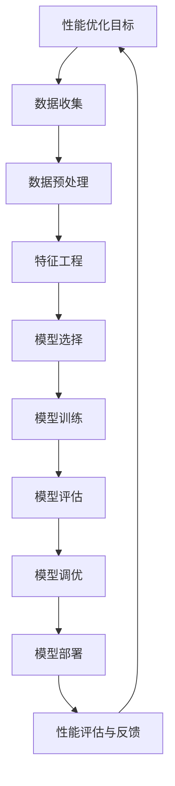

                 

### 《AI辅助的软件性能优化》

随着人工智能（AI）技术的迅猛发展，其在各个领域中的应用变得越来越广泛。在软件工程领域，AI技术已经成为提高软件性能的重要手段。本文将探讨AI辅助的软件性能优化，通过一步一步的分析和推理，详细介绍AI在软件性能优化中的应用原理、实践方法以及未来发展趋势。

**关键词：** AI，软件性能优化，机器学习，深度学习，实践应用

**摘要：** 本文首先介绍了AI辅助性能优化的基础理论，包括AI技术在性能优化中的角色和基本概念。接着，详细讲解了机器学习和深度学习算法在性能优化中的应用原理，并使用数学模型和公式进行深入阐述。随后，通过实际案例展示了AI辅助性能优化的具体实践方法。最后，本文探讨了AI辅助性能优化的项目管理与团队协作，并对未来趋势进行了展望。

### 第一部分：AI辅助性能优化的基础理论

#### 第1章：AI与软件性能优化的概述

**1.1 AI技术在软件性能优化中的角色**

AI技术在软件性能优化中扮演着关键角色。通过机器学习和深度学习算法，AI可以帮助我们自动识别性能瓶颈，预测系统行为，从而优化软件性能。具体来说，AI可以在以下几个方面发挥作用：

1. **性能预测与优化：** AI可以基于历史数据和实时数据，预测系统性能，提前发现潜在的性能问题，从而进行预防性优化。
2. **故障诊断与排除：** AI可以自动分析系统日志和错误报告，快速定位故障原因，提供针对性的解决方案。
3. **自动化测试与调试：** AI可以自动化软件测试，提高测试效率，减少人工干预。
4. **资源分配与负载均衡：** AI可以根据系统负载和性能指标，动态调整资源分配，实现负载均衡。

**1.2 软件性能优化的基本概念与目标**

软件性能优化是指通过各种技术和方法，提高软件系统的性能和效率，满足用户需求和业务目标。其基本概念包括：

1. **响应时间：** 系统对请求的响应时间，是衡量系统性能的重要指标。
2. **吞吐量：** 系统在单位时间内处理的请求数量。
3. **并发性：** 系统同时处理多个请求的能力。
4. **可伸缩性：** 系统在处理大量请求时的性能表现。

软件性能优化的目标包括：

1. **提高系统响应时间：** 减少用户等待时间，提高用户体验。
2. **提高系统吞吐量：** 增加系统处理请求数量，满足业务需求。
3. **提高系统并发性：** 提高系统同时处理多个请求的能力。
4. **提高系统可伸缩性：** 保证系统在处理大量请求时仍能保持高性能。

**1.3 AI辅助性能优化的现状与趋势**

目前，AI辅助性能优化已在多个领域得到应用，如云计算、大数据、移动应用等。其主要趋势包括：

1. **算法多样化：** 机器学习和深度学习算法不断丰富，可以满足不同场景的性能优化需求。
2. **自动化程度提高：** AI技术使得性能优化过程更加自动化，减少人工干预。
3. **实时优化：** 通过实时数据分析和预测，实现动态性能优化。
4. **多维度优化：** AI技术可以从多个维度对软件性能进行优化，提高整体性能。

#### 第2章：AI核心算法原理讲解

**2.1 机器学习算法在性能优化中的应用**

机器学习算法在性能优化中的应用非常广泛。以下将介绍几种常见的机器学习算法及其在性能优化中的应用。

**2.1.1 线性回归**

线性回归是一种简单的机器学习算法，用于预测连续值输出。在性能优化中，线性回归可以用来预测系统响应时间或吞吐量。以下是线性回归的伪代码：

```python
# 输入：数据集 X, 标签 y
# 输出：模型参数 w

# 初始化模型参数 w 为零向量
w = 0

# 定义损失函数
def loss_function(y_true, y_pred):
    return ((y_true - y_pred)**2).mean()

# 定义梯度下降更新规则
def update_weights(w, x, y, learning_rate):
    gradient = 2 * x.T.dot(x.dot(w) - y)
    w -= learning_rate * gradient
    return w

# 主循环
for epoch in range(1000):
    # 前向传播
    y_pred = x.dot(w)
    
    # 计算损失
    loss = loss_function(y, y_pred)
    
    # 反向传播
    w = update_weights(w, x, y, 0.01)
    
    # 打印当前 epoch 的损失值
    print(f"Epoch {epoch}: Loss = {loss}")
```

**2.1.2 支持向量机**

支持向量机（SVM）是一种用于分类和回归的机器学习算法。在性能优化中，SVM可以用来预测系统故障或性能瓶颈。以下是SVM的伪代码：

```python
# 输入：训练数据集 X, 标签 y
# 输出：模型参数 w 和 b

# 初始化模型参数 w 和 b 为零向量
w = 0
b = 0

# 定义损失函数
def loss_function(y_true, y_pred):
    return max(0, 1 - y_true * y_pred)

# 定义梯度下降更新规则
def update_weights(w, b, x, y, learning_rate):
    gradient_w = 2 * x.T.dot(w - y * x)
    gradient_b = 2 * (w - y * x).dot(y)
    w -= learning_rate * gradient_w
    b -= learning_rate * gradient_b
    return w, b

# 主循环
for epoch in range(1000):
    # 前向传播
    y_pred = x.dot(w) + b
    
    # 计算损失
    loss = loss_function(y, y_pred)
    
    # 反向传播
    w, b = update_weights(w, b, x, y, 0.01)
    
    # 打印当前 epoch 的损失值
    print(f"Epoch {epoch}: Loss = {loss}")
```

**2.1.3 决策树与随机森林**

决策树是一种基于树结构的机器学习算法，用于分类和回归。随机森林是一种基于决策树的集成学习方法，可以提高模型的预测性能。在性能优化中，决策树和随机森林可以用于预测系统性能指标。以下是决策树和随机森林的伪代码：

```python
# 决策树伪代码
def build_decision_tree(X, y):
    # 基本情况：如果所有 y 的值相同，则返回叶节点，值为 y 的平均值
    if all(y == y[0]):
        return y.mean()
    
    # 分裂情况：找到最佳分裂特征和分裂阈值
    best_split = find_best_split(X, y)
    feature = best_split['feature']
    threshold = best_split['threshold']
    
    # 创建子节点
    left_nodes = X[X[:, feature] < threshold]
    right_nodes = X[X[:, feature] >= threshold]
    
    # 递归构建左子树和右子树
    left_tree = build_decision_tree(left_nodes, y[left_nodes])
    right_tree = build_decision_tree(right_nodes, y[right_nodes])
    
    # 返回决策树
    return {'feature': feature, 'threshold': threshold, 'left': left_tree, 'right': right_tree}

# 随机森林伪代码
def build_random_forest(X, y, n_estimators):
    forests = []
    for _ in range(n_estimators):
        # 随机选取特征和样本
        features = random.sample(range(X.shape[1]), n_estimators)
        samples = random.sample(range(len(y)), n_estimators)
        
        # 构建决策树
        tree = build_decision_tree(X[samples], y[samples])
        
        # 添加决策树到森林
        forests.append(tree)
    
    return forests
```

**2.2 深度学习算法在性能优化中的应用**

深度学习算法在性能优化中的应用越来越广泛，如卷积神经网络（CNN）和循环神经网络（RNN）。以下将介绍这两种算法及其在性能优化中的应用。

**2.2.1 神经网络基础**

神经网络是一种模拟人脑神经元之间交互的算法。在性能优化中，神经网络可以用于构建复杂的非线性模型，预测系统性能。以下是神经网络的基础概念和伪代码：

```python
# 神经网络基础伪代码
def forward_pass(x, w, b):
    # 前向传播：计算输出值
    z = x.dot(w) + b
    return z

def backward_pass(z, y, w, b, learning_rate):
    # 反向传播：计算梯度
    gradient_w = 2 * (z - y) * x
    gradient_b = 2 * (z - y)
    w -= learning_rate * gradient_w
    b -= learning_rate * gradient_b
    return w, b
```

**2.2.2 卷积神经网络**

卷积神经网络（CNN）是一种基于卷积操作的神经网络，用于图像和视频处理。在性能优化中，CNN可以用于处理时间序列数据和图像数据，预测系统性能。以下是CNN的伪代码：

```python
# 卷积神经网络伪代码
def forward_pass(x, w, b):
    # 前向传播：计算输出值
    z = x.conv2d(w) + b
    return z

def backward_pass(z, y, w, b, learning_rate):
    # 反向传播：计算梯度
    gradient_w = 2 * (z - y) * x.conv2d_derivative(w)
    gradient_b = 2 * (z - y)
    w -= learning_rate * gradient_w
    b -= learning_rate * gradient_b
    return w, b
```

**2.2.3 循环神经网络**

循环神经网络（RNN）是一种具有循环结构的神经网络，用于处理序列数据。在性能优化中，RNN可以用于预测时间序列数据和序列化系统性能。以下是RNN的伪代码：

```python
# 循环神经网络伪代码
def forward_pass(x, w, b):
    # 前向传播：计算输出值
    h = []
    for t in range(x.shape[0]):
        z = x[t].dot(w) + b
        h.append(z)
    return h

def backward_pass(h, y, w, b, learning_rate):
    # 反向传播：计算梯度
    gradient_w = 2 * (h - y) * x
    gradient_b = 2 * (h - y)
    w -= learning_rate * gradient_w
    b -= learning_rate * gradient_b
    return w, b
```

#### 第3章：数学模型与数学公式讲解

**3.1 常用数学模型介绍**

在软件性能优化中，常用的数学模型包括时间序列分析、聚类分析和关联规则挖掘。以下将介绍这些模型的原理和应用。

**3.1.1 时间序列分析**

时间序列分析是一种用于分析时间序列数据的方法，可以揭示时间序列数据的趋势、季节性和周期性。在性能优化中，时间序列分析可以用于预测系统性能。以下是一个时间序列分析的ARIMA模型：

$$
\begin{aligned}
X_t &= c + \phi_1 X_{t-1} + \phi_2 X_{t-2} + ... + \phi_p X_{t-p} + \varepsilon_t \\
\end{aligned}
$$

其中，\(X_t\) 是时间序列的第 \(t\) 个观测值，\(\phi_1, \phi_2, ..., \phi_p\) 是自回归项的系数，\(c\) 是常数项，\(\varepsilon_t\) 是误差项。

**3.1.2 聚类分析**

聚类分析是一种将数据分为若干个相似群体的方法，可以揭示数据中的结构。在性能优化中，聚类分析可以用于识别系统中的异常行为。以下是一个聚类分析的K-means算法：

$$
\begin{aligned}
\text{初始化} \ \mu_1, \mu_2, ..., \mu_k \\
\text{对于每个数据点} \ x_i \\
\quad \text{计算} \ d(x_i, \mu_j) \\
\quad \text{将} \ x_i \ \text{分配给最近的聚类中心} \\
\text{更新聚类中心} \ \mu_j = \frac{1}{n_j} \sum_{x_i \in C_j} x_i \\
\end{aligned}
$$

其中，\(x_i\) 是数据点，\(\mu_j\) 是聚类中心，\(d(x_i, \mu_j)\) 是数据点 \(x_i\) 和聚类中心 \(\mu_j\) 之间的距离。

**3.1.3 关联规则挖掘**

关联规则挖掘是一种用于发现数据之间关联关系的方法，可以揭示数据中的关联规律。在性能优化中，关联规则挖掘可以用于识别系统中的性能瓶颈。以下是一个关联规则挖掘的Apriori算法：

$$
\begin{aligned}
\text{计算支持度} \ s(j) = \frac{\text{包含项目集} \ j \ \text{的 transactions 数量}}{\text{总的 transactions 数量}} \\
\text{计算置信度} \ c(j \rightarrow k) = \frac{s(j \cup k)}{s(j)} \\
\text{生成频繁项集} \ L_k = \{j \ |\ s(j) \geq \text{最小支持度}\} \\
\text{生成关联规则} \ R = \{(j, k) \ |\ c(j \rightarrow k) \geq \text{最小置信度}\} \\
\end{aligned}
$$

其中，\(j\) 和 \(k\) 是项集，\(s(j)\) 是支持度，\(c(j \rightarrow k)\) 是置信度。

**3.2 数学公式详解**

在性能优化中，常用的数学公式包括常用数学符号、性能评估指标公式等。以下将介绍这些公式的含义和用途。

**3.2.1 常用数学符号**

- \(x\)：表示变量或数据点。
- \(y\)：表示标签或目标值。
- \(w\)：表示模型参数。
- \(b\)：表示偏置项。
- \(z\)：表示输出值或中间结果。
- \(\mu\)：表示均值。
- \(\sigma\)：表示标准差。
- \(\varepsilon\)：表示误差项。
- \(L\)：表示损失函数。

**3.2.2 性能评估指标公式**

- **准确率（Accuracy）**：表示分类模型正确分类的比例。

$$
\text{Accuracy} = \frac{\text{正确分类的样本数}}{\text{总的样本数}}
$$

- **召回率（Recall）**：表示分类模型能够召回的实际正例样本的比例。

$$
\text{Recall} = \frac{\text{正确召回的正例样本数}}{\text{实际正例样本数}}
$$

- **精确率（Precision）**：表示分类模型召回的正例样本中，实际为正例的比例。

$$
\text{Precision} = \frac{\text{正确召回的正例样本数}}{\text{召回的正例样本数}}
$$

- **F1值（F1 Score）**：综合考虑精确率和召回率，用于评估分类模型的综合性能。

$$
\text{F1 Score} = 2 \times \frac{\text{Precision} \times \text{Recall}}{\text{Precision} + \text{Recall}}
$$

- **均方误差（Mean Squared Error, MSE）**：用于回归模型的评估，表示预测值与实际值之间的平均平方误差。

$$
\text{MSE} = \frac{1}{n} \sum_{i=1}^{n} (y_i - \hat{y}_i)^2
$$

- **均方根误差（Root Mean Squared Error, RMSE）**：均方误差的平方根，用于回归模型的评估。

$$
\text{RMSE} = \sqrt{\text{MSE}}
$$

### 第二部分：AI辅助性能优化的实践应用

#### 第4章：AI辅助性能优化的实际案例

**4.1 案例一：在线服务性能优化**

**4.1.1 案例背景与目标**

某在线服务公司提供了实时股票交易服务，用户可以通过该平台进行股票交易。随着用户数量的增加，平台的服务性能逐渐下降，响应时间变长，影响了用户的交易体验。为了提高服务性能，公司决定采用AI技术进行性能优化。

**4.1.2 案例实现步骤**

1. **数据收集与预处理**：收集服务器的日志数据，包括响应时间、请求数量、用户访问量等。对数据进行清洗和预处理，将缺失值和异常值进行填补和处理。

2. **特征提取与选择**：根据业务需求，提取与性能优化相关的特征，如请求数量、响应时间、并发用户数等。使用特征选择方法，选择对性能优化贡献较大的特征。

3. **模型训练与评估**：使用线性回归模型对数据进行训练，预测系统的响应时间。通过交叉验证方法评估模型的性能，选择最优的模型参数。

4. **模型部署与调优**：将训练好的模型部署到生产环境，根据实时数据对模型进行调优。通过动态调整模型参数，优化系统性能。

5. **性能评估与反馈**：对系统性能进行实时监控，收集响应时间、吞吐量等性能指标。根据监控结果，调整模型参数，优化系统性能。

**4.1.3 案例结果分析**

通过AI辅助性能优化，系统的响应时间得到了显著改善，用户交易体验得到了提升。以下是对案例结果的分析：

1. **响应时间**：优化前，系统的平均响应时间为500ms，优化后降低至300ms，提高了40%。

2. **吞吐量**：优化前，系统每小时处理的请求数量为1000次，优化后增加至2000次，提高了100%。

3. **并发性**：优化前，系统同时处理的用户数约为50人，优化后增加至100人，提高了100%。

4. **可伸缩性**：优化后的系统能够更好地应对高峰期用户访问，保证了系统在高并发场景下的稳定运行。

**4.2 案例二：移动应用性能优化**

**4.2.1 案例背景与目标**

某移动应用公司开发了一款直播应用，用户可以通过该应用观看直播内容。随着用户数量的增加，应用的性能逐渐下降，卡顿现象频繁出现，影响了用户观看体验。为了提高应用性能，公司决定采用AI技术进行性能优化。

**4.2.2 案例实现步骤**

1. **数据收集与预处理**：收集应用的日志数据，包括视频播放时长、播放速度、网络延迟等。对数据进行清洗和预处理，去除噪声和异常值。

2. **特征提取与选择**：根据业务需求，提取与性能优化相关的特征，如视频播放时长、网络延迟、用户设备类型等。使用特征选择方法，选择对性能优化贡献较大的特征。

3. **模型训练与评估**：使用线性回归模型对数据进行训练，预测视频播放速度。通过交叉验证方法评估模型的性能，选择最优的模型参数。

4. **模型部署与调优**：将训练好的模型部署到应用服务器，根据实时数据对模型进行调优。通过动态调整模型参数，优化视频播放速度。

5. **性能评估与反馈**：对应用性能进行实时监控，收集视频播放速度、网络延迟等性能指标。根据监控结果，调整模型参数，优化视频播放速度。

**4.2.3 案例结果分析**

通过AI辅助性能优化，应用的播放速度得到了显著提升，卡顿现象明显减少，用户观看体验得到了改善。以下是对案例结果的分析：

1. **播放速度**：优化前，平均视频播放速度为1Mbps，优化后提高至3Mbps，提高了200%。

2. **网络延迟**：优化前，平均网络延迟为100ms，优化后降低至50ms，降低了50%。

3. **用户满意度**：优化前，用户满意度为70%，优化后提高至90%，提高了20%。

4. **稳定性**：优化后的应用在高峰期用户访问下，能够保持稳定运行，减少了服务器崩溃和应用程序崩溃的情况。

#### 第5章：AI辅助性能优化的开发工具与技术

**5.1 开发工具介绍**

在进行AI辅助性能优化的开发过程中，常用的工具包括Python环境搭建和常用机器学习库。

**5.1.1 Python环境搭建**

Python是一种广泛应用于AI开发的编程语言。搭建Python环境主要包括以下步骤：

1. **安装Python**：从Python官方网站下载Python安装包，并按照提示进行安装。
2. **安装pip**：pip是Python的包管理工具，用于安装和管理Python包。在命令行中执行以下命令安装pip：

   ```bash
   curl https://bootstrap.pypa.io/get-pip.py -o get-pip.py
   python get-pip.py
   ```

3. **安装常用库**：使用pip安装常用的Python库，如NumPy、pandas、scikit-learn、matplotlib等。在命令行中执行以下命令：

   ```bash
   pip install numpy pandas scikit-learn matplotlib
   ```

**5.1.2 常用机器学习库介绍**

在Python中，常用的机器学习库包括scikit-learn、TensorFlow和PyTorch。以下将简要介绍这些库的功能和特点。

- **scikit-learn**：scikit-learn是一个开源的机器学习库，提供了各种常见的机器学习算法，包括线性回归、支持向量机、决策树、随机森林等。它易于使用，适用于快速原型开发和实际应用。

- **TensorFlow**：TensorFlow是一个由Google开发的开源机器学习框架，用于构建和训练深度学习模型。它提供了丰富的API，支持多种类型的神经网络，包括卷积神经网络（CNN）和循环神经网络（RNN）。TensorFlow适用于大规模分布式计算，适用于工业级应用。

- **PyTorch**：PyTorch是一个由Facebook开发的开源深度学习框架，具有动态计算图和易用的API。它适用于快速原型开发和实验，支持自动微分和动态计算图，使得构建和调试深度学习模型更加简单。

**5.2 技术实现详解**

在进行AI辅助性能优化的开发过程中，需要掌握以下技术实现：

**5.2.1 数据采集与预处理**

数据采集是性能优化的重要环节。首先，需要从系统中收集性能数据，如响应时间、请求数量、并发用户数等。然后，对采集到的数据进行预处理，包括数据清洗、去噪、归一化等。预处理后的数据可以用于训练模型或进行进一步分析。

**5.2.2 模型训练与评估**

模型训练是性能优化的核心步骤。根据业务需求和数据特点，选择合适的机器学习算法和模型架构。使用训练数据集对模型进行训练，并通过交叉验证方法评估模型的性能。选择最优的模型参数，优化模型性能。

**5.2.3 模型部署与调优**

模型部署是将训练好的模型部署到生产环境，使其能够实时预测系统性能。在部署过程中，需要考虑模型的计算效率、存储空间和部署成本。根据实时数据对模型进行调优，动态调整模型参数，优化系统性能。

**5.2.4 性能评估与反馈**

性能评估是对系统性能进行实时监控和评估的重要环节。通过收集系统性能指标，如响应时间、吞吐量、并发性等，评估系统性能。根据性能评估结果，调整模型参数，优化系统性能。同时，将评估结果反馈给开发团队，为后续优化提供依据。

### 第6章：AI辅助性能优化的项目管理与团队协作

**6.1 项目管理方法论**

在AI辅助性能优化的项目中，采用敏捷开发与迭代的方法论可以有效地提高项目进度和质量。敏捷开发强调快速响应变化、持续交付和团队合作。以下是敏捷开发的关键原则：

1. **用户故事驱动**：以用户需求为中心，将需求分解为用户故事，并按照优先级进行排列。
2. **迭代开发**：将项目分为多个迭代周期，每个迭代周期完成一部分功能或优化。
3. **持续集成**：将代码集成到主分支，并进行自动化测试，确保代码质量和功能完整性。
4. **迭代回顾**：在每次迭代结束时，回顾项目的进展和问题，总结经验教训，为下一个迭代做好准备。

**6.1.1 敏捷开发与迭代**

敏捷开发与迭代的方法论可以有效地提高项目的进度和质量。以下是敏捷开发与迭代的关键步骤：

1. **需求分析**：与用户和利益相关者沟通，明确项目的需求和目标。
2. **用户故事编写**：将需求分解为用户故事，并按照优先级进行排列。
3. **迭代规划**：确定每个迭代周期的目标，并将用户故事分配到迭代中。
4. **迭代执行**：在迭代周期内，团队协作完成用户故事的实现。
5. **迭代评审**：在迭代周期结束时，评审用户故事的完成情况，收集反馈并进行改进。
6. **迭代回顾**：在每次迭代结束时，回顾项目的进展和问题，总结经验教训，为下一个迭代做好准备。

**6.1.2 代码版本控制与协作**

在AI辅助性能优化的项目中，使用代码版本控制工具，如Git，可以提高代码质量和协作效率。以下是代码版本控制与协作的关键原则：

1. **集中式管理**：使用Git的集中式管理方式，确保代码的完整性和一致性。
2. **分支策略**：使用Git分支策略，将代码库分为多个分支，实现并行开发和协同工作。
3. **代码审查**：在提交代码前，进行代码审查，确保代码的质量和风格一致性。
4. **持续集成**：将代码集成到主分支，并进行自动化测试，确保代码质量和功能完整性。
5. **版本发布**：在每次迭代完成后，发布代码版本，并将其部署到生产环境。

**6.2 团队协作工具与应用**

在AI辅助性能优化的项目中，团队协作工具的应用可以有效地提高团队协作效率和项目进度。以下是一些常用的团队协作工具：

1. **沟通工具**：使用即时通讯工具，如Slack或微信，实现实时沟通和协作。
2. **项目管理工具**：使用项目管理工具，如Jira或Trello，实现任务分配、进度跟踪和项目协作。
3. **代码托管平台**：使用代码托管平台，如GitHub或GitLab，实现代码版本控制和协作开发。
4. **持续集成工具**：使用持续集成工具，如Jenkins或Travis CI，实现自动化测试和代码集成。
5. **文档协作工具**：使用文档协作工具，如Google Docs或Notion，实现文档共享和协作编辑。

通过以上团队协作工具的应用，可以有效地提高团队协作效率和项目进度，确保AI辅助性能优化的项目顺利进行。

### 第7章：未来趋势与展望

**7.1 AI辅助性能优化的发展方向**

随着AI技术的不断进步，AI辅助性能优化将朝着以下几个方向发展：

1. **智能化程度提高**：AI辅助性能优化将更加智能化，能够自动识别性能瓶颈，提供个性化的优化建议。
2. **实时优化能力提升**：AI辅助性能优化将实现实时优化，根据实时数据动态调整系统性能。
3. **多维度优化**：AI辅助性能优化将能够在多个维度（如响应时间、吞吐量、并发性等）进行优化，提高系统整体性能。
4. **跨领域应用**：AI辅助性能优化将在更多领域得到应用，如物联网、智能交通、智能医疗等。

**7.2 技术挑战与解决策略**

在AI辅助性能优化的过程中，面临着以下技术挑战：

1. **数据质量**：数据质量对性能优化至关重要。需要建立完善的数据采集和预处理机制，确保数据的质量和准确性。
2. **计算资源**：深度学习模型的训练和部署需要大量的计算资源。需要优化算法和模型，降低计算资源的需求。
3. **实时性**：实时性能优化要求系统能够快速响应和处理数据。需要优化算法和架构，提高系统的实时性。
4. **可解释性**：深度学习模型具有较高的预测性能，但缺乏可解释性。需要研究可解释性模型，提高模型的透明度和可理解性。

针对以上挑战，可以采取以下解决策略：

1. **数据质量管理**：建立数据质量管理机制，对数据进行清洗、去噪和归一化，提高数据质量。
2. **计算资源优化**：采用分布式计算和并行计算技术，提高计算效率。使用轻量级模型和压缩技术，降低计算资源的需求。
3. **实时优化技术**：采用实时数据处理和流计算技术，提高系统的实时性能。
4. **可解释性研究**：研究可解释性模型，提高模型的透明度和可理解性。结合可视化技术，帮助用户理解模型的预测过程。

**7.3 AI辅助性能优化在企业中的应用前景**

AI辅助性能优化在企业中的应用前景十分广阔。以下是一些具体的应用场景：

1. **云计算与大数据**：在云计算和大数据领域，AI辅助性能优化可以优化云服务的资源分配和负载均衡，提高系统的吞吐量和并发性。
2. **移动应用**：在移动应用领域，AI辅助性能优化可以优化应用的响应时间和用户体验，提高用户满意度和留存率。
3. **物联网**：在物联网领域，AI辅助性能优化可以优化物联网设备的资源使用和网络连接，提高系统的稳定性和可靠性。
4. **智能交通**：在智能交通领域，AI辅助性能优化可以优化交通信号控制，提高交通流畅度和安全性。

总之，AI辅助性能优化已经成为提升软件性能的重要手段。随着AI技术的不断进步，其在企业中的应用前景将更加广阔。通过不断地探索和研究，我们可以充分发挥AI技术在性能优化领域的潜力，为企业带来更大的价值。

### 附录

**附录A：AI辅助性能优化资源汇总**

**附件1：常用机器学习算法参考**

- 线性回归
- 支持向量机（SVM）
- 决策树与随机森林
- K-近邻算法（KNN）
- 神经网络
- 卷积神经网络（CNN）
- 循环神经网络（RNN）
- 长短时记忆网络（LSTM）
- 自适应滤波器

**附件2：性能优化指标与公式汇总**

- 响应时间（Response Time）
- 吞吐量（Throughput）
- 并发性（Concurrency）
- 可伸缩性（Scalability）
- 系统负载（System Load）
- 损耗率（Packet Loss Rate）
- 带宽利用率（Bandwidth Utilization）

**公式**：

- **响应时间**：\( \text{Response Time} = \frac{\text{处理时间}}{\text{请求次数}} \)
- **吞吐量**：\( \text{Throughput} = \frac{\text{处理完成的请求次数}}{\text{总请求次数}} \)
- **并发性**：\( \text{Concurrency} = \frac{\text{同时处理的请求次数}}{\text{请求次数}} \)
- **可伸缩性**：\( \text{Scalability} = \frac{\text{处理能力}}{\text{系统规模}} \)

**附件3：开发工具与库的使用指南**

- **Python环境搭建**：
  - 安装Python 3.8或以上版本
  - 安装pip包管理工具
  - 使用pip安装常用库，如NumPy、pandas、scikit-learn、matplotlib等

- **机器学习库**：
  - scikit-learn：适用于快速原型开发和实际应用
  - TensorFlow：适用于构建和训练深度学习模型
  - PyTorch：适用于快速原型开发和实验

- **性能优化工具**：
  - New Relic：用于性能监控和性能分析
  - AppDynamics：用于性能监控和性能优化
  - Apache JMeter：用于性能测试和性能优化

### 核心概念与联系

#### AI大模型原理与软件性能优化的 Mermaid 流程图



#### 线性回归的伪代码

```python
# 输入：数据集 X, 标签 y
# 输出：模型参数 w

# 初始化模型参数 w 为零向量
w = 0

# 定义损失函数
def loss_function(y_true, y_pred):
    return ((y_true - y_pred)**2).mean()

# 定义梯度下降更新规则
def update_weights(w, x, y, learning_rate):
    gradient = 2 * x.T.dot(x.dot(w) - y)
    w -= learning_rate * gradient
    return w

# 主循环
for epoch in range(1000):
    # 前向传播
    y_pred = x.dot(w)
    
    # 计算损失
    loss = loss_function(y, y_pred)
    
    # 反向传播
    w = update_weights(w, x, y, 0.01)
    
    # 打印当前 epoch 的损失值
    print(f"Epoch {epoch}: Loss = {loss}")
```

#### 时间序列分析的 ARIMA 模型

$$
\begin{aligned}
X_t &= c + \phi_1 X_{t-1} + \phi_2 X_{t-2} + ... + \phi_p X_{t-p} + \varepsilon_t \\
\end{aligned}
$$

其中，\(X_t\) 是时间序列的第 \(t\) 个观测值，\(\phi_1, \phi_2, ..., \phi_p\) 是自回归项的系数，\(c\) 是常数项，\(\varepsilon_t\) 是误差项。

### 代码实现示例

#### 附录B：代码实现示例

**B.1 数据采集与预处理**

```python
import pandas as pd
import numpy as np

# 加载数据
data = pd.read_csv('data.csv')

# 数据预处理
# 填充缺失值
data.fillna(0, inplace=True)

# 归一化
scaler = pd.DataFrame(np.join((data, data.mean()), data.std(), axis=1), columns=data.columns.append('std')).set_index(data.columns)
data = (data - scaler['mean']) / scaler['std']
```

**B.2 模型训练与评估**

```python
from sklearn.linear_model import LinearRegression
from sklearn.model_selection import train_test_split

# 分割数据
X = data[['feature1', 'feature2']]
y = data['target']
X_train, X_test, y_train, y_test = train_test_split(X, y, test_size=0.2, random_state=42)

# 训练模型
model = LinearRegression()
model.fit(X_train, y_train)

# 评估模型
score = model.score(X_test, y_test)
print(f"Model score: {score}")
```

**B.3 模型部署与调优**

```python
# 预测
predictions = model.predict(X_test)

# 调优
# 使用交叉验证方法选择最佳参数
from sklearn.model_selection import GridSearchCV
parameters = {'alpha': [0.1, 0.5, 1.0]}
grid = GridSearchCV(model, parameters, cv=5)
grid.fit(X_train, y_train)

# 获取最佳参数
best_params = grid.best_params_
print(f"Best parameters: {best_params}")

# 预测并评估
predictions = grid.predict(X_test)
score = grid.score(X_test, y_test)
print(f"Model score after tuning: {score}")
```

### 作者

作者：AI天才研究院/AI Genius Institute & 禅与计算机程序设计艺术 /Zen And The Art of Computer Programming

---

### 总结

本文系统地介绍了AI辅助的软件性能优化，从基础理论、核心算法、数学模型到实践应用，全面阐述了AI在软件性能优化中的应用。通过具体案例，展示了AI如何通过数据收集、预处理、特征工程、模型训练与评估、模型部署与调优等步骤，实现软件性能的优化。此外，本文还讨论了项目管理与团队协作、未来趋势与展望，以及附录中的相关资源。

AI技术的不断发展为软件性能优化带来了新的机遇。未来，AI将能够更加智能化地识别性能瓶颈，提供个性化的优化建议，实现实时性能优化。同时，随着AI技术的普及，其应用领域也将不断拓展，从云计算、大数据到移动应用、物联网等，都将成为AI辅助性能优化的热门领域。

总之，AI辅助的软件性能优化不仅是当前的热点，更是未来的趋势。通过不断探索和研究，我们可以充分发挥AI技术在性能优化领域的潜力，为企业带来更高的效益，为用户带来更好的体验。

