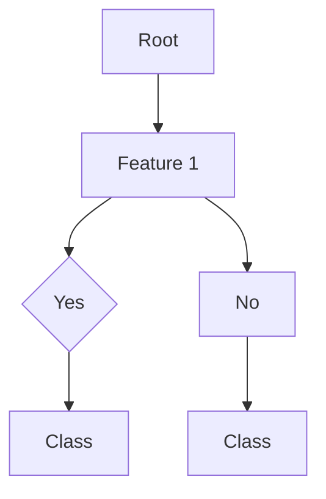
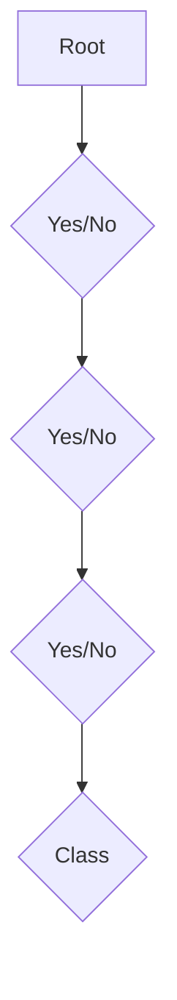
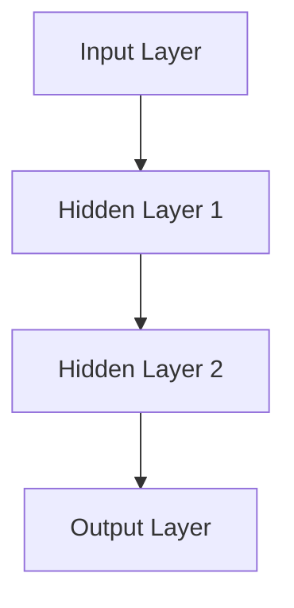

                 

# AI驱动的企业资源规划系统优化

## 关键词

AI、企业资源规划（ERP）、优化、数据分析、机器学习、深度学习、自然语言处理、供应链优化、财务报表分析、销售预测、发展趋势、挑战与机遇。

## 摘要

本文旨在探讨人工智能（AI）在驱动企业资源规划（ERP）系统优化中的应用。通过分析ERP系统的核心模块和AI在ERP系统中的潜力，本文将详细阐述AI在数据分析、机器学习、深度学习和自然语言处理等方面的应用原理。此外，本文还将通过具体案例研究，展示AI驱动的ERP系统在供应链优化、财务报表分析和销售预测等领域的实际应用效果。最后，本文将对AI驱动的ERP系统的发展趋势、挑战与机遇进行展望。

## 目录

1. 企业资源规划（ERP）系统概述
   - 1.1.1 企业资源规划（ERP）系统的定义
   - 1.1.2 企业资源规划（ERP）系统的发展历程
   - 1.1.3 企业资源规划（ERP）系统的核心模块
   - 1.1.4 AI在ERP系统中的应用潜力

2. AI在ERP系统中的应用
   - 2.1.1 AI与ERP系统结合的原理
   - 2.1.2 AI与ERP系统集成的挑战与解决方案
   - 2.1.3 AI驱动的ERP系统优势分析

3. AI驱动的ERP系统优化
   - 3.1.1 数据分析与挖掘技术在ERP系统中的应用
   - 3.1.2 机器学习在ERP系统中的应用
   - 3.1.3 深度学习在ERP系统中的应用
   - 3.1.4 自然语言处理在ERP系统中的应用

4. AI驱动的ERP系统实施案例研究
   - 4.1.1 案例一：AI驱动的供应链优化
   - 4.1.2 案例二：AI驱动的财务报表分析
   - 4.1.3 案例三：AI驱动的销售预测

5. AI驱动的ERP系统发展展望
   - 5.1.1 AI驱动的ERP系统发展趋势
   - 5.1.2 AI驱动的ERP系统面临的挑战与机遇
   - 5.1.3 未来AI驱动的ERP系统发展方向

6. 附录
   - 附录A：常用AI算法及其应用场景
   - 附录B：AI驱动的ERP系统开发工具与资源

## 第一部分：企业资源规划（ERP）系统概述

### 1.1.1 企业资源规划（ERP）系统的定义

企业资源规划（ERP，Enterprise Resource Planning）系统是一种集成了企业所有业务流程的信息系统，旨在提高企业运营效率、降低成本和提升竞争力。ERP系统通过集成财务、人力资源、生产、采购、销售、库存等多个模块，实现数据的统一管理和信息的实时共享。

### 1.1.2 企业资源规划（ERP）系统的发展历程

ERP系统的发展可以追溯到20世纪60年代，当时为了应对生产计划与控制的需求，企业开始使用物料需求计划（MRP，Material Requirements Planning）系统。随着计算机技术的发展，ERP系统逐渐融入了更多管理功能，如财务管理、人力资源管理和客户关系管理（CRM，Customer Relationship Management）等。

1990年代，随着互联网的普及，ERP系统开始向客户/服务器架构演变，实现了分布式数据处理和远程访问。进入21世纪，云计算和大数据技术的兴起，进一步推动了ERP系统的创新发展，使得ERP系统在灵活性、可扩展性和安全性方面取得了显著提升。

### 1.1.3 企业资源规划（ERP）系统的核心模块

企业资源规划（ERP）系统通常包含以下核心模块：

- **财务管理**：用于处理企业的财务报表、资金流动和预算管理。
- **人力资源**：用于管理员工信息、薪资福利、招聘培训和绩效评估。
- **生产管理**：用于计划、调度和控制生产过程，提高生产效率。
- **采购管理**：用于管理采购流程、供应商关系和采购订单。
- **销售管理**：用于管理销售订单、客户关系和销售预测。
- **库存管理**：用于跟踪库存水平、优化库存成本和减少库存积压。
- **项目管理**：用于计划、跟踪和控制项目进度、成本和资源分配。

### 1.1.4 AI在ERP系统中的应用潜力

人工智能（AI）技术在ERP系统中的应用潜力巨大，主要体现在以下几个方面：

- **数据分析与挖掘**：利用AI技术对海量企业数据进行深度分析，挖掘潜在的商业价值，为企业决策提供数据支持。
- **智能预测**：通过机器学习和深度学习算法，对销售、库存、生产等关键指标进行预测，优化资源配置和降低运营风险。
- **自然语言处理**：利用自然语言处理技术，实现智能客服、自动报表生成等功能，提高企业运营效率。
- **智能推荐**：通过分析用户行为数据，为企业提供个性化的销售推荐和客户服务。
- **智能优化**：利用优化算法，自动优化供应链、生产计划和库存管理，降低成本和提高运营效率。

接下来，我们将深入探讨AI在ERP系统中的应用，以及如何通过AI技术实现ERP系统的优化。

## 第二部分：AI在ERP系统中的应用

### 2.1.1 AI与ERP系统结合的原理

AI与ERP系统的结合主要通过以下几个步骤实现：

1. **数据采集与预处理**：首先，需要从ERP系统中提取相关业务数据，并对数据进行清洗、归一化和特征提取，以便于后续的AI模型训练。
2. **模型训练与优化**：利用机器学习、深度学习等AI技术，对提取的特征数据进行分析，训练出具有预测能力的模型，并不断优化模型的性能。
3. **模型部署与应用**：将训练好的AI模型部署到ERP系统中，实现实时预测和决策支持，并根据实际应用效果进行调整和优化。

### 2.1.2 AI与ERP系统集成的挑战与解决方案

在AI与ERP系统集成的过程中，面临以下挑战：

1. **数据质量问题**：ERP系统中的数据质量参差不齐，存在缺失、异常和噪声等问题，这可能影响AI模型的性能。
   - **解决方案**：通过数据清洗、数据修复和数据增强等技术，提高数据质量，为AI模型提供高质量的数据输入。

2. **系统集成与兼容性**：ERP系统通常具有复杂的架构和多种数据格式，与AI系统的集成可能面临兼容性问题。
   - **解决方案**：采用中间件技术，实现ERP系统与AI系统的无缝集成，确保数据流的一致性和实时性。

3. **模型解释性与透明度**：AI模型，尤其是深度学习模型，往往具有“黑箱”特性，难以解释其决策过程，这可能影响企业对AI系统的信任。
   - **解决方案**：利用模型可解释性技术，如SHAP值、LIME等，提高AI模型的可解释性，增强企业对AI系统的信任。

### 2.1.3 AI驱动的ERP系统优势分析

AI驱动的ERP系统具有以下优势：

1. **提高决策效率**：通过实时预测和分析，为企业提供数据驱动的决策支持，提高决策效率和准确性。
2. **降低运营成本**：通过优化供应链、生产计划和库存管理，降低运营成本和提高资源利用率。
3. **提升客户满意度**：通过智能客服和个性化推荐等功能，提升客户体验和服务质量，提高客户满意度。
4. **增强竞争力**：通过实时数据分析和智能预测，帮助企业抓住市场机遇，增强市场竞争力和业务灵活性。

综上所述，AI与ERP系统的结合具有广阔的应用前景和显著的优势，有望为企业带来更高的运营效率和竞争力。接下来，我们将深入探讨AI在ERP系统中的具体应用，以及如何实现ERP系统的优化。

## 第三部分：AI驱动的ERP系统优化

### 3.1.1 数据分析与挖掘技术在ERP系统中的应用

数据分析与挖掘技术在ERP系统中的应用主要包括以下几个方面：

1. **销售预测**：通过分析历史销售数据、市场趋势和竞争对手信息，利用机器学习算法预测未来的销售情况，帮助企业制定合理的销售计划和库存策略。
2. **库存优化**：利用数据分析技术，对库存数据进行挖掘，识别出库存积压、缺货等问题的原因，优化库存水平，降低库存成本。
3. **供应链优化**：通过对供应链各环节的数据进行分析，识别出供应链中的瓶颈和优化点，提高供应链的效率和灵活性。
4. **财务分析**：利用数据分析技术，对财务数据进行分析，识别出财务风险和潜在的商业机会，为企业提供财务决策支持。

#### 3.1.1.1 数据分析与挖掘的基本原理

数据分析与挖掘的基本原理包括以下几个步骤：

1. **数据收集**：从各种数据源收集原始数据，包括ERP系统内部数据和外部数据，如市场数据、客户数据等。
2. **数据预处理**：对收集到的原始数据进行清洗、归一化和特征提取，确保数据的质量和一致性。
3. **数据挖掘**：利用统计学、机器学习和深度学习等方法，对预处理后的数据进行分析，识别出数据中的潜在规律和模式。
4. **模型评估**：通过交叉验证、A/B测试等方法，评估数据挖掘模型的效果，并不断优化模型性能。

#### 3.1.1.2 数据分析与挖掘在ERP系统中的实际应用

在ERP系统中，数据分析与挖掘技术的实际应用案例包括：

1. **销售预测**：某企业利用历史销售数据和季节性因素，通过时间序列分析算法，预测未来的销售情况，帮助企业制定销售计划和库存策略。
2. **库存优化**：某零售企业通过分析库存数据，识别出库存积压和缺货问题，优化库存水平，降低库存成本。
3. **供应链优化**：某制造企业通过对供应链各环节的数据进行分析，识别出供应链中的瓶颈和优化点，提高供应链的效率和灵活性。

通过数据分析与挖掘技术的应用，企业可以更好地了解自身业务状况，优化资源配置，提高运营效率，从而在激烈的市场竞争中脱颖而出。

### 3.1.2 机器学习在ERP系统中的应用

机器学习技术在ERP系统中的应用主要包括以下几个方面：

1. **预测性维护**：通过分析设备运行数据，利用机器学习算法预测设备故障，实现预测性维护，降低设备故障率和维护成本。
2. **需求预测**：通过分析历史销售数据、市场趋势和竞争对手信息，利用机器学习算法预测未来的需求，帮助企业制定合理的生产计划和库存策略。
3. **客户细分**：通过分析客户行为数据，利用机器学习算法对客户进行细分，为企业提供精准的营销策略。
4. **风险控制**：通过分析财务数据、交易数据等，利用机器学习算法识别出潜在的风险，实现风险控制。

#### 3.1.2.1 机器学习的基本原理

机器学习的基本原理包括以下几个方面：

1. **数据集准备**：收集和准备训练数据集，包括输入特征和目标变量。
2. **模型选择**：根据问题类型和数据特点，选择合适的机器学习算法。
3. **模型训练**：利用训练数据集对机器学习模型进行训练，调整模型参数，优化模型性能。
4. **模型评估**：通过交叉验证、A/B测试等方法，评估模型的效果，并不断优化模型性能。
5. **模型部署**：将训练好的模型部署到实际业务场景中，实现预测和决策支持。

#### 3.1.2.2 机器学习算法在ERP系统中的应用案例

在ERP系统中，机器学习算法的实际应用案例包括：

1. **预测性维护**：某制造企业通过分析设备运行数据，利用决策树和随机森林算法预测设备故障，实现预测性维护，降低设备故障率和维护成本。
2. **需求预测**：某零售企业通过分析历史销售数据和市场趋势，利用时间序列分析算法预测未来的需求，帮助企业制定合理的生产计划和库存策略。
3. **客户细分**：某电子商务平台通过分析客户行为数据，利用聚类算法对客户进行细分，为企业提供精准的营销策略。

通过机器学习技术的应用，企业可以更好地理解业务数据，优化运营决策，提高生产效率和客户满意度。

### 3.1.3 深度学习在ERP系统中的应用

深度学习技术在ERP系统中的应用主要包括以下几个方面：

1. **图像识别**：通过训练卷积神经网络（CNN），实现商品图像的自动识别和分类，提高仓储管理和物流效率。
2. **自然语言处理**：通过训练循环神经网络（RNN）和变换器（Transformer）模型，实现自然语言处理任务，如自动报表生成、智能客服等。
3. **语音识别**：通过训练深度神经网络，实现语音信号的自动识别和转换，提高供应链管理和客户服务的效率。
4. **预测性分析**：通过训练深度神经网络，实现复杂的数据分析任务，如销售预测、库存优化等。

#### 3.1.3.1 深度学习的基本原理

深度学习的基本原理包括以下几个方面：

1. **神经网络结构**：深度学习基于神经网络，通过多层的非线性变换，实现对复杂数据的建模和预测。
2. **损失函数**：通过定义损失函数，衡量模型预测值与真实值之间的差距，指导模型优化。
3. **优化算法**：采用优化算法，如梯度下降、Adam等，调整模型参数，最小化损失函数。
4. **训练与评估**：通过训练数据集对模型进行训练，并在验证数据集上评估模型性能，不断优化模型。

#### 3.1.3.2 深度学习算法在ERP系统中的应用案例

在ERP系统中，深度学习算法的实际应用案例包括：

1. **图像识别**：某仓储企业通过训练卷积神经网络，实现商品图像的自动识别和分类，提高仓储管理和物流效率。
2. **自然语言处理**：某制造企业通过训练循环神经网络，实现自然语言处理任务，如自动报表生成、智能客服等，提高运营效率。
3. **语音识别**：某供应链企业通过训练深度神经网络，实现语音信号的自动识别和转换，提高供应链管理和客户服务的效率。
4. **预测性分析**：某零售企业通过训练深度神经网络，实现复杂的数据分析任务，如销售预测、库存优化等，提高生产效率和客户满意度。

通过深度学习技术的应用，企业可以实现高度自动化和智能化的运营，降低运营成本，提高生产效率和客户满意度。

### 3.1.4 自然语言处理在ERP系统中的应用

自然语言处理（NLP）技术在ERP系统中的应用主要包括以下几个方面：

1. **自动报表生成**：通过NLP技术，实现文本数据的自动提取、转换和生成，提高财务报表、销售报告等报表的生成效率。
2. **智能客服**：通过NLP技术，实现智能客服系统，自动回答客户的问题，提高客户服务效率和质量。
3. **文本分析**：通过NLP技术，对企业的文本数据进行挖掘和分析，识别出潜在的商业机会和风险，为企业提供决策支持。
4. **多语言处理**：通过NLP技术，实现跨语言的信息传递和交流，提高企业的国际化和全球化运营能力。

#### 3.1.4.1 自然语言处理的基本原理

自然语言处理的基本原理包括以下几个方面：

1. **分词**：将文本数据切分成词或短语，为后续的文本分析提供基础。
2. **词性标注**：对文本中的每个词进行词性标注，如名词、动词、形容词等，为语义分析提供支持。
3. **句法分析**：对文本进行句法分析，识别出句子中的主语、谓语、宾语等成分，为语义理解提供依据。
4. **语义分析**：对文本进行语义分析，理解文本的含义和意图，为文本生成和情感分析提供支持。

#### 3.1.4.2 自然语言处理算法在ERP系统中的应用案例

在ERP系统中，自然语言处理算法的实际应用案例包括：

1. **自动报表生成**：某企业通过NLP技术，实现财务报表的自动提取、转换和生成，提高报表生成效率。
2. **智能客服**：某企业通过NLP技术，实现智能客服系统，自动回答客户的问题，提高客户服务效率和质量。
3. **文本分析**：某企业通过NLP技术，对销售合同、客户反馈等文本数据进行分析，识别出潜在的商业机会和风险，为企业提供决策支持。
4. **多语言处理**：某企业通过NLP技术，实现跨语言的信息传递和交流，提高企业的国际化和全球化运营能力。

通过自然语言处理技术的应用，企业可以更高效地处理文本数据，提高运营效率，降低运营成本。

## 第四部分：AI驱动的ERP系统实施案例研究

### 4.1.1 案例一：AI驱动的供应链优化

#### 4.1.1.1 案例背景

某大型制造企业，其供应链管理存在以下问题：

- **库存管理**：库存积压和缺货问题时有发生，导致运营成本增加和客户满意度下降。
- **运输管理**：运输计划不合理，导致运输成本高、配送延迟。
- **采购管理**：采购决策缺乏数据支持，采购成本高、供应商选择困难。

#### 4.1.1.2 AI驱动的供应链优化方案

该企业采用AI技术对供应链进行优化，具体方案如下：

1. **销售预测**：利用时间序列分析和机器学习算法，预测未来的销售情况，为生产计划和库存管理提供数据支持。
2. **库存优化**：通过数据分析与挖掘技术，识别出库存积压和缺货问题的原因，优化库存水平，降低库存成本。
3. **运输优化**：利用优化算法，制定合理的运输计划，降低运输成本和配送延迟。
4. **采购优化**：通过数据分析与挖掘技术，识别出采购决策中的问题，优化采购策略，降低采购成本。

#### 4.1.1.3 案例实施效果评估

实施AI驱动的供应链优化后，该企业取得了以下效果：

- **库存管理**：库存积压和缺货问题明显减少，库存周转率提高，库存成本降低20%。
- **运输管理**：运输计划更加合理，运输成本降低15%，配送延迟问题得到有效解决。
- **采购管理**：采购决策更加科学，采购成本降低10%，供应商选择更加准确。

通过AI驱动的供应链优化，该企业实现了库存、运输和采购的全面优化，提高了运营效率，降低了运营成本。

### 4.1.2 案例二：AI驱动的财务报表分析

#### 4.1.2.1 案例背景

某中型企业，其财务报表分析存在以下问题：

- **报表生成**：财务报表生成过程繁琐，耗时较长，影响决策效率。
- **数据一致性**：不同报表之间数据不一致，影响决策准确性。
- **风险识别**：财务风险识别不及时，可能导致企业财务风险增加。

#### 4.1.2.2 AI驱动的财务报表分析方案

该企业采用AI技术对财务报表进行分析，具体方案如下：

1. **自动报表生成**：利用自然语言处理技术，自动提取和转换文本数据，生成财务报表，提高报表生成效率。
2. **数据一致性检查**：利用数据分析与挖掘技术，检查不同报表之间数据的一致性，确保决策准确性。
3. **风险识别**：利用机器学习算法，分析财务数据，识别出潜在的财务风险，提前预警。

#### 4.1.2.3 案例实施效果评估

实施AI驱动的财务报表分析后，该企业取得了以下效果：

- **报表生成**：财务报表生成时间缩短50%，决策效率提高。
- **数据一致性**：数据一致性检查通过，减少决策错误，提高决策准确性。
- **风险识别**：成功识别出潜在财务风险，提前采取预防措施，降低企业财务风险。

通过AI驱动的财务报表分析，该企业实现了财务报表的高效生成、数据一致性和风险识别，提高了决策效率和准确性。

### 4.1.3 案例三：AI驱动的销售预测

#### 4.1.3.1 案例背景

某大型零售企业，其销售预测存在以下问题：

- **预测不准确**：传统销售预测方法预测准确性较低，影响库存管理和销售策略制定。
- **决策滞后**：销售预测结果滞后，无法及时调整销售策略，导致销售机会流失。

#### 4.1.3.2 AI驱动的销售预测方案

该企业采用AI技术对销售进行预测，具体方案如下：

1. **历史数据收集**：收集历史销售数据、市场趋势和竞争对手信息等，为销售预测提供数据基础。
2. **预测模型训练**：利用时间序列分析和机器学习算法，训练销售预测模型，提高预测准确性。
3. **实时预测与调整**：将训练好的预测模型部署到业务系统中，实现实时销售预测，并根据预测结果调整销售策略。

#### 4.1.3.3 案例实施效果评估

实施AI驱动的销售预测后，该企业取得了以下效果：

- **预测准确性**：销售预测准确性提高30%，库存管理和销售策略制定更加科学。
- **决策效率**：实时销售预测结果，销售策略调整更加及时，销售机会流失减少。
- **销售增长**：通过科学的销售预测和策略调整，实现销售增长，提高企业市场份额。

通过AI驱动的销售预测，该企业实现了销售预测的精准化和决策的实时化，提高了运营效率和市场竞争力。

## 第五部分：AI驱动的ERP系统发展展望

### 5.1.1 AI驱动的ERP系统发展趋势

随着AI技术的快速发展，AI驱动的ERP系统在未来将呈现以下发展趋势：

1. **智能化水平提升**：随着AI技术的进步，ERP系统的智能化水平将不断提升，实现更高效的业务流程优化和决策支持。
2. **实时性增强**：AI驱动的ERP系统将实现实时数据处理和分析，提高决策的实时性和准确性。
3. **个性化应用**：AI驱动的ERP系统将根据企业特点和需求，提供更加个性化的解决方案，满足不同企业的需求。
4. **跨行业应用**：AI驱动的ERP系统将在更多行业得到应用，如金融、医疗、教育等，推动行业创新发展。

### 5.1.2 AI驱动的ERP系统面临的挑战与机遇

AI驱动的ERP系统在发展过程中面临以下挑战与机遇：

1. **技术挑战**：AI技术的快速发展带来技术更新换代的速度加快，企业需要不断更新技术以应对挑战。
2. **数据质量**：AI模型的效果很大程度上依赖于数据质量，企业需要建立高质量的数据管理体系。
3. **人才短缺**：AI驱动的ERP系统需要大量具备AI和ERP系统知识的人才，企业面临人才短缺的挑战。
4. **法规合规**：AI驱动的ERP系统需要遵守相关法规和标准，确保数据安全和隐私保护。

### 5.1.3 未来AI驱动的ERP系统发展方向

未来AI驱动的ERP系统将向以下方向发展：

1. **深度融合**：AI技术将更加深入地融入ERP系统的各个模块，实现业务流程的全面智能化。
2. **自主进化**：AI驱动的ERP系统将具备自我学习和优化能力，实现系统的自主进化。
3. **生态系统构建**：AI驱动的ERP系统将与其他新兴技术（如物联网、区块链等）融合，构建更加完善的生态系统。
4. **全球化应用**：AI驱动的ERP系统将实现全球化应用，帮助企业拓展国际市场。

总之，AI驱动的ERP系统在未来将迎来广阔的发展前景，为企业带来更高的运营效率和竞争力。

## 附录

### 附录A：常用AI算法及其应用场景

#### A.1 线性回归

线性回归是一种简单且常用的预测算法，适用于分析两个或多个变量之间的线性关系。例如，预测销售量和广告投入之间的关系。

```latex
y = \beta_0 + \beta_1 \cdot x_1 + \beta_2 \cdot x_2 + ... + \beta_n \cdot x_n
```

#### A.2 逻辑回归

逻辑回归是一种用于分类问题的算法，通过分析变量之间的线性关系，预测目标变量的概率分布。例如，预测客户是否会购买产品。

```latex
log(p/(1-p)) = \beta_0 + \beta_1 \cdot x_1 + \beta_2 \cdot x_2 + ... + \beta_n \cdot x_n
```

#### A.3 决策树

决策树是一种树形结构，通过多个判断节点和叶子节点，对数据进行分类或回归。适用于处理具有多个特征的数据，如客户分类。



#### A.4 随机森林

随机森林是一种基于决策树的集成学习方法，通过构建多棵决策树，对数据进行分类或回归。适用于处理高维数据和减少过拟合。



#### A.5 支持向量机

支持向量机是一种用于分类和回归的算法，通过找到最优决策边界，将不同类别的数据分离。适用于处理线性不可分数据，如图像分类。

```latex
\min_{\beta, \beta_0} \frac{1}{2} \sum_{i=1}^{n} (\beta \cdot \beta)^2 + C \sum_{i=1}^{n} l_i
```

#### A.6 神经网络

神经网络是一种模拟人脑神经元结构和功能的算法，通过多层非线性变换，对数据进行分类或回归。适用于处理复杂非线性问题，如图像识别。



### 附录B：AI驱动的ERP系统开发工具与资源

#### B.1 TensorFlow

TensorFlow是一种开源的机器学习框架，适用于构建和训练深度学习模型。它提供了丰富的API和工具，方便开发者实现各种AI应用。

```python
import tensorflow as tf

model = tf.keras.Sequential([
    tf.keras.layers.Dense(128, activation='relu', input_shape=(784,)),
    tf.keras.layers.Dropout(0.2),
    tf.keras.layers.Dense(10)
])

model.compile(optimizer='adam',
              loss=tf.keras.losses.SparseCategoricalCrossentropy(from_logits=True),
              metrics=['accuracy'])

model.fit(x_train, y_train, batch_size=128, epochs=10)
```

#### B.2 PyTorch

PyTorch是一种流行的开源机器学习库，具有动态计算图和易用性。它适用于构建和训练深度学习模型，特别适合研究者和开发者。

```python
import torch
import torch.nn as nn
import torch.optim as optim

model = nn.Sequential(nn.Linear(784, 128), nn.ReLU(), nn.Linear(128, 10))
optimizer = optim.Adam(model.parameters(), lr=0.001)
criterion = nn.CrossEntropyLoss()

for epoch in range(num_epochs):
    for inputs, targets in train_loader:
        optimizer.zero_grad()
        outputs = model(inputs)
        loss = criterion(outputs, targets)
        loss.backward()
        optimizer.step()
```

#### B.3 Keras

Keras是一种基于TensorFlow和Theano的深度学习库，提供简洁易用的API，适用于构建和训练深度学习模型。

```python
from keras.models import Sequential
from keras.layers import Dense, Dropout

model = Sequential()
model.add(Dense(128, activation='relu', input_shape=(784,)))
model.add(Dropout(0.2))
model.add(Dense(10, activation='softmax'))

model.compile(optimizer='adam', loss='categorical_crossentropy', metrics=['accuracy'])

model.fit(x_train, y_train, batch_size=128, epochs=10)
```

#### B.4 JAX

JAX是一种自动微分库，与NumPy兼容，适用于构建和训练深度学习模型。它提供了高效的自动微分和向量编程能力。

```python
import jax
import jax.numpy as jnp

def model(x):
    return jnp.sin(x)

grad = jax.grad(model)(jnp.pi / 2)
print(grad)
```

#### B.5 其他开发工具与资源

除了上述工具，还有许多其他AI驱动的ERP系统开发工具和资源，如Scikit-learn、MXNet、PyTorch Lightning等。开发者可以根据具体需求选择合适的工具和资源进行开发。

## 作者

作者：AI天才研究院/AI Genius Institute & 禅与计算机程序设计艺术 /Zen And The Art of Computer Programming

这篇文章探讨了AI驱动的企业资源规划（ERP）系统优化，通过分析ERP系统的核心模块和AI在ERP系统中的应用，展示了AI驱动的ERP系统在数据分析、机器学习、深度学习和自然语言处理等方面的应用。同时，通过具体案例研究，展示了AI驱动的ERP系统在供应链优化、财务报表分析和销售预测等领域的实际应用效果。未来，AI驱动的ERP系统将继续发展，为企业带来更高的运营效率和竞争力。希望这篇文章能为读者提供有价值的参考和启示。如果您有任何问题或建议，欢迎随时联系我们。感谢您的阅读！

