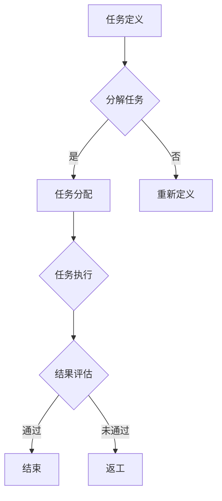

                 

# 《AI驱动的众包：增强创新》

> **关键词：** AI驱动的众包、创新、社会治理、商业应用、平台构建、风险管理

> **摘要：** 本文深入探讨了AI驱动的众包概念、优势及其在各领域的应用。通过对AI在众包中的角色、工作流程、技术优化和实际案例的详细分析，揭示了AI驱动众包如何增强创新。文章旨在为读者提供一份全面的技术指南，以理解AI驱动众包的潜力、挑战与未来发展。

---

## 第一部分: AI驱动的众包概述

### 第1章: 众包的起源与发展

#### 1.1 众包的定义与概念

众包（Crowdsourcing）是一种通过利用广泛公众的智慧、能力和资源来解决问题或完成项目的模式。这个概念最早由Jeff Howe在2006年提出，他将其定义为“通过利用公众的力量来完成一项工作，通常是自愿的、分布式的、开放的任务分配”。众包的核心在于打破传统集中式的工作模式，将任务分散到大量参与者手中，从而实现更高效、更创新的解决方案。

#### 1.2 众包的发展历程

众包的历史可以追溯到更早的年代。例如，维基百科（Wikipedia）的创建标志着开放协作和集体智慧的兴起。而更近一些的例子包括InnoCentive、Topcoder和Gigwalk等平台，它们进一步推动了众包的商业化和专业化。

随着互联网技术的发展，众包逐渐从单纯的创意征集、任务分发，发展到涉及复杂的计算任务、数据分析和人工智能应用等多个领域。近年来，AI技术的崛起为众包注入了新的动力，使得AI驱动的众包成为研究者和实践者关注的焦点。

#### 1.3 AI驱动众包的优势与挑战

AI驱动众包具有多方面的优势。首先，AI技术能够显著提高众包任务的效率和精度。例如，通过自然语言处理技术，AI能够自动解析并分配任务；通过机器学习算法，AI能够实时评估参与者提交的成果，并进行优化。

其次，AI驱动的众包能够实现个性化推荐和智能匹配。AI可以根据参与者的技能、经验和兴趣为其推荐合适的任务，从而提高参与者的积极性和任务完成质量。

然而，AI驱动众包也面临一系列挑战。例如，如何确保众包任务的公平性和透明性？如何防范数据安全和隐私风险？如何激励参与者持续参与，并保持高水平的创造力？这些都是需要深入探讨的问题。

### 第2章: AI在众包中的应用

#### 2.1 AI驱动的众包工作流程

AI驱动的众包工作流程通常包括以下几个步骤：

1. **任务定义与分解**：首先，任务需求方需要明确任务目标，并将其分解为可分发的子任务。
2. **任务分配与发布**：利用AI技术，将任务分配给具有相应技能的参与者，并通过众包平台发布。
3. **任务执行与评估**：参与者完成各自分配的任务，并通过众包平台提交成果。
4. **结果集成与反馈**：AI算法对参与者提交的成果进行集成评估，并根据结果进行反馈。

#### 2.2 AI技术对众包任务的优化

AI技术在众包任务优化中发挥着关键作用。例如，通过机器学习算法，AI可以自动识别和预测任务的最佳解决方案，从而提高任务完成效率。此外，AI还可以利用自然语言处理技术，对任务描述进行语义分析，以更准确地理解任务需求，从而优化任务分配过程。

#### 2.3 众包平台中的AI算法应用实例

在实际应用中，许多众包平台已经开始采用AI技术。例如，GitHub用于协作开发的平台，通过机器学习算法推荐相关的代码片段和改进建议；GitHub Copilot更是通过AI技术，实现了自动代码生成和补全功能。这些应用不仅提高了开发效率，还激发了创新潜力。

## 第二部分: AI驱动的众包案例分析

### 第3章: AI驱动的众包在创新中的应用

#### 3.1 众包创新的概念与模式

AI驱动的众包在创新中的应用，不仅限于解决现有问题，更在于发现和实现新的创新。众包创新通常包括以下几种模式：

1. **创意征集**：通过众包平台，广泛征集创意方案，激发公众的创造力。
2. **协同设计**：利用众包平台，实现不同领域专家的协同工作，共同完成创新项目。
3. **知识共享**：通过众包平台，实现知识的共享和积累，为创新提供丰富的资源。

#### 3.2 AI驱动的众包创新案例解析

一个典型的AI驱动众包创新案例是“挑战赛模式”。例如，Google的“谷歌大脑”项目，通过举办算法挑战赛，吸引了全球顶尖的研究者参与，共同推动人工智能技术的发展。这种模式不仅加速了技术创新，还促进了全球合作与交流。

#### 3.3 创新众包的挑战与解决方案

创新众包面临诸多挑战，如创意保护、知识产权纠纷、参与者激励等。为了解决这些问题，需要从以下几个方面入手：

1. **明确规则和标准**：制定明确的众包规则和标准，确保众包过程的公正和透明。
2. **知识产权保护**：建立知识产权保护机制，激励参与者分享创新成果。
3. **奖励机制设计**：设计合理的奖励机制，激励参与者积极参与创新。

### 第4章: AI驱动的众包在社会治理中的应用

#### 4.1 众包在社会治理中的作用

AI驱动的众包在社会治理中发挥着越来越重要的作用。例如，在公共安全领域，众包平台可以收集和利用公众的实时数据，辅助政府部门进行突发事件预警和应急响应。在环境保护领域，众包平台可以帮助监测环境污染，提高环境治理效率。

#### 4.2 AI驱动的众包在公共安全领域的应用

AI驱动的众包在公共安全领域的应用具有广泛的前景。例如，利用无人机和AI技术，可以实现对大型活动的人流监控，提高安全预警能力。此外，AI驱动的众包还可以用于灾害救援、交通管理等。

#### 4.3 智能社会治理中的众包实践案例

一个典型的实践案例是“温哥华空气污染监测项目”。该项目利用众包平台，收集市民上传的空气质量数据，并通过AI技术进行实时分析，为政府提供决策支持，有效提高了城市环境治理水平。

### 第5章: AI驱动的众包在商业领域中的应用

#### 5.1 众包商业模式创新

AI驱动的众包为商业领域带来了诸多商业模式创新。例如，通过众包平台，企业可以实现灵活的劳动力资源管理，降低人力成本，提高生产效率。此外，AI驱动的众包还可以用于产品创新、市场调研等。

#### 5.2 AI驱动的众包市场分析

随着AI技术的不断成熟，AI驱动的众包市场呈现出快速增长的趋势。根据市场研究报告，全球AI驱动的众包市场规模预计将在未来几年内达到数十亿美元。这一趋势表明，AI驱动的众包具有巨大的商业潜力。

#### 5.3 商业成功案例解析

一个典型的商业成功案例是“Airbnb”。Airbnb通过构建AI驱动的众包平台，实现了全球范围内的住宿资源共享，不仅打破了传统酒店行业的边界，还创造了全新的商业模式。这个案例展示了AI驱动众包在商业创新中的巨大潜力。

## 第三部分: AI驱动的众包实施策略

### 第6章: AI驱动的众包平台构建

#### 6.1 平台构建的基本原则

构建AI驱动的众包平台需要遵循以下基本原则：

1. **开放性**：平台应具备开放接口，支持各种AI算法的集成和应用。
2. **灵活性**：平台应具备高度灵活性，能够根据不同需求进行自定义和扩展。
3. **安全性**：平台应确保数据安全和隐私保护，防止数据泄露和滥用。

#### 6.2 技术架构设计与实现

AI驱动的众包平台的技术架构通常包括以下几个关键模块：

1. **任务管理模块**：负责任务的定义、分配和跟踪。
2. **参与者管理模块**：负责参与者的注册、认证和技能评估。
3. **数据管理模块**：负责数据存储、处理和分析。
4. **AI算法模块**：负责AI算法的调用和优化。

#### 6.3 平台运营与管理策略

AI驱动的众包平台的运营和管理需要综合考虑以下几个方面：

1. **激励机制设计**：设计合理的奖励和激励措施，鼓励参与者积极参与。
2. **质量控制与评估**：建立严格的质量控制机制，确保任务完成质量和数据准确性。
3. **用户服务与支持**：提供高效的用户服务和支持，解决参与者遇到的问题。

### 第7章: AI驱动的众包风险管理

#### 7.1 风险识别与评估

AI驱动的众包面临多种风险，如数据泄露、知识产权纠纷、任务质量不稳定等。风险识别与评估是风险管理的关键步骤。具体包括：

1. **数据安全风险评估**：评估平台数据存储、传输和处理过程中的安全风险。
2. **知识产权风险评估**：评估众包任务中可能涉及的知识产权风险。
3. **任务质量风险评估**：评估参与者完成任务的质量和准确性。

#### 7.2 风险管理与控制措施

针对识别出的风险，可以采取以下管理和控制措施：

1. **数据安全保护措施**：采用加密技术、访问控制等手段，确保数据安全。
2. **知识产权保护措施**：制定知识产权保护策略，明确知识产权归属和使用权。
3. **质量控制措施**：建立质量控制体系，对参与者进行培训和管理，确保任务质量。

#### 7.3 风险管理案例分析

通过分析具体案例，可以更好地理解和应对AI驱动的众包风险。例如，分析某次重大数据泄露事件，了解其发生原因、影响以及应对措施，有助于制定更有效的风险管理策略。

### 第8章: 未来展望与趋势

#### 8.1 AI驱动的众包发展趋势

随着AI技术的不断进步，AI驱动的众包将呈现出以下发展趋势：

1. **智能化**：AI技术将进一步融入众包平台，实现智能任务分配、智能评估和智能推荐。
2. **平台生态化**：AI驱动的众包平台将形成完善的生态体系，包括工具、服务和生态伙伴。
3. **跨界融合**：AI驱动的众包将与其他领域（如物联网、区块链等）融合，实现更广泛的应用。

#### 8.2 创新应用场景预测

未来，AI驱动的众包将在更多领域展现其潜力。例如：

1. **智慧城市建设**：利用AI驱动的众包，实现城市资源优化配置和智慧化管理。
2. **医疗健康**：利用AI驱动的众包，实现大规模医疗数据分析，提升疾病诊断和治疗水平。
3. **教育**：利用AI驱动的众包，实现个性化教育资源和教学模式的创新。

#### 8.3 AI驱动的众包面临的挑战与机遇

AI驱动的众包在未来将面临一系列挑战，如技术瓶颈、法律法规、伦理道德等。但同时也将迎来前所未有的机遇。通过不断创新和探索，AI驱动的众包有望成为推动社会进步的重要力量。

## 附录

### 附录 A: AI驱动的众包相关工具与资源

#### A.1 开源众包平台

1. **Topcoder**：提供编程挑战和竞赛，涵盖算法竞赛、软件开发、设计等。
2. **GitHub**：提供代码托管和协作平台，支持AI驱动的众包开发。
3. **InnoCentive**：提供创新解决方案的众包平台，涵盖科学、工程、商业等领域。

#### A.2 常用AI工具与框架

1. **TensorFlow**：谷歌开源的机器学习框架，支持深度学习和各种AI应用。
2. **PyTorch**：Facebook开源的深度学习框架，易于研究和应用。
3. **Scikit-learn**：Python开源的机器学习库，适用于数据挖掘和统计分析。

#### A.3 AI驱动的众包研究论文与报告

1. **"Crowdsourcing: A Model of the Virtual Production Process"**：详细介绍了众包的生产过程模型。
2. **"AI-Enabled Crowdsourcing for Scientific Research"**：探讨AI驱动的众包在科学研究中的应用。
3. **"The Impact of Crowdsourcing on Innovation"**：分析众包对创新的影响。

### 附录 B: Mermaid流程图与算法伪代码示例

#### B.1 Mermaid流程图示例



#### B.2 AI驱动的众包算法伪代码

```python
# 伪代码：任务分配算法

def assign_tasks(tasks, participants):
    # 初始化任务分配结果
    assignment = {}

    # 遍历所有任务
    for task in tasks:
        # 找到最适合的参与者
        best_participant = None
        highest_score = -1

        for participant in participants:
            # 计算参与者与任务的匹配度
            score = calculate_matching_score(participant, task)

            # 更新最佳参与者
            if score > highest_score:
                highest_score = score
                best_participant = participant

        # 分配任务给最佳参与者
        if best_participant:
            assignment[task] = best_participant

    return assignment

# 伪代码：匹配度计算函数

def calculate_matching_score(participant, task):
    # 计算参与者与任务的匹配度
    score = 0

    # 考虑参与者的技能和经验
    skill_matching = max(0, min(participant.skill_level, task.required_skill_level))
    score += skill_matching

    # 考虑参与者的兴趣
    interest_matching = max(0, min(participant.interest_level, task.interest_level))
    score += interest_matching

    return score
```

---

**作者：** AI天才研究院/AI Genius Institute & 禅与计算机程序设计艺术 /Zen And The Art of Computer Programming

---

本文通过详细的步骤和分析，探讨了AI驱动的众包的原理、优势、应用案例以及未来趋势，旨在为读者提供一份全面的技术指南，以理解AI驱动众包的潜力与挑战。在AI技术的推动下，众包将迎来新的发展机遇，为各领域带来深刻的变革。随着AI技术的不断进步，我们有理由相信，AI驱动的众包将在未来发挥更加重要的作用。

