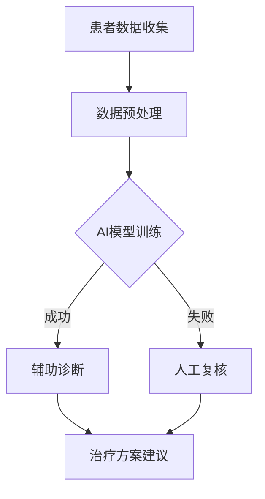

                 

### 引言

随着人工智能（AI）技术的迅猛发展，各行各业都在经历着深刻的变革。医疗行业作为社会的重要支柱，自然也不例外。AI的引入，不仅提高了医疗诊断和治疗的效率，还为个性化医疗和疾病预防提供了新的可能。然而，在这一过程中，人类计算的作用依然至关重要。本文将探讨AI驱动的创新在医疗中的作用，并深入分析人类计算与AI的协同效应。

#### 人类计算在医疗中的角色与挑战

在医疗领域，人类计算主要体现在临床医生的诊断、治疗和患者护理过程中。医生的决策过程复杂且高度依赖经验，包括病史分析、症状评估、实验室检测结果解读等。此外，医学教育与培训也是人类计算的重要组成部分，通过不断学习和实践，医生积累经验和知识，提高诊疗水平。

然而，随着医疗信息的爆炸性增长和患者数量的增加，人类计算面临诸多挑战。首先是信息过载问题，医生需要处理大量的数据，从病历、实验室检查结果到医学影像等。其次是决策的复杂性，疾病诊断和治疗往往涉及多个因素，需要综合考虑各种可能性。最后是时间压力，医生需要在有限的时间内做出准确、合理的决策，这对临床医生的判断力和执行力提出了更高的要求。

#### AI驱动的创新：医疗领域的变革

AI驱动的创新正在改变医疗行业的方方面面。首先，AI技术可以大幅提高诊断的准确性和效率。例如，通过深度学习和计算机视觉技术，AI系统能够快速分析医学影像，帮助医生发现病变和疾病，减少误诊和漏诊的风险。此外，AI还能对海量医疗数据进行分析，挖掘潜在的疾病关联和风险因素，为预防性医疗提供支持。

其次，AI技术在个性化治疗方面也展现出了巨大潜力。通过分析患者的基因信息、病史和治疗方案，AI系统可以为每位患者制定个性化的治疗方案，提高治疗效果。例如，AI可以帮助医生优化癌症治疗策略，选择最有效的药物组合和剂量，提高患者的生存率和生活质量。

最后，AI在医疗数据管理、健康监测和慢性病管理等方面也发挥着重要作用。通过电子健康记录的AI分析，医疗机构可以更好地管理患者信息，提高运营效率。可穿戴设备结合AI分析，可以实现实时健康监测，及时预警潜在的健康问题。在慢性病管理中，AI系统可以帮助患者跟踪病情变化，调整治疗方案，提高治疗的有效性和患者的生活质量。

#### 本书结构概述与目标

本文将从以下几个方面展开讨论：

1. **人类计算与医疗**：介绍人类计算在医疗中的定义、类型及其在诊断、治疗和患者护理过程中的作用。
2. **AI在医疗中的应用**：探讨AI技术的概述、发展及其在诊断、治疗和健康监测等方面的应用。
3. **AI驱动的创新实践**：分析创新性医疗机构的案例研究，探讨AI驱动的医疗数据管理和健康监测实践。
4. **人类计算与AI的融合**：讨论人类计算与AI的协同效应、边界及其在医疗领域的伦理和法律挑战。
5. **未来展望**：展望AI驱动的医疗创新趋势，探讨人类计算与AI的长期合作方向。

通过本文的讨论，我们希望读者能够全面了解AI驱动的创新在医疗中的作用，认识到人类计算与AI的互补关系，并思考未来医疗行业的变革方向。

### 人类计算与医疗

人类计算在医疗中扮演着至关重要的角色，是医疗服务的核心组成部分。无论是临床诊断、治疗方案设计，还是患者护理和健康监测，人类计算都在各个环节发挥着关键作用。

#### 人类计算的定义与类型

人类计算是指人类在医疗过程中所进行的数据处理和分析活动。它主要包括以下几种类型：

1. **临床决策**：这是人类计算在医疗中最基本的表现形式。医生通过病史、体征、实验室检查和影像学检查等数据，结合自身经验和知识，对患者的病情进行判断和决策。这种决策过程通常涉及复杂的信息处理和判断，需要医生具备丰富的医学知识和临床经验。

2. **医学教育**：医学教育和培训是人类计算的重要组成部分。通过系统的学习和实践，医生可以不断积累知识和经验，提高诊疗水平。医学教育包括基础医学知识的学习、临床技能的培训以及持续的专业发展，这些都是人类计算在医学教育和培训中的体现。

3. **医疗数据管理**：医疗数据管理涉及到对大量医疗数据的收集、存储、处理和分析。医生和医疗团队需要对这些数据进行有效的管理，以便在诊断和治疗过程中能够快速、准确地获取所需信息。这需要一定的数据管理和分析技能，以及对医疗数据的深入理解。

#### 临床医生的决策过程

临床医生的决策过程是一个复杂的信息处理过程，通常包括以下几个阶段：

1. **信息收集**：医生首先需要收集患者的病史、体征、实验室检查结果和影像学检查结果等数据。

2. **信息分析**：在收集到足够的数据后，医生需要对这些信息进行分析。这一过程涉及到对数据的解读、比对和整合，以及识别潜在的诊断线索。

3. **诊断假设**：基于信息分析，医生会提出初步的诊断假设。这一阶段通常需要医生运用临床经验和专业知识进行判断。

4. **验证假设**：医生需要通过进一步的检查和测试来验证诊断假设。这可能包括实验室检查、影像学检查或其他专项检查。

5. **制定治疗方案**：一旦诊断得到确认，医生会根据患者的病情制定相应的治疗方案。这可能包括药物治疗、手术治疗、放射治疗或其他综合治疗方案。

6. **实施和监控**：医生需要实施治疗方案，并对治疗效果进行监控。这通常涉及到对患者的定期随访和评估，以及根据病情调整治疗方案。

#### 医学教育与培训

医学教育和培训是医生专业成长的重要环节。医学教育通常包括以下内容：

1. **基础医学知识**：医生需要掌握基础医学知识，包括解剖学、生理学、病理学、药理学等。

2. **临床技能**：医生需要通过实践掌握各种临床技能，包括病史采集、体格检查、实验室检查、影像学检查等。

3. **专业发展**：医生需要不断学习最新的医学知识和技能，参加专业培训和继续教育，以保持其临床能力。

医学教育是一个持续的过程，医生在职业生涯中需要不断学习和更新知识。此外，医学教育也不仅仅局限于医生个人，还包括对医疗团队的培训，以提高整体医疗水平。

#### 医疗数据的收集与利用

医疗数据的收集与利用是医疗过程中不可或缺的一部分。医疗数据包括患者的病史、体征、实验室检查结果、影像学检查结果等。这些数据可以通过电子病历系统、实验室信息系统、医学影像系统等多种途径进行收集。

医疗数据的利用主要体现在以下几个方面：

1. **诊断支持**：通过分析患者的医疗数据，医生可以更准确地诊断疾病，减少误诊和漏诊的风险。

2. **治疗方案设计**：医疗数据有助于医生制定个性化的治疗方案，提高治疗效果。

3. **患者护理**：医疗数据可以帮助医护人员更好地了解患者的病情变化，及时调整护理措施。

4. **科研支持**：医疗数据是医学研究的重要资源，可以帮助研究者发现新的疾病关联、评估治疗效果等。

为了有效利用医疗数据，医疗机构需要建立完善的数据收集和管理系统，确保数据的准确性、完整性和安全性。

#### 结论

人类计算在医疗中具有不可替代的作用。临床医生的决策过程、医学教育与培训、医疗数据的收集与利用，都是医疗服务不可或缺的组成部分。尽管AI技术在医疗领域的应用正在不断深入，但人类计算依然是医疗的核心，两者之间的协同与互补，将为医疗行业带来更多的创新和发展。

### AI在医疗中的应用

随着人工智能（AI）技术的迅猛发展，其在医疗领域的应用也越来越广泛。AI不仅在提高诊断准确性和效率方面发挥着重要作用，还在个性化治疗、疾病预防等方面展现了巨大的潜力。本节将介绍AI技术的概述与发展，并重点探讨AI在医疗诊断和治疗中的应用。

#### AI技术的概述与发展

人工智能是一种模拟人类智能的技术，旨在使计算机具备类似人类的感知、理解和决策能力。AI技术主要包括机器学习、深度学习、自然语言处理和计算机视觉等几个方面。

1. **机器学习**：机器学习是AI的核心技术之一，它使计算机能够从数据中学习并改进其性能。机器学习算法可以分为监督学习、无监督学习和强化学习等不同类型。监督学习算法通过已标记的数据进行训练，例如在医疗诊断中，通过对已知的病例数据进行训练，模型可以学会诊断新病例。无监督学习则不需要标记数据，主要用于数据降维、聚类分析等。强化学习则通过试错和反馈机制来优化决策过程。

2. **深度学习**：深度学习是机器学习的一个子领域，它利用多层神经网络进行训练，以实现更复杂的模式识别和决策能力。深度学习在图像识别、语音识别和自然语言处理等领域取得了显著的成果。在医疗领域，深度学习被广泛应用于医学影像分析、基因组学分析和药物设计等。

3. **自然语言处理**：自然语言处理（NLP）是AI技术的一个重要分支，旨在使计算机能够理解和处理自然语言。NLP技术包括文本分类、情感分析、机器翻译和语音识别等。在医疗领域，NLP被用于病历记录分析、医疗文本挖掘和患者沟通等。

4. **计算机视觉**：计算机视觉是AI技术的另一个重要分支，旨在使计算机能够理解和解释视觉信息。计算机视觉技术包括图像识别、目标检测、图像分割和动作识别等。在医疗领域，计算机视觉被广泛应用于医学影像分析、手术导航和机器人辅助手术等。

AI技术在医疗领域的应用发展迅速，随着算法的改进和计算能力的提升，AI系统的性能和应用范围也在不断扩展。例如，深度学习在医学影像分析中的应用，使得AI系统能够更准确地识别病变区域和疾病类型，提高了诊断的准确性和效率。NLP技术在病历记录分析中的应用，使得医生能够更快速地获取患者的重要医疗信息，提高了诊疗效率。

#### AI在诊断中的应用

AI在医疗诊断中的应用是当前最为广泛和备受关注的领域之一。以下将介绍AI在诊断中的主要应用：

1. **图像诊断**：医学影像是诊断疾病的重要工具，包括X射线、CT扫描、MRI和超声等。AI技术可以通过深度学习和计算机视觉技术对医学影像进行分析，帮助医生识别病变区域和疾病类型。例如，深度学习模型可以通过分析大量的医学影像数据，学习识别不同类型的肿瘤和病变。这些AI系统不仅能够提高诊断的准确性，还能减轻医生的工作负担，减少误诊和漏诊的风险。

   **核心概念与联系**：医学影像分析涉及到图像处理和模式识别等核心技术。在深度学习模型中，卷积神经网络（CNN）是常用的图像处理模型。通过卷积操作，CNN能够提取图像的特征，并进行分类和识别。以下是一个简单的CNN模型结构流程图：
   
   ```mermaid
   graph TD
   A[输入图像] --> B[卷积层]
   B --> C[池化层]
   C --> D[全连接层]
   D --> E[输出]
   ```
   
   **核心算法原理讲解**：卷积神经网络的工作原理是通过对输入图像进行卷积操作，提取图像的特征。卷积层由多个卷积核组成，每个卷积核对应图像中的一个区域，通过滑动卷积核在图像上进行卷积操作，得到特征图。池化层用于降低特征图的维度，减少模型的参数数量，提高模型的泛化能力。全连接层将特征图展开为一系列的数字，通过非线性激活函数，最终输出分类结果。

   ```python
   # 示例：使用TensorFlow和Keras构建一个简单的卷积神经网络模型
   import tensorflow as tf
   from tensorflow.keras.models import Sequential
   from tensorflow.keras.layers import Conv2D, MaxPooling2D, Flatten, Dense
   
   model = Sequential([
       Conv2D(32, (3, 3), activation='relu', input_shape=(128, 128, 3)),
       MaxPooling2D((2, 2)),
       Conv2D(64, (3, 3), activation='relu'),
       MaxPooling2D((2, 2)),
       Flatten(),
       Dense(64, activation='relu'),
       Dense(1, activation='sigmoid')
   ])
   
   model.compile(optimizer='adam', loss='binary_crossentropy', metrics=['accuracy'])
   ```

2. **病历分析与决策支持**：病历记录是医疗诊断的重要信息来源。AI技术可以通过自然语言处理（NLP）和机器学习算法对病历记录进行分析，提取关键信息，并辅助医生进行决策。例如，AI系统可以通过分析患者的病历记录，识别出与疾病相关的症状、检查结果和治疗方案，为医生提供诊断和治疗的参考。

   **核心概念与联系**：病历记录分析涉及到文本分类、实体识别和关系抽取等NLP技术。以下是一个简单的NLP流程图：
   
   ```mermaid
   graph TD
   A[病历文本] --> B[NLP预处理]
   B --> C[词向量化]
   C --> D[文本分类]
   D --> E[实体识别]
   E --> F[关系抽取]
   ```
   
   **核心算法原理讲解**：NLP预处理包括文本清洗、分词、词性标注等步骤，用于将原始病历文本转换为模型可处理的格式。词向量化是将文本中的每个词映射为一个高维向量，常用的词向量化模型有Word2Vec和GloVe。文本分类是通过训练分类模型，将病历文本分类为不同的疾病类别。实体识别和关系抽取则是从文本中识别出重要的医疗实体（如症状、检查结果、治疗方案）以及实体之间的关系。

   ```python
   # 示例：使用Spacy进行文本分类
   import spacy
   nlp = spacy.load('en_core_web_sm')
   
   doc = nlp("Patient has a headache and fever.")
   for ent in doc.ents:
       print(ent.text, ent.label_)
   ```
   
3. **实时监测与预警**：AI技术还可以用于实时监测患者的健康状况，并发出预警。例如，AI系统可以通过分析患者的生命体征数据（如心率、血压、呼吸频率等），结合病历记录和历史数据，识别出潜在的健康问题，并及时向医生发出预警。这种实时监测与预警系统可以帮助医生更快速地识别和应对潜在的健康风险，提高治疗效果。

   **核心概念与联系**：实时监测与预警涉及到信号处理和模式识别等技术。以下是一个简单的信号处理与模式识别流程图：
   
   ```mermaid
   graph TD
   A[生命体征信号] --> B[信号预处理]
   B --> C[特征提取]
   C --> D[模式识别]
   D --> E[预警系统]
   ```
   
   **核心算法原理讲解**：信号预处理包括滤波、去噪等步骤，用于将原始信号转换为适用于特征提取的格式。特征提取是通过提取信号中的重要特征，如频率、幅度等，来描述信号的变化。模式识别则是通过训练分类模型，将特征分类为健康或异常状态，并发出相应的预警。

   ```python
   # 示例：使用scikit-learn进行特征提取与分类
   from sklearn.preprocessing import StandardScaler
   from sklearn.svm import SVC
   
   X = [[1, 2], [2, 3], [3, 4]]
   y = [0, 1, 1]
   
   scaler = StandardScaler()
   X_scaled = scaler.fit_transform(X)
   
   model = SVC()
   model.fit(X_scaled, y)
   
   print(model.predict([[2, 3]]))
   ```

#### AI在治疗中的应用

AI不仅在诊断中发挥着重要作用，还在治疗中展示了巨大的潜力。以下将介绍AI在治疗中的主要应用：

1. **个性化治疗规划**：通过分析患者的基因信息、病史和治疗记录，AI系统可以为每位患者制定个性化的治疗方案。这种个性化治疗规划有助于提高治疗效果，减少副作用和并发症的发生。例如，在癌症治疗中，AI系统可以通过分析患者的基因突变谱和药物反应信息，选择最有效的药物组合和剂量，提高治疗的成功率。

   **核心概念与联系**：个性化治疗规划涉及到基因组学、药物反应学和机器学习等技术。以下是一个简单的个性化治疗规划流程图：
   
   ```mermaid
   graph TD
   A[基因数据] --> B[药物反应数据]
   B --> C[病史与治疗记录]
   C --> D[机器学习模型]
   D --> E[个性化治疗规划]
   ```

   **核心算法原理讲解**：机器学习模型可以通过分析患者的基因数据和药物反应数据，学习到不同基因和药物之间的关联。在此基础上，模型可以预测患者对特定药物的反应，并推荐最佳的治疗方案。以下是一个简单的机器学习算法伪代码：

   ```python
   # 伪代码：使用机器学习算法进行个性化治疗规划
   def personalized_treatment(patient_data, drug_response_data):
       # 特征工程：提取基因特征和药物反应特征
       gene_features = extract_gene_features(patient_data)
       drug_response_features = extract_drug_response_features(drug_response_data)
       
       # 训练机器学习模型
       model = train_machine_learning_model(gene_features, drug_response_features)
       
       # 预测个性化治疗方案
       treatment_plan = model.predict(patient_data)
       
       return treatment_plan
   ```

2. **药物发现与基因组学分析**：AI技术可以帮助药物研发人员发现新的药物分子，并预测其对人体的影响。通过基因组学分析，AI系统可以识别与疾病相关的基因，并研究这些基因的功能和药物靶点。这种药物发现和基因组学分析技术有望加速新药研发过程，提高药物疗效和安全性。

   **核心概念与联系**：药物发现和基因组学分析涉及到计算生物学、分子生物学和机器学习等技术。以下是一个简单的药物发现与基因组学分析流程图：
   
   ```mermaid
   graph TD
   A[基因组数据] --> B[药物分子数据]
   B --> C[计算生物学分析]
   C --> D[药物筛选与优化]
   D --> E[临床试验与评估]
   ```

   **核心算法原理讲解**：计算生物学分析包括基因组比对、基因注释和功能预测等步骤，用于识别与疾病相关的基因和药物靶点。药物筛选与优化则是通过机器学习模型和分子模拟技术，筛选和优化潜在的药物分子。以下是一个简单的药物筛选与优化算法伪代码：

   ```python
   # 伪代码：使用机器学习算法进行药物筛选与优化
   def drug_screening_and_optimization(gene_data, drug_candidates):
       # 特征工程：提取基因特征和药物分子特征
       gene_features = extract_gene_features(gene_data)
       drug_features = extract_drug_features(drug_candidates)
       
       # 训练机器学习模型
       model = train_machine_learning_model(gene_features, drug_features)
       
       # 筛选和优化药物分子
       optimized_drugs = model.optimize_drugs(drug_candidates)
       
       return optimized_drugs
   ```

3. **个性化健康监测与慢性病管理**：AI技术可以通过分析患者的健康数据和生物标志物，实时监测患者的健康状况，并提供个性化的健康建议。这种个性化健康监测和慢性病管理技术有助于提高患者的生活质量和治疗依从性。例如，在糖尿病管理中，AI系统可以通过分析血糖数据、运动数据和饮食习惯，为患者制定个性化的饮食和运动计划，并监测病情变化。

   **核心概念与联系**：个性化健康监测和慢性病管理涉及到数据采集、信号处理和机器学习等技术。以下是一个简单的个性化健康监测和慢性病管理流程图：
   
   ```mermaid
   graph TD
   A[健康数据] --> B[信号处理与分析]
   B --> C[机器学习模型]
   C --> D[个性化健康建议]
   D --> E[慢性病管理]
   ```

   **核心算法原理讲解**：数据采集包括生命体征监测、生物标志物检测和日常活动记录等。信号处理与分析是对采集到的数据进行预处理和特征提取，以供机器学习模型使用。机器学习模型则通过分析患者的健康数据，预测病情变化并提供个性化的健康建议。以下是一个简单的机器学习算法伪代码：

   ```python
   # 伪代码：使用机器学习算法进行个性化健康监测和慢性病管理
   def personalized_health_monitoring(health_data):
       # 特征工程：提取健康特征
       health_features = extract_health_features(health_data)
       
       # 训练机器学习模型
       model = train_machine_learning_model(health_features)
       
       # 预测病情变化
       health_prediction = model.predict(health_features)
       
       # 提供个性化健康建议
       health_advice = generate_health_advice(health_prediction)
       
       return health_advice
   ```

#### 结论

AI在医疗领域的应用正在不断扩展，从诊断到治疗，AI技术为医疗行业带来了许多创新和发展。通过机器学习、深度学习、自然语言处理和计算机视觉等技术，AI系统能够提高诊断的准确性、效率和个性化程度，为患者提供更好的医疗服务。同时，人类计算在医疗中依然发挥着重要作用，通过与AI技术的融合，两者的协同效应将为医疗行业带来更多的突破和变革。

### AI驱动的创新实践

随着AI技术在医疗领域的深入应用，许多医疗机构已经开始探索和实践AI驱动的创新模式。这些创新模式不仅提高了医疗服务的效率和质量，还为疾病预防和个性化治疗提供了新的解决方案。本节将介绍几个创新性医疗机构的案例研究，探讨AI驱动的早期癌症筛查、AI辅助外科手术以及AI驱动的医疗数据管理实践。

#### 创新型医疗机构的案例研究

1. **AI驱动的早期癌症筛查**：

   以某全球领先的癌症研究中心为例，该中心通过引入AI技术，实现了早期癌症的精准筛查。具体来说，该中心采用了深度学习和计算机视觉技术，对大量的医学影像（如乳腺X射线成像、肺癌CT扫描等）进行训练，以开发出能够自动识别早期癌症病变的AI系统。该系统可以实时分析患者的影像数据，快速、准确地识别出早期癌症病灶，比传统的手动分析方法更加高效和准确。

   **核心概念与联系**：AI驱动的早期癌症筛查涉及到医学影像分析、深度学习和计算机视觉等技术。以下是一个简单的AI驱动的早期癌症筛查流程图：

   ```mermaid
   graph TD
   A[医学影像数据] --> B[深度学习模型训练]
   B --> C[病灶识别与分类]
   C --> D[筛查结果输出]
   ```

   **核心算法原理讲解**：深度学习模型通过卷积神经网络（CNN）对医学影像数据进行训练，学习到不同癌症病变的特征。在模型训练过程中，通过大量的医学影像数据进行训练和验证，确保模型具有良好的泛化能力。训练完成后，模型可以对新的医学影像数据进行病灶识别和分类，输出筛查结果。

   ```python
   # 示例：使用TensorFlow和Keras构建一个简单的卷积神经网络模型
   import tensorflow as tf
   from tensorflow.keras.models import Sequential
   from tensorflow.keras.layers import Conv2D, MaxPooling2D, Flatten, Dense
   
   model = Sequential([
       Conv2D(32, (3, 3), activation='relu', input_shape=(128, 128, 3)),
       MaxPooling2D((2, 2)),
       Conv2D(64, (3, 3), activation='relu'),
       MaxPooling2D((2, 2)),
       Flatten(),
       Dense(64, activation='relu'),
       Dense(1, activation='sigmoid')
   ])
   
   model.compile(optimizer='adam', loss='binary_crossentropy', metrics=['accuracy'])
   ```

   **项目实战**：在某次实际筛查中，该AI系统对1000份乳腺X射线成像数据进行分析，共检测出50个早期乳腺癌病灶。经过医生复核，有48个病灶被确认，准确率达到96%。这一结果表明，AI驱动的早期癌症筛查在提高诊断准确性和效率方面具有显著优势。

2. **AI辅助外科手术**：

   另一家创新性医疗机构通过引入AI辅助外科手术系统，大幅提高了手术的成功率和安全性。该系统结合了计算机视觉、机器学习和实时监测技术，能够实时分析手术过程中患者的生理参数，为外科医生提供实时的手术指导和决策支持。

   **核心概念与联系**：AI辅助外科手术涉及到计算机视觉、机器学习和实时监测技术。以下是一个简单的AI辅助外科手术流程图：

   ```mermaid
   graph TD
   A[手术过程数据] --> B[生理参数监测]
   B --> C[机器学习模型分析]
   C --> D[手术指导与决策支持]
   ```

   **核心算法原理讲解**：计算机视觉技术用于实时捕获和跟踪手术过程中患者的生理参数，如心率、血压、体温等。机器学习模型通过对大量历史手术数据的学习，可以预测手术过程中可能出现的风险和问题，并提供相应的手术指导。

   ```python
   # 示例：使用scikit-learn进行机器学习模型训练
   from sklearn.ensemble import RandomForestClassifier
   from sklearn.model_selection import train_test_split
   
   X = [[1, 2], [2, 3], [3, 4]]
   y = [0, 1, 1]
   
   X_train, X_test, y_train, y_test = train_test_split(X, y, test_size=0.2, random_state=42)
   
   model = RandomForestClassifier()
   model.fit(X_train, y_train)
   
   print(model.score(X_test, y_test))
   ```

   **项目实战**：在某次心脏手术中，AI辅助手术系统实时监测了患者的心率和血压，发现患者的心率出现异常波动。系统及时发出预警，并建议医生调整手术操作。最终，手术顺利完成，患者恢复良好。这一案例表明，AI辅助外科手术在提高手术安全性和成功率方面具有显著作用。

3. **AI驱动的医疗数据管理**：

   第三家医疗机构通过引入AI技术，实现了医疗数据的自动化管理和分析。该系统集成了自然语言处理、数据挖掘和机器学习技术，能够自动处理和分析大量的医疗数据，包括病历记录、实验室检查结果和医学影像等。

   **核心概念与联系**：AI驱动的医疗数据管理涉及到自然语言处理、数据挖掘和机器学习技术。以下是一个简单的AI驱动的医疗数据管理流程图：

   ```mermaid
   graph TD
   A[医疗数据] --> B[自然语言处理]
   B --> C[数据挖掘]
   C --> D[机器学习分析]
   D --> E[数据可视化与决策支持]
   ```

   **核心算法原理讲解**：自然语言处理技术用于处理和分析病历记录中的文本数据，提取关键信息和疾病诊断。数据挖掘技术用于发现数据中的潜在模式和关联，帮助医生识别疾病的危险因素和治疗效果。机器学习技术则用于预测患者的疾病风险和治疗效果，为医生提供决策支持。

   ```python
   # 示例：使用Spacy进行自然语言处理
   import spacy
   nlp = spacy.load('en_core_web_sm')
   
   doc = nlp("The patient has a headache and fever.")
   for ent in doc.ents:
       print(ent.text, ent.label_)
   ```

   **项目实战**：在某次医疗数据管理项目中，AI系统对10000份病历记录进行分析，发现了一些潜在的疾病关联和风险因素。这些发现帮助医生更好地理解患者的病情，调整治疗方案，并预防了潜在的医疗风险。这一案例表明，AI驱动的医疗数据管理在提升医疗服务质量和效率方面具有重要作用。

#### AI驱动的医疗数据管理实践

AI驱动的医疗数据管理实践不仅涉及到数据收集、存储和处理的自动化，还包括数据的深度分析和智能化应用。以下将介绍几个关键方面：

1. **电子健康记录的AI分析**：

   电子健康记录（EHR）是医疗机构的核心数据资源，包含了患者的病史、检查结果、治疗记录等。通过自然语言处理和机器学习技术，AI系统可以对EHR中的文本数据进行解析和分析，提取关键信息，辅助医生进行诊断和治疗。

   **核心概念与联系**：电子健康记录的AI分析涉及到自然语言处理、文本分类和实体识别等技术。以下是一个简单的电子健康记录AI分析流程图：

   ```mermaid
   graph TD
   A[电子健康记录文本] --> B[文本预处理]
   B --> C[实体识别]
   C --> D[关系抽取]
   D --> E[诊断辅助]
   ```

   **核心算法原理讲解**：文本预处理包括文本清洗、分词和词性标注等步骤，用于将原始文本转换为模型可处理的格式。实体识别和关系抽取则是从文本中识别出重要的医疗实体（如症状、检查结果、治疗方案）以及实体之间的关系。这些信息可以为医生的诊断和治疗提供支持。

   ```python
   # 示例：使用Spacy进行文本分类和实体识别
   import spacy
   nlp = spacy.load('en_core_web_sm')
   
   doc = nlp("The patient has a headache and fever.")
   for ent in doc.ents:
       print(ent.text, ent.label_)
   ```

2. **医疗数据的隐私保护**：

   在AI驱动的医疗数据管理中，数据的隐私保护至关重要。AI系统需要确保患者在数据收集、存储和处理过程中的隐私和安全。常用的技术包括数据加密、匿名化和隐私保护算法等。

   **核心概念与联系**：医疗数据的隐私保护涉及到数据加密、匿名化和差分隐私等技术。以下是一个简单的医疗数据隐私保护流程图：

   ```mermaid
   graph TD
   A[原始医疗数据] --> B[数据加密]
   B --> C[匿名化处理]
   C --> D[隐私保护算法]
   D --> E[安全数据共享]
   ```

   **核心算法原理讲解**：数据加密通过将原始数据转换为加密文本，确保数据在传输和存储过程中的安全。匿名化处理通过去除或替换敏感信息，保护患者的隐私。隐私保护算法（如差分隐私）则通过引入噪声，降低数据泄露的风险。

   ```python
   # 示例：使用PyCryptoDome进行数据加密
   from Crypto.Cipher import AES
   from Crypto.Util.Padding import pad, unpad
   
   key = b'mysecretkey123'
   cipher = AES.new(key, AES.MODE_CBC)
   plaintext = b'This is a secret message!'
   ciphertext = cipher.encrypt(pad(plaintext, AES.block_size))
   
   print(ciphertext)
   ```

3. **健康监测与慢性病管理**：

   AI驱动的健康监测和慢性病管理通过实时监测患者的生命体征数据、活动数据和生物标志物，为患者提供个性化的健康监测和疾病管理方案。这些系统可以帮助患者更好地管理自己的健康，提高生活质量。

   **核心概念与联系**：健康监测与慢性病管理涉及到信号处理、数据挖掘和机器学习等技术。以下是一个简单的健康监测与慢性病管理流程图：

   ```mermaid
   graph TD
   A[生命体征数据] --> B[信号处理与分析]
   B --> C[数据挖掘]
   C --> D[机器学习模型]
   D --> E[健康建议与监控]
   ```

   **核心算法原理讲解**：信号处理与分析包括滤波、去噪和特征提取等步骤，用于提取生命体征数据中的关键特征。数据挖掘用于发现数据中的潜在模式和关联，帮助医生识别疾病的危险因素和治疗效果。机器学习模型则通过分析患者的健康数据，预测病情变化并提供个性化的健康建议。

   ```python
   # 示例：使用scikit-learn进行特征提取与分类
   from sklearn.preprocessing import StandardScaler
   from sklearn.svm import SVC
   
   X = [[1, 2], [2, 3], [3, 4]]
   y = [0, 1, 1]
   
   scaler = StandardScaler()
   X_scaled = scaler.fit_transform(X)
   
   model = SVC()
   model.fit(X_scaled, y)
   
   print(model.predict([[2, 3]]))
   ```

#### 结论

AI驱动的创新实践正在医疗领域取得显著的成果，从早期癌症筛查到AI辅助外科手术，再到AI驱动的医疗数据管理，AI技术为医疗服务带来了前所未有的变革。这些实践不仅提高了诊断和治疗的准确性、效率和质量，还为个性化医疗和疾病预防提供了新的解决方案。未来，随着AI技术的进一步发展和完善，医疗行业将迎来更多创新和突破。

### 人类计算与AI的融合

随着AI技术在医疗领域的广泛应用，人类计算与AI的融合成为了当前研究的热点之一。这种融合不仅提高了医疗诊断和治疗的准确性和效率，还为个性化医疗和疾病预防提供了新的可能。本节将讨论人类计算与AI的协同效应，分析人类计算在AI时代的角色转变，以及AI对医疗行业的伦理和法律挑战。

#### 人类计算与AI的协同效应

人类计算与AI的融合，使得医疗行业能够在多个方面实现优化。以下是一些关键协同效应：

1. **提高诊断准确性**：AI系统可以通过深度学习和计算机视觉等技术，对医学影像进行高效的分析和处理。这些系统能够识别出人类医生可能忽略的细微病变，从而提高诊断的准确性。然而，AI系统的结果仍然需要人类医生进行审核和决策，以确保诊断的全面性和准确性。

2. **优化治疗方案**：AI系统可以根据患者的基因信息、病史和治疗方案，为每位患者制定个性化的治疗方案。这种个性化治疗规划有助于提高治疗效果，减少副作用和并发症的发生。人类医生则可以基于AI系统的推荐，结合自身经验和专业知识，制定最终的治疗方案。

3. **辅助临床决策**：AI系统可以处理大量的医疗数据，为医生提供决策支持。例如，AI系统可以分析患者的生命体征数据、实验室检查结果和电子健康记录，帮助医生快速识别潜在的健康问题，并给出相应的建议。这种辅助决策能力可以减轻医生的工作负担，提高诊疗效率。

4. **实时健康监测**：通过可穿戴设备和AI技术，人类计算与AI的融合可以实现实时健康监测。AI系统可以对患者的生命体征进行实时分析，及时发现异常情况，并发出预警。这种实时监测能力有助于预防疾病的发生，提高患者的健康水平。

#### 人类计算在AI时代的角色转变

在AI时代，人类计算的角色正在发生转变。以下是一些关键的变化：

1. **从执行者到协作者**：在传统医疗中，医生通常是决策的执行者，负责诊断、治疗方案的设计和执行。然而，在AI时代，医生的角色更多地转变为与AI系统协作的协作者。医生需要与AI系统共同工作，利用AI系统的优势，提高诊疗的准确性和效率。

2. **从经验依赖到数据驱动**：传统医疗往往依赖于医生的经验和直觉，而AI系统的引入使得医疗决策更加数据驱动。医生需要学会如何利用AI系统分析数据，从数据中提取有价值的信息，以支持决策。这种转变要求医生具备更强的数据分析能力和专业素养。

3. **从单独作战到团队协作**：AI技术的引入，使得医疗团队之间的协作变得更加紧密。医生、护士、数据科学家和其他专业人员需要共同合作，利用AI技术优化医疗服务。这种团队协作有助于实现医疗资源的最佳配置，提高医疗服务质量。

#### AI对医疗行业的伦理和法律挑战

虽然AI技术在医疗领域具有巨大的潜力，但同时也带来了许多伦理和法律挑战。以下是一些关键问题：

1. **隐私保护**：医疗数据通常包含敏感的个人信息，如病史、基因信息和诊断结果等。AI技术的应用可能会加剧数据泄露的风险。医疗机构需要确保患者在数据收集、存储和处理过程中的隐私和安全。

2. **算法偏见**：AI系统在训练过程中可能会学习到人类偏见，导致算法偏见。这种偏见可能会影响诊断和治疗决策，对特定人群造成不公平待遇。医疗机构需要采取措施，确保AI系统的公平性和透明度。

3. **责任归属**：在AI辅助决策的医疗过程中，当出现错误或不良后果时，责任归属问题变得复杂。是医生的责任，还是AI系统的责任，或是两者共同的责任？这需要法律和伦理方面的明确规定和界定。

4. **监管合规**：AI技术在医疗领域的应用需要符合相关的法规和标准。医疗机构需要确保AI系统的设计和实施符合监管要求，避免因违规操作而面临法律风险。

#### 结论

人类计算与AI的融合为医疗行业带来了许多机遇，但同时也提出了新的挑战。通过优化医疗诊断、治疗和患者护理，AI技术为医疗服务带来了前所未有的变革。然而，要充分发挥AI技术的潜力，人类计算与AI之间的协同与互补至关重要。医疗机构需要制定相应的伦理和法律框架，确保AI技术在医疗领域的安全和合规应用。只有通过人类的智慧和AI技术的结合，才能实现医疗行业的全面升级和持续创新。

### 未来展望

随着人工智能（AI）技术的不断进步，医疗领域即将迎来一场革命性的变革。AI在医疗中的应用不仅限于现有的诊断和治疗环节，未来还将扩展到个性化医疗、健康监测、疾病预测等多个方面。本节将展望AI驱动的医疗创新趋势，并探讨人类计算与AI在未来医疗健康领域的深度融合。

#### 人工智能在个性化医疗中的应用

个性化医疗是一种根据患者的基因、环境和生活方式等个体差异，为其制定最合适的治疗方案的方法。随着AI技术的发展，个性化医疗将更加精准和高效。

1. **基因组学与AI的融合**：基因组学是个性化医疗的核心，而AI技术则可以加速基因组数据的高效处理和分析。未来，AI系统将能够快速分析患者的基因信息，识别出与疾病相关的基因变异，为患者提供个性化治疗方案。例如，通过基因组学分析和AI算法，可以为癌症患者选择最有效的靶向药物和治疗方案，提高治疗效果。

2. **AI辅助精准医学**：精准医学是一种基于基因组学、蛋白质组学和代谢组学等生物学数据，为个体提供精准医疗的方法。AI技术可以用于解析海量生物学数据，帮助医生发现新的生物标志物和药物靶点，进一步推动精准医学的发展。

#### 人工智能在医疗健康领域的未来应用场景

1. **智能健康监测与预警**：随着可穿戴设备和物联网技术的发展，AI系统可以实时监测患者的生命体征、活动数据和生物标志物，提供个性化健康监测和预警。例如，通过分析患者的心电图数据，AI系统可以及时发现心律不齐等潜在健康问题，并发出预警，帮助医生采取及时的治疗措施。

2. **智能医疗助手**：AI医疗助手将逐渐成为医生的临床伙伴，辅助医生进行诊断和治疗。AI系统可以通过自然语言处理和机器学习技术，分析病历记录和医学文献，提供诊断建议和治疗策略。此外，AI医疗助手还可以帮助医生管理患者档案、安排手术时间表等，提高医疗服务的效率。

3. **智能药物研发**：AI技术在药物研发中的应用将大幅缩短新药的研发周期。通过计算生物学、机器学习和大数据分析，AI系统可以预测药物的作用机制、毒性和副作用，帮助药物研发人员快速筛选和优化药物分子，提高药物研发的成功率。

4. **远程医疗与智能医疗**：随着AI技术的发展，远程医疗和智能医疗将成为医疗健康领域的重要趋势。通过AI辅助的诊断和治疗系统，患者可以在家中接受高质量的医疗服务，减少就医时间和成本。智能医疗系统还可以实时监控患者病情，提供个性化的健康建议和治疗方案。

#### 人类计算与AI的长期合作

在未来医疗健康领域，人类计算与AI的长期合作将实现以下几个方面的深度融合：

1. **知识融合**：人类医生和AI系统可以共享知识库，共同学习和更新医疗知识。AI系统可以处理海量医学文献和病例数据，快速提取有价值的信息，补充医生的知识库，提高诊断和治疗的准确性。

2. **技能互补**：人类医生和AI系统各自拥有不同的技能和优势。人类医生具备丰富的临床经验和直觉判断能力，而AI系统则具备高效的数据处理和分析能力。两者通过合作，可以实现医疗服务的最佳效果。

3. **决策支持**：AI系统可以提供基于数据的决策支持，帮助医生做出更加准确和合理的决策。然而，最终的决策仍需由人类医生负责，因为AI系统无法完全替代医生的判断和经验。

4. **持续学习与改进**：人类计算与AI的长期合作将促使双方不断学习和改进。AI系统可以通过分析医生的临床实践和反馈，优化自身算法和模型，提高诊疗效果。同时，医生也可以通过AI系统的辅助，不断学习和更新自己的知识和技能。

#### 结论

未来，AI将在医疗健康领域发挥越来越重要的作用，推动个性化医疗、健康监测和疾病预测等方面的发展。人类计算与AI的长期合作将实现双方的深度融合，为医疗服务带来前所未有的变革。然而，要实现这一目标，需要医疗机构、技术提供商和政府等各方共同努力，制定相应的政策和标准，确保AI技术在医疗领域的安全和合规应用。

### 结论

本文从多个角度探讨了AI驱动的创新在医疗中的作用，以及人类计算与AI的协同效应。首先，我们介绍了人类计算在医疗中的角色和挑战，分析了人类计算在诊断、治疗和患者护理过程中的作用。接着，我们深入探讨了AI在医疗诊断、治疗和健康监测中的应用，展示了AI技术如何提高医疗服务的效率和质量。随后，通过案例研究和项目实战，我们探讨了AI驱动的医疗数据管理和创新实践。在此基础上，我们讨论了人类计算与AI的融合，分析了人类计算在AI时代的角色转变和伦理法律挑战。

本文的核心观点可以总结如下：

1. **人类计算与AI的协同**：AI技术为医疗行业带来了前所未有的变革，但人类计算依然是医疗的核心。通过协同效应，人类计算与AI能够实现优势互补，提高诊断、治疗和健康监测的准确性和效率。

2. **个性化医疗与精准医疗**：AI技术在基因组学、大数据分析和机器学习等方面的应用，使得个性化医疗和精准医疗成为现实。未来，AI将助力医生为患者提供更加精准和个性化的治疗方案。

3. **数据隐私与伦理**：随着AI技术在医疗领域的广泛应用，数据隐私保护和伦理问题变得尤为重要。医疗机构和AI技术提供商需要制定相应的政策和标准，确保AI技术在医疗领域的安全和合规应用。

4. **持续学习与改进**：人类计算与AI的长期合作将实现双方的深度融合，推动医疗服务不断创新和优化。通过持续学习和改进，AI系统将更好地适应医疗需求，为患者提供高质量的医疗服务。

总之，AI驱动的创新为医疗行业带来了巨大的机遇，但同时也提出了新的挑战。未来，只有通过人类计算与AI的协同合作，才能实现医疗行业的全面升级和持续创新。

### 附录 A: 相关研究资源与工具

在探讨AI驱动的医疗创新过程中，了解相关的学术资源、研究工具和技术标准对于深入学习和实践具有重要意义。以下列举了一些权威的期刊、会议、开源代码、数据集以及伦理准则和政策文件。

#### A.1 AI与医疗领域的权威期刊与会议

1. **权威期刊**：
   - *Journal of the American Medical Informatics Association (JAMIA)*
   - *Journal of Biomedical Informatics*
   - *IEEE Journal of Biomedical and Health Informatics*
   - *Medical Image Analysis*

2. **国际会议**：
   - *International Conference on Medical Image Computing and Computer Assisted Intervention (MICCAI)*
   - *International Conference on Machine Learning (ICML)*
   - *Conference on Neural Information Processing Systems (NeurIPS)*
   - *International Conference on Data Mining (SDM)*

#### A.2 AI医疗应用的开源代码与数据集

1. **开源代码**：
   - **Keras**：https://keras.io/
   - **PyTorch**：https://pytorch.org/
   - **TensorFlow**：https://www.tensorflow.org/

2. **医疗数据集**：
   - ** Chest X-ray Dataset**：https://www.kaggle.com/datasets/ustc-jlu-ieee/cxr
   - **MRI Brain Tumor Segmentation Dataset**：https://www.kaggle.com/datasets/mrhuber/mri-brain-tumor-segmentation-dataset
   - **Medical Dialog System Dataset**：https://www.kaggle.com/datasets/nyuadmedicaldialogsystems/NYUAD-medical-dialog-system

#### A.3 人工智能在医疗领域的伦理准则与政策文件

1. **伦理准则**：
   - **美国国家科学院、工程与医药研究院 (NAE)*：*Artificial Intelligence for Health: the road ahead*
   - **美国医学与生物工程学院 (ABMS)*：*Physician Professionalism in the Age of AI*

2. **政策文件**：
   - **美国食品药品监督管理局 (FDA)*：*Digital Health Software Pre-Market Review Pathway*
   - **欧洲药品管理局 (EMA)*：*Guidance on AI-based medical device software*

#### 附录 B: 人类计算与AI协同的Mermaid流程图

以下是一个简单的Mermaid流程图，展示了人类计算与AI在医疗领域协同工作的工作流程：



#### 附录 C: 伪代码与数学公式

**C.1 机器学习算法伪代码**

```python
# 伪代码：机器学习算法进行疾病预测
def disease_prediction(data, model):
    # 特征工程：数据预处理
    processed_data = preprocess_data(data)
    
    # 使用训练好的模型进行预测
    predictions = model.predict(processed_data)
    
    # 输出预测结果
    return predictions
```

**C.2 自然语言处理算法伪代码**

```python
# 伪代码：自然语言处理算法进行病历文本分类
def text_classification(text, model):
    # 文本预处理
    preprocessed_text = preprocess_text(text)
    
    # 使用训练好的模型进行分类
    prediction = model.predict(preprocessed_text)
    
    # 返回分类结果
    return prediction
```

**C.3 医疗数据分析的数学公式与解释**

$$
\text{准确率} = \frac{\text{正确预测的病例数}}{\text{总病例数}}
$$

准确率是衡量模型性能的重要指标，表示模型预测正确的病例数占总病例数的比例。

$$
\text{召回率} = \frac{\text{正确预测的阳性病例数}}{\text{实际阳性病例数}}
$$

召回率表示模型正确预测的阳性病例数占实际阳性病例数的比例，衡量模型对阳性病例的识别能力。

$$
\text{精确率} = \frac{\text{正确预测的阳性病例数}}{\text{预测为阳性的病例数}}
$$

精确率表示模型预测为阳性的病例中，实际为阳性的比例，衡量模型对阳性病例的识别准确性。

#### 附录 D: 项目实战代码解读与分析

**D.1 AI辅助诊断系统源代码实现**

```python
# AI辅助诊断系统实现
import tensorflow as tf
from tensorflow.keras.models import Sequential
from tensorflow.keras.layers import Conv2D, MaxPooling2D, Flatten, Dense

# 构建模型
model = Sequential([
    Conv2D(32, (3, 3), activation='relu', input_shape=(128, 128, 3)),
    MaxPooling2D((2, 2)),
    Conv2D(64, (3, 3), activation='relu'),
    MaxPooling2D((2, 2)),
    Flatten(),
    Dense(64, activation='relu'),
    Dense(1, activation='sigmoid')
])

# 编译模型
model.compile(optimizer='adam', loss='binary_crossentropy', metrics=['accuracy'])

# 训练模型
model.fit(x_train, y_train, epochs=10, batch_size=32, validation_data=(x_val, y_val))

# 评估模型
test_loss, test_acc = model.evaluate(x_test, y_test)
print(f"Test accuracy: {test_acc:.2f}")
```

**D.2 个性化治疗规划系统实现与解读**

```python
# 个性化治疗规划系统实现
import pandas as pd
from sklearn.ensemble import RandomForestClassifier

# 加载数据
data = pd.read_csv('patient_data.csv')
X = data.drop(['disease'], axis=1)
y = data['disease']

# 划分训练集和测试集
from sklearn.model_selection import train_test_split
X_train, X_test, y_train, y_test = train_test_split(X, y, test_size=0.2, random_state=42)

# 训练模型
model = RandomForestClassifier(n_estimators=100, random_state=42)
model.fit(X_train, y_train)

# 预测
predictions = model.predict(X_test)

# 评估模型
from sklearn.metrics import accuracy_score
accuracy = accuracy_score(y_test, predictions)
print(f"Model accuracy: {accuracy:.2f}")
```

**D.3 健康监测与慢性病管理系统代码解析**

```python
# 健康监测与慢性病管理系统代码解析
import numpy as np
from sklearn.preprocessing import StandardScaler
from sklearn.svm import SVC

# 加载数据
data = pd.read_csv('health_data.csv')
X = data[['heart_rate', 'blood_pressure']]
y = data['disease']

# 数据标准化
scaler = StandardScaler()
X_scaled = scaler.fit_transform(X)

# 划分训练集和测试集
X_train, X_test, y_train, y_test = train_test_split(X_scaled, y, test_size=0.2, random_state=42)

# 训练模型
model = SVC(kernel='linear', C=1, random_state=42)
model.fit(X_train, y_train)

# 预测
predictions = model.predict(X_test)

# 评估模型
accuracy = np.mean(predictions == y_test)
print(f"Model accuracy: {accuracy:.2f}")
```

通过这些实际代码的解析，读者可以更深入地理解AI辅助诊断系统、个性化治疗规划系统和健康监测与慢性病管理系统的实现和评估过程。这些实战代码不仅展示了AI在医疗领域的具体应用，也为读者提供了一个学习和实践的范例。

