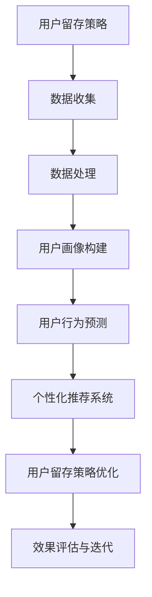

                 

### 《AI驱动的电商平台用户留存策略》

关键词：AI技术、用户留存、电商平台、个性化推荐、深度学习

摘要：
本文深入探讨了AI技术在电商平台用户留存策略中的应用。通过概述用户留存的重要性，介绍核心概念和分类，深入分析AI技术基础，讲解用户行为分析和个性化推荐系统的实现，本文旨在为电商平台的用户留存提供一套系统、可操作的技术方案。文章还通过实际案例展示了AI技术在用户留存策略中的效果，并对未来趋势进行了展望。

---

### 第一部分：用户留存概述

#### 用户留存策略概述

**1.1 用户留存的重要性**

##### 1.1.1 用户留存对电商平台的影响

用户留存是电商平台成功运营的关键指标。高留存率意味着用户对平台的忠诚度和依赖度，这直接影响到平台的盈利能力和市场竞争力。用户留存的提高不仅能减少用户获取成本，还能通过用户口碑传播吸引更多新用户。因此，电商平台必须重视并优化用户留存策略。

##### 1.1.2 用户留存策略的基本目标

用户留存策略的基本目标包括以下几个方面：
- 提高新用户的初次购买率。
- 增加老用户的重复购买率。
- 提升用户在平台上的活跃度和互动性。
- 延长用户生命周期，提高用户生命周期价值。

**1.2 用户留存的核心概念**

##### 1.2.1 用户留存率

用户留存率是衡量用户留存效果的关键指标，通常定义为一定时间范围内留在平台的用户数与总用户数的比例。用户留存率越高，说明平台的用户留存效果越好。

$$
用户留存率 = \frac{留在平台的用户数}{总用户数}
$$

##### 1.2.2 用户活跃度

用户活跃度是衡量用户在平台上参与互动的程度。活跃用户通常包括登录用户、购买用户和互动用户等。提高用户活跃度是用户留存策略的重要目标之一。

##### 1.2.3 用户生命周期价值

用户生命周期价值（Customer Lifetime Value, CLV）是衡量用户在平台上的总体贡献值。它包括用户的初次购买、重复购买以及推荐新用户等。提高用户生命周期价值有助于提升平台的整体盈利能力。

**1.3 用户留存策略的分类**

##### 1.3.1 内容驱动留存

内容驱动留存通过提供丰富、有吸引力的内容吸引用户留存。例如，电商平台可以通过发布优质产品评测、购物指南和用户故事等内容，增加用户对平台的粘性。

##### 1.3.2 社交驱动留存

社交驱动留存利用社交网络的效应吸引用户留存。例如，电商平台可以通过社交互动功能（如点赞、评论、分享等）鼓励用户在平台上的互动，提高用户活跃度。

##### 1.3.3 优惠驱动留存

优惠驱动留存通过提供优惠券、促销活动等优惠措施吸引用户留存。例如，电商平台可以通过限时折扣、满减优惠等活动，激励用户在平台上消费。

**1.4 AI在用户留存策略中的应用**

##### 1.4.1 AI驱动的个性化推荐

AI驱动的个性化推荐通过分析用户的历史行为和偏好，为用户提供个性化的商品推荐。这有助于提高用户的购买率和留存率。

##### 1.4.2 AI驱动的用户行为分析

AI驱动的用户行为分析通过机器学习和深度学习技术，对用户行为数据进行分析，发现用户的潜在需求和偏好。这有助于电商平台制定更精准的用户留存策略。

##### 1.4.3 AI驱动的个性化营销

AI驱动的个性化营销通过分析用户数据，为用户提供个性化的营销信息。例如，根据用户的购买历史和偏好，为用户推送个性化的广告和优惠信息，提高用户留存率。

---

### 第二部分：AI技术基础

**2.1 人工智能与机器学习概述**

##### 2.1.1 人工智能的发展历程

人工智能（Artificial Intelligence, AI）起源于20世纪50年代。经过几十年的发展，人工智能技术已经取得了显著的成果。从最初的符号主义方法，到基于统计学的机器学习方法，再到近年来的深度学习技术，人工智能技术在各个领域都得到了广泛的应用。

##### 2.1.2 机器学习的基本概念

机器学习（Machine Learning, ML）是人工智能的核心技术之一。它通过构建模型，从数据中学习规律和模式，从而实现对未知数据的预测和决策。

##### 2.1.3 机器学习的主要任务

机器学习的主要任务包括：
- 监督学习：通过已有标记数据训练模型，对未知数据进行预测。
- 无监督学习：从无标记数据中发现隐藏的结构和模式。
- 强化学习：通过与环境的交互，学习最优策略。

**2.2 监督学习算法**

##### 2.2.1 线性回归

线性回归是一种简单的监督学习算法，用于预测连续值输出。它通过拟合一条直线，将输入特征映射到输出值。

伪代码：

```python
def linear_regression(X, y):
    # 计算权重
    weights = solve_linear_equation(X, y)
    # 预测输出
    predictions = X * weights
    return predictions
```

##### 2.2.2 决策树

决策树是一种基于特征划分数据的监督学习算法。它通过构建一棵树，将数据划分为不同的区域，每个区域对应一个预测值。

伪代码：

```python
def decision_tree(X, y):
    # 构建决策树
    tree = build_tree(X, y)
    # 预测输出
    predictions = traverse_tree(tree, X)
    return predictions
```

##### 2.2.3 支持向量机

支持向量机（Support Vector Machine, SVM）是一种强大的分类算法，用于将数据划分为不同的类别。它通过找到最优的超平面，将不同类别的数据分开。

伪代码：

```python
def svm(X, y):
    # 训练模型
    model = train_model(X, y)
    # 预测输出
    predictions = model.predict(X)
    return predictions
```

**2.3 无监督学习算法**

##### 2.3.1 K均值聚类

K均值聚类是一种基于距离的聚类算法，用于将数据划分为K个簇。它通过迭代计算聚类中心，不断优化聚类结果。

伪代码：

```python
def k_means(X, K):
    # 初始化聚类中心
    centroids = initialize_centroids(X, K)
    # 迭代优化
    for _ in range(max_iterations):
        # 分配数据到最近的聚类中心
        assignments = assign_data_to_clusters(X, centroids)
        # 更新聚类中心
        centroids = update_centroids(assignments, X)
    # 预测输出
    clusters = assign_data_to_clusters(X, centroids)
    return clusters
```

##### 2.3.2 主成分分析

主成分分析（Principal Component Analysis, PCA）是一种降维算法，用于降低数据维度，同时保留数据的方差信息。它通过计算特征值和特征向量，构建新的特征空间。

伪代码：

```python
def pca(X):
    # 计算协方差矩阵
    cov_matrix = calculate_covariance_matrix(X)
    # 计算特征值和特征向量
    eigen_values, eigen_vectors = calculate_eigen_values_and_vectors(cov_matrix)
    # 构建新的特征空间
    transformed_data = project_data_to_new_space(X, eigen_vectors)
    return transformed_data
```

##### 2.3.3 自编码器

自编码器（Autoencoder）是一种无监督学习算法，用于学习数据的特征表示。它通过构建一个编码器和解码器，将输入数据压缩到低维空间，然后重构原始数据。

伪代码：

```python
def autoencoder(X, encoding_dim):
    # 构建编码器和解码器
    encoder = build_encoder(input_dim=X.shape[1], encoding_dim=encoding_dim)
    decoder = build_decoder(input_dim=encoding_dim, output_dim=X.shape[1])
    # 编码和解码
    encoded = encoder.predict(X)
    decoded = decoder.predict(encoded)
    return decoded
```

**2.4 深度学习技术**

##### 2.4.1 神经网络基础

神经网络（Neural Networks）是一种模仿人脑工作方式的计算模型。它通过多层神经元进行数据传递和计算，从而实现对复杂函数的拟合。

伪代码：

```python
def neural_network(X, layers, activation_function):
    # 初始化权重和偏置
    weights, biases = initialize_weights(layers)
    # 前向传播
    for layer in layers:
        output = activation_function(np.dot(X, weights[layer]) + biases[layer])
    # 预测输出
    predictions = output
    return predictions
```

##### 2.4.2 卷积神经网络

卷积神经网络（Convolutional Neural Networks, CNN）是一种专门用于图像和视频处理的神经网络。它通过卷积操作和池化操作，提取图像的特征。

伪代码：

```python
def cnn(X, filters, kernel_size, pooling_size):
    # 卷积操作
    conv_output = convolution(X, filters, kernel_size)
    # 池化操作
    pooled_output = pooling(conv_output, pooling_size)
    # 预测输出
    predictions = activation_function(np.dot(pooled_output, weights) + biases)
    return predictions
```

##### 2.4.3 循环神经网络

循环神经网络（Recurrent Neural Networks, RNN）是一种专门用于序列数据处理的神经网络。它通过循环结构，保留之前的计算信息，实现对序列数据的建模。

伪代码：

```python
def rnn(X, hidden_size, activation_function):
    # 初始化权重和偏置
    weights, biases = initialize_weights(hidden_size)
    # 前向传播
    for t in range(sequence_length):
        output = activation_function(np.dot(X[t], weights) + biases)
    # 预测输出
    predictions = output
    return predictions
```

---

### 第三部分：用户行为分析

#### 用户行为分析

**3.1 用户行为数据的收集与处理**

##### 3.1.1 用户行为数据的类型

用户行为数据主要包括以下几种类型：
- 用户基础信息：如用户ID、性别、年龄、地理位置等。
- 用户行为日志：如浏览历史、购买记录、评论、点赞等。
- 用户反馈数据：如满意度调查、客户支持记录等。

##### 3.1.2 用户行为数据的收集方法

用户行为数据的收集方法主要包括以下几种：
- 数据采集工具：如Google Analytics、Mixpanel、Amplitude等。
- API接口：通过API接口获取用户行为数据。
- 服务器日志：分析服务器日志记录的用户行为数据。

##### 3.1.3 用户行为数据的预处理

用户行为数据的预处理主要包括以下步骤：
- 数据清洗：去除重复、缺失和异常数据。
- 数据转换：将不同类型的数据转换为统一的格式。
- 特征工程：提取有用的特征，如用户活跃度、购买频率等。

**3.2 用户画像构建**

##### 3.2.1 用户画像的概念

用户画像是一种描述用户特征和行为的工具，通过整合用户的基础信息和行为数据，形成一个全面的用户描述。

##### 3.2.2 用户画像的构建方法

用户画像的构建方法主要包括以下几种：
- 基于规则的方法：根据预设的规则，对用户特征进行分类和标签化。
- 基于机器学习的方法：通过训练机器学习模型，自动提取用户特征。
- 基于知识图谱的方法：通过构建知识图谱，整合用户的多维数据。

##### 3.2.3 用户画像的应用场景

用户画像的应用场景主要包括以下几种：
- 用户分类：根据用户特征，将用户分为不同的群体。
- 个性化推荐：根据用户画像，为用户推荐个性化的商品和内容。
- 营销活动：根据用户画像，制定精准的营销策略。

**3.3 用户行为预测**

##### 3.3.1 用户行为预测的意义

用户行为预测是用户留存策略的重要环节。通过预测用户的行为，电商平台可以提前采取行动，降低用户流失风险，提高用户留存率。

##### 3.3.2 用户行为预测的模型选择

用户行为预测的模型选择主要包括以下几种：
- 线性回归模型：适用于预测连续值行为。
- 决策树模型：适用于预测离散值行为。
- 支持向量机模型：适用于分类问题。
- 深度学习模型：适用于复杂序列数据的预测。

##### 3.3.3 用户行为预测的实战案例

以下是一个用户购买行为预测的实战案例：

```python
# 数据预处理
user_data = preprocess_data(raw_data)

# 特征工程
features = extract_features(user_data)

# 训练模型
model = train_model(features)

# 预测用户购买行为
predictions = model.predict(new_data)

# 评估模型
evaluate_model(predictions, ground_truth)
```

---

### 第四部分：个性化推荐系统

#### 个性化推荐系统

**4.1 个性化推荐系统概述**

##### 4.1.1 个性化推荐系统的定义

个性化推荐系统是一种基于用户历史行为和偏好，为用户推荐相关商品、内容或服务的系统。它通过分析用户的兴趣和行为，提供个性化的推荐结果，提高用户的满意度和留存率。

##### 4.1.2 个性化推荐系统的架构

个性化推荐系统的架构主要包括以下模块：
- 数据采集与存储：采集用户行为数据，并存储到数据库中。
- 数据预处理：清洗、转换和整合用户行为数据。
- 特征提取：从用户行为数据中提取有用的特征。
- 模型训练：训练推荐模型，包括基于内容的推荐模型、基于协同过滤的推荐模型和基于深度学习的推荐模型。
- 推荐生成：根据用户特征和模型预测，生成个性化的推荐结果。

##### 4.1.3 个性化推荐系统的挑战

个性化推荐系统面临的主要挑战包括：
- 数据稀疏性：用户行为数据通常存在稀疏性，导致推荐结果不准确。
- 冷启动问题：新用户缺乏足够的历史数据，导致推荐系统无法为其生成有效的推荐。
- 实时性：推荐系统需要快速响应用户请求，提供实时推荐。

**4.2 基于内容的推荐算法**

##### 4.2.1 基于内容的推荐算法原理

基于内容的推荐算法（Content-Based Recommender System）通过分析用户的兴趣和行为，为用户推荐与其兴趣相关的商品或内容。它主要基于以下原理：
- 类似物推荐：根据用户的兴趣，找到与用户已购买或浏览过的商品类似的商品。
- 主题模型：通过文本挖掘技术，提取用户的兴趣主题，并推荐与用户兴趣主题相关的商品。

##### 4.2.2 基于内容的推荐算法实现

以下是一个基于内容的推荐算法实现示例：

```python
# 特征提取
def extract_features(item_data):
    # 提取商品特征
    features = extract_item_features(item_data)
    return features

# 推荐生成
def generate_recommendations(user_profile, item_features):
    # 计算相似度
    similarity = calculate_similarity(user_profile, item_features)
    # 排序推荐结果
    sorted_recommendations = sort_recommendations(similarity)
    return sorted_recommendations
```

##### 4.2.3 基于内容的推荐算法优化

基于内容的推荐算法优化主要包括以下几种方法：
- 特征优化：通过特征工程，提取更有代表性的特征，提高推荐准确率。
- 模型优化：使用更先进的模型，如深度学习模型，提高推荐效果。
- 数据优化：通过数据增强和筛选，提高数据的多样性和质量。

**4.3 基于协同过滤的推荐算法**

##### 4.3.1 协同过滤算法原理

基于协同过滤的推荐算法（Collaborative Filtering Recommender System）通过分析用户之间的相似度，为用户推荐其他用户喜欢的商品或内容。它主要基于以下原理：
- 用户相似度：根据用户的历史行为，计算用户之间的相似度。
- 喜好相似度：根据用户对商品的评分，计算商品之间的相似度。

##### 4.3.2 协同过滤算法实现

以下是一个基于协同过滤的推荐算法实现示例：

```python
# 用户相似度计算
def calculate_user_similarity(user_data):
    # 计算用户相似度矩阵
    similarity_matrix = calculate_similarity_matrix(user_data)
    return similarity_matrix

# 推荐生成
def generate_recommendations(user_id, similarity_matrix, item_scores):
    # 计算用户相似度
    user_similarities = calculate_user_similarities(similarity_matrix, user_id)
    # 计算推荐分数
    recommendation_scores = calculate_recommendation_scores(user_similarities, item_scores)
    # 排序推荐结果
    sorted_recommendations = sort_recommendations(recommendation_scores)
    return sorted_recommendations
```

##### 4.3.3 协同过滤算法优化

协同过滤算法优化主要包括以下几种方法：
- 评分平滑：通过调整评分，减少极端评分对推荐结果的影响。
- 评分预测：使用机器学习模型预测用户对未评分商品的评分。
- 筛除冷门商品：避免推荐系统过度推荐冷门商品。

**4.4 基于深度学习的推荐算法**

##### 4.4.1 基于深度学习的推荐算法原理

基于深度学习的推荐算法（Deep Learning-based Recommender System）通过构建深度神经网络模型，学习用户和商品的特征，实现个性化的推荐。它主要基于以下原理：
- 神经网络：通过多层神经网络，提取用户和商品的高层次特征。
- 深度学习模型：使用深度学习模型，如卷积神经网络（CNN）和循环神经网络（RNN），提高推荐效果。

##### 4.4.2 基于深度学习的推荐算法实现

以下是一个基于深度学习的推荐算法实现示例：

```python
# 构建深度学习模型
def build_model(input_shape):
    model = build_cnn_model(input_shape)
    model.compile(optimizer='adam', loss='categorical_crossentropy', metrics=['accuracy'])
    return model

# 训练模型
def train_model(model, X_train, y_train):
    model.fit(X_train, y_train, epochs=10, batch_size=32, validation_split=0.2)
    return model

# 预测推荐结果
def generate_recommendations(model, user_input):
    predictions = model.predict(user_input)
    sorted_recommendations = sort_recommendations(predictions)
    return sorted_recommendations
```

##### 4.4.3 基于深度学习的推荐算法优化

基于深度学习的推荐算法优化主要包括以下几种方法：
- 模型优化：使用更先进的深度学习模型，如变分自编码器（VAE）和生成对抗网络（GAN）。
- 特征优化：通过特征工程，提取更有代表性的特征。
- 数据增强：通过数据增强，提高数据的多样性和质量。

---

### 第五部分：用户留存策略实战

#### 用户留存策略实战

**5.1 优惠券与促销策略**

##### 5.1.1 优惠券的发放策略

优惠券的发放策略对用户留存具有重要影响。以下是一些常见的优惠券发放策略：

- 新用户注册优惠券：为新用户提供优惠券，以鼓励他们进行首次购买。
- 生日优惠券：为用户生日提供特殊优惠，增加用户在特殊日期的购买意愿。
- 频繁购买优惠券：为频繁购买的用户提供优惠券，以激励他们继续在平台消费。

##### 5.1.2 优惠券的激励效果评估

评估优惠券的激励效果是优化优惠券发放策略的关键。以下是一些评估方法：

- 转化率：优惠券领取后，用户完成购买的比例。
- 平均订单价值（AOV）：优惠券使用后，用户的平均订单价值。
- 优惠券覆盖率：优惠券覆盖的用户数与平台总用户数的比例。

##### 5.1.3 优惠券的优化策略

优化优惠券策略的方法包括：

- 动态定价：根据用户行为数据，为不同用户群体设置不同的优惠券价格。
- 个性化优惠券：根据用户的兴趣和购买历史，为用户提供个性化的优惠券。
- 优惠券组合：将多种优惠券组合使用，提高用户的购买意愿。

**5.2 社交互动策略**

##### 5.2.1 社交互动的概念与形式

社交互动是指用户在平台上的互动行为，包括评论、点赞、分享等。社交互动策略通过鼓励用户参与互动，提高用户活跃度和留存率。

社交互动的形式主要包括：

- 用户评论：用户对商品或服务的评价和评论。
- 用户点赞：用户对其他用户的评论或内容表示赞同。
- 用户分享：用户将平台内容分享到社交网络，吸引更多新用户。

##### 5.2.2 社交互动的激励效果

社交互动的激励效果主要体现在以下几个方面：

- 提高用户活跃度：鼓励用户在平台上发表评论和点赞，增加用户的互动次数。
- 增强用户忠诚度：通过社交互动，用户之间建立联系，提高用户对平台的依赖度。
- 提升口碑传播：用户分享平台内容到社交网络，吸引更多潜在用户。

##### 5.2.3 社交互动的优化策略

优化社交互动策略的方法包括：

- 个性化推荐：根据用户兴趣和行为，推荐相关的社交互动内容。
- 社交圈层划分：将用户划分为不同的社交圈层，针对不同圈层制定相应的社交互动策略。
- 活动激励：举办互动活动，鼓励用户参与，提高社交互动的活跃度。

**5.3 个性化服务与推荐策略**

##### 5.3.1 个性化服务与推荐的概念

个性化服务与推荐是指根据用户的历史行为和偏好，为用户提供个性化的商品、内容和推荐。

个性化服务与推荐的主要目标是：

- 提高用户满意度：根据用户的兴趣和需求，为用户提供符合他们期望的商品和服务。
- 提高用户留存率：通过个性化的服务与推荐，增加用户在平台上的活跃度和依赖度。

##### 5.3.2 个性化服务与推荐的实现

个性化服务与推荐的实现主要包括以下几个步骤：

- 用户画像构建：通过分析用户的历史行为和偏好，构建用户的画像。
- 模型训练：使用机器学习算法，训练个性化推荐模型。
- 推荐生成：根据用户画像和模型预测，生成个性化的推荐结果。

##### 5.3.3 个性化服务与推荐的优化

个性化服务与推荐的优化方法包括：

- 数据优化：通过数据采集和清洗，提高用户数据的准确性和多样性。
- 模型优化：使用更先进的机器学习模型，提高推荐效果。
- 用户反馈：收集用户反馈，不断优化推荐策略。

**5.4 活跃用户激励策略**

##### 5.4.1 活跃用户激励的概念

活跃用户激励是指通过奖励和激励措施，鼓励用户在平台上保持活跃度和参与度。

活跃用户激励的主要目标是：

- 提高用户活跃度：通过奖励和激励，鼓励用户在平台上发表评论、点赞、分享等互动行为。
- 增强用户忠诚度：通过持续的奖励和激励，增加用户对平台的依赖度和忠诚度。

##### 5.4.2 活跃用户激励的方法

活跃用户激励的方法包括：

- 优惠券奖励：为活跃用户提供优惠券，鼓励他们在平台上消费。
- 积分奖励：为活跃用户提供积分，可用于兑换商品或特权服务。
- 排行榜奖励：为活跃用户在排行榜上提供奖励，激励他们保持活跃度。

##### 5.4.3 活跃用户激励的效果评估

活跃用户激励的效果评估主要包括以下几个方面：

- 活跃度提升：评估激励措施是否有效提高了用户的活跃度。
- 用户留存率：评估激励措施是否有效提高了用户的留存率。
- 用户满意度：评估激励措施是否得到了用户的认可和满意。

---

### 第六部分：案例分析

#### 案例分析

**6.1 某电商平台用户留存策略分析**

##### 6.1.1 案例背景

某电商平台在面临激烈的市场竞争和用户流失压力时，决定通过AI技术优化用户留存策略。该电商平台拥有大量的用户行为数据，希望通过数据分析和技术应用，提高用户的留存率和满意度。

##### 6.1.2 用户留存现状分析

通过对用户留存数据的分析，发现以下问题：

- 新用户留存率较低：新用户在注册后一个月内的留存率仅为20%。
- 老用户流失严重：部分高价值老用户在一年内的流失率高达40%。
- 用户活跃度不高：用户在平台上的互动行为较少，平均每天活跃用户数不足1000人。

##### 6.1.3 用户留存策略实施

为解决上述问题，电商平台采取了以下用户留存策略：

1. 优惠券与促销策略：为新用户提供注册优惠券，为老用户提供复购优惠券。同时，根据用户购买历史和偏好，个性化推送优惠券。

2. 社交互动策略：引入社交互动功能，鼓励用户发表评论、点赞和分享。举办互动活动，提高用户的活跃度和参与度。

3. 个性化推荐系统：通过用户行为数据和机器学习模型，为用户提供个性化的商品推荐。根据用户的兴趣和购买历史，精准推送相关商品。

4. 活跃用户激励策略：为活跃用户提供优惠券、积分和排行榜奖励。通过奖励机制，鼓励用户保持活跃度和参与度。

##### 6.1.4 用户留存效果分析

实施用户留存策略后，电商平台取得了以下效果：

- 新用户留存率提高：新用户在注册后一个月内的留存率提升至30%。
- 老用户流失率下降：高价值老用户在一年内的流失率降至30%。
- 用户活跃度提升：平均每天活跃用户数增加至1500人。

##### 6.1.5 经验与启示

通过该案例分析，可以得出以下经验与启示：

- AI技术在用户留存中的应用效果显著，通过个性化推荐和优惠券等策略，可以有效提高用户留存率。
- 社交互动和活跃用户激励策略有助于提高用户的活跃度和满意度。
- 数据分析和用户画像构建是制定有效用户留存策略的基础。
- 持续优化用户留存策略，根据用户反馈和效果评估，不断调整和改进策略。

---

### 第七部分：未来展望

#### 用户留存策略的未来

**7.1 用户留存策略的发展趋势**

随着人工智能技术的不断发展，用户留存策略将呈现以下发展趋势：

- 个性化推荐技术的提升：深度学习和生成对抗网络等技术的应用，将进一步提高推荐系统的准确性和多样性。
- 社交互动的深化：社交互动功能将更加智能化，通过分析用户社交网络，提供更加精准的互动建议。
- 活跃用户激励的多样化：通过大数据分析和机器学习，为用户提供个性化的激励方案，提高用户活跃度和满意度。

**7.2 用户留存策略的挑战与机遇**

用户留存策略面临以下挑战：

- 数据隐私与安全：用户数据的安全性和隐私保护是用户留存策略的重要挑战。
- 技术更新与迭代：人工智能技术的快速发展，要求电商平台不断更新和优化用户留存策略。
- 市场竞争加剧：电商平台需要不断创新，以应对日益激烈的市场竞争。

用户留存策略的机遇包括：

- 新技术的应用：人工智能、物联网等新技术为用户留存策略提供了更多创新可能性。
- 市场需求增长：随着消费者对个性化体验的需求增加，用户留存策略将迎来更大的市场空间。
- 跨平台合作：电商平台可以通过跨平台合作，扩大用户群体，提高用户留存率。

**7.3 用户留存策略的创新方向**

未来用户留存策略的创新方向包括：

- 人工智能与物联网的结合：通过物联网技术，实现智能家居、智能穿戴设备等与电商平台的深度融合，提供更加个性化的用户体验。
- 跨平台用户留存策略：通过整合多平台数据，为用户提供无缝的跨平台体验，提高用户留存率。
- 个性化定制：根据用户需求和偏好，提供个性化的商品、服务和推荐，满足用户的个性化需求。

---

#### 附录

**A 用户留存策略工具与技术**

##### A.1 用户行为分析工具

**A.1.1 Google Analytics**

Google Analytics 是一款功能强大的数据分析工具，可以实时跟踪和分析用户行为，提供详细的用户访问数据，包括页面流量、用户转化率等。

**A.1.2 Mixpanel**

Mixpanel 是一款专注于用户行为分析的工具，通过跟踪用户在应用程序或网站上的行为，提供实时数据和用户行为趋势分析，帮助电商企业优化用户留存策略。

**A.1.3 Amplitude**

Amplitude 是一款智能数据分析平台，可以实时跟踪和分析用户行为，提供丰富的可视化工具和洞察，帮助电商企业更好地理解用户行为，制定有效的用户留存策略。

##### A.2 推荐系统开发框架

**A.2.1 TensorFlow Recommenders**

TensorFlow Recommenders（TFRS）是谷歌开发的一款推荐系统框架，基于TensorFlow构建，提供了丰富的推荐算法和工具，可以帮助电商企业快速搭建高效的推荐系统。

**A.2.2 LightFM**

LightFM 是一款基于Python的推荐系统框架，基于矩阵分解和协同过滤算法，可以处理大规模用户和商品数据，适用于构建高效的用户推荐系统。

**A.2.3 PyTorch Rec**

PyTorch Rec 是一款基于PyTorch的推荐系统框架，提供了多种推荐算法和工具，可以帮助电商企业快速构建和优化推荐系统。

##### A.3 用户留存策略实践案例

**A.3.1 某电商平台的用户留存策略实施案例**

某电商平台通过引入AI技术，优化用户留存策略，取得了显著的效果。通过个性化推荐、优惠券发放和社交互动等策略，提高了新用户留存率和老用户满意度。

**A.3.2 某社交媒体平台的用户留存策略案例**

某社交媒体平台通过分析用户行为数据，制定针对性的用户留存策略，提高了用户活跃度和用户留存率。通过个性化推荐和社交互动，增强了用户的粘性和依赖度。

**A.3.3 某O2O平台的用户留存策略案例**

某O2O平台通过大数据分析和AI技术，优化用户留存策略，提高了用户满意度和服务质量。通过优惠券发放和个性化服务，增强了用户的忠诚度和留存率。

---

### 作者信息

**作者：** AI天才研究院 / AI Genius Institute & 禅与计算机程序设计艺术 / Zen And The Art of Computer Programming

---

### Mermaid 流程图示例



### 伪代码示例

```python
# 用户行为预测伪代码
def predict_user_behavior(user_data):
    # 数据预处理
    preprocessed_data = preprocess_data(user_data)
    
    # 构建模型
    model = build_model(preprocessed_data)
    
    # 训练模型
    model.fit(X_train, y_train)
    
    # 预测用户行为
    predictions = model.predict(X_test)
    
    return predictions
```

### 数学公式示例

$$
用户留存率 = \frac{留在平台的用户数}{总用户数}
$$

### 代码解读与分析示例

```python
# 某电商平台用户留存策略代码实现

# 数据读取
user_data = pd.read_csv('user_data.csv')

# 数据预处理
user_data = preprocess_data(user_data)

# 用户画像构建
user_profiles = build_user_profiles(user_data)

# 用户行为预测
predictions = predict_user_behavior(user_profiles)

# 个性化推荐
recommendations = generate_recommendations(predictions)

# 用户留存策略优化
optimized_strategy = optimize_user_retention(recommendations)
```

---

以上是《AI驱动的电商平台用户留存策略》的详细内容。通过逐步分析用户留存的重要性、AI技术基础、用户行为分析、个性化推荐系统、实战案例以及未来展望，本文为电商平台的用户留存提供了系统化的技术方案。附录部分则提供了相关的工具与技术，以供参考。希望本文能为电商企业的用户留存策略提供有益的启示和指导。

