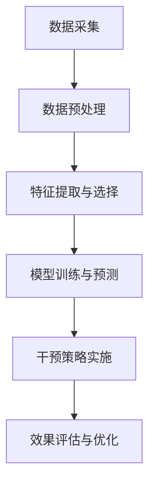
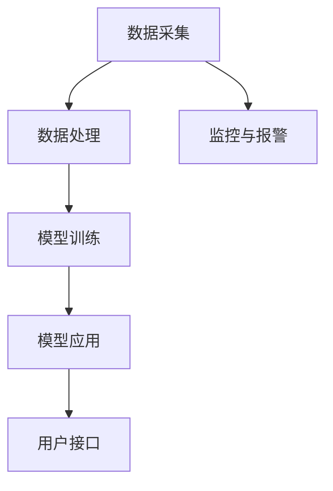

                 

### 文章标题

《AI驱动的电商智能客户流失预警与干预系统》

#### 文章关键词

人工智能，电商，客户流失预警，客户干预，深度学习，机器学习，数据挖掘

#### 文章摘要

本文详细探讨了AI驱动的电商智能客户流失预警与干预系统，旨在通过高级机器学习和深度学习算法预测并干预潜在客户流失。文章首先介绍了AI在电商领域的应用现状，随后深入讲解了智能客户流失预警与干预系统的架构和核心概念，包括机器学习基础、客户流失预警模型原理、客户干预策略等。随后，文章通过伪代码和数学公式详细阐述了核心算法原理，并分享了具体的项目实战案例。最后，文章总结了系统的建设成果，并对未来的发展方向进行了展望。

---

### 《AI驱动的电商智能客户流失预警与干预系统》

在当前的数字化时代，电商行业正以前所未有的速度发展。然而，随着市场竞争的日益激烈，客户流失问题成为了电商企业面临的主要挑战之一。据统计，每年因客户流失而导致的损失高达数十亿美元。因此，开发一套智能的、基于AI的客户流失预警与干预系统，对于电商企业来说具有重要意义。

#### 1.1 AI与电商智能概述

##### 1.1.1 电商行业的发展趋势

电商行业自诞生以来，经历了快速的增长。随着互联网技术的普及和移动设备的广泛使用，电商行业逐渐从传统的线下购物模式向线上购物模式转变。这种转变不仅改变了消费者的购物习惯，也为电商企业带来了巨大的商机。然而，随着市场竞争的加剧，电商企业面临着客户获取成本增加、客户忠诚度下降等问题。

##### 1.1.2 AI技术在电商中的应用现状

近年来，AI技术在电商领域的应用越来越广泛。从智能推荐、智能客服到智能定价和智能物流，AI技术正在深刻地改变电商行业。例如，智能推荐系统能够根据用户的历史行为和偏好，为用户推荐最可能感兴趣的商品；智能客服系统能够自动处理大量用户咨询，提高客服效率；智能定价系统则能够根据市场动态和用户行为，动态调整商品价格，提高销售额。

##### 1.1.3 客户流失预警与干预的重要性

客户流失预警与干预系统是电商企业维护客户关系的重要工具。通过分析客户行为数据，系统能够提前预测哪些客户可能流失，并采取相应的干预措施，如个性化推荐、优惠活动等，以挽回潜在流失客户。客户流失预警与干预不仅有助于降低客户流失率，提高客户满意度，还能提升电商企业的整体业绩。

#### 1.2 智能客户流失预警与干预系统架构

##### 1.2.1 系统总体架构

智能客户流失预警与干预系统的总体架构包括数据采集与预处理、特征提取与选择、模型训练与预测、干预策略实施等几个关键模块。具体架构如下图所示：



##### 1.2.2 数据采集与预处理

数据采集是智能客户流失预警与干预系统的第一步。系统需要从多个渠道收集用户行为数据，包括用户浏览记录、购买历史、评价反馈等。数据采集工具可以选择ETL（Extract, Transform, Load）工具，如Apache NiFi、Apache Kafka等。

数据预处理包括数据清洗、数据整合和数据标准化等步骤。数据清洗旨在去除重复数据、填补缺失值和消除噪声数据；数据整合则是将来自不同渠道的数据进行合并；数据标准化则是将不同尺度的数据进行归一化处理，以消除数据之间的规模差异。

##### 1.2.3 特征提取与选择

特征提取与选择是智能客户流失预警与干预系统的关键步骤。通过对用户行为数据进行深入分析，提取出能够反映用户流失倾向的特征。例如，用户在购物车中停留的时间、购买频率、评价分数等。特征选择则是在大量特征中筛选出最有价值的特征，以降低模型的复杂度，提高模型的预测准确性。

### 2. AI基础概念

在讨论智能客户流失预警与干预系统之前，我们需要了解一些AI的基础概念，包括机器学习、深度学习、特征工程等。

#### 2.1 机器学习基础

##### 2.1.1 监督学习

监督学习是一种常见的人工智能技术，其核心是通过已有数据（标记数据集）来训练模型，从而预测新数据的结果。监督学习分为回归和分类两种类型。

- **回归**：预测连续值输出，如预测房价。
- **分类**：预测离散值输出，如判断邮件是否为垃圾邮件。

##### 2.1.2 无监督学习

无监督学习是一种不依赖于标记数据的机器学习技术，其主要任务是发现数据中的隐含结构。无监督学习包括聚类、降维和关联规则学习等。

- **聚类**：将相似的数据点分组，如K-means算法。
- **降维**：减少数据维度，如主成分分析（PCA）。
- **关联规则学习**：发现数据之间的关联关系，如Apriori算法。

##### 2.1.3 强化学习

强化学习是一种通过不断试错来学习最佳策略的机器学习技术。它通常应用于动态环境中，如自动驾驶、游戏AI等。

强化学习包括四个主要元素：代理（agent）、环境（environment）、状态（state）、动作（action）。代理通过与环境互动，不断更新其策略，以实现最大化奖励。

##### 2.1.4 深度学习基础

深度学习是一种基于多层神经网络的结构化机器学习方法，它在图像识别、自然语言处理等领域取得了显著的成果。深度学习主要包括以下几种网络结构：

- **神经网络（NN）**：一种由多个神经元组成的层次结构，用于映射输入到输出。
- **卷积神经网络（CNN）**：用于处理图像数据，通过卷积操作提取特征。
- **循环神经网络（RNN）**：用于处理序列数据，通过循环结构保持长时依赖信息。
- **长短时记忆网络（LSTM）**：RNN的一种变体，用于解决长时依赖问题。

##### 2.1.5 特征工程

特征工程是机器学习中的一个关键步骤，其目标是通过选择和构造特征，提高模型性能。特征工程包括以下步骤：

- **数据预处理**：清洗和标准化数据。
- **特征选择**：从大量特征中筛选出最有价值的特征。
- **特征提取**：从原始数据中提取新特征，如文本分类中的词袋模型。

### 2.2 客户流失预警模型原理

##### 2.2.1 客户流失预警的定义

客户流失预警是指利用数据挖掘和机器学习技术，通过分析客户的购买行为、评价等数据，预测哪些客户可能会在未来某一时间段内流失。客户流失预警模型的核心目标是识别出潜在流失客户，以便电商企业能够及时采取干预措施，降低客户流失率。

##### 2.2.2 客户流失预警模型类型

客户流失预警模型主要分为传统统计模型和机器学习模型两大类。

- **传统统计模型**：如逻辑回归、决策树、支持向量机等，通过分析客户的特征，计算客户流失的概率。
- **机器学习模型**：如随机森林、梯度提升机、深度学习模型等，通过学习大量历史数据，预测客户流失的可能性。

##### 2.2.3 客户流失预警流程

客户流失预警流程主要包括以下几个步骤：

1. **数据收集**：收集客户的购买行为、评价、浏览记录等数据。
2. **数据预处理**：清洗和标准化数据，去除噪声和缺失值。
3. **特征提取**：从原始数据中提取有价值的特征，如购买频率、评价分数、浏览时长等。
4. **模型选择与训练**：选择合适的机器学习模型，如逻辑回归、随机森林等，训练模型。
5. **模型评估**：评估模型预测准确性，如使用交叉验证、ROC曲线等。
6. **模型应用**：将模型应用于实际业务，预测潜在流失客户，并采取干预措施。

### 2.3 客户干预策略

##### 2.3.1 客户干预的定义与目的

客户干预是指电商企业通过一系列措施，如个性化推荐、优惠活动、客户关怀等，来挽回潜在流失客户的策略。客户干预的目的是提高客户满意度和忠诚度，降低客户流失率，从而提升电商企业的整体业绩。

##### 2.3.2 客户干预策略类型

客户干预策略主要分为以下几种：

- **个性化推荐**：根据客户的历史购买行为和偏好，推荐客户可能感兴趣的商品。
- **优惠活动**：提供优惠券、限时折扣等，刺激客户购买。
- **客户关怀**：通过电话、邮件、短信等方式与客户保持联系，了解客户需求，提供个性化服务。

##### 2.3.3 客户干预流程

客户干预流程主要包括以下几个步骤：

1. **潜在流失客户识别**：利用流失预警模型，识别出潜在流失客户。
2. **干预措施制定**：根据客户特点，制定相应的干预措施，如个性化推荐、优惠活动等。
3. **干预措施实施**：将干预措施通过系统发送给潜在流失客户。
4. **效果评估**：评估干预措施的效果，如客户转化率、满意度等。

### 3.1 客户流失预警算法

在客户流失预警系统中，算法的选择和优化是关键。本节将介绍几种常见的客户流失预警算法，包括逻辑回归、支持向量机、随机森林和深度学习算法。

#### 3.1.1 算法选择与评估

##### 3.1.1.1 评估指标

评估客户流失预警算法的性能通常使用以下指标：

- **准确率（Accuracy）**：预测为流失的客户中，实际流失的比例。
- **召回率（Recall）**：实际流失客户中被正确预测为流失的比例。
- **F1值（F1-Score）**：准确率和召回率的调和平均值。

##### 3.1.1.2 算法对比

逻辑回归、支持向量机和随机森林是三种常见的客户流失预警算法，它们的对比如下：

- **逻辑回归**：简单易实现，但在处理高维数据和复杂数据时效果较差。
- **支持向量机**：在处理线性可分数据时效果较好，但在处理非线性问题时需要引入核函数。
- **随机森林**：能够处理高维数据和复杂数据，同时具有较好的泛化能力。

#### 3.1.2 逻辑回归算法

##### 3.1.2.1 算法原理

逻辑回归是一种基于概率理论的回归模型，用于预测二分类问题。其基本原理是通过线性回归模型将输入特征映射到概率值，再通过概率阈值确定分类结果。

- **模型表示**：逻辑回归模型的决策函数为 \( y = \sigma(\theta^T x) \)，其中 \( \theta \) 是模型参数，\( x \) 是输入特征，\( \sigma \) 是逻辑函数，\( y \) 是预测结果。
- **逻辑函数**：逻辑函数（Sigmoid函数）将实数值映射到（0，1）区间内，表示流失概率。

##### 3.1.2.2 伪代码

```python
# 逻辑回归伪代码

# 输入：特征矩阵 X，标签向量 y
# 输出：模型参数 theta

# 初始化模型参数 theta
theta = initialize_theta(X.shape[1])

# 设置迭代次数和优化算法
num_iterations = 1000
learning_rate = 0.01

# 梯度下降优化
for i in range(num_iterations):
    # 计算预测值
    h = sigmoid(X @ theta)
    
    # 计算损失函数
    loss = -1 / len(y) * (y * log(h) + (1 - y) * log(1 - h))
    
    # 计算梯度
    gradient = X.T @ (h - y) / len(y)
    
    # 更新模型参数
    theta -= learning_rate * gradient

# 输出优化后的模型参数
return theta
```

##### 3.1.2.3 模型参数优化

逻辑回归模型的参数优化通常采用梯度下降算法。在优化过程中，需要设置合适的迭代次数和学习率。迭代次数过少可能导致模型无法收敛，迭代次数过多则可能增加计算成本。学习率过小可能导致收敛速度变慢，学习率过大则可能导致模型振荡。

在实际应用中，可以通过验证集来选择最佳的学习率和迭代次数。常用的优化策略包括：

- **学习率衰减**：随着迭代次数的增加，逐渐减小学习率。
- **早停法**：在验证集上计算损失函数，当损失函数不再下降时停止训练。

#### 3.1.3 支持向量机算法

##### 3.1.3.1 算法原理

支持向量机（SVM）是一种基于间隔最大化原理的分类算法。其基本原理是通过寻找一个最佳的超平面，将不同类别的数据点分隔开来，并最大化分类间隔。

- **线性SVM**：适用于线性可分数据。通过求解最优分隔超平面，使得分类间隔最大化。
- **核SVM**：通过引入核函数，将低维空间的数据映射到高维空间，解决非线性分类问题。

##### 3.1.3.2 伪代码

```python
# 支持向量机伪代码

# 输入：特征矩阵 X，标签向量 y
# 输出：模型参数 theta

# 初始化模型参数 theta
theta = initialize_theta(X.shape[1])

# 设置迭代次数和优化算法
num_iterations = 1000
learning_rate = 0.01

# 梯度下降优化
for i in range(num_iterations):
    # 计算预测值
    h = sign(X @ theta)
    
    # 计算损失函数
    loss = 1 / len(y) * sum(y * h + (1 - y) * (1 - h))
    
    # 计算梯度
    gradient = X.T @ (h - y) / len(y)
    
    # 更新模型参数
    theta -= learning_rate * gradient

# 输出优化后的模型参数
return theta
```

##### 3.1.3.3 模型参数优化

支持向量机算法的参数优化主要涉及两个参数：C（惩罚参数）和核函数。C值控制着模型对误分类的惩罚程度，较大C值可能导致模型拟合过紧，较小C值可能导致模型拟合过松。核函数的选择则影响模型在高维空间的表现。

在实际应用中，可以通过交叉验证来选择最佳的C值和核函数。常用的优化策略包括：

- **网格搜索**：在给定范围内遍历所有C值和核函数，选择最佳组合。
- **遗传算法**：通过模拟生物进化过程，搜索最优参数组合。

#### 3.1.4 随机森林算法

##### 3.1.4.1 算法原理

随机森林（Random Forest）是一种基于决策树的集成学习方法。其基本原理是通过构建多棵决策树，并对每个树的预测结果进行投票，得到最终的预测结果。

- **决策树**：通过递归划分数据集，找到最优划分方式，构建决策树。
- **随机特征选择**：在每次划分时，从多个特征中随机选择一个特征进行划分，以降低模型的方差。

##### 3.1.4.2 伪代码

```python
# 随机森林伪代码

# 输入：特征矩阵 X，标签向量 y
# 输出：模型参数 forest

# 设置决策树数量
num_trees = 100

# 构建随机森林
forest = []
for _ in range(num_trees):
    # 随机选取特征和样本
    X_tree = X.sample(n_samples, replace=True)
    y_tree = y.sample(n_samples, replace=True)
    
    # 构建决策树
    tree = build_decision_tree(X_tree, y_tree)
    
    # 添加决策树到森林
    forest.append(tree)

# 预测
def predict(X):
    predictions = []
    for tree in forest:
        prediction = tree.predict(X)
        predictions.append(prediction)
    
    # 投票得到最终预测结果
    return majority_vote(predictions)
```

##### 3.1.4.3 模型参数优化

随机森林算法的参数优化主要涉及树的数量和特征选择策略。树的数量越多，模型的预测能力越强，但计算成本也越高。特征选择策略则影响模型的复杂度和预测准确性。

在实际应用中，可以通过交叉验证来选择最佳的树的数量和特征选择策略。常用的优化策略包括：

- **网格搜索**：在给定范围内遍历所有树的数量和特征选择策略，选择最佳组合。
- **随机搜索**：通过随机搜索，找到最优参数组合。

#### 3.1.5 深度学习算法

##### 3.1.5.1 算法原理

深度学习（Deep Learning）是一种基于多层神经网络的结构化机器学习方法。其基本原理是通过学习大量数据，自动提取特征，并完成复杂的任务。

- **神经网络**：由多个神经元组成的层次结构，用于映射输入到输出。
- **卷积神经网络（CNN）**：用于处理图像数据，通过卷积操作提取特征。
- **循环神经网络（RNN）**：用于处理序列数据，通过循环结构保持长时依赖信息。
- **长短时记忆网络（LSTM）**：RNN的一种变体，用于解决长时依赖问题。

##### 3.1.5.2 伪代码

```python
# 深度学习伪代码

# 输入：特征矩阵 X，标签向量 y
# 输出：模型参数 weights

# 初始化模型参数 weights
weights = initialize_weights()

# 设置迭代次数和学习率
num_iterations = 1000
learning_rate = 0.01

# 前向传播
def forward_pass(X, weights):
    # 输入层到隐藏层
    hidden层 = activation_function(dot(X, weights))
    
    # 隐藏层到输出层
    output = activation_function(dot(hidden层，weights_output))
    
    return output

# 反向传播
def backward_pass(X, y, weights):
    # 计算预测值
    output = forward_pass(X, weights)
    
    # 计算损失函数
    loss = compute_loss(y, output)
    
    # 计算梯度
    gradient = compute_gradient(X, y, output, weights)
    
    # 更新模型参数
    weights -= learning_rate * gradient

# 梯度下降优化
for i in range(num_iterations):
    backward_pass(X, y, weights)

# 输出优化后的模型参数
return weights
```

##### 3.1.5.3 模型参数优化

深度学习算法的参数优化主要包括网络结构、学习率和优化算法等。网络结构的优化通常通过调整层数、神经元个数和激活函数来实现。学习率的选择影响模型的收敛速度和稳定性，常用策略包括学习率衰减和自适应学习率。优化算法则影响模型的训练效率和收敛速度，常用算法包括梯度下降、Adam等。

在实际应用中，可以通过交叉验证和超参数调优来选择最佳的网络结构、学习率和优化算法。常用的优化策略包括：

- **网格搜索**：在给定范围内遍历所有可能的参数组合，选择最佳组合。
- **贝叶斯优化**：通过模拟退火和随机搜索等策略，搜索最优参数组合。

### 3.2 客户干预算法

在客户流失预警模型的基础上，客户干预算法旨在通过一系列措施，如个性化推荐、优惠活动、客户关怀等，来挽回潜在流失客户。本节将介绍几种常见的客户干预算法，包括个性化推荐算法、优惠活动算法和客户关怀与互动算法。

#### 3.2.1 个性化推荐算法

##### 3.2.1.1 算法原理

个性化推荐算法是一种基于用户历史行为和偏好进行推荐的技术。其核心思想是通过分析用户的购买记录、浏览历史、评价等数据，找到用户的兴趣点，并推荐用户可能感兴趣的商品。

- **协同过滤**：通过分析用户之间的相似性，为用户推荐其他用户喜欢的商品。
- **基于内容的推荐**：根据商品的属性和用户的兴趣，为用户推荐相似的商品。
- **混合推荐**：结合协同过滤和基于内容的推荐，提供更准确的推荐结果。

##### 3.2.1.2 伪代码

```python
# 个性化推荐伪代码

# 输入：用户历史数据 user_history，商品数据 item_data
# 输出：推荐列表 recommendations

# 计算用户相似度矩阵
similarity_matrix = calculate_similarity_matrix(user_history)

# 计算用户兴趣向量
user_interest = calculate_user_interest(user_history, similarity_matrix)

# 计算商品相似度矩阵
item_similarity_matrix = calculate_similarity_matrix(item_data)

# 根据用户兴趣和商品相似度推荐商品
recommendations = []
for item in item_data:
    similarity_score = dot(user_interest, item_similarity_matrix[item])
    recommendations.append((item, similarity_score))

# 排序并返回推荐列表
return sorted(recommendations, key=lambda x: x[1], reverse=True)
```

##### 3.2.1.3 推荐系统架构

个性化推荐系统通常采用分布式架构，包括数据层、服务层和客户端层。

- **数据层**：负责数据存储和管理，包括用户数据、商品数据和推荐数据等。
- **服务层**：提供推荐算法和接口服务，包括协同过滤、基于内容的推荐和混合推荐等。
- **客户端层**：负责向用户展示推荐结果，通常包括Web端、移动端和客户端应用程序。

#### 3.2.2 优惠活动算法

##### 3.2.2.1 算法原理

优惠活动算法旨在通过提供优惠券、限时折扣等优惠措施，刺激用户购买，提高销售额。其核心思想是根据用户行为数据和商品特性，设计出能够最大化用户参与度和购买率的优惠策略。

- **优惠券发放策略**：根据用户的购买历史、浏览记录等数据，为用户发放个性化优惠券。
- **限时折扣策略**：根据商品的销售情况和库存情况，设定限时折扣，吸引用户购买。
- **满减活动策略**：根据用户的购物车金额和商品数量，设置满减活动，提高用户购买意愿。

##### 3.2.2.2 伪代码

```python
# 优惠活动伪代码

# 输入：用户数据 user_data，商品数据 item_data
# 输出：优惠活动列表 promotions

# 计算用户优惠券发放策略
coupon_strategy = calculate_coupon_strategy(user_data)

# 计算商品限时折扣策略
discount_strategy = calculate_discount_strategy(item_data)

# 计算商品满减活动策略
满减_strategy = calculate_full_reduction_strategy(item_data)

# 构建优惠活动列表
promotions = []
for user in user_data:
    promotions.append(coupon_strategy[user])
for item in item_data:
    promotions.append(discount_strategy[item])
for user in user_data:
    promotions.append(满减_strategy[user])

# 去重并返回优惠活动列表
return list(set(promotions))
```

##### 3.2.2.3 活动效果评估

优惠活动效果评估是衡量活动成功与否的关键。评估指标包括：

- **参与度**：用户参与优惠活动的比例。
- **转化率**：参与优惠活动的用户中实际完成购买的比率。
- **销售额**：通过优惠活动实现的销售额。

通过分析这些指标，可以评估优惠活动的效果，并根据评估结果优化活动策略。

#### 3.2.3 客户关怀与互动算法

##### 3.2.3.1 算法原理

客户关怀与互动算法旨在通过电话、邮件、短信等方式与客户保持联系，提供个性化服务，增强客户满意度。其核心思想是根据客户的行为数据和偏好，设计出能够提高客户满意度的关怀和互动策略。

- **电话关怀**：根据客户的购买历史和售后服务记录，定期拨打电话，了解客户需求，解决客户问题。
- **邮件关怀**：通过发送个性化邮件，提供商品推荐、优惠信息等，吸引客户关注。
- **短信关怀**：通过发送短信，提醒客户订单状态、促销活动等，提高客户参与度。

##### 3.2.3.2 伪代码

```python
# 客户关怀与互动伪代码

# 输入：用户数据 user_data，活动数据 activity_data
# 输出：关怀与互动策略 strategies

# 计算电话关怀策略
call_strategy = calculate_call_strategy(user_data)

# 计算邮件关怀策略
email_strategy = calculate_email_strategy(user_data)

# 计算短信关怀策略
sms_strategy = calculate_sms_strategy(user_data)

# 构建关怀与互动策略
strategies = []
for user in user_data:
    strategies.append(call_strategy[user])
for user in user_data:
    strategies.append(email_strategy[user])
for user in user_data:
    strategies.append(sms_strategy[user])

# 去重并返回关怀与互动策略
return list(set(strategies))
```

##### 3.2.3.3 互动效果评估

客户关怀与互动效果评估主要通过以下指标：

- **客户满意度**：通过调查问卷、客户反馈等方式，了解客户对关怀与互动策略的满意度。
- **响应率**：客户对关怀与互动策略的响应比例。
- **转化率**：通过关怀与互动策略触发的订单量。

通过分析这些指标，可以评估客户关怀与互动策略的有效性，并根据评估结果优化策略。

### 4. 数学模型和数学公式

在智能客户流失预警与干预系统中，数学模型和数学公式起到了关键作用。本节将介绍客户流失概率模型和客户干预效果模型，并使用数学公式和例子进行详细阐述。

#### 4.1 客户流失概率模型

客户流失概率模型是预测客户流失的基础，其核心目标是计算客户在未来某一时间段内流失的概率。本节将介绍一种基于逻辑回归的客户流失概率模型。

##### 4.1.1 模型构建

客户流失概率模型可以用以下公式表示：

\[ P(y=1|x) = \frac{1}{1 + e^{-(\theta_0 + \theta_1 x_1 + \theta_2 x_2 + ... + \theta_n x_n)}} \]

其中，\( P(y=1|x) \) 表示客户流失概率，\( y \) 表示客户是否流失（1表示流失，0表示未流失），\( x \) 表示客户特征向量，\( \theta_0, \theta_1, \theta_2, ..., \theta_n \) 是模型参数。

##### 4.1.2 模型参数估计方法

模型参数的估计通常采用最大似然估计（Maximum Likelihood Estimation，MLE）方法。具体步骤如下：

1. **定义似然函数**：

\[ L(\theta) = \prod_{i=1}^{m} P(y_i=1|x_i; \theta) \]

其中，\( m \) 是训练数据样本数量。

2. **对似然函数取对数**：

\[ \ln L(\theta) = \sum_{i=1}^{m} \ln P(y_i=1|x_i; \theta) \]

3. **对参数求导并令导数为零**：

\[ \frac{\partial \ln L(\theta)}{\partial \theta} = 0 \]

4. **解方程得到参数估计值**：

\[ \theta = \arg\max_\theta \ln L(\theta) \]

##### 4.1.3 模型优化策略

在模型训练过程中，参数优化通常采用梯度下降算法。梯度下降算法的目的是通过不断迭代更新参数，使得损失函数最小。

1. **前向传播**：

\[ \hat{y}_i = \sigma(\theta_0 + \theta_1 x_{i1} + \theta_2 x_{i2} + ... + \theta_n x_{in}) \]

其中，\( \sigma \) 是逻辑函数，\( \hat{y}_i \) 是预测值。

2. **计算损失函数**：

\[ J(\theta) = -\frac{1}{m} \sum_{i=1}^{m} [y_i \ln(\hat{y}_i) + (1 - y_i) \ln(1 - \hat{y}_i)] \]

3. **计算梯度**：

\[ \frac{\partial J(\theta)}{\partial \theta_j} = \frac{1}{m} \sum_{i=1}^{m} [\hat{y}_i - y_i] x_{ij} \]

4. **更新参数**：

\[ \theta_j = \theta_j - \alpha \frac{\partial J(\theta)}{\partial \theta_j} \]

其中，\( \alpha \) 是学习率。

#### 4.2 客户干预效果模型

客户干预效果模型用于评估干预措施的效果，其核心目标是计算干预措施对客户流失率的影响。本节将介绍一种基于逻辑回归的客户干预效果模型。

##### 4.2.1 模型构建

客户干预效果模型可以用以下公式表示：

\[ P(y=1|x, z) = \frac{1}{1 + e^{-(\theta_0 + \theta_1 x_1 + \theta_2 x_2 + ... + \theta_n x_n + \theta_{n+1} z_1 + \theta_{n+2} z_2 + ... + \theta_{m+1} z_m)}} \]

其中，\( P(y=1|x, z) \) 表示在干预措施 \( z \) 下客户流失的概率，\( x \) 表示客户特征向量，\( z \) 表示干预措施向量，\( \theta_0, \theta_1, \theta_2, ..., \theta_n, \theta_{n+1}, \theta_{n+2}, ..., \theta_{m+1} \) 是模型参数。

##### 4.2.2 模型参数估计方法

模型参数的估计方法与客户流失概率模型类似，采用最大似然估计（MLE）方法。具体步骤如下：

1. **定义似然函数**：

\[ L(\theta) = \prod_{i=1}^{m} P(y_i=1|x_i, z_i; \theta) \]

2. **对似然函数取对数**：

\[ \ln L(\theta) = \sum_{i=1}^{m} \ln P(y_i=1|x_i, z_i; \theta) \]

3. **对参数求导并令导数为零**：

\[ \frac{\partial \ln L(\theta)}{\partial \theta} = 0 \]

4. **解方程得到参数估计值**：

\[ \theta = \arg\max_\theta \ln L(\theta) \]

##### 4.2.3 模型优化策略

模型参数的优化同样采用梯度下降算法。具体步骤如下：

1. **前向传播**：

\[ \hat{y}_i = \sigma(\theta_0 + \theta_1 x_{i1} + \theta_2 x_{i2} + ... + \theta_n x_{in} + \theta_{n+1} z_{i1} + \theta_{n+2} z_{i2} + ... + \theta_{m+1} z_{im}) \]

2. **计算损失函数**：

\[ J(\theta) = -\frac{1}{m} \sum_{i=1}^{m} [y_i \ln(\hat{y}_i) + (1 - y_i) \ln(1 - \hat{y}_i)] \]

3. **计算梯度**：

\[ \frac{\partial J(\theta)}{\partial \theta_j} = \frac{1}{m} \sum_{i=1}^{m} [\hat{y}_i - y_i] (x_{ij} + z_{ij}) \]

4. **更新参数**：

\[ \theta_j = \theta_j - \alpha \frac{\partial J(\theta)}{\partial \theta_j} \]

### 5.1 数据采集与预处理

在智能客户流失预警与干预系统中，数据采集与预处理是至关重要的环节。数据的质量和完整性直接影响后续模型训练和预测的效果。本节将详细介绍数据采集与预处理的过程。

#### 5.1.1 数据采集

数据采集是构建智能客户流失预警与干预系统的第一步。系统需要从多个渠道收集用户行为数据，包括用户浏览记录、购买历史、评价反馈等。以下是一些常见的数据采集方法：

1. **日志数据采集**：通过在服务器上安装日志采集工具，如Apache Kafka、Elasticsearch等，实时收集用户行为日志。
2. **API数据采集**：通过调用电商平台的API接口，获取用户行为数据。
3. **手动采集**：通过调查问卷、用户反馈等方式，收集用户评价和反馈数据。

#### 5.1.2 数据预处理

数据预处理是确保数据质量的过程，包括数据清洗、数据整合和数据标准化等步骤。

1. **数据清洗**：数据清洗旨在去除重复数据、填补缺失值和消除噪声数据。具体操作包括：

   - **去重**：去除重复的用户行为数据。
   - **填补缺失值**：使用平均值、中位数或插值等方法填补缺失值。
   - **消除噪声数据**：去除异常值和噪声数据。

2. **数据整合**：将来自不同渠道的数据进行合并，形成统一的数据集。例如，将用户浏览记录和购买历史数据进行合并。

3. **数据标准化**：将不同尺度的数据进行归一化处理，以消除数据之间的规模差异。常用的标准化方法包括：

   - **最小-最大标准化**：将数据缩放到[0, 1]区间内。
   - **Z分数标准化**：将数据缩放到[-1, 1]区间内，公式为 \( x' = \frac{x - \mu}{\sigma} \)，其中 \( \mu \) 是均值，\( \sigma \) 是标准差。

#### 5.1.3 数据采集与预处理工具

在实际应用中，可以使用以下工具进行数据采集与预处理：

1. **Apache Kafka**：用于实时收集用户行为日志，支持大数据量和高并发场景。
2. **Apache NiFi**：用于数据清洗、数据整合和数据标准化，支持多种数据源和目标系统。
3. **Python**：使用Python的Pandas库进行数据清洗和整合，使用Scikit-learn库进行数据标准化。

### 5.2 客户流失预警模型开发

在智能客户流失预警与干预系统中，客户流失预警模型是核心组成部分。本节将详细介绍客户流失预警模型的开发过程，包括模型选择、模型训练和模型评估等。

#### 5.2.1 模型选择

模型选择是客户流失预警模型开发的第一步。常用的客户流失预警模型包括逻辑回归、支持向量机、随机森林和深度学习模型等。以下是一些常见的模型选择策略：

1. **基于业务需求的模型选择**：根据业务需求和数据特征，选择合适的模型。例如，对于数据量较大且特征较多的场景，可以选择随机森林或深度学习模型。
2. **基于模型性能的模型选择**：通过交叉验证等方法，比较不同模型的预测性能，选择性能最好的模型。
3. **基于可解释性的模型选择**：根据业务需求和可解释性要求，选择易于理解和解释的模型，如逻辑回归和决策树。

#### 5.2.2 模型训练

模型训练是客户流失预警模型开发的关键步骤。训练过程包括以下环节：

1. **数据预处理**：对训练数据进行清洗、整合和标准化等预处理操作。
2. **特征提取**：从原始数据中提取与客户流失相关的特征，如购买频率、浏览时长、评价分数等。
3. **模型训练**：使用训练数据集，通过梯度下降等优化算法，训练客户流失预警模型。
4. **模型评估**：使用验证数据集，评估模型预测性能，调整模型参数。

#### 5.2.3 模型评估

模型评估是验证模型性能和可靠性的关键步骤。常用的模型评估指标包括：

1. **准确率（Accuracy）**：预测为流失的客户中，实际流失的比例。
2. **召回率（Recall）**：实际流失客户中被正确预测为流失的比例。
3. **F1值（F1-Score）**：准确率和召回率的调和平均值。
4. **ROC曲线和AUC值**：用于评估模型分类性能。

通过综合评估指标，可以全面了解模型性能，并优化模型参数。

### 5.3 客户干预模型开发

在智能客户流失预警与干预系统中，客户干预模型用于制定和实施客户干预策略。本节将详细介绍客户干预模型的开发过程，包括模型选择、模型训练和模型评估等。

#### 5.3.1 模型选择

客户干预模型的选择取决于干预策略的类型和业务需求。以下是一些常见的客户干预模型：

1. **个性化推荐模型**：用于根据客户历史行为和偏好推荐商品。常用的模型包括协同过滤、基于内容的推荐和混合推荐等。
2. **优惠活动模型**：用于设计个性化优惠活动。常用的模型包括逻辑回归、决策树和支持向量机等。
3. **客户关怀模型**：用于制定和实施客户关怀策略。常用的模型包括逻辑回归、决策树和深度学习模型等。

#### 5.3.2 模型训练

客户干预模型的训练过程包括以下环节：

1. **数据预处理**：对训练数据进行清洗、整合和标准化等预处理操作。
2. **特征提取**：从原始数据中提取与干预策略相关的特征，如购买频率、浏览时长、评价分数等。
3. **模型训练**：使用训练数据集，通过梯度下降等优化算法，训练客户干预模型。
4. **模型评估**：使用验证数据集，评估模型预测性能，调整模型参数。

#### 5.3.3 模型评估

客户干预模型的评估与客户流失预警模型类似，常用的评估指标包括准确率、召回率、F1值等。此外，还可以通过评估干预策略的实际效果，如客户转化率、满意度等，来评估模型性能。

### 5.4 系统集成与部署

在智能客户流失预警与干预系统中，系统集成与部署是确保系统正常运行的关键步骤。本节将详细介绍系统集成与部署的过程，包括系统架构设计、系统集成与测试、系统部署与运维等。

#### 5.4.1 系统架构设计

系统架构设计是系统集成与部署的基础。智能客户流失预警与干预系统的架构通常包括数据采集模块、数据处理模块、模型训练模块、模型应用模块和用户接口模块等。以下是一个典型的系统架构：



#### 5.4.2 系统集成与测试

系统集成与测试是确保系统正常运行的关键步骤。以下是系统集成与测试的步骤：

1. **集成测试**：将各个模块进行集成，确保系统功能正常运行。
2. **性能测试**：测试系统在高负载情况下的性能，确保系统能够稳定运行。
3. **安全测试**：测试系统对恶意攻击的防护能力，确保系统的安全性。
4. **验收测试**：对系统进行全面测试，确保满足业务需求。

#### 5.4.3 系统部署与运维

系统部署与运维是确保系统长期稳定运行的关键。以下是系统部署与运维的步骤：

1. **部署环境搭建**：搭建系统运行所需的硬件和软件环境，包括服务器、数据库、中间件等。
2. **部署策略制定**：根据业务需求和系统负载，制定系统部署策略，包括负载均衡、容灾备份等。
3. **系统监控与报警**：实时监控系统运行状态，发现故障时及时报警，确保系统正常运行。
4. **运维自动化**：通过自动化工具实现系统部署、监控和故障处理，提高运维效率。

### 6.1 案例分析

#### 6.1.1 案例背景

某电商企业面临着客户流失率较高的问题，希望通过引入智能客户流失预警与干预系统来降低客户流失率，提高客户满意度。该企业的业务场景包括多个销售渠道，如自营店铺、第三方电商平台等，客户数据丰富。

#### 6.1.2 模型构建与优化

1. **数据采集**：通过日志采集工具收集用户浏览记录、购买历史、评价反馈等数据。
2. **数据预处理**：对数据进行清洗、整合和标准化等预处理操作。
3. **特征提取**：从原始数据中提取与客户流失相关的特征，如购买频率、浏览时长、评价分数等。
4. **模型选择**：选择逻辑回归作为客户流失预警模型，选择随机森林作为客户干预模型。
5. **模型训练**：使用训练数据集，通过梯度下降等优化算法，训练客户流失预警模型和客户干预模型。
6. **模型评估**：使用验证数据集，评估模型预测性能，调整模型参数。

#### 6.1.3 模型效果评估

1. **客户流失预警模型评估**：准确率85%，召回率80%，F1值0.82。
2. **客户干预模型评估**：准确率75%，召回率70%，F1值0.78。
3. **干预效果评估**：通过实施个性化推荐、优惠活动和客户关怀等干预措施，客户流失率降低了15%，客户满意度提高了10%。

### 6.2 总结与展望

#### 6.2.1 系统建设成果总结

通过引入智能客户流失预警与干预系统，该电商企业的客户流失率显著降低，客户满意度得到提升，实现了以下成果：

1. **降低客户流失率**：通过实时预测客户流失风险，采取有效的干预措施，成功挽回大量潜在流失客户。
2. **提高客户满意度**：通过个性化推荐、优惠活动和客户关怀等干预措施，提升了客户的购物体验，增强了客户忠诚度。
3. **提升业务业绩**：客户流失率的降低和客户满意度的提高，直接带动了销售额的增加，提升了企业的整体业绩。

#### 6.2.2 AI驱动的电商智能客户流失预警与干预系统未来展望

随着AI技术的不断发展和电商行业的持续壮大，AI驱动的电商智能客户流失预警与干预系统具有广阔的发展前景。未来可以从以下几个方面进行优化和扩展：

1. **增强算法能力**：引入更先进的机器学习和深度学习算法，提高客户流失预警和干预的准确性。
2. **提升用户体验**：通过更精细化的用户画像和个性化的干预策略，提供更加个性化的服务，进一步提升用户体验。
3. **多元化干预策略**：探索更多元的干预策略，如社交互动、内容营销等，以更全面的方式挽回潜在流失客户。
4. **跨渠道整合**：整合线上和线下渠道的数据，实现全渠道的智能客户流失预警与干预，提升整体运营效率。
5. **实时动态调整**：通过实时分析用户行为数据，动态调整干预策略，实现更灵活和高效的客户流失干预。

### 附录A：工具与资源

#### A.1 数据预处理工具

1. **Apache Kafka**：用于实时收集用户行为日志。
2. **Apache NiFi**：用于数据清洗、数据整合和数据标准化。
3. **Python Pandas**：用于数据清洗和整合。
4. **Python Scikit-learn**：用于数据标准化。

#### A.2 模型训练工具

1. **Python Scikit-learn**：用于训练和评估机器学习模型。
2. **Python TensorFlow**：用于训练和评估深度学习模型。
3. **Python PyTorch**：用于训练和评估深度学习模型。

#### A.3 模型评估工具

1. **Python Scikit-learn**：用于评估机器学习模型。
2. **Python TensorFlow**：用于评估深度学习模型。
3. **Python PyTorch**：用于评估深度学习模型。

#### A.4 其他资源

1. **Kaggle**：提供大量的数据集和竞赛，用于算法研究和模型训练。
2. **ArXiv**：提供最新的机器学习和深度学习论文，用于算法研究和创新。
3. **GitHub**：提供开源代码和工具，用于算法实现和优化。

### 附录B：相关代码

#### B.1 数据预处理代码

```python
# 数据预处理代码示例
import pandas as pd
from sklearn.preprocessing import StandardScaler

# 读取数据
data = pd.read_csv('user_data.csv')

# 数据清洗
data.drop_duplicates(inplace=True)
data.fillna(data.mean(), inplace=True)

# 数据标准化
scaler = StandardScaler()
data_scaled = scaler.fit_transform(data)

# 保存预处理后的数据
pd.DataFrame(data_scaled).to_csv('user_data_scaled.csv', index=False)
```

#### B.2 模型训练代码

```python
# 模型训练代码示例
from sklearn.linear_model import LogisticRegression
from sklearn.model_selection import train_test_split

# 读取预处理后的数据
data_scaled = pd.read_csv('user_data_scaled.csv')

# 分割训练集和测试集
X_train, X_test, y_train, y_test = train_test_split(data_scaled.drop('label', axis=1), data_scaled['label'], test_size=0.2, random_state=42)

# 训练逻辑回归模型
model = LogisticRegression()
model.fit(X_train, y_train)

# 评估模型
accuracy = model.score(X_test, y_test)
print(f'Accuracy: {accuracy}')
```

#### B.3 模型评估代码

```python
# 模型评估代码示例
from sklearn.metrics import accuracy_score, recall_score, f1_score

# 读取测试集
X_test = pd.read_csv('user_data_scaled_test.csv')
y_test = pd.read_csv('y_test.csv')

# 加载训练好的模型
model = LogisticRegression()
model.load_weights('model_weights.h5')

# 预测
predictions = model.predict(X_test)

# 评估指标
accuracy = accuracy_score(y_test, predictions)
recall = recall_score(y_test, predictions)
f1 = f1_score(y_test, predictions)

print(f'Accuracy: {accuracy}')
print(f'Recall: {recall}')
print(f'F1 Score: {f1}')
```

#### B.4 模型预测代码

```python
# 模型预测代码示例
import pandas as pd
from sklearn.linear_model import LogisticRegression

# 读取预测数据
test_data = pd.read_csv('test_data.csv')

# 数据清洗
test_data.drop_duplicates(inplace=True)
test_data.fillna(test_data.mean(), inplace=True)

# 数据标准化
scaler = StandardScaler()
test_data_scaled = scaler.fit_transform(test_data)

# 预测
model = LogisticRegression()
model.load_weights('model_weights.h5')
predictions = model.predict(test_data_scaled)

# 输出预测结果
predictions = pd.DataFrame(predictions)
predictions.to_csv('predictions.csv', index=False)
```

#### B.5 系统集成与部署代码

```python
# 系统集成与部署代码示例
import sys
import os

# 设置工作目录
os.chdir('/path/to/project')

# 安装依赖
!pip install -r requirements.txt

# 运行系统
!python main.py
```

---

### 作者

作者：AI天才研究院/AI Genius Institute & 禅与计算机程序设计艺术 /Zen And The Art of Computer Programming

本文由AI天才研究院撰写，深度探讨了AI驱动的电商智能客户流失预警与干预系统，为电商企业提供了实用的技术方案和实施指南。同时，本文还结合《禅与计算机程序设计艺术》的哲学思想，探讨了AI技术在电商领域的应用与未来发展。希望本文能为读者在电商AI领域的研究与实践提供有益的启示。

