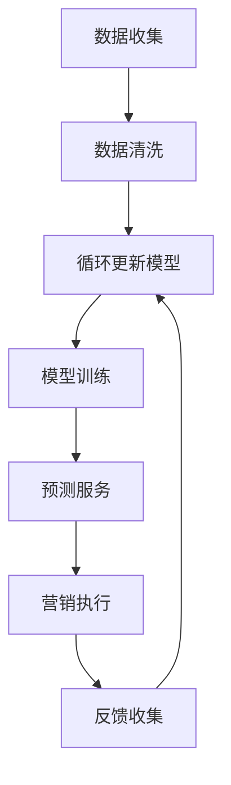

                 

# 《AI驱动的电商智能客户流失预警与精准营销系统》

## 关键词
- AI驱动
- 电商
- 智能客户流失预警
- 精准营销
- 数据挖掘
- 特征工程
- 深度学习
- 强化学习

## 摘要
本文深入探讨了AI驱动的电商智能客户流失预警与精准营销系统的构建与实现。文章首先概述了AI在电商行业中的应用现状与挑战，然后详细阐述了智能客户流失预警与精准营销的重要性。接着，本文从数据预处理、特征工程、模型选择与训练、系统设计与实现等方面，逐步介绍了AI技术在客户流失预警和精准营销中的应用。最后，通过实战案例展示了系统效果，并讨论了AI驱动的电商智能客户流失预警与精准营销系统的发展趋势。

## 目录大纲

### 第一部分：引言

#### 第1章：AI在电商行业中的应用概述

##### 1.1 电商行业现状与挑战

##### 1.2 AI技术在电商中的应用

##### 1.3 智能客户流失预警与精准营销的价值

#### 第2章：AI驱动的客户流失预警

##### 2.1 客户流失预警的重要性

##### 2.2 AI技术在客户流失预警中的应用

###### 2.2.1 数据收集与预处理

###### 2.2.2 特征工程

###### 2.2.3 模型选择与训练

###### 2.2.4 预警系统设计与实现

#### 第3章：精准营销

##### 3.1 精准营销的定义与目标

##### 3.2 AI技术在精准营销中的应用

###### 3.2.1 数据挖掘与消费者行为分析

###### 3.2.2 用户画像构建与标签管理

###### 3.2.3 营销策略优化与效果评估

### 第二部分：技术实现

#### 第4章：AI算法原理与模型

##### 4.1 监督学习算法

###### 4.1.1 线性回归

###### 4.1.2 逻辑回归

###### 4.1.3 决策树与随机森林

###### 4.1.4 支持向量机

##### 4.2 无监督学习算法

###### 4.2.1 K-means聚类

###### 4.2.2 层次聚类

###### 4.2.3 主成分分析

##### 4.3 强化学习算法

###### 4.3.1 Q-Learning算法

###### 4.3.2 深度强化学习算法

#### 第5章：数据预处理与特征工程

##### 5.1 数据收集与清洗

###### 5.1.1 数据收集方法

###### 5.1.2 数据清洗技术

##### 5.2 特征工程

###### 5.2.1 特征选择方法

###### 5.2.2 特征构造技巧

#### 第6章：模型训练与优化

##### 6.1 模型训练策略

###### 6.1.1 训练过程优化

###### 6.1.2 模型调参技巧

##### 6.2 模型评估与选择

###### 6.2.1 评估指标

###### 6.2.2 模型选择方法

#### 第7章：系统设计与实现

##### 7.1 系统架构设计

###### 7.1.1 总体架构

###### 7.1.2 数据流设计

##### 7.2 系统开发与部署

###### 7.2.1 开发环境搭建

###### 7.2.2 源代码实现

###### 7.2.3 系统部署与维护

### 第三部分：实战案例与讨论

#### 第8章：电商客户流失预警与精准营销实战案例

##### 8.1 案例背景与目标

##### 8.2 数据收集与预处理

##### 8.3 模型选择与训练

##### 8.4 预警系统实现与效果评估

##### 8.5 精准营销策略设计与效果分析

#### 第9章：AI驱动的电商智能客户流失预警与精准营销系统发展趋势

##### 9.1 行业发展趋势

##### 9.2 技术发展方向

##### 9.3 未来挑战与机遇

### 附录

#### 附录A：相关工具与技术资源

##### A.1 数据处理工具

###### A.1.1 Pandas

###### A.1.2 NumPy

##### A.2 深度学习框架

###### A.2.1 TensorFlow

###### A.2.2 PyTorch

##### A.3 AI平台与云服务

###### A.3.1 AWS AI

###### A.3.2 Azure AI

###### A.3.3 Google Cloud AI

### 引言

随着互联网的快速发展，电商行业已经成为现代商业的重要组成部分。然而，电商市场竞争日益激烈，客户流失问题成为电商企业面临的重大挑战。据统计，电商客户流失率通常高达90%以上，这给企业的利润和生存带来了巨大的压力。如何有效预测客户流失并实施精准营销，已经成为电商企业亟待解决的关键问题。

AI技术的发展为电商行业带来了新的机遇。AI驱动的智能客户流失预警与精准营销系统，通过分析大量客户数据，利用机器学习和深度学习算法，能够准确预测客户流失风险，并制定个性化的营销策略，提高客户留存率。本文将从AI在电商行业中的应用、客户流失预警与精准营销的原理与实现、实战案例以及未来发展趋势等方面进行深入探讨。

### 第一部分：引言

#### 第1章：AI在电商行业中的应用概述

##### 1.1 电商行业现状与挑战

电商行业在过去几十年中经历了爆炸式增长，从最初的电子书店和在线拍卖网站，发展到如今涵盖服装、家居、数码产品、食品等各个领域的综合性购物平台。根据Statista的数据，全球电商市场在2021年的总交易额已经超过4万亿美元，并且预计在未来几年内还将保持快速增长。

然而，随着市场的饱和和竞争的加剧，电商行业也面临着一系列挑战。首先，客户流失率居高不下。由于电商平台的同质化现象严重，客户很容易在多个平台之间转移购买行为，这导致了客户忠诚度的下降。其次，流量获取成本不断增加。随着广告竞争的激烈，电商平台需要投入更多的资金来吸引新客户。此外，客户需求的变化和个性化要求的提高，也对电商企业提出了更高的服务质量和响应速度要求。

面对这些挑战，电商企业迫切需要找到有效的解决方案。AI技术的应用为电商行业带来了新的机遇。通过AI技术，电商企业可以更深入地理解客户行为，预测客户需求，优化运营流程，提升用户体验，从而提高客户留存率和转化率。

##### 1.2 AI技术在电商中的应用

AI技术在电商行业中有广泛的应用，主要包括客户流失预警、精准营销、个性化推荐、智能客服等方面。

1. **客户流失预警**：AI技术可以通过分析客户的购买历史、浏览行为、社交媒体活动等数据，预测客户流失风险。通过实时监控和预警系统，电商企业可以及时采取措施，如优惠活动、个性化推送等，挽回即将流失的客户。

2. **精准营销**：AI技术可以帮助电商企业更精准地定位目标客户，通过数据挖掘和用户画像分析，制定个性化的营销策略。例如，根据客户的购买习惯和偏好，推送相关商品推荐和促销信息，提高营销效果。

3. **个性化推荐**：AI算法可以根据客户的浏览记录和购买行为，为其推荐可能感兴趣的商品。这种个性化推荐不仅提高了客户的购物体验，还大大提升了商品的销量。

4. **智能客服**：AI技术可以通过自然语言处理和机器学习算法，实现智能客服系统。智能客服可以自动回答客户的常见问题，提供24小时在线服务，提高客户满意度。

##### 1.3 智能客户流失预警与精准营销的价值

智能客户流失预警与精准营销对电商企业具有重要的价值。

首先，客户流失预警可以帮助电商企业降低流失率，提高客户留存率。通过预测客户流失风险，企业可以提前采取干预措施，如发送优惠券、提供特别优惠等，从而减少客户流失。

其次，精准营销可以提升营销ROI（投资回报率）。通过分析客户数据，电商企业可以更准确地定位目标客户，制定个性化的营销策略，从而提高营销效果和转化率。

最后，智能客户流失预警与精准营销还可以提升客户满意度。通过个性化的推荐和服务，企业可以更好地满足客户需求，提升客户的购物体验，从而增强客户忠诚度。

总之，AI驱动的智能客户流失预警与精准营销系统，不仅可以帮助电商企业应对市场挑战，还可以提升企业的竞争力，实现可持续发展。

### 第二部分：技术实现

#### 第2章：AI驱动的客户流失预警

##### 2.1 客户流失预警的重要性

客户流失预警是电商企业维持客户关系、提高客户忠诚度的重要手段。通过预测客户流失风险，企业可以在客户流失之前采取相应措施，如提供特别优惠、增加客户互动等，从而降低客户流失率，提高客户留存率。

流失预警的重要性体现在以下几个方面：

1. **降低客户流失率**：通过预测客户流失风险，企业可以提前发现潜在流失客户，采取有效措施进行挽回，降低客户流失率。

2. **提高客户满意度**：通过流失预警，企业可以提供更加个性化的服务和体验，满足客户需求，提升客户满意度。

3. **提升客户忠诚度**：通过流失预警和有效挽回措施，企业可以增强客户对品牌的信任和忠诚度，从而提高复购率。

4. **降低运营成本**：通过预测和挽回流失客户，企业可以减少新客户获取成本，降低运营成本。

##### 2.2 AI技术在客户流失预警中的应用

AI技术在客户流失预警中的应用主要包括数据收集与预处理、特征工程、模型选择与训练、预警系统设计与实现等方面。

###### 2.2.1 数据收集与预处理

数据收集是客户流失预警的基础。电商企业可以通过多种途径收集客户数据，如购买记录、浏览行为、社交媒体活动、客户反馈等。收集到的数据需要进行预处理，包括数据清洗、数据整合和数据格式转换等步骤。

数据清洗是数据预处理的关键环节。它包括去除重复数据、填补缺失值、处理异常值等。高质量的数据是建模的基础，因此数据清洗的目的是提高数据的准确性和可靠性。

数据整合是将来自不同渠道的数据进行整合，形成一个统一的数据集。这通常需要使用数据融合技术，如数据匹配和数据集成。

数据格式转换是将不同类型的数据转换为适合建模的格式。例如，将时间序列数据转换为数值型数据，将文本数据转换为向量表示。

###### 2.2.2 特征工程

特征工程是客户流失预警的核心环节。通过提取和构建有助于预测客户流失的特征，可以提高模型的准确性和泛化能力。

特征提取是指从原始数据中提取出与客户流失相关的信息。常用的特征提取方法包括统计特征、时间序列特征和文本特征等。

统计特征是通过计算数据的统计属性来提取特征。例如，客户的平均购买频率、购买金额、购买时间间隔等。

时间序列特征是针对时间序列数据进行特征提取。例如，客户的购买间隔时间、购买周期等。

文本特征是通过自然语言处理技术对文本数据进行特征提取。例如，客户的评论内容、社交媒体发布的内容等。

特征构造是指通过组合或变换现有特征来构建新的特征。例如，将客户的购买频率和购买金额进行组合，构建一个新的特征“购买活跃度”。

###### 2.2.3 模型选择与训练

在客户流失预警中，常用的模型包括监督学习模型和无监督学习模型。

监督学习模型是根据已有数据（特征和标签）来训练模型，然后使用训练好的模型对新数据进行预测。常见的监督学习模型包括线性回归、逻辑回归、决策树、支持向量机等。

线性回归模型通过拟合数据点之间的线性关系来预测客户流失风险。

逻辑回归模型通过拟合数据的概率分布来预测客户流失的概率。

决策树模型通过构建树状结构来划分数据，并利用树状结构的分支进行预测。

支持向量机模型通过寻找最优的超平面来划分数据，从而预测客户流失风险。

无监督学习模型是无需标签数据来训练模型，而是通过分析数据结构来发现数据中的隐藏模式。常见的无监督学习模型包括K-means聚类、层次聚类、主成分分析等。

K-means聚类模型通过将数据点分为K个簇，使得每个簇内的数据点相似度更高，簇间的数据点相似度更低。

层次聚类模型通过自底向上或自顶向下的方式构建层次结构，以发现数据中的层次关系。

主成分分析模型通过将数据投影到新的正交坐标系中，从而提取数据的主要特征。

模型选择是客户流失预警的关键步骤。通常需要根据数据特点和业务需求选择合适的模型。例如，对于分类问题，可以选择决策树、支持向量机等分类模型；对于回归问题，可以选择线性回归、逻辑回归等回归模型。

模型训练是指使用已有数据来训练模型，使其能够预测新数据的流失风险。模型训练的过程包括数据集划分、模型初始化、参数调优等步骤。

数据集划分是将数据集分为训练集和测试集。训练集用于训练模型，测试集用于评估模型性能。

模型初始化是指初始化模型的参数，以便模型能够从初始状态开始学习。

参数调优是指调整模型的参数，以获得最佳的预测性能。常用的参数调优方法包括网格搜索、随机搜索等。

模型评估是使用测试集来评估模型的性能。常用的评估指标包括准确率、召回率、F1分数等。

准确率是指模型正确预测的比例。

召回率是指模型能够召回的潜在流失客户的比例。

F1分数是准确率和召回率的加权平均值，用于综合评估模型的性能。

模型选择与训练是一个迭代的过程。通常需要根据评估结果调整模型参数，重新训练模型，并重新评估模型性能，直到找到满足业务需求的最佳模型。

###### 2.2.4 预警系统设计与实现

预警系统设计是客户流失预警系统的关键环节。预警系统设计需要考虑系统的整体架构、数据流设计、接口设计等方面。

系统架构设计是指设计系统的整体结构，包括数据存储、数据处理、模型训练和预测等模块。

数据流设计是指设计数据在系统中的流动过程，包括数据收集、数据预处理、特征工程、模型训练和预测等步骤。

接口设计是指设计系统与其他系统或模块的交互接口，包括数据接口、API接口等。

预警系统实现是指根据系统设计文档，开发具体的系统功能。预警系统实现需要使用编程语言和开发工具，如Python、TensorFlow、Scikit-learn等。

在实现过程中，需要遵循软件工程的最佳实践，如模块化设计、代码复用、单元测试等，以确保系统的稳定性和可维护性。

系统部署与维护是预警系统上线后的重要环节。系统部署是指将开发好的系统部署到生产环境中，包括服务器配置、环境搭建、部署流程等。

系统维护是指对系统进行监控、故障排查、性能优化等，以确保系统稳定运行。

在系统部署和维护过程中，需要考虑系统的可扩展性、安全性和可靠性，以应对业务增长和潜在的风险。

总之，AI驱动的客户流失预警系统通过数据收集与预处理、特征工程、模型选择与训练、预警系统设计与实现等步骤，实现了对客户流失风险的预测和预警，为电商企业提供了有效的客户留存策略。

### 第3章：精准营销

##### 3.1 精准营销的定义与目标

精准营销是一种基于客户数据分析和个性化沟通的营销策略，旨在通过深入了解目标客户的需求和行为，实现精准定位、精准推送和精准转化。与传统营销方式相比，精准营销更注重数据驱动的决策和个性化服务，从而提高营销效果和客户满意度。

精准营销的目标主要包括：

1. **提升客户满意度**：通过满足客户个性化需求，提供定制化的产品和服务，提升客户的购物体验和满意度。

2. **提高营销ROI**：通过精准定位目标客户，降低无效营销成本，提高营销活动的转化率和投资回报率。

3. **增强客户忠诚度**：通过持续跟踪和分析客户行为，制定个性化的营销策略，增强客户对品牌的信任和忠诚度。

4. **优化营销策略**：通过数据分析和效果评估，不断优化营销策略，提高营销活动的精准度和效果。

##### 3.2 AI技术在精准营销中的应用

AI技术在精准营销中的应用主要体现在数据挖掘与消费者行为分析、用户画像构建与标签管理、营销策略优化与效果评估等方面。

###### 3.2.1 数据挖掘与消费者行为分析

数据挖掘是精准营销的重要工具，通过分析海量客户数据，挖掘潜在的客户行为模式和购买需求。AI技术，尤其是机器学习和深度学习算法，在数据挖掘中发挥着重要作用。

1. **客户行为分析**：通过分析客户的浏览记录、购买历史、搜索关键词等数据，挖掘客户的兴趣偏好和购买行为模式。例如，使用聚类算法将客户分为不同的群体，分析不同群体的行为特征。

2. **需求预测**：利用时间序列分析和预测模型，预测客户未来的购买需求。例如，使用ARIMA模型预测客户的购买周期和购买量。

3. **个性化推荐**：基于客户的兴趣和行为数据，使用协同过滤、矩阵分解等算法生成个性化推荐列表，提高推荐系统的准确性。

4. **客户细分**：通过数据挖掘技术，将客户分为不同的细分市场，为每个细分市场制定个性化的营销策略。

###### 3.2.2 用户画像构建与标签管理

用户画像是一种描述客户特征和需求的数字化模型，通过对用户行为数据、兴趣偏好、社会属性等信息的综合分析，构建出一个全面的客户画像。AI技术在用户画像构建和标签管理中发挥着关键作用。

1. **特征提取**：通过自然语言处理、图像识别等技术，从非结构化数据中提取出有价值的信息，构建用户的兴趣偏好、行为特征等维度。

2. **标签管理**：为每个用户分配多个标签，如“高频购买者”、“年轻女性”、“爱好运动”等，以便于后续的精准营销活动。

3. **动态更新**：用户画像需要不断更新，以反映客户最新的需求和变化。通过实时数据采集和分析，动态调整用户的标签和画像。

4. **数据整合**：将来自不同渠道的数据进行整合，形成一个全面的用户画像，提高精准营销的效果。

###### 3.2.3 营销策略优化与效果评估

AI技术在营销策略优化和效果评估中发挥着重要作用，通过数据分析和模型预测，帮助电商企业不断优化营销策略，提高营销效果。

1. **策略优化**：通过机器学习和深度学习算法，分析历史营销活动的效果，优化营销策略。例如，通过A/B测试，比较不同营销策略的效果，选择最优策略。

2. **效果评估**：使用预测模型和实时数据，评估营销活动的效果。例如，通过点击率、转化率等指标，评估营销活动的ROI。

3. **反馈调整**：根据营销活动的效果评估结果，调整后续的营销策略，实现持续优化。

4. **自动化执行**：利用AI技术，实现营销策略的自动化执行。例如，基于用户行为数据，自动发送个性化推荐和促销信息。

总之，AI技术在精准营销中的应用，通过数据挖掘、用户画像构建和营销策略优化，实现了对客户需求的精准定位和个性化服务，提高了营销效果和客户满意度。

### 第4章：AI算法原理与模型

##### 4.1 监督学习算法

监督学习算法是一种通过已有数据（特征和标签）进行训练，从而预测新数据的算法。在客户流失预警和精准营销中，监督学习算法广泛应用于分类和回归任务。

###### 4.1.1 线性回归

线性回归是一种最简单的监督学习算法，它通过拟合数据点之间的线性关系来预测目标值。线性回归模型的公式如下：

$$y = \beta_0 + \beta_1 \cdot x_1 + \beta_2 \cdot x_2 + ... + \beta_n \cdot x_n$$

其中，$y$ 是预测的目标值，$x_1, x_2, ..., x_n$ 是输入特征，$\beta_0, \beta_1, \beta_2, ..., \beta_n$ 是模型参数。

线性回归算法的核心步骤包括：

1. **数据预处理**：对数据进行归一化或标准化处理，使其具备相似的尺度。

2. **模型训练**：使用最小二乘法或其他优化算法，求解模型参数$\beta_0, \beta_1, \beta_2, ..., \beta_n$。

3. **模型评估**：使用测试集评估模型性能，常用的评估指标包括均方误差（MSE）、决定系数（R²）等。

4. **模型应用**：使用训练好的模型对新数据进行预测。

###### 4.1.2 逻辑回归

逻辑回归是一种用于分类问题的监督学习算法，它通过拟合数据的概率分布来预测类别的概率。逻辑回归模型的公式如下：

$$\ln\left(\frac{p}{1-p}\right) = \beta_0 + \beta_1 \cdot x_1 + \beta_2 \cdot x_2 + ... + \beta_n \cdot x_n$$

其中，$p$ 是预测的概率值，$x_1, x_2, ..., x_n$ 是输入特征，$\beta_0, \beta_1, \beta_2, ..., \beta_n$ 是模型参数。

逻辑回归算法的核心步骤包括：

1. **数据预处理**：对数据进行归一化或标准化处理。

2. **模型训练**：使用极大似然估计法或其他优化算法，求解模型参数$\beta_0, \beta_1, \beta_2, ..., \beta_n$。

3. **模型评估**：使用测试集评估模型性能，常用的评估指标包括准确率、召回率、F1分数等。

4. **模型应用**：使用训练好的模型对新数据进行预测。

###### 4.1.3 决策树与随机森林

决策树是一种基于树形结构进行分类和回归的监督学习算法。决策树的每个节点代表一个特征，每个分支代表该特征的取值。决策树的公式如下：

$$T(x) = c$$

其中，$T(x)$ 是决策树模型的预测结果，$x$ 是输入特征，$c$ 是决策树在叶子节点上的分类结果。

随机森林是一种基于决策树的集成学习方法，它通过构建多棵决策树，并对它们的预测结果进行投票或求平均，得到最终的预测结果。随机森林的公式如下：

$$T(x) = \sum_{i=1}^{n} T_i(x)$$

其中，$T_i(x)$ 是第$i$棵决策树的预测结果，$n$ 是决策树的数量。

决策树和随机森林算法的核心步骤包括：

1. **数据预处理**：对数据进行归一化或标准化处理。

2. **模型训练**：使用递归二分搜索或信息增益等算法，构建决策树或随机森林模型。

3. **模型评估**：使用测试集评估模型性能，常用的评估指标包括准确率、召回率、F1分数等。

4. **模型应用**：使用训练好的模型对新数据进行预测。

###### 4.1.4 支持向量机

支持向量机（SVM）是一种基于最大间隔分类的监督学习算法，它通过寻找一个最优的超平面，将数据集划分为不同的类别。SVM的公式如下：

$$\max_{\beta, \beta_0} \frac{1}{2} \sum_{i=1}^{n} (\beta \cdot \beta - \beta_0)$$

$$s.t. y_i (\beta \cdot x_i + \beta_0) \geq 1$$

其中，$\beta$ 是模型参数，$\beta_0$ 是偏置项，$x_i$ 是输入特征，$y_i$ 是标签。

支持向量机算法的核心步骤包括：

1. **数据预处理**：对数据进行归一化或标准化处理。

2. **模型训练**：使用拉格朗日乘子法或SMO算法，求解模型参数$\beta$ 和 $\beta_0$。

3. **模型评估**：使用测试集评估模型性能，常用的评估指标包括准确率、召回率、F1分数等。

4. **模型应用**：使用训练好的模型对新数据进行预测。

##### 4.2 无监督学习算法

无监督学习算法是在没有标签数据的情况下，通过分析数据的内在结构或模式进行学习。在客户流失预警和精准营销中，无监督学习算法广泛应用于聚类和降维任务。

###### 4.2.1 K-means聚类

K-means聚类是一种基于距离度量的聚类算法，它通过将数据点分配到K个簇中，使得每个簇内的数据点相似度更高，簇间的数据点相似度更低。K-means聚类的公式如下：

$$c_k = \frac{1}{N_k} \sum_{i=1}^{N_k} x_i$$

$$x_i = \frac{1}{N_k} \sum_{j=1}^{K} \frac{1}{d(x_i, c_j)}$$

其中，$c_k$ 是第$k$个簇的中心点，$x_i$ 是第$i$个数据点，$N_k$ 是第$k$个簇中的数据点数量，$d(x_i, c_j)$ 是$x_i$ 和$c_j$ 之间的距离。

K-means聚类算法的核心步骤包括：

1. **初始化**：随机选择K个初始中心点。

2. **迭代更新**：计算每个数据点到中心点的距离，将数据点分配到最近的中心点所代表的簇，更新中心点位置。

3. **模型评估**：使用簇内距离、簇间距离等指标评估聚类效果。

4. **模型应用**：根据聚类结果，对数据进行分类或标签分配。

###### 4.2.2 层次聚类

层次聚类是一种基于层次结构进行聚类的算法，它通过自底向上或自顶向下的方式，将数据点逐步合并或拆分，构建出一个层次结构。层次聚类的公式如下：

$$D_{ij} = \min(d_i, d_j)$$

$$C_{t+1} = \cup C_i, C_j$$

其中，$D_{ij}$ 是第$i$个和第$j$个数据点之间的距离，$C_i$ 和 $C_j$ 是第$i$个和第$j$个簇。

层次聚类算法的核心步骤包括：

1. **初始化**：将每个数据点视为一个簇。

2. **合并或拆分**：根据距离度量，选择最近的两个簇进行合并或拆分。

3. **模型评估**：使用轮廓系数、类内平均距离等指标评估聚类效果。

4. **模型应用**：根据聚类结果，对数据进行分类或标签分配。

###### 4.2.3 主成分分析

主成分分析（PCA）是一种降维算法，它通过将数据投影到新的正交坐标系中，提取数据的主要特征，从而降低数据的维度。PCA的公式如下：

$$z_i = P \cdot x_i$$

其中，$z_i$ 是新的特征向量，$P$ 是投影矩阵，$x_i$ 是原始数据向量。

PCA算法的核心步骤包括：

1. **协方差矩阵计算**：计算数据的协方差矩阵。

2. **特征值和特征向量计算**：求解协方差矩阵的特征值和特征向量。

3. **特征向量选择**：根据特征值的大小，选择前$k$个特征向量。

4. **数据投影**：将原始数据投影到新的正交坐标系中。

5. **模型评估**：使用重构误差等指标评估降维效果。

6. **模型应用**：使用降维后的数据，进行后续的分析和建模。

##### 4.3 强化学习算法

强化学习算法是一种基于反馈机制进行学习的方法，它通过不断地尝试和反馈，找到最优策略以最大化奖励。在客户流失预警和精准营销中，强化学习算法可以用于策略优化和自动化决策。

###### 4.3.1 Q-Learning算法

Q-Learning算法是一种基于值函数的强化学习算法，它通过不断更新状态-动作值函数，找到最优策略。Q-Learning算法的公式如下：

$$Q(s, a) = Q(s, a) + \alpha [r + \gamma \max_{a'} Q(s', a') - Q(s, a)]$$

其中，$Q(s, a)$ 是状态$s$ 和动作$a$ 的值函数，$r$ 是即时奖励，$\gamma$ 是折扣因子，$s'$ 是下一状态，$a'$ 是最优动作。

Q-Learning算法的核心步骤包括：

1. **初始化**：初始化值函数$Q(s, a)$ 和奖励$r$。

2. **选择动作**：在当前状态$s$ ，根据当前值函数选择最优动作$a$。

3. **执行动作**：执行动作$a$，进入下一状态$s'$。

4. **更新值函数**：根据即时奖励$r$ 和折扣因子$\gamma$ ，更新值函数$Q(s, a)$。

5. **重复步骤2-4**，直到达到目标状态或满足停止条件。

###### 4.3.2 深度强化学习算法

深度强化学习算法是一种结合深度学习和强化学习的方法，它通过使用深度神经网络作为价值函数或策略网络，提高强化学习的效果。深度强化学习算法的公式如下：

$$Q(s, a; \theta) = \frac{1}{|\mathcal{D}|} \sum_{(s, a, r, s') \in \mathcal{D}} r + \gamma \max_{a'} Q(s', a'; \theta)$$

其中，$Q(s, a; \theta)$ 是基于参数$\theta$ 的状态-动作值函数，$\mathcal{D}$ 是经验回放池，$r$ 是即时奖励，$\gamma$ 是折扣因子。

深度强化学习算法的核心步骤包括：

1. **初始化**：初始化深度神经网络参数$\theta$ 和奖励$r$。

2. **选择动作**：在当前状态$s$ ，根据深度神经网络的价值函数$Q(s, a; \theta)$ 选择最优动作$a$。

3. **执行动作**：执行动作$a$，进入下一状态$s'$。

4. **更新参数**：根据即时奖励$r$ 和经验回放池$\mathcal{D}$ ，使用梯度下降或其他优化算法更新深度神经网络参数$\theta$。

5. **重复步骤2-4**，直到达到目标状态或满足停止条件。

总之，AI算法原理与模型在客户流失预警和精准营销中扮演着重要角色。通过监督学习算法、无监督学习算法和强化学习算法，可以构建出高效的预警和营销系统，提高客户留存率和营销效果。

### 第5章：数据预处理与特征工程

##### 5.1 数据收集与清洗

数据预处理是构建AI驱动系统的重要步骤，尤其是在电商智能客户流失预警与精准营销系统中。数据收集与清洗是数据预处理的核心环节，直接关系到后续分析和模型训练的效果。

###### 5.1.1 数据收集方法

数据收集是获取用于建模和分析的原始数据的过程。电商企业可以通过以下几种方法进行数据收集：

1. **日志数据**：通过网站或应用程序的日志记录用户行为数据，如浏览记录、点击事件、购买行为等。

2. **用户反馈**：收集用户在社交媒体、论坛、问卷调查等渠道提供的反馈和评价。

3. **第三方数据源**：通过购买或交换数据，获取客户 demographics（人口统计）数据、地理位置数据、消费习惯数据等。

4. **公共数据集**：利用公共数据集进行训练和测试，如UCI机器学习库、Kaggle数据集等。

数据收集方法的选择取决于数据需求和业务目标。例如，对于客户流失预警系统，需要收集用户的购买历史、浏览行为、社交媒体活动等多维度数据。

###### 5.1.2 数据清洗技术

数据清洗是确保数据质量的过程，包括去除重复数据、填补缺失值、处理异常值等。

1. **去除重复数据**：在数据集中，可能存在重复的记录，这会导致模型训练中的偏差。可以使用去重算法，如基于唯一标识符（如用户ID）的去重。

2. **填补缺失值**：缺失值可能会影响模型的训练效果。常用的填补方法包括：

   - **平均值填补**：用特征的平均值替代缺失值。
   - **中值填补**：用特征的中值替代缺失值。
   - **众数填补**：用特征的众数替代缺失值。
   - **插值法**：使用时间序列插值方法填补缺失值。
   - **模型填补**：使用机器学习模型预测缺失值。

3. **处理异常值**：异常值可能会对模型产生不利影响。处理异常值的方法包括：

   - **删除**：删除异常值数据。
   - **转换**：对异常值进行变换，使其符合数据的分布。
   - **截断**：将异常值限制在某个范围内，如三倍标准差。

数据清洗的目的是提高数据的准确性和一致性，确保模型能够从高质量的数据中学习到有用的信息。以下是数据清洗过程的示例伪代码：

```python
# 导入必要的库
import pandas as pd
from sklearn.impute import SimpleImputer
from sklearn.preprocessing import StandardScaler

# 加载数据
data = pd.read_csv('data.csv')

# 去除重复数据
data.drop_duplicates(inplace=True)

# 填补缺失值
imputer = SimpleImputer(strategy='mean')
data_filled = imputer.fit_transform(data)

# 处理异常值
scaler = StandardScaler()
data_scaled = scaler.fit_transform(data_filled)

# 保存清洗后的数据
pd.DataFrame(data_scaled).to_csv('cleaned_data.csv', index=False)
```

通过上述步骤，可以确保数据的质量，为后续的特征工程和模型训练打下坚实的基础。

##### 5.2 特征工程

特征工程是数据预处理的关键步骤，它通过提取和构造有助于模型预测的特征，提升模型的性能。在电商智能客户流失预警与精准营销系统中，特征工程至关重要，因为它能够帮助模型更好地理解客户行为和需求。

###### 5.2.1 特征选择方法

特征选择是减少特征维度、提高模型性能的重要步骤。以下是一些常用的特征选择方法：

1. **基于信息的特征选择**：这种方法通过评估特征对于预测目标的信息量来选择特征。常用的评估方法包括信息增益（Information Gain）、增益率（Gain Ratio）等。

2. **基于距离的特征选择**：这种方法通过计算特征与目标之间的距离来选择特征，例如，使用欧氏距离或曼哈顿距离等。

3. **基于模型的特征选择**：这种方法通过训练模型并评估特征对模型性能的影响来选择特征。例如，使用随机森林或Lasso回归模型来评估特征的重要性。

4. **基于过滤的特征选择**：这种方法在特征选择过程中不依赖于模型，而是通过统计方法直接评估特征的有效性。常用的过滤方法包括相关性分析、方差分析等。

以下是使用过滤方法进行特征选择的示例伪代码：

```python
# 导入必要的库
import pandas as pd
from sklearn.feature_selection import SelectKBest
from sklearn.feature_selection import f_classif

# 加载数据
data = pd.read_csv('cleaned_data.csv')

# 分离特征和目标变量
X = data.drop('target', axis=1)
y = data['target']

# 使用f_classif方法进行特征选择
selector = SelectKBest(f_classif, k=10)
X_selected = selector.fit_transform(X, y)

# 打印选择的特征名称
print(selector.get_support())

# 保存选择的特征
pd.DataFrame(X_selected).to_csv('selected_features.csv', index=False)
```

通过特征选择，可以减少冗余特征，提高模型的可解释性和训练效率。

###### 5.2.2 特征构造技巧

特征构造是通过组合或变换现有特征来构建新的特征，以提高模型的性能。以下是一些常用的特征构造技巧：

1. **时间特征**：通过计算时间相关的特征，如购买间隔时间、活动参与时间等。例如，可以将用户上次购买日期与当前日期之间的时间差转换为特征。

2. **统计特征**：通过计算数据的基本统计属性，如平均值、中值、标准差等。例如，可以计算用户购买金额的平均值和标准差。

3. **交互特征**：通过组合两个或多个特征，创建新的交互特征。例如，可以计算用户购买金额与购买频率的乘积。

4. **类别特征**：通过将类别特征转换为数值特征，可以使用独热编码（One-Hot Encoding）或标签编码（Label Encoding）等方法。

5. **文本特征**：通过自然语言处理技术，提取文本数据中的关键信息。例如，可以提取用户评论中的关键词和情感倾向。

以下是构造新特征的一个示例伪代码：

```python
# 导入必要的库
import pandas as pd

# 加载数据
data = pd.read_csv('cleaned_data.csv')

# 计算时间特征
data['days_since_last_purchase'] = (pd.to_datetime('now') - pd.to_datetime(data['last_purchase_date'])).dt.days

# 计算统计特征
data['avg_purchase_amount'] = data['total_purchase_amount'] / data['num_purchases']
data['std_purchase_amount'] = data['total_purchase_amount'] / data['num_purchases'].std()

# 构造交互特征
data['purchase_amount_frequency'] = data['total_purchase_amount'] * data['num_purchases']

# 保存新特征的数据
data.to_csv('new_features_data.csv', index=False)
```

通过特征构造，可以增强模型对数据中复杂关系的理解能力，从而提高模型的预测准确性。

总之，数据预处理与特征工程是构建高效AI驱动的电商智能客户流失预警与精准营销系统的关键步骤。通过数据收集与清洗、特征选择与构造，可以确保模型从高质量的数据中学习到有用的信息，从而实现精准的客户流失预警和个性化营销。

### 第6章：模型训练与优化

##### 6.1 模型训练策略

模型训练是构建AI驱动电商智能客户流失预警与精准营销系统的核心环节。训练策略直接影响模型的性能和预测准确性。以下是一些常用的模型训练策略：

###### 6.1.1 训练过程优化

1. **数据增强**：通过引入额外的训练数据，如使用数据增强技术生成虚拟数据，可以增强模型的鲁棒性。例如，可以通过随机噪声添加、数据变换等方式增加数据的多样性。

2. **批处理和迭代**：在训练过程中，将数据划分为多个批次（batch），每次处理一批数据。迭代次数（epochs）决定了模型在训练数据上重复训练的次数。适当的批处理大小和迭代次数可以提高模型的收敛速度和训练效果。

3. **学习率调整**：学习率是模型训练中的一个关键参数，它决定了模型在每一步更新中的步长。常用的调整方法包括固定学习率、学习率衰减、自适应调整等。学习率的设置需要根据具体问题进行调整，以避免过拟合或欠拟合。

4. **正则化**：通过引入正则化项，如L1正则化（Lasso）和L2正则化（Ridge），可以减少模型过拟合的风险。正则化项通常与模型的权重项相关联，通过增加权重项的惩罚，抑制模型复杂度的增长。

5. **提前停止**：在模型训练过程中，如果验证集的性能不再提升，可以提前停止训练，避免过拟合。提前停止通过监测验证集的损失函数或准确率来实现。

以下是一个使用PyTorch框架进行模型训练的示例伪代码：

```python
import torch
import torch.nn as nn
import torch.optim as optim

# 定义模型
model = nn.Sequential(
    nn.Linear(input_size, hidden_size),
    nn.ReLU(),
    nn.Linear(hidden_size, output_size)
)

# 定义损失函数和优化器
loss_function = nn.CrossEntropyLoss()
optimizer = optim.Adam(model.parameters(), lr=0.001)

# 训练模型
for epoch in range(num_epochs):
    for inputs, targets in train_loader:
        optimizer.zero_grad()
        outputs = model(inputs)
        loss = loss_function(outputs, targets)
        loss.backward()
        optimizer.step()
    
    # 监测验证集性能
    if not is_better(model, validation_loss, best_loss):
        break

    # 打印训练进度
    print(f'Epoch {epoch+1}/{num_epochs}, Loss: {loss.item()}')
```

###### 6.1.2 模型调参技巧

模型调参是提高模型性能的关键步骤。以下是一些常用的调参技巧：

1. **网格搜索**：通过遍历参数空间中的每个组合，找到最优参数。这种方法虽然计算成本较高，但可以确保找到全局最优解。

2. **随机搜索**：在参数空间中随机采样参数组合，通过多次实验找到最优参数。随机搜索比网格搜索计算成本更低，但可能无法找到全局最优解。

3. **贝叶斯优化**：利用贝叶斯统计模型，通过历史实验数据，预测下一个实验的最佳参数组合。这种方法在参数空间较大时表现出色。

4. **交叉验证**：使用交叉验证技术，将数据集划分为多个子集，每次训练模型时，使用不同的子集进行训练和验证。通过交叉验证，可以评估模型的泛化能力。

以下是一个使用随机搜索进行模型调参的示例伪代码：

```python
from sklearn.model_selection import RandomizedSearchCV
from sklearn.ensemble import RandomForestClassifier

# 定义参数范围
param_distributions = {
    'n_estimators': [100, 200, 300],
    'max_depth': [None, 10, 20, 30],
    'min_samples_split': [2, 5, 10],
    'min_samples_leaf': [1, 2, 4]
}

# 定义模型
model = RandomForestClassifier()

# 定义交叉验证
cv = RandomizedSearchCV(model, param_distributions, n_iter=100, cv=5)

# 训练模型
cv.fit(X_train, y_train)

# 获取最优参数
best_params = cv.best_params_
print(f'Best parameters: {best_params}')

# 使用最优参数训练模型
model = RandomForestClassifier(**best_params)
model.fit(X_train, y_train)
```

通过优化训练过程和调参技巧，可以显著提高模型的性能和预测准确性，从而实现更有效的客户流失预警和精准营销。

##### 6.2 模型评估与选择

模型评估与选择是确保模型性能和可靠性的关键步骤。在电商智能客户流失预警与精准营销系统中，选择合适的评估指标和模型选择方法至关重要。

###### 6.2.1 评估指标

1. **准确率（Accuracy）**：准确率是指模型正确预测的比例。它是分类问题中最常用的评估指标，公式如下：

   $$Accuracy = \frac{TP + TN}{TP + TN + FP + FN}$$

   其中，$TP$ 是真正例，$TN$ 是真反例，$FP$ 是假正例，$FN$ 是假反例。

2. **召回率（Recall）**：召回率是指模型能够召回的潜在流失客户的比例。它是衡量模型对正类别的识别能力，公式如下：

   $$Recall = \frac{TP}{TP + FN}$$

3. **精确率（Precision）**：精确率是指模型预测为正例的样本中，实际为正例的比例。它是衡量模型对正例样本的识别准确性，公式如下：

   $$Precision = \frac{TP}{TP + FP}$$

4. **F1分数（F1 Score）**：F1分数是精确率和召回率的加权平均值，用于综合评估模型的性能，公式如下：

   $$F1 Score = 2 \cdot \frac{Precision \cdot Recall}{Precision + Recall}$$

5. **ROC曲线和AUC（Area Under Curve）**：ROC曲线是绘制真阳性率（True Positive Rate，TPR）与假阳性率（False Positive Rate，FPR）的图形。AUC值是ROC曲线下方的面积，用于评估模型的分类能力。AUC值越高，模型性能越好。

6. **均方误差（MSE）**：均方误差是回归问题中常用的评估指标，用于衡量预测值与实际值之间的平均误差，公式如下：

   $$MSE = \frac{1}{n} \sum_{i=1}^{n} (y_i - \hat{y}_i)^2$$

   其中，$y_i$ 是实际值，$\hat{y}_i$ 是预测值。

7. **R²（决定系数）**：R²是回归问题中衡量模型拟合优度的指标，表示模型解释的变异比例，公式如下：

   $$R^2 = 1 - \frac{SS_{res}}{SS_{tot}}$$

   其中，$SS_{res}$ 是残差平方和，$SS_{tot}$ 是总平方和。

不同评估指标适用于不同类型的任务和数据分布。在选择评估指标时，需要根据业务需求和数据特点进行综合考虑。

###### 6.2.2 模型选择方法

模型选择是确保模型性能和可靠性的关键步骤。以下是一些常用的模型选择方法：

1. **交叉验证**：交叉验证通过将数据集划分为多个子集，每次训练模型时使用不同的子集进行训练和验证，从而评估模型的泛化能力。常用的交叉验证方法包括K折交叉验证和留一交叉验证。

2. **网格搜索**：网格搜索通过遍历参数空间中的每个组合，找到最优参数。这种方法虽然计算成本较高，但可以确保找到全局最优解。

3. **随机搜索**：随机搜索在参数空间中随机采样参数组合，通过多次实验找到最优参数。随机搜索比网格搜索计算成本更低，但可能无法找到全局最优解。

4. **贝叶斯优化**：贝叶斯优化利用贝叶斯统计模型，通过历史实验数据，预测下一个实验的最佳参数组合。这种方法在参数空间较大时表现出色。

5. **集成学习**：集成学习通过组合多个模型，提高模型的性能和泛化能力。常用的集成学习方法包括Bagging、Boosting和Stacking。

以下是一个使用交叉验证进行模型选择的方法示例：

```python
from sklearn.model_selection import cross_val_score
from sklearn.ensemble import RandomForestClassifier

# 定义模型
model = RandomForestClassifier()

# 定义交叉验证
cv = KFold(n_splits=5, shuffle=True, random_state=42)

# 计算交叉验证评分
scores = cross_val_score(model, X, y, cv=cv, scoring='f1')

# 打印评分结果
print(f'F1 Score: {scores.mean()}')

# 选择最佳模型
model.fit(X_train, y_train)
```

通过上述评估指标和模型选择方法，可以确保选择出性能最佳的模型，从而实现高效的电商智能客户流失预警与精准营销。

### 第7章：系统设计与实现

##### 7.1 系统架构设计

系统架构设计是构建电商智能客户流失预警与精准营销系统的关键步骤，它决定了系统的性能、可扩展性和可靠性。以下是系统架构设计的主要组成部分：

###### 7.1.1 总体架构

电商智能客户流失预警与精准营销系统的总体架构可以分为以下几个层次：

1. **数据层**：数据层负责存储和管理各种数据，包括客户数据、商品数据、交易数据等。常用的数据存储方案包括关系数据库（如MySQL）、NoSQL数据库（如MongoDB）和大数据存储系统（如Hadoop、HBase）。

2. **数据处理层**：数据处理层负责对数据进行收集、清洗、预处理和特征工程。常用的数据处理工具包括Pandas、Spark和Hadoop等。

3. **模型层**：模型层负责构建和训练各种机器学习模型，包括客户流失预警模型、精准营销模型等。常用的机器学习框架包括Scikit-learn、TensorFlow和PyTorch等。

4. **服务层**：服务层负责实现系统的业务逻辑，包括数据服务、预测服务和营销服务。常用的服务框架包括Django、Flask和Spring Boot等。

5. **接口层**：接口层负责与其他系统或模块进行数据交换和功能调用。常用的接口技术包括RESTful API、GraphQL和WebSocket等。

6. **前端层**：前端层负责实现用户界面，提供用户交互功能。常用的前端技术包括HTML、CSS、JavaScript和React等。

###### 7.1.2 数据流设计

数据流设计是系统架构设计中的重要组成部分，它描述了数据在系统中的流动过程。以下是电商智能客户流失预警与精准营销系统的主要数据流设计：

1. **数据收集**：数据收集阶段从各种数据源（如数据库、日志文件、第三方API等）收集客户数据、商品数据、交易数据等。

2. **数据清洗**：数据清洗阶段对收集到的数据进行清洗，去除重复数据、填补缺失值、处理异常值等，确保数据的质量。

3. **数据预处理**：数据预处理阶段对清洗后的数据进行特征提取、特征构造和特征工程，为模型训练提供高质量的特征数据。

4. **模型训练**：模型训练阶段使用预处理后的数据进行模型训练，构建客户流失预警模型、精准营销模型等。

5. **预测服务**：预测服务阶段使用训练好的模型对新的客户数据进行预测，生成客户流失预警和精准营销策略。

6. **营销执行**：营销执行阶段根据预测结果，执行精准营销策略，如发送优惠券、推荐商品等。

7. **反馈收集**：反馈收集阶段记录营销活动的效果，包括点击率、转化率等，用于模型优化和效果评估。

数据流设计示意图如下：



通过上述数据流设计，系统实现了从数据收集到营销执行的全流程，确保了数据的连续性和模型的持续优化。

##### 7.2 系统开发与部署

系统开发与部署是电商智能客户流失预警与精准营销系统落地的重要环节，它涉及开发环境搭建、源代码实现和系统部署与维护等多个方面。

###### 7.2.1 开发环境搭建

开发环境搭建是系统开发的第一步，它为开发人员提供了必要的工具和资源。以下是搭建开发环境的基本步骤：

1. **安装操作系统**：选择适合的操作系统，如Linux或Windows。

2. **安装编程语言**：安装Python等编程语言，并配置Python环境。

3. **安装依赖库**：安装用于数据预处理、模型训练和预测的依赖库，如NumPy、Pandas、Scikit-learn、TensorFlow等。

4. **配置数据库**：安装和配置关系数据库（如MySQL）或NoSQL数据库（如MongoDB），用于数据存储和管理。

5. **安装Web框架**：安装用于构建Web服务的框架，如Django、Flask或Spring Boot。

6. **配置版本控制**：使用Git等版本控制工具，管理项目源代码和版本。

通过上述步骤，开发人员可以搭建一个完整的开发环境，为系统开发提供基础支持。

###### 7.2.2 源代码实现

源代码实现是系统开发的核心环节，它涉及数据预处理、模型训练、预测服务和营销执行等多个模块的实现。以下是源代码实现的示例：

1. **数据预处理**：使用Pandas库读取和清洗数据，进行特征提取和构造。

2. **模型训练**：使用Scikit-learn或TensorFlow库训练机器学习模型，如逻辑回归、决策树、随机森林等。

3. **预测服务**：实现RESTful API，用于接收新的客户数据并进行预测。

4. **营销执行**：根据预测结果，生成营销策略并执行，如发送优惠券、推荐商品等。

以下是一个简单的Python代码示例，用于实现数据预处理和模型训练：

```python
import pandas as pd
from sklearn.model_selection import train_test_split
from sklearn.ensemble import RandomForestClassifier

# 读取数据
data = pd.read_csv('data.csv')

# 数据清洗和特征提取
# ...

# 分离特征和目标变量
X = data.drop('target', axis=1)
y = data['target']

# 划分训练集和测试集
X_train, X_test, y_train, y_test = train_test_split(X, y, test_size=0.2, random_state=42)

# 训练模型
model = RandomForestClassifier()
model.fit(X_train, y_train)

# 评估模型
score = model.score(X_test, y_test)
print(f'Model accuracy: {score}')
```

###### 7.2.3 系统部署与维护

系统部署是将开发好的系统部署到生产环境中的过程，它包括以下几个方面：

1. **服务器配置**：选择合适的服务器硬件和操作系统，配置网络和防火墙等安全措施。

2. **环境配置**：在服务器上安装和配置开发环境，包括Python、数据库、Web框架等。

3. **部署应用**：将源代码和应用文件部署到服务器，配置服务器的运行环境和依赖库。

4. **监控与维护**：监控系统性能和日志，定期更新和优化系统，确保系统的稳定性和安全性。

以下是一个简单的部署脚本示例：

```bash
# 部署脚本
#!/bin/bash

# 配置环境
sudo apt-get update
sudo apt-get install python3 python3-pip

# 安装依赖库
pip3 install numpy pandas scikit-learn tensorflow

# 部署应用
git clone https://github.com/username/ecommerce_ai.git
cd ecommerce_ai
python3 manage.py runserver 0.0.0.0:8000
```

通过上述步骤，可以将系统部署到生产环境中，提供稳定的客户流失预警与精准营销服务。

### 第8章：电商客户流失预警与精准营销实战案例

##### 8.1 案例背景与目标

本案例以一家大型电商平台为例，探讨如何构建AI驱动的电商智能客户流失预警与精准营销系统。该电商平台拥有庞大的用户基础和丰富的客户数据，希望通过AI技术提高客户留存率和营销ROI。

案例目标包括：

1. **客户流失预警**：通过分析用户行为数据，预测客户流失风险，并提前采取干预措施。

2. **精准营销**：根据用户画像和消费行为，制定个性化的营销策略，提高营销效果和客户满意度。

##### 8.2 数据收集与预处理

数据收集是本案例的基础，平台从多个数据源收集了以下数据：

1. **用户行为数据**：包括浏览记录、点击事件、购买历史等。
2. **用户信息数据**：包括年龄、性别、地理位置、职业等。
3. **交易数据**：包括订单号、订单金额、订单日期等。

数据预处理是确保数据质量和模型性能的关键步骤，主要包括以下任务：

1. **数据清洗**：去除重复数据、填补缺失值、处理异常值。
2. **数据整合**：将不同数据源的数据进行整合，形成统一的数据集。
3. **数据转换**：将时间序列数据转换为数值型数据，将文本数据转换为向量表示。

以下是一个数据预处理流程的伪代码示例：

```python
import pandas as pd

# 读取数据
user_data = pd.read_csv('user_data.csv')
purchase_data = pd.read_csv('purchase_data.csv')
behavior_data = pd.read_csv('behavior_data.csv')

# 数据清洗
user_data.drop_duplicates(inplace=True)
purchase_data.drop_duplicates(inplace=True)
behavior_data.drop_duplicates(inplace=True)

# 数据整合
data = pd.merge(user_data, purchase_data, on='user_id')
data = pd.merge(data, behavior_data, on='user_id')

# 数据转换
data['last_purchase_date'] = pd.to_datetime(data['last_purchase_date'])
data['days_since_last_purchase'] = (pd.to_datetime('now') - data['last_purchase_date']).dt.days

# 填补缺失值
data.fillna(data.mean(), inplace=True)

# 保存预处理后的数据
data.to_csv('preprocessed_data.csv', index=False)
```

##### 8.3 模型选择与训练

在选择模型时，本案例采用了以下步骤：

1. **数据划分**：将数据集划分为训练集和测试集，用于模型训练和评估。
2. **特征选择**：通过信息增益、相关性分析等方法选择对模型性能有显著影响的特征。
3. **模型训练**：采用随机森林、逻辑回归等模型进行训练，并使用交叉验证评估模型性能。

以下是一个模型训练流程的伪代码示例：

```python
from sklearn.ensemble import RandomForestClassifier
from sklearn.model_selection import train_test_split
from sklearn.metrics import accuracy_score

# 划分训练集和测试集
X = data.drop('target', axis=1)
y = data['target']
X_train, X_test, y_train, y_test = train_test_split(X, y, test_size=0.2, random_state=42)

# 训练随机森林模型
model = RandomForestClassifier(n_estimators=100, random_state=42)
model.fit(X_train, y_train)

# 评估模型
y_pred = model.predict(X_test)
accuracy = accuracy_score(y_test, y_pred)
print(f'Model accuracy: {accuracy}')
```

##### 8.4 预警系统实现与效果评估

基于训练好的模型，本案例实现了客户流失预警系统，包括以下步骤：

1. **实时监控**：通过API接口，实时接收用户行为数据，并预测客户流失风险。
2. **预警策略**：对于高风险客户，发送个性化预警信息，如优惠券、促销活动等。
3. **效果评估**：通过监控预警策略的效果，评估系统的准确性和有效性。

以下是一个预警系统实现和效果评估的伪代码示例：

```python
import requests

# 实时监控
def monitor_user_behavior(user_id):
    user_data = get_user_data(user_id)
    risk_score = predict_risk_score(user_data)
    if risk_score > threshold:
        send_warning_message(user_id, risk_score)

# 预测客户流失风险
def predict_risk_score(user_data):
    return model.predict([user_data])[0]

# 发送预警信息
def send_warning_message(user_id, risk_score):
    message = f"您的流失风险评分：{risk_score}，建议关注！"
    send_sms(user_id, message)

# 效果评估
def evaluate_warning_system():
    true_positives = 0
    false_positives = 0
    for user_id in user_list:
        risk_score = predict_risk_score(user_id)
        if is_lost(user_id):
            if risk_score > threshold:
                true_positives += 1
            else:
                false_positives += 1
        else:
            if risk_score > threshold:
                false_positives += 1
    
    precision = true_positives / (true_positives + false_positives)
    recall = true_positives / (true_positives + missed_losses)
    f1_score = 2 * precision * recall / (precision + recall)
    print(f'Precision: {precision}, Recall: {recall}, F1 Score: {f1_score}')
```

通过上述预警系统实现和效果评估，可以有效监控客户流失风险，提高客户留存率。

##### 8.5 精准营销策略设计与效果分析

基于客户流失预警结果，本案例设计了以下精准营销策略：

1. **优惠券发送**：针对高风险客户，发送特定商品的优惠券，以降低流失风险。
2. **个性化推荐**：根据客户的历史购买和浏览行为，推荐相关商品，提高购买转化率。
3. **互动活动**：组织线上互动活动，如抽奖、优惠券兑换等，增强客户参与度。

以下是一个精准营销策略设计和效果分析的伪代码示例：

```python
# 设计精准营销策略
def design_marketing_strategy(user_id):
    user_data = get_user_data(user_id)
    if predict_risk_score(user_data) > threshold:
        send_coupon(user_id)
    if predict_purchase_interest(user_data):
        recommend_products(user_id)
    if user_participation_rate < threshold:
        organize_interactive_activity(user_id)

# 发送优惠券
def send_coupon(user_id):
    coupon = generate_coupon()
    send_sms(user_id, f"您的优惠券：{coupon}，请在规定时间内使用！")

# 推荐商品
def recommend_products(user_id):
    products = get_recommended_products(user_id)
    send_email(user_id, f"根据您的喜好，我们为您推荐了以下商品：{products}！")

# 组织互动活动
def organize_interactive_activity(user_id):
    activity = generate_activity()
    send_sms(user_id, f"欢迎参加我们的互动活动：{activity}，期待您的参与！")

# 效果分析
def analyze_marketing_strategy():
    coupon_effectiveness = calculate_coupon_effectiveness()
    recommendation_accuracy = calculate_recommendation_accuracy()
    activity_participation_rate = calculate_activity_participation_rate()
    print(f'Coupon Effectiveness: {coupon_effectiveness}, Recommendation Accuracy: {recommendation_accuracy}, Activity Participation Rate: {activity_participation_rate}')
```

通过上述精准营销策略设计和效果分析，可以优化营销活动的效果，提高客户满意度和留存率。

总之，通过数据收集与预处理、模型选择与训练、预警系统实现与效果评估、精准营销策略设计与效果分析，本案例实现了AI驱动的电商智能客户流失预警与精准营销系统，为电商平台提供了有效的客户留存和营销策略。

### 第9章：AI驱动的电商智能客户流失预警与精准营销系统发展趋势

随着AI技术的不断进步，电商智能客户流失预警与精准营销系统正在迎来新的发展机遇。以下是该系统在未来可能的发展趋势：

##### 9.1 行业发展趋势

1. **数据量的爆发性增长**：随着物联网、移动互联网和社交媒体的普及，电商企业能够收集到的数据量呈指数级增长。这些数据为AI驱动的智能客户流失预警与精准营销系统提供了更丰富的训练素材，有助于提高模型的预测准确性和效果。

2. **个性化需求的提升**：消费者对个性化体验的需求不断提升，要求电商平台能够提供更加精准的推荐和营销策略。AI技术将在此基础上发挥更大作用，通过深度学习和强化学习等技术，实现更高层次的个性化服务。

3. **多渠道融合**：随着电商渠道的多样化，如移动端、社交媒体、线下门店等，电商企业需要实现数据的多渠道融合，以构建全面的客户画像。这将有助于提升智能客户流失预警与精准营销系统的应用范围和效果。

4. **监管与合规性**：随着数据隐私保护法律法规的不断完善，电商企业需要确保数据收集、处理和使用的合规性。AI驱动的智能客户流失预警与精准营销系统需要遵循相应的法规，确保用户的隐私和数据安全。

##### 9.2 技术发展方向

1. **深度学习与强化学习**：深度学习和强化学习技术在AI驱动的电商智能客户流失预警与精准营销系统中将得到更广泛的应用。深度学习算法能够处理复杂的非线性关系，强化学习算法则能够通过持续学习和优化，提高系统的自适应能力和决策质量。

2. **联邦学习与隐私保护**：联邦学习是一种分布式学习技术，它允许多个参与方在保持数据本地化的情况下共同训练模型。在数据隐私保护日益严格的背景下，联邦学习技术将为电商智能客户流失预警与精准营销系统提供新的解决方案。

3. **自然语言处理与语音识别**：自然语言处理和语音识别技术将进一步提升智能客服和用户交互体验。通过理解和处理用户自然语言和语音输入，系统能够提供更加人性化和智能化的服务，提高客户满意度和忠诚度。

4. **增强现实与虚拟现实**：增强现实（AR）和虚拟现实（VR）技术的发展将为电商智能客户流失预警与精准营销系统带来新的应用场景。通过AR和VR技术，用户可以享受到更加沉浸式的购物体验，从而提高购买转化率和客户留存率。

##### 9.3 未来挑战与机遇

1. **数据质量与隐私保护**：未来，电商企业需要确保数据质量，同时保护用户隐私。这要求系统在设计过程中充分考虑数据安全和隐私保护，采用联邦学习、差分隐私等技术，实现数据的安全和合规使用。

2. **模型解释性与可解释性**：随着AI技术的复杂度增加，模型的可解释性和透明度变得越来越重要。未来，电商企业需要开发可解释性强的模型，帮助用户理解模型的决策过程，增强用户对系统的信任。

3. **技术创新与快速迭代**：未来，电商智能客户流失预警与精准营销系统需要持续创新和迭代。通过不断引入新技术、优化算法和提升用户体验，系统能够保持竞争力，满足不断变化的市场需求。

4. **行业合作与生态建设**：未来，电商企业需要与AI技术提供商、数据服务提供商等合作，共同构建智能客户流失预警与精准营销生态系统。通过合作，各方可以共享资源、技术和服务，实现共赢。

总之，AI驱动的电商智能客户流失预警与精准营销系统在未来将继续发展，面临着技术创新、数据隐私、用户体验等方面的挑战和机遇。通过不断探索和优化，系统能够为电商企业带来更高的客户留存率和营销ROI，推动电商行业的持续繁荣。

### 附录A：相关工具与技术资源

在构建AI驱动的电商智能客户流失预警与精准营销系统的过程中，选择合适的工具和技术资源至关重要。以下介绍一些常用的数据处理工具、深度学习框架和AI平台与云服务。

##### A.1 数据处理工具

1. **Pandas**：Pandas是一个强大的Python库，用于数据清洗、数据处理和数据分析。它提供了丰富的数据结构和操作接口，使得数据处理变得更加简单高效。

   ```python
   import pandas as pd
   data = pd.read_csv('data.csv')
   data.head()
   ```

2. **NumPy**：NumPy是一个开源的Python库，用于数值计算。它是Pandas的基础库，提供了多维数组对象和一系列数学函数。

   ```python
   import numpy as np
   array = np.array([1, 2, 3, 4])
   array
   ```

##### A.2 深度学习框架

1. **TensorFlow**：TensorFlow是一个由Google开发的开源深度学习框架，广泛应用于各种AI应用。它提供了丰富的API和工具，支持多种深度学习模型和算法。

   ```python
   import tensorflow as tf
   model = tf.keras.Sequential([tf.keras.layers.Dense(128, activation='relu'), tf.keras.layers.Dense(10, activation='softmax')])
   model.compile(optimizer='adam', loss='categorical_crossentropy', metrics=['accuracy'])
   model.fit(x_train, y_train, epochs=5)
   ```

2. **PyTorch**：PyTorch是由Facebook开发的深度学习框架，以其灵活性和易用性而著称。它提供了动态计算图和自动微分功能，适合研究和开发复杂的深度学习模型。

   ```python
   import torch
   import torch.nn as nn
   import torch.optim as optim

   model = nn.Sequential(nn.Linear(10, 50), nn.ReLU(), nn.Linear(50, 10))
   optimizer = optim.Adam(model.parameters(), lr=0.001)
   for epoch in range(100):
       optimizer.zero_grad()
       outputs = model(inputs)
       loss = criterion(outputs, labels)
       loss.backward()
       optimizer.step()
   ```

##### A.3 AI平台与云服务

1. **AWS AI**：AWS AI提供了丰富的AI服务，包括机器学习模型训练、自然语言处理、图像识别等。它支持多种编程语言和框架，方便用户进行AI应用的开发和部署。

   ```python
   import boto3
   client = boto3.client('rekognition')
   response = client.detect_labels(Image={'S3Object': {'Bucket': 'my-bucket', 'Name': 'my-image.jpg'}})
   print(response['Labels'])
   ```

2. **Azure AI**：Azure AI提供了广泛的AI服务和工具，包括机器学习、认知服务、自动化等。它支持多种开发环境和编程语言，帮助用户快速构建和部署AI应用。

   ```python
   import azure.ai.textanalytics
   client = azure.ai.textanalytics.TextAnalyticsClient("your-text-analytics-key")
   response = client.analyze_sentiment("This is a sample sentence.")
   print(response.documents[0].sentiment)
   ```

3. **Google Cloud AI**：Google Cloud AI提供了强大的AI服务和工具，包括机器学习、自然语言处理、图像识别等。它提供了易于使用的API和SDK，支持多种编程语言和框架。

   ```python
   import google.cloud.texttospeech
   client = google.cloud.texttospeech.TextToSpeechClient()
   synthesis_input = google.cloud.texttospeech.SynthesisInput(text="Hello, world!")
   voice = google.cloud.texttospeech.VoiceSelectionParams(
       language_code="en-US", ssml_gender=google.cloud.texttospeech.SsmlVoiceGender.MALE
   )
   audio_config = google.cloud.texttospeech.AudioConfig(
       audio_encoding=google.cloud.texttospeech.AudioEncoding.MP3
   )
   response = client.synthesize_speech(synthesis_input, voice, audio_config)
   with open("output.mp3", "wb") as out:
       out.write(response.audio_content)
       print("Audio content written to file 'output.mp3'")
   ```

通过上述工具和技术资源，用户可以轻松构建和部署AI驱动的电商智能客户流失预警与精准营销系统，实现高效的数据处理、模型训练和预测。同时，这些工具和技术资源也为未来的系统迭代和优化提供了坚实的基础。

