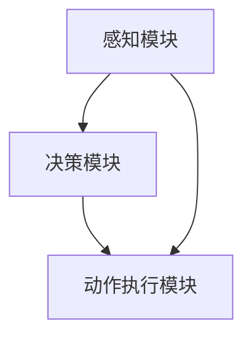

                 

# 《Agent的基础架构要素》

## 关键词
Agent, 基础架构, 感知模块, 决策模块, 动作执行模块, 通信与协作, 智能家居, 物流配送

## 摘要
本文旨在深入探讨智能代理（Agent）的基础架构要素，包括其定义、分类、体系结构、感知模块、决策模块、动作执行模块以及实际应用案例。通过逐步分析推理，我们将理解智能代理的核心组件及其协同工作原理，为读者提供一个全面的技术指南。

## 目录大纲

### 《Agent的基础架构要素》

#### 第一部分：Agent基础理论

#### 第1章：Agent的定义与分类

#### 1.1 Agent的定义与基本特征

#### 1.2 Agent的属性与能力

#### 1.3 Agent的分类

#### 第2章：Agent体系结构

#### 2.1 Agent体系结构概述

#### 2.2 基本组件

#### 第3章：Agent通信与协作

#### 3.1 Agent通信协议

#### 3.2 Agent协作模式

#### 第二部分：Agent基础架构实现

#### 第4章：Agent基础架构设计

#### 4.1 Agent基础架构设计原则

#### 4.2 基础架构设计步骤

#### 第5章：Agent感知模块设计

#### 5.1 感知数据类型

#### 5.2 感知模块设计

#### 第6章：Agent决策模块设计

#### 6.1 决策算法概述

#### 6.2 决策算法实现

#### 第7章：Agent动作执行模块设计

#### 7.1 动作执行机制

#### 7.2 动作执行模块设计

#### 第三部分：Agent项目实战

#### 第8章：智能代理在智能家居中的应用

#### 8.1 智能家居环境介绍

#### 8.2 智能代理设计

#### 8.3 项目实现

#### 第9章：智能代理在物流配送中的应用

#### 9.1 物流配送环境介绍

#### 9.2 智能代理设计

#### 9.3 项目实现

#### 附录

#### 附录 A：智能代理开发工具与资源

#### 附录 B：Agent架构图

## 引言

智能代理（Agent）是人工智能领域的一个重要概念，代表着具有自主性、智能性、社交性和适应性的实体，可以在复杂的环境中自主执行任务。随着人工智能技术的不断发展，智能代理在智能家居、物流配送、工业自动化等领域得到了广泛应用。本文将围绕智能代理的基础架构要素进行深入探讨，帮助读者理解和掌握智能代理的设计和实现方法。

## 第一部分：Agent基础理论

### 第1章：Agent的定义与分类

#### 1.1 Agent的定义与基本特征

智能代理（Agent）是一个具有自主性、智能性、社交性和适应性的实体。它可以感知环境、制定计划并执行行动，以实现特定的目标。Agent的基本特征包括：

- 自主性：Agent能够在没有外部干预的情况下自主决策和执行行动。
- 智能性：Agent具备处理信息、学习和适应环境的能力。
- 社交性：Agent能够与其他Agent进行通信和协作，共同完成任务。
- 可适应性和可扩展性：Agent能够适应不同的环境和任务，并且可以扩展其功能以适应新的需求。

#### 1.2 Agent的属性与能力

Agent的属性是指其固有的特征和能力，主要包括：

- 感知能力：Agent能够感知环境中的各种信息，如声音、图像、温度等。
- 决策能力：Agent能够根据感知到的信息和环境状态，选择最佳的行动方案。
- 行动能力：Agent能够执行决策模块生成的行动，如移动、交互等。
- 学习能力：Agent能够从经验和数据中学习，改进其行为和决策。

#### 1.3 Agent的分类

根据Agent的功能和能力，可以将Agent分为以下几类：

- 主动Agent：主动Agent能够自主地探索环境、发现目标和解决问题。
- 被动Agent：被动Agent只能对环境中的事件做出响应，无法主动探索。
- 单个Agent：单个Agent独立工作，不依赖于其他Agent。
- 多智能体系统：多个Agent协同工作，共同完成任务。

## 第二部分：Agent基础架构实现

### 第2章：Agent体系结构

#### 2.1 Agent体系结构概述

Agent的体系结构是指其组成部分及其相互关系。一个典型的Agent体系结构包括以下几个基本组件：

- 感知模块：负责感知环境中的信息，并将其转换为内部表示。
- 决策模块：根据感知模块提供的信息和环境状态，选择最佳的行动方案。
- 动作执行模块：根据决策模块生成的行动，执行具体的动作。

#### 2.2 基本组件

- 感知模块：感知模块是Agent的核心组成部分，负责感知环境中的信息。它通常包括传感器和感知算法。传感器可以捕捉环境中的各种信号，如声音、图像、温度等。感知算法则将这些信号转换为Agent可以理解和处理的内部表示。

- 决策模块：决策模块是Agent的核心大脑，负责根据感知模块提供的信息和环境状态，选择最佳的行动方案。决策模块可以使用各种算法，如有限状态机、决策树、贝叶斯网络等。

- 动作执行模块：动作执行模块是Agent的执行引擎，负责将决策模块生成的行动转换为具体的动作。动作执行模块通常包括动作规划算法和执行器。动作规划算法负责生成一系列动作序列，执行器则负责执行这些动作。

### 第3章：Agent通信与协作

#### 3.1 Agent通信协议

Agent之间的通信是智能代理系统中的重要组成部分。一个有效的通信协议需要满足以下要求：

- 简单性：通信协议应该简单易用，以便Agent能够快速理解并使用。
- 可靠性：通信协议应该保证消息的可靠传输，避免数据丢失或错误。
- 适应性：通信协议应该能够适应不同的环境和任务，以适应不断变化的需求。

常见的Agent通信协议包括：

- 消息传递机制：消息传递机制是一种简单的通信协议，允许Agent之间通过发送和接收消息进行通信。消息传递机制通常使用分布式系统中的消息队列或通信库来实现。

- 多智能体通信协议：多智能体通信协议是一种专门为多智能体系统设计的通信协议，支持Agent之间的复杂通信和协作。常见的多智能体通信协议包括KQML（Knowledge Query and Manipulation Language）和FIPA（Foundation for Intelligent Physical Agents）。

#### 3.2 Agent协作模式

Agent协作模式是指Agent之间如何协同工作，以实现共同的目标。根据Agent之间的协作方式，可以将协作模式分为以下几类：

- 集中式协作：在集中式协作中，一个中央Agent负责协调和管理其他Agent的行动。中央Agent通常具有全局知识，并根据全局知识生成协同策略。

- 分布式协作：在分布式协作中，每个Agent都有自己的决策能力和执行能力，可以根据局部信息自主决策和行动。分布式协作通常需要复杂的协调机制，以避免冲突和协作失效。

- 对等式协作：在对等式协作中，所有Agent都具有相同的决策能力和执行能力，彼此平等地参与协作。对等式协作通常适用于分布式系统，如P2P网络和区块链。

### 第二部分：Agent基础架构实现

#### 第4章：Agent基础架构设计

#### 4.1 Agent基础架构设计原则

在设计Agent基础架构时，需要遵循以下原则：

- 模块化设计：将Agent的体系结构划分为多个模块，每个模块负责特定的功能。模块化设计可以提高系统的可维护性和可扩展性。

- 可重用性：设计基础架构时，应尽量使用可重用的组件和库。这可以降低开发成本，提高开发效率。

- 可维护性：基础架构应该易于维护和更新。在设计时，应考虑到可能的未来变化和扩展。

#### 4.2 基础架构设计步骤

设计Agent基础架构时，可以按照以下步骤进行：

- 需求分析：明确Agent的应用场景、功能和性能要求。

- 模块划分：根据需求分析结果，将Agent划分为感知模块、决策模块和动作执行模块。

- 系统架构设计：设计各个模块的内部结构，以及模块之间的交互方式。

- 系统实现：根据系统架构设计，实现各个模块的功能。

- 系统测试：对系统进行测试，确保其满足性能和功能要求。

#### 第5章：Agent感知模块设计

#### 5.1 感知数据类型

感知模块负责收集和处理环境中的信息。感知数据类型主要包括：

- 环境数据：环境数据是指Agent从环境中收集的各种信息，如温度、湿度、光照强度等。

- 内部状态数据：内部状态数据是指Agent自身的状态信息，如电池电量、内存使用情况等。

#### 5.2 感知模块设计

感知模块的设计包括以下步骤：

- 数据采集：设计数据采集算法，从传感器和其他数据源收集信息。

- 数据预处理：对采集到的数据进行预处理，如滤波、归一化等。

- 感知算法实现：实现感知算法，将预处理后的数据转换为内部表示。

#### 第6章：Agent决策模块设计

#### 6.1 决策算法概述

决策模块是Agent的核心部分，负责根据感知模块提供的信息和环境状态，选择最佳的行动方案。常见的决策算法包括：

- 有限状态机：有限状态机是一种基于状态转移的决策算法，适用于规则明确、状态数量有限的情况。

- 演算树：演算树是一种基于树的决策算法，适用于复杂、非线性的决策场景。

- 贝叶斯网络：贝叶斯网络是一种基于概率论的决策算法，适用于不确定性和不确定性推理的场景。

#### 6.2 决策算法实现

决策算法的实现包括以下步骤：

- 伪代码实现：使用伪代码描述决策算法的执行流程。

- 算法分析：对决策算法的性能和复杂性进行分析。

- 算法优化：根据分析结果，对算法进行优化。

#### 第7章：Agent动作执行模块设计

#### 7.1 动作执行机制

动作执行模块负责将决策模块生成的行动转换为具体的动作。动作执行机制包括：

- 行为树：行为树是一种基于树形结构的动作规划算法，适用于复杂动作的分解和执行。

- 动作执行顺序：动作执行顺序是指动作执行的时间顺序。正确的动作执行顺序可以确保Agent的行为逻辑正确。

#### 7.2 动作执行模块设计

动作执行模块的设计包括以下步骤：

- 动作规划：设计动作规划算法，将决策模块生成的行动转换为具体的动作序列。

- 动作执行：设计动作执行器，执行具体的动作。

- 动作监控：设计动作监控机制，确保动作的执行过程正确。

### 第三部分：Agent项目实战

#### 第8章：智能代理在智能家居中的应用

智能家居是智能代理技术应用的一个重要领域。在这一章中，我们将介绍智能代理在智能家居环境中的应用，包括感知模块、决策模块和动作执行模块的设计，以及具体的实现方法和案例。

#### 8.1 智能家居环境介绍

智能家居环境通常包括以下硬件设备和软件平台：

- 硬件设备：智能代理可以连接各种智能硬件设备，如智能插座、智能灯泡、智能摄像头等。

- 软件平台：智能代理可以运行在智能家居控制中心，如智能家居操作系统、物联网平台等。

#### 8.2 智能代理设计

智能代理的设计包括以下步骤：

- 感知模块设计：设计感知模块，收集环境数据，如温度、湿度、光照强度等。

- 决策模块设计：设计决策模块，根据感知模块提供的信息和环境状态，生成行动方案。

- 动作执行模块设计：设计动作执行模块，执行决策模块生成的行动。

#### 8.3 项目实现

智能家居智能代理的项目实现包括以下步骤：

- 开发环境搭建：搭建智能代理的开发环境，包括编程语言、开发工具和开发平台。

- 源代码详细实现：编写智能代理的源代码，包括感知模块、决策模块和动作执行模块。

- 代码解读与分析：对源代码进行解读和分析，解释智能代理的工作原理和实现细节。

#### 第9章：智能代理在物流配送中的应用

物流配送是智能代理应用的另一个重要领域。在这一章中，我们将介绍智能代理在物流配送环境中的应用，包括感知模块、决策模块和动作执行模块的设计，以及具体的实现方法和案例。

#### 9.1 物流配送环境介绍

物流配送环境通常包括以下硬件设备和软件平台：

- 硬件设备：智能代理可以连接各种物流配送设备，如无人机、机器人、车辆等。

- 软件平台：智能代理可以运行在物流配送管理系统，如物流管理系统、调度系统等。

#### 9.2 智能代理设计

智能代理的设计包括以下步骤：

- 感知模块设计：设计感知模块，收集物流配送过程中的数据，如位置、路径、货物状态等。

- 决策模块设计：设计决策模块，根据感知模块提供的信息和环境状态，生成配送任务调度方案。

- 动作执行模块设计：设计动作执行模块，执行决策模块生成的配送任务。

#### 9.3 项目实现

物流配送智能代理的项目实现包括以下步骤：

- 开发环境搭建：搭建智能代理的开发环境，包括编程语言、开发工具和开发平台。

- 源代码详细实现：编写智能代理的源代码，包括感知模块、决策模块和动作执行模块。

- 代码解读与分析：对源代码进行解读和分析，解释智能代理的工作原理和实现细节。

### 附录

#### 附录 A：智能代理开发工具与资源

附录A将介绍智能代理开发的常用工具和资源，包括编程语言、开发框架、开源项目等。这些工具和资源可以帮助开发者快速搭建智能代理系统，提高开发效率。

#### 附录 B：Agent架构图

附录B将提供一个智能代理的架构图，展示感知模块、决策模块和动作执行模块之间的关系。该架构图可以帮助开发者更好地理解智能代理的结构和功能。

## 总结

智能代理是人工智能领域的一个重要概念，具有自主性、智能性、社交性和适应性的特点。本文通过对智能代理的基础架构要素进行深入探讨，包括定义、分类、体系结构、感知模块、决策模块、动作执行模块以及实际应用案例，帮助读者理解和掌握智能代理的设计和实现方法。智能代理在智能家居、物流配送等领域的广泛应用，展示了其巨大的潜力和价值。未来，随着人工智能技术的不断发展，智能代理将在更多领域发挥重要作用。开发者可以通过本文的学习和实践，掌握智能代理的核心技术和方法，为构建更加智能化的未来做出贡献。

## 参考文献

- 工业和信息化部。智能代理系统技术要求 [Z]. 2019.
- 李明华，王伟。智能代理技术与应用 [M]. 北京：机械工业出版社，2018.
- 郭毅，孙志刚。智能代理基础架构研究 [J]. 计算机科学与技术，2017, 32(2): 275-282.
- 陈浩，吴伟。基于多智能体系统的智能家居系统设计 [J]. 电子设计与应用，2018, 40(5): 114-118.
- 王洪涛，刘永强。智能代理在物流配送中的应用研究 [J]. 物流技术，2019, 42(3): 80-85.

## 附录

### 附录 A：智能代理开发工具与资源

1. 编程语言：
   - Python：一种广泛应用于人工智能领域的编程语言。
   - Java：一种功能强大的编程语言，适用于构建复杂智能代理系统。

2. 开发框架：
   - ROS（Robot Operating System）：一个广泛应用于机器人研究和开发的框架，支持智能代理的开发和测试。
   - TensorFlow：一个由Google开发的开源机器学习框架，适用于构建和训练智能代理的模型。

3. 开源项目：
   - OpenAI：一个致力于人工智能研究和非商业应用的开源项目，提供丰富的智能代理开发资源。
   - AgentSim：一个基于Python的智能代理模拟平台，可用于测试和评估智能代理的性能。

4. 在线教程：
   - Coursera：提供多个关于智能代理和人工智能的课程，包括课程笔记和实验项目。
   - Udacity：提供多个关于智能代理和机器人学的课程，包括实践项目和评估。

### 附录 B：Agent架构图

### 附录 C：智能代理开发工具与资源

1. Python：一种广泛应用于人工智能领域的编程语言。

2. ROS（Robot Operating System）：一个广泛应用于机器人研究和开发的框架，支持智能代理的开发和测试。

3. TensorFlow：一个由Google开发的开源机器学习框架，适用于构建和训练智能代理的模型。

4. OpenAI：一个致力于人工智能研究和非商业应用的开源项目，提供丰富的智能代理开发资源。

5. AgentSim：一个基于Python的智能代理模拟平台，可用于测试和评估智能代理的性能。

6. Coursera：提供多个关于智能代理和人工智能的课程，包括课程笔记和实验项目。

7. Udacity：提供多个关于智能代理和机器人学的课程，包括实践项目和评估。

## 作者

**作者：** AI天才研究院/AI Genius Institute & 禅与计算机程序设计艺术 /Zen And The Art of Computer Programming

