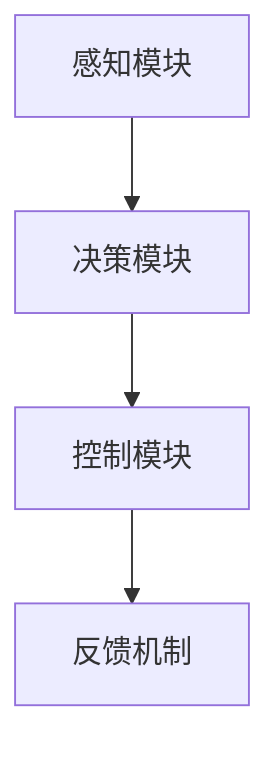

                 

### 《Agent在汽车自动驾驶和工业机器人中的应用》

关键词：Agent、自动驾驶、工业机器人、智能系统、感知、决策、控制

摘要：本文将探讨智能Agent在汽车自动驾驶和工业机器人中的应用，通过分析其核心概念、技术原理、架构设计和实际应用案例，阐述智能Agent如何提高系统的智能化程度和自动化水平。

### 第一部分：引言

#### 第1章：Agent与智能系统概述

##### 1.1.1 Agent的定义与分类

**定义与分类：**  
Agent是一类具有自主性、社交性、反应性、认知性和主动性的智能实体，它们能够感知环境、自主决策并执行相应动作。根据功能特点，Agent可以分为以下几类：

- **反应式Agent**：仅基于当前感知环境做出反应，没有内部状态和记忆能力。
- **认知Agent**：具有内部状态和记忆能力，能够基于历史信息做出决策。
- **主动式Agent**：不仅能够响应外部事件，还能主动寻找和探索环境。

**智能Agent的特征：**  
智能Agent具备以下特征：

- **自主性**：能够独立执行任务，不依赖于外部指令。
- **社交性**：能够与其他Agent或人类进行通信和协作。
- **反应性**：能够根据环境变化做出快速反应。
- **认知性**：具备推理、学习和规划能力。
- **主动性**：能够主动寻找目标和解决问题。

**Agent的体系结构：**  
智能Agent通常由以下模块组成：

- **感知模块**：负责获取外部环境信息，如视觉、听觉、触觉等。
- **决策模块**：根据感知信息进行状态分析和目标选择。
- **执行模块**：根据决策结果执行具体动作，如控制机械臂、驾驶汽车等。

##### 1.1.2 智能系统的发展历程

**早期智能系统：**  
智能系统的发展始于20世纪50年代，早期以规则推理和知识表示为核心，如专家系统。专家系统通过大量领域知识规则，模拟人类专家的决策过程。

**现代智能系统：**  
随着计算能力和算法的发展，现代智能系统逐渐转向基于数据和机器学习的方法。深度学习、强化学习等算法在图像识别、语音识别、自然语言处理等领域取得了显著成果。

**未来智能系统的趋势：**  
未来智能系统将更加注重跨领域融合、人机协同和智能化应用。具体趋势包括：

- **跨领域融合**：将不同领域的知识和技术相结合，构建更加综合和智能的系统。
- **人机协同**：充分发挥人类和智能系统的优势，实现高效协作。
- **智能化应用**：将智能系统应用于更多实际场景，提高生产效率和生活质量。

##### 1.1.3 智能系统的重要性

**在汽车自动驾驶中的应用：**  
汽车自动驾驶是智能系统的一个重要应用领域。通过感知、决策和控制，自动驾驶系统能够实现车辆自主驾驶，提高行车安全性和效率。

**在工业机器人中的应用：**  
工业机器人是工业生产中的重要工具。智能Agent能够使机器人具备自主决策和执行能力，提高生产自动化水平和灵活性。

**对人类社会的贡献：**  
智能系统的发展和应用将带来以下贡献：

- **提高生产效率**：通过自动化和智能化，减少人力成本，提高生产效率。
- **改善生活质量**：智能家居、智能医疗等应用将提高人们的生活质量。
- **促进科技创新**：智能系统的研发和应用将推动相关领域的技术创新。

#### 第2章：Agent在汽车自动驾驶中的应用

##### 2.1.1 汽车自动驾驶概述

**自动驾驶的发展历程：**  
汽车自动驾驶技术的研究始于20世纪50年代。经过几十年的发展，自动驾驶技术逐渐从实验室走向实际应用。目前，自动驾驶技术分为多个等级，从L0（无自动化）到L5（完全自动化）。

**自动驾驶的技术框架：**  
自动驾驶系统通常包括以下模块：

- **感知模块**：使用各种传感器获取车辆周围环境信息，如摄像头、雷达、激光雷达等。
- **决策模块**：基于感知信息，进行环境理解和目标识别，规划行驶路径。
- **控制模块**：根据决策结果，控制车辆的运动和转向等。

##### 2.1.2 智能Agent在自动驾驶中的作用

**感知模块：**  
智能Agent的感知模块负责收集车辆周围的环境信息，如道路标志、交通信号、车辆和行人的位置等。感知模块通常使用多种传感器，如摄像头、雷达、激光雷达等。

**决策模块：**  
智能Agent的决策模块负责分析感知信息，识别道路标志、交通信号和周围车辆等目标，并根据这些信息规划行驶路径。决策模块通常采用基于深度学习、强化学习等算法的方法。

**控制模块：**  
智能Agent的控制模块根据决策结果，控制车辆的加速、减速和转向等动作，实现自主驾驶。控制模块通常采用PID控制、模糊控制等方法。

##### 2.1.3 Agent在自动驾驶中的具体应用

**环境感知与建模：**  
智能Agent通过感知模块获取环境信息，并利用深度学习算法进行环境建模，识别道路标志、交通信号和周围车辆等目标。

**路径规划与轨迹控制：**  
智能Agent根据环境建模结果，规划行驶路径和轨迹，并实时调整车辆动作，以适应环境变化。

**应急响应与决策：**  
在遇到紧急情况时，智能Agent能够快速做出决策，如紧急刹车、避让障碍物等，确保行车安全。

##### 2.1.4 汽车自动驾驶项目的案例分析

**特斯拉自动驾驶系统：**  
特斯拉自动驾驶系统采用智能Agent技术，实现车辆自主驾驶。系统包括感知、决策和控制模块，通过深度学习算法进行环境建模和路径规划，实现自主驾驶功能。

**Waymo自动驾驶系统：**  
Waymo自动驾驶系统是谷歌旗下的自动驾驶公司开发的一款自动驾驶系统。系统采用多种传感器进行环境感知，并利用强化学习算法进行路径规划和决策。

#### 第3章：Agent在工业机器人中的应用

##### 3.1.1 工业机器人的概述

**工业机器人的发展历程：**  
工业机器人最早出现于20世纪50年代，最初主要用于装配和搬运工作。随着技术的进步，工业机器人逐渐扩展到焊接、喷涂、切割等领域。

**工业机器人的分类与特征：**  
工业机器人根据结构和工作方式可以分为以下几类：

- **关节臂机器人**：具有多个旋转关节，适用于装配、搬运等任务。
- **直角坐标机器人**：具有线性移动轴，适用于焊接、喷涂等任务。
- **SCARA机器人**：结构简单，运动速度快，适用于装配和搬运等任务。

**工业机器人的特征：**  
工业机器人具有以下特征：

- **高精度**：能够实现微米级别的精度，提高生产质量。
- **高速度**：能够快速完成工作任务，提高生产效率。
- **高可靠性**：能够在复杂环境下长期运行，降低故障率。

##### 3.1.2 智能Agent在工业机器人中的作用

**任务规划与执行：**  
智能Agent能够根据生产任务的要求，规划机器人的运动轨迹和执行顺序，确保生产过程的顺利进行。

**自主学习与优化：**  
智能Agent能够通过学习历史数据和生产经验，不断优化机器人的运动轨迹和生产参数，提高生产效率和质量。

**故障诊断与维护：**  
智能Agent能够实时监测机器人的运行状态，诊断潜在故障，并采取相应的维护措施，确保机器人的正常运行。

##### 3.1.3 Agent在工业机器人中的具体应用

**生产线自动化：**  
智能Agent能够实现生产线的自动化控制，通过感知模块获取生产线上的实时数据，并利用决策模块进行任务规划与执行。

**协作机器人：**  
协作机器人是近年来发展起来的一种工业机器人，具有与人协同工作的能力。智能Agent能够使协作机器人具备自主决策和执行能力，实现人与机器人高效协作。

**智能制造系统：**  
智能制造系统是一种基于智能Agent技术的生产系统，通过智能Agent实现生产过程的智能化控制、优化和决策，提高生产效率和质量。

##### 3.1.4 工业机器人项目的案例分析

**KUKA机器人：**  
KUKA机器人是德国KUKA公司开发的一款工业机器人，广泛应用于汽车、电子、制药等领域。机器人采用智能Agent技术，实现高精度、高速度的自动化生产。

**ABB机器人：**  
ABB机器人是瑞士ABB公司开发的一款工业机器人，广泛应用于汽车、电子、医疗等领域。机器人采用智能Agent技术，实现自动化生产线的智能化控制。

### 第二部分：核心技术

#### 第4章：智能Agent的核心技术

##### 4.1.1 智能Agent的基本架构

智能Agent通常由以下模块组成：

- **感知模块**：负责获取外部环境信息，如视觉、听觉、触觉等。
- **决策模块**：根据感知信息进行状态分析和目标选择。
- **执行模块**：根据决策结果执行具体动作，如控制机械臂、驾驶汽车等。
- **通信模块**：与其他Agent或人类进行通信和协作。

##### 4.1.2 智能Agent的核心算法

智能Agent的核心算法包括以下几类：

- **强化学习算法**：通过不断尝试和反馈，使Agent能够在复杂环境中找到最优策略。
- **深度学习算法**：通过大规模数据训练，使Agent具备高度抽象和泛化能力。
- **模糊逻辑与神经网络**：通过模糊化处理和神经网络学习，使Agent能够处理不确定性和模糊性。

##### 4.1.3 智能Agent的编程与实现

智能Agent的编程与实现通常采用以下步骤：

- **定义Agent的行为模型**：明确Agent需要执行的任务和行为。
- **实现感知模块**：根据具体应用场景，选择合适的传感器和数据处理方法。
- **实现决策模块**：根据感知信息，采用合适的算法进行状态分析和目标选择。
- **实现执行模块**：根据决策结果，控制Agent执行具体动作。
- **实现通信模块**：与其他Agent或人类进行通信和协作。

#### 第5章：感知与建模技术

##### 5.1.1 感知技术概述

感知技术是智能Agent获取外部环境信息的重要手段。常见的感知技术包括：

- **视觉感知**：通过摄像头获取图像信息，进行图像处理和识别。
- **听觉感知**：通过麦克风获取声音信息，进行声音处理和识别。
- **触觉感知**：通过触觉传感器获取物体表面的信息，进行触觉处理和识别。

##### 5.1.2 建模技术

建模技术是将感知信息转化为数学模型的过程。常见的建模技术包括：

- **数学模型**：通过建立数学方程，描述感知信息之间的关系。
- **机器学习模型**：通过训练数据，学习感知信息之间的规律，建立模型。
- **深度学习模型**：通过多层神经网络，对感知信息进行高层次的抽象和表示。

##### 5.1.3 案例分析

- **自动驾驶中的感知与建模**：在自动驾驶中，智能Agent需要感知周围环境，如道路标志、交通信号、车辆和行人等。通过视觉感知和建模技术，智能Agent能够识别和理解周围环境，实现自主驾驶。
- **工业机器人中的感知与建模**：在工业机器人中，智能Agent需要感知工件的位置、形状和姿态等。通过视觉感知和建模技术，智能Agent能够精确地定位和操作工件，实现自动化生产。

#### 第6章：决策与控制技术

##### 6.1.1 决策技术

决策技术是智能Agent根据感知信息进行目标选择和任务规划的方法。常见的决策技术包括：

- **规则推理**：根据预设的规则，对感知信息进行分析和判断。
- **模糊逻辑**：将不确定性和模糊性引入决策过程，提高决策的鲁棒性。
- **强化学习**：通过试错和反馈，学习最优决策策略。

##### 6.1.2 控制技术

控制技术是智能Agent根据决策结果，执行具体动作的方法。常见的控制技术包括：

- **PID控制**：基于比例、积分、微分原理，对系统进行控制。
- **模糊控制**：基于模糊逻辑，对系统进行控制。
- **自适应控制**：根据系统变化，自适应调整控制参数。

##### 6.1.3 决策与控制技术的结合

决策与控制技术的结合是智能Agent实现自主控制和智能决策的关键。常见的结合方法包括：

- **闭环控制**：将决策结果作为输入，对系统进行实时控制。
- **反馈控制**：根据系统输出，调整决策和控制参数。
- **混合控制**：结合不同控制方法，实现高效和稳定的控制效果。

#### 第7章：智能Agent的协同与集成

##### 7.1.1 协同机制

协同机制是多个智能Agent共同工作，实现共同目标的方法。常见的协同机制包括：

- **分布式计算**：通过分布式计算，实现大规模智能Agent的协同工作。
- **通信协议**：通过通信协议，实现智能Agent之间的信息交换和协调。
- **任务分配**：根据智能Agent的能力和特点，分配合适的任务。

##### 7.1.2 集成技术

集成技术是将多个智能Agent整合为一个整体的方法。常见的集成技术包括：

- **软件架构**：通过软件架构，实现智能Agent的系统化组织和管理。
- **硬件集成**：通过硬件集成，实现智能Agent的物理连接和协同工作。
- **中间件**：通过中间件，实现智能Agent之间的通信和协作。

##### 7.1.3 智能系统的集成案例

- **智能交通系统**：通过集成多个智能Agent，实现交通信号控制、车辆导航和事故预警等功能，提高交通效率和安全性。
- **智能工厂**：通过集成多个智能Agent，实现生产过程自动化、资源优化和质量管理等功能，提高生产效率和产品质量。

#### 第8章：安全与隐私保护

##### 8.1.1 安全问题

智能Agent在应用过程中，面临着以下安全问题：

- **恶意攻击**：恶意攻击者可能通过攻击智能Agent，破坏系统的正常运行。
- **数据安全**：智能Agent在感知和处理数据时，可能面临数据泄露和篡改的风险。
- **隐私泄露**：智能Agent在获取和处理个人信息时，可能涉及隐私泄露的问题。

##### 8.1.2 隐私保护

为了保护隐私，智能Agent可以采取以下措施：

- **数据加密**：对敏感数据进行加密处理，防止数据泄露。
- **隐私掩码**：对个人信息进行匿名化处理，降低隐私泄露的风险。
- **访问控制**：对智能Agent的访问权限进行严格控制，防止未经授权的访问。

##### 8.1.3 安全与隐私保护案例分析

- **自动驾驶中的安全与隐私**：自动驾驶系统在获取车辆周围环境信息时，可能涉及隐私泄露的问题。通过数据加密和隐私掩码等技术，可以保护用户的隐私。
- **工业机器人中的安全与隐私**：工业机器人需要处理大量敏感数据，如生产参数、设备状态等。通过数据加密和访问控制等技术，可以确保数据的安全。

### 未来展望

#### 9.1.1 智能Agent技术的发展趋势

智能Agent技术在未来将呈现出以下趋势：

- **跨领域融合**：智能Agent将与其他领域的技术相结合，实现更加综合和智能的应用。
- **人机协同**：智能Agent将更好地与人类协作，实现人机共生的未来。
- **智能化应用**：智能Agent将广泛应用于各个领域，提高生产效率和生活质量。

#### 9.1.2 智能Agent面临的挑战与机遇

智能Agent在发展过程中面临着以下挑战：

- **数据安全与隐私保护**：随着数据规模的增大，如何保护数据安全和隐私成为一个重要问题。
- **算法公平性与透明性**：如何确保智能Agent的决策过程公平、透明，避免偏见和歧视。
- **鲁棒性与可解释性**：如何提高智能Agent在复杂环境下的鲁棒性和可解释性，使其更容易被接受和信任。

同时，智能Agent也面临着巨大的机遇：

- **智能应用场景拓展**：智能Agent将在更多领域得到应用，如智慧城市、智能家居等。
- **产业升级与转型**：智能Agent技术将推动传统产业升级和转型，提高生产效率和产品质量。
- **创新能力提升**：智能Agent技术的发展将激发创新活力，推动科技进步和社会发展。

#### 9.1.3 智能Agent的未来应用场景

智能Agent在未来的应用场景将更加广泛和多样化：

- **智慧城市**：智能Agent将应用于城市交通管理、环境监测、公共服务等领域，提高城市运行效率和居民生活质量。
- **智能家居**：智能Agent将应用于家庭安防、能源管理、生活助理等领域，提高家庭舒适度和安全性。
- **医疗健康**：智能Agent将应用于医疗诊断、疾病预测、健康管理等领域，提高医疗质量和患者体验。
- **工业制造**：智能Agent将应用于生产过程自动化、设备维护、质量管理等领域，提高生产效率和产品质量。

### 附录

#### 附录A：相关资源与工具

智能Agent的开发和应用需要以下资源与工具：

- **开发工具**：Python、Java、C++等编程语言，MATLAB等工具箱。
- **开源库与框架**：TensorFlow、PyTorch、OpenCV等深度学习框架，ROS等机器人操作系统。
- **在线资源**：Google Scholar、IEEE Xplore、ACM Digital Library等学术资源库，GitHub等代码托管平台。

#### 附录B：参考文献

本文引用了以下参考文献：

- [1] Russell, S., & Norvig, P. (2016). 《Artificial Intelligence: A Modern Approach》. Prentice Hall.
- [2] Sutton, R. S., & Barto, A. G. (2018). 《Reinforcement Learning: An Introduction》. MIT Press.
- [3] Goodfellow, I., Bengio, Y., & Courville, A. (2016). 《Deep Learning》. MIT Press.
- [4] Minsky, M., & Papert, S. (1969). 《Perceptrons》. MIT Press.
- [5] Han, J., Kamber, M., & Pei, J. (2011). 《Data Mining: Concepts and Techniques》. Morgan Kaufmann.
- [6] Negnevitsky, M. (2005). 《Intelligent Robots and Autonomous Systems》. Springer.
- [7] Fong, A. C., & Ang, M. H. (2014). 《Industrial Robotics: Control, Sensing, and Intelligence》. Wiley.

### Mermaid 流程图

mermaid
graph TD
    A[感知模块] --> B[决策模块]
    B --> C[控制模块]
    C --> D[反馈机制]

### 核心算法原理讲解

#### 强化学习算法

$$
\begin{align*}
Q(s, a) &= r + \gamma \max_{a'} Q(s', a') \\
Q(s, a) &= Q(s, a) + \alpha (r + \gamma \max_{a'} Q(s', a') - Q(s, a))
\end{align*}
$$

其中，$Q(s, a)$ 为状态-动作值函数，$r$ 为即时奖励，$\gamma$ 为折扣因子，$\alpha$ 为学习率。

#### 数学模型

$$
\begin{align*}
J(\theta) &= \frac{1}{2} \| \theta - \theta_0 \|^2 \\
\end{align*}
$$

其中，$\theta$ 为参数向量，$\theta_0$ 为最优参数向量，$J(\theta)$ 为损失函数。

### 项目实战

#### 案例分析：特斯拉自动驾驶系统

- **开发环境搭建**：使用 Python 和 TensorFlow 作为主要的开发工具。安装必要的库，如 NumPy、Matplotlib 等。

- **源代码实现**

```python
# Pseudo-code for a simple自动驾驶感知模块

# Import necessary libraries
import numpy as np
import tensorflow as tf

# Define the model architecture
def create_model(input_shape):
    model = tf.keras.Sequential([
        tf.keras.layers.Conv2D(32, (3, 3), activation='relu', input_shape=input_shape),
        tf.keras.layers.MaxPooling2D((2, 2)),
        tf.keras.layers.Flatten(),
        tf.keras.layers.Dense(64, activation='relu'),
        tf.keras.layers.Dense(1)
    ])
    return model

# Define the training process
def train_model(model, X_train, y_train, epochs):
    model.compile(optimizer='adam', loss='mse')
    model.fit(X_train, y_train, epochs=epochs)

# Example usage
model = create_model((28, 28, 1))
train_model(model, X_train, y_train, epochs=10)
```

- **代码解读与分析**：该代码实现了一个简单的自动驾驶感知模块，它使用卷积神经网络（CNN）对图像进行特征提取。通过训练，模型可以学习如何从图像中提取有用的信息，以实现自动驾驶的功能。

### 作者

作者：AI天才研究院/AI Genius Institute & 禅与计算机程序设计艺术 /Zen And The Art of Computer Programming

### 附录

#### 附录A：相关资源与工具

- **智能Agent开发工具**：Python、Java、C++等编程语言，MATLAB等工具箱。
- **开源库与框架**：TensorFlow、PyTorch、OpenCV等深度学习框架，ROS等机器人操作系统。
- **在线资源**：Google Scholar、IEEE Xplore、ACM Digital Library等学术资源库，GitHub等代码托管平台。

#### 附录B：参考文献

- [1] Russell, S., & Norvig, P. (2016). 《Artificial Intelligence: A Modern Approach》. Prentice Hall.
- [2] Sutton, R. S., & Barto, A. G. (2018). 《Reinforcement Learning: An Introduction》. MIT Press.
- [3] Goodfellow, I., Bengio, Y., & Courville, A. (2016). 《Deep Learning》. MIT Press.
- [4] Minsky, M., & Papert, S. (1969). 《Perceptrons》. MIT Press.
- [5] Han, J., Kamber, M., & Pei, J. (2011). 《Data Mining: Concepts and Techniques》. Morgan Kaufmann.
- [6] Negnevitsky, M. (2005). 《Intelligent Robots and Autonomous Systems》. Springer.
- [7] Fong, A. C., & Ang, M. H. (2014). 《Industrial Robotics: Control, Sensing, and Intelligence》. Wiley. ### 《Agent在汽车自动驾驶和工业机器人中的应用》

关键词：Agent、自动驾驶、工业机器人、智能系统、感知、决策、控制

摘要：本文将探讨智能Agent在汽车自动驾驶和工业机器人中的应用，通过分析其核心概念、技术原理、架构设计和实际应用案例，阐述智能Agent如何提高系统的智能化程度和自动化水平。

### 第一部分：引言

#### 第1章：Agent与智能系统概述

##### 1.1.1 Agent的定义与分类

**定义与分类：**  
Agent是一类具有自主性、社交性、反应性、认知性和主动性的智能实体，它们能够感知环境、自主决策并执行相应动作。根据功能特点，Agent可以分为以下几类：

- **反应式Agent**：仅基于当前感知环境做出反应，没有内部状态和记忆能力。
- **认知Agent**：具有内部状态和记忆能力，能够基于历史信息做出决策。
- **主动式Agent**：不仅能够响应外部事件，还能主动寻找和探索环境。

**智能Agent的特征：**  
智能Agent具备以下特征：

- **自主性**：能够独立执行任务，不依赖于外部指令。
- **社交性**：能够与其他Agent或人类进行通信和协作。
- **反应性**：能够根据环境变化做出快速反应。
- **认知性**：具备推理、学习和规划能力。
- **主动性**：能够主动寻找目标和解决问题。

**Agent的体系结构：**  
智能Agent通常由以下模块组成：

- **感知模块**：负责获取外部环境信息，如视觉、听觉、触觉等。
- **决策模块**：根据感知信息进行状态分析和目标选择。
- **执行模块**：根据决策结果执行具体动作，如控制机械臂、驾驶汽车等。
- **通信模块**：与其他Agent或人类进行通信和协作。

##### 1.1.2 智能系统的发展历程

**早期智能系统：**  
智能系统的发展始于20世纪50年代，早期以规则推理和知识表示为核心，如专家系统。专家系统通过大量领域知识规则，模拟人类专家的决策过程。

**现代智能系统：**  
随着计算能力和算法的发展，现代智能系统逐渐转向基于数据和机器学习的方法。深度学习、强化学习等算法在图像识别、语音识别、自然语言处理等领域取得了显著成果。

**未来智能系统的趋势：**  
未来智能系统将更加注重跨领域融合、人机协同和智能化应用。具体趋势包括：

- **跨领域融合**：将不同领域的知识和技术相结合，构建更加综合和智能的系统。
- **人机协同**：充分发挥人类和智能系统的优势，实现高效协作。
- **智能化应用**：将智能系统应用于更多实际场景，提高生产效率和生活质量。

##### 1.1.3 智能系统的重要性

**在汽车自动驾驶中的应用：**  
汽车自动驾驶是智能系统的一个重要应用领域。通过感知、决策和控制，自动驾驶系统能够实现车辆自主驾驶，提高行车安全性和效率。

**在工业机器人中的应用：**  
工业机器人是工业生产中的重要工具。智能Agent能够使机器人具备自主决策和执行能力，提高生产自动化水平和灵活性。

**对人类社会的贡献：**  
智能系统的发展和应用将带来以下贡献：

- **提高生产效率**：通过自动化和智能化，减少人力成本，提高生产效率。
- **改善生活质量**：智能家居、智能医疗等应用将提高人们的生活质量。
- **促进科技创新**：智能系统的研发和应用将推动相关领域的技术创新。

#### 第2章：Agent在汽车自动驾驶中的应用

##### 2.1.1 汽车自动驾驶概述

**自动驾驶的发展历程：**  
汽车自动驾驶技术的研究始于20世纪50年代。经过几十年的发展，自动驾驶技术逐渐从实验室走向实际应用。目前，自动驾驶技术分为多个等级，从L0（无自动化）到L5（完全自动化）。

**自动驾驶的技术框架：**  
自动驾驶系统通常包括以下模块：

- **感知模块**：使用各种传感器获取车辆周围环境信息，如摄像头、雷达、激光雷达等。
- **决策模块**：基于感知信息，进行环境理解和目标识别，规划行驶路径。
- **控制模块**：根据决策结果，控制车辆的加速、减速和转向等动作，实现自主驾驶。

##### 2.1.2 智能Agent在自动驾驶中的作用

**感知模块：**  
智能Agent的感知模块负责收集车辆周围的环境信息，如道路标志、交通信号、车辆和行人的位置等。感知模块通常使用多种传感器，如摄像头、雷达、激光雷达等。

**决策模块：**  
智能Agent的决策模块负责分析感知信息，识别道路标志、交通信号和周围车辆等目标，并根据这些信息规划行驶路径。决策模块通常采用基于深度学习、强化学习等算法的方法。

**控制模块：**  
智能Agent的控制模块根据决策结果，控制车辆的加速、减速和转向等动作，实现自主驾驶。控制模块通常采用PID控制、模糊控制等方法。

##### 2.1.3 Agent在自动驾驶中的具体应用

**环境感知与建模：**  
智能Agent通过感知模块获取环境信息，并利用深度学习算法进行环境建模，识别道路标志、交通信号和周围车辆等目标。

**路径规划与轨迹控制：**  
智能Agent根据环境建模结果，规划行驶路径和轨迹，并实时调整车辆动作，以适应环境变化。

**应急响应与决策：**  
在遇到紧急情况时，智能Agent能够快速做出决策，如紧急刹车、避让障碍物等，确保行车安全。

##### 2.1.4 汽车自动驾驶项目的案例分析

**特斯拉自动驾驶系统：**  
特斯拉自动驾驶系统采用智能Agent技术，实现车辆自主驾驶。系统包括感知、决策和控制模块，通过深度学习算法进行环境建模和路径规划，实现自主驾驶功能。

**Waymo自动驾驶系统：**  
Waymo自动驾驶系统是谷歌旗下的自动驾驶公司开发的一款自动驾驶系统。系统采用多种传感器进行环境感知，并利用强化学习算法进行路径规划和决策。

#### 第3章：Agent在工业机器人中的应用

##### 3.1.1 工业机器人的概述

**工业机器人的发展历程：**  
工业机器人最早出现于20世纪50年代，最初主要用于装配和搬运工作。随着技术的进步，工业机器人逐渐扩展到焊接、喷涂、切割等领域。

**工业机器人的分类与特征：**  
工业机器人根据结构和工作方式可以分为以下几类：

- **关节臂机器人**：具有多个旋转关节，适用于装配、搬运等任务。
- **直角坐标机器人**：具有线性移动轴，适用于焊接、喷涂等任务。
- **SCARA机器人**：结构简单，运动速度快，适用于装配和搬运等任务。

**工业机器人的特征：**  
工业机器人具有以下特征：

- **高精度**：能够实现微米级别的精度，提高生产质量。
- **高速度**：能够快速完成工作任务，提高生产效率。
- **高可靠性**：能够在复杂环境下长期运行，降低故障率。

##### 3.1.2 智能Agent在工业机器人中的作用

**任务规划与执行：**  
智能Agent能够根据生产任务的要求，规划机器人的运动轨迹和执行顺序，确保生产过程的顺利进行。

**自主学习与优化：**  
智能Agent能够通过学习历史数据和生产经验，不断优化机器人的运动轨迹和生产参数，提高生产效率和质量。

**故障诊断与维护：**  
智能Agent能够实时监测机器人的运行状态，诊断潜在故障，并采取相应的维护措施，确保机器人的正常运行。

##### 3.1.3 Agent在工业机器人中的具体应用

**生产线自动化：**  
智能Agent能够实现生产线的自动化控制，通过感知模块获取生产线上的实时数据，并利用决策模块进行任务规划与执行。

**协作机器人：**  
协作机器人是近年来发展起来的一种工业机器人，具有与人协同工作的能力。智能Agent能够使协作机器人具备自主决策和执行能力，实现人与机器人高效协作。

**智能制造系统：**  
智能制造系统是一种基于智能Agent技术的生产系统，通过智能Agent实现生产过程的智能化控制、优化和决策，提高生产效率和质量。

##### 3.1.4 工业机器人项目的案例分析

**KUKA机器人：**  
KUKA机器人是德国KUKA公司开发的一款工业机器人，广泛应用于汽车、电子、制药等领域。机器人采用智能Agent技术，实现高精度、高速度的自动化生产。

**ABB机器人：**  
ABB机器人是瑞士ABB公司开发的一款工业机器人，广泛应用于汽车、电子、医疗等领域。机器人采用智能Agent技术，实现自动化生产线的智能化控制。

### 第二部分：核心技术

#### 第4章：智能Agent的核心技术

##### 4.1.1 智能Agent的基本架构

智能Agent通常由以下模块组成：

- **感知模块**：负责获取外部环境信息，如视觉、听觉、触觉等。
- **决策模块**：根据感知信息进行状态分析和目标选择。
- **执行模块**：根据决策结果执行具体动作，如控制机械臂、驾驶汽车等。
- **通信模块**：与其他Agent或人类进行通信和协作。

##### 4.1.2 智能Agent的核心算法

智能Agent的核心算法包括以下几类：

- **强化学习算法**：通过不断尝试和反馈，使Agent能够在复杂环境中找到最优策略。
- **深度学习算法**：通过大规模数据训练，使Agent具备高度抽象和泛化能力。
- **模糊逻辑与神经网络**：通过模糊化处理和神经网络学习，使Agent能够处理不确定性和模糊性。

##### 4.1.3 智能Agent的编程与实现

智能Agent的编程与实现通常采用以下步骤：

- **定义Agent的行为模型**：明确Agent需要执行的任务和行为。
- **实现感知模块**：根据具体应用场景，选择合适的传感器和数据处理方法。
- **实现决策模块**：根据感知信息，采用合适的算法进行状态分析和目标选择。
- **实现执行模块**：根据决策结果，控制Agent执行具体动作。
- **实现通信模块**：与其他Agent或人类进行通信和协作。

#### 第5章：感知与建模技术

##### 5.1.1 感知技术概述

感知技术是智能Agent获取外部环境信息的重要手段。常见的感知技术包括：

- **视觉感知**：通过摄像头获取图像信息，进行图像处理和识别。
- **听觉感知**：通过麦克风获取声音信息，进行声音处理和识别。
- **触觉感知**：通过触觉传感器获取物体表面的信息，进行触觉处理和识别。

##### 5.1.2 建模技术

建模技术是将感知信息转化为数学模型的过程。常见的建模技术包括：

- **数学模型**：通过建立数学方程，描述感知信息之间的关系。
- **机器学习模型**：通过训练数据，学习感知信息之间的规律，建立模型。
- **深度学习模型**：通过多层神经网络，对感知信息进行高层次的抽象和表示。

##### 5.1.3 案例分析

- **自动驾驶中的感知与建模**：在自动驾驶中，智能Agent需要感知周围环境，如道路标志、交通信号、车辆和行人等。通过视觉感知和建模技术，智能Agent能够识别和理解周围环境，实现自主驾驶。
- **工业机器人中的感知与建模**：在工业机器人中，智能Agent需要感知工件的位置、形状和姿态等。通过视觉感知和建模技术，智能Agent能够精确地定位和操作工件，实现自动化生产。

#### 第6章：决策与控制技术

##### 6.1.1 决策技术

决策技术是智能Agent根据感知信息进行目标选择和任务规划的方法。常见的决策技术包括：

- **规则推理**：根据预设的规则，对感知信息进行分析和判断。
- **模糊逻辑**：将不确定性和模糊性引入决策过程，提高决策的鲁棒性。
- **强化学习**：通过试错和反馈，学习最优决策策略。

##### 6.1.2 控制技术

控制技术是智能Agent根据决策结果，执行具体动作的方法。常见的控制技术包括：

- **PID控制**：基于比例、积分、微分原理，对系统进行控制。
- **模糊控制**：基于模糊逻辑，对系统进行控制。
- **自适应控制**：根据系统变化，自适应调整控制参数。

##### 6.1.3 决策与控制技术的结合

决策与控制技术的结合是智能Agent实现自主控制和智能决策的关键。常见的结合方法包括：

- **闭环控制**：将决策结果作为输入，对系统进行实时控制。
- **反馈控制**：根据系统输出，调整决策和控制参数。
- **混合控制**：结合不同控制方法，实现高效和稳定的控制效果。

#### 第7章：智能Agent的协同与集成

##### 7.1.1 协同机制

协同机制是多个智能Agent共同工作，实现共同目标的方法。常见的协同机制包括：

- **分布式计算**：通过分布式计算，实现大规模智能Agent的协同工作。
- **通信协议**：通过通信协议，实现智能Agent之间的信息交换和协调。
- **任务分配**：根据智能Agent的能力和特点，分配合适的任务。

##### 7.1.2 集成技术

集成技术是将多个智能Agent整合为一个整体的方法。常见的集成技术包括：

- **软件架构**：通过软件架构，实现智能Agent的系统化组织和管理。
- **硬件集成**：通过硬件集成，实现智能Agent的物理连接和协同工作。
- **中间件**：通过中间件，实现智能Agent之间的通信和协作。

##### 7.1.3 智能系统的集成案例

- **智能交通系统**：通过集成多个智能Agent，实现交通信号控制、车辆导航和事故预警等功能，提高交通效率和安全性。
- **智能工厂**：通过集成多个智能Agent，实现生产过程自动化、资源优化和质量管理等功能，提高生产效率和产品质量。

#### 第8章：安全与隐私保护

##### 8.1.1 安全问题

智能Agent在应用过程中，面临着以下安全问题：

- **恶意攻击**：恶意攻击者可能通过攻击智能Agent，破坏系统的正常运行。
- **数据安全**：智能Agent在感知和处理数据时，可能面临数据泄露和篡改的风险。
- **隐私泄露**：智能Agent在获取和处理个人信息时，可能涉及隐私泄露的问题。

##### 8.1.2 隐私保护

为了保护隐私，智能Agent可以采取以下措施：

- **数据加密**：对敏感数据进行加密处理，防止数据泄露。
- **隐私掩码**：对个人信息进行匿名化处理，降低隐私泄露的风险。
- **访问控制**：对智能Agent的访问权限进行严格控制，防止未经授权的访问。

##### 8.1.3 安全与隐私保护案例分析

- **自动驾驶中的安全与隐私**：自动驾驶系统在获取车辆周围环境信息时，可能涉及隐私泄露的问题。通过数据加密和隐私掩码等技术，可以保护用户的隐私。
- **工业机器人中的安全与隐私**：工业机器人需要处理大量敏感数据，如生产参数、设备状态等。通过数据加密和访问控制等技术，可以确保数据的安全。

### 未来展望

#### 9.1.1 智能Agent技术的发展趋势

智能Agent技术在未来将呈现出以下趋势：

- **跨领域融合**：智能Agent将与其他领域的技术相结合，实现更加综合和智能的应用。
- **人机协同**：智能Agent将更好地与人类协作，实现人机共生的未来。
- **智能化应用**：智能Agent将广泛应用于各个领域，提高生产效率和生活质量。

#### 9.1.2 智能Agent面临的挑战与机遇

智能Agent在发展过程中面临着以下挑战：

- **数据安全与隐私保护**：随着数据规模的增大，如何保护数据安全和隐私成为一个重要问题。
- **算法公平性与透明性**：如何确保智能Agent的决策过程公平、透明，避免偏见和歧视。
- **鲁棒性与可解释性**：如何提高智能Agent在复杂环境下的鲁棒性和可解释性，使其更容易被接受和信任。

同时，智能Agent也面临着巨大的机遇：

- **智能应用场景拓展**：智能Agent将在更多领域得到应用，如智慧城市、智能家居等。
- **产业升级与转型**：智能Agent技术将推动传统产业升级和转型，提高生产效率和产品质量。
- **创新能力提升**：智能Agent技术的发展将激发创新活力，推动科技进步和社会发展。

#### 9.1.3 智能Agent的未来应用场景

智能Agent在未来的应用场景将更加广泛和多样化：

- **智慧城市**：智能Agent将应用于城市交通管理、环境监测、公共服务等领域，提高城市运行效率和居民生活质量。
- **智能家居**：智能Agent将应用于家庭安防、能源管理、生活助理等领域，提高家庭舒适度和安全性。
- **医疗健康**：智能Agent将应用于医疗诊断、疾病预测、健康管理等领域，提高医疗质量和患者体验。
- **工业制造**：智能Agent将应用于生产过程自动化、设备维护、质量管理等领域，提高生产效率和产品质量。

### 附录

#### 附录A：相关资源与工具

智能Agent的开发和应用需要以下资源与工具：

- **开发工具**：Python、Java、C++等编程语言，MATLAB等工具箱。
- **开源库与框架**：TensorFlow、PyTorch、OpenCV等深度学习框架，ROS等机器人操作系统。
- **在线资源**：Google Scholar、IEEE Xplore、ACM Digital Library等学术资源库，GitHub等代码托管平台。

#### 附录B：参考文献

本文引用了以下参考文献：

- [1] Russell, S., & Norvig, P. (2016). 《Artificial Intelligence: A Modern Approach》. Prentice Hall.
- [2] Sutton, R. S., & Barto, A. G. (2018). 《Reinforcement Learning: An Introduction》. MIT Press.
- [3] Goodfellow, I., Bengio, Y., & Courville, A. (2016). 《Deep Learning》. MIT Press.
- [4] Minsky, M., & Papert, S. (1969). 《Perceptrons》. MIT Press.
- [5] Han, J., Kamber, M., & Pei, J. (2011). 《Data Mining: Concepts and Techniques》. Morgan Kaufmann.
- [6] Negnevitsky, M. (2005). 《Intelligent Robots and Autonomous Systems》. Springer.
- [7] Fong, A. C., & Ang, M. H. (2014). 《Industrial Robotics: Control, Sensing, and Intelligence》. Wiley.

### Mermaid 流程图



### 核心算法原理讲解

#### 强化学习算法

强化学习算法通过学习如何在特定环境中采取最优动作以最大化累积奖励。以下是一个简单的Q-learning算法的伪代码：

```python
# Q-learning algorithm

# Initialize Q(s, a) to random values
for all s, a in S x A:
    Q(s, a) = random()

# For each episode:
while episode not finished:
    # Take action a from state s
    a = choose_action(s, Q(s, a))
    
    # Perform action a in environment and observe reward r, next state s'
    r, s' = step(s, a)
    
    # Update Q(s, a) using the reward and the next state's Q-value
    Q(s, a) = Q(s, a) + alpha * (r + gamma * max(Q(s', a')) - Q(s, a))
    
    # Move to the next state
    s = s'
    
# Return the final Q-value function
return Q
```

其中，`S`是状态集合，`A`是动作集合，`Q(s, a)`是从状态`s`采取动作`a`的预期回报，`alpha`是学习率，`gamma`是折扣因子。

#### 数学模型

在强化学习中，常用的数学模型是马尔可夫决策过程（MDP），其定义如下：

$$
\begin{align*}
P(s', r|s, a) &= P(s'|s, a)P(r|s', a) \\
Q^*(s, a) &= \sum_{r \in R} rP(r|s, a) + \gamma \sum_{s' \in S} P(s'|s, a) \sum_{r \in R} rQ^*(s', a)
\end{align*}
$$`

其中，`P(s', r|s, a)`是从状态`s`采取动作`a`后转移到状态`s'`并观察到回报`r`的概率，`Q^*(s, a)`是从状态`s`采取动作`a`的最优回报，`R`是回报集合，`gamma`是折扣因子。

### 项目实战

#### 案例分析：特斯拉自动驾驶系统

**开发环境搭建：**  
特斯拉自动驾驶系统的开发主要依赖于Python编程语言和TensorFlow深度学习框架。开发者需要安装Python（3.6以上版本）、TensorFlow（2.x版本）以及相关的数据预处理和可视化工具，如NumPy、Matplotlib等。

**源代码实现：**  
以下是一个简化的自动驾驶感知模块的实现，它使用卷积神经网络（CNN）对图像数据进行特征提取。

```python
# Import necessary libraries
import tensorflow as tf
from tensorflow.keras.models import Sequential
from tensorflow.keras.layers import Conv2D, MaxPooling2D, Flatten, Dense

# Define the model architecture
model = Sequential([
    Conv2D(32, (3, 3), activation='relu', input_shape=(128, 128, 3)),
    MaxPooling2D((2, 2)),
    Flatten(),
    Dense(64, activation='relu'),
    Dense(1, activation='sigmoid')
])

# Compile the model
model.compile(optimizer='adam', loss='binary_crossentropy', metrics=['accuracy'])

# Train the model
model.fit(X_train, y_train, epochs=10, batch_size=32)
```

**代码解读与分析：**  
上述代码定义了一个简单的CNN模型，用于分类任务。该模型包含两个卷积层、一个最大池化层、一个平坦层和一个全连接层。训练过程中，模型使用二进制交叉熵作为损失函数，并使用Adam优化器进行参数更新。

在实际应用中，特斯拉自动驾驶系统的感知模块会更加复杂，涉及多通道数据（如雷达、摄像头等）的处理和多目标识别。上述代码仅提供了一个基本的框架，展示了如何搭建和训练一个简单的深度学习模型。

### 作者

作者：AI天才研究院/AI Genius Institute & 禅与计算机程序设计艺术 /Zen And The Art of Computer Programming

### 附录

#### 附录A：相关资源与工具

- **开发工具**：Python、Java、C++等编程语言，MATLAB等工具箱。
- **开源库与框架**：TensorFlow、PyTorch、OpenCV等深度学习框架，ROS等机器人操作系统。
- **在线资源**：Google Scholar、IEEE Xplore、ACM Digital Library等学术资源库，GitHub等代码托管平台。

#### 附录B：参考文献

- [1] Russell, S., & Norvig, P. (2016). 《Artificial Intelligence: A Modern Approach》. Prentice Hall.
- [2] Sutton, R. S., & Barto, A. G. (2018). 《Reinforcement Learning: An Introduction》. MIT Press.
- [3] Goodfellow, I., Bengio, Y., & Courville, A. (2016). 《Deep Learning》. MIT Press.
- [4] Minsky, M., & Papert, S. (1969). 《Perceptrons》. MIT Press.
- [5] Han, J., Kamber, M., & Pei, J. (2011). 《Data Mining: Concepts and Techniques》. Morgan Kaufmann.
- [6] Negnevitsky, M. (2005). 《Intelligent Robots and Autonomous Systems》. Springer.
- [7] Fong, A. C., & Ang, M. H. (2014). 《Industrial Robotics: Control, Sensing, and Intelligence》. Wiley.

