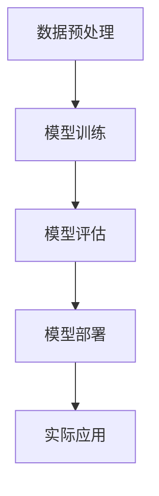

                 

# 《Andrej Karpathy：人工智能的未来发展前景》

> **关键词：** Andrej Karpathy、人工智能、未来、发展前景、技术、社会影响、算法、项目实战

> **摘要：** 本文将探讨人工智能领域著名专家Andrej Karpathy对人工智能未来发展的观点，分析人工智能的核心算法原理，以及其在实际项目中的应用。文章旨在帮助读者深入了解人工智能的现状、趋势和未来前景，为人工智能相关领域的研究与实践提供参考。

### 第一部分：人工智能概述

#### 第1章：人工智能简史与未来趋势

##### 1.1 人工智能的起源与发展

人工智能（AI）的概念最早可以追溯到1950年代。当时，计算机科学家约翰·冯·诺依曼提出了“图灵测试”，旨在评估机器是否具备智能。人工智能的研究经历了几个阶段，从最初的符号主义（Symbolic AI）到基于规则的系统，再到基于数据的机器学习和深度学习。每个阶段都标志着人工智能技术的重大突破和发展。

**人工智能的重要事件与里程碑：**

- **1956年**：达特茅斯会议，人工智能被正式提出。
- **1959年**：约翰·麦卡锡提出LISP语言，为人工智能开发提供了基础。
- **1980年代**：专家系统（Expert Systems）取得了显著进展。
- **1990年代**：机器学习开始流行，尤其是支持向量机（SVM）和决策树（Decision Trees）的应用。
- **2006年**：深度学习兴起，由Geoffrey Hinton等人重新点燃了人工智能的研究热情。
- **2012年**：AlexNet在ImageNet竞赛中取得重大突破，深度学习开始广泛应用于计算机视觉领域。

**当前人工智能的发展趋势：**

- **深度学习**：深度学习模型在图像识别、自然语言处理和语音识别等领域取得了显著成果，成为当前人工智能研究的热点。
- **强化学习**：强化学习在游戏、自动驾驶和机器人等领域展现出巨大潜力，成为人工智能研究的新方向。
- **迁移学习**：迁移学习通过在不同任务间共享知识，提高了模型的泛化能力，成为人工智能领域的研究重点。
- **生成对抗网络（GAN）**：GAN在图像生成、图像修复和图像合成等领域取得了重大突破，成为人工智能研究的新趋势。

##### 1.2 人工智能的核心技术与原理

**机器学习基础：**

机器学习是一种使计算机通过数据学习并改进自身性能的方法。其基本概念包括：

- **监督学习**：通过已知输入和输出数据训练模型，使其能够预测未知数据的输出。
- **无监督学习**：仅通过输入数据来训练模型，使其发现数据中的结构和规律。
- **强化学习**：通过与环境交互来学习最优策略，以达到目标。

**深度学习原理：**

深度学习是机器学习的一种方法，通过多层神经网络来提取数据中的特征。其核心原理包括：

- **神经网络结构**：神经网络由多个层次组成，每个层次都对输入数据进行变换。
- **反向传播算法**：通过反向传播算法来更新网络中的参数，使模型能够更好地拟合数据。
- **激活函数**：激活函数用于引入非线性关系，使神经网络能够表示更复杂的函数。

**自然语言处理：**

自然语言处理是人工智能的一个重要分支，旨在使计算机理解和处理自然语言。其主要任务包括：

- **语言模型**：用于预测下一个单词或字符的概率。
- **词嵌入**：将单词映射到高维空间，使相似单词在空间中接近。
- **序列标注任务**：对文本中的词或词组进行分类，如词性标注和命名实体识别。

##### 1.3 人工智能在不同行业的应用

**人工智能在医疗领域的应用：**

人工智能在医疗领域具有广泛的应用，包括疾病诊断、药物研发和健康管理等方面。例如，通过深度学习模型，可以自动识别医疗图像中的病变区域，提高诊断的准确性和效率。

**人工智能在金融领域的应用：**

人工智能在金融领域被用于风险管理、欺诈检测和智能投顾等方面。例如，通过机器学习算法，可以分析用户的行为数据，预测其金融需求，并提供个性化的投资建议。

**人工智能在教育领域的应用：**

人工智能在教育领域被用于个性化教学、学习评估和智能辅导等方面。例如，通过自然语言处理技术，可以自动批改学生的作文，并提供详细的反馈。

**人工智能带来的变革与挑战：**

人工智能的发展带来了许多变革，但也带来了一系列挑战。例如，人工智能可能导致某些职业的失业，同时也引发了关于隐私、安全和伦理等方面的问题。

#### 第2章：人工智能与未来社会

##### 2.1 人工智能对社会的影响

**工作市场的变化：**

人工智能的快速发展将对工作市场产生深远影响。一方面，人工智能将提高生产效率，降低人力成本，从而推动经济快速发展。另一方面，人工智能可能取代一些重复性、低技能的工作，导致部分劳动者失业。

**个人隐私与安全：**

人工智能技术的发展带来了对个人隐私和安全的新挑战。例如，通过人脸识别技术，可以轻松识别个人身份，从而引发隐私泄露的风险。此外，人工智能系统可能存在安全漏洞，导致恶意攻击和数据泄露。

**法律与伦理问题：**

人工智能的广泛应用引发了一系列法律与伦理问题。例如，如何确保人工智能系统的公平性、透明性和可解释性？如何解决人工智能造成的责任归属问题？这些问题需要法律法规和伦理道德的引导与规范。

##### 2.2 人工智能的未来发展前景

**技术突破与预期：**

人工智能的未来发展前景非常广阔。随着技术的不断突破，人工智能有望在更多领域发挥重要作用。例如，通过深度学习技术，可以实现更智能的自动驾驶和智能机器人。此外，人工智能还可能在人工智能与人类协同工作的领域取得重大进展。

**未来人工智能的应用场景：**

人工智能在未来将有广泛的应用场景，包括：

- **智能家居**：通过人工智能技术，实现家庭设备的智能控制，提高生活质量。
- **智能医疗**：通过人工智能技术，实现精准诊断、个性化治疗和健康管理。
- **智能交通**：通过人工智能技术，实现智能交通管理、自动驾驶和智能导航。
- **智能城市**：通过人工智能技术，实现城市管理的智能化和高效化。

**人工智能与人类协同工作：**

人工智能的发展将改变人类的工作方式。在未来，人工智能将成为人类的得力助手，与人类协同工作，共同创造更美好的生活。例如，人工智能可以在医疗领域协助医生进行诊断和治疗，提高医疗服务的效率和质量。

### 第二部分：人工智能核心算法原理讲解

#### 第3章：机器学习基础

##### 3.1 机器学习概述

**机器学习的基本概念：**

机器学习是一种使计算机通过数据学习并改进自身性能的方法。其核心思想是通过数据驱动的方式，使计算机能够从经验中学习，并自动改进其表现。机器学习包括以下几种类型：

- **监督学习**：通过已知输入和输出数据训练模型，使其能够预测未知数据的输出。
- **无监督学习**：仅通过输入数据来训练模型，使其发现数据中的结构和规律。
- **强化学习**：通过与环境交互来学习最优策略，以达到目标。

**监督学习、无监督学习、强化学习：**

- **监督学习**：监督学习是一种最常见的机器学习方法。它通过已知输入和输出数据（也称为标注数据）来训练模型。监督学习分为回归和分类两种任务：

  - **回归任务**：预测连续的输出值，如房价预测。
  - **分类任务**：预测离散的输出类别，如邮件分类。

- **无监督学习**：无监督学习通过未知标签的数据来训练模型，主要任务包括聚类和降维：

  - **聚类**：将相似的数据点分组，如K均值聚类。
  - **降维**：减少数据维度，保持数据结构，如主成分分析（PCA）。

- **强化学习**：强化学习是一种通过与环境交互来学习最优策略的方法。其核心思想是学习一个策略函数，该函数能够最大化累计奖励。强化学习通常用于解决序列决策问题，如游戏和自动驾驶。

##### 3.2 特征工程与数据预处理

**特征工程与数据预处理的重要性：**

特征工程与数据预处理是机器学习项目的关键步骤。它们直接影响模型的性能和可解释性。特征工程是指从原始数据中提取出对模型训练有重要影响的特征，而数据预处理则包括数据清洗、归一化、标准化等步骤，以提高数据质量和模型鲁棒性。

**特征提取与选择：**

- **特征提取**：从原始数据中提取具有代表性的特征，如文本中的词频、图像中的边缘和纹理。
- **特征选择**：从提取出的特征中挑选出对模型训练有重要影响的特征，以降低数据维度、减少计算量和提高模型性能。

**数据预处理技术：**

- **数据清洗**：去除数据中的噪声和错误，如缺失值填充、异常值处理。
- **归一化**：将数据缩放到同一尺度，如归一化、标准化。
- **数据增强**：通过增加数据的多样性来提高模型泛化能力，如图像旋转、缩放和裁剪。

##### 3.3 常见机器学习算法

**线性回归：**

线性回归是一种简单的回归算法，用于预测连续的输出值。其模型形式为：

$$
y = \beta_0 + \beta_1 \cdot x
$$

其中，$y$ 为输出值，$x$ 为输入值，$\beta_0$ 和 $\beta_1$ 为模型参数。

**决策树与随机森林：**

决策树是一种基于树的回归和分类算法。其核心思想是通过一系列规则将数据划分为不同的子集，并在每个子集中进行进一步的划分，直到满足终止条件。

随机森林是一种基于决策树的集成学习方法。它通过随机选取特征和样本子集，构建多个决策树，并使用投票或平均的方式获得最终预测结果。

**支持向量机：**

支持向量机（SVM）是一种基于最大间隔原理的线性分类算法。其核心思想是在高维空间中找到一个最优的超平面，使得分类间隔最大化。SVM可以应用于线性可分和线性不可分的情况。

### 第三部分：人工智能项目实战

#### 第6章：AI项目开发环境搭建

##### 6.1 环境搭建工具介绍

**Jupyter Notebook：**

Jupyter Notebook是一种交互式计算环境，广泛用于数据科学和机器学习项目。它支持多种编程语言，包括Python、R和Julia，并具有丰富的扩展库。

**PyCharm：**

PyCharm是一种集成开发环境（IDE），专门用于Python编程。它提供了丰富的功能，如代码自动完成、调试、版本控制和集成数据库管理等。

##### 6.2 开发环境配置

**Python环境：**

安装Python 3.x版本，并配置Python解释器和相关库。例如，安装TensorFlow和PyTorch等机器学习库。

```shell
pip install tensorflow
pip install torch torchvision
```

**算法库与框架安装：**

安装常用的机器学习算法库和深度学习框架，如scikit-learn、TensorFlow和PyTorch等。

```shell
pip install scikit-learn
pip install tensorflow
pip install torch torchvision
```

#### 第7章：AI项目实战案例

##### 7.1 个性化推荐系统

**数据预处理：**

读取用户行为数据，如用户对商品的评分、购买记录等，并进行预处理。包括数据清洗、缺失值填充和特征提取等步骤。

**模型训练与评估：**

使用机器学习算法，如协同过滤、矩阵分解等，训练推荐模型。评估模型性能，如准确率、召回率和F1值等。

**模型部署：**

将训练好的模型部署到线上环境，实现实时推荐功能。

##### 7.2 聊天机器人开发

**语言模型训练：**

使用自然语言处理技术，如循环神经网络（RNN）或转换器（Transformer）等，训练语言模型。模型用于生成回复文本。

**对话管理策略：**

设计对话管理策略，如基于规则的方法、基于模板的方法或基于机器学习的方法等，以控制聊天机器人的对话流程。

**模型部署：**

将训练好的语言模型和对话管理策略部署到线上环境，实现智能聊天功能。

##### 7.3 目标检测与图像识别

**数据集准备：**

准备用于训练和评估的目标检测数据集，如PASCAL VOC、COCO等。对图像进行预处理，如缩放、裁剪和数据增强等。

**模型训练与部署：**

使用深度学习模型，如卷积神经网络（CNN）或目标检测框架（如Faster R-CNN、YOLO等），训练目标检测模型。评估模型性能，并部署到线上环境，实现实时目标检测和图像识别功能。

### 附录

**附录 A：常用AI开发工具与资源**

- **TensorFlow：**一种开源的深度学习框架，广泛用于机器学习和深度学习项目。
- **PyTorch：**一种开源的深度学习框架，支持动态计算图，易于使用和调试。
- **Keras：**一种高层神经网络API，用于简化深度学习模型的设计和训练。
- **Scikit-learn：**一种开源的机器学习库，提供了丰富的机器学习算法和工具。
- **其他相关工具与资源：**包括Jupyter Notebook、PyCharm、GitHub等开发工具，以及相关教程、论文和开源项目等。

### Mermaid 流程图



### 伪代码示例

```python
# 机器学习算法伪代码
def train_model(data, labels):
    # 初始化模型参数
    model = initialize_model()

    # 训练模型
    for epoch in range(num_epochs):
        for sample, label in data:
            # 前向传播
            predictions = model.forward(sample)
            loss = compute_loss(predictions, label)
            
            # 反向传播
            gradients = compute_gradients(loss)
            model.backward(gradients)

    return model
```

### 数学公式

$$
y = \sigma(Wx + b)
$$

### 代码解读与分析

```python
# 代码片段解读
def forward_pass(model, input_data):
    # 计算前向传播
    output = model.layers[0](input_data)
    for layer in model.layers[1:]:
        output = layer.forward(output)
    return output

# 代码分析
# forward_pass 函数实现了神经网络的前向传播过程，接收一个神经网络模型和输入数据作为参数。
# 模型中的第一个层（layers[0]）对输入数据进行处理，之后每一层都会对前一层的结果进行运算。
# 最终返回神经网络输出的结果。
```

### 总结

本文详细介绍了人工智能领域著名专家Andrej Karpathy对人工智能未来发展的观点，分析了人工智能的核心算法原理，以及其在实际项目中的应用。通过本文的学习，读者可以深入了解人工智能的现状、趋势和未来前景，掌握必要的数学和编程技能，为人工智能相关领域的研究与实践提供参考。

### 作者信息

**作者：** AI天才研究院/AI Genius Institute & 禅与计算机程序设计艺术/Zen And The Art of Computer Programming

