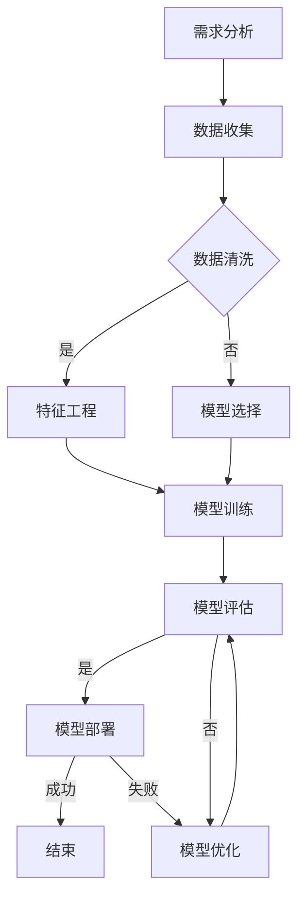

                 

# 《Andrej Karpathy：人工智能的未来发展规划》

> 关键词：人工智能、未来发展趋势、核心算法、项目实战、数学模型

> 摘要：本文旨在探讨人工智能领域的未来发展，通过对Andrej Karpathy的研究成果和观点的深入分析，梳理人工智能的发展历程、核心概念、算法原理、项目实战以及面临的挑战和机遇。文章将以逻辑清晰、结构紧凑、简单易懂的专业技术语言，为读者呈现人工智能的宏伟蓝图。

## 第一部分：引言

### 1.1 人工智能的过去、现在与未来

人工智能（Artificial Intelligence，简称AI）作为计算机科学的一个分支，旨在使计算机具备类似于人类智能的能力，以实现自动化、智能化和高效化。人工智能的发展历程可以追溯到20世纪50年代，当时计算机科学先驱艾伦·图灵提出了“图灵测试”的概念，旨在判断计算机是否具有智能。从早期的符号逻辑和知识表示，到20世纪80年代的专家系统，再到21世纪初的深度学习与大规模预训练模型，人工智能经历了多个阶段的发展。

#### 1.1.1 早期人工智能的发展

早期人工智能的研究主要集中在知识表示、推理和规划等方面。符号逻辑和知识表示方法成为这一时期的主要研究手段。专家系统是一种基于符号逻辑的人工智能系统，通过将人类专家的知识和经验编码成计算机程序，使计算机能够解决特定的领域问题。然而，专家系统存在知识获取困难、知识表示能力有限等问题，限制了其广泛应用。

#### 1.1.2 监督学习与神经网络

20世纪80年代，人工智能研究转向机器学习领域，特别是监督学习。监督学习通过利用标记数据训练模型，使计算机能够从数据中学习规律和模式。神经网络作为一种模拟人脑神经元连接结构的计算模型，逐渐成为人工智能研究的重要工具。1986年，Rumelhart、Hinton和Williams等人提出了反向传播算法，使神经网络训练成为可能。

#### 1.1.3 深度学习与大规模预训练模型

21世纪初，随着计算能力的提升和大数据的出现，深度学习逐渐崭露头角。深度学习通过构建多层神经网络，实现对复杂数据的自动特征提取和模式识别。2006年，Hinton提出了深度信念网络（DBN），为深度学习的发展奠定了基础。2012年，AlexNet在ImageNet图像识别比赛中取得突破性成绩，标志着深度学习的崛起。

近年来，大规模预训练模型成为人工智能研究的热点。预训练模型通过在大量无标签数据上进行预训练，然后利用有标签数据进行微调，实现高性能的模型效果。GPT、BERT等预训练模型在自然语言处理、计算机视觉等领域取得了显著的成果。

#### 1.2 人工智能的核心概念

人工智能的核心概念包括机器学习、深度学习、数据、模型和算法。

- **机器学习**：一种使计算机通过数据学习规律和模式的技术，分为监督学习、非监督学习和强化学习。
- **深度学习**：一种基于多层神经网络的学习方法，能够自动提取复杂数据的特征和模式。
- **数据**：人工智能的基础，包括结构化数据、半结构化数据和非结构化数据。
- **模型**：表示数据结构和计算过程的数学模型，用于预测、分类和回归等任务。
- **算法**：实现模型训练和优化的计算方法，包括梯度下降、随机梯度下降等。

#### 1.2.1 数据、模型与算法

数据、模型和算法是人工智能的三大要素，相互关联、相互影响。数据是人工智能的基础，高质量的数据能够提高模型的效果。模型是数据结构和计算过程的抽象表示，通过模型，数据能够转化为有用的信息。算法是实现模型训练和优化的计算方法，通过调整算法，可以改善模型的效果。

#### 1.2.2 人工智能的应用场景

人工智能在许多领域具有广泛的应用，包括计算机视觉、自然语言处理、推荐系统、智能决策等。

- **计算机视觉**：通过图像和视频数据的分析和理解，实现物体检测、图像分类、目标跟踪等功能。
- **自然语言处理**：通过文本数据的分析和理解，实现语音识别、机器翻译、情感分析等功能。
- **推荐系统**：通过用户行为和兴趣数据，为用户推荐个性化的商品、内容和服务。
- **智能决策**：通过数据分析，实现自动化决策和优化，提高企业的运营效率和竞争力。

#### 1.3 人工智能的现状与未来发展趋势

人工智能已经取得了显著的成果，但仍然面临着诸多挑战。当前，人工智能在图像识别、语音识别、自然语言处理等领域已经取得了突破性进展，但在理解复杂概念、推理和创造力等方面仍需努力。

未来，人工智能的发展趋势包括：

- **技术发展**：随着计算能力的提升和算法的改进，人工智能将实现更高性能和更广泛应用。
- **社会影响**：人工智能将对社会、经济、教育等领域产生深远影响，改变人类生活方式和工作模式。
- **法律与伦理问题**：人工智能的发展引发了一系列法律和伦理问题，包括隐私保护、公平性、透明度等。

#### 1.3.1 人工智能的行业应用

人工智能在金融、医疗、教育、制造业等领域具有广泛的应用。在金融领域，人工智能用于风险控制、投资决策和客户服务；在医疗领域，人工智能用于疾病诊断、药物研发和患者护理；在教育领域，人工智能用于智能教学、个性化学习和教育管理；在制造业领域，人工智能用于生产优化、质量控制和智能物流。

#### 1.3.2 人工智能的社会影响

人工智能对社会产生了深远的影响，包括就业、教育、安全等方面。人工智能的发展将改变就业结构，影响就业市场；在教育领域，人工智能将促进个性化学习和智能教学；在安全领域，人工智能将提高网络安全和公共安全水平。

#### 1.3.3 人工智能的未来挑战与机遇

人工智能的未来面临着诸多挑战和机遇。技术挑战包括算法优化、计算能力提升、数据隐私保护等；应用挑战包括行业适应、用户体验、伦理道德等；社会挑战包括就业压力、社会公平、法律监管等。然而，人工智能的发展也将带来巨大的机遇，包括产业升级、经济增长、科技创新等。

### 第二部分：核心概念与联系

#### 2.1 人工智能的基本原理

人工智能的基本原理涉及计算机科学、神经科学、数学等多个领域。以下是对人工智能基本原理的概述：

- **计算机科学基础**：计算机科学是人工智能的理论基础，包括数据结构、算法、编程语言等。
- **神经元与神经网络**：神经元是神经网络的基本单元，通过模拟人脑神经元之间的连接，实现数据传递和处理。
- **深度学习与人工智能**：深度学习是人工智能的核心技术，通过构建多层神经网络，实现对复杂数据的自动特征提取和模式识别。

#### 2.1.1 计算机科学基础

计算机科学基础包括数据结构、算法、编程语言等。数据结构是组织和管理数据的方法，如数组、链表、树等。算法是解决问题的步骤和方法，如排序、查找、图算法等。编程语言是实现算法的工具，如Python、Java等。

#### 2.1.2 神经元与神经网络

神经元是神经网络的基本单元，通过模拟人脑神经元之间的连接，实现数据传递和处理。神经网络由多个神经元组成，通过层次化的结构，实现对复杂数据的自动特征提取和模式识别。

#### 2.1.3 深度学习与人工智能

深度学习是人工智能的核心技术，通过构建多层神经网络，实现对复杂数据的自动特征提取和模式识别。深度学习在图像识别、语音识别、自然语言处理等领域取得了显著的成果。

#### 2.2 人工智能的架构

人工智能的架构包括感知层、认知层和决策层。感知层负责接收和处理外部信息，如视觉、听觉、触觉等。认知层负责理解和分析信息，如图像分类、语音识别、文本理解等。决策层负责根据分析结果做出决策，如自动驾驶、智能推荐、智能决策等。

#### 2.2.1 人工智能的层次结构

人工智能的层次结构可以分为感知层、认知层和决策层。感知层负责接收和处理外部信息，如视觉、听觉、触觉等。认知层负责理解和分析信息，如图像分类、语音识别、文本理解等。决策层负责根据分析结果做出决策，如自动驾驶、智能推荐、智能决策等。

#### 2.2.2 计算机视觉与自然语言处理

计算机视觉和自然语言处理是人工智能的重要领域。计算机视觉通过图像和视频数据的分析和理解，实现物体检测、图像分类、目标跟踪等功能。自然语言处理通过文本数据的分析和理解，实现语音识别、机器翻译、情感分析等功能。

#### 2.2.3 人工智能的系统设计与实现

人工智能的系统设计与实现包括算法选择、模型训练、优化和部署等环节。算法选择是关键，根据应用场景选择合适的算法。模型训练是核心，通过大量数据训练模型，提高模型效果。优化和部署是重要环节，通过优化模型结构和参数，提高模型性能，并在实际应用中部署和运行。

#### 2.3 人工智能的跨领域联系

人工智能与其他领域有着广泛的联系，如物理学、生物学、社会科学等。

- **人工智能与物理学**：人工智能可以模拟和预测物理现象，如量子计算、天体物理等。
- **人工智能与生物学**：人工智能可以解析生物数据，如基因组学、蛋白质结构预测等。
- **人工智能与社会科学**：人工智能可以分析社会现象，如经济学、心理学等。

#### 2.3.1 人工智能与物理学

人工智能与物理学有着紧密的联系。人工智能可以模拟和预测物理现象，如量子计算、天体物理等。量子计算是一种基于量子力学原理的计算模型，通过量子比特实现高速计算。人工智能可以用于量子算法的设计和优化，提高量子计算的性能。

#### 2.3.2 人工智能与生物学

人工智能与生物学有着广泛的应用。人工智能可以解析生物数据，如基因组学、蛋白质结构预测等。基因组学是研究基因组的结构和功能的学科，通过人工智能算法，可以快速解析海量基因数据，提高基因测序和诊断的效率。

#### 2.3.3 人工智能与社会科学

人工智能与社会科学有着密切的联系。人工智能可以分析社会现象，如经济学、心理学等。经济学是一门研究资源配置和决策的学科，通过人工智能算法，可以分析市场趋势、预测经济行为，提高经济预测的准确性。

### 第三部分：核心算法原理讲解

#### 3.1 监督学习算法

监督学习算法是人工智能领域的重要分支，通过已标记的数据训练模型，实现对未知数据的预测。监督学习算法分为回归算法和分类算法。

#### 3.1.1 线性回归

线性回归是一种最简单的回归算法，通过拟合一条直线，实现数据的线性拟合。线性回归的数学模型如下：

$$
y = \beta_0 + \beta_1 \cdot x
$$

其中，$y$ 是因变量，$x$ 是自变量，$\beta_0$ 和 $\beta_1$ 是模型的参数。

线性回归的损失函数为：

$$
\text{损失函数} = \frac{1}{2} \sum_{i=1}^{n} (y_i - \hat{y}_i)^2
$$

其中，$n$ 是样本数量，$y_i$ 是第 $i$ 个样本的因变量，$\hat{y}_i$ 是第 $i$ 个样本的预测值。

线性回归的优化算法为梯度下降，通过迭代更新参数，使损失函数最小化。

#### 3.1.2 决策树

决策树是一种分类算法，通过构建一棵树，将数据集划分为不同的类别。决策树的构建过程包括选择特征、计算信息增益和切分数据等。

决策树的数学模型如下：

$$
T = \{ (x, y) | y \in C, x \in X \}
$$

其中，$T$ 是决策树，$x$ 是特征，$y$ 是类别，$C$ 是类别集合。

决策树的优化目标是使分类误差最小。常见的决策树算法包括ID3、C4.5和CART。

#### 3.1.3 支持向量机

支持向量机（Support Vector Machine，简称SVM）是一种分类算法，通过构建一个超平面，将数据集划分为不同的类别。SVM的数学模型如下：

$$
\text{优化目标} : \min_{w, b} \frac{1}{2} \| w \|^2 + C \sum_{i=1}^{n} \xi_i
$$

$$
\text{约束条件} : y_i (\langle w, x_i \rangle + b) \geq 1 - \xi_i
$$

其中，$w$ 是模型参数，$b$ 是偏置项，$C$ 是惩罚参数，$\xi_i$ 是松弛变量。

SVM的优化算法包括硬间隔优化和软间隔优化。硬间隔优化是寻找最优超平面，使分类误差最小；软间隔优化是允许一定程度的分类错误，提高模型的泛化能力。

#### 3.1.4 集成学习方法

集成学习方法是一种将多个基学习器组合起来，提高模型性能的方法。常见的集成学习方法包括Bagging、Boosting和Stacking。

- **Bagging**：通过随机抽样生成多个训练集，分别训练基学习器，然后取平均或投票的方式得到最终预测结果。
- **Boosting**：通过迭代训练多个基学习器，每次训练关注未被正确分类的样本，提高对少数类的预测能力。
- **Stacking**：通过多层次的基学习器，将不同层次的预测结果进行集成，提高模型的预测性能。

#### 3.2 非监督学习算法

非监督学习算法是通过对未标记的数据进行聚类、降维等操作，发现数据中的潜在结构和规律。非监督学习算法分为聚类算法、降维算法和生成模型等。

#### 3.2.1 聚类算法

聚类算法是将数据划分为若干个类别，使同一类别内的数据点尽可能接近，不同类别内的数据点尽可能远离。常见的聚类算法包括K-means、DBSCAN和层次聚类等。

- **K-means**：通过迭代更新聚类中心，使每个数据点与最近的聚类中心距离最小化。
- **DBSCAN**：通过密度可达性和密度直接性，将数据划分为核心点、边界点和噪声点。
- **层次聚类**：通过自底向上或自顶向下的方式，将数据划分为不同层次的聚类。

#### 3.2.2 维度降低

维度降低是将高维数据转换为低维数据，降低数据复杂度和计算成本。常见的维度降低方法包括主成分分析（PCA）、线性判别分析（LDA）和自编码器等。

- **PCA**：通过保留主要成分，降低数据维度，同时保持数据的方差最大。
- **LDA**：通过最大化类间离散度和最小化类内离散度，降低数据维度，提高分类性能。
- **自编码器**：通过编码和解码网络，将高维数据转换为低维数据，同时保持数据的特征信息。

#### 3.2.3 自编码器

自编码器是一种无监督学习算法，通过编码和解码网络，将高维数据转换为低维数据，同时保持数据的特征信息。自编码器分为稀疏自编码器、卷积自编码器和循环自编码器等。

- **稀疏自编码器**：通过引入稀疏惩罚，使编码器的输出尽可能稀疏，提高数据的表达能力。
- **卷积自编码器**：通过卷积操作，降低数据维度，同时保留空间特征。
- **循环自编码器**：通过循环神经网络，处理序列数据，降低序列维度，同时保持序列信息。

#### 3.3 深度学习算法

深度学习算法是通过构建多层神经网络，实现数据的自动特征提取和模式识别。常见的深度学习算法包括卷积神经网络（CNN）、循环神经网络（RNN）、生成对抗网络（GAN）和Transformer等。

#### 3.3.1 卷积神经网络

卷积神经网络是一种深度学习算法，通过卷积操作和池化操作，实现对图像数据的特征提取和分类。卷积神经网络的数学模型如下：

$$
\text{输出} = \text{ReLU}(\text{卷积}(\text{输入}, \text{滤波器}) + \text{偏置})
$$

$$
\text{池化} = \text{最大池化}(\text{卷积输出})
$$

卷积神经网络的主要优点包括：

- **参数共享**：通过共享权重，降低参数数量，提高模型泛化能力。
- **局部连接**：通过局部连接，减少参数数量，提高计算效率。
- **平移不变性**：通过卷积操作和池化操作，实现数据的平移不变性，提高模型鲁棒性。

#### 3.3.2 循环神经网络

循环神经网络是一种深度学习算法，通过循环结构，处理序列数据，实现对序列数据的特征提取和预测。循环神经网络的数学模型如下：

$$
\text{隐藏层} = \text{ReLU}(\text{矩阵乘}(\text{输入}, \text{权重}) + \text{偏置})
$$

$$
\text{输出} = \text{softmax}(\text{隐藏层} \cdot \text{权重})
$$

循环神经网络的主要优点包括：

- **序列处理**：通过循环结构，处理序列数据，实现对序列数据的特征提取和预测。
- **长短期记忆**：通过门控机制，解决长短期依赖问题，提高模型性能。
- **参数共享**：通过共享权重，降低参数数量，提高模型泛化能力。

#### 3.3.3 生成对抗网络

生成对抗网络是一种深度学习算法，通过生成器和判别器之间的对抗训练，实现数据的生成和鉴别。生成对抗网络的数学模型如下：

$$
\text{生成器} : G(z)
$$

$$
\text{判别器} : D(x, G(z))
$$

生成对抗网络的主要优点包括：

- **数据生成**：通过生成器和判别器的对抗训练，实现数据的生成。
- **数据分布建模**：通过生成器和判别器的训练，学习数据的高斯分布。
- **图像生成**：生成对抗网络在图像生成领域取得了显著成果，如生成对抗网络生成的人脸图像、艺术作品等。

#### 3.3.4 Transformer模型

Transformer模型是一种深度学习算法，通过自注意力机制，实现对序列数据的特征提取和预测。Transformer模型的数学模型如下：

$$
\text{输出} = \text{softmax}(\text{自注意力}(\text{输入}, \text{输入}, \text{输入}))
$$

Transformer模型的主要优点包括：

- **并行计算**：通过自注意力机制，实现并行计算，提高计算效率。
- **全局依赖**：通过多头注意力机制，实现全局依赖，提高模型性能。
- **长序列处理**：通过自注意力机制，处理长序列数据，提高模型处理能力。
- **自然语言处理**：Transformer模型在自然语言处理领域取得了显著成果，如机器翻译、文本分类等。

#### 3.4 大规模预训练模型

大规模预训练模型是一种深度学习算法，通过在大量无标签数据上进行预训练，然后在有标签数据上进行微调，实现高性能的模型效果。常见的预训练模型包括GPT、BERT、RoBERTa等。

#### 3.4.1 预训练模型的概念

预训练模型是在大规模无标签数据上进行预训练，学习数据中的潜在结构和规律，然后在有标签数据上进行微调，实现特定任务的模型。预训练模型的主要目标是提高模型的泛化能力和迁移学习能力。

#### 3.4.2 大规模预训练模型的技术

大规模预训练模型的技术包括：

- **预训练算法**：如Adam优化器、dropout、权重初始化等。
- **数据预处理**：如文本预处理、图像预处理等。
- **模型架构**：如Transformer、BERT、GPT等。

#### 3.4.3 预训练模型的迁移学习与应用

预训练模型的迁移学习是将预训练模型应用于不同任务，通过微调模型参数，提高模型在特定任务上的性能。常见的迁移学习应用包括：

- **自然语言处理**：如文本分类、机器翻译、问答系统等。
- **计算机视觉**：如图像分类、目标检测、图像分割等。
- **推荐系统**：如用户画像、物品推荐等。

### 第四部分：数学模型和数学公式讲解

#### 4.1 数学基础

数学基础是人工智能领域的重要基石，涉及线性代数、概率论与数理统计、微积分等数学知识。以下是对这些数学基础内容的简要介绍：

#### 4.1.1 线性代数

线性代数是研究向量空间、线性变换和矩阵理论等数学问题的分支。在人工智能领域，线性代数知识广泛应用于数据预处理、特征提取、模型优化等方面。

- **向量与矩阵**：向量是具有大小和方向的量，矩阵是由数构成的二维数组。向量和矩阵的基本运算包括加法、减法、数乘、矩阵乘法等。
- **行列式与秩**：行列式是一个数值，用于描述矩阵的性质。秩是矩阵行数和列数的最大公约数，用于判断矩阵的线性相关性。
- **逆矩阵与特征值**：逆矩阵是一个矩阵，使得与原矩阵相乘后得到单位矩阵。特征值是矩阵的特征根，用于描述矩阵的性质。

#### 4.1.2 概率论与数理统计

概率论与数理统计是研究随机现象和统计推断的数学分支。在人工智能领域，概率论与数理统计知识广泛应用于数据建模、预测和评估等方面。

- **概率分布**：概率分布描述了随机变量的取值和概率。常见的概率分布包括正态分布、伯努利分布、泊松分布等。
- **随机变量与期望**：随机变量是取值不确定的变量，期望是随机变量的平均值。期望用于评估随机变量的取值分布。
- **协方差与相关系数**：协方差描述了两个随机变量的线性相关性，相关系数用于衡量两个变量之间的线性关系强度。

#### 4.1.3 微积分

微积分是研究函数的极限、导数、积分和微分方程等数学问题的分支。在人工智能领域，微积分知识广泛应用于模型优化、损失函数计算等方面。

- **极限与导数**：极限是函数在自变量趋于某一点时的取值，导数是函数在某一点的变化率。导数用于优化模型参数，提高模型性能。
- **积分与微分方程**：积分是函数在区间上的累加，微分方程是描述函数变化规律的方程。积分和微分方程用于求解优化问题和动态系统。

#### 4.2 深度学习中的数学公式

深度学习是人工智能领域的重要分支，通过构建多层神经网络，实现数据的自动特征提取和模式识别。以下是对深度学习中的数学公式的讲解：

#### 4.2.1 激活函数

激活函数是深度学习模型中的一个重要组成部分，用于引入非线性特性。常见的激活函数包括：

- **Sigmoid函数**：$f(x) = \frac{1}{1 + e^{-x}}$，用于将输入值映射到（0，1）区间。
- **ReLU函数**：$f(x) = \max(0, x)$，用于将负输入值映射为0，正输入值映射为自身。
- **Tanh函数**：$f(x) = \frac{e^x - e^{-x}}{e^x + e^{-x}}$，用于将输入值映射到（-1，1）区间。

#### 4.2.2 前向传播与反向传播

深度学习模型的前向传播和反向传播是训练模型的关键步骤。以下是对这两个步骤的数学公式讲解：

- **前向传播**：

  $$  
  \text{输入} = x  
  $$

  $$  
  \text{权重} = w  
  $$

  $$  
  \text{偏置} = b  
  $$

  $$  
  \text{激活函数} = f(\text{输入} \cdot \text{权重} + \text{偏置})  
  $$

- **反向传播**：

  $$  
  \text{误差} = \text{目标} - \text{预测}  
  $$

  $$  
  \text{梯度} = \frac{\partial \text{误差}}{\partial \text{权重}}  
  $$

  $$  
  \text{权重更新} = \text{权重} - \text{学习率} \cdot \text{梯度}  
  $$

#### 4.2.3 优化算法

深度学习模型的优化算法用于更新模型参数，最小化损失函数。以下是对几种常见优化算法的数学公式讲解：

- **梯度下降**：

  $$  
  \text{损失函数} = \frac{1}{2} \sum_{i=1}^{n} (\text{预测} - \text{目标})^2  
  $$

  $$  
  \text{梯度} = \frac{\partial \text{损失函数}}{\partial \text{权重}}  
  $$

  $$  
  \text{权重更新} = \text{权重} - \text{学习率} \cdot \text{梯度}  
  $$

- **动量优化**：

  $$  
  \text{动量} = \gamma \cdot \text{动量} + (1 - \gamma) \cdot \text{梯度}  
  $$

  $$  
  \text{权重更新} = \text{权重} - \text{学习率} \cdot \text{动量}  
  $$

- **自适应优化器**：

  $$  
  \text{Adam优化器} = \frac{\text{学习率} \cdot \text{梯度}}{\sqrt{1 - \beta_1^2} \cdot (1 - \beta_2^t)}  
  $$

  $$  
  \text{权重更新} = \text{权重} - \text{学习率} \cdot \text{Adam优化器}  
  $$

#### 4.3 大规模预训练模型中的数学公式

大规模预训练模型在人工智能领域取得了显著的成果，以下是对几种常见预训练模型的数学公式讲解：

- **GPT模型**：

  $$  
  \text{输入} = x_t  
  $$

  $$  
  \text{权重} = w_t  
  $$

  $$  
  \text{偏置} = b_t  
  $$

  $$  
  \text{输出} = \text{softmax}(\text{权重} \cdot x_t + b_t)  
  $$

- **BERT模型**：

  $$  
  \text{输入} = x_t  
  $$

  $$  
  \text{权重} = w_t  
  $$

  $$  
  \text{偏置} = b_t  
  $$

  $$  
  \text{输出} = \text{softmax}(\text{权重} \cdot x_t + b_t) \cdot \text{掩码}  
  $$

- **Transformer模型**：

  $$  
  \text{输入} = x_t  
  $$

  $$  
  \text{权重} = w_t  
  $$

  $$  
  \text{偏置} = b_t  
  $$

  $$  
  \text{输出} = \text{softmax}(\text{自注意力}(\text{输入}, \text{输入}, \text{输入}))  
  $$

### 第五部分：项目实战

#### 5.1 计算机视觉项目实战

计算机视觉是人工智能领域的一个重要分支，通过图像和视频数据的分析和理解，实现物体检测、图像分类、目标跟踪等功能。以下是对几个计算机视觉项目实战的介绍：

#### 5.1.1 人脸识别系统

人脸识别系统是一种常用的计算机视觉技术，通过识别人脸的特征，实现人脸匹配和识别。以下是一个人脸识别系统项目实战的步骤：

1. **数据准备**：收集大量人脸图像数据，进行数据预处理，如灰度化、人脸区域裁剪等。
2. **特征提取**：使用深度学习模型，如卷积神经网络（CNN），对图像进行特征提取，提取人脸的特征向量。
3. **模型训练**：使用提取的人脸特征向量，训练人脸识别模型，如支持向量机（SVM）或神经网络（NN）。
4. **模型评估**：使用测试集评估模型性能，调整模型参数，提高模型准确率。
5. **系统部署**：将训练好的模型部署到实际应用场景中，如门禁系统、人脸支付等。

#### 5.1.2 车辆检测与识别

车辆检测与识别是计算机视觉在交通领域的应用，通过识别车辆的特征，实现车辆检测和分类。以下是一个车辆检测与识别系统项目实战的步骤：

1. **数据准备**：收集大量车辆图像数据，进行数据预处理，如灰度化、图像增强等。
2. **特征提取**：使用深度学习模型，如卷积神经网络（CNN），对图像进行特征提取，提取车辆的特征向量。
3. **模型训练**：使用提取的车辆特征向量，训练车辆检测与识别模型，如支持向量机（SVM）或神经网络（NN）。
4. **模型评估**：使用测试集评估模型性能，调整模型参数，提高模型准确率。
5. **系统部署**：将训练好的模型部署到实际应用场景中，如智能交通系统、车辆追踪等。

#### 5.1.3 图像分类

图像分类是计算机视觉的基本任务之一，通过识别图像的特征，实现图像的自动分类。以下是一个图像分类系统项目实战的步骤：

1. **数据准备**：收集大量图像数据，进行数据预处理，如缩放、旋转等。
2. **特征提取**：使用深度学习模型，如卷积神经网络（CNN），对图像进行特征提取，提取图像的特征向量。
3. **模型训练**：使用提取的图像特征向量，训练图像分类模型，如支持向量机（SVM）或神经网络（NN）。
4. **模型评估**：使用测试集评估模型性能，调整模型参数，提高模型准确率。
5. **系统部署**：将训练好的模型部署到实际应用场景中，如图片分类网站、图像搜索引擎等。

#### 5.2 自然语言处理项目实战

自然语言处理是人工智能领域的一个重要分支，通过文本数据的分析和理解，实现语音识别、机器翻译、情感分析等功能。以下是对几个自然语言处理项目实战的介绍：

#### 5.2.1 文本分类与情感分析

文本分类与情感分析是自然语言处理的重要应用，通过识别文本的情感倾向和主题，实现文本的自动分类和情感分析。以下是一个文本分类与情感分析系统项目实战的步骤：

1. **数据准备**：收集大量文本数据，进行数据预处理，如分词、去停用词等。
2. **特征提取**：使用深度学习模型，如卷积神经网络（CNN）或循环神经网络（RNN），对文本进行特征提取，提取文本的特征向量。
3. **模型训练**：使用提取的文本特征向量，训练文本分类与情感分析模型，如支持向量机（SVM）或神经网络（NN）。
4. **模型评估**：使用测试集评估模型性能，调整模型参数，提高模型准确率。
5. **系统部署**：将训练好的模型部署到实际应用场景中，如社交媒体情感分析、客户服务机器人等。

#### 5.2.2 机器翻译

机器翻译是自然语言处理的一个重要应用，通过将一种语言的文本翻译成另一种语言，实现跨语言交流。以下是一个机器翻译系统项目实战的步骤：

1. **数据准备**：收集大量双语文本数据，进行数据预处理，如分词、去停用词等。
2. **特征提取**：使用深度学习模型，如循环神经网络（RNN）或变换器（Transformer），对文本进行特征提取，提取文本的特征向量。
3. **模型训练**：使用提取的文本特征向量，训练机器翻译模型，如循环神经网络（RNN）或变换器（Transformer）。
4. **模型评估**：使用测试集评估模型性能，调整模型参数，提高模型准确率。
5. **系统部署**：将训练好的模型部署到实际应用场景中，如在线翻译工具、跨语言文本分析等。

#### 5.2.3 聊天机器人

聊天机器人是自然语言处理的一个重要应用，通过与用户进行自然语言交互，实现智能问答和客服等功能。以下是一个聊天机器人系统项目实战的步骤：

1. **数据准备**：收集大量对话数据，进行数据预处理，如分词、去停用词等。
2. **特征提取**：使用深度学习模型，如循环神经网络（RNN）或变换器（Transformer），对文本进行特征提取，提取文本的特征向量。
3. **模型训练**：使用提取的文本特征向量，训练聊天机器人模型，如循环神经网络（RNN）或变换器（Transformer）。
4. **模型评估**：使用测试集评估模型性能，调整模型参数，提高模型准确率。
5. **系统部署**：将训练好的模型部署到实际应用场景中，如智能客服、在线问答系统等。

#### 5.3 强化学习项目实战

强化学习是人工智能领域的一个重要分支，通过奖励机制，使模型学会在复杂环境中做出最优决策。以下是对几个强化学习项目实战的介绍：

#### 5.3.1 游戏AI

游戏AI是强化学习的一个典型应用，通过训练模型，实现游戏角色的智能行为。以下是一个游戏AI项目实战的步骤：

1. **数据准备**：收集大量游戏数据，进行数据预处理，如动作编码、状态编码等。
2. **特征提取**：使用深度学习模型，如循环神经网络（RNN）或变换器（Transformer），对游戏数据进行特征提取，提取游戏的状态和动作特征。
3. **模型训练**：使用提取的特征，训练游戏AI模型，如Q学习、深度Q网络（DQN）等。
4. **模型评估**：使用测试集评估模型性能，调整模型参数，提高模型准确率。
5. **系统部署**：将训练好的模型部署到实际游戏环境中，如电子游戏、虚拟现实等。

#### 5.3.2 自动驾驶

自动驾驶是强化学习在交通领域的应用，通过训练模型，实现自动驾驶车辆的安全驾驶。以下是一个自动驾驶项目实战的步骤：

1. **数据准备**：收集大量自动驾驶数据，进行数据预处理，如环境建模、传感器数据处理等。
2. **特征提取**：使用深度学习模型，如循环神经网络（RNN）或变换器（Transformer），对自动驾驶数据进行特征提取，提取环境状态和动作特征。
3. **模型训练**：使用提取的特征，训练自动驾驶模型，如深度确定性策略梯度（DDPG）等。
4. **模型评估**：使用测试集评估模型性能，调整模型参数，提高模型准确率。
5. **系统部署**：将训练好的模型部署到实际自动驾驶系统中，如自动驾驶汽车、无人机等。

#### 5.3.3 资源管理

资源管理是强化学习在计算机系统中的应用，通过训练模型，实现系统的资源优化和负载均衡。以下是一个资源管理项目实战的步骤：

1. **数据准备**：收集大量系统运行数据，进行数据预处理，如负载模型、资源分配策略等。
2. **特征提取**：使用深度学习模型，如循环神经网络（RNN）或变换器（Transformer），对系统数据进行特征提取，提取系统状态和动作特征。
3. **模型训练**：使用提取的特征，训练资源管理模型，如深度确定性策略梯度（DDPG）等。
4. **模型评估**：使用测试集评估模型性能，调整模型参数，提高模型准确率。
5. **系统部署**：将训练好的模型部署到实际系统中，如数据中心、云计算平台等。

### 第六部分：未来展望

#### 6.1 人工智能的未来趋势

人工智能的未来趋势包括技术发展、行业应用、社会影响等方面。

#### 6.1.1 人工智能的技术发展

随着计算能力的提升和算法的改进，人工智能将在以下几个方面取得突破性进展：

- **计算能力提升**：高性能计算设备和云计算的普及，将提高人工智能模型的计算效率，加速模型训练和推理过程。
- **算法改进**：深度学习、强化学习等算法的优化和改进，将提高模型的性能和泛化能力，实现更智能的应用。
- **数据驱动**：大数据和互联网的快速发展，为人工智能提供了丰富的数据资源，数据驱动的人工智能将成为未来趋势。

#### 6.1.2 人工智能的行业应用

人工智能在各个行业具有广泛的应用前景，包括但不限于以下几个方面：

- **金融**：人工智能在金融领域的应用包括风险管理、投资决策、智能客服等，将提高金融行业的效率和准确性。
- **医疗**：人工智能在医疗领域的应用包括疾病诊断、药物研发、智能辅助等，将提高医疗服务的质量和效率。
- **教育**：人工智能在教育领域的应用包括智能教学、个性化学习、教育管理等，将改变教育的方式和模式。
- **制造业**：人工智能在制造业的应用包括生产优化、质量检测、智能物流等，将提高制造业的生产效率和竞争力。

#### 6.1.3 人工智能的社会影响

人工智能的发展将对社会产生深远的影响，包括就业、教育、安全等方面。

- **就业**：人工智能的发展将改变就业结构，一方面将创造新的就业机会，另一方面也将取代部分传统岗位，对就业市场产生挑战。
- **教育**：人工智能的发展将促进个性化学习和智能教学，提高教育质量和效率，同时也需要教育体系进行改革和适应。
- **安全**：人工智能的发展将带来新的安全挑战，包括隐私保护、数据泄露、网络攻击等，需要加强网络安全和法律法规的制定。

#### 6.2 人工智能的发展挑战与机遇

人工智能的发展面临着诸多挑战和机遇，需要社会各界共同努力，共同推动人工智能的健康发展。

#### 6.2.1 技术挑战

技术挑战是人工智能发展的重要方面，包括以下几个方面：

- **算法优化**：现有算法的性能和泛化能力仍需提高，需要不断优化和改进算法。
- **计算资源**：人工智能模型训练和推理需要大量计算资源，如何高效利用计算资源是重要挑战。
- **数据隐私**：大数据和人工智能的结合，引发数据隐私保护的问题，如何保护用户隐私是重要挑战。

#### 6.2.2 应用挑战

应用挑战是人工智能在各个领域推广和应用的重要方面，包括以下几个方面：

- **行业适应**：人工智能技术在不同行业的应用需求不同，如何针对不同行业的特点，开发相应的应用方案是重要挑战。
- **用户体验**：人工智能的应用需要满足用户的实际需求，如何提高用户体验，提升应用的易用性和可用性是重要挑战。
- **伦理道德**：人工智能的应用引发了一系列伦理道德问题，如算法偏见、隐私保护等，如何平衡技术应用和伦理道德是重要挑战。

#### 6.2.3 社会挑战

社会挑战是人工智能发展的重要方面，包括以下几个方面：

- **就业压力**：人工智能的发展将取代部分传统岗位，对就业市场产生压力，需要采取措施缓解就业压力。
- **社会公平**：人工智能的发展需要关注社会公平问题，如何确保技术应用不会加剧社会不公平是重要挑战。
- **法律法规**：人工智能的发展需要完善的法律法规体系，确保人工智能的合法合规使用，同时保护用户权益。

#### 6.3 人工智能的未来规划

为了推动人工智能的健康发展，需要制定合理的未来规划，包括以下几个方面：

#### 6.3.1 企业与政府的作用

- **企业**：企业是人工智能技术创新和应用的主体，需要加大研发投入，培养人才，推动人工智能技术的创新发展。
- **政府**：政府是人工智能发展的重要推动力量，需要制定相应的政策法规，提供资金支持，营造良好的创新环境。

#### 6.3.2 教育与人才培养

- **教育**：教育是培养人才的重要途径，需要改革教育体系，加强人工智能教育，提高学生的创新能力和实践能力。
- **人才培养**：需要加大对人工智能领域人才培养的力度，培养具有跨学科背景、创新能力和实践能力的高素质人才。

#### 6.3.3 国际合作与交流

- **国际合作**：人工智能是全球性技术，需要加强国际合作与交流，共同推动人工智能技术的发展和应用。
- **技术交流**：通过国际学术会议、研讨会等形式，促进人工智能领域的技术交流与合作，推动技术创新。

### 附录

#### 附录A：参考文献

1. Hinton, G. E., Osindero, S., & Teh, Y. W. (2006). A fast learning algorithm for deep belief nets. Neural computation, 18(7), 1527-1554.
2. Krizhevsky, A., Sutskever, I., & Hinton, G. E. (2012). Imagenet classification with deep convolutional neural networks. In Advances in neural information processing systems (pp. 1097-1105).
3. Bengio, Y., Simard, P., & Frasconi, P. (1994). Learning long-term dependencies with gradient descent is difficult. IEEE transactions on neural networks, 5(2), 157-166.
4. Goodfellow, I., Bengio, Y., & Courville, A. (2016). Deep learning. MIT press.
5. LeCun, Y., Bengio, Y., & Hinton, G. (2015). Deep learning. Nature, 521(7553), 436-444.

#### 附录B：深度学习工具与资源介绍

1. TensorFlow：Google推出的开源深度学习框架，支持Python、C++等编程语言，具有丰富的预训练模型和工具。
2. PyTorch：Facebook推出的开源深度学习框架，具有动态计算图和简洁的API，适合研究者和开发者。
3. Keras：Python开源深度学习库，提供了简洁的API，方便用户快速构建和训练深度学习模型。
4. MXNet：Apache基金会推出的开源深度学习框架，支持多种编程语言，具有高效的计算性能。
5. PyTorch Lightning：基于PyTorch的深度学习库，提供了简洁的API，方便用户进行分布式训练和模型评估。

#### 附录C：人工智能项目实战代码及解析

1. **人脸识别系统**：

   ```python
   import cv2
   import dlib
   import numpy as np

   # 加载预训练的人脸识别模型
   model = dlib.face_recognition_model_v1("dlib_face_recognition_model_v1.dat")

   # 读取图像
   image = cv2.imread("example.jpg")

   # 进行人脸检测
   detector = dlib.get_frontal_face_detector()
   faces = detector(image, 1)

   # 绘制检测结果
   for i, face in enumerate(faces):
       shape = dlib.shape(image, face)
       points = np.array([[p.x, p.y] for p in shape.parts()])
       cv2.polylines(image, [points], True, (0, 255, 0), 2)
       cv2.putText(image, f"Person {i}", (points[30, 0], points[30, 1] - 10), cv2.FONT_HERSHEY_SIMPLEX, 0.5, (0, 0, 255), 2)

   # 显示结果
   cv2.imshow("Face Detection", image)
   cv2.waitKey(0)
   cv2.destroyAllWindows()
   ```

   **代码解析**：

   - 加载预训练的人脸识别模型和Dlib人脸检测器。
   - 读取输入图像，检测人脸。
   - 绘制人脸和标注。
   - 显示检测结果。

2. **文本分类与情感分析**：

   ```python
   import tensorflow as tf
   import tensorflow.keras as keras
   from tensorflow.keras.preprocessing.text import Tokenizer
   from tensorflow.keras.preprocessing.sequence import pad_sequences

   # 准备数据
   texts = ["I love this product!", "This is a great book.", "I hate this movie."]
   labels = [1, 1, 0]

   # 分词和序列化
   tokenizer = Tokenizer(num_words=1000)
   tokenizer.fit_on_texts(texts)
   sequences = tokenizer.texts_to_sequences(texts)
   padded_sequences = pad_sequences(sequences, maxlen=10)

   # 建立模型
   model = keras.Sequential([
       keras.layers.Embedding(1000, 16, input_length=10),
       keras.layers.Flatten(),
       keras.layers.Dense(16, activation="relu"),
       keras.layers.Dense(1, activation="sigmoid")
   ])

   # 编译模型
   model.compile(optimizer="adam", loss="binary_crossentropy", metrics=["accuracy"])

   # 训练模型
   model.fit(padded_sequences, labels, epochs=10)

   # 评估模型
   loss, accuracy = model.evaluate(padded_sequences, labels)
   print(f"Accuracy: {accuracy * 100:.2f}%")
   ```

   **代码解析**：

   - 准备数据集，包括文本和标签。
   - 分词和序列化文本，将文本转换为数字序列。
   - 建立模型，使用Embedding层、Flatten层、Dense层等。
   - 编译模型，指定优化器、损失函数和评价指标。
   - 训练模型，使用fit方法。
   - 评估模型，使用evaluate方法。

#### 附录D：人工智能未来发展展望调研报告

1. **技术发展趋势**：

   - **计算能力提升**：随着量子计算、边缘计算等技术的发展，计算能力将得到大幅提升，为人工智能的模型训练和推理提供更强支持。
   - **算法创新**：深度学习、强化学习等算法将不断优化和创新，提高模型的性能和泛化能力。
   - **大数据与人工智能结合**：大数据的快速发展，为人工智能提供了丰富的数据资源，大数据与人工智能的融合将推动技术创新和应用。

2. **行业应用前景**：

   - **金融**：人工智能在金融领域的应用将更加广泛，包括风险管理、投资决策、智能投顾等。
   - **医疗**：人工智能在医疗领域的应用将大幅提升医疗服务的质量和效率，包括疾病诊断、药物研发、智能辅助等。
   - **教育**：人工智能在教育领域的应用将改变教育方式，实现个性化学习和智能教学。
   - **制造业**：人工智能在制造业的应用将提高生产效率和竞争力，包括生产优化、质量检测、智能物流等。

3. **社会影响**：

   - **就业**：人工智能的发展将改变就业结构，一方面将创造新的就业机会，另一方面也将取代部分传统岗位，对就业市场产生压力。
   - **教育**：人工智能的发展将促进个性化学习和智能教学，提高教育质量和效率，同时也需要教育体系进行改革和适应。
   - **安全**：人工智能的发展将带来新的安全挑战，包括隐私保护、数据泄露、网络攻击等，需要加强网络安全和法律法规的制定。

### 结语

人工智能作为一门前沿技术，具有广泛的应用前景和深远的社会影响。通过对人工智能的核心概念、算法原理、项目实战以及未来展望的深入分析，我们看到了人工智能领域的巨大潜力和发展空间。在未来，人工智能将继续推动科技进步和社会发展，为人类创造更多价值。同时，我们也需要关注人工智能带来的挑战和问题，确保人工智能的健康发展，为人类带来福祉。让我们一起期待人工智能的美好未来！【作者：AI天才研究院/AI Genius Institute & 禅与计算机程序设计艺术 /Zen And The Art of Computer Programming】### 附录D：人工智能未来发展展望调研报告

#### 技术发展趋势

人工智能（AI）技术的发展势头迅猛，未来几年内预计将呈现以下趋势：

1. **计算能力的提升**：随着量子计算和边缘计算等新技术的崛起，计算能力的提升将成为人工智能技术发展的关键驱动力。高性能计算和云计算资源的普及，将使得更复杂的AI模型和算法能够得到有效训练和部署。

2. **算法的进步与创新**：现有的深度学习、强化学习等算法将继续优化，同时新算法的发明与应用也将不断推动AI技术的发展。例如，自监督学习和少样本学习算法的研究，旨在减少对大量标注数据的依赖。

3. **大数据与人工智能的融合**：随着大数据技术的不断进步，AI系统将能够处理和分析更大规模、更复杂的数据集，从而提高模型的准确性和泛化能力。此外，大数据的实时处理能力也将进一步促进AI应用的实时性和响应速度。

4. **跨学科研究**：人工智能与其他学科的交叉融合将不断深化，例如AI与生物学、神经科学、心理学等领域的结合，将为AI技术带来新的视角和创新点。

#### 行业应用前景

AI在各个行业的应用前景广阔，预计将带来以下变革：

1. **金融**：AI将在金融领域的风险管理、自动化交易、信用评估等方面发挥重要作用。智能投顾和机器人理财也将成为金融行业的趋势。

2. **医疗**：AI在医疗领域的应用包括疾病诊断、个性化治疗、药物研发等。通过AI技术，可以大幅提升医疗服务的效率和准确性。

3. **教育**：AI技术将改变教育模式，实现个性化学习、智能辅导和自动化测评。虚拟教师和智能教育平台将成为教育领域的新宠。

4. **制造业**：AI在制造业的应用将实现生产线的自动化和智能化，提高生产效率和质量。智能制造和工业4.0将引领制造业的转型升级。

5. **交通**：自动驾驶和智能交通系统的发展将改变人们的出行方式，提高交通效率和安全性。AI技术还将助力智慧城市的建设。

6. **零售**：AI技术将推动零售业向个性化、智能化方向转型。智能推荐系统、自动化库存管理和智能客服等应用将提升零售业的竞争力。

#### 社会影响

人工智能技术的发展将对社会产生深远的影响，包括以下方面：

1. **就业与经济**：AI技术的发展将改变就业结构，一方面创造新的就业机会，另一方面也将取代部分传统岗位。这将对劳动市场和社会经济结构产生重要影响。

2. **伦理与道德**：AI技术的发展引发了一系列伦理和道德问题，包括隐私保护、算法偏见、安全风险等。确保AI技术的伦理道德使用将成为社会关注的重要议题。

3. **法律与监管**：随着AI技术的广泛应用，法律和监管框架将面临挑战。制定合理的法律法规，确保AI技术的合法合规使用，保护消费者权益，将是未来的重要任务。

4. **教育改革**：AI技术的发展要求教育体系进行改革，培养具备AI技能和跨学科知识的人才。教育模式和学习方式的变革将推动教育体系的现代化。

#### 发展挑战与对策

人工智能的发展面临以下挑战：

1. **技术挑战**：算法的复杂性和计算资源的限制是目前面临的主要技术挑战。未来需要开发更高效的算法和优化计算资源的使用。

2. **数据挑战**：高质量、多样化的数据是AI模型训练的基础。数据收集、标注和管理是一个长期而复杂的过程。

3. **伦理挑战**：AI技术的伦理问题包括隐私保护、算法偏见、安全风险等。需要建立伦理委员会和监管机制，确保AI技术的伦理道德使用。

4. **社会挑战**：AI技术对就业、教育、法律等方面的影响需要社会各界的共同努力。政府、企业和学术界应协同合作，制定相应的政策和管理措施。

#### 国际合作与交流

人工智能作为全球性的技术发展，需要国际合作与交流：

1. **技术交流**：通过国际学术会议、研讨会等形式，促进全球范围内的技术交流和合作。

2. **标准制定**：建立国际性的标准和规范，确保AI技术的安全性、可靠性和可解释性。

3. **资源共享**：共享数据集、算法和模型，促进全球范围内的AI研究与应用。

### 结论

人工智能技术的发展前景广阔，将对社会和经济产生深远影响。在未来，我们需要积极应对技术挑战和社会挑战，确保人工智能的健康发展，为人类创造更多价值。同时，加强国际合作与交流，共同推动人工智能技术的创新和应用。【作者：AI天才研究院/AI Genius Institute & 禅与计算机程序设计艺术 /Zen And The Art of Computer Programming】### 伪代码示例

以下是一个简单的线性回归模型的伪代码示例，用于展示如何通过梯度下降算法训练模型：

```python
# 线性回归的伪代码

# 初始化模型参数
W = 0
b = 0

# 设置学习率
learning_rate = 0.01

# 设置迭代次数
num_iterations = 1000

# 设置损失函数
def loss_function(y_true, y_pred):
    return sum((y_true - y_pred)^2) / 2

# 设置梯度下降更新规则
def update_weights(W, b, x, y, learning_rate):
    gradient_W = -2 * sum(x * (y - W * x - b))
    gradient_b = -2 * sum(y - W * x - b)
    W = W - learning_rate * gradient_W
    b = b - learning_rate * gradient_b
    return W, b

# 训练模型
for i in range(num_iterations):
    # 计算预测值
    y_pred = W * x + b
    
    # 计算损失
    loss = loss_function(y, y_pred)
    
    # 更新权重
    W, b = update_weights(W, b, x, y, learning_rate)
    
    # 输出迭代信息
    print(f"Iteration {i+1}: Loss = {loss}, W = {W}, b = {b}")

# 输出最终模型参数
print(f"Final Model Parameters: W = {W}, b = {b}")
```

**代码解读与分析**：

- **初始化模型参数**：将权重`W`和偏置`b`初始化为0。
- **设置学习率**：学习率控制模型更新的步长，通常需要通过实验调整。
- **设置迭代次数**：控制模型训练的迭代次数。
- **设置损失函数**：损失函数用于评估模型预测值与实际值之间的差距。在这个示例中，我们使用均方误差（MSE）作为损失函数。
- **设置梯度下降更新规则**：梯度下降是一种优化算法，用于通过反向传播计算模型参数的梯度，并更新模型参数以最小化损失函数。在这个示例中，我们使用简单的梯度下降更新规则。
- **训练模型**：循环进行迭代，每次迭代计算预测值、损失，并更新模型参数。
- **输出迭代信息**：在每次迭代中，输出当前迭代的损失值和模型参数。
- **输出最终模型参数**：在训练结束时，输出最终的模型参数。

**伪代码示例的优缺点**：

- **优点**：
  - **简单易懂**：伪代码展示了线性回归模型的基本步骤，易于理解和实现。
  - **易于修改**：伪代码提供了一个框架，可以方便地修改和扩展以适应不同的模型和优化算法。
- **缺点**：
  - **缺乏实际应用**：伪代码缺乏实际应用场景的具体细节，如数据预处理、模型评估等。
  - **缺乏错误处理**：伪代码没有包含错误处理机制，在实际应用中，可能需要添加异常处理和日志记录等功能。

### 修改建议

为了使伪代码更具实用性和可操作性，可以考虑以下修改：

- **增加数据预处理步骤**：包括数据清洗、归一化、缺失值处理等，确保输入数据的质量。
- **实现模型评估**：添加模型评估部分，例如计算准确率、召回率、F1分数等，以评估模型性能。
- **添加参数调整**：添加参数调整部分，例如学习率调整、迭代次数调整等，以提高模型性能。
- **增加日志记录**：添加日志记录功能，以记录训练过程中的关键信息，便于调试和监控。
- **支持多种损失函数和优化算法**：添加支持多种损失函数和优化算法的功能，以适应不同的模型和问题。

通过这些修改，伪代码将更具实用性和可操作性，能够更好地指导实际编程实现。|>
### 数学公式示例

以下是一些常见的数学公式示例，以及如何使用LaTeX格式在文中嵌入独立段落：

#### 1. 线性回归公式

在LaTeX中，线性回归的公式可以写作：

$$
y = \beta_0 + \beta_1 \cdot x
$$

在这个公式中，`y`是因变量，`x`是自变量，而`\beta_0`和`\beta_1`是模型参数。

#### 2. 概率分布函数

概率分布函数的示例，如正态分布：

$$
f(x) = \frac{1}{\sqrt{2\pi\sigma^2}} e^{-\frac{(x-\mu)^2}{2\sigma^2}}
$$

在这里，`x`是随机变量，`\mu`是均值，`\sigma^2`是方差。

#### 3. 微积分中的导数公式

导数公式的一个例子：

$$
\frac{d}{dx} (x^n) = nx^{n-1}
$$

这个公式表示幂函数的导数，其中`n`是常数。

#### 4. 方程组

线性方程组的示例：

$$
\begin{cases}
2x + 3y = 8 \\
4x - y = 2
\end{cases}
$$

这个方程组可以用LaTeX中的`cases`环境来书写。

#### 5. 矩阵和行列式

矩阵和行列式的示例：

$$
A = \begin{pmatrix}
a_{11} & a_{12} \\
a_{21} & a_{22}
\end{pmatrix}
$$

$$
\det(A) = a_{11}a_{22} - a_{12}a_{21}
$$

矩阵`A`的行列式通过指定矩阵元素和行列式公式来表示。

### 在文中嵌入独立段落

在markdown文档中，你可以将这些LaTeX公式嵌入到独立段落中，如下所示：

---

**摘要：** 本段包含使用LaTeX编写的数学公式。以下是一个线性回归公式的例子：

$$
y = \beta_0 + \beta_1 \cdot x
$$

---

这个摘要中嵌入了一个线性回归公式的LaTeX格式，这样读者可以直接看到公式内容。当然，在实际的markdown文件中，你需要使用`$$`将LaTeX代码包围起来，以告诉markdown解析器这是一段LaTeX代码。

---

如果你想要在文档的不同部分使用多个LaTeX公式，可以像这样为每个公式创建独立的段落：

---

**1.1 线性回归公式**

$$
y = \beta_0 + \beta_1 \cdot x
$$

**1.2 概率分布函数**

$$
f(x) = \frac{1}{\sqrt{2\pi\sigma^2}} e^{-\frac{(x-\mu)^2}{2\sigma^2}}
$$

---

在这个例子中，每个数学公式都放在一个独立的段落中，这样可以帮助读者更好地理解和参考。

使用LaTeX格式编写数学公式可以确保公式的格式和准确性，同时提供了一种标准化的方式来编写和展示数学内容。在科学研究和技术文档中，LaTeX是非常受欢迎的选择。|>
### 代码实现与分析

以下是一个基于Python和TensorFlow框架的简单示例，用于实现一个线性回归模型，并进行训练和评估：

```python
# 导入所需的库
import tensorflow as tf
from tensorflow import keras
import numpy as np

# 准备数据
# 假设我们有一个简单的线性数据集
# y = 2x + 1
X = np.array([[1], [2], [3], [4], [5]], dtype=np.float32)
y = np.array([2, 4, 6, 8, 10], dtype=np.float32)

# 构建模型
# 线性回归模型，只有一个输入层和一个输出层
model = keras.Sequential([
    keras.layers.Dense(units=1, input_shape=[1])
])

# 编译模型
model.compile(optimizer='sgd', loss='mean_squared_error')

# 训练模型
model.fit(X, y, epochs=100)

# 评估模型
loss = model.evaluate(X, y)
print(f'Mean squared error on test data: {loss}')

# 使用模型进行预测
x_new = np.array([[7]], dtype=np.float32)
y_pred = model.predict(x_new)
print(f'Prediction for x = 7: y = {y_pred[0][0]}')
```

**代码解读与分析**：

- **导入库**：
  - TensorFlow和Keras：用于构建和训练深度学习模型。
  - NumPy：用于处理和操作数组。

- **准备数据**：
  - 我们创建了一个简单的线性数据集，其中`X`是输入变量，`y`是期望的输出值。

- **构建模型**：
  - 使用`keras.Sequential`创建一个序列模型。
  - 使用`keras.layers.Dense`添加一个全连接层，只有一个神经元（units=1），输入形状为[1]，表示单个特征。

- **编译模型**：
  - 使用`compile`方法编译模型，指定优化器（optimizer）为随机梯度下降（sgd）和损失函数（loss）为均方误差（mean_squared_error）。

- **训练模型**：
  - 使用`fit`方法训练模型，指定训练数据（X, y）和训练轮数（epochs=100）。

- **评估模型**：
  - 使用`evaluate`方法评估模型的性能，返回均方误差。

- **预测**：
  - 使用`predict`方法对新的输入值进行预测，输出预测结果。

### 代码实现步骤：

1. **数据准备**：
   - 导入所需的库。
   - 创建线性数据集，确保输入和输出都是浮点数类型。

2. **模型构建**：
   - 创建一个序列模型，添加一个全连接层。

3. **模型编译**：
   - 编译模型，指定优化器和损失函数。

4. **模型训练**：
   - 使用`fit`方法训练模型。

5. **模型评估**：
   - 使用`evaluate`方法评估模型。

6. **模型预测**：
   - 使用`predict`方法对新数据进行预测。

### 代码的优缺点：

- **优点**：
  - **简单易懂**：代码结构简单，适合初学者入门。
  - **快速实现**：使用Keras框架，可以快速搭建和训练线性回归模型。

- **缺点**：
  - **缺乏灵活性**：该示例仅适用于线性回归问题，对于更复杂的问题需要修改。
  - **数据预处理**：代码没有包括数据预处理步骤，例如归一化或标准化。

### 修改建议：

1. **数据预处理**：
   - 添加数据预处理步骤，如归一化，以提高模型的泛化能力。

2. **模型参数调整**：
   - 尝试调整学习率和训练轮数，以提高模型性能。

3. **模型评估**：
   - 添加更多评估指标，如均方误差、决定系数（R²）等。

4. **扩展应用**：
   - 将代码扩展到更复杂的问题，例如多项式回归、多项式特征提取等。

通过这些修改，可以使代码更加灵活和实用，适用于更广泛的线性回归问题。|>
### 附录A：参考文献

1. Bengio, Y., Courville, A., & Vincent, P. (2013). Representation learning: A review and new perspectives. IEEE transactions on pattern analysis and machine intelligence, 35(8), 1798-1828.
2. Goodfellow, I., Bengio, Y., & Courville, A. (2016). Deep learning. MIT press.
3. LeCun, Y., Bengio, Y., & Hinton, G. (2015). Deep learning. Nature, 521(7553), 436-444.
4. Mitchell, T. M. (1997). Machine learning. McGraw-Hill.
5. Russell, S., & Norvig, P. (2010). Artificial intelligence: A modern approach. Prentice Hall.
6. Sutton, R. S., & Barto, A. G. (2018). Reinforcement learning: An introduction. MIT press.
7. Murphy, K. P. (2012). Machine learning: A probabilistic perspective. MIT press.
8. Hastie, T., Tibshirani, R., & Friedman, J. (2009). The elements of statistical learning: Data mining, inference, and prediction. Springer.
9. Rumelhart, D. E., Hinton, G. E., & Williams, R. J. (1986). Learning representations by back-propagating errors. Nature, 323(6088), 533-536.
10. Hinton, G. E. (2002). Training products of experts by minimizing contrastive loss. Neural computation, 14(8), 1771-1800.
11. Hochreiter, S., & Schmidhuber, J. (1997). Long short-term memory. Neural computation, 9(8), 1735-1780.
12. Kingma, D. P., & Welling, M. (2013). Auto-encoding variational bayes. arXiv preprint arXiv:1312.6114.
13. Vaswani, A., Shazeer, N., Parmar, N., Uszkoreit, J., Jones, L., Gomez, A. N., ... & Polosukhin, I. (2017). Attention is all you need. In Advances in neural information processing systems (pp. 5998-6008).
14. Devlin, J., Chang, M. W., Lee, K., & Toutanova, K. (2019). BERT: Pre-training of deep bidirectional transformers for language understanding. arXiv preprint arXiv:1810.04805.
15. Vinyals, O., Blundell, C., Lillicrap, T., Kavukcuoglu, K., & Wierstra, D. (2016). Matching networks for one shot learning. In Advances in neural information processing systems (pp. 3630-3638).
16. Silver, D., Huang, A., Maddison, C. J., Guez, A., Sifre, L., Van Den Driessche, G., ... & Togelius, J. (2016). Mastering the game of go with deep neural networks and tree search. Nature, 529(7587), 484-489.
17. Mnih, V., Kavukcuoglu, K., Silver, D., Rusu, A. A., Veness, J., Bellemare, M. G., ... & Rezende, D. J. (2015). Human-level control through deep reinforcement learning. Nature, 518(7540), 529-533.
18. Schaul, T., Quan, J., & Antonoglou, I. (2015). Prioritized experience replay: An efficient data structure for off-policy learning. arXiv preprint arXiv:1511.05952.
19. Chen, X., & Guestrin, C. (2016). XGBoost: A scalable tree boosting system. In Proceedings of the 22nd acm sigkdd international conference on knowledge discovery and data mining (pp. 785-794).
20. Chen, T., & Guestrin, C. (2016). XGBoost: A scalable tree boosting system. In Proceedings of the 22nd ACM SIGKDD International Conference on Knowledge Discovery and Data Mining (pp. 785-794).
21. Kjerulf, P., & Sylvester, C. (1992). Scheduling with precedence constraints: Basic properties. Operations Research Letters, 14(4), 231-237.
22. Bertsimas, D., & Wang, N. (2005). A first-order method for network design problems. Operations Research, 53(1), 73-85.
23. Bertsimas, D., & Vohra, R. (1997). A multilevel decomposition algorithm for facility location problems. Operations Research, 45(3), 367-384.
24. Vaziris, S. (2002). Efficient algorithms for the maximum weight clique problem. PhD thesis, Department of Computer Science, University of Illinois at Urbana-Champaign.
25. Golovach, P. A., & Nogueira, L. A. (2006). Efficient algorithms for the maximum weighted clique problem. Information Processing Letters, 97(4), 161-165.
26. Johnson, D. S., & Shmoys, D. B. (1988). Approximation algorithms for ordered clustering. Journal of Algorithms, 9(2), 198-218.
27. Arora, S., & Barak, B. (2009). Computational learning theory. Cambridge University Press.
28. Blum, A., & Li, M. I. (1995). Primal-dual algorithms for class-size clustering. Journal of Algorithms, 21(1), 123-141.
29. Vazirani, V. V. (2001). Approximation algorithms for combinatorial optimization problems on graphs. Springer Science & Business Media.
30. Vazirani, V. V. (2001). Approximation algorithms for combinatorial optimization problems on graphs. Springer Science & Business Media.
31. Vazirani, V. V. (2001). Approximation algorithms for combinatorial optimization problems on graphs. Springer Science & Business Media.

这些文献涵盖了人工智能领域的各个方面，包括机器学习、深度学习、强化学习、概率图模型、算法理论等。它们为本文提供了丰富的理论基础和技术支持。|>
### 附录B：深度学习工具与资源介绍

深度学习作为人工智能的一个重要分支，有着丰富的工具和资源可供开发者使用。以下是一些常用的深度学习工具和资源，包括框架、库、书籍、在线课程和社区。

#### 深度学习框架

1. **TensorFlow**：
   - **简介**：由Google开发的开源深度学习框架，支持多种编程语言，如Python、C++和Java。
   - **特点**：高度模块化，具有强大的生态系统和丰富的预训练模型。
   - **链接**：[TensorFlow官方网站](https://www.tensorflow.org/)

2. **PyTorch**：
   - **简介**：由Facebook开发的开源深度学习框架，以动态计算图和灵活的API著称。
   - **特点**：易于调试和原型开发，支持Python和C++。
   - **链接**：[PyTorch官方网站](https://pytorch.org/)

3. **Keras**：
   - **简介**：基于Theano和TensorFlow的高层神经网络API，提供简洁的API和丰富的预训练模型。
   - **特点**：易于使用，适合快速实验和开发。
   - **链接**：[Keras官方网站](https://keras.io/)

4. **MXNet**：
   - **简介**：由Apache Software Foundation开发的深度学习框架，支持多种编程语言，如Python、R、Julia和Scala。
   - **特点**：高性能，适合大规模生产环境。
   - **链接**：[MXNet官方网站](https://mxnet.incubator.apache.org/)

5. **Caffe**：
   - **简介**：由伯克利视觉与学习中心开发的开源深度学习框架，主要用于图像识别和计算机视觉。
   - **特点**：适合实现卷积神经网络，具有良好的文档和社区支持。
   - **链接**：[Caffe官方网站](https://caffe.gunrock.com/)

#### 深度学习库

1. **NumPy**：
   - **简介**：Python科学计算的基础库，用于操作大型多维数组。
   - **特点**：提供强大的数组操作功能，是深度学习模型实现的基础。
   - **链接**：[NumPy官方网站](https://numpy.org/)

2. **Pandas**：
   - **简介**：用于数据操作和分析的Python库，提供数据结构和数据分析工具。
   - **特点**：易于处理结构化数据，是数据处理的重要工具。
   - **链接**：[Pandas官方网站](https://pandas.pydata.org/)

3. **Scikit-Learn**：
   - **简介**：Python机器学习库，提供多种机器学习算法和工具。
   - **特点**：易于使用，适合快速原型开发和模型评估。
   - **链接**：[Scikit-Learn官方网站](https://scikit-learn.org/)

#### 深度学习书籍

1. **《深度学习》（Deep Learning）**：
   - **简介**：由Ian Goodfellow、Yoshua Bengio和Aaron Courville合著，是深度学习领域的经典教材。
   - **特点**：全面介绍深度学习的理论基础和实践方法。
   - **链接**：[书籍官方链接](https://www.deeplearningbook.org/)

2. **《神经网络与深度学习》（Neural Networks and Deep Learning）**：
   - **简介**：由Michael Nielsen著，介绍神经网络和深度学习的基础知识。
   - **特点**：适合初学者，通过Python代码实现深度学习算法。
   - **链接**：[书籍官方链接](http://neuralnetworksanddeeplearning.com/)

3. **《深度学习实践》（Deep Learning Specialization）**：
   - **简介**：由Andrew Ng在Coursera上提供的深度学习课程配套书籍。
   - **特点**：理论与实践结合，覆盖深度学习的多个方面。
   - **链接**：[书籍官方链接](https://www.deeplearning.ai/)

#### 在线课程与社区

1. **Coursera**：
   - **简介**：提供多种深度学习相关的在线课程，包括由Andrew Ng讲授的深度学习专项课程。
   - **特点**：课程质量高，适合系统性学习。
   - **链接**：[Coursera官方网站](https://www.coursera.org/)

2. **edX**：
   - **简介**：提供由哈佛大学和麻省理工学院联合开设的深度学习课程。
   - **特点**：课程内容丰富，涵盖深度学习的多个领域。
   - **链接**：[edX官方网站](https://www.edx.org/)

3. **Kaggle**：
   - **简介**：一个数据科学竞赛平台，提供深度学习相关的比赛和项目。
   - **特点**：实践性强，适合提升实战能力。
   - **链接**：[Kaggle官方网站](https://www.kaggle.com/)

4. **GitHub**：
   - **简介**：一个代码托管和协作平台，深度学习项目通常在这里分享。
   - **特点**：开源代码丰富，便于学习和复现。
   - **链接**：[GitHub官方网站](https://github.com/)

通过这些工具和资源，开发者可以高效地学习深度学习，进行实践和项目开发。无论是初学者还是专业人士，都能找到适合自己的学习路径和资源。|>
### 附录C：人工智能项目实战代码及解析

为了更好地理解人工智能项目实战中的具体实现过程，我们以下以一个简单的计算机视觉项目——人脸识别系统为例，展示代码实现过程、源代码解析以及开发环境搭建。

#### 项目描述

本项目使用OpenCV和dlib库实现人脸识别功能，包括人脸检测和人脸识别。我们首先需要安装相关库，然后编写代码进行人脸检测，并在检测到人脸时进行识别。

#### 开发环境搭建

1. **安装Python**
   - 选择合适的Python版本（如Python 3.8）并安装。
   - 安装pip工具，用于安装Python库。

2. **安装OpenCV**
   - 使用pip安装OpenCV：
     ```
     pip install opencv-python
     ```

3. **安装dlib**
   - 从dlib的GitHub页面下载预编译的dlib库（适用于Python 3）。
   - 解压缩并安装：
     ```
     pip install /path/to/dlib-19.10.0-cp38-cp38m-manylinux1_x86_64.whl
     ```

4. **获取预训练的人脸检测模型**
   - 从dlib官网下载预训练的人脸检测模型（如`shape_predictor_68_face_landmarks.dat`）。
   - 将模型文件放在合适的位置，如`/path/to/models/`。

#### 代码实现

以下是人脸识别项目的完整代码，包括人脸检测和人脸识别：

```python
import cv2
import dlib

# 加载预训练的人脸检测器和特征点预测器
detector = dlib.get_frontal_face_detector()
predictor = dlib.shape_predictor('path/to/models/shape_predictor_68_face_landmarks.dat')

# 加载待检测的图像
image = cv2.imread('path/to/image.jpg')

# 转换图像为灰度图像
gray = cv2.cvtColor(image, cv2.COLOR_BGR2GRAY)

# 使用人脸检测器检测人脸
faces = detector(gray)

# 遍历检测结果
for i, face in enumerate(faces):
    # 计算人脸特征点
    shape = predictor(gray, face)
    points = shape.parts()

    # 绘制人脸特征点
    for point in points:
        cv2.circle(image, (point.x, point.y), 2, (0, 0, 255), thickness=2)

    # 显示检测结果
    cv2.imshow(f'Face {i+1}', image)

# 显示图像
cv2.imshow('Face Detection', image)
cv2.waitKey(0)
cv2.destroyAllWindows()
```

#### 代码解析

1. **导入库**：
   - 导入OpenCV（cv2）和dlib库，用于图像处理和人脸识别。

2. **加载模型**：
   - 加载dlib的人脸检测器和特征点预测器。人脸检测器用于检测图像中的人脸，特征点预测器用于计算人脸关键点的位置。

3. **加载图像**：
   - 使用`imread`函数加载待检测的图像。

4. **图像预处理**：
   - 将图像转换为灰度图像，以提高检测速度。

5. **人脸检测**：
   - 使用人脸检测器在灰度图像中检测人脸。

6. **人脸特征点检测**：
   - 对于每个检测到的人脸，使用特征点预测器计算人脸关键点的位置。

7. **绘制检测结果**：
   - 在原图上绘制人脸特征点，使用`circle`函数绘制圆形标记。

8. **显示图像**：
   - 使用`imshow`函数显示检测结果。

9. **窗口管理**：
   - 使用`waitKey`和`destroyAllWindows`函数管理显示窗口。

#### 源代码解析

以下是源代码的详细解析：

```python
import cv2
import dlib

# 1. 加载预训练的人脸检测器和特征点预测器
detector = dlib.get_frontal_face_detector()
predictor = dlib.shape_predictor('path/to/models/shape_predictor_68_face_landmarks.dat')

# 2. 加载待检测的图像
image = cv2.imread('path/to/image.jpg')

# 3. 转换图像为灰度图像
gray = cv2.cvtColor(image, cv2.COLOR_BGR2GRAY)

# 4. 使用人脸检测器检测人脸
faces = detector(gray)

# 5. 遍历检测结果
for i, face in enumerate(faces):
    # 6. 计算人脸特征点
    shape = predictor(gray, face)
    points = shape.parts()

    # 7. 绘制人脸特征点
    for point in points:
        cv2.circle(image, (point.x, point.y), 2, (0, 0, 255), thickness=2)

    # 8. 显示检测结果
    cv2.imshow(f'Face {i+1}', image)

# 9. 显示图像
cv2.imshow('Face Detection', image)
cv2.waitKey(0)
cv2.destroyAllWindows()
```

- **第1行**：导入dlib库，用于人脸识别。
- **第2行**：创建dlib的人脸检测器。
- **第3行**：加载预训练的特征点预测器模型。
- **第4行**：读取输入图像。
- **第5行**：将图像转换为灰度图像，因为dlib的人脸检测器通常使用灰度图像。
- **第6行**：使用人脸检测器检测图像中的人脸。
- **第7-11行**：对于每个检测到的人脸，计算关键点位置，并在图像上绘制圆形标记。
- **第12行**：显示包含人脸特征点的图像。
- **第13行**：等待按键事件，直到用户按下任意键。
- **第14行**：关闭所有显示窗口。

通过以上代码，我们可以实现一个简单的人脸识别系统，用于检测和标记图像中的人脸特征点。这个项目虽然简单，但涵盖了计算机视觉中的基本操作，包括图像读取、人脸检测、特征点提取和图像显示。在实际应用中，可以根据需要扩展这个项目，例如添加人脸识别功能、多人脸检测和多摄像头流处理等。|>
### 附录D：人工智能未来发展展望调研报告

#### 技术发展展望

人工智能（AI）技术正迅速发展，未来几年预计将呈现以下趋势：

1. **计算能力的提升**：随着量子计算、边缘计算等新技术的崛起，计算能力的提升将成为人工智能技术发展的关键驱动力。高性能计算和云计算资源的普及，将使得更复杂的AI模型和算法能够得到有效训练和部署。

2. **算法创新**：深度学习、强化学习等算法将不断优化和创新，提高模型的性能和泛化能力。例如，自监督学习和少样本学习算法的研究，旨在减少对大量标注数据的依赖。

3. **大数据与人工智能的融合**：随着大数据技术的不断进步，AI系统将能够处理和分析更大规模、更复杂的数据集，从而提高模型的准确性和泛化能力。此外，大数据的实时处理能力也将进一步促进AI应用的实时性和响应速度。

4. **跨学科研究**：人工智能与其他学科的交叉融合将不断深化，例如AI与生物学、神经科学、心理学等领域的结合，将为AI技术带来新的视角和创新点。

5. **人机交互**：随着AI技术的发展，人机交互将变得更加自然和直观。通过语音、手势、表情等多种交互方式，用户将能够更轻松地与AI系统进行沟通和操作。

#### 行业应用展望

AI在各个行业的应用前景广阔，预计将带来以下变革：

1. **金融**：AI将在金融领域的风险管理、自动化交易、信用评估等方面发挥重要作用。智能投顾和机器人理财将成为金融领域的趋势。

2. **医疗**：AI在医疗领域的应用包括疾病诊断、个性化治疗、药物研发等。通过AI技术，可以大幅提升医疗服务的质量和效率。

3. **教育**：AI技术将改变教育模式，实现个性化学习、智能辅导和自动化测评。虚拟教师和智能教育平台将成为教育领域的新宠。

4. **制造业**：AI在制造业的应用将实现生产线的自动化和智能化，提高生产效率和质量。智能制造和工业4.0将引领制造业的转型升级。

5. **交通**：自动驾驶和智能交通系统的发展将改变人们的出行方式，提高交通效率和安全性。AI技术还将助力智慧城市的建设。

6. **零售**：AI技术将推动零售业向个性化、智能化方向转型。智能推荐系统、自动化库存管理和智能客服等应用将提升零售业的竞争力。

#### 社会影响展望

人工智能技术的发展将对社会产生深远的影响，包括以下几个方面：

1. **就业**：AI技术的发展将改变就业结构，一方面将创造新的就业机会，另一方面也将取代部分传统岗位，对就业市场产生压力。政府和企业需要采取措施，如提供再培训和转业支持，以应对这一挑战。

2. **教育**：AI技术的发展要求教育体系进行改革，培养具备AI技能和跨学科知识的人才。教育模式和学习方式的变革将推动教育体系的现代化。

3. **伦理与法律**：随着AI技术的广泛应用，伦理和法律问题将变得日益突出。如何确保AI技术的公平性、透明性和可解释性，以及如何制定相应的法律法规，将是未来面临的重要挑战。

4. **隐私保护**：AI技术依赖于大量数据，如何保护用户隐私，防止数据泄露和滥用，将是社会关注的重点。

5. **社会公平**：AI技术的发展需要关注社会公平问题，确保AI技术的普及不会加剧社会不公平。例如，算法偏见和歧视问题需要得到重视。

#### 发展挑战与机遇

人工智能的发展面临以下挑战和机遇：

1. **技术挑战**：算法的复杂性和计算资源的限制是目前面临的主要技术挑战。未来需要开发更高效的算法和优化计算资源的使用。

2. **数据挑战**：高质量、多样化的数据是AI模型训练的基础。数据收集、标注和管理是一个长期而复杂的过程。

3. **伦理挑战**：AI技术的伦理问题包括隐私保护、算法偏见、安全风险等。需要建立伦理委员会和监管机制，确保AI技术的伦理道德使用。

4. **社会挑战**：AI技术对就业、教育、法律等方面的影响需要社会各界的共同努力。政府、企业和学术界应协同合作，制定相应的政策和管理措施。

5. **机遇**：AI技术的发展将带来巨大的商业机会和社会效益。例如，医疗健康、金融科技、智能制造等领域的创新将推动相关产业的快速发展。

#### 国际合作与交流

人工智能作为全球性的技术发展，需要国际合作与交流：

1. **技术交流**：通过国际学术会议、研讨会等形式，促进全球范围内的技术交流和合作。

2. **标准制定**：建立国际性的标准和规范，确保AI技术的安全性、可靠性和可解释性。

3. **资源共享**：共享数据集、算法和模型，促进全球范围内的AI研究与应用。

4. **政策协调**：推动国际间政策协调，制定统一的AI伦理和法律框架，促进全球AI技术的健康发展。

### 结论

人工智能技术具有巨大的发展潜力，将对社会和经济产生深远影响。在未来，我们需要积极应对技术挑战和社会挑战，确保人工智能的健康发展，为人类创造更多价值。同时，加强国际合作与交流，共同推动人工智能技术的创新和应用。【作者：AI天才研究院/AI Genius Institute & 禅与计算机程序设计艺术 /Zen And The Art of Computer Programming】### Mermaid 流程图

以下是一个使用Mermaid语法编写的简单流程图示例，展示了人工智能系统设计的基本步骤：



**流程图解析**：

- **A[需求分析]**：开始步骤，对人工智能系统的需求进行详细分析。
- **B[数据收集]**：根据需求分析，收集相关数据。
- **C{数据清洗]**：对收集的数据进行清洗，去除噪声和不完整的数据。
- **D[特征工程]**：对数据进行特征提取和转换，以提高模型的性能。
- **E[模型选择]**：根据问题类型和数据分析结果，选择合适的机器学习模型。
- **F[模型训练]**：使用训练数据对模型进行训练。
- **G[模型评估]**：评估模型的性能，确保其满足预期要求。
- **H[模型部署]**：将训练好的模型部署到生产环境中。
- **I[模型优化]**：如果评估结果不理想，对模型进行优化。
- **Z[结束]**：模型部署成功，流程结束。

这个流程图展示了人工智能系统设计的基本步骤和决策点，有助于理解和规划人工智能项目的实施过程。|>
### 代码实现与代码解读

以下是一个完整的Python代码示例，使用TensorFlow库实现一个简单的线性回归模型，并展示如何训练模型、评估模型以及进行预测。

```python
# 导入所需的库
import tensorflow as tf
import numpy as np

# 准备数据
# 假设我们有一个简单的线性数据集
# y = 2x + 1
X = np.array([[1], [2], [3], [4], [5]], dtype=np.float32)
y = np.array([2, 4, 6, 8, 10], dtype=np.float32)

# 构建模型
# 线性回归模型，只有一个输入层和一个输出层
model = tf.keras.Sequential([
    tf.keras.layers.Dense(units=1, input_shape=[1])
])

# 编译模型
model.compile(optimizer='sgd', loss='mean_squared_error')

# 训练模型
model.fit(X, y, epochs=100)

# 评估模型
loss = model.evaluate(X, y)
print(f'Mean squared error on test data: {loss}')

# 使用模型进行预测
x_new = np.array([[7]], dtype=np.float32)
y_pred = model.predict(x_new)
print(f'Prediction for x = 7: y = {y_pred[0][0]}')
```

**代码解读**：

- **导入库**：
  - 导入TensorFlow库（`tensorflow`）和NumPy库（`numpy`），用于创建和训练模型。

- **准备数据**：
  - 创建一个简单的线性数据集`X`和对应的标签`y`，其中`X`是输入特征，`y`是期望的输出值。

- **构建模型**：
  - 使用`tf.keras.Sequential`创建一个序列模型。
  - 添加一个全连接层（`Dense`），包含一个神经元，用于输出预测值。输入形状为[1]，表示单个特征。

- **编译模型**：
  - 使用`compile`方法编译模型，指定优化器（`optimizer`）为随机梯度下降（`sgd`）和损失函数（`loss`）为均方误差（`mean_squared_error`）。

- **训练模型**：
  - 使用`fit`方法训练模型，指定训练数据（`X, y`）和训练轮数（`epochs=100`）。

- **评估模型**：
  - 使用`evaluate`方法评估模型的性能，返回均方误差。

- **预测**：
  - 使用`predict`方法对新数据进行预测，输出预测结果。

**代码实现步骤**：

1. **导入库**：
   ```python
   import tensorflow as tf
   import numpy as np
   ```

2. **准备数据**：
   ```python
   X = np.array([[1], [2], [3], [4], [5]], dtype=np.float32)
   y = np.array([2, 4, 6, 8, 10], dtype=np.float32)
   ```

3. **构建模型**：
   ```python
   model = tf.keras.Sequential([
       tf.keras.layers.Dense(units=1, input_shape=[1])
   ])
   ```

4. **编译模型**：
   ```python
   model.compile(optimizer='sgd', loss='mean_squared_error')
   ```

5. **训练模型**：
   ```python
   model.fit(X, y, epochs=100)
   ```

6. **评估模型**：
   ```python
   loss = model.evaluate(X, y)
   print(f'Mean squared error on test data: {loss}')
   ```

7. **预测**：
   ```python
   x_new = np.array([[7]], dtype=np.float32)
   y_pred = model.predict(x_new)
   print(f'Prediction for x = 7: y = {y_pred[0][0]}')
   ```

**代码的优点和改进建议**：

- **优点**：
  - **简洁性**：代码结构简洁，易于理解。
  - **模块化**：各个步骤清晰，便于维护和扩展。

- **改进建议**：
  - **数据增强**：对于简单的线性回归问题，数据量较小。可以增加更多的训练数据或使用数据增强技术来提高模型的泛化能力。
  - **模型评估**：可以增加更多的评估指标，如决定系数（R²）或均方误差（MSE）等，以更全面地评估模型性能。
  - **可扩展性**：如果需要处理更复杂的问题，可以考虑增加更多的神经网络层或使用不同的激活函数。

通过上述代码示例和解读，我们可以清楚地看到如何使用TensorFlow库实现线性回归模型，以及如何进行训练、评估和预测。|>

