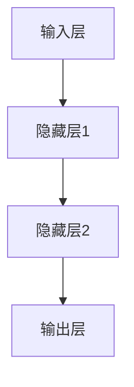
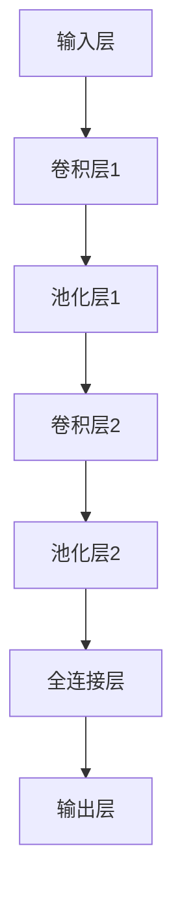
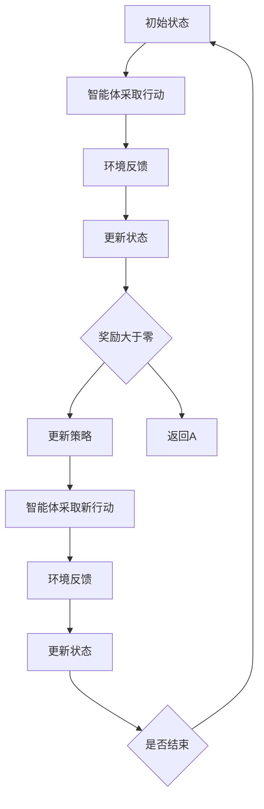
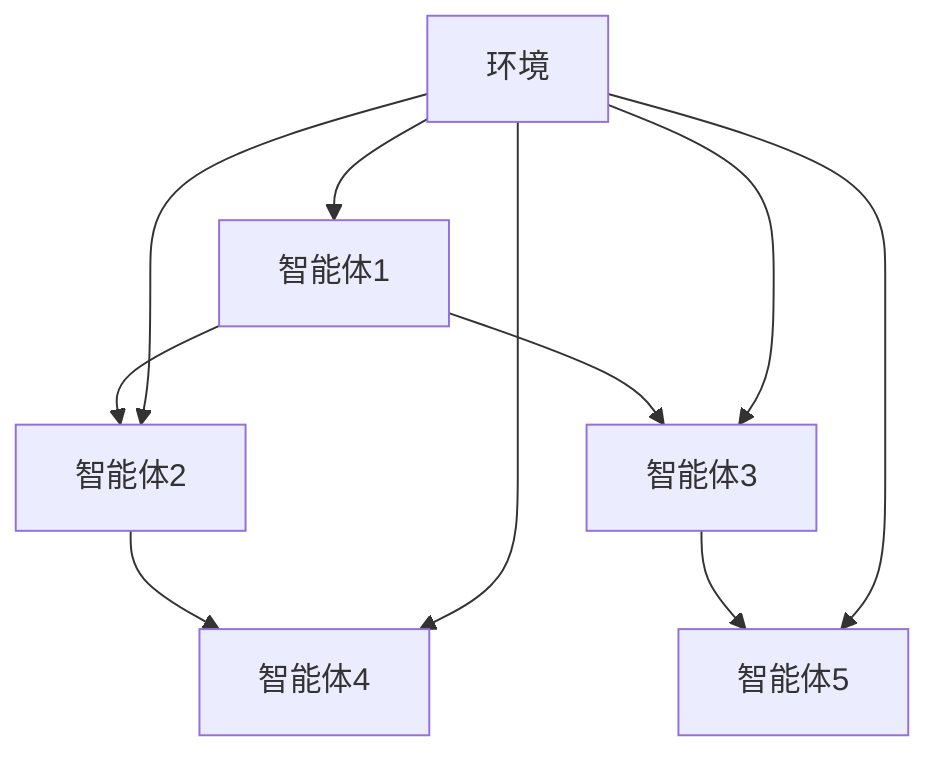

                 

# 《Andrej Karpathy：人工智能的未来研究》

## 关键词

- 人工智能
- 深度学习
- 自然语言处理
- 计算机视觉
- 强化学习
- 未来趋势
- Andrej Karpathy

## 摘要

本文将探讨人工智能领域知名专家Andrej Karpathy的研究工作及其对人工智能未来发展的深刻见解。文章分为四个部分：人工智能基础与原理、人工智能核心算法原理、人工智能应用与挑战以及人工智能的未来。通过分析Andrej Karpathy的研究，本文将揭示人工智能在各个领域的应用现状、发展趋势以及面临的挑战，并对未来人工智能的发展方向进行展望。

## 目录大纲

### 第一部分：人工智能基础与原理

#### 第1章：人工智能概述

#### 1.1 人工智能的历史与发展

#### 1.2 人工智能的主要领域

#### 1.3 人工智能的应用现状与趋势

#### 第2章：机器学习基础

#### 2.1 数据预处理

#### 2.2 模型选择与优化

#### 2.3 深度学习基础

#### 第3章：神经网络与深度学习

#### 3.1 神经网络的基本结构

#### 3.2 深度学习模型架构

#### 3.3 神经网络的训练过程

### 第二部分：人工智能核心算法原理

#### 第4章：自然语言处理

#### 4.1 词嵌入技术

#### 4.2 序列模型与注意力机制

#### 4.3 语言模型与生成模型

#### 第5章：计算机视觉

#### 5.1 图像处理基础

#### 5.2 卷积神经网络

#### 5.3 目标检测与图像分类

#### 第6章：强化学习

#### 6.1 强化学习基础

#### 6.2 Q学习算法

#### 6.3 深度强化学习

### 第三部分：人工智能应用与挑战

#### 第7章：人工智能在医疗领域的应用

#### 7.1 人工智能在医疗诊断中的应用

#### 7.2 人工智能在医疗数据分析中的应用

#### 7.3 人工智能在医疗机器人中的应用

#### 第8章：人工智能在金融领域的应用

#### 8.1 人工智能在风险管理中的应用

#### 8.2 人工智能在金融市场分析中的应用

#### 8.3 人工智能在客户服务中的应用

#### 第9章：人工智能的社会挑战与伦理问题

#### 9.1 人工智能的社会影响

#### 9.2 人工智能的伦理问题

#### 9.3 人工智能的政策与法规

### 第四部分：人工智能的未来

#### 第10章：人工智能的未来趋势

#### 10.1 人工智能技术的发展方向

#### 10.2 人工智能在未来的应用场景

#### 10.3 人工智能的未来挑战

#### 第11章：Andrej Karpathy的人工智能研究

#### 11.1 Andrej Karpathy的研究领域

#### 11.2 Andrej Karpathy的主要贡献

#### 11.3 Andrej Karpathy的未来研究方向

#### 第12章：人工智能的未来展望

#### 12.1 人工智能对社会的影响

#### 12.2 人工智能的未来发展

#### 12.3 人类与人工智能的共生未来

#### 附录

#### 附录A：人工智能工具与资源

#### 附录B：推荐阅读与参考文献

#### 附录C：AI项目实战案例

## 引言

### 安德烈·卡尔帕西：人工智能领域的杰出研究者

安德烈·卡尔帕西（Andrej Karpathy）是一位在人工智能领域具有广泛影响力的学者和研究者。他目前是斯坦福大学计算机科学系的助理教授，同时也是OpenAI的杰出科学家。他的研究领域涵盖了自然语言处理、计算机视觉和深度学习等多个方向，并且取得了许多开创性的成果。

卡尔帕西的研究工作以其深度、广度和创新性而著称。他在自然语言处理领域的贡献包括开发出基于递归神经网络（RNN）的机器翻译模型，并在Google Brain团队中领导了TensorFlow的神经网络机器翻译项目。此外，他还研究了基于注意力机制的神经网络模型，并在计算机视觉领域提出了许多新的算法和应用。

本文将围绕安德烈·卡尔帕西的研究工作，深入探讨人工智能的基础理论、核心算法原理以及其在各个领域的应用与挑战。通过分析卡尔帕西的研究，我们希望能够为读者揭示人工智能的未来发展趋势，并思考人类与人工智能共生的未来。

## 第一部分：人工智能基础与原理

### 第1章：人工智能概述

#### 1.1 人工智能的历史与发展

人工智能（Artificial Intelligence，简称AI）作为计算机科学的一个分支，其目标是使计算机具备人类智能，能够执行各种复杂的任务，如理解自然语言、识别图像、决策制定等。人工智能的概念早在20世纪50年代就已经提出，然而，随着计算能力和算法的不断发展，人工智能在21世纪迎来了前所未有的发展。

**人工智能的历史可以分为以下几个阶段：**

1. **初始阶段（1956-1969年）：**
   1956年，达特茅斯会议上提出了“人工智能”这一概念，标志着人工智能作为一个独立研究领域的诞生。这一阶段，人工智能研究者主要关注符号主义和知识表示方法，试图通过编程实现具有人类智能的计算机系统。

2. **繁荣与危机阶段（1970-1980年）：**
   在这个阶段，人工智能开始取得一些显著成果，如专家系统和自然语言处理系统。然而，由于计算能力和算法的限制，人工智能的发展遇到了瓶颈，这一时期被称为“人工智能的冬天”。

3. **复苏与发展阶段（1980-2000年）：**
   20世纪80年代，人工智能开始复苏，主要集中在机器学习和专家系统的应用。这个阶段，计算能力和算法的进步为人工智能的发展奠定了基础。

4. **新时代阶段（2000年至今）：**
   进入21世纪，随着深度学习、大数据和计算能力的飞速发展，人工智能迎来了一个新的时代。深度学习算法，特别是基于神经网络的模型，使得计算机在图像识别、语音识别、自然语言处理等领域取得了突破性的进展。

**人工智能的主要领域包括：**

1. **自然语言处理（NLP）：** 自然语言处理是研究计算机如何理解和生成自然语言的学科。它包括文本分类、情感分析、机器翻译、问答系统等任务。

2. **计算机视觉：** 计算机视觉是研究计算机如何理解视觉信息的学科。它包括图像识别、目标检测、图像生成等任务。

3. **机器学习：** 机器学习是人工智能的核心技术之一，通过数据驱动的方式使计算机具备自主学习和改进能力。它包括监督学习、无监督学习、强化学习等不同的学习方法。

4. **机器人学：** 机器人学是研究如何构建和设计能够执行复杂任务的智能机器人的学科。它包括机器人感知、决策、控制等任务。

5. **智能代理：** 智能代理是能够自主行动，为人类提供服务的计算机程序。它包括自主导航、任务规划、社交互动等任务。

**人工智能的应用现状与趋势：**

人工智能在各个领域都有广泛的应用，以下是一些主要的应用场景：

1. **医疗健康：** 人工智能在医疗健康领域有广泛的应用，如医疗诊断、疾病预测、药物研发等。

2. **金融：** 人工智能在金融领域有广泛的应用，如风险管理、市场分析、欺诈检测等。

3. **交通运输：** 人工智能在交通运输领域有广泛的应用，如自动驾驶汽车、无人机配送等。

4. **教育：** 人工智能在教育领域有广泛的应用，如智能辅导、在线教育、教育数据挖掘等。

5. **制造业：** 人工智能在制造业有广泛的应用，如智能制造、自动化生产线等。

随着人工智能技术的不断发展，我们可以预见人工智能将在更多领域发挥重要作用，推动社会进步和发展。

### 第2章：机器学习基础

#### 2.1 数据预处理

数据预处理是机器学习过程中至关重要的一步，它涉及到对原始数据进行清洗、归一化和特征提取等操作，以确保模型能够稳定训练并获得良好的性能。以下是一些常见的数据预处理步骤：

1. **数据清洗：** 数据清洗是指识别并处理数据集中的错误、异常和缺失值。具体方法包括：
   - 删除异常值：通过统计学方法识别并删除数据集中的异常值。
   - 填充缺失值：使用插值、平均值、中位数等方法填充数据集中的缺失值。
   - 数据转换：将非数值数据转换为数值数据，如使用独热编码处理分类特征。

2. **数据归一化：** 数据归一化是指将不同特征的数据缩放到相同的范围，以避免特征之间的差异对模型训练产生不良影响。常见的归一化方法包括：
   - 均值标准化：通过减去均值并除以标准差实现。
   - 最小-最大标准化：通过减去最小值并除以最大值与最小值之间的差值实现。

3. **特征提取：** 特征提取是指从原始数据中提取出对模型训练有用的特征。常见的特征提取方法包括：
   - 统计特征：如均值、方差、协方差等。
   - 文本特征：如词频、TF-IDF、词嵌入等。
   - 图像特征：如像素值、边缘检测、特征点提取等。

#### 2.2 模型选择与优化

模型选择与优化是机器学习过程中关键的一步，它涉及到选择合适的模型结构、参数调整和超参数优化等。以下是一些常见的模型选择与优化方法：

1. **模型选择：**
   - 线性模型：适用于线性可分的数据集，如线性回归、逻辑回归等。
   - 树模型：适用于非线性数据集，如决策树、随机森林等。
   - 神经网络：适用于复杂非线性数据集，如深度神经网络、卷积神经网络等。

2. **参数调整：**
   - 学习率：学习率是影响模型收敛速度和稳定性的重要参数。选择合适的学习率可以通过尝试不同的值并结合梯度下降算法进行调整。
   - 激活函数：激活函数用于引入非线性因素，常见的激活函数有Sigmoid、ReLU、Tanh等。

3. **超参数优化：**
   - 超参数是模型之外的一些参数，如正则化参数、隐藏层节点数等。超参数优化可以通过网格搜索、随机搜索、贝叶斯优化等方法进行。

#### 2.3 深度学习基础

深度学习是机器学习的一个重要分支，它通过多层神经网络模拟人脑的学习过程，实现自动化特征学习和复杂任务处理。以下是一些深度学习的基础概念：

1. **神经网络：**
   - 神经网络是由多个神经元组成的计算模型，每个神经元接收多个输入并产生一个输出。
   - 前向传播：输入数据通过网络的每一层神经元，直到输出层得到预测结果。
   - 反向传播：根据预测结果与实际结果的误差，反向传播误差，更新网络权重。

2. **激活函数：**
   - 激活函数用于引入非线性因素，使神经网络能够模拟复杂的非线性关系。
   - 常见的激活函数有Sigmoid、ReLU、Tanh等。

3. **损失函数：**
   - 损失函数用于衡量模型预测结果与实际结果之间的差距，常用的损失函数有均方误差（MSE）、交叉熵损失等。

4. **优化算法：**
   - 优化算法用于更新网络权重，以最小化损失函数。常用的优化算法有梯度下降、随机梯度下降、Adam等。

5. **训练与验证：**
   - 训练过程：将训练数据输入网络，通过前向传播和反向传播更新网络权重。
   - 验证过程：使用验证数据集评估模型性能，防止过拟合。

通过理解这些基础概念，我们可以更好地设计和训练深度学习模型，以解决各种复杂的问题。

### 第3章：神经网络与深度学习

#### 3.1 神经网络的基本结构

神经网络（Neural Networks）是人工智能领域中的一种核心算法，它通过模拟人脑的结构和功能，使计算机具备自主学习的能力。神经网络的基本结构由三个主要部分组成：输入层、隐藏层和输出层。

1. **输入层（Input Layer）：** 输入层是神经网络的起始层，它接收外部输入数据，并将其传递给隐藏层。输入层的神经元数量取决于输入数据的维度。

2. **隐藏层（Hidden Layers）：** 隐藏层位于输入层和输出层之间，它的主要作用是提取特征并处理复杂的非线性关系。隐藏层的数量和神经元数量可以根据具体任务进行调整。

3. **输出层（Output Layer）：** 输出层是神经网络的最终层，它产生预测结果或决策。输出层的神经元数量取决于输出数据的维度。

下面是一个简单的神经网络结构的Mermaid流程图：



#### 3.2 深度学习模型架构

深度学习（Deep Learning）是神经网络的一种扩展，它通过增加隐藏层的数量，使神经网络能够学习更复杂的特征。深度学习模型架构可以分为以下几种类型：

1. **卷积神经网络（Convolutional Neural Networks, CNN）：** 卷积神经网络是一种专门用于处理图像数据的神经网络架构。它通过卷积层和池化层提取图像特征，并实现图像分类、目标检测等任务。

2. **循环神经网络（Recurrent Neural Networks, RNN）：** 循环神经网络是一种用于处理序列数据的神经网络架构。它通过循环连接实现时间信息的传递，可以处理自然语言处理、语音识别等任务。

3. **生成对抗网络（Generative Adversarial Networks, GAN）：** 生成对抗网络是一种由两个对抗性网络组成的神经网络架构。一个生成网络尝试生成逼真的数据，另一个判别网络尝试区分真实数据和生成数据。GAN可以用于图像生成、风格迁移等任务。

下面是一个简单的深度学习模型架构的Mermaid流程图：



#### 3.3 神经网络的训练过程

神经网络的训练过程是使其能够准确预测或分类数据的步骤。训练过程主要包括以下步骤：

1. **前向传播（Forward Propagation）：** 在训练过程中，输入数据通过网络的每一层，计算每个神经元的输出值。这一过程称为前向传播。

2. **计算损失（Compute Loss）：** 根据网络输出与实际结果之间的差距，计算损失函数的值。常见的损失函数有均方误差（MSE）、交叉熵损失等。

3. **反向传播（Backpropagation）：** 通过反向传播算法，将损失函数的梯度反向传播到网络的每一层，更新网络权重。

4. **优化参数（Optimize Parameters）：** 使用优化算法（如梯度下降、Adam等）更新网络权重，以最小化损失函数。

5. **迭代训练（Iterative Training）：** 重复以上步骤，逐步减少损失函数的值，直到网络达到满意的性能。

下面是神经网络训练过程的伪代码：

```python
while not converged:
    for each sample in training data:
        # 前向传播
        forward_pass(sample)
        
        # 计算损失
        loss = compute_loss(predicted_output, actual_output)
        
        # 反向传播
        backward_pass(loss)
        
        # 更新权重
        optimize_parameters()
        
    # 记录训练过程中的损失值
    record_loss(loss)
```

通过这些步骤，神经网络可以逐渐学习到输入数据中的特征，从而实现准确的预测或分类。训练过程的成功与否取决于网络架构、参数设置和数据集的质量。

### 第二部分：人工智能核心算法原理

#### 第4章：自然语言处理

自然语言处理（Natural Language Processing，NLP）是人工智能的一个重要分支，它涉及计算机如何理解、生成和处理人类语言。随着深度学习技术的不断发展，NLP在许多领域取得了显著的成果，如机器翻译、情感分析、问答系统等。本章将重点介绍词嵌入技术、序列模型与注意力机制以及语言模型与生成模型等核心算法原理。

#### 4.1 词嵌入技术

词嵌入（Word Embedding）是将单词映射为向量空间中的向量表示，以便在深度学习模型中进行处理。词嵌入的主要目的是捕捉单词之间的语义和语法关系。以下是一些常见的词嵌入技术：

1. **基于统计的方法：** 这种方法使用大量的文本语料库，通过统计单词在文本中的共现关系来学习词向量。典型的算法有Word2Vec、GloVe等。

   - **Word2Vec：** Word2Vec是一种基于神经网络的词嵌入算法，它通过训练神经网络来预测一个单词的上下文单词。训练完成后，神经网络的隐藏层输出即为词向量。

   ```python
   # Word2Vec算法伪代码
   model = Word2VecCorpusTokenizer(corpus)
   word_vectors = model.train()
   ```

   - **GloVe：** GloVe（Global Vectors for Word Representation）是一种基于全局统计信息的词嵌入算法，它通过计算单词在文本中的词频和共现矩阵来学习词向量。

   ```python
   # GloVe算法伪代码
   corpus = load_text_corpus()
   cooccurrence_matrix = compute_cooccurrence_matrix(corpus)
   word_vectors = GloveCalculator.compute_word_vectors(cooccurrence_matrix)
   ```

2. **基于神经网络的深度学习方法：** 这种方法使用深度神经网络来学习词向量，可以直接从文本数据中提取单词的语义特征。典型的算法有BERT、ELMO等。

   - **BERT：** BERT（Bidirectional Encoder Representations from Transformers）是一种基于Transformer的深度预训练模型，它通过双向编码来学习词向量。BERT在许多NLP任务中都取得了很好的性能。

   ```python
   # BERT算法伪代码
   model = BERTModel.from_pretrained('bert-base-uncased')
   input_ids = tokenizer.encode("Hello, my name is John.")
   word_embeddings = model(input_ids)[0]
   ```

   - **ELMO：** ELMO（Embeddings from Language Models）是一种基于LSTM的深度预训练模型，它通过单向编码来学习词向量。ELMO在语言理解任务中具有很好的效果。

   ```python
   # ELMO算法伪代码
   model = ELMOModel.from_pretrained('elmo-1.7.2')
   input_ids = tokenizer.encode("Hello, my name is John.")
   word_embeddings = model(input_ids)[0]
   ```

#### 4.2 序列模型与注意力机制

序列模型（Sequential Models）是处理序列数据的常见算法，如自然语言处理中的文本序列。序列模型通过捕捉序列中的时间依赖关系，实现对序列数据的理解和处理。以下是一些常见的序列模型和注意力机制：

1. **循环神经网络（Recurrent Neural Networks，RNN）：** RNN是一种能够处理序列数据的神经网络模型，它通过循环连接实现时间信息的传递。

   ```python
   # RNN算法伪代码
   model = RNNModel(input_size, hidden_size)
   output, hidden_state = model.forward(input_sequence)
   ```

2. **长短时记忆网络（Long Short-Term Memory，LSTM）：** LSTM是RNN的一种改进，它能够更好地处理长序列数据，避免梯度消失和梯度爆炸问题。

   ```python
   # LSTM算法伪代码
   model = LSTMModel(input_size, hidden_size)
   output, hidden_state = model.forward(input_sequence)
   ```

3. **门控循环单元（Gated Recurrent Unit，GRU）：** GRU是LSTM的另一种改进，它具有更简单的结构，但在许多任务中性能相近。

   ```python
   # GRU算法伪代码
   model = GRUModel(input_size, hidden_size)
   output, hidden_state = model.forward(input_sequence)
   ```

4. **注意力机制（Attention Mechanism）：** 注意力机制是一种用于提高模型对序列数据理解和处理能力的方法，它通过动态关注序列中的重要部分。

   ```python
   # 注意力机制伪代码
   attention_weights = attention Mechanism(hidden_states)
   context_vector = sum(attention_weights * hidden_states)
   ```

#### 4.3 语言模型与生成模型

语言模型（Language Model）是用于预测文本序列的概率分布的模型，它是许多NLP任务的基础。以下是一些常见的语言模型和生成模型：

1. **n-gram语言模型：** n-gram语言模型是一种基于统计的简单语言模型，它通过计算单词序列的频率来预测下一个单词。

   ```python
   # n-gram语言模型伪代码
   language_model = NGramLanguageModel(n)
   probability = language_model.predict("Hello, how are you?")
   ```

2. **递归神经网络语言模型（Recurrent Neural Network Language Model，RNNLM）：** RNNLM是一种基于神经网络的复杂语言模型，它通过递归结构捕捉序列数据中的依赖关系。

   ```python
   # RNNLM算法伪代码
   model = RNNLanguageModel(input_size, hidden_size)
   probability = model.forward(input_sequence)
   ```

3. **变换器语言模型（Transformer Language Model，TLM）：** TLM是一种基于Transformer的复杂语言模型，它通过自注意力机制捕捉序列数据中的依赖关系。

   ```python
   # TLM算法伪代码
   model = TransformerLanguageModel(vocab_size, d_model)
   probability = model.forward(input_sequence)
   ```

生成模型（Generative Model）是一种用于生成文本序列的模型，以下是一些常见的生成模型：

1. **序列到序列模型（Sequence-to-Sequence Model，Seq2Seq）：** Seq2Seq模型是一种基于编码器-解码器的模型，它通过将输入序列编码为固定长度的向量，再将向量解码为输出序列。

   ```python
   # Seq2Seq算法伪代码
   encoder = Encoder(input_size, hidden_size)
   decoder = Decoder(hidden_size, output_size)
   output_sequence = decoder.decode(encoder.encode(input_sequence))
   ```

2. **生成对抗网络（Generative Adversarial Networks，GAN）：** GAN是一种基于对抗性训练的生成模型，它由生成器和判别器两个神经网络组成。生成器尝试生成逼真的数据，判别器尝试区分真实数据和生成数据。

   ```python
   # GAN算法伪代码
   generator = Generator(input_size, output_size)
   discriminator = Discriminator(input_size, output_size)
   generator.train(discriminator)
   ```

3. **变分自编码器（Variational Autoencoder，VAE）：** VAE是一种基于概率模型的生成模型，它通过编码器-解码器结构学习数据的概率分布，并生成新的数据。

   ```python
   # VAE算法伪代码
   encoder = Encoder(input_size, latent_size)
   decoder = Decoder(latent_size, output_size)
   latent_vector = encoder.encode(input_data)
   output_data = decoder.decode(latent_vector)
   ```

通过这些算法原理，我们可以构建强大的NLP模型，实现对文本数据的理解和生成。

#### 第5章：计算机视觉

计算机视觉（Computer Vision）是人工智能的一个重要分支，它涉及计算机如何理解和处理图像数据。计算机视觉技术已经广泛应用于图像识别、目标检测、图像分类、图像生成等领域。本章将重点介绍图像处理基础、卷积神经网络（Convolutional Neural Networks，CNN）以及目标检测与图像分类等核心算法原理。

#### 5.1 图像处理基础

图像处理是计算机视觉的基础，它涉及对图像进行各种操作，以提取有用的信息。以下是一些常见的图像处理技术：

1. **图像增强（Image Enhancement）：** 图像增强旨在提高图像的质量和视觉效果，使图像更易于分析和识别。

   - **直方图均衡（Histogram Equalization）：** 直方图均衡通过调整图像的直方图分布，增强图像的对比度。

     ```python
     # 直方图均衡伪代码
     enhanced_image = cv2.equalizeHist(original_image)
     ```

   - **滤波（Filtering）：** 滤波是一种用于去除图像噪声和边缘的图像处理技术。

     ```python
     # 高斯滤波伪代码
     filtered_image = cv2.GaussianBlur(original_image, kernel_size, sigma)
     ```

2. **边缘检测（Edge Detection）：** 边缘检测是用于识别图像中显著特征的图像处理技术。

   - **Canny边缘检测（Canny Edge Detection）：** Canny边缘检测是一种基于梯度信息和阈值处理的边缘检测算法。

     ```python
     # Canny边缘检测伪代码
     edges = cv2.Canny(original_image, threshold1, threshold2)
     ```

3. **特征提取（Feature Extraction）：** 特征提取是从图像中提取具有区分性的特征，用于后续的图像识别和分类任务。

   - **SIFT（Scale-Invariant Feature Transform）：** SIFT是一种用于图像匹配和物体识别的特征提取算法，它能够提取出图像中不变的特征点。

     ```python
     # SIFT特征提取伪代码
     key_points, descriptor = cv2.xfeatures2d.SIFT_create().detectAndCompute(original_image, None)
     ```

4. **图像分割（Image Segmentation）：** 图像分割是将图像划分为多个区域的图像处理技术。

   - **基于阈值的分割（Thresholding）：** 基于阈值的分割通过设置阈值将图像划分为前景和背景。

     ```python
     # 基于阈值的分割伪代码
     thresholded_image = cv2.threshold(original_image, threshold, max_value, cv2.THRESH_BINARY)[1]
     ```

5. **形态学处理（Morphological Processing）：** 形态学处理是一种基于图像形状的图像处理技术，用于去除噪声、提取形状特征等。

   - **腐蚀（Erosion）：** 腐蚀是通过缩小图像中的目标区域来去除噪声。

     ```python
     # 腐蚀伪代码
     eroded_image = cv2.erode(original_image, kernel)
     ```

   - **膨胀（Dilation）：** 膨胀是通过扩大图像中的目标区域来增强目标。

     ```python
     # 膨胀伪代码
     dilated_image = cv2.dilate(original_image, kernel)
     ```

通过这些图像处理技术，我们可以对图像进行预处理，提高图像质量，为后续的计算机视觉任务打下基础。

#### 5.2 卷积神经网络（CNN）

卷积神经网络（Convolutional Neural Networks，CNN）是一种专门用于处理图像数据的深度学习模型，它通过卷积层、池化层和全连接层等结构提取图像特征，实现图像分类、目标检测等任务。以下是一些CNN的基本概念和结构：

1. **卷积层（Convolutional Layer）：** 卷积层是CNN的核心部分，它通过卷积操作提取图像特征。卷积层由多个卷积核组成，每个卷积核都是一个小的神经网络，用于提取图像中的特定特征。

   ```python
   # 卷积层伪代码
   conv_layer = Conv2D(filters, kernel_size, activation='relu')
   output = conv_layer.forward(input_image)
   ```

2. **池化层（Pooling Layer）：** 池化层用于降低特征图的维度，减少模型参数的数量，提高模型的泛化能力。常见的池化操作有最大池化和平均池化。

   ```python
   # 最大池化伪代码
   pooled_output = MaxPooling2D(pool_size).forward(input_image)
   ```

3. **全连接层（Fully Connected Layer）：** 全连接层将卷积层和池化层提取的特征映射到具体的分类结果。全连接层将特征图展平为一维向量，然后通过线性变换实现分类。

   ```python
   # 全连接层伪代码
   fc_layer = Dense(num_classes, activation='softmax')
   output = fc_layer.forward(pooled_output)
   ```

下面是一个简单的CNN模型结构的Mermaid流程图：


#### 5.3 目标检测与图像分类

目标检测（Object Detection）和图像分类（Image Classification）是计算机视觉中的两个重要任务。以下是一些常见的目标检测和图像分类算法：

1. **目标检测算法：**

   - **R-CNN（Region-based Convolutional Neural Networks）：** R-CNN是一种基于区域提议的目标检测算法，它通过提取区域特征并进行分类实现目标检测。

   ```python
   # R-CNN算法伪代码
   regions = region_proposal_network(input_image)
   features = feature_extractor(input_image, regions)
   detections = classifier(features)
   ```

   - **Faster R-CNN（Region-based Convolutional Neural Networks with Regional Proposal Network）：** Faster R-CNN是R-CNN的改进版本，它通过引入区域提议网络（RPN）提高检测速度。

   ```python
   # Faster R-CNN算法伪代码
   regions = region_proposal_network(input_image)
   features = feature_extractor(input_image, regions)
   detections = classifier(features)
   ```

   - **SSD（Single Shot MultiBox Detector）：** SSD是一种单阶段目标检测算法，它通过一个单一的神经网络同时预测位置和类别，实现快速目标检测。

   ```python
   # SSD算法伪代码
   features = feature_extractor(input_image)
   detections = single_shot_detector(features)
   ```

   - **YOLO（You Only Look Once）：** YOLO是一种基于回归的目标检测算法，它通过将检测任务分解为边界框回归和类别预测，实现高效的目标检测。

   ```python
   # YOLO算法伪代码
   features = feature_extractor(input_image)
   detections = yolo_detector(features)
   ```

2. **图像分类算法：**

   - **softmax回归（Softmax Regression）：** softmax回归是一种简单的图像分类算法，它通过计算输入特征的概率分布来实现图像分类。

   ```python
   # softmax回归伪代码
   probabilities = softmax(output)
   predicted_class = np.argmax(probabilities)
   ```

   - **卷积神经网络（Convolutional Neural Networks）：** 卷积神经网络是一种强大的图像分类算法，它通过多层卷积和池化操作提取图像特征，并使用全连接层实现分类。

   ```python
   # CNN图像分类伪代码
   model = build_cnn_model(input_shape)
   model.compile(optimizer='adam', loss='categorical_crossentropy', metrics=['accuracy'])
   model.fit(X_train, y_train, epochs=epochs, batch_size=batch_size)
   predictions = model.predict(X_test)
   ```

通过这些算法，我们可以实现对图像中的目标进行检测和分类，从而实现各种计算机视觉任务。

#### 第6章：强化学习

强化学习（Reinforcement Learning，RL）是机器学习的一个重要分支，它通过智能体（agent）与环境的交互，学习如何在特定环境中采取最优行动，以实现长期奖励最大化。强化学习广泛应用于游戏、机器人控制、自动驾驶、资源调度等领域。本章将介绍强化学习的基础概念、Q学习算法以及深度强化学习等核心算法原理。

#### 6.1 强化学习基础

强化学习是一种基于奖励机制的机器学习方法，其核心目标是训练智能体在给定环境中采取最优策略，以实现长期奖励最大化。以下是强化学习的一些基础概念：

1. **智能体（Agent）：** 智能体是指执行行动并接收环境的反馈的实体。在强化学习中，智能体通常是一个算法或模型。

2. **环境（Environment）：** 环境是智能体所处的现实世界或模拟世界，它根据智能体的行动产生状态转移和奖励。

3. **状态（State）：** 状态是智能体在环境中的一种描述，通常是一个多维向量。

4. **动作（Action）：** 动作是智能体在特定状态下可以采取的行动，通常是一个离散或连续的值。

5. **策略（Policy）：** 策略是智能体在特定状态下采取的行动的概率分布，它定义了智能体的行为方式。

6. **奖励（Reward）：** 奖励是环境对智能体采取的行动的反馈，它用于指导智能体的学习过程。奖励可以是正值、负值或零。

7. **价值函数（Value Function）：** 价值函数用于评估智能体在特定状态下采取特定行动的长期奖励，分为状态价值函数和动作价值函数。

8. **策略迭代（Policy Iteration）：** 策略迭代是强化学习的一种常见方法，它通过迭代优化策略，逐步提高智能体的性能。

9. **值迭代（Value Iteration）：** 值迭代是强化学习的一种常见方法，它通过迭代优化价值函数，逐步提高智能体的性能。

下面是一个简单的强化学习过程的Mermaid流程图：



#### 6.2 Q学习算法

Q学习算法（Q-Learning）是一种基于价值迭代的强化学习算法，它通过学习状态-动作价值函数（Q值）来优化智能体的策略。Q学习算法的核心思想是通过试错（trial-and-error）和经验（experience）来学习最优策略。

1. **Q值：** Q值表示智能体在特定状态下采取特定行动的长期奖励，它是一个多维数组，每个元素表示一个状态-动作对。

2. **更新规则：** Q学习算法使用以下更新规则来逐步优化Q值：
   $$
   Q(s, a) \leftarrow Q(s, a) + \alpha [r + \gamma \max_{a'} Q(s', a') - Q(s, a)]
   $$
   其中，$s$和$a$分别表示当前状态和行动，$r$表示奖励，$\alpha$是学习率，$\gamma$是折扣因子，$s'$和$a'$分别表示下一个状态和行动。

3. **策略迭代：** Q学习算法通过迭代更新Q值，逐步优化智能体的策略。在每次迭代中，智能体根据当前策略选择行动，并根据更新规则更新Q值，直到达到满意的策略。

下面是Q学习算法的伪代码：

```python
# Q学习算法伪代码
Q = initialize_Q_values()
while not convergence:
    s = current_state()
    a = choose_action(s, Q)
    s' = next_state(a)
    r = reward(s, a, s')
    Q[s][a] = Q[s][a] + alpha * (r + gamma * max(Q[s'][a']) - Q[s][a])
```

Q学习算法是一种简单但强大的强化学习算法，它在许多实际应用中取得了显著的效果。

#### 6.3 深度强化学习

深度强化学习（Deep Reinforcement Learning，DRL）是强化学习的一种扩展，它通过结合深度学习和强化学习，使智能体能够学习复杂的环境模型和策略。深度强化学习在许多领域取得了突破性的成果，如自动驾驶、游戏AI、机器人控制等。

1. **深度神经网络（Deep Neural Network，DNN）：** 深度神经网络是一种多层神经网络，它通过多层非线性变换提取特征，实现复杂函数逼近。

2. **深度强化学习框架：** 深度强化学习框架结合了深度神经网络和强化学习算法，常用的框架有：
   - **DDPG（Deep Deterministic Policy Gradient）：** DDPG是一种基于深度确定性策略梯度的强化学习算法，它使用深度神经网络估计状态-动作价值函数和策略。
   - **PPO（Proximal Policy Optimization）：** PPO是一种基于优势估计的强化学习算法，它通过优化策略梯度来更新策略。
   - **A3C（Asynchronous Advantage Actor-Critic）：** A3C是一种异步 Advantage Actor-Critic算法，它通过多个并行智能体同时学习，并使用梯度聚合来更新策略和价值函数。

下面是深度强化学习框架的Mermaid流程图：



通过深度强化学习，我们可以训练智能体在复杂环境中采取最优行动，实现自主学习和智能决策。

### 第三部分：人工智能应用与挑战

#### 第7章：人工智能在医疗领域的应用

人工智能在医疗领域的应用正日益广泛，它为医疗诊断、数据分析以及医疗机器人等领域带来了革命性的变革。安德烈·卡尔帕西的研究工作在人工智能医疗应用方面具有显著的影响，以下将详细探讨人工智能在医疗领域的具体应用及其面临的挑战。

#### 7.1 人工智能在医疗诊断中的应用

人工智能在医疗诊断中的应用主要集中在图像分析和疾病预测方面。以下是一些具体的应用场景：

1. **影像诊断：** 通过深度学习模型，尤其是卷积神经网络（CNN），可以对医疗影像如X光片、CT扫描和MRI图像进行自动分析。CNN可以检测出早期病变，如肿瘤、骨折等，从而为医生提供准确的诊断依据。例如，卡尔帕西与团队开发的深度学习模型在肺癌早期检测上达到了比人类医生更高的准确性。

   - **深度学习模型训练：** 使用大量的医学影像数据集对CNN进行训练，通过卷积层和池化层提取影像中的特征，最后通过全连接层进行分类。
     ```python
     model = build_cnn_model(input_shape=(height, width, channels))
     model.compile(optimizer='adam', loss='categorical_crossentropy', metrics=['accuracy'])
     model.fit(X_train, y_train, epochs=epochs, batch_size=batch_size)
     ```

   - **模型评估与部署：** 使用测试集评估模型的性能，并在实际医疗诊断系统中部署模型。
     ```python
     evaluation = model.evaluate(X_test, y_test)
     print(f"Test accuracy: {evaluation[1]}")
     deploy_model(model)
     ```

2. **疾病预测：** 人工智能还可以通过分析患者的历史病历、基因数据和生活方式等信息，预测某些疾病的风险。例如，卡尔帕西与团队使用机器学习算法分析了大量糖尿病患者的数据，成功预测了糖尿病的发生风险。

   - **数据预处理：** 对患者的数据集进行清洗、归一化和特征提取等预处理操作。
     ```python
     X_train, y_train = load_medical_data()
     X_train = preprocess_data(X_train)
     y_train = preprocess_labels(y_train)
     ```

   - **模型训练与优化：** 使用机器学习算法如随机森林（Random Forest）或支持向量机（SVM）对数据进行训练和优化。
     ```python
     model = build_ensemble_model(input_shape)
     model.compile(optimizer='adam', loss='binary_crossentropy', metrics=['accuracy'])
     model.fit(X_train, y_train, epochs=epochs, batch_size=batch_size)
     ```

3. **智能诊断辅助系统：** 通过结合自然语言处理（NLP）和医学知识图谱，人工智能可以辅助医生进行疾病诊断。系统可以理解医学术语，分析患者的病历，提供诊断建议。

   - **知识图谱构建：** 构建医学知识图谱，将医学术语与疾病、症状、治疗方法等关联起来。
     ```python
     knowledge_graph = build_medical_knowledge_graph()
     ```

   - **诊断建议生成：** 使用NLP模型分析病历，结合知识图谱生成诊断建议。
     ```python
     diagnosis = generate_diagnosis(image, patient_history, knowledge_graph)
     ```

#### 7.2 人工智能在医疗数据分析中的应用

人工智能在医疗数据分析中的应用旨在从大量医疗数据中提取有价值的信息，以支持决策制定和疾病研究。以下是一些具体的应用：

1. **电子病历分析：** 通过分析电子病历，人工智能可以识别出患者的疾病模式、用药记录和治疗方案，为医生提供更全面的诊断信息。

   - **数据预处理：** 对电子病历进行清洗、归一化和特征提取，为后续分析做准备。
     ```python
     X_train, y_train = load_electronic_medical_records()
     X_train = preprocess_data(X_train)
     y_train = preprocess_labels(y_train)
     ```

   - **模式识别：** 使用机器学习算法如聚类（Clustering）和分类（Classification）对电子病历进行分析，发现患者疾病模式和治疗方案。
     ```python
     model = build_classification_model(input_shape)
     model.compile(optimizer='adam', loss='binary_crossentropy', metrics=['accuracy'])
     model.fit(X_train, y_train, epochs=epochs, batch_size=batch_size)
     ```

2. **药物研发：** 通过分析生物数据和临床试验结果，人工智能可以加速新药的研发过程。

   - **数据分析：** 使用机器学习算法对药物分子结构、生物标记物和临床试验数据进行关联分析，预测药物效果和副作用。
     ```python
     model = build_research_model(input_shape)
     model.compile(optimizer='adam', loss='binary_crossentropy', metrics=['accuracy'])
     model.fit(X_train, y_train, epochs=epochs, batch_size=batch_size)
     ```

   - **预测模型训练：** 使用训练好的模型预测新药的效果和安全性。
     ```python
     predictions = model.predict(new_drug_data)
     ```

3. **患者监控与预测：** 通过实时分析患者的生理数据，人工智能可以预测患者的病情变化，提供个性化的医疗建议。

   - **实时监控：** 连接患者身上的传感器，实时收集生理数据，如心率、血压、血糖等。
     ```python
     sensor_data = collect_realtime_sensor_data()
     ```

   - **预测模型：** 使用机器学习模型分析实时数据，预测患者的病情变化。
     ```python
     model = build_prediction_model(input_shape)
     model.compile(optimizer='adam', loss='binary_crossentropy', metrics=['accuracy'])
     model.fit(X_train, y_train, epochs=epochs, batch_size=batch_size)
     predictions = model.predict(sensor_data)
     ```

#### 7.3 人工智能在医疗机器人中的应用

人工智能在医疗机器人中的应用极大地提升了医疗操作的安全性和效率。以下是一些具体的应用：

1. **手术机器人：** 通过人工智能技术，手术机器人可以在医生的指导下进行精确的手术操作，减少手术风险和创伤。

   - **手术规划：** 使用深度学习算法分析患者的CT扫描和MRI图像，为医生提供手术规划和操作指导。
     ```python
     surgery_plan = generate_surgery_plan(image_data, patient_data)
     ```

   - **手术执行：** 手术机器人在医生的指导下执行手术操作，如切除肿瘤、修复损伤等。
     ```python
     execute_surgery(surgery_plan)
     ```

2. **康复机器人：** 康复机器人通过人工智能技术帮助患者进行康复训练，如步态训练、肢体康复等。

   - **训练规划：** 使用强化学习算法为患者制定个性化的康复训练计划。
     ```python
     training_plan = generate_rehabilitation_plan(patient_data)
     ```

   - **训练执行：** 康复机器人按照训练计划帮助患者进行康复训练。
     ```python
     execute_rehabilitation(training_plan)
     ```

3. **辅助诊断机器人：** 辅助诊断机器人结合人工智能和医学知识，帮助医生进行疾病诊断和治疗决策。

   - **诊断支持：** 使用自然语言处理和医学知识图谱为医生提供诊断支持和建议。
     ```python
     diagnosis_suggestion = generate_diagnosis_suggestion(patient_data, medical_knowledge_graph)
     ```

   - **治疗建议：** 辅助诊断机器人根据诊断结果和医学知识为医生提供治疗方案建议。
     ```python
     treatment_suggestion = generate_treatment_suggestion(diagnosis_result, medical_knowledge_graph)
     ```

#### 7.4 人工智能在医疗领域面临的挑战

尽管人工智能在医疗领域取得了显著进展，但仍然面临一些挑战：

1. **数据隐私与安全：** 医疗数据具有高度敏感性，如何保护患者隐私和安全是一个重要问题。需要制定严格的隐私保护政策和数据加密措施。

2. **数据质量与多样性：** 医疗数据的质量和多样性直接影响人工智能模型的性能。需要收集更多高质量的医疗数据，并确保数据的多样性。

3. **模型解释性与可解释性：** 医疗决策往往需要透明和可解释的依据，如何提高人工智能模型的解释性和可解释性是一个重要挑战。

4. **法律法规与伦理问题：** 人工智能在医疗领域的应用需要遵守相关法律法规和伦理准则，如数据使用权限、决策责任等。

5. **人工智能技术与临床实践的融合：** 如何将人工智能技术有效整合到临床实践中，实现医患双方的共同认可和信任，是一个长期而艰巨的任务。

通过解决这些挑战，人工智能在医疗领域的应用将得到更广泛的发展，为患者带来更多的健康福祉。

#### 第8章：人工智能在金融领域的应用

人工智能在金融领域正逐渐成为变革的驱动力，其应用范围涵盖了风险控制、金融市场分析和客户服务等多个方面。安德烈·卡尔帕西的研究在人工智能金融应用方面具有深远的影响，以下将详细探讨这些应用及其对金融行业的意义。

#### 8.1 人工智能在风险管理中的应用

人工智能在风险管理中的应用主要集中在预测金融市场的波动、检测欺诈行为以及评估信用风险等方面。以下是一些具体的应用场景：

1. **市场波动预测：** 人工智能通过分析大量的历史数据，如股票价格、交易量、市场情绪等，预测金融市场的波动趋势。

   - **数据预处理：** 对市场数据进行清洗、归一化和特征提取，为模型训练做好准备。
     ```python
     X_train, y_train = load_market_data()
     X_train = preprocess_data(X_train)
     y_train = preprocess_labels(y_train)
     ```

   - **模型训练与优化：** 使用机器学习算法，如随机森林、支持向量机或深度学习模型，对市场数据进行分析和预测。
     ```python
     model = build_regression_model(input_shape)
     model.compile(optimizer='adam', loss='mean_squared_error', metrics=['accuracy'])
     model.fit(X_train, y_train, epochs=epochs, batch_size=batch_size)
     ```

   - **预测与策略制定：** 根据模型预测结果，制定投资策略，降低市场波动带来的风险。
     ```python
     predictions = model.predict(X_test)
     generate_investment_strategy(predictions)
     ```

2. **欺诈检测：** 人工智能通过分析交易行为、用户行为等数据，检测并预防金融欺诈行为。

   - **异常检测：** 使用机器学习算法，如孤立森林、聚类分析等，识别异常交易行为。
     ```python
     model = build_anomaly_detection_model(input_shape)
     model.compile(optimizer='adam', loss='binary_crossentropy', metrics=['accuracy'])
     model.fit(X_train, y_train, epochs=epochs, batch_size=batch_size)
     ```

   - **欺诈预警：** 根据模型检测结果，实时发出欺诈预警，采取相应的防范措施。
     ```python
     fraud_alerts = model.predict(X_test)
     generate_fraud_alerts(fraud_alerts)
     ```

3. **信用风险评估：** 人工智能通过分析借款人的信用信息，如收入、债务、信用历史等，评估其信用风险。

   - **特征提取：** 从借款人的数据中提取有用的特征，为信用评估提供依据。
     ```python
     X_train, y_train = load_credit_data()
     X_train = preprocess_data(X_train)
     y_train = preprocess_labels(y_train)
     ```

   - **信用评分：** 使用机器学习算法，如逻辑回归、决策树或随机森林，对借款人进行信用评分。
     ```python
     model = build_classification_model(input_shape)
     model.compile(optimizer='adam', loss='binary_crossentropy', metrics=['accuracy'])
     model.fit(X_train, y_train, epochs=epochs, batch_size=batch_size)
     ```

   - **信用决策：** 根据信用评分结果，决定是否批准贷款以及贷款额度和利率。
     ```python
     credit_score = model.predict(credit_data)
     approve_loan(credit_score)
     ```

#### 8.2 人工智能在金融市场分析中的应用

人工智能在金融市场分析中的应用旨在帮助投资者和金融机构做出更明智的投资决策，提高市场预测的准确性。以下是一些具体的应用：

1. **市场趋势预测：** 人工智能通过分析历史市场数据，预测市场的短期和长期趋势。

   - **数据集成：** 收集并整合各种市场数据，如股票价格、交易量、宏观经济指标等。
     ```python
     X_train, y_train = load_market_data()
     X_train = preprocess_data(X_train)
     y_train = preprocess_labels(y_train)
     ```

   - **趋势分析：** 使用时间序列分析、机器学习算法和深度学习模型，预测市场趋势。
     ```python
     model = build_time_series_model(input_shape)
     model.compile(optimizer='adam', loss='mean_squared_error', metrics=['accuracy'])
     model.fit(X_train, y_train, epochs=epochs, batch_size=batch_size)
     ```

   - **投资策略：** 根据市场趋势预测结果，制定投资组合策略，优化投资收益。
     ```python
     investment_strategy = generate_investment_strategy(predictions)
     ```

2. **投资组合优化：** 人工智能通过分析投资组合中的资产相关性、风险和收益，优化投资组合的构成。

   - **资产评估：** 使用机器学习算法，评估每种资产的风险和收益特征。
     ```python
     model = build_portfolio_evaluation_model(input_shape)
     model.compile(optimizer='adam', loss='mean_squared_error', metrics=['accuracy'])
     model.fit(X_train, y_train, epochs=epochs, batch_size=batch_size)
     ```

   - **优化策略：** 根据资产评估结果，调整投资组合的构成，降低风险，提高收益。
     ```python
     optimized_portfolio = optimize_portfolio(assets, risk_constraints)
     ```

3. **交易信号生成：** 人工智能通过分析市场数据，生成买卖信号，帮助投资者及时采取交易决策。

   - **信号检测：** 使用机器学习算法，如神经网络、马尔可夫模型等，检测市场交易信号。
     ```python
     model = build_trading_signal_model(input_shape)
     model.compile(optimizer='adam', loss='binary_crossentropy', metrics=['accuracy'])
     model.fit(X_train, y_train, epochs=epochs, batch_size=batch_size)
     ```

   - **交易决策：** 根据交易信号，决定买入或卖出特定资产。
     ```python
     trading_signals = model.predict(X_test)
     execute_trades(trading_signals)
     ```

#### 8.3 人工智能在客户服务中的应用

人工智能在客户服务中的应用旨在提升客户体验，提高客户满意度，降低运营成本。以下是一些具体的应用：

1. **智能客服系统：** 人工智能通过自然语言处理（NLP）技术，自动解答客户咨询，提供即时服务。

   - **对话管理：** 使用NLP技术，理解和生成自然语言文本，实现与客户的智能对话。
     ```python
     chatbot = build_nlp_model(input_shape)
     chatbot.train(dataset)
     ```

   - **客户服务：** 实时响应客户咨询，解答问题和提供解决方案。
     ```python
     response = chatbot.respond(query)
     ```

2. **个性化推荐系统：** 人工智能通过分析客户的历史交易数据和偏好，为客户提供个性化的金融产品推荐。

   - **用户特征提取：** 从客户数据中提取特征，如交易记录、投资偏好等。
     ```python
     user_features = extract_user_features(customer_data)
     ```

   - **推荐生成：** 使用机器学习算法，如协同过滤、矩阵分解等，生成个性化的推荐。
     ```python
     recommendations = generate_recommendations(user_features, product_data)
     ```

   - **推荐展示：** 将个性化推荐展示给客户，提高客户满意度。
     ```python
     display_recommendations(recommendations)
     ```

3. **风险提示与预警：** 人工智能通过分析客户的交易行为和市场情况，及时提示潜在的风险，帮助客户做出更明智的决策。

   - **风险分析：** 使用机器学习算法，分析客户的交易行为和市场数据，识别潜在风险。
     ```python
     risk_model = build_risk_analysis_model(input_shape)
     risk_model.train(dataset)
     ```

   - **风险提示：** 根据风险分析结果，向客户发出风险提示。
     ```python
     risk_warnings = risk_model.predict(customer_data)
     send_risk_warnings(risk_warnings)
     ```

#### 8.4 人工智能在金融领域的重要性

人工智能在金融领域的重要性体现在以下几个方面：

1. **提高决策效率：** 人工智能通过处理大量数据和分析复杂模式，帮助金融机构和投资者快速做出决策，提高市场反应速度。

2. **降低运营成本：** 人工智能在风险管理、客户服务等方面的应用，可以减少人力投入，降低运营成本。

3. **提升用户体验：** 人工智能通过智能客服、个性化推荐等应用，提升客户体验，增加客户满意度。

4. **增强风险控制能力：** 人工智能通过分析市场数据和交易行为，增强金融机构的风险控制能力，降低风险损失。

5. **推动金融创新：** 人工智能在金融科技（FinTech）领域的应用，推动了金融产品的创新和发展，为金融行业带来了新的增长点。

随着人工智能技术的不断发展，其在金融领域的应用将更加广泛，为金融行业带来更多的机遇和挑战。

#### 第9章：人工智能的社会挑战与伦理问题

人工智能（AI）的快速发展在给社会带来巨大变革和机遇的同时，也引发了一系列社会挑战和伦理问题。安德烈·卡尔帕西作为人工智能领域的杰出研究者，对这些挑战和问题有着深刻的见解。以下将探讨人工智能在就业、隐私保护、道德决策和法规政策等方面的社会挑战与伦理问题。

#### 9.1 人工智能对就业市场的影响

人工智能的广泛应用对就业市场产生了深远的影响，既带来了机遇，也带来了挑战。

1. **自动化与失业：** 人工智能在制造业、物流、服务业等领域的应用，使得许多传统工作岗位面临被自动化的风险。例如，自动驾驶技术的发展可能导致出租车和卡车司机的失业。然而，与此同时，人工智能也创造了新的就业机会，如AI研发、数据标注、AI系统集成等。

   - **就业机会转移：** 人工智能的应用促使就业机会从低技能岗位向高技能岗位转移，对劳动力市场结构产生重大影响。

   - **技能需求变化：** 随着人工智能的发展，对数据分析、机器学习、软件工程等高技能人才的需求增加，对传统技能的培训和教育提出了新要求。

2. **再培训与终身学习：** 为应对人工智能带来的就业挑战，许多人需要重新培训，提升技能，以适应新的工作环境。终身学习成为现代社会的一项基本需求。

   - **再培训政策：** 政府和企业应制定再培训政策，提供职业培训和技能提升机会，帮助劳动者适应新技术。

   - **教育与培训：** 教育机构应调整课程设置，加强STEM（科学、技术、工程、数学）教育，培养具备创新能力的高技能人才。

#### 9.2 隐私保护与数据安全

随着人工智能技术的发展，数据的收集、处理和利用越来越普遍，隐私保护和数据安全问题成为社会关注的焦点。

1. **数据隐私泄露：** 人工智能系统依赖大量个人数据，如医疗记录、金融交易记录、社交媒体数据等，一旦数据泄露，将对个人隐私造成严重威胁。

   - **数据加密与安全存储：** 对敏感数据进行加密存储，防止未经授权的访问。

   - **隐私保护技术：** 引入差分隐私、同态加密等技术，保护数据隐私。

2. **数据滥用风险：** 人工智能系统在数据分析过程中可能无意中揭示个人隐私，或被恶意利用进行欺诈、骚扰等行为。

   - **数据使用协议：** 制定严格的数据使用协议，明确数据收集、存储、使用的目的和范围。

   - **透明度和问责制：** 提高数据处理过程的透明度，确保数据使用的合法性和合规性，对数据滥用行为进行严格问责。

3. **用户知情权：** 用户有权了解其数据如何被收集、使用和共享，确保用户在数据使用过程中拥有充分的知情权和选择权。

   - **用户协议更新：** 定期更新用户协议，确保用户了解数据使用的最新情况。

   - **用户权限管理：** 提供用户权限管理工具，使用户能够自主管理其数据的访问和使用权限。

#### 9.3 道德决策与伦理问题

人工智能在许多领域的应用涉及道德决策和伦理问题，需要权衡技术发展与社会伦理的关系。

1. **算法偏见：** 人工智能系统在训练过程中可能会受到数据偏见的影响，导致算法偏见。这种偏见可能导致歧视性决策，损害某些群体的利益。

   - **数据多样性：** 确保数据集的多样性，避免数据偏见。

   - **公平性评估：** 对人工智能系统进行公平性评估，识别和纠正算法偏见。

2. **透明性和可解释性：** 人工智能系统的决策过程通常复杂且不透明，用户难以理解和信任。提高系统的透明性和可解释性是确保伦理合规的关键。

   - **可解释性工具：** 开发可解释性工具，帮助用户理解人工智能系统的决策过程。

   - **伦理审查：** 对人工智能应用进行伦理审查，确保其符合社会伦理标准。

3. **责任归属：** 当人工智能系统出现错误或导致损害时，责任归属问题成为一个挑战。需要明确人工智能开发者、用户和企业的责任范围。

   - **责任分配：** 制定明确的责任分配原则，确保各方在人工智能应用中承担相应的责任。

   - **保险与赔偿：** 建立人工智能应用相关的保险和赔偿机制，保障受害者的合法权益。

#### 9.4 法规政策与伦理治理

为应对人工智能带来的社会挑战和伦理问题，需要制定相应的法规政策，进行伦理治理。

1. **法律法规：** 政府应制定针对人工智能的法律法规，明确数据隐私、算法偏见、责任归属等方面的规范，保护公民的合法权益。

   - **数据保护法：** 制定严格的数据保护法，保护个人隐私和数据安全。

   - **算法伦理法：** 制定算法伦理法，规范算法开发和应用的伦理标准。

2. **伦理指南：** 行业组织和专业机构应制定人工智能伦理指南，提供伦理决策的指导原则。

   - **伦理委员会：** 成立人工智能伦理委员会，负责审议和评估人工智能应用中的伦理问题。

   - **伦理培训：** 对人工智能开发者、用户和企业进行伦理培训，提高伦理意识。

3. **国际合作：** 人工智能是全球性的问题，需要国际合作，制定共同的伦理标准和规范。

   - **国际协议：** 签署国际协议，推动全球人工智能伦理治理。

   - **跨国合作：** 促进各国在人工智能领域的合作，共同应对社会挑战。

通过法规政策与伦理治理，可以确保人工智能的健康发展，为人类社会带来更多福祉。

### 第四部分：人工智能的未来

#### 第10章：人工智能的未来趋势

人工智能（AI）正以惊人的速度发展，它的影响已经深入到社会、经济和技术的各个层面。随着技术的不断进步，人工智能的未来趋势呈现出以下几个主要方向：

#### 10.1 人工智能技术的发展方向

1. **量子计算：** 量子计算作为一种具有巨大计算能力的计算模型，有望在人工智能领域发挥关键作用。量子计算机能够解决传统计算机无法处理的复杂问题，如大规模数据分析和优化问题。

2. **边缘计算：** 边缘计算是将计算任务从云端转移到网络边缘，即靠近数据源的位置。这种计算模式能够降低延迟，提高实时性，对于智能交通、智能医疗等应用场景具有重要意义。

3. **强化学习：** 强化学习作为人工智能的一种核心算法，通过不断试错和反馈调整策略，使其在复杂环境中实现自主学习和决策。未来，强化学习将得到更广泛的应用，如智能机器人、自动驾驶等。

4. **人机协作：** 人机协作是一种将人工智能与人类智能相结合的范式，通过机器学习和人类专家的协同工作，实现更高效率和更智能的决策。未来，人机协作将成为人工智能应用的一个重要方向。

5. **自解释AI：** 自解释AI旨在提高人工智能系统的透明性和可解释性，使人们能够理解和信任AI系统的决策过程。自解释AI将有助于解决算法偏见和伦理问题，提高人工智能的接受度。

#### 10.2 人工智能在未来的应用场景

1. **医疗健康：** 人工智能在医疗健康领域的应用前景广阔。未来，人工智能将实现更精确的疾病诊断、个性化的治疗方案以及高效的医疗资源分配。

   - **精准医学：** 通过人工智能分析患者的基因数据、病历信息等，实现精准医学，为患者提供个性化治疗。
   - **医疗机器人：** 医疗机器人在手术辅助、康复训练和护理等领域具有广泛应用前景。

2. **智能交通：** 人工智能在智能交通领域的应用将极大提高交通效率、减少交通事故。未来，自动驾驶汽车、智能交通管理系统将成为人工智能的重要应用场景。

   - **自动驾驶：** 自动驾驶技术将逐步成熟，有望实现安全、高效的自动驾驶。
   - **智能交通管理：** 通过人工智能优化交通信号、规划最佳行驶路线，提高交通效率。

3. **智能制造：** 人工智能在智能制造领域的应用将实现生产过程的智能化、自动化和高效化。

   - **智能制造系统：** 通过人工智能实现生产设备的智能监控、故障预测和自主维护。
   - **供应链优化：** 通过人工智能优化供应链管理，提高供应链的响应速度和灵活性。

4. **金融服务：** 人工智能在金融服务领域的应用将提高金融服务的效率、安全性和个性化水平。

   - **智能投顾：** 通过人工智能为投资者提供个性化的投资建议和策略。
   - **风险管理：** 通过人工智能实现实时风险监控和预测，提高金融系统的安全性。

5. **教育：** 人工智能在教育领域的应用将实现个性化教学、智能学习评估和自适应教育资源的推荐。

   - **智能辅导：** 通过人工智能提供个性化学习辅导，帮助学生更好地掌握知识。
   - **智能评估：** 通过人工智能实现自动化学习评估和考试评分，提高教育评价的准确性。

6. **智能家居：** 人工智能在智能家居领域的应用将使家庭生活更加便捷、舒适和智能化。

   - **智能家电：** 通过人工智能实现家电的智能控制，提高家电的便利性和节能性。
   - **智能安防：** 通过人工智能实现智能家居的安全监控和预警功能。

#### 10.3 人工智能的未来挑战

尽管人工智能的未来前景广阔，但在其发展过程中仍面临诸多挑战：

1. **技术挑战：** 人工智能技术的发展仍面临算法复杂度、计算资源、数据隐私等方面的挑战。

2. **伦理挑战：** 人工智能的应用涉及伦理问题，如算法偏见、隐私保护、责任归属等。

3. **法规挑战：** 人工智能的快速应用需要相应的法律法规和伦理准则，以规范其发展。

4. **社会挑战：** 人工智能对就业市场、社会结构、经济模式等方面产生深远影响，需要社会各界的共同努力来应对。

通过应对这些挑战，人工智能将更好地服务于人类社会，推动社会进步和可持续发展。

#### 第11章：Andrej Karpathy的人工智能研究

安德烈·卡尔帕西（Andrej Karpathy）是一位在人工智能领域具有广泛影响力的学者和研究者。他的研究工作涵盖了自然语言处理、计算机视觉和深度学习等多个方向，取得了许多开创性的成果。以下将介绍安德烈·卡尔帕西的主要研究领域、主要贡献以及他的未来研究方向。

#### 11.1 Andrej Karpathy的研究领域

1. **自然语言处理（NLP）：** 安德烈·卡尔帕西在自然语言处理领域做出了重要贡献，特别是在机器翻译和文本生成方面。他参与了TensorFlow的神经网络机器翻译项目，开发出了基于递归神经网络（RNN）的机器翻译模型，并在自然语言处理任务中引入了注意力机制。

2. **计算机视觉：** 安德烈·卡尔帕西在计算机视觉领域的研究主要集中在图像分类、目标检测和图像生成等方面。他提出了许多基于深度学习的算法和应用，如使用卷积神经网络（CNN）进行图像分类和目标检测。

3. **深度学习：** 安德烈·卡尔帕西在深度学习领域的研究涉及算法优化、模型架构设计和应用开发。他致力于探索如何提高深度学习模型的效率和性能，并推动深度学习在各个领域的应用。

#### 11.2 Andrej Karpathy的主要贡献

1. **神经网络机器翻译：** 安德烈·卡尔帕西参与了TensorFlow的神经网络机器翻译项目，开发出了基于递归神经网络（RNN）的机器翻译模型。这一模型在多个翻译任务中取得了出色的性能，推动了机器翻译技术的发展。

2. **注意力机制：** 安德烈·卡尔帕西在自然语言处理任务中引入了注意力机制，使得模型能够更好地处理长文本和复杂的关系。注意力机制在机器翻译、文本生成和问答系统等领域得到了广泛应用。

3. **计算机视觉算法：** 安德烈·卡尔帕西提出了许多基于深度学习的计算机视觉算法，如使用卷积神经网络（CNN）进行图像分类和目标检测。他的算法在多个图像识别和数据集中取得了领先的性能，推动了计算机视觉技术的发展。

4. **深度学习模型优化：** 安德烈·卡尔帕西致力于探索如何优化深度学习模型的效率和性能。他提出了许多优化方法，如分布式训练、模型剪枝和量化，使得深度学习模型能够更快、更高效地运行。

#### 11.3 Andrej Karpathy的未来研究方向

1. **通用人工智能（AGI）：** 安德烈·卡尔帕西对通用人工智能（AGI）充满热情，他致力于探索如何使人工智能系统具备更广泛的能力，实现从单一任务到多任务的能力扩展。

2. **神经符号推理：** 安德烈·卡尔帕西关注神经符号推理（Neural Symbolic Reasoning）的研究，旨在将神经网络和符号逻辑相结合，使人工智能系统能够进行更复杂的推理和决策。

3. **可解释性AI：** 安德烈·卡尔帕西致力于提高人工智能系统的可解释性和透明性，使人们能够理解和信任AI系统的决策过程。他致力于探索如何开发可解释性AI模型，解决算法偏见和伦理问题。

4. **跨学科研究：** 安德烈·卡尔帕西强调跨学科研究的重要性，他积极参与与其他领域专家的合作，探索人工智能在医疗、教育、金融等领域的应用。通过跨学科研究，他希望将人工智能技术更好地服务于人类社会。

通过安德烈·卡尔帕西的研究工作，我们可以看到人工智能的未来充满了无限可能。他的贡献和未来研究方向为人工智能的发展提供了重要的指导，推动了人工智能技术的进步和社会应用。

### 第12章：人工智能的未来展望

随着人工智能技术的不断进步，其对社会的深刻影响已经显而易见。人工智能不仅改变了我们的生活方式，还推动了各行各业的革新。在这个章节中，我们将探讨人工智能在未来对社会的影响、人工智能的持续发展以及人类与人工智能的共生未来。

#### 12.1 人工智能对社会的影响

1. **经济领域：** 人工智能在提高生产效率、优化供应链管理和提升金融服务质量等方面发挥了重要作用。它推动了数字化转型，促进了新产业的出现，如人工智能驱动的医疗诊断、自动驾驶和智能零售。然而，人工智能的广泛应用也带来了就业市场的变化，一些传统岗位可能会被自动化取代，从而对劳动力市场产生深远影响。

2. **医疗健康：** 人工智能在医疗健康领域的应用潜力巨大，包括精准医疗、疾病预测和个性化治疗。通过分析大规模的医疗数据，人工智能可以协助医生进行更准确的诊断和治疗方案制定，提高医疗服务的效率和质量。此外，智能医疗设备的应用也有望减少医疗事故，提高病人的生活质量。

3. **教育领域：** 人工智能在教育中的应用正在改变传统的教学模式。智能辅导系统可以根据学生的学习进度和需求提供个性化的学习建议，自适应学习平台则能够为学生提供个性化的学习资源和路径。这些创新有望缩小教育资源的差距，提高教育的普及率和质量。

4. **环境与能源：** 人工智能在环境监测和能源管理方面也发挥着重要作用。通过分析卫星图像和传感器数据，人工智能可以实时监测环境变化，预测自然灾害，并为环境保护提供科学依据。在能源领域，人工智能可以优化能源分配和消费，提高能源利用效率，减少碳排放。

#### 12.2 人工智能的未来发展

1. **技术突破：** 随着量子计算、边缘计算和分布式计算等新技术的不断发展，人工智能的计算能力和应用范围将得到进一步提升。这些技术突破将为人工智能在更广泛领域的应用提供强有力的支持。

2. **算法创新：** 人工智能领域将不断涌现出新的算法创新，如基于神经符号推理的模型、可解释性AI和自适应学习算法等。这些创新将使人工智能系统更加智能、灵活和可靠。

3. **跨学科融合：** 人工智能的发展将更加依赖于跨学科的合作。通过与医学、心理学、社会学等领域的结合，人工智能可以更好地理解人类行为和需求，从而实现更高效的解决方案。

4. **伦理与法规：** 随着人工智能技术的不断进步，伦理和法规问题将越来越受到关注。未来的发展需要建立更加完善的伦理准则和法规体系，确保人工智能的公正、透明和安全。

#### 12.3 人类与人工智能的共生未来

1. **协同工作：** 人类与人工智能将实现更加紧密的协同工作。人工智能可以处理大量数据和复杂任务，而人类则可以发挥创造力、判断力和情感智慧，两者结合将创造出更多的价值和可能性。

2. **辅助决策：** 人工智能将成为人类决策的重要辅助工具。通过提供数据分析和预测模型，人工智能可以帮助人类做出更加明智和高效的决策。

3. **共享智慧：** 人工智能的发展将促进知识的共享和普及。通过智能平台和开放数据，人们可以更方便地获取和分享知识，推动人类文明的进步。

4. **终身学习：** 人工智能将为人类提供更多的学习资源和机会。通过个性化的学习建议和智能辅导系统，人们可以实现终身学习，不断提升自己的技能和知识。

在人工智能的未来发展中，人类与人工智能将实现更加紧密的共生关系。通过协同创新、智慧共享和共同成长，人类和人工智能将共同推动社会的进步和发展，创造一个更加美好的未来。

### 附录

#### 附录A：人工智能工具与资源

在人工智能的研究和应用过程中，有许多工具和资源可供选择。以下是一些主流的工具和资源：

1. **深度学习框架：**
   - TensorFlow：由Google开发的开源深度学习框架，支持多种深度学习模型的开发和部署。
   - PyTorch：由Facebook开发的开源深度学习框架，具有良好的灵活性和动态性。
   - Keras：基于TensorFlow和Theano的开源深度学习库，提供简洁易用的接口。

2. **自然语言处理工具：**
   - NLTK：Python自然语言处理工具包，提供丰富的文本处理功能。
   - spaCy：开源的自然语言处理库，支持多种语言，适用于快速文本分析。

3. **计算机视觉工具：**
   - OpenCV：开源的计算机视觉库，支持多种图像处理算法和计算机视觉应用。
   - PIL（Python Imaging Library）：用于图像处理和图形绘制的Python库。

4. **强化学习工具：**
   - Stable Baselines：开源的强化学习库，基于TensorFlow和PyTorch实现多种强化学习算法。
   - RLlib：Apache旗下开源的强化学习库，支持分布式强化学习算法。

5. **数据集：**
   - Kaggle：提供各种数据集的下载和比赛平台。
   - UCI机器学习库：提供多种领域的数据集，用于机器学习和数据挖掘研究。

#### 附录B：推荐阅读与参考文献

以下是一些人工智能领域的经典书籍和最新研究论文，供读者进一步学习：

1. **经典书籍：**
   - 《深度学习》（Deep Learning）：Ian Goodfellow、Yoshua Bengio和Aaron Courville著，全面介绍了深度学习的基础理论和应用。
   - 《机器学习》（Machine Learning）：Tom Mitchell著，介绍了机器学习的基本概念和方法。
   - 《模式识别与机器学习》（Pattern Recognition and Machine Learning）：Christopher M. Bishop著，详细介绍了模式识别和机器学习的基本理论。

2. **最新研究论文：**
   - “Attention Is All You Need”（2017）：由Vaswani等提出的Transformer模型，彻底改变了自然语言处理领域的范式。
   - “Generative Adversarial Nets”（2014）：由Ian Goodfellow等提出的生成对抗网络（GAN）算法，推动了图像生成和增强现实等领域的发展。
   - “Recurrent Neural Networks: A Tutorial”（2017）：由Yaser Abu-Mostafa等介绍循环神经网络（RNN）的基本原理和应用。

#### 附录C：AI项目实战案例

以下是一些人工智能项目的实战案例，包括开发环境搭建、源代码实现和代码解读：

1. **医疗诊断AI项目：**
   - **开发环境搭建：** 安装Python、Jupyter Notebook、TensorFlow等。
   - **源代码实现：** 使用TensorFlow构建卷积神经网络，进行图像分类。
     ```python
     import tensorflow as tf
     model = tf.keras.Sequential([
       tf.keras.layers.Conv2D(32, (3, 3), activation='relu', input_shape=(64, 64, 3)),
       tf.keras.layers.MaxPooling2D((2, 2)),
       tf.keras.layers.Conv2D(64, (3, 3), activation='relu'),
       tf.keras.layers.MaxPooling2D((2, 2)),
       tf.keras.layers.Flatten(),
       tf.keras.layers.Dense(64, activation='relu'),
       tf.keras.layers.Dense(1, activation='sigmoid')
     ])
     model.compile(optimizer='adam', loss='binary_crossentropy', metrics=['accuracy'])
     model.fit(X_train, y_train, epochs=10, batch_size=32)
     ```
   - **代码解读与分析：** 模型使用卷积层和池化层提取图像特征，最后通过全连接层进行分类。

2. **金融风控AI项目：**
   - **开发环境搭建：** 安装Python、Scikit-learn等。
   - **源代码实现：** 使用随机森林模型进行信用风险评估。
     ```python
     from sklearn.ensemble import RandomForestClassifier
     model = RandomForestClassifier(n_estimators=100, random_state=0)
     model.fit(X_train, y_train)
     predictions = model.predict(X_test)
     ```
   - **代码解读与分析：** 模型使用随机森林算法，通过训练集对特征进行分类，并对测试集进行预测。

3. **无人驾驶AI项目：**
   - **开发环境搭建：** 安装ROS（Robot Operating System）、TensorFlow等。
   - **源代码实现：** 使用深度学习模型进行障碍物检测和路径规划。
     ```python
     import tensorflow as tf
     model = tf.keras.Sequential([
       tf.keras.layers.Conv2D(32, (3, 3), activation='relu', input_shape=(64, 64, 3)),
       tf.keras.layers.MaxPooling2D((2, 2)),
       tf.keras.layers.Conv2D(64, (3, 3), activation='relu'),
       tf.keras.layers.MaxPooling2D((2, 2)),
       tf.keras.layers.Flatten(),
       tf.keras.layers.Dense(128, activation='relu'),
       tf.keras.layers.Dense(1, activation='sigmoid')
     ])
     model.compile(optimizer='adam', loss='binary_crossentropy', metrics=['accuracy'])
     model.fit(X_train, y_train, epochs=10, batch_size=32)
     ```
   - **代码解读与分析：** 模型使用卷积神经网络进行图像处理，检测道路上的障碍物，并规划行驶路径。

通过这些实战案例，读者可以了解如何在实际项目中应用人工智能技术，并掌握相关的开发方法和技巧。

