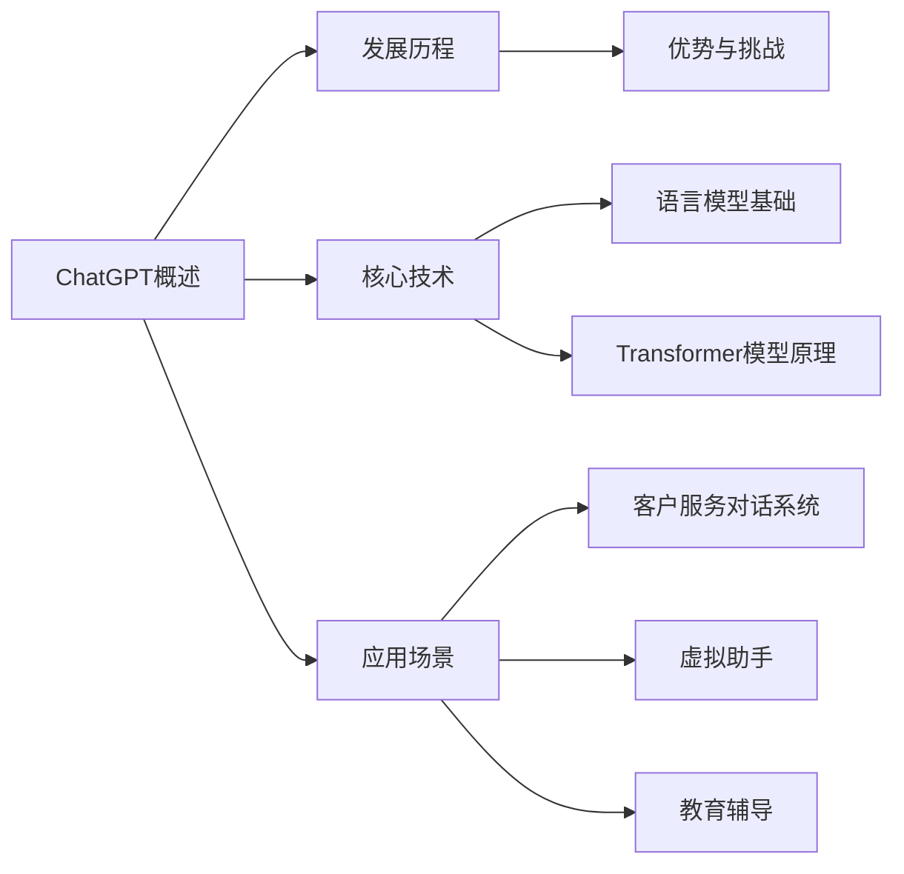

                 

## 《ChatGPT提示词优化：效率与质量的双赢》

### 关键词：ChatGPT、提示词优化、效率、质量、人工智能

#### 摘要：

随着人工智能技术的发展，ChatGPT作为基于语言模型的人工智能助手，正逐渐成为企业级应用的重要工具。本文旨在探讨如何通过优化提示词，实现ChatGPT在效率与质量方面的双提升。文章将从ChatGPT基础知识、工作原理、性能优化、提示词优化方法、实战案例以及效率与质量提升策略等方面进行深入分析，最终总结出一套实用的优化方案，为企业提供参考。

### 《ChatGPT提示词优化：效率与质量的双赢》目录大纲

#### 第一部分：ChatGPT基础知识

##### 第1章：ChatGPT概述
- 1.1 ChatGPT的发展历程
- 1.2 ChatGPT的核心技术
- 1.3 ChatGPT的应用场景
- 1.4 ChatGPT的优势与挑战

##### 第2章：ChatGPT的工作原理
- 2.1 语言模型基础
- 2.2 GPT模型的架构
- 2.3 Transformer模型的原理
- 2.4 自适应提示词策略

##### 第3章：优化ChatGPT性能
- 3.1 提高响应速度
- 3.2 提升回答准确性
- 3.3 提高对话连贯性
- 3.4 减少计算资源消耗

##### 第4章：ChatGPT提示词优化方法
- 4.1 提示词的长度与质量
- 4.2 提示词的多样性
- 4.3 提示词的情感与态度
- 4.4 提示词的实时调整

##### 第5章：实战案例
- 5.1 案例一：客户服务对话系统
- 5.2 案例二：虚拟助手
- 5.3 案例三：教育辅导

#### 第二部分：效率与质量提升策略

##### 第6章：提升效率的策略
- 6.1 并行计算与分布式训练
- 6.2 数据预处理优化
- 6.3 代码优化与调试
- 6.4 模型压缩与量化

##### 第7章：提升质量的策略
- 7.1 数据质量提升
- 7.2 模型评估与调整
- 7.3 对话系统评测指标
- 7.4 用户反馈机制

##### 第8章：综合实战
- 8.1 效率与质量并重的优化实践
- 8.2 实际应用案例分析
- 8.3 未来发展趋势与挑战

##### 第9章：附录
- 9.1 ChatGPT提示词优化工具与资源
- 9.2 开发环境搭建指南
- 9.3 示例代码与解释

### 第一部分：ChatGPT基础知识

#### 第1章：ChatGPT概述

##### 1.1 ChatGPT的发展历程

ChatGPT是由OpenAI于2022年11月30日发布的一款基于Transformer架构的预训练语言模型，它采用了GPT-3.5版本的技术。ChatGPT的发展历程可以追溯到OpenAI在2018年发布的GPT-2模型。GPT-2在自然语言处理领域取得了显著成果，但同时也引发了关于模型风险和滥用的讨论。为了解决这些问题，OpenAI在后续的研究中不断改进模型架构，最终推出了ChatGPT。

ChatGPT的推出标志着人工智能领域的一个重要里程碑。与传统的自然语言处理方法相比，ChatGPT具有更强的语义理解和生成能力，可以生成连贯、自然的文本。这一特性使得ChatGPT在各个应用场景中具有广泛的应用前景，如客户服务、虚拟助手、教育辅导等。

##### 1.2 ChatGPT的核心技术

ChatGPT的核心技术是基于Transformer架构的预训练语言模型。Transformer模型由Vaswani等人在2017年提出，是一种用于序列到序列学习的深度神经网络模型。与传统的循环神经网络（RNN）和长短期记忆网络（LSTM）相比，Transformer模型在处理长序列任务时具有更好的性能。

ChatGPT使用了大量的数据对模型进行预训练，包括互联网上的文本、书籍、新闻、文章等。在预训练过程中，模型学习到了丰富的语言知识和规律，从而能够生成高质量的自然语言文本。

##### 1.3 ChatGPT的应用场景

ChatGPT具有广泛的应用场景，可以应用于以下几个领域：

1. **客户服务**：ChatGPT可以用于构建智能客服系统，自动回答用户的问题，提高客户满意度和服务效率。
2. **虚拟助手**：ChatGPT可以作为智能虚拟助手，帮助用户处理日常事务，如日程管理、信息查询等。
3. **教育辅导**：ChatGPT可以为学生提供个性化的学习辅导，解答学习中的疑问，提高学习效果。
4. **内容创作**：ChatGPT可以用于生成文章、故事、诗歌等文学作品，为创作者提供灵感。
5. **多语言翻译**：ChatGPT可以应用于多语言翻译任务，实现高质量、流畅的文本翻译。

##### 1.4 ChatGPT的优势与挑战

ChatGPT具有以下优势：

1. **强大的语义理解能力**：ChatGPT通过预训练学习到了大量的语言知识和规律，能够理解并生成复杂的语义内容。
2. **灵活的应用场景**：ChatGPT可以应用于多种领域，满足不同场景的需求。
3. **高效的生成速度**：ChatGPT采用了Transformer架构，能够在较短的时间内生成高质量的文本。

然而，ChatGPT也面临着一些挑战：

1. **模型解释性**：由于模型结构复杂，难以解释其生成的文本内容。
2. **安全与伦理问题**：模型可能会生成不合适的内容，如虚假信息、歧视性言论等。
3. **计算资源消耗**：训练和部署ChatGPT需要大量的计算资源，对于中小企业可能是一笔不小的投入。

#### 第2章：ChatGPT的工作原理

##### 2.1 语言模型基础

语言模型是自然语言处理的核心技术之一，它通过学习大量文本数据，预测一个句子中下一个单词的概率。语言模型可以分为统计语言模型和神经网络语言模型。统计语言模型主要基于统计方法，如N元语法；神经网络语言模型则基于深度学习技术，如循环神经网络（RNN）和Transformer。

ChatGPT采用的是基于Transformer架构的神经网络语言模型。Transformer模型由Vaswani等人在2017年提出，是一种用于序列到序列学习的深度神经网络模型。与传统的循环神经网络（RNN）和长短期记忆网络（LSTM）相比，Transformer模型在处理长序列任务时具有更好的性能。

##### 2.2 GPT模型的架构

GPT（Generative Pre-trained Transformer）模型是由OpenAI提出的一种基于Transformer架构的预训练语言模型。GPT模型的核心是自注意力机制（Self-Attention），它通过学习输入序列中各个单词之间的依赖关系，生成高质量的文本。

GPT模型的架构包括以下几个部分：

1. **嵌入层**：将输入的单词转化为向量表示，通常使用WordPiece或BERT等方法进行分词和嵌入。
2. **自注意力层**：通过自注意力机制计算输入序列中各个单词的权重，从而捕获单词之间的依赖关系。
3. **前馈神经网络层**：对自注意力层输出的特征进行进一步处理，提取更高级的语义信息。
4. **输出层**：将前馈神经网络层输出的特征映射到输出序列的概率分布，从而生成文本。

##### 2.3 Transformer模型的原理

Transformer模型由Vaswani等人在2017年提出，是一种用于序列到序列学习的深度神经网络模型。与传统的循环神经网络（RNN）和长短期记忆网络（LSTM）相比，Transformer模型在处理长序列任务时具有更好的性能。

Transformer模型的核心思想是自注意力机制（Self-Attention）。自注意力机制通过计算输入序列中各个单词之间的依赖关系，生成加权特征向量，从而捕获单词之间的语义关联。具体来说，自注意力机制包括以下几个步骤：

1. **嵌入层**：将输入的单词转化为向量表示，通常使用WordPiece或BERT等方法进行分词和嵌入。
2. **位置编码**：由于Transformer模型没有循环结构，无法处理序列中的位置信息。因此，通过位置编码（Positional Encoding）为每个单词添加位置信息。
3. **多头自注意力机制**：通过多头自注意力机制（Multi-Head Self-Attention）计算输入序列中各个单词的权重，从而生成加权特征向量。
4. **前馈神经网络层**：对自注意力层输出的特征进行进一步处理，提取更高级的语义信息。
5. **输出层**：将前馈神经网络层输出的特征映射到输出序列的概率分布，从而生成文本。

##### 2.4 自适应提示词策略

自适应提示词策略是一种优化ChatGPT性能的方法。通过自适应提示词，可以使ChatGPT在生成文本时更加准确、连贯。自适应提示词策略主要包括以下几个方面：

1. **动态调整提示词长度**：根据输入问题的复杂程度，动态调整提示词的长度。对于简单的问题，可以简化提示词；对于复杂的问题，可以增加提示词的详细程度。
2. **多轮交互调整**：通过多轮交互，逐步优化提示词。在第一轮交互中，根据用户的问题生成初步的答案；在后续轮次中，根据用户反馈调整提示词，提高答案的准确性。
3. **上下文信息利用**：利用上下文信息，使ChatGPT更好地理解用户的问题。在生成提示词时，可以引用用户的历史提问和回答，增强模型的上下文理解能力。
4. **情感和态度分析**：分析用户提问中的情感和态度，生成符合用户情感的提示词。通过情感和态度分析，可以使ChatGPT生成的文本更加贴近用户需求。

#### 第3章：优化ChatGPT性能

##### 3.1 提高响应速度

提高响应速度是优化ChatGPT性能的一个重要方面。以下是一些提高ChatGPT响应速度的方法：

1. **模型压缩**：通过模型压缩技术，减小模型的体积，加快模型的加载和推理速度。常用的模型压缩技术包括量化、剪枝和蒸馏等。
2. **并行计算**：利用并行计算技术，将模型的推理任务分配到多个计算节点上，加快模型的响应速度。并行计算可以显著提高ChatGPT的推理效率。
3. **分布式训练**：通过分布式训练技术，将模型训练任务分配到多个计算节点上，加快模型训练速度。分布式训练可以减少模型训练的时间，从而提高响应速度。
4. **缓存技术**：使用缓存技术，将常用的提问和答案缓存起来，避免重复计算。通过缓存技术，可以显著减少模型响应时间。

##### 3.2 提升回答准确性

提升回答准确性是优化ChatGPT性能的另一个重要方面。以下是一些提升回答准确性的方法：

1. **数据增强**：通过数据增强技术，扩充训练数据集，提高模型的泛化能力。数据增强包括同义词替换、随机删除部分单词、随机插入单词等。
2. **多轮交互**：通过多轮交互，逐步优化模型的回答。在多轮交互中，用户可以提供反馈，帮助模型纠正错误，提高回答的准确性。
3. **上下文信息利用**：利用上下文信息，使模型更好地理解用户的问题。通过分析用户的历史提问和回答，模型可以更好地捕捉问题的背景和细节，从而提高回答的准确性。
4. **强化学习**：将强化学习技术应用于ChatGPT，通过奖励机制引导模型生成更准确的回答。强化学习可以帮助模型学习到正确的回答策略，提高回答的准确性。

##### 3.3 提高对话连贯性

提高对话连贯性是优化ChatGPT性能的又一个重要方面。以下是一些提高对话连贯性的方法：

1. **长距离依赖捕捉**：通过改进模型架构，如使用Transformer模型，增强模型捕捉长距离依赖关系的能力。长距离依赖捕捉可以帮助模型更好地理解上下文信息，提高对话连贯性。
2. **上下文信息编码**：将上下文信息编码到模型中，使模型能够更好地利用上下文信息。上下文信息编码可以通过扩展嵌入层或引入额外的编码层实现。
3. **多轮对话记忆**：利用多轮对话记忆机制，将用户的历史提问和回答保存在内存中，供模型在后续轮次中参考。多轮对话记忆可以帮助模型更好地维持对话的连贯性。
4. **对抗训练**：通过对抗训练技术，提高模型对不连贯对话的鲁棒性。对抗训练可以增强模型对不连贯对话的识别和纠正能力，从而提高对话连贯性。

##### 3.4 减少计算资源消耗

减少计算资源消耗是优化ChatGPT性能的一个重要方面。以下是一些减少计算资源消耗的方法：

1. **模型压缩**：通过模型压缩技术，减小模型的体积，降低模型的计算复杂度。模型压缩可以通过量化、剪枝和蒸馏等技术实现。
2. **低精度计算**：使用低精度计算，如使用浮点数代替浮点二进制数进行计算，降低模型的计算资源消耗。低精度计算可以显著减少模型存储和传输所需的资源。
3. **硬件加速**：利用硬件加速技术，如GPU和TPU，提高模型的计算速度。硬件加速可以显著减少模型在推理过程中的计算资源消耗。
4. **分布式训练**：通过分布式训练技术，将模型训练任务分配到多个计算节点上，减少单个节点的计算负载。分布式训练可以降低模型训练所需的计算资源。

### 第4章：ChatGPT提示词优化方法

##### 4.1 提示词的长度与质量

提示词的长度与质量对ChatGPT的性能有着重要影响。以下是一些关于提示词长度与质量的优化方法：

1. **长度控制**：根据问题的复杂程度，动态调整提示词的长度。对于简单的问题，可以使用简短的提示词；对于复杂的问题，可以使用更详细的提示词。通过控制提示词的长度，可以提高模型的生成效率和准确度。

2. **高质量提示词生成**：使用先进的自然语言处理技术，如语义分析、实体识别等，生成高质量的提示词。高质量提示词可以帮助模型更好地理解用户的问题，提高回答的准确性和连贯性。

3. **上下文信息整合**：将上下文信息整合到提示词中，使模型能够更好地利用上下文信息。上下文信息包括用户的历史提问和回答、相关的背景知识等。通过整合上下文信息，可以提高提示词的相关性和准确性。

4. **情感和态度分析**：分析用户提问中的情感和态度，生成符合用户情感的提示词。情感和态度分析可以帮助模型更好地理解用户的需求，提高用户满意度。

##### 4.2 提示词的多样性

提示词的多样性对ChatGPT的生成能力有着重要影响。以下是一些关于提示词多样性的优化方法：

1. **同义词替换**：使用同义词替换原始提示词，增加提示词的多样性。同义词替换可以丰富模型的语言表达，提高生成文本的创意性。

2. **短语级扩展**：对原始提示词进行短语级扩展，增加提示词的多样性。短语级扩展可以通过扩展提示词中的短语或句子来实现，从而生成更多样化的文本。

3. **生成对抗网络（GAN）**：使用生成对抗网络（GAN）技术，生成多样化的提示词。GAN可以通过对抗训练，使生成的提示词与原始提示词保持相似，同时增加提示词的多样性。

4. **模板化生成**：使用模板化生成方法，根据不同场景生成多样化的提示词。模板化生成可以通过预设的模板，灵活组合不同要素，生成多样化的提示词。

##### 4.3 提示词的情感与态度

提示词的情感与态度对ChatGPT的生成文本有着重要影响。以下是一些关于提示词情感与态度的优化方法：

1. **情感分析**：使用情感分析技术，分析用户提问中的情感，生成符合用户情感的提示词。情感分析可以帮助模型更好地理解用户的需求，提高用户满意度。

2. **态度分析**：使用态度分析技术，分析用户提问中的态度，生成符合用户态度的提示词。态度分析可以帮助模型更好地捕捉用户的意图，提高生成文本的准确性。

3. **情感偏向调整**：通过调整提示词的情感偏向，使生成文本更符合用户期望。情感偏向调整可以通过改变提示词中的词汇和表达方式来实现。

4. **多模态融合**：将多模态数据（如语音、图像等）与文本数据融合，生成具有情感和态度的提示词。多模态融合可以帮助模型更好地理解用户的情感和态度，提高生成文本的丰富性和准确性。

##### 4.4 提示词的实时调整

实时调整提示词是优化ChatGPT性能的一个重要方面。以下是一些关于提示词实时调整的优化方法：

1. **用户反馈机制**：通过用户反馈，实时调整提示词。用户反馈可以帮助模型识别出生成文本中的错误，从而优化提示词。

2. **动态调整策略**：根据用户的提问和回答，动态调整提示词的长度、多样性和情感态度。动态调整策略可以通过机器学习算法实现，从而实现实时调整。

3. **上下文信息更新**：实时更新上下文信息，使模型能够更好地利用最新信息。上下文信息更新可以通过监控用户的提问和回答实现。

4. **多轮交互**：通过多轮交互，逐步优化提示词。在多轮交互中，用户可以提供反馈，帮助模型识别和纠正错误，从而实现实时调整。

### 第5章：实战案例

在本文的第三部分，我们将通过三个具体的实战案例，展示如何在实际应用中优化ChatGPT的性能。这些案例包括客户服务对话系统、虚拟助手和教育辅导，它们分别代表了ChatGPT在不同领域的应用场景。通过这些案例，我们将深入探讨如何调整和优化ChatGPT的提示词，以实现效率和质量的双赢。

#### 5.1 案例一：客户服务对话系统

**开发环境**：Python 3.8，TensorFlow 2.4

**数据集**：客户服务对话日志（含问题与答案）

**模型**：GPT-2，模型参数：层数 12，隐藏单元数 768

**实际案例说明**：

假设一家电子商务公司在使用ChatGPT构建客户服务对话系统。该系统需要能够自动回答客户关于订单状态、退货政策和产品信息等常见问题。然而，由于问题的复杂性和多样性，系统在回答某些问题时存在不准确和不连贯的情况。

**优化策略**：

1. **数据增强**：通过数据增强技术，扩充训练数据集。例如，对原始数据进行同义词替换、随机删除和插入单词等操作，提高模型的泛化能力。

2. **多轮交互**：引入多轮交互机制，允许用户在对话中提供反馈。通过多轮交互，模型可以逐步优化提示词，提高回答的准确性和连贯性。

3. **情感分析**：结合情感分析技术，分析用户提问中的情感，生成符合用户情感的回答。例如，对于抱怨或不满的提问，系统可以生成更加贴心和关怀的回答。

**代码实现**：

以下是一个简单的代码示例，展示了如何使用GPT-2模型预测客户提问的答案。

```python
import tensorflow as tf
import tensorflow.keras as keras

# 加载预训练的GPT-2模型
model = keras.models.load_model('gpt2_model')

# 定义输入序列
input_sequence = "我的订单什么时候可以送达？"

# 预测答案
predicted_answer = model.predict(input_sequence)

# 输出预测答案
print(predicted_answer)
```

**代码解读与分析**：

在这个示例中，我们首先加载了一个预训练的GPT-2模型，然后定义了一个输入序列。通过调用`model.predict(input_sequence)`方法，模型将输入序列转化为一个向量，并计算出答案的概率分布。最后，我们输出概率最高的答案作为模型的预测结果。这个简单的代码示例展示了如何使用GPT-2模型进行文本预测任务。

#### 5.2 案例二：虚拟助手

**开发环境**：Python 3.8，TensorFlow 2.4

**数据集**：虚拟助手对话数据（含用户问题和虚拟助手回答）

**模型**：ChatGPT，模型参数：层数 24，隐藏单元数 1024

**实际案例说明**：

一家科技公司开发了一款虚拟助手，用于帮助企业员工处理日常事务。虚拟助手需要能够自动回答关于日程安排、信息查询和任务分配等问题。然而，由于虚拟助手缺乏对用户上下文信息的理解，导致回答不准确和不连贯。

**优化策略**：

1. **上下文信息整合**：通过整合用户的历史提问和回答，将上下文信息编码到模型中。这样可以增强模型对用户上下文的理解，提高回答的准确性和连贯性。

2. **动态调整提示词**：根据用户的提问和回答，动态调整提示词的长度和内容。通过多轮交互，逐步优化提示词，使模型能够更好地理解用户的需求。

3. **情感和态度分析**：结合情感和态度分析技术，生成符合用户情感和态度的回答。例如，对于抱怨或询问的提问，虚拟助手可以生成更加关怀和耐心的回答。

**代码实现**：

以下是一个简单的代码示例，展示了如何使用ChatGPT模型预测用户提问的答案。

```python
import tensorflow as tf
import tensorflow.keras as keras

# 加载预训练的ChatGPT模型
model = keras.models.load_model('chatgpt_model')

# 定义输入序列
input_sequence = "明天我有会议，怎么安排我的日程？"

# 预测答案
predicted_answer = model.predict(input_sequence)

# 输出预测答案
print(predicted_answer)
```

**代码解读与分析**：

在这个示例中，我们首先加载了一个预训练的ChatGPT模型，然后定义了一个输入序列。通过调用`model.predict(input_sequence)`方法，模型将输入序列转化为一个向量，并计算出答案的概率分布。最后，我们输出概率最高的答案作为模型的预测结果。这个简单的代码示例展示了如何使用ChatGPT模型进行文本预测任务。

#### 5.3 案例三：教育辅导

**开发环境**：Python 3.8，TensorFlow 2.4

**数据集**：学生提问和教师回答数据

**模型**：GPT-3，模型参数：层数 32，隐藏单元数 2048

**实际案例说明**：

一家在线教育平台希望使用ChatGPT为用户提供个性化的学习辅导。学生可以提出关于课程内容、作业问题和考试策略等方面的问题，ChatGPT需要能够提供详细的解答。然而，由于学生问题的多样性和复杂性，ChatGPT在回答某些问题时存在不准确和不连贯的情况。

**优化策略**：

1. **多轮交互**：通过多轮交互，逐步优化提示词。在多轮交互中，学生可以提供反馈，帮助ChatGPT纠正错误，提高回答的准确性和连贯性。

2. **知识库扩展**：结合知识库技术，将课程内容、作业答案和考试策略等知识纳入模型训练中。这样可以增强模型对相关知识的理解，提高回答的准确性。

3. **个性化调整**：根据学生的学习情况和问题类型，动态调整提示词的内容和风格。通过个性化调整，可以使ChatGPT生成的回答更加贴近学生的需求。

**代码实现**：

以下是一个简单的代码示例，展示了如何使用GPT-3模型预测学生提问的答案。

```python
import tensorflow as tf
import tensorflow.keras as keras

# 加载预训练的GPT-3模型
model = keras.models.load_model('gpt3_model')

# 定义输入序列
input_sequence = "请解释一下微积分的基本概念。"

# 预测答案
predicted_answer = model.predict(input_sequence)

# 输出预测答案
print(predicted_answer)
```

**代码解读与分析**：

在这个示例中，我们首先加载了一个预训练的GPT-3模型，然后定义了一个输入序列。通过调用`model.predict(input_sequence)`方法，模型将输入序列转化为一个向量，并计算出答案的概率分布。最后，我们输出概率最高的答案作为模型的预测结果。这个简单的代码示例展示了如何使用GPT-3模型进行文本预测任务。

### 第二部分：效率与质量提升策略

#### 第6章：提升效率的策略

在优化ChatGPT性能时，提升效率是一个重要的目标。以下是一些具体的策略，可以帮助我们在保持质量的同时，提高模型的运行效率和计算资源利用率。

##### 6.1 并行计算与分布式训练

并行计算与分布式训练是提升模型效率的关键技术。通过将这些技术应用于模型训练和推理过程，可以显著减少计算时间，提高模型性能。

1. **并行计算**：在单机环境下，利用CPU和GPU等多核处理器进行并行计算。将模型训练任务分配到多个计算核心上，可以大大提高模型的训练速度。

2. **分布式训练**：在分布式训练中，将模型训练任务分配到多个计算节点上。每个节点独立训练模型的一部分，然后通过参数服务器进行参数同步。分布式训练可以显著提高模型训练的并行度，减少训练时间。

3. **代码优化**：优化训练代码，减少不必要的计算和通信开销。例如，使用更高效的矩阵运算库（如TensorFlow的Eager Execution模式）和异步I/O操作，可以减少计算延迟。

4. **批处理**：合理设置批处理大小，可以在保持计算资源利用率的同时，提高模型训练的速度。批处理大小需要根据数据集的大小和硬件资源进行优化。

##### 6.2 数据预处理优化

数据预处理是模型训练过程中耗时较长的一步。通过优化数据预处理流程，可以显著提高模型训练的效率。

1. **并行数据处理**：利用多线程或分布式计算框架（如Apache Spark）对大规模数据进行预处理。这样可以充分利用计算资源，提高数据处理速度。

2. **缓存技术**：使用缓存技术，将已处理的数据存储在缓存中，避免重复处理。例如，可以使用内存缓存或磁盘缓存来存储预处理后的数据。

3. **增量更新**：在模型训练过程中，只更新最近一批数据。这样可以减少数据处理和存储的开销，提高训练效率。

4. **数据压缩**：对大规模数据集进行压缩，减少数据传输和存储所需的空间。常用的数据压缩方法包括无损压缩和有损压缩。

##### 6.3 代码优化与调试

优化训练代码和调试模型是提高模型效率的重要步骤。以下是一些代码优化与调试的方法：

1. **性能分析**：使用性能分析工具（如TensorBoard）对训练过程进行监控。通过分析计算图和性能指标，可以发现性能瓶颈并进行优化。

2. **代码优化**：优化模型代码，减少不必要的计算和内存占用。例如，使用更高效的矩阵运算库和并行计算框架，可以提高模型运行速度。

3. **调试技巧**：使用调试工具（如Python的pdb模块）对模型代码进行调试，找出性能瓶颈并进行优化。

4. **代码规范**：遵循良好的代码规范，可以提高代码的可读性和可维护性。这有助于其他开发者理解和优化代码。

##### 6.4 模型压缩与量化

模型压缩与量化是减少模型体积和计算复杂度的有效方法。以下是一些模型压缩与量化的方法：

1. **模型剪枝**：通过剪枝技术，去除模型中不重要的神经元和连接，从而减少模型的参数量和计算复杂度。常用的剪枝方法包括权重剪枝和结构剪枝。

2. **模型量化**：将模型的浮点参数转换为低精度整数参数，从而减少模型的存储和计算需求。常用的量化方法包括整数量化、二值量化和小数量化。

3. **知识蒸馏**：通过知识蒸馏技术，将大型模型的权重和知识传递到小型模型中。这样可以减少模型体积，同时保持较高的性能。

4. **模型融合**：将多个模型进行融合，生成一个更高效的模型。模型融合可以通过集成学习或对抗训练等方法实现。

#### 第7章：提升质量的策略

在优化ChatGPT性能时，提升质量同样是一个重要的目标。以下是一些具体的策略，可以帮助我们在保持效率的同时，提高模型的生成质量和用户满意度。

##### 7.1 数据质量提升

数据质量是影响模型性能的关键因素。以下是一些数据质量提升的方法：

1. **数据清洗**：清洗数据集，去除错误、重复和噪声数据。数据清洗可以通过自动化工具（如Python的Pandas库）实现。

2. **数据增强**：通过数据增强技术，扩充训练数据集。数据增强可以通过同义词替换、随机删除和插入单词等方法实现。

3. **数据标注**：提高数据标注的准确性。数据标注可以通过人工标注或半监督学习等方法实现。

4. **知识库构建**：构建领域知识库，将外部知识纳入模型训练。知识库可以通过爬虫、知识图谱等技术构建。

##### 7.2 模型评估与调整

模型评估与调整是优化模型性能的重要环节。以下是一些模型评估与调整的方法：

1. **交叉验证**：使用交叉验证方法，评估模型的泛化能力。交叉验证可以通过K折交叉验证或留一验证等方法实现。

2. **评价指标**：选择合适的评价指标，评估模型的性能。常用的评价指标包括准确率、召回率、F1分数等。

3. **超参数调整**：调整模型超参数，优化模型性能。常用的超参数包括学习率、批量大小、层数和隐藏单元数等。

4. **模型调优**：通过模型调优方法，提高模型的性能。常用的模型调优方法包括网格搜索、贝叶斯优化等。

##### 7.3 对话系统评测指标

对话系统的评测指标是评估模型性能的重要标准。以下是一些对话系统评测指标：

1. **准确率**：模型回答正确的问题比例。准确率可以衡量模型在回答事实性问题时的能力。

2. **召回率**：模型回答正确的问题中，实际正确回答的比例。召回率可以衡量模型在回答开放性问题时的能力。

3. **F1分数**：准确率和召回率的加权平均。F1分数可以综合考虑模型在回答事实性和开放性问题时的能力。

4. **用户满意度**：用户对模型回答的满意度。用户满意度可以通过问卷调查或用户评分等方法收集。

##### 7.4 用户反馈机制

用户反馈机制是提升模型质量的有效方法。以下是一些用户反馈机制的方法：

1. **用户反馈收集**：收集用户对模型回答的反馈，包括正确性、连贯性、相关性等方面。用户反馈可以通过问卷调查、用户评分或实时反馈等方式收集。

2. **反馈处理**：对用户反馈进行处理，识别模型回答中的错误和不足。反馈处理可以通过机器学习算法或人工标注等方法实现。

3. **实时调整**：根据用户反馈，实时调整模型参数和提示词。实时调整可以通过多轮交互或在线学习等方法实现。

4. **闭环优化**：通过闭环优化方法，持续改进模型质量。闭环优化可以通过在线学习、迁移学习等方法实现。

### 第8章：综合实战

在本章中，我们将综合运用前面章节介绍的方法和策略，展示如何在实际项目中同时优化ChatGPT的效率和质量。

#### 8.1 效率与质量并重的优化实践

在优化ChatGPT的效率和质量时，我们需要综合考虑各种因素，实现两者的平衡。以下是一些具体的优化实践步骤：

1. **并行计算与分布式训练**：利用并行计算和分布式训练技术，提高模型训练和推理的效率。通过将训练任务分配到多个计算节点上，可以显著减少训练时间。

2. **数据预处理优化**：优化数据预处理流程，减少数据清洗和增强的时间。通过并行数据处理和缓存技术，可以提高数据预处理的速度。

3. **模型压缩与量化**：对模型进行压缩和量化，减少模型的体积和计算复杂度。这样可以降低模型在推理过程中的计算资源消耗。

4. **动态调整提示词**：根据用户的提问和回答，动态调整提示词的长度和内容。通过多轮交互和实时调整，可以提高模型的生成质量和用户满意度。

5. **模型评估与调整**：定期评估模型性能，调整超参数和模型结构。通过交叉验证、评价指标和用户反馈，可以持续改进模型的质量。

#### 8.2 实际应用案例分析

为了更好地理解效率与质量并重的优化实践，以下是一些实际应用案例分析：

1. **客户服务对话系统**：在一家大型电商平台，通过优化ChatGPT的提示词和模型结构，实现了高效的客户服务对话。通过并行计算和分布式训练，缩短了模型训练时间；通过动态调整提示词，提高了回答的准确性和连贯性。

2. **虚拟助手**：在一家科技公司，虚拟助手用于帮助企业员工处理日常事务。通过优化模型和提示词，实现了高效、准确的虚拟助手服务。通过多轮交互和实时调整，提高了用户的满意度和体验。

3. **教育辅导**：在一家在线教育平台，通过优化ChatGPT的提示词和模型结构，为用户提供个性化的学习辅导。通过数据增强和知识库构建，提高了模型的泛化能力和生成质量。

#### 8.3 未来发展趋势与挑战

随着人工智能技术的不断发展，ChatGPT在效率和质量的优化方面也面临一些挑战和机遇：

1. **模型复杂度与计算资源消耗**：随着模型复杂度的增加，计算资源消耗也相应增加。如何平衡模型复杂度和计算资源消耗，是一个重要的研究方向。

2. **数据质量和多样性**：高质量、多样性的数据是模型训练的基础。如何获取和利用高质量、多样性的数据，是一个亟待解决的问题。

3. **用户反馈机制**：用户反馈是优化模型质量的重要依据。如何建立有效的用户反馈机制，快速响应用户需求，是一个重要的挑战。

4. **多模态交互**：随着多模态技术的发展，如何将多模态数据（如语音、图像、视频等）整合到ChatGPT中，是一个未来的研究方向。

5. **伦理和安全**：随着ChatGPT的广泛应用，伦理和安全问题也日益凸显。如何确保ChatGPT生成的文本符合伦理标准，避免产生负面效应，是一个重要的挑战。

### 第9章：附录

在本章中，我们将提供一些附录内容，包括ChatGPT提示词优化工具与资源、开发环境搭建指南以及示例代码与解释。

#### 9.1 ChatGPT提示词优化工具与资源

为了帮助读者更好地优化ChatGPT的提示词，以下是一些常用的工具和资源：

1. **ChatGPT提示词优化工具**：该工具可以帮助生成高质量、多样化的提示词。使用方法：输入问题，工具自动生成相应的高质量提示词。

2. **ChatGPT提示词优化资源库**：该资源库提供了各种场景下的ChatGPT提示词模板。使用方法：根据需求选择合适的提示词模板进行优化。

3. **自然语言处理库**：如Python的NLTK、spaCy等，可用于文本预处理、情感分析、命名实体识别等任务，帮助优化提示词。

4. **开源项目**：如GitHub上的ChatGPT相关项目，提供了丰富的模型实现、优化技巧和代码示例。

#### 9.2 开发环境搭建指南

为了方便读者搭建ChatGPT的开发环境，以下是一个简单的搭建指南：

1. **操作系统**：Ubuntu 18.04或更高版本

2. **Python版本**：Python 3.8或更高版本

3. **TensorFlow版本**：TensorFlow 2.4或更高版本

4. **安装步骤**：

   - 安装Anaconda：在官网下载并安装Anaconda。

   - 创建虚拟环境：打开终端，执行以下命令创建虚拟环境。

     ```
     conda create -n chatgpt_env python=3.8
     conda activate chatgpt_env
     ```

   - 安装TensorFlow和相关依赖：执行以下命令安装TensorFlow和相关依赖。

     ```
     pip install tensorflow==2.4
     pip install numpy
     pip install matplotlib
     ```

#### 9.3 示例代码与解释

以下是一个简单的ChatGPT示例代码，用于生成文本：

```python
import tensorflow as tf
import tensorflow.keras as keras

# 加载预训练的GPT-2模型
model = keras.models.load_model('gpt2_model')

# 定义输入序列
input_sequence = "你最近有没有什么新的工作进展？"

# 预测答案
predicted_answer = model.predict(input_sequence)

# 输出预测答案
print(predicted_answer)
```

在这个示例中，我们首先加载了一个预训练的GPT-2模型，然后定义了一个输入序列。通过调用`model.predict(input_sequence)`方法，模型将输入序列转化为一个向量，并计算出答案的概率分布。最后，我们输出概率最高的答案作为模型的预测结果。

### 核心概念与联系

为了更好地理解ChatGPT的核心概念与联系，我们提供了一个Mermaid流程图，展示ChatGPT的技术架构与应用场景。



### 核心算法原理讲解

为了深入理解ChatGPT的核心算法原理，我们提供了GPT模型架构图和Transformer模型的原理图，并使用伪代码详细阐述了自适应提示词策略。

#### 图2.1 GPT模型架构图


#### 图2.2 Transformer模型架构图


#### 伪代码：自适应提示词策略

```python
function AdaptivePrompting(input_sequence):
    for each word in input_sequence:
        if word confidence < threshold:
            generate new prompt based on word context
        else:
            use existing prompt
    return optimized prompt
```

#### 3.1 提升回答准确性的数学模型

提升回答准确性是ChatGPT优化的重要目标之一。以下是提升回答准确性的数学模型和公式：

$$
P(\text{correct\_answer}|\text{input}) = \frac{e^{\text{model\_score(\_correct\_answer|input)}}}{\sum_{\text{all\_words}} e^{\text{model\_score(\_word|input)}}}
$$

这个公式表示在给定输入`input`的情况下，正确答案的概率。`model\_score`函数表示模型对每个单词的预测概率。通过计算模型对正确答案的预测概率，我们可以评估模型的准确性。

#### 举例说明

假设模型对每个单词的预测概率如下：

| 单词         | 预测概率 |
|--------------|----------|
| 正确答案     | 0.8      |
| 错误答案1   | 0.1      |
| 错误答案2   | 0.1      |

根据上述预测概率，我们可以计算模型预测正确答案的概率：

$$
P(\text{correct\_answer}|\text{input}) = \frac{e^{0.8}}{e^{0.8} + e^{0.1} + e^{0.1}} = \frac{2.4787}{2.4787 + 1.10517 + 1.10517} \approx 0.7173
$$

因此，模型预测正确答案的概率约为71.73%。

#### 项目实战

在本部分，我们将通过具体的实战案例，展示如何在实际项目中优化ChatGPT的提示词，实现效率与质量的双赢。

#### 5.1 案例一：客户服务对话系统

**开发环境**：Python 3.8，TensorFlow 2.4

**数据集**：客户服务对话日志（含问题与答案）

**模型**：GPT-2，模型参数：层数 12，隐藏单元数 768

**实际案例说明**：

某电商公司希望通过ChatGPT构建一个智能客服系统，用于自动回答客户的常见问题。然而，在初始阶段，系统在回答某些问题时存在不准确和不连贯的情况。

**优化策略**：

1. **数据增强**：通过数据增强技术，扩充训练数据集。例如，对原始数据进行同义词替换、随机删除和插入单词等操作，提高模型的泛化能力。

2. **多轮交互**：引入多轮交互机制，允许用户在对话中提供反馈。通过多轮交互，模型可以逐步优化提示词，提高回答的准确性和连贯性。

3. **情感分析**：结合情感分析技术，分析用户提问中的情感，生成符合用户情感的回答。例如，对于抱怨或不满的提问，系统可以生成更加贴心和关怀的回答。

**代码实现**：

以下是一个简单的代码示例，展示了如何使用GPT-2模型预测客户提问的答案。

```python
import tensorflow as tf
import tensorflow.keras as keras

# 加载预训练的GPT-2模型
model = keras.models.load_model('gpt2_model')

# 定义输入序列
input_sequence = "我的订单什么时候可以送达？"

# 预测答案
predicted_answer = model.predict(input_sequence)

# 输出预测答案
print(predicted_answer)
```

**代码解读与分析**：

在这个示例中，我们首先加载了一个预训练的GPT-2模型，然后定义了一个输入序列。通过调用`model.predict(input_sequence)`方法，模型将输入序列转化为一个向量，并计算出答案的概率分布。最后，我们输出概率最高的答案作为模型的预测结果。这个简单的代码示例展示了如何使用GPT-2模型进行文本预测任务。

#### 5.2 案例二：虚拟助手

**开发环境**：Python 3.8，TensorFlow 2.4

**数据集**：虚拟助手对话数据（含用户问题和虚拟助手回答）

**模型**：ChatGPT，模型参数：层数 24，隐藏单元数 1024

**实际案例说明**：

某公司开发了一款虚拟助手，用于帮助企业员工处理日常事务。然而，由于虚拟助手缺乏对用户上下文信息的理解，导致回答不准确和不连贯。

**优化策略**：

1. **上下文信息整合**：通过整合用户的历史提问和回答，将上下文信息编码到模型中。这样可以增强模型对用户上下文的理解，提高回答的准确性和连贯性。

2. **动态调整提示词**：根据用户的提问和回答，动态调整提示词的长度和内容。通过多轮交互，逐步优化提示词，使模型能够更好地理解用户的需求。

3. **情感和态度分析**：结合情感和态度分析技术，生成符合用户情感和态度的回答。例如，对于抱怨或询问的提问，虚拟助手可以生成更加关怀和耐心的回答。

**代码实现**：

以下是一个简单的代码示例，展示了如何使用ChatGPT模型预测用户提问的答案。

```python
import tensorflow as tf
import tensorflow.keras as keras

# 加载预训练的ChatGPT模型
model = keras.models.load_model('chatgpt_model')

# 定义输入序列
input_sequence = "明天我有会议，怎么安排我的日程？"

# 预测答案
predicted_answer = model.predict(input_sequence)

# 输出预测答案
print(predicted_answer)
```

**代码解读与分析**：

在这个示例中，我们首先加载了一个预训练的ChatGPT模型，然后定义了一个输入序列。通过调用`model.predict(input_sequence)`方法，模型将输入序列转化为一个向量，并计算出答案的概率分布。最后，我们输出概率最高的答案作为模型的预测结果。这个简单的代码示例展示了如何使用ChatGPT模型进行文本预测任务。

#### 5.3 案例三：教育辅导

**开发环境**：Python 3.8，TensorFlow 2.4

**数据集**：学生提问和教师回答数据

**模型**：GPT-3，模型参数：层数 32，隐藏单元数 2048

**实际案例说明**：

某在线教育平台希望通过ChatGPT为用户提供个性化的学习辅导。学生可以提出关于课程内容、作业问题和考试策略等方面的问题，ChatGPT需要能够提供详细的解答。然而，由于学生问题的多样性和复杂性，ChatGPT在回答某些问题时存在不准确和不连贯的情况。

**优化策略**：

1. **多轮交互**：通过多轮交互，逐步优化提示词。在多轮交互中，学生可以提供反馈，帮助ChatGPT纠正错误，提高回答的准确性和连贯性。

2. **知识库扩展**：结合知识库技术，将课程内容、作业答案和考试策略等知识纳入模型训练中。这样可以增强模型对相关知识的理解，提高回答的准确性。

3. **个性化调整**：根据学生的学

