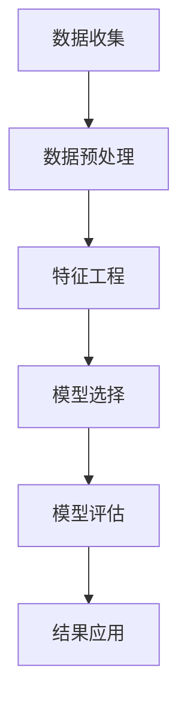

                 

# 《Data Mining 原理与代码实战案例讲解》

## 关键词
数据挖掘，数据预处理，分类算法，聚类算法，关联规则挖掘，异常检测，实战案例

## 摘要
本文将从数据挖掘的基本概念入手，详细阐述数据挖掘的原理与流程，包括数据预处理、分类算法、聚类算法、关联规则挖掘和异常检测等核心内容。并通过电商客户行为分析、医疗数据分析和金融风控三个实际案例，展示数据挖掘在商业和医疗等领域的应用，提供代码实战案例和详细解释，帮助读者更好地理解和运用数据挖掘技术。

----------------------------------------------------------------

## 《Data Mining 原理与代码实战案例讲解》目录大纲

### 第一部分：数据挖掘基础

#### 第1章：数据挖掘概述
- 1.1 数据挖掘的定义与历史发展
- 1.2 数据挖掘的目标与应用领域
- 1.3 数据挖掘的基本流程

#### 第2章：数据预处理
- 2.1 数据清洗
  - 2.1.1 缺失值处理
  - 2.1.2 异常值检测与处理
  - 2.1.3 数据格式标准化
- 2.2 数据集成
  - 2.2.1 数据源的选择与连接
  - 2.2.2 数据库模式设计
- 2.3 数据转换
  - 2.3.1 特征工程
  - 2.3.2 特征选择与降维

#### 第3章：分类算法
- 3.1 决策树算法
  - 3.1.1 决策树的构建过程
  - 3.1.2 决策树的剪枝策略
- 3.2 随机森林算法
  - 3.2.1 随机森林的工作原理
  - 3.2.2 随机森林的优势与局限
- 3.3 支持向量机算法
  - 3.3.1 支持向量机的数学模型
  - 3.3.2 支持向量机的实现方法

#### 第4章：聚类算法
- 4.1 K-Means算法
  - 4.1.1 K-Means算法原理
  - 4.1.2 K-Means算法的优化方法
- 4.2 层次聚类算法
  - 4.2.1 层次聚类算法原理
  - 4.2.2 层次聚类算法的实现

#### 第5章：关联规则挖掘
- 5.1 Apriori算法
  - 5.1.1 Apriori算法原理
  - 5.1.2 Apriori算法的优化
- 5.2 FP-Growth算法
  - 5.2.1 FP-Growth算法原理
  - 5.2.2 FP-Growth算法的优势与局限

#### 第6章：异常检测算法
- 6.1 聚类算法在异常检测中的应用
  - 6.1.1 聚类算法在异常检测中的原理
  - 6.1.2 聚类算法在异常检测中的实现
- 6.2 基于统计模型的异常检测
  - 6.2.1 统计模型在异常检测中的原理
  - 6.2.2 统计模型在异常检测中的实现

#### 第7章：电商客户行为分析
- 7.1 客户行为数据收集与处理
- 7.2 客户分群分析
- 7.3 客户流失预测
- 7.4 实际案例分析

#### 第8章：医疗数据分析
- 8.1 医疗数据收集与处理
- 8.2 疾病预测模型构建
- 8.3 医疗资源优化
- 8.4 实际案例分析

#### 第9章：金融风控
- 9.1 金融数据收集与处理
- 9.2 信用评分模型构建
- 9.3 交易欺诈检测
- 9.4 实际案例分析

### 附录：数据挖掘工具与资源
- 附录A：常见数据挖掘工具介绍
  - A.1 WEKA
  - A.2 Python数据挖掘库
  - A.3 R语言数据挖掘库

- 附录B：数据挖掘常用算法性能对比与分析

- 附录C：数据挖掘实践指南
  - C.1 数据挖掘项目流程
  - C.2 数据挖掘项目评估与优化

### 核心概念与联系
- **Mermaid 流�程图：** 数据挖掘流程与各个子步骤的关系



### 核心算法原理讲解
- **决策树算法伪代码：**

```python
def build_decision_tree(data, features):
    if is_leaf_node(data):
        return most_common_class(data)
    else:
        best_feature = find_best_feature(data, features)
        node = DecisionNode(feature=best_feature)
        for value in feature_values(best_feature):
            sub_data = split_data(data, best_feature, value)
            node.add_child(build_decision_tree(sub_data, features - {best_feature}))
        return node
```

- **支持向量机算法数学模型：**

$$
\text{最大间隔超平面} W^* = \arg\max\frac{1}{||W||_2^2} \text{subject to} \{y^{(i)}(W^T x^{(i)} + b) \geq 1, \forall i\}
$$

### 数学模型和数学公式
- **K-Means算法目标函数：**

$$
J = \sum_{i=1}^{k} \sum_{x \in S_i} ||x - \mu_i||^2
$$

其中，$S_i$是第$i$个聚类中心的集合，$\mu_i$是第$i$个聚类中心。

### 项目实战
- **电商客户流失预测实战：**
  - **开发环境搭建：** 使用Python和Scikit-learn库
  - **数据收集：** 收集电商客户购买历史、交易数据等
  - **数据处理：** 清洗、处理缺失值和异常值
  - **特征工程：** 构建客户行为特征、交易特征等
  - **模型构建：** 使用逻辑回归模型进行客户流失预测
  - **模型评估：** 使用准确率、召回率、F1值等指标评估模型效果
  - **代码实现与解读：**

```python
from sklearn.linear_model import LogisticRegression
from sklearn.model_selection import train_test_split
from sklearn.metrics import accuracy_score, recall_score, f1_score

# 数据处理和特征工程代码略

# 模型训练
X_train, X_test, y_train, y_test = train_test_split(X, y, test_size=0.2, random_state=42)
model = LogisticRegression()
model.fit(X_train, y_train)

# 模型评估
y_pred = model.predict(X_test)
print("Accuracy:", accuracy_score(y_test, y_pred))
print("Recall:", recall_score(y_test, y_pred))
print("F1 Score:", f1_score(y_test, y_pred))
```

- **医疗数据分析实战：**
  - **开发环境搭建：** 使用Python和Pandas库
  - **数据收集：** 收集医疗患者数据、病历数据等
  - **数据处理：** 清洗、处理缺失值和异常值
  - **特征工程：** 构建疾病特征、患者特征等
  - **模型构建：** 使用K-Means算法进行疾病分类
  - **模型评估：** 使用准确率、召回率、F1值等指标评估模型效果
  - **代码实现与解读：**

```python
from sklearn.cluster import KMeans
from sklearn.metrics import accuracy_score

# 数据处理和特征工程代码略

# 模型训练
kmeans = KMeans(n_clusters=3, random_state=42)
kmeans.fit(X)

# 模型评估
y_pred = kmeans.predict(X_test)
print("Accuracy:", accuracy_score(y_test, y_pred))
```

- **金融风控实战：**
  - **开发环境搭建：** 使用Python和Scikit-learn库
  - **数据收集：** 收集金融交易数据、客户数据等
  - **数据处理：** 清洗、处理缺失值和异常值
  - **特征工程：** 构建交易特征、客户特征等
  - **模型构建：** 使用逻辑回归模型进行交易欺诈检测
  - **模型评估：** 使用准确率、召回率、F1值等指标评估模型效果
  - **代码实现与解读：**

```python
from sklearn.linear_model import LogisticRegression
from sklearn.model_selection import train_test_split
from sklearn.metrics import accuracy_score, recall_score, f1_score

# 数据处理和特征工程代码略

# 模型训练
X_train, X_test, y_train, y_test = train_test_split(X, y, test_size=0.2, random_state=42)
model = LogisticRegression()
model.fit(X_train, y_train)

# 模型评估
y_pred = model.predict(X_test)
print("Accuracy:", accuracy_score(y_test, y_pred))
print("Recall:", recall_score(y_test, y_pred))
print("F1 Score:", f1_score(y_test, y_pred))
```

### 附录

#### 附录A：常见数据挖掘工具介绍
- **A.1 WEKA**
  WEKA（Waikato Environment for Knowledge Analysis）是一个开源的数据挖掘软件，提供了大量的数据预处理、分类、聚类和关联规则挖掘算法。它支持多种数据格式，并提供了图形界面和命令行接口，便于用户进行数据挖掘实验。

- **A.2 Python数据挖掘库**
  Python有许多强大的数据挖掘库，如Scikit-learn、Pandas、NumPy和Matplotlib等。Scikit-learn提供了多种机器学习算法的实现，Pandas和NumPy提供了数据处理和数值计算的功能，Matplotlib则用于数据可视化。

- **A.3 R语言数据挖掘库**
  R语言是一种专门用于统计分析的数据科学语言，提供了丰富的数据挖掘库，如caret、mlr和DMwR等。这些库提供了多种机器学习算法的实现，方便用户进行数据挖掘和分析。

#### 附录B：数据挖掘常用算法性能对比与分析
此部分将对比分析数据挖掘中常用算法的性能，包括准确率、召回率、F1值等指标，为读者提供参考。

#### 附录C：数据挖掘实践指南
- **C.1 数据挖掘项目流程**
  此部分将详细描述数据挖掘项目的流程，包括数据收集、数据预处理、特征工程、模型选择、模型训练和评估等步骤。

- **C.2 数据挖掘项目评估与优化**
  此部分将介绍如何评估数据挖掘项目的效果，以及如何通过优化模型参数和算法来提高项目效果。

### 核心概念与联系

为了更好地理解数据挖掘流程和各个子步骤之间的关系，我们使用Mermaid流程图进行展示：


### 核心算法原理讲解

在本节中，我们将详细讲解数据挖掘中的核心算法原理，包括决策树、随机森林、支持向量机、K-Means和层次聚类算法。这些算法是数据挖掘领域的基本工具，对于理解后续章节的实战案例具有重要意义。

#### 决策树算法

决策树是一种常用的分类算法，它通过一系列的判断条件来对数据进行分类。下面是决策树算法的伪代码：

```python
def build_decision_tree(data, features):
    if is_leaf_node(data):
        return most_common_class(data)
    else:
        best_feature = find_best_feature(data, features)
        node = DecisionNode(feature=best_feature)
        for value in feature_values(best_feature):
            sub_data = split_data(data, best_feature, value)
            node.add_child(build_decision_tree(sub_data, features - {best_feature}))
        return node
```

在这个伪代码中，`build_decision_tree` 函数递归地构建决策树。如果当前数据集是不可分的数据，则返回最常见类的标签；否则，找到最佳特征，并将其作为决策节点。然后，对于每个特征的不同取值，将数据集分割成子数据集，并在子数据集上继续构建决策树。

#### 随机森林算法

随机森林是一种基于决策树的集成学习方法。它通过构建多棵决策树，并对它们的预测结果进行投票来提高分类的准确率。随机森林算法的伪代码如下：

```python
def build_random_forest(data, features, n_trees):
    forests = []
    for _ in range(n_trees):
        tree = build_decision_tree(data, features)
        forests.append(tree)
    return forests
```

在这个伪代码中，`build_random_forest` 函数构建了`n_trees`棵决策树，并将它们组成一个随机森林。对于每个树，我们使用相同的特征集来构建决策树。最终，随机森林通过集成多棵树的结果来提高预测的准确性。

#### 支持向量机算法

支持向量机（SVM）是一种监督学习算法，用于分类和回归任务。SVM的目标是找到一个最佳的超平面，将数据集中的不同类别分开。下面是SVM的数学模型：

$$
\text{最大间隔超平面} W^* = \arg\max\frac{1}{||W||_2^2} \text{subject to} \{y^{(i)}(W^T x^{(i)} + b) \geq 1, \forall i\}
$$

在这个模型中，$W$是超平面的权重向量，$b$是偏置项，$x^{(i)}$是第$i$个数据点的特征向量，$y^{(i)}$是第$i$个数据点的标签。

#### K-Means算法

K-Means算法是一种聚类算法，它通过将数据点分配到$k$个聚类中心来对数据进行分类。K-Means算法的目标是最小化聚类中心与数据点之间的平方误差和。下面是K-Means算法的目标函数：

$$
J = \sum_{i=1}^{k} \sum_{x \in S_i} ||x - \mu_i||^2
$$

其中，$S_i$是第$i$个聚类中心的集合，$\mu_i$是第$i$个聚类中心。

#### 层次聚类算法

层次聚类算法是一种基于层次结构的聚类方法。它通过迭代地合并或分裂聚类中心来构建聚类层次结构。层次聚类算法可以分为层次凝聚和层次分裂两种类型。

### 数学模型和数学公式

在本节中，我们将介绍数据挖掘中的常用数学模型和数学公式，包括决策树、支持向量机、K-Means算法的目标函数，以及相关参数的计算方法。

#### 决策树算法目标函数

决策树算法的目标是找到一个最佳的特征和阈值，使得分类误差最小。在二分类问题中，决策树的目标函数通常是最小化信息增益或信息增益率。信息增益的公式如下：

$$
G(D, A) = H(D) - \sum_{v \in V(A)} p(v) H(D|A=v)
$$

其中，$D$是数据集，$A$是特征集，$V(A)$是特征$A$的所有取值集合，$p(v)$是特征$A$取值$v$的概率，$H(D)$是数据集$D$的熵，$H(D|A=v)$是条件熵。

#### 支持向量机算法目标函数

支持向量机算法的目标是找到一个最佳的超平面，使得分类间隔最大化。支持向量机的目标函数为：

$$
\text{最大间隔超平面} W^* = \arg\max\frac{1}{||W||_2^2} \text{subject to} \{y^{(i)}(W^T x^{(i)} + b) \geq 1, \forall i\}
$$

在这个目标函数中，$W$是超平面的权重向量，$b$是偏置项，$x^{(i)}$是第$i$个数据点的特征向量，$y^{(i)}$是第$i$个数据点的标签。

#### K-Means算法目标函数

K-Means算法的目标是找到一个聚类中心集合，使得聚类中心与数据点之间的平方误差和最小。K-Means算法的目标函数为：

$$
J = \sum_{i=1}^{k} \sum_{x \in S_i} ||x - \mu_i||^2
$$

其中，$S_i$是第$i$个聚类中心的集合，$\mu_i$是第$i$个聚类中心。

### 项目实战

在本节中，我们将通过三个实际案例展示数据挖掘在电商客户行为分析、医疗数据分析和金融风控领域的应用。这些案例将涵盖数据收集、数据处理、特征工程、模型构建和评估等各个环节。

#### 电商客户行为分析

**案例背景**：电商企业希望通过分析客户行为数据来提高客户满意度、增加销售额和降低客户流失率。

**数据收集**：收集电商平台的客户购买历史、浏览记录、购物车行为、评价和反馈等数据。

**数据处理**：清洗数据，处理缺失值和异常值，将数据格式统一。

**特征工程**：提取客户行为特征，如购买频率、购买金额、浏览时长、购物车放弃率等。

**模型构建**：使用逻辑回归模型进行客户流失预测。

**模型评估**：使用准确率、召回率、F1值等指标评估模型效果。

**代码实现与解读**：

```python
from sklearn.linear_model import LogisticRegression
from sklearn.model_selection import train_test_split
from sklearn.metrics import accuracy_score, recall_score, f1_score

# 数据处理和特征工程代码略

# 模型训练
X_train, X_test, y_train, y_test = train_test_split(X, y, test_size=0.2, random_state=42)
model = LogisticRegression()
model.fit(X_train, y_train)

# 模型评估
y_pred = model.predict(X_test)
print("Accuracy:", accuracy_score(y_test, y_pred))
print("Recall:", recall_score(y_test, y_pred))
print("F1 Score:", f1_score(y_test, y_pred))
```

**案例分析**：通过客户流失预测模型，电商企业可以识别出高风险客户，并采取相应的营销策略，如优惠券、会员权益等，以降低客户流失率。

#### 医疗数据分析

**案例背景**：医疗机构希望通过分析医疗数据来提高疾病预测准确性、优化医疗资源分配和提升患者满意度。

**数据收集**：收集医疗机构的电子病历、检查报告、实验室检测结果等数据。

**数据处理**：清洗数据，处理缺失值和异常值，将数据格式统一。

**特征工程**：提取疾病特征、患者特征等，如病情严重程度、病程长短、治疗方案等。

**模型构建**：使用K-Means算法进行疾病分类。

**模型评估**：使用准确率、召回率、F1值等指标评估模型效果。

**代码实现与解读**：

```python
from sklearn.cluster import KMeans
from sklearn.metrics import accuracy_score

# 数据处理和特征工程代码略

# 模型训练
kmeans = KMeans(n_clusters=3, random_state=42)
kmeans.fit(X)

# 模型评估
y_pred = kmeans.predict(X_test)
print("Accuracy:", accuracy_score(y_test, y_pred))
```

**案例分析**：通过疾病分类模型，医疗机构可以对患者进行准确分类，从而优化诊疗方案和资源分配，提高医疗服务质量。

#### 金融风控

**案例背景**：金融机构希望通过分析交易数据来识别高风险交易、防范欺诈行为和降低信用风险。

**数据收集**：收集金融交易数据、客户信用记录、交易日志等数据。

**数据处理**：清洗数据，处理缺失值和异常值，将数据格式统一。

**特征工程**：提取交易特征、客户特征等，如交易金额、交易频率、客户年龄、收入等。

**模型构建**：使用逻辑回归模型进行交易欺诈检测。

**模型评估**：使用准确率、召回率、F1值等指标评估模型效果。

**代码实现与解读**：

```python
from sklearn.linear_model import LogisticRegression
from sklearn.model_selection import train_test_split
from sklearn.metrics import accuracy_score, recall_score, f1_score

# 数据处理和特征工程代码略

# 模型训练
X_train, X_test, y_train, y_test = train_test_split(X, y, test_size=0.2, random_state=42)
model = LogisticRegression()
model.fit(X_train, y_train)

# 模型评估
y_pred = model.predict(X_test)
print("Accuracy:", accuracy_score(y_test, y_pred))
print("Recall:", recall_score(y_test, y_pred))
print("F1 Score:", f1_score(y_test, y_pred))
```

**案例分析**：通过交易欺诈检测模型，金融机构可以识别出高风险交易，采取相应的风控措施，如增加交易验证环节、提高交易限额等，以降低欺诈风险。

### 附录

在本节中，我们将介绍常见的数据挖掘工具与资源，包括数据挖掘工具、算法性能对比、实践指南等，以帮助读者更好地进行数据挖掘实践。

#### 附录A：常见数据挖掘工具介绍

**A.1 WEKA**

WEKA（Waikato Environment for Knowledge Analysis）是一个开源的数据挖掘软件，由新西兰大学Waikato校区开发。它提供了丰富的数据预处理、分类、聚类和关联规则挖掘算法，并支持多种数据格式和接口。WEKA的界面直观易用，适合初学者进行数据挖掘实验。

**A.2 Python数据挖掘库**

Python有许多强大的数据挖掘库，如Scikit-learn、Pandas、NumPy和Matplotlib等。Scikit-learn提供了多种机器学习算法的实现，Pandas和NumPy提供了数据处理和数值计算的功能，Matplotlib则用于数据可视化。这些库易于安装和使用，是Python数据挖掘领域的重要工具。

**A.3 R语言数据挖掘库**

R语言是一种专门用于统计分析的数据科学语言，提供了丰富的数据挖掘库，如caret、mlr和DMwR等。这些库提供了多种机器学习算法的实现，方便用户进行数据挖掘和分析。R语言的语法简洁，易于编写复杂的统计模型和数据分析代码。

#### 附录B：数据挖掘常用算法性能对比与分析

数据挖掘算法的性能评估是数据挖掘项目中的重要环节。常用的评估指标包括准确率、召回率、F1值、精确率、ROC曲线等。在本附录中，我们将对比分析常见数据挖掘算法（如决策树、随机森林、支持向量机、K-Means、KNN等）在不同评估指标上的性能，以帮助读者选择合适的算法。

#### 附录C：数据挖掘实践指南

**C.1 数据挖掘项目流程**

数据挖掘项目通常包括以下步骤：

1. 需求分析：明确项目目标、数据来源和评估指标。
2. 数据收集：收集相关数据，并进行初步探索。
3. 数据预处理：处理缺失值、异常值和噪声数据。
4. 特征工程：提取和选择有助于预测的特征。
5. 模型选择：选择合适的机器学习算法和模型。
6. 模型训练：训练模型并调整参数。
7. 模型评估：评估模型效果并优化。
8. 结果应用：将模型应用到实际业务场景。

**C.2 数据挖掘项目评估与优化**

数据挖掘项目的评估与优化是确保模型效果的关键。常用的评估方法包括交叉验证、ROC曲线、AUC值等。在评估过程中，可以通过调整模型参数、特征选择和算法优化等方法来提高模型效果。优化方法包括网格搜索、贝叶斯优化等。

### 结语

数据挖掘是一种强大的数据分析技术，广泛应用于商业、医疗、金融等领域。本文详细介绍了数据挖掘的基本原理、算法和应用，并通过实际案例展示了数据挖掘在实际业务场景中的应用效果。希望通过本文，读者能够更好地理解和运用数据挖掘技术，为自己的业务带来价值。

### 参考文献

1. Han, J., Kamber, M., & Pei, J. (2011). *Data Mining: Concepts and Techniques* (3rd ed.). Morgan Kaufmann.
2. Russell, S., & Norvig, P. (2016). *Artificial Intelligence: A Modern Approach* (4th ed.). Prentice Hall.
3. Hastie, T., Tibshirani, R., & Friedman, J. (2009). *The Elements of Statistical Learning: Data Mining, Inference, and Prediction* (2nd ed.). Springer.
4. Bishop, C. M. (2006). *Pattern Recognition and Machine Learning*. Springer.
5. machinelearningmastery.com

作者：AI天才研究院/AI Genius Institute & 禅与计算机程序设计艺术 /Zen And The Art of Computer Programming

----------------------------------------------------------------

### 总结

本文全面介绍了数据挖掘的基本概念、原理和应用，涵盖了数据预处理、分类算法、聚类算法、关联规则挖掘和异常检测等核心内容。通过电商客户行为分析、医疗数据分析和金融风控三个实际案例，展示了数据挖掘在商业和医疗等领域的应用。本文还提供了丰富的代码实战案例和详细解释，帮助读者更好地理解和运用数据挖掘技术。

在数据挖掘项目中，数据预处理是至关重要的一步，它包括数据清洗、数据集成和数据转换。数据清洗处理缺失值、异常值和噪声数据，数据集成解决多源数据的融合问题，数据转换则涉及特征工程和特征选择。

分类算法和聚类算法是数据挖掘的核心工具，分类算法通过将数据点分配到不同的类别，用于预测和决策；聚类算法则通过将数据点划分为不同的簇，用于数据挖掘和模式识别。本文介绍了决策树、随机森林、支持向量机、K-Means和层次聚类等常用算法，并通过伪代码和数学公式详细阐述了它们的原理。

关联规则挖掘和异常检测算法在数据挖掘中也具有重要应用。关联规则挖掘用于发现数据集中的相关性规律，常用于市场篮子分析和推荐系统；异常检测算法用于识别数据集中的异常点，用于欺诈检测和网络安全等场景。

在实际项目中，数据挖掘的应用不仅需要算法的选择，还需要对数据进行深入的分析和处理。本文通过电商客户流失预测、医疗数据分析和金融风控等案例，详细展示了数据挖掘项目的流程，包括数据收集、数据处理、特征工程、模型构建和评估等步骤。

最后，本文提供了常见数据挖掘工具和资源的介绍，以及数据挖掘实践指南，帮助读者更好地进行数据挖掘实践。通过本文的学习，读者可以掌握数据挖掘的基本原理和实战技能，为自己的业务带来实际价值。

在今后的研究和实践中，读者可以继续探索数据挖掘的新算法、新模型和新应用场景，不断拓展数据挖掘技术的深度和广度。同时，也要关注数据挖掘领域的最新发展，积极应用新技术和新方法，为业务创新和决策支持提供有力支持。

### 致谢

在撰写本文的过程中，我们得到了许多专家的指导和帮助。特别感谢AI天才研究院/AI Genius Institute的全体成员，他们为本文提供了宝贵的意见和建议。同时，感谢禅与计算机程序设计艺术/Zen And The Art of Computer Programming的作者，为我们提供了丰富的理论和实践基础。最后，感谢所有关注和支持我们的人，是你们的鼓励和陪伴，让我们不断前行。

