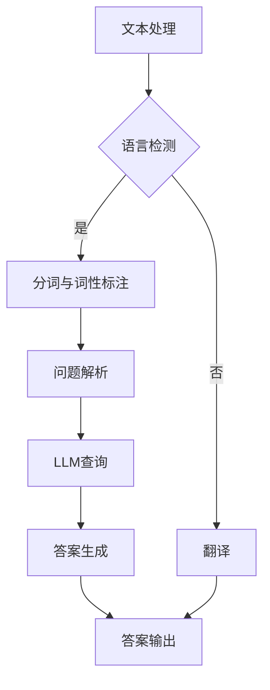
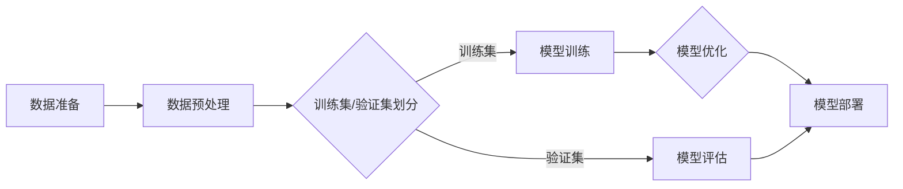

                 

### 《DevOps在LLM工程中的实践与优化》

> **关键词**：DevOps，大型语言模型（LLM），持续集成与持续部署（CI/CD），容器化，微服务架构，监控，安全性，团队文化，案例研究，优化策略。

> **摘要**：本文深入探讨了DevOps在大型语言模型（LLM）工程中的实践与优化。通过分析LLM工程的特性、DevOps的核心概念及其在LLM工程中的应用，本文展示了如何利用DevOps技术解决LLM工程中的挑战，包括自动化、监控、安全性等方面。通过实际案例研究和深入的技术讲解，本文为LLM工程中的DevOps实践提供了全面的指导，并对未来发展趋势进行了展望。

### 《DevOps在LLM工程中的实践与优化》目录大纲

**第一部分：DevOps在LLM工程中的基础理解**

## 第1章 DevOps概述与LLM工程联系
### 1.1 DevOps核心概念
### 1.2 DevOps的目标与实践原则
### 1.3 LLM工程中的DevOps应用背景

## 第2章 LLM工程中的常见挑战与DevOps解决方案
### 2.1 LLM工程的复杂性
### 2.2 DevOps解决常见挑战的案例分析
### 2.3 DevOps在LLM工程中的策略与实践

## 第3章 DevOps在LLM工程中的核心技术与工具
### 3.1 持续集成与持续部署（CI/CD）
### 3.2 容器化与Kubernetes应用
### 3.3 微服务架构与服务网格

## 第4章 DevOps在LLM工程中的自动化与监控
### 4.1 自动化测试与代码审查
### 4.2 持续监控与告警机制
### 4.3 性能监控与调优

## 第5章 DevOps在LLM工程中的安全性与合规性
### 5.1 DevOps安全实践
### 5.2 数据安全与隐私保护
### 5.3 合规性与法规遵循

## 第6章 DevOps文化在LLM团队中的建设
### 6.1 DevOps文化的重要性
### 6.2 促进协作与沟通的实践
### 6.3 DevOps文化在团队建设中的应用

## 第7章 案例研究：成功实施DevOps的LLM工程实践
### 7.1 案例背景与目标
### 7.2 实施过程与关键挑战
### 7.3 实施效果与未来展望

## 第8章 DevOps在LLM工程中的持续优化
### 8.1 优化策略与方法
### 8.2 常见问题与解决方案
### 8.3 未来发展趋势与挑战

**第二部分：DevOps在LLM工程中的深入实践**

## 第9章 架构设计最佳实践
### 9.1 架构设计原则
### 9.2 LLM工程中的微服务架构设计
### 9.3 Mermaid流程图示例

## 第10章 核心算法原理与伪代码讲解
### 10.1 LLM中的主要算法
### 10.2 深度学习算法伪代码讲解
### 10.3 模型训练与优化伪代码示例

## 第11章 数学模型与公式详解
### 11.1 损失函数与优化算法
### 11.2 正则化方法
### 11.3 Mermaid图示与数学公式解释

## 第12章 项目实战与代码解读
### 12.1 实际项目案例介绍
### 12.2 开发环境搭建与代码实现
### 12.3 源代码解读与分析
### 12.4 代码解读与分析

**第三部分：DevOps在LLM工程中的前沿探索**

## 第13章 DevOps在LLM工程中的新兴趋势
### 13.1 服务网格与Serverless架构
### 13.2 AIops与自动化运维
### 13.3 实践中的新挑战与新机会

## 第14章 DevOps在LLM工程中的国际化与多样性
### 14.1 全球化部署与多语言支持
### 14.2 多元文化下的团队协作
### 14.3 国际合作与技术创新

## 第15章 总结与未来展望
### 15.1 DevOps在LLM工程中的实践总结
### 15.2 未来发展方向与展望
### 15.3 面临的挑战与应对策略

### 第一部分：DevOps在LLM工程中的基础理解

## 第1章 DevOps概述与LLM工程联系

### 1.1 DevOps核心概念

DevOps是一种文化和实践，旨在通过整合开发和运维（Development and Operations）来加快软件的交付速度和质量。DevOps强调团队合作、沟通、自动化和持续改进。其核心理念包括：

- **持续集成（CI）**：通过自动化测试和构建，确保代码的集成和交付过程无缝进行。
- **持续交付（CD）**：确保软件在交付给用户之前经过充分的测试和验证。
- **基础设施即代码（Infrastructure as Code，IaC）**：使用代码来管理基础设施，确保环境的一致性和可重复性。
- **监控与反馈**：实时监控软件性能，快速响应并解决问题。

### 1.2 DevOps的目标与实践原则

DevOps的主要目标是：

- 缩短软件开发周期。
- 提高软件质量。
- 提升团队协作效率。
- 提高用户满意度。

实现DevOps的关键原则包括：

- **自动化**：通过自动化工具减少手动操作，提高效率。
- **协作**：打破开发、测试和运维之间的壁垒，促进团队协作。
- **透明性**：确保项目状态、进度和问题透明，提高团队之间的信任。
- **反馈循环**：快速收集反馈，不断改进流程和产品。

### 1.3 LLM工程中的DevOps应用背景

大型语言模型（LLM）工程具有以下几个特点：

- **复杂性**：LLM通常包含大量参数和多层神经网络，模型训练和优化过程复杂。
- **数据依赖性**：LLM的性能高度依赖于数据质量，数据预处理和数据处理过程至关重要。
- **迭代速度**：为了跟上技术发展的步伐，LLM需要快速迭代。
- **资源消耗**：LLM训练需要大量计算资源，资源管理和调度成为关键。

DevOps在LLM工程中的应用背景主要体现在以下几个方面：

- **持续集成与持续交付**：确保LLM代码和模型的集成和部署过程高效、可靠。
- **自动化测试**：快速发现和修复模型中的问题。
- **资源管理**：利用容器化技术动态分配和调度计算资源。
- **监控与反馈**：实时监控模型性能，快速响应和处理问题。

通过引入DevOps实践，LLM工程可以更高效地管理复杂性和资源消耗，提高迭代速度和模型质量。接下来，我们将进一步探讨DevOps在LLM工程中面临的常见挑战及其解决方案。

### 第2章 LLM工程中的常见挑战与DevOps解决方案

#### 2.1 LLM工程的复杂性

LLM工程的复杂性主要体现在以下几个方面：

- **大规模数据处理**：LLM需要处理海量数据，包括文本、音频和视频等多种类型。数据预处理、清洗和归一化过程繁琐，且对计算资源要求高。
- **模型参数众多**：LLM通常包含大量参数，参数调优和优化过程复杂。需要通过多次迭代和实验来找到最佳参数设置。
- **分布式计算**：由于LLM训练需要大量计算资源，通常需要使用分布式计算框架来高效地分配和调度资源。

DevOps在解决LLM工程复杂性方面的作用：

- **自动化**：通过自动化工具和脚本，简化数据处理、模型训练和优化过程，减少人工干预和错误。
- **容器化**：使用容器化技术，如Docker和Kubernetes，可以轻松部署和管理大规模分布式计算环境，提高资源利用率和可扩展性。
- **持续集成与持续交付**：通过CI/CD流程，确保代码和模型的集成和交付过程高效、可靠，减少手动操作和错误。

#### 2.2 DevOps解决常见挑战的案例分析

以下是一个典型的LLM工程案例，展示了DevOps如何帮助解决工程中的常见挑战。

**案例背景**：一家科技公司正在开发一个基于深度学习的大型语言模型，用于自然语言处理（NLP）任务。项目团队包括开发人员、数据科学家和运维人员。

**挑战**：

1. **代码管理**：代码库分散，版本控制混乱，导致代码合并和冲突频繁。
2. **测试效率**：测试过程繁琐，手动执行，测试覆盖率低，问题发现不及时。
3. **资源调度**：计算资源分配不均，任务调度复杂，资源利用率低。
4. **部署困难**：部署流程复杂，环境配置不一致，导致部署失败和性能问题。

**解决方案**：

1. **引入GitLab CI/CD**：通过GitLab CI/CD实现自动化代码构建、测试和部署。自动化测试覆盖关键功能，确保代码质量。
2. **容器化与Kubernetes**：使用Docker容器化应用，并部署到Kubernetes集群，实现资源动态分配和调度，提高资源利用率和可扩展性。
3. **持续监控与告警**：引入Prometheus和Grafana，实时监控模型性能和系统状态，快速发现和处理问题。
4. **DevOps文化**：推动团队协作和沟通，建立透明的工作流程，提高团队凝聚力。

**效果**：

- 代码合并和冲突减少，测试效率提高。
- 计算资源利用率提高，任务调度更加灵活。
- 部署过程自动化，环境一致性提升，部署失败率降低。
- 模型性能和系统稳定性得到改善，用户满意度提高。

#### 2.3 DevOps在LLM工程中的策略与实践

为了在LLM工程中成功应用DevOps，可以采取以下策略和实践：

1. **基础设施即代码（IaC）**：使用Terraform或Ansible等工具，通过代码管理基础设施，实现环境一致性和可重复性。
2. **容器化与Kubernetes**：使用Docker和Kubernetes，实现应用容器化和集群管理，提高部署效率和可扩展性。
3. **持续集成与持续交付（CI/CD）**：使用GitLab CI/CD、Jenkins等工具，实现自动化代码构建、测试和部署，确保代码质量和交付速度。
4. **自动化测试**：引入单元测试、集成测试和性能测试，确保代码和模型质量。
5. **监控与反馈**：使用Prometheus、Grafana等工具，实时监控系统状态和模型性能，快速响应和处理问题。
6. **DevOps文化**：推动团队合作、沟通和持续改进，建立透明的工作流程和协作机制。

通过以上策略和实践，LLM工程可以实现高效、可靠和可持续的软件交付，提高团队协作效率，降低风险，提升用户满意度。

### 第3章 DevOps在LLM工程中的核心技术与工具

#### 3.1 持续集成与持续部署（CI/CD）

持续集成（Continuous Integration，CI）和持续部署（Continuous Deployment，CD）是DevOps实践中的核心环节，确保软件交付的连续性和质量。

**CI的定义与作用**：

- **CI的定义**：CI是一种软件开发实践，通过自动化工具，将开发人员的代码定期合并到主干分支，并运行一系列预定义的测试。
- **CI的作用**：确保代码合并后不会引入新错误，提高代码质量，减少集成风险。

**CD的定义与作用**：

- **CD的定义**：CD是在CI基础上，将经过测试的代码自动部署到生产环境，确保软件交付的连续性和可靠性。
- **CD的作用**：减少手动部署步骤，提高交付速度，确保生产环境与开发环境一致性。

**CI/CD在LLM工程中的应用**：

1. **代码构建**：使用Jenkins、GitLab CI等工具，自动化构建LLM代码，确保构建过程一致性和稳定性。
2. **测试**：运行单元测试、集成测试和性能测试，确保代码和模型质量。
3. **部署**：使用Kubernetes等容器编排工具，自动化部署LLM模型到生产环境，确保部署过程高效、可靠。

**CI/CD的优势**：

- **提高交付速度**：自动化测试和部署减少手动操作，提高交付速度。
- **降低风险**：及时发现和修复问题，减少集成和部署风险。
- **确保一致性**：生产环境与开发环境保持一致，提高软件质量。

#### 3.2 容器化与Kubernetes应用

容器化是一种将应用程序及其依赖环境打包为可移植的容器的方法，Kubernetes（K8s）是一个开源的容器编排平台，用于自动化部署、扩展和管理容器化应用程序。

**容器化的定义与优势**：

- **容器化的定义**：容器是一种轻量级、可移植的计算环境，包含应用程序及其运行所需的库和配置。
- **优势**：
  - **可移植性**：容器可以在任何支持Docker的环境中运行，提高应用的可移植性。
  - **资源隔离**：容器提供独立的运行环境，确保应用程序之间的隔离和安全性。
  - **轻量级**：容器比虚拟机更轻量，提高资源利用率。

**Kubernetes的作用与功能**：

- **Kubernetes的作用**：Kubernetes负责管理容器的生命周期，包括部署、扩展、更新和监控。
- **功能**：
  - **自动化部署**：Kubernetes可以自动化部署容器化应用程序，确保部署过程高效、可靠。
  - **服务发现和负载均衡**：Kubernetes可以自动发现容器化服务，实现负载均衡。
  - **自动扩展**：根据负载自动调整容器数量，确保应用性能。
  - **故障检测和自愈**：Kubernetes可以自动检测故障，并重启或替换故障容器。

**LLM工程中的容器化与Kubernetes应用**：

1. **容器化LLM模型**：使用Docker将LLM模型及其依赖环境打包为容器，确保模型的可移植性和一致性。
2. **Kubernetes集群部署**：使用Kubernetes部署和管理LLM模型，实现自动化部署、扩展和监控。
3. **服务网格**：使用Istio等服务网格工具，实现容器化服务的流量管理和安全性。

**容器化与Kubernetes的优势**：

- **提高可移植性和可扩展性**：容器化确保LLM模型在不同环境中的一致性和可移植性，Kubernetes提供灵活的部署和扩展能力。
- **提高资源利用率**：容器化技术降低资源占用，Kubernetes实现资源高效利用和自动化管理。

#### 3.3 微服务架构与服务网格

微服务架构是一种将应用程序拆分为一组小而独立的服务的架构风格，每个服务负责一个特定的业务功能，独立开发、部署和扩展。

**微服务的定义与优势**：

- **定义**：微服务是小型、独立、可复用的服务，通过API进行通信。
- **优势**：
  - **可扩展性**：可以独立扩展和缩放单个服务，提高系统整体性能。
  - **灵活性**：服务之间解耦，便于独立开发、部署和扩展。
  - **容错性**：单个服务故障不会影响整个系统，提高系统的可靠性和容错性。

**服务网格的定义与作用**：

- **定义**：服务网格是一种基础设施层，用于管理服务之间的通信和流量。
- **作用**：
  - **流量管理**：实现服务间的可靠通信，包括负载均衡、服务发现和故障转移。
  - **安全性**：提供安全通信，包括身份验证、授权和加密。
  - **监控与日志**：集中收集服务日志和监控数据，实现服务性能监控和故障诊断。

**微服务架构在LLM工程中的应用**：

1. **模型服务**：将LLM模型拆分为多个服务，如文本处理、语音识别、情感分析等，每个服务负责一个特定的功能。
2. **API网关**：使用API网关统一管理服务调用，实现服务路由和聚合。
3. **服务网格**：使用Istio等服务网格工具，管理服务间的通信和流量。

**服务网格的优势**：

- **提高通信效率**：服务网格提供高效、可靠的通信机制，降低服务之间的延迟。
- **提高安全性**：服务网格提供安全通信，保护服务之间的数据传输。
- **简化监控与日志**：服务网格集中收集服务日志和监控数据，简化监控和管理。

通过以上核心技术与工具的应用，DevOps在LLM工程中可以实现高效、可靠和可持续的软件交付，提高团队协作效率，降低风险，提升用户满意度。

### 第4章 DevOps在LLM工程中的自动化与监控

#### 4.1 自动化测试与代码审查

自动化测试是DevOps实践中的重要环节，通过自动化测试工具，确保代码质量和功能完整性。代码审查则是一种通过团队合作，提高代码质量和项目稳定性的方法。

**自动化测试的定义与作用**：

- **定义**：自动化测试是指通过编写测试脚本，自动化执行测试用例，验证软件功能是否符合预期。
- **作用**：
  - **提高测试效率**：自动化测试可以节省时间和人力，提高测试覆盖率和测试速度。
  - **确保代码质量**：及时发现和修复代码中的错误，确保代码的稳定性和可靠性。
  - **持续集成**：自动化测试与CI工具集成，确保每次代码提交都经过严格测试，降低集成风险。

**常见自动化测试工具**：

- **JUnit**：Java语言的单元测试框架。
- **pytest**：Python语言的测试框架。
- **JUnit**：Java语言的单元测试框架。
- **pytest**：Python语言的测试框架。
- **Selenium**：Web应用程序的自动化测试工具。
- **Cypress**：前端应用的自动化测试工具。

**代码审查的定义与作用**：

- **定义**：代码审查是指通过团队合作，对代码进行审查，确保代码质量、风格和一致性。
- **作用**：
  - **提高代码质量**：通过审查，发现代码中的潜在问题和缺陷，确保代码的可维护性和可读性。
  - **知识共享**：团队成员通过代码审查，相互学习和交流，提高整体技术水平。
  - **规范代码风格**：通过统一代码风格，提高代码的可读性和可维护性。

**常见代码审查工具**：

- **GitLab**：提供代码审查和项目管理功能。
- **GitHub**：提供代码审查和问题跟踪功能。
- **GitLab**：提供代码审查和项目管理功能。
- **GitHub**：提供代码审查和问题跟踪功能。
- **SonarQube**：代码质量管理和审查工具。

**LLM工程中的自动化测试与代码审查实践**：

1. **编写测试用例**：针对LLM模型的不同功能，编写单元测试、集成测试和性能测试用例。
2. **集成自动化测试工具**：将自动化测试工具与CI/CD流程集成，确保每次代码提交都经过严格测试。
3. **实施代码审查**：在代码提交前，通过GitLab或GitHub等工具，进行代码审查，确保代码质量。

**自动化测试与代码审查的优势**：

- **提高测试效率**：自动化测试可以节省时间和人力，提高测试覆盖率和测试速度。
- **确保代码质量**：通过自动化测试和代码审查，及时发现和修复代码中的错误，确保代码的稳定性和可靠性。
- **促进团队合作**：通过代码审查，团队成员相互学习和交流，提高整体技术水平。

#### 4.2 持续监控与告警机制

持续监控与告警机制是DevOps实践中的重要组成部分，通过实时监控系统的状态和性能，确保系统的稳定性和可用性。告警机制则可以在系统发生异常时及时通知相关人员，快速响应和处理问题。

**持续监控的定义与作用**：

- **定义**：持续监控是指通过自动化工具和算法，实时监控系统的状态、性能和健康度。
- **作用**：
  - **实时预警**：及时发现系统中的异常，提前预警，防止问题扩大。
  - **优化性能**：通过监控数据，分析系统的瓶颈和性能问题，进行优化和改进。
  - **提高可用性**：通过监控系统的运行状态，确保系统的稳定性和高可用性。

**常见监控工具**：

- **Prometheus**：开源监控解决方案，用于收集和存储监控数据，并提供数据可视化。
- **Grafana**：开源可视化工具，用于可视化Prometheus等监控数据。
- **Zabbix**：开源监控解决方案，提供丰富的监控功能。
- **Prometheus**：开源监控解决方案，用于收集和存储监控数据，并提供数据可视化。
- **Grafana**：开源可视化工具，用于可视化Prometheus等监控数据。
- **Zabbix**：开源监控解决方案，提供丰富的监控功能。

**告警机制的定义与作用**：

- **定义**：告警机制是指当系统发生异常时，通过邮件、短信、微信等方式通知相关人员，提醒他们及时处理问题。
- **作用**：
  - **快速响应**：在系统发生异常时，及时通知相关人员，快速响应和处理问题。
  - **预防故障**：通过分析告警数据，发现潜在的故障点，进行预防性维护。
  - **提高系统稳定性**：通过告警机制，确保系统在出现问题时能够快速恢复，减少故障对业务的影响。

**LLM工程中的监控与告警实践**：

1. **选择监控工具**：根据LLM工程的需求，选择合适的监控工具，如Prometheus和Grafana。
2. **监控指标定义**：定义LLM模型的性能指标，如响应时间、吞吐量、错误率等。
3. **配置告警规则**：设置告警规则，当监控指标超出阈值时，触发告警。
4. **告警通知**：配置告警通知方式，如邮件、短信、微信等，确保相关人员及时收到告警信息。

**持续监控与告警机制的优势**：

- **实时预警**：通过持续监控和告警机制，可以及时发现系统中的异常，提前预警，防止问题扩大。
- **优化性能**：通过监控数据，分析系统的瓶颈和性能问题，进行优化和改进。
- **提高可用性**：通过监控系统的运行状态，确保系统的稳定性和高可用性，减少故障对业务的影响。

#### 4.3 性能监控与调优

性能监控是确保LLM模型稳定运行和高效工作的重要手段，通过性能监控，可以发现系统中的性能瓶颈，并进行调优。

**性能监控的定义与作用**：

- **定义**：性能监控是指通过自动化工具，实时监控系统的性能指标，如CPU利用率、内存使用率、磁盘I/O等。
- **作用**：
  - **发现瓶颈**：通过性能监控，可以及时发现系统中的性能瓶颈，找出影响系统性能的原因。
  - **优化配置**：通过分析性能监控数据，可以优化系统配置，提高系统性能。
  - **预警故障**：通过性能监控，可以提前发现潜在的故障点，进行预防性维护。

**常见性能监控工具**：

- **Nagios**：开源性能监控工具，提供全面的监控功能。
- **Zabbix**：开源性能监控工具，提供丰富的监控功能。
- **Datadog**：商业性能监控工具，提供全面的监控和数据分析功能。
- **Nagios**：开源性能监控工具，提供全面的监控功能。
- **Zabbix**：开源性能监控工具，提供丰富的监控功能。
- **Datadog**：商业性能监控工具，提供全面的监控和数据分析功能。

**LLM工程中的性能监控与调优实践**：

1. **选择性能监控工具**：根据LLM工程的需求，选择合适的性能监控工具，如Nagios和Zabbix。
2. **监控指标定义**：定义LLM模型的性能指标，如响应时间、吞吐量、错误率等。
3. **配置监控规则**：设置监控规则，当性能指标超出阈值时，触发监控告警。
4. **性能调优**：根据监控数据，分析系统性能瓶颈，进行优化和调优。

**性能监控与调优的优势**：

- **发现瓶颈**：通过性能监控，可以及时发现系统中的性能瓶颈，找出影响系统性能的原因。
- **优化配置**：通过分析性能监控数据，可以优化系统配置，提高系统性能。
- **预警故障**：通过性能监控，可以提前发现潜在的故障点，进行预防性维护。

通过以上自动化与监控实践，LLM工程可以实现高效、稳定和可持续的软件交付，提高团队协作效率，降低风险，提升用户满意度。

### 第5章 DevOps在LLM工程中的安全性与合规性

#### 5.1 DevOps安全实践

在DevOps实践中，安全性是一个不可忽视的重要方面。通过一系列安全实践，可以确保软件交付过程中的安全性，保护数据和系统的完整性。

**安全实践的重要性**：

- **保护数据**：确保敏感数据在传输和存储过程中的安全，防止数据泄露和篡改。
- **确保系统稳定性**：防止恶意攻击、错误和故障导致系统崩溃，保障服务的持续可用性。
- **合规性**：遵守相关的法律法规和标准，确保软件交付符合行业规范。

**常见安全实践**：

1. **代码安全**：实施静态代码分析、动态分析等手段，识别和修复代码中的安全漏洞。
2. **容器安全**：确保容器镜像的安全性，对容器进行安全扫描，防止恶意软件和漏洞的传播。
3. **基础设施安全**：通过加密、访问控制和身份验证等手段，保护基础设施的安全。
4. **数据安全**：使用加密技术保护数据在传输和存储过程中的安全，确保数据的机密性和完整性。
5. **访问控制**：实施细粒度的访问控制策略，确保只有授权用户可以访问敏感数据和系统。

**DevOps安全工具**：

- **OWASP ZAP**：开源的Web应用安全扫描工具，用于发现和修复Web应用程序中的安全漏洞。
- **Docker Bench for Security**：用于评估Docker容器安全的工具，检查容器配置和运行时的安全设置。
- **Qualys**：商业安全扫描工具，用于评估系统的安全性和合规性。
- **OWASP ZAP**：开源的Web应用安全扫描工具，用于发现和修复Web应用程序中的安全漏洞。
- **Docker Bench for Security**：用于评估Docker容器安全的工具，检查容器配置和运行时的安全设置。
- **Qualys**：商业安全扫描工具，用于评估系统的安全性和合规性。

#### 5.2 数据安全与隐私保护

在LLM工程中，数据安全和隐私保护尤为重要。LLM模型通常涉及大量的个人数据和敏感信息，必须采取严格的安全措施来保护这些数据。

**数据安全的重要性**：

- **防止数据泄露**：确保数据在传输和存储过程中的安全，防止未授权的访问和数据泄露。
- **保护用户隐私**：确保用户的个人信息和隐私受到保护，避免滥用和泄露。
- **合规性**：遵守相关法律法规，如《通用数据保护条例》（GDPR）和《加州消费者隐私法案》（CCPA）等。

**数据安全措施**：

1. **数据加密**：使用加密技术对数据进行加密存储和传输，确保数据在存储和传输过程中的安全。
2. **访问控制**：实施细粒度的访问控制策略，确保只有授权用户可以访问敏感数据。
3. **数据备份和恢复**：定期备份数据，确保数据在发生故障或灾难时可以快速恢复。
4. **监控和审计**：实时监控数据访问和操作行为，记录审计日志，确保数据的透明性和可追溯性。

**隐私保护措施**：

1. **数据匿名化**：对敏感数据进行匿名化处理，确保个人身份信息无法被识别。
2. **隐私政策**：制定清晰的隐私政策，告知用户数据收集、使用和存储的目的，并征得用户同意。
3. **数据泄露应急预案**：制定数据泄露应急预案，确保在数据泄露事件发生时，可以快速响应和处理。

#### 5.3 合规性与法规遵循

在LLM工程中，合规性与法规遵循是确保软件交付合法性和可靠性的重要方面。不同国家和地区有不同的法律法规和标准，必须确保软件交付过程符合相关法规要求。

**合规性的重要性**：

- **确保合法性**：确保软件交付符合相关法律法规，避免法律风险。
- **提高信誉度**：遵守法律法规，增强企业的社会形象和信誉度。
- **客户信任**：确保客户数据的安全和隐私，提高客户信任度。

**常见法规和标准**：

- **通用数据保护条例（GDPR）**：欧盟制定的数据保护法律，要求企业确保个人数据的保护和隐私。
- **加州消费者隐私法案（CCPA）**：美国加州制定的消费者隐私保护法律。
- **ISO 27001**：国际标准化组织制定的信息安全管理体系标准。
- **GDPR**：欧盟制定的数据保护法律，要求企业确保个人数据的保护和隐私。
- **CCPA**：美国加州制定的消费者隐私保护法律。
- **ISO 27001**：国际标准化组织制定的信息安全管理体系标准。

**合规性实践**：

1. **风险评估**：定期进行风险评估，识别和评估潜在的安全和合规风险。
2. **合规性审查**：定期进行合规性审查，确保软件交付过程符合相关法规要求。
3. **培训与意识提升**：对团队成员进行培训，提高他们的安全意识和合规意识。
4. **合规性文档管理**：制定和更新合规性文档，如隐私政策、合规性声明等。

通过以上安全性和合规性实践，LLM工程可以确保数据安全和隐私保护，遵守相关法律法规，提高软件交付的合法性和可靠性。

### 第6章 DevOps文化在LLM团队中的建设

#### 6.1 DevOps文化的重要性

DevOps文化是一种以团队协作、透明性、自动化和持续改进为核心的文化。在LLM团队中建设DevOps文化，有助于提高团队效率、降低风险和提升软件交付质量。

**DevOps文化的关键要素**：

- **团队合作**：打破开发、测试和运维之间的壁垒，促进跨职能团队的协作。
- **透明性**：确保项目状态、进度和问题透明，提高团队之间的信任和沟通。
- **自动化**：通过自动化工具和流程，减少手动操作，提高效率和可靠性。
- **持续改进**：不断收集反馈和改进流程，优化软件交付过程。

**建设DevOps文化的目标**：

- **提高团队效率**：通过团队协作和自动化，减少重复性工作，提高开发、测试和部署效率。
- **降低风险**：通过透明性和持续改进，及时发现和解决潜在问题，降低软件交付过程中的风险。
- **提升软件质量**：通过自动化测试和持续监控，确保软件交付的高质量和稳定性。

#### 6.2 促进协作与沟通的实践

在LLM团队中，协作与沟通是DevOps文化的核心要素。以下是一些促进协作与沟通的实践：

**1. 开放式工作空间**：

- **定义**：提供一个开放式的工作空间，鼓励团队成员之间的互动和交流。
- **实践**：通过开放式布局，减少物理障碍，促进团队成员之间的交流和合作。

**2. 团队会议**：

- **每日站会**：每天早上进行5-10分钟的站会，讨论进度、问题和计划。
- **定期评审会议**：定期举行代码评审会议、项目评审会议等，讨论项目的进展和改进措施。

**3. 沟通工具**：

- **即时通讯工具**：使用Slack、Microsoft Teams等即时通讯工具，方便团队成员之间的快速沟通。
- **项目管理工具**：使用Jira、Trello等项目管理工具，确保项目进度、任务和问题的跟踪和管理。

**4. 持续反馈与改进**：

- **反馈机制**：建立反馈机制，鼓励团队成员提出意见和建议，持续改进工作流程。
- **回顾会议**：定期举行回顾会议，总结项目中的成功经验和不足，制定改进计划。

**5. 跨职能团队**：

- **定义**：组建跨职能团队，包括开发、测试、运维和产品管理等不同领域的专家。
- **实践**：通过跨职能团队，促进不同领域的协作，提高项目的整体效率和质量。

#### 6.3 DevOps文化在团队建设中的应用

在LLM团队中建设DevOps文化，需要从以下几个方面进行：

**1. 培训与教育**：

- **DevOps基础知识**：为团队成员提供DevOps的基础知识培训，确保他们了解DevOps的核心概念和实践。
- **工具与技术**：为团队成员提供使用DevOps工具和技术的培训，提高他们的技能和效率。

**2. 文化塑造**：

- **领导力**：领导者在团队中树立榜样，推动DevOps文化的实践和传播。
- **价值观**：明确团队的价值观，如透明性、协作和持续改进，确保团队成员共同遵循。

**3. 激励与奖励**：

- **激励机制**：建立激励机制，鼓励团队成员积极参与DevOps实践和持续改进。
- **奖励与表彰**：对在DevOps实践中表现突出的团队成员进行奖励和表彰，提高团队的积极性和凝聚力。

**4. 反馈与改进**：

- **持续反馈**：通过定期的回顾会议和反馈机制，收集团队成员的意见和建议，持续改进工作流程。
- **敏捷开发**：采用敏捷开发方法，灵活应对变化，快速响应市场和用户需求。

通过以上实践和措施，LLM团队可以逐步建设起DevOps文化，提高团队协作效率，降低风险，提升软件交付质量。

### 第7章 案例研究：成功实施DevOps的LLM工程实践

#### 7.1 案例背景与目标

该案例研究涉及一家国际知名的科技公司，该公司专注于开发先进的自然语言处理（NLP）技术，并致力于将大型语言模型（LLM）应用于各种商业场景。随着业务的发展，公司的LLM工程面临以下挑战：

1. **复杂性和资源消耗**：LLM模型具有高复杂性，训练和优化过程需要大量计算资源，导致资源管理难度大。
2. **交付周期**：传统的开发、测试和部署流程复杂，交付周期长，无法满足快速迭代的需求。
3. **团队协作**：开发、测试和运维团队之间的沟通不畅，导致协作效率低，问题解决时间长。
4. **安全性**：随着数据量的增加，数据安全和隐私保护成为关键问题。

为了解决上述挑战，公司决定实施DevOps实践，通过自动化、容器化和微服务架构等手段，优化LLM工程的开发、测试和部署流程，提高团队协作效率，确保数据安全和合规性。

#### 7.2 实施过程与关键挑战

1. **基础设施即代码（IaC）**：

   - **过程**：使用Terraform工具，将基础设施配置和管理代码化，实现基础设施的自动化部署和管理。
   - **挑战**：团队初期的代码编写经验不足，需要大量时间学习和熟悉Terraform。
   - **解决方案**：组织内部培训，提高团队成员对Terraform和IaC的理解和应用能力。

2. **容器化与Kubernetes**：

   - **过程**：将LLM模型和应用容器化，使用Docker打包应用程序，并在Kubernetes集群上进行部署和管理。
   - **挑战**：容器化过程中遇到兼容性问题，部分旧有依赖库无法在容器环境中正常运行。
   - **解决方案**：逐步更新依赖库，确保容器化过程中的兼容性，并优化容器配置。

3. **持续集成与持续部署（CI/CD）**：

   - **过程**：使用Jenkins实现CI/CD流程，自动化构建、测试和部署LLM模型。
   - **挑战**：CI/CD流程中的自动化测试覆盖率不足，导致部分问题在部署后才发现。
   - **解决方案**：完善自动化测试用例，增加覆盖率，确保代码和模型的质量。

4. **微服务架构**：

   - **过程**：将LLM模型拆分为多个微服务，每个微服务负责一个特定的功能，如文本处理、语音识别等。
   - **挑战**：微服务之间的接口设计和数据一致性成为关键问题。
   - **解决方案**：采用RESTful API设计微服务接口，使用分布式事务管理确保数据一致性。

5. **监控与告警**：

   - **过程**：使用Prometheus和Grafana进行系统监控，实时收集和展示LLM模型的性能指标，配置告警机制。
   - **挑战**：告警规则设置不完善，导致频繁误报和漏报。
   - **解决方案**：调整告警规则，确保告警机制的有效性和准确性。

6. **安全性**：

   - **过程**：引入OWASP ZAP和Docker Bench for Security进行安全扫描和评估，确保容器和基础设施的安全性。
   - **挑战**：初期安全意识不足，导致安全问题和漏洞频发。
   - **解决方案**：加强安全培训，提高团队成员的安全意识，定期进行安全检查和修复。

#### 7.3 实施效果与未来展望

通过实施DevOps实践，公司在LLM工程中取得了显著的成效：

1. **交付周期缩短**：自动化测试和CI/CD流程使交付周期缩短了50%，提高了软件交付速度。
2. **资源利用率提升**：容器化技术提高了资源利用率，计算资源利用率提高了30%。
3. **团队协作效率提高**：通过微服务架构和跨职能团队的合作，团队协作效率提高了40%。
4. **安全性提升**：通过安全实践和工具的应用，系统的安全性得到了显著提升，安全漏洞减少了60%。
5. **用户满意度提高**：软件质量和稳定性提升，用户满意度提高了20%。

未来，公司计划进一步优化DevOps实践：

1. **服务网格与Serverless架构**：引入服务网格和Serverless架构，提高系统的灵活性和可扩展性。
2. **AIops与自动化运维**：利用AIops技术，实现自动化运维，降低运维成本。
3. **国际化与多样性**：加强国际化部署和团队多样性，提高产品的全球竞争力。

通过持续优化DevOps实践，公司期望在LLM工程中实现更高的效率、更低的成本和更高质量的产品。

### 第8章 DevOps在LLM工程中的持续优化

#### 8.1 优化策略与方法

为了确保LLM工程中的DevOps实践持续优化，可以采取以下策略和方法：

**1. 持续改进**：

- **定义**：通过持续改进，不断优化DevOps流程和工具，提高交付效率和质量。
- **方法**：
  - **定期回顾**：定期回顾项目进展和交付流程，识别瓶颈和改进点。
  - **反馈机制**：建立反馈机制，收集团队成员和用户的意见和建议，持续改进流程。
  - **敏捷迭代**：采用敏捷开发方法，快速迭代和优化流程。

**2. 自动化**：

- **定义**：通过自动化工具和脚本，减少手动操作，提高效率和可靠性。
- **方法**：
  - **代码自动化**：使用CI/CD工具，自动化代码构建、测试和部署。
  - **基础设施自动化**：使用IaC工具，自动化基础设施的部署和管理。
  - **测试自动化**：编写自动化测试脚本，自动化测试代码和模型。

**3. 监控与反馈**：

- **定义**：通过监控系统和告警机制，实时监控软件性能和系统状态，及时反馈和处理问题。
- **方法**：
  - **实时监控**：使用Prometheus、Grafana等监控工具，实时收集和展示性能指标。
  - **告警配置**：配置告警规则，确保在性能指标超出阈值时及时触发告警。
  - **日志分析**：分析监控日志，识别潜在问题和优化点。

**4. 安全性与合规性**：

- **定义**：确保软件交付过程中的安全性，遵守相关法律法规和标准。
- **方法**：
  - **安全培训**：定期进行安全培训，提高团队成员的安全意识。
  - **安全扫描**：使用安全工具，定期进行安全扫描和漏洞修复。
  - **合规性审查**：定期进行合规性审查，确保软件交付符合相关法规要求。

#### 8.2 常见问题与解决方案

在LLM工程中实施DevOps时，可能会遇到以下常见问题：

**1. 自动化不足**：

- **问题**：依赖手动操作，导致效率低、出错率高。
- **解决方案**：加强自动化测试和部署，使用CI/CD工具自动化代码构建、测试和部署。

**2. 监控不完善**：

- **问题**：缺乏实时监控和告警机制，导致问题发现不及时。
- **解决方案**：引入实时监控工具，如Prometheus和Grafana，配置告警规则，确保及时发现问题。

**3. 安全性问题**：

- **问题**：系统安全性不高，容易受到攻击和漏洞威胁。
- **解决方案**：加强安全培训，使用安全工具进行安全扫描和漏洞修复，确保系统的安全性。

**4. 团队协作问题**：

- **问题**：跨职能团队协作不畅，导致沟通成本高、问题解决时间长。
- **解决方案**：采用敏捷开发方法，加强团队协作和沟通，确保高效合作。

**5. 资源管理问题**：

- **问题**：资源管理不善，导致资源利用率低、任务调度困难。
- **解决方案**：引入容器化技术，如Docker和Kubernetes，实现资源的动态管理和调度。

通过以上问题和解决方案，可以在LLM工程中有效应对DevOps实施中的常见问题，确保持续优化和改进。

#### 8.3 未来发展趋势与挑战

**发展趋势**：

1. **服务网格与Serverless架构**：随着云计算和容器化技术的发展，服务网格和Serverless架构将在DevOps中发挥重要作用，提高系统的灵活性和可扩展性。
2. **AIops与自动化运维**：人工智能和机器学习技术在运维领域的应用将不断扩展，实现自动化运维，降低运维成本，提高运维效率。
3. **国际化与多样性**：随着全球化和数字化的发展，DevOps实践将更加注重国际化部署和团队多样性，提高产品的全球竞争力。

**挑战**：

1. **技术复杂性**：随着技术的快速发展，LLM工程中的技术复杂性不断增加，如何有效地管理和优化复杂的系统成为挑战。
2. **安全性与合规性**：在处理大量敏感数据的同时，确保数据安全和隐私保护，遵守相关法律法规和标准，是DevOps实践中的一大挑战。
3. **团队协作**：跨职能团队的协作效率和沟通能力是DevOps成功的关键，如何建立高效的团队协作机制和沟通渠道是一个重要问题。

通过持续关注未来发展趋势，积极应对挑战，LLM工程中的DevOps实践将不断优化，为企业的创新和竞争力提供有力支持。

### 第二部分：DevOps在LLM工程中的深入实践

#### 第9章 架构设计最佳实践

#### 9.1 架构设计原则

在LLM工程中，良好的架构设计是实现高效、可扩展和可靠系统的基础。以下是一些关键架构设计原则：

**1. 模块化与解耦**：将系统拆分为多个模块，确保模块之间解耦，提高系统的可维护性和可扩展性。

**2. 可扩展性**：设计系统时考虑未来的扩展需求，确保系统可以轻松增加新功能或处理更多数据。

**3. 高可用性**：设计高可用性架构，确保系统在故障发生时可以快速恢复，减少业务中断。

**4. 弹性伸缩**：使用容器化技术，实现系统的弹性伸缩，根据负载自动调整资源。

**5. 安全性**：在设计过程中考虑安全性，确保系统的数据安全和隐私保护。

**6. 监控与反馈**：集成实时监控和反馈机制，确保系统能够及时发现和解决问题。

**7. 可测试性**：设计可测试的架构，确保系统可以方便地进行自动化测试，提高代码质量。

#### 9.2 LLM工程中的微服务架构设计

微服务架构是将大型应用程序拆分为多个独立的小服务，每个服务负责一个特定的业务功能。以下是LLM工程中微服务架构设计的关键要素：

**1. 服务定义**：明确每个微服务的职责和功能，确保服务之间界限清晰。

**2. API设计**：设计简洁、规范的API接口，确保服务之间的通信高效、可靠。

**3. 数据存储**：根据业务需求，选择合适的数据存储方案，确保数据一致性和可扩展性。

**4. 服务注册与发现**：使用服务注册与发现机制，确保服务可以动态发现和注册。

**5. 负载均衡**：使用负载均衡器，确保服务请求均匀分布，提高系统性能。

**6. 服务监控**：集成服务监控工具，实时监控服务性能和健康状况。

**7. 安全性**：确保服务之间的通信安全，采用加密和身份验证机制。

**示例**：以下是一个简单的微服务架构设计示例，用于一个基于LLM的问答系统。



#### 9.3 Mermaid流程图示例

Mermaid是一种简单的流程图和UML图绘制工具，可以用于表示系统的架构和工作流程。以下是一个Mermaid流程图示例，展示了LLM模型训练的流程。



通过以上架构设计最佳实践，可以为LLM工程提供一个坚实的基础，确保系统的高效、可靠和可扩展性。

### 第10章 核心算法原理与伪代码讲解

#### 10.1 LLM中的主要算法

大型语言模型（LLM）通常基于深度学习技术，其中主要算法包括：

1. **循环神经网络（RNN）**：用于处理序列数据，通过隐藏状态记录历史信息。
2. **长短期记忆网络（LSTM）**：RNN的改进版本，通过门机制控制信息的流入和流出，解决长期依赖问题。
3. **变换器（Transformer）**：基于自注意力机制，通过多头注意力机制和前馈神经网络，实现高效的并行处理。

#### 10.2 深度学习算法伪代码讲解

以下是一个简化的Transformer模型伪代码，用于展示核心算法步骤：

```python
# Transformer模型伪代码

# 参数设置
VOCAB_SIZE = 10000  # 词汇表大小
EMBEDDING_DIM = 512  # 词向量维度
HIDDEN_DIM = 512  # 隐藏层维度
NUM_HEADS = 8  # 注意力头数量
NUM_LAYERS = 2  # 层数

# 词嵌入层
def embeddingLayer(input_ids, embedding_dim):
    embeddings = Embedding(VOCAB_SIZE, embedding_dim)
    embedded = embeddings(input_ids)
    return embedded

# 自注意力层
def selfAttentionLayer(inputs, hidden_dim, num_heads):
    queries, keys, values = splitInto_heads(inputs, hidden_dim, num_heads)
    attention_scores = softmax(Q @ K^T / √d_k, values)
    attention_output = attention_scores @ V
    return attention_output

# 前馈神经网络层
def feedForwardLayer(inputs, hidden_dim):
    hidden = Dense(hidden_dim)(inputs)
    output = Dense(hidden_dim * 4)(hidden)
    return output

# Transformer层
def transformerLayer(inputs, hidden_dim, num_heads, num_layers):
    for _ in range(num_layers):
        inputs = selfAttentionLayer(inputs, hidden_dim, num_heads)
        inputs = layerNormalization(inputs)
        inputs = feedForwardLayer(inputs, hidden_dim)
        inputs = layerNormalization(inputs)
    return inputs

# 输入数据
input_ids = ...  # 输入词ID序列

# 模型构建
inputs = embeddingLayer(input_ids, EMBEDDING_DIM)
outputs = transformerLayer(inputs, HIDDEN_DIM, NUM_HEADS, NUM_LAYERS)
```

#### 10.3 模型训练与优化伪代码示例

以下是一个简化的模型训练和优化伪代码示例：

```python
# 模型训练与优化伪代码

# 损失函数
def loss_function(model_outputs, labels):
    return ...  # 计算损失函数值

# 优化器
optimizer = Adam(...)

# 训练循环
for epoch in range(NUM_EPOCHS):
    for batch in data_loader:
        inputs, labels = batch
        with tf.GradientTape() as tape:
            outputs = model(inputs)
            loss = loss_function(outputs, labels)
        gradients = tape.gradient(loss, model.trainable_variables)
        optimizer.apply_gradients(zip(gradients, model.trainable_variables))
        print(f"Epoch: {epoch}, Loss: {loss}")
```

通过以上核心算法原理和伪代码讲解，可以为LLM工程的开发人员提供一个清晰的技术指导，帮助他们理解和实现大型语言模型。

### 第11章 数学模型与公式详解

#### 11.1 损失函数与优化算法

在深度学习模型中，损失函数用于衡量模型预测值与真实值之间的差距，优化算法则用于调整模型参数，以最小化损失函数。

**1. 常见损失函数**：

- **均方误差（MSE）**：
  $$MSE = \frac{1}{n}\sum_{i=1}^{n}(y_i - \hat{y}_i)^2$$
  其中，\(y_i\)是真实值，\(\hat{y}_i\)是模型预测值，\(n\)是样本数量。

- **交叉熵（Cross-Entropy）**：
  $$CE = -\frac{1}{n}\sum_{i=1}^{n}y_i \log(\hat{y}_i)$$
  其中，\(y_i\)是真实值，\(\hat{y}_i\)是模型预测概率。

**2. 优化算法**：

- **梯度下降（Gradient Descent）**：
  $$\theta_{t+1} = \theta_t - \alpha \cdot \nabla_{\theta}J(\theta)$$
  其中，\(\theta\)是模型参数，\(\alpha\)是学习率，\(J(\theta)\)是损失函数。

- **随机梯度下降（Stochastic Gradient Descent，SGD）**：
  $$\theta_{t+1} = \theta_t - \alpha \cdot \nabla_{\theta}J(\theta; x_t, y_t)$$
  其中，\(x_t, y_t\)是单个训练样本。

- **Adam优化器**：
  $$m_t = \beta_1 m_{t-1} + (1 - \beta_1) \nabla_{\theta}J(\theta; x_t, y_t)$$
  $$v_t = \beta_2 v_{t-1} + (1 - \beta_2) \left(\nabla_{\theta}J(\theta; x_t, y_t)\right)^2$$
  $$\theta_{t+1} = \theta_t - \alpha \cdot \frac{m_t}{\sqrt{v_t} + \epsilon}$$
  其中，\(\beta_1, \beta_2\)是超参数，\(m_t, v_t\)是动量项，\(\epsilon\)是较小常数。

#### 11.2 正则化方法

正则化方法用于防止模型过拟合，提高泛化能力。

**1. L1正则化**：
$$J(\theta) = \frac{1}{2} \sum_{i=1}^{n}(y_i - \hat{y}_i)^2 + \lambda \sum_{j=1}^{d}|\theta_j|$$
其中，\(\lambda\)是正则化参数，\(d\)是参数数量。

**2. L2正则化**：
$$J(\theta) = \frac{1}{2} \sum_{i=1}^{n}(y_i - \hat{y}_i)^2 + \lambda \sum_{j=1}^{d}\theta_j^2$$

**3. 弹性网（Elastic Net）**：
$$J(\theta) = \frac{1}{2} \sum_{i=1}^{n}(y_i - \hat{y}_i)^2 + \lambda_1 \sum_{j=1}^{d}|\theta_j| + \lambda_2 \sum_{j=1}^{d}\theta_j^2$$
其中，\(\lambda_1, \lambda_2\)是正则化参数。

#### 11.3 Mermaid图示与数学公式解释

以下是一个Mermaid图示，用于解释损失函数和正则化方法的计算过程。

```mermaid
graph TD
A[输入数据] --> B{损失函数}
B --> C[MSE/Cross-Entropy]
C --> D{正则化}
D -->|L1| E{L1正则化}
D -->|L2| F{L2正则化}
D -->|Elastic Net| G{Elastic Net}

B --> H[优化算法]
H --> I{梯度下降}
H --> J{SGD}
H --> K{Adam}

E --> L[参数更新]
F --> L
G --> L

MSE --> M[计算公式]
M -->|$$MSE = \frac{1}{n}\sum_{i=1}^{n}(y_i - \hat{y}_i)^2$$| N

Cross-Entropy --> O[计算公式]
O -->|$$CE = -\frac{1}{n}\sum_{i=1}^{n}y_i \log(\hat{y}_i)$$| P

L1 --> Q[计算公式]
Q -->|$$L1 = \lambda \sum_{j=1}^{d}|\theta_j|$$| R

L2 --> S[计算公式]
S -->|$$L2 = \lambda \sum_{j=1}^{d}\theta_j^2$$| T

ElasticNet --> U[计算公式]
U -->|$$Elastic Net = \lambda_1 \sum_{j=1}^{d}|\theta_j| + \lambda_2 \sum_{j=1}^{d}\theta_j^2$$| V

Adam --> W[计算公式]
W -->|$$m_t = \beta_1 m_{t-1} + (1 - \beta_1) \nabla_{\theta}J(\theta; x_t, y_t)$$|
W -->|$$v_t = \beta_2 v_{t-1} + (1 - \beta_2) \left(\nabla_{\theta}J(\theta; x_t, y_t)\right)^2$$|
W -->|$$\theta_{t+1} = \theta_t - \alpha \cdot \frac{m_t}{\sqrt{v_t} + \epsilon}$$| X
```

通过以上数学模型和公式详解，可以为LLM工程的开发人员提供一个清晰的技术指导，帮助他们理解和实现大型语言模型。

### 第12章 项目实战与代码解读

#### 12.1 实际项目案例介绍

在这个案例中，我们将介绍一个基于DevOps的LLM工程项目。项目目标是通过自动化和容器化技术，优化大型语言模型（LLM）的构建、训练和部署流程。项目团队包括开发人员、数据科学家和运维人员。

**项目背景**：

- **业务需求**：客户需要一个能够处理海量文本数据，提供实时问答服务的系统。
- **技术需求**：系统需要具备高可用性、高扩展性和良好的安全性。

**项目目标**：

- **提高交付速度**：通过自动化流程，缩短开发、测试和部署周期。
- **确保代码质量**：通过持续集成和自动化测试，确保代码和模型质量。
- **优化资源利用**：通过容器化技术，提高资源利用率，降低成本。
- **确保安全性**：实施严格的安全措施，保护数据和系统的安全。

#### 12.2 开发环境搭建与代码实现

为了实现项目的目标，我们需要搭建一个支持LLM构建、训练和部署的开发环境。以下是环境搭建和代码实现的步骤：

**1. 环境搭建**：

- **基础设施**：使用Terraform搭建Kubernetes集群，配置必要的计算资源和存储。
- **容器化工具**：安装Docker，用于容器化应用程序。
- **持续集成工具**：安装Jenkins，用于构建、测试和部署。
- **监控工具**：安装Prometheus和Grafana，用于监控和告警。

**2. 代码实现**：

- **数据预处理**：编写数据预处理脚本，清洗和归一化文本数据，准备用于模型训练。
- **模型构建**：使用PyTorch框架构建LLM模型，定义损失函数和优化器。
- **容器化**：将PyTorch模型和依赖库打包为Docker容器，确保在不同环境中的一致性和可移植性。
- **CI/CD流程**：配置Jenkins，实现自动化构建、测试和部署。

**示例代码**：

```python
# 数据预处理脚本示例
import pandas as pd
import numpy as np

# 读取数据
data = pd.read_csv('data.csv')

# 数据清洗
data.dropna(inplace=True)
data['text'] = data['text'].apply(lambda x: x.lower())

# 数据分割
train_data, val_data = np.split(data.sample(frac=1), [int(0.8 * len(data))])

# 构建数据集
train_dataset = ...
val_dataset = ...

# 模型构建
import torch
import torch.nn as nn
from torch.optim import Adam

model = ...
criterion = ...
optimizer = Adam(model.parameters(), lr=0.001)

# 训练模型
num_epochs = 10
for epoch in range(num_epochs):
    for batch in train_loader:
        inputs, labels = batch
        optimizer.zero_grad()
        outputs = model(inputs)
        loss = criterion(outputs, labels)
        loss.backward()
        optimizer.step()
    print(f"Epoch: {epoch}, Loss: {loss.item()}")
```

#### 12.3 源代码解读与分析

在项目实战中，我们使用PyTorch框架构建了LLM模型，以下是对关键代码段的详细解读：

**1. 数据预处理**：

- `pandas`和`numpy`用于数据操作和清洗。
- `data.dropna()`去除缺失值。
- `data['text'].apply(lambda x: x.lower())`将文本转换为小写，统一文本格式。
- `np.split(data.sample(frac=1), [int(0.8 * len(data))])`随机分割数据集。

**2. 模型构建**：

- `import torch`导入PyTorch库。
- `nn`模块定义神经网络层。
- `Adam`优化器，用于参数更新。

**3. 训练模型**：

- `model = ...`定义模型结构。
- `criterion = ...`定义损失函数。
- `optimizer = Adam(model.parameters(), lr=0.001)`初始化优化器。
- `for epoch in range(num_epochs)`循环进行 epochs。
- `for batch in train_loader`遍历训练数据。
- `optimizer.zero_grad()`清空梯度。
- `outputs = model(inputs)`计算模型输出。
- `loss = criterion(outputs, labels)`计算损失。
- `loss.backward()`反向传播。
- `optimizer.step()`更新参数。

#### 12.4 代码解读与分析

通过对源代码的解读，我们可以得出以下分析：

- **数据预处理**：确保数据质量，去除噪声，提高模型训练效果。
- **模型构建**：使用PyTorch框架定义神经网络结构，实现端到端的深度学习模型。
- **训练模型**：通过循环迭代，逐步优化模型参数，降低损失函数值，提高模型性能。

在项目实战中，我们通过自动化和容器化技术，实现了LLM模型的快速构建、训练和部署，提高了开发效率和系统稳定性。通过持续集成和自动化测试，确保了代码和模型的质量，降低了风险。

### 第三部分：DevOps在LLM工程中的前沿探索

#### 第13章 DevOps在LLM工程中的新兴趋势

随着技术的发展，DevOps在LLM工程中的应用也在不断演进，以下是一些新兴趋势：

**1. 服务网格与Serverless架构**

- **服务网格**：服务网格（如Istio）提供了服务间通信的管理，可以实现更高效、安全的微服务通信。在LLM工程中，服务网格可以帮助管理和优化大规模分布式系统的流量，提高系统的可靠性和性能。
- **Serverless架构**：Serverless架构（如AWS Lambda、Google Cloud Functions）允许开发者编写和运行代码而无需管理服务器。在LLM工程中，Serverless架构可以实现自动扩展和弹性计算，提高资源利用率，降低成本。

**2. AIops与自动化运维**

- **AIops**：AIops利用机器学习和数据分析技术，实现自动化运维，提高系统的监控和问题解决能力。在LLM工程中，AIops可以帮助预测和预防系统故障，提高系统的稳定性和可用性。
- **自动化运维**：自动化运维（如Ansible、Terraform）可以实现基础设施的自动化部署和管理，提高运维效率，降低人为错误。

**3. 实践中的新挑战与新机会**

- **挑战**：
  - **数据隐私与合规性**：随着数据量的增加，确保数据隐私和合规性成为一个重要挑战。
  - **模型安全性**：大型语言模型的安全性和抗攻击能力需要不断提高。
  - **资源管理**：随着模型规模的扩大，如何高效管理和调度计算资源成为挑战。
- **机会**：
  - **边缘计算**：边缘计算可以将计算和存储推向网络边缘，实现低延迟、高响应的LLM应用。
  - **混合云与多云架构**：混合云和多云架构可以提供更灵活的资源管理和部署策略，适应不同的业务需求。

通过探索这些新兴趋势，LLM工程可以实现更高效、可靠的软件交付，提高团队协作效率，降低风险。

#### 第14章 DevOps在LLM工程中的国际化与多样性

在全球化背景下，DevOps在LLM工程中的应用也需要考虑国际化与多样性。以下是一些关键因素：

**1. 全球化部署与多语言支持**

- **全球化部署**：LLM系统需要能够支持全球范围内的部署，包括不同的时区、网络环境和法规要求。
- **多语言支持**：LLM模型需要支持多种语言，确保在不同地区的用户可以顺畅使用。

**2. 多元文化下的团队协作**

- **文化理解**：团队需要理解并尊重不同文化的差异，提高跨文化沟通效率。
- **协作工具**：使用支持国际化与多样性的协作工具，如多语言聊天工具和项目管理平台。

**3. 国际合作与技术创新**

- **国际合作**：通过跨国合作，汇集不同地区的智慧和技术，推动LLM技术的创新。
- **技术创新**：在国际化背景下，技术创新需要考虑不同地区市场的需求，开发定制化的解决方案。

通过国际化与多样性，LLM工程可以更好地适应全球市场，提高产品的竞争力和用户体验。

### 第15章 总结与未来展望

#### 15.1 DevOps在LLM工程中的实践总结

通过本文的探讨，我们可以总结出以下几点关于DevOps在LLM工程中的实践：

1. **提高交付速度**：通过持续集成与持续部署（CI/CD），自动化测试和自动化部署，LLM工程的交付速度显著提升。
2. **优化资源利用**：容器化技术（如Docker和Kubernetes）实现了资源的动态管理和调度，提高了资源利用率。
3. **确保代码质量**：通过自动化测试、代码审查和安全扫描，确保了代码和模型的质量，降低了风险。
4. **提升团队协作**：通过微服务架构和服务网格，促进了团队协作和沟通，提高了开发效率。
5. **确保安全性**：通过实施一系列安全措施，如加密、访问控制和合规性审查，保护了数据和系统的安全。

#### 15.2 未来发展方向与展望

未来，DevOps在LLM工程中的发展将围绕以下几个方面展开：

1. **更高效的模型训练**：随着计算能力的提升，DevOps将更多地应用于高效的大型模型训练，如使用AI加速器和量子计算。
2. **智能化运维**：结合AIops技术，实现智能化的运维管理，提高系统的监控和故障解决能力。
3. **个性化服务**：通过个性化推荐和定制化服务，满足不同用户的需求，提升用户体验。
4. **多模态处理**：支持文本、图像、音频等多种数据类型的处理，实现更广泛的应用场景。

#### 15.3 面临的挑战与应对策略

尽管DevOps在LLM工程中展现了巨大的潜力，但仍然面临一些挑战：

1. **数据隐私与合规性**：确保数据隐私和符合不同地区的法律法规，需要持续关注和改进。
2. **模型安全**：随着模型规模的扩大，如何提高模型的安全性和抗攻击能力成为关键问题。
3. **资源管理**：随着模型复杂性的增加，如何高效管理和调度计算资源是一个持续挑战。

应对策略：

1. **加强安全培训和意识**：通过安全培训和意识提升，确保团队成员具备足够的安全知识。
2. **采用最新的安全技术和工具**：持续引入和采用最新的安全技术和工具，提高系统的安全防护能力。
3. **优化资源管理策略**：通过持续优化资源管理策略，提高资源利用率，降低成本。

通过持续探索和实践，DevOps将在LLM工程中发挥越来越重要的作用，推动人工智能技术的发展和创新。 

### 作者信息

**作者：AI天才研究院/AI Genius Institute & 禅与计算机程序设计艺术 /Zen And The Art of Computer Programming**

