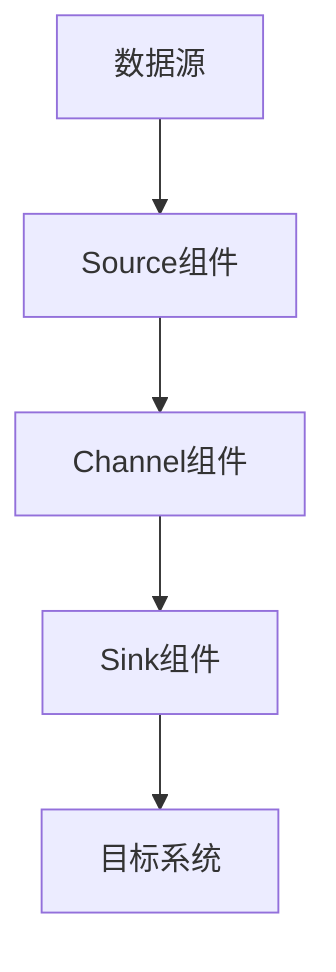
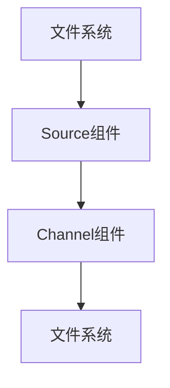
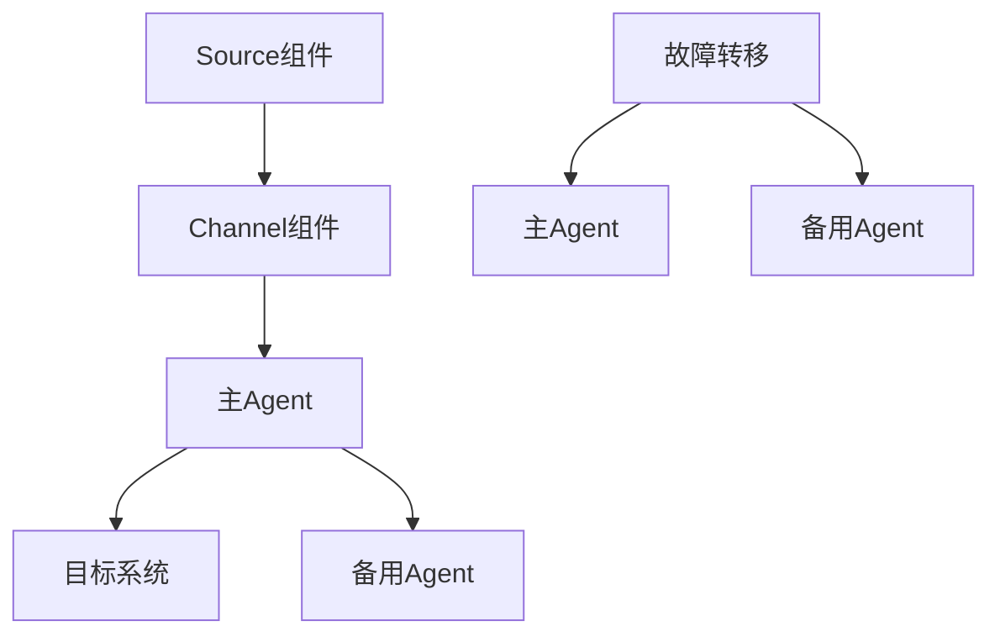

                 

# 《Flume原理与代码实例讲解》

## 关键词

Flume，大数据，数据采集，数据传输，实时数据处理，源码解析，性能优化

## 摘要

本文将深入探讨Flume的原理、架构及其在实际项目中的应用。我们将从Flume的基本概念入手，逐步分析其核心组件，包括Source、Channel和Sink，并详细讲解其配置方法。通过实际项目案例，我们将展示Flume在日志采集、数据传输和大数据处理中的应用，并结合性能优化策略，提供Flume的实用指南。最后，我们将讨论Flume的监控与管理，以及其他大数据组件的集成，以帮助读者全面理解Flume的强大功能。

# 《Flume原理与代码实例讲解》目录大纲

## 第一部分：Flume基本概念与架构

### 第1章：Flume简介

#### 1.1 Flume的起源与背景

#### 1.2 Flume的架构与核心组件

#### 1.3 Flume与其他数据采集工具的比较

### 第2章：Flume的运行原理

#### 2.1 Flume的数据流机制

#### 2.2 Flume的文件传输机制

#### 2.3 Flume的可靠性与故障转移

### 第3章：Flume的安装与配置

#### 3.1 Flume的安装准备

#### 3.2 Flume的配置文件详解

#### 3.3 Flume的启动与监控

## 第二部分：Flume核心组件与配置

### 第4章：Source配置与使用

#### 4.1 ExecutorSource配置详解

#### 4.2 FileSource配置详解

#### 4.3 HTTPSource配置详解

### 第5章：Sink配置与使用

#### 5.1 LoggerSink配置详解

#### 5.2 HDFSink配置详解

#### 5.3 KAFKAsink配置详解

### 第6章：Channel配置与使用

#### 6.1 MemoryChannel配置详解

#### 6.2 FileChannel配置详解

#### 6.3 JDBCChannel配置详解

## 第三部分：Flume项目实战

### 第7章：Flume在日志采集中的应用

#### 7.1 日志采集需求分析

#### 7.2 Flume采集日志的搭建与配置

#### 7.3 Flume采集日志的监控与优化

### 第8章：Flume在数据传输中的应用

#### 8.1 数据传输需求分析

#### 8.2 Flume传输数据的搭建与配置

#### 8.3 Flume传输数据的性能优化

### 第9章：Flume在大数据处理中的应用

#### 9.1 大数据处理需求分析

#### 9.2 Flume在大数据处理中的搭建与配置

#### 9.3 Flume在大数据处理中的性能优化

## 第四部分：Flume扩展与高级应用

### 第10章：Flume监控与管理

#### 10.1 Flume监控工具的选择

#### 10.2 Flume监控与报警机制

#### 10.3 Flume性能调优策略

### 第11章：Flume与其他大数据组件的集成

#### 11.1 Flume与Hadoop的集成

#### 11.2 Flume与Spark的集成

#### 11.3 Flume与Kafka的集成

### 第12章：Flume在实时数据流处理中的应用

#### 12.1 实时数据流处理需求分析

#### 12.2 Flume实时数据流处理的搭建与配置

#### 12.3 Flume实时数据流处理的性能优化

## 附录：Flume常用资源与工具

### 附录A：Flume官方文档与社区资源

### 附录B：Flume常用配置示例

### 附录C：Flume常见问题与解决方案

## 引言

Flume是一款由Cloudera开发的大数据采集工具，主要用于采集、聚合和移动大量日志数据。它在大数据生态系统中扮演着重要角色，能够高效地处理海量数据，为数据分析和挖掘提供可靠的数据源。Flume的设计目标是低延迟、高吞吐量和可靠性，使其在大规模数据采集场景中具有显著优势。

本文将深入探讨Flume的原理、架构及其在实际项目中的应用。我们将首先介绍Flume的基本概念和架构，然后详细分析其核心组件，包括Source、Channel和Sink。接着，我们将讲解Flume的配置方法和安装步骤，并通过实际项目案例展示Flume在日志采集、数据传输和大数据处理中的应用。最后，我们将讨论Flume的监控与管理，以及其他大数据组件的集成，帮助读者全面掌握Flume的强大功能。

## 第一部分：Flume基本概念与架构

### 第1章：Flume简介

#### 1.1 Flume的起源与背景

Flume的起源可以追溯到2007年，当时Cloudera的工程师们为了解决大数据采集的问题，开发了一款名为Flume的分布式数据采集工具。随着大数据技术的发展，Flume逐渐成为大数据生态系统中不可或缺的一部分。它的主要目标是实现低延迟、高吞吐量和可靠性的数据采集，以满足大规模数据处理的需求。

Flume的发展历程中，经历了多个版本迭代和优化。从最初的单机版到分布式版本，Flume的架构和功能不断完善，逐渐成为业界公认的数据采集利器。如今，Flume已经成为大数据采集领域的代表作品，广泛应用于各种实际场景中。

#### 1.2 Flume的架构与核心组件

Flume的架构设计遵循分布式系统原则，由多个组件组成，包括Source、Channel和Sink。这些组件协同工作，共同实现数据采集、聚合和传输的功能。

1. **Source组件**

Source是Flume的数据入口，负责从各种数据源（如日志文件、网络流、数据库等）采集数据。Source组件的主要功能包括：

- 数据采集：从数据源读取数据，并将其转换成适合传输的格式。
- 预处理：对采集到的数据进行预处理，如数据清洗、格式转换等。
- 数据存储：将预处理后的数据存储到Channel中，以便后续处理。

Flume提供了多种Source类型，包括ExecutorSource、FileSource、HTTPSource等，满足不同场景的需求。

2. **Channel组件**

Channel是Flume的临时数据缓冲区，负责存储从Source组件传递过来的数据。Channel的主要功能包括：

- 数据存储：临时存储Source组件传输过来的数据，直到Sink组件处理完毕。
- 数据持久化：将数据从内存中写入到磁盘，保证数据不会丢失。
- 数据一致性：确保数据在Channel中的存储是可靠的，避免数据丢失或重复。

Flume提供了多种Channel类型，包括MemoryChannel、FileChannel和JDBCChannel，以适应不同的应用场景。

3. **Sink组件**

Sink是Flume的数据出口，负责将Channel中的数据传输到目标系统（如HDFS、Kafka等）。Sink组件的主要功能包括：

- 数据传输：将Channel中的数据传输到目标系统，实现数据的持久化存储或进一步处理。
- 数据确认：确认数据已经成功传输到目标系统，确保数据传输的可靠性。

Flume提供了多种Sink类型，如LoggerSink、HDFSink、KAFKAsink等，支持多种目标系统。

4. **Agent组件**

Agent是Flume的工作单元，由一个或多个组件（Source、Channel和Sink）组成。Agent的主要功能包括：

- 数据采集：通过Source组件从数据源采集数据。
- 数据处理：通过Channel组件缓冲和处理数据。
- 数据传输：通过Sink组件将数据传输到目标系统。

一个典型的Flume架构包括一个或多个Agent，它们相互协作，共同完成数据采集和传输的任务。

#### 1.3 Flume与其他数据采集工具的比较

在大数据生态系统中，存在许多数据采集工具，如Kafka、Logstash和Flume等。下面我们比较Flume与其他数据采集工具的优缺点：

1. **Kafka**

Kafka是一个分布式消息队列系统，主要用于处理实时数据流。它与Flume的主要区别在于数据传输机制和目标系统：

- **数据传输机制**：Kafka采用消息队列机制，数据传输通过生产者和消费者进行。生产者将数据发送到Kafka集群，消费者从Kafka集群中读取数据。Flume则通过Source和Sink组件进行数据传输，支持多种数据源和目标系统。
- **目标系统**：Kafka主要用于消息队列和实时数据处理，可以将数据发送到Kafka集群。Flume则可以将数据发送到多种目标系统，如HDFS、HBase和Kafka等。

2. **Logstash**

Logstash是一个开源的数据收集、处理和传输工具，主要用于将数据从各种源发送到目的地。它与Flume的主要区别在于数据格式和目标系统：

- **数据格式**：Logstash支持多种数据格式，如JSON、CSV和XML等，可以自定义数据解析和处理逻辑。Flume则主要处理文本数据，数据格式相对简单。
- **目标系统**：Logstash可以将数据发送到多种目的地，如Elasticsearch、InfluxDB和Kafka等。Flume则支持多种目标系统，如HDFS、HBase和Kafka等。

3. **Flume**

Flume具有以下优点：

- **低延迟**：Flume的设计目标之一是低延迟，可以在大数据采集场景中提供高效的数据传输。
- **高吞吐量**：Flume采用分布式架构，可以处理海量数据，具有很高的吞吐量。
- **可靠性**：Flume采用数据缓冲和持久化机制，确保数据在传输过程中不会丢失。

然而，Flume也存在一些不足之处：

- **功能单一**：Flume主要用于数据采集和传输，功能相对单一，不适合复杂的数据处理场景。
- **配置复杂**：Flume的配置文件较多，对于新手来说，配置可能相对复杂。

综上所述，Flume在数据采集和传输方面具有显著优势，适合大规模数据采集场景。然而，对于需要复杂数据处理和自定义解析的场景，可能需要考虑其他数据采集工具。

### 第2章：Flume的运行原理

#### 2.1 Flume的数据流机制

Flume的数据流机制是其核心组成部分，负责数据的采集、传输和处理。以下是Flume的数据流处理流程：

1. **数据采集**：Flume的Source组件从数据源（如日志文件、网络流、数据库等）采集数据。数据采集过程包括以下步骤：

   - 数据读取：Source组件读取数据源中的数据，并将其转换为内部格式。
   - 数据预处理：对采集到的数据进行预处理，如数据清洗、格式转换等。
   - 数据存储：将预处理后的数据存储到Channel中，以便后续处理。

2. **数据传输**：Channel组件作为临时数据缓冲区，负责存储从Source组件传递过来的数据。数据传输过程包括以下步骤：

   - 数据缓冲：Channel组件存储从Source组件传递过来的数据，直到Sink组件处理完毕。
   - 数据持久化：Channel组件将数据从内存中写入到磁盘，确保数据不会丢失。
   - 数据一致性：Channel组件确保数据在存储过程中的可靠性，避免数据丢失或重复。

3. **数据处理**：Sink组件将Channel中的数据传输到目标系统（如HDFS、HBase等）。数据处理过程包括以下步骤：

   - 数据确认：Sink组件确认数据已经成功传输到目标系统，确保数据传输的可靠性。
   - 数据持久化：将数据从Channel中传输到目标系统，实现数据的持久化存储或进一步处理。

4. **数据监控**：Flume提供了丰富的监控机制，可以实时监控数据流的状态和性能。数据监控过程包括以下步骤：

   - 数据状态监控：实时监控数据采集、传输和处理的进度和状态。
   - 性能监控：监控数据流的吞吐量、延迟和错误率等性能指标。

通过上述数据流机制，Flume实现了高效、可靠的数据采集和传输。以下是一个简化的数据流流程图：



#### 2.2 Flume的文件传输机制

Flume的文件传输机制是其核心功能之一，负责将文件从数据源传输到目标系统。以下是Flume的文件传输机制：

1. **文件读取**：Flume的Source组件从文件系统中读取文件。文件读取过程包括以下步骤：

   - 文件定位：Source组件定位文件系统中的文件。
   - 文件读取：Source组件读取文件内容，并将其转换为内部格式。

2. **文件预处理**：对读取到的文件进行预处理，如数据清洗、格式转换等。预处理过程包括以下步骤：

   - 数据清洗：去除文件中的无效数据或异常数据。
   - 格式转换：将文件中的数据转换为Flume支持的内部格式。

3. **文件存储**：将预处理后的文件存储到Channel组件中，以便后续处理。文件存储过程包括以下步骤：

   - 数据存储：Channel组件存储从Source组件传递过来的文件。
   - 数据持久化：Channel组件将文件从内存中写入到磁盘，确保数据不会丢失。

4. **文件传输**：Flume的Sink组件将Channel中的文件传输到目标系统（如HDFS、HBase等）。文件传输过程包括以下步骤：

   - 文件确认：Sink组件确认文件已经成功传输到目标系统，确保数据传输的可靠性。
   - 文件持久化：将文件从Channel中传输到目标系统，实现文件的持久化存储或进一步处理。

以下是一个简化的文件传输流程图：



#### 2.3 Flume的可靠性与故障转移

Flume在设计时考虑了数据传输的可靠性和故障转移问题，以保障数据在传输过程中的安全性。以下是Flume的可靠性和故障转移机制：

1. **数据可靠性**

Flume采用数据缓冲和持久化机制，确保数据在传输过程中的可靠性。具体措施如下：

- **数据缓冲**：Channel组件作为临时数据缓冲区，存储从Source组件传递过来的数据。在数据传输过程中，Channel组件确保数据不会丢失或重复。
- **数据持久化**：Channel组件将数据从内存中写入到磁盘，确保数据在系统故障或重启时不会丢失。

2. **故障转移**

Flume支持故障转移机制，确保在系统故障时能够自动恢复数据传输。具体措施如下：

- **重试机制**：当数据传输失败时，Flume会自动重试，直到数据成功传输到目标系统。
- **故障转移**：当主Agent出现故障时，Flume会自动切换到备用Agent，继续执行数据传输任务。
- **状态监控**：Flume提供实时监控机制，可以及时发现故障并进行故障转移。

以下是一个简化的故障转移流程图：



通过上述可靠性和故障转移机制，Flume能够确保数据在传输过程中的安全性和稳定性，适用于大规模数据采集和传输场景。

### 第3章：Flume的安装与配置

#### 3.1 Flume的安装准备

在安装Flume之前，需要准备以下环境：

1. **Java环境**：Flume基于Java开发，需要安装Java运行环境。建议安装Java 8或更高版本。
2. **Hadoop环境**：Flume通常与Hadoop生态系统中的其他组件集成，因此需要安装Hadoop环境。建议安装Hadoop 2.x或更高版本。
3. **网络环境**：确保安装Flume的机器之间可以正常通信，以实现Agent之间的数据传输。

安装步骤如下：

1. **安装Java**：从Oracle官方网站下载Java安装包，并按照提示安装Java环境。安装完成后，在命令行中执行`java -version`命令，确认Java安装成功。

2. **安装Hadoop**：从Apache Hadoop官方网站下载Hadoop安装包，并解压到指定目录。配置Hadoop的环境变量，如`HADOOP_HOME`和`PATH`。配置完成后，在命令行中执行`hdfs dfs -ls`命令，确认Hadoop安装成功。

3. **安装Flume**：从Cloudera官方网站下载Flume安装包，并解压到指定目录。配置Flume的环境变量，如`FLUME_HOME`和`PATH`。配置完成后，在命令行中执行`flume-ng version`命令，确认Flume安装成功。

#### 3.2 Flume的配置文件详解

Flume的配置文件位于`FLUME_HOME/etc`目录下，主要包括以下文件：

1. **flume-env.sh**：配置Flume的环境变量，如Java环境变量、日志配置等。

```bash
# Set Flume home
export FLUME_HOME=/path/to/flume
export HADOOP_HOME=/path/to/hadoop

# Set Java environment
export JAVA_HOME=/path/to/java
export PATH=$PATH:$JAVA_HOME/bin:$FLUME_HOME/bin:$HADOOP_HOME/bin
```

2. **flume.conf**：定义Flume的Agent配置，包括Source、Channel和Sink等组件。

```bash
# Define Agent configuration
a1 {
  type master
  role master
}

# Define Source
source1 {
  type exec
  command |cat /path/to/logfile.log|
}

# Define Channel
channel1 {
  type memory
  capacity 1000
  transactionCapacity 500
}

# Define Sink
sink1 {
  type hdfs
  path /path/to/hdfs/output
  hdfs.writeformat Text
}
```

3. **flume-site.xml**：配置Flume的Hadoop依赖关系，如Hadoop配置、Flume与Hadoop的集成等。

```xml
<configuration>
  <property>
    <name>hadoop.tmp.dir</name>
    <value>/path/to/hadoop/tmp</value>
  </property>
  <property>
    <name>fs.defaultFS</name>
    <value>hdfs://namenode:9000</value>
  </property>
</configuration>
```

#### 3.3 Flume的启动与监控

1. **启动Flume**：

   ```bash
   bin/flume-ng agent -n a1 -c /path/to/conf -f /path/to/conf/flume.conf
   ```

   其中，`-n`参数指定Agent名称，`-c`参数指定配置文件目录，`-f`参数指定配置文件。

2. **监控Flume**：

   - **日志监控**：查看Flume日志文件，确认Agent的启动状态和运行情况。

     ```bash
     tail -f /path/to/logs/flume-agent-a1.log
     ```

   - **JMX监控**：通过JMX接口监控Flume的运行状态和性能指标。

     ```bash
     jmxmp://localhost:9999
     ```

   - **命令行监控**：使用Flume提供的命令行工具监控Agent的状态和性能。

     ```bash
     bin/flume-ng monitor agent -n a1
     ```

通过上述步骤，可以成功安装、配置和监控Flume。接下来，我们将深入探讨Flume的核心组件及其配置方法。

### 第二部分：Flume核心组件与配置

#### 第4章：Source配置与使用

Flume的Source组件负责从各种数据源（如日志文件、网络流、数据库等）采集数据。本章将详细讲解Flume中常用的Source类型，包括ExecutorSource、FileSource和HTTPSource，并介绍其配置方法。

#### 4.1 ExecutorSource配置详解

ExecutorSource是Flume中的一种基于命令行执行的数据源，它可以从指定的命令行执行结果中采集数据。ExecutorSource适用于需要从命令行工具或脚本中采集数据的场景。

**配置步骤：**

1. **定义ExecutorSource**：

   在`flume.conf`文件中定义ExecutorSource，例如：

   ```bash
   source1 {
     type executor
     command |cat /path/to/logfile.log|
     pollingInterval 5
   }
   ```

   其中，`command`参数指定要执行的命令行命令，`pollingInterval`参数指定命令执行的间隔时间（秒）。

2. **配置Channel**：

   ExecutorSource通常与MemoryChannel或FileChannel结合使用，例如：

   ```bash
   channel1 {
     type memory
     capacity 1000
     transactionCapacity 500
   }
   ```

3. **配置Sink**：

   将ExecutorSource配置的Channel与Sink连接，例如：

   ```bash
   sink1 {
     type hdfs
     path /path/to/hdfs/output
     hdfs.writeformat Text
   }
   ```

**示例配置：**

```bash
# ExecutorSource配置
source1 {
  type executor
  command |cat /path/to/logfile.log|
  pollingInterval 5
}

# MemoryChannel配置
channel1 {
  type memory
  capacity 1000
  transactionCapacity 500
}

# HDFSink配置
sink1 {
  type hdfs
  path /path/to/hdfs/output
  hdfs.writeformat Text
}

# Agent配置
a1 {
  type master
  role master
  sources {
    source1 {
      channels {
        c1 {
          channel1
        }
      }
      sinks {
        sink1 {
          channel1
        }
      }
    }
  }
}
```

#### 4.2 FileSource配置详解

FileSource是Flume中的一种基于文件系统的数据源，它可以从指定的文件或目录中实时采集数据。FileSource适用于需要实时监控文件变化或批量导入数据的场景。

**配置步骤：**

1. **定义FileSource**：

   在`flume.conf`文件中定义FileSource，例如：

   ```bash
   source2 {
     type file
     fileUrls [file:///path/to/logfile.log]
    监听文件目录
   }
   ```

   其中，`fileUrls`参数指定要监控的文件或目录路径，可以使用通配符（如`**/*.log`）来匹配多个文件。

2. **配置Channel**：

   FileSource通常与MemoryChannel或FileChannel结合使用，例如：

   ```bash
   channel2 {
     type memory
     capacity 1000
     transactionCapacity 500
   }
   ```

3. **配置Sink**：

   将FileSource配置的Channel与Sink连接，例如：

   ```bash
   sink2 {
     type hdfs
     path /path/to/hdfs/output
     hdfs.writeformat Text
   }
   ```

**示例配置：**

```bash
# FileSource配置
source2 {
  type file
  fileUrls [file:///path/to/logfile.log]
  monitorEnabled true
}

# MemoryChannel配置
channel2 {
  type memory
  capacity 1000
  transactionCapacity 500
}

# HDFSink配置
sink2 {
  type hdfs
  path /path/to/hdfs/output
  hdfs.writeformat Text
}

# Agent配置
a2 {
  type master
  role master
  sources {
    source2 {
      channels {
        c2 {
          channel2
        }
      }
      sinks {
        sink2 {
          channel2
        }
      }
    }
  }
}
```

#### 4.3 HTTPSource配置详解

HTTPSource是Flume中的一种基于HTTP协议的数据源，它可以从指定的HTTP服务器中实时采集数据。HTTPSource适用于需要从外部服务器采集数据的场景。

**配置步骤：**

1. **定义HTTPSource**：

   在`flume.conf`文件中定义HTTPSource，例如：

   ```bash
   source3 {
     type http
     host localhost
     port 8080
     path /path/to/logfile.log
     method GET
     pollingInterval 5
   }
   ```

   其中，`host`和`port`参数指定HTTP服务器的IP地址和端口号，`path`参数指定要采集的文件路径，`method`参数指定HTTP请求方法（如GET、POST等），`pollingInterval`参数指定HTTP请求的间隔时间（秒）。

2. **配置Channel**：

   HTTPSource通常与MemoryChannel或FileChannel结合使用，例如：

   ```bash
   channel3 {
     type memory
     capacity 1000
     transactionCapacity 500
   }
   ```

3. **配置Sink**：

   将HTTPSource配置的Channel与Sink连接，例如：

   ```bash
   sink3 {
     type hdfs
     path /path/to/hdfs/output
     hdfs.writeformat Text
   }
   ```

**示例配置：**

```bash
# HTTPSource配置
source3 {
  type http
  host localhost
  port 8080
  path /path/to/logfile.log
  method GET
  pollingInterval 5
}

# MemoryChannel配置
channel3 {
  type memory
  capacity 1000
  transactionCapacity 500
}

# HDFSink配置
sink3 {
  type hdfs
  path /path/to/hdfs/output
  hdfs.writeformat Text
}

# Agent配置
a3 {
  type master
  role master
  sources {
    source3 {
      channels {
        c3 {
          channel3
        }
      }
      sinks {
        sink3 {
          channel3
        }
      }
    }
  }
}
```

通过上述配置，可以实现对日志文件的实时监控和采集，并将数据传输到目标系统。接下来，我们将探讨Flume中的Sink组件及其配置方法。

#### 第5章：Sink配置与使用

Flume的Sink组件负责将Channel中的数据传输到目标系统，如HDFS、Kafka等。本章将详细讲解Flume中常用的Sink类型，包括LoggerSink、HDFSink和KAFKAsink，并介绍其配置方法。

#### 5.1 LoggerSink配置详解

LoggerSink是Flume中的一种简单日志输出Sink，它将Channel中的数据输出到控制台或日志文件。LoggerSink适用于需要实时查看数据或调试场景。

**配置步骤：**

1. **定义LoggerSink**：

   在`flume.conf`文件中定义LoggerSink，例如：

   ```bash
   sink1 {
     type logger
   }
   ```

2. **配置Channel**：

   LoggerSink通常与MemoryChannel或FileChannel结合使用，例如：

   ```bash
   channel1 {
     type memory
     capacity 1000
     transactionCapacity 500
   }
   ```

3. **连接Source和Sink**：

   将Source配置的Channel与Sink连接，例如：

   ```bash
   a1 {
     type master
     role master
     sources {
       source1 {
         channels {
           c1 {
             channel1
           }
         }
         sinks {
           sink1 {
             channel1
           }
         }
       }
     }
   }
   ```

**示例配置：**

```bash
# LoggerSink配置
sink1 {
  type logger
}

# MemoryChannel配置
channel1 {
  type memory
  capacity 1000
  transactionCapacity 500
}

# Agent配置
a1 {
  type master
  role master
  sources {
    source1 {
      channels {
        c1 {
          channel1
        }
      }
      sinks {
        sink1 {
          channel1
        }
      }
    }
  }
}
```

#### 5.2 HDFSink配置详解

HDFSink是Flume中的一种用于将数据写入Hadoop分布式文件系统（HDFS）的Sink。HDFSink适用于需要将数据存储在HDFS中的场景。

**配置步骤：**

1. **定义HDFSink**：

   在`flume.conf`文件中定义HDFSink，例如：

   ```bash
   sink2 {
     type hdfs
     path /path/to/hdfs/output
     hdfs.writeformat Text
   }
   ```

   其中，`path`参数指定HDFS中的输出路径，`hdfs.writeformat`参数指定数据写入格式（如Text、SequenceFile等）。

2. **配置Channel**：

   HDFSink通常与MemoryChannel或FileChannel结合使用，例如：

   ```bash
   channel2 {
     type memory
     capacity 1000
     transactionCapacity 500
   }
   ```

3. **连接Source和Sink**：

   将Source配置的Channel与Sink连接，例如：

   ```bash
   a2 {
     type master
     role master
     sources {
       source2 {
         channels {
           c2 {
             channel2
           }
         }
         sinks {
           sink2 {
             channel2
           }
         }
       }
     }
   }
   ```

**示例配置：**

```bash
# HDFSink配置
sink2 {
  type hdfs
  path /path/to/hdfs/output
  hdfs.writeformat Text
}

# MemoryChannel配置
channel2 {
  type memory
  capacity 1000
  transactionCapacity 500
}

# Agent配置
a2 {
  type master
  role master
  sources {
    source2 {
      channels {
        c2 {
          channel2
        }
      }
      sinks {
        sink2 {
          channel2
        }
      }
    }
  }
}
```

#### 5.3 KAFKAsink配置详解

KAFKAsink是Flume中的一种用于将数据写入Kafka消息队列的Sink。KAFKAsink适用于需要将数据实时传输到Kafka的场景。

**配置步骤：**

1. **定义KAFKAsink**：

   在`flume.conf`文件中定义KAFKAsink，例如：

   ```bash
   sink3 {
     type kafka
     brokers localhost:9092
     topic test
     keyField id
     formatters {
       json {
         type json
       }
     }
   }
   ```

   其中，`brokers`参数指定Kafka服务器的地址和端口号，`topic`参数指定要写入的Kafka主题，`keyField`参数指定消息中的键字段，`formatters`参数指定数据格式化器。

2. **配置Channel**：

   KAFKAsink通常与MemoryChannel或FileChannel结合使用，例如：

   ```bash
   channel3 {
     type memory
     capacity 1000
     transactionCapacity 500
   }
   ```

3. **连接Source和Sink**：

   将Source配置的Channel与Sink连接，例如：

   ```bash
   a3 {
     type master
     role master
     sources {
       source3 {
         channels {
           c3 {
             channel3
           }
         }
         sinks {
           sink3 {
             channel3
           }
         }
       }
     }
   }
   ```

**示例配置：**

```bash
# KAFKAsink配置
sink3 {
  type kafka
  brokers localhost:9092
  topic test
  keyField id
  formatters {
    json {
      type json
    }
  }
}

# MemoryChannel配置
channel3 {
  type memory
  capacity 1000
  transactionCapacity 500
}

# Agent配置
a3 {
  type master
  role master
  sources {
    source3 {
      channels {
        c3 {
          channel3
        }
      }
      sinks {
        sink3 {
          channel3
        }
      }
    }
  }
}
```

通过上述配置，可以实现对日志文件的实时监控和采集，并将数据传输到不同的目标系统。接下来，我们将探讨Flume中的Channel组件及其配置方法。

### 第6章：Channel配置与使用

Flume的Channel组件负责临时存储从Source组件传递过来的数据，并确保数据在传输过程中的可靠性。本章将详细讲解Flume中常用的Channel类型，包括MemoryChannel、FileChannel和JDBCChannel，并介绍其配置方法。

#### 6.1 MemoryChannel配置详解

MemoryChannel是一种基于内存的Channel，它适用于数据量较小且实时性要求较高的场景。MemoryChannel具有快速、高效的特点，但需要注意的是，内存Channel在系统故障或重启时可能会丢失数据。

**配置步骤：**

1. **定义MemoryChannel**：

   在`flume.conf`文件中定义MemoryChannel，例如：

   ```bash
   channel1 {
     type memory
     capacity 1000
     transactionCapacity 500
   }
   ```

   其中，`capacity`参数指定Channel的容量（数据条数），`transactionCapacity`参数指定事务处理容量（并发处理能力）。

2. **配置Source和Sink**：

   将MemoryChannel与Source和Sink连接，例如：

   ```bash
   source1 {
     type file
     fileUrls [file:///path/to/logfile.log]
   }

   sink1 {
     type hdfs
     path /path/to/hdfs/output
     hdfs.writeformat Text
   }

   a1 {
     type master
     role master
     sources {
       source1 {
         channels {
           c1 {
             channel1
           }
         }
         sinks {
           sink1 {
             channel1
           }
         }
       }
     }
   }
   ```

**示例配置：**

```bash
# MemoryChannel配置
channel1 {
  type memory
  capacity 1000
  transactionCapacity 500
}

# FileSource配置
source1 {
  type file
  fileUrls [file:///path/to/logfile.log]
}

# HDFSink配置
sink1 {
  type hdfs
  path /path/to/hdfs/output
  hdfs.writeformat Text
}

# Agent配置
a1 {
  type master
  role master
  sources {
    source1 {
      channels {
        c1 {
          channel1
        }
      }
      sinks {
        sink1 {
          channel1
        }
      }
    }
  }
}
```

#### 6.2 FileChannel配置详解

FileChannel是一种基于文件的Channel，它适用于数据量较大且需要持久化存储的场景。FileChannel具有可靠性和持久性的特点，但写入速度相对较慢。

**配置步骤：**

1. **定义FileChannel**：

   在`flume.conf`文件中定义FileChannel，例如：

   ```bash
   channel2 {
     type file
     checkpointDir /path/to/checkpoint
     dataDirs [file:///path/to/data1,file:///path/to/data2]
     capacity 1000
     transactionCapacity 500
   }
   ```

   其中，`checkpointDir`参数指定Channel的检查点目录，用于记录Channel的状态；`dataDirs`参数指定Channel的数据目录，可以指定多个目录实现负载均衡；`capacity`参数和`transactionCapacity`参数与MemoryChannel相同。

2. **配置Source和Sink**：

   将FileChannel与Source和Sink连接，例如：

   ```bash
   source2 {
     type http
     host localhost
     port 8080
     path /path/to/logfile.log
   }

   sink2 {
     type hdfs
     path /path/to/hdfs/output
     hdfs.writeformat Text
   }

   a2 {
     type master
     role master
     sources {
       source2 {
         channels {
           c2 {
             channel2
           }
         }
         sinks {
           sink2 {
             channel2
           }
         }
       }
     }
   }
   ```

**示例配置：**

```bash
# FileChannel配置
channel2 {
  type file
  checkpointDir /path/to/checkpoint
  dataDirs [file:///path/to/data1,file:///path/to/data2]
  capacity 1000
  transactionCapacity 500
}

# HTTPSource配置
source2 {
  type http
  host localhost
  port 8080
  path /path/to/logfile.log
}

# HDFSink配置
sink2 {
  type hdfs
  path /path/to/hdfs/output
  hdfs.writeformat Text
}

# Agent配置
a2 {
  type master
  role master
  sources {
    source2 {
      channels {
        c2 {
          channel2
        }
      }
      sinks {
        sink2 {
          channel2
        }
      }
    }
  }
}
```

#### 6.3 JDBCChannel配置详解

JDBCChannel是一种基于数据库的Channel，它适用于需要将数据存储到数据库中的场景。JDBCChannel具有高可靠性和持久性的特点，但需要配置数据库连接。

**配置步骤：**

1. **定义JDBCChannel**：

   在`flume.conf`文件中定义JDBCChannel，例如：

   ```bash
   channel3 {
     type jdbc
     connectionUrl jdbc:mysql://localhost:3306/flume
     username root
     password root
     table logs
     maxBatchSize 100
     batchSize 10
     connectRetryPeriod 3000
     threadCount 10
   }
   ```

   其中，`connectionUrl`参数指定数据库连接URL，`username`和`password`参数指定数据库用户名和密码，`table`参数指定要写入的数据库表名，`maxBatchSize`和`batchSize`参数分别指定最大批量和批量大小，`connectRetryPeriod`参数指定连接重试间隔时间，`threadCount`参数指定线程数量。

2. **配置Source和Sink**：

   将JDBCChannel与Source和Sink连接，例如：

   ```bash
   source3 {
     type file
     fileUrls [file:///path/to/logfile.log]
   }

   sink3 {
     type jdbc
     connectionUrl jdbc:mysql://localhost:3306/flume
     username root
     password root
     table logs
     maxBatchSize 100
     batchSize 10
     connectRetryPeriod 3000
     threadCount 10
   }

   a3 {
     type master
     role master
     sources {
       source3 {
         channels {
           c3 {
             channel3
           }
         }
         sinks {
           sink3 {
             channel3
           }
         }
       }
     }
   }
   ```

**示例配置：**

```bash
# JDBCChannel配置
channel3 {
  type jdbc
  connectionUrl jdbc:mysql://localhost:3306/flume
  username root
  password root
  table logs
  maxBatchSize 100
  batchSize 10
  connectRetryPeriod 3000
  threadCount 10
}

# FileSource配置
source3 {
  type file
  fileUrls [file:///path/to/logfile.log]
}

# JDBC

