                 

### 文章标题

**5G+AR远程手术：医疗技术的创新应用**

### 关键词

- 5G技术
- AR技术
- 远程手术
- 医疗创新
- 医疗信息化

### 摘要

本文将探讨5G与增强现实（AR）技术在远程手术中的应用，分析这两种前沿技术在提升医疗效率和精度方面的潜力。通过深入解析5G网络的低延迟、高带宽特性以及AR技术在医疗手术中的辅助作用，我们将展示如何利用5G+AR技术实现远程手术，从而突破地域限制，提供更优质的医疗服务。本文还将探讨5G+AR远程手术系统的架构、流程、关键技术，以及实际案例，展望该技术的未来发展。

### 《5G+AR远程手术：医疗技术的创新应用》目录大纲

## 第一部分: 5G与AR技术的概述

### 第1章: 5G技术基础

#### 1.1 5G技术概述

#### 1.2 5G网络架构

#### 1.3 5G关键特性

#### 1.4 5G在全球的发展趋势

### 第2章: AR技术基础

#### 2.1 AR技术概述

#### 2.2 AR技术原理

#### 2.3 AR技术应用场景

#### 2.4 AR技术发展现状与趋势

## 第二部分: 5G与AR技术在医疗领域的应用

### 第3章: 5G在远程医疗中的应用

#### 3.1 5G远程医疗的优势

#### 3.2 5G远程医疗的关键技术

#### 3.3 5G远程医疗案例分析

### 第4章: AR技术在医疗手术中的应用

#### 4.1 AR技术在手术中的应用

#### 4.2 AR技术在手术中的优势

#### 4.3 AR技术在手术中的关键技术

#### 4.4 AR技术在手术中的应用案例

### 第5章: 5G+AR远程手术技术

#### 5.1 5G+AR远程手术系统架构

#### 5.2 5G+AR远程手术的流程

#### 5.3 5G+AR远程手术的关键技术

#### 5.4 5G+AR远程手术案例分析

## 第三部分: 5G+AR远程手术实践

### 第6章: 5G网络在远程手术中的建设与优化

#### 6.1 5G网络建设

#### 6.2 5G网络优化

#### 6.3 5G网络在远程手术中的挑战与解决方案

### 第7章: AR技术在远程手术中的开发与实现

#### 7.1 AR技术在远程手术中的开发流程

#### 7.2 AR技术在远程手术中的实现方法

#### 7.3 AR技术在远程手术中的开发工具与平台

#### 7.4 AR技术在远程手术中的开发案例

### 第8章: 5G+AR远程手术系统的评估与优化

#### 8.1 5G+AR远程手术系统的评估方法

#### 8.2 5G+AR远程手术系统的优化策略

#### 8.3 5G+AR远程手术系统的未来发展趋势

## 附录

### 附录A: 5G+AR远程手术相关技术资料

#### A.1 5G技术资料

#### A.2 AR技术资料

#### A.3 远程手术相关标准与规范

#### A.4 5G+AR远程手术相关研究论文与文献

### 附录B: 5G+AR远程手术开发工具与平台

#### B.1 5G网络开发工具与平台

#### B.2 AR技术开发工具与平台

#### B.3 5G+AR远程手术系统开发工具与平台

#### B.4 开发工具与平台使用指南

### 附录C: 5G+AR远程手术系统源代码与解读

#### C.1 系统整体架构与模块设计

#### C.2 关键模块源代码解读

#### C.3 系统运行流程与性能分析

#### C.4 系统优化与性能调优策略

### 附录D: 5G+AR远程手术应用案例解析

#### D.1 案例一：某医院5G+AR远程手术系统

#### D.2 案例二：某地区5G+AR远程手术协作平台

#### D.3 案例三：5G+AR远程手术在自然灾害中的应用

#### D.4 案例四：5G+AR远程手术在教育领域的应用

#### Mermaid 流程图

```mermaid
graph TD
    A[5G技术基础] --> B[5G网络架构]
    A --> C[5G关键特性]
    A --> D[5G在全球的发展趋势]
    E[AR技术基础] --> F[AR技术原理]
    E --> G[AR技术应用场景]
    E --> H[AR技术发展现状与趋势]
    I[5G在远程医疗中的应用] --> J[5G远程医疗的优势]
    I --> K[5G远程医疗的关键技术]
    I --> L[5G远程医疗案例分析]
    M[AR技术在医疗手术中的应用] --> N[AR技术在手术中的应用]
    M --> O[AR技术在手术中的优势]
    M --> P[AR技术在手术中的关键技术]
    M --> Q[AR技术在手术中的应用案例]
    R[5G+AR远程手术技术] --> S[5G+AR远程手术系统架构]
    R --> T[5G+AR远程手术的流程]
    R --> U[5G+AR远程手术的关键技术]
    R --> V[5G+AR远程手术案例分析]
```

## 第一部分: 5G与AR技术的概述

### 第1章: 5G技术基础

#### 1.1 5G技术概述

5G，即第五代移动通信技术，是继1G、2G、3G、4G之后的新一代移动通信技术。5G技术的出现旨在解决当前移动网络在带宽、延迟、连接密度和能效等方面面临的挑战。5G技术具有以下几个关键特性：

1. **高带宽**：5G网络的理论最大下载速度可以达到20Gbps，是4G网络的100倍，这为高速数据传输和实时应用提供了可能。
2. **低延迟**：5G网络的端到端延迟可以降低到1毫秒以内，相比4G网络的20-30毫秒，大大提升了实时响应能力。
3. **大规模连接**：5G支持大规模的设备连接，包括物联网设备、智能设备和移动设备，使智能城市、智能家居等应用得以实现。
4. **能效提升**：5G在能源效率方面有显著提升，有助于减少碳排放和能源消耗。

#### 1.2 5G网络架构

5G网络架构主要由以下几部分组成：

1. **核心网（Core Network）**：5G核心网采用了全新的服务化架构（Service-Based Architecture, SBA），支持网络功能虚拟化（NFV）和分布式云架构，提高了网络的灵活性和可扩展性。
2. **无线接入网（Wireless Access Network）**：5G无线接入网包括5G基站（gNodeB）、边缘计算节点和无线电接入技术，如毫米波、Sub-6GHz等。
3. **传输网（Transport Network）**：5G传输网采用SDN（Software-Defined Networking）和NFV技术，实现了网络资源的动态分配和高效管理。

#### 1.3 5G关键特性

5G技术的关键特性包括：

1. **更高的数据传输速率**：5G网络的理论峰值速率可以达到20Gbps，是4G网络的10倍以上，这为大数据和高带宽应用提供了支持。
2. **更低的端到端延迟**：5G网络的端到端延迟可以降低到1毫秒，这使得实时应用如自动驾驶、远程手术等成为可能。
3. **更大的连接密度**：5G网络支持每平方米高达100万的连接数，适用于大规模物联网应用。
4. **更高效的能效**：5G网络在能源效率方面有显著提升，预计可降低网络能源消耗50%以上。
5. **网络切片（Network Slicing）**：5G网络切片技术可以将一个物理网络划分为多个虚拟网络，满足不同应用的需求，提高网络资源利用率。

#### 1.4 5G在全球的发展趋势

全球范围内，5G技术正在迅速发展。主要发展趋势包括：

1. **基础设施投资**：各国政府和企业正在加大对5G基础设施的投资，包括基站建设、光纤铺设等，以支持5G网络的广泛覆盖。
2. **应用场景拓展**：5G技术正在向垂直行业延伸，如智能制造、智慧城市、医疗健康等，为行业带来新的发展机遇。
3. **产业协同**：5G技术的快速发展推动了产业链上下游企业的协同创新，包括设备制造商、运营商、内容提供商等，共同推动5G应用场景的拓展。
4. **标准化推进**：5G标准化工作正在不断推进，国际标准化组织（ITU）和3GPP等机构正在制定和完善5G标准和规范，为5G技术的商业化应用提供保障。

### 第2章: AR技术基础

#### 2.1 AR技术概述

增强现实（Augmented Reality，简称AR）是一种将虚拟信息与现实世界融合的技术。AR技术通过在现实场景中叠加虚拟物体、文字、图像等信息，为用户带来更加丰富的感知体验。与虚拟现实（Virtual Reality，简称VR）不同，AR技术并不完全替代现实场景，而是在现实基础上进行增强。

#### 2.2 AR技术原理

AR技术的核心原理包括以下几个部分：

1. **图像识别**：通过摄像头捕捉现实世界的图像，并利用图像处理技术进行识别和分析。
2. **定位追踪**：利用传感器和摄像头数据，实现现实世界中的物体定位和追踪，确保虚拟信息与现实世界的准确融合。
3. **渲染显示**：将虚拟信息叠加到现实场景中，并通过显示设备（如手机屏幕、头戴显示器等）呈现给用户。

#### 2.3 AR技术应用场景

AR技术在多个领域都有广泛应用，主要包括：

1. **娱乐**：AR技术被广泛应用于游戏、影视、广告等领域，为用户带来全新的互动体验。
2. **教育**：AR技术可以为学生提供更加生动、直观的学习材料，提高教学效果。
3. **医疗**：AR技术可用于手术辅助、医学影像增强等，帮助医生更准确地诊断和治疗。
4. **工业**：AR技术可应用于工业设计、维修指导、质量控制等，提高生产效率。
5. **零售**：AR技术可用于虚拟试衣、产品展示等，提升消费者购物体验。

#### 2.4 AR技术发展现状与趋势

当前，AR技术已经取得了显著进展，并在多个应用领域取得了成功。主要发展趋势包括：

1. **硬件发展**：随着智能手机、头戴显示器等设备的性能提升，AR设备的用户体验不断优化。
2. **应用拓展**：AR技术在各个领域的应用场景不断拓展，如智能制造、智慧城市、医疗健康等。
3. **技术融合**：AR技术与其他技术的融合，如与人工智能、大数据、物联网等技术的结合，为更多创新应用提供了可能。
4. **市场规模增长**：随着AR技术的不断成熟和应用的拓展，AR市场预计将保持高速增长。

## 第二部分: 5G与AR技术在医疗领域的应用

### 第3章: 5G在远程医疗中的应用

#### 3.1 5G远程医疗的优势

5G技术在远程医疗中的应用，带来了诸多优势，具体如下：

1. **高带宽**：5G网络的带宽远高于4G，可以支持高清视频、3D影像等大流量数据的高速传输，为远程医疗提供了必要的技术基础。
2. **低延迟**：5G网络的端到端延迟显著降低，对于需要实时交互的医疗场景（如远程手术），延迟的减少至关重要。
3. **大规模连接**：5G支持大规模设备连接，能够连接更多的医疗设备和患者，提升医疗服务的覆盖范围。
4. **边缘计算**：5G网络结合边缘计算，可以实现数据的实时处理和分析，减少数据传输的延迟，提高远程医疗服务的效率。
5. **网络切片**：5G网络切片技术可以根据医疗需求分配网络资源，确保远程医疗服务的高质量和稳定性。

#### 3.2 5G远程医疗的关键技术

5G远程医疗的关键技术包括：

1. **网络传输技术**：5G网络的高带宽、低延迟特性为远程医疗提供了稳定的网络传输环境。
2. **边缘计算**：边缘计算将数据处理和分析放在网络的边缘节点，减少数据传输距离，提高处理速度。
3. **虚拟现实与增强现实（VR/AR）**：VR/AR技术在远程医疗中可用于手术指导、患者教育等，提高医疗服务的质量和患者体验。
4. **人工智能（AI）**：AI技术可以用于医学影像分析、疾病预测等，为医生提供辅助决策，提高诊断和治疗的准确性。
5. **区块链**：区块链技术可以用于医疗数据的存储和管理，确保数据的真实性和安全性。

#### 3.3 5G远程医疗案例分析

以下是一个5G远程医疗的案例：

**案例：某医院5G远程手术**

某医院利用5G网络和远程手术技术，实现了跨地域的远程手术。手术过程中，主刀医生位于A地，患者位于B地。具体流程如下：

1. **术前准备**：主刀医生和团队通过5G网络进行术前讨论，确保手术方案和步骤的准确性。
2. **手术实施**：手术过程中，主刀医生通过5G网络实时查看患者的体内情况，进行精准操作。
3. **实时监控**：手术室内安装的多个摄像头，通过5G网络实时传输手术画面，供远程团队实时监控和指导。
4. **术后护理**：手术完成后，远程团队通过5G网络进行术后护理指导，确保患者康复。

该案例展示了5G技术在远程手术中的优势，包括低延迟、高清图像传输、实时监控等，为跨地域的医疗合作提供了有效支持。

### 第4章: AR技术在医疗手术中的应用

#### 4.1 AR技术在手术中的应用

AR技术在医疗手术中的应用，主要体现在以下几个方面：

1. **手术导航**：AR技术可以将患者的医学影像（如CT、MRI）实时叠加到手术视野中，帮助医生更准确地定位和操作。
2. **实时监控**：AR技术可以实时显示患者的生命体征，如心率、血压等，方便医生随时掌握患者的状况。
3. **远程手术指导**：AR技术可以实现远程专家对手术的实时指导和干预，提高手术的精准度和安全性。
4. **手术训练**：AR技术可以为医生提供虚拟手术场景，进行手术模拟训练，提高手术技能。

#### 4.2 AR技术在手术中的优势

AR技术在手术中的优势包括：

1. **提高手术精度**：通过将医学影像与手术视野实时叠加，AR技术有助于医生更准确地定位和操作，提高手术的成功率。
2. **降低手术风险**：AR技术可以实时显示患者的生命体征，帮助医生及时发现和应对手术中的风险，降低手术风险。
3. **提高手术效率**：AR技术可以减少医生在手术中寻找手术器械和定位的时间，提高手术效率。
4. **远程协作**：AR技术可以实现远程专家的实时指导，提高医疗团队的合作效率，降低医疗资源的不均衡。

#### 4.3 AR技术在手术中的关键技术

AR技术在手术中的关键技术包括：

1. **图像融合技术**：图像融合技术可以将医学影像与手术视野实时叠加，提供清晰的手术导航信息。
2. **实时数据处理**：实时数据处理技术可以快速处理和分析手术过程中的大量数据，为医生提供实时指导。
3. **传感器技术**：传感器技术可以实时监测患者的生命体征，为医生提供准确的手术信息。
4. **交互技术**：交互技术可以实现医生与AR系统之间的实时交互，提高手术的灵活性和效率。

#### 4.4 AR技术在手术中的应用案例

以下是一个AR技术在手术中的应用案例：

**案例：某医院AR辅助手术**

某医院利用AR技术进行了一次复杂的脑部手术。手术过程中，主刀医生通过佩戴AR眼镜，实时查看患者的脑部CT影像，并根据影像进行手术操作。具体流程如下：

1. **术前准备**：医生通过CT扫描获取患者的脑部影像，并将影像数据上传到AR系统。
2. **手术实施**：医生佩戴AR眼镜，实时查看脑部影像，进行精准操作。
3. **实时监控**：手术室内安装的多个摄像头，通过AR系统实时传输手术画面，供远程专家实时监控和指导。
4. **术后评估**：手术完成后，医生通过AR系统对手术效果进行评估，并记录手术数据。

该案例展示了AR技术在手术中的优势，包括提高手术精度、降低手术风险、实时监控和远程协作等。

## 第三部分: 5G+AR远程手术技术

### 第5章: 5G+AR远程手术技术

#### 5.1 5G+AR远程手术系统架构

5G+AR远程手术系统架构主要包括以下几个关键组成部分：

1. **用户终端**：包括手术医生、患者和远程专家的设备，如手机、平板、头戴显示器等。
2. **网络传输层**：5G网络作为数据传输的载体，提供高速、低延迟的网络连接。
3. **边缘计算节点**：位于网络边缘的设备，用于处理和缓存数据，减少数据传输延迟。
4. **云计算中心**：用于存储和管理大量数据，提供AI算法和大数据分析等高级功能。
5. **操作系统**：支持系统运行的核心软件，包括操作系统、数据库、中间件等。
6. **应用层**：提供各种远程手术应用，如手术导航、实时监控、远程协作等。

#### 5.2 5G+AR远程手术的流程

5G+AR远程手术的基本流程如下：

1. **术前准备**：手术医生通过用户终端（如平板电脑或头戴显示器）进行术前准备，包括患者信息登记、手术方案制定等。
2. **患者准备**：患者进入手术室，连接必要的医疗设备和传感器，如心电图机、血压计等。
3. **手术实施**：手术医生佩戴AR眼镜，实时查看患者的医学影像和手术导航信息，进行精准操作。
4. **实时监控**：远程专家通过用户终端实时监控手术进程，提供实时指导和干预。
5. **数据记录**：手术过程中的关键数据（如影像、手术步骤等）实时上传到云计算中心，进行存储和管理。
6. **术后评估**：手术完成后，医生通过用户终端对手术效果进行评估，并记录相关数据。

#### 5.3 5G+AR远程手术的关键技术

5G+AR远程手术的关键技术包括：

1. **5G网络技术**：5G网络提供高速、低延迟的网络连接，确保手术过程中的数据传输稳定性和实时性。
2. **AR技术**：AR技术实现医学影像与手术视野的实时融合，提高手术的精度和安全性。
3. **边缘计算技术**：边缘计算技术用于处理和缓存手术过程中的数据，减少数据传输延迟。
4. **AI技术**：AI技术用于医学影像分析、疾病预测等，为医生提供辅助决策。
5. **云计算技术**：云计算技术用于存储和管理大量数据，提供高级数据分析功能。

#### 5.4 5G+AR远程手术案例分析

以下是一个5G+AR远程手术的案例：

**案例：某医院5G+AR远程手术**

某医院利用5G+AR技术进行了一次跨地域的远程手术。手术过程中，主刀医生位于A地，患者位于B地。具体流程如下：

1. **术前准备**：手术医生在A地进行术前准备，包括患者信息登记、手术方案制定等。
2. **患者准备**：患者在B地进入手术室，连接必要的医疗设备和传感器。
3. **手术实施**：主刀医生佩戴AR眼镜，实时查看患者的医学影像和手术导航信息，进行精准操作。远程专家通过5G网络实时监控手术进程，提供实时指导和干预。
4. **实时监控**：手术室内安装的多个摄像头，通过5G网络实时传输手术画面，供远程专家实时监控和指导。
5. **数据记录**：手术过程中的关键数据（如影像、手术步骤等）实时上传到云计算中心，进行存储和管理。
6. **术后评估**：手术完成后，医生通过AR眼镜对手术效果进行评估，并记录相关数据。

该案例展示了5G+AR远程手术的优势，包括跨地域手术、实时监控、远程协作等，为医疗行业带来了新的发展机遇。

### 第6章: 5G网络在远程手术中的建设与优化

#### 6.1 5G网络建设

5G网络建设是远程手术成功实施的基础，具体步骤如下：

1. **基站建设**：5G基站的建设是实现5G网络覆盖的关键。需要考虑基站位置、基站密度等因素，确保5G网络的广泛覆盖和稳定性。
2. **光纤铺设**：光纤作为5G网络的数据传输通道，需要铺设到基站、核心网等关键节点，实现高速、低延迟的数据传输。
3. **设备配置**：包括5G基站、核心网设备、用户终端等设备的采购和部署，确保5G网络的正常运行。
4. **网络优化**：对5G网络进行优化，包括信号覆盖优化、网络性能优化等，确保5G网络的稳定性和可靠性。

#### 6.2 5G网络优化

5G网络优化是提高远程手术质量的关键，具体方法如下：

1. **负载均衡**：通过负载均衡技术，合理分配网络资源，避免网络拥堵，确保远程手术的实时性和稳定性。
2. **QoS（Quality of Service）**：通过QoS技术，为远程手术提供优先级服务，确保手术数据的传输优先级高于其他非关键数据。
3. **边缘计算**：将数据处理和计算任务放置在边缘节点，减少数据传输延迟，提高远程手术的实时性和响应速度。
4. **网络监控与维护**：通过实时监控和网络维护，及时发现和解决网络故障，确保5G网络的稳定运行。

#### 6.3 5G网络在远程手术中的挑战与解决方案

5G网络在远程手术中的应用面临以下挑战：

1. **高带宽需求**：远程手术需要高速、稳定的网络连接，以满足高清视频、医学影像等大流量数据的需求。
2. **低延迟要求**：手术操作需要实时响应，低延迟是实现远程手术的关键。
3. **网络稳定性**：5G网络覆盖范围广、节点多，网络稳定性对远程手术的顺利进行至关重要。
4. **安全性**：远程手术涉及到患者的敏感信息，数据安全是5G网络在远程手术中的关键挑战。

针对以上挑战，以下是一些解决方案：

1. **优化网络架构**：通过优化5G网络架构，提高网络的稳定性和性能。
2. **采用边缘计算**：将数据处理和计算任务放置在边缘节点，减少数据传输延迟。
3. **提高带宽**：通过增加网络带宽，满足远程手术的高带宽需求。
4. **加密技术**：采用加密技术，确保远程手术中的数据安全。

### 第7章: AR技术在远程手术中的开发与实现

#### 7.1 AR技术在远程手术中的开发流程

AR技术在远程手术中的开发流程主要包括以下几个阶段：

1. **需求分析**：明确远程手术中AR技术的应用场景和需求，如手术导航、实时监控、远程协作等。
2. **系统设计**：根据需求分析结果，设计AR系统的整体架构，包括用户界面、数据处理、网络通信等模块。
3. **算法实现**：开发AR技术的核心算法，如图像识别、定位追踪、渲染显示等。
4. **系统集成**：将各个模块进行集成，确保系统功能的完整性。
5. **测试与优化**：对AR系统进行功能测试、性能测试和安全测试，确保系统的稳定性和可靠性。

#### 7.2 AR技术在远程手术中的实现方法

AR技术在远程手术中的实现方法主要包括以下几方面：

1. **图像识别**：通过摄像头捕捉现实世界的图像，利用图像处理技术进行识别和分析，获取手术环境中的关键信息。
2. **定位追踪**：利用传感器和摄像头数据，实现手术环境中的物体定位和追踪，确保AR信息的准确叠加。
3. **渲染显示**：将虚拟信息（如医学影像、导航信息等）叠加到现实场景中，通过显示设备呈现给用户。
4. **实时交互**：实现用户与AR系统的实时交互，如手术操作、远程指导等。

#### 7.3 AR技术在远程手术中的开发工具与平台

AR技术在远程手术中的开发工具与平台主要包括以下几类：

1. **开发工具**：如Unity、Unreal Engine等游戏引擎，用于开发AR应用程序。
2. **图像处理库**：如OpenCV、Dlib等，用于图像识别和处理。
3. **定位追踪库**：如ARCore、ARKit等，用于实现AR技术的定位追踪功能。
4. **AR平台**：如Google Glass、Microsoft HoloLens等，用于实现AR技术的实际应用。

#### 7.4 AR技术在远程手术中的开发案例

以下是一个AR技术在远程手术中的开发案例：

**案例：某医院AR远程手术系统开发**

某医院开发了一套AR远程手术系统，用于跨地域的远程手术。系统功能包括手术导航、实时监控、远程协作等。开发过程如下：

1. **需求分析**：明确远程手术中AR技术的应用场景和需求，如手术导航、实时监控、远程协作等。
2. **系统设计**：设计AR系统的整体架构，包括用户界面、数据处理、网络通信等模块。
3. **算法实现**：开发图像识别、定位追踪、渲染显示等核心算法。
4. **系统集成**：将各个模块进行集成，确保系统功能的完整性。
5. **测试与优化**：对系统进行功能测试、性能测试和安全测试，确保系统的稳定性和可靠性。

开发过程中，使用了Unity游戏引擎进行应用程序开发，OpenCV进行图像处理，ARCore进行定位追踪和渲染显示。系统实现了实时图像传输、手术导航、远程协作等功能，为远程手术提供了有效支持。

### 第8章: 5G+AR远程手术系统的评估与优化

#### 8.1 5G+AR远程手术系统的评估方法

5G+AR远程手术系统的评估方法主要包括以下几个方面：

1. **功能评估**：评估系统是否具备预期的功能，如手术导航、实时监控、远程协作等。
2. **性能评估**：评估系统的性能指标，如网络延迟、图像清晰度、响应速度等。
3. **稳定性评估**：评估系统在长时间运行中的稳定性，如无故障运行时间、故障率等。
4. **安全性评估**：评估系统在数据传输、存储和访问过程中的安全性，如数据加密、访问控制等。
5. **用户体验评估**：评估用户在使用系统过程中的体验，如操作便捷性、界面友好性等。

#### 8.2 5G+AR远程手术系统的优化策略

5G+AR远程手术系统的优化策略主要包括以下几个方面：

1. **网络优化**：通过优化5G网络架构，提高网络带宽、降低延迟，确保系统的稳定运行。
2. **算法优化**：优化图像处理、定位追踪等核心算法，提高系统的实时性和准确性。
3. **硬件升级**：升级用户终端和服务器硬件设备，提高系统的处理能力和稳定性。
4. **安全性提升**：加强数据加密、访问控制等安全措施，确保系统的数据安全。
5. **用户体验改进**：优化用户界面、操作流程等，提高用户的操作便捷性和体验。

#### 8.3 5G+AR远程手术系统的未来发展趋势

5G+AR远程手术系统的发展趋势主要包括以下几个方面：

1. **技术融合**：5G、AR、AI等技术的融合，将推动远程手术系统的不断创新和优化。
2. **应用拓展**：远程手术系统将在更多医疗场景中得到应用，如跨地域手术、远程医疗培训等。
3. **标准化推进**：5G+AR远程手术系统的标准化工作将逐步推进，为系统的商业化应用提供支持。
4. **普及推广**：随着技术的成熟和成本的降低，5G+AR远程手术系统将在全球范围内得到普及推广。

### 附录A: 5G+AR远程手术相关技术资料

#### A.1 5G技术资料

- **5G标准与规范**：3GPP发布的5G标准，包括NR（新无线电）和NG-RAN（新无线接入网）。
- **5G网络架构**：5G网络的架构，包括核心网、无线接入网和传输网。
- **5G关键技术**：5G的关键技术，如网络切片、边缘计算、毫米波等。
- **5G设备与器件**：5G基站、天线、射频器件等设备与器件的技术资料。

#### A.2 AR技术资料

- **AR技术原理**：AR技术的基本原理，包括图像识别、定位追踪、渲染显示等。
- **AR硬件设备**：常见的AR硬件设备，如Google Glass、Microsoft HoloLens等。
- **AR软件开发**：AR软件开发的工具与平台，如Unity、Unreal Engine等。
- **AR应用案例**：AR技术在各个领域的应用案例，如娱乐、教育、医疗等。

#### A.3 远程手术相关标准与规范

- **远程手术标准**：国内外远程手术的相关标准与规范，包括手术流程、质量控制等。
- **医疗信息化标准**：医疗信息化领域的技术标准，如电子病历、医学影像存储与传输等。
- **网络安全标准**：远程手术中涉及的数据安全与隐私保护标准，如数据加密、访问控制等。

#### A.4 5G+AR远程手术相关研究论文与文献

- **5G在远程医疗中的应用研究**：5G技术在远程医疗中的研究论文，包括网络架构、关键技术等。
- **AR技术在医疗手术中的应用研究**：AR技术在医疗手术中的研究论文，包括应用场景、关键技术等。
- **5G+AR远程手术系统的设计与实现**：关于5G+AR远程手术系统的设计与实现的研究论文。
- **5G+AR远程手术的评估与优化**：关于5G+AR远程手术系统的评估与优化策略的研究论文。

### 附录B: 5G+AR远程手术开发工具与平台

#### B.1 5G网络开发工具与平台

- **5G网络仿真平台**：如NS3、Mininet等，用于模拟5G网络环境和进行网络性能测试。
- **5G协议栈开发工具**：如OPNET、NS3等，用于开发5G网络协议栈。
- **5G边缘计算平台**：如EdgeX Foundry、OpenFog等，用于构建5G边缘计算架构。

#### B.2 AR技术开发工具与平台

- **AR开发工具**：如Unity、Unreal Engine等，用于开发AR应用程序。
- **AR图像处理库**：如OpenCV、Dlib等，用于图像识别和处理。
- **AR定位追踪库**：如ARCore、ARKit等，用于实现AR技术的定位追踪功能。

#### B.3 5G+AR远程手术系统开发工具与平台

- **5G+AR开发框架**：如ARCore for Surgery、ARKit for Surgery等，用于构建5G+AR远程手术系统。
- **远程手术仿真平台**：如SimOS、SimVascular等，用于模拟远程手术场景和进行性能测试。
- **远程手术开发工具套件**：如Remote Surgery SDK、AR Surgery Kit等，提供5G+AR远程手术开发的工具与组件。

#### B.4 开发工具与平台使用指南

- **5G网络开发指南**：介绍5G网络仿真平台和协议栈开发工具的使用方法。
- **AR技术开发指南**：介绍AR开发工具、图像处理库和定位追踪库的使用方法。
- **5G+AR远程手术开发指南**：介绍5G+AR远程手术系统开发工具与平台的使用方法，包括系统架构、功能模块、开发流程等。

### 附录C: 5G+AR远程手术系统源代码与解读

#### C.1 系统整体架构与模块设计

- **系统架构图**：展示5G+AR远程手术系统的整体架构和模块设计。
- **模块功能说明**：对系统中的各个模块进行详细的功能说明，包括用户终端模块、网络传输模块、边缘计算模块、云计算模块等。

#### C.2 关键模块源代码解读

- **用户终端模块**：介绍用户终端模块的源代码实现，包括摄像头捕获、图像处理、AR渲染等。
- **网络传输模块**：介绍网络传输模块的源代码实现，包括5G网络通信、数据加密等。
- **边缘计算模块**：介绍边缘计算模块的源代码实现，包括数据预处理、特征提取、实时处理等。
- **云计算模块**：介绍云计算模块的源代码实现，包括数据存储、管理、分析等。

#### C.3 系统运行流程与性能分析

- **系统运行流程**：详细描述5G+AR远程手术系统的运行流程，包括术前准备、手术实施、实时监控、术后评估等。
- **性能分析**：对系统的主要性能指标进行分析，如网络延迟、图像清晰度、响应速度等，并提供实验数据和结果。

#### C.4 系统优化与性能调优策略

- **系统优化策略**：介绍系统优化的方法与策略，包括网络优化、算法优化、硬件升级等。
- **性能调优案例**：通过具体案例，展示系统性能调优的方法和效果，如网络带宽调整、边缘计算优化等。

### 附录D: 5G+AR远程手术应用案例解析

#### D.1 案例一：某医院5G+AR远程手术系统

- **案例背景**：介绍某医院5G+AR远程手术系统的背景和应用场景。
- **系统架构**：展示系统架构图，介绍系统的主要模块和功能。
- **实施过程**：详细描述系统的实施过程，包括设备采购、网络建设、系统调试等。
- **效果评估**：评估系统在实际应用中的效果，包括手术成功率、患者满意度、医生反馈等。

#### D.2 案例二：某地区5G+AR远程手术协作平台

- **案例背景**：介绍某地区5G+AR远程手术协作平台的背景和应用场景。
- **系统架构**：展示系统架构图，介绍系统的主要模块和功能。
- **实施过程**：详细描述系统的实施过程，包括网络建设、平台搭建、培训推广等。
- **效果评估**：评估系统在实际应用中的效果，包括手术成功率、患者满意度、医生反馈等。

#### D.3 案例三：5G+AR远程手术在自然灾害中的应用

- **案例背景**：介绍5G+AR远程手术在自然灾害中的应用场景。
- **系统架构**：展示系统架构图，介绍系统的主要模块和功能。
- **实施过程**：详细描述系统的实施过程，包括设备采购、网络建设、手术实施等。
- **效果评估**：评估系统在自然灾害中的应用效果，包括手术成功率、患者满意度、救援效率等。

#### D.4 案例四：5G+AR远程手术在教育领域的应用

- **案例背景**：介绍5G+AR远程手术在教育领域的应用场景。
- **系统架构**：展示系统架构图，介绍系统的主要模块和功能。
- **实施过程**：详细描述系统的实施过程，包括设备采购、网络建设、手术教学等。
- **效果评估**：评估系统在教育领域的应用效果，包括教学效果、学生满意度、教师反馈等。

## 附录E: 5G+AR远程手术相关文献综述

#### E.1 5G技术在远程医疗中的应用

- **文献综述**：概述5G技术在远程医疗中的应用现状和发展趋势，包括网络架构、关键技术、应用案例等。
- **参考文献**：引用相关的5G远程医疗研究论文和技术报告。

#### E.2 AR技术在医疗手术中的应用

- **文献综述**：概述AR技术在医疗手术中的应用现状和发展趋势，包括手术导航、实时监控、远程协作等。
- **参考文献**：引用相关的AR医疗手术研究论文和技术报告。

#### E.3 5G+AR远程手术系统的研究与发展

- **文献综述**：概述5G+AR远程手术系统的研发现状和关键技术，包括系统架构、开发工具、优化策略等。
- **参考文献**：引用相关的5G+AR远程手术系统研究论文和技术报告。

## 附录F: 5G+AR远程手术系统的安全性分析

#### F.1 数据安全

- **数据加密技术**：介绍数据加密技术在5G+AR远程手术系统中的应用，包括数据传输加密、数据存储加密等。
- **数据隐私保护**：介绍数据隐私保护技术在5G+AR远程手术系统中的应用，包括匿名化处理、隐私保护算法等。

#### F.2 网络安全

- **网络安全协议**：介绍网络安全协议在5G+AR远程手术系统中的应用，包括TLS、IPSec等。
- **网络攻击防范**：介绍网络攻击防范技术在5G+AR远程手术系统中的应用，包括入侵检测、防火墙等。

#### F.3 系统安全

- **系统安全设计**：介绍5G+AR远程手术系统的安全设计，包括用户认证、访问控制、审计等。
- **系统安全测试**：介绍系统安全测试的方法和工具，包括渗透测试、漏洞扫描等。

## 附录G: 5G+AR远程手术系统的国际化发展

#### G.1 国际合作

- **国际项目合作**：介绍5G+AR远程手术系统的国际合作项目，包括跨国合作、技术共享等。
- **国际标准制定**：介绍5G+AR远程手术系统在国际标准制定中的参与和贡献。

#### G.2 国际市场拓展

- **国际市场现状**：概述5G+AR远程手术系统在国际市场的现状和发展趋势。
- **国际市场策略**：介绍5G+AR远程手术系统的国际市场拓展策略，包括市场调研、合作伙伴建设等。

## 附录H: 5G+AR远程手术系统的法律与伦理问题

#### H.1 法律问题

- **隐私保护法律**：介绍隐私保护法律在5G+AR远程手术系统中的应用，包括数据收集、存储、使用等。
- **医疗责任法律**：介绍医疗责任法律在5G+AR远程手术系统中的应用，包括医生责任、医院责任等。

#### H.2 伦理问题

- **伦理原则**：介绍5G+AR远程手术系统涉及的伦理原则，包括医学伦理、患者权益等。
- **伦理审查**：介绍5G+AR远程手术系统的伦理审查程序，包括研究伦理审查、临床伦理审查等。

## 附录I: 5G+AR远程手术系统的可持续发展

#### I.1 可持续发展原则

- **环保原则**：介绍5G+AR远程手术系统的环保原则，包括节能、减排等。
- **社会责任**：介绍5G+AR远程手术系统在社会责任方面的实践，包括公益项目、慈善捐赠等。

#### I.2 可持续发展策略

- **技术创新**：介绍5G+AR远程手术系统的技术创新策略，包括研发投入、人才培养等。
- **产业链合作**：介绍5G+AR远程手术系统的产业链合作策略，包括上下游企业合作、国际合作等。

## 附录J: 5G+AR远程手术系统的用户手册

#### J.1 系统安装与配置

- **系统安装**：介绍5G+AR远程手术系统的安装步骤，包括硬件安装、软件安装等。
- **系统配置**：介绍5G+AR远程手术系统的配置方法，包括网络配置、用户权限配置等。

#### J.2 系统使用指南

- **用户操作**：介绍5G+AR远程手术系统的用户操作流程，包括术前准备、手术实施、术后评估等。
- **功能模块**：介绍5G+AR远程手术系统的主要功能模块，包括手术导航、实时监控、远程协作等。

#### J.3 常见问题解答

- **系统问题**：解答5G+AR远程手术系统常见的技术问题，包括网络连接故障、设备故障等。
- **用户问题**：解答用户在使用5G+AR远程手术系统过程中遇到的问题，包括操作不便、系统故障等。

## 附录K: 5G+AR远程手术系统的技术培训资料

#### K.1 技术培训课程

- **课程内容**：介绍5G+AR远程手术系统的技术培训课程，包括系统架构、关键技术、开发工具等。
- **培训形式**：介绍5G+AR远程手术系统技术培训的形式，包括线上培训、线下培训等。

#### K.2 培训资料

- **培训手册**：提供5G+AR远程手术系统的培训手册，包括课程内容、操作指南、常见问题解答等。
- **教学视频**：提供5G+AR远程手术系统的教学视频，包括系统演示、操作流程、案例分析等。

## 附录L: 5G+AR远程手术系统的营销与推广策略

#### L.1 市场调研

- **市场分析**：进行5G+AR远程手术系统的市场调研，分析市场需求、竞争状况等。
- **目标客户**：确定5G+AR远程手术系统的目标客户群体，包括医院、诊所、医疗机构等。

#### L.2 营销策略

- **产品定位**：明确5G+AR远程手术系统的产品定位，包括高端市场、中端市场等。
- **推广渠道**：选择5G+AR远程手术系统的推广渠道，包括线上推广、线下推广等。

#### L.3 推广活动

- **宣传活动**：组织5G+AR远程手术系统的宣传活动，包括产品发布会、研讨会、展销会等。
- **合作推广**：与相关企业、机构合作，共同推广5G+AR远程手术系统。

## 附录M: 5G+AR远程手术系统的未来研究方向

#### M.1 技术创新

- **前沿技术**：探讨5G+AR远程手术系统的未来研究方向，包括量子通信、人工智能等。
- **技术研发**：介绍未来5G+AR远程手术系统的技术研发计划，包括关键技术突破、产品升级等。

#### M.2 应用拓展

- **新应用场景**：探讨5G+AR远程手术系统在新应用场景中的应用，如自然灾害救援、远程医疗培训等。
- **行业合作**：介绍5G+AR远程手术系统在与其他行业合作的可能性和发展方向。

## 附录N: 5G+AR远程手术系统的环境影响评估

#### N.1 环境影响分析

- **资源消耗**：分析5G+AR远程手术系统在建设、运营过程中的资源消耗，包括能源、材料等。
- **环境影响**：评估5G+AR远程手术系统对环境的影响，包括碳排放、噪音污染等。

#### N.2 环境保护措施

- **节能减排**：介绍5G+AR远程手术系统在节能减排方面的措施，包括节能设计、绿色运营等。
- **环保法规遵循**：确保5G+AR远程手术系统符合环保法规，包括排放标准、废物处理等。

## 附录O: 5G+AR远程手术系统的社会责任报告

#### O.1 社会责任概述

- **社会责任理念**：阐述5G+AR远程手术系统的社会责任理念，包括企业社会责任、公益慈善等。
- **社会责任实践**：介绍5G+AR远程手术系统在履行社会责任方面的具体实践，包括公益活动、员工福利等。

#### O.2 社会责任评估

- **社会责任评估指标**：设定5G+AR远程手术系统的社会责任评估指标，包括社会责任绩效、公众满意度等。
- **社会责任评估结果**：展示5G+AR远程手术系统的社会责任评估结果，包括年度报告、评估报告等。

## 附录P: 5G+AR远程手术系统的质量管理体系

#### P.1 质量管理概述

- **质量管理理念**：阐述5G+AR远程手术系统的质量管理理念，包括质量第一、持续改进等。
- **质量管理组织**：介绍5G+AR远程手术系统的质量管理组织，包括质量管理团队、质量监督部门等。

#### P.2 质量管理流程

- **质量管理体系**：介绍5G+AR远程手术系统的质量管理体系，包括质量计划、质量控制、质量改进等。
- **质量管理工具**：介绍5G+AR远程手术系统常用的质量管理工具，如PDCA循环、SPC控制图等。

## 附录Q: 5G+AR远程手术系统的专利与知识产权保护

#### Q.1 专利保护

- **专利申请**：介绍5G+AR远程手术系统的专利申请情况，包括专利类型、专利数量等。
- **专利维护**：介绍5G+AR远程手术系统的专利维护措施，包括专利申请、专利维权等。

#### Q.2 知识产权保护

- **版权保护**：介绍5G+AR远程手术系统的版权保护情况，包括软件版权、文档版权等。
- **商标保护**：介绍5G+AR远程手术系统的商标保护情况，包括商标注册、商标维权等。

## 附录R: 5G+AR远程手术系统的行业报告

#### R.1 行业概述

- **行业现状**：概述5G+AR远程手术系统行业的现状，包括市场规模、竞争状况等。
- **行业趋势**：分析5G+AR远程手术系统行业的发展趋势，包括技术进步、市场前景等。

#### R.2 行业分析

- **市场分析**：分析5G+AR远程手术系统市场的供需状况、价格走势等。
- **竞争分析**：分析5G+AR远程手术系统行业的竞争格局、竞争对手分析等。

## 附录S: 5G+AR远程手术系统的市场调研报告

#### S.1 调研目的与方法

- **调研目的**：明确5G+AR远程手术系统市场调研的目的。
- **调研方法**：介绍市场调研的方法和工具，如问卷调查、深度访谈、数据收集与分析等。

#### S.2 市场需求分析

- **市场需求**：分析5G+AR远程手术系统的市场需求，包括用户需求、行业需求等。
- **市场趋势**：分析5G+AR远程手术系统的市场趋势，包括技术发展、政策支持等。

#### S.3 市场竞争分析

- **竞争对手**：分析5G+AR远程手术系统的竞争对手，包括国内外主要厂商、产品特点等。
- **竞争策略**：评估5G+AR远程手术系统的竞争策略，包括产品定位、市场推广等。

## 附录T: 5G+AR远程手术系统的培训教材

#### T.1 培训课程设计

- **课程目标**：明确5G+AR远程手术系统培训课程的目标。
- **课程内容**：介绍5G+AR远程手术系统培训课程的主要内容，包括基础理论、实际操作等。

#### T.2 培训教材编写

- **教材编写**：介绍5G+AR远程手术系统培训教材的编写过程，包括内容结构、编写标准等。
- **教材内容**：展示5G+AR远程手术系统培训教材的主要内容，包括理论讲解、案例分析等。

## 附录U: 5G+AR远程手术系统的用户体验调查

#### U.1 调查目的与方法

- **调查目的**：明确5G+AR远程手术系统用户体验调查的目的。
- **调查方法**：介绍用户体验调查的方法和工具，如问卷调查、访谈、数据分析等。

#### U.2 用户体验分析

- **用户反馈**：收集并分析用户对5G+AR远程手术系统的反馈意见，包括使用体验、满意度等。
- **优化建议**：根据用户反馈，提出优化5G+AR远程手术系统的建议，包括界面优化、功能改进等。

## 附录V: 5G+AR远程手术系统的风险管理

#### V.1 风险识别

- **风险识别**：识别5G+AR远程手术系统中可能存在的风险，包括技术风险、市场风险、运营风险等。

#### V.2 风险评估

- **风险评估**：评估5G+AR远程手术系统中各风险的概率和影响，确定风险等级。

#### V.3 风险应对

- **风险应对**：制定5G+AR远程手术系统的风险应对策略，包括风险预防、风险应急等。

## 附录W: 5G+AR远程手术系统的项目计划书

#### W.1 项目概述

- **项目背景**：介绍5G+AR远程手术系统的项目背景和目的。
- **项目目标**：明确5G+AR远程手术系统的项目目标，包括技术目标、市场目标等。

#### W.2 项目计划

- **项目计划**：制定5G+AR远程手术系统的项目计划，包括项目阶段、时间节点、资源分配等。

#### W.3 项目预算

- **项目预算**：制定5G+AR远程手术系统的项目预算，包括人力成本、设备成本、运营成本等。

#### W.4 项目评估

- **项目评估**：制定5G+AR远程手术系统的项目评估指标和方法，包括进度评估、质量评估、成本评估等。

## 附录X: 5G+AR远程手术系统的案例研究

#### X.1 案例背景

- **案例背景**：介绍5G+AR远程手术系统的案例背景，包括应用场景、项目目标等。

#### X.2 案例实施

- **案例实施**：详细描述5G+AR远程手术系统的案例实施过程，包括设备采购、网络建设、系统调试等。

#### X.3 案例效果

- **案例效果**：评估5G+AR远程手术系统案例的实施效果，包括手术成功率、患者满意度、医生反馈等。

## 附录Y: 5G+AR远程手术系统的社会责任实践

#### Y.1 公益活动

- **公益活动**：介绍5G+AR远程手术系统参与的社会公益活动，包括医疗援助、教育支持等。

#### Y.2 慈善捐赠

- **慈善捐赠**：介绍5G+AR远程手术系统在慈善捐赠方面的实践，包括资金捐赠、物资捐赠等。

#### Y.3 社会责任报告

- **社会责任报告**：展示5G+AR远程手术系统的社会责任报告，包括社会责任绩效、社会影响力等。

## 附录Z: 5G+AR远程手术系统的国际标准与认证

#### Z.1 国际标准

- **国际标准**：介绍5G+AR远程手术系统遵循的国际标准，包括ISO、IEC等。

#### Z.2 认证与认证过程

- **认证**：介绍5G+AR远程手术系统的认证过程，包括认证申请、认证评估、认证证书等。

#### Z.3 认证优势

- **认证优势**：分析5G+AR远程手术系统通过国际认证的优势，包括市场竞争力、客户信任等。

### 致谢

在此，我要感谢AI天才研究院和禅与计算机程序设计艺术的团队，他们在研究和写作过程中提供了宝贵的指导和支持。特别感谢我的合作者，他们与我一起投入了大量的时间和精力，确保本文能够为读者提供有价值的信息。感谢所有对本文提供反馈和建议的朋友们，你们的意见对我们改进文章内容起到了重要作用。最后，感谢读者们的耐心阅读，期待与您在未来的技术交流中再次相遇。

**作者：AI天才研究院/AI Genius Institute & 禅与计算机程序设计艺术 /Zen And The Art of Computer Programming**

