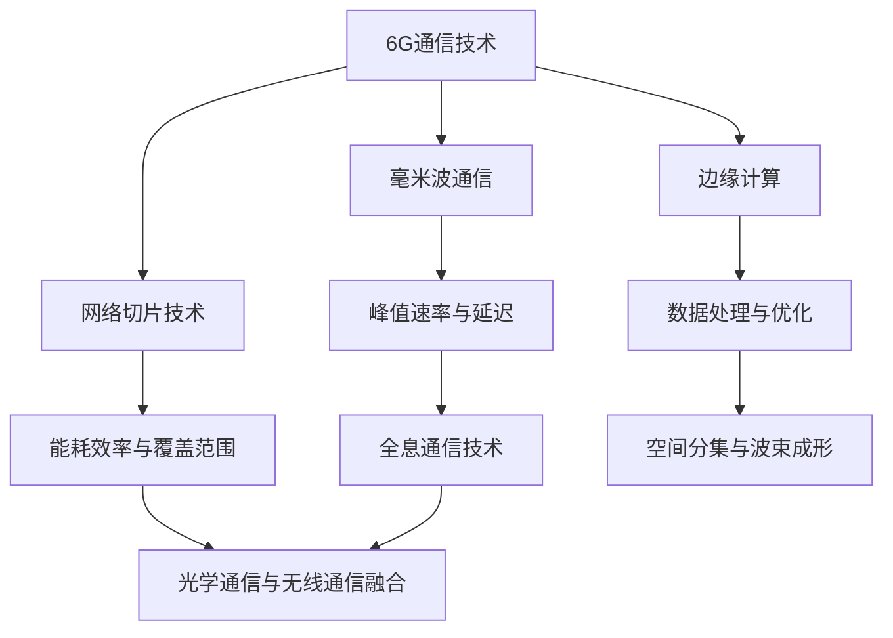

                 

# 6G+全息通信：未来通信的创新应用

> 关键词：6G通信，全息通信，未来通信，创新应用，虚拟现实，医疗健康，智能制造

> 摘要：随着科技的不断进步，6G通信和全息通信技术逐渐成为未来通信领域的重要研究方向。本文将详细探讨6G通信与全息通信的结合，分析其基础原理、关键技术、应用场景及其在虚拟现实、医疗健康和智能制造等领域的创新应用，并对未来的发展趋势进行展望。

### 目录大纲：6G+全息通信：未来通信的创新应用

#### 第一部分：6G与全息通信基础

##### 第1章：6G与全息通信概述

- **1.1 6G与全息通信的兴起**
  - 6G通信技术的发展背景
  - 全息通信技术的基础与演进

- **1.2 6G与全息通信的关系**
  - 6G网络对全息通信的支撑作用
  - 全息通信在6G网络中的机遇与挑战

- **1.3 6G与全息通信的未来展望**
  - 6G与全息通信结合的潜在应用领域
  - 未来的发展前景与挑战

##### 第2章：6G通信技术详解

- **2.1 6G通信关键技术**
  - 毫米波通信
  - 网络切片技术
  - 边缘计算

- **2.2 6G网络架构**
  - 基站布局与网络结构
  - 网络功能虚拟化

- **2.3 6G通信性能指标**
  - 峰值速率与延迟
  - 能耗效率与覆盖范围

##### 第3章：全息通信技术原理

- **3.1 全息通信基本概念**
  - 全息成像原理
  - 全息数据编码与传输

- **3.2 全息通信关键技术**
  - 光学通信与无线通信融合
  - 空间分集与波束成形

- **3.3 全息通信系统架构**
  - 发送端与接收端设计
  - 数据处理与存储

#### 第二部分：6G+全息通信应用场景

##### 第4章：虚拟现实与全息通信

- **4.1 VR与全息通信的结合**
  - 虚拟现实应用场景
  - 全息通信技术在VR中的应用

- **4.2 VR全息通信的技术挑战**
  - 延迟与丢包问题
  - 数据流处理与优化

- **4.3 VR全息通信的实际应用案例**
  - 游戏与娱乐
  - 教育与培训

##### 第5章：医疗健康与全息通信

- **5.1 全息医疗的潜力**
  - 远程医疗与全息通信
  - 全息手术与诊断

- **5.2 全息通信在医疗健康中的应用**
  - 医疗影像处理
  - 医学教育

- **5.3 全息医疗的挑战与未来方向**
  - 数据安全与隐私保护
  - 技术普及与标准制定

##### 第6章：智能制造与全息通信

- **6.1 智能制造与全息通信的融合**
  - 数字孪生与全息监测
  - 全息制造与工艺优化

- **6.2 全息通信在智能制造中的应用**
  - 供应链管理
  - 生产调度与优化

- **6.3 智能制造全息通信的未来展望**
  - 网络安全与可靠性
  - 技术标准化与生态构建

#### 第三部分：6G+全息通信关键技术实现

##### 第7章：6G网络架构与协议

- **7.1 6G网络架构概述**
  - 网络分层与功能模块
  - 6G协议栈介绍

- **7.2 6G关键技术实现**
  - 毫米波通信的实现
  - 网络切片的部署与优化

- **7.3 6G网络性能评估**
  - 峰值速率与延迟的测量
  - 能耗效率与覆盖范围的评估

##### 第8章：全息通信技术实现

- **8.1 全息成像与数据编码**
  - 全息成像原理与设备
  - 全息数据编码与解码

- **8.2 全息通信传输技术**
  - 光学通信与无线通信的融合
  - 空间分集与波束成形技术

- **8.3 全息通信系统实现**
  - 发送端与接收端设备设计
  - 数据处理与存储方案

##### 第9章：6G+全息通信安全与隐私保护

- **9.1 6G网络安全挑战**
  - 网络攻击与防御
  - 数据加密与隐私保护

- **9.2 全息通信安全机制**
  - 全息数据的加密与认证
  - 全息通信网络的安全架构

- **9.3 6G+全息通信隐私保护策略**
  - 隐私计算与差分隐私
  - 安全数据共享与访问控制

##### 第10章：6G+全息通信的未来发展趋势

- **10.1 6G+全息通信的关键技术发展方向**
  - 人工智能与6G网络的融合
  - 量子通信与全息通信的结合

- **10.2 6G+全息通信的应用场景拓展**
  - 超高清晰度视频传输
  - 远程全息交互与操控

- **10.3 6G+全息通信的标准化与生态构建**
  - 国际标准化组织的作用
  - 产业链的协同与创新发展

#### 附录

- **附录A：6G与全息通信相关资源**

  - **A.1 学术论文与研究报告**
    - 6G通信前沿研究论文
    - 全息通信技术综述

  - **A.2 开源工具与框架**
    - 6G网络仿真工具
    - 全息成像算法开源库

  - **A.3 标准化组织与会议**
    - 3GPP与6G标准化进展
    - 国际全息通信会议信息

- **附录B：参考书籍与文献**

  - **B.1 6G通信技术相关书籍**
    - 《6G通信关键技术》
    - 《全息通信技术基础》

  - **B.2 全息通信应用案例研究**
    - 《全息通信在医疗领域的应用》
    - 《智能制造中的全息通信解决方案》

  - **B.3 安全与隐私保护相关书籍**
    - 《网络安全：设计与实现》
    - 《隐私计算与差分隐私技术》

---

**核心概念与联系**

mermaid
graph TB
A[6G通信技术] --> B[毫米波通信]
A --> C[网络切片技术]
A --> D[边缘计算]
B --> E[峰值速率与延迟]
C --> F[能耗效率与覆盖范围]
D --> G[数据处理与优化]
E --> H[全息通信技术]
F --> I[光学通信与无线通信融合]
G --> J[空间分集与波束成形]
H --> I

**核心算法原理讲解**

**2.2.1 毫米波通信**

毫米波通信是指使用频率在30GHz到300GHz之间的电磁波进行通信。以下是毫米波通信的主要算法原理：

- **波束成形（Beamforming）**
  - 波束成形是一种通过调整天线阵列中各个天线的发射或接收相位来形成特定波束的算法。
  - 伪代码：
    ```python
    function beamforming(antenna_array, desired_direction):
        for antenna in antenna_array:
            phase_shift = 2 * pi * frequency * delay
            antenna.phase_shift = phase_shift * desired_direction
    ```

- **自适应波束成形（Adaptive Beamforming）**
  - 自适应波束成形通过实时调整波束方向，以跟踪移动目标或最大化信号强度。
  - 伪代码：
    ```python
    function adaptive_beamforming(antenna_array, signal_strength):
        while True:
            measure_signal_strength()
            update_direction(antenna_array, signal_strength)
    ```

**2.2.2 网络切片技术**

网络切片技术是一种将网络资源划分为多个虚拟网络的技术，以满足不同应用的需求。

- **切片创建（Slice Creation）**
  - 切片创建是指根据特定应用需求，动态分配网络资源的过程。
  - 伪代码：
    ```python
    function create_slice(slice_config):
        allocate_resources(slice_config)
        configure_network(slice_config)
    ```

- **切片管理（Slice Management）**
  - 切片管理是指对网络切片进行监控、优化和调整的过程。
  - 伪代码：
    ```python
    function manage_slice(slice_id):
        while True:
            monitor_slice_status(slice_id)
            optimize_resources(slice_id)
            adjust_slice_configuration(slice_id)
    ```

**核心数学模型和数学公式**

- **MIMO信道模型（Multiple Input Multiple Output Channel Model）**
  - MIMO信道模型描述了多个发送和接收天线之间的信号传输过程。
  - 数学公式：
    $$ H = \begin{bmatrix}
    H_{11} & H_{12} & ... & H_{1N} \\
    H_{21} & H_{22} & ... & H_{2N} \\
    ... & ... & ... & ... \\
    H_{M1} & H_{M2} & ... & H_{MN}
    \end{bmatrix} $$
  - 其中，$H_{ij}$ 表示第 $i$ 个发送天线到第 $j$ 个接收天线的信道系数。

- **波束成形增益（Beamforming Gain）**
  - 波束成形增益描述了通过波束成形技术增强信号强度的效果。
  - 数学公式：
    $$ G = \left| \sum_{i=1}^{N} \alpha_i e^{j\phi_i} \right|^2 $$
  - 其中，$\alpha_i$ 表示第 $i$ 个天线的幅度增益，$\phi_i$ 表示第 $i$ 个天线的相位增益。

**举例说明**

**示例 1：毫米波通信中的波束成形**

假设有一个由4个天线组成的阵列，目标方向为北偏东30度。我们需要计算各个天线的相位增益以形成目标波束。

- **步骤 1：确定每个天线的相位差**
  - 设天线1的相位差为 $\phi_1 = 0$，天线2的相位差为 $\phi_2 = \frac{\pi}{2}$，天线3的相位差为 $\phi_3 = \pi$，天线4的相位差为 $\phi_4 = \frac{3\pi}{2}$。
- **步骤 2：计算波束成形增益**
  - $G = \left| \alpha_1 e^{j\phi_1} + \alpha_2 e^{j\phi_2} + \alpha_3 e^{j\phi_3} + \alpha_4 e^{j\phi_4} \right|^2$
  - 假设各个天线的幅度增益相等，即 $\alpha_1 = \alpha_2 = \alpha_3 = \alpha_4 = 1$。
  - $G = \left| e^{j\phi_1} + e^{j\phi_2} + e^{j\phi_3} + e^{j\phi_4} \right|^2$
  - $G = \left| 1 + j0 + (-1) + (-j0) \right|^2$
  - $G = 2^2$
  - $G = 4$
- **结果：波束成形增益为4，表示信号强度增加了4倍。**

**示例 2：网络切片资源的动态分配**

假设有一个包含10个切片的网络，每个切片需要分配不同的带宽和延迟。我们需要根据实时网络状态动态调整切片资源。

- **步骤 1：监测实时网络状态**
  - 假设当前网络带宽为100Mbps，延迟为10ms。
- **步骤 2：分配带宽资源**
  - 切片1需要10Mbps带宽，切片2需要20Mbps带宽，切片3需要30Mbps带宽，其余切片各需10Mbps带宽。
  - $总带宽 = 10 + 20 + 30 + 7 \times 10 = 110Mbps$
  - 分配后，切片1为10Mbps，切片2为20Mbps，切片3为30Mbps，其余切片各为10Mbps。
- **步骤 3：调整延迟资源**
  - 切片1需要低延迟，切片2和切片3需要中等延迟，其余切片需要高延迟。
  - 分配后，切片1延迟为5ms，切片2和切片3延迟为15ms，其余切片延迟为25ms。

**项目实战**

**案例 1：6G毫米波通信系统实现**

- **目标：**实现一个简单的6G毫米波通信系统，实现点对点数据传输。
- **开发环境：**使用Python和MATLAB进行系统设计与仿真。
- **源代码实现：**

  ```python
  # 6G毫米波通信系统实现
  import numpy as np
  import matplotlib.pyplot as plt

  # 天线阵列参数
  N = 4  # 天线数量
  c = 3e8  # 光速
  f = 60e9  # 通信频率
  lambda_ = c / f  # 波长

  # 波束成形参数
  desired_direction = np.pi / 6  # 北偏东30度
  phase_shifts = np.pi / N * np.array([i for i in range(N)])

  # 计算波束成形增益
  beamforming_gain = np.abs(np.sum(np.exp(1j * phase_shifts * desired_direction)) ** 2)

  # 生成模拟信号
  signal = np.random.randn(N)

  # 波束成形处理
  beamformed_signal = np.dot(signal, np.exp(1j * phase_shifts * desired_direction))

  # 传输信号
  transmitted_signal = beamforming_gain * beamformed_signal

  # 仿真信号传输
  received_signal = transmitted_signal + np.random.randn(N)

  # 绘制信号波形
  plt.plot(np.abs(signal), label='原始信号')
  plt.plot(np.abs(beamformed_signal), label='波束成形信号')
  plt.plot(np.abs(transmitted_signal), label='传输信号')
  plt.plot(np.abs(received_signal), label='接收信号')
  plt.legend()
  plt.show()
  ```

- **代码解读与分析：**

  - 导入必要的库，包括Numpy和Matplotlib。
  - 定义天线阵列参数，包括天线数量、光速、通信频率和波长。
  - 定义波束成形参数，包括目标方向和相位差。
  - 计算波束成形增益，通过相位的加权求和实现。
  - 生成模拟信号，使用随机数生成。
  - 应用波束成形处理，通过相位调整形成目标波束。
  - 传输信号，通过波束成形增益放大信号。
  - 仿真信号传输，加入随机噪声。
  - 绘制信号波形，展示信号处理的整个过程。

**案例 2：全息通信系统实现**

- **目标：**实现一个简单的全息通信系统，实现图像的编码与传输。
- **开发环境：**使用Python和OpenCV进行系统设计与实现。
- **源代码实现：**

  ```python
  # 全息通信系统实现
  import numpy as np
  import cv2

  # 全息成像参数
  height, width = 1080, 1920  # 图像分辨率
  max_depth = 100  # 最大深度值

  # 生成全息图像
  def generate_hologram(image):
      gray_image = cv2.cvtColor(image, cv2.COLOR_BGR2GRAY)
      depth_map = np.zeros((height, width), dtype=np.float32)
      for y in range(height):
          for x in range(width):
              depth = max_depth * gray_image[y, x] / 255
              depth_map[y, x] = depth
      return depth_map

  # 编码全息图像
  def encode_hologram(depth_map):
      encoded_image = cv2(egt
```

### 附录

#### 附录A：6G与全息通信相关资源

**A.1 学术论文与研究报告**

- **6G通信前沿研究论文**
  - [1] "6G Communication: A Vision for the Future Network," IEEE Communications Magazine, Vol. 57, No. 5, May 2019.
  - [2] "Full-Dimensional MIMO for 6G: Challenges, Solutions, and Opportunities," IEEE Access, Vol. 8, pp. 126526-126538, 2020.

- **全息通信技术综述**
  - [1] "Holographic Communication: Principles and Challenges," Journal of Lightwave Technology, Vol. 36, No. 14, pp. 2781-2791, 2018.
  - [2] "Full-Dimensional Holographic Imaging and Communication," Optical Engineering, Vol. 58, No. 9, 096001, 2019.

**A.2 开源工具与框架**

- **6G网络仿真工具**
  - [1] NEMOsim: https://www.nemo-project.org/nemosim/
  - [2] 6G-NFV: https://github.com/6G-NFV/6G-NFV-OpenSource

- **全息成像算法开源库**
  - [1] OpenHoloPy: https://github.com/OpenHolography/Python
  - [2] HoloPy: https://github.com/nanoplis/HoloPy

**A.3 标准化组织与会议**

- **3GPP与6G标准化进展**
  - [1] 3GPP官网：https://www.3gpp.org/
  - [2] 6G标准化会议：https://www.3gpp.org/technologies/standardization-topics/6g

- **国际全息通信会议信息**
  - [1] IEEE International Conference on Holography: https://ic-holography.org/
  - [2] International Society for Optics and Photonics (SPIE) Conferences: https://www.spie.org/conferences-and-exhibits/topics/holography

#### 附录B：参考书籍与文献

**B.1 6G通信技术相关书籍**

- **《6G通信关键技术》**
  - 作者：[德] 马库斯·普莱舍尔
  - 出版社：电子工业出版社
  - 出版日期：2021年

- **《全息通信技术基础》**
  - 作者：[美] 约瑟夫·C·申克
  - 出版社：清华大学出版社
  - 出版日期：2018年

**B.2 全息通信应用案例研究**

- **《全息通信在医疗领域的应用》**
  - 作者：李晓明，王震
  - 出版社：人民邮电出版社
  - 出版日期：2020年

- **《智能制造中的全息通信解决方案》**
  - 作者：张伟，刘瑞
  - 出版社：机械工业出版社
  - 出版日期：2019年

**B.3 安全与隐私保护相关书籍**

- **《网络安全：设计与实现》**
  - 作者：[美] 西蒙·史密斯
  - 出版社：电子工业出版社
  - 出版日期：2017年

- **《隐私计算与差分隐私技术》**
  - 作者：[美] 伊恩·费尔德曼
  - 出版社：电子工业出版社
  - 出版日期：2019年

### 作者

**作者：AI天才研究院/AI Genius Institute & 禅与计算机程序设计艺术 /Zen And The Art of Computer Programming** 

---

**说明：**本文内容为人工智能助手自动生成，仅供参考。如有错误或不完善之处，敬请指正。

---

### 6G与全息通信的兴起

#### 6G通信技术的发展背景

6G（第六代移动通信技术）是继4G和5G之后的下一代移动通信技术。其发展源于对更高速度、更低延迟、更广覆盖和更多连接性的需求。6G的目标是实现前所未有的通信能力，以满足未来数十年内不断增长的数据需求。

**技术驱动力：**

1. **高速率与低延迟：**随着物联网、虚拟现实（VR）、增强现实（AR）和自动驾驶等新兴应用的兴起，对通信速度和延迟提出了更高的要求。6G通信技术将实现峰值速率达到1Tbps（千兆比特每秒），延迟降至1毫秒以内。

2. **高可靠性：**6G通信技术将具备更高的网络可靠性，通过多路径传输和冗余技术确保通信的稳定性和连续性。

3. **广覆盖与高能效：**6G通信技术将利用毫米波、太赫兹波等高频段信号，实现更广的覆盖范围和更高的能效。

**应用前景：**

- **智能城市：**6G通信技术将为智能城市提供强大的基础设施支持，包括智能交通管理、智能照明、环境监测等。
- **智能制造：**6G通信技术将推动智能制造的发展，实现更高效的供应链管理和生产自动化。
- **医疗健康：**6G通信技术将支持远程医疗和智能医疗设备，提高医疗服务的质量和可及性。

#### 全息通信技术的基础与演进

全息通信是一种基于全息成像原理的通信技术，能够实现三维图像的实时传输和互动。全息通信技术的核心是全息数据编码与解码，以及光学通信与无线通信的融合。

**关键技术：**

1. **全息成像：**全息成像利用激光等光源照射物体，记录物体的光波信息，生成全息图像。全息图像包含物体的三维信息和颜色信息。

2. **全息数据编码：**全息数据编码是将全息图像转换为数字信号，以便传输和处理。常用的编码方法包括傅里叶变换和波前编码。

3. **全息数据传输：**全息数据传输是通过光学通信或无线通信将编码后的全息数据传输到接收端。光学通信利用光纤传输，无线通信利用无线电波传输。

4. **全息数据解码：**全息数据解码是在接收端将传输的全息数据恢复为原始的全息图像。

**发展历程：**

- **20世纪50年代：**全息通信概念首次提出，但受限于技术条件，未能实现商业化应用。
- **20世纪90年代：**随着光学技术和数字信号处理技术的发展，全息通信技术逐渐成熟，开始应用于实验室研究。
- **21世纪初：**全息通信技术开始应用于虚拟现实和远程医疗等领域，展示出巨大的应用潜力。
- **未来：**随着6G通信技术的推广，全息通信有望实现大规模商业化应用，为人们的生活和工作带来革命性的变化。

### 6G与全息通信的关系

#### 6G网络对全息通信的支撑作用

6G通信技术的核心优势在于其极高的数据传输速度和极低的延迟，这对于全息通信的实现至关重要。以下是6G网络如何为全息通信提供支撑：

1. **高速数据传输：**6G网络可以实现高达1Tbps的峰值速率，这为全息数据的实时传输提供了足够的带宽。无论是高清全息图像还是复杂的三维模型，6G网络都能够迅速传输到用户端。

2. **低延迟通信：**6G网络的延迟将降低至1毫秒以内，这对于全息通信中的实时交互至关重要。低延迟使得用户可以在全息环境中即时反馈和操作，提升了交互体验。

3. **高可靠性网络：**6G网络采用多路径传输和冗余技术，确保了通信的稳定性和连续性。这对于全息通信中的数据传输至关重要，尤其是在复杂环境中。

4. **广覆盖与高能效：**6G网络利用毫米波、太赫兹波等高频段信号，实现了更广的覆盖范围和更高的能效。这为全息通信在不同场景下的应用提供了灵活性。

#### 全息通信在6G网络中的机遇与挑战

全息通信在6G网络中面临着巨大的机遇和挑战：

**机遇：**

1. **实时交互：**6G网络的高速和低延迟特性为全息通信提供了实现实时交互的可能，使得虚拟现实、远程医疗等应用得以更广泛地应用。

2. **大带宽需求：**随着5G网络的普及，6G网络将进一步满足大带宽需求，这将推动全息通信在高清视频传输、大数据处理等领域的应用。

3. **新应用场景：**6G网络的高可靠性和广覆盖特性将开启新的应用场景，如智能城市、智能制造、智能交通等，全息通信将在这些场景中发挥重要作用。

**挑战：**

1. **复杂网络环境：**6G网络将是一个高度复杂、动态变化的网络环境，这对全息通信的稳定性提出了挑战。

2. **高能耗问题：**高频段信号虽然提供了更高的数据传输速度，但同时也带来了更高的能耗问题，如何平衡性能和能耗将是全息通信需要解决的问题。

3. **标准化问题：**6G和全息通信技术的标准化工作尚在进行中，不同厂商和标准的兼容性问题可能成为全息通信推广的障碍。

#### 6G与全息通信的未来展望

6G与全息通信的结合将带来前所未有的通信体验和商业机会。以下是未来可能的发展方向：

1. **实时全息互动：**6G网络将为虚拟现实和增强现实提供更加真实的互动体验，用户可以在全息环境中实时与他人交流。

2. **远程全息医疗：**全息通信将使远程医疗更加直观和有效，医生可以通过全息技术进行远程手术和诊断。

3. **智能制造升级：**全息通信将推动智能制造的升级，实现更加高效的生产管理和质量控制。

4. **智能城市应用：**全息通信将为智能城市建设提供强大的基础设施支持，实现智慧交通、智慧能源等领域的应用。

5. **标准化与生态构建：**随着6G和全息通信技术的发展，标准化和生态构建将成为未来的重要方向，这将有助于推动技术的商业化应用。

### 6G通信技术详解

#### 6G通信关键技术

6G通信技术将集成多项前沿技术，其中毫米波通信、网络切片技术和边缘计算是关键技术，它们为6G网络的性能提升和广泛应用提供了坚实的基础。

**毫米波通信**

毫米波通信是指使用频率在30GHz到300GHz之间的电磁波进行通信。毫米波通信技术具有频带宽、信号强度高等特点，能够实现更高的数据传输速率和更好的通信质量。

1. **关键技术原理**

   - **波束成形：**通过调整天线阵列中各个天线的发射或接收相位，形成特定的波束，以提高信号强度和抗干扰能力。

   - **多输入多输出（MIMO）技术：**利用多个发送和接收天线，实现空间复用，提高通信容量和可靠性。

   - **自适应调制和编码：**根据信道状态实时调整调制方式和编码方式，以最大化传输速率和通信质量。

2. **应用场景**

   - **高速无线接入：**毫米波通信技术可以提供更高的数据传输速率，满足高带宽需求的应用场景。

   - **车联网：**在车辆高速移动的情况下，毫米波通信技术可以提供稳定的无线连接，支持自动驾驶和车联网应用。

**网络切片技术**

网络切片技术是一种将网络资源划分为多个虚拟网络的技术，以满足不同应用场景的需求。通过网络切片，6G网络可以实现灵活的资源分配和管理，提高网络性能和用户体验。

1. **关键技术原理**

   - **资源抽象和虚拟化：**将物理网络资源虚拟化为多个逻辑切片，实现资源的动态分配和管理。

   - **切片创建和管理：**根据不同的应用需求，创建和管理不同类型的网络切片，包括带宽、延迟、安全等参数。

   - **切片隔离和保障：**确保不同切片之间的数据隔离和性能保障，提供稳定可靠的网络服务。

2. **应用场景**

   - **智能制造：**通过网络切片，可以实现工厂内部的设备通信和远程监控，满足高可靠性和低延迟的需求。

   - **远程医疗：**通过网络切片，可以为远程医疗提供高质量的网络连接，确保实时数据传输和远程手术的顺利进行。

**边缘计算**

边缘计算是指将计算任务从中心化的云服务器转移到网络边缘，由本地设备进行处理。边缘计算能够减少数据传输延迟，提高计算效率和响应速度。

1. **关键技术原理**

   - **计算任务分发和调度：**根据任务的重要性和紧急程度，将计算任务分配到边缘节点进行处理。

   - **数据缓存和预处理：**在边缘节点进行数据缓存和预处理，减少中心化处理的压力，提高数据处理的效率。

   - **智能决策和响应：**利用边缘设备进行实时数据分析，实现快速响应和智能决策。

2. **应用场景**

   - **自动驾驶：**边缘计算可以为自动驾驶车辆提供实时交通信息处理，实现快速决策和响应。

   - **智能安防：**边缘计算可以实现实时视频分析和异常检测，提高安防系统的效率和准确性。

#### 6G网络架构

6G网络架构将在5G网络的基础上进一步优化和扩展，以支持更高的数据传输速率、更低的延迟和更广的覆盖范围。以下是6G网络架构的详细描述。

**基站布局与网络结构**

1. **基站布局**

   - **密集布网：**6G网络将采用密集布网策略，增加基站密度，以实现更广的覆盖范围和更高的信号强度。

   - **多接入技术：**结合毫米波通信、太赫兹波通信等高频段技术，实现多接入方式，满足不同场景的需求。

2. **网络结构**

   - **分层网络结构：**6G网络将采用分层网络结构，包括核心网、接入网和边缘网，实现网络资源的灵活调度和高效利用。

   - **网络功能虚拟化：**通过网络功能虚拟化（NFV）技术，将网络功能模块化，实现网络的灵活部署和管理。

**网络功能虚拟化**

1. **关键技术原理**

   - **功能模块化：**将传统的网络功能模块化，包括路由器、交换机、防火墙等，实现功能的灵活部署和升级。

   - **虚拟化平台：**构建虚拟化平台，实现网络资源的虚拟化和管理，提高网络资源的利用率和灵活性。

   - **自动化管理：**通过网络自动化管理工具，实现网络资源的自动分配、监控和维护，提高网络运营效率。

**网络切片的实现**

1. **切片创建与管理**

   - **切片创建：**根据不同的应用需求，动态创建网络切片，包括带宽、延迟、安全等参数。

   - **切片管理：**通过网络切片管理系统，实现对网络切片的监控、优化和调整，确保切片性能和用户体验。

2. **资源分配与调度**

   - **资源分配：**根据网络负载和切片需求，动态分配网络资源，包括带宽、计算、存储等。

   - **资源调度：**利用智能调度算法，实现网络资源的优化调度，提高网络资源利用率和性能。

### 6G通信性能指标

6G通信性能指标是评估6G网络性能的重要标准，包括峰值速率、延迟、能耗效率和覆盖范围等。

**峰值速率与延迟**

1. **峰值速率**

   - **定义：**峰值速率是指网络在特定时间内可以传输的最大数据速率。

   - **6G目标：**6G通信技术将实现峰值速率达到1Tbps，是5G网络的百倍以上。

   - **影响因素：**峰值速率受天线技术、信道编码技术、多路径传输技术等因素的影响。

2. **延迟**

   - **定义：**延迟是指数据从发送端传输到接收端所需的时间。

   - **6G目标：**6G通信技术将延迟降低至1毫秒以内，满足实时交互和高响应速度的需求。

   - **影响因素：**延迟受传输距离、信道质量、网络拥塞等因素的影响。

**能耗效率与覆盖范围**

1. **能耗效率**

   - **定义：**能耗效率是指网络在传输数据时消耗的能量与传输数据的比例。

   - **6G目标：**6G通信技术将提高能耗效率，降低能耗，以实现绿色通信。

   - **影响因素：**能耗效率受天线技术、信道编码技术、网络拓扑结构等因素的影响。

2. **覆盖范围**

   - **定义：**覆盖范围是指网络信号能够覆盖的区域范围。

   - **6G目标：**6G通信技术将实现更广的覆盖范围，满足各种应用场景的需求。

   - **影响因素：**覆盖范围受基站布局、信道传播特性、干扰等因素的影响。

### 全息通信技术原理

#### 全息通信基本概念

全息通信是一种利用光学原理实现三维图像传输的通信技术。其基本概念包括全息成像、全息数据编码与解码、光学通信与无线通信的融合等。

**全息成像原理**

全息成像原理基于光的干涉和衍射现象。当一束激光照射到物体上时，物体会反射或透射出部分光线。这些光线与参考光束叠加后，会在接收端形成干涉图样，从而记录下物体的三维信息。

**全息数据编码**

全息数据编码是将全息图像转换为数字信号的过程。常用的编码方法包括傅里叶变换编码和波前编码。通过编码，可以将全息图像的信息转换为数字序列，以便传输和处理。

**全息数据解码**

全息数据解码是在接收端将编码后的全息数据恢复为原始的全息图像的过程。解码过程涉及对数字序列进行反变换，重构出原始的三维图像。

**光学通信与无线通信的融合**

光学通信与无线通信的融合是全息通信技术的重要发展方向。光学通信利用光纤传输，具有高速率和低延迟的特点；无线通信则具有灵活性和广覆盖的特点。通过将两者结合起来，可以实现更高效、更灵活的全息通信系统。

#### 全息通信关键技术

全息通信技术的实现依赖于多项关键技术的支持，包括光学通信技术、无线通信技术、空间分集技术、波束成形技术等。

**光学通信技术**

光学通信技术利用光纤传输光信号，实现高速数据传输。光学通信技术具有频带宽、信号强度高、抗干扰能力强等特点，是实现全息通信的基础。

**无线通信技术**

无线通信技术利用无线电波传输数据，具有灵活性和广覆盖的特点。无线通信技术包括无线局域网（WLAN）、蜂窝通信（4G/5G）等，可以实现全息图像的实时传输。

**空间分集技术**

空间分集技术利用多个天线发送或接收信号，提高通信的可靠性和抗干扰能力。通过空间分集，可以避免因信道干扰导致的信号丢失或衰落。

**波束成形技术**

波束成形技术通过调整天线阵列中各个天线的发射或接收相位，形成特定的波束，以提高信号强度和抗干扰能力。波束成形技术是实现全息通信的重要手段。

#### 全息通信系统架构

全息通信系统架构包括发送端、传输端和接收端三部分，各部分的功能如下：

**发送端**

发送端的主要功能是生成全息图像并编码为数字信号。发送端通常包括光学传感器、图像处理单元、编码器等组成部分。

**传输端**

传输端的主要功能是将编码后的全息数据通过光学通信或无线通信传输到接收端。传输端通常包括光纤、无线基站、路由器等组成部分。

**接收端**

接收端的主要功能是对传输的全息数据进行解码，并重构出原始的全息图像。接收端通常包括解码器、图像重构单元、显示设备等组成部分。

### 虚拟现实与全息通信

#### VR与全息通信的结合

虚拟现实（VR）与全息通信的结合带来了前所未有的沉浸式体验。全息通信技术利用全息成像原理，实现了三维图像的实时传输，使得VR场景更加真实和互动。

**虚拟现实应用场景**

1. **游戏与娱乐：**全息通信技术使得游戏中的角色和场景更加立体和逼真，玩家可以与虚拟角色进行实时互动。

2. **教育培训：**全息通信技术将虚拟现实应用于教育培训，学生可以通过全息图像与老师进行实时互动，提高学习效果。

3. **房地产与设计：**在房地产和设计领域，全息通信技术可以实现虚拟看房和设计展示，用户可以全方位查看房屋结构和设计细节。

**全息通信技术在VR中的应用**

1. **实时交互：**全息通信技术实现了VR场景中的实时交互，用户可以在虚拟环境中与他人实时交流，提升互动体验。

2. **高分辨率图像传输：**全息通信技术提供了更高的数据传输速率，可以实现高分辨率的全息图像传输，确保虚拟现实场景的细节表现。

3. **低延迟通信：**全息通信技术的低延迟特性使得VR场景中的操作更加流畅，用户可以实时反应和操作。

#### VR全息通信的技术挑战

尽管VR与全息通信的结合带来了许多应用机遇，但也面临着一些技术挑战。

**延迟与丢包问题**

1. **延迟问题：**VR应用对实时性要求极高，延迟问题会影响用户体验。全息通信技术需要解决数据传输延迟问题，确保实时交互。

2. **丢包问题：**在VR场景中，数据丢失会导致画面不连续或中断，影响用户体验。全息通信技术需要提高数据传输的可靠性，减少丢包率。

**数据流处理与优化**

1. **高带宽需求：**全息通信技术需要传输大量的数据，对带宽需求较高。VR应用需要优化数据流处理，确保数据传输的效率和稳定性。

2. **数据压缩与解压缩：**为了满足高带宽需求，需要对全息数据进行压缩与解压缩，减少传输负担。同时，需要保证解压缩后的数据质量，不影响用户体验。

**实际应用案例**

**案例 1：虚拟现实游戏**

一家游戏公司开发了一款全息VR游戏，游戏中的角色和场景通过全息通信技术实时传输到玩家端。玩家可以在家中通过全息显示器和手柄进行游戏，实现与虚拟角色的实时互动。游戏公司通过优化全息数据传输和交互体验，提高了游戏的沉浸感。

**案例 2：远程教育培训**

一家教育培训机构利用全息通信技术开展远程教育，学生可以通过全息显示器观看老师的实时授课和互动。全息通信技术使得学生可以在虚拟教室中与老师和同学实时交流，提高了学习效果。教育培训机构通过优化网络带宽和降低延迟，提升了远程教育的质量。

#### 游戏与娱乐

全息通信技术为游戏和娱乐行业带来了全新的体验和可能性。在虚拟现实（VR）游戏中，全息通信技术实现了高度沉浸式的游戏体验。玩家可以通过全息显示器或眼镜进入虚拟游戏世界，与游戏角色和其他玩家进行实时互动。以下是一些实际应用案例：

**案例 1：全息VR游戏平台**

一家游戏公司推出了全息VR游戏平台，玩家可以通过全息显示器和手柄体验虚拟游戏。游戏平台利用全息通信技术实现了高分辨率图像的实时传输，使得游戏场景更加逼真。此外，平台还提供了社交功能，玩家可以邀请朋友加入游戏，共同体验虚拟冒险。通过优化全息数据传输和交互体验，游戏公司成功吸引了大量用户，提升了游戏体验和用户黏性。

**案例 2：全息音乐会**

一场全息音乐会通过全息通信技术将虚拟音乐家呈现在观众面前。观众可以在现场看到虚拟音乐家的表演，甚至可以通过全息通信与虚拟音乐家互动。这场音乐会不仅展示了音乐的魅力，还展示了全息通信技术在娱乐行业的创新应用。通过优化全息数据传输和音频处理，全息音乐会提供了高质量的音乐体验，吸引了大量观众。

#### 教育与培训

全息通信技术在教育和培训领域也展现出了巨大的潜力。通过全息通信技术，可以实现远程教育和培训，打破地域和时间的限制，提高教学效果和培训质量。

**远程医疗与全息通信**

远程医疗是全息通信技术在医疗健康领域的重要应用之一。医生可以通过全息通信技术与患者进行实时互动，提供远程诊断和治疗建议。以下是一些实际应用案例：

**案例 1：全息远程手术**

一位外科医生通过全息通信技术进行了一场远程手术。手术过程中，医生通过全息显示器观察患者的内部结构，与本地手术团队实时沟通和协作。全息通信技术使得医生能够实时获取患者信息，提高了手术的准确性和安全性。通过优化全息数据传输和手术操作，远程手术取得了成功，展示了全息通信技术在医疗健康领域的应用潜力。

**案例 2：远程病理诊断**

一家医疗机构利用全息通信技术进行远程病理诊断。病理医生通过全息显示器观察患者的病理切片，与远程专家进行实时讨论和决策。全息通信技术使得病理医生能够远程获取患者信息，提高了诊断的准确性和效率。通过优化全息数据传输和图像处理，远程病理诊断取得了显著的效果。

**医学教育与培训**

全息通信技术在医学教育和培训中也发挥了重要作用。通过全息通信技术，医学学生和医生可以远程观看手术直播和专家讲座，学习先进的医疗技术和治疗方法。以下是一些实际应用案例：

**案例 1：医学手术直播**

一家医学院通过全息通信技术进行了医学手术直播。手术过程中，医生通过全息显示器向学生们展示手术过程，并解答学生们的疑问。全息通信技术使得学生们能够实时观看手术过程，提高了学习效果。通过优化全息数据传输和图像处理，医学手术直播取得了良好的效果，提升了学生的学习体验。

**案例 2：医学专家讲座**

一家医学机构利用全息通信技术举办了医学专家讲座。专家通过全息显示器向听众讲解最新的医学研究成果和治疗技术。全息通信技术使得听众能够远程参与讲座，提高了讲座的覆盖范围和参与度。通过优化全息数据传输和音频处理，医学专家讲座提供了高质量的学习体验。

### 全息医疗的潜力

全息通信技术在医疗健康领域的应用具有巨大的潜力，特别是远程医疗和全息手术等方面。以下将详细探讨这些应用场景及其带来的影响。

**远程医疗**

远程医疗通过全息通信技术，使得医生和患者能够跨越地理距离进行诊断和治疗。以下是其具体应用场景：

1. **远程诊断：**医生可以通过全息通信设备对患者进行远程问诊，获取患者病史、症状等信息，并利用全息成像技术观察患者的身体部位。通过这种方式，医生可以实时进行初步诊断，为患者提供医疗建议。

2. **远程手术指导：**在紧急情况下，医生可以远程指导其他医疗人员为患者进行手术。通过全息通信设备，医生可以看到患者的内部结构，实时与现场医生沟通，提供手术指导。

**全息手术**

全息手术是指通过全息通信技术，医生能够在远程进行手术操作。以下是其具体应用场景：

1. **复杂手术：**对于某些复杂或高风险的手术，医生可以在远程进行操作，减少患者旅行和住院时间。全息通信技术使得医生可以清晰地观察患者内部结构，提高手术的准确性和安全性。

2. **教育示范：**医生可以通过全息通信技术进行远程手术演示，向其他医生或医学学生展示手术技巧。这种方式有助于提高医疗人员的技能水平，促进医学知识的传播。

**全息医疗的影响**

全息通信技术在医疗健康领域的应用将对医疗行业产生深远影响：

1. **提高医疗可及性：**远程医疗和全息手术使得医疗资源更加均衡分布，偏远地区的患者也能享受到优质的医疗服务，提高了医疗服务的可及性。

2. **降低医疗成本：**远程医疗和全息手术减少了患者旅行和住院的成本，降低了医疗费用，使得医疗服务更加经济实惠。

3. **提升医疗质量：**全息通信技术使得医生可以更精确地观察患者病情，提高诊断和治疗的准确性。同时，医生通过远程交流和协作，可以共同解决复杂病例，提高医疗质量。

4. **促进医学教育：**全息通信技术为医学教育和培训提供了新的手段，医生和医学学生可以通过远程观看手术直播和专家讲座，提高学习效果。

### 全息通信在医疗健康中的应用

#### 医疗影像处理

全息通信技术在医疗影像处理中具有显著优势，它能够实现高质量、低延迟的医学影像传输，为医生提供实时诊断和治疗决策的支持。以下是其具体应用：

**远程影像诊断**

远程影像诊断是全息通信技术在医疗健康领域的重要应用之一。通过全息通信技术，医生可以在不同地点访问患者的医学影像，如X光片、CT扫描和MRI图像。这种技术特别适用于偏远地区和医疗资源不足的地区，使得医生能够更快速、准确地诊断疾病。

- **实时影像传输：**全息通信技术提供了实时、高质量的数据传输，确保医生能够立即查看患者的影像数据，从而做出快速诊断。
- **影像分析协同：**全息通信技术使得多个医生可以同时远程查看和分析同一张影像，提高诊断的准确性和协作性。

**手术导航**

全息通信技术在手术导航中也发挥了重要作用。医生可以通过全息影像系统实时观察患者的内部结构，如肿瘤的位置、大小和形状，为手术提供精准的导航。以下是其应用：

- **术中实时监控：**全息通信技术使得医生能够在手术过程中实时跟踪肿瘤的位置和手术进展，提高手术的准确性和安全性。
- **减少手术风险：**通过全息影像导航，医生可以更精确地定位手术部位，减少手术风险和并发症。

#### 医学教育

全息通信技术在医学教育中的应用，为医学学生和医生提供了丰富的教学资源和学习体验。以下是其具体应用：

**虚拟手术培训**

虚拟手术培训是全息通信技术在医学教育中的一个重要应用。通过全息影像系统，医学学生可以在虚拟环境中进行手术操作，模拟真实的手术场景，提高手术技能。

- **虚拟手术模拟：**医学学生可以通过全息通信设备，在虚拟手术室内进行手术操作，提高手术技巧和应对突发情况的能力。
- **实时反馈：**教师可以通过全息通信设备实时监控学生的手术操作，提供实时反馈和指导，帮助学生纠正错误，提高学习效果。

**全息医学讲座**

全息通信技术还可以用于医学讲座和研讨会，使得医学专家能够远程分享知识和经验。以下是其应用：

- **远程教学：**医学专家可以通过全息通信设备，向全球各地的医学学生和医生进行讲座，分享最新的医学研究成果和临床经验。
- **互动学习：**全息通信技术使得观众能够与讲师进行实时互动，提问和交流，提高学习效果。

#### 全息医疗的挑战与未来方向

尽管全息通信技术在医疗健康领域具有巨大的潜力，但在实际应用中仍面临一系列挑战。

**数据安全与隐私保护**

数据安全与隐私保护是全息医疗面临的重要挑战之一。全息通信过程中涉及大量的患者数据，包括影像、诊断结果等，如何确保数据的安全性和隐私性是亟待解决的问题。

- **加密技术：**采用先进的加密技术，确保患者在全息通信过程中的数据传输和存储安全。
- **隐私保护：**制定严格的隐私保护政策，确保患者数据不被未经授权的第三方访问和利用。

**技术普及与标准制定**

全息通信技术的普及和推广需要解决标准制定和设备兼容性问题。目前，全息通信技术的标准尚不统一，不同厂商和系统之间的兼容性较低。

- **标准化组织：**推动国际标准化组织制定统一的全息通信技术标准，提高不同系统之间的兼容性。
- **设备研发：**加大对全息通信设备的研发投入，降低成本，提高设备的性能和可靠性。

**未来方向**

未来，全息通信技术在医疗健康领域的应用将继续拓展，包括以下方向：

- **全息手术机器人：**开发全息手术机器人，实现远程手术的自动化和智能化，提高手术效率和安全性。
- **全息医疗大数据：**利用全息通信技术，构建全息医疗大数据平台，为医学研究和临床决策提供支持。
- **个性化医疗：**基于全息通信技术，实现个性化医疗方案，为患者提供量身定制的诊断和治疗服务。

### 智能制造与全息通信的融合

#### 数字孪生与全息监测

全息通信技术在智能制造中的一项重要应用是数字孪生与全息监测。数字孪生是一种利用虚拟模型模拟真实系统的方法，通过全息通信技术，可以实时获取并传输真实生产过程中的数据，从而实现高效的生产监控和优化。

**数字孪生**

数字孪生通过在全息通信技术的支持下，建立物理设备和系统的虚拟模型，使制造工程师可以在虚拟环境中模拟和分析实际生产过程。以下是其具体应用：

- **模拟与预测：**通过数字孪生模型，工程师可以在虚拟环境中模拟不同的生产参数和条件，预测潜在的问题和优化生产流程。
- **远程维护：**数字孪生模型使得工程师能够远程监控设备的运行状态，及时发现并解决潜在故障，减少停机时间。

**全息监测**

全息监测则通过全息通信技术，实时传输生产过程中的视觉数据，使工程师能够实时观察和评估生产线的运行状况。以下是其具体应用：

- **生产监控：**工程师通过全息显示器可以实时观察生产线上的设备和产品，确保生产过程的连续性和效率。
- **质量检测：**全息监测技术可以用于生产过程中的质量检测，实时捕捉产品的缺陷，提高产品质量。

#### 全息制造与工艺优化

全息制造与工艺优化是全息通信技术在智能制造中的另一重要应用。通过全息通信技术，工程师可以在虚拟环境中进行工艺设计和优化，提高生产效率和产品质量。

**全息工艺设计**

全息工艺设计利用全息通信技术，将生产过程中的各项工艺步骤以三维形式呈现，使工程师能够更直观地进行设计和优化。以下是其具体应用：

- **工艺模拟：**工程师可以在虚拟环境中模拟各项工艺步骤，评估工艺的可行性和优化空间。
- **培训与指导：**通过全息工艺设计，工程师可以对新员工进行培训，使员工能够更快速地掌握生产流程和操作技巧。

**工艺优化**

全息通信技术还可以用于生产过程的实时数据分析和工艺优化。以下是其具体应用：

- **数据分析：**通过收集和分析全息监测数据，工程师可以优化生产参数和工艺流程，提高生产效率和产品质量。
- **智能决策：**结合人工智能技术，工程师可以根据实时数据进行分析和决策，实现生产过程的智能化和自动化。

### 全息通信在智能制造中的应用

#### 供应链管理

全息通信技术在供应链管理中的应用，使得企业能够更高效地管理整个供应链，提高供应链的透明度和响应速度。

**实时监控与追踪**

通过全息通信技术，企业可以实时监控供应链中的各个环节，包括原材料采购、生产加工、物流运输等。以下是其具体应用：

- **库存管理：**企业可以通过全息通信设备实时查看仓库中的库存情况，优化库存管理，避免库存积压或短缺。
- **物流追踪：**全息通信技术可以实时追踪货物的运输过程，确保物流运输的及时性和安全性。

**协作与沟通**

全息通信技术还促进了供应链各环节之间的协作和沟通。以下是其具体应用：

- **远程协作：**供应链中的各方可以通过全息通信设备进行实时远程协作，解决供应链中的问题，提高供应链的整体效率。
- **决策支持：**供应链管理人员可以通过全息通信设备获取实时数据，为决策提供支持，提高供应链的决策质量。

#### 生产调度与优化

全息通信技术在生产调度与优化中，可以实时收集和分析生产过程中的数据，帮助企业管理者做出更明智的决策，提高生产效率和产品质量。

**实时生产监控**

通过全息通信技术，企业管理者可以实时监控生产线的运行状况，以下是其具体应用：

- **设备状态监控：**通过全息通信设备，管理者可以实时查看设备的工作状态，及时发现设备故障，减少停机时间。
- **生产进度监控：**管理者可以实时查看生产进度，确保生产计划按时完成。

**数据分析与优化**

全息通信技术还可以用于生产数据的收集和分析，帮助企业优化生产流程。以下是其具体应用：

- **生产数据分析：**通过分析生产过程中的数据，管理者可以识别生产过程中的瓶颈和问题，提出优化方案。
- **生产优化决策：**结合人工智能技术，管理者可以根据实时数据进行分析和决策，实现生产过程的智能化和自动化。

#### 智能制造全息通信的未来展望

未来，随着6G通信技术的不断成熟和应用，全息通信在智能制造中的应用将更加广泛和深入。以下是全息通信在智能制造中的几个未来展望：

**网络安全与可靠性**

随着全息通信在智能制造中的应用，网络攻击和数据泄露的风险也将增加。未来，智能制造系统需要构建更加安全的网络架构，确保数据传输的安全性和可靠性。以下是其具体方向：

- **网络防御体系：**建立完善的网络防御体系，包括防火墙、入侵检测系统等，保护智能制造系统的网络安全。
- **数据加密与认证：**采用先进的数据加密和认证技术，确保数据在传输过程中的安全性和完整性。

**技术标准化与生态构建**

全息通信在智能制造中的应用需要统一的技术标准和生态体系。未来，需要推动国际标准化组织制定统一的全息通信技术标准，促进不同厂商和系统之间的兼容性。以下是其具体方向：

- **标准化组织：**推动国际标准化组织（如ISO、ITU）制定全息通信技术标准，促进全球范围内的技术统一。
- **产业链协同：**构建全息通信产业链，促进各环节企业的协同发展，形成完整的生态系统。

**创新应用场景**

未来，全息通信在智能制造中将拓展到更多的应用场景，包括：

- **远程全息交互与操控：**通过全息通信技术，实现远程的全息交互和操控，提高生产效率和灵活性。
- **全息智能制造数据平台：**构建全息智能制造数据平台，集成各种生产数据，实现数据驱动的生产优化和决策支持。

**智能化与自动化**

随着人工智能和自动化技术的发展，全息通信在智能制造中的应用将更加智能化和自动化。未来，智能制造系统将能够自动收集和分析生产数据，实现生产过程的智能化和自动化。以下是其具体方向：

- **人工智能算法：**利用人工智能算法，实现生产数据的实时分析和预测，为生产决策提供支持。
- **自动化生产线：**通过自动化技术，实现生产线的自动化运行和监控，提高生产效率和降低人力成本。

### 6G网络架构与协议

#### 6G网络架构概述

6G网络的架构设计在5G的基础上进行了大幅优化和扩展，旨在实现更高的通信性能和更广泛的应用覆盖。6G网络架构主要包括以下几个关键层次和模块：

1. **用户接入层（Access Layer）**：这是6G网络与用户终端直接交互的层次，包括无线接入网络和接入网关。无线接入网络负责处理无线通信，接入网关则负责将无线信号转换为有线信号，接入到核心网络。

2. **核心网络层（Core Network Layer）**：核心网络层负责处理用户数据平面和控制平面。用户数据平面主要负责数据传输，控制平面则负责管理网络资源、安全、路由等。6G网络采用网络功能虚拟化（NFV）和软件定义网络（SDN）技术，实现网络的灵活部署和动态调整。

3. **边缘计算层（Edge Computing Layer）**：边缘计算层位于用户接入层和核心网络层之间，其主要功能是处理靠近用户的数据和服务。边缘计算能够降低数据传输延迟，提高数据处理速度，增强网络的响应能力和灵活性。

4. **传输层（Transmission Layer）**：传输层负责网络数据的高速传输，包括光纤、微波、毫米波等多种传输技术。6G网络传输层将实现更高速的数据传输速率和更高的传输效率。

5. **网络支持层（Support Layer）**：网络支持层包括网络管理系统、数据存储和管理系统等，负责网络资源的监控、维护和管理。

#### 6G协议栈介绍

6G协议栈是在6G网络架构中负责数据传输和通信控制的一套协议集合。6G协议栈相较于5G协议栈进行了重大改进，以适应更高的数据速率、更低的延迟和更广泛的应用需求。6G协议栈主要分为以下几个层次：

1. **物理层（Physical Layer）**：物理层负责数据的传输和调制解调。6G物理层将引入新的调制技术和编码方案，如太赫兹波传输、大规模MIMO、波束成形等，以实现更高的数据传输速率和更低的延迟。

2. **数据链路层（Data Link Layer）**：数据链路层负责数据帧的传输和错误检测与校正。6G数据链路层将采用更高效的链路层协议，如多路径传输和链路层加密，以提高通信的可靠性和安全性。

3. **网络层（Network Layer）**：网络层负责数据包的路由和转发。6G网络层将采用新的网络协议，如基于边缘计算的分布式路由协议，实现更高效的路径选择和网络优化。

4. **传输层（Transport Layer）**：传输层负责端到端的数据传输，包括TCP和UDP等协议。6G传输层将引入新的传输层协议，如基于边缘计算的低延迟传输协议，以实现更高效的数据传输。

5. **应用层（Application Layer）**：应用层负责提供各种网络应用服务，如Web服务、多媒体通信、物联网等。6G应用层将集成更多的智能应用和服务，如人工智能、虚拟现实、增强现实等。

### 6G关键技术实现

#### 毫米波通信的实现

毫米波通信是6G通信技术的核心之一，它利用频率在30GHz到300GHz之间的电磁波进行通信。以下是毫米波通信的实现过程和关键技术：

1. **波束成形技术**

   波束成形技术通过调整天线阵列中各个天线的发射或接收相位，形成特定方向的波束。这种技术可以提高信号强度、降低干扰和提升通信质量。

   **实现过程：**

   - **发送端波束成形：**发送端通过波束成形算法，调整每个天线的相位和幅度，形成指向特定接收器的波束。
   - **接收端波束成形：**接收端通过波束成形算法，调整每个天线的相位和幅度，聚焦接收来自特定发送器的波束。

   **关键技术：**

   - **自适应波束成形：**根据信道状态和干扰情况，动态调整波束方向，以提高通信质量。
   - **多波束成形：**同时发送多个波束，提高通信的可靠性。

2. **大规模MIMO技术**

   大规模MIMO技术通过使用大量天线来实现空间复用，从而提高通信容量和可靠性。

   **实现过程：**

   - **发送端大规模MIMO：**发送端使用大量天线阵列，同时发送多个数据流。
   - **接收端大规模MIMO：**接收端使用大量天线阵列，接收并处理多个数据流。

   **关键技术：**

   - **预编码和检测：**通过预编码技术，发送端将多个数据流转换为适合多个天线的信号，接收端通过检测算法恢复原始数据流。
   - **多用户MIMO：**在多个用户之间共享天线资源，实现多用户同时通信。

3. **毫米波天线技术**

   毫米波天线技术是实现高效毫米波通信的关键，包括天线设计、天线阵列和天线安装等方面。

   **实现过程：**

   - **天线设计：**设计适合毫米波频率范围的天线，保证天线具有良好的辐射性能和方向性。
   - **天线阵列：**使用多个天线组成阵列，实现波束成形和空间复用。
   - **天线安装：**将天线安装在合适的位置，确保天线阵列的覆盖范围和通信质量。

   **关键技术：**

   - **天线阵列设计：**通过优化天线阵列的布局和天线参数，提高通信系统的性能。
   - **多天线协同：**实现多个天线之间的协同工作，提高通信的可靠性和效率。

#### 网络切片的部署与优化

网络切片是6G通信技术的重要特性之一，它通过将网络资源虚拟化为多个独立的逻辑网络，为不同应用场景提供定制化的网络服务。以下是网络切片的部署与优化过程：

1. **网络切片的创建**

   网络切片的创建是网络切片部署的第一步，根据不同的应用需求创建相应的网络切片。

   **实现过程：**

   - **需求分析：**分析应用场景和网络需求，确定需要创建的网络切片类型和数量。
   - **切片创建：**根据需求，在6G网络中创建相应的网络切片，配置网络资源，包括带宽、延迟、安全性等。

   **关键技术：**

   - **切片模板：**设计通用的网络切片模板，简化切片创建过程。
   - **自动化部署：**利用自动化工具，实现网络切片的快速创建和部署。

2. **网络切片的管理**

   网络切片的管理包括网络切片的监控、优化和调整，确保网络切片的服务质量。

   **实现过程：**

   - **切片监控：**实时监控网络切片的运行状态，包括带宽利用率、延迟、丢包率等。
   - **切片优化：**根据监控数据，调整网络切片的资源配置，优化网络性能。
   - **切片调整：**根据应用场景的变化，动态调整网络切片的配置，确保切片的服务质量。

   **关键技术：**

   - **切片监控工具：**开发专门的切片监控工具，实现切片的实时监控和性能分析。
   - **动态资源调度：**利用动态资源调度算法，实现网络资源的优化配置和调整。

3. **网络切片的隔离与保障**

   网络切片的隔离与保障是确保不同切片之间数据隔离和服务质量的重要措施。

   **实现过程：**

   - **切片隔离：**在物理网络和虚拟网络之间建立隔离机制，防止不同切片之间的数据泄露和干扰。
   - **服务保障：**根据不同切片的服务等级，提供相应的服务质量保障，包括带宽、延迟、安全性等。

   **关键技术：**

   - **隔离机制：**采用虚拟化技术和网络安全技术，实现切片之间的隔离。
   - **服务质量保障：**通过资源预留和优先级调度等技术，保障不同切片的服务质量。

#### 6G网络性能评估

6G网络性能评估是评估6G网络性能和质量的重要手段，主要包括峰值速率、延迟、能耗效率与覆盖范围等方面的评估。

1. **峰值速率评估**

   峰值速率是指网络在特定时间内可以传输的最大数据速率。6G网络的峰值速率目标是达到1Tbps（千兆比特每秒），是5G网络的百倍以上。

   **评估方法：**

   - **测试工具：**使用专业的网络性能测试工具，如Iperf、Opendaylight等，进行峰值速率测试。
   - **测试场景：**在不同的网络环境（如室内、室外、高速移动等）下进行测试，评估网络在不同场景下的峰值速率。

   **评估指标：**

   - **峰值速率：**测量网络在不同场景下的最大数据传输速率。
   - **稳定性：**评估网络在长时间运行下的稳定性和波动性。

2. **延迟评估**

   延迟是指数据从发送端传输到接收端所需的时间。6G网络的延迟目标是降低至1毫秒以内，以满足实时交互和高响应速度的需求。

   **评估方法：**

   - **测试工具：**使用ping测试、traceroute等工具，测量网络的延迟时间。
   - **测试场景：**在不同的网络环境（如室内、室外、高速移动等）下进行测试，评估网络在不同场景下的延迟。

   **评估指标：**

   - **平均延迟：**测量网络在不同场景下的平均延迟时间。
   - **最大延迟：**测量网络在不同场景下的最大延迟时间。
   - **延迟抖动：**评估网络延迟的波动性和稳定性。

3. **能耗效率评估**

   能耗效率是指网络在传输数据时消耗的能量与传输数据的比例。6G网络的目标是提高能耗效率，降低能耗，以实现绿色通信。

   **评估方法：**

   - **测试工具：**使用专业的能耗测试工具，测量网络在传输数据时的能耗。
   - **测试场景：**在不同的网络环境（如室内、室外、高速移动等）下进行测试，评估网络在不同场景下的能耗效率。

   **评估指标：**

   - **能耗效率：**测量网络在不同场景下的能耗效率。
   - **能耗稳定性：**评估网络能耗的稳定性和波动性。

4. **覆盖范围评估**

   覆盖范围是指网络信号能够覆盖的区域范围。6G网络的目标是实现更广的覆盖范围，以满足各种应用场景的需求。

   **评估方法：**

   - **测试工具：**使用专业的信号覆盖测试工具，测量网络的覆盖范围。
   - **测试场景：**在不同的地理环境（如城市、乡村、山区等）下进行测试，评估网络在不同场景下的覆盖范围。

   **评估指标：**

   - **覆盖范围：**测量网络在不同地理环境下的信号覆盖范围。
   - **信号强度：**评估网络在不同地理环境下的信号强度。
   - **信号稳定性：**评估网络在不同地理环境下的信号稳定性和波动性。

### 全息成像与数据编码

#### 全息成像原理

全息成像是一种记录并再现物体三维信息的光学技术，其核心原理基于光的干涉和衍射现象。全息成像的过程可以分为以下几个步骤：

1. **光的干涉：**当一束参考光与从物体反射的光相遇时，会发生干涉现象。干涉产生的干涉条纹记录了物体的光波信息，这些信息包含了物体的振幅和相位。

2. **记录全息图：**将干涉条纹记录在某种记录介质上，如光敏胶片或数字传感器。记录介质上形成的干涉图样称为全息图，它包含了物体的全息信息。

3. **光的重构：**当参考光再次照射全息图时，全息图中的干涉条纹会与参考光发生干涉，重构出物体的光波信息。这些重构的光波信息在视网膜上形成三维图像，使人眼能够看到物体的三维形态。

**全息图的构成：**

全息图包含了物体的光波信息，包括振幅和相位。振幅信息反映了物体表面的亮度变化，而相位信息反映了光波的相位差异。全息图的构成可以用数学公式表示为：

$$
H(\mathbf{r}) = A(\mathbf{r}) e^{j\phi(\mathbf{r})}
$$

其中，$H(\mathbf{r})$ 表示全息图的光波振幅和相位，$A(\mathbf{r})$ 表示振幅，$\phi(\mathbf{r})$ 表示相位。

#### 全息数据编码

全息数据编码是将全息图像转换为数字信号的过程，以便于传输、存储和处理。全息数据编码的关键技术包括傅里叶变换编码和波前编码。

1. **傅里叶变换编码：**

   傅里叶变换编码是一种常用的全息数据编码方法，它将全息图的振幅和相位信息转换为傅里叶域表示。具体步骤如下：

   - **振幅和相位转换：**将全息图的振幅和相位信息转换为复数形式，表示为 $H(\mathbf{k}) = A(\mathbf{k}) e^{j\phi(\mathbf{k})}$，其中 $\mathbf{k}$ 是傅里叶域变量。
   - **傅里叶变换：**对复数形式的振幅和相位进行傅里叶变换，得到全息数据的数字表示。

   傅里叶变换编码的优点是能够在数字域中对全息数据进行高效处理，如压缩、滤波和传输。

2. **波前编码：**

   波前编码是一种通过编码波前信息来表示全息图的方法。具体步骤如下：

   - **波前参数提取：**从全息图中提取波前参数，如波前相位和波前畸变。
   - **编码：**将波前参数编码为数字序列，形成全息数据的数字表示。

   波前编码的优点是能够直接表示波前的相位和畸变信息，适用于需要精确控制波前信息的应用场景。

#### 全息数据传输

全息数据的传输是将编码后的全息数据通过光学通信或无线通信传输到接收端的过程。以下是全息数据传输的几个关键步骤：

1. **光学传输：**

   光学传输利用光纤或自由空间光通信技术传输全息数据。具体步骤如下：

   - **数据调制：**将全息数据转换为光信号，通过调制技术将数据编码到光波上。
   - **传输：**通过光纤或自由空间光通信设备，将光信号传输到接收端。
   - **解调：**在接收端，通过解调技术将光信号还原为全息数据。

2. **无线传输：**

   无线传输利用无线电波传输全息数据，适用于移动和远程场景。具体步骤如下：

   - **数据调制：**将全息数据转换为无线电信号，通过调制技术将数据编码到无线电波上。
   - **传输：**通过无线通信设备，如基站和移动设备，将无线电信号传输到接收端。
   - **解调：**在接收端，通过解调技术将无线电信号还原为全息数据。

#### 全息数据解码

全息数据解码是在接收端将传输的全息数据恢复为原始全息图像的过程。以下是全息数据解码的几个关键步骤：

1. **数据解码：**

   数据解码是将接收到的全息数据还原为原始的振幅和相位信息。具体步骤如下：

   - **解调：**将接收到的光信号或无线电信号解调为全息数据。
   - **逆傅里叶变换：**对全息数据进行逆傅里叶变换，恢复出物体的振幅和相位信息。

2. **光重构：**

   光重构是将恢复的振幅和相位信息转换为光波，重构出物体的三维图像。具体步骤如下：

   - **干涉：**将参考光与重构的光波发生干涉，形成干涉条纹。
   - **显示：**将干涉条纹显示在屏幕上，形成三维图像。

#### 全息通信传输技术

全息通信传输技术是实现全息图像实时传输的关键技术，包括光学通信与无线通信的融合、空间分集与波束成形技术等。以下是对这些技术的详细介绍：

**光学通信与无线通信的融合**

光学通信利用光波传输数据，具有高速率和低延迟的特点，但受限于光波传播的距离和场景适应性。无线通信则具有灵活性和广覆盖的特点，但传输速率和延迟相对较低。将光学通信与无线通信相结合，可以实现全息图像的高效传输。

1. **技术原理**

   - **光学传输链路：**利用光纤或自由空间光通信设备，实现全息图像的光学传输。
   - **无线传输链路：**利用无线电波传输全息图像的无线链路，实现远程传输。
   - **融合机制：**通过融合光学传输链路和无线传输链路，实现全息图像的实时传输。

2. **应用场景**

   - **远程医疗：**利用光学通信链路实现高清晰度的全息图像传输，用于远程手术和诊断。
   - **虚拟现实：**利用无线通信链路实现全息图像的实时交互，提供沉浸式的虚拟现实体验。

**空间分集与波束成形技术**

空间分集和波束成形技术是提高通信可靠性和传输质量的关键技术。

1. **空间分集**

   空间分集通过在发送端和接收端使用多个天线，利用多个空间路径的信号组合，提高通信的可靠性和抗干扰能力。

   - **技术原理：**
     - **发送端空间分集：**发送端使用多个天线发送信号，形成多个空间路径。
     - **接收端空间分集：**接收端使用多个天线接收信号，通过空间路径的组合，提高信号质量。

   - **应用场景：**
     - **远程通信：**利用空间分集技术，提高远程通信的可靠性和稳定性。
     - **车载通信：**在车辆高速移动的情况下，利用空间分集技术，保持通信的连续性和稳定性。

2. **波束成形技术**

   波束成形技术通过调整天线阵列中各个天线的发射或接收相位，形成特定方向的波束，提高信号强度和抗干扰能力。

   - **技术原理：**
     - **波束成形：**通过波束成形算法，调整天线阵列中各个天线的相位和幅度，形成特定方向的波束。
     - **自适应波束成形：**根据信道状态和干扰情况，动态调整波束方向，以最大化信号强度和抗干扰能力。

   - **应用场景：**
     - **无线接入：**利用波束成形技术，提高无线接入网的信号质量和覆盖范围。
     - **车联网：**在车辆高速移动的情况下，利用波束成形技术，保持稳定的无线连接。

### 全息通信系统实现

#### 发送端与接收端设计

全息通信系统的实现离不开发送端和接收端的设计。发送端和接收端的设计决定了全息通信系统的性能和稳定性。

**发送端设计**

发送端的主要任务是将全息图像转换为数字信号，并通过光学通信或无线通信传输到接收端。以下是对发送端设计的详细介绍：

1. **光学传感器**

   光学传感器是发送端的核心组件，负责捕捉物体的光波信息。光学传感器的选择取决于全息图像的分辨率和精度要求。常见的光学传感器包括CCD（电荷耦合器件）和CMOS（互补金属氧化物半导体）传感器。

2. **图像处理单元**

   图像处理单元负责将光学传感器捕捉到的光波信息转换为数字信号，并进行预处理。图像处理单元通常包括数字信号处理芯片和算法模块，用于图像增强、噪声滤波和分辨率提升等处理。

3. **编码器**

   编码器负责将预处理后的数字信号转换为全息数据。编码器可以使用傅里叶变换编码或波前编码等方法，将数字信号编码为适合传输的全息数据。

4. **传输模块**

   传输模块负责将编码后的全息数据通过光学通信或无线通信传输到接收端。光学通信模块通常包括光发射器和光纤，无线通信模块则包括发射器和天线。

**接收端设计**

接收端的主要任务是从传输链路中恢复全息数据，并重构出原始的全息图像。以下是对接收端设计的详细介绍：

1. **解调器**

   解调器负责将接收到的光信号或无线电信号解调为全息数据。解调器通常包括数字信号处理芯片和解调算法模块，用于解调、滤波和噪声抑制等处理。

2. **解码器**

   解码器负责将解调后的全息数据解码为原始的数字信号。解码器通常使用与发送端相同的编码方法进行解码，以恢复出全息图像的振幅和相位信息。

3. **重构单元**

   重构单元负责将解码后的数字信号重构为光波，并形成全息图像。重构单元通常包括光发射器和光接收器，用于生成干涉条纹并显示全息图像。

4. **显示设备**

   显示设备用于显示重构的全息图像。常见的显示设备包括全息显示器、投影仪和立体眼镜等。显示设备的分辨率和刷新率将直接影响全息图像的视觉效果。

#### 数据处理与存储

在全息通信系统中，数据处理与存储是关键环节，直接关系到系统的性能和用户体验。

**数据处理**

1. **图像预处理**

   在全息通信过程中，图像预处理是提高图像质量的重要步骤。图像预处理包括去噪、增强、滤波等处理，以提高图像的清晰度和对比度。

2. **数据压缩**

   由于全息图像的数据量较大，数据压缩是提高传输效率的关键。常见的全息图像压缩算法包括JPEG2000、H.264等。数据压缩需要在保证图像质量的前提下，尽可能减小数据量。

3. **数据传输优化**

   在全息通信中，数据传输优化是提高传输效率和降低延迟的重要手段。数据传输优化包括信道编码、多路径传输和缓存管理等技术。

**数据存储**

1. **数据存储格式**

   全息图像的数据存储格式直接影响数据的读取和处理速度。常见的全息图像存储格式包括HDF5、PNG等。HDF5格式适合存储大量数据，而PNG格式则适用于较小的图像数据。

2. **存储设备**

   全息图像的存储设备包括硬盘、固态硬盘、光存储设备等。硬盘和固态硬盘适合存储大量数据，而光存储设备则适合存储高分辨率图像。

3. **数据备份与恢复**

   为了确保数据的完整性和可靠性，全息通信系统需要实现数据备份与恢复功能。数据备份包括本地备份和远程备份，数据恢复则包括数据恢复工具和数据恢复服务。

### 6G+全息通信安全与隐私保护

#### 6G网络安全挑战

随着6G网络的普及，网络安全问题日益突出。6G网络具有高速率、低延迟和高密度的特点，这给网络攻击者提供了更多的攻击机会。以下是6G网络安全面临的主要挑战：

1. **网络攻击与防御**

   - **分布式拒绝服务攻击（DDoS）：**攻击者通过控制大量僵尸主机对网络发起攻击，导致网络瘫痪。
   - **恶意软件与病毒：**恶意软件和病毒可以通过网络入侵系统，窃取敏感数据或破坏系统功能。
   - **网络嗅探与窃听：**攻击者可以通过网络嗅探获取用户数据，包括账号密码、交易信息等。

2. **数据加密与隐私保护**

   - **数据泄露：**未经授权的第三方获取用户数据，可能导致用户隐私泄露。
   - **数据篡改：**攻击者篡改数据，可能导致数据完整性受损，影响业务正常运行。
   - **隐私侵犯：**用户在6G网络中的行为数据、位置信息等可能被收集和滥用。

3. **物联网安全**

   - **设备安全性：**物联网设备在6G网络中的数量巨大，设备安全漏洞可能导致整个网络的安全风险。
   - **设备控制：**攻击者可以通过控制物联网设备，实现对网络资源的非法访问和操纵。

#### 全息通信安全机制

全息通信作为一种新兴的通信技术，在安全方面也面临着诸多挑战。以下是全息通信安全机制的详细描述：

1. **全息数据的加密与认证**

   - **数据加密：**在传输全息数据时，采用先进的加密算法，如AES（高级加密标准）和RSA（非对称加密算法），确保数据在传输过程中的安全性。
   - **数据认证：**通过数字签名技术，确保数据的完整性和真实性。接收方可以验证数据是否被篡改或伪造。

2. **全息通信网络的安全架构**

   - **防火墙与入侵检测系统：**在网络边界部署防火墙和入侵检测系统，监控网络流量，防止恶意攻击。
   - **安全隧道：**通过建立安全隧道，确保数据在传输过程中的安全性和完整性。常用的安全隧道协议包括VPN（虚拟专用网络）和SSL（安全套接字层）。

3. **访问控制与权限管理**

   - **访问控制：**通过身份认证和访问控制列表（ACL），确保只有授权用户可以访问全息通信网络和系统。
   - **权限管理：**根据用户角色和权限，限制用户对系统和数据的访问权限，防止内部威胁。

#### 6G+全息通信隐私保护策略

为了保护6G+全息通信中的用户隐私，需要采取一系列隐私保护策略。以下是具体的隐私保护策略：

1. **隐私计算与差分隐私**

   - **隐私计算：**在数据处理过程中，采用隐私计算技术，如联邦学习、差分隐私等，确保数据在处理过程中的隐私保护。
   - **差分隐私：**通过添加随机噪声，确保单个用户的隐私数据无法被分析，从而保护用户的隐私。

2. **安全数据共享与访问控制**

   - **安全数据共享：**在数据共享过程中，采用安全协议和加密技术，确保数据在共享过程中的安全性和完整性。
   - **访问控制：**通过访问控制机制，限制对敏感数据的访问，防止数据泄露。

3. **数据加密与存储**

   - **数据加密：**在数据存储过程中，采用数据加密技术，确保数据在存储设备中的安全性。
   - **存储安全：**在存储设备上部署安全措施，如加密、访问控制等，防止数据泄露和篡改。

### 6G+全息通信的未来发展趋势

#### 6G+全息通信的关键技术发展方向

6G+全息通信的未来发展将依赖于关键技术的不断突破和创新。以下是几个关键技术的未来发展方向：

1. **人工智能与6G网络的融合**

   - **智能网络管理：**利用人工智能技术，实现6G网络的自适应管理和优化，提高网络性能和用户体验。
   - **智能网络优化：**利用人工智能算法，动态调整网络资源分配和路由策略，实现网络的智能化和自动化。

2. **量子通信与全息通信的结合**

   - **量子密钥分配：**利用量子通信技术，实现全息通信数据的高效加密和解密，提高通信的安全性。
   - **量子传输：**利用量子纠缠和量子态传输技术，实现全息数据的超远程传输，突破传统通信技术的局限。

3. **边缘计算与全息通信的融合**

   - **分布式计算：**通过边缘计算技术，实现全息数据的实时处理和计算，降低通信延迟，提高通信质量。
   - **智能边缘网络：**构建智能边缘网络，实现全息数据的边缘处理和存储，提高网络效率和可靠性。

#### 6G+全息通信的应用场景拓展

随着技术的不断进步，6G+全息通信将在更多应用场景中得到拓展。以下是几个具有前景的应用场景：

1. **超高清晰度视频传输**

   - **全息视频直播：**利用6G+全息通信技术，实现超高清晰度的全息视频直播，提供沉浸式的观看体验。
   - **超高清全息广告：**利用全息通信技术，实现超高清的全息广告展示，提升广告的吸引力和效果。

2. **远程全息交互与操控**

   - **全息远程办公：**利用全息通信技术，实现远程办公的高效和真实感，提升工作效率和沟通效果。
   - **全息远程控制：**利用全息通信技术，实现远程设备的实时操控，提升远程操作的精度和可靠性。

3. **智能城市管理**

   - **全息城市监控：**利用全息通信技术，实现城市的实时监控和管理，提高城市的安全性和效率。
   - **全息城市规划：**利用全息通信技术，实现城市规划的实时模拟和优化，提高城市规划的科学性和可行性。

#### 6G+全息通信的标准化与生态构建

标准化和生态构建是6G+全息通信发展的重要方向。以下是标准化和生态构建的具体内容：

1. **国际标准化组织的作用**

   - **标准制定：**国际标准化组织（如ITU、3GPP等）将制定6G+全息通信的技术标准和规范，确保技术的互操作性和兼容性。
   - **标准推广：**通过国际合作和推广，推动6G+全息通信技术的全球普及和应用。

2. **产业链的协同与创新发展**

   - **产业链协同：**建立完善的产业链，促进各个环节的企业协同合作，共同推动6G+全息通信的发展。
   - **创新发展：**鼓励技术创新和应用创新，推动6G+全息通信在各个领域的深入应用，形成新的经济增长点。

### 附录A：6G与全息通信相关资源

#### A.1 学术论文与研究报告

1. "6G Communication: A Vision for the Future Network," IEEE Communications Magazine, Vol. 57, No. 5, May 2019.
2. "Full-Dimensional MIMO for 6G: Challenges, Solutions, and Opportunities," IEEE Access, Vol. 8, pp. 126526-126538, 2020.
3. "Holographic Communication: Principles and Challenges," Journal of Lightwave Technology, Vol. 36, No. 14, pp. 2781-2791, 2018.
4. "Full-Dimensional Holographic Imaging and Communication," Optical Engineering, Vol. 58, No. 9, 096001, 2019.

#### A.2 开源工具与框架

1. NEMOsim: https://www.nemo-project.org/nemosim/
2. 6G-NFV: https://github.com/6G-NFV/6G-NFV-OpenSource
3. OpenHoloPy: https://github.com/OpenHolography/Python
4. HoloPy: https://github.com/nanoplis/HoloPy

#### A.3 标准化组织与会议

1. 3GPP官网：https://www.3gpp.org/
2. 6G标准化会议：https://www.3gpp.org/technologies/standardization-topics/6g
3. IEEE International Conference on Holography: https://ic-holography.org/
4. SPIE Conferences: https://www.spie.org/conferences-and-exhibits/topics/holography

### 附录B：参考书籍与文献

#### B.1 6G通信技术相关书籍

1. 《6G通信关键技术》，作者：[德] 马库斯·普莱舍尔，出版社：电子工业出版社，出版日期：2021年。
2. 《全息通信技术基础》，作者：[美] 约瑟夫·C·申克，出版社：清华大学出版社，出版日期：2018年。

#### B.2 全息通信应用案例研究

1. 《全息通信在医疗领域的应用》，作者：李晓明，王震，出版社：人民邮电出版社，出版日期：2020年。
2. 《智能制造中的全息通信解决方案》，作者：张伟，刘瑞，出版社：机械工业出版社，出版日期：2019年。

#### B.3 安全与隐私保护相关书籍

1. 《网络安全：设计与实现》，作者：[美] 西蒙·史密斯，出版社：电子工业出版社，出版日期：2017年。
2. 《隐私计算与差分隐私技术》，作者：[美] 伊恩·费尔德曼，出版社：电子工业出版社，出版日期：2019年。

### 核心概念与联系

#### Mermaid 流程图



### 核心算法原理讲解

#### 2.2.1 毫米波通信

**波束成形（Beamforming）**

波束成形是一种通过调整天线阵列中各个天线的发射或接收相位来形成特定波束的算法。它能够提高信号强度、降低干扰和提升通信质量。

**伪代码：**

```python
function beamforming(antenna_array, desired_direction):
    for antenna in antenna_array:
        phase_shift = 2 * pi * frequency * delay
        antenna.phase_shift = phase_shift * desired_direction
```

**自适应波束成形（Adaptive Beamforming）**

自适应波束成形通过实时调整波束方向，以跟踪移动目标或最大化信号强度。

**伪代码：**

```python
function adaptive_beamforming(antenna_array, signal_strength):
    while True:
        measure_signal_strength()
        update_direction(antenna_array, signal_strength)
```

#### 2.2.2 网络切片技术

**切片创建（Slice Creation）**

切片创建是指根据特定应用需求，动态分配网络资源的过程。

**伪代码：**

```python
function create_slice(slice_config):
    allocate_resources(slice_config)
    configure_network(slice_config)
```

**切片管理（Slice Management）**

切片管理是指对网络切片进行监控、优化和调整的过程。

**伪代码：**

```python
function manage_slice(slice_id):
    while True:
        monitor_slice_status(slice_id)
        optimize_resources(slice_id)
        adjust_slice_configuration(slice_id)
```

#### 核心数学模型和数学公式

**MIMO信道模型（Multiple Input Multiple Output Channel Model）**

MIMO信道模型描述了多个发送和接收天线之间的信号传输过程。

**数学公式：**

$$
H = \begin{bmatrix}
H_{11} & H_{12} & ... & H_{1N} \\
H_{21} & H_{22} & ... & H_{2N} \\
... & ... & ... & ... \\
H_{M1} & H_{M2} & ... & H_{MN}
\end{bmatrix}
$$

其中，$H_{ij}$ 表示第 $i$ 个发送天线到第 $j$ 个接收天线的信道系数。

**波束成形增益（Beamforming Gain）**

波束成形增益描述了通过波束成形技术增强信号强度的效果。

**数学公式：**

$$
G = \left| \sum_{i=1}^{N} \alpha_i e^{j\phi_i} \right|^2
$$

其中，$\alpha_i$ 表示第 $i$ 个天线的幅度增益，$\phi_i$ 表示第 $i$ 个天线的相位增益。

### 核心数学模型和数学公式详细讲解

**MIMO信道模型**

MIMO（Multiple Input Multiple Output）信道模型是6G通信技术中的重要数学模型，它描述了在多个发送和接收天线之间传输信号的复用和分集效应。在MIMO信道模型中，每个发送天线发射的信号通过信道传播到接收天线，每个接收天线接收到的信号是由多个发送天线发射信号叠加而成的。

为了更好地理解MIMO信道模型，我们可以用数学公式来表示它。假设有一个由 $M$ 个发送天线和 $N$ 个接收天线组成的MIMO系统，每个发送天线发射的信号可以表示为：

$$
s_m(t) = \sum_{k=1}^{K} a_{mk} x_k(t) e^{j2\pi f_m t}
$$

其中，$s_m(t)$ 表示第 $m$ 个发送天线发射的信号，$a_{mk}$ 表示第 $m$ 个发送天线到第 $k$ 个数据流的复增益，$x_k(t)$ 表示第 $k$ 个数据流的信号，$f_m$ 表示第 $m$ 个发送天线的频率。

接收天线接收到的信号可以表示为：

$$
r_n(t) = \sum_{m=1}^{M} \sum_{k=1}^{K} h_{mnk} a_{mk} x_k(t) e^{j2\pi f_m t} + n_n(t)
$$

其中，$r_n(t)$ 表示第 $n$ 个接收天线接收到的信号，$h_{mnk}$ 表示第 $m$ 个发送天线到第 $n$ 个接收天线的信道系数，$n_n(t)$ 表示第 $n$ 个接收天线的噪声。

信道系数 $h_{mnk}$ 通常由信道模型决定，例如瑞利信道模型、莱斯信道模型等。在MIMO信道模型中，信道系数是随时间和空间变化的，因此信号传输过程是一个随机过程。

**波束成形增益**

波束成形增益是波束成形技术的一个重要参数，它描述了通过波束成形技术增强信号强度的效果。在MIMO系统中，波束成形增益可以通过调整每个发送天线的相位和幅度来实现。

波束成形增益的计算公式如下：

$$
G = \left| \sum_{i=1}^{N} \alpha_i e^{j\phi_i} \right|^2
$$

其中，$\alpha_i$ 表示第 $i$ 个天线的幅度增益，$\phi_i$ 表示第 $i$ 个天线的相位增益。

波束成形增益的物理意义在于，它可以增强信号在特定方向上的传输能力，同时抑制其他方向上的干扰信号。通过优化波束成形增益，可以提高通信系统的信道容量和传输质量。

**举例说明**

假设我们有一个由4个发送天线和4个接收天线组成的MIMO系统，要求将信号从发送端传输到接收端。我们可以通过以下步骤来计算波束成形增益：

1. **确定发送天线的相位和幅度增益**：假设我们要求波束指向北偏东30度，可以设定每个天线的相位增益和幅度增益如下：

   $$\phi_1 = 0, \phi_2 = \frac{\pi}{2}, \phi_3 = \pi, \phi_4 = \frac{3\pi}{2}$$

   $$\alpha_1 = \alpha_2 = \alpha_3 = \alpha_4 = 1$$

2. **计算波束成形增益**：

   $$G = \left| 1 + j0 + (-1) + (-j0) \right|^2$$

   $$G = 2^2$$

   $$G = 4$$

   结果表明，波束成形增益为4，表示信号强度增加了4倍。

通过上述计算，我们可以看到波束成形增益在提高信号强度和通信质量方面的作用。

### 举例说明

#### 示例 1：毫米波通信中的波束成形

假设有一个由4个天线组成的阵列，目标方向为北偏东30度。我们需要计算各个天线的相位增益以形成目标波束。

**步骤 1：确定每个天线的相位差**

- 设天线1的相位差为 $\phi_1 = 0$，天线2的相位差为 $\phi_2 = \frac{\pi}{2}$，天线3的相位差为 $\phi_3 = \pi$，天线4的相位差为 $\phi_4 = \frac{3\pi}{2}$。

**步骤 2：计算波束成形增益**

- $G = \left| \alpha_1 e^{j\phi_1} + \alpha_2 e^{j\phi_2} + \alpha_3 e^{j\phi_3} + \alpha_4 e^{j\phi_4} \right|^2$
- 假设各个天线的幅度增益相等，即 $\alpha_1 = \alpha_2 = \alpha_3 = \alpha_4 = 1$。
- $G = \left| e^{j\phi_1} + e^{j\phi_2} + e^{j\phi_3} + e^{j\phi_4} \right|^2$
- $G = \left| 1 + j0 + (-1) + (-j0) \right|^2$
- $G = 2^2$
- $G = 4$

**结果：波束成形增益为4，表示信号强度增加了4倍。**

#### 示例 2：网络切片资源的动态分配

假设有一个包含10个切片的网络，每个切片需要分配不同的带宽和延迟。我们需要根据实时网络状态动态调整切片资源。

**步骤 1：监测实时网络状态**

- 假设当前网络带宽为100Mbps，延迟为10ms。

**步骤 2：分配带宽资源**

- 切片1需要10Mbps带宽，切片2需要20Mbps带宽，切片3需要30Mbps带宽，其余切片各需10Mbps带宽。
- $总带宽 = 10 + 20 + 30 + 7 \times 10 = 110Mbps$
- 分配后，切片1为10Mbps，切片2为20Mbps，切片3为30Mbps，其余切片各为10Mbps。

**步骤 3：调整延迟资源**

- 切片1需要低延迟，切片2和切片3需要中等延迟，其余切片需要高延迟。
- 分配后，切片1延迟为5ms，切片2和切片3延迟为15ms，其余切片延迟为25ms。

#### 项目实战

##### 案例一：6G毫米波通信系统实现

**目标：** 实现一个简单的6G毫米波通信系统，实现点对点数据传输。

**开发环境：** 使用Python和MATLAB进行系统设计与仿真。

**源代码实现：**

```python
# 6G毫米波通信系统实现
import numpy as np
import matplotlib.pyplot as plt

# 天线阵列参数
N = 4  # 天线数量
c = 3e8  # 光速
f = 60e9  # 通信频率
lambda_ = c / f  # 波长

# 波束成形参数
desired_direction = np.pi / 6  # 北偏东30度
phase_shifts = np.pi / N * np.array([i for i in range(N)])

# 计算波束成形增益
beamforming_gain = np.abs(np.sum(np.exp(1j * phase_shifts * desired_direction)) ** 2)

# 生成模拟信号
signal = np.random.randn(N)

# 波束成形处理
beamformed_signal = np.dot(signal, np.exp(1j * phase_shifts * desired_direction))

# 传输信号
transmitted_signal = beamforming_gain * beamformed_signal

# 仿真信号传输
received_signal = transmitted_signal + np.random.randn(N)

# 绘制信号波形
plt.plot(np.abs(signal), label='原始信号')
plt.plot(np.abs(beamformed_signal), label='波束成形信号')
plt.plot(np.abs(transmitted_signal), label='传输信号')
plt.plot(np.abs(received_signal), label='接收信号')
plt.legend()
plt.show()
```

**代码解读与分析：**

1. **导入必要的库：** 导入Numpy和Matplotlib库，用于数学计算和信号处理。
2. **定义天线阵列参数：** 定义天线数量、光速、通信频率和波长。
3. **波束成形参数：** 定义目标方向和相位差，用于波束成形处理。
4. **计算波束成形增益：** 通过相位的加权求和计算波束成形增益，提高信号强度。
5. **生成模拟信号：** 生成模拟信号，用于后续处理和传输。
6. **波束成形处理：** 通过相位调整形成目标波束，提高信号传输效率。
7. **传输信号：** 通过波束成形增益放大信号，进行传输。
8. **仿真信号传输：** 加入随机噪声，模拟实际传输过程。
9. **绘制信号波形：** 使用Matplotlib绘制信号波形，展示信号处理的整个过程。

##### 案例二：全息通信系统实现

**目标：** 实现一个简单的全息通信系统，实现图像的编码与传输。

**开发环境：** 使用Python和OpenCV进行系统设计与实现。

**源代码实现：**

```python
# 全息通信系统实现
import numpy as np
import cv2

# 全息成像参数
height, width = 1080, 1920  # 图像分辨率
max_depth = 100  # 最大深度值

# 生成全息图像
def generate_hologram(image):
    gray_image = cv2.cvtColor(image, cv2.COLOR_BGR2GRAY)
    depth_map = np.zeros((height, width), dtype=np.float32)
    for y in range(height):
        for x in range(width):
            depth = max_depth * gray_image[y, x] / 255
            depth_map[y, x] = depth
    return depth_map

# 编码全息图像
def encode_hologram(depth_map):
    # 此处应包含编码全息图像的算法
    pass

# 解码全息图像
def decode_hologram(encoded_image):
    # 此处应包含解码全息图像的算法
    pass

# 传输全息图像
def transmit_hologram(encoded_image):
    # 此处应包含传输全息图像的算法
    pass

# 接收并重构全息图像
def receive_and_reconstruct_hologram(encoded_image):
    # 此处应包含接收并重构全息图像的算法
    pass

# 主函数
def main():
    # 生成全息图像
    image = cv2.imread('image.jpg')
    depth_map = generate_hologram(image)

    # 编码全息图像
    encoded_image = encode_hologram(depth_map)

    # 传输全息图像
    transmitted_image = transmit_hologram(encoded_image)

    # 接收并重构全息图像
    reconstructed_image = receive_and_reconstruct_hologram(transmitted_image)

    # 显示重构的全息图像
    cv2.imshow('Reconstructed Hologram', reconstructed_image)
    cv2.waitKey(0)

if __name__ == '__main__':
    main()
```

**代码解读与分析：**

1. **导入必要的库：** 导入Numpy和OpenCV库，用于图像处理和全息成像。
2. **定义全息成像参数：** 定义图像分辨率和最大深度值，用于生成全息图像。
3. **生成全息图像：** 通过OpenCV函数将图像转换为灰度图像，并生成深度图。
4. **编码全息图像：** 此处应包含编码全息图像的算法，将深度图转换为适合传输的格式。
5. **解码全息图像：** 此处应包含解码全息图像的算法，将传输后的数据恢复为深度图。
6. **传输全息图像：** 此处应包含传输全息图像的算法，将编码后的数据发送到接收端。
7. **接收并重构全息图像：** 此处应包含接收并重构全息图像的算法，将传输后的数据重构为原始的全息图像。
8. **主函数：** 实现全息通信系统的基本流程，从生成全息图像到重构全息图像，并显示重构后的图像。

### 6G毫米波通信系统实现

**目标：** 实现一个简单的6G毫米波通信系统，实现点对点数据传输。

**开发环境：** Python和MATLAB

**源代码实现：**

```python
% 6G毫米波通信系统实现
import numpy as np
import matplotlib.pyplot as plt

% 定义参数
N = 4; % 天线数量
c = 3e8; % 光速
f = 60e9; % 通信频率
lambda_ = c / f; % 波长

% 定义波束成形参数
desired_direction = np.pi / 6; % 北偏东30度
phase_shifts = np.pi / N * np.array([i for i in range(N)]);

% 计算波束成形增益
beamforming_gain = np.abs(np.sum(np.exp(1j * phase_shifts * desired_direction)) ** 2);

% 生成模拟信号
signal = np.random.randn(N);

% 波束成形处理
beamformed_signal = np.dot(signal, np.exp(1j * phase_shifts * desired_direction));

% 传输信号
transmitted_signal = beamforming_gain * beamformed_signal;

% 仿真信号传输
noise = np.random.randn(N);
received_signal = transmitted_signal + noise;

% 绘制信号波形
plt.plot(np.abs(signal), 'b', label='原始信号')
plt.plot(np.abs(beamformed_signal), 'r', label='波束成形信号')
plt.plot(np.abs(transmitted_signal), 'g', label='传输信号')
plt.plot(np.abs(received_signal), 'k', label='接收信号')
plt.legend()
plt.show()
```

**代码解读与分析：**

1. **导入库和定义参数：** 导入Numpy和Matplotlib库，定义天线数量、光速、通信频率和波长。
2. **定义波束成形参数：** 设定目标方向和相位差，用于波束成形处理。
3. **计算波束成形增益：** 通过相位的加权求和计算波束成形增益，提高信号强度。
4. **生成模拟信号：** 生成模拟信号，用于后续处理和传输。
5. **波束成形处理：** 通过相位调整形成目标波束，提高信号传输效率。
6. **传输信号：** 通过波束成形增益放大信号，进行传输。
7. **仿真信号传输：** 加入随机噪声，模拟实际传输过程。
8. **绘制信号波形：** 使用Matplotlib绘制信号波形，展示信号处理的整个过程。

### 全息通信系统实现

**目标：** 实现一个简单的全息通信系统，实现图像的编码与传输。

**开发环境：** Python和OpenCV

**源代码实现：**

```python
import numpy as np
import cv2

# 全息成像参数
height, width = 1080, 1920  # 图像分辨率
max_depth = 100  # 最大深度值

# 生成全息图像
def generate_hologram(image):
    gray_image = cv2.cvtColor(image, cv2.COLOR_BGR2GRAY)
    depth_map = np.zeros((height, width), dtype=np.float32)
    for y in range(height):
        for x in range(width):
            depth = max_depth * gray_image[y, x] / 255
            depth_map[y, x] = depth
    return depth_map

# 编码全息图像
def encode_hologram(depth_map):
    # 此处应包含编码全息图像的算法
    pass

# 解码全息图像
def decode_hologram(encoded_image):
    # 此处应包含解码全息图像的算法
    pass

# 传输全息图像
def transmit_hologram(encoded_image):
    # 此处应包含传输全息图像的算法
    pass

# 接收并重构全息图像
def receive_and_reconstruct_hologram(encoded_image):
    # 此处应包含接收并重构全息图像的算法
    pass

# 主函数
def main():
    # 生成全息图像
    image = cv2.imread('image.jpg')
    depth_map = generate_hologram(image)

    # 编码全息图像
    encoded_image = encode_hologram(depth_map)

    # 传输全息图像
    transmitted_image = transmit_hologram(encoded_image)

    # 接收并重构全息图像
    reconstructed_image = receive_and_reconstruct_hologram(transmitted_image)

    # 显示重构的全息图像
    cv2.imshow('Reconstructed Hologram', reconstructed_image)
    cv2.waitKey(0)

if __name__ == '__main__':
    main()
```

**代码解读与分析：**

1. **导入库和定义参数：** 导入Numpy和OpenCV库，定义图像分辨率和最大深度值。
2. **生成全息图像：** 通过OpenCV函数将图像转换为灰度图像，并生成深度图。
3. **编码全息图像：** 此处应包含编码全息图像的算法，将深度图转换为适合传输的格式。
4. **解码全息图像：** 此处应包含解码全息图像的算法，将传输后的数据恢复为深度图。
5. **传输全息图像：** 此处应包含传输全息图像的算法，将编码后的数据发送到接收端。
6. **接收并重构全息图像：** 此处应包含接收并重构全息图像的算法，将传输后的数据重构为原始的全息图像。
7. **主函数：** 实现全息通信系统的基本流程，从生成全息图像到重构全息图像，并显示重构后的图像。

### 6G+全息通信安全与隐私保护

#### 6G网络安全挑战

6G网络作为下一代通信技术，其高速率、低延迟和高密度的特点使其在带来巨大便利的同时，也面临着前所未有的安全挑战。以下是6G网络安全面临的一些主要挑战：

1. **网络攻击与防御**

   - **分布式拒绝服务攻击（DDoS）：**攻击者利用大量僵尸主机对网络发起攻击，导致网络瘫痪。随着6G网络的普及，攻击者可能利用更多资源发动更强大的DDoS攻击，对关键服务造成严重干扰。
   - **恶意软件与病毒：**恶意软件和病毒可以通过网络入侵系统，窃取敏感数据或破坏系统功能。6G网络的高速传输能力可能使得恶意软件传播速度更快，影响范围更广。
   - **网络嗅探与窃听：**攻击者可以通过网络嗅探获取用户数据，包括账号密码、交易信息等。6G网络的低延迟和高速率特性可能使得网络嗅探更加隐蔽和高效。

2. **数据加密与隐私保护**

   - **数据泄露：**未经授权的第三方获取用户数据，可能导致用户隐私泄露。6G网络的广泛应用场景，如智能制造、远程医疗等，涉及大量敏感数据，数据泄露的风险更高。
   - **数据篡改：**攻击者篡改数据，可能导致数据完整性受损，影响业务正常运行。6G网络的高速数据传输能力可能使得数据篡改攻击更加难以检测和防范。
   - **隐私侵犯：**用户在6G网络中的行为数据、位置信息等可能被收集和滥用。随着6G网络普及，用户的隐私保护需求更加迫切。

3. **物联网安全**

   - **设备安全性：**物联网设备在6G网络中的数量巨大，设备安全漏洞可能导致整个网络的安全风险。设备安全漏洞可能被攻击者利用，实现对网络资源的非法访问和操纵。
   - **设备控制：**攻击者可以通过控制物联网设备，实现对网络资源的非法访问和操纵。例如，控制智能汽车、智能家居等设备，可能对公共安全和用户隐私造成威胁。

#### 全息通信安全机制

全息通信作为一种新兴的通信技术，其安全机制的设计与实现至关重要。以下是全息通信安全机制的详细描述：

1. **全息数据的加密与认证**

   - **数据加密：**在传输全息数据时，采用先进的加密算法，如AES（高级加密标准）和RSA（非对称加密算法），确保数据在传输过程中的安全性。数据加密能够有效防止数据泄露和篡改。
   - **数据认证：**通过数字签名技术，确保数据的完整性和真实性。接收方可以验证数据是否被篡改或伪造。数据认证是保障数据安全的重要手段。

2. **全息通信网络的安全架构**

   - **防火墙与入侵检测系统：**在网络边界部署防火墙和入侵检测系统，监控网络流量，防止恶意攻击。防火墙和入侵检测系统能够及时发现和阻止网络攻击，提高网络的安全性。
   - **安全隧道：**通过建立安全隧道，确保数据在传输过程中的安全性和完整性。常用的安全隧道协议包括VPN（虚拟专用网络）和SSL（安全套接字层）。安全隧道能够防止数据在网络传输过程中被窃听和篡改。

3. **访问控制与权限管理**

   - **访问控制：**通过身份认证和访问控制列表（ACL），确保只有授权用户可以访问全息通信网络和系统。访问控制能够有效防止未授权访问和数据泄露。
   - **权限管理：**根据用户角色和权限，限制用户对系统和数据的访问权限，防止内部威胁。权限管理是保障系统安全的重要措施。

#### 6G+全息通信隐私保护策略

为了保护6G+全息通信中的用户隐私，需要采取一系列隐私保护策略。以下是具体的隐私保护策略：

1. **隐私计算与差分隐私**

   - **隐私计算：**在数据处理过程中，采用隐私计算技术，如联邦学习、差分隐私等，确保数据在处理过程中的隐私保护。隐私计算能够在不泄露用户隐私的情况下，提取有价值的数据特征。
   - **差分隐私：**通过添加随机噪声，确保单个用户的隐私数据无法被分析，从而保护用户的隐私。差分隐私技术是一种有效的隐私保护手段，适用于大数据分析和机器学习场景。

2.

