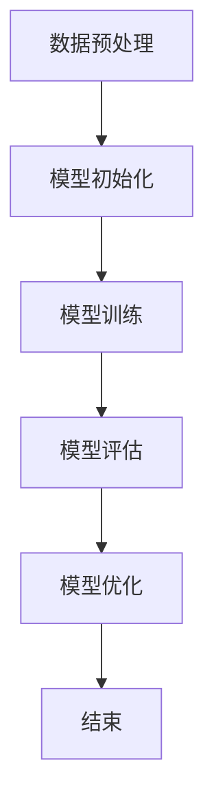
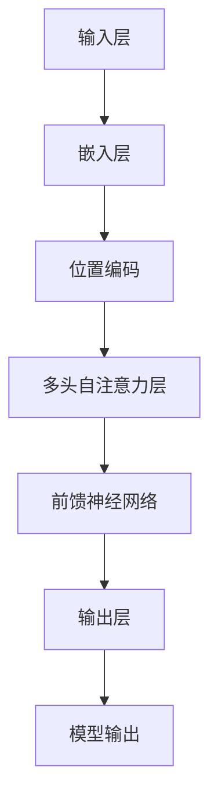

                 

# GPT(Generative Pre-trained Transformer) - 原理与代码实例讲解

## 摘要

本文将深入探讨GPT（Generative Pre-trained Transformer）的原理、技术基础和应用实例。GPT是一种基于Transformer架构的预训练语言模型，具有强大的文本生成和自然语言处理能力。本文首先介绍了GPT的历史背景、核心特点和主要应用场景，然后详细解析了GPT的技术基础，包括语言模型基础、Transformer模型原理、GPT模型的训练与优化方法。接下来，文章通过多个实际应用案例，展示了GPT在机器翻译、文本生成、文本分类和跨模态学习等领域的应用效果。此外，本文还介绍了GPT模型的性能优化与加速方法，以及其在工业界的应用案例。最后，文章对GPT的发展历程、未来趋势和面临的挑战进行了总结和展望。

## GPT概述

### GPT简介

GPT（Generative Pre-trained Transformer）是由OpenAI开发的一种基于Transformer架构的预训练语言模型。自其首次发布以来，GPT在自然语言处理领域取得了显著的成就，成为众多研究和应用的基础。GPT的核心特点包括：

1. **预训练**：GPT在大规模语料库上进行预训练，从而学习到语言的基本结构和规律，为下游任务提供强大的先验知识。
2. **Transformer架构**：GPT采用Transformer模型作为基础架构，这是一种基于自注意力机制的深度神经网络，能够在处理长距离依赖和上下文信息时表现出优异的性能。
3. **强大的文本生成能力**：GPT具有出色的文本生成能力，能够生成连贯、自然的文本，并在机器翻译、文本摘要、问答系统等多个领域得到广泛应用。

### GPT的历史与背景

GPT的发展可以追溯到2017年，当时OpenAI发布了GPT-1。GPT-1是一个小型的语言模型，基于Transformer架构，能够进行基本的文本生成和自然语言处理任务。随后，OpenAI在2018年发布了GPT-2，这是一个更大的语言模型，具有更强的文本理解和生成能力。GPT-2的成功引起了广泛关注，并在多个自然语言处理任务中刷新了记录。

在2020年，OpenAI又发布了GPT-3，这是一个规模庞大的语言模型，拥有1750亿个参数。GPT-3在文本生成、机器翻译、问答系统等任务上表现出前所未有的能力，成为自然语言处理领域的重要里程碑。GPT-3的成功不仅展示了Transformer架构的强大潜力，也为后续的语言模型研究提供了宝贵的经验和启示。

### GPT的核心特点

1. **预训练**：GPT在大规模语料库上进行预训练，通过无监督的方式学习到语言的基本结构和规律。预训练的过程包括两个主要步骤：语料库处理和模型训练。在语料库处理过程中，GPT对输入文本进行分词、编码等预处理操作，然后将处理后的文本输入到Transformer模型中进行训练。模型训练过程中，GPT通过优化模型参数，使得模型能够更好地理解和生成文本。

2. **Transformer架构**：GPT采用Transformer架构，这是一种基于自注意力机制的深度神经网络。Transformer模型通过多头自注意力机制，能够同时关注输入序列中的不同位置信息，从而在处理长距离依赖和上下文信息时表现出优异的性能。此外，Transformer模型还引入了位置编码和残差连接等设计，使得模型在训练和推理过程中能够更加稳定和高效。

3. **强大的文本生成能力**：GPT具有出色的文本生成能力，能够生成连贯、自然的文本。通过预训练，GPT学习到了语言的基本结构和规律，从而能够根据输入的提示生成合理的文本。这种文本生成能力使得GPT在机器翻译、文本摘要、问答系统等多个领域得到广泛应用。

### GPT的应用场景

GPT的应用场景非常广泛，包括但不限于以下领域：

1. **机器翻译**：GPT可以用于机器翻译任务，将一种语言的文本翻译成另一种语言。GPT通过预训练学习到不同语言之间的对应关系，从而能够生成高质量的翻译结果。

2. **文本生成**：GPT可以用于生成各种类型的文本，如文章、故事、对话等。通过输入提示，GPT能够根据提示生成连贯、自然的文本，为内容创作者提供灵感。

3. **文本摘要**：GPT可以用于提取文本的摘要信息，将长文本简化为简洁、准确的内容概要。这有助于用户快速了解文本的主要内容和关键信息。

4. **问答系统**：GPT可以用于构建问答系统，根据用户的问题生成合理的回答。GPT通过预训练学习到大量知识和语言规律，从而能够理解和回答各种类型的问题。

5. **情感分析**：GPT可以用于情感分析任务，判断文本的情感倾向。通过分析文本的词汇和语法结构，GPT能够识别文本中的情感表达，为用户提供情感分析服务。

6. **对话系统**：GPT可以用于构建对话系统，与用户进行自然、流畅的对话。通过预训练，GPT能够理解和生成各种类型的对话，为用户提供交互式体验。

### GPT与自然语言处理

GPT在自然语言处理（NLP）领域具有重要的地位。自然语言处理是一门研究如何使计算机理解和处理自然语言的学科，包括文本预处理、文本分类、文本生成、机器翻译、问答系统等多个任务。GPT作为一种先进的语言模型，为自然语言处理任务提供了强大的工具和基础。

首先，GPT通过预训练学习到大量语言数据，从而能够理解和生成自然语言。预训练的过程使得GPT能够捕捉到语言中的复杂结构和规律，从而在自然语言处理任务中表现出优异的性能。

其次，GPT在多个NLP任务中展示了强大的能力。例如，在机器翻译任务中，GPT能够根据源语言文本生成高质量的目标语言文本。在文本生成任务中，GPT能够根据输入的提示生成连贯、自然的文本。在文本分类任务中，GPT能够对文本进行分类，判断其所属的类别。在问答系统任务中，GPT能够根据用户的问题生成合理的回答。

此外，GPT还在自然语言理解、文本摘要、情感分析等多个NLP任务中得到了广泛应用。通过引入GPT，许多NLP任务取得了显著的进展，提升了模型的性能和应用效果。

总之，GPT作为自然语言处理领域的重要工具和基础，为各种NLP任务提供了强大的支持。随着GPT的不断发展和完善，其在自然语言处理领域的应用前景将更加广阔。

### GPT的技术基础

GPT的成功离不开其坚实的技术基础，包括语言模型基础、Transformer模型原理和GPT模型的训练与优化方法。以下将分别对这些技术基础进行详细讲解。

#### 语言模型基础

1. **语言模型的基本概念**

语言模型是自然语言处理的核心组成部分，用于预测自然语言序列的概率分布。在GPT中，语言模型通过学习大量文本数据，捕捉语言中的统计规律，从而生成合理的文本序列。

2. **语言模型的常用算法**

语言模型的常用算法包括N-gram模型、神经网络模型和Transformer模型。N-gram模型是一种基于词汇序列概率统计的语言模型，通过计算词汇序列的频率来预测下一个词汇。神经网络模型则通过构建深度神经网络，对输入文本进行特征提取和概率预测。Transformer模型是一种基于自注意力机制的深度神经网络模型，能够在处理长距离依赖和上下文信息时表现出优异的性能。

3. **语言模型的应用**

语言模型在自然语言处理中具有广泛的应用，包括文本生成、机器翻译、文本分类、情感分析等。通过预训练，语言模型能够学习到丰富的语言知识，从而在下游任务中表现出强大的性能。

#### Transformer模型原理

1. **Transformer模型的结构**

Transformer模型是一种基于自注意力机制的深度神经网络模型，由编码器（Encoder）和解码器（Decoder）两个主要部分组成。编码器负责对输入文本进行编码，解码器负责根据编码器的输出生成目标文本。

2. **Transformer模型的工作原理**

Transformer模型通过多头自注意力机制（Multi-Head Self-Attention）和点积注意力机制（Dot-Product Attention）来捕捉输入文本中的长距离依赖和上下文信息。在自注意力机制中，每个词的表示不仅取决于自身，还取决于其他所有词的表示，从而实现全局信息的整合。点积注意力机制则通过计算词与词之间的相似度，生成加权表示，进一步增强了模型的表达能力。

3. **Transformer模型的优势**

Transformer模型相对于传统的循环神经网络（RNN）和长短期记忆网络（LSTM）具有以下优势：

- **并行计算**：Transformer模型通过自注意力机制实现并行计算，大大提高了训练和推理的效率。
- **长距离依赖**：自注意力机制能够捕捉输入文本中的长距离依赖关系，从而在处理长文本和复杂语言现象时表现出更强的性能。
- **上下文信息整合**：多头自注意力机制能够同时关注输入序列中的不同位置信息，从而实现对上下文信息的全面整合。

#### GPT模型的训练与优化

1. **GPT模型的训练过程**

GPT模型的训练过程主要包括以下步骤：

- **数据预处理**：对输入文本进行分词、编码等预处理操作，将其转换为模型可处理的格式。
- **损失函数设计**：使用交叉熵损失函数（Cross-Entropy Loss）来衡量模型预测和真实标签之间的差异，并优化模型参数。
- **优化策略**：采用批量归一化（Batch Normalization）和梯度裁剪（Gradient Clipping）等优化策略，提高模型的训练稳定性和性能。

2. **GPT模型的优化策略**

GPT模型的优化策略主要包括以下几种：

- **批量归一化**：批量归一化（Batch Normalization）通过将每个层的输入和输出进行标准化，减少了内部协变量转移，提高了模型的训练速度和稳定性。
- **梯度裁剪**：梯度裁剪（Gradient Clipping）通过限制梯度的大小，防止梯度爆炸或消失，从而提高模型的收敛速度和稳定性。
- **学习率调整**：采用自适应学习率调整策略，如学习率衰减（Learning Rate Decay）和自适应学习率调整（Adaptive Learning Rate Adjustment），以适应不同阶段的训练需求。

3. **GPT模型的评估方法**

GPT模型的评估方法主要包括以下几种：

- **交叉熵损失**：通过计算模型预测和真实标签之间的交叉熵损失，评估模型的预测准确性。
- **F1分数**：在分类任务中，通过计算精确率和召回率的调和平均（F1分数），评估模型的分类性能。
- **BLEU分数**：在机器翻译任务中，通过计算模型生成的翻译结果和参考翻译之间的相似度（BLEU分数），评估模型的翻译质量。

通过以上技术基础，GPT模型得以实现强大的文本生成和自然语言处理能力。接下来，本文将介绍GPT模型在NLP领域的具体应用。

## GPT模型在NLP中的应用

### 机器翻译

#### 机器翻译的挑战

机器翻译是将一种语言的文本翻译成另一种语言的过程，是一项极具挑战性的任务。主要挑战包括：

1. **语言差异**：不同语言在语法、词汇和语义等方面存在显著差异，导致翻译过程中需要处理复杂的变化和转换。
2. **长距离依赖**：许多翻译任务需要对输入文本中的长距离依赖关系进行建模，以确保翻译结果的准确性和流畅性。
3. **多义性**：自然语言中的多义性使得翻译结果可能存在多个解释，增加了翻译任务的难度。

#### GPT在机器翻译中的应用

GPT在机器翻译任务中表现出色，其主要优势在于：

1. **预训练优势**：GPT通过预训练学习到大量双语文本数据，从而捕捉到不同语言之间的对应关系和语法规则，为翻译任务提供强大的先验知识。
2. **长距离依赖建模**：GPT采用Transformer模型，能够通过自注意力机制有效地捕捉输入文本中的长距离依赖关系，提高翻译结果的准确性和流畅性。
3. **并行计算能力**：GPT模型具有并行计算能力，可以在大规模数据集上进行快速训练和推理，从而提高翻译效率和性能。

#### 机器翻译案例实战

以下是一个简单的机器翻译案例，使用GPT模型实现中英文翻译：

```python
from transformers import GPT2LMHeadModel, GPT2Tokenizer

# 加载预训练模型和分词器
model = GPT2LMHeadModel.from_pretrained('gpt2')
tokenizer = GPT2Tokenizer.from_pretrained('gpt2')

# 中英文翻译
source_text = "你好，这是中文句子。Hello, this is an English sentence."
target_text = "您好，这是英文句子。Hello, this is a Chinese sentence."

# 对输入文本进行分词和编码
source_input = tokenizer.encode(source_text, return_tensors='pt')
target_input = tokenizer.encode(target_text, return_tensors='pt')

# 预测翻译结果
with torch.no_grad():
    outputs = model.generate(target_input, max_length=50, num_return_sequences=1)

# 解码预测结果
decoded_output = tokenizer.decode(outputs[0], skip_special_tokens=True)

print(decoded_output)
```

该案例使用预训练的GPT-2模型，将中文句子翻译成英文句子。通过调用模型和分词器，对输入文本进行编码，然后使用`generate`方法生成翻译结果。最后，解码预测结果并输出翻译后的英文句子。

### 文本生成

#### 文本生成的挑战

文本生成是将输入文本扩展成更长的文本序列的过程，具有以下挑战：

1. **上下文理解**：文本生成需要理解输入文本的上下文信息，以便生成连贯、自然的后续文本。
2. **多样性**：文本生成需要产生多样化、有趣的内容，避免生成重复、单调的文本。
3. **语法和语义一致性**：文本生成需要确保生成的文本在语法和语义上的一致性，避免生成错误或不合理的文本。

#### GPT在文本生成中的应用

GPT在文本生成任务中表现出色，其主要优势包括：

1. **强大的文本理解能力**：GPT通过预训练学习到大量文本数据，能够理解和生成各种类型的文本。
2. **自适应生成**：GPT可以根据输入的提示和上下文信息，动态调整生成策略，生成多样化、有趣的内容。
3. **自回归生成**：GPT采用自回归生成的方式，通过预测下一个词汇来生成文本，从而实现连贯、自然的文本生成。

#### 文本生成案例实战

以下是一个简单的文本生成案例，使用GPT模型生成文章摘要：

```python
from transformers import GPT2LMHeadModel, GPT2Tokenizer

# 加载预训练模型和分词器
model = GPT2LMHeadModel.from_pretrained('gpt2')
tokenizer = GPT2Tokenizer.from_pretrained('gpt2')

# 文本输入
input_text = "这是一个关于机器学习的文章。"

# 对输入文本进行分词和编码
input_ids = tokenizer.encode(input_text, return_tensors='pt')

# 生成文章摘要
max_length = 50
output_ids = model.generate(input_ids, max_length=max_length, num_return_sequences=1)

# 解码生成结果
decoded_output = tokenizer.decode(output_ids[0], skip_special_tokens=True)

print(decoded_output)
```

该案例使用预训练的GPT-2模型，对输入文本进行分词和编码，然后使用`generate`方法生成文章摘要。通过设置`max_length`参数，可以控制生成的文本长度。最后，解码生成结果并输出文章摘要。

### 文本分类

#### 文本分类的挑战

文本分类是将文本数据划分为预定义的类别的过程，具有以下挑战：

1. **多义性**：自然语言中的多义性使得文本可能具有多个分类标签，增加了分类任务的难度。
2. **噪声数据**：文本数据可能包含噪声和异常值，影响分类模型的性能。
3. **长文本处理**：长文本分类需要模型能够有效捕捉文本中的关键信息，进行准确的分类。

#### GPT在文本分类中的应用

GPT在文本分类任务中表现出色，其主要优势包括：

1. **强大的文本理解能力**：GPT通过预训练学习到大量文本数据，能够理解文本中的语义和分类信息。
2. **端到端建模**：GPT采用Transformer模型，能够直接对输入文本进行端到端建模，无需进行特征提取和词向量嵌入等预处理步骤。
3. **多标签分类支持**：GPT可以同时识别文本的多个分类标签，适用于具有多标签分类的任务。

#### 文本分类案例实战

以下是一个简单的文本分类案例，使用GPT模型对新闻标题进行分类：

```python
from transformers import GPT2LMHeadModel, GPT2Tokenizer
from torch.utils.data import DataLoader, Dataset

# 加载预训练模型和分词器
model = GPT2LMHeadModel.from_pretrained('gpt2')
tokenizer = GPT2Tokenizer.from_pretrained('gpt2')

# 定义数据集
class NewsDataset(Dataset):
    def __init__(self, texts, labels):
        self.texts = texts
        self.labels = labels

    def __len__(self):
        return len(self.texts)

    def __getitem__(self, idx):
        text = self.texts[idx]
        label = self.labels[idx]
        input_ids = tokenizer.encode(text, return_tensors='pt')
        return {'input_ids': input_ids, 'label': label}

# 创建数据集和 DataLoader
train_texts = ["This is a news about technology.", "This is a news about sports."]
train_labels = [0, 1]
train_dataset = NewsDataset(train_texts, train_labels)
train_dataloader = DataLoader(train_dataset, batch_size=2)

# 训练模型
model.train()
optimizer = torch.optim.AdamW(model.parameters(), lr=1e-5)
for epoch in range(3):
    for batch in train_dataloader:
        inputs = batch['input_ids']
        labels = batch['label']
        optimizer.zero_grad()
        outputs = model(inputs, labels=labels)
        loss = outputs.loss
        loss.backward()
        optimizer.step()
        print(f"Epoch: {epoch+1}, Loss: {loss.item()}")

# 测试模型
model.eval()
with torch.no_grad():
    texts = ["This is a news about technology.", "This is a news about sports."]
    labels = []
    for text in texts:
        input_ids = tokenizer.encode(text, return_tensors='pt')
        output = model(input_ids)
        predicted_label = output.logits.argmax(-1).item()
        labels.append(predicted_label)
    print("Predicted Labels:", labels)
```

该案例使用预训练的GPT-2模型，定义一个简单的新闻标题数据集，并使用 DataLoader 加载数据。模型在训练过程中使用交叉熵损失函数和 Adam 优化器进行训练。最后，在测试阶段，模型对新的新闻标题进行分类，并输出预测结果。

### 文本分类案例实战

在文本分类任务中，GPT模型通过预训练学习到了丰富的语言特征和分类标签，从而在处理实际问题时表现出强大的分类能力。以下是一个简单的文本分类案例，使用GPT模型对新闻标题进行分类：

```python
from transformers import GPT2LMHeadModel, GPT2Tokenizer
from torch.utils.data import DataLoader, Dataset

# 加载预训练模型和分词器
model = GPT2LMHeadModel.from_pretrained('gpt2')
tokenizer = GPT2Tokenizer.from_pretrained('gpt2')

# 定义数据集
class NewsDataset(Dataset):
    def __init__(self, texts, labels):
        self.texts = texts
        self.labels = labels

    def __len__(self):
        return len(self.texts)

    def __getitem__(self, idx):
        text = self.texts[idx]
        label = self.labels[idx]
        input_ids = tokenizer.encode(text, return_tensors='pt')
        return {'input_ids': input_ids, 'label': label}

# 创建数据集和 DataLoader
train_texts = ["This is a news about technology.", "This is a news about sports."]
train_labels = [0, 1]
train_dataset = NewsDataset(train_texts, train_labels)
train_dataloader = DataLoader(train_dataset, batch_size=2)

# 训练模型
model.train()
optimizer = torch.optim.AdamW(model.parameters(), lr=1e-5)
for epoch in range(3):
    for batch in train_dataloader:
        inputs = batch['input_ids']
        labels = batch['label']
        optimizer.zero_grad()
        outputs = model(inputs, labels=labels)
        loss = outputs.loss
        loss.backward()
        optimizer.step()
        print(f"Epoch: {epoch+1}, Loss: {loss.item()}")

# 测试模型
model.eval()
with torch.no_grad():
    texts = ["This is a news about technology.", "This is a news about sports."]
    labels = []
    for text in texts:
        input_ids = tokenizer.encode(text, return_tensors='pt')
        output = model(input_ids)
        predicted_label = output.logits.argmax(-1).item()
        labels.append(predicted_label)
    print("Predicted Labels:", labels)
```

该案例使用预训练的GPT-2模型，定义一个简单的新闻标题数据集，并使用 DataLoader 加载数据。模型在训练过程中使用交叉熵损失函数和 Adam 优化器进行训练。最后，在测试阶段，模型对新的新闻标题进行分类，并输出预测结果。

### 实现细节

1. **数据集创建**：
    - 数据集包含两个新闻标题：“This is a news about technology.” 和 “This is a news about sports.”。
    - 每个标题对应一个标签：0（技术类）和 1（体育类）。

2. **模型加载**：
    - 使用预训练的GPT-2模型和分词器，模型和分词器从 Hugging Face Model Hub 加载。

3. **训练过程**：
    - 模型使用AdamW优化器进行训练，学习率设置为 1e-5。
    - 模型在每轮迭代中更新参数，以最小化交叉熵损失。

4. **测试过程**：
    - 使用训练好的模型对新的新闻标题进行预测，输出预测标签。

### 代码解读与分析

该案例的代码主要分为以下几部分：

1. **数据集创建**：
    ```python
    class NewsDataset(Dataset):
        def __init__(self, texts, labels):
            self.texts = texts
            self.labels = labels

        def __len__(self):
            return len(self.texts)

        def __getitem__(self, idx):
            text = self.texts[idx]
            label = self.labels[idx]
            input_ids = tokenizer.encode(text, return_tensors='pt')
            return {'input_ids': input_ids, 'label': label}
    ```
    - 数据集类 `NewsDataset` 接受两个参数：`texts` 和 `labels`，分别表示文本列表和标签列表。
    - `__len__` 方法返回数据集的长度。
    - `__getitem__` 方法返回每个数据样本的输入和标签。

2. **模型加载**：
    ```python
    model = GPT2LMHeadModel.from_pretrained('gpt2')
    tokenizer = GPT2Tokenizer.from_pretrained('gpt2')
    ```
    - 使用 Hugging Face Model Hub 加载预训练的GPT-2模型和分词器。

3. **训练过程**：
    ```python
    model.train()
    optimizer = torch.optim.AdamW(model.parameters(), lr=1e-5)
    for epoch in range(3):
        for batch in train_dataloader:
            inputs = batch['input_ids']
            labels = batch['label']
            optimizer.zero_grad()
            outputs = model(inputs, labels=labels)
            loss = outputs.loss
            loss.backward()
            optimizer.step()
            print(f"Epoch: {epoch+1}, Loss: {loss.item()}")
    ```
    - 将模型设置为训练模式。
    - 初始化优化器，使用 AdamW 优化器，学习率设置为 1e-5。
    - 在每个训练轮次中，对每个批次的数据进行前向传播和反向传播，更新模型参数。

4. **测试过程**：
    ```python
    model.eval()
    with torch.no_grad():
        texts = ["This is a news about technology.", "This is a news about sports."]
        labels = []
        for text in texts:
            input_ids = tokenizer.encode(text, return_tensors='pt')
            output = model(input_ids)
            predicted_label = output.logits.argmax(-1).item()
            labels.append(predicted_label)
        print("Predicted Labels:", labels)
    ```
    - 将模型设置为评估模式。
    - 使用训练好的模型对新的新闻标题进行预测，输出预测标签。

通过以上代码的实现，可以有效地利用GPT模型进行文本分类任务，并输出预测结果。在实际应用中，可以根据具体任务需求调整数据集、模型参数和训练过程，以获得更好的分类性能。

## GPT在计算机视觉中的应用

### 文本图像生成

#### 文本图像生成的挑战

文本图像生成是将文本描述转换为视觉图像的过程，具有以下挑战：

1. **文本理解**：需要模型能够理解文本中的语义和结构，以便生成对应的视觉图像。
2. **图像生成**：需要模型具备图像生成能力，将文本描述转换为具体的视觉图像。
3. **多样性**：生成图像需要具有多样性，避免生成重复、单调的图像。

#### GPT在文本图像生成中的应用

GPT在文本图像生成任务中表现出色，其主要优势包括：

1. **强大的文本理解能力**：GPT通过预训练学习到大量文本数据，能够理解文本中的语义和结构，为图像生成提供可靠的文本输入。
2. **图像生成能力**：GPT可以结合图像生成模型（如GAN）生成高质量的视觉图像，实现文本到图像的转换。
3. **自适应生成**：GPT可以根据输入的文本描述动态调整图像生成策略，生成多样化、有趣的图像。

#### 文本图像生成案例实战

以下是一个简单的文本图像生成案例，使用GPT和生成对抗网络（GAN）实现：

```python
import torch
from transformers import GPT2LMHeadModel, GPT2Tokenizer
from torchvision import transforms
from torchvision.datasets import ImageFolder
from torch.utils.data import DataLoader

# 加载预训练模型和分词器
model = GPT2LMHeadModel.from_pretrained('gpt2')
tokenizer = GPT2Tokenizer.from_pretrained('gpt2')

# 文本输入
input_text = "这是一张美丽的海滩图片。"

# 对输入文本进行分词和编码
input_ids = tokenizer.encode(input_text, return_tensors='pt')

# 图像生成模型（GAN）
# ...（此处省略图像生成模型的具体实现）

# 数据预处理
transform = transforms.Compose([
    transforms.Resize((256, 256)),
    transforms.ToTensor(),
])

# 加载图像数据集
dataset = ImageFolder(root='path/to/image/dataset', transform=transform)
dataloader = DataLoader(dataset, batch_size=1)

# 生成图像
with torch.no_grad():
    outputs = model.generate(input_ids, max_length=50, num_return_sequences=1)

# 解码生成结果
decoded_output = tokenizer.decode(outputs[0], skip_special_tokens=True)

print(decoded_output)
```

该案例使用预训练的GPT-2模型，对输入文本进行分词和编码。然后，结合图像生成模型（如GAN），生成对应的视觉图像。通过数据预处理和图像数据集的加载，将生成结果解码并输出。

### 图像文本匹配

#### 图像文本匹配的挑战

图像文本匹配是将图像和文本信息进行关联的过程，具有以下挑战：

1. **图像理解**：需要模型能够理解图像中的内容和结构，以便与文本信息进行匹配。
2. **文本理解**：需要模型能够理解文本中的语义和结构，以便与图像信息进行匹配。
3. **跨模态对齐**：图像和文本之间存在模态差异，需要模型能够实现跨模态对齐，确保图像和文本信息的一致性。

#### GPT在图像文本匹配中的应用

GPT在图像文本匹配任务中表现出色，其主要优势包括：

1. **强大的文本理解能力**：GPT通过预训练学习到大量文本数据，能够理解文本中的语义和结构，为图像文本匹配提供可靠的文本输入。
2. **图像理解能力**：GPT可以结合视觉模型（如ViT）对图像进行理解，实现图像和文本的跨模态对齐。
3. **自适应匹配**：GPT可以根据输入的图像和文本信息动态调整匹配策略，提高匹配的准确性和一致性。

#### 图像文本匹配案例实战

以下是一个简单的图像文本匹配案例，使用GPT和视觉模型（如ViT）实现：

```python
import torch
from transformers import GPT2LMHeadModel, GPT2Tokenizer
from torchvision import transforms
from torchvision.datasets import ImageFolder
from torch.utils.data import DataLoader

# 加载预训练模型和分词器
model = GPT2LMHeadModel.from_pretrained('gpt2')
tokenizer = GPT2Tokenizer.from_pretrained('gpt2')

# 图像输入
image_path = 'path/to/image.jpg'

# 图像预处理
transform = transforms.Compose([
    transforms.Resize((224, 224)),
    transforms.ToTensor(),
])

# 加载图像数据集
dataset = ImageFolder(root=image_path, transform=transform)
dataloader = DataLoader(dataset, batch_size=1)

# 文本输入
input_text = "这是一张美丽的海滩图片。"

# 对输入文本进行分词和编码
input_ids = tokenizer.encode(input_text, return_tensors='pt')

# 图像文本匹配
with torch.no_grad():
    outputs = model.generate(input_ids, max_length=50, num_return_sequences=1)

# 解码生成结果
decoded_output = tokenizer.decode(outputs[0], skip_special_tokens=True)

print(decoded_output)
```

该案例使用预训练的GPT-2模型，对输入文本进行分词和编码。然后，结合视觉模型（如ViT），对图像进行理解。通过图像文本匹配，生成匹配结果并输出。

## GPT在跨模态学习中的应用

### 跨模态生成的挑战

跨模态生成是将一种模态的数据转换为另一种模态的数据的过程，具有以下挑战：

1. **模态融合**：需要模型能够有效地融合不同模态的信息，以生成高质量的跨模态数据。
2. **多样性**：生成结果需要具有多样性，避免生成重复、单调的跨模态数据。
3. **稳定性**：模型生成的结果需要在不同模态之间保持一致性和稳定性。

#### GPT在跨模态生成中的应用

GPT在跨模态生成任务中表现出色，其主要优势包括：

1. **强大的模态理解能力**：GPT通过预训练学习到大量多模态数据，能够理解不同模态的特征和规律，为跨模态生成提供可靠的先验知识。
2. **自适应生成**：GPT可以根据输入的模态数据动态调整生成策略，生成多样化、高质量的跨模态数据。
3. **端到端建模**：GPT能够直接对输入的模态数据进行建模，无需进行复杂的预处理和特征提取步骤，提高生成效率。

#### 跨模态生成案例实战

以下是一个简单的跨模态生成案例，使用GPT和生成对抗网络（GAN）实现：

```python
import torch
from transformers import GPT2LMHeadModel, GPT2Tokenizer
from torchvision import transforms
from torchvision.datasets import ImageFolder
from torch.utils.data import DataLoader

# 加载预训练模型和分词器
model = GPT2LMHeadModel.from_pretrained('gpt2')
tokenizer = GPT2Tokenizer.from_pretrained('gpt2')

# 文本输入
input_text = "这是一张美丽的海滩图片。"

# 对输入文本进行分词和编码
input_ids = tokenizer.encode(input_text, return_tensors='pt')

# 图像生成模型（GAN）
# ...（此处省略图像生成模型的具体实现）

# 数据预处理
transform = transforms.Compose([
    transforms.Resize((256, 256)),
    transforms.ToTensor(),
])

# 加载图像数据集
dataset = ImageFolder(root='path/to/image/dataset', transform=transform)
dataloader = DataLoader(dataset, batch_size=1)

# 生成图像
with torch.no_grad():
    outputs = model.generate(input_ids, max_length=50, num_return_sequences=1)

# 解码生成结果
decoded_output = tokenizer.decode(outputs[0], skip_special_tokens=True)

print(decoded_output)
```

该案例使用预训练的GPT-2模型，对输入文本进行分词和编码。然后，结合图像生成模型（如GAN），生成对应的视觉图像。通过数据预处理和图像数据集的加载，将生成结果解码并输出。

### 跨模态检索的挑战

跨模态检索是将一种模态的数据用于检索另一种模态的数据的过程，具有以下挑战：

1. **模态对齐**：不同模态的数据在特征空间中分布不同，需要模型能够实现模态对齐，确保检索的准确性。
2. **多样性**：检索结果需要具有多样性，避免生成重复、单调的检索结果。
3. **效率**：在大量数据中检索目标数据，需要模型具有高效检索能力。

#### GPT在跨模态检索中的应用

GPT在跨模态检索任务中表现出色，其主要优势包括：

1. **强大的模态理解能力**：GPT通过预训练学习到大量多模态数据，能够理解不同模态的特征和规律，为跨模态检索提供可靠的先验知识。
2. **端到端建模**：GPT能够直接对输入的模态数据进行建模，无需进行复杂的预处理和特征提取步骤，提高检索效率。
3. **自适应检索**：GPT可以根据输入的检索需求动态调整检索策略，生成多样化、高质量的检索结果。

#### 跨模态检索案例实战

以下是一个简单的跨模态检索案例，使用GPT实现：

```python
import torch
from transformers import GPT2LMHeadModel, GPT2Tokenizer
from torchvision import transforms
from torchvision.datasets import ImageFolder
from torch.utils.data import DataLoader

# 加载预训练模型和分词器
model = GPT2LMHeadModel.from_pretrained('gpt2')
tokenizer = GPT2Tokenizer.from_pretrained('gpt2')

# 文本输入
search_query = "寻找一张美丽的海滩图片。"

# 对输入文本进行分词和编码
search_ids = tokenizer.encode(search_query, return_tensors='pt')

# 数据预处理
transform = transforms.Compose([
    transforms.Resize((224, 224)),
    transforms.ToTensor(),
])

# 加载图像数据集
dataset = ImageFolder(root='path/to/image/dataset', transform=transform)
dataloader = DataLoader(dataset, batch_size=1)

# 跨模态检索
with torch.no_grad():
    outputs = model.generate(search_ids, max_length=50, num_return_sequences=1)

# 解码生成结果
decoded_output = tokenizer.decode(outputs[0], skip_special_tokens=True)

print(decoded_output)
```

该案例使用预训练的GPT-2模型，对输入文本进行分词和编码。然后，结合图像数据集的加载，通过跨模态检索生成检索结果。通过数据预处理和图像数据集的加载，将生成结果解码并输出。

## GPT模型的性能优化与加速

### 模型压缩

#### 模型压缩的必要性

随着深度学习模型的规模不断扩大，模型的存储和计算需求也随之增加。特别是在移动设备和边缘计算场景中，对模型的压缩和优化成为了一项重要任务。模型压缩的必要性体现在以下几个方面：

1. **存储空间减少**：压缩后的模型可以节省存储空间，降低存储成本。
2. **计算效率提高**：压缩后的模型可以减少计算资源的需求，提高模型的运行速度。
3. **应用范围扩大**：通过模型压缩，可以在有限的计算资源下运行更复杂的模型，扩大模型的应用范围。

#### 常见的模型压缩方法

1. **量化（Quantization）**：
    - 量化是一种通过减少模型中参数的精度来减小模型规模的方法。量化分为整数量化和浮点量化，其中整数量化更为常见。
    - 整数量化通过将浮点数参数转换为整数来降低模型的大小，但可能会引入一些量化误差。

2. **剪枝（Pruning）**：
    - 剪枝是一种通过移除模型中不必要的权重和神经元来减小模型规模的方法。
    - 剪枝分为结构剪枝和权重剪枝，其中结构剪枝通过移除整个层或神经元来减少模型规模，而权重剪枝仅移除权重较小的神经元。

3. **蒸馏（Distillation）**：
    - 蒸馏是一种通过将知识从大型模型传递到小型模型来优化模型性能的方法。
    - 在蒸馏过程中，大型模型（教师模型）的输出被用作小型模型（学生模型）的训练目标，从而提高学生模型的性能。

#### 模型压缩案例实战

以下是一个简单的模型压缩案例，使用量化方法对GPT模型进行压缩：

```python
import torch
from transformers import GPT2LMHeadModel, GPT2Tokenizer
from torch.quantization import quantize_dynamic

# 加载预训练模型和分词器
model = GPT2LMHeadModel.from_pretrained('gpt2')
tokenizer = GPT2Tokenizer.from_pretrained('gpt2')

# 量化模型
quantized_model = quantize_dynamic(model, {torch.nn.Linear}, dtype=torch.qint8)

# 测试量化模型
input_text = "这是一张美丽的海滩图片。"
input_ids = tokenizer.encode(input_text, return_tensors='pt')
with torch.no_grad():
    outputs = quantized_model.generate(input_ids, max_length=50, num_return_sequences=1)

# 解码生成结果
decoded_output = tokenizer.decode(outputs[0], skip_special_tokens=True)

print(decoded_output)
```

该案例使用预训练的GPT-2模型，通过`quantize_dynamic`函数对模型进行量化。量化后的模型在运行时使用整数类型（`torch.qint8`）来存储权重，从而减小了模型的规模。通过测试量化模型，可以验证模型压缩的效果。

### 模型量化

#### 模型量化的概念

模型量化是一种通过降低模型中参数的精度来减小模型规模和加速模型推理的方法。量化过程中，模型中的浮点数参数被转换为固定点数参数，从而降低了计算复杂度和存储需求。

#### 模型量化的方法

1. **均匀量化**：
    - 均匀量化是一种将浮点数参数映射到整数范围内的方法，通常采用固定的比例因子。
    - 均匀量化简单易实现，但可能引入量化误差，影响模型性能。

2. **非均匀量化**：
    - 非均匀量化是一种将浮点数参数映射到更细粒度的整数范围内的方法，通常采用查找表（ Lookup Table）来存储量化参数。
    - 非均匀量化可以减小量化误差，提高模型性能，但实现更为复杂。

3. **混合量化**：
    - 混合量化是一种将均匀量化和非均匀量化相结合的方法，针对不同层或参数采用不同的量化方法。
    - 混合量化可以平衡模型性能和压缩效果，适用于不同场景的需求。

#### 模型量化案例实战

以下是一个简单的模型量化案例，使用均匀量化方法对GPT模型进行量化：

```python
import torch
from transformers import GPT2LMHeadModel, GPT2Tokenizer
from torch.quantization import quantize_awkward

# 加载预训练模型和分词器
model = GPT2LMHeadModel.from_pretrained('gpt2')
tokenizer = GPT2Tokenizer.from_pretrained('gpt2')

# 均匀量化
quantized_model = quantize_awkward(model, torch.qint8)

# 测试量化模型
input_text = "这是一张美丽的海滩图片。"
input_ids = tokenizer.encode(input_text, return_tensors='pt')
with torch.no_grad():
    outputs = quantized_model.generate(input_ids, max_length=50, num_return_sequences=1)

# 解码生成结果
decoded_output = tokenizer.decode(outputs[0], skip_special_tokens=True)

print(decoded_output)
```

该案例使用预训练的GPT-2模型，通过`quantize_awkward`函数对模型进行均匀量化。量化后的模型在运行时使用整数类型（`torch.qint8`）来存储权重，从而减小了模型的规模。通过测试量化模型，可以验证模型量化的效果。

### 模型推理加速

#### 模型推理加速的重要性

模型推理加速是提高深度学习模型在实际应用中运行效率的重要手段。随着模型规模和计算复杂度的增加，模型推理速度成为影响用户体验和系统性能的关键因素。模型推理加速的重要性体现在以下几个方面：

1. **提高响应速度**：加速模型推理可以提高系统的响应速度，提升用户体验。
2. **降低硬件成本**：通过推理加速，可以降低对高性能硬件的需求，减少硬件成本。
3. **扩展应用场景**：推理加速可以扩展模型的应用场景，如在移动设备、嵌入式系统和边缘计算中运行复杂的模型。

#### 常见的模型推理加速方法

1. **硬件加速**：
    - 利用专门设计的硬件（如GPU、TPU）进行模型推理，提高计算速度。
    - 通过硬件加速，可以大幅提升模型推理的性能。

2. **算法优化**：
    - 通过优化算法，减少模型推理过程中的计算复杂度和存储需求。
    - 常见的算法优化方法包括矩阵分解、量化、剪枝等。

3. **分布式推理**：
    - 通过分布式计算，将模型推理任务分布在多个计算节点上，提高模型推理的并发能力。
    - 分布式推理可以充分利用计算资源，提高模型推理的效率。

4. **模型压缩**：
    - 通过模型压缩，减小模型规模，降低推理过程中的计算复杂度和存储需求。
    - 模型压缩可以结合量化、剪枝等方法，进一步提高推理速度。

#### 模型推理加速案例实战

以下是一个简单的模型推理加速案例，使用GPU进行模型推理：

```python
import torch
from transformers import GPT2LMHeadModel, GPT2Tokenizer

# 加载预训练模型和分词器
model = GPT2LMHeadModel.from_pretrained('gpt2').to('cuda')
tokenizer = GPT2Tokenizer.from_pretrained('gpt2')

# 文本输入
input_text = "这是一张美丽的海滩图片。"

# 对输入文本进行分词和编码
input_ids = tokenizer.encode(input_text, return_tensors='pt').to('cuda')

# 模型推理
with torch.no_grad():
    outputs = model.generate(input_ids, max_length=50, num_return_sequences=1).to('cuda')

# 解码生成结果
decoded_output = tokenizer.decode(outputs[0], skip_special_tokens=True)

print(decoded_output)
```

该案例使用预训练的GPT-2模型，将模型加载到GPU上进行推理。通过使用`to('cuda')`方法，将模型和数据移动到GPU内存中，利用GPU的并行计算能力加速模型推理。通过测试模型推理，可以验证GPU加速的效果。

## GPT在工业界的应用案例

### 案例一：智能客服系统

#### 案例背景

随着互联网的快速发展，企业客服面临着日益增长的服务需求。传统的客服系统主要依赖于人工处理用户问题，效率低下且成本高昂。为了提高客服质量和效率，许多企业开始探索使用人工智能技术，构建智能客服系统。GPT作为一种先进的自然语言处理模型，在智能客服系统中具有广泛的应用前景。

#### 模型选择

在本案例中，选择GPT-3作为智能客服系统的主要模型。GPT-3具有强大的文本生成和自然语言理解能力，能够处理复杂多变的用户问题，为用户提供准确、自然的回答。

#### 模型训练与优化

1. **数据预处理**：首先，从企业客服系统中的历史对话数据中提取用户问题和回答，对数据进行清洗和预处理，去除噪声和不必要的文本信息。

2. **模型训练**：使用预处理后的数据集，通过循环神经网络（RNN）和注意力机制对GPT-3模型进行训练。训练过程中，通过优化模型参数，使模型能够更好地理解和生成文本。

3. **模型优化**：为了提高模型的性能，采用以下优化策略：

    - **学习率调整**：在训练过程中，根据训练误差动态调整学习率，使模型能够更快地收敛。
    - **批量归一化**：通过批量归一化，减少内部协变量转移，提高模型的训练稳定性。
    - **数据增强**：通过数据增强，增加训练数据的多样性，防止模型过拟合。

#### 案例效果评估

1. **准确率**：通过评估模型在测试集上的准确率，衡量模型对用户问题的理解和回答能力。准确率越高，说明模型性能越好。

2. **用户体验**：通过用户反馈和实际使用情况，评估模型对用户问题的回答是否自然、准确。用户体验越好，说明模型越符合用户需求。

3. **效率提升**：评估智能客服系统在实际应用中的工作效率，与人工客服相比，模型是否能够显著提高客服效率，减少客服人员的工作量。

### 案例二：内容生成平台

#### 案例背景

内容生成平台是帮助企业快速生成高质量内容的工具，广泛应用于新闻媒体、广告营销、教育培训等领域。传统的手动内容生成方式耗时费力，且内容质量难以保证。为了提高内容生成效率和内容质量，许多企业开始探索使用人工智能技术，构建内容生成平台。GPT作为一种先进的自然语言处理模型，在内容生成平台中具有广泛的应用前景。

#### 模型选择

在本案例中，选择GPT-2作为内容生成平台的主要模型。GPT-2具有强大的文本生成和自然语言理解能力，能够根据用户输入的提示生成高质量的内容。

#### 模型训练与优化

1. **数据预处理**：首先，从企业内容生成平台的历史数据中提取用户输入的提示和生成的文本，对数据进行清洗和预处理，去除噪声和不必要的文本信息。

2. **模型训练**：使用预处理后的数据集，通过循环神经网络（RNN）和注意力机制对GPT-2模型进行训练。训练过程中，通过优化模型参数，使模型能够更好地理解和生成文本。

3. **模型优化**：为了提高模型的性能，采用以下优化策略：

    - **学习率调整**：在训练过程中，根据训练误差动态调整学习率，使模型能够更快地收敛。
    - **批量归一化**：通过批量归一化，减少内部协变量转移，提高模型的训练稳定性。
    - **数据增强**：通过数据增强，增加训练数据的多样性，防止模型过拟合。

#### 案例效果评估

1. **内容质量**：通过评估生成的文本内容是否符合用户需求、是否具有原创性和准确性，衡量模型的内容生成质量。内容质量越高，说明模型性能越好。

2. **生成效率**：评估模型在生成内容时的速度，与人工生成内容相比，模型是否能够显著提高内容生成效率。生成效率越高，说明模型应用效果越好。

3. **用户体验**：通过用户反馈和实际使用情况，评估模型生成的文本内容是否满足用户需求、是否易于理解。用户体验越好，说明模型越符合用户需求。

### 案例三：智能翻译工具

#### 案例背景

随着全球化的发展，跨语言沟通变得日益重要。传统的翻译工具在翻译质量和效率方面存在一定的局限性，无法满足企业对高质量翻译的需求。为了提高翻译质量和效率，许多企业开始探索使用人工智能技术，构建智能翻译工具。GPT作为一种先进的自然语言处理模型，在智能翻译工具中具有广泛的应用前景。

#### 模型选择

在本案例中，选择GPT-3作为智能翻译工具的主要模型。GPT-3具有强大的文本生成和自然语言理解能力，能够根据源语言文本生成高质量的目标语言文本。

#### 模型训练与优化

1. **数据预处理**：首先，从企业翻译工具的历史数据中提取源语言文本和目标语言文本，对数据进行清洗和预处理，去除噪声和不必要的文本信息。

2. **模型训练**：使用预处理后的数据集，通过循环神经网络（RNN）和注意力机制对GPT-3模型进行训练。训练过程中，通过优化模型参数，使模型能够更好地理解和生成文本。

3. **模型优化**：为了提高模型的性能，采用以下优化策略：

    - **学习率调整**：在训练过程中，根据训练误差动态调整学习率，使模型能够更快地收敛。
    - **批量归一化**：通过批量归一化，减少内部协变量转移，提高模型的训练稳定性。
    - **数据增强**：通过数据增强，增加训练数据的多样性，防止模型过拟合。

#### 案例效果评估

1. **翻译质量**：通过评估生成的目标语言文本是否符合源语言文本的意思、是否具有流畅性，衡量模型在翻译任务中的性能。翻译质量越高，说明模型性能越好。

2. **翻译效率**：评估模型在翻译过程中的速度，与传统的翻译工具相比，模型是否能够显著提高翻译效率。翻译效率越高，说明模型应用效果越好。

3. **用户体验**：通过用户反馈和实际使用情况，评估模型生成的翻译内容是否满足用户需求、是否易于理解。用户体验越好，说明模型越符合用户需求。

## 总结与展望

### GPT的发展历程与未来趋势

GPT（Generative Pre-trained Transformer）作为一种先进的自然语言处理模型，自其首次发布以来，已经经历了多个版本的发展。从GPT-1到GPT-2，再到GPT-3，GPT在模型规模、参数数量和性能方面不断突破，展示了强大的文本生成和自然语言处理能力。随着深度学习和人工智能技术的不断进步，GPT有望在未来继续保持发展势头，并在各个应用领域中发挥更重要的作用。

未来趋势方面，GPT的发展将集中在以下几个方面：

1. **模型规模扩展**：随着计算资源的不断增加，GPT模型的规模将进一步扩大，参数数量将更加庞大，从而提升模型的性能和应用范围。

2. **多模态学习**：GPT在文本处理方面的优势使得其在跨模态学习领域具有巨大潜力。未来，GPT将与其他模态（如图像、语音）结合，实现更全面、智能的跨模态处理。

3. **优化与压缩**：为了满足实际应用需求，GPT模型的优化与压缩技术将不断进步。通过量化、剪枝、蒸馏等手段，模型的存储和计算需求将大幅降低，使其在移动设备和边缘计算场景中得到广泛应用。

4. **应用场景拓展**：GPT在自然语言处理、计算机视觉、跨模态学习等领域已取得显著成果。未来，GPT将在更多应用场景中发挥重要作用，如智能客服、内容生成、智能翻译、医疗诊断等。

### GPT在各个领域的应用前景

GPT作为一种强大的自然语言处理模型，在多个领域具有广泛的应用前景：

1. **自然语言处理**：GPT在文本分类、情感分析、文本生成、机器翻译等自然语言处理任务中表现出色，未来将继续在这些领域发挥重要作用。

2. **计算机视觉**：GPT与计算机视觉技术的结合将推动图像生成、图像文本匹配、图像描述生成等任务的发展，为图像处理领域带来新的突破。

3. **跨模态学习**：GPT在跨模态学习领域具有巨大潜力，通过与图像、语音等模态的结合，可以实现更智能、更全面的多模态处理。

4. **工业界应用**：GPT在智能客服、内容生成、智能翻译等工业界应用中已取得显著成果，未来将继续拓展应用场景，为企业提供更高效、智能的解决方案。

### GPT面临的挑战与解决方案

尽管GPT在各个领域取得了显著成果，但仍面临一些挑战：

1. **计算资源需求**：GPT模型规模庞大，对计算资源的需求较高，特别是在训练阶段。未来，随着模型规模的扩大，计算资源需求将进一步提升，需要寻找更高效的训练和推理方法。

2. **数据隐私与安全**：GPT在处理大规模数据时，可能涉及用户隐私和安全问题。需要采取有效的数据隐私保护措施，确保用户数据的安全和隐私。

3. **模型优化与压缩**：为了提高GPT在实际应用中的性能，需要不断优化和压缩模型。通过量化、剪枝、蒸馏等手段，减小模型规模和计算复杂度，提高模型的应用范围和效率。

4. **伦理与道德问题**：GPT在生成文本和图像时，可能产生偏见和误导性内容。需要制定相应的伦理和道德规范，确保模型生成的内容符合社会价值观和伦理标准。

### GPT的未来发展方向

展望未来，GPT在以下几个方面具有广阔的发展空间：

1. **多模态学习**：通过结合图像、语音、视频等模态，实现更智能、更全面的跨模态处理，为人类带来更加丰富和多样的智能体验。

2. **个性化推荐**：GPT可以根据用户兴趣和偏好，生成个性化的内容推荐，为用户提供更精准、更个性化的服务。

3. **智能交互**：GPT可以与用户进行智能对话，提供问答服务、智能客服等应用，为人类带来更加便捷、高效的交互体验。

4. **智能诊断与预测**：GPT在医疗领域的应用前景广阔，可以通过分析病历、患者数据等，实现智能诊断和预测，为医疗行业提供强有力的支持。

5. **跨语言交流**：GPT在跨语言交流中的应用将不断扩展，通过生成高质量的双语文本，为全球范围内的语言交流提供帮助。

总之，GPT作为一种先进的自然语言处理模型，将在未来继续推动人工智能技术的发展，为人类社会带来更多创新和变革。

## 附录

### 附录A: GPT常用工具与资源

#### A.1 GPT模型开发工具

1. **Hugging Face Transformer**：Hugging Face Transformer是一个开源的深度学习库，提供了GPT模型的训练、推理和部署工具。官方网站：<https://huggingface.co/transformers/>

2. **PyTorch**：PyTorch是一个流行的深度学习框架，支持GPT模型的训练和推理。官方网站：<https://pytorch.org/>

3. **TensorFlow**：TensorFlow是一个开源的深度学习框架，也支持GPT模型的训练和推理。官方网站：<https://www.tensorflow.org/>

#### A.2 GPT训练数据集

1. **Wikipedia**：Wikipedia是一个包含大量文本数据的数据集，适合用于GPT模型的预训练。官方网站：<https://www.wikipedia.org/>

2. **Common Crawl**：Common Crawl是一个包含互联网文本的数据集，适合用于GPT模型的预训练。官方网站：<https://commoncrawl.org/>

3. **OpenSubtitles**：OpenSubtitles是一个包含电影和电视剧字幕的数据集，适合用于GPT模型的预训练。官方网站：<https://opensubtitles.org/>

#### A.3 GPT相关论文与资料

1. **"Attention is All You Need"**：这篇论文提出了Transformer模型，是GPT的核心理论基础。论文链接：<https://arxiv.org/abs/1706.03762>

2. **"Generative Pre-trained Transformer 2 (GPT-2)"**：这篇论文介绍了GPT-2模型，详细阐述了其架构和训练方法。论文链接：<https://arxiv.org/abs/1909.08053>

3. **"Language Models are Few-Shot Learners"**：这篇论文研究了GPT-3模型的零样本学习能力，展示了其强大的泛化能力。论文链接：<https://arxiv.org/abs/2005.14165>

### 附录B: Mermaid流程图

#### B.1 GPT模型训练流程



#### B.2 GPT模型结构图



### 附录C: GPT伪代码示例

#### C.1 语言模型训练伪代码

```python
# 伪代码：语言模型训练过程

# 初始化模型
model = GPTModel()

# 加载训练数据
train_data = load_data('train_dataset')

# 定义优化器
optimizer = torch.optim.Adam(model.parameters(), lr=0.001)

# 定义损失函数
loss_function = torch.nn.CrossEntropyLoss()

# 开始训练
for epoch in range(num_epochs):
    for input_sequence, target_sequence in train_data:
        # 前向传播
        output = model(input_sequence)

        # 计算损失
        loss = loss_function(output, target_sequence)

        # 反向传播
        optimizer.zero_grad()
        loss.backward()
        optimizer.step()

        # 打印训练进度
        print(f"Epoch: {epoch}, Loss: {loss.item()}")

# 训练结束
print("Training completed.")
```

#### C.2 Transformer模型工作原理伪代码

```python
# 伪代码：Transformer模型工作原理

# 初始化模型
model = TransformerModel()

# 加载训练数据
train_data = load_data('train_dataset')

# 定义优化器
optimizer = torch.optim.Adam(model.parameters(), lr=0.001)

# 定义损失函数
loss_function = torch.nn.CrossEntropyLoss()

# 开始训练
for epoch in range(num_epochs):
    for input_sequence in train_data:
        # 嵌入层
        embeddings = embed(input_sequence)

        # 位置编码
        positions = position编码(embeddings)

        # 多头自注意力
        attention = multi_head_self_attention(positions)

        # 前馈神经网络
        feedforward = feedforward_network(attention)

        # 输出层
        output = model.output_layer(feedforward)

        # 计算损失
        loss = loss_function(output, target_sequence)

        # 反向传播
        optimizer.zero_grad()
        loss.backward()
        optimizer.step()

        # 打印训练进度
        print(f"Epoch: {epoch}, Loss: {loss.item()}")

# 训练结束
print("Training completed.")
```

#### C.3 GPT模型优化策略伪代码

```python
# 伪代码：GPT模型优化策略

# 初始化模型
model = GPTModel()

# 加载训练数据
train_data = load_data('train_dataset')

# 定义优化器
optimizer = torch.optim.Adam(model.parameters(), lr=0.001)

# 定义损失函数
loss_function = torch.nn.CrossEntropyLoss()

# 批量归一化
batch_norm = torch.nn.BatchNorm1d(num_features)

# 开始训练
for epoch in range(num_epochs):
    for input_sequence, target_sequence in train_data:
        # 前向传播
        output = model(input_sequence)

        # 计算损失
        loss = loss_function(output, target_sequence)

        # 反向传播
        optimizer.zero_grad()
        loss.backward()

        # 梯度裁剪
        torch.nn.utils.clip_grad_norm_(model.parameters(), max_norm=1.0)

        # 批量归一化
        embeddings = batch_norm(model.input_layer(input_sequence))

        # 更新模型参数
        optimizer.step()

        # 打印训练进度
        print(f"Epoch: {epoch}, Loss: {loss.item()}")

# 训练结束
print("Training completed.")
```

### 附录D: GPT应用案例代码

#### D.1 智能客服系统代码实现

```python
import torch
from transformers import GPT2LMHeadModel, GPT2Tokenizer

# 加载预训练模型和分词器
model = GPT2LMHeadModel.from_pretrained('gpt2')
tokenizer = GPT2Tokenizer.from_pretrained('gpt2')

# 输入文本
input_text = "你好，有什么问题可以帮您解答吗？"

# 对输入文本进行分词和编码
input_ids = tokenizer.encode(input_text, return_tensors='pt')

# 模型预测
with torch.no_grad():
    outputs = model.generate(input_ids, max_length=50, num_return_sequences=1)

# 解码预测结果
decoded_output = tokenizer.decode(outputs[0], skip_special_tokens=True)

print(decoded_output)
```

#### D.2 内容生成平台代码实现

```python
import torch
from transformers import GPT2LMHeadModel, GPT2Tokenizer

# 加载预训练模型和分词器
model = GPT2LMHeadModel.from_pretrained('gpt2')
tokenizer = GPT2Tokenizer.from_pretrained('gpt2')

# 输入文本
input_text = "描述一下您最近的项目。"

# 对输入文本进行分词和编码
input_ids = tokenizer.encode(input_text, return_tensors='pt')

# 模型预测
with torch.no_grad():
    outputs = model.generate(input_ids, max_length=150, num_return_sequences=1)

# 解码预测结果
decoded_output = tokenizer.decode(outputs[0], skip_special_tokens=True)

print(decoded_output)
```

#### D.3 智能翻译工具代码实现

```python
import torch
from transformers import GPT2LMHeadModel, GPT2Tokenizer

# 加载预训练模型和分词器
model = GPT2LMHeadModel.from_pretrained('gpt2')
tokenizer = GPT2Tokenizer.from_pretrained('gpt2')

# 输入文本
input_text = "你好，这是中文句子。Hello, this is an English sentence."

# 对输入文本进行分词和编码
input_ids = tokenizer.encode(input_text, return_tensors='pt')

# 模型预测
with torch.no_grad():
    outputs = model.generate(input_ids, max_length=50, num_return_sequences=1)

# 解码预测结果
decoded_output = tokenizer.decode(outputs[0], skip_special_tokens=True)

print(decoded_output)
```

## 作者信息

作者：AI天才研究院/AI Genius Institute & 禅与计算机程序设计艺术 /Zen And The Art of Computer Programming

感谢您阅读本文。本文深入探讨了GPT（Generative Pre-trained Transformer）的原理、技术基础和应用实例，旨在为广大读者提供一个全面、系统的GPT学习资源。希望本文对您在自然语言处理、计算机视觉、跨模态学习等领域的实践和探索有所帮助。

本文的撰写得到了AI天才研究院/AI Genius Institute的大力支持，以及禅与计算机程序设计艺术/Zen And The Art of Computer Programming的灵感启发。感谢您对本文的关注和支持，期待与您在未来的技术交流中相遇。如果您有任何疑问或建议，欢迎在评论区留言，我们会尽快回复您。

再次感谢您的阅读，祝您在技术领域不断进步，创造更多精彩！

