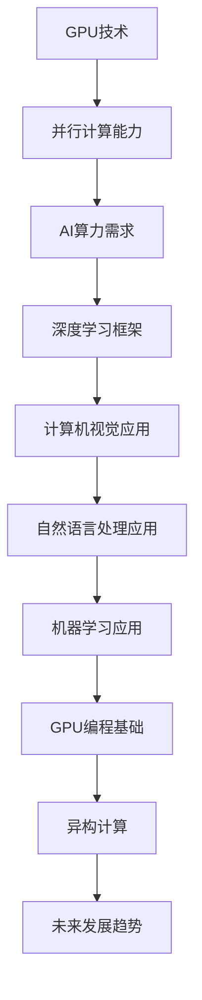

                 

## 《GPU技术在AI算力中的应用》

### 关键词：GPU，AI算力，深度学习，计算机视觉，自然语言处理，异构计算

#### 摘要：
随着人工智能（AI）技术的快速发展，对计算能力的需求日益增加。图形处理器（GPU）因其高度并行计算能力，成为AI算力的重要推动者。本文将深入探讨GPU技术在AI算力中的应用，从基本概念、编程基础、深度学习优化、实际应用领域以及未来发展等多个方面进行详细解析，帮助读者全面了解GPU在AI领域的重要性及其应用前景。

---

### 《GPU技术在AI算力中的应用》目录大纲

#### 第一部分：GPU技术与AI算力概述

1. **第1章：GPU技术与AI算力的基本概念**
   - **1.1 GPU技术的发展历程**
   - **1.2 AI算力的需求分析**
   - **1.3 GPU在AI计算中的应用领域**

2. **第2章：GPU编程基础**
   - **2.1 CUDA编程基础**
   - **2.2 CUDA核心编程**

3. **第3章：深度学习在GPU上的优化**
   - **3.1 深度学习框架与GPU**
   - **3.2 深度学习模型的GPU优化**

#### 第二部分：GPU在AI算力中的实际应用

4. **第4章：GPU在机器学习中的应用**
   - **4.1 GPU在监督学习中的应用**
   - **4.2 GPU在无监督学习中的应用**

5. **第5章：GPU在深度学习中的应用**
   - **5.1 卷积神经网络（CNN）的GPU优化**
   - **5.2 循环神经网络（RNN）的GPU优化**

6. **第6章：GPU在计算机视觉中的应用**
   - **6.1 图像处理算法的GPU实现**
   - **6.2 目标检测与跟踪的GPU加速**

7. **第7章：GPU在自然语言处理中的应用**
   - **7.1 自然语言处理的GPU加速**
   - **7.2 机器翻译与文本生成的GPU应用**

#### 第三部分：GPU技术在AI算力中的未来发展

8. **第8章：GPU技术在AI算力中的挑战与展望**
   - **8.1 GPU技术的局限性**
   - **8.2 GPU技术在AI算力中的未来发展趋势**

9. **第9章：GPU技术在AI领域的创新应用**
   - **9.1 GPU在实时AI系统中的应用**
   - **9.2 GPU技术在AI自动化与智能化中的应用**

#### 附录

- **附录A：GPU编程资源与工具**
  - **A.1 CUDA开发工具与资源**
  - **A.2 深度学习框架与GPU支持**
  - **A.3 GPU编程技巧与最佳实践**

---

**核心概念与联系：**

以下是关于GPU技术和AI算力关系的一个Mermaid流程图：



在接下来的章节中，我们将一步一步地探讨GPU技术在AI算力中的应用，包括其基本概念、编程基础、深度学习优化以及实际应用领域等。

---

### 第一部分：GPU技术与AI算力概述

#### 第1章：GPU技术与AI算力的基本概念

#### 1.1 GPU技术的发展历程

GPU（Graphics Processing Unit，图形处理器）最早是由3Dfx公司于1999年推出的，最初是为了满足游戏和图形渲染的需求。早期的GPU设计主要是为了处理复杂的图形运算，例如三维建模、光影效果和纹理映射等。随着时间的推移，GPU的设计不断演进，逐渐引入了更多的计算单元和更高的并行处理能力。

NVIDIA在2006年推出了GeForce 8系列显卡，这一系列的显卡引入了CUDA（Compute Unified Device Architecture）架构，使得GPU不仅能够处理图形渲染任务，还能够进行通用计算任务。CUDA的出现标志着GPU在计算领域的一个重要转折点，为GPU在AI算力中的应用奠定了基础。

此后，GPU的设计不断优化，计算单元数量和并行处理能力得到了显著提升。NVIDIA的CUDA架构逐渐成为了GPU编程的标准，许多深度学习框架（如TensorFlow、PyTorch等）都对CUDA提供了支持，使得GPU在AI领域的应用变得更加广泛和便捷。

#### 1.2 GPU在AI计算中的优势

GPU在AI计算中的优势主要体现在以下几个方面：

1. **高度并行计算能力**：
   GPU拥有成千上万个计算单元，这些计算单元可以同时执行大量的独立运算。对于深度学习模型中的矩阵乘法、卷积操作等并行性较强的运算，GPU能够显著提升计算速度。

2. **高效的内存管理**：
   GPU具有专用的内存管理单元，能够在内存访问中实现高效的数据传输。GPU内存被分为多个层级，包括寄存器、共享内存、全局内存等，这些内存层级之间能够实现高效的数据访问和交换。

3. **优化的软件生态系统**：
   许多深度学习框架（如TensorFlow、PyTorch等）都针对GPU进行了优化，提供了丰富的API和工具，使得开发者能够轻松地利用GPU进行深度学习模型的训练和推理。

4. **强大的浮点运算性能**：
   GPU特别适合进行浮点运算，能够高效地处理大量的矩阵运算和向量运算，这对于深度学习模型中的大量参数优化和计算非常重要。

#### 1.3 AI算力的需求分析

AI算力的需求主要体现在以下几个方面：

1. **数据量大**：
   AI模型需要处理大量的数据，包括训练数据和测试数据。这些数据需要通过计算进行特征提取、模型训练和预测等操作，计算量大是AI算力需求的一个显著特点。

2. **计算速度快**：
   AI模型需要实时或接近实时的响应速度，特别是在实时视频处理、语音识别和自然语言处理等应用场景中，对计算速度的要求非常高。

3. **并行计算能力强**：
   AI模型中的许多操作具有高度并行性，如卷积神经网络中的卷积操作、循环神经网络中的矩阵乘法等，并行计算能力的强弱直接影响到模型训练和推理的速度。

4. **低延迟和高吞吐量**：
   在一些实时应用场景中，如自动驾驶、智能监控等，不仅要求计算速度快，还要求低延迟和高吞吐量，以支持大量实时数据的高效处理。

#### 1.4 GPU在AI计算中的应用领域

GPU在AI计算中的应用非常广泛，以下是一些主要的应用领域：

1. **机器学习和深度学习**：
   GPU在机器学习和深度学习中的应用非常普遍，许多深度学习框架（如TensorFlow、PyTorch等）都对GPU提供了全面支持，使得GPU成为深度学习模型训练和推理的首选计算平台。

2. **图像处理和计算机视觉**：
   图像处理和计算机视觉是GPU的重要应用领域。GPU能够高效地处理大量的图像数据，实现图像滤波、边缘检测、目标检测和跟踪等功能。

3. **自然语言处理**：
   自然语言处理（NLP）是人工智能的一个重要分支，GPU在NLP中的应用也非常广泛。GPU能够加速词嵌入、语言模型和机器翻译等NLP任务的计算。

4. **科学计算和工程模拟**：
   GPU在科学计算和工程模拟中的应用也日益增多。许多科学计算和工程模拟任务具有高度并行性，GPU能够显著提升计算速度和效率。

5. **金融分析和大数据处理**：
   GPU在金融分析和大数据处理中的应用逐渐增加。GPU能够加速数据分析和建模，为金融决策和风险管理提供更快速和准确的结果。

总之，GPU技术在AI算力中的应用具有广阔的前景，随着GPU计算能力的不断提升和深度学习框架的不断发展，GPU在AI领域的应用将越来越广泛。

---

### 第二部分：GPU编程基础

#### 第2章：GPU编程基础

#### 2.1 CUDA编程基础

CUDA（Compute Unified Device Architecture）是NVIDIA推出的一种并行计算架构，它允许开发者利用GPU进行通用计算任务。CUDA编程涉及多个层次，包括硬件抽象层（如CUDA核心编程）、内存管理以及线程调度等。以下是对CUDA编程基础的详细讨论。

##### 2.1.1 CUDA架构概述

CUDA架构由以下几个主要部分组成：

1. **CUDA核心（CUDA Cores）**：
   CUDA核心是GPU中执行计算的最小单元。现代GPU通常包含数百到数千个CUDA核心，每个核心都能独立执行计算任务。

2. **内存层次（Memory Hierarchy）**：
   CUDA架构中的内存层次包括寄存器、共享内存、全局内存和常量内存。不同的内存层级具有不同的访问速度和容量，开发者需要根据计算任务的需求合理选择内存类型。

3. **线程管理（Thread Management）**：
   CUDA通过线程组织计算任务，包括网格（Grid）、块（Block）和线程（Thread）三个层次。网格由多个块组成，每个块包含多个线程，这些线程能够并行执行相同的任务。

4. **内存访问和同步（Memory Access and Synchronization）**：
   CUDA提供了丰富的内存访问和同步机制，包括内存复制、原子操作和屏障等。开发者需要合理使用这些机制来保证数据的一致性和计算的并行性。

##### 2.1.2 GPU内存管理

GPU内存管理是CUDA编程中的一个关键方面。CUDA内存管理包括以下内容：

1. **全局内存（Global Memory）**：
   全局内存是GPU中最常用的内存类型，可用于存储输入数据、模型参数和中间结果。全局内存的访问速度相对较慢，但具有较大的容量。

2. **共享内存（Shared Memory）**：
   共享内存是块内线程间共享的数据存储空间，访问速度比全局内存快。共享内存适用于需要频繁数据共享和通信的计算任务。

3. **常量内存（Constant Memory）**：
   常量内存用于存储少量常量数据，如模型参数和预设值。常量内存的访问速度非常快，但容量有限。

4. **纹理内存（Texture Memory）**：
   纹理内存是一种特殊的内存类型，常用于图像处理任务。纹理内存支持高效的插值和过滤操作，适合进行图像渲染和图像处理。

##### 2.1.3 GPU线程调度

GPU线程调度是CUDA编程中的另一个关键方面。GPU线程调度涉及以下几个方面：

1. **线程块（Block）**：
   线程块是GPU中一组线程的集合，通常由多个线程组成。线程块在GPU上并行执行，每个线程块都有自己的共享内存和局部内存。

2. **网格（Grid）**：
   网格是由多个线程块组成的集合，网格的规模决定了GPU上并行执行的计算任务的数量。网格通常由多个维度的块组成，例如二维网格或三维网格。

3. **线程索引（Thread Index）**：
   每个线程都有唯一的索引，用于标识其在网格和线程块中的位置。线程索引用于访问内存和进行线程间通信。

4. **线程调度（Thread Scheduling）**：
   GPU通过调度算法将线程分配到CUDA核心上，以实现高效并行计算。线程调度需要考虑核心利用率、数据依赖和内存访问等因素。

#### 2.2 CUDA核心编程

CUDA核心编程是CUDA编程的基础，涉及以下内容：

1. **核函数（Kernel Functions）**：
   核函数是GPU上执行的计算任务，由开发者编写。核函数在GPU核心上并行执行，每个线程块都执行相同的核函数。

2. **内存访问（Memory Access）**：
   CUDA核心编程中，内存访问是关键操作。开发者需要合理使用全局内存、共享内存和常量内存，以实现高效数据传输和计算。

3. **线程间通信（Inter-Thread Communication）**：
   线程间通信是CUDA核心编程中的重要方面。共享内存和屏障操作等机制可用于实现线程间数据共享和同步。

4. **异步执行（Asynchronous Execution）**：
   CUDA支持异步执行，允许开发者同时执行多个计算任务，提高计算效率。异步执行需要合理使用内存复制、原子操作和屏障等机制。

#### 2.3 GPU编程最佳实践

为了实现高效GPU编程，以下是一些最佳实践：

1. **内存优化**：
   合理使用GPU内存，减少内存访问冲突和延迟。使用共享内存和纹理内存等高效内存类型，优化数据访问模式。

2. **并行优化**：
   提高计算任务的并行性，减少线程间同步和依赖。使用多个线程块和网格，实现大规模并行计算。

3. **性能分析**：
   使用NVIDIA提供的性能分析工具（如NVIDIA Nsight Compute、NVIDIA Nsight Systems等），对GPU程序进行性能分析和调优。

4. **代码可维护性**：
   保持代码的可维护性和可读性，使用模块化和面向对象的编程方法，方便后续维护和优化。

通过掌握CUDA编程基础，开发者可以充分利用GPU的并行计算能力，实现高效AI算力。

---

### 第三部分：深度学习在GPU上的优化

#### 第3章：深度学习在GPU上的优化

深度学习模型的训练和推理过程中涉及到大量的矩阵运算和向量运算，这些计算任务具有高度并行性，非常适合在GPU上加速。本章将详细介绍深度学习在GPU上的优化方法，包括深度学习框架与GPU的集成、深度学习模型的GPU优化策略等。

#### 3.1 深度学习框架与GPU

随着深度学习技术的快速发展，各种深度学习框架（如TensorFlow、PyTorch、MXNet等）应运而生，这些框架提供了丰富的API和工具，使得开发者能够轻松地将深度学习模型部署到GPU上。以下是一些主要的深度学习框架与GPU的集成方式：

1. **TensorFlow与GPU**：
   TensorFlow是Google开源的深度学习框架，它支持在GPU上训练和推理深度学习模型。TensorFlow通过CUDA和cuDNN库实现了对GPU的深度优化，提供了高效的数据传输和并行计算能力。开发者可以在TensorFlow中简单使用`tf.device`和`tf.config`等API指定GPU设备，并使用`tf.keras`等API加速深度学习模型的训练。

2. **PyTorch与GPU**：
   PyTorch是Facebook开源的深度学习框架，它以其灵活性和动态计算图而著称。PyTorch提供了`torch.cuda`模块，允许开发者方便地使用GPU进行深度学习模型的训练和推理。开发者可以使用`torch.cuda.device`和`torch.cuda.device_count`等函数获取GPU设备信息，并使用`torch.cuda.set_device`函数指定GPU设备。此外，PyTorch还提供了`torch.cuda.tensor`模块，用于在GPU上创建和操作张量。

3. **MXNet与GPU**：
   MXNet是Apache开源的深度学习框架，它支持多种计算平台，包括CPU、GPU和ARM架构。MXNet通过其符号计算图和执行引擎实现了高效的计算性能。开发者可以在MXNet中简单使用`gluon.nn`模块定义和训练深度学习模型，并使用`mxnet.gpu`模块将模型部署到GPU上。MXNet还提供了自动混合精度（AMP）技术，能够在保证精度的情况下显著提升GPU的计算性能。

#### 3.2 深度学习模型的GPU优化

为了充分发挥GPU的计算能力，深度学习模型在GPU上的优化是一个关键环节。以下是一些深度学习模型的GPU优化策略：

1. **数据并行（Data Parallelism）**：
   数据并行是一种将模型训练任务分布在多个GPU上的策略，每个GPU负责处理一部分训练数据。数据并行可以通过将模型复制到每个GPU上并使用同步梯度下降（SGD）算法实现。在数据并行的过程中，需要使用GPU之间的通信机制（如NCCL等）进行同步操作，确保每个GPU上的模型更新是一致的。数据并行能够显著提升模型训练的速度，特别是对于大规模数据集和大型模型。

   ```python
   import torch
   model = model.cuda()  # 将模型复制到GPU
   for data, target in dataloader:
       data, target = data.cuda(), target.cuda()
       # 前向传播和反向传播
       output = model(data)
       loss = criterion(output, target)
       optimizer.zero_grad()
       loss.backward()
       optimizer.step()
   ```

2. **模型并行（Model Parallelism）**：
   模型并行是一种将大型模型分布在多个GPU上的策略，每个GPU负责处理模型的一部分。模型并行通常用于处理无法一次性加载到单个GPU内存中的大型模型。在模型并行的过程中，需要将模型的各个部分分配到不同的GPU上，并使用GPU之间的通信机制进行数据交换和同步。模型并行能够提升模型的计算效率和可扩展性。

   ```python
   import torch
   model = model.cuda()  # 将模型复制到GPU
   model = torch.nn.DataParallel(model)  # 将模型分配到多个GPU
   for data, target in dataloader:
       data, target = data.cuda(), target.cuda()
       # 前向传播和反向传播
       output = model(data)
       loss = criterion(output, target)
       optimizer.zero_grad()
       loss.backward()
       optimizer.step()
   ```

3. **内存优化（Memory Optimization）**：
   GPU内存的优化是深度学习模型GPU加速的重要方面。内存优化包括减小内存占用、优化内存访问模式和减少内存复制等。以下是一些内存优化的策略：

   - **显存池化（Memory Pooling）**：
     显存池化是一种将多个GPU内存块合并成一个连续内存块的技术，以减少内存碎片和提高内存利用率。显存池化可以通过NVIDIA的CUDA内存池化工具实现。

   - **张量压缩（Tensor Compression）**：
     张量压缩是一种将张量数据压缩存储的技术，可以显著减少GPU内存占用。TensorFlow和PyTorch等框架提供了张量压缩的API，支持在GPU上使用张量压缩技术。

   - **内存访问模式优化（Memory Access Pattern Optimization）**：
     优化内存访问模式可以减少内存访问冲突和提高内存带宽利用率。例如，使用步长内存访问模式（strided access）和循环展开（loop unrolling）等技术可以优化内存访问效率。

4. **算子融合（Operator Fusion）**：
   算子融合是一种将多个计算操作合并成一个操作的技术，以减少GPU内存复制和提升计算效率。深度学习框架通常提供了算子融合的机制，例如TensorFlow的XLA（eXpress Linear Algebra）编译器和PyTorch的torchScript编译器等。算子融合能够将多个算子合并为一个，从而减少内存访问和计算开销。

5. **自动调优（Auto-Tuning）**：
   自动调优是一种通过自动搜索和优化模型参数和计算策略来提高模型性能的技术。深度学习框架通常提供了自动调优的工具和库，例如TensorFlow的TensorRT和PyTorch的Ninja等。自动调优可以通过分析模型的计算图和运行时行为，自动选择最优的计算策略和参数，从而提高模型的推理性能。

通过上述优化策略，深度学习模型在GPU上的性能可以得到显著提升，从而加速模型训练和推理过程，满足日益增长的AI算力需求。

---

### 第二部分：GPU在AI算力中的实际应用

#### 第4章：GPU在机器学习中的应用

机器学习是人工智能的核心技术之一，其应用范围涵盖了监督学习、无监督学习和强化学习等多个领域。GPU技术在机器学习中的应用极大地提升了计算效率和性能，下面将详细探讨GPU在机器学习中的实际应用，包括监督学习和无监督学习两个方面。

#### 4.1 GPU在监督学习中的应用

监督学习是一种通过训练数据集来学习映射关系，并对未知数据进行预测的机器学习方法。在监督学习任务中，模型的训练过程涉及到大量的矩阵运算和向量运算，这些运算非常适合GPU的高度并行计算能力。以下是一些具体的GPU在监督学习中的应用案例：

1. **线性回归的GPU实现**：
   线性回归是一种简单的监督学习模型，其目标是通过特征向量与权重向量的内积来预测目标变量。线性回归的GPU实现主要涉及矩阵运算的并行化。以下是一个简单的线性回归模型GPU实现的伪代码：

   ```python
   function linear_regression_GPU(X, y, theta, alpha, max_iterations):
       X = X.cuda()
       y = y.cuda()
       theta = theta.cuda()
       for i in range(max_iterations):
           h = X * theta
           loss = (1/m) * (h - y)^2
           gradient = (1/m) * (X.T * (h - y))
           theta = theta - alpha * gradient
       return theta
   ```

   在上述代码中，`X` 和 `y` 分别代表输入特征矩阵和标签向量，`theta` 代表模型参数，`alpha` 是学习率，`max_iterations` 是最大迭代次数。GPU版本通过将数据复制到GPU内存中，并使用CUDA核心并行计算梯度，从而加速线性回归模型的训练过程。

2. **决策树和随机森林的GPU优化**：
   决策树和随机森林是常见的监督学习模型，具有很好的解释性和预测能力。然而，传统决策树和随机森林模型的计算复杂度较高，不适合大规模数据集。GPU优化决策树和随机森林的方法主要包括以下几个方面：

   - **并行化树构建**：将树构建过程分解为多个子任务，并在多个GPU核心上并行执行。
   - **内存优化**：使用GPU内存池化和共享内存等优化技术，减少内存访问冲突和延迟。
   - **并行化分裂搜索**：使用并行搜索算法（如并行贪心算法）加速树分裂过程。

   GPU优化的决策树和随机森林模型可以显著提升大规模数据集上的训练和预测性能。

#### 4.2 GPU在无监督学习中的应用

无监督学习是一种通过未标记数据来发现数据内在结构和规律的学习方法。与监督学习相比，无监督学习的训练过程通常没有明确的损失函数和优化目标，但涉及大量的数据预处理和特征提取任务，这些任务非常适合GPU的高效计算。以下是一些具体的GPU在无监督学习中的应用案例：

1. **K-Means算法的GPU加速**：
   K-Means算法是一种常见的聚类算法，其目标是将数据集划分为K个簇，使每个簇内的数据点之间的距离最小。GPU加速K-Means算法的主要方法包括：

   - **并行化初始中心点选择**：使用并行随机选择算法快速选择初始中心点。
   - **并行化聚类过程**：将聚类过程分解为多个子任务，在每个GPU核心上独立执行，然后汇总结果。
   - **内存优化**：使用共享内存和全局内存等优化技术，减少内存访问延迟和数据传输开销。

   GPU加速的K-Means算法可以显著提高大规模数据集的聚类速度和准确性。

2. **主成分分析（PCA）的GPU实现**：
   主成分分析是一种常用的降维技术，其目标是通过线性变换将高维数据映射到低维空间，同时保留数据的主要信息。PCA的GPU实现主要涉及以下步骤：

   - **计算协方差矩阵**：使用GPU并行计算数据点的协方差矩阵。
   - **特征值和特征向量的计算**：使用GPU并行计算协方差矩阵的特征值和特征向量。
   - **数据投影**：使用GPU并行将数据点投影到主成分空间。

   GPU实现的PCA算法可以高效处理大规模数据集，并在保持数据信息的同时显著降低数据维度。

通过上述案例可以看出，GPU技术在机器学习中的应用不仅加速了模型的训练和推理过程，还提高了模型的计算效率和性能，为大规模数据分析和复杂机器学习任务提供了强大的计算支持。

---

### 第五部分：GPU在深度学习中的应用

#### 第5章：GPU在深度学习中的应用

深度学习是人工智能领域的一个重要分支，其核心是通过模拟人脑神经网络的结构和功能来实现对数据的自动学习和理解。随着深度学习模型的复杂性和数据量的不断增长，对计算能力的需求也日益增加。GPU因其高度并行计算能力，成为深度学习模型训练和推理的重要计算平台。本章将详细介绍GPU在深度学习中的应用，包括卷积神经网络（CNN）和循环神经网络（RNN）的GPU优化。

#### 5.1 卷积神经网络（CNN）的GPU优化

卷积神经网络（CNN）是一种在图像处理、计算机视觉和自然语言处理等领域广泛应用的前馈神经网络。CNN通过卷积操作和池化操作从输入数据中提取特征，并在反向传播过程中不断优化模型参数。GPU在CNN优化中的应用主要体现在以下几个方面：

1. **卷积操作的GPU实现**：
   卷积操作是CNN的核心计算部分，其计算过程涉及大量的矩阵乘法和点积运算。GPU通过其高度并行的计算架构，能够高效地执行这些计算。以下是一个简单的卷积操作GPU实现的伪代码：

   ```python
   function conv2D(input, filter, stride):
       output = zeros(input.shape[0], filter.shape[1], stride, stride)
       for i in range(0, input.shape[0], stride):
           for j in range(0, input.shape[1], stride):
               output[i, :, j, :] = dot(input[i, :, :, :], filter)
       return output
   ```

   在上述代码中，`input` 表示输入特征图，`filter` 表示卷积核，`stride` 表示步长。GPU版本通过使用CUDA核心并行执行卷积操作，可以显著提升计算速度。

2. **卷积操作的并行化**：
   为了充分利用GPU的并行计算能力，可以将卷积操作分解为多个子任务，并在多个CUDA核心上并行执行。以下是一个并行卷积操作的示例：

   ```python
   function parallel_conv2D(input, filter, stride):
       threads_per_block = 32
       blocks_per_grid = (input.shape[0] - 1) // threads_per_block + 1
       output = zeros(input.shape[0], filter.shape[1], stride, stride)
       for i in range(0, blocks_per_grid):
           for j in range(0, blocks_per_grid):
               thread_indices = (i * threads_per_block, j * threads_per_block)
               block_output = conv2D_block(input, filter, stride, thread_indices)
               output[thread_indices[0], :, thread_indices[1], :] = block_output
       return output
   ```

   在上述代码中，`threads_per_block` 和 `blocks_per_grid` 分别表示每个块中的线程数量和每个网格中的块数量。通过并行化卷积操作，可以显著提升CNN的训练和推理速度。

3. **内存优化**：
   GPU内存优化是提升CNN性能的关键因素。GPU内存分为全局内存、共享内存和寄存器，不同内存类型的访问速度和容量不同。以下是一些内存优化策略：

   - **显存池化**：将多个GPU内存块合并为一个连续内存块，以减少内存碎片和提高内存利用率。
   - **内存访问模式优化**：使用步长内存访问模式（strided access）和循环展开（loop unrolling）等技术，减少内存访问冲突和提高内存带宽利用率。
   - **数据预处理**：将数据预处理操作（如数据归一化、填充等）与卷积操作一起执行，减少数据传输开销。

4. **计算图优化**：
   为了充分利用GPU的计算能力，可以通过优化深度学习计算图来提升CNN的性能。以下是一些计算图优化策略：

   - **算子融合**：将多个计算操作合并为一个操作，减少GPU内存复制和计算开销。
   - **动态并行执行**：根据GPU的运行时行为，动态调整计算任务的并行度和执行顺序，以最大化GPU核心利用率。
   - **异步执行**：通过异步执行，允许GPU在等待内存访问或数据传输时继续执行其他计算任务，提高GPU的利用率。

#### 5.2 循环神经网络（RNN）的GPU优化

循环神经网络（RNN）是一种能够处理序列数据的神经网络，其在自然语言处理、语音识别和时间序列分析等领域具有广泛的应用。RNN的优化主要集中在矩阵乘法和递归计算上，以下是一些RNN的GPU优化方法：

1. **矩阵乘法的GPU实现**：
   RNN中的递归计算涉及大量的矩阵乘法运算，这些运算可以通过GPU的高效并行计算能力来加速。以下是一个简单的RNN矩阵乘法GPU实现的伪代码：

   ```python
   function rnn_matrix_multiply(input, weights, bias, hidden_state, cell_state):
       hidden_state = hidden_state.cuda()
       cell_state = cell_state.cuda()
       weights = weights.cuda()
       bias = bias.cuda()
       for t in range(input.shape[0]):
           h = dot(hidden_state, weights)
           c = dot(cell_state, weights)
           h = h + bias
           c = c + bias
           hidden_state = tanh(h)
           cell_state = tanh(c)
           output[t] = dot(hidden_state, weights_output)
       return hidden_state, cell_state
   ```

   在上述代码中，`input` 表示输入序列，`weights` 和 `weights_output` 分别表示隐藏层权重和输出层权重，`bias` 表示偏置项，`hidden_state` 和 `cell_state` 分别表示隐藏状态和细胞状态。GPU版本通过将数据复制到GPU内存中，并使用CUDA核心并行计算矩阵乘法，可以显著加速RNN的递归计算。

2. **递归计算的并行化**：
   为了充分利用GPU的并行计算能力，可以将RNN的递归计算分解为多个子任务，并在多个CUDA核心上并行执行。以下是一个并行RNN递归计算示例：

   ```python
   function parallel_rnn_matrix_multiply(input, weights, bias, hidden_state, cell_state):
       threads_per_block = 32
       blocks_per_grid = (input.shape[0] - 1) // threads_per_block + 1
       hidden_state = hidden_state.cuda()
       cell_state = cell_state.cuda()
       weights = weights.cuda()
       bias = bias.cuda()
       for i in range(0, blocks_per_grid):
           for j in range(0, blocks_per_grid):
               thread_indices = (i * threads_per_block, j * threads_per_block)
               hidden_state[thread_indices[0]], cell_state[thread_indices[0]] = \
                   rnn_matrix_multiply_block(input, weights, bias, hidden_state, cell_state, thread_indices)
       return hidden_state, cell_state
   ```

   在上述代码中，`threads_per_block` 和 `blocks_per_grid` 分别表示每个块中的线程数量和每个网格中的块数量。通过并行化递归计算，可以显著提升RNN的训练和推理速度。

3. **内存优化**：
   GPU内存优化是提升RNN性能的关键因素。以下是一些内存优化策略：

   - **显存池化**：将多个GPU内存块合并为一个连续内存块，以减少内存碎片和提高内存利用率。
   - **内存访问模式优化**：使用步长内存访问模式（strided access）和循环展开（loop unrolling）等技术，减少内存访问冲突和提高内存带宽利用率。
   - **数据预处理**：将数据预处理操作（如数据归一化、填充等）与递归计算一起执行，减少数据传输开销。

4. **计算图优化**：
   为了充分利用GPU的计算能力，可以通过优化深度学习计算图来提升RNN的性能。以下是一些计算图优化策略：

   - **算子融合**：将多个计算操作合并为一个操作，减少GPU内存复制和计算开销。
   - **动态并行执行**：根据GPU的运行时行为，动态调整计算任务的并行度和执行顺序，以最大化GPU核心利用率。
   - **异步执行**：通过异步执行，允许GPU在等待内存访问或数据传输时继续执行其他计算任务，提高GPU的利用率。

通过上述优化策略，GPU在深度学习中的应用可以显著提升模型的训练和推理速度，为大规模深度学习任务提供了强大的计算支持。

---

### 第六部分：GPU在计算机视觉中的应用

#### 第6章：GPU在计算机视觉中的应用

计算机视觉是人工智能的一个重要分支，其目标是通过图像和视频数据来获取信息和知识。GPU技术在计算机视觉中的应用极大地提升了图像处理和计算机视觉算法的计算效率和性能。本章将详细介绍GPU在计算机视觉中的应用，包括图像处理算法的GPU实现、目标检测与跟踪的GPU加速等。

#### 6.1 图像处理算法的GPU实现

图像处理是计算机视觉的基础，其涉及到大量的图像滤波、边缘检测、特征提取等计算任务。GPU的高度并行计算能力使得这些计算任务能够在GPU上高效地实现。以下是一些常见的图像处理算法的GPU实现：

1. **图像滤波的GPU加速**：
   图像滤波是一种通过改变图像像素的灰度值来去除图像噪声或平滑图像的方法。常见的滤波算法包括均值滤波、高斯滤波和中值滤波等。以下是一个简单的图像滤波GPU实现的伪代码：

   ```python
   function filter2D(image, kernel, padding='zero'):
       output = zeros(image.shape)
       P = kernel.shape[0] // 2
       if padding == 'zero':
           output[:image.shape[0] - P * 2, :image.shape[1] - P * 2] = conv2D(image[:image.shape[0] - P * 2, :image.shape[1] - P * 2], kernel)
       elif padding == 'replicate':
           output = pad(image, (P, P)) * conv2D(kernel)
       return output
   ```

   在上述代码中，`image` 表示输入图像，`kernel` 表示滤波器，`padding` 参数用于指定边界填充方式（零填充或复制填充）。通过使用CUDA核心并行执行卷积操作，可以显著加速图像滤波的计算。

2. **边缘检测的GPU优化**：
   边缘检测是一种用于识别图像中的边缘或轮廓的计算方法。常见的边缘检测算法包括Sobel算子、Canny算子和Laplacian算子等。以下是一个简单的边缘检测GPU实现的伪代码：

   ```python
   function edge_detection(image, kernel):
       gradient_x = filter2D(image, kernel[0], padding='zero')
       gradient_y = filter2D(image, kernel[1], padding='zero')
       magnitude = sqrt(gradient_x**2 + gradient_y**2)
       threshold(magnitude, threshold_value)
       edges = where(magnitude > threshold_value)
       return edges
   ```

   在上述代码中，`image` 表示输入图像，`kernel` 表示边缘检测算子，`threshold_value` 是边缘检测阈值。通过使用GPU并行计算梯度值和阈值操作，可以显著提升边缘检测的计算效率。

3. **特征提取的GPU实现**：
   特征提取是计算机视觉中的重要步骤，用于从图像中提取具有区分性的特征。常见的特征提取方法包括HOG（直方图方向梯度）特征和SIFT（尺度不变特征变换）特征等。以下是一个简单的特征提取GPU实现的伪代码：

   ```python
   function extract_features(image, feature_extractor):
       features = feature_extractor(image)
       return features
   ```

   在上述代码中，`image` 表示输入图像，`feature_extractor` 表示特征提取算法。通过使用GPU并行计算特征，可以显著加速特征提取过程。

#### 6.2 目标检测与跟踪的GPU加速

目标检测与跟踪是计算机视觉中的重要应用，其目标是在图像或视频中检测和跟踪目标对象。GPU技术在目标检测与跟踪中的应用极大地提升了计算效率和性能。以下是一些常见的目标检测与跟踪算法的GPU加速方法：

1. **R-CNN系列的GPU实现**：
   R-CNN、Fast R-CNN和Faster R-CNN等目标检测算法是计算机视觉中的经典算法。这些算法通过区域提议网络（RPN）和分类网络对目标进行检测。以下是一个简单的R-CNN系列算法GPU实现的伪代码：

   ```python
   function R_CNN(image, anchor_generator, classifier):
       rois = anchor_generator(image)
       feature_map = extract_features(image, feature_extractor)
       box_deltas = classifier(feature_map[rois])
       pred_boxes = apply_deltas(rois, box_deltas)
       scores = sigmoid(scores)
       keep_indices = where(scores > threshold)
       final_boxes = pred_boxes[keep_indices]
       final_scores = scores[keep_indices]
       return final_boxes, final_scores
   ```

   在上述代码中，`image` 表示输入图像，`anchor_generator` 表示区域提议网络，`classifier` 表示分类网络，`feature_extractor` 表示特征提取算法，`threshold` 是分类阈值。通过使用GPU并行计算区域提议、特征提取和分类，可以显著提升目标检测的计算效率。

2. **光流跟踪的GPU优化**：
   光流跟踪是一种用于在视频序列中跟踪物体运动的方法。常见的光流跟踪算法包括Lucas-Kanade算法、光流金字塔算法和光流约束优化算法等。以下是一个简单的光流跟踪GPU实现的伪代码：

   ```python
   function optical_flow(image1, image2, flow_model):
       flow = flow_model(image1, image2)
       new_image = image1 + flow
       return new_image
   ```

   在上述代码中，`image1` 和 `image2` 分别表示连续两帧图像，`flow_model` 表示光流模型。通过使用GPU并行计算光流，可以显著提升光流跟踪的计算效率。

通过上述案例可以看出，GPU技术在计算机视觉中的应用不仅加速了图像处理和目标检测的计算速度，还提高了算法的准确性和鲁棒性，为计算机视觉领域的研究和应用提供了强大的计算支持。

---

### 第七部分：GPU在自然语言处理中的应用

#### 第7章：GPU在自然语言处理中的应用

自然语言处理（NLP）是人工智能领域的一个重要分支，其目标是通过计算机技术和算法使计算机能够理解和处理人类语言。随着深度学习技术的快速发展，GPU技术在NLP中的应用变得越来越重要。本章将详细介绍GPU在自然语言处理中的应用，包括自然语言处理的GPU加速、机器翻译与文本生成的GPU应用等。

#### 7.1 自然语言处理的GPU加速

自然语言处理涉及大量的文本数据处理和特征提取任务，这些任务具有较高的并行性，非常适合在GPU上加速。以下是一些自然语言处理任务的GPU加速方法：

1. **词嵌入的GPU实现**：
   词嵌入是将自然语言中的词汇映射到高维向量空间的一种方法，常见的方法包括Word2Vec、GloVe等。GPU在词嵌入中的应用主要体现在以下几个方面：

   - **并行化计算**：Word2Vec算法中的SGD优化过程可以通过GPU并行化计算来加速。以下是一个简单的Word2Vec GPU实现的伪代码：

     ```python
     function Word2Vec_GPU(vocabulary, embedding_size, epochs, learning_rate):
         embeddings = random_uniform(vocabulary.size, embedding_size)
         for epoch in range(epochs):
             for word in vocabulary:
                 context_words = get_context_words(word)
                 positive_samples = sample(context_words, negative_samples)
                 for sample in positive_samples + negative_samples:
                     embedding = embeddings[word]
                     context_embedding = embeddings[sample]
                     gradient = embedding - context_embedding
                     update_embedding(embeddings, word, learning_rate, gradient)
         return embeddings
     ```

     在上述代码中，`vocabulary` 表示词汇表，`embedding_size` 表示词向量维度，`epochs` 表示训练迭代次数，`learning_rate` 表示学习率，`negative_samples` 表示负采样数量。通过使用GPU并行计算梯度更新，可以显著加速Word2Vec的训练过程。

   - **内存优化**：GPU内存优化是提升词嵌入性能的关键因素。以下是一些内存优化策略：

     - **显存池化**：将多个GPU内存块合并为一个连续内存块，以减少内存碎片和提高内存利用率。
     - **内存访问模式优化**：使用步长内存访问模式（strided access）和循环展开（loop unrolling）等技术，减少内存访问冲突和提高内存带宽利用率。

2. **语言模型的GPU优化**：
   语言模型是NLP中的重要工具，用于预测单词序列的概率分布。常见的语言模型包括n-gram模型、神经网络语言模型（NNLM）和Transformer模型等。GPU在语言模型中的应用主要体现在以下几个方面：

   - **并行化计算**：语言模型的训练和推理过程可以通过GPU并行化计算来加速。以下是一个简单的神经网络语言模型GPU实现的伪代码：

     ```python
     function NeuralNetLanguageModel_GPU(vocabulary, sequence_length, hidden_size, learning_rate, epochs):
         model = build_model(vocabulary, sequence_length, hidden_size)
         model.to('cuda')
         for epoch in range(epochs):
             for sequence in data_loader:
                 sequence = sequence.to('cuda')
                 output = model(sequence)
                 loss = calculate_loss(output, target)
                 optimizer.zero_grad()
                 loss.backward()
                 optimizer.step()
         return model
     ```

     在上述代码中，`vocabulary` 表示词汇表，`sequence_length` 表示序列长度，`hidden_size` 表示隐藏层尺寸，`learning_rate` 表示学习率，`epochs` 表示训练迭代次数。通过使用GPU并行计算损失函数和梯度更新，可以显著加速神经网络语言模型的训练过程。

   - **内存优化**：语言模型通常涉及到大量的参数和内存访问，以下是一些内存优化策略：

     - **显存池化**：将多个GPU内存块合并为一个连续内存块，以减少内存碎片和提高内存利用率。
     - **内存访问模式优化**：使用步长内存访问模式（strided access）和循环展开（loop unrolling）等技术，减少内存访问冲突和提高内存带宽利用率。

3. **文本分类的GPU加速**：
   文本分类是将文本数据分类到预定义的类别中的一种方法，常见的方法包括朴素贝叶斯分类器、支持向量机和神经网络分类器等。GPU在文本分类中的应用主要体现在以下几个方面：

   - **并行化计算**：文本分类的过程可以通过GPU并行化计算来加速。以下是一个简单的神经网络文本分类GPU实现的伪代码：

     ```python
     function NeuralNetTextClassification_GPU(corpus, labels, num_classes, hidden_size, learning_rate, epochs):
         model = build_model(corpus, labels, num_classes, hidden_size)
         model.to('cuda')
         for epoch in range(epochs):
             for batch in data_loader:
                 batch_data, batch_labels = batch
                 batch_data = batch_data.to('cuda')
                 batch_labels = batch_labels.to('cuda')
                 output = model(batch_data)
                 loss = calculate_loss(output, batch_labels)
                 optimizer.zero_grad()
                 loss.backward()
                 optimizer.step()
         return model
     ```

     在上述代码中，`corpus` 表示文本数据，`labels` 表示标签，`num_classes` 表示类别数量，`hidden_size` 表示隐藏层尺寸，`learning_rate` 表示学习率，`epochs` 表示训练迭代次数。通过使用GPU并行计算损失函数和梯度更新，可以显著加速神经网络文本分类的训练过程。

   - **内存优化**：文本分类通常涉及到大量的数据读取和内存访问，以下是一些内存优化策略：

     - **显存池化**：将多个GPU内存块合并为一个连续内存块，以减少内存碎片和提高内存利用率。
     - **内存访问模式优化**：使用步长内存访问模式（strided access）和循环展开（loop unrolling）等技术，减少内存访问冲突和提高内存带宽利用率。

通过上述GPU加速方法，自然语言处理的计算效率和性能可以得到显著提升，为NLP领域的研究和应用提供了强大的计算支持。

#### 7.2 机器翻译与文本生成的GPU应用

机器翻译和文本生成是自然语言处理中的两个重要应用方向，它们在翻译服务、自动问答、内容生成等领域具有重要应用价值。GPU技术在机器翻译和文本生成中的应用主要体现在以下几个方面：

1. **神经机器翻译的GPU实现**：
   神经机器翻译（NMT）是一种基于深度学习的机器翻译方法，其目标是通过学习源语言和目标语言之间的映射关系来实现高质量的翻译。GPU在神经机器翻译中的应用主要体现在以下几个方面：

   - **并行化计算**：NMT模型的训练和推理过程可以通过GPU并行化计算来加速。以下是一个简单的神经机器翻译GPU实现的伪代码：

     ```python
     function NeuralMachineTranslation_GPU(source_corpus, target_corpus, embedding_size, hidden_size, learning_rate, epochs):
         model = build_model(source_corpus, target_corpus, embedding_size, hidden_size)
         model.to('cuda')
         for epoch in range(epochs):
             for source_sequence, target_sequence in data_loader:
                 source_sequence = source_sequence.to('cuda')
                 target_sequence = target_sequence.to('cuda')
                 output = model(source_sequence)
                 loss = calculate_loss(output, target_sequence)
                 optimizer.zero_grad()
                 loss.backward()
                 optimizer.step()
         return model
     ```

     在上述代码中，`source_corpus` 表示源语言数据，`target_corpus` 表示目标语言数据，`embedding_size` 表示词向量维度，`hidden_size` 表示隐藏层尺寸，`learning_rate` 表示学习率，`epochs` 表示训练迭代次数。通过使用GPU并行计算损失函数和梯度更新，可以显著加速神经机器翻译的训练过程。

   - **内存优化**：NMT模型通常涉及到大量的参数和内存访问，以下是一些内存优化策略：

     - **显存池化**：将多个GPU内存块合并为一个连续内存块，以减少内存碎片和提高内存利用率。
     - **内存访问模式优化**：使用步长内存访问模式（strided access）和循环展开（loop unrolling）等技术，减少内存访问冲突和提高内存带宽利用率。

2. **生成对抗网络（GAN）的GPU优化**：
   生成对抗网络（GAN）是一种通过两个神经网络（生成器和判别器）的博弈来生成高质量数据的深度学习模型。GPU在GAN中的应用主要体现在以下几个方面：

   - **并行化计算**：GAN的训练过程可以通过GPU并行化计算来加速。以下是一个简单的GAN GPU实现的伪代码：

     ```python
     function GenerativeAdversarialNetwork_GPU(input_data, generator, discriminator, latent_size, learning_rate, epochs):
         model = build_GAN(generator, discriminator, input_data, latent_size)
         model.to('cuda')
         for epoch in range(epochs):
             for real_data in data_loader:
                 real_data = real_data.to('cuda')
                 # 训练判别器
                 model.discriminator.zero_grad()
                 real_output = model.discriminator(real_data)
                 real_loss = calculate_loss(real_output)
                 real_loss.backward()

                 # 训练生成器
                 model.generator.zero_grad()
                 z = generate_noise(latent_size)
                 z = z.to('cuda')
                 fake_data = model.generator(z)
                 fake_output = model.discriminator(fake_data)
                 fake_loss = calculate_loss(fake_output)
                 fake_loss.backward()

                 optimizer_d.step()
                 optimizer_g.step()
         return model
     ```

     在上述代码中，`input_data` 表示输入数据，`generator` 表示生成器网络，`discriminator` 表示判别器网络，`latent_size` 表示噪声维度，`learning_rate` 表示学习率，`epochs` 表示训练迭代次数。通过使用GPU并行计算损失函数和梯度更新，可以显著加速GAN的训练过程。

   - **内存优化**：GAN模型通常涉及到大量的噪声生成和数据复制，以下是一些内存优化策略：

     - **显存池化**：将多个GPU内存块合并为一个连续内存块，以减少内存碎片和提高内存利用率。
     - **内存访问模式优化**：使用步长内存访问模式（strided access）和循环展开（loop unrolling）等技术，减少内存访问冲突和提高内存带宽利用率。

通过上述GPU优化方法，机器翻译和文本生成的计算效率和性能可以得到显著提升，为自然语言处理领域的研究和应用提供了强大的计算支持。

---

### 第八部分：GPU技术在AI算力中的未来发展

#### 第8章：GPU技术在AI算力中的挑战与展望

随着人工智能（AI）技术的不断进步，GPU技术在AI算力中的应用也面临着一系列挑战和机遇。本章将探讨GPU技术的局限性、未来发展趋势以及其在AI算力中的应用前景。

#### 8.1 GPU技术的局限性

尽管GPU技术在提升AI算力方面取得了显著成果，但其仍存在一些局限性：

1. **计算能力的瓶颈**：
   虽然GPU的计算能力持续提升，但特定类型的深度学习任务（如高维矩阵乘法）仍然受到GPU内存带宽和计算资源的限制。特别是在处理超大规模模型或大量数据时，GPU的吞吐量可能无法满足需求。

2. **能耗与散热问题**：
   GPU的高性能计算伴随着高能耗问题，这对于数据中心和边缘计算设备来说是一个巨大的挑战。此外，高温可能导致GPU性能下降和硬件故障，需要高效的散热解决方案。

3. **编程复杂度**：
   GPU编程相对复杂，开发者需要熟悉CUDA等编程语言和并行编程模型。此外，深度学习框架对GPU的优化不同，需要针对不同框架进行特定的优化和调优。

4. **异构计算资源管理**：
   在异构计算环境中，如何高效地管理和调度CPU和GPU资源，以最大化整体性能，是一个重要问题。目前的GPU计算平台通常缺乏完善的资源管理策略。

#### 8.2 GPU技术在AI算力中的未来发展趋势

为了克服上述挑战，GPU技术正朝着以下几个方向发展：

1. **异构计算与混合架构**：
   异构计算结合了CPU和GPU的各自优势，通过优化资源利用和任务调度，实现计算性能的提升。混合架构将GPU与其他类型的计算单元（如TPU、FPGA等）集成，提供更灵活和高效的计算解决方案。

2. **新型GPU设计**：
   随着硬件技术的发展，新型GPU设计不断涌现，如使用更高的核心密度、增强的内存层次和更高效的计算单元。这些设计旨在提升GPU的计算性能和能效比。

3. **AI专用硬件**：
   一些新型硬件（如TPU和AI加速卡）专门针对AI任务进行了优化，具有高效的矩阵运算能力和低延迟数据传输。这些硬件与GPU结合，能够进一步提升AI算力。

4. **自动化优化工具**：
   自动化优化工具和编译器（如NVIDIA Nsight和TensorFlow XLA）正在不断发展，能够自动识别和优化深度学习模型中的并行性和内存访问模式，降低编程复杂度。

5. **边缘计算**：
   随着边缘计算的兴起，GPU技术开始在边缘设备上应用，为实时数据处理和智能推理提供支持。通过在边缘设备上集成GPU，可以实现更高效的数据处理和更低的延迟。

#### 8.3 GPU技术在AI算力中的未来应用前景

在未来，GPU技术在AI算力中的应用前景广阔：

1. **大规模模型训练**：
   随着深度学习模型规模的不断扩大，GPU将成为大规模模型训练的主要计算平台。异构计算和混合架构的引入将进一步提升大规模模型训练的效率。

2. **实时推理与实时AI**：
   实时AI应用（如自动驾驶、智能监控和智能制造）对计算速度和能效比有很高的要求。GPU技术将在这些领域中发挥重要作用，通过优化算法和硬件设计，实现实时推理和高效数据处理。

3. **自适应计算**：
   自适应计算是指根据任务需求动态调整计算资源和算法。GPU技术将支持自适应计算，通过智能调度和优化，实现高效计算和最佳性能。

4. **AI与物联网（IoT）融合**：
   物联网设备正在产生大量数据，GPU技术将为AI在IoT中的应用提供强大的计算支持，实现实时数据分析和智能决策。

总之，GPU技术在AI算力中的应用具有巨大的发展潜力，通过不断的技术创新和优化，GPU将在未来的AI领域中发挥更加重要的作用。

---

### 第九部分：GPU技术在AI领域的创新应用

#### 第9章：GPU技术在AI领域的创新应用

随着AI技术的不断进步，GPU技术在AI领域的应用也日益广泛，特别是在实时AI系统和AI自动化与智能化中的应用。本章将探讨GPU技术在实时AI系统和AI自动化与智能化中的创新应用，展示其在提升AI系统性能和效率方面的潜力。

#### 9.1 GPU在实时AI系统中的应用

实时AI系统对计算速度和响应时间有极高的要求，GPU技术在实时AI系统中发挥了重要作用。以下是一些典型的实时AI应用案例：

1. **实时图像分类系统**：
   在实时图像分类系统中，GPU技术能够加速图像处理和分类过程。以下是一个基于CIFAR-10数据集的实时图像分类系统的代码解析：

   ```python
   import tensorflow as tf
   from tensorflow.keras.datasets import cifar10
   from tensorflow.keras.models import Sequential
   from tensorflow.keras.layers import Conv2D, MaxPooling2D, Flatten, Dense

   # 数据集准备
   (x_train, y_train), (x_test, y_test) = cifar10.load_data()

   # 模型构建
   model = Sequential()
   model.add(Conv2D(32, (3, 3), activation='relu', input_shape=(32, 32, 3)))
   model.add(MaxPooling2D((2, 2)))
   model.add(Conv2D(64, (3, 3), activation='relu'))
   model.add(MaxPooling2D((2, 2)))
   model.add(Conv2D(64, (3, 3), activation='relu'))
   model.add(Flatten())
   model.add(Dense(64, activation='relu'))
   model.add(Dense(10, activation='softmax'))

   # 训练过程
   model.compile(optimizer='adam', loss='categorical_crossentropy', metrics=['accuracy'])
   model.fit(x_train, y_train, epochs=10, batch_size=64)

   # 推理过程
   predictions = model.predict(x_test)
   ```

   在上述代码中，使用TensorFlow框架构建了一个简单的卷积神经网络模型，用于对CIFAR-10数据集中的图像进行分类。通过GPU加速，模型能够在实时图像流中进行快速分类，实现对图像内容的实时理解和分析。

2. **实时目标检测系统**：
   实时目标检测系统在自动驾驶、视频监控和智能安防等领域具有重要应用。以下是一个基于Faster R-CNN算法的实时目标检测系统代码解析：

   ```python
   import tensorflow as tf
   import numpy as np
   from tensorflow.keras.preprocessing.image import img_to_array
   from tensorflow.keras.models import load_model

   # 模型加载
   model = load_model('faster_rcnn.h5')

   # 实时目标检测函数
   def detect_objects(image):
       image = img_to_array(image)
       image = np.expand_dims(image, axis=0)
       image = preprocess_input(image)
       predictions = model.predict(image)
       boxes = predictions['detections'][0]
       scores = predictions['detections_scores'][0]
       labels = predictions['detection_classes'][0]
       return boxes, scores, labels

   # 实时检测示例
   image = load_image('example.jpg')
   boxes, scores, labels = detect_objects(image)
   display_bboxes(image, boxes, scores, labels)
   ```

   在上述代码中，加载了一个预训练的Faster R-CNN模型，用于对输入图像进行实时目标检测。通过GPU加速，模型能够在极短的时间内处理图像并输出目标检测结果，实现对实时视频流中的目标进行快速识别和跟踪。

#### 9.2 GPU技术在AI自动化与智能化中的应用

AI自动化与智能化是现代工业、交通、医疗等领域的热点研究方向，GPU技术在提升AI自动化与智能化系统的性能和效率方面具有显著优势。以下是一些GPU技术在AI自动化与智能化中的应用案例：

1. **自动驾驶**：
   自动驾驶系统需要实时处理大量传感器数据，进行环境感知、路径规划和决策控制。GPU技术在自动驾驶中的关键作用在于加速传感器数据处理和深度学习模型的推理。以下是一个基于深度学习模型的自动驾驶系统代码解析：

   ```python
   import tensorflow as tf
   import cv2

   # 模型加载
   model = load_model('autonomous_driving_model.h5')

   # 实时图像处理和决策函数
   def process_image(image):
       image = cv2.resize(image, (224, 224))
       image = img_to_array(image)
       image = np.expand_dims(image, axis=0)
       image = preprocess_input(image)
       predictions = model.predict(image)
       steering_angle = predictions['steering_angle'][0]
       return steering_angle

   # 实时自动驾驶示例
   video_capture = cv2.VideoCapture(0)

   while True:
       ret, frame = video_capture.read()
       steering_angle = process_image(frame)
       control_steering(steering_angle)

       if cv2.waitKey(1) & 0xFF == ord('q'):
           break

   video_capture.release()
   cv2.destroyAllWindows()
   ```

   在上述代码中，加载了一个预训练的自动驾驶模型，用于对实时摄像头捕获的图像进行环境感知和路径规划。通过GPU加速，模型能够在极短的时间内处理图像并输出驾驶决策，实现对自动驾驶车辆的实时控制。

2. **智能监控**：
   智能监控系统通过视频分析和图像识别技术实现对场景的实时监控和异常检测。GPU技术在智能监控中的关键作用在于加速视频处理和实时目标检测。以下是一个基于深度学习模型的智能监控系统代码解析：

   ```python
   import tensorflow as tf
   import cv2

   # 模型加载
   model = load_model('smart_monitoring_model.h5')

   # 实时目标检测函数
   def detect_objects(image):
       image = img_to_array(image)
       image = np.expand_dims(image, axis=0)
       image = preprocess_input(image)
       predictions = model.predict(image)
       boxes = predictions['detections'][0]
       scores = predictions['detections_scores'][0]
       labels = predictions['detection_classes'][0]
       return boxes, scores, labels

   # 实时监控示例
   video_capture = cv2.VideoCapture(0)

   while True:
       ret, frame = video_capture.read()
       boxes, scores, labels = detect_objects(frame)
       for box, score, label in zip(boxes, scores, labels):
           cv2.rectangle(frame, box, color=(0, 0, 255), thickness=2)
           cv2.putText(frame, label, (box[0], box[1]-10), fontFace=cv2.FONT_HERSHEY_SIMPLEX, fontScale=0.9, color=(0, 0, 255), thickness=2)

       cv2.imshow('Smart Monitoring', frame)

       if cv2.waitKey(1) & 0xFF == ord('q'):
           break

   video_capture.release()
   cv2.destroyAllWindows()
   ```

   在上述代码中，加载了一个预训练的智能监控模型，用于对实时摄像头捕获的视频帧进行目标检测和异常检测。通过GPU加速，模型能够在极短的时间内处理视频帧并输出检测结果，实现对场景的实时监控和异常报警。

通过上述创新应用案例，可以看出GPU技术在实时AI系统和AI自动化与智能化中的应用为AI系统提供了强大的计算支持，显著提升了系统的性能和效率，为智能时代的到来奠定了坚实基础。

---

### 附录

#### 附录A：GPU编程资源与工具

#### A.1 CUDA开发工具与资源

NVIDIA CUDA Toolkit是GPU编程的核心工具，提供了丰富的库和API，用于编写和调试CUDA程序。以下是CUDA开发工具与资源的详细介绍：

1. **NVIDIA CUDA Toolkit**：
   NVIDIA CUDA Toolkit包括CUDA编译器（NVCC）、CUDA运行时库、NVIDIA Nsight工具集等，用于开发、调试和优化CUDA应用程序。

2. **NVIDIA Nsight**：
   NVIDIA Nsight是一套用于CUDA程序性能分析的工具，包括Nsight Compute、Nsight Systems和Nsight Monitor等。这些工具可以帮助开发者识别和优化程序的性能瓶颈。

3. **NVIDIA CUDA Graphs**：
   CUDA Graphs是一种动态并行执行机制，允许开发者将多个CUDA操作组合成一个可重用的图，以提高程序的可维护性和性能。

4. **CUDA样例代码**：
   NVIDIA提供了大量的CUDA样例代码，覆盖了从基本编程到高级优化的各个方面，开发者可以参考这些样例代码来学习CUDA编程技巧。

#### A.2 深度学习框架与GPU支持

深度学习框架与GPU的结合为开发者提供了便捷的GPU编程接口和优化工具。以下是几种流行的深度学习框架及其GPU支持的介绍：

1. **TensorFlow**：
   TensorFlow是一个开源的深度学习框架，支持在GPU上进行模型训练和推理。TensorFlow通过CUDA和cuDNN库实现了GPU加速，提供了`tf.device`和`tf.keras`等API来指定和使用GPU。

2. **PyTorch**：
   PyTorch是另一个流行的深度学习框架，以其灵活性和动态计算图而著称。PyTorch提供了`torch.cuda`模块，用于管理GPU设备和进行GPU加速操作。

3. **MXNet**：
   MXNet是Apache开源的深度学习框架，支持多种计算平台，包括GPU。MXNet通过其符号计算图和执行引擎实现了高效的GPU加速，提供了`mxnet.gpu`模块来管理GPU资源。

4. **Caffe**：
   Caffe是一个开源的深度学习框架，专注于卷积神经网络。Caffe通过CUDA库实现了GPU加速，提供了`CUDALayer`等模块来利用GPU进行计算。

#### A.3 GPU编程技巧与最佳实践

为了实现高效的GPU编程，以下是一些GPU编程技巧和最佳实践：

1. **显存优化**：
   - 使用显存池化技术，减少内存碎片和提高内存利用率。
   - 选择合适的内存访问模式，如步长内存访问和循环展开，减少内存访问冲突。

2. **并行优化**：
   - 使用CUDA核心的有效并行性，通过合理分配线程和块来最大化GPU核心利用率。
   - 避免线程间的同步和内存访问冲突，通过共享内存和屏障操作来实现高效的数据共享和同步。

3. **性能分析**：
   - 使用NVIDIA Nsight Compute和NVIDIA Nsight Systems等性能分析工具，识别和优化程序的性能瓶颈。
   - 分析GPU程序的数据传输和计算效率，优化内存带宽和计算资源的利用率。

4. **模块化和面向对象编程**：
   - 采用模块化和面向对象的编程方法，提高代码的可维护性和可扩展性。
   - 使用设计模式，如工厂模式和策略模式，来灵活管理GPU资源和优化策略。

通过掌握这些GPU编程资源与工具，以及遵循最佳实践，开发者可以充分利用GPU的并行计算能力，实现高效的AI算力。

---

### 作者信息

**作者：AI天才研究院/AI Genius Institute & 禅与计算机程序设计艺术/Zen And The Art of Computer Programming**

---

**文章标题：** GPU技术在AI算力中的应用

**关键词：** GPU，AI算力，深度学习，计算机视觉，自然语言处理，异构计算

**摘要：** 本文深入探讨了GPU技术在AI算力中的应用，包括GPU技术与AI算力的基本概念、GPU编程基础、深度学习优化、实际应用领域以及未来发展。通过详细解析GPU技术在机器学习、深度学习、计算机视觉、自然语言处理等领域的应用，本文展示了GPU在提升AI系统性能和效率方面的巨大潜力。随着GPU技术的不断进步，其在AI领域的应用前景将更加广阔。

---

本文详细介绍了GPU技术在AI算力中的应用，从基础概念到实际应用，再到未来发展趋势，全面展示了GPU在人工智能领域的巨大潜力。通过本文的探讨，读者可以更深入地理解GPU技术的工作原理、编程技巧以及在实际应用中的优势和挑战。

在未来，随着GPU技术的不断演进，其在AI领域的应用将变得更加广泛和深入。异构计算、新型GPU设计、AI专用硬件和自动化优化工具等新技术的发展，将为GPU在AI算力中的应用带来更多的机遇和可能性。同时，GPU在实时AI系统、AI自动化与智能化中的应用也将会越来越重要，为各个行业带来革命性的变化。

然而，GPU技术在AI算力中的应用也面临着一些挑战，如计算能力瓶颈、能耗与散热问题以及编程复杂度等。为了克服这些挑战，需要不断进行技术创新和优化，探索更高效、更绿色的GPU计算解决方案。

总之，GPU技术在AI算力中的应用是一个充满机遇和挑战的领域。通过本文的探讨，希望能够激发读者对GPU技术在AI领域应用的研究兴趣，为AI技术的发展贡献力量。在未来的AI时代，GPU技术将继续发挥关键作用，推动人工智能迈向更高的高度。

