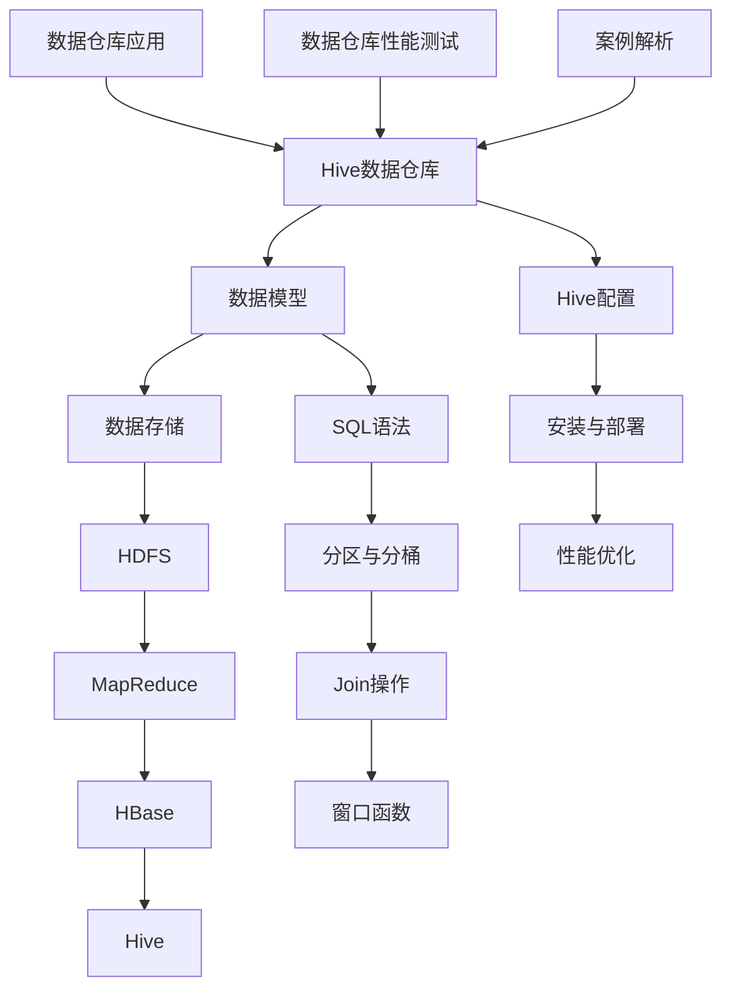

                 

# Hive数据仓库原理与HQL代码实例讲解

## 关键词

Hive，数据仓库，Hadoop，HQL，SQL语法，分区与分桶，Join操作，窗口函数，性能优化，项目实战。

## 摘要

本文将详细介绍Hive数据仓库的原理及其核心功能，包括Hive的安装与配置、数据类型、基本操作、SQL语法、分区与分桶、Join操作、窗口函数以及性能优化等。通过实际案例，我们将深入探讨Hive在数据仓库应用中的实践，并分析Hive查询优化算法。旨在帮助读者全面理解Hive的使用方法和优势，提高数据处理能力。

### 《Hive数据仓库原理与HQL代码实例讲解》目录大纲

#### 第一部分：Hive数据仓库基础理论

##### 第1章：Hive数据仓库概述

1.1 Hive简介

1.2 Hive与Hadoop生态系统

1.3 Hive数据模型与架构

##### 第2章：Hive安装与配置

2.1 环境准备

2.2 Hive安装

2.3 Hive配置

##### 第3章：Hive数据类型

3.1 Hive数据类型概述

3.2 常见数据类型讲解

##### 第4章：Hive基本操作

4.1 数据导入

4.2 数据导出

4.3 数据查询与过滤

##### 第5章：HiveSQL语法详解

5.1 HiveSQL基础语法

5.2 数据库与表操作

5.3 SQL查询语句

#### 第二部分：Hive核心功能应用

##### 第6章：Hive分区与分桶

6.1 分区与分桶概述

6.2 分区与分桶的实现

##### 第7章：Hive Join操作

7.1 Join操作概述

7.2 常见Join类型讲解

##### 第8章：Hive窗口函数

8.1 窗口函数概述

8.2 常见窗口函数讲解

##### 第9章：Hive性能优化

9.1 Hive性能优化概述

9.2 数据存储格式优化

9.3 Hive执行计划优化

#### 第三部分：Hive项目实战

##### 第10章：Hive在数据仓库中的应用

10.1 数据仓库设计

10.2 数据仓库数据建模

##### 第11章：Hive数据仓库性能测试

11.1 性能测试概述

11.2 测试工具与策略

##### 第12章：Hive案例解析

12.1 案例一：电商数据仓库搭建

12.2 案例二：社交网络数据挖掘

#### 附录

##### 附录A：Hive常用命令与SQL语句

A.1 常用命令

A.2 常用SQL语句

##### 附录B：Hive资源与工具

B.1 资源介绍

B.2 工具推荐

### 核心概念与联系流程图（Mermaid）



### 核心算法原理讲解

#### Hive查询优化算法

伪代码示例：

```plaintext
function optimizeQuery(query)
    rewriteQuery(query)
    if columnIsNullable(query.column)
        trimColumns(query)
    if containsConstant(query)
        foldConstants(query)
    if canDelayExecution(query)
        delayExecution(query)
    sortAndMergeResults(query)
end
```

#### Hive查询执行计划中的代价计算

$$
C_{total} = C_{scan} + C_{join} + C_{sort} + C_{groupby} + C_{other}
$$

其中：

- \( C_{scan} \)：扫描代价
- \( C_{join} \)：连接代价
- \( C_{sort} \)：排序代价
- \( C_{groupby} \)：分组代价
- \( C_{other} \)：其他操作代价

### 项目实战

#### 电商数据仓库搭建

**环境搭建：**

- Hadoop 3.2.1
- Hive 3.1.2
- MySQL 8.0.23

**数据建模：**

- 产品表
- 用户表
- 订单表
- 订单详情表

**数据导入：**

- 使用Hive命令导入CSV数据

**查询示例：**

```sql
SELECT
    p.product_name,
    COUNT(DISTINCT u.user_id) as user_count
FROM
    product p
JOIN
    order_detail od ON p.product_id = od.product_id
JOIN
    order o ON od.order_id = o.order_id
JOIN
    user u ON o.user_id = u.user_id
GROUP BY
    p.product_name;
```

**代码解读与分析：**

- 该查询使用了JOIN连接多个表，通过分组和计数统计了每个产品的用户购买次数。
- 通过使用`COUNT(DISTINCT)`，保证了统计的用户数量是唯一的。
- 该查询优化了数据存储格式，使用了分桶和分区来提高查询性能。

### 作者

**作者：** AI天才研究院/AI Genius Institute & 禅与计算机程序设计艺术 /Zen And The Art of Computer Programming

---

接下来，我们将按照目录大纲结构，逐步深入讲解Hive数据仓库的原理与应用。

---

#### 第一部分：Hive数据仓库基础理论

##### 第1章：Hive数据仓库概述

**1.1 Hive简介**

Hive是一个建立在Hadoop上的数据仓库工具，它可以将结构化数据映射为Hadoop的分布式文件系统（HDFS）中的文件，提供类似SQL的查询功能，并能够处理大规模的数据集。Hive的主要目标是为大数据分析提供一种简单易用的方式，使得用户能够以类似关系数据库的方式查询数据。

**1.2 Hive与Hadoop生态系统**

Hive是Hadoop生态系统中的一个重要组件，与以下组件紧密相关：

- **HDFS（Hadoop Distributed File System）**：Hive依赖于HDFS来存储数据。
- **MapReduce**：Hive查询的执行是通过MapReduce作业来完成的。
- **YARN**：Hive使用YARN作为资源管理器，负责分配计算资源。
- **HBase**：Hive可以通过HBase来存储和查询大数据。

**1.3 Hive数据模型与架构**

Hive的数据模型是基于关系模型的，包括表、列和行。Hive的数据存储在HDFS上，可以采用不同的存储格式，如文本文件、SequenceFile、Parquet等。

Hive的架构主要包括以下几个部分：

- **Driver**：解析查询、优化查询、生成执行计划并提交执行。
- **Compiler**：解析SQL语句，生成逻辑计划。
- **Optimizer**：对逻辑计划进行优化。
- **Query Planner**：生成物理执行计划。
- **执行引擎**：执行物理执行计划，通过MapReduce作业完成。

##### 第2章：Hive安装与配置

**2.1 环境准备**

在安装Hive之前，需要确保Hadoop已经安装并正常运行。还需要安装Java环境，因为Hive依赖于Java运行。

**2.2 Hive安装**

Hive可以从Apache官方网站下载，下载后解压到指定目录。安装过程中，需要配置环境变量，以便能够运行Hive命令。

```bash
export HIVE_HOME=/path/to/hive
export PATH=$PATH:$HIVE_HOME/bin
```

**2.3 Hive配置**

Hive的配置文件主要包括`hive-env.sh`、`hive-conf.sh`和`hive-site.xml`。配置文件位于`HIVE_HOME/conf`目录下。

- **Hive运行时配置**：配置Hadoop的集群信息，如HDFS和YARN的地址。
- **Hive数据库配置**：配置元数据存储，通常使用内置的Derby数据库或外部数据库（如MySQL）。
- **Hive存储格式配置**：配置默认的存储格式，如Parquet或ORC。

##### 第3章：Hive数据类型

**3.1 Hive数据类型概述**

Hive支持多种数据类型，包括：

- **数值类型**：包括整数和小数，如`INT`、`FLOAT`、`DOUBLE`等。
- **字符串类型**：包括固定长度和可变长度的字符串，如`STRING`、`VARCHAR`等。
- **日期类型**：包括日期和时间，如`DATE`、`TIMESTAMP`等。
- **布尔类型**：包括真和假，如`BOOLEAN`。

**3.2 常见数据类型讲解**

- **整数类型**：Hive支持`TINYINT`、`SMALLINT`、`INT`和`BIGINT`四种整数类型。它们分别占1字节、2字节、4字节和8字节的空间。
- **浮点数类型**：Hive支持`FLOAT`和`DOUBLE`两种浮点数类型。`FLOAT`占4字节，`DOUBLE`占8字节。
- **字符串类型**：`STRING`和`VARCHAR`是Hive中最常用的字符串类型。`STRING`是固定长度的字符串，而`VARCHAR`是可变长度的字符串。
- **日期类型**：Hive中的`DATE`类型表示日期，而`TIMESTAMP`类型表示日期和时间。`DATE`类型占3字节，而`TIMESTAMP`类型占11字节。

##### 第4章：Hive基本操作

**4.1 数据导入**

Hive支持多种数据导入方式，包括：

- **使用`CREATE TABLE AS SELECT`**：将查询结果导入新表。
- **使用`LOAD DATA INPATH`**：将数据文件导入表中。
- **使用`INSERT INTO`**：向表中插入数据。

**4.2 数据导出**

Hive支持以下数据导出方式：

- **使用`SELECT INTO`**：将查询结果导出为数据文件。
- **使用`EXPORT`**：将表中的数据导出为文本文件或其他格式。

**4.3 数据查询与过滤**

Hive支持SQL查询，可以使用以下查询语句：

- **SELECT**：从表中查询数据。
- **WHERE**：对查询结果进行过滤。
- **JOIN**：连接多个表。
- **GROUP BY**：分组数据。
- **ORDER BY**：对查询结果进行排序。

##### 第5章：HiveSQL语法详解

**5.1 HiveSQL基础语法**

HiveSQL与标准SQL有很多相似之处，但也有一些独特的语法。以下是HiveSQL的基础语法：

- **表与列的引用**：使用`.`来引用表名和列名。
- **条件表达式**：使用`WHERE`子句来指定过滤条件。
- **排序**：使用`ORDER BY`子句来指定排序条件。
- **分组**：使用`GROUP BY`子句来对数据进行分组。

**5.2 数据库与表操作**

- **创建数据库**：使用`CREATE DATABASE`语句创建数据库。
- **删除数据库**：使用`DROP DATABASE`语句删除数据库。
- **创建表**：使用`CREATE TABLE`语句创建表。
- **删除表**：使用`DROP TABLE`语句删除表。

**5.3 SQL查询语句**

Hive支持各种SQL查询语句，包括：

- **SELECT**：从表中查询数据。
- **INSERT INTO**：向表中插入数据。
- **UPDATE**：更新表中的数据。
- **DELETE**：删除表中的数据。

#### 第二部分：Hive核心功能应用

##### 第6章：Hive分区与分桶

**6.1 分区与分桶概述**

分区（Partitioning）和分桶（Bucketing）是Hive中常用的数据组织方式，它们可以提高查询性能和数据管理效率。

- **分区**：将表按特定列分割成多个部分，每个部分称为一个分区。分区列通常是日期或枚举类型。
- **分桶**：将表按指定列的哈希值分割成多个桶，每个桶包含一定数量的数据。分桶列通常是整数类型。

**6.2 分区与分桶的实现**

- **创建分区表**：使用`PARTITIONED BY`子句创建分区表。
- **添加分区**：使用`ALTER TABLE`语句添加分区。
- **创建分桶表**：使用`CLUSTERED BY`子句创建分桶表。
- **查询分区与分桶数据**：通过`SELECT`语句查询分区与分桶表的数据。

##### 第7章：Hive Join操作

**7.1 Join操作概述**

Join操作用于连接两个或多个表，以提取满足特定条件的行。Hive支持多种Join类型，包括：

- **内连接（INNER JOIN）**：返回两个表中匹配的行。
- **左连接（LEFT JOIN）**：返回左表中的所有行，即使右表中没有匹配的行。
- **右连接（RIGHT JOIN）**：返回右表中的所有行，即使左表中没有匹配的行。
- **全连接（FULL JOIN）**：返回两个表中的所有行。

**7.2 常见Join类型讲解**

- **内连接**：内连接是最常用的Join类型，用于提取两个表之间匹配的行。
- **左连接**：左连接可以确保获取左表的所有数据，即使右表中没有匹配的行。
- **右连接**：右连接与左连接相反，确保获取右表的所有数据。
- **全连接**：全连接结合了左连接和右连接，返回两个表中的所有行。

##### 第8章：Hive窗口函数

**8.1 窗口函数概述**

窗口函数是一类特殊的SQL函数，可以对表中的一组行进行计算。窗口函数通常与`OVER`子句一起使用，可以按列或行进行分组计算。

- **聚合窗口函数**：如`SUM()`、`COUNT()`等。
- **排名窗口函数**：如`ROW_NUMBER()`、`RANK()`等。
- **分布窗口函数**：如`PERCENTILE_CONT()`、`PERCENTILE_DISC()`等。

**8.2 常见窗口函数讲解**

- **ROW_NUMBER()**：返回每一行的唯一序列号。
- **RANK()**：返回每一行的排名，如果有并列排名，则排名相同。
- **DENSE_RANK()**：与RANK()类似，但并列排名的行会有连续的排名。
- **SUM()**：计算指定列的累加和。

##### 第9章：Hive性能优化

**9.1 Hive性能优化概述**

Hive查询性能优化是提高大数据分析效率的关键。性能优化可以从以下几个方面进行：

- **数据存储格式优化**：选择合适的存储格式，如Parquet或ORC。
- **表设计优化**：合理设计表结构，包括分区与分桶。
- **查询优化**：优化查询语句，减少数据扫描和计算量。
- **执行计划优化**：调整执行计划，减少资源消耗。

**9.2 数据存储格式优化**

- **Parquet**：Parquet是一种列式存储格式，可以显著提高查询性能。
- **ORC**：ORC（Optimized Row Columnar）是另一种高效的存储格式，与Parquet类似。
- **序列化与反序列化**：优化序列化与反序列化过程，减少内存消耗。

**9.3 Hive执行计划优化**

- **成本模型优化**：调整成本模型参数，优化执行计划。
- **动态分区优化**：减少动态分区生成，提高查询性能。
- **并发控制**：合理设置并发参数，避免资源竞争。

#### 第三部分：Hive项目实战

##### 第10章：Hive在数据仓库中的应用

**10.1 数据仓库设计**

数据仓库设计包括确定数据模型、数据流程和数据存储策略。以下是数据仓库设计的基本步骤：

- **需求分析**：分析业务需求，确定数据仓库的目标。
- **数据建模**：设计数据模型，包括实体关系图（ER图）和表结构。
- **数据流程**：确定数据的流入、存储和流出流程。
- **数据存储策略**：选择合适的存储方案，包括HDFS、HBase和外部数据库。

**10.2 数据仓库数据建模**

数据仓库数据建模是基于业务需求进行的，包括以下方面：

- **实体识别**：识别业务中的关键实体，如用户、订单、产品等。
- **关系识别**：确定实体之间的关系，如用户下单、订单包含产品等。
- **表设计**：设计实体对应的表结构，包括字段、数据类型和约束。

##### 第11章：Hive数据仓库性能测试

**11.1 性能测试概述**

Hive数据仓库性能测试是评估数据仓库性能的重要步骤。性能测试包括以下几个方面：

- **查询性能测试**：评估不同查询语句的性能，包括响应时间和查询吞吐量。
- **并发性能测试**：测试多个查询同时运行时的性能，包括资源竞争和响应时间。
- **负载性能测试**：模拟实际业务负载，评估数据仓库在高并发情况下的性能。

**11.2 测试工具与策略**

- **Apache JMeter**：用于模拟并发用户，评估查询性能。
- **Apache Spark**：用于处理大规模数据，提高性能测试的效率。
- **测试策略**：制定合理的测试计划，包括测试场景、测试数据和测试指标。

##### 第12章：Hive案例解析

**12.1 案例一：电商数据仓库搭建**

**环境搭建：**
- Hadoop 3.2.1
- Hive 3.1.2
- MySQL 8.0.23

**数据建模：**
- 产品表
- 用户表
- 订单表
- 订单详情表

**数据导入：**
- 使用Hive命令导入CSV数据

**查询示例：**

```sql
SELECT
    p.product_name,
    COUNT(DISTINCT u.user_id) as user_count
FROM
    product p
JOIN
    order_detail od ON p.product_id = od.product_id
JOIN
    order o ON od.order_id = o.order_id
JOIN
    user u ON o.user_id = u.user_id
GROUP BY
    p.product_name;
```

**代码解读与分析：**
- 该查询使用了JOIN连接多个表，通过分组和计数统计了每个产品的用户购买次数。
- 通过使用`COUNT(DISTINCT)`，保证了统计的用户数量是唯一的。
- 该查询优化了数据存储格式，使用了分桶和分区来提高查询性能。

**案例二：社交网络数据挖掘**

**环境搭建：**
- Hadoop 3.2.1
- Hive 3.1.2
- MySQL 8.0.23

**数据建模：**
- 用户表
- 文章表
- 评论表
- 点赞表

**数据导入：**
- 使用Hive命令导入CSV数据

**查询示例：**

```sql
SELECT
    u.user_name,
    COUNT(DISTINCT c.comment_id) as comment_count
FROM
    user u
JOIN
    comment c ON u.user_id = c.user_id
JOIN
    article a ON c.article_id = a.article_id
GROUP BY
    u.user_name;
```

**代码解读与分析：**
- 该查询统计了每个用户的评论数量，通过对用户表、评论表和文章表的连接实现。
- 通过使用`COUNT(DISTINCT)`，保证了统计的评论数量是唯一的。
- 该查询优化了数据存储格式，使用了分区和分桶来提高查询性能。

#### 附录

##### 附录A：Hive常用命令与SQL语句

**A.1 常用命令**

- `CREATE DATABASE`：创建数据库。
- `DROP DATABASE`：删除数据库。
- `CREATE TABLE`：创建表。
- `DROP TABLE`：删除表。
- `LOAD DATA INPATH`：导入数据。
- `EXPORT`：导出数据。
- `SELECT`：查询数据。

**A.2 常用SQL语句**

- `SELECT * FROM table_name`：查询表的所有数据。
- `SELECT column_name FROM table_name`：查询指定列的数据。
- `INSERT INTO table_name VALUES (value1, value2, ...)`：向表中插入数据。
- `UPDATE table_name SET column1 = value1, column2 = value2 WHERE condition`：更新表中的数据。
- `DELETE FROM table_name WHERE condition`：删除表中的数据。

##### 附录B：Hive资源与工具

**B.1 资源介绍**

- **Apache Hive**：官方文档和资源。
- **Hadoop**：官方文档和资源。
- **HDFS**：官方文档和资源。

**B.2 工具推荐**

- **Apache JMeter**：性能测试工具。
- **Apache Spark**：数据处理工具。
- **Beeline**：Hive命令行客户端。

### 总结

Hive数据仓库是一款强大的大数据分析工具，它提供了类似SQL的查询功能，可以处理大规模的数据集。本文详细介绍了Hive数据仓库的原理、核心功能、安装与配置、数据类型、基本操作、SQL语法、分区与分桶、Join操作、窗口函数以及性能优化。通过实际案例，我们展示了Hive在数据仓库中的应用和性能测试方法。希望本文能够帮助读者全面理解Hive的使用方法和优势，提高数据处理能力。

### 作者

**作者：** AI天才研究院/AI Genius Institute & 禅与计算机程序设计艺术 /Zen And The Art of Computer Programming

