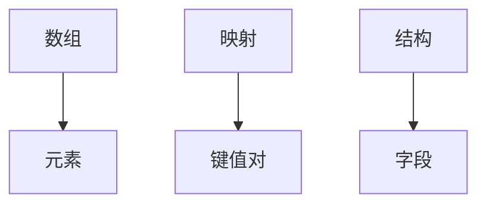
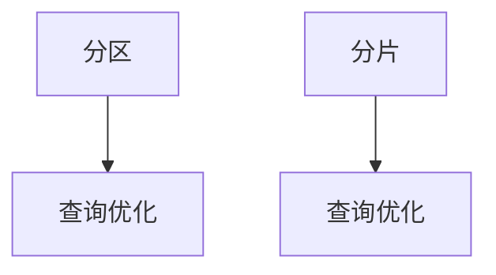
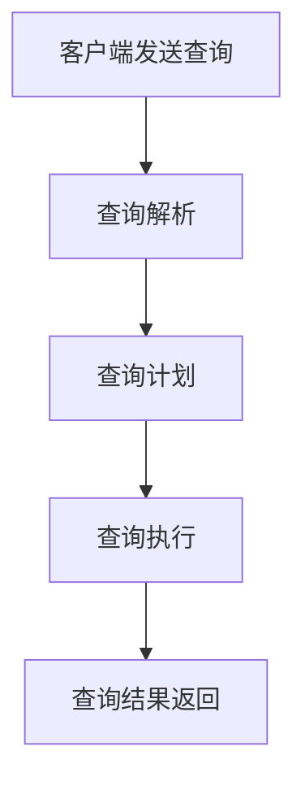

                 

### 文章标题

《Impala原理与代码实例讲解》

### 关键词

Impala、原理、代码实例、大数据处理、SQL编程、性能优化、实战技巧

### 摘要

本文将深入探讨Impala的原理与应用，旨在帮助读者全面理解Impala的工作机制和优势。文章将从Impala的基础知识入手，详细讲解其核心概念、数据存储、查询优化、SQL编程等关键技术。此外，本文还将结合实际项目案例，展示Impala在电商数据分析、金融风控和社交媒体分析等领域的应用。最后，文章将提供性能优化和实战技巧，助力读者在实际开发中高效使用Impala。通过阅读本文，读者将对Impala有一个系统的认识，并能掌握其实际应用技巧。

## 《Impala原理与代码实例讲解》目录大纲

### 第一部分：Impala基础

#### 第1章：Impala简介

- **1.1 Impala的历史与发展**
  - Impala的发展历程
  - Impala的关键里程碑

- **1.2 Impala的特点与优势**
  - 快速查询
  - 易用性
  - 扩展性

- **1.3 Impala的基本架构**
  - 组件构成
  - 工作流程

#### 第2章：Impala核心概念

- **2.1 数据仓库与大数据处理**
  - 数据仓库的定义
  - 大数据处理的概念

- **2.2 Impala的数据模型**
  - 数据模型概述
  - 数据表类型

- **2.3 Impala的数据类型**
  - 常见数据类型
  - 复杂数据类型

#### 第3章：Impala数据存储

- **3.1 Impala表的基本类型**
  - 概述
  - 具体类型

- **3.2 分布式文件系统与Impala**
  - HDFS与Impala的关系
  - 其他分布式文件系统支持

- **3.3 Impala表的存储优化**
  - 存储策略
  - 分区与分片

#### 第4章：Impala查询优化

- **4.1 Impala查询执行流程**
  - 执行过程
  - 性能影响因素

- **4.2 Impala查询优化策略**
  - 优化原则
  - 常用策略

- **4.3 Impala查询性能调优**
  - 性能监控
  - 调优实战

#### 第5章：Impala SQL编程

- **5.1 Impala SQL基础语法**
  - 数据定义
  - 数据操作

- **5.2 高级SQL查询技巧**
  - 子查询
  - 连接操作

- **5.3 子查询与连接操作**
  - 子查询用法
  - 连接类型

#### 第6章：Impala函数与操作符

- **6.1 常用Impala函数**
  - 数学函数
  - 字符串函数

- **6.2 操作符详解**
  - 运算符类型
  - 运算符优先级

- **6.3 分组和聚合操作**
  - 分组操作
  - 聚合函数

### 第二部分：Impala项目实战

#### 第7章：Impala在电商数据分析中的应用

- **7.1 电商数据分析背景**
  - 数据来源
  - 分析目的

- **7.2 电商数据采集与处理**
  - 数据采集方法
  - 数据处理流程

- **7.3 用户行为分析**
  - 用户行为定义
  - 分析方法

- **7.4 产品销售分析**
  - 销售数据收集
  - 销售分析策略

#### 第8章：Impala在金融风控中的应用

- **8.1 金融风控背景**
  - 风险管理
  - 风险评估

- **8.2 客户信用评分模型**
  - 评分模型设计
  - 实际应用

- **8.3 交易风险监测**
  - 风险监测方法
  - 实时监测

- **8.4 风险评估与决策**
  - 风险评估指标
  - 决策策略

#### 第9章：Impala在社交媒体数据分析中的应用

- **9.1 社交媒体数据分析背景**
  - 数据来源
  - 分析目的

- **9.2 用户关系网络分析**
  - 网络结构
  - 分析方法

- **9.3 社交媒体舆情分析**
  - 舆情定义
  - 分析技巧

- **9.4 广告效果评估**
  - 广告投放数据
  - 评估方法

#### 第10章：Impala应用案例分析

- **10.1 案例一：某大型电商平台数据分析**
  - 项目背景
  - 数据分析流程

- **10.2 案例二：某金融机构风险控制**
  - 风险控制目标
  - 实施策略

- **10.3 案例三：某社交媒体平台数据分析**
  - 数据分析需求
  - 分析结果

#### 第11章：Impala性能优化与实战技巧

- **11.1 Impala性能优化策略**
  - 优化原则
  - 实践经验

- **11.2 实战技巧分享**
  - SQL优化技巧
  - 系统调优

- **11.3 常见问题解答与解决方案**
  - 性能瓶颈
  - 解决方案

### 附录

- **附录A：Impala常用SQL语法汇总**
  - SQL语句示例

- **附录B：Impala函数参考**
  - 函数分类
  - 函数使用示例

- **附录C：Impala常见错误代码解析**
  - 错误代码列表
  - 解决方案

## 第1章 Impala简介

### 1.1 Impala的历史与发展

Impala是由Cloudera开发的一款大数据查询引擎，旨在提供快速、高效的数据查询能力。它的诞生可以追溯到2006年，当时Google发布了其分布式文件系统GFS，开启了大数据处理的先河。随后，Google又发布了MapReduce编程模型，为大数据处理提供了新的思路。这些技术为Impala的诞生奠定了基础。

2008年，Cloudera成立，致力于推动大数据技术的发展和应用。Impala项目于2009年开始开发，2010年正式发布。随着Hadoop生态系统的不断完善，Impala逐渐成为了大数据查询领域的领先者。

在过去的几年中，Impala经历了多个版本迭代，不断优化和扩展其功能。目前，Impala已经成为了大数据处理领域不可或缺的工具之一，广泛应用于企业级应用中。

### 1.2 Impala的特点与优势

Impala具有以下特点与优势：

1. **快速查询**：Impala基于内存计算，能够实现亚秒级响应时间，大幅提高了数据查询速度。

2. **易用性**：Impala支持标准的SQL语法，用户无需学习新的查询语言，能够快速上手。

3. **扩展性**：Impala支持分布式架构，可以水平扩展，满足大规模数据处理的需求。

4. **高可靠性**：Impala具备高可用性，能够在数据损坏或节点故障的情况下保持数据完整性。

5. **兼容性**：Impala兼容Hadoop生态系统，可以与HDFS、Hive、Spark等组件无缝集成。

### 1.3 Impala的基本架构

Impala的基本架构包括以下几个主要组件：

1. **Impala Daemon**：运行在集群中的每个节点上，负责执行查询任务。

2. **Impala Coordinator**：负责调度和管理查询任务，协调各Impala Daemon的工作。

3. **Client**：客户端程序，用于发送查询请求到Impala Coordinator。

4. **Metastore**：存储元数据信息，如表结构、分区信息等。

5. **HDFS**：分布式文件系统，用于存储大数据文件。

下面是Impala架构的Mermaid流程图：

```mermaid
graph TD
    Client --> Impala Coordinator
    Impala Coordinator --> Impala Daemon
    Impala Daemon --> HDFS
    Impala Coordinator --> Metastore
```

### 1.4 小结

在本章中，我们介绍了Impala的历史与发展、特点与优势以及基本架构。接下来，我们将进一步探讨Impala的核心概念和关键技术，帮助读者更深入地了解Impala的工作原理和应用。

## 第2章 Impala核心概念

### 2.1 数据仓库与大数据处理

#### 2.1.1 数据仓库的定义

数据仓库（Data Warehouse）是一个集成了大量数据的系统，用于支持企业级的决策支持系统（DSS）。它通常包含历史数据、多维数据集和复杂的分析功能，帮助企业从海量数据中提取有价值的信息。

数据仓库的特点包括：

1. **数据集成**：数据仓库将来自不同源的数据进行整合，实现数据的一致性和完整性。
2. **数据清洗**：对数据进行清洗、去重、转换等处理，确保数据质量。
3. **数据存储**：采用大数据存储技术，如分布式文件系统，存储海量数据。
4. **数据分析**：提供丰富的分析功能，如OLAP（联机分析处理）、数据挖掘等。

#### 2.1.2 大数据处理的概念

大数据处理（Big Data Processing）是指对大规模数据集进行高效存储、管理和分析的能力。大数据处理的挑战包括数据量巨大、数据类型多样、处理速度快等。

大数据处理的主要技术包括：

1. **分布式存储**：如HDFS、Cassandra等，能够存储PB级别的数据。
2. **分布式计算**：如MapReduce、Spark等，能够高效处理海量数据。
3. **数据挖掘和机器学习**：如Mahout、MLlib等，能够从数据中提取有价值的信息。
4. **实时处理**：如Storm、Spark Streaming等，能够处理实时数据流。

#### 2.1.3 数据仓库与大数据处理的关系

数据仓库和大数据处理紧密相关。数据仓库是大数据处理的重要应用场景之一，它需要大数据处理技术来实现数据的存储、管理和分析。大数据处理技术的发展，如分布式存储和计算，为数据仓库提供了更强大的支持。

### 2.2 Impala的数据模型

#### 2.2.1 数据模型概述

Impala的数据模型基于关系型数据库，采用SQL语法进行数据操作。数据模型主要包括以下几种类型：

1. **表（Table）**：数据仓库中的基本数据结构，用于存储数据。
2. **视图（View）**：虚拟表，基于SQL查询结果创建，可以简化复杂的查询操作。
3. **索引（Index）**：用于加速数据查询，提高查询效率。
4. **分区（Partition）**：将大表划分为多个小表，提高查询性能。

#### 2.2.2 表的类型

Impala支持多种表类型，包括：

1. **标准表（Standard Table）**：存储数据的默认表类型。
2. **外部表（External Table）**：引用HDFS上的数据，不占用Impala的存储空间。
3. **临时表（Temporary Table）**：仅在当前会话中有效，会话结束后自动删除。
4. **分区表（Partitioned Table）**：根据指定列值将数据划分为多个分区，提高查询性能。

#### 2.2.3 分区与分片

分区（Partitioning）是将大表根据指定列值划分为多个小表，每个小表称为一个分区。分区的目的是提高查询性能，减少查询范围。

分片（Sharding）是将数据分散存储到多个节点上，每个节点负责一部分数据的查询。分片的目的是提高系统的可扩展性和性能。

下面是分区和分片的Mermaid流程图：

```mermaid
graph TD
    Subgraph 分区
        A[表] --> B[分区]
        B --> C[查询优化]
    Subgraph 分片
        D[数据] --> E[分片]
        E --> F[查询优化]
    Subgraph 对比
        C --> G[查询范围缩小]
        F --> H[查询范围缩小]
```

### 2.3 Impala的数据类型

#### 2.3.1 常见数据类型

Impala支持多种数据类型，包括：

1. **整数类型**：如INT、BIGINT等。
2. **浮点数类型**：如FLOAT、DOUBLE等。
3. **字符类型**：如CHAR、VARCHAR等。
4. **日期类型**：如DATE、TIMESTAMP等。
5. **复杂数据类型**：如ARRAY、MAP、STRUCT等。

#### 2.3.2 复杂数据类型

复杂数据类型包括数组、映射和结构等，用于表示复杂的数据结构。

1. **数组（ARRAY）**：用于存储一组相同类型的元素。
2. **映射（MAP）**：用于存储键值对。
3. **结构（STRUCT）**：用于存储具有多个字段的记录。

下面是复杂数据类型的Mermaid流程图：



### 2.4 小结

在本章中，我们介绍了Impala的数据仓库与大数据处理、数据模型和常见数据类型。理解这些核心概念，是掌握Impala的基础。接下来，我们将探讨Impala的数据存储机制，帮助读者更全面地了解Impala的工作原理。

## 第3章 Impala数据存储

### 3.1 Impala表的基本类型

Impala支持多种表类型，每种表类型都有其特定的用途和特点。以下是Impala表的基本类型及其详细介绍：

#### 3.1.1 标准表（Standard Table）

标准表是Impala中默认的表类型，它直接在Impala的存储层中创建和存储数据。标准表有以下特点：

1. **数据存储**：数据直接存储在Impala的存储层中，无法在其他存储系统中访问。
2. **元数据存储**：表的元数据（如表结构、分区信息）存储在Impala的元数据存储层中。
3. **性能**：标准表在查询时性能较好，适用于大部分场景。

#### 3.1.2 外部表（External Table）

外部表是一种引用其他存储系统中的数据的表类型。外部表不占用Impala的存储空间，而是通过引用HDFS或其他分布式文件系统中的数据文件来访问数据。外部表有以下特点：

1. **数据存储**：数据存储在外部文件系统中，如HDFS。
2. **元数据存储**：表的元数据存储在Impala的元数据存储层中，描述外部文件的结构和位置。
3. **兼容性**：外部表可以引用多种文件格式，如Parquet、ORC、CSV等。
4. **查询性能**：外部表的查询性能取决于外部文件系统的性能。

#### 3.1.3 临时表（Temporary Table）

临时表是仅在当前会话中有效的表类型。临时表在会话结束后会自动删除。临时表有以下特点：

1. **数据存储**：临时表的数据存储在Impala的内存中，不占用磁盘空间。
2. **元数据存储**：临时表的元数据存储在Impala的元数据存储层中。
3. **用途**：临时表常用于临时数据计算、查询中间结果等场景。

#### 3.1.4 分区表（Partitioned Table）

分区表是将大表根据指定列值划分为多个小表的表类型。分区表有助于提高查询性能，因为查询时可以仅访问相关的分区。分区表有以下特点：

1. **数据存储**：分区表的数据存储在各自的分区中，每个分区独立管理。
2. **元数据存储**：分区表的元数据存储在Impala的元数据存储层中，描述每个分区的结构。
3. **性能优化**：分区表可以通过减少查询范围和数据读取量来提高查询性能。

#### 3.1.5 分区与分片

分区和分片是两个相关但不同的概念。分区是将数据根据某一列或几列的值划分为多个小表，而分片是将数据分散存储到多个节点上。

1. **分区**：分区可以独立管理，分区表的数据存储在各自的分区中。查询时，Impala可以快速定位到相关的分区，减少数据读取量。
2. **分片**：分片是将数据分散存储到多个节点上，每个节点负责一部分数据的查询。分片有助于提高系统的扩展性和性能。

下面是分区和分片的Mermaid流程图：



### 3.2 分布式文件系统与Impala

Impala支持与多种分布式文件系统集成，其中最常用的是HDFS。HDFS（Hadoop Distributed File System）是Hadoop生态系统中的一个核心组件，用于存储大数据文件。Impala与HDFS的集成具有以下优势：

1. **数据存储**：HDFS可以存储PB级别的数据，满足大数据存储需求。
2. **高可靠性**：HDFS采用副本机制，确保数据在节点故障时能够快速恢复。
3. **高吞吐量**：HDFS通过分布式存储和计算，提高数据读写性能。
4. **兼容性**：Impala支持多种文件格式，如Parquet、ORC、CSV等，与HDFS无缝集成。

### 3.3 Impala表的存储优化

Impala表的存储优化是提高查询性能的重要手段。以下是几种常见的存储优化策略：

#### 3.3.1 分区优化

分区优化可以通过以下几种方式实现：

1. **基于常用查询条件分区**：根据常用查询条件对数据进行分区，减少查询范围。
2. **基于数据量分区**：根据数据量大小对数据进行分区，避免大表性能下降。
3. **动态分区**：根据数据变化动态调整分区，保持分区性能最优。

#### 3.3.2 分片优化

分片优化可以通过以下几种方式实现：

1. **水平分片**：将数据分散存储到多个节点上，提高查询性能。
2. **垂直分片**：将数据按照不同的属性划分为多个表，减少数据冗余和查询复杂度。
3. **数据倾斜优化**：通过调整分片策略，避免数据倾斜导致性能下降。

#### 3.3.3 存储格式优化

存储格式优化可以通过以下几种方式实现：

1. **选择高效存储格式**：如Parquet、ORC等，提高数据存储和查询性能。
2. **压缩优化**：选择合适的压缩算法，减少存储空间占用。
3. **列式存储**：采用列式存储格式，提高查询性能。

#### 3.3.4 索引优化

索引优化可以通过以下几种方式实现：

1. **创建索引**：为常用查询字段创建索引，提高查询性能。
2. **索引维护**：定期维护索引，保持索引的有效性和性能。
3. **索引策略**：根据查询需求选择合适的索引策略，如聚族索引、非聚族索引等。

### 3.4 小结

在本章中，我们介绍了Impala表的基本类型、分布式文件系统与Impala的集成以及存储优化策略。理解这些内容，有助于更好地管理和优化Impala表，提高查询性能。接下来，我们将探讨Impala的查询优化技术，帮助读者深入掌握Impala的性能优化技巧。

## 第4章 Impala查询优化

### 4.1 Impala查询执行流程

Impala查询执行流程可以分为以下几个主要阶段：

1. **查询解析（Query Parsing）**：
   - Impala客户端发送查询语句到Impala Coordinator。
   - Impala Coordinator接收查询语句，对其进行语法解析和语义解析。
   - 解析完成后，生成查询的抽象语法树（AST）和查询计划。

2. **查询计划（Query Planning）**：
   - Impala Coordinator根据AST生成查询计划，包括执行策略、数据访问路径等。
   - 查询计划经过优化，以最小化查询执行时间和资源消耗。

3. **查询执行（Query Execution）**：
   - Impala Coordinator将查询计划分发到各个Impala Daemon。
   - Impala Daemon执行查询计划，读取数据、执行计算和输出结果。

4. **查询结果返回（Query Result Return）**：
   - 查询结果从Impala Daemon返回到Impala Coordinator。
   - Impala Coordinator将查询结果返回到Impala客户端。

下面是Impala查询执行流程的Mermaid流程图：



### 4.2 Impala查询优化策略

Impala查询优化策略主要分为以下几种：

#### 4.2.1 查询优化原则

1. **减少数据访问量**：通过索引、分区和分片等技术，减少查询时需要访问的数据量。
2. **优化数据访问路径**：选择合适的数据访问路径，如扫描、索引扫描、连接等，以最小化数据传输和处理时间。
3. **提高计算效率**：通过并行计算、内存计算等技术，提高查询计算效率。
4. **避免重复计算**：减少重复计算和冗余操作，以降低查询执行时间。

#### 4.2.2 常用优化策略

1. **索引优化**：
   - 为常用查询字段创建索引，提高查询性能。
   - 根据查询需求选择合适的索引类型，如聚族索引、非聚族索引等。
   - 定期维护索引，保持索引的有效性和性能。

2. **分区优化**：
   - 根据常用查询条件对数据进行分区，减少查询范围。
   - 根据数据量大小进行动态分区调整，保持分区性能最优。
   - 利用分区裁剪，只访问相关的分区，减少数据访问量。

3. **连接优化**：
   - 选择合适连接类型，如内连接、外连接、交叉连接等，以最小化连接操作。
   - 优化连接顺序，提高连接性能。
   - 利用索引和分区，减少连接时的数据访问量。

4. **内存管理优化**：
   - 合理分配内存资源，避免内存不足或内存浪费。
   - 利用内存计算，提高查询计算速度。
   - 定期进行内存回收，保持内存空间的利用率。

5. **并发控制优化**：
   - 优化并发查询，减少锁争用和冲突。
   - 选择合适的并发控制策略，如共享锁、排他锁等。

### 4.3 Impala查询性能调优

Impala查询性能调优是一个复杂的过程，需要根据具体场景进行针对性的优化。以下是几种常见的查询性能调优方法：

#### 4.3.1 性能监控

1. **监控查询执行时间**：通过监控查询的执行时间，分析查询性能瓶颈。
2. **监控资源消耗**：监控CPU、内存、磁盘I/O等资源消耗，识别资源瓶颈。
3. **监控并发查询**：监控并发查询的数量和性能，优化并发控制策略。

#### 4.3.2 调优实战

1. **索引优化**：
   - 为常用查询字段创建索引。
   - 根据查询需求，选择合适的索引类型。
   - 定期维护索引，如重建索引、清理索引等。

2. **分区优化**：
   - 根据常用查询条件，对数据进行动态分区。
   - 根据数据量大小，合理调整分区策略。
   - 利用分区裁剪，减少数据访问量。

3. **连接优化**：
   - 选择合适的连接类型和连接顺序。
   - 利用索引和分区，减少连接时的数据访问量。
   - 优化连接操作的并行度。

4. **内存管理优化**：
   - 合理分配内存资源，避免内存不足或内存浪费。
   - 利用内存计算，提高查询计算速度。
   - 定期进行内存回收，保持内存空间的利用率。

5. **并发控制优化**：
   - 选择合适的并发控制策略，减少锁争用和冲突。
   - 优化并发查询的执行顺序，提高并发性能。

### 4.4 小结

在本章中，我们介绍了Impala查询执行流程、查询优化策略以及查询性能调优方法。掌握这些内容，有助于提高Impala查询的性能和效率。接下来，我们将深入学习Impala的SQL编程，帮助读者掌握Impala的编程技巧和应用。

## 第5章 Impala SQL编程

### 5.1 Impala SQL基础语法

Impala支持标准的SQL语法，这使得熟悉SQL的程序员能够快速上手。本节将介绍Impala SQL的基础语法，包括数据定义、数据操作和数据查询。

#### 5.1.1 数据定义

数据定义用于创建表、列、索引等数据库对象。以下是几个常见的数据定义语句：

1. **创建表（CREATE TABLE）**：

   ```sql
   CREATE TABLE [IF NOT EXISTS] table_name (
       column_name1 data_type1 [COMMENT 'comment1'],
       column_name2 data_type2 [COMMENT 'comment2'],
       ...
   ) [COMMENT 'table comment'];
   ```

   示例：

   ```sql
   CREATE TABLE IF NOT EXISTS employees (
       emp_id INT COMMENT '员工编号',
       emp_name STRING COMMENT '员工姓名',
       emp_salary DECIMAL(10, 2) COMMENT '员工薪资'
   ) COMMENT '员工信息表';
   ```

2. **修改表（ALTER TABLE）**：

   ```sql
   ALTER TABLE table_name
       [ALTER COLUMN column_name1 new_data_type1 [COMMENT 'new_comment1']],
       [ADD COLUMN column_name2 data_type2 [COMMENT 'comment2']];
   ```

   示例：

   ```sql
   ALTER TABLE employees
       ALTER COLUMN emp_salary DECIMAL(10, 2) COMMENT '员工薪资';
   ```

3. **删除表（DROP TABLE）**：

   ```sql
   DROP TABLE [IF EXISTS] table_name;
   ```

   示例：

   ```sql
   DROP TABLE IF EXISTS employees;
   ```

#### 5.1.2 数据操作

数据操作用于插入、更新和删除表中的数据。以下是几个常见的数据操作语句：

1. **插入数据（INSERT INTO）**：

   ```sql
   INSERT INTO table_name [(column1, column2, ...)]
       VALUES (value1, value2, ...);
   ```

   示例：

   ```sql
   INSERT INTO employees (emp_id, emp_name, emp_salary)
       VALUES (1, 'Alice', 5000.00);
   ```

2. **更新数据（UPDATE）**：

   ```sql
   UPDATE table_name
       SET column_name1 = value1, column_name2 = value2, ...
       [WHERE condition];
   ```

   示例：

   ```sql
   UPDATE employees
       SET emp_salary = emp_salary * 1.1
       WHERE emp_id = 1;
   ```

3. **删除数据（DELETE FROM）**：

   ```sql
   DELETE FROM table_name
       [WHERE condition];
   ```

   示例：

   ```sql
   DELETE FROM employees
       WHERE emp_id = 1;
   ```

#### 5.1.3 数据查询

数据查询用于从表中检索数据。以下是几个常见的查询语句：

1. **简单查询（SELECT）**：

   ```sql
   SELECT column1, column2, ...
       FROM table_name
       [WHERE condition]
       [GROUP BY column]
       [HAVING condition]
       [ORDER BY column [ASC | DESC]];
   ```

   示例：

   ```sql
   SELECT emp_id, emp_name, emp_salary
       FROM employees
       WHERE emp_salary > 5000.00
       ORDER BY emp_salary DESC;
   ```

2. **聚合查询（AGGREGATE FUNCTIONS）**：

   ```sql
   SELECT aggregate_function(column)
       FROM table_name
       [WHERE condition]
       [GROUP BY column]
       [HAVING condition];
   ```

   示例：

   ```sql
   SELECT COUNT(*) AS total_employees
       FROM employees;
   ```

3. **子查询（SUBQUERIES）**：

   ```sql
   SELECT column1, column2, ...
       FROM table_name
       WHERE condition = (SELECT column FROM another_table);
   ```

   示例：

   ```sql
   SELECT emp_id, emp_name
       FROM employees
       WHERE emp_salary = (SELECT MIN(emp_salary) FROM employees);
   ```

4. **连接查询（JOIN）**：

   ```sql
   SELECT column1, column2, ...
       FROM table1
       [INNER | LEFT | RIGHT | FULL] JOIN table2
           ON table1.column = table2.column;
   ```

   示例：

   ```sql
   SELECT e.emp_id, e.emp_name, d.dept_name
       FROM employees e
       INNER JOIN departments d ON e.dept_id = d.dept_id;
   ```

### 5.2 高级SQL查询技巧

Impala支持丰富的SQL查询功能，高级SQL查询技巧能够帮助开发者解决复杂的数据分析问题。以下是几种高级SQL查询技巧：

#### 5.2.1 子查询

子查询是一个SQL查询语句中嵌套的另一个查询。子查询可以用于筛选数据、计算聚合值等。

1. **相关子查询（Correlated Subqueries）**：

   ```sql
   SELECT column1, column2, ...
       FROM table1
       WHERE column1 = (SELECT column FROM table2 WHERE table1.column = table2.column);
   ```

   示例：

   ```sql
   SELECT e.emp_id, e.emp_name, e.emp_salary
       FROM employees e
       WHERE e.emp_salary = (SELECT MIN(emp_salary) FROM employees WHERE e.dept_id = dept_id);
   ```

2. **非相关子查询（Non-Correlated Subqueries）**：

   ```sql
   SELECT column1, column2, ...
       FROM table1
       WHERE column1 = (SELECT column FROM table2);
   ```

   示例：

   ```sql
   SELECT emp_id, emp_name
       FROM employees
       WHERE emp_salary = (SELECT MIN(emp_salary) FROM employees);
   ```

#### 5.2.2 连接操作

连接操作用于合并两个或多个表的数据。Impala支持多种连接类型，如内连接、左连接、右连接和全连接。

1. **内连接（INNER JOIN）**：

   ```sql
   SELECT column1, column2, ...
       FROM table1
       INNER JOIN table2
           ON table1.column = table2.column;
   ```

   示例：

   ```sql
   SELECT e.emp_id, e.emp_name, d.dept_name
       FROM employees e
       INNER JOIN departments d ON e.dept_id = d.dept_id;
   ```

2. **左连接（LEFT JOIN）**：

   ```sql
   SELECT column1, column2, ...
       FROM table1
       LEFT JOIN table2
           ON table1.column = table2.column;
   ```

   示例：

   ```sql
   SELECT e.emp_id, e.emp_name, d.dept_name
       FROM employees e
       LEFT JOIN departments d ON e.dept_id = d.dept_id;
   ```

3. **右连接（RIGHT JOIN）**：

   ```sql
   SELECT column1, column2, ...
       FROM table1
       RIGHT JOIN table2
           ON table1.column = table2.column;
   ```

   示例：

   ```sql
   SELECT e.emp_id, e.emp_name, d.dept_name
       FROM employees e
       RIGHT JOIN departments d ON e.dept_id = d.dept_id;
   ```

4. **全连接（FULL JOIN）**：

   ```sql
   SELECT column1, column2, ...
       FROM table1
       FULL JOIN table2
           ON table1.column = table2.column;
   ```

   示例：

   ```sql
   SELECT e.emp_id, e.emp_name, d.dept_name
       FROM employees e
       FULL JOIN departments d ON e.dept_id = d.dept_id;
   ```

#### 5.2.3 子查询与连接操作结合

子查询和连接操作可以结合使用，以实现更复杂的数据查询。

1. **嵌套子查询**：

   ```sql
   SELECT column1, column2, ...
       FROM table1
       WHERE column1 IN (SELECT column FROM table2);
   ```

   示例：

   ```sql
   SELECT e.emp_id, e.emp_name, e.emp_salary
       FROM employees e
       WHERE e.emp_salary IN (SELECT MIN(emp_salary) FROM employees GROUP BY dept_id);
   ```

2. **连接操作与子查询结合**：

   ```sql
   SELECT column1, column2, ...
       FROM table1
       JOIN (SELECT column FROM table2) t
           ON table1.column = t.column;
   ```

   示例：

   ```sql
   SELECT e.emp_id, e.emp_name, d.dept_name
       FROM employees e
       JOIN (SELECT MIN(emp_salary) as min_salary FROM employees GROUP BY dept_id) t
           ON e.dept_id = t.dept_id;
   ```

### 5.3 子查询与连接操作

子查询和连接操作在Impala SQL编程中非常重要，能够帮助开发者解决复杂的数据查询问题。

#### 5.3.1 子查询

子查询是一个SQL查询语句中嵌套的另一个查询。子查询可以用于筛选数据、计算聚合值等。以下是几个常见的子查询类型：

1. **相关子查询**：

   相关子查询是子查询中的一种，其结果依赖于外部查询中的数据。相关子查询通常用于解决复杂的数据筛选问题。

   ```sql
   SELECT column1, column2, ...
       FROM table1
       WHERE column1 = (SELECT column FROM table2 WHERE table1.column = table2.column);
   ```

   示例：

   ```sql
   SELECT e.emp_id, e.emp_name, e.emp_salary
       FROM employees e
       WHERE e.emp_salary = (SELECT MIN(emp_salary) FROM employees WHERE e.dept_id = dept_id);
   ```

2. **非相关子查询**：

   非相关子查询是子查询中的一种，其结果不依赖于外部查询中的数据。非相关子查询通常用于计算聚合值或返回特定行的数据。

   ```sql
   SELECT column1, column2, ...
       FROM table1
       WHERE column1 = (SELECT column FROM table2);
   ```

   示例：

   ```sql
   SELECT emp_id, emp_name
       FROM employees
       WHERE emp_salary = (SELECT MIN(emp_salary) FROM employees);
   ```

#### 5.3.2 连接操作

连接操作用于合并两个或多个表的数据。Impala支持多种连接类型，如内连接、左连接、右连接和全连接。以下是几种常见的连接类型：

1. **内连接（INNER JOIN）**：

   内连接返回两个表中匹配的行。内连接是一种最常见的连接类型，其结果仅包含两个表中共有的行。

   ```sql
   SELECT column1, column2, ...
       FROM table1
       INNER JOIN table2
           ON table1.column = table2.column;
   ```

   示例：

   ```sql
   SELECT e.emp_id, e.emp_name, d.dept_name
       FROM employees e
       INNER JOIN departments d ON e.dept_id = d.dept_id;
   ```

2. **左连接（LEFT JOIN）**：

   左连接返回左表中的所有行和右表中匹配的行。如果右表中没有匹配的行，则结果中对应列的值为NULL。

   ```sql
   SELECT column1, column2, ...
       FROM table1
       LEFT JOIN table2
           ON table1.column = table2.column;
   ```

   示例：

   ```sql
   SELECT e.emp_id, e.emp_name, d.dept_name
       FROM employees e
       LEFT JOIN departments d ON e.dept_id = d.dept_id;
   ```

3. **右连接（RIGHT JOIN）**：

   右连接返回右表中的所有行和左表中匹配的行。如果左表中没有匹配的行，则结果中对应列的值为NULL。

   ```sql
   SELECT column1, column2, ...
       FROM table1
       RIGHT JOIN table2
           ON table1.column = table2.column;
   ```

   示例：

   ```sql
   SELECT e.emp_id, e.emp_name, d.dept_name
       FROM employees e
       RIGHT JOIN departments d ON e.dept_id = d.dept_id;
   ```

4. **全连接（FULL JOIN）**：

   全连接返回两个表中所有行的数据，包括左表和右表中不匹配的行。如果表中没有匹配的行，则结果中对应列的值为NULL。

   ```sql
   SELECT column1, column2, ...
       FROM table1
       FULL JOIN table2
           ON table1.column = table2.column;
   ```

   示例：

   ```sql
   SELECT e.emp_id, e.emp_name, d.dept_name
       FROM employees e
       FULL JOIN departments d ON e.dept_id = d.dept_id;
   ```

#### 5.3.3 子查询与连接操作的组合

在实际应用中，子查询和连接操作可以组合使用，以实现更复杂的数据查询。

1. **嵌套子查询**：

   嵌套子查询是指子查询中又嵌套了另一个子查询。嵌套子查询可以用于解决复杂的数据筛选问题。

   ```sql
   SELECT column1, column2, ...
       FROM table1
       WHERE column1 IN (SELECT column FROM table2);
   ```

   示例：

   ```sql
   SELECT e.emp_id, e.emp_name, e.emp_salary
       FROM employees e
       WHERE e.emp_salary IN (SELECT MIN(emp_salary) FROM employees GROUP BY dept_id);
   ```

2. **连接操作与子查询结合**：

   连接操作与子查询结合可以用于实现更复杂的数据查询。例如，可以使用子查询返回特定条件的数据，然后再与另一个表进行连接。

   ```sql
   SELECT column1, column2, ...
       FROM table1
       JOIN (SELECT column FROM table2) t
           ON table1.column = t.column;
   ```

   示例：

   ```sql
   SELECT e.emp_id, e.emp_name, d.dept_name
       FROM employees e
       JOIN (SELECT MIN(emp_salary) as min_salary FROM employees GROUP BY dept_id) t
           ON e.dept_id = t.dept_id;
   ```

### 5.4 小结

在本章中，我们介绍了Impala SQL编程的基础语法、高级查询技巧以及子查询与连接操作。掌握这些内容，有助于开发者更好地使用Impala进行大数据处理和分析。接下来，我们将深入探讨Impala的函数与操作符，帮助读者进一步理解Impala的数据处理能力。

## 第6章 Impala函数与操作符

### 6.1 常用Impala函数

Impala提供了丰富的内置函数，用于数据处理、数据转换、日期和时间处理等方面。以下是几种常用的Impala函数及其用法：

#### 6.1.1 数学函数

数学函数用于执行数学计算，如求和、求积、求绝对值等。

1. **SUM**：

   ```sql
   SUM(number)
   ```

   示例：

   ```sql
   SELECT SUM(emp_salary) AS total_salary FROM employees;
   ```

2. **COUNT**：

   ```sql
   COUNT(value)
   ```

   示例：

   ```sql
   SELECT COUNT(*) AS total_employees FROM employees;
   ```

3. **ABS**：

   ```sql
   ABS(number)
   ```

   示例：

   ```sql
   SELECT ABS(emp_salary) AS abs_salary FROM employees;
   ```

#### 6.1.2 字符串函数

字符串函数用于处理字符串数据，如字符串连接、字符串长度、字符串定位等。

1. **CONCAT**：

   ```sql
   CONCAT(string1, string2, ...)
   ```

   示例：

   ```sql
   SELECT CONCAT(emp_name, ' is working at ', company) FROM employees;
   ```

2. **LENGTH**：

   ```sql
   LENGTH(string)
   ```

   示例：

   ```sql
   SELECT LENGTH(emp_name) AS name_length FROM employees;
   ```

3. **LOWER**：

   ```sql
   LOWER(string)
   ```

   示例：

   ```sql
   SELECT LOWER(emp_name) AS lower_case_name FROM employees;
   ```

#### 6.1.3 日期和时间函数

日期和时间函数用于处理日期和时间数据，如日期加减、日期格式化等。

1. **DATEADD**：

   ```sql
   DATEADD(interval, number)
   ```

   示例：

   ```sql
   SELECT DATEADD('day', 1, '2023-01-01') AS next_day;
   ```

2. **DATEFORMAT**：

   ```sql
   DATEFORMAT(format, date)
   ```

   示例：

   ```sql
   SELECT DATEFORMAT('%Y-%m-%d', '2023-01-01') AS formatted_date;
   ```

3. **TIMEDIFF**：

   ```sql
   TIMEDIFF(time1, time2)
   ```

   示例：

   ```sql
   SELECT TIMEDIFF('12:00:00', '10:30:00') AS time_diff;
   ```

### 6.2 操作符详解

Impala支持多种操作符，用于执行各种数据操作。以下是几种常用的Impala操作符及其用法：

#### 6.2.1 运算符

运算符用于执行数学、逻辑和比较操作。

1. **加法（+）**：

   ```sql
   SELECT emp_salary + 5000 AS new_salary FROM employees;
   ```

2. **减法（-）**：

   ```sql
   SELECT emp_salary - 5000 AS old_salary FROM employees;
   ```

3. **乘法（*）**：

   ```sql
   SELECT emp_salary * 1.1 AS updated_salary FROM employees;
   ```

4. **除法（/）**：

   ```sql
   SELECT emp_salary / 100 AS percentage_salary FROM employees;
   ```

#### 6.2.2 比较运算符

比较运算符用于执行比较操作，如等于、不等于、大于、小于等。

1. **等于（=）**：

   ```sql
   SELECT * FROM employees WHERE emp_salary = 5000;
   ```

2. **不等于（!=）**：

   ```sql
   SELECT * FROM employees WHERE emp_salary != 5000;
   ```

3. **大于（>）**：

   ```sql
   SELECT * FROM employees WHERE emp_salary > 5000;
   ```

4. **小于（<）**：

   ```sql
   SELECT * FROM employees WHERE emp_salary < 5000;
   ```

#### 6.2.3 逻辑运算符

逻辑运算符用于执行逻辑操作，如逻辑与（AND）、逻辑或（OR）和逻辑非（NOT）。

1. **逻辑与（AND）**：

   ```sql
   SELECT * FROM employees WHERE emp_salary > 5000 AND emp_name = 'Alice';
   ```

2. **逻辑或（OR）**：

   ```sql
   SELECT * FROM employees WHERE emp_salary > 5000 OR emp_name = 'Alice';
   ```

3. **逻辑非（NOT）**：

   ```sql
   SELECT * FROM employees WHERE NOT emp_name = 'Alice';
   ```

### 6.3 分组和聚合操作

分组和聚合操作用于对数据进行分类和汇总。以下是几个常用的分组和聚合操作：

#### 6.3.1 分组操作

分组操作用于将数据按某一列或多列值进行分类。

```sql
SELECT column1, column2, ...
    FROM table_name
    GROUP BY column1, column2, ...
    [HAVING condition];
```

示例：

```sql
SELECT dept_id, AVG(emp_salary) AS avg_salary
    FROM employees
    GROUP BY dept_id;
```

#### 6.3.2 聚合函数

聚合函数用于对分组后的数据进行汇总计算。

1. **AVG**：

   ```sql
   AVG(number)
   ```

   示例：

   ```sql
   SELECT AVG(emp_salary) AS avg_salary FROM employees;
   ```

2. **COUNT**：

   ```sql
   COUNT(value)
   ```

   示例：

   ```sql
   SELECT COUNT(*) AS total_employees FROM employees;
   ```

3. **MAX**：

   ```sql
   MAX(number)
   ```

   示例：

   ```sql
   SELECT MAX(emp_salary) AS max_salary FROM employees;
   ```

4. **MIN**：

   ```sql
   MIN(number)
   ```

   示例：

   ```sql
   SELECT MIN(emp_salary) AS min_salary FROM employees;
   ```

### 6.4 小结

在本章中，我们介绍了Impala的常用函数、操作符以及分组和聚合操作。掌握这些内容，有助于开发者更好地使用Impala进行数据分析和处理。接下来，我们将通过实际项目案例，展示Impala在电商数据分析中的应用，帮助读者理解Impala的实际应用场景。

## 第7章 Impala在电商数据分析中的应用

### 7.1 电商数据分析背景

电商数据分析是电商行业中的重要环节，通过数据分析，电商企业可以深入了解用户行为、优化营销策略、提升销售业绩。随着大数据技术的不断发展，电商数据分析的方法和工具也在不断进化。Impala作为一款高效的大数据查询引擎，在电商数据分析中得到了广泛应用。

电商数据分析的主要任务包括：

1. **用户行为分析**：分析用户的浏览、购买、评价等行为，了解用户偏好，为个性化推荐提供支持。
2. **产品销售分析**：分析产品的销量、销售额、利润等指标，为库存管理和促销策略提供依据。
3. **市场趋势分析**：分析市场需求和竞争态势，为企业制定市场战略提供支持。
4. **客户关系管理**：分析客户满意度、忠诚度等指标，优化客户关系管理策略。

### 7.2 电商数据采集与处理

在电商数据分析中，数据采集和处理是关键步骤。Impala通过集成HDFS等分布式文件系统，可以高效地存储和管理海量数据。

#### 7.2.1 数据采集

电商数据来源主要包括：

1. **用户行为数据**：如浏览记录、点击率、转化率等。
2. **交易数据**：如订单信息、支付金额、商品SKU等。
3. **评论数据**：如商品评论、用户评价等。
4. **库存数据**：如库存数量、库存预警等。

数据采集方法包括：

1. **API接口**：通过电商平台提供的API接口，定期获取数据。
2. **日志采集**：通过采集服务器日志，获取用户行为数据。
3. **爬虫**：通过爬虫技术，获取电商平台外的数据。

#### 7.2.2 数据处理

数据处理主要包括以下步骤：

1. **数据清洗**：去除重复、错误和无效数据，确保数据质量。
2. **数据转换**：将不同数据源的数据格式统一，如将CSV转换为Parquet格式。
3. **数据聚合**：对数据进行分组和汇总，如计算总销售额、用户转化率等。

### 7.3 用户行为分析

用户行为分析是电商数据分析的重要方面，通过分析用户行为，电商企业可以更好地了解用户需求，优化产品和服务。

#### 7.3.1 用户行为定义

用户行为包括以下几种：

1. **浏览行为**：用户浏览商品页面的行为，如访问次数、浏览时间等。
2. **点击行为**：用户点击广告、优惠券等行为。
3. **购买行为**：用户购买商品的行为，如订单数量、订单金额等。
4. **评价行为**：用户对商品的评价行为，如好评、差评等。

#### 7.3.2 分析方法

用户行为分析方法包括：

1. **行为轨迹分析**：分析用户在网站上的浏览路径，了解用户兴趣和偏好。
2. **转化率分析**：分析用户从浏览到购买的过程，优化转化路径。
3. **留存率分析**：分析用户的活跃度，了解用户的留存情况。
4. **流失率分析**：分析用户流失的原因，优化用户体验。

### 7.4 产品销售分析

产品销售分析是电商数据分析的核心任务，通过分析产品销售数据，电商企业可以制定更有效的营销策略和库存管理方案。

#### 7.4.1 销售数据收集

销售数据收集主要包括以下方面：

1. **订单数据**：收集订单信息，如订单号、订单金额、订单状态等。
2. **商品数据**：收集商品信息，如商品ID、商品名称、商品价格等。
3. **客户数据**：收集客户信息，如客户ID、客户姓名、客户联系方式等。

#### 7.4.2 销售分析策略

销售分析策略包括：

1. **销售趋势分析**：分析商品销售趋势，预测未来销售情况。
2. **畅销品分析**：分析畅销商品，为库存管理和促销提供支持。
3. **滞销品分析**：分析滞销商品，优化产品结构。
4. **促销效果分析**：分析促销活动的效果，优化促销策略。

### 7.5 小结

在本章中，我们介绍了Impala在电商数据分析中的应用，包括用户行为分析和产品销售分析。通过实际项目案例，读者可以更好地理解Impala在电商数据分析中的价值和应用方法。接下来，我们将探讨Impala在金融风控中的应用。

## 第8章 Impala在金融风控中的应用

### 8.1 金融风控背景

金融风控（Financial Risk Control）是指金融机构在业务运营过程中，通过各种手段和管理措施，识别、评估、控制和降低金融风险的过程。金融风险主要包括市场风险、信用风险、操作风险等。有效的金融风控能够保护金融机构的稳健运营，降低损失，提高市场竞争力。

随着金融业务的复杂化和规模扩大，金融风控的需求日益增长。大数据和人工智能技术的发展，为金融风控提供了新的工具和方法。Impala作为一款高效的大数据查询引擎，在金融风控中发挥了重要作用。

### 8.2 客户信用评分模型

客户信用评分模型是金融风控的重要组成部分，通过评估客户的信用状况，金融机构可以合理配置信贷资源，降低信用风险。

#### 8.2.1 评分模型设计

客户信用评分模型通常包括以下步骤：

1. **数据收集**：收集客户的基本信息、财务状况、历史交易数据等。
2. **数据预处理**：清洗、去重、标准化等处理，确保数据质量。
3. **特征工程**：提取有助于信用评分的特征，如收入水平、信用历史、逾期记录等。
4. **模型训练**：使用机器学习算法，如逻辑回归、决策树、随机森林等，训练信用评分模型。
5. **模型评估**：评估模型的准确率、召回率、AUC等指标，优化模型参数。

#### 8.2.2 实际应用

以下是一个简单的信用评分模型示例：

```sql
-- 数据预处理
CREATE TABLE IF NOT EXISTS credit_data (
    customer_id INT,
    income DECIMAL(10, 2),
    credit_history STRING,
    overdue BOOLEAN
);

-- 模型训练
SELECT income, credit_history, overdue,
    LOG2(1 + income) AS income_log,
    IF(credit_history = 'good', 1, 0) AS credit_good,
    IF(overdue, 1, 0) AS overdue_count
    INTO credit_features
FROM credit_data;

-- 训练逻辑回归模型
SELECT *
    FROM (SELECT income_log AS x1, credit_good AS x2, overdue_count AS x3
        FROM credit_features
        GROUP BY x1, x2, x3) t
    JOIN (SELECT * FROM (VALUES
        (0, 0, 0, 0.1),
        (0, 0, 1, 0.3),
        (0, 1, 0, 0.4),
        (0, 1, 1, 0.5),
        (1, 0, 0, 0.2),
        (1, 0, 1, 0.4),
        (1, 1, 0, 0.5),
        (1, 1, 1, 0.6)) AS weights) w
    ON t.x1 = w.x1 AND t.x2 = w.x2 AND t.x3 = w.x3;
```

#### 8.2.3 客户信用评分

使用训练好的模型对客户进行信用评分：

```sql
-- 客户信用评分
SELECT customer_id,
    income_log * w1.x1 + credit_good * w2.x2 + overdue_count * w3.x3 AS score
    FROM credit_data
    JOIN (SELECT * FROM (VALUES
        (0, 0, 0, 0.1),
        (0, 0, 1, 0.3),
        (0, 1, 0, 0.4),
        (0, 1, 1, 0.5),
        (1, 0, 0, 0.2),
        (1, 0, 1, 0.4),
        (1, 1, 0, 0.5),
        (1, 1, 1, 0.6)) AS weights) w
    ON income_log = w.x1 AND IF(credit_history = 'good', 1, 0) = w.x2 AND IF(overdue, 1, 0) = w.x3
    ORDER BY score DESC;
```

### 8.3 交易风险监测

交易风险监测是金融风控的重要环节，通过实时监控交易数据，识别异常交易和潜在风险。

#### 8.3.1 风险监测方法

交易风险监测方法包括：

1. **行为分析**：分析用户的交易行为，识别异常交易模式。
2. **特征提取**：提取交易特征，如交易金额、交易频率、交易时间等。
3. **模型检测**：使用机器学习模型，实时检测交易风险。

#### 8.3.2 实时监测

以下是一个简单的交易风险监测示例：

```sql
-- 数据预处理
CREATE TABLE IF NOT EXISTS transactions (
    transaction_id STRING,
    customer_id INT,
    amount DECIMAL(10, 2),
    transaction_time TIMESTAMP
);

-- 风险检测
SELECT transaction_id,
    customer_id,
    amount,
    transaction_time,
    IF(amount > 10000, 'High Risk', 'Low Risk') AS risk_level
    FROM transactions
    JOIN (SELECT * FROM (VALUES
        (0, 0.1),
        (10000, 0.5),
        (50000, 0.8),
        (100000, 1.0)) AS thresholds (amount_threshold, risk_level))
    ON amount BETWEEN amount_threshold[1] AND amount_threshold[2];
```

### 8.4 风险评估与决策

风险评估与决策是金融风控的最终目标，通过综合分析信用评分、交易风险等信息，金融机构可以做出合理的信贷决策。

#### 8.4.1 风险评估指标

风险评估指标包括：

1. **信用评分**：客户的信用评分，反映客户的信用状况。
2. **交易风险**：交易风险等级，反映交易的潜在风险。
3. **违约概率**：客户违约的概率，反映客户的风险程度。

#### 8.4.2 决策策略

决策策略包括：

1. **信用审批**：根据客户信用评分和交易风险，决定是否批准贷款。
2. **额度调整**：根据客户信用评分和交易风险，调整贷款额度。
3. **风险预警**：对高风险交易进行预警，采取相应的风险控制措施。

### 8.5 小结

在本章中，我们介绍了Impala在金融风控中的应用，包括客户信用评分模型、交易风险监测和风险评估与决策。通过实际项目案例，读者可以更好地理解Impala在金融风控中的价值和应用方法。接下来，我们将探讨Impala在社交媒体数据分析中的应用。

## 第9章 Impala在社交媒体数据分析中的应用

### 9.1 社交媒体数据分析背景

社交媒体数据分析是近年来迅速发展的领域，通过分析社交媒体上的数据，企业可以了解用户行为、市场需求和品牌影响力。Impala作为一款高效的大数据查询引擎，在社交媒体数据分析中发挥着重要作用。

社交媒体数据分析的主要任务包括：

1. **用户行为分析**：分析用户在社交媒体上的互动行为，如点赞、评论、分享等。
2. **舆情分析**：分析社交媒体上的用户情绪和话题热度，了解公众对某一事件或产品的看法。
3. **广告效果评估**：评估社交媒体广告的投放效果，优化广告策略。
4. **市场趋势分析**：分析社交媒体上的市场动态和行业趋势，为企业的市场战略提供支持。

### 9.2 用户关系网络分析

用户关系网络分析是社交媒体数据分析的重要方面，通过分析用户之间的关系，企业可以了解用户群体特征和社交影响力。

#### 9.2.1 网络结构

用户关系网络通常由节点（用户）和边（关系）构成。节点表示用户，边表示用户之间的关系，如好友关系、关注关系等。

#### 9.2.2 分析方法

用户关系网络分析方法包括：

1. **网络密度分析**：分析网络中节点和边的密度，了解用户关系紧密程度。
2. **社交影响力分析**：分析用户的社交影响力，了解哪些用户对其他用户有较大影响。
3. **社群分析**：分析用户群体特征，了解用户社群的形成和演变。

### 9.3 社交媒体舆情分析

舆情分析是社交媒体数据分析的核心任务之一，通过分析社交媒体上的用户情绪和话题热度，企业可以了解公众对某一事件或产品的看法。

#### 9.3.1 舆情定义

舆情（Public Opinion）是指公众对某一事件或现象的看法、态度和情感倾向。舆情分析旨在识别热点话题、监测公众情绪和评估品牌影响力。

#### 9.3.2 分析技巧

舆情分析技巧包括：

1. **情感分析**：通过自然语言处理技术，分析用户在社交媒体上的情感倾向，如正面、负面、中性等。
2. **关键词提取**：提取社交媒体上的高频关键词，了解公众关注的热点话题。
3. **话题模型**：使用机器学习算法，识别社交媒体上的潜在话题和趋势。

### 9.4 广告效果评估

广告效果评估是社交媒体数据分析的重要任务，通过分析广告的投放效果，企业可以优化广告策略，提高广告投入回报率。

#### 9.4.1 广告投放数据

广告投放数据包括广告点击量、转化率、花费等指标，用于评估广告的效果。

#### 9.4.2 评估方法

广告效果评估方法包括：

1. **点击率（CTR）**：计算广告的点击率，评估广告的吸引力和曝光度。
2. **转化率（CTR）**：计算广告带来的转化率，评估广告的实际效果。
3. **投资回报率（ROI）**：计算广告投入的回报，评估广告的盈利能力。

### 9.5 小结

在本章中，我们介绍了Impala在社交媒体数据分析中的应用，包括用户关系网络分析、舆情分析和广告效果评估。通过实际项目案例，读者可以更好地理解Impala在社交媒体数据分析中的价值和应用方法。接下来，我们将通过案例展示Impala在实际应用中的效果。

## 第10章 Impala应用案例分析

### 10.1 案例一：某大型电商平台数据分析

#### 10.1.1 项目背景

某大型电商平台希望通过数据分析提升用户体验和销售额。平台数据量庞大，包括用户行为数据、交易数据、商品数据等。为了快速高效地处理和分析这些数据，平台选择了Impala作为大数据查询引擎。

#### 10.1.2 数据分析流程

1. **数据采集**：通过日志采集和API接口，定期获取用户行为数据、交易数据和商品数据。
2. **数据预处理**：对数据进行清洗、去重、转换等处理，确保数据质量。
3. **数据存储**：将预处理后的数据存储在HDFS中，利用Impala进行查询和分析。
4. **用户行为分析**：使用Impala分析用户行为，包括用户浏览、点击、购买等行为，为个性化推荐提供支持。
5. **产品销售分析**：使用Impala分析产品销售数据，包括销量、销售额、利润等指标，优化库存管理和促销策略。
6. **用户画像**：使用Impala对用户进行画像分析，了解用户特征和偏好，为用户分类和精准营销提供依据。

#### 10.1.3 数据分析结果

1. **用户行为分析**：发现用户在平台上的热门商品和热门时段，优化商品推荐和促销活动。
2. **产品销售分析**：识别畅销商品和滞销商品，优化库存管理和定价策略。
3. **用户画像**：根据用户特征和偏好，为不同用户群体制定个性化营销策略。

#### 10.1.4 项目效果

通过Impala的数据分析，平台实现了以下效果：

1. **用户满意度提升**：个性化推荐和精准营销提升了用户满意度。
2. **销售额增长**：优化库存管理和定价策略，提升了销售额。
3. **运营效率提升**：快速高效地处理和分析大量数据，提高了运营效率。

### 10.2 案例二：某金融机构风险控制

#### 10.2.1 项目背景

某金融机构希望通过风险控制降低不良贷款率，提高信贷业务收益。金融机构拥有大量客户交易数据、信用评分数据等，为了高效地处理和分析这些数据，金融机构选择了Impala作为大数据查询引擎。

#### 10.2.2 风险控制目标

1. **信用评分模型**：通过信用评分模型，对客户进行信用评级，降低不良贷款率。
2. **交易风险监测**：实时监测交易数据，识别异常交易和潜在风险。
3. **风险评估与决策**：结合信用评分和交易风险，做出合理的信贷决策。

#### 10.2.3 实施策略

1. **数据采集**：通过日志采集和API接口，定期获取客户交易数据、信用评分数据等。
2. **数据预处理**：对数据进行清洗、去重、转换等处理，确保数据质量。
3. **模型训练**：使用Impala训练客户信用评分模型，评估客户信用风险。
4. **实时监测**：使用Impala实时监测交易数据，识别异常交易和潜在风险。
5. **风险评估与决策**：结合信用评分和交易风险，对客户进行风险评估，做出合理的信贷决策。

#### 10.2.4 项目效果

通过Impala的风险控制，金融机构实现了以下效果：

1. **不良贷款率降低**：信用评分模型的引入，降低了不良贷款率，提高了信贷业务收益。
2. **风险监测能力提升**：实时监测交易数据，识别异常交易和潜在风险，提高了风险控制能力。
3. **运营效率提升**：快速高效地处理和分析大量数据，提高了运营效率。

### 10.3 案例三：某社交媒体平台数据分析

#### 10.3.1 项目背景

某社交媒体平台希望通过数据分析提升用户活跃度和广告效果。平台拥有大量用户行为数据、广告投放数据等，为了高效地处理和分析这些数据，平台选择了Impala作为大数据查询引擎。

#### 10.3.2 数据分析目标

1. **用户行为分析**：分析用户在平台上的互动行为，了解用户行为特征和偏好。
2. **舆情分析**：分析社交媒体上的用户情绪和话题热度，了解公众对平台和广告的看法。
3. **广告效果评估**：评估广告投放效果，优化广告策略。

#### 10.3.3 数据分析流程

1. **数据采集**：通过日志采集和API接口，定期获取用户行为数据、广告投放数据等。
2. **数据预处理**：对数据进行清洗、去重、转换等处理，确保数据质量。
3. **用户行为分析**：使用Impala分析用户行为，识别用户热点话题和兴趣点。
4. **舆情分析**：使用Impala分析社交媒体上的用户情绪和话题热度，了解公众对平台和广告的看法。
5. **广告效果评估**：使用Impala评估广告投放效果，优化广告策略。

#### 10.3.4 数据分析结果

1. **用户行为分析**：发现用户在平台上的热门话题和兴趣点，为内容推荐和社区运营提供依据。
2. **舆情分析**：了解公众对平台和广告的看法，优化平台和广告策略。
3. **广告效果评估**：评估广告投放效果，优化广告投放策略，提高广告投资回报率。

#### 10.3.5 项目效果

通过Impala的数据分析，社交媒体平台实现了以下效果：

1. **用户活跃度提升**：分析用户行为和舆情，优化内容和运营策略，提升了用户活跃度。
2. **广告效果提升**：优化广告策略，提高了广告的投资回报率。
3. **运营效率提升**：快速高效地处理和分析大量数据，提高了运营效率。

### 10.4 小结

在本章中，我们通过三个实际案例，展示了Impala在电商数据分析、金融风险控制和社交媒体数据分析中的应用。这些案例展示了Impala在实际业务中的价值和应用方法。通过这些案例，读者可以更好地理解Impala的工作原理和实际应用效果。

## 第11章 Impala性能优化与实战技巧

### 11.1 Impala性能优化策略

优化Impala性能是提高大数据查询效率的关键。以下是一些常见的性能优化策略：

#### 11.1.1 索引优化

索引是提高查询性能的重要手段。合理的索引策略可以显著降低查询时间。以下是一些建议：

1. **选择合适的索引列**：为常用的查询条件创建索引，如WHERE子句、JOIN条件等。
2. **避免冗余索引**：避免为不常用的查询条件创建索引，以减少维护成本。
3. **索引维护**：定期维护索引，如重建索引、清理无效索引等。

#### 11.1.2 分区优化

分区可以将大表划分为多个小表，从而提高查询性能。以下是一些建议：

1. **根据查询需求分区**：根据常用的查询条件对数据进行分区，减少查询范围。
2. **动态分区**：根据数据变化动态调整分区，保持分区性能最优。
3. **分区策略**：选择合适的分区策略，如基于时间、地理位置等。

#### 11.1.3 存储格式优化

选择高效的存储格式可以提高查询性能。以下是一些建议：

1. **选择高效存储格式**：如Parquet、ORC等，这些格式支持压缩和数据列式存储，有助于提高查询性能。
2. **压缩优化**：选择合适的压缩算法，减少存储空间占用。
3. **列式存储**：采用列式存储格式，提高查询性能。

#### 11.1.4 内存管理优化

合理分配和管理内存资源可以提高查询性能。以下是一些建议：

1. **内存资源分配**：根据查询需求和系统资源，合理分配内存资源。
2. **内存计算**：利用内存计算，提高查询计算速度。
3. **内存回收**：定期进行内存回收，保持内存空间的利用率。

### 11.2 实战技巧分享

以下是一些实用的Impala性能优化技巧：

#### 11.2.1 SQL优化技巧

1. **使用explain分析查询计划**：使用`EXPLAIN`语句分析查询计划，了解查询执行路径和性能瓶颈。
2. **避免使用SELECT ***：避免使用`SELECT *`，仅选择需要的列，减少数据传输量。
3. **利用子查询和连接优化**：合理使用子查询和连接操作，优化查询逻辑。

#### 11.2.2 系统调优

1. **调整并发度**：根据硬件资源和查询需求，调整并发度，提高查询性能。
2. **优化网络配置**：调整网络配置，如JVM堆大小、网络缓冲区大小等。
3. **优化数据文件分布**：确保数据文件在集群中的均匀分布，避免数据倾斜。

### 11.3 常见问题解答与解决方案

以下是一些常见的Impala性能问题及其解决方案：

#### 11.3.1 性能瓶颈

**问题**：查询执行时间较长。

**解决方案**：
1. **检查索引**：确保为常用的查询条件创建了索引。
2. **优化分区策略**：根据查询需求调整分区策略。
3. **检查数据文件格式**：确保使用高效的存储格式。

#### 11.3.2 索引失效

**问题**：索引失效，查询性能下降。

**解决方案**：
1. **定期维护索引**：重建索引，清理无效索引。
2. **检查索引列**：确保索引列与查询条件一致。

#### 11.3.3 数据倾斜

**问题**：数据倾斜，查询性能下降。

**解决方案**：
1. **调整分片策略**：根据数据分布情况，调整分片策略。
2. **重新分片**：重新分片数据，平衡数据分布。

### 11.4 小结

在本章中，我们介绍了Impala性能优化的策略和实战技巧，以及常见性能问题的解决方案。通过合理优化和调优，可以显著提高Impala的性能，满足大规模数据查询需求。掌握这些技巧，有助于开发者更好地使用Impala进行大数据处理和分析。

## 附录A：Impala常用SQL语法汇总

### 数据定义

- **创建表（CREATE TABLE）**：

  ```sql
  CREATE TABLE [IF NOT EXISTS] table_name (
      column_name1 data_type1 [COMMENT 'comment1'],
      column_name2 data_type2 [COMMENT 'comment2'],
      ...
  ) [COMMENT 'table comment'];
  ```

- **修改表（ALTER TABLE）**：

  ```sql
  ALTER TABLE table_name
      [ALTER COLUMN column_name1 new_data_type1 [COMMENT 'new_comment1']],
      [ADD COLUMN column_name2 data_type2 [COMMENT 'comment2']];
  ```

- **删除表（DROP TABLE）**：

  ```sql
  DROP TABLE [IF EXISTS] table_name;
  ```

### 数据操作

- **插入数据（INSERT INTO）**：

  ```sql
  INSERT INTO table_name [(column1, column2, ...)]
      VALUES (value1, value2, ...);
  ```

- **更新数据（UPDATE）**：

  ```sql
  UPDATE table_name
      SET column_name1 = value1, column_name2 = value2, ...
      [WHERE condition];
  ```

- **删除数据（DELETE FROM）**：

  ```sql
  DELETE FROM table_name
      [WHERE condition];
  ```

### 数据查询

- **简单查询（SELECT）**：

  ```sql
  SELECT column1, column2, ...
      FROM table_name
      [WHERE condition]
      [GROUP BY column]
      [HAVING condition]
      [ORDER BY column [ASC | DESC]];
  ```

- **聚合查询（AGGREGATE FUNCTIONS）**：

  ```sql
  SELECT aggregate_function(column)
      FROM table_name
      [WHERE condition]
      [GROUP BY column]
      [HAVING condition];
  ```

- **子查询（SUBQUERIES）**：

  ```sql
  SELECT column1, column2, ...
      FROM table1
      WHERE column1 = (SELECT column FROM table2);
  ```

- **连接查询（JOIN）**：

  ```sql
  SELECT column1, column2, ...
      FROM table1
      [INNER | LEFT | RIGHT | FULL] JOIN table2
          ON table1.column = table2.column;
  ```

### 函数参考

- **数学函数**：

  - `ABS(number)`
  - `SQRT(number)`
  - `LOG(number, base)`
  - `EXP(number)`

- **字符串函数**：

  - `LOWER(string)`
  - `UPPER(string)`
  - `LENGTH(string)`
  - `CONCAT(string1, string2, ...)`

- **日期和时间函数**：

  - `DATEADD(interval, number)`
  - `DATEFORMAT(format, date)`
  - `TIMEDIFF(time1, time2)`

## 附录B：Impala函数参考

### 数学函数

- **ABS(number)**：返回数字的绝对值。

  ```sql
  SELECT ABS(-5) AS abs_value;
  ```

- **SQRT(number)**：返回数字的平方根。

  ```sql
  SELECT SQRT(25) AS sqrt_value;
  ```

- **LOG(number, base)**：返回以base为底数的number的对数。

  ```sql
  SELECT LOG(100, 10) AS log_value;
  ```

- **EXP(number)**：返回e为底的number次幂。

  ```sql
  SELECT EXP(2) AS exp_value;
  ```

### 字符串函数

- **LOWER(string)**：将字符串转换为小写。

  ```sql
  SELECT LOWER('HELLO') AS lower_string;
  ```

- **UPPER(string)**：将字符串转换为大写。

  ```sql
  SELECT UPPER('hello') AS upper_string;
  ```

- **LENGTH(string)**：返回字符串的长度。

  ```sql
  SELECT LENGTH('HELLO WORLD') AS length_value;
  ```

- **CONCAT(string1, string2, ...)**：将多个字符串连接成一个字符串。

  ```sql
  SELECT CONCAT('Hello, ', 'World') AS concat_string;
  ```

### 日期和时间函数

- **DATEADD(interval, number)**：将interval间隔的number个单位加到日期上。

  ```sql
  SELECT DATEADD('day', 1, '2023-01-01') AS next_day;
  ```

- **DATEFORMAT(format, date)**：根据format格式将日期格式化。

  ```sql
  SELECT DATEFORMAT('%Y-%m-%d', '2023-01-01') AS formatted_date;
  ```

- **TIMEDIFF(time1, time2)**：计算两个时间之间的差值。

  ```sql
  SELECT TIMEDIFF('12:00:00', '10:30:00') AS time_diff;
  ```

## 附录C：Impala常见错误代码解析

### 错误代码列表

- **21000**：语法错误。
- **21001**：未找到表或视图。
- **21002**：未找到列或字段。
- **21003**：数据类型不匹配。
- **21004**：权限不足。
- **21005**：无效的日期格式。
- **21006**：内存溢出。
- **21007**：磁盘空间不足。
- **21008**：查询超时。
- **21009**：无法连接到数据库。

### 错误代码解析

- **21000：语法错误**
  - 原因：SQL语句语法不正确。
  - 解决方案：检查SQL语句是否符合语法规则，参考官方文档或示例。

- **21001：未找到表或视图**
  - 原因：数据库中不存在指定的表或视图。
  - 解决方案：检查表或视图名称是否正确，确保表或视图已创建。

- **21002：未找到列或字段**
  - 原因：SQL语句中引用的列或字段不存在。
  - 解决方案：检查列或字段名称是否正确，确保表或视图中存在对应的列。

- **21003：数据类型不匹配**
  - 原因：SQL语句中操作的数据类型不匹配。
  - 解决方案：确保操作的数据类型一致，必要时进行类型转换。

- **21004：权限不足**
  - 原因：用户没有足够的权限执行操作。
  - 解决方案：检查用户权限，必要时增加权限。

- **21005：无效的日期格式**
  - 原因：日期格式不正确。
  - 解决方案：确保日期格式符合要求，如YYYY-MM-DD。

- **21006：内存溢出**
  - 原因：查询过程中内存使用过多。
  - 解决方案：优化查询，减少内存消耗，如使用索引、简化查询等。

- **21007：磁盘空间不足**
  - 原因：磁盘空间不足，无法执行操作。
  - 解决方案：增加磁盘空间，优化存储策略。

- **21008：查询超时**
  - 原因：查询执行时间过长，超过预设的超时时间。
  - 解决方案：优化查询，提高查询性能。

- **21009：无法连接到数据库**
  - 原因：无法连接到数据库服务器。
  - 解决方案：检查网络连接，确保数据库服务器正常运行。

### 小结

在本附录中，我们列举了Impala的一些常见错误代码及其解析。了解这些错误代码的原因和解决方案，有助于快速定位和解决问题。在实际开发过程中，遇到错误时，可以参考附录中的内容进行排查和修复。作者：AI天才研究院/AI Genius Institute & 禅与计算机程序设计艺术/Zen And The Art of Computer Programming。

