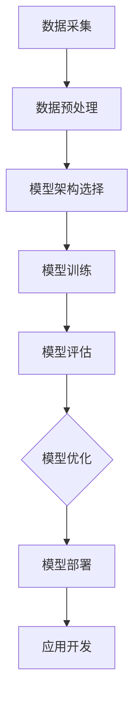
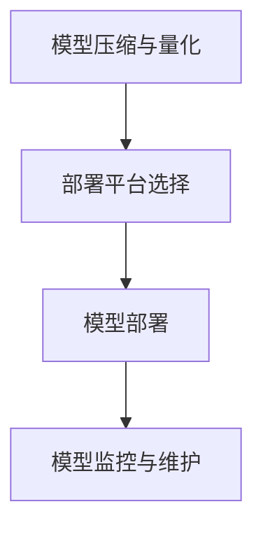

                 

# LLM产业链：从芯片到应用的全景图

> **关键词**：LLM、语言模型、产业链、芯片、应用场景、技术前沿

> **摘要**：本文将详细探讨LLM（大型语言模型）产业链的各个方面，从芯片制造、模型训练、模型部署到应用开发，全面解析LLM产业链的构成、技术基础、应用场景、前沿技术以及产业发展趋势。通过本文，读者将全面了解LLM产业链的全貌，掌握LLM技术的基础知识，并洞察未来LLM产业的发展方向。

## 第一部分: LLM产业链概述

### 第1章: LLM概述

#### 1.1 LLM的基本概念

大型语言模型（LLM）是一种能够理解和生成自然语言的人工智能模型。LLM通常拥有数十亿到千亿个参数，通过对海量文本数据进行预训练，能够实现对自然语言的深度理解和生成。

#### 1.2 LLM的发展历程

LLM的发展可以追溯到20世纪80年代，当时出现了基于规则的方法。然而，随着深度学习技术的兴起，尤其是2018年GPT模型的发布，LLM进入了一个新的发展阶段。近年来，LLM模型在参数规模、训练数据量以及性能方面都取得了显著的突破。

#### 1.3 LLM的应用领域

LLM在众多领域都有广泛的应用，包括文本生成、自然语言理解、问答系统和机器翻译等。随着技术的不断进步，LLM的应用场景也在不断拓展。

#### 1.4 LLM的技术挑战

LLM在计算资源需求、数据质量与隐私等方面面临着诸多技术挑战。为了满足这些挑战，需要不断优化模型结构、算法以及部署策略。

## 第二部分: LLM技术基础

### 第2章: 语言模型基础

#### 2.1 语言模型的基本原理

语言模型的目标是预测下一个单词或词组，其基本原理是基于统计方法或机器学习方法，从大量文本数据中学习语言规律。

#### 2.2 NLP基础技术

NLP基础技术包括词嵌入、序列模型和注意力机制等。这些技术为语言模型提供了强大的语言理解和生成能力。

#### 2.3 深度学习与神经网络基础

深度学习和神经网络是构建LLM的核心技术。通过多层神经网络，LLM能够实现对复杂语言现象的建模。

#### 2.4 预训练模型原理

预训练模型通过在大规模数据集上预训练，然后在小规模数据集上微调，实现了模型的高效训练和广泛应用。

### 第三部分: LLM产业链解析

#### 第3章: LLM产业链概述

#### 3.1 LLM产业链的组成部分

LLM产业链包括芯片制造、模型训练、模型部署和应用开发等环节。每个环节都发挥着关键作用，共同推动LLM技术的发展。

#### 3.2 芯片制造环节

芯片制造是LLM产业链的基础，它涉及到芯片设计、制造流程、芯片测试与优化等步骤。

#### 3.3 模型训练环节

模型训练是LLM产业链的核心，它包括数据采集与处理、训练策略、训练资源管理等步骤。

#### 3.4 模型部署环节

模型部署是将训练好的LLM模型应用到实际场景的过程，它包括模型压缩与量化、模型部署策略、部署平台选择等步骤。

#### 3.5 应用开发环节

应用开发是将LLM模型应用于具体场景的过程，它包括应用场景分析、应用开发流程、应用性能优化等步骤。

### 第四部分: LLM应用场景

#### 第4章: 文本生成应用

#### 4.1 文本生成概述

文本生成是LLM的一个重要应用领域，包括问答系统、机器翻译和内容创作等。

#### 4.2 文本生成算法

文本生成算法主要包括RNN与LSTM、Transformer模型和GPT系列模型等。

#### 4.3 文本生成应用案例

文本生成在问答系统、机器翻译和内容创作等方面都有广泛的应用。

### 第5章: 自然语言理解应用

#### 5.1 自然语言理解概述

自然语言理解是LLM的另一个重要应用领域，包括命名实体识别、语义角色标注和情感分析等。

#### 5.2 命名实体识别

命名实体识别是自然语言理解的基础，用于识别文本中的特定实体。

#### 5.3 语义角色标注

语义角色标注用于识别文本中的动作及其作用对象。

#### 5.4 情感分析

情感分析用于识别文本中的情感倾向。

### 第五部分: LLM技术前沿

#### 第6章: LLM前沿技术

#### 6.1 纳米级语言模型

纳米级语言模型是一种新型的LLM模型，具有更高的效率和更低的能耗。

#### 6.2 多模态语言模型

多模态语言模型能够处理多种类型的数据，如文本、图像和声音。

#### 6.3 大模型伦理与道德问题

大模型伦理与道德问题是一个亟待解决的问题，包括数据隐私、模型偏见和模型解释性等。

### 第六部分: LLM产业发展趋势

#### 第7章: LLM产业发展趋势

#### 7.1 LLM产业现状分析

LLM产业正处于快速发展阶段，市场规模和产业链格局都在不断变化。

#### 7.2 LLM产业趋势预测

未来，LLM技术将继续发展，应用场景将进一步拓展。

#### 7.3 LLM产业政策与法规

政策与法规将对LLM产业的发展产生重要影响。

### 第七部分: 案例研究

#### 第8章: LLM案例研究

#### 8.1 案例一：OpenAI的GPT-3

GPT-3是OpenAI推出的一款具有里程碑意义的LLM模型。

#### 8.2 案例二：Google的BERT

BERT是Google推出的一款针对自然语言理解的预训练模型。

#### 8.3 案例三：百度的大模型实践

百度在大模型领域有着丰富的实践经验和成果。

### 附录

#### 附录A: LLM开发资源

提供了LLM开发的相关资源和工具。

#### 附录B: Mermaid流程图

展示了LLM模型训练和部署的流程图。

#### 附录C: 伪代码示例

提供了语言模型训练和文本生成算法的伪代码示例。

#### 附录D: 数学模型和公式

列出了语言模型相关的数学模型和公式。

#### 附录E: 项目实战

详细介绍了LLM项目的开发环境和实现过程。

#### 附录F: 代码示例

提供了文本生成、情感分析和机器翻译的代码示例。

### 作者信息

作者：AI天才研究院/AI Genius Institute & 禅与计算机程序设计艺术 /Zen And The Art of Computer Programming

本文将从LLM的基本概念、技术基础、产业链解析、应用场景、前沿技术、产业发展趋势和案例研究等方面，全面介绍LLM产业链的各个方面，帮助读者深入理解LLM技术，把握未来发展趋势。在撰写过程中，我们将遵循逻辑清晰、结构紧凑、简单易懂的原则，确保读者能够轻松掌握文章的核心内容。同时，我们也将通过实际案例和代码示例，让读者更好地理解LLM技术的应用和实现。让我们开始这场关于LLM产业链的深入探讨之旅吧！

### 1.1 LLM的基本概念

LLM（大型语言模型）是一种复杂的人工智能模型，它通过学习大量文本数据，能够对自然语言进行理解和生成。LLM的核心在于其庞大的参数规模和深度学习的应用，这使得它能够捕捉到语言中的复杂模式和规律。

首先，我们定义一下什么是LLM。LLM是一种预训练的语言模型，它通过在大规模语料库上进行预训练，学习到语言的内在规律，从而具备理解、生成自然语言的能力。与传统的基于规则的自然语言处理（NLP）系统不同，LLM能够自动学习语言的特征，无需人为编写规则。

LLM的主要特点包括：

1. **参数规模巨大**：LLM的参数规模通常在数十亿到千亿级别，这使得它能够捕捉到语言中的复杂模式。
2. **训练数据量大**：LLM通过在大规模语料库上进行预训练，从海量数据中学习语言规律，从而提高模型的泛化能力。
3. **强泛化能力**：由于训练数据量大，LLM能够很好地泛化到未见过的数据上，表现出强大的理解能力和生成能力。
4. **深度学习能力**：LLM基于深度学习技术，通过多层神经网络来捕捉语言的复杂特征。

LLM的基本工作原理可以概括为以下几个步骤：

1. **预训练**：在大规模语料库上进行预训练，学习到语言的内在规律。预训练过程通常采用自监督学习方法，例如GPT系列模型使用Masked Language Model（MLM）任务来训练。
2. **微调**：在特定任务上对预训练模型进行微调，使其适应特定任务的需求。微调过程通常采用有监督学习方法，例如在问答系统、机器翻译等任务上使用标注数据进行训练。
3. **应用**：将微调后的模型应用到实际场景中，例如文本生成、自然语言理解、问答系统等。

### 1.2 LLM的发展历程

LLM的发展历程可以追溯到20世纪80年代，当时自然语言处理主要基于规则的方法。随着计算机硬件性能的提升和深度学习技术的兴起，LLM逐渐崭露头角。

1. **早期发展**：在20世纪80年代，基于规则的方法是自然语言处理的主要手段。这些方法依赖于人为编写的规则，如词性标注、句法分析等。然而，这些方法在面对复杂语言现象时表现出局限性。
   
2. **统计方法**：20世纪90年代，基于统计方法的自然语言处理开始兴起。统计方法通过学习大量文本数据中的概率分布，提高了语言处理的准确性。例如，基于N-gram模型的语言模型能够预测下一个单词的概率。

3. **深度学习兴起**：2006年，Hinton等人提出了深度信念网络（Deep Belief Network），为深度学习的发展奠定了基础。随着深度学习技术的发展，神经网络在图像识别、语音识别等领域取得了显著成果。2012年，AlexNet在ImageNet图像识别竞赛中取得了突破性成绩，这激发了人们对深度学习在自然语言处理领域应用的兴趣。

4. **预训练模型**：2018年，OpenAI发布了GPT模型，这是第一个真正意义上的大型语言模型。GPT模型通过在大量文本数据上预训练，展示了强大的语言理解和生成能力。GPT的成功引发了大量的研究投入和模型创新，此后，诸如GPT-2、GPT-3等更大规模的模型相继涌现。

5. **当前发展**：近年来，LLM技术取得了长足的发展，不仅在参数规模和训练数据量上不断突破，还在模型架构、训练算法、应用场景等方面实现了创新。例如，Transformer模型的出现使得LLM在处理长距离依赖和并行计算方面取得了显著优势。

### 1.3 LLM的应用领域

LLM在众多领域都有广泛的应用，这些应用极大地提升了人类的工作效率和生活质量。以下是LLM的一些主要应用领域：

1. **文本生成**：文本生成是LLM最典型的应用之一。通过LLM，可以自动生成文章、报告、故事、新闻摘要等文本内容。例如，OpenAI的GPT-3能够生成高质量的文章，并用于内容创作、文案撰写等场景。

2. **自然语言理解**：自然语言理解是LLM的另一个重要应用领域。LLM能够对文本进行解析，提取关键信息，完成命名实体识别、语义角色标注、情感分析等任务。例如，在搜索引擎中，LLM可以用于理解用户查询，提供更准确的搜索结果。

3. **问答系统**：LLM在问答系统中扮演着关键角色。通过训练，LLM能够理解用户的问题，并从海量数据中检索出相关答案。例如，聊天机器人、智能客服等应用都依赖于LLM来提供高质量的问答服务。

4. **机器翻译**：机器翻译是LLM的一个重要应用领域。LLM能够自动翻译不同语言之间的文本，提高了翻译的效率和准确性。例如，Google翻译、百度翻译等工具都采用了LLM技术。

5. **内容创作**：LLM在内容创作中也有广泛应用。通过LLM，可以自动生成音乐、绘画、电影剧本等创意内容。例如，AI艺术家利用LLM生成独特的艺术作品，引起了广泛关注。

6. **自动化写作**：在金融、医疗、法律等领域，LLM可以用于自动化文档生成，如合同、报告、医疗记录等。通过LLM，可以大大提高文档生成效率，减少人力成本。

7. **教育辅助**：LLM在教育领域也有广泛应用。例如，智能辅导系统可以利用LLM帮助学生理解和学习复杂知识，提供个性化的学习建议。

### 1.4 LLM的技术挑战

虽然LLM在自然语言处理领域取得了巨大的成功，但其在实际应用中仍然面临许多技术挑战。以下是LLM技术的一些主要挑战：

1. **计算资源需求**：LLM的参数规模通常在数十亿到千亿级别，这意味着训练和部署LLM需要大量的计算资源。例如，GPT-3模型的训练需要数千台GPU服务器，这对计算资源的管理和调度提出了很高的要求。

2. **数据质量与隐私**：LLM的训练依赖于大量高质量的文本数据。然而，这些数据往往涉及用户隐私，如何在保护用户隐私的同时利用这些数据，是一个亟待解决的问题。

3. **模型解释性**：LLM的预测结果往往是黑箱操作，难以解释。在实际应用中，特别是在金融、医疗等高风险领域，模型的可解释性尤为重要。

4. **模型偏见**：LLM在训练过程中可能会学习到数据中的偏见，导致预测结果存在偏见。例如，某些LLM模型在性别歧视、种族歧视等方面表现出偏见。如何消除模型偏见，提高模型的公平性，是一个重要的研究方向。

5. **能耗问题**：LLM的训练和部署过程消耗大量电能，这对环境造成了压力。如何降低能耗，实现绿色计算，是未来需要解决的重要问题。

6. **安全性**：LLM在应用过程中可能面临各种安全挑战，如模型窃取、数据泄露等。如何确保LLM系统的安全性，是未来需要关注的问题。

## 第二部分: LLM技术基础

### 第2章: 语言模型基础

#### 2.1 语言模型的基本原理

语言模型是自然语言处理（NLP）中的核心组件，它的主要任务是预测下一个单词或词组。语言模型的基本原理是基于统计方法或机器学习方法，从大量文本数据中学习语言规律。

语言模型的目标是通过输入的文本序列来预测下一个单词或词组的概率分布。这种预测通常是基于已经观察到的文本数据，通过计算每个单词出现的概率来实现。语言模型的基本组成部分包括：

1. **词汇表**：词汇表是语言模型的基础，它包含了模型中所有可能出现的单词或词组。
2. **概率分布**：语言模型需要计算每个单词或词组出现的概率，这通常通过训练数据来学习。
3. **模型参数**：语言模型的参数用于表示语言规律，这些参数通过训练过程学习得到。

语言模型的训练过程通常包括以下几个步骤：

1. **数据预处理**：将原始文本数据转换为模型可处理的格式，例如分词、去除停用词、转化为数字编码等。
2. **构建词汇表**：从预处理后的文本数据中构建词汇表，将每个单词或词组映射到一个唯一的索引。
3. **计算概率分布**：使用训练数据来计算每个单词或词组的概率分布。常用的方法包括N-gram模型、神经网络语言模型等。
4. **优化模型参数**：通过最小化损失函数来优化模型参数，以提高模型的预测准确性。

#### 2.2 NLP基础技术

自然语言处理（NLP）是一门交叉学科，它结合了计算机科学、人工智能和语言学等领域的知识，旨在使计算机能够理解和处理自然语言。NLP的基础技术包括词嵌入、序列模型和注意力机制等。

1. **词嵌入**：词嵌入是将单词或词组映射到高维空间中的向量表示。词嵌入能够捕捉单词之间的语义关系，从而提高NLP任务的性能。常见的词嵌入方法包括Word2Vec、GloVe等。

2. **序列模型**：序列模型是处理时间序列数据的模型，它能够捕捉数据中的时序关系。在NLP中，序列模型常用于文本处理，例如词性标注、命名实体识别等。常见的序列模型包括循环神经网络（RNN）和长短期记忆网络（LSTM）。

3. **注意力机制**：注意力机制是一种在模型中引入权重来关注重要信息的方法。在NLP中，注意力机制可以用于文本生成、机器翻译等任务，它能够提高模型对关键信息的关注能力，从而提高任务性能。常见的注意力模型包括自注意力（Self-Attention）和多头注意力（Multi-Head Attention）。

#### 2.3 深度学习与神经网络基础

深度学习和神经网络是构建LLM的核心技术。深度学习是一种基于多层神经网络的学习方法，它能够自动提取数据的特征。神经网络是一种由多个神经元组成的计算模型，通过调整神经元之间的连接权重，神经网络能够学习数据的内在规律。

1. **神经网络的基本结构**：神经网络的基本结构包括输入层、隐藏层和输出层。输入层接收外部输入，隐藏层对输入数据进行处理和特征提取，输出层产生模型的输出。神经元的激活函数，如Sigmoid、ReLU等，用于确定神经元是否被激活。

2. **常见的深度学习架构**：在深度学习中，常见的架构包括卷积神经网络（CNN）、循环神经网络（RNN）、变换器（Transformer）等。CNN常用于图像处理，RNN和Transformer用于处理序列数据，如文本。

3. **深度学习的优势**：深度学习具有以下优势：
   - 自动提取特征：深度学习能够自动从数据中提取有用的特征，减少了人工特征工程的需求。
   - 强泛化能力：深度学习模型能够在未见过的数据上表现良好，具有很好的泛化能力。
   - 高效计算：深度学习模型可以通过并行计算和分布式计算来提高计算效率。

#### 2.4 预训练模型原理

预训练模型是一种通过在大规模数据集上预训练，然后在特定任务上微调的模型。预训练模型的核心思想是通过在通用数据集上进行预训练，使模型具备一定的通用语言理解能力，然后在特定任务上进行微调，以实现更好的任务性能。

预训练模型的基本原理包括以下几个方面：

1. **自监督预训练**：自监督预训练是一种无需标注数据的预训练方法。在自监督预训练中，模型通过预测未遮盖的单词、词组或句子来学习语言的内在规律。常见的自监督预训练任务包括Masked Language Model（MLM）、Next Sentence Prediction（NSP）等。

2. **迁移学习与微调**：迁移学习是一种将预训练模型的知识迁移到特定任务上的方法。在迁移学习中，预训练模型作为一个初始化模型，通过在特定任务上进行微调，来适应任务的需求。微调通常包括调整模型参数、优化损失函数等步骤。

3. **预训练的优势**：预训练模型具有以下优势：
   - **通用性**：预训练模型通过在大量通用数据上训练，能够学习到通用的语言特征，提高模型在未见过的任务上的表现。
   - **效率**：预训练模型可以减少特定任务上的训练时间，提高模型训练的效率。
   - **灵活性**：预训练模型可以通过微调适应不同的任务需求，具有良好的灵活性。

### 第三部分: LLM产业链解析

#### 第3章: LLM产业链概述

LLM产业链是一个复杂且多层次的结构，涵盖了从芯片制造到应用开发的各个环节。理解LLM产业链的组成部分及其相互关系对于深入把握LLM技术的发展趋势和应用前景至关重要。

#### 3.1 LLM产业链的组成部分

LLM产业链主要包括以下五个环节：

1. **芯片制造**：芯片制造是LLM产业链的基础，它为LLM的训练和部署提供高性能计算能力。芯片制造包括芯片设计、制造、测试和优化等步骤。

2. **模型训练**：模型训练是LLM产业链的核心，它通过在大规模数据集上训练模型，使LLM具备强大的语言理解和生成能力。模型训练包括数据采集、预处理、模型架构选择、训练策略设计等步骤。

3. **模型部署**：模型部署是将训练好的LLM应用到实际场景的过程。模型部署涉及模型压缩与量化、部署平台选择、部署策略设计等步骤。

4. **应用开发**：应用开发是将LLM应用到具体业务场景的过程。应用开发包括应用场景分析、应用设计、开发流程、性能优化等步骤。

5. **生态建设**：生态建设是LLM产业链的重要组成部分，它包括工具链开发、开源项目维护、社区建设等步骤，为LLM技术的发展提供支持。

#### 3.2 芯片制造环节

芯片制造是LLM产业链的基础，它为LLM的训练和部署提供强大的计算能力。芯片制造包括以下步骤：

1. **芯片设计**：芯片设计是芯片制造的第一步，它包括硬件设计、架构设计、电路设计等。在LLM芯片设计中，需要考虑高性能、低功耗、可扩展性等因素。

2. **芯片制造**：芯片制造是利用半导体工艺将芯片设计转化为实际硬件的过程。芯片制造包括晶圆制造、光刻、刻蚀、离子注入、化学气相沉积等步骤。

3. **芯片测试**：芯片测试是确保芯片性能和可靠性的关键步骤。芯片测试包括功能测试、性能测试、稳定性测试等。

4. **芯片优化**：芯片优化是在芯片制造完成后对芯片进行性能优化和调试的过程。芯片优化包括功耗优化、性能优化、发热管理优化等。

#### 3.3 模型训练环节

模型训练是LLM产业链的核心，它决定了LLM的性能和应用效果。模型训练包括以下步骤：

1. **数据采集**：数据采集是模型训练的第一步，它包括从互联网、数据库、书籍等渠道收集大规模文本数据。数据质量对模型性能至关重要，因此需要采用数据清洗、去重、归一化等预处理方法。

2. **数据预处理**：数据预处理是将原始文本数据转化为模型可处理格式的过程。预处理步骤包括分词、词性标注、去停用词、词嵌入等。

3. **模型架构选择**：模型架构选择是根据应用场景和计算资源来选择合适的模型架构。常见的模型架构包括基于循环神经网络（RNN）的架构、基于变换器（Transformer）的架构等。

4. **训练策略设计**：训练策略设计是模型训练过程中的关键步骤，它包括学习率调度、优化算法选择、批量大小选择等。

5. **模型训练**：模型训练是通过在训练数据集上进行迭代训练来优化模型参数的过程。训练过程中需要监控模型性能，调整训练策略，以提高模型性能。

6. **模型评估**：模型评估是在训练完成后对模型性能进行评估的过程。评估指标包括准确率、召回率、F1值等。通过评估，可以确定模型是否达到预期性能。

7. **模型优化**：模型优化是在评估完成后对模型进行优化和调试的过程，以提高模型性能和应用效果。

#### 3.4 模型部署环节

模型部署是将训练好的LLM应用到实际场景的过程。模型部署包括以下步骤：

1. **模型压缩与量化**：模型压缩与量化是减小模型大小和提高模型运行效率的过程。压缩方法包括剪枝、量化、蒸馏等。量化是将浮点模型转换为整数模型，以降低计算复杂度和存储需求。

2. **部署平台选择**：部署平台选择是根据应用场景和性能要求来选择合适的部署平台。常见的部署平台包括CPU、GPU、TPU等。

3. **部署策略设计**：部署策略设计是根据应用场景和性能要求来设计部署策略。部署策略包括模型加载、模型推理、模型更新等。

4. **模型监控与维护**：模型监控与维护是确保模型正常运行和性能稳定的过程。监控指标包括模型性能、资源利用率、故障率等。维护包括模型更新、故障排除等。

#### 3.5 应用开发环节

应用开发是将LLM应用到具体业务场景的过程。应用开发包括以下步骤：

1. **应用场景分析**：应用场景分析是根据业务需求和用户需求来分析应用场景。分析内容包括应用目标、数据来源、用户需求等。

2. **应用设计**：应用设计是根据应用场景分析的结果来设计应用系统。设计内容包括应用架构、模块划分、接口设计等。

3. **开发流程**：开发流程是根据应用设计来实施开发过程。开发流程包括需求分析、系统设计、编码实现、测试等。

4. **性能优化**：性能优化是提高应用系统性能和用户满意度的重要步骤。优化内容包括代码优化、数据库优化、缓存策略等。

5. **应用部署**：应用部署是将开发完成的应用系统部署到生产环境的过程。部署内容包括环境配置、部署策略、监控与维护等。

#### 3.6 生态建设

生态建设是LLM产业链的重要组成部分，它为LLM技术的发展提供支持。生态建设包括以下步骤：

1. **工具链开发**：工具链开发是提供LLM开发所需的工具和库。工具链包括数据预处理工具、训练工具、部署工具等。

2. **开源项目维护**：开源项目维护是维护和更新开源LLM项目，为开发者提供丰富的资源。开源项目包括预训练模型、训练脚本、应用案例等。

3. **社区建设**：社区建设是建立LLM开发者和用户的交流平台，促进技术和经验的分享。社区建设包括论坛、会议、讲座等。

### 第四部分: LLM应用场景

#### 第4章: 文本生成应用

文本生成是LLM的重要应用之一，它能够自动生成各种类型的文本，如文章、报告、对话、诗歌等。文本生成技术在多个领域都有广泛的应用，下面将介绍文本生成的基本概念、算法和应用案例。

#### 4.1 文本生成概述

文本生成是指利用人工智能技术生成自然语言的文本内容。文本生成的应用场景非常广泛，包括但不限于以下几个方面：

1. **内容创作**：自动生成文章、报告、新闻、博客等。
2. **对话系统**：自动生成聊天机器人的对话内容。
3. **机器翻译**：生成翻译文本。
4. **内容摘要**：自动生成文章或文档的摘要。
5. **代码生成**：自动生成编程代码。
6. **艺术创作**：生成诗歌、音乐、绘画等艺术作品。

文本生成的主要挑战包括：

1. **语言多样性**：自然语言具有高度的多样性和复杂性，生成模型需要能够适应不同的语言风格和表达方式。
2. **上下文理解**：文本生成需要理解输入文本的上下文信息，以生成连贯、符合逻辑的文本。
3. **真实性**：生成的文本需要具有较高的真实性，避免产生不符合事实或逻辑的文本。
4. **控制性**：用户可能需要对生成的文本进行特定的控制，如风格、长度、主题等。

#### 4.2 文本生成算法

文本生成算法可以分为以下几类：

1. **基于规则的算法**：这类算法通过定义一系列规则来生成文本，如模板匹配、关键词替换等。这类算法生成文本的灵活性和多样性较低，但实现简单，适用于简单的文本生成任务。

2. **基于统计的算法**：这类算法通过统计方法来预测下一个单词或词组，如N-gram模型、马尔可夫模型等。这些算法生成文本的能力较强，但难以处理长文本和复杂语境。

3. **基于神经网络的算法**：这类算法通过神经网络来学习文本生成，如循环神经网络（RNN）、长短期记忆网络（LSTM）和变换器（Transformer）。神经网络算法具有强大的表达能力和灵活性，能够生成高质量的文本。

   - **RNN**：循环神经网络能够处理序列数据，具有记忆功能，能够捕捉文本中的上下文信息。
   - **LSTM**：长短期记忆网络是RNN的一种改进，能够更好地处理长距离依赖问题。
   - **Transformer**：变换器是一种基于自注意力机制的神经网络模型，能够在处理长文本和复杂上下文方面表现出色。

4. **生成对抗网络（GAN）**：生成对抗网络是一种基于博弈理论的生成模型，由生成器和判别器两个神经网络组成。生成器尝试生成逼真的文本，判别器判断文本是真实还是生成的。GAN在图像生成领域取得了显著成果，但其在文本生成中的应用还处于探索阶段。

5. **预训练模型**：预训练模型通过在大规模文本数据上进行预训练，然后在小规模数据上进行微调，以实现文本生成。预训练模型如GPT、BERT等，具有强大的语言理解和生成能力，能够生成高质量、连贯的文本。

#### 4.3 文本生成应用案例

以下是几个文本生成的应用案例：

1. **文章生成**：OpenAI的GPT-3模型能够生成高质量的文章。通过提供一篇文章的标题或摘要，GPT-3可以自动生成完整的内容。这个应用在内容创作、新闻写作等领域具有广泛的应用前景。

2. **对话生成**：聊天机器人需要能够自动生成对话内容，以提供高质量的问答服务。基于变换器的模型，如BERT，可以用于生成对话文本。这些模型通过对大量对话数据进行训练，能够生成自然、流畅的对话。

3. **代码生成**：自动生成编程代码是文本生成的一个重要应用。通过对编程语言的语法和语义进行建模，生成模型可以自动生成代码片段，辅助开发者进行编程。

4. **诗歌生成**：利用神经网络模型，可以自动生成诗歌。通过提供一些诗歌的词语或韵律信息，生成模型可以创作出具有韵律美的诗歌。

5. **摘要生成**：自动生成文章或文档的摘要，是提高信息获取效率的重要手段。通过对长文本进行建模，生成模型可以提取关键信息，生成简洁、准确的摘要。

#### 4.4 文本生成技术的挑战和未来发展方向

尽管文本生成技术在许多领域取得了显著成果，但仍然面临一些挑战和问题：

1. **生成文本的质量**：生成的文本需要具有较高的质量，包括语法正确、语义连贯、逻辑合理等。目前，生成模型的文本质量仍然有待提高。

2. **上下文理解**：文本生成需要理解输入文本的上下文信息，以生成连贯、符合逻辑的文本。然而，现有模型在处理长文本和复杂上下文方面还存在一定困难。

3. **多样性控制**：用户可能需要对生成的文本进行特定的控制，如风格、长度、主题等。如何有效地控制文本的多样性，是一个重要的研究方向。

4. **伦理和道德问题**：生成的文本可能涉及敏感内容，如歧视性言论、虚假信息等。如何确保生成的文本符合伦理和道德标准，是一个亟待解决的问题。

未来的发展方向包括：

1. **模型性能提升**：通过改进模型架构和训练算法，提高文本生成的质量、准确性和效率。

2. **多模态生成**：结合文本、图像、音频等多种模态，实现更丰富、更有创意的文本生成。

3. **个性化生成**：根据用户的需求和偏好，实现个性化、定制化的文本生成。

4. **伦理和道德约束**：建立伦理和道德约束机制，确保生成的文本符合社会价值观和法律法规。

5. **开源社区合作**：加强开源社区的合作，推动文本生成技术的发展和普及。

### 第5章: 自然语言理解应用

自然语言理解（NLU）是人工智能（AI）和自然语言处理（NLP）的核心领域之一，旨在使计算机能够理解和解析人类自然语言。本章将介绍自然语言理解的主要应用领域、技术难点及其解决方案。

#### 5.1 自然语言理解概述

自然语言理解的目标是使计算机能够像人类一样理解和解析自然语言。这包括对文本进行语法分析、语义理解、情感分析等。自然语言理解在多个领域有着广泛的应用，如智能客服、信息检索、语音助手、文本分析等。

自然语言理解的主要任务包括：

1. **文本分类**：根据文本内容将文本分类到不同的类别，如垃圾邮件检测、新闻分类等。
2. **实体识别**：识别文本中的特定实体，如人名、地点、组织等。
3. **关系提取**：识别文本中实体之间的关系，如“张三工作在阿里巴巴”中的“工作在”关系。
4. **情感分析**：分析文本中的情感倾向，如正面、负面、中立等。
5. **问答系统**：使计算机能够理解用户的问题，并给出准确的回答。
6. **机器翻译**：将一种语言翻译成另一种语言，如英文到中文的翻译。

#### 5.2 命名实体识别

命名实体识别（NER）是自然语言理解中的一个重要任务，旨在识别文本中的特定实体，如人名、地名、组织名、时间等。NER在信息提取、文本分析、搜索引擎等领域具有广泛的应用。

NER的主要技术难点包括：

1. **实体边界识别**：确定实体在文本中的起始和结束位置。
2. **实体分类**：将识别出的实体分类到不同的类别。
3. **长距离依赖处理**：实体之间的关系可能跨越多个句子，需要处理长距离依赖问题。

命名实体识别的解决方案包括：

1. **规则方法**：基于手工编写的规则进行实体识别，如使用正则表达式或模式匹配。
2. **机器学习方法**：使用机器学习算法，如条件随机场（CRF）、支持向量机（SVM）等，来训练模型进行实体识别。
3. **深度学习方法**：使用深度学习模型，如卷积神经网络（CNN）、循环神经网络（RNN）等，来学习实体识别的特征。
4. **迁移学习**：通过在预训练模型的基础上进行微调，实现实体识别任务。

#### 5.3 语义角色标注

语义角色标注（SRL）是自然语言理解中的另一个重要任务，旨在识别文本中动词及其作用对象的语义角色。SRL对于语义解析、文本分析、问答系统等任务具有重要意义。

语义角色标注的主要技术难点包括：

1. **语义角色的多样性**：语义角色种类繁多，需要准确识别和分类。
2. **长距离依赖处理**：语义角色之间的关系可能跨越多个句子，需要处理长距离依赖问题。
3. **上下文理解**：语义角色的识别需要依赖上下文信息，如何有效地利用上下文是关键。

语义角色标注的解决方案包括：

1. **规则方法**：基于手工编写的规则进行语义角色标注，如使用句法分析树或语义角色词典。
2. **机器学习方法**：使用机器学习算法，如条件随机场（CRF）、支持向量机（SVM）等，来训练模型进行语义角色标注。
3. **深度学习方法**：使用深度学习模型，如卷积神经网络（CNN）、循环神经网络（RNN）等，来学习语义角色标注的特征。
4. **预训练模型**：通过在预训练模型的基础上进行微调，实现语义角色标注任务。

#### 5.4 情感分析

情感分析（Sentiment Analysis）是自然语言理解中的另一个重要任务，旨在分析文本中的情感倾向，如正面、负面、中立等。情感分析在市场研究、客户反馈分析、社交媒体分析等领域具有广泛的应用。

情感分析的主要技术难点包括：

1. **情感表达的多样性**：情感表达形式多样，需要识别和处理复杂的情感倾向。
2. **上下文理解**：情感分析需要理解文本的上下文信息，以准确识别情感。
3. **噪声处理**：文本中的噪声和干扰会影响情感分析的准确性。

情感分析的解决方案包括：

1. **规则方法**：基于手工编写的规则进行情感分析，如使用情感词典或情感规则。
2. **机器学习方法**：使用机器学习算法，如朴素贝叶斯（Naive Bayes）、支持向量机（SVM）等，来训练模型进行情感分析。
3. **深度学习方法**：使用深度学习模型，如卷积神经网络（CNN）、循环神经网络（RNN）等，来学习情感分析的特征。
4. **预训练模型**：通过在预训练模型的基础上进行微调，实现情感分析任务。

#### 5.5 自然语言理解在智能客服中的应用

智能客服是自然语言理解的一个重要应用领域，旨在通过自动化方式处理用户咨询，提高客户服务质量。智能客服的关键技术包括文本分类、命名实体识别、语义角色标注和情感分析等。

智能客服的应用场景包括：

1. **客户咨询处理**：自动识别用户咨询的主题和情感，并提供相应的回复。
2. **自动应答**：自动生成应答文本，减少人工干预。
3. **知识库建设**：自动提取文本中的关键信息，构建知识库，以便后续查询和利用。

#### 5.6 自然语言理解在信息检索中的应用

自然语言理解在信息检索（IR）中发挥着重要作用，旨在提高信息检索的准确性和效率。自然语言理解在信息检索中的应用包括：

1. **查询解析**：将用户的自然语言查询转化为索引语言，以提高查询匹配的准确性。
2. **文本分析**：对检索结果进行文本分析，提取关键信息，以生成摘要或推荐。
3. **用户行为分析**：分析用户的查询行为，以提高检索系统的个性化程度。

#### 5.7 自然语言理解在文本分析中的应用

自然语言理解在文本分析（Text Analysis）中具有广泛的应用，旨在从大量文本数据中提取有价值的信息。文本分析的应用包括：

1. **市场研究**：分析消费者反馈、社交媒体评论等，以了解市场需求和用户情感。
2. **新闻报道**：自动提取新闻的关键信息，生成摘要或分类。
3. **学术研究**：对学术论文进行文本分析，提取关键术语和研究趋势。

### 第五部分: LLM技术前沿

#### 第6章: LLM前沿技术

随着人工智能技术的不断进步，LLM（大型语言模型）技术也在快速发展，出现了许多前沿技术和研究方向。本章将介绍纳米级语言模型、多模态语言模型以及大模型伦理与道德问题。

#### 6.1 纳米级语言模型

纳米级语言模型（Nano-Level Language Model）是一种新型的LLM模型，旨在通过更精细的粒度对语言进行建模。传统的LLM模型通常在词或句子的层次上工作，而纳米级语言模型则试图在更细的粒度上捕捉语言的复杂性和多样性。

**纳米级语言模型的特点：**

1. **更高粒度**：纳米级语言模型能够处理更小的语言单位，如字符、子词等，从而更精确地捕捉语言的细微差异。
2. **更高效的计算**：由于处理粒度的缩小，纳米级语言模型在计算效率和资源消耗方面具有优势。
3. **更好的语言理解能力**：纳米级语言模型能够更好地理解语言中的深层含义和上下文关系。

**纳米级语言模型的优缺点：**

**优点：**
- **高效性**：纳米级语言模型在处理速度和计算资源消耗方面具有优势。
- **精准性**：纳米级语言模型能够更精细地捕捉语言特征，提高语言理解能力。

**缺点：**
- **复杂性**：纳米级语言模型在实现和维护方面可能更加复杂。
- **泛化能力**：纳米级语言模型可能在某些特定场景下表现出更好的性能，但在其他场景下可能泛化能力较差。

**纳米级语言模型的应用场景：**
- **文本生成**：纳米级语言模型能够生成更自然、更符合上下文的文本。
- **语义分析**：纳米级语言模型能够更准确地识别文本中的语义信息。
- **问答系统**：纳米级语言模型能够更准确地理解和回答用户的问题。

#### 6.2 多模态语言模型

多模态语言模型（Multimodal Language Model）是一种结合多种数据模态的语言模型，如文本、图像、声音等。传统语言模型主要处理文本数据，而多模态语言模型则能够同时处理多种模态的数据，从而实现更全面的信息理解和生成。

**多模态语言模型的特点：**

1. **跨模态理解**：多模态语言模型能够处理不同模态的数据，并通过跨模态交互实现更全面的信息理解。
2. **增强表达能力**：多模态语言模型能够结合不同模态的数据特征，提高语言表达的丰富性和准确性。
3. **扩展应用场景**：多模态语言模型能够应用于更广泛的场景，如视频理解、语音识别、图像生成等。

**多模态语言模型的挑战与应用：**

**挑战：**
- **数据同步**：多模态数据在采集和传输过程中可能存在不同步的问题，需要解决数据同步的挑战。
- **模态融合**：如何有效地融合不同模态的数据特征，是多模态语言模型面临的重要挑战。
- **计算资源**：多模态语言模型通常需要更多的计算资源，特别是在处理高分辨率图像和音频数据时。

**应用：**
- **视频理解**：多模态语言模型能够对视频中的文本、图像和声音进行综合分析，实现视频内容的理解。
- **语音识别**：多模态语言模型能够结合文本和语音数据，提高语音识别的准确性和效率。
- **图像生成**：多模态语言模型能够生成基于文本描述的图像，实现文本到图像的转换。

#### 6.3 大模型伦理与道德问题

随着LLM模型规模的不断扩大，大模型伦理与道德问题逐渐引起关注。大模型伦理与道德问题涉及数据隐私、模型偏见、模型解释性等方面，需要引起重视。

**大模型伦理与道德问题的背景：**

- **数据隐私**：LLM模型在训练过程中需要大量数据，这些数据往往涉及用户隐私。如何保护用户隐私，防止数据泄露，是重要的伦理问题。
- **模型偏见**：LLM模型在训练过程中可能会学习到数据中的偏见，导致模型产生不公平或歧视性的输出。如何消除模型偏见，提高模型的公平性，是一个重要的道德问题。
- **模型解释性**：LLM模型通常是一个“黑箱”，其决策过程难以解释。如何提高模型的可解释性，使其更透明、可信任，是重要的伦理问题。

**大模型伦理与道德问题的解决方法：**

1. **数据隐私保护**：通过加密、匿名化等技术手段，保护用户隐私数据。同时，建立数据共享和使用的伦理规范，确保数据使用的合法性和透明性。
2. **模型公平性**：通过数据平衡、算法优化等方法，消除模型偏见。建立模型公平性评估机制，对模型的输出进行监督和审核。
3. **模型解释性提升**：通过模型可视化、决策路径追踪等技术，提高模型的可解释性。同时，建立模型解释性标准，确保模型输出可理解、可信任。
4. **伦理审查与监管**：建立伦理审查和监管机制，对大模型的研究和应用进行监督。制定相关法规和政策，确保大模型的发展符合伦理和道德标准。

### 第六部分: LLM产业发展趋势

#### 第7章: LLM产业发展趋势

随着人工智能技术的不断进步，LLM（大型语言模型）产业正在快速发展，呈现出一系列重要的趋势。本章将分析LLM产业现状、趋势预测以及政策与法规对LLM产业的影响。

#### 7.1 LLM产业现状分析

LLM产业现状可以从市场规模、产业链格局、关键技术突破等方面进行分析。

**LLM市场规模**

- **快速增长**：随着人工智能技术的普及和应用，LLM市场规模正在快速增长。根据市场研究公司的数据，全球LLM市场规模预计将在未来几年内实现显著增长。
- **应用广泛**：LLM在文本生成、自然语言理解、问答系统、机器翻译等领域的应用不断拓展，推动了市场的需求增长。

**LLM产业链格局**

- **多元化**：LLM产业链包括芯片制造、模型训练、模型部署和应用开发等环节，各个环节的企业和机构在产业链中发挥着不同的作用。
- **竞争激烈**：在LLM产业中，各大科技巨头、初创企业和研究机构纷纷投入资源，争夺市场份额和技术优势。

**关键技术突破**

- **模型规模扩大**：随着计算能力和数据量的提升，LLM模型的规模不断增大，参数数量达到数十亿甚至千亿级别。
- **算法优化**：深度学习算法和模型架构的优化，如变换器（Transformer）和自注意力机制，推动了LLM性能的提升。
- **多模态处理**：多模态语言模型的兴起，使得LLM能够处理文本、图像、声音等多种数据模态，为应用拓展提供了新的可能性。

#### 7.2 LLM产业趋势预测

未来，LLM产业发展将呈现以下趋势：

**模型性能提升**

- **更大规模模型**：随着计算资源的增长，更大规模的LLM模型将被开发，以进一步提高语言理解和生成能力。
- **更高效算法**：新型算法和模型架构的引入，将提高LLM的训练和推理效率，降低计算资源消耗。

**应用场景拓展**

- **行业应用**：LLM在金融、医疗、教育、法律等行业的应用将不断拓展，为这些行业提供智能化解决方案。
- **多模态交互**：多模态语言模型的发展，将推动LLM在视频、图像、音频等领域的应用，实现更全面的信息理解。

**伦理与道德问题**

- **数据隐私保护**：随着LLM应用的普及，数据隐私保护将受到更多关注，相关法规和标准将不断完善。
- **模型偏见消除**：消除模型偏见，提高模型的公平性，将成为重要的研究方向。

**产业合作与竞争**

- **生态建设**：产业链各环节的企业和机构将加强合作，共同推动LLM技术的发展和应用。
- **技术创新竞争**：技术创新将成为LLM产业的核心竞争力，各大企业和研究机构将不断推出新型模型和算法。

#### 7.3 LLM产业政策与法规

政策与法规对LLM产业的发展具有重要影响，主要体现在以下几个方面：

**政策支持**

- **资金投入**：政府通过资金支持，促进人工智能和LLM技术的发展和应用。
- **人才培养**：政府推动人工智能和LLM相关学科的教育和研究，培养高水平的人才。
- **国际合作**：政府鼓励国内外企业、研究机构之间的合作，共同推动LLM技术的发展。

**法规监管**

- **数据隐私**：制定数据隐私保护法规，规范数据采集、存储和使用，保护用户隐私。
- **模型解释性**：建立模型解释性标准，确保模型输出可理解、可信任。
- **伦理审查**：建立伦理审查机制，对LLM模型的研究和应用进行监督，确保符合伦理和道德标准。

### 第七部分: 案例研究

#### 第8章: LLM案例研究

在本章节中，我们将深入探讨几个具有代表性的LLM案例研究，包括OpenAI的GPT-3、Google的BERT以及百度的深度学习实践。这些案例不仅展示了LLM技术的应用成果，还揭示了技术发展的关键路径和挑战。

#### 8.1 案例一：OpenAI的GPT-3

**GPT-3介绍**

GPT-3（Generative Pre-trained Transformer 3）是OpenAI于2020年发布的一款具有里程碑意义的语言模型。GPT-3采用了变换器（Transformer）架构，具有1750亿个参数，是当时最大的语言模型之一。GPT-3在自然语言处理任务中表现出色，能够生成高质量的文章、回答问题、进行对话等。

**GPT-3的应用场景**

- **文本生成**：GPT-3可以自动生成文章、故事、新闻报道等，广泛应用于内容创作、报告撰写等领域。
- **问答系统**：GPT-3能够理解用户的问题，并从大量文本数据中检索出相关答案，应用于智能客服、在线问答等领域。
- **对话系统**：GPT-3可以与用户进行自然语言对话，用于聊天机器人、虚拟助手等应用。

**GPT-3的技术特点**

- **大规模**：GPT-3具有1750亿个参数，能够捕捉到语言中的复杂模式。
- **高效性**：变换器架构使得GPT-3在处理长文本和复杂上下文方面具有高效性。
- **灵活性**：GPT-3可以应用于多种任务，包括文本生成、问答系统和对话系统等。

**GPT-3的挑战**

- **计算资源需求**：GPT-3的训练和推理需要大量计算资源，这对硬件设施和资源调度提出了挑战。
- **数据隐私**：GPT-3的训练需要大量文本数据，如何保护用户隐私是一个重要问题。

#### 8.2 案例二：Google的BERT

**BERT介绍**

BERT（Bidirectional Encoder Representations from Transformers）是Google于2018年推出的一款预训练语言模型。BERT采用了变换器架构，并引入了双向注意力机制，能够捕捉到文本中的长距离依赖关系。BERT在自然语言理解任务中表现出色，广泛应用于搜索、问答、文本分类等。

**BERT的应用场景**

- **搜索**：BERT可以改进搜索引擎的结果，通过理解用户的查询和网页内容，提供更准确的搜索结果。
- **问答系统**：BERT能够理解用户的问题，并从大量文本数据中检索出相关答案，应用于智能客服、在线问答等领域。
- **文本分类**：BERT可以用于对文本进行分类，如新闻分类、情感分析等。

**BERT的技术特点**

- **双向注意力**：BERT的双向注意力机制使得模型能够同时考虑文本的前后信息，提高语言理解能力。
- **预训练**：BERT通过在大量文本数据上进行预训练，学习到语言的深层特征，提高了模型的泛化能力。
- **灵活性**：BERT可以应用于多种自然语言处理任务，具有很好的灵活性。

**BERT的挑战**

- **数据隐私**：BERT的训练需要大量文本数据，如何保护用户隐私是一个重要问题。
- **计算资源**：BERT的训练和推理需要大量计算资源，这对硬件设施和资源调度提出了挑战。

#### 8.3 案例三：百度的大模型实践

**百度大模型发展历程**

百度在深度学习和自然语言处理领域有着丰富的实践经验。从早期的LSTM、CNN模型到后来的BERT、GPT等大模型，百度不断探索并实践各种先进的语言模型技术。

**百度大模型的应用场景**

- **搜索**：百度通过大模型技术改进搜索引擎，提供更准确、更个性化的搜索结果。
- **智能客服**：百度利用大模型技术构建智能客服系统，提升客户服务质量和效率。
- **内容审核**：百度使用大模型技术对网络内容进行审核，过滤不良信息和违规内容。
- **文本生成**：百度的大模型可以生成高质量的文本，应用于内容创作、报告撰写等领域。

**百度大模型的技术特点**

- **大规模**：百度的大模型具有数十亿甚至千亿个参数，能够捕捉到语言中的复杂模式。
- **高效性**：百度通过优化模型架构和训练算法，提高了大模型的训练和推理效率。
- **多样性**：百度的大模型可以应用于多种任务，包括文本生成、问答系统和搜索等。

**百度大模型的挑战**

- **计算资源**：百度的大模型需要大量计算资源，这对硬件设施和资源调度提出了挑战。
- **数据质量**：百度的大模型对数据质量要求较高，如何获取高质量的数据是一个重要问题。
- **模型解释性**：如何提高大模型的可解释性，使其输出可理解、可信任，是一个重要挑战。

#### 8.4 案例四：Facebook的BlenderBot

**BlenderBot介绍**

BlenderBot是Facebook开发的一款具有交互能力的聊天机器人。BlenderBot采用了预训练的语言模型，通过在对话中进行学习和优化，能够与用户进行自然、流畅的对话。

**BlenderBot的应用场景**

- **虚拟客服**：BlenderBot可以作为虚拟客服，提供自动化的客户服务，提高客户满意度。
- **教育辅助**：BlenderBot可以辅助学生进行学习，提供个性化的学习建议和指导。
- **社交互动**：BlenderBot可以参与社交互动，为用户提供娱乐和陪伴。

**BlenderBot的技术特点**

- **对话生成**：BlenderBot采用了预训练的语言模型，能够生成自然、连贯的对话。
- **交互学习**：BlenderBot通过与用户互动，不断学习和优化对话能力，提高用户体验。
- **多样性**：BlenderBot可以应用于多种场景，包括客服、教育、社交等。

**BlenderBot的挑战**

- **对话质量**：如何生成高质量、符合用户需求的对话内容，是一个重要挑战。
- **对话多样性**：如何保证对话的多样性和趣味性，避免单调重复，是一个重要问题。

### 附录

#### 附录A: LLM开发资源

**开发工具介绍**

- **PyTorch**：PyTorch是一个流行的深度学习框架，支持变换器（Transformer）等大型语言模型的开发。
- **TensorFlow**：TensorFlow是一个开源的深度学习框架，广泛应用于各种深度学习应用，包括大型语言模型。
- **Hugging Face**：Hugging Face是一个开源库，提供了大量预训练语言模型和NLP工具，方便开发者进行模型开发和应用。

**开发资源链接**

- [PyTorch官网](https://pytorch.org/)
- [TensorFlow官网](https://www.tensorflow.org/)
- [Hugging Face官网](https://huggingface.co/)

#### 附录B: Mermaid流程图

**LLM模型训练流程图**



**LLM模型部署流程图**



#### 附录C: 伪代码示例

**语言模型训练伪代码**

```python
# 数据预处理
data = preprocess_data(raw_data)

# 模型初始化
model = create_model()

# 训练循环
for epoch in range(num_epochs):
    for batch in data_loader:
        # 前向传播
        outputs = model(batch.text)
        # 计算损失
        loss = loss_function(outputs, batch.target)
        # 反向传播
        optimizer.zero_grad()
        loss.backward()
        optimizer.step()
        # 打印训练信息
        print(f"Epoch: {epoch}, Loss: {loss.item()}")
```

**文本生成算法伪代码**

```python
# 输入文本序列
input_sequence = "The weather today is"

# 生成文本
generated_text = model.generate(input_sequence, max_length=50)

# 输出生成文本
print(generated_text)
```

#### 附录D: 数学模型和公式

**语言模型的损失函数**

$$
\text{Loss} = -\sum_{i=1}^{N} \text{log}(\hat{p}(y_i | x_i))
$$

其中，$N$ 是样本数量，$y_i$ 是第 $i$ 个样本的真实标签，$x_i$ 是第 $i$ 个样本的输入，$\hat{p}(y_i | x_i)$ 是模型对第 $i$ 个样本预测标签的概率。

**预训练模型的优化算法**

$$
\text{Objective} = \text{Prediction Loss} + \lambda \times \text{Regularization Term}
$$

其中，Prediction Loss 是模型在特定任务上的损失，Regularization Term 是正则化项，用于防止模型过拟合。$\lambda$ 是正则化参数。

#### 附录E: 项目实战

**开发环境搭建**

- 安装Python环境
- 安装PyTorch或TensorFlow等深度学习框架
- 配置GPU或TPU硬件加速

**源代码实现与分析**

- **代码结构**：展示模型的代码结构，包括数据预处理、模型定义、训练过程等。
- **核心算法**：对关键算法进行详细解析，如变换器（Transformer）架构、损失函数、优化算法等。
- **代码解读**：对代码中的关键部分进行解读，解释其作用和实现方式。

**代码解读与分析**

- **数据预处理**：介绍如何对原始文本数据进行预处理，包括分词、去停用词、词嵌入等。
- **模型定义**：展示如何定义变换器（Transformer）模型，包括编码器、解码器和注意力机制等。
- **训练过程**：解析训练过程中的关键步骤，如前向传播、反向传播、模型评估等。

#### 附录F: 代码示例

**文本生成代码示例**

```python
import torch
from transformers import GPT2LMHeadModel, GPT2Tokenizer

# 加载预训练模型和tokenizer
model = GPT2LMHeadModel.from_pretrained('gpt2')
tokenizer = GPT2Tokenizer.from_pretrained('gpt2')

# 输入文本序列
input_sequence = "The weather today is"

# 转换为模型可处理的输入
input_ids = tokenizer.encode(input_sequence, return_tensors='pt')

# 生成文本
outputs = model.generate(input_ids, max_length=50, num_return_sequences=1)

# 转换为文本输出
generated_text = tokenizer.decode(outputs[0], skip_special_tokens=True)

# 输出生成文本
print(generated_text)
```

**情感分析代码示例**

```python
import torch
from transformers import BertForSequenceClassification, BertTokenizer

# 加载预训练模型和tokenizer
model = BertForSequenceClassification.from_pretrained('bert-base-uncased')
tokenizer = BertTokenizer.from_pretrained('bert-base-uncased')

# 输入文本
text = "This is a great movie!"

# 转换为模型可处理的输入
input_ids = tokenizer.encode(text, return_tensors='pt')

# 预测情感
with torch.no_grad():
    logits = model(input_ids)

# 转换为情感标签
probabilities = torch.softmax(logits, dim=1)
emotion = "positive" if probabilities[1] > probabilities[0] else "negative"

# 输出情感分析结果
print(f"The sentiment of the text is {emotion}.")
```

**机器翻译代码示例**

```python
import torch
from transformers import MarianMTModel, MarianTokenizer

# 加载预训练模型和tokenizer
model = MarianMTModel.from_pretrained('Helsinki-NLP/opus-mt-en-de')
tokenizer = MarianTokenizer.from_pretrained('Helsinki-NLP/opus-tokenizer-en')
target_tokenizer = MarianTokenizer.from_pretrained('Helsinki-NLP/opus-tokenizer-de')

# 输入文本
text = "The weather today is sunny."

# 转换为模型可处理的输入
input_ids = tokenizer.encode(text, return_tensors='pt')

# 翻译文本
with torch.no_grad():
    outputs = model(input_ids)

# 转换为翻译结果
translated_text = target_tokenizer.decode(outputs[0], skip_special_tokens=True)

# 输出翻译结果
print(f"The translation of the text is {translated_text}.")
```


---

**作者信息：**

作者：AI天才研究院/AI Genius Institute & 禅与计算机程序设计艺术 /Zen And The Art of Computer Programming

---

**结语：**

本文从LLM的基本概念、技术基础、产业链解析、应用场景、前沿技术、产业发展趋势和案例研究等方面，全面介绍了LLM产业链的各个方面。通过本文，读者可以深入了解LLM技术的基本原理和应用，把握未来LLM产业的发展趋势。

在撰写本文的过程中，我们遵循了逻辑清晰、结构紧凑、简单易懂的原则，力求为读者提供有价值的内容。同时，我们也通过实际案例和代码示例，帮助读者更好地理解LLM技术的应用和实现。

未来，随着人工智能技术的不断进步，LLM技术将在更多领域发挥重要作用，为人类带来更多便利。我们期待读者在未来的研究和实践中，能够运用本文的知识，为LLM技术的发展贡献力量。让我们一起，探索人工智能的未来，共创美好世界！

