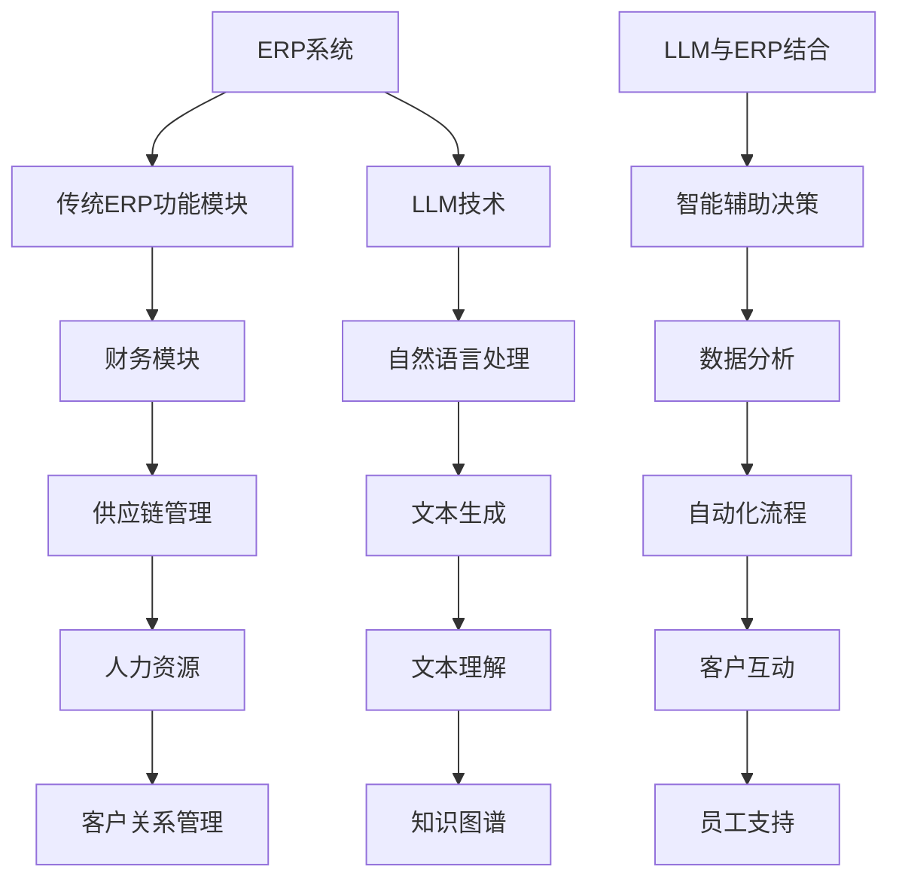

                 

# 《LLM对传统企业资源规划的革新》

## 概述

### 关键词
- LLM（大型语言模型）
- 企业资源规划（ERP）
- 人工智能
- 自动化
- 数据分析

### 摘要
本文将深入探讨大型语言模型（LLM）对传统企业资源规划（ERP）的革新影响。通过分析LLM的基本原理、架构及其在ERP中的具体应用，本文将揭示LLM如何为企业带来智能化、自动化和高效化的资源管理体验。同时，本文还将讨论LLM在ERP应用中面临的挑战及解决方案，并为未来的发展趋势提供展望。

## 第一部分：LLM与传统企业资源规划的背景与概念

### 第1章: LLM与传统企业资源规划的概述

#### 1.1 LLM的兴起与趋势

**1.1.1 语言模型的快速发展**

近年来，随着深度学习和神经网络技术的飞速发展，语言模型（Language Model，简称LM）在自然语言处理（Natural Language Processing，简称NLP）领域取得了显著突破。特别是大型语言模型（LLM）的出现，如Google的BERT、OpenAI的GPT系列，它们在处理复杂语言任务方面展现了强大的能力，引起了广泛关注。

**1.1.2 LLM在商业应用中的重要性**

LLM在商业应用中的重要性不可忽视。无论是智能客服、文本生成、机器翻译，还是知识图谱构建和问答系统，LLM都展现出了极高的准确性和效率。这使得LLM成为传统企业资源规划（ERP）的重要工具，为企业提供更智能、更高效的管理解决方案。

**1.1.3 LLM与传统ERP的联系与区别**

传统ERP系统主要依赖于数据库和事务处理，其核心功能是收集、存储和处理企业的各种业务数据。而LLM作为一种先进的语言处理技术，通过理解和生成自然语言，可以与ERP系统深度整合，为企业提供更加智能化和个性化的服务。

### 1.2 传统企业资源规划（ERP）的概念与挑战

**2.1 ERP的基本概念**

企业资源规划（ERP，Enterprise Resource Planning）是一种集成化管理系统，用于管理企业的核心业务流程，包括财务管理、供应链管理、生产管理、人力资源管理等。ERP系统通过整合企业各部门的数据，提供统一的视图，帮助企业管理者更好地决策。

**2.1.1 ERP的核心功能模块**

ERP系统通常包含多个功能模块，如财务模块、供应链管理模块、生产模块、人力资源模块等。这些模块相互关联，共同支撑企业的运营。

**2.1.2 ERP在企业运营中的角色**

ERP系统在企业运营中扮演着关键角色，不仅帮助企业提高运营效率，降低成本，还能提供实时、准确的数据支持，帮助管理者做出更好的决策。

**2.1.3 传统ERP面临的挑战**

尽管传统ERP系统在企业管理中发挥了重要作用，但随着企业规模的扩大和数据量的增长，传统ERP系统也面临着一系列挑战：

- 数据处理能力不足
- 系统灵活性差
- 适应新业务需求困难
- 数据安全与隐私保护问题

#### 2.2 LLM对ERP的革新

**2.2.1 LLM在ERP中的潜在应用**

LLM在ERP中的潜在应用非常广泛。通过将LLM与ERP系统整合，企业可以实现以下功能：

- 智能客服与客户关系管理
- 供应链管理与优化
- 生产计划与调度
- 人力资源管理与招聘
- 财务管理与报表生成

**2.2.2 LLM与ERP结合的优势**

LLM与ERP结合，能够为企业带来以下优势：

- 提高数据处理能力和效率
- 增强系统的灵活性和适应性
- 降低人力成本，提高员工工作效率
- 提升客户满意度，增强企业竞争力

**2.2.3 LLM在ERP中的实际应用案例**

在现实场景中，LLM已经在ERP系统中得到广泛应用。例如：

- 某大型零售企业利用LLM实现了智能客服系统，大幅提高了客户响应速度和满意度。
- 某制造企业通过LLM优化了供应链管理，实现了库存优化和物流调度。
- 某金融企业利用LLM自动生成财务报表，提高了财务数据的准确性和及时性。

### 第2章: LLM的基本原理与架构

#### 3.1 LLM的数学模型

**3.1.1 语言模型的数学基础**

LLM是基于深度学习和神经网络技术构建的，其数学基础主要包括：

- 神经网络：用于对输入数据进行特征提取和学习。
- 深度学习：通过多层神经网络对大量数据进行训练，提取复杂特征。
- 矩阵运算：用于神经网络的参数更新和计算。

**3.1.2 自注意力机制**

自注意力机制（Self-Attention）是LLM中的一个关键组件，它允许模型在处理输入文本时，根据文本中不同位置的重要程度进行权重分配，从而更好地理解文本的语义。

**3.1.3 Transformer架构**

Transformer架构是LLM的核心架构，它通过多头注意力机制和位置编码等技术，实现了对输入文本的序列建模，具有强大的语义理解和生成能力。

#### 3.2 LLM的核心算法

**3.2.1 预训练与微调**

预训练（Pre-training）和微调（Fine-tuning）是LLM的两个关键步骤。预训练阶段，模型在大规模语料库上进行训练，学习通用语言特征；微调阶段，模型根据特定任务进行微调，以适应具体应用场景。

**3.2.2 语言生成算法**

语言生成算法是LLM的核心算法之一，它通过预测下一个词的概率分布，生成自然语言文本。常用的生成算法包括贪心算法、顶点展开算法等。

**3.2.3 知识图谱与推理算法**

知识图谱（Knowledge Graph）是一种语义网络，用于表示实体和它们之间的关系。LLM可以利用知识图谱进行推理，获取更准确的语义理解。推理算法包括图论算法、逻辑推理算法等。

#### 3.3 LLM的技术实现

**3.3.1 数据预处理**

数据预处理是LLM训练的基础，主要包括文本清洗、分词、去停用词、词向量化等步骤。数据预处理的质量直接影响模型的性能。

**3.3.2 模型训练与优化**

模型训练是LLM实现的关键环节，包括参数初始化、损失函数设计、优化算法选择等。常用的优化算法有随机梯度下降（SGD）、Adam等。

**3.3.3 模型部署与推理**

模型部署是将训练好的模型应用到实际场景的过程。模型推理包括输入文本的编码、模型计算、输出解码等步骤。常用的推理引擎有TensorFlow Serving、PyTorch Server等。

#### 3.4 LLM的架构与性能优化

**3.4.1 硬件加速与分布式训练**

硬件加速（如GPU、TPU）和分布式训练（如数据并行、模型并行）是提高LLM训练效率的重要手段。

**3.4.2 模型压缩与量化**

模型压缩与量化（Quantization）是减小模型体积和提高推理速度的有效方法。常用的压缩技术有剪枝、量化等。

**3.4.3 模型解释性与可解释性**

模型解释性（Explainability）与可解释性（Interpretability）是LLM在商业应用中的重要问题。通过可视化、决策路径分析等方法，可以提高模型的透明度和可信度。

### 附加内容：核心概念原理与架构的Mermaid流程图

## 第二部分：LLM在ERP具体应用领域的详细分析

### 第4章: LLM在ERP具体应用领域的详细分析

#### 4.1 智能客服与客户关系管理

**4.1.1 客户咨询自动处理**

智能客服系统利用LLM对客户咨询进行自动处理，包括理解客户的问题、生成回答和反馈。通过LLM的自然语言理解能力，客服系统能够快速准确地响应客户需求，提高客户满意度。

**4.1.2 客户需求分析与预测**

LLM可以帮助企业分析客户的历史数据和反馈，预测客户的需求和偏好。通过客户需求预测，企业可以更好地制定营销策略和产品规划，提高市场竞争力。

**4.1.3 智能建议与销售预测**

智能客服系统还可以根据客户的交互数据和购买历史，提供个性化的产品推荐和购买建议。同时，LLM还可以结合销售数据，预测未来的销售趋势，帮助企业优化库存和供应链管理。

#### 4.2 供应链管理与优化

**4.2.1 库存管理**

LLM可以帮助企业进行库存管理，通过分析销售数据、库存水平和市场趋势，预测库存需求，优化库存策略，减少库存积压和资金占用。

**4.2.2 采购预测**

LLM可以根据历史采购数据、市场价格和供应情况，预测采购需求，优化采购计划。通过精准的采购预测，企业可以降低采购成本，提高供应链效率。

**4.2.3 库存优化与物流调度**

LLM可以帮助企业进行库存优化和物流调度，通过分析供应链各环节的数据，优化库存布局和运输路线，提高物流效率，降低物流成本。

#### 4.3 人力资源管理

**4.3.1 招聘流程自动化**

LLM可以帮助企业自动化招聘流程，通过分析简历和求职者的信息，自动筛选合适的候选人，提高招聘效率。

**4.3.2 员工技能评估**

LLM可以根据员工的绩效数据、工作内容和培训经历，评估员工的技能水平，提供个性化的培训建议，提高员工能力。

**4.3.3 员工关系管理**

LLM可以帮助企业进行员工关系管理，通过分析员工的反馈和互动数据，了解员工的情绪和需求，提供针对性的关怀和支持，增强员工满意度。

#### 4.4 财务管理

**4.4.1 财务报表自动生成**

LLM可以帮助企业自动生成财务报表，通过分析财务数据和会计规则，快速生成准确的报表，提高财务数据的及时性和准确性。

**4.4.2 资金流动预测**

LLM可以根据历史资金流动数据、业务规模和市场需求，预测未来的资金流动情况，优化资金管理策略，提高资金使用效率。

**4.4.3 风险管理与预警**

LLM可以帮助企业进行风险管理和预警，通过分析财务数据和市场环境，识别潜在的风险，提供风险预警和建议，帮助企业规避风险。

#### 4.5 生产计划与调度

**4.5.1 生产流程优化**

LLM可以帮助企业优化生产流程，通过分析生产数据、设备状态和市场需求，调整生产计划和资源配置，提高生产效率。

**4.5.2 能源消耗预测**

LLM可以帮助企业预测生产过程中的能源消耗，通过分析历史数据、设备性能和市场需求，优化能源管理策略，降低能源成本。

**4.5.3 质量控制与故障预测**

LLM可以帮助企业进行质量控制与故障预测，通过分析生产数据、质量检测数据和设备状态，识别潜在的质量问题和故障隐患，提高生产稳定性和产品质量。

### 第5章: LLM在ERP应用中的挑战与解决方案

#### 5.1 数据质量与隐私保护

**5.1.1 数据收集与整合**

在LLM的应用过程中，数据的质量和完整性至关重要。企业需要收集和整合来自不同部门和系统的数据，确保数据的一致性和准确性。为此，企业可以采用数据集成技术，如数据仓库和数据湖，实现数据的高效整合。

**5.1.2 数据清洗与标准化**

数据清洗是提高数据质量的重要步骤。企业需要对收集到的数据进行清洗，去除重复、错误和缺失的数据。此外，数据标准化也是保证数据一致性的关键，通过对数据进行统一格式和命名规则的规范，确保数据的可比性和可用性。

**5.1.3 隐私保护与合规性**

在利用LLM处理数据的过程中，企业需要关注数据隐私保护和合规性。企业应遵循相关法律法规，如《通用数据保护条例》（GDPR）和《加州消费者隐私法案》（CCPA），确保数据的合法使用和保护用户的隐私权。为此，企业可以采用数据加密、访问控制和数据匿名化等技术手段，保障数据的隐私和安全。

#### 5.2 模型解释性与可解释性

**5.2.1 模型决策过程的可视化**

模型解释性是LLM在ERP应用中的一个关键挑战。为了提高模型的可解释性，企业可以采用可视化技术，如决策树、混淆矩阵和热力图等，展示模型的学习过程和决策路径，帮助用户理解模型的决策逻辑。

**5.2.2 模型结果的解释性提升**

企业可以通过增加模型的可解释性模块，如解释性模型（Explainable AI，XAI），提升模型结果的解释性。解释性模型通过对输入特征和模型输出进行关联分析，提供更详细的解释，帮助用户理解模型的预测结果。

**5.2.3 增强模型的可解释性工具**

为了提高LLM的可解释性，企业可以采用增强模型的可解释性工具，如LIME（Local Interpretable Model-agnostic Explanations）和SHAP（SHapley Additive exPlanations）。这些工具可以帮助用户理解模型对特定输入数据的依赖关系，提供更直观的解释。

#### 5.3 模型适应性

**5.3.1 模型在新业务环境中的适应性**

随着业务的发展和变化，LLM需要在新业务环境中保持适应性。为此，企业可以采用模型迁移学习和模型持续学习技术，使模型能够适应新的业务场景和数据分布，提高模型的泛化能力。

**5.3.2 模型的持续学习与更新**

LLM的持续学习与更新是保持模型性能的关键。企业需要定期对模型进行更新，以适应新的数据和环境。为此，企业可以采用在线学习、迁移学习和增量学习等技术，实现模型的持续学习与优化。

**5.3.3 模型的鲁棒性与泛化能力**

为了提高LLM的鲁棒性和泛化能力，企业可以采用正则化技术、对抗训练和数据增强等方法，增强模型的鲁棒性和泛化能力，使模型能够在不同的业务场景和数据分布下稳定工作。

#### 5.4 技术实现与集成

**5.4.1 LLM在ERP系统中的部署**

为了实现LLM在ERP系统中的部署，企业需要选择合适的技术栈和部署平台。常见的部署平台有TensorFlow Serving、PyTorch Server和Kubeflow等。企业可以根据业务需求和资源情况，选择合适的部署方案。

**5.4.2 系统集成与数据流管理**

实现LLM在ERP系统中的集成，需要建立完善的数据流管理体系。企业需要构建数据管道，将来自不同系统和模块的数据进行整合和清洗，为LLM提供高质量的数据输入。同时，企业还需要设计合理的数据流管理架构，确保数据在不同模块之间的流通和共享。

**5.4.3 技术栈选择与优化**

在实现LLM在ERP系统中的应用过程中，企业需要选择合适的技术栈和优化策略。常见的技术栈包括深度学习框架（如TensorFlow、PyTorch）、分布式计算框架（如Apache Spark、Dask）和数据库（如MySQL、PostgreSQL）等。企业可以根据业务需求和资源情况，选择合适的技术栈并进行优化，提高系统的性能和可扩展性。

### 第6章: LLM在ERP应用的项目实战

#### 6.1 智能客服系统开发

**6.1.1 项目背景与需求分析**

智能客服系统项目旨在提高企业的客户服务质量，降低人工客服的工作负担。项目需求包括自动回答客户问题、处理客户投诉、提供个性化推荐等。

**6.1.2 系统架构设计**

系统架构设计包括前端界面、后端服务和数据库三部分。前端界面负责与用户交互，后端服务负责处理客户问题和生成回答，数据库存储客户数据和交互记录。

**6.1.3 模型训练与优化**

采用GPT-3模型进行预训练，并结合微调技术，使模型适应具体业务场景。通过优化训练策略和调整模型参数，提高模型的性能和生成质量。

**6.1.4 实际案例分析与代码实现**

以一个实际案例为例，展示智能客服系统在客户咨询和投诉处理中的应用。通过代码实现，分析模型在实际应用中的表现和改进方向。

#### 6.2 供应链管理系统优化

**6.2.1 项目背景与需求分析**

供应链管理系统优化项目旨在提高供应链的效率和灵活性，降低库存成本和物流成本。项目需求包括库存管理、采购预测、物流调度等。

**6.2.2 系统架构设计**

系统架构设计包括数据采集模块、数据处理模块、决策支持模块和执行控制模块。数据采集模块负责收集供应链相关数据，数据处理模块负责数据清洗和预处理，决策支持模块负责根据数据生成决策建议，执行控制模块负责执行决策建议。

**6.2.3 模型训练与优化**

采用深度强化学习模型进行供应链管理优化，通过不断学习和优化，提高供应链的适应性和灵活性。通过调整模型参数和优化算法，提高模型的预测精度和执行效率。

**6.2.4 实际案例分析与代码实现**

以一个实际案例为例，展示供应链管理系统在库存管理和物流调度中的应用。通过代码实现，分析模型在实际应用中的效果和改进方向。

#### 6.3 人力资源管理平台搭建

**6.3.1 项目背景与需求分析**

人力资源管理平台搭建项目旨在提高企业的招聘效率、员工管理和培训效果。项目需求包括招聘流程自动化、员工技能评估、员工关系管理等。

**6.3.2 系统架构设计**

系统架构设计包括前端界面、后端服务和数据库三部分。前端界面负责与用户交互，后端服务负责处理招聘申请、员工数据和管理功能，数据库存储招聘信息、员工数据和培训记录。

**6.3.3 模型训练与优化**

采用GPT-3模型进行预训练，并结合微调技术，使模型适应具体业务场景。通过优化训练策略和调整模型参数，提高模型的性能和生成质量。

**6.3.4 实际案例分析与代码实现**

以一个实际案例为例，展示人力资源管理平台在招聘流程和员工关系管理中的应用。通过代码实现，分析模型在实际应用中的表现和改进方向。

#### 6.4 财务管理系统升级

**6.4.1 项目背景与需求分析**

财务管理系统升级项目旨在提高企业的财务数据处理能力、报表生成效率和风险预警能力。项目需求包括财务报表自动生成、资金流动预测、风险管理和预警等。

**6.4.2 系统架构设计**

系统架构设计包括前端界面、后端服务和数据库三部分。前端界面负责与用户交互，后端服务负责处理财务数据、生成报表和风险预警，数据库存储财务数据和报表记录。

**6.4.3 模型训练与优化**

采用深度学习模型进行财务数据处理和预测，通过优化训练策略和调整模型参数，提高模型的预测精度和生成质量。

**6.4.4 实际案例分析与代码实现**

以一个实际案例为例，展示财务管理系统在财务报表生成和风险预警中的应用。通过代码实现，分析模型在实际应用中的效果和改进方向。

### 第7章: 未来展望与趋势

#### 7.1 LLM在ERP中的长期影响

**7.1.1 智能化的深入应用**

随着LLM技术的不断发展，其在ERP系统中的应用将越来越深入。未来，LLM将在ERP系统的各个模块中发挥更大的作用，实现更加智能化和自动化的业务流程。

**7.1.2 数据驱动的业务决策**

LLM在ERP系统中的应用将推动企业从经验驱动向数据驱动转变。通过分析大量数据，LLM可以帮助企业更好地理解业务模式，优化决策过程，提高业务效益。

**7.1.3 ERP系统的变革方向**

未来，ERP系统将朝着更加智能化、个性化和高效化的方向发展。LLM技术将成为ERP系统的重要组成部分，推动ERP系统从传统的事务处理向智能化决策和业务优化转型。

#### 7.2 LLM技术的未来发展

**7.2.1 大模型的技术趋势**

未来，大型语言模型将继续发展，模型规模和参数量将不断增加。大模型将具备更强的语义理解和生成能力，为各类应用提供更高质量的解决方案。

**7.2.2 多模态模型的融合**

未来，LLM将与其他多模态数据（如图像、音频、视频）进行融合，实现跨模态的信息理解和生成。这将推动自然语言处理技术的发展，为更多应用场景提供支持。

**7.2.3 模型安全与隐私保护**

随着LLM技术在商业应用中的普及，模型安全与隐私保护将成为重要议题。未来，LLM技术将朝着更安全、更可靠的方向发展，保障用户数据的隐私和安全。

#### 7.3 企业资源规划的未来

**7.3.1 ERP的智能化升级**

未来，ERP系统将实现更加智能化的功能，如自动化流程、智能决策和个性化服务。LLM技术将成为ERP系统智能化升级的重要驱动力。

**7.3.2 ERP与云计算的结合**

随着云计算技术的普及，ERP系统将更多地采用云架构，实现更高效、更灵活的资源管理。LLM技术将推动ERP系统与云计算的深度融合，为企业提供更强大的数据处理和分析能力。

**7.3.3 ERP系统的全球协同**

未来，ERP系统将实现全球协同，支持跨国企业的业务运营。LLM技术将帮助ERP系统更好地处理跨语言、跨文化业务，实现全球范围内的信息共享和协同工作。

### 附录

#### 附录 A: LLM开发工具与资源

**A.1 开发工具介绍**

- TensorFlow：用于构建和训练深度学习模型的开放源代码框架。
- PyTorch：用于构建和训练深度学习模型的动态计算图框架。
- Hugging Face Transformers：用于构建和训练Transformer模型的Python库。

**A.2 数据集与预处理**

- 公开数据集：如英语语料库、多语言语料库等，可用于模型训练和评估。
- 数据预处理方法：包括文本清洗、分词、去停用词、词向量化等。

**A.3 模型训练与优化**

- 训练策略：包括预训练和微调等。
- 优化算法：如随机梯度下降（SGD）、Adam等。

**A.4 实际应用案例**

- 智能客服案例：展示智能客服系统的实现过程和应用效果。
- 供应链管理案例：展示供应链管理系统优化

