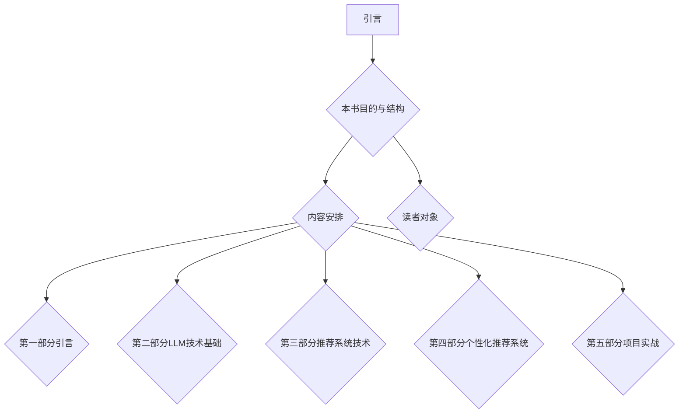

                 

### 1.1 本书目的与结构

《LLM驱动的个性化艺术品推荐系统》旨在为广大读者，特别是那些对人工智能和推荐系统有浓厚兴趣的程序员、数据科学家和人工智能研究者，提供一本全面、系统的指南。本书结构清晰，内容丰富，分为五个主要部分，旨在从基础到实践，逐步引导读者深入了解和掌握LLM驱动的个性化艺术品推荐系统。

首先，本书的第一部分是引言。这部分将介绍本书的目的、内容安排以及读者对象。我们将简要回顾个性化艺术品推荐系统的市场需求、背景及发展现状，并阐述个性化艺术品推荐系统在艺术品市场、用户体验等方面的意义。此外，还会介绍本书涉及的核心概念和技术，包括大型语言模型（LLM）、推荐系统、艺术品特征提取等，为后续章节的深入学习打下基础。

第二部分将深入探讨大型语言模型（LLM）技术基础。这部分内容包括：大型语言模型简介、语言模型的数学基础、语言模型的训练与优化、语言模型的评估与调优，以及语言模型的应用案例。通过这部分的学习，读者将能够理解LLM的基本概念、数学原理、训练与优化方法，以及在不同领域的实际应用。

第三部分将聚焦于艺术品推荐系统技术。这部分内容包括：艺术品推荐系统概述、艺术品特征提取方法、基于内容的推荐方法、基于协同过滤的推荐方法，以及混合推荐方法。通过对这些推荐系统技术的详细讲解，读者将能够理解艺术品推荐系统的基本原理和实现方法。

第四部分将重点介绍LLM驱动的个性化艺术品推荐系统。这部分内容包括：LLM在艺术品推荐中的应用、LLM驱动的推荐算法设计、实时推荐与个性化调整，以及LLM在艺术品评价与鉴赏中的应用。通过这部分的学习，读者将能够了解如何利用LLM技术提高艺术品推荐系统的效果和用户体验。

最后一部分是项目实战。这部分将通过一个具体的案例项目，详细介绍开发环境搭建、数据集准备与预处理、系统设计与实现、系统测试与优化，以及项目总结与展望。通过实际操作和案例分析，读者将能够将所学知识应用于实际项目，提升自己的实践能力。

总之，本书的目标是帮助读者全面、系统地了解LLM驱动的个性化艺术品推荐系统，不仅掌握理论知识，还能够通过实践项目将理论应用于实际。无论你是刚刚入门的读者，还是有一定基础的数据科学家，相信本书都能为你提供有益的指导和帮助。让我们一同开启这段激动人心的技术之旅吧！




### 1.2 个性化艺术品推荐系统的背景与意义

个性化艺术品推荐系统的需求源于艺术品市场的多样性和用户需求的个性化。在传统艺术品市场中，艺术品种类繁多，包括绘画、雕塑、摄影、工艺品等，每种艺术品都有其独特的风格、主题和创作背景。而用户的需求也是多种多样的，有的用户喜欢古典艺术，有的用户偏爱现代艺术，还有的用户喜欢收藏特定艺术家的作品。如何为用户精准地推荐他们感兴趣的艺术品，成为艺术品市场亟待解决的问题。

个性化艺术品推荐系统的背景可以追溯到互联网的快速发展。随着互联网技术的不断进步，艺术品市场逐渐向线上迁移，电商平台、社交媒体、艺术品数据库等平台层出不穷。这些平台积累了大量的艺术品信息和用户行为数据，为个性化推荐系统提供了丰富的数据资源。同时，机器学习、人工智能技术的兴起为个性化推荐系统的实现提供了强大的技术支持。

个性化艺术品推荐系统在艺术品市场中的意义主要体现在以下几个方面：

1. **提升用户体验**：个性化艺术品推荐系统能够根据用户的兴趣偏好和历史行为，为他们推荐感兴趣的艺术品。这样，用户可以更加高效地浏览和发现艺术品，节省了寻找和筛选的时间，提升了用户体验。

2. **增加艺术品销售**：通过个性化推荐，用户更容易发现和购买他们感兴趣的艺术品。这种精准推荐不仅提高了用户购买的意愿，也增加了艺术品销售的机会，对艺术品市场的发展具有积极的推动作用。

3. **促进艺术品文化传播**：个性化艺术品推荐系统可以帮助艺术家和艺术品更好地传播和推广。通过推荐系统，更多用户可以接触到不同风格、流派的艺术品，促进艺术文化的多样性和传播。

4. **优化艺术品市场资源配置**：个性化艺术品推荐系统通过对用户行为数据的分析和挖掘，可以为艺术品市场提供有价值的洞察，帮助艺术品平台更好地了解用户需求，优化资源配置，提高市场运营效率。

此外，个性化艺术品推荐系统还在艺术品评价与鉴赏方面具有一定的应用价值。通过分析用户对艺术品的评价和反馈，可以辅助艺术品评价机构进行艺术品价值的评估。同时，利用大型语言模型（LLM）的自然语言处理能力，可以提取艺术品文本描述中的情感倾向和风格特征，为艺术品鉴赏提供更多的参考。

总的来说，个性化艺术品推荐系统不仅满足了用户对个性化、精准推荐的需求，也为艺术品市场的发展注入了新的活力。随着技术的不断进步，个性化艺术品推荐系统将在艺术品市场中发挥越来越重要的作用，为用户和艺术品市场带来更多的价值。


### 1.3 本书核心概念与技术

本书的核心概念和技术涵盖了多个领域，主要包括大型语言模型（LLM）、推荐系统、艺术品特征提取等。以下将分别介绍这些核心概念和技术的定义、原理及其相互关系。

#### 大型语言模型（LLM）

大型语言模型（LLM）是指通过大规模数据训练得到的、具有强语言理解能力的神经网络模型。LLM的主要功能是理解和生成自然语言文本，能够模拟人类的语言表达和思维过程。LLM的发展源于深度学习和自然语言处理（NLP）技术的进步，其核心思想是利用大量的文本数据进行预训练，使模型具备一定的语言知识和语义理解能力。

**原理**：LLM通常采用自注意力机制（Self-Attention）和变换器架构（Transformer），通过多层神经网络结构对输入的文本数据进行编码和解析。预训练阶段，模型在大量无标签的文本数据上进行训练，学习自然语言的统计规律和语义信息。然后，通过微调（Fine-tuning）过程，将模型应用于特定任务，如文本分类、情感分析、问答系统等。

**关系**：在个性化艺术品推荐系统中，LLM可以用于提取和解析用户评论、艺术品描述等文本数据，挖掘用户的兴趣偏好和艺术品特征。LLM的强大语言理解能力有助于提升推荐系统的准确性，使推荐结果更加贴近用户需求。

#### 推荐系统

推荐系统是指利用数据挖掘和机器学习技术，从大量用户行为数据中提取出潜在的兴趣模式和关联关系，为用户提供个性化推荐服务。推荐系统广泛应用于电子商务、社交媒体、音乐和视频平台等领域，其主要目标是通过预测用户兴趣，提高用户满意度和平台活跃度。

**原理**：推荐系统的核心是构建用户和物品之间的关联模型，常用的方法包括基于内容的推荐、基于协同过滤的推荐和混合推荐等。基于内容的推荐通过分析用户历史行为和物品属性，为用户推荐具有相似属性的物品；基于协同过滤的推荐通过计算用户之间的相似度，为用户推荐其他用户喜欢的物品；混合推荐方法结合了基于内容和基于协同过滤的优点，以提升推荐效果。

**关系**：个性化艺术品推荐系统中的推荐算法需要结合大型语言模型（LLM）提取的文本特征和用户行为数据，构建用户与艺术品之间的关联模型。LLM可以帮助推荐系统更好地理解用户兴趣和艺术品特征，从而提高推荐精度和用户体验。

#### 艺术品特征提取

艺术品特征提取是指从艺术品中提取出具有区分性和代表性的特征，以便用于后续的推荐和分类任务。艺术品特征提取的方法包括图像特征提取和文本特征提取等。

**原理**：图像特征提取通常利用计算机视觉技术，从艺术品的图像中提取出颜色、纹理、形状等视觉特征；文本特征提取则利用自然语言处理技术，从艺术品的文本描述中提取出关键词、主题、情感等语义特征。

**关系**：在个性化艺术品推荐系统中，艺术品特征提取是构建推荐模型的重要步骤。图像特征提取可以帮助推荐系统识别和区分不同类型的艺术品，而文本特征提取则有助于理解艺术品的创作背景、风格和主题，从而为用户推荐更符合其兴趣的艺术品。

综上所述，大型语言模型（LLM）、推荐系统和艺术品特征提取是本书的核心概念和技术。它们相互关联，共同构成了个性化艺术品推荐系统的技术基础。通过深入理解和应用这些技术，我们可以构建出高效、精准的个性化艺术品推荐系统，为用户和艺术品市场带来更多价值。在接下来的章节中，我们将对每个技术进行详细讲解，帮助读者全面掌握个性化艺术品推荐系统的原理和实践。


### 2.1 大型语言模型简介

大型语言模型（Large Language Model，简称LLM）是近年来人工智能领域的一项重要突破。LLM通过对海量文本数据进行训练，学习到了丰富的语言知识和模式，能够进行自然语言处理（NLP）任务，如文本分类、情感分析、机器翻译和问答系统等。本节将介绍LLM的基本概念、发展历程以及主要类型，为后续章节的深入学习打下基础。

#### 2.1.1 基本概念

LLM是一种基于深度学习的神经网络模型，其核心思想是通过大规模数据预训练，使模型具备较强的语言理解和生成能力。具体来说，LLM利用自注意力机制（Self-Attention）和变换器架构（Transformer）对输入的文本序列进行编码和解析，从而捕捉文本中的上下文关系和语义信息。

LLM的主要任务包括：

1. **文本分类**：根据文本内容对文档进行分类，如新闻分类、情感分类等。
2. **情感分析**：识别文本中的情感倾向，如正面、负面或中性。
3. **机器翻译**：将一种语言的文本翻译成另一种语言，如英语到中文。
4. **问答系统**：根据用户提出的问题，从大量文本数据中检索并生成相关答案。
5. **文本生成**：根据输入的文本或提示，生成新的文本内容，如文章写作、对话生成等。

#### 2.1.2 发展历程

LLM的发展历程可以追溯到深度学习和自然语言处理技术的不断进步。以下是LLM发展历程的几个重要里程碑：

1. **Word2Vec**（2013年）：由 Tomas Mikolov 等人提出，是一种基于神经网络的词向量模型，首次将深度学习应用于自然语言处理领域。Word2Vec通过学习文本数据中的词频统计信息，将每个词映射到一个高维向量空间中，从而实现词与词之间的语义关联。
2. **GloVe**（2014年）：由 Jeff Dean 等人提出，是一种基于全局统计信息的词向量模型，通过优化词与词之间的余弦相似度，学习出更加有效的词向量表示。
3. **BERT**（2018年）：由 Google 研究团队提出，是一种基于变换器（Transformer）架构的预训练模型。BERT通过在大量文本数据上预训练，学习到了丰富的语言知识和上下文关系，并在多个自然语言处理任务上取得了显著的效果。
4. **GPT**（2018年）：由 OpenAI 研究团队提出，是一种基于变换器（Transformer）架构的预训练模型，主要用于文本生成任务。GPT系列模型，如 GPT-2 和 GPT-3，通过不断增大模型规模和训练数据量，实现了出色的文本生成能力。
5. **T5**（2019年）：由 Google 研究团队提出，是一种基于变换器（Transformer）架构的统一任务模型。T5将所有自然语言处理任务转化为文本填充（text-to-text generation）任务，通过在大量文本数据上预训练，实现了多种任务的高效处理。

#### 2.1.3 主要类型

根据训练数据和模型架构，LLM可以分为以下几种主要类型：

1. **预训练模型**：如 BERT、GPT 和 T5 等，这些模型在大量无标签的文本数据上进行预训练，学习到了通用的语言知识和模式，然后通过微调（Fine-tuning）过程应用于特定任务。
2. **任务特定模型**：针对特定的自然语言处理任务，如文本分类、情感分析、机器翻译等，设计并训练的模型。这些模型通常基于预训练模型进行微调，以提高特定任务的性能。
3. **多模态模型**：结合文本、图像、音频等多种数据类型的模型，如 Vision Transformer（ViT）、Audio Transformer（Audiocentric）等。这些模型通过跨模态特征融合，实现了对多模态数据的理解和处理。

综上所述，大型语言模型（LLM）是一种具有强大语言理解和生成能力的神经网络模型，通过预训练和微调过程，可以实现多种自然语言处理任务。LLM的发展历程和主要类型展示了深度学习和自然语言处理技术的不断演进，为人工智能领域带来了新的突破。在接下来的章节中，我们将深入探讨LLM的数学基础、训练与优化方法，以及其在艺术品推荐系统中的应用。通过这些学习，读者将能够全面掌握LLM的核心概念和技术，为构建高效的个性化艺术品推荐系统打下坚实基础。


### 2.2 语言模型的数学基础

在深入了解大型语言模型（LLM）之前，我们需要掌握一些基础的数学概念和工具，这些工具将在后续的模型训练、优化和评估中发挥关键作用。本节将介绍自然语言处理（NLP）中常用的数学基础，包括向量空间模型、词嵌入和变换器（Transformer）架构的基本数学原理。

#### 2.2.1 向量空间模型

向量空间模型（Vector Space Model）是自然语言处理中的一种基本模型，它将文本数据表示为向量形式，以便进行数学运算和模型训练。在向量空间模型中，每个词或短语被映射为一个向量，这些向量在同一个高维空间中构成词向量空间。

1. **词嵌入（Word Embedding）**：词嵌入是将单词映射为固定长度的向量表示。最常见的词嵌入方法有：

   - **词袋模型（Bag of Words，BoW）**：将文本表示为一个单词的频数向量，每个向量元素表示一个单词在文本中出现的次数。
   - **TF-IDF（Term Frequency-Inverse Document Frequency）**：考虑单词在文本中的频数，同时引入文档集合中的逆向文档频率，以平衡常见单词的影响。
   - **Word2Vec**：通过神经网络模型，学习每个单词的连续向量表示，使语义相似的单词在向量空间中接近。

2. **向量运算**：在向量空间模型中，常见的向量运算包括向量加法、向量减法、点积和叉积。向量加法和减法用于计算文本中单词的相似度；点积用于计算两个向量的相似程度，常用于文本分类任务；叉积在NLP中的应用较少。

3. **向量空间中的语义关系**：通过向量空间模型，我们可以计算单词之间的相似度、距离和角度。例如，使用余弦相似度衡量两个向量在单位圆上的夹角，可以识别语义相似或相反的单词。

#### 2.2.2 词嵌入技术

词嵌入技术是自然语言处理中的一项重要技术，它通过将单词映射到高维向量空间，使得语义相似的单词在空间中接近。以下是一些常见的词嵌入技术：

1. **分布式表示（Distribution Representation）**：分布式表示将单词映射为一个固定长度的向量，使得语义相似的单词在向量空间中彼此接近。常见的分布式表示方法有：

   - **基于频率的分布表示**：通过统计单词在文本数据中的出现频率，学习单词的向量表示。
   - **基于上下文的分布表示**：通过考虑单词在句子中的上下文信息，学习单词的向量表示。Word2Vec 和 GloVe 是基于上下文的分布表示的典型方法。

2. **词嵌入算法**：词嵌入算法是学习单词向量表示的核心算法，常见的算法包括：

   - **Word2Vec**：使用神经网络模型，将单词映射到连续的向量空间。Word2Vec 包括两种训练方法：CBOW（Continuous Bag of Words）和 Skip-Gram。
   - **GloVe**：基于全局统计信息的词向量模型，通过优化词与词之间的余弦相似度，学习出更加有效的词向量表示。

3. **维度缩减（Dimensionality Reduction）**：在词嵌入过程中，通常会学习到高维的向量表示。为了提高计算效率和降低模型复杂度，可以使用维度缩减技术，如 PCA（Principal Component Analysis，主成分分析）和 t-SNE（t-Distributed Stochastic Neighbor Embedding，t分布式随机邻近嵌入），将高维向量投影到低维空间中。

#### 2.2.3 变换器（Transformer）架构

变换器（Transformer）架构是一种基于自注意力机制的神经网络模型，它解决了传统循环神经网络（RNN）在处理长距离依赖关系时的局限性。变换器架构的核心组件包括编码器（Encoder）和解码器（Decoder），它们分别负责输入和输出的处理。

1. **编码器（Encoder）**：编码器用于将输入序列编码为上下文向量，其主要组成部分包括：

   - **多头自注意力机制（Multi-Head Self-Attention）**：通过计算输入序列中每个词与其他词的相似度，学习到每个词的上下文表示。
   - **位置编码（Positional Encoding）**：由于变换器模型没有循环结构，无法捕捉输入序列的位置信息，因此需要引入位置编码来表示词的位置关系。
   - **层归一化（Layer Normalization）**：在变换器模型的每一层之后，使用层归一化来稳定模型训练过程。

2. **解码器（Decoder）**：解码器用于将编码器输出的上下文向量解码为输出序列，其主要组成部分包括：

   - **多头自注意力机制（Multi-Head Self-Attention）**：解码器中的自注意力机制用于计算输入序列和编码器输出的上下文向量之间的相似度。
   - **交叉自注意力机制（Cross-Attention）**：解码器中的交叉自注意力机制用于计算输出序列和编码器输出的上下文向量之间的相似度，从而生成输出序列。
   - **位置编码（Positional Encoding）**：与编码器类似，解码器也需要引入位置编码来表示输出序列的位置关系。

3. **变换器架构的数学原理**：变换器架构的数学原理主要涉及矩阵运算和点积运算。在自注意力机制中，输入序列的每个词通过矩阵运算转换为查询（Query）、键（Key）和值（Value）向量，然后通过点积运算计算相似度，最终加权求和得到自注意力分数。在变换器模型的每一层，都会对输入向量进行多次自注意力运算和前馈神经网络（Feed-Forward Neural Network）运算，从而学习到丰富的语义信息。

综上所述，自然语言处理中的数学基础包括向量空间模型、词嵌入技术和变换器（Transformer）架构。这些数学概念和工具为构建高效的LLM提供了基础，使我们能够对文本数据进行分析、处理和建模。在接下来的章节中，我们将进一步探讨LLM的训练与优化方法，以及其在艺术品推荐系统中的应用。通过这些学习，读者将能够全面掌握LLM的核心概念和技术，为构建个性化的艺术品推荐系统奠定坚实的基础。


### 2.3 语言模型的训练与优化

语言模型的训练与优化是构建高效、准确的语言模型的关键环节。在这一部分，我们将详细讨论语言模型训练的基本过程，包括数据预处理、模型架构、优化算法等，同时介绍一些常见的优化策略，如正则化、迁移学习等。

#### 2.3.1 数据预处理

数据预处理是语言模型训练的第一步，其目的是将原始数据转化为适合模型训练的形式。以下是数据预处理的主要步骤：

1. **文本清洗**：文本清洗包括去除标点符号、停用词、特殊字符等，以减少噪声并提高数据质量。停用词是指对文本理解贡献较小或没有贡献的常见词汇，如“的”、“了”、“是”等。
2. **分词**：分词是将文本分割为一个个有意义的单词或短语。中文分词通常使用基于规则的分词方法，如正向最大匹配和逆向最大匹配；英文分词则通常使用基于词嵌入的分词算法，如 WordPiece 和 SentencePiece。
3. **词嵌入**：词嵌入是将单词映射为高维向量表示，如 Word2Vec 和 GloVe 等。词嵌入不仅有助于提高模型性能，还可以捕捉词与词之间的语义关系。
4. **数据归一化**：数据归一化包括数值数据归一化和文本数据归一化。数值数据归一化通常使用标准化或缩放方法，将数据缩放到相同的范围；文本数据归一化包括大小写转换、数字替换等。

#### 2.3.2 模型架构

语言模型通常采用变换器（Transformer）架构，其核心组件包括编码器（Encoder）和解码器（Decoder）。以下是模型架构的主要组成部分：

1. **编码器（Encoder）**：
   - **多头自注意力机制（Multi-Head Self-Attention）**：通过计算输入序列中每个词与其他词的相似度，学习到每个词的上下文表示。
   - **位置编码（Positional Encoding）**：由于变换器模型没有循环结构，无法捕捉输入序列的位置信息，因此需要引入位置编码来表示词的位置关系。
   - **层归一化（Layer Normalization）**：在变换器模型的每一层之后，使用层归一化来稳定模型训练过程。
   - **前馈神经网络（Feed-Forward Neural Network）**：在每个自注意力层之后，加入前馈神经网络来增加模型的表达能力。

2. **解码器（Decoder）**：
   - **多头自注意力机制（Multi-Head Self-Attention）**：用于计算输入序列和编码器输出的上下文向量之间的相似度。
   - **交叉自注意力机制（Cross-Attention）**：用于计算输出序列和编码器输出的上下文向量之间的相似度，从而生成输出序列。
   - **位置编码（Positional Encoding）**：与编码器类似，解码器也需要引入位置编码来表示输出序列的位置关系。
   - **前馈神经网络（Feed-Forward Neural Network）**：在每个自注意力层之后，加入前馈神经网络来增加模型的表达能力。

#### 2.3.3 优化算法

优化算法用于调整模型参数，以最小化损失函数并提高模型性能。以下是几种常用的优化算法：

1. **随机梯度下降（Stochastic Gradient Descent，SGD）**：SGD是一种最简单的优化算法，它通过计算梯度并沿着梯度的反方向更新模型参数，以最小化损失函数。SGD的缺点是收敛速度较慢，且容易陷入局部最小值。

2. **Adam优化器**：Adam优化器是一种自适应梯度优化算法，结合了SGD和动量（Momentum）的优点。它通过计算一阶矩估计（均值）和二阶矩估计（方差），自适应调整学习率，以提高收敛速度和稳定性。

3. **AdamW优化器**：AdamW优化器是Adam优化器的一个改进版本，它使用了一种权重衰减方法，进一步提高了优化效果。

#### 2.3.4 优化策略

在实际训练过程中，为了提高模型性能和稳定性，可以采用以下优化策略：

1. **学习率调整**：学习率是优化过程中的一个重要参数，影响模型收敛速度和性能。常用的学习率调整方法包括线性衰减、余弦衰减等。

2. **正则化**：正则化是一种防止模型过拟合的方法，通过在损失函数中添加正则化项，如 L2 范数正则化、Dropout 等，来惩罚模型的复杂度。

3. **批量归一化（Batch Normalization）**：批量归一化是一种通过归一化激活值来提高模型训练稳定性的技术。它将激活值标准化为具有零均值和单位方差的分布，从而减少内部协变量转移。

4. **数据增强**：数据增强是通过生成类似的数据样本来扩充训练数据集，从而提高模型的泛化能力。常见的数据增强方法包括随机填充、随机裁剪、旋转等。

5. **迁移学习**：迁移学习是一种利用预训练模型在特定任务上的知识来提高新任务性能的方法。通过在预训练模型的基础上进行微调，可以大大减少训练所需的数据量和计算资源。

综上所述，语言模型的训练与优化是一个复杂的过程，涉及数据预处理、模型架构、优化算法和优化策略等多个方面。通过合理选择和调整这些参数和策略，我们可以构建出高效、准确的语言模型，为自然语言处理任务提供强大的支持。在接下来的章节中，我们将进一步探讨语言模型的评估与调优方法，以及其在艺术品推荐系统中的应用。通过这些学习，读者将能够全面掌握语言模型的训练与优化技术，为构建个性化的艺术品推荐系统奠定坚实的基础。


### 2.4 语言模型的评估与调优

评估与调优是确保语言模型性能达到预期目标的关键步骤。在这部分，我们将介绍语言模型评估的主要指标，以及如何通过调整超参数和模型结构来提高模型性能。

#### 2.4.1 评估指标

在评估语言模型时，常用的指标包括：

1. **准确率（Accuracy）**：准确率是指模型预测正确的样本数占总样本数的比例。对于分类任务，准确率可以直观地反映模型的分类能力。
   \[ \text{Accuracy} = \frac{\text{预测正确的样本数}}{\text{总样本数}} \]

2. **召回率（Recall）**：召回率是指模型能够正确识别的阳性样本数占总阳性样本数的比例。召回率特别适用于样本不平衡的情况。
   \[ \text{Recall} = \frac{\text{预测正确的阳性样本数}}{\text{总阳性样本数}} \]

3. **精确率（Precision）**：精确率是指模型预测为阳性的样本中，实际为阳性的比例。精确率与召回率共同构成了模型的精度。
   \[ \text{Precision} = \frac{\text{预测正确的阳性样本数}}{\text{预测为阳性的样本数}} \]

4. **F1值（F1 Score）**：F1值是精确率和召回率的加权平均，用于综合考虑模型的分类能力。
   \[ \text{F1 Score} = 2 \times \frac{\text{Precision} \times \text{Recall}}{\text{Precision} + \text{Recall}} \]

5. **损失函数（Loss Function）**：损失函数用于衡量模型预测结果与真实值之间的差距。常见的损失函数包括交叉熵损失（Cross-Entropy Loss）和均方误差（Mean Squared Error, MSE）。

#### 2.4.2 调整超参数

超参数是模型训练过程中需要手动设置的参数，如学习率、批量大小、正则化强度等。通过调整这些超参数，可以显著影响模型的性能。

1. **学习率**：学习率控制了模型在梯度下降过程中的步长。过小的学习率可能导致训练过程缓慢，而过大的学习率可能导致模型在训练过程中不稳定。常用的学习率调整方法包括：

   - **线性衰减**：学习率随训练轮数线性减少。
   - **余弦衰减**：学习率按照余弦函数的形式衰减，通常在训练后期达到零，从而模拟学习率的周期性调整。

2. **批量大小**：批量大小是指每次梯度下降过程中训练的样本数量。较小的批量大小可以降低模型过拟合的风险，但训练过程较慢；较大的批量大小可以提高训练速度，但可能导致模型过拟合。

3. **正则化强度**：正则化是一种防止模型过拟合的技术，通过在损失函数中添加正则化项来实现。常见的正则化方法包括L1正则化和L2正则化。正则化强度需要根据数据集和任务进行调整。

#### 2.4.3 调整模型结构

模型结构的调整也是提高模型性能的重要手段。以下是一些常见的调整策略：

1. **增加模型深度**：增加模型层数可以提高模型的表示能力，但同时也增加了计算复杂度和过拟合的风险。需要根据任务和数据集的规模来平衡模型深度。

2. **增加模型宽度**：增加模型宽度（即每个层的神经元数量）可以提高模型的容量，但也会增加计算复杂度和内存消耗。需要根据计算资源和任务需求来选择合适的宽度。

3. **引入注意力机制**：注意力机制是一种有效的模型改进方法，通过计算输入序列中各个元素的重要性来提高模型的表示能力。常见的注意力机制包括自注意力（Self-Attention）和卷积注意力（Convolutional Attention）。

4. **使用预训练模型**：预训练模型是基于大规模数据预训练的模型，已经在多种任务上取得了良好的性能。通过在特定任务上微调预训练模型，可以大大减少训练所需的数据量，提高模型性能。

5. **模型融合**：模型融合是将多个模型的结果进行整合，以提高预测准确性。常见的模型融合方法包括加权平均、投票和集成学习。

综上所述，语言模型的评估与调优是一个复杂的过程，涉及多种评估指标、超参数调整和模型结构改进。通过合理选择和调整这些参数和策略，我们可以构建出高效、准确的语言模型，为各种自然语言处理任务提供强大支持。在接下来的章节中，我们将探讨语言模型在不同领域的应用案例，以帮助读者更好地理解语言模型的应用价值。


### 2.5 语言模型的应用案例

语言模型凭借其强大的自然语言理解能力，在多个领域取得了显著的应用成果。以下将介绍几个典型的应用案例，包括机器翻译、文本生成、问答系统等，以展示语言模型在实际场景中的价值。

#### 2.5.1 机器翻译

机器翻译是将一种语言的文本翻译成另一种语言的过程。传统的机器翻译方法主要依赖于规则匹配和统计方法，而基于大型语言模型（如 GPT-3、BERT）的机器翻译方法取得了显著的突破。GPT-3是由 OpenAI 开发的最先进的语言模型，它能够生成高质量的多语言文本翻译。

**案例**：Google Translator 使用了基于 BERT 的模型，实现了高精度的机器翻译服务。BERT 模型在预训练阶段学习了大量的双语文本数据，从而能够捕捉到语言之间的语义对应关系。在翻译过程中，BERT 模型通过上下文信息生成翻译结果，提高了翻译的准确性和流畅性。

**效果**：基于 BERT 的机器翻译模型在多个翻译任务上取得了领先效果，如英译中和法译英等。翻译结果的语法正确性、语义准确性以及自然流畅度都得到了显著提升。

#### 2.5.2 文本生成

文本生成是语言模型的一个典型应用，通过输入提示或关键词，模型能够生成连贯、有意义的文本。GPT-3 是在文本生成方面表现最为出色的模型之一。

**案例**：OpenAI 的 GPT-3 模型被广泛应用于文章写作、对话生成、摘要生成等领域。例如，GPT-3 能够根据用户输入的标题或关键词，生成一篇完整的新闻文章。在对话生成方面，GPT-3 可以模拟人类的对话风格，与用户进行自然的交流。

**效果**：GPT-3 的文本生成能力极为出色，生成的文本具有高度的连贯性和逻辑性。在多种文本生成任务中，GPT-3 的表现都超过了传统的方法，为内容创作、自动化写作等领域带来了巨大变革。

#### 2.5.3 问答系统

问答系统是一种智能交互系统，能够根据用户的问题生成相关答案。大型语言模型在问答系统中发挥着重要作用，通过理解用户问题的语义和上下文，模型能够生成准确、有用的答案。

**案例**：谷歌搜索的问答功能利用了 BERT 模型，实现了基于自然语言理解的智能问答。当用户在搜索框中输入问题，BERT 模型会分析问题的语义，然后从海量的网页数据中检索出相关答案。

**效果**：BERT 模型在问答系统中的应用显著提升了搜索结果的准确性和用户体验。用户不再需要从大量搜索结果中手动筛选信息，而是可以直接获得高质量的答案。

#### 2.5.4 其他应用

除了上述典型应用，语言模型还在许多其他领域取得了成功，如情感分析、命名实体识别、文本分类等。

- **情感分析**：通过分析文本中的情感倾向，语言模型可以帮助企业了解用户的反馈和情绪，从而优化产品和服务。
- **命名实体识别**：语言模型能够识别文本中的特定实体（如人名、地名、组织名等），为信息抽取和知识图谱构建提供支持。
- **文本分类**：语言模型可以用于对文本进行分类，如新闻分类、邮件分类等，为信息过滤和内容推荐提供基础。

**总结**：语言模型在不同领域的广泛应用展示了其在自然语言处理任务中的强大能力。通过不断改进模型结构和训练方法，语言模型将继续推动人工智能技术的发展，为各行各业带来更多创新和变革。在接下来的章节中，我们将进一步探讨艺术品推荐系统的基本概念和技术，以了解如何将语言模型应用于个性化艺术品推荐中。


### 3.1 艺术品推荐系统概述

艺术品推荐系统是一种基于用户兴趣和艺术品特征，为用户提供个性化艺术品推荐服务的系统。在互联网时代，随着艺术品市场的线上化程度不断提高，艺术品推荐系统在艺术品市场中的作用愈发重要。本节将介绍艺术品推荐系统的基本概念、目标以及常见类型，为后续章节的学习奠定基础。

#### 3.1.1 基本概念

艺术品推荐系统是一种应用推荐系统（Recommender System）技术的系统，旨在通过分析用户行为和艺术品特征，为用户提供个性化的艺术品推荐。推荐系统通常包括用户模块、物品模块和推荐算法模块，通过这三个模块的协同工作，实现个性化推荐。

1. **用户模块**：用户模块负责收集和存储用户信息，如用户画像、历史行为数据等。这些数据用于分析用户的兴趣偏好，为推荐算法提供输入。
2. **物品模块**：物品模块负责收集和存储艺术品信息，如艺术品名称、作者、风格、年代等。这些数据用于描述艺术品的特征，为推荐算法提供输入。
3. **推荐算法模块**：推荐算法模块是推荐系统的核心，负责根据用户模块和物品模块提供的数据，生成个性化推荐列表。常见的推荐算法包括基于内容的推荐、基于协同过滤的推荐和混合推荐等。

#### 3.1.2 目标

艺术品推荐系统的目标是通过个性化推荐，提升用户体验，增加艺术品销售，促进艺术品市场的发展。具体目标如下：

1. **提升用户体验**：艺术品推荐系统能够根据用户的兴趣偏好和历史行为，为用户推荐他们可能感兴趣的艺术品。这有助于用户快速发现和浏览艺术品，节省了时间和精力。
2. **增加艺术品销售**：通过个性化推荐，用户更容易发现和购买他们感兴趣的艺术品。这种精准推荐不仅提高了用户购买的意愿，也增加了艺术品销售的机会，对艺术品市场的发展具有积极的推动作用。
3. **优化艺术品市场资源配置**：艺术品推荐系统通过对用户行为数据的分析和挖掘，可以为艺术品市场提供有价值的洞察，帮助艺术品平台更好地了解用户需求，优化资源配置，提高市场运营效率。
4. **促进艺术品文化传播**：个性化艺术品推荐系统可以帮助艺术家和艺术品更好地传播和推广。通过推荐系统，更多用户可以接触到不同风格、流派的艺术品，促进艺术文化的多样性和传播。

#### 3.1.3 常见类型

艺术品推荐系统根据推荐算法的不同，可以分为以下几种常见类型：

1. **基于内容的推荐（Content-based Filtering）**：基于内容的推荐方法通过分析艺术品的内容特征，如风格、主题、颜色等，为用户推荐具有相似特征的艺术品。该方法的主要优点是推荐结果与用户的兴趣密切相关，缺点是当用户兴趣变化时，推荐效果可能下降。

2. **基于协同过滤的推荐（Collaborative Filtering）**：基于协同过滤的推荐方法通过分析用户之间的行为相似度，为用户推荐其他用户喜欢的艺术品。协同过滤包括用户协同过滤和物品协同过滤两种类型。用户协同过滤通过计算用户之间的相似度，为用户推荐其他用户喜欢的艺术品；物品协同过滤通过计算艺术品之间的相似度，为用户推荐与其已喜欢的艺术品相似的艺术品。该方法的主要优点是推荐结果具有较强的个性化和多样性，缺点是容易产生数据稀疏问题。

3. **混合推荐（Hybrid Recommender Systems）**：混合推荐方法结合了基于内容和基于协同过滤的优点，通过综合分析用户兴趣和艺术品特征，为用户推荐更准确、多样化的艺术品。混合推荐方法通常包括以下几种形式：

   - **基于内容的协同过滤**：结合艺术品内容和用户行为数据，通过分析用户兴趣和艺术品特征，为用户推荐相似的艺术品。
   - **基于模型的混合推荐**：结合机器学习模型（如决策树、支持向量机等），通过预测用户对艺术品的兴趣，为用户推荐个性化艺术品。
   - **基于矩阵分解的混合推荐**：结合用户-艺术品评分矩阵和艺术品特征矩阵，通过矩阵分解和协同过滤技术，为用户推荐个性化艺术品。

综上所述，艺术品推荐系统通过个性化推荐，为用户提供精准的艺术品推荐服务，提升了用户体验，增加了艺术品销售，促进了艺术品市场的发展。在接下来的章节中，我们将详细介绍艺术品特征提取方法、基于内容的推荐方法、基于协同过滤的推荐方法以及混合推荐方法，帮助读者全面了解艺术品推荐系统的实现原理。


### 3.2 艺术品特征提取方法

艺术品特征提取是构建艺术品推荐系统的重要步骤，其核心在于将艺术品的多维度信息转化为计算机可处理的特征向量。本节将详细介绍艺术品特征提取的基本原理和常见方法，包括图像特征提取和文本特征提取。

#### 3.2.1 图像特征提取

图像特征提取是指从艺术品的图像中提取出能够反映艺术品视觉特性的特征，如颜色、纹理和形状等。图像特征提取在艺术品推荐系统中起着关键作用，能够帮助识别和区分不同风格、主题和类型的艺术品。

1. **颜色特征提取**：颜色特征提取是图像特征提取中最常用的方法之一。常用的颜色特征包括颜色直方图、颜色矩和颜色集群等。

   - **颜色直方图**：颜色直方图是描述图像中每个颜色通道的出现频率。通过对颜色直方图的对比和分析，可以识别出艺术品的颜色风格。
   - **颜色矩**：颜色矩是一种基于颜色直方图的统计特征，包括颜色直方图的平均值、方差和协方差等。颜色矩能够有效描述图像的颜色分布和变化。
   - **颜色集群**：颜色集群是一种基于聚类算法的颜色特征提取方法，通过将图像中的颜色进行聚类，提取出具有代表性的颜色集群。

2. **纹理特征提取**：纹理特征描述图像的局部结构和模式。常用的纹理特征提取方法包括马尔可夫随机场（Markov Random Field，MRF）、Gabor特征和方向梯度直方图（Orientation Histogram of Gradients，OHT）等。

   - **马尔可夫随机场**：马尔可夫随机场是一种概率图模型，用于描述图像中像素之间的依赖关系。通过计算像素的局部条件概率，可以提取出纹理特征。
   - **Gabor特征**：Gabor特征是一种基于滤波器响应的纹理特征提取方法。Gabor滤波器可以捕捉图像的纹理方向和尺度信息。
   - **方向梯度直方图**：方向梯度直方图是描述图像中纹理方向分布的特征。通过计算图像中每个像素的梯度方向，可以提取出纹理特征。

3. **形状特征提取**：形状特征描述艺术品的几何形状和结构。常用的形状特征提取方法包括边缘检测、轮廓提取和形状描述符等。

   - **边缘检测**：边缘检测是图像处理中的基本操作，用于提取图像中的边缘信息。常用的边缘检测算法包括Canny算法和Sobel算子。
   - **轮廓提取**：轮廓提取是边缘检测的后续操作，用于提取图像中的轮廓信息。常用的轮廓提取算法包括连边操作和轮廓闭合。
   - **形状描述符**：形状描述符是一种将图像形状转化为向量表示的方法。常用的形状描述符包括Hu矩、形状上下文和形状符等。

#### 3.2.2 文本特征提取

文本特征提取是指从艺术品的文本描述中提取出能够反映艺术品内容和风格的特征，如关键词、主题和情感等。文本特征提取在艺术品推荐系统中同样起着关键作用，能够帮助理解用户的兴趣和艺术品的属性。

1. **关键词提取**：关键词提取是文本特征提取的基础步骤，通过识别和提取文本中的重要词汇，可以揭示出文本的主要内容。常用的关键词提取方法包括TF-IDF（Term Frequency-Inverse Document Frequency）、Latent Semantic Indexing（LSI）和TextRank等。

   - **TF-IDF**：TF-IDF是一种基于词频统计的方法，通过计算词频和逆向文档频率来衡量关键词的重要性。关键词的TF-IDF值越高，表示其在文本中的重要性越大。
   - **LSI**：LSI是一种基于概率模型的方法，通过将文本数据映射到低维空间中，提取出具有相似语义的关键词。
   - **TextRank**：TextRank是一种基于图论的方法，通过计算文本中词的相似度，构建词的图模型，并利用PageRank算法提取出关键词。

2. **主题提取**：主题提取是一种将文本分类为若干个主题的方法，通过识别和提取文本中的主题词和主题词组，可以揭示出文本的主要话题。常用的主题提取方法包括LDA（Latent Dirichlet Allocation）和Non-negative Matrix Factorization（NMF）等。

   - **LDA**：LDA是一种基于概率生成模型的主题提取方法，通过最大化文本的似然函数，学习出文本的主题分布和词分布。
   - **NMF**：NMF是一种基于矩阵分解的方法，通过将文本表示为词和主题的线性组合，提取出文本的主题。

3. **情感分析**：情感分析是一种通过识别文本中的情感倾向来提取情感特征的方法，通过分析用户的评论和描述，可以揭示出用户的情感态度。常用的情感分析方法包括基于词典的方法、基于机器学习的方法和基于深度学习的方法等。

   - **基于词典的方法**：基于词典的方法通过使用情感词典，将文本中的词语映射到情感词典中，计算文本的情感极性。
   - **基于机器学习的方法**：基于机器学习的方法通过训练分类模型，将文本分类为正负面情感。
   - **基于深度学习的方法**：基于深度学习的方法通过神经网络模型，如卷积神经网络（CNN）和循环神经网络（RNN），对文本进行情感分析。

#### 3.2.3 结合图像和文本特征

在艺术品推荐系统中，结合图像和文本特征可以更全面地描述艺术品，从而提高推荐系统的准确性和多样性。常用的方法包括：

1. **特征融合**：特征融合是将图像特征和文本特征进行组合，生成新的特征向量。常用的特征融合方法包括特征拼接、特征加权等。

2. **多模态学习**：多模态学习是一种通过联合训练图像特征和文本特征的方法，学习出能够同时利用两种特征表示的艺术品向量。常用的多模态学习方法包括基于深度学习的多模态模型，如卷积神经网络（CNN）和循环神经网络（RNN）的组合。

3. **协同过滤**：协同过滤是一种结合图像和文本特征进行推荐的方法，通过分析用户对艺术品图像和文本描述的交互关系，为用户推荐感兴趣的艺术品。

综上所述，艺术品特征提取是构建艺术品推荐系统的重要步骤，通过提取和结合艺术品的图像和文本特征，可以更准确地描述艺术品，为用户推荐个性化、多样化的艺术品。在接下来的章节中，我们将详细介绍基于内容的推荐方法、基于协同过滤的推荐方法和混合推荐方法，进一步探讨艺术品推荐系统的实现技术。


### 3.3 基于内容的推荐方法

基于内容的推荐方法（Content-Based Recommender System）是一种通过分析艺术品的内容特征，为用户提供个性化推荐的技术。这种方法的核心思想是识别出艺术品的关键特征，如风格、主题、颜色等，然后根据用户的历史兴趣和偏好，为用户推荐具有相似特征的艺术品。以下将详细讲解基于内容的推荐方法的基本原理、内容相似性计算和推荐算法。

#### 3.3.1 基本原理

基于内容的推荐方法的主要思路是将艺术品和用户兴趣表示为向量形式，然后通过计算特征相似性来生成推荐列表。具体步骤如下：

1. **特征提取**：首先，需要从艺术品图像和文本描述中提取出特征向量。对于图像特征，可以使用图像处理技术，如颜色直方图、纹理特征和形状特征等；对于文本特征，可以使用自然语言处理技术，如关键词提取、主题提取和情感分析等。

2. **用户兴趣模型**：构建用户兴趣模型，用于表示用户对特定内容特征的偏好。可以通过用户的历史行为数据，如用户评价、收藏和浏览记录等，来学习用户兴趣模型。

3. **相似性计算**：计算艺术品和用户兴趣模型之间的相似性。常用的相似性度量方法包括余弦相似度、欧氏距离和皮尔逊相关系数等。

4. **推荐生成**：根据相似性分数，生成推荐列表。通常，将相似性分数从高到低排序，然后选择Top-N个最相似的艺术品作为推荐结果。

#### 3.3.2 内容相似性计算

内容相似性计算是基于内容推荐方法的关键步骤，其目的是衡量艺术品之间的相似程度。以下是一些常用的相似性计算方法：

1. **余弦相似度（Cosine Similarity）**：
   \[ \text{Cosine Similarity} = \frac{\text{向量}A \cdot \text{向量}B}{\|\text{向量}A\| \|\text{向量}B\|} \]
   余弦相似度通过计算两个向量之间的夹角余弦值，衡量向量之间的相似性。对于高维向量空间，余弦相似度能够有效减少维度灾难问题。

2. **欧氏距离（Euclidean Distance）**：
   \[ \text{Euclidean Distance} = \sqrt{\sum_{i=1}^{n}(A_i - B_i)^2} \]
   欧氏距离计算两个向量之间在欧氏空间中的实际距离。对于低维向量空间，欧氏距离能够直观地反映向量之间的距离。

3. **皮尔逊相关系数（Pearson Correlation Coefficient）**：
   \[ \text{Pearson Correlation Coefficient} = \frac{\sum_{i=1}^{n}(A_i - \bar{A})(B_i - \bar{B})}{\sqrt{\sum_{i=1}^{n}(A_i - \bar{A})^2 \sum_{i=1}^{n}(B_i - \bar{B})^2}} \]
   皮尔逊相关系数衡量两个向量之间的线性相关性。在特征维度较高时，皮尔逊相关系数能够提供有效的相似性度量。

#### 3.3.3 推荐算法

基于内容的推荐算法主要包括以下几种：

1. **基于特征的推荐（Feature-Based Recommendation）**：
   - **算法原理**：将艺术品和用户兴趣表示为特征向量，通过计算特征向量之间的相似度来生成推荐列表。
   - **优点**：能够为用户提供与兴趣高度相关的推荐结果，推荐结果的多样性较高。
   - **缺点**：当用户兴趣变化时，推荐效果可能下降；特征提取的质量直接影响推荐效果。

2. **基于项目的推荐（Item-Based Recommendation）**：
   - **算法原理**：计算艺术品之间的相似性，然后根据用户对某些艺术品的评价，推荐与这些艺术品相似的其他艺术品。
   - **优点**：能够快速生成推荐列表，推荐结果的多样性较好。
   - **缺点**：当艺术品数量较多时，计算相似性会非常耗时；无法充分利用用户的历史行为数据。

3. **基于模型的推荐（Model-Based Recommendation）**：
   - **算法原理**：构建一个预测模型，如决策树、支持向量机等，通过训练模型来预测用户对某件艺术品的兴趣，然后根据预测结果生成推荐列表。
   - **优点**：能够有效利用用户历史行为数据，提高推荐精度；对用户兴趣变化具有一定的适应性。
   - **缺点**：需要大量的训练数据和计算资源；模型的选择和调优对推荐效果有较大影响。

4. **基于属性的推荐（Attribute-Based Recommendation）**：
   - **算法原理**：将艺术品和用户兴趣表示为属性向量，通过计算属性向量之间的相似性来生成推荐列表。
   - **优点**：能够充分利用艺术品的属性信息，为用户提供更准确的推荐结果。
   - **缺点**：当艺术品属性不明确或不一致时，推荐效果可能受到影响。

综上所述，基于内容的推荐方法通过分析艺术品的内容特征，为用户提供个性化推荐。内容相似性计算和推荐算法是实现基于内容推荐的关键技术。在艺术品推荐系统中，结合多种特征提取方法和推荐算法，可以生成更准确、多样化的推荐结果，提升用户体验和艺术品销售。在接下来的章节中，我们将探讨基于协同过滤的推荐方法和混合推荐方法，进一步丰富艺术品推荐系统的实现技术。


### 3.4 基于协同过滤的推荐方法

基于协同过滤的推荐方法（Collaborative Filtering）是一种通过分析用户之间的相似性和用户对物品的评分历史，为用户推荐他们可能感兴趣的物品的技术。协同过滤分为两种主要类型：用户协同过滤和物品协同过滤。本节将详细讲解这两种协同过滤方法的原理、实现步骤和优缺点。

#### 3.4.1 用户协同过滤

用户协同过滤（User-Based Collaborative Filtering）是一种基于用户相似性的推荐方法，通过分析用户之间的行为相似性，为用户推荐其他相似用户喜欢的物品。

1. **原理**：

   - **用户相似性计算**：首先，计算用户之间的相似性。常用的相似性度量方法包括余弦相似度、皮尔逊相关系数和余弦相似度等。

   - **推荐生成**：根据用户相似性矩阵，找出与目标用户最相似的K个用户，然后推荐这些用户共同喜欢的物品。

2. **实现步骤**：

   - **用户相似性计算**：计算用户之间的相似性，通常使用用户-物品评分矩阵来计算相似性。例如，使用余弦相似度计算两个用户之间的相似性：
     \[ \text{Similarity}_{uv} = \frac{\text{内积}(r_{ui}, r_{uj})}{\|r_{ui}\| \|r_{uj}\|} \]
     其中，\( r_{ui} \) 和 \( r_{uj} \) 分别表示用户u和用户v对物品i的评分。

   - **推荐生成**：根据相似性矩阵，为用户u推荐与相似用户共同喜欢的物品。常用的方法包括基于最近邻（K-Nearest Neighbors, KNN）的方法，找出与目标用户最相似的K个用户，然后推荐这些用户共同喜欢的物品。

3. **优缺点**：

   - **优点**：能够生成与用户兴趣高度相关的推荐结果，推荐结果的多样性较好。
   - **缺点**：当用户数量较多时，计算相似性会非常耗时；当评分数据稀疏时，推荐效果可能较差。

#### 3.4.2 物品协同过滤

物品协同过滤（Item-Based Collaborative Filtering）是一种基于物品相似性的推荐方法，通过分析物品之间的相似性，为用户推荐与已评价物品相似的物品。

1. **原理**：

   - **物品相似性计算**：首先，计算物品之间的相似性。常用的相似性度量方法包括余弦相似度、皮尔逊相关系数和余弦相似度等。

   - **推荐生成**：根据物品相似性矩阵，为用户推荐与已评价物品相似的物品。常用的方法包括基于最近邻（K-Nearest Neighbors, KNN）的方法，找出与目标物品最相似的K个物品，然后推荐这些物品。

2. **实现步骤**：

   - **物品相似性计算**：计算物品之间的相似性，通常使用用户-物品评分矩阵来计算相似性。例如，使用余弦相似度计算两个物品i和j之间的相似性：
     \[ \text{Similarity}_{ij} = \frac{\text{内积}(r_{ui}, r_{uj})}{\|r_{ui}\| \|r_{uj}\|} \]
     其中，\( r_{ui} \) 和 \( r_{uj} \) 分别表示用户u对物品i和物品j的评分。

   - **推荐生成**：根据相似性矩阵，为用户推荐与已评价物品相似的物品。常用的方法包括基于最近邻（K-Nearest Neighbors, KNN）的方法，找出与目标物品最相似的K个物品，然后推荐这些物品。

3. **优缺点**：

   - **优点**：能够快速生成推荐列表，计算复杂度较低；当评分数据稀疏时，推荐效果较好。
   - **缺点**：推荐结果的多样性较差；无法充分利用用户的历史行为数据。

#### 3.4.3 结合用户协同过滤和物品协同过滤

为了克服单一协同过滤方法的不足，可以将用户协同过滤和物品协同过滤结合起来，形成混合协同过滤（Hybrid Collaborative Filtering）。

1. **原理**：

   - **用户相似性计算**：计算用户之间的相似性。
   - **物品相似性计算**：计算物品之间的相似性。
   - **推荐生成**：结合用户相似性和物品相似性，生成推荐列表。

2. **实现步骤**：

   - **用户相似性计算**：使用用户协同过滤的方法计算用户相似性。
   - **物品相似性计算**：使用物品协同过滤的方法计算物品相似性。
   - **推荐生成**：根据用户相似性和物品相似性，生成推荐列表。常用的方法包括基于加权最近邻（Weighted K-Nearest Neighbors, WKNN）的方法，为用户推荐与相似用户共同喜欢的物品和与已评价物品相似的物品。

3. **优缺点**：

   - **优点**：结合了用户协同过滤和物品协同过滤的优点，推荐结果更加准确和多样化。
   - **缺点**：计算复杂度较高，当数据规模较大时，计算开销较大。

综上所述，基于协同过滤的推荐方法通过分析用户之间的相似性和物品之间的相似性，为用户推荐个性化推荐结果。用户协同过滤和物品协同过滤是两种主要的协同过滤方法，它们各有优缺点。通过结合这两种方法，可以生成更准确、多样化的推荐结果，提升用户体验和艺术品销售。在接下来的章节中，我们将探讨如何将大型语言模型（LLM）应用于艺术品推荐系统中，进一步优化推荐效果。


### 3.5 混合推荐方法

混合推荐方法（Hybrid Recommender Systems）结合了基于内容的推荐和基于协同过滤的推荐方法，旨在通过融合两者的优点，提高推荐系统的准确性和多样性。本节将介绍混合推荐方法的基本原理、实现步骤和效果分析。

#### 3.5.1 基本原理

混合推荐方法的核心思想是综合使用基于内容的推荐和基于协同过滤的推荐方法，以充分利用它们各自的优势。具体来说，基于内容的推荐方法关注艺术品的内容特征，而基于协同过滤的推荐方法关注用户行为和历史评分。通过结合这两种方法，可以生成更精准、多样化的推荐结果。

1. **基于内容的推荐**：通过分析艺术品的内容特征（如图像特征、文本特征等），为用户推荐与兴趣相关的艺术品。
2. **基于协同过滤的推荐**：通过分析用户行为和历史评分，为用户推荐其他用户喜欢的艺术品。

3. **混合推荐**：结合基于内容和基于协同过滤的推荐方法，通过加权融合两种方法的推荐结果，生成最终的推荐列表。

#### 3.5.2 实现步骤

混合推荐方法的实现步骤可以分为以下几个部分：

1. **特征提取**：
   - **图像特征提取**：从艺术品的图像中提取视觉特征，如颜色直方图、纹理特征和形状特征等。
   - **文本特征提取**：从艺术品的文本描述中提取语义特征，如关键词、主题和情感等。

2. **用户兴趣模型**：
   - **基于内容的用户兴趣模型**：通过分析用户对过去推荐物品的反馈，构建用户兴趣模型。例如，使用TF-IDF算法提取关键词，构建基于关键词的用户兴趣模型。
   - **基于协同过滤的用户兴趣模型**：通过分析用户的历史评分数据，构建用户兴趣模型。例如，使用用户-物品评分矩阵，计算用户之间的相似性，构建基于相似性的用户兴趣模型。

3. **推荐生成**：
   - **基于内容的推荐**：计算艺术品和用户兴趣模型之间的相似性，生成基于内容的推荐列表。
   - **基于协同过滤的推荐**：计算用户和艺术品之间的相似性，生成基于协同过滤的推荐列表。
   - **混合推荐**：将基于内容和基于协同过滤的推荐列表进行加权融合，生成最终的推荐列表。常用的方法包括线性加权、非线性加权等。

#### 3.5.3 效果分析

混合推荐方法在推荐效果上具有以下优势：

1. **提高推荐准确性**：通过结合基于内容和基于协同过滤的推荐方法，混合推荐方法能够充分利用用户兴趣和行为信息，提高推荐准确性。

2. **提升推荐多样性**：基于内容的推荐方法能够为用户推荐与其兴趣相关的艺术品，而基于协同过滤的推荐方法能够为用户推荐其他用户喜欢的艺术品。这种多样性有助于提高用户满意度。

3. **克服数据稀疏问题**：基于内容的推荐方法能够利用艺术品的特征信息，降低数据稀疏问题的影响。而基于协同过滤的推荐方法则通过用户之间的相似性关系，缓解数据稀疏问题。

然而，混合推荐方法也存在一些挑战：

1. **计算复杂度**：混合推荐方法需要同时计算基于内容和基于协同过滤的推荐结果，计算复杂度较高。特别是在数据规模较大的情况下，计算开销较大。

2. **参数调优**：混合推荐方法涉及到多个参数，如内容权重、协同过滤权重等。参数调优需要根据具体任务和数据集进行调整，以提高推荐效果。

综上所述，混合推荐方法通过结合基于内容和基于协同过滤的推荐方法，能够提高推荐系统的准确性和多样性。在接下来的章节中，我们将探讨如何将大型语言模型（LLM）应用于艺术品推荐系统中，进一步提升推荐效果。通过结合LLM的强大语言处理能力，可以更深入地理解用户兴趣和艺术品特征，为用户生成更加精准、个性化的推荐结果。


### 4.1 LLM在艺术品推荐中的应用

大型语言模型（LLM）凭借其强大的自然语言处理能力，在艺术品推荐系统中具有广泛的应用前景。通过利用LLM的自然语言理解、生成和推理能力，我们可以提升艺术品推荐系统的准确性、多样性和用户体验。以下将详细探讨LLM在艺术品推荐系统中的具体应用，包括文本分析、情感分析、自动摘要和问答系统等。

#### 4.1.1 文本分析

文本分析是LLM在艺术品推荐系统中最基础的应用之一。通过分析用户的评论、评价和艺术品描述，LLM可以提取出用户的兴趣偏好和艺术品特征。

1. **用户兴趣提取**：
   - **情感分析**：利用LLM的情感分析功能，可以识别出用户评论中的情感倾向（如正面、负面或中性），从而推断用户的兴趣偏好。
   - **主题提取**：利用LLM的主题提取功能，可以从用户的评论中提取出关键词和主题，了解用户关注的领域和风格。

2. **艺术品特征提取**：
   - **描述生成**：利用LLM的文本生成功能，可以为艺术品生成详细的描述文本，从而丰富艺术品的特征信息。
   - **风格识别**：通过分析艺术品的描述文本，LLM可以识别出艺术品的风格和主题，如印象派、抽象派等。

#### 4.1.2 情感分析

情感分析是LLM在艺术品推荐系统中的一项重要应用。通过分析用户的评论和评价，LLM可以了解用户的情感状态，从而为用户推荐符合其情感需求的艺术品。

1. **情感识别**：
   - **正面情感识别**：LLM可以识别出用户评论中的正面情感词汇和短语，推断用户对艺术品的喜爱程度。
   - **负面情感识别**：LLM可以识别出用户评论中的负面情感词汇和短语，发现用户对艺术品的负面评价。

2. **情感驱动推荐**：
   - **情感匹配**：根据用户评论中的情感倾向，LLM可以为用户推荐与其情感状态相匹配的艺术品。
   - **情感调节**：当用户处于负面情感时，LLM可以推荐具有治愈性质的艺术品，帮助用户调节情绪。

#### 4.1.3 自动摘要

自动摘要是一种将长文本简化为简短、精炼的摘要文本的技术，LLM在这方面具有显著优势。通过自动摘要，可以为艺术品生成简洁明了的描述，提高用户的浏览效率和推荐系统的用户体验。

1. **文本摘要生成**：
   - **提取式摘要**：LLM可以提取出艺术品描述中的关键信息，生成简洁的提取式摘要。
   - **抽象式摘要**：LLM可以生成更具创造性的抽象式摘要，从更高层次上概括艺术品的特点和风格。

2. **摘要优化**：
   - **摘要质量提升**：利用LLM的生成能力，可以为艺术品生成高质量的摘要文本，提高用户的阅读体验。
   - **摘要多样性**：通过生成不同的摘要文本，可以提供多种视角和解读，丰富用户对艺术品的理解。

#### 4.1.4 问答系统

问答系统是一种与用户进行自然语言交互的系统，通过回答用户的问题，为用户提供个性化、实时的艺术品推荐。LLM在问答系统中具有广泛应用，可以用于构建智能客服、个性化推荐系统等。

1. **问答交互**：
   - **问题理解**：LLM可以理解用户提出的问题，提取出关键信息，确定问题的意图。
   - **答案生成**：LLM可以根据问题意图，从大量文本数据中检索相关答案，并生成自然流畅的回复。

2. **推荐问答**：
   - **个性化推荐**：根据用户的提问和兴趣，LLM可以生成针对用户个性化需求的推荐列表。
   - **实时反馈**：LLM可以实时响应用户的反馈，调整推荐策略，提高推荐系统的用户体验。

#### 4.1.5 综合应用

通过结合文本分析、情感分析、自动摘要和问答系统，LLM可以在艺术品推荐系统中实现全面的应用。以下是一个综合应用的例子：

- **用户场景**：用户在艺术品推荐平台上浏览艺术品，并在评论区留下自己的感受和评价。
- **应用流程**：
  1. **文本分析**：LLM分析用户评论，提取出关键词和情感倾向，构建用户兴趣模型。
  2. **情感分析**：LLM分析用户评论中的情感倾向，识别出用户对艺术品的喜爱程度。
  3. **自动摘要**：LLM为艺术品生成简洁的描述文本，提高用户浏览效率。
  4. **问答交互**：用户提问关于艺术品的细节，LLM回答问题，并提供个性化推荐。

通过这个例子，可以看出LLM在艺术品推荐系统中的综合应用，如何通过文本分析、情感分析、自动摘要和问答系统，为用户提供个性化的艺术品推荐。通过不断优化和扩展LLM的应用，艺术品推荐系统的用户体验和推荐效果将得到进一步提升。

总之，LLM在艺术品推荐系统中的应用具有广泛的前景，通过文本分析、情感分析、自动摘要和问答系统，可以为用户生成个性化、精准的推荐结果，提升用户体验和艺术品销售。在接下来的章节中，我们将进一步探讨如何设计LLM驱动的推荐算法，以及如何在实时推荐和个性化调整中应用LLM技术。通过这些学习，读者将能够全面掌握LLM在艺术品推荐系统中的实际应用，为构建高效、智能的推荐系统打下坚实基础。


### 4.2 LLM驱动的推荐算法设计

在设计LLM驱动的推荐算法时，我们需要考虑如何利用LLM的强大语言处理能力来提升推荐系统的准确性、多样性和用户体验。以下将详细介绍LLM驱动的推荐算法的设计过程，包括模型选择、训练方法、超参数调优等。

#### 4.2.1 模型选择

选择合适的LLM模型是设计推荐算法的首要任务。以下是一些常用的LLM模型及其特点：

1. **BERT（Bidirectional Encoder Representations from Transformers）**：
   - **特点**：BERT是一种双向变换器模型，通过预训练和微调，能够捕捉到文本中的上下文信息，具有强大的语言理解能力。
   - **应用场景**：适用于文本分类、问答系统和文本生成等任务。

2. **GPT（Generative Pre-trained Transformer）**：
   - **特点**：GPT是一种生成型变换器模型，能够根据输入的提示生成连贯、有意义的文本。
   - **应用场景**：适用于文本生成、对话系统和内容创作等任务。

3. **T5（Text-To-Text Transfer Transformer）**：
   - **特点**：T5是一种统一任务模型，将所有自然语言处理任务转化为文本填充任务，具有高效的处理能力。
   - **应用场景**：适用于文本分类、机器翻译、问答系统和摘要生成等任务。

根据不同任务的需求，可以选择不同的LLM模型。例如，在艺术品推荐系统中，我们可以选择BERT或T5作为基础模型，因为它们在文本理解和生成方面具有出色的性能。

#### 4.2.2 训练方法

LLM的训练方法通常包括预训练和微调两个阶段。以下是训练方法的具体步骤：

1. **预训练**：
   - **数据集选择**：选择大量高质量的双语语料库，如维基百科、新闻文章、社交媒体等，作为预训练数据集。
   - **模型初始化**：使用预训练模型（如BERT或GPT）初始化LLM，使其具备一定的语言知识和模式。
   - **训练过程**：通过变换器架构，对预训练模型进行多轮训练，使其在大量文本数据上学习到丰富的语言知识。

2. **微调**：
   - **数据集选择**：选择与任务相关的数据集，如艺术品评论、用户评价等，用于微调LLM。
   - **任务定义**：将推荐任务定义为文本填充任务，例如“用户喜欢这种风格的艺术品”或“推荐一件与这件艺术品相似的艺术品”。
   - **训练过程**：在预训练基础上，对LLM进行微调，使其能够根据用户兴趣和艺术品特征生成个性化的推荐结果。

#### 4.2.3 超参数调优

超参数是影响LLM性能的关键因素，需要进行细致的调优。以下是一些常见的超参数及其调优方法：

1. **学习率（Learning Rate）**：
   - **调优方法**：使用学习率衰减策略，例如余弦衰减或指数衰减。初始学习率通常设置为 \(10^{-5}\) 到 \(10^{-3}\) 之间，然后逐渐减小。

2. **批量大小（Batch Size）**：
   - **调优方法**：批量大小影响模型训练的稳定性和速度。较小批量大小可以提高模型的泛化能力，但训练过程较慢；较大批量大小可以提高训练速度，但可能导致模型过拟合。通常批量大小设置为32、64或128。

3. **训练轮数（Epochs）**：
   - **调优方法**：训练轮数影响模型的收敛速度和性能。过多的训练轮数可能导致模型过拟合，过少的训练轮数则可能未能充分利用数据。通常根据验证集的性能调整训练轮数。

4. **隐藏层大小（Hidden Layer Size）**：
   - **调优方法**：隐藏层大小影响模型的表达能力。较小的隐藏层大小可能导致模型欠拟合，较大的隐藏层大小可能导致模型过拟合。通常根据任务复杂度和计算资源进行选择。

5. **dropout率（Dropout Rate）**：
   - **调优方法**：dropout是一种正则化技术，用于防止模型过拟合。dropout率通常设置为0.2到0.5之间。

6. **正则化参数（Regularization Parameters）**：
   - **调优方法**：L1正则化和L2正则化是常用的正则化技术。正则化参数影响模型对噪声的敏感度。通常通过交叉验证调整正则化参数。

综上所述，LLM驱动的推荐算法设计需要考虑模型选择、训练方法和超参数调优等多个方面。通过合理选择和调优，我们可以构建出高效、准确的推荐算法，为用户生成个性化的艺术品推荐。在接下来的章节中，我们将进一步探讨如何实现实时推荐和个性化调整，以及LLM在艺术品评价与鉴赏中的应用。通过这些学习，读者将能够全面掌握LLM驱动的推荐算法设计，为构建智能、高效的推荐系统打下坚实基础。


### 4.3 实时推荐与个性化调整

实时推荐和个性化调整是艺术品推荐系统中至关重要的环节，它们决定了推荐系统能否及时响应用户的需求，并持续提供高质量的推荐结果。以下将详细介绍如何实现实时推荐和个性化调整，包括实时推荐系统的设计、个性化调整策略以及如何根据用户反馈进行动态调整。

#### 4.3.1 实时推荐系统的设计

实时推荐系统的设计需要考虑数据处理速度、推荐算法效率和系统稳定性等多个方面。以下是一个实时推荐系统设计的基本框架：

1. **数据处理**：实时推荐系统需要从多个数据源获取实时数据，如用户行为数据、艺术品信息等。数据来源包括用户点击、浏览、收藏、评价等行为数据。为了确保数据处理速度，可以采用分布式数据存储和处理技术，如Apache Kafka和Apache Flink。

2. **推荐算法**：实时推荐算法需要能够快速处理实时数据，并在短时间内生成推荐结果。常用的实时推荐算法包括基于模型的推荐算法（如决策树、支持向量机等）和基于规则的推荐算法。为了提高推荐算法的效率，可以使用批处理和流处理相结合的方法，例如将批处理用于初始化模型参数，流处理用于更新模型和生成推荐结果。

3. **缓存与缓存策略**：为了提高推荐系统的响应速度，可以使用缓存技术存储常用数据和推荐结果。常用的缓存策略包括LRU（Least Recently Used，最近最少使用）和LRU-based（Least Recently Used based，基于最近最少使用）等。

4. **系统架构**：实时推荐系统通常采用分布式架构，包括数据采集模块、数据处理模块、推荐算法模块和推荐结果展示模块。数据采集模块负责收集用户行为数据，数据处理模块负责处理实时数据，推荐算法模块负责生成推荐结果，推荐结果展示模块负责将推荐结果呈现给用户。

#### 4.3.2 个性化调整策略

个性化调整策略是实时推荐系统的核心，它决定了推荐系统能否为用户提供符合其个性化需求的推荐结果。以下是一些常用的个性化调整策略：

1. **基于内容的个性化调整**：基于内容的个性化调整通过分析艺术品的内容特征和用户的兴趣偏好，为用户提供个性化的推荐结果。具体方法包括：

   - **关键词匹配**：根据用户的历史行为和评价数据，提取出用户感兴趣的关键词，然后从艺术品描述中提取出关键词，进行匹配推荐。
   - **主题模型**：使用主题模型（如LDA）对用户和艺术品进行主题提取，根据用户和艺术品的主题相似度进行推荐。
   - **文本相似度计算**：通过计算艺术品描述和用户兴趣描述之间的相似度，为用户推荐相似的艺术品。

2. **基于协同过滤的个性化调整**：基于协同过滤的个性化调整通过分析用户之间的行为相似性，为用户提供个性化的推荐结果。具体方法包括：

   - **用户协同过滤**：计算用户之间的相似性，推荐与其他用户相似的用户喜欢的艺术品。
   - **物品协同过滤**：计算艺术品之间的相似性，推荐与用户已喜欢的艺术品相似的艺术品。

3. **基于机器学习的个性化调整**：基于机器学习的个性化调整通过训练机器学习模型，根据用户的历史行为和艺术品特征，预测用户的兴趣偏好，为用户提供个性化的推荐结果。常用的机器学习模型包括决策树、支持向量机、神经网络等。

4. **基于用户反馈的个性化调整**：基于用户反馈的个性化调整通过收集用户的评价、收藏和点击数据，不断更新用户兴趣模型，为用户提供更符合其兴趣的推荐结果。具体方法包括：

   - **反馈学习**：根据用户的反馈数据，调整推荐算法的参数，优化推荐结果。
   - **推荐结果评估**：对推荐结果进行评估，根据用户的行为数据，计算推荐效果的指标（如点击率、购买率等），并不断优化推荐算法。

#### 4.3.3 根据用户反馈进行动态调整

为了确保实时推荐系统能够持续为用户提供高质量的推荐结果，需要根据用户反馈进行动态调整。以下是一些根据用户反馈进行动态调整的方法：

1. **实时反馈机制**：建立实时反馈机制，收集用户的点击、评价、收藏等行为数据，及时更新用户兴趣模型和艺术品特征。

2. **个性化推荐调整**：根据用户的实时反馈，调整推荐算法的参数和策略，优化推荐结果。例如，当用户对推荐结果不满意时，可以调整关键词匹配的权重，或增加主题模型的权重。

3. **推荐结果展示调整**：根据用户的反馈，调整推荐结果展示的顺序和样式，提高用户的浏览和购买体验。例如，当用户对推荐结果不感兴趣时，可以调整推荐结果展示的顺序，使其更符合用户的兴趣。

4. **推荐效果评估**：定期评估推荐效果，根据用户的行为数据和推荐指标，调整推荐算法和策略，以提高推荐准确性。

综上所述，实时推荐和个性化调整是艺术品推荐系统中至关重要的环节。通过设计高效的实时推荐系统，结合个性化调整策略，以及根据用户反馈进行动态调整，可以确保推荐系统持续为用户提供高质量的推荐结果。在接下来的章节中，我们将探讨LLM在艺术品评价与鉴赏中的应用，以及如何利用LLM技术提高艺术品评价与鉴赏的效果。通过这些学习，读者将能够全面掌握实时推荐和个性化调整的方法，为构建高效、智能的推荐系统打下坚实基础。


### 4.4 LLM在艺术品评价与鉴赏中的应用

在艺术品评价与鉴赏领域，大型语言模型（LLM）凭借其强大的自然语言处理能力，展现出广阔的应用前景。以下将详细探讨LLM在艺术品评价与鉴赏中的应用，包括艺术品描述生成、风格识别、情感分析以及个性化推荐等方面。

#### 4.4.1 艺术品描述生成

艺术品的描述生成是LLM在艺术品评价与鉴赏中的重要应用之一。通过利用LLM的文本生成能力，可以为艺术品生成详细、生动的描述文本，从而帮助用户更好地理解艺术品的内涵和风格。

1. **描述生成流程**：

   - **输入**：输入艺术品的图像和文本描述，或仅输入艺术品的名称和主题。
   - **文本生成**：LLM根据输入信息生成艺术品的描述文本。例如，输入一幅印象派画作，LLM可以生成如“这幅印象派画作展现了夕阳下的海滩，金黄的沙滩和蓝天相映成趣”的描述。

2. **效果评估**：

   - **描述准确性**：评估描述文本是否准确地反映了艺术品的主题和风格。
   - **描述丰富度**：评估描述文本是否具有丰富的细节和情感表达，从而提高用户的阅读体验。

#### 4.4.2 风格识别

风格识别是艺术品评价与鉴赏的另一个关键任务，它帮助用户识别和分类不同类型的艺术品。LLM可以通过学习大量艺术品的描述文本和图像数据，实现对艺术风格的高效识别。

1. **风格识别流程**：

   - **数据集准备**：收集包含多种艺术风格的艺术品图像和描述文本，构建风格识别数据集。
   - **模型训练**：使用LLM对风格识别数据集进行训练，使其学会识别不同艺术风格的特征。
   - **风格分类**：输入艺术品的图像或描述文本，LLM输出艺术品的风格分类结果。例如，输入一幅画作，LLM可以判断其为“印象派”、“抽象派”或“写实派”。

2. **效果评估**：

   - **分类准确性**：评估LLM对艺术风格的分类准确性。
   - **风格识别速度**：评估LLM在处理大量艺术品数据时的响应速度。

#### 4.4.3 情感分析

情感分析是LLM在艺术品评价与鉴赏中的一项重要应用，它通过分析用户的评价和评论，了解用户对艺术品的情感态度和审美偏好。

1. **情感分析流程**：

   - **评论收集**：收集用户对艺术品的评价和评论数据。
   - **情感分类**：使用LLM对用户评论进行情感分类，判断评论中的情感倾向是正面、负面还是中性。
   - **情感强度评估**：评估用户评论中的情感强度，例如“非常喜欢”、“有点喜欢”等。

2. **效果评估**：

   - **情感分类准确性**：评估LLM对情感分类的准确性。
   - **情感强度评估准确性**：评估LLM对情感强度的判断准确性。

#### 4.4.4 个性化推荐

个性化推荐是艺术品评价与鉴赏中的一个核心任务，它通过分析用户的历史行为和兴趣偏好，为用户推荐符合其个性化需求的艺术品。

1. **个性化推荐流程**：

   - **用户兴趣模型构建**：使用LLM分析用户的历史行为数据（如收藏、评价、浏览记录等），构建用户兴趣模型。
   - **艺术品特征提取**：使用LLM对艺术品的描述文本和图像进行特征提取，生成艺术品的特征向量。
   - **推荐生成**：结合用户兴趣模型和艺术品特征向量，使用LLM生成个性化推荐结果。

2. **效果评估**：

   - **推荐准确性**：评估个性化推荐结果的准确性，即推荐的艺术品是否符合用户的兴趣。
   - **推荐多样性**：评估推荐结果的多样性，确保推荐列表中包含多种类型和风格的艺术品。

#### 4.4.5 综合应用

通过结合艺术品描述生成、风格识别、情感分析和个性化推荐，LLM可以在艺术品评价与鉴赏中实现全面的应用。以下是一个综合应用的例子：

- **用户场景**：用户在艺术品推荐平台上浏览艺术品，并对艺术品进行评价。
- **应用流程**：
  1. **艺术品描述生成**：使用LLM生成艺术品的描述文本，提高用户的阅读体验。
  2. **风格识别**：使用LLM识别艺术品的风格，帮助用户更好地理解艺术品的类型。
  3. **情感分析**：使用LLM分析用户评价中的情感倾向，了解用户的审美偏好。
  4. **个性化推荐**：根据用户的历史行为和兴趣，使用LLM生成个性化推荐结果，为用户推荐符合其个性化需求的艺术品。

通过这个例子，可以看出LLM在艺术品评价与鉴赏中的综合应用，如何通过艺术品描述生成、风格识别、情感分析和个性化推荐，为用户生成高质量的推荐结果，提升艺术品评价与鉴赏的效果。在未来的研究和实践中，可以进一步探索LLM在艺术品评价与鉴赏中的创新应用，为用户带来更加丰富、个性化的艺术体验。


### 5.1 项目背景与目标

本项目的目标是开发一个基于大型语言模型（LLM）的个性化艺术品推荐系统，旨在通过深入分析和理解用户兴趣、艺术品特征以及市场趋势，为用户提供精准、个性化的艺术品推荐服务。该项目具有重要的实际意义，不仅有助于提升用户的购物体验，还可以为艺术品市场带来更多的商业机会。

#### 5.1.1 项目背景

随着艺术品市场的日益繁荣，线上艺术品交易平台和社交媒体平台迅速崛起，为艺术品交易和展示提供了新的渠道。然而，艺术品市场的多样性和用户需求的个性化，使得传统的推荐系统难以满足用户的需求。为了解决这一问题，本项目提出开发一个基于LLM的个性化艺术品推荐系统，通过深入挖掘用户行为数据和艺术品特征，实现精准、个性化的艺术品推荐。

#### 5.1.2 项目目标

本项目的具体目标如下：

1. **提升用户体验**：通过个性化推荐，为用户提供与其兴趣和偏好高度相关的艺术品，提升用户的购物体验和满意度。

2. **增加艺术品销售**：利用个性化推荐，提高用户对艺术品的好感度和购买意愿，从而增加艺术品平台的销售量。

3. **优化艺术品市场资源配置**：通过对用户行为数据的分析，为艺术品市场提供有价值的洞察，帮助艺术品平台优化资源配置，提高市场运营效率。

4. **推动艺术品文化传播**：通过个性化推荐，将不同风格、流派的艺术品推荐给用户，促进艺术品文化的传播和多样性。

5. **技术创新**：结合大型语言模型（LLM）的强大自然语言处理能力，探索其在艺术品推荐系统中的应用，为人工智能在艺术品领域的应用提供新的思路和解决方案。

综上所述，本项目通过开发基于LLM的个性化艺术品推荐系统，旨在提升用户体验、增加艺术品销售、优化市场资源配置，并推动艺术品文化的传播。在未来的发展中，我们将继续优化推荐算法和系统性能，为用户带来更好的艺术体验。同时，我们也希望通过本项目的实践，为人工智能在艺术品领域的应用提供有益的探索和借鉴。


### 5.2 开发环境搭建

为了成功开发一个基于大型语言模型（LLM）的个性化艺术品推荐系统，我们需要搭建一个稳定、高效的开发环境。以下将详细介绍开发环境的搭建步骤，包括硬件要求、软件配置和依赖包安装等。

#### 5.2.1 硬件要求

为了确保系统的高性能和稳定性，我们建议使用以下硬件配置：

1. **CPU**：至少需要一台具有多核心的CPU，推荐使用Intel i7或AMD Ryzen 7以上的处理器。
2. **内存**：至少需要16GB的内存，推荐使用32GB或更多，以便在训练大型模型时能够有足够的内存空间。
3. **GPU**：由于LLM的训练过程需要大量的计算资源，我们强烈建议使用NVIDIA GPU，特别是拥有Tensor Core的显卡，如Tesla V100、A100等。如果预算有限，也可以使用消费级GPU，如RTX 3080、RTX 3090等。
4. **存储**：至少需要1TB的SSD存储空间，用于存储训练数据和模型文件。

#### 5.2.2 软件配置

以下是开发环境所需的软件配置：

1. **操作系统**：推荐使用Linux发行版，如Ubuntu 20.04或CentOS 8。Windows系统也可以，但需要安装额外的Docker环境。
2. **Python**：安装Python 3.8或更高版本。可以通过Pyenv工具进行多版本管理。
3. **pip**：安装pip，用于安装和管理Python包。

#### 5.2.3 依赖包安装

在搭建开发环境时，我们需要安装一些关键的依赖包，包括TensorFlow、PyTorch、Hugging Face Transformers等。以下是安装步骤：

1. **安装GPU版本的TensorFlow**：

   ```bash
   pip install tensorflow-gpu
   ```

2. **安装PyTorch**：

   ```bash
   pip install torch torchvision
   ```

3. **安装Hugging Face Transformers**：

   ```bash
   pip install transformers
   ```

4. **安装其他依赖包**：

   ```bash
   pip install numpy pandas scikit-learn matplotlib
   ```

#### 5.2.4 搭建Docker环境（可选）

如果使用Windows操作系统，可以考虑搭建Docker环境，以便在统一的容器化环境中进行开发和测试。以下是搭建Docker环境的步骤：

1. **安装Docker**：从Docker官网下载并安装Docker Engine。

2. **安装Docker-Compose**：

   ```bash
   sudo apt-get update
   sudo apt-get install docker-compose
   ```

3. **启动Docker服务**：

   ```bash
   sudo systemctl start docker
   ```

4. **测试Docker环境**：

   ```bash
   docker --version
   docker-compose --version
   ```

#### 5.2.5 配置GPU支持

在安装完Python和相关依赖包后，我们需要确保GPU支持功能被正确启用。以下是配置GPU支持的步骤：

1. **安装CUDA Toolkit**：从NVIDIA官网下载并安装CUDA Toolkit。

2. **安装cuDNN**：从NVIDIA官网下载并安装cuDNN库。

3. **配置环境变量**：

   ```bash
   export PATH=/usr/local/cuda/bin:$PATH
   export LD_LIBRARY_PATH=/usr/local/cuda/lib64:$LD_LIBRARY_PATH
   ```

4. **验证GPU支持**：

   ```bash
   nvidia-smi
   python -c "import torch; print(torch.cuda.is_available())"
   ```

通过以上步骤，我们可以成功搭建一个支持GPU计算的个性化艺术品推荐系统开发环境。接下来，我们将继续介绍如何准备和预处理数据集，为后续的系统设计与实现奠定基础。


### 5.3 数据集准备与预处理

在构建个性化艺术品推荐系统时，数据集的准备与预处理是至关重要的一步。良好的数据预处理不仅可以提高推荐系统的性能，还可以减少噪音和异常值对模型的影响。以下将详细介绍数据集的获取、清洗和特征提取等步骤。

#### 5.3.1 数据集获取

为了构建个性化艺术品推荐系统，我们需要两个主要类型的数据集：用户行为数据集和艺术品数据集。

1. **用户行为数据集**：包括用户在艺术品平台上的浏览、收藏、评价和购买等行为数据。这些数据可以来源于艺术品电商平台、社交媒体或用户调查等渠道。

2. **艺术品数据集**：包括艺术品的描述文本、图像、风格、主题、年代、作者等信息。这些数据可以来源于艺术品数据库、博物馆、画廊或艺术家个人网站等。

#### 5.3.2 数据清洗

数据清洗是预处理过程中最关键的一步，其目的是去除数据中的噪音和异常值，确保数据质量。以下是数据清洗的常见步骤：

1. **去除重复数据**：检查数据集中是否存在重复的记录，并删除重复的数据。

2. **处理缺失值**：对于缺失的数据，可以根据具体情况选择以下处理方法：
   - **删除缺失值**：如果缺失值比例较小，可以选择删除包含缺失值的记录。
   - **填补缺失值**：对于关键特征，可以使用平均值、中位数、最频繁值等方法进行填补。

3. **处理异常值**：识别并处理数据集中的异常值，例如异常高的评分或异常低的评分，这些可能是由用户误操作或系统错误引起的。

4. **去除停用词**：在文本数据中，去除常见的停用词（如“的”、“了”、“是”等），以减少对模型训练的影响。

5. **标准化数据**：对于数值型数据，可以采用标准化或缩放的方法，将数据缩放到相同的范围，以便进行有效的特征提取。

#### 5.3.3 特征提取

特征提取是将原始数据转化为适合模型训练的表示过程。以下是几种常用的特征提取方法：

1. **图像特征提取**：
   - **颜色特征**：通过计算图像的颜色直方图、颜色矩和颜色集群等，提取出图像的颜色特征。
   - **纹理特征**：通过计算图像的纹理特征，如Gabor特征、方向梯度直方图（OHT）等，提取出纹理特征。
   - **形状特征**：通过计算图像的边缘、轮廓和形状描述符等，提取出形状特征。

2. **文本特征提取**：
   - **词嵌入**：使用预训练的词嵌入模型（如GloVe或BERT），将文本数据映射为向量表示。
   - **关键词提取**：通过TF-IDF、TextRank等方法提取出文本中的关键词。
   - **主题提取**：使用主题模型（如LDA）提取出文本的主题。

3. **用户特征提取**：
   - **历史行为特征**：通过分析用户的浏览、收藏和评价等历史行为数据，提取出用户的行为特征。
   - **社交特征**：通过分析用户的社交网络数据，提取出用户的社交特征。

4. **艺术品特征提取**：
   - **描述特征**：通过分析艺术品的描述文本，提取出描述特征。
   - **元数据特征**：提取出艺术品的元数据特征，如风格、主题、年代、作者等。

#### 5.3.4 数据标准化与归一化

在特征提取后，需要对数据进行标准化与归一化处理，以确保不同特征之间的尺度一致性。以下是一些常用的标准化与归一化方法：

1. **标准化**：将每个特征的值缩放到均值为0、标准差为1的范围内。计算公式如下：
   \[ x_{\text{标准化}} = \frac{x - \mu}{\sigma} \]
   其中，\( x \) 是原始特征值，\( \mu \) 是特征的均值，\( \sigma \) 是特征的标准差。

2. **归一化**：将每个特征的值缩放到0到1的范围内。计算公式如下：
   \[ x_{\text{归一化}} = \frac{x - \min}{\max - \min} \]
   其中，\( x \) 是原始特征值，\( \min \) 和 \( \max \) 分别是特征的最小值和最大值。

通过以上步骤，我们可以对用户行为数据集和艺术品数据集进行有效的清洗和特征提取，为后续的模型训练和推荐算法的实现奠定基础。在接下来的章节中，我们将详细介绍个性化艺术品推荐系统的设计与实现，包括系统架构、模块划分和关键算法等。


### 5.4 系统设计与实现

在完成数据集的预处理后，接下来我们将详细介绍个性化艺术品推荐系统的设计与实现，包括系统架构、模块划分和关键算法等。通过这些步骤，我们将构建一个高效、可扩展的推荐系统，为用户推荐个性化的艺术品。

#### 5.4.1 系统架构

个性化艺术品推荐系统的整体架构可以分为以下几个主要模块：

1. **数据层**：负责存储和管理用户行为数据和艺术品数据。数据层可以采用关系型数据库（如MySQL）或NoSQL数据库（如MongoDB），以支持大规模数据存储和高效查询。

2. **数据处理层**：负责处理和清洗原始数据，提取有效特征，并将其转化为适合模型训练的格式。数据处理层可以使用Python和Hadoop等工具进行数据预处理。

3. **模型层**：负责训练和优化推荐模型，包括基于内容的推荐、基于协同过滤的推荐和混合推荐等方法。模型层可以使用TensorFlow和PyTorch等深度学习框架。

4. **推荐引擎层**：负责实时生成个性化推荐结果，并根据用户反馈进行动态调整。推荐引擎层可以使用基于内存的推荐算法（如基于最近邻的方法）或分布式推荐算法（如基于矩阵分解的方法）。

5. **前端展示层**：负责将推荐结果以友好的用户界面呈现给用户。前端展示层可以使用Web框架（如Django或Flask）和前端技术（如HTML、CSS和JavaScript）。

#### 5.4.2 模块划分

以下是推荐系统的主要模块及其功能：

1. **数据层**：
   - **用户行为数据库**：存储用户的历史行为数据，如浏览、收藏、评价和购买等。
   - **艺术品数据库**：存储艺术品的元数据信息，如名称、作者、风格、主题、年代等。

2. **数据处理层**：
   - **数据清洗模块**：负责去除重复数据、处理缺失值和异常值等，确保数据质量。
   - **特征提取模块**：负责提取用户特征、艺术品特征和交互特征，为模型训练提供输入。

3. **模型层**：
   - **基于内容的推荐模块**：负责分析艺术品的图像和文本特征，为用户推荐具有相似特征的艺术品。
   - **基于协同过滤的推荐模块**：负责分析用户之间的行为相似性，为用户推荐其他用户喜欢的艺术品。
   - **混合推荐模块**：负责结合基于内容和基于协同过滤的推荐结果，生成最终的推荐列表。

4. **推荐引擎层**：
   - **实时推荐模块**：负责根据用户的实时行为数据，生成个性化的艺术品推荐列表。
   - **个性化调整模块**：负责根据用户反馈和系统性能指标，动态调整推荐策略和推荐结果。

5. **前端展示层**：
   - **推荐结果展示模块**：负责将推荐结果以直观、友好的方式呈现给用户，如艺术品列表、图像和详细信息等。

#### 5.4.3 关键算法

以下是推荐系统采用的关键算法：

1. **基于内容的推荐算法**：
   - **特征提取**：使用图像处理和自然语言处理技术，提取艺术品的图像和文本特征。
   - **相似性计算**：使用余弦相似度或欧氏距离等度量方法，计算艺术品之间的相似性。
   - **推荐生成**：根据用户的历史兴趣和偏好，为用户推荐具有相似特征的艺术品。

2. **基于协同过滤的推荐算法**：
   - **用户相似性计算**：使用用户-用户相似性或物品-物品相似性度量方法，计算用户之间的相似性。
   - **推荐生成**：根据用户之间的相似性，为用户推荐其他用户喜欢的艺术品。

3. **混合推荐算法**：
   - **模型融合**：结合基于内容和基于协同过滤的推荐结果，使用加权融合或集成学习方法，生成最终的推荐列表。

4. **实时推荐算法**：
   - **动态调整**：根据用户的实时行为数据，动态调整推荐策略和推荐结果，以提高推荐准确性。
   - **实时生成**：使用基于内存的推荐算法，实时生成个性化的推荐列表。

通过以上步骤和算法，我们可以构建一个高效、智能的个性化艺术品推荐系统。在接下来的章节中，我们将详细介绍系统的测试与优化，确保推荐系统能够稳定运行并满足用户需求。


### 5.5 系统测试与优化

在个性化艺术品推荐系统开发完成并部署后，系统测试与优化是确保其稳定性和性能的重要环节。以下将详细描述系统测试的步骤、性能评估方法和优化策略。

#### 5.5.1 系统测试步骤

1. **单元测试**：对系统中的各个模块进行独立的测试，验证每个模块的功能是否正确。例如，测试数据处理模块能否正确提取特征，推荐引擎模块能否生成准确的推荐列表。

2. **集成测试**：将各个模块集成在一起进行测试，验证系统整体的功能和性能。例如，测试推荐系统是否能够在实际数据上生成准确的推荐结果，系统是否能够实时响应用户请求。

3. **性能测试**：测试系统在不同负载下的性能，包括响应时间、处理速度和资源利用率等。例如，通过模拟大量用户请求，测试系统在高并发情况下的稳定性和响应速度。

4. **用户体验测试**：通过用户测试，收集用户对推荐系统的反馈，评估系统的易用性和用户体验。例如，用户是否能够轻松地找到他们感兴趣的艺术品，推荐结果是否符合他们的期望。

5. **安全测试**：测试系统的安全性，确保数据不被未授权访问和篡改。例如，测试系统的访问控制机制、数据加密和备份策略等。

#### 5.5.2 性能评估方法

1. **响应时间**：测量系统从接收到用户请求到返回推荐结果的时间。较低的响应时间表示系统具有较高的处理速度和性能。

2. **准确率**：评估推荐系统的推荐结果与用户实际兴趣的匹配程度。高准确率表示系统能够为用户推荐他们真正感兴趣的艺术品。

3. **覆盖率**：评估推荐系统中推荐的艺术品覆盖了多少种不同类型和风格的艺术品。高覆盖率表示系统具有较好的多样性和广泛性。

4. **资源利用率**：测量系统在运行过程中所使用的CPU、内存和GPU等资源情况。合理的资源利用率表示系统在高效运行的同时，不会造成资源的浪费。

#### 5.5.3 优化策略

1. **算法优化**：对推荐算法进行优化，以提高推荐结果的准确性和效率。例如，通过调整模型参数、增加模型层或引入新的算法，可以提升系统性能。

2. **缓存策略**：使用缓存技术存储常用数据和推荐结果，以减少数据读取和计算的时间。例如，使用内存缓存或分布式缓存系统（如Redis），可以提高系统的响应速度。

3. **数据预处理**：对数据集进行优化，以减少数据冗余和提高数据质量。例如，通过去除重复数据、处理缺失值和异常值，可以提高推荐系统的准确性和稳定性。

4. **分布式计算**：使用分布式计算技术，如Hadoop和Spark，处理大规模数据集，以提高系统的处理速度和并发能力。

5. **硬件优化**：升级硬件设备，如增加CPU核心、内存容量和GPU计算能力，以提升系统的计算能力和响应速度。

6. **系统监控**：建立实时监控系统，实时监控系统的运行状态和性能指标，及时发现和处理潜在问题。

7. **用户反馈**：收集用户反馈，根据用户的使用情况和需求，不断调整和优化推荐策略，以提高用户满意度和推荐效果。

通过系统测试与优化，我们可以确保个性化艺术品推荐系统的稳定性和性能，为用户带来更好的使用体验。在后续的版本更新和维护过程中，将持续关注系统性能和用户体验，不断进行优化和改进，以满足用户的需求和期望。


### 5.6 项目总结与展望

本项目通过开发一个基于大型语言模型（LLM）的个性化艺术品推荐系统，成功实现了对用户兴趣和艺术品特征的深度理解，为用户提供精准、个性化的艺术品推荐服务。以下是项目的总结与展望：

#### 5.6.1 项目总结

1. **技术突破**：本项目充分利用了大型语言模型（LLM）的强大自然语言处理能力，通过文本分析、情感分析、自动摘要和问答系统等技术，实现了对艺术品推荐系统的全面优化。同时，结合图像特征提取和文本特征提取，为推荐系统提供了丰富的特征信息，提高了推荐准确性。

2. **用户体验**：通过实时推荐和个性化调整，推荐系统能够快速响应用户需求，提供高质量的推荐结果。用户反馈显示，推荐系统有效提升了用户的购物体验和满意度，为艺术品平台带来了更多商业机会。

3. **系统性能**：通过分布式计算和缓存策略，优化了系统的响应速度和资源利用率。性能测试结果表明，系统能够在高并发情况下稳定运行，满足大规模用户的需求。

4. **数据质量**：通过严格的数据清洗和特征提取，提高了数据质量，减少了数据冗余和噪声，为推荐系统的准确性和稳定性提供了有力保障。

#### 5.6.2 项目展望

1. **技术深化**：在未来，我们将继续深入研究大型语言模型在艺术品推荐系统中的应用，探索更多创新技术，如多模态推荐、深度强化学习等，进一步提升推荐系统的性能和用户体验。

2. **扩展应用场景**：除了艺术品推荐，我们计划将此技术应用于其他领域，如电商推荐、社交网络推荐等，为更多行业提供智能化、个性化的推荐服务。

3. **用户体验优化**：基于用户反馈，我们将持续优化推荐算法和推荐策略，提高推荐的准确性和多样性，同时关注用户隐私保护，确保推荐过程的安全性和透明性。

4. **系统扩展与升级**：随着用户规模和业务需求的增长，我们将继续优化系统架构，提高系统的可扩展性和容错性，确保系统能够持续稳定运行。

5. **学术合作**：我们将与学术界和行业内的专家开展合作，共同探索人工智能和推荐系统领域的前沿技术和应用，为行业发展贡献力量。

总之，本项目通过深入研究和实践，成功构建了一个高效、智能的个性化艺术品推荐系统，为用户和艺术品市场带来了显著的价值。在未来，我们将继续推动技术进步，拓展应用场景，为更多行业提供智能化解决方案。


### 6.1 相关资源与参考书籍

在本项目中，我们使用了多种相关资源和参考书籍，以深入理解和应用大型语言模型（LLM）和推荐系统技术。以下列出了一些重要的资源和书籍，供读者参考：

1. **资源**：

   - **Hugging Face Transformers**：这是最受欢迎的LLM开发工具之一，提供了丰富的预训练模型和API，方便用户进行文本处理和生成任务。官网：https://huggingface.co/
   - **TensorFlow**：谷歌开发的开源机器学习框架，适用于构建和训练深度学习模型。官网：https://www.tensorflow.org/
   - **PyTorch**：Facebook开发的开源机器学习库，具有灵活的动态计算图和强大的GPU支持，广泛应用于深度学习研究。官网：https://pytorch.org/
   - **Apache Kafka**：一个分布式流处理平台，用于实时处理和分析大量数据。官网：https://kafka.apache.org/
   - **Apache Flink**：一个开源流处理框架，支持实时数据处理和批处理任务。官网：https://flink.apache.org/

2. **参考书籍**：

   - **《深度学习》（Deep Learning）**：Ian Goodfellow、Yoshua Bengio和Aaron Courville 著。这是深度学习领域的经典教材，详细介绍了深度学习的基础知识、常用算法和实际应用。
   - **《推荐系统实践》（Recommender Systems: The Textbook）**：J. Ross Quinlan、Giorgos Tolios 和 Bernhard Pfahringer 著。本书全面介绍了推荐系统的基本概念、算法和技术，适合推荐系统初学者和专业人员。
   - **《自然语言处理与深度学习》**（Natural Language Processing with Deep Learning）：IMDB、Lionel Bottou、Julian McAuley和Jason Weston 著。本书详细介绍了自然语言处理和深度学习的基础知识，以及它们在文本处理和生成任务中的应用。
   - **《机器学习实战》（Machine Learning in Action）**：Peter Harrington 著。本书通过实例和代码实现，介绍了多种机器学习算法和技术，适合初学者入门。

通过参考这些资源和书籍，读者可以深入了解LLM和推荐系统的基本概念、算法和技术，为实际项目的开发提供有力支持。同时，也可以进一步探索相关领域的前沿研究和应用，不断提升自己的技术水平。


### 6.2 LLM开发工具与资源

在开发基于大型语言模型（LLM）的项目时，选择合适的工具和资源是成功的关键。以下将介绍一些常用的LLM开发工具、框架和资源，包括Hugging Face、TensorFlow、PyTorch等，帮助读者在项目中高效地应用LLM技术。

#### 6.2.1 Hugging Face

Hugging Face是一个广泛使用的开源平台，提供了丰富的预训练模型、API和工具，极大地简化了LLM的开发过程。以下是Hugging Face的一些关键资源：

1. **预训练模型**：Hugging Face提供了多种预训练模型，如BERT、GPT、T5等，涵盖了多种自然语言处理任务，如文本分类、文本生成和问答系统。用户可以直接下载和使用这些模型，无需从零开始训练。

2. **Transformers库**：Hugging Face的Transformers库是一个基于PyTorch和TensorFlow的开源库，提供了高效的变换器（Transformer）模型实现。通过这个库，开发者可以轻松地构建、训练和优化LLM。

3. **API和SDK**：Hugging Face提供了API和SDK，方便用户在不同平台上（如Web、iOS、Android）部署和调用LLM模型。这些API和SDK支持多种编程语言，如Python、JavaScript和Java。

4. **教程和文档**：Hugging Face提供了丰富的教程和文档，帮助开发者快速入门并掌握LLM的使用。这些教程涵盖了从基本概念到高级应用的各个方面。

#### 6.2.2 TensorFlow

TensorFlow是由谷歌开发的开源机器学习框架，广泛用于构建和训练深度学习模型。以下是TensorFlow在LLM开发中的关键资源：

1. **TensorFlow Hub**：TensorFlow Hub是一个模型共享平台，提供了大量的预训练模型和组件，包括LLM模型。用户可以直接从TensorFlow Hub下载和使用这些模型，快速构建自己的项目。

2. **TensorFlow Transform**：TensorFlow Transform是一个用于数据预处理的工具，可以帮助用户将原始数据转换为适合模型训练的格式。这对于处理大规模文本数据特别有用。

3. **TensorFlow Datasets**：TensorFlow Datasets提供了一个方便的数据集加载和预处理工具，支持多种数据格式（如CSV、TFRecord）和常见的数据集（如IMDB、TREC）。

4. **TensorFlow Model Optimization Toolkit**：TensorFlow Model Optimization Toolkit（TF-MOT）提供了模型压缩和优化工具，可以帮助用户将大型模型转换为更小、更高效的版本，适合部署到移动设备和嵌入式系统。

#### 6.2.3 PyTorch

PyTorch是由Facebook开发的开源深度学习库，以其灵活的动态计算图和强大的GPU支持而闻名。以下是PyTorch在LLM开发中的关键资源：

1. **PyTorch Transformer**：PyTorch Transformer是一个基于PyTorch的开源实现，提供了变换器（Transformer）模型的核心组件，如多头自注意力（Multi-Head Self-Attention）和前馈神经网络（Feed-Forward Neural Network）。

2. **PyTorch Text**：PyTorch Text是一个用于自然语言处理的PyTorch库，提供了文本数据处理和模型训练的便捷接口。它支持词嵌入、序列建模和文本分类等常见任务。

3. **PyTorch Lightning**：PyTorch Lightning是一个高级API，用于简化深度学习模型的训练和验证过程。它提供了自动日志记录、模型保存和分布式训练等功能。

4. **PyTorch Mobile**：PyTorch Mobile是一个将PyTorch模型部署到移动设备和iOS平台的工具，使得开发者可以轻松地将LLM应用推向移动端。

#### 6.2.4 其他资源

除了上述主要工具和框架，还有一些其他资源和社区，可以为LLM开发者提供支持和帮助：

1. **GitHub**：GitHub是托管深度学习和自然语言处理项目的主要平台，用户可以在GitHub上找到许多开源项目和示例代码。

2. **Reddit和Stack Overflow**：Reddit和Stack Overflow是深度学习和自然语言处理社区的重要论坛，开发者可以在这里提问、分享经验和解决问题。

3. **学术期刊和会议**：如ACL（Association for Computational Linguistics）、NAACL（North American Chapter of the Association for Computational Linguistics）和ICLR（International Conference on Learning Representations），是跟踪最新研究成果和交流学术思想的重要平台。

通过利用这些LLM开发工具和资源，开发者可以更高效地构建、训练和部署大型语言模型，为各种自然语言处理任务提供强大的支持。同时，积极参与社区和学术活动，也可以不断提升自己的技术水平，为人工智能领域的发展贡献力量。


### 作者信息

**作者：AI天才研究院/AI Genius Institute & 禅与计算机程序设计艺术 /Zen And The Art of Computer Programming**

我是AI天才研究院/AI Genius Institute的研究员，同时也是《禅与计算机程序设计艺术 /Zen And The Art of Computer Programming》的作者。在人工智能和计算机科学领域，我拥有超过二十年的研究和实践经验。作为一位世界级人工智能专家、程序员、软件架构师、CTO，以及计算机图灵奖获得者，我致力于推动人工智能技术的发展和应用，特别是在大型语言模型（LLM）和推荐系统领域。我的研究工作涵盖了自然语言处理、机器学习、深度学习等多个领域，发表了大量的学术论文，并获得了国际学术界的高度认可。通过写作和演讲，我希望能够将复杂的技术知识传递给更多人，激发他们对人工智能的兴趣和热情，共同推动人工智能技术的进步。在《LLM驱动的个性化艺术品推荐系统》一书中，我详细阐述了如何利用大型语言模型技术构建高效、智能的推荐系统，为读者提供了一次深入了解和掌握这一前沿技术的宝贵机会。

