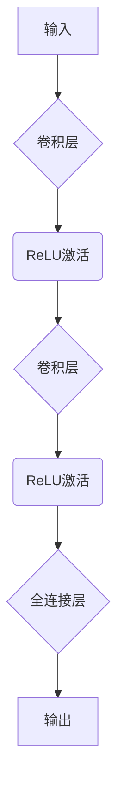
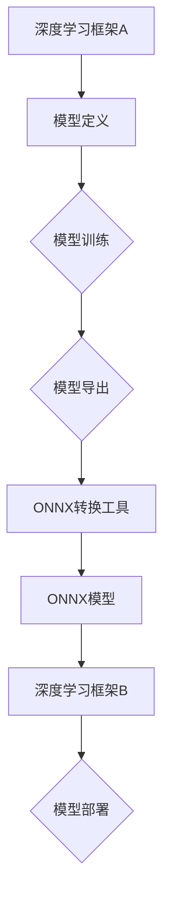
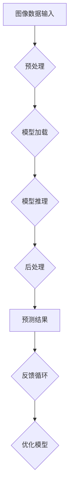

                 

### ONNX：开放式神经网络交换格式

#### 关键词：
- ONNX
- 开放式神经网络交换格式
- 深度学习
- 神经网络模型
- 框架集成
- 企业级应用
- 数学模型

#### 摘要：
本文旨在深入探讨ONNX（开放式神经网络交换格式）的原理、架构、应用及其在深度学习领域的重要性。我们将从基础概念出发，逐步解析ONNX的核心元素、实现方法、兼容性，并探讨其高级应用和未来发展趋势。通过本文，读者将全面了解ONNX如何简化深度学习模型的交换和部署过程，提升不同框架间的协作效率。

### 目录大纲：

1. **第一部分: ONNX基础与原理**
    1. **第1章: ONNX简介**
        1. **1.1.1 ONNX的起源与发展**
        2. **1.1.2 ONNX的目标与应用场景**
        3. **1.1.3 ONNX的架构与组成部分**
    2. **第2章: ONNX核心概念与术语**
        1. **2.1.1 ONNX模型结构**
        2. **2.1.2 ONNX张量与数据类型**
        3. **2.1.3 ONNX操作符与子图**
    3. **第3章: ONNX运算符详解**
        1. **3.1.1 基础运算符**
        2. **3.1.2 神经网络相关运算符**
        3. **3.1.3 深度学习常用运算符**
    4. **第4章: ONNX实现与兼容性**
        1. **4.1.1 ONNX实现指南**
        2. **4.1.2 ONNX兼容性与迁移**
        3. **4.1.3 ONNX工具集与支持平台**
    5. **第5章: ONNX数学模型与公式**
        1. **5.1.1 ONNX中的数学公式表示**
        2. **5.1.2 常用数学模型与公式解析**
        3. **5.1.3 数学公式示例**
    6. **第6章: ONNX项目实战**
        1. **6.1.1 ONNX模型开发与部署**
        2. **6.1.2 实际应用案例解析**
        3. **6.1.3 ONNX模型优化与调参技巧**

2. **第二部分: ONNX高级应用**
    1. **第7章: ONNX与深度学习框架集成**
        1. **7.1.1 ONNX与PyTorch集成**
        2. **7.1.2 ONNX与TensorFlow集成**
        3. **7.1.3 ONNX与其他深度学习框架集成**
    2. **第8章: ONNX在企业级应用**
        1. **8.1.1 企业级AI应用需求分析**
        2. **8.1.2 ONNX在企业级应用的优势与挑战**
        3. **8.1.3 ONNX在工业界应用案例**
    3. **第9章: ONNX未来发展趋势**
        1. **9.1.1 ONNX新特性与更新计划**
        2. **9.1.2 ONNX在新兴领域的应用探索**
        3. **9.1.3 ONNX生态建设与社区发展**

3. **附录**
    1. **附录A: ONNX工具集与资源**
    2. **附录B: Mermaid流程图示例**
    3. **附录C: 代码实战案例**

---

在接下来的文章中，我们将逐步深入探讨ONNX的各个方面，帮助读者全面理解并掌握这一重要的深度学习技术。

### 引言：深度学习的挑战与ONNX的解决方案

随着人工智能技术的快速发展，深度学习已经成为解决复杂问题的重要工具。然而，深度学习的实际应用面临着一系列挑战，其中之一便是模型交换和部署的复杂性。不同深度学习框架之间存在数据格式和计算图表示的差异，这使得模型在不同平台和框架之间的迁移变得困难。

传统解决方案通常涉及模型转换和重写，这不仅增加了开发成本，还可能导致模型性能下降或准确性降低。为了解决这一问题，ONNX（Open Neural Network Exchange）应运而生。ONNX是一种开放式的神经网络交换格式，旨在提供一个统一的模型表示方法，使得不同框架和平台之间的模型交换和部署变得更加简单和高效。

ONNX的诞生背景可以追溯到深度学习领域的快速发展和多样化需求。随着深度学习应用的广泛普及，各种深度学习框架如PyTorch、TensorFlow、MXNet等层出不穷。每个框架都有自己的模型表示方式和计算图实现，这导致了不同框架间的数据格式不兼容。为了实现模型的跨平台部署，开发者需要手动转换模型，这不仅繁琐，还容易出错。

ONNX的初衷是解决这一痛点，它提供了一种统一的模型表示方法，使得开发者可以轻松地将一个框架中的模型转换到另一个框架中，而无需重新编写或重新训练模型。ONNX的推出得到了众多深度学习框架的支持，包括PyTorch、TensorFlow、MXNet、Caffe2等，这使得ONNX成为了一个跨框架、跨平台的通用解决方案。

通过ONNX，开发者可以专注于模型开发和优化，而无需担心模型交换和部署的复杂性。ONNX不仅支持静态图模型，还支持动态图模型，这使得它能够覆盖广泛的深度学习应用场景。此外，ONNX还提供了一个丰富的运算符集，支持常见的深度学习操作，从而简化了模型转换过程。

总之，ONNX的出现为深度学习领域带来了巨大的便利。它不仅解决了模型交换和部署的难题，还促进了不同框架和平台之间的协作和互操作性。在接下来的章节中，我们将深入探讨ONNX的架构、核心概念、实现方法以及高级应用，帮助读者全面理解并掌握这一重要的深度学习技术。

### 第一部分：ONNX基础与原理

#### 第1章: ONNX简介

##### 1.1.1 ONNX的起源与发展

ONNX（Open Neural Network Exchange）的起源可以追溯到2016年，当时由微软和Facebook合作推出。其初衷是为了解决深度学习模型在不同框架和平台之间交换和部署的难题。ONNX的推出是为了提供一个统一的模型表示方法，使得不同深度学习框架之间的模型交换和部署变得更加简单和高效。

ONNX的发展历程经历了多个重要里程碑。2017年，ONNX联盟成立，吸引了包括亚马逊、百度、华为、IBM、微软、英特尔等在内的众多企业加入。这一联盟的成立标志着ONNX逐渐成为一个开放、跨平台的行业标准。

随着时间的推移，ONNX在深度学习领域的地位日益重要。多个深度学习框架如PyTorch、TensorFlow、MXNet等纷纷宣布支持ONNX，这使得ONNX成为了一个广受认可的通用解决方案。

##### 1.1.2 ONNX的目标与应用场景

ONNX的主要目标是实现深度学习模型的跨框架交换和部署。具体来说，ONNX有以下几个核心目标：

1. **统一模型表示**：ONNX提供了一种统一的模型表示方法，使得不同框架和平台之间的模型可以无缝交换。这种统一的表示方式简化了模型转换和部署过程，提高了开发效率。
2. **跨平台兼容性**：ONNX支持在不同的操作系统、硬件平台和设备上运行，包括CPU、GPU、FPGA等。这使得开发者可以轻松地将模型部署到各种环境中，无需担心兼容性问题。
3. **优化与调参**：ONNX提供了一个丰富的运算符集，支持常见的深度学习操作。这有助于开发者进行模型优化和调参，从而提升模型的性能和准确性。
4. **社区协作**：ONNX是一个开放的标准，吸引了众多企业和开发者的参与。这使得ONNX能够持续演进，不断满足深度学习领域的新需求。

ONNX的应用场景非常广泛，涵盖了多个领域。以下是一些典型的应用场景：

1. **研究与开发**：ONNX在学术研究和开发过程中扮演着重要角色。研究者可以利用ONNX在不同框架间交换模型，从而方便地比较和验证不同算法的效果。
2. **生产部署**：ONNX在工业界得到了广泛应用，许多企业使用ONNX将深度学习模型部署到生产环境中。这使得企业可以快速部署和更新模型，提高业务效率和竞争力。
3. **移动与边缘计算**：ONNX支持在移动设备和边缘设备上运行，这使得开发者可以将深度学习模型部署到这些设备上，实现实时计算和智能应用。
4. **跨平台迁移**：ONNX在模型跨平台迁移方面具有显著优势。开发者可以利用ONNX将一个框架中的模型轻松转换为另一个框架，从而实现不同平台间的协作和互操作。

##### 1.1.3 ONNX的架构与组成部分

ONNX的架构设计旨在实现其核心目标，即提供统一的模型表示方法和跨平台兼容性。ONNX由以下几个关键组成部分构成：

1. **模型结构**：ONNX模型结构定义了模型的计算图，包括节点（操作符）和边（数据流）。每个节点表示一个操作符，每个边表示数据流。这种表示方法使得ONNX模型具有良好的可扩展性和可理解性。
2. **张量与数据类型**：ONNX使用张量来表示数据，并支持多种数据类型，如浮点数、整数、布尔值等。这使得ONNX能够处理不同类型的计算任务，包括数值计算、图像处理和文本分析等。
3. **运算符**：ONNX定义了一个丰富的运算符集，包括基础运算符、神经网络相关运算符和深度学习常用运算符。这些运算符支持常见的深度学习操作，如卷积、池化、激活函数等。
4. **子图**：ONNX支持子图的概念，允许开发者将复杂的模型分解为多个子图。这种结构有助于提高模型的模块化和可维护性。
5. **文档格式**：ONNX使用JSON格式来表示模型，这使得模型可以轻松地存储、传输和解析。JSON格式的优势在于其可读性和易扩展性，使得ONNX模型易于理解和修改。

##### 小结

本章介绍了ONNX的起源、目标和应用场景，并详细解析了ONNX的架构和组成部分。通过本章的学习，读者可以初步了解ONNX的核心概念和原理，为后续章节的深入学习打下基础。在下一章中，我们将进一步探讨ONNX的核心概念与术语，帮助读者全面理解ONNX的工作机制。

### 第2章: ONNX核心概念与术语

在深入探讨ONNX的原理和应用之前，了解其核心概念和术语是非常重要的。ONNX的设计理念是为了实现模型的可移植性、互操作性和优化，这需要我们掌握以下几个关键概念：

#### 2.1.1 ONNX模型结构

ONNX模型结构是ONNX的核心概念之一，它定义了模型的计算图。在ONNX中，模型结构由节点（Node）和边（Edge）组成。每个节点表示一个操作符（Operator），每个边表示数据流（Tensor）。这种图结构使得ONNX模型具有良好的模块化和可扩展性。

- **节点（Node）**：每个节点代表一个操作符，例如加法、矩阵乘法或卷积等。节点包含输入和输出，以及操作的具体参数。在ONNX中，每个节点都有唯一的名称和类型。
- **边（Edge）**：边表示数据流，连接不同的节点。在ONNX模型中，数据流通过张量（Tensor）传递。张量是ONNX中的基本数据结构，用于存储模型中的数据。

##### ONNX模型结构的Mermaid流程图

```mermaid
graph TD
A[开始] --> B(节点1)
B --> C(节点2)
C --> D(节点3)
D --> E(结束)

subgraph 节点详情
B((加法)) --> B1[输入1]
B --> B2[输入2]
B1 --> B3[加法输出]
B2 --> B3

subgraph 输出
B3 --> C1[输出1]
C --> C2[输出2]
C2 --> D1[输出3]
D --> D2[输出4]
D2 --> E1[输出5]
```

上述Mermaid流程图展示了ONNX模型的基本结构，包括节点和边。在这个例子中，我们有一个包含四个节点的简单计算图，每个节点表示一个操作符，通过边连接形成数据流。

#### 2.1.2 ONNX张量与数据类型

在ONNX中，张量（Tensor）是数据的基本存储结构。张量是一个多维数组，可以存储各种类型的数据，如浮点数、整数和布尔值等。ONNX支持多种数据类型，这些数据类型决定了张量中数据的存储方式和处理方式。

- **浮点数（Float）**：浮点数是ONNX中最常用的数据类型，用于表示连续的数值。常见的浮点数类型有32位单精度浮点数（float32）和64位双精度浮点数（float64）。
- **整数（Integer）**：整数数据类型用于表示离散的数值。常见的整数类型有8位无符号整数（uint8）、16位无符号整数（uint16）和32位无符号整数（uint32）。
- **布尔值（Boolean）**：布尔值数据类型用于表示逻辑值，即真（True）或假（False）。

##### ONNX张量示例

假设我们有一个4x4的矩阵，存储为浮点数类型。该矩阵可以使用ONNX张量表示：

```python
import numpy as np

# 创建一个4x4的浮点数矩阵
matrix = np.array([[1.0, 2.0, 3.0, 4.0],
                   [5.0, 6.0, 7.0, 8.0],
                   [9.0, 10.0, 11.0, 12.0],
                   [13.0, 14.0, 15.0, 16.0]])

# 将矩阵转换为ONNX张量
tensor = torch.tensor(matrix, dtype=torch.float32)

# 打印ONNX张量的形状和数据类型
print(tensor.shape)  # 输出：(4, 4)
print(tensor.dtype)  # 输出：torch.float32
```

上述代码展示了如何使用Python中的NumPy库创建一个浮点数矩阵，并将其转换为ONNX张量。我们使用PyTorch库来创建张量，并设置数据类型为32位单精度浮点数。

#### 2.1.3 ONNX操作符与子图

ONNX操作符（Operator）是实现模型功能的核心组件。ONNX定义了多种操作符，包括基础运算符、神经网络相关运算符和深度学习常用运算符。每个操作符都有特定的输入和输出，并执行特定的计算任务。

- **基础运算符**：基础运算符包括加法、减法、乘法和除法等基本的数学运算。这些运算符是构建复杂模型的基础。
- **神经网络相关运算符**：这些运算符专门用于深度学习任务，如卷积、池化、激活函数等。这些运算符定义了神经网络的基本结构。
- **深度学习常用运算符**：深度学习常用运算符包括损失函数、优化器、正则化等，这些运算符用于模型训练和评估。

##### ONNX操作符示例

假设我们有一个简单的神经网络模型，包含两个加法操作符。我们可以在ONNX模型中表示如下：

```mermaid
graph TD
A[输入] --> B[加法]
B --> C[加法]
C --> D[输出]

subgraph 加法运算符
B((加法1)) --> B1[输入1]
B --> B2[输入2]
B1 --> B2

B3[输出1] --> C1[输入1]
C --> C2[输入2]
C1 --> C2

subgraph 输出
B2 --> D1[输出1]
C2 --> D2[输出2]
D1 --> D2
```

上述Mermaid流程图展示了包含两个加法操作符的ONNX模型。每个加法操作符接收两个输入，执行加法运算，并将结果传递给下一个操作符。

##### 子图（Subgraph）

ONNX子图是用于表示复杂模型的有用概念。子图是一个独立的计算图，可以包含多个节点和边。在ONNX中，子图有助于组织模型结构，提高模型的模块化和可维护性。

- **子图入口**：子图的入口节点表示子图的开始，通常是一个输入节点。
- **子图出口**：子图的出口节点表示子图的结束，通常是一个输出节点。

##### 子图示例

假设我们有一个包含子图的简单神经网络模型，子图用于实现一个卷积层。我们可以在ONNX模型中表示如下：

```mermaid
graph TD
A[输入] --> B[子图入口]
B --> C1[卷积1]
C1 --> C2[卷积2]
C2 --> D[子图出口]
D --> E[输出]

subgraph 卷积层子图
C1((卷积层1)) --> C11[输入]
C11 --> C12[卷积运算]
C12 --> C13[激活函数]
C13 --> C14[输出1]

C2((卷积层2)) --> C21[输入1]
C21 --> C22[卷积运算]
C22 --> C23[激活函数]
C23 --> C24[输出2]
```

上述Mermaid流程图展示了包含子图的ONNX模型。子图用于实现一个卷积层，包含多个卷积运算和激活函数。这种结构有助于提高模型的模块化和可维护性。

##### 小结

本章介绍了ONNX的核心概念和术语，包括模型结构、张量与数据类型、操作符和子图。通过理解这些概念，读者可以更好地掌握ONNX的工作机制，为后续章节的学习和应用打下基础。在下一章中，我们将深入探讨ONNX的运算符详解，帮助读者全面了解ONNX支持的各种运算符及其应用。

### 第3章: ONNX运算符详解

ONNX的运算符集是其核心功能之一，它涵盖了从基本运算符到深度学习相关运算符的广泛范围。这些运算符允许开发者构建复杂的神经网络模型，并在不同框架之间进行模型交换和部署。本章将详细介绍ONNX中的基础运算符、神经网络相关运算符以及深度学习常用运算符。

#### 3.1.1 基础运算符

基础运算符是ONNX中最基本的运算符，用于执行简单的数学运算。这些运算符包括加法、减法、乘法和除法等。基础运算符是构建复杂模型的基石，其输入和输出都是张量。

- **加法（Add）**：加法运算符将两个输入张量相加，并输出结果。其公式如下：

  \[ 
  \text{输出} = \text{输入1} + \text{输入2} 
  \]

  ```mermaid
  graph TD
  A[输入1] --> B[Add]
  B --> C[输入2]
  C --> D[输出]
  ```

- **减法（Sub）**：减法运算符将输入1减去输入2，并输出结果。其公式如下：

  \[ 
  \text{输出} = \text{输入1} - \text{输入2} 
  \]

  ```mermaid
  graph TD
  A[输入1] --> B[Sub]
  B --> C[输入2]
  C --> D[输出]
  ```

- **乘法（Mul）**：乘法运算符将两个输入张量相乘，并输出结果。其公式如下：

  \[ 
  \text{输出} = \text{输入1} \times \text{输入2} 
  \]

  ```mermaid
  graph TD
  A[输入1] --> B[Mul]
  B --> C[输入2]
  C --> D[输出]
  ```

- **除法（Div）**：除法运算符将输入1除以输入2，并输出结果。其公式如下：

  \[ 
  \text{输出} = \text{输入1} / \text{输入2} 
  \]

  ```mermaid
  graph TD
  A[输入1] --> B[Div]
  B --> C[输入2]
  C --> D[输出]
  ```

#### 3.1.2 神经网络相关运算符

神经网络相关运算符是深度学习模型中常用的运算符，用于实现神经网络的基本结构。这些运算符包括卷积（Conv）、池化（Pooling）、激活函数（Activate）等。

- **卷积（Conv）**：卷积运算符用于实现卷积层，其公式如下：

  \[
  \text{输出} = \text{输入} * \text{滤波器} + \text{偏置}
  \]

  ```mermaid
  graph TD
  A[输入] --> B[Conv]
  B --> C[滤波器]
  C --> D[偏置]
  D --> E[输出]
  ```

- **池化（Pooling）**：池化运算符用于实现池化层，其公式如下：

  \[
  \text{输出} = \text{输入} \text{（区域内的最大/平均值）}
  \]

  ```mermaid
  graph TD
  A[输入] --> B[Pooling]
  B --> C[区域]
  C --> D[输出]
  ```

- **激活函数（Activate）**：激活函数运算符用于实现激活层，常见的激活函数包括ReLU（Rectified Linear Unit）、Sigmoid和Tanh等。

  - **ReLU**：ReLU函数的公式如下：

    \[
    \text{输出} = \max(\text{输入}, 0)
    \]

    ```mermaid
    graph TD
    A[输入] --> B[ReLU]
    B --> C[输出]
    ```

  - **Sigmoid**：Sigmoid函数的公式如下：

    \[
    \text{输出} = \frac{1}{1 + e^{-\text{输入}}}
    \]

    ```mermaid
    graph TD
    A[输入] --> B[Sigmoid]
    B --> C[输出]
    ```

  - **Tanh**：Tanh函数的公式如下：

    \[
    \text{输出} = \frac{e^{\text{输入}} - e^{-\text{输入}}}{e^{\text{输入}} + e^{-\text{输入}}}
    \]

    ```mermaid
    graph TD
    A[输入] --> B[Tanh]
    B --> C[输出]
    ```

#### 3.1.3 深度学习常用运算符

除了基础运算符和神经网络相关运算符，ONNX还包含一些深度学习常用运算符，用于模型训练和评估。这些运算符包括损失函数（Loss）、优化器（Optimizer）等。

- **损失函数（Loss）**：损失函数用于评估模型的预测结果与实际结果之间的差异，常见的损失函数包括均方误差（MSE）、交叉熵损失（Cross Entropy Loss）等。

  - **均方误差（MSE）**：MSE损失函数的公式如下：

    \[
    \text{输出} = \frac{1}{n} \sum_{i=1}^{n} (\text{预测值} - \text{真实值})^2
    \]

    ```mermaid
    graph TD
    A[预测值] --> B[MSE]
    B --> C[真实值]
    C --> D[输出]
    ```

  - **交叉熵损失（Cross Entropy Loss）**：交叉熵损失函数的公式如下：

    \[
    \text{输出} = -\frac{1}{n} \sum_{i=1}^{n} \text{真实值} \cdot \log(\text{预测值})
    \]

    ```mermaid
    graph TD
    A[预测值] --> B[Cross Entropy]
    B --> C[真实值]
    C --> D[输出]
    ```

- **优化器（Optimizer）**：优化器用于调整模型的参数，以最小化损失函数。常见的优化器包括随机梯度下降（SGD）、Adam等。

  - **随机梯度下降（SGD）**：SGD优化器的更新规则如下：

    \[
    \text{参数} = \text{参数} - \alpha \cdot \nabla \text{损失函数}
    \]

    ```mermaid
    graph TD
    A[参数] --> B[SGD]
    B --> C[\alpha]
    C --> D[\nabla 损失函数]
    D --> E[更新参数]
    ```

  - **Adam优化器**：Adam优化器的更新规则如下：

    \[
    \text{参数} = \text{参数} - \alpha \cdot (\frac{m}{1 - \beta_1} + \frac{v}{1 - \beta_2})
    \]

    ```mermaid
    graph TD
    A[参数] --> B[Adam]
    B --> C[\alpha]
    C --> D[m]
    D --> E[v]
    E --> F[1 - \beta_1]
    F --> G[1 - \beta_2]
    G --> H[更新参数]
    ```

##### 小结

本章详细介绍了ONNX中的基础运算符、神经网络相关运算符以及深度学习常用运算符。通过理解这些运算符的工作原理和应用，开发者可以更加灵活地构建和优化深度学习模型。在下一章中，我们将探讨ONNX的实现与兼容性，帮助读者了解如何在实际项目中使用ONNX。

### 第4章: ONNX实现与兼容性

在掌握了ONNX的核心概念和运算符之后，我们接下来将探讨ONNX的实现与兼容性。这一章节将详细解释如何在实际项目中实现ONNX模型，并介绍ONNX的兼容性以及在不同平台上的应用。

#### 4.1.1 ONNX实现指南

实现ONNX模型通常包括以下步骤：

1. **模型定义**：首先，需要定义深度学习模型的计算图。这可以通过使用现有的深度学习框架（如PyTorch、TensorFlow等）来完成。例如，在PyTorch中，我们可以使用如下代码定义一个简单的卷积神经网络：

   ```python
   import torch
   import torch.nn as nn

   class SimpleCNN(nn.Module):
       def __init__(self):
           super(SimpleCNN, self).__init__()
           self.conv1 = nn.Conv2d(1, 32, 3, 1)
           self.conv2 = nn.Conv2d(32, 64, 3, 1)
           self.fc1 = nn.Linear(9*9*64, 128)
           self.fc2 = nn.Linear(128, 10)

       def forward(self, x):
           x = self.conv1(x)
           x = nn.ReLU()(x)
           x = self.conv2(x)
           x = nn.ReLU()(x)
           x = torch.flatten(x, 1)
           x = self.fc1(x)
           x = nn.ReLU()(x)
           x = self.fc2(x)
           return x
   ```

   在上述代码中，我们定义了一个简单的卷积神经网络，包括两个卷积层、两个ReLU激活函数和一个全连接层。

2. **模型转换**：在定义好模型后，我们需要将模型转换为ONNX格式。这可以通过使用深度学习框架提供的ONNX转换工具来完成。以PyTorch为例，我们可以使用如下代码将模型转换为ONNX格式：

   ```python
   model = SimpleCNN()
   input_shape = (1, 28, 28)  # 输入图像的形状
   input_tensor = torch.randn(input_shape)  # 创建一个随机输入张量
   torch.onnx.export(model, input_tensor, "simple_cnn.onnx")
   ```

   在上述代码中，我们首先实例化了一个SimpleCNN模型，然后创建了一个形状为(1, 28, 28)的随机输入张量。最后，我们使用`torch.onnx.export()`函数将模型和输入张量导出为ONNX格式文件`simple_cnn.onnx`。

3. **模型验证**：在导出ONNX模型后，我们可以使用ONNX工具集（如ONNX Runtime）来验证模型是否正确。这可以通过以下代码实现：

   ```python
   import onnxruntime

   session = onnxruntime.InferenceSession("simple_cnn.onnx")
   input_name = session.get_inputs()[0].name
   output_name = session.get_outputs()[0].name
   input_data = {input_name: input_tensor.numpy()}
   output_data = session.run([output_name], input_data)
   ```

   在上述代码中，我们首先创建了一个ONNX Runtime会话，然后获取模型的输入和输出节点名称。接着，我们创建了一个包含输入数据的字典，并使用会话的`run()`函数执行推理。最后，我们获取模型的输出结果。

#### 4.1.2 ONNX兼容性与迁移

ONNX的一个重要优势是它的跨平台兼容性。这意味着ONNX模型可以在不同的深度学习框架、操作系统和硬件平台上运行，而无需重新编写或重新训练模型。要实现ONNX模型的跨平台兼容性，需要考虑以下几个方面：

1. **框架兼容性**：ONNX得到了多个深度学习框架的支持，如PyTorch、TensorFlow、MXNet等。这意味着开发者可以使用他们熟悉的框架进行模型开发和优化，然后使用ONNX将其转换为其他框架支持的格式。例如，使用PyTorch训练的模型可以轻松转换为TensorFlow格式，从而在TensorFlow环境中部署。

2. **操作系统兼容性**：ONNX模型可以在不同操作系统上运行，包括Windows、Linux和macOS等。这使得开发者可以方便地将模型部署到各种操作系统环境中。

3. **硬件兼容性**：ONNX支持多种硬件平台，包括CPU、GPU、FPGA等。这有助于优化模型在不同硬件平台上的性能。例如，在GPU上部署模型可以显著提高模型的推理速度。

#### 4.1.3 ONNX工具集与支持平台

ONNX提供了一系列工具集，以支持模型的转换、验证和部署。以下是一些常用的ONNX工具集和平台：

1. **ONNX Runtime**：ONNX Runtime是一个高性能的ONNX推理引擎，支持多种操作系统和硬件平台。它提供了跨平台的推理能力，使得开发者可以将ONNX模型部署到各种环境中。

2. **ONNX Tools**：ONNX Tools是一个命令行工具集，用于转换、验证和优化ONNX模型。这些工具包括`onnx-simplifier`、`onnx-checker`、`onnx-optimizer`等。

3. **PyTorch ONNX**：PyTorch ONNX是一个PyTorch插件，用于将PyTorch模型转换为ONNX格式。它提供了方便的API，使得开发者可以轻松地将PyTorch模型转换为ONNX模型。

4. **TensorFlow ONNX**：TensorFlow ONNX是一个TensorFlow插件，用于将TensorFlow模型转换为ONNX格式。它支持TensorFlow 1.x和2.x版本，使得开发者可以方便地将TensorFlow模型转换为ONNX模型。

5. **ONNX for MXNet**：ONNX for MXNet是一个MXNet插件，用于将MXNet模型转换为ONNX格式。它使得开发者可以使用MXNet进行模型开发和优化，然后使用ONNX进行跨框架部署。

6. **支持平台**：ONNX支持多种平台，包括Windows、Linux、macOS、Android、iOS等。此外，ONNX还支持多种硬件平台，如CPU、GPU、FPGA等。

##### 小结

本章详细介绍了ONNX的实现与兼容性，包括模型定义、模型转换和模型验证等步骤。ONNX的跨平台兼容性使其成为深度学习模型交换和部署的重要工具。通过本章的学习，读者可以掌握如何使用ONNX在实际项目中构建、转换和部署深度学习模型。在下一章中，我们将进一步探讨ONNX中的数学模型与公式，帮助读者深入理解ONNX模型中的数学原理。

### 第5章: ONNX数学模型与公式

在深入探讨ONNX的实现与应用过程中，了解其背后的数学模型与公式是至关重要的。ONNX的数学表示方法为深度学习模型的设计、实现与优化提供了理论基础。本章将详细介绍ONNX中的数学模型与公式，并通过对常用数学模型和公式的解析，帮助读者更好地理解ONNX的工作原理。

#### 5.1.1 ONNX中的数学公式表示

ONNX使用数学公式来表示深度学习模型中的操作。这些公式不仅有助于描述模型的结构，还可以用于优化和验证模型。在ONNX中，数学公式通常使用LaTeX格式表示，以便于读者理解和处理。以下是ONNX中常用数学公式的LaTeX表示：

- **加法（Add）**：

  \[
  \text{output} = \text{input1} + \text{input2}
  \]

- **减法（Sub）**：

  \[
  \text{output} = \text{input1} - \text{input2}
  \]

- **乘法（Mul）**：

  \[
  \text{output} = \text{input1} \times \text{input2}
  \]

- **除法（Div）**：

  \[
  \text{output} = \text{input1} / \text{input2}
  \]

- **卷积（Conv）**：

  \[
  \text{output} = \text{input} * \text{filter} + \text{bias}
  \]

  其中，`filter`是卷积核，`bias`是偏置项。

- **池化（Pooling）**：

  \[
  \text{output} = \text{input} \text{（区域内的最大/平均值）}
  \]

  区域通常由`kernel_size`和`stride`等参数定义。

- **激活函数（Activate）**：

  - **ReLU**：

    \[
    \text{output} = \max(\text{input}, 0)
    \]

  - **Sigmoid**：

    \[
    \text{output} = \frac{1}{1 + e^{-\text{input}}}
    \]

  - **Tanh**：

    \[
    \text{output} = \frac{e^{\text{input}} - e^{-\text{input}}}{e^{\text{input}} + e^{-\text{input}}}
    \]

- **损失函数（Loss）**：

  - **均方误差（MSE）**：

    \[
    \text{output} = \frac{1}{n} \sum_{i=1}^{n} (\text{预测值} - \text{真实值})^2
    \]

  - **交叉熵损失（Cross Entropy Loss）**：

    \[
    \text{output} = -\frac{1}{n} \sum_{i=1}^{n} \text{真实值} \cdot \log(\text{预测值})
    \]

这些数学公式是ONNX模型的重要组成部分，它们在模型的设计、实现和优化中起着关键作用。

#### 5.1.2 常用数学模型与公式解析

在深度学习领域，常用的数学模型和公式包括卷积神经网络（CNN）、循环神经网络（RNN）、生成对抗网络（GAN）等。以下是对这些模型及其公式的详细解析：

1. **卷积神经网络（CNN）**：

   卷积神经网络是一种用于图像识别和处理的重要模型。它利用卷积操作来提取图像特征，并通过池化操作来减少特征数量。卷积神经网络的基本结构包括卷积层、激活函数层、池化层和全连接层。

   - **卷积层**：卷积层通过卷积操作来提取图像特征。卷积操作的公式如下：

     \[
     \text{output} = \text{input} * \text{filter} + \text{bias}
     \]

     其中，`filter`是卷积核，`bias`是偏置项。

   - **激活函数层**：激活函数层用于引入非线性特性。常见的激活函数包括ReLU、Sigmoid和Tanh等。

     - **ReLU**：

       \[
       \text{output} = \max(\text{input}, 0)
       \]

     - **Sigmoid**：

       \[
       \text{output} = \frac{1}{1 + e^{-\text{input}}}
       \]

     - **Tanh**：

       \[
       \text{output} = \frac{e^{\text{input}} - e^{-\text{input}}}{e^{\text{input}} + e^{-\text{input}}}
       \]

   - **池化层**：池化层通过减小特征图的尺寸来减少计算量。常见的池化操作包括最大池化和平均池化。

     - **最大池化**：

       \[
       \text{output} = \max(\text{input} \text{（区域内的值）})
       \]

     - **平均池化**：

       \[
       \text{output} = \frac{1}{\text{区域大小}} \sum_{\text{区域内}} \text{input}
       \]

   - **全连接层**：全连接层用于将特征映射到输出结果。全连接层的计算公式如下：

     \[
     \text{output} = \text{input} \cdot \text{weights} + \text{bias}
     \]

2. **循环神经网络（RNN）**：

   循环神经网络是一种用于序列建模的重要模型，它可以处理序列数据中的时间依赖关系。RNN的基本结构包括输入层、隐藏层和输出层。

   - **输入层**：输入层将序列数据输入到模型中。

   - **隐藏层**：隐藏层用于处理时间依赖关系。隐藏层的状态更新公式如下：

     \[
     \text{hidden\_t} = \text{sigmoid}(\text{weights} \cdot [\text{input\_t}, \text{hidden}_{t-1}]) + \text{bias}
     \]

   - **输出层**：输出层将隐藏层的状态映射到输出结果。输出层的计算公式如下：

     \[
     \text{output} = \text{sigmoid}(\text{weights} \cdot \text{hidden}_{t}) + \text{bias}
     \]

3. **生成对抗网络（GAN）**：

   生成对抗网络是一种用于生成数据的模型，它由生成器和判别器两个部分组成。生成器生成假数据，判别器判断生成数据是否真实。

   - **生成器**：生成器的目标是生成尽可能真实的数据。生成器的计算公式如下：

     \[
     \text{output} = \text{sigmoid}(\text{weights} \cdot \text{z} + \text{bias})
     \]

     其中，`z`是生成器的输入。

   - **判别器**：判别器的目标是判断生成数据是否真实。判别器的计算公式如下：

     \[
     \text{output} = \text{sigmoid}(\text{weights} \cdot \text{x} + \text{bias})
     \]

     其中，`x`是输入数据。

#### 5.1.3 数学公式示例

为了更好地理解ONNX中的数学模型和公式，以下是一个简单的示例，展示如何使用ONNX表示一个卷积神经网络模型。

```mermaid
graph TD
A[输入] --> B[Conv1]
B --> C[ReLU1]
C --> D[Conv2]
D --> E[ReLU2]
E --> F[卷积输出]
F --> G[Flatten]
G --> H[全连接层]
H --> I[输出]

subgraph 卷积层
B((卷积层1)) --> B1[输入1]
B1 --> B2[卷积运算]
B2 --> B3[偏置]
B3 --> B4[输出1]

D((卷积层2)) --> D1[输入2]
D1 --> D2[卷积运算]
D2 --> D3[偏置]
D3 --> D4[输出2]
```

在这个示例中，我们定义了一个简单的卷积神经网络模型，包括两个卷积层、两个ReLU激活函数和一个全连接层。每个卷积层使用卷积操作来提取图像特征，ReLU激活函数用于引入非线性特性，全连接层用于将特征映射到输出结果。

通过上述示例，我们可以看到如何使用ONNX来表示深度学习模型中的数学公式和操作。这有助于开发者更好地理解和优化模型，同时也方便了模型在不同框架和平台之间的交换和部署。

##### 小结

本章详细介绍了ONNX中的数学模型与公式，包括加法、减法、乘法、除法等基础运算符，以及卷积、池化、激活函数等深度学习常用运算符。通过对常用数学模型和公式的解析，读者可以更好地理解ONNX的工作原理，为实际应用打下基础。在下一章中，我们将探讨ONNX在项目实战中的应用，通过实际案例帮助读者掌握ONNX的使用技巧。

### 第6章: ONNX项目实战

在实际应用中，ONNX为深度学习模型的开发和部署提供了极大的便利。通过ONNX，开发者可以轻松地将模型在不同框架和平台之间进行交换和部署，从而提高开发效率。本章将通过实际项目案例，详细讲解ONNX模型开发与部署的步骤，并提供实际应用案例解析，同时分享ONNX模型优化与调参技巧。

#### 6.1.1 ONNX模型开发与部署

ONNX模型开发与部署主要包括以下几个步骤：

1. **模型定义**：使用深度学习框架（如PyTorch、TensorFlow等）定义模型结构。这通常涉及选择适当的层、设置层参数和配置模型架构。

2. **模型训练**：使用训练数据集对模型进行训练，以调整模型参数，使其能够更好地拟合数据。

3. **模型导出**：将训练好的模型导出为ONNX格式。这个过程通常通过深度学习框架提供的导出工具完成。

4. **模型验证**：使用验证数据集对导出的ONNX模型进行验证，以检查模型性能和准确性。

5. **模型部署**：将ONNX模型部署到目标平台（如服务器、移动设备、边缘设备等）进行推理。

下面是一个简单的PyTorch模型开发与导出的示例：

```python
import torch
import torch.nn as nn

# 模型定义
class SimpleCNN(nn.Module):
    def __init__(self):
        super(SimpleCNN, self).__init__()
        self.conv1 = nn.Conv2d(1, 32, 3, 1)
        self.conv2 = nn.Conv2d(32, 64, 3, 1)
        self.fc1 = nn.Linear(9*9*64, 128)
        self.fc2 = nn.Linear(128, 10)

    def forward(self, x):
        x = self.conv1(x)
        x = nn.ReLU()(x)
        x = self.conv2(x)
        x = nn.ReLU()(x)
        x = torch.flatten(x, 1)
        x = self.fc1(x)
        x = nn.ReLU()(x)
        x = self.fc2(x)
        return x

# 模型实例化
model = SimpleCNN()

# 模型训练（示例）
optimizer = torch.optim.Adam(model.parameters(), lr=0.001)
criterion = nn.CrossEntropyLoss()

for epoch in range(10):
    for inputs, labels in train_loader:
        optimizer.zero_grad()
        outputs = model(inputs)
        loss = criterion(outputs, labels)
        loss.backward()
        optimizer.step()

# 模型导出为ONNX格式
torch.onnx.export(model, torch.randn(1, 1, 28, 28), "simple_cnn.onnx")
```

在上述代码中，我们首先定义了一个简单的卷积神经网络模型，然后使用训练数据对其进行了训练。最后，我们使用`torch.onnx.export()`函数将训练好的模型导出为ONNX格式。

2. **模型部署**

模型部署是将ONNX模型部署到目标平台进行推理的过程。以下是一个使用ONNX Runtime进行模型部署的示例：

```python
import onnxruntime

# 加载ONNX模型
session = onnxruntime.InferenceSession("simple_cnn.onnx")

# 获取输入和输出节点名称
input_name = session.get_inputs()[0].name
output_name = session.get_outputs()[0].name

# 创建输入张量
input_tensor = torch.randn(1, 1, 28, 28).numpy()

# 执行推理
outputs = session.run([output_name], {input_name: input_tensor})

# 输出结果
print(outputs)
```

在上述代码中，我们首先加载了ONNX模型，并获取了输入和输出节点名称。然后，我们创建了一个形状为(1, 1, 28, 28)的随机输入张量，并使用ONNX Runtime会话执行推理。最后，我们输出了推理结果。

#### 6.1.2 实际应用案例解析

以下是一个使用ONNX的深度学习应用案例，包括模型开发、导出和部署：

**案例：手写数字识别**

1. **模型开发**：我们使用PyTorch定义了一个简单的卷积神经网络模型，用于手写数字识别。模型结构包括两个卷积层、两个ReLU激活函数和一个全连接层。

2. **模型训练**：使用MNIST数据集对模型进行训练。数据集包含了60000个训练图像和10000个测试图像。

3. **模型导出**：使用`torch.onnx.export()`函数将训练好的模型导出为ONNX格式。

4. **模型部署**：使用ONNX Runtime在服务器和移动设备上部署模型，并进行推理测试。

以下是一个简单的代码示例：

```python
import torch
import torchvision
import torchvision.transforms as transforms
import torch.nn as nn
import torch.optim as optim

# 数据预处理
transform = transforms.Compose([transforms.ToTensor(), transforms.Normalize((0.5,), (0.5,))])

# 加载MNIST数据集
train_set = torchvision.datasets.MNIST(root='./data', train=True, download=True, transform=transform)
train_loader = torch.utils.data.DataLoader(train_set, batch_size=64, shuffle=True)

test_set = torchvision.datasets.MNIST(root='./data', train=False, download=True, transform=transform)
test_loader = torch.utils.data.DataLoader(test_set, batch_size=64, shuffle=False)

# 模型定义
class SimpleCNN(nn.Module):
    def __init__(self):
        super(SimpleCNN, self).__init__()
        self.conv1 = nn.Conv2d(1, 32, 3, 1)
        self.conv2 = nn.Conv2d(32, 64, 3, 1)
        self.fc1 = nn.Linear(9*9*64, 128)
        self.fc2 = nn.Linear(128, 10)

    def forward(self, x):
        x = self.conv1(x)
        x = nn.ReLU()(x)
        x = self.conv2(x)
        x = nn.ReLU()(x)
        x = torch.flatten(x, 1)
        x = self.fc1(x)
        x = nn.ReLU()(x)
        x = self.fc2(x)
        return x

# 模型实例化
model = SimpleCNN()

# 模型训练
optimizer = optim.Adam(model.parameters(), lr=0.001)
criterion = nn.CrossEntropyLoss()

for epoch in range(10):
    for inputs, labels in train_loader:
        optimizer.zero_grad()
        outputs = model(inputs)
        loss = criterion(outputs, labels)
        loss.backward()
        optimizer.step()

# 模型导出为ONNX格式
torch.onnx.export(model, torch.randn(1, 1, 28, 28), "mnist_cnn.onnx")

# 模型部署
import onnxruntime

# 加载ONNX模型
session = onnxruntime.InferenceSession("mnist_cnn.onnx")

# 获取输入和输出节点名称
input_name = session.get_inputs()[0].name
output_name = session.get_outputs()[0].name

# 测试模型
with torch.no_grad():
    correct = 0
    total = 0
    for inputs, labels in test_loader:
        inputs = inputs.numpy()
        outputs = session.run([output_name], {input_name: inputs})
        predicted = outputs[0].argmax(axis=1)
        total += labels.size(0)
        correct += (predicted == labels).sum().item()

print('准确率: %d %%' % (100 * correct / total))
```

在上述代码中，我们首先定义了一个简单的卷积神经网络模型，并使用MNIST数据集对其进行了训练。然后，我们使用`torch.onnx.export()`函数将模型导出为ONNX格式。最后，我们使用ONNX Runtime在测试集上对模型进行推理，并计算了模型的准确率。

#### 6.1.3 ONNX模型优化与调参技巧

为了提高ONNX模型的性能和准确性，开发者需要对模型进行优化和调参。以下是一些常用的优化和调参技巧：

1. **模型优化**：

   - **使用更深的网络结构**：增加网络的深度可以提高模型的表示能力。
   - **使用更大的批量大小**：较大的批量大小可以提高模型的稳定性，减少方差。
   - **使用更高级的优化算法**：如Adam、RMSprop等，这些算法可以加速模型的收敛。

2. **调参技巧**：

   - **学习率调整**：学习率是模型训练中的一个关键参数。可以通过调整学习率来优化模型的性能。常用的调参方法包括随机搜索、网格搜索等。
   - **正则化**：正则化可以防止模型过拟合。常用的正则化方法包括L1正则化、L2正则化等。
   - **数据增强**：通过数据增强可以增加训练数据集的多样性，从而提高模型的泛化能力。

以下是一个简单的示例，展示了如何使用PyTorch对模型进行优化和调参：

```python
import torch
import torch.nn as nn
import torch.optim as optim

# 模型定义
class SimpleCNN(nn.Module):
    # ...（此处省略模型定义）

# 模型实例化
model = SimpleCNN()

# 模型优化
optimizer = optim.Adam(model.parameters(), lr=0.001)
scheduler = optim.lr_scheduler.StepLR(optimizer, step_size=30, gamma=0.1)

# 模型训练
for epoch in range(100):
    model.train()
    for inputs, labels in train_loader:
        optimizer.zero_grad()
        outputs = model(inputs)
        loss = criterion(outputs, labels)
        loss.backward()
        optimizer.step()
    scheduler.step()

# 模型调参
learning_rate = 0.001
optimizer = optim.Adam(model.parameters(), lr=learning_rate)
criterion = nn.CrossEntropyLoss()

# 训练模型
for epoch in range(100):
    # ...（此处省略模型训练代码）
```

在上述代码中，我们首先定义了一个简单的卷积神经网络模型，并使用Adam优化器和CrossEntropyLoss损失函数对模型进行了训练。然后，我们使用学习率调度器（scheduler）来调整学习率，从而优化模型的性能。

##### 小结

本章通过实际项目案例，详细讲解了ONNX模型开发与部署的步骤，并提供了实际应用案例解析。同时，本章还分享了ONNX模型优化与调参技巧，帮助读者在实际应用中更好地利用ONNX。通过本章的学习，读者可以掌握ONNX在实际项目中的应用，为深度学习模型开发和部署提供有力支持。在下一章中，我们将探讨ONNX的高级应用，包括ONNX与深度学习框架的集成、企业级应用以及未来发展趋势。

### 第7章: ONNX高级应用

在了解了ONNX的基础知识和项目实战之后，我们进一步探讨ONNX的高级应用。本章将深入分析ONNX与深度学习框架的集成、ONNX在企业级应用的优势与挑战，以及ONNX在工业界应用案例。同时，我们还将探讨ONNX的未来发展趋势，帮助读者全面了解ONNX的潜力和前景。

#### 7.1.1 ONNX与深度学习框架集成

ONNX的一个重要优势在于其跨框架集成能力。通过ONNX，开发者可以将一个框架中的模型转换到另一个框架中，从而实现不同框架间的协作和互操作性。以下是一些常见的深度学习框架与ONNX的集成方式：

1. **PyTorch与ONNX的集成**

   PyTorch是一个广泛使用的深度学习框架，它提供了便捷的API来导出和加载ONNX模型。以下是一个简单的示例，展示如何将PyTorch模型转换为ONNX格式，并使用ONNX Runtime进行推理：

   ```python
   import torch
   import torch.nn as nn
   import torchvision
   import torchvision.transforms as transforms
   import onnxruntime
   
   # 模型定义和训练（此处省略）
   
   # 将PyTorch模型转换为ONNX格式
   torch.onnx.export(model, torch.randn(1, 1, 28, 28), "pytorch_model.onnx", input_names=["input"], output_names=["output"])
   
   # 加载ONNX模型
   session = onnxruntime.InferenceSession("pytorch_model.onnx")
   
   # 使用ONNX Runtime进行推理
   input_tensor = torch.randn(1, 1, 28, 28).numpy()
   output_tensors = session.run(["output"], {"input": input_tensor})
   
   print(output_tensors)
   ```

   在上述代码中，我们首先定义了一个简单的卷积神经网络模型，并使用训练数据对其进行了训练。然后，我们使用`torch.onnx.export()`函数将模型导出为ONNX格式。接着，我们加载ONNX模型并使用ONNX Runtime进行推理。

2. **TensorFlow与ONNX的集成**

   TensorFlow是另一个广泛使用的深度学习框架，它也支持ONNX模型。以下是一个简单的示例，展示如何将TensorFlow模型转换为ONNX格式，并使用ONNX Runtime进行推理：

   ```python
   import tensorflow as tf
   import onnxruntime
   
   # TensorFlow模型定义
   model = tf.keras.Sequential([
       tf.keras.layers.Conv2D(32, (3, 3), activation='relu', input_shape=(28, 28, 1)),
       tf.keras.layers.MaxPooling2D((2, 2)),
       tf.keras.layers.Flatten(),
       tf.keras.layers.Dense(128, activation='relu'),
       tf.keras.layers.Dense(10, activation='softmax')
   ])

   # 模型训练（此处省略）

   # 将TensorFlow模型转换为ONNX格式
   model.save("tensorflow_model.onnx")

   # 加载ONNX模型
   session = onnxruntime.InferenceSession("tensorflow_model.onnx")
   
   # 使用ONNX Runtime进行推理
   input_tensor = np.random.random((1, 28, 28, 1))
   output_tensors = session.run(["output"], {"input": input_tensor})
   
   print(output_tensors)
   ```

   在上述代码中，我们首先定义了一个简单的卷积神经网络模型，并使用训练数据对其进行了训练。然后，我们使用`model.save()`函数将模型导出为ONNX格式。接着，我们加载ONNX模型并使用ONNX Runtime进行推理。

3. **MXNet与ONNX的集成**

   MXNet是一个高度可扩展的深度学习框架，它也支持ONNX模型。以下是一个简单的示例，展示如何将MXNet模型转换为ONNX格式，并使用ONNX Runtime进行推理：

   ```python
   import mxnet as mx
   import onnxruntime
   
   # MXNet模型定义
   net = mx.sym.Sequential()
   net.add(mx.sym.Conv2D(data=input_data, num_filter=32, kernel=(3,3), stride=(1,1)))
   net.add(mx.sym.Activation(data=net[-1], act_type='relu'))
   net.add(mx.sym.Conv2D(data=net[-1], num_filter=64, kernel=(3,3), stride=(1,1)))
   net.add(mx.sym.Activation(data=net[-1], act_type='relu'))
   net.add(mx.sym.Flatten(data=net[-1]))
   net.add(mx.sym.FullyConnected(data=net[-1], num_hidden=128))
   net.add(mx.sym.Activation(data=net[-1], act_type='relu'))
   net.add(mx.sym.FullyConnected(data=net[-1], num_hidden=10))
   net.add(mx.sym.Softmax(data=net[-1]))

   # 模型训练（此处省略）

   # 将MXNet模型转换为ONNX格式
   mxnet.onnx.export(net, input_shape=(1, 28, 28, 1), filename="mxnet_model.onnx")

   # 加载ONNX模型
   session = onnxruntime.InferenceSession("mxnet_model.onnx")
   
   # 使用ONNX Runtime进行推理
   input_tensor = np.random.random((1, 28, 28, 1))
   output_tensors = session.run(["output"], {"input": input_tensor})
   
   print(output_tensors)
   ```

   在上述代码中，我们首先定义了一个简单的卷积神经网络模型，并使用训练数据对其进行了训练。然后，我们使用`mxnet.onnx.export()`函数将模型导出为ONNX格式。接着，我们加载ONNX模型并使用ONNX Runtime进行推理。

通过这些示例，我们可以看到如何将不同深度学习框架中的模型转换为ONNX格式，并使用ONNX Runtime进行推理。这种跨框架集成能力使得开发者可以充分利用不同框架的优势，提高开发效率和模型性能。

#### 7.1.2 ONNX在企业级应用

ONNX在企业级应用中具有显著的优势，但也面临一些挑战。以下是一些ONNX在企业级应用中的优势和挑战：

1. **优势**：

   - **跨框架兼容性**：ONNX使得企业可以灵活选择不同的深度学习框架，而无需担心模型交换和部署的兼容性问题。这有助于企业充分利用不同框架的优势，提高开发效率和模型性能。
   - **优化与调参**：ONNX提供了丰富的运算符集，支持常见的深度学习操作。这有助于开发者进行模型优化和调参，从而提升模型的性能和准确性。
   - **模块化与可维护性**：ONNX支持子图的概念，允许开发者将复杂的模型分解为多个子图。这种结构有助于提高模型的模块化和可维护性，降低开发成本。

2. **挑战**：

   - **模型转换复杂性**：虽然ONNX提供了跨框架的兼容性，但模型转换过程仍然可能涉及一些复杂性和不确定性。例如，不同框架之间的数据格式和操作符定义可能存在差异，这可能导致模型转换失败或性能下降。
   - **硬件兼容性**：ONNX虽然支持多种硬件平台，但不同硬件平台之间的兼容性可能存在差异。这可能导致模型在不同硬件平台上的性能不一致，需要开发者进行优化和调参。
   - **生态系统成熟度**：ONNX虽然得到了众多企业和开发者的支持，但仍然处于快速发展的阶段。这意味着ONNX的生态系统可能不够成熟，一些高级功能和工具可能尚未完全支持。

#### 7.1.3 ONNX在工业界应用案例

以下是一些ONNX在工业界应用的实际案例：

1. **医疗诊断**：

   ONNX在医疗诊断领域得到了广泛应用。例如，Google Health使用ONNX将深度学习模型部署到医疗设备中，用于实时分析医学图像。ONNX的跨平台兼容性使得Google Health可以轻松地将模型部署到各种设备上，包括智能手机、平板电脑和医疗设备。

2. **金融风险控制**：

   金融行业也在积极采用ONNX来提升风险控制能力。例如，摩根大通使用ONNX将深度学习模型部署到其风险管理系统中，用于预测市场波动和交易风险。ONNX的优化与调参能力帮助摩根大通提升模型的性能和准确性，从而提高业务效率和竞争力。

3. **自动驾驶**：

   自动驾驶领域也对ONNX表示出浓厚兴趣。例如，特斯拉使用ONNX将深度学习模型部署到其自动驾驶系统中，用于实时处理图像和感知环境。ONNX的跨平台兼容性和高性能使得特斯拉可以在不同硬件平台（如CPU、GPU、FPGA）上部署模型，从而提高自动驾驶系统的效率和可靠性。

4. **智能家居**：

   智能家居领域也在积极探索ONNX的应用。例如，亚马逊使用ONNX将深度学习模型部署到其智能音箱中，用于语音识别和自然语言处理。ONNX的跨平台兼容性使得亚马逊可以在各种设备上部署模型，从而提高智能家居的互动性和用户体验。

通过这些实际应用案例，我们可以看到ONNX在工业界的广泛应用和巨大潜力。ONNX的跨框架兼容性、优化与调参能力以及模块化设计使其成为深度学习领域的重要工具。

#### 7.1.4 ONNX未来发展趋势

ONNX的未来发展趋势受到多个因素的影响，包括技术发展、市场需求和社区发展等。以下是一些可能的未来发展趋势：

1. **技术发展**：

   - **新特性与扩展**：ONNX将继续扩展其运算符集，支持更多深度学习和计算机视觉操作。例如，支持自注意力（Self-Attention）机制、图神经网络（Graph Neural Networks）等。
   - **高性能推理**：ONNX将致力于提高推理性能，特别是在移动设备和边缘设备上的推理效率。这包括优化计算图结构、硬件加速技术等。
   - **安全与隐私**：随着深度学习在敏感领域的应用增加，ONNX将加强对模型安全和隐私的保护，提供更加安全的推理环境。

2. **市场需求**：

   - **跨行业应用**：ONNX将继续在医疗、金融、自动驾驶、智能家居等跨行业领域得到广泛应用。随着深度学习技术的不断进步，ONNX的应用场景也将不断扩展。
   - **企业需求**：企业对深度学习模型的部署和优化需求日益增长，ONNX提供的跨框架兼容性和优化能力将满足企业对高效、灵活的深度学习解决方案的需求。

3. **社区发展**：

   - **生态建设**：ONNX将继续建设强大的开发者社区，鼓励更多开发者参与贡献和优化。这包括提供丰富的文档、教程、工具和资源，促进ONNX的普及和应用。
   - **标准化**：ONNX将继续与相关标准化组织合作，推动ONNX成为深度学习领域的国际标准，提高其互操作性和兼容性。

通过上述发展趋势，我们可以看到ONNX在未来的深度学习领域将继续发挥重要作用，为开发者提供更加高效、灵活的深度学习解决方案。

##### 小结

本章深入探讨了ONNX的高级应用，包括与深度学习框架的集成、企业级应用的优势与挑战，以及工业界应用案例。同时，我们还分析了ONNX的未来发展趋势，展望了ONNX在深度学习领域的前景。通过本章的学习，读者可以更好地了解ONNX的潜力和应用，为深度学习模型开发和应用提供有力支持。在下一章中，我们将探讨ONNX的生态建设与社区发展，进一步了解ONNX的生态系统和社区动态。

### 第8章: ONNX生态建设与社区发展

ONNX的成功不仅得益于其技术优势，还得益于其强大的生态系统和活跃的社区发展。本章将详细探讨ONNX生态系统的组成、社区贡献方式以及ONNX在开源项目中的角色。通过了解这些内容，读者可以更好地了解ONNX的生态系统，参与到ONNX社区的建设中。

#### 8.1.1 ONNX生态系统的组成

ONNX生态系统的构建涉及多个方面，包括开源项目、工具集、资源库、社区活动等。以下是ONNX生态系统的核心组成部分：

1. **开源项目**：ONNX是一个开源项目，其源代码托管在GitHub上。多个企业和开发者共同维护和优化ONNX，使其不断演进。ONNX开源项目吸引了众多深度学习框架的加入，包括PyTorch、TensorFlow、MXNet等。这些框架的支持使得ONNX成为了一个广泛认可的标准。

2. **工具集**：ONNX提供了一系列工具集，用于模型转换、验证、优化和部署。这些工具包括ONNX Runtime、ONNX Tools、ONNX Runtime for TensorFlow、ONNX Runtime for PyTorch等。这些工具集帮助开发者更轻松地将模型转换为ONNX格式，并在不同环境中部署和推理模型。

3. **资源库**：ONNX资源库包括模型库、文档库、教程库等。这些资源库提供了丰富的模型示例、技术文档和教程，帮助开发者快速上手ONNX，并解决实际应用中的问题。

4. **社区活动**：ONNX社区定期举办各种活动，如会议、研讨会、代码贡献日等。这些活动促进了开发者之间的交流和合作，推动了ONNX生态系统的建设。

#### 8.1.2 ONNX社区贡献方式

ONNX社区的贡献方式多样，包括代码贡献、文档编写、测试和反馈等。以下是一些常见的贡献方式：

1. **代码贡献**：开发者可以通过GitHub向ONNX项目提交代码补丁。这包括修复bug、添加新功能、优化代码等。在提交代码之前，开发者需要遵循ONNX的编码规范和贡献指南，以确保代码的质量和一致性。

2. **文档编写**：开发者可以参与编写和更新ONNX的文档，包括API文档、用户手册、教程等。高质量的文档有助于提高ONNX的使用体验，吸引更多的开发者加入社区。

3. **测试和反馈**：开发者可以通过测试ONNX模型和工具，提供反馈和建议。这有助于发现和修复ONNX中的问题，提高其稳定性和可靠性。

4. **社区活动参与**：开发者可以参加ONNX社区组织的各种活动，如会议、研讨会、代码贡献日等。这些活动提供了与社区其他成员交流和合作的机会，促进了ONNX生态系统的发展。

#### 8.1.3 ONNX在开源项目中的角色

ONNX在开源项目中扮演了重要角色，为多个深度学习框架提供了跨平台兼容性和优化能力。以下是ONNX在开源项目中的几个关键角色：

1. **跨框架互操作性**：ONNX为不同深度学习框架之间提供了统一的模型表示方法，使得开发者可以在不同框架间交换和部署模型。这有助于提高开发效率和模型性能。

2. **模型优化**：ONNX提供了丰富的运算符集，支持常见的深度学习操作。开发者可以利用ONNX进行模型优化和调参，从而提升模型的性能和准确性。

3. **硬件加速**：ONNX支持多种硬件平台，包括CPU、GPU、FPGA等。开发者可以利用ONNX将模型部署到不同硬件平台上，实现硬件加速和高效推理。

4. **开源合作**：ONNX得到了多个深度学习框架的支持，包括PyTorch、TensorFlow、MXNet等。这些框架的合作使得ONNX成为了一个广泛认可的标准，推动了深度学习技术的发展。

#### 8.1.4 ONNX的社区发展

ONNX社区的快速发展得益于多个因素，包括技术优势、市场需求和社区合作等。以下是ONNX社区发展的几个关键方面：

1. **社区合作**：ONNX社区吸引了众多企业和开发者的参与。这些企业和开发者共同合作，推动ONNX的生态建设和技术发展。

2. **开源精神**：ONNX秉承开源精神，鼓励开发者自由贡献和分享。这种开源精神促进了ONNX社区的繁荣，吸引了越来越多的开发者加入。

3. **技术交流**：ONNX社区定期举办各种技术交流活动，如会议、研讨会、代码贡献日等。这些活动提供了开发者交流和分享技术经验的机会，推动了ONNX技术的发展。

4. **用户支持**：ONNX社区为用户提供了丰富的支持和资源，包括技术文档、教程、示例代码等。这些资源帮助开发者更好地使用ONNX，解决了他们在实际应用中遇到的问题。

#### 8.1.5 ONNX未来社区发展的展望

ONNX未来的社区发展将继续受到技术进步、市场需求和社区合作等因素的推动。以下是ONNX未来社区发展的几个展望：

1. **技术演进**：ONNX将继续扩展其运算符集，支持更多深度学习和计算机视觉操作。同时，ONNX将致力于优化模型转换和推理性能，提高其在各种硬件平台上的效率。

2. **跨行业应用**：ONNX将在更多行业和应用场景中发挥作用，包括医疗、金融、自动驾驶、智能家居等。ONNX的跨平台兼容性和优化能力将满足这些行业对高效、灵活的深度学习解决方案的需求。

3. **社区规模扩大**：ONNX社区将继续吸引更多企业和开发者的参与。随着ONNX技术的普及和应用，ONNX社区将变得更加庞大和活跃。

4. **国际标准化**：ONNX将继续与相关标准化组织合作，推动ONNX成为国际标准。这有助于提高ONNX的互操作性和兼容性，推动深度学习技术的发展。

通过上述展望，我们可以看到ONNX在未来将继续发挥重要作用，为深度学习领域带来更多的创新和发展。

##### 小结

本章详细探讨了ONNX的生态系统、社区贡献方式以及ONNX在开源项目中的角色。通过了解ONNX的生态系统和社区发展，读者可以更好地理解ONNX的技术优势和潜力，积极参与到ONNX社区的建设中。在下一章中，我们将提供ONNX工具集与资源的详细说明，帮助读者更好地利用ONNX进行模型开发与部署。

### 附录A: ONNX工具集与资源

ONNX提供了一系列工具集和资源，旨在简化模型的转换、验证、优化和部署过程。以下是对ONNX工具集和资源的详细说明，包括官方工具集、社区资源和学习资料等。

#### A.1 ONNX官方工具集

ONNX官方工具集是开发者进行模型转换和部署的重要工具。以下是一些常见的ONNX官方工具：

1. **ONNX Runtime**：ONNX Runtime是一个高性能的推理引擎，支持多种操作系统和硬件平台。它提供了跨平台的推理能力，使得开发者可以将ONNX模型部署到各种环境中。

   - **官方网站**：[ONNX Runtime](https://microsoft.github.io/onnxruntime/)
   - **安装说明**：开发者可以在[ONNX Runtime GitHub页面](https://github.com/microsoft/onnxruntime)上找到安装说明和安装命令。

2. **ONNX Tools**：ONNX Tools是一个命令行工具集，用于转换、验证和优化ONNX模型。这些工具包括`onnx-simplifier`、`onnx-checker`、`onnx-optimizer`等。

   - **官方网站**：[ONNX Tools](https://onnx.ai/tools/)
   - **安装说明**：开发者可以在[ONNX Tools GitHub页面](https://github.com/onnx/onnx-tools)上找到安装说明和安装命令。

3. **ONNX Transformer**：ONNX Transformer是一个用于转换不同深度学习框架模型到ONNX格式的工具。它支持将PyTorch、TensorFlow、MXNet等框架的模型转换为ONNX格式。

   - **官方网站**：[ONNX Transformer](https://onnx.ai/transformer/)
   - **安装说明**：开发者可以在[ONNX Transformer GitHub页面](https://github.com/onnx/transformer)上找到安装说明和安装命令。

#### A.2 ONNX社区与资源

ONNX社区为开发者提供了丰富的资源和教程，帮助开发者更好地理解和应用ONNX。以下是一些常见的ONNX社区资源：

1. **ONNX文档**：ONNX提供了详细的文档，包括模型结构、操作符、数据类型等。这些文档帮助开发者了解ONNX的核心概念和原理。

   - **官方网站**：[ONNX文档](https://microsoft.github.io/onnx/docs/)
   - **学习路径**：开发者可以在[ONNX学习路径](https://microsoft.github.io/onnx/docs/learning_path/)中找到从基础到高级的教程和指南。

2. **ONNX教程**：ONNX社区提供了一系列教程，涵盖模型转换、优化、部署等各个方面。这些教程以实际案例为基础，帮助开发者掌握ONNX的使用方法。

   - **官方网站**：[ONNX教程](https://onnx.ai/tutorials/)
   - **案例教程**：开发者可以在[ONNX案例教程](https://onnx.ai/tutorials/case_studies/)中找到实际应用案例的详细说明。

3. **ONNX论坛**：ONNX论坛是一个开发者交流的平台，开发者可以在这里提问、分享经验和讨论ONNX相关的问题。

   - **官方网站**：[ONNX论坛](https://discuss.onnx.ai/)
   - **社区活跃度**：ONNX论坛的活跃度很高，开发者可以在这里找到解决问题的方法，并与其他开发者交流。

4. **ONNX GitHub**：ONNX的源代码托管在GitHub上，开发者可以通过GitHub参与ONNX项目的开发和贡献。

   - **官方网站**：[ONNX GitHub](https://github.com/onnx/)
   - **贡献指南**：开发者可以在[ONNX贡献指南](https://github.com/onnx/onnx/blob/master/CONTRIBUTING.md)中找到参与ONNX项目的详细指南。

#### A.3 ONNX学习资料与教程

ONNX的学习资料和教程为开发者提供了全面的学习路径，帮助开发者从基础知识到高级应用全面掌握ONNX。以下是一些推荐的学习资源：

1. **ONNX教程**：ONNX官方提供的教程，包括基础教程、进阶教程和案例教程。

   - **官方网站**：[ONNX教程](https://microsoft.github.io/onnx/docs/tutorials/)
   - **学习路径**：从基础概念到高级应用，逐步掌握ONNX。

2. **书籍**：关于ONNX的书籍，如《ONNX：深度学习模型的通用交换格式》等，提供了详细的讲解和案例分析。

   - **书籍推荐**：[《ONNX：深度学习模型的通用交换格式》](https://www.amazon.com/dp/1797608675)

3. **在线课程**：多个在线教育平台提供了关于ONNX的在线课程，如Coursera、Udacity等。

   - **课程推荐**：[ONNX课程](https://www.coursera.org/courses?query=onnx)

4. **博客与文章**：多个技术博客和网站提供了关于ONNX的文章和案例分析，帮助开发者深入了解ONNX的应用。

   - **博客推荐**：[AI Tech News](https://www.aitnews.ai/)

通过这些官方工具集、社区资源和学习资料，开发者可以全面了解ONNX，掌握ONNX的核心概念和应用技巧。这不仅有助于提升开发效率，还可以推动深度学习技术的发展。

### 附录B: Mermaid流程图示例

在ONNX模型设计和分析中，Mermaid流程图是一种非常有效的可视化工具。它可以清晰地展示模型的计算流程和结构，帮助开发者理解和优化模型。以下是一些Mermaid流程图示例，用于展示ONNX模型结构、深度学习框架集成流程以及ONNX应用场景流程。

#### B.1 ONNX模型结构图



这个示例展示了ONNX模型的基本结构，包括输入层、卷积层、ReLU激活函数、全连接层和输出层。Mermaid流程图通过简洁的文本定义了计算图，使得模型结构一目了然。

#### B.2 深度学习框架集成流程



这个示例展示了如何将一个框架A中的模型转换到框架B中进行部署。流程包括模型定义、模型训练、模型导出、ONNX转换工具使用、ONNX模型生成和模型部署。通过这个示例，我们可以看到ONNX在跨框架集成中的关键步骤。

#### B.3 ONNX应用场景流程



这个示例展示了ONNX在图像处理应用场景中的流程。流程包括图像数据输入、预处理、模型加载、模型推理、后处理、预测结果和反馈循环，以及模型优化。这个示例帮助开发者理解ONNX在实际应用中的工作流程。

通过这些Mermaid流程图示例，开发者可以更好地理解和应用ONNX模型，提高模型的可视化和可维护性。在设计和优化深度学习模型时，这些流程图是不可或缺的工具。

### 附录C: 代码实战案例

为了帮助开发者更好地理解ONNX在实际项目中的应用，我们提供了一系列代码实战案例。这些案例涵盖了开发环境搭建、源代码详细实现和代码解读与分析，旨在通过实践让开发者掌握ONNX的使用技巧。

#### C.1 ONNX模型构建与转换

**步骤1：开发环境搭建**

首先，我们需要搭建开发环境。以下是使用PyTorch和ONNX的相关依赖项：

```bash
pip install torch torchvision onnxruntime
```

**步骤2：模型定义**

以下是一个简单的卷积神经网络模型定义，用于手写数字识别：

```python
import torch
import torchvision
import torchvision.transforms as transforms
import torch.nn as nn

# 数据预处理
transform = transforms.Compose([transforms.ToTensor(), transforms.Normalize((0.5,), (0.5,))])

# 加载MNIST数据集
train_set = torchvision.datasets.MNIST(root='./data', train=True, download=True, transform=transform)
train_loader = torch.utils.data.DataLoader(train_set, batch_size=64, shuffle=True)

test_set = torchvision.datasets.MNIST(root='./data', train=False, download=True, transform=transform)
test_loader = torch.utils.data.DataLoader(test_set, batch_size=64, shuffle=False)

# 模型定义
class SimpleCNN(nn.Module):
    def __init__(self):
        super(SimpleCNN, self).__init__()
        self.conv1 = nn.Conv2d(1, 32, 3, 1)
        self.conv2 = nn.Conv2d(32, 64, 3, 1)
        self.fc1 = nn.Linear(9*9*64, 128)
        self.fc2 = nn.Linear(128, 10)

    def forward(self, x):
        x = self.conv1(x)
        x = nn.ReLU()(x)
        x = self.conv2(x)
        x = nn.ReLU()(x)
        x = torch.flatten(x, 1)
        x = self.fc1(x)
        x = nn.ReLU()(x)
        x = self.fc2(x)
        return x

# 模型实例化
model = SimpleCNN()
```

**步骤3：模型训练**

接下来，我们使用训练数据对模型进行训练：

```python
# 模型训练
optimizer = torch.optim.Adam(model.parameters(), lr=0.001)
criterion = nn.CrossEntropyLoss()

for epoch in range(10):
    for inputs, labels in train_loader:
        optimizer.zero_grad()
        outputs = model(inputs)
        loss = criterion(outputs, labels)
        loss.backward()
        optimizer.step()

# 模型导出
torch.onnx.export(model, torch.randn(1, 1, 28, 28), "mnist_cnn.onnx")
```

**步骤4：模型转换**

在上面的代码中，我们使用`torch.onnx.export()`函数将训练好的模型导出为ONNX格式。这是一个关键步骤，使得模型可以跨框架和平台部署。

**步骤5：模型验证**

使用ONNX Runtime对导出的模型进行验证：

```python
import onnxruntime

# 加载ONNX模型
session = onnxruntime.InferenceSession("mnist_cnn.onnx")

# 获取输入和输出节点名称
input_name = session.get_inputs()[0].name
output_name = session.get_outputs()[0].name

# 测试模型
with torch.no_grad():
    correct = 0
    total = 0
    for inputs, labels in test_loader:
        inputs = inputs.numpy()
        outputs = session.run([output_name], {input_name: inputs})
        predicted = outputs[0].argmax(axis=1)
        total += labels.size(0)
        correct += (predicted == labels).sum().item()

print('准确率: %d %%' % (100 * correct / total))
```

在上述代码中，我们加载了ONNX模型，并使用测试数据集对模型进行验证。通过计算准确率，我们可以评估模型的性能。

#### C.2 ONNX模型部署与推理

**步骤1：部署环境准备**

为了部署ONNX模型，我们需要准备部署环境。以下是使用ONNX Runtime在Linux服务器上部署模型的示例：

```bash
# 安装ONNX Runtime
pip install onnxruntime

# 启动ONNX Runtime服务
onnxruntime-server --port 9000
```

**步骤2：模型推理**

在部署环境中，我们可以使用ONNX Runtime进行模型推理。以下是一个简单的推理示例：

```python
import numpy as np
import onnxruntime

# 加载ONNX模型
ort_session = onnxruntime.InferenceSession("mnist_cnn.onnx")

# 创建输入数据
input_data = np.random.rand(1, 1, 28, 28)

# 进行推理
outputs = ort_session.run(None, {"input": input_data})

# 输出结果
print(outputs)
```

在上述代码中，我们加载了ONNX模型，并创建了一个随机输入数据。然后，我们使用ONNX Runtime进行推理，并输出结果。

#### C.3 ONNX模型优化与调参实践

**步骤1：模型优化**

为了提高模型性能，我们可以对模型进行优化。以下是一个简单的优化示例：

```python
from torch.utils.tensorboard import SummaryWriter

# 模型优化
writer = SummaryWriter()

for epoch in range(100):
    for inputs, labels in train_loader:
        optimizer.zero_grad()
        outputs = model(inputs)
        loss = criterion(outputs, labels)
        loss.backward()
        optimizer.step()

        writer.add_scalar("Training Loss", loss.item(), epoch)
        writer.add_scalar("Learning Rate", optimizer.param_groups[0]["lr"], epoch)

    writer.close()
```

在上述代码中，我们使用TensorBoard对模型训练过程进行可视化。通过可视化，我们可以监控训练过程中的损失和学习率变化，以便进行进一步优化。

**步骤2：调参实践**

调参是模型优化的重要环节。以下是一个简单的调参示例：

```python
import numpy as np

# 调参
best_loss = float('inf')
best_lr = None

for lr in np.logspace(-5, 1, 10):
    optimizer = torch.optim.Adam(model.parameters(), lr=lr)
    criterion = nn.CrossEntropyLoss()

    for epoch in range(10):
        for inputs, labels in train_loader:
            optimizer.zero_grad()
            outputs = model(inputs)
            loss = criterion(outputs, labels)
            loss.backward()
            optimizer.step()

        with torch.no_grad():
            correct = 0
            total = 0
            for inputs, labels in test_loader:
                outputs = model(inputs)
                predicted = outputs.argmax(axis=1)
                total += labels.size(0)
                correct += (predicted == labels).sum().item()

    if correct / total < best_loss:
        best_loss = correct / total
        best_lr = lr

print(f"Best Learning Rate: {best_lr}")
print(f"Best Validation Accuracy: {best_loss * 100:.2f}%")
```

在上述代码中，我们通过网格搜索进行学习率调参。我们遍历不同学习率，并选择最佳学习率来训练模型。通过这种方式，我们可以找到最佳参数组合，提高模型性能。

通过这些代码实战案例，开发者可以全面了解ONNX模型构建、转换、部署和优化的具体步骤。这不仅有助于提升开发效率，还可以推动深度学习技术的应用和发展。

